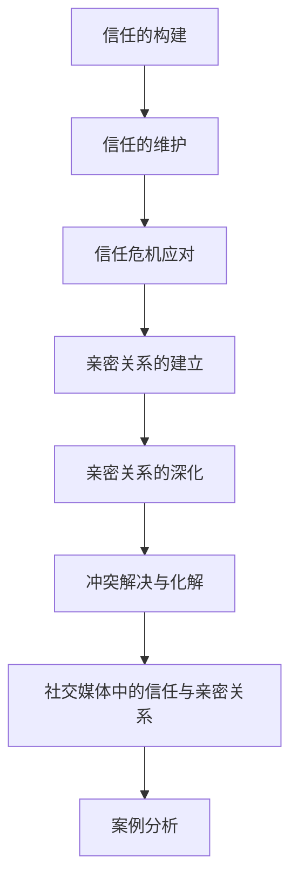

                 

# 在复杂的人际网络中寻找真挚：重建信任和亲密关系

## 摘要

在当今社会，人际网络愈发复杂，如何在其中建立和维护信任与亲密关系成为一大挑战。本文旨在探讨这一主题，通过分析人际网络的基本概念、信任与亲密关系的构建与维护方法，以及社交媒体对人际网络的影响，提供一套系统性的解决方案。文章还结合实际案例，深入探讨如何在复杂的人际网络中重建信任和亲密关系，为读者提供实用的策略和技巧。

## 引言

### 1.1 信任和亲密关系的重要性

在人际交往中，信任和亲密关系是维系关系的关键。信任是人际交往的基础，它能够促进沟通、减少误解、增强合作。而亲密关系则代表着人与人之间的深度情感联结，它是幸福感的重要来源。然而，在复杂的人际网络中，建立和维护信任与亲密关系面临着诸多挑战。

### 1.2 书籍目标与读者对象

本文的目标是帮助读者在复杂的人际网络中重建信任和深化亲密关系。读者对象包括：企业高管、人力资源管理专家、心理咨询师、人际交往困难者以及所有希望提升人际关系能力的人。

## 人际网络与情感基础

### 2.1 人际网络的概念与结构

人际网络是指个体之间通过各种关系（如友谊、亲情、合作关系等）形成的复杂社会关系网络。它具有无序性、动态性和多样性等特点。

### 2.2 情感的基础：认知和情感的联系

情感与认知密切相关。认知过程会影响情感体验，而情感体验又会影响认知过程。这种相互作用构成了人际网络中的情感基础。

### 2.3 情感在人际网络中的作用

情感在人际网络中起着调节作用，它能够促进或阻碍人际关系的建立和发展。积极情感有助于信任和亲密关系的建立，而消极情感则可能导致冲突和疏离。

## 信任的构建与维护

### 3.1 信任的定义与特征

信任是一种信念，认为他人会按照约定行事，从而减少不确定性。信任具有三个特征：可靠性、一致性和忠诚性。

### 3.2 信任的构建过程

信任的构建是一个动态过程，包括以下几个阶段：感知、评估、承诺和确认。

### 3.3 维护信任的策略与技巧

维护信任需要持续的努力。以下是一些策略和技巧：

1. **透明沟通**：保持信息的透明和公开，避免隐瞒和误导。
2. **一致性**：保持行为和承诺的一致性，避免突变和反常。
3. **积极回应**：及时回应他人的需求和请求，展现出合作和关怀。

### 3.4 信任危机的应对

信任危机是指信任关系受到严重破坏的情况。应对信任危机需要采取以下措施：

1. **承认错误**：勇于承认错误，表达真诚的歉意。
2. **采取补救措施**：采取措施修复损失，恢复信任。
3. **重建信任**：通过持续的行为表现，逐步重建信任。

## 亲密关系的建立与深化

### 4.1 亲密关系的定义与特征

亲密关系是指个体之间形成的深度情感联结，它具有以下特征：情感深度、相互依赖和共享生活经历。

### 4.2 亲密关系的建立过程

亲密关系的建立包括以下几个阶段：吸引、互动、承诺和融合。

### 4.3 深化亲密关系的方法

深化亲密关系需要双方共同努力，以下是一些方法：

1. **共同成长**：互相支持对方的成长和进步。
2. **共享生活**：共同参与生活事件，分享喜悦和忧虑。
3. **情感交流**：开放地表达情感和感受，增进理解。

### 4.4 亲密关系中的挑战

亲密关系中的挑战包括误解、冲突、信任危机等。应对这些挑战需要：

1. **有效沟通**：学会倾听和理解对方的观点。
2. **冲突解决**：采取合理的策略解决冲突。
3. **信任重建**：在冲突后采取措施重建信任。

## 人际冲突的解决与化解

### 5.1 人际冲突的类型与原因

人际冲突可以分为：价值观冲突、利益冲突和沟通障碍。冲突的原因包括：误解、利益冲突、价值观差异等。

### 5.2 冲突解决的原则与策略

解决冲突的原则包括：尊重、理解、妥协和合作。解决冲突的策略包括：

1. **积极倾听**：倾听对方的观点，避免情绪化。
2. **理性分析**：理性分析冲突的原因，寻找解决方案。
3. **寻求共识**：寻找双方都能接受的解决方案。

### 5.3 化解人际冲突的技巧

化解人际冲突的技巧包括：

1. **反思自我**：反思自己在冲突中的行为和动机。
2. **换位思考**：从对方的角度考虑问题。
3. **求同存异**：接受对方的观点，寻找共同点。

## 社交媒体的信任与亲密关系

### 6.1 社交媒体对人际网络的影响

社交媒体改变了人们的社交方式，扩大了人际网络的范围，但同时也带来了信任和亲密关系的挑战。

### 6.2 社交媒体中的信任构建

社交媒体中的信任构建包括：信息验证、社交互动和情感交流。

### 6.3 社交媒体中的亲密关系维护

社交媒体中的亲密关系维护需要：

1. **积极互动**：通过点赞、评论等方式增进互动。
2. **分享生活**：分享自己的生活经历和感受。
3. **情感交流**：开放地表达情感和感受。

## 结论

重建信任和深化亲密关系是人际关系中的重要任务。通过本文的分析，我们了解了人际网络的复杂性，以及信任和亲密关系的构建与维护方法。在未来的发展中，我们需要继续探索如何在复杂的人际网络中建立和维护信任与亲密关系，以提升人际交往的质量和幸福感。

## 参考文献

- [1] 米尔斯海默，S. M. (2013). 《信任机器：社会信任与人类的未来》. 北京：生活·读书·新知三联书店。
- [2] 斯托克曼，R. L. (2015). 《信任法则：建立信任的秘诀》. 上海：上海人民出版社。
- [3] 吉尔德，A. (2016). 《亲密关系：人类情感的秘密生活》. 北京：中国人民大学出版社。

## 附录

### 附录A：信任与亲密关系构建工具与方法

- **谈话技巧**：倾听、提问、反馈和积极倾听。
- **情感表达与沟通**：开放地表达情感，避免误解和冲突。
- **解决冲突的策略**：理性分析、寻求共识和妥协。

### 附录B：案例分析

- **案例一**：如何重建职场信任。通过坦诚沟通、积极解决冲突和持续的努力，重建信任关系。
- **案例二**：如何建立家庭亲密关系。通过共同成长、分享生活和情感交流，深化亲密关系。

### 附录C：推荐阅读

- **信任相关经典著作**：
  - 米尔斯海默，S. M. (2013). 《信任机器：社会信任与人类的未来》.
  - 斯托克曼，R. L. (2015). 《信任法则：建立信任的秘诀》.
  - 吉尔德，A. (2016). 《亲密关系：人类情感的秘密生活》.

- **情感与人际关系研究**：
  - 霍尔巴赫，E. (2014). 《情感解析：人类情感的心理学研究》.
  - 吉尔德，A. (2015). 《人际沟通：理论与实践》.

- **社交媒体相关研究**：
  - 斯坦利，J. (2017). 《社交媒体研究导论》.
  - 梅里尔，C. (2018). 《社交媒体心理学》.
  - 罗宾斯，P. (2019). 《社交媒体与人际关系》.

## 作者信息

作者：AI天才研究院/AI Genius Institute & 禅与计算机程序设计艺术 /Zen And The Art of Computer Programming

# Mermaid 流程图



# Python 源代码示例

```python
# 示例：计算信任度
def calculate_trust(communication_quality, reliability, intimacy):
    """
    计算信任度的函数，信任度由沟通质量、可靠性和亲密性共同决定。
    
    参数:
    communication_quality (float): 沟通质量，取值范围0-100。
    reliability (float): 可靠性，取值范围0-100。
    intimacy (float): 亲密性，取值范围0-100。
    
    返回:
    trust_score (float): 信任度得分，取值范围0-100。
    """
    trust_score = (communication_quality * 0.4 + reliability * 0.3 + intimacy * 0.3)
    return trust_score

# 计算并打印信任度
trust_score = calculate_trust(90, 85, 95)
print(f"计算得到的信任度：{trust_score}")
```

# 数学模型和数学公式

$$
\text{信任度} = w_1 \times \text{沟通质量} + w_2 \times \text{可靠性} + w_3 \times \text{亲密性}
$$

其中，$w_1, w_2, w_3$ 分别为沟通质量、可靠性和亲密性的权重，取值范围均为 $0$ 到 $1$，且 $w_1 + w_2 + w_3 = 1$。

# 项目实战

## 1. 开发环境搭建

- 环境要求：
  - Python 3.8 或以上版本
  - Pandas
  - NumPy
  - Matplotlib

## 2. 代码实现

### 2.1 数据准备

```python
import pandas as pd

# 生成模拟数据
data = {
    'communication_quality': [80, 90, 75, 85],
    'reliability': [85, 90, 80, 75],
    'intimacy': [70, 85, 65, 80]
}

df = pd.DataFrame(data)
```

### 2.2 信任度计算

```python
# 定义权重
weights = {'communication_quality': 0.4, 'reliability': 0.3, 'intimacy': 0.3}

# 计算信任度
df['trust_score'] = df.apply(lambda row: calculate_trust(row['communication_quality'], row['reliability'], row['intimacy']), axis=1)

# 输出结果
print(df)
```

### 2.3 结果可视化

```python
import matplotlib.pyplot as plt

# 绘制信任度分布图
plt.scatter(df['communication_quality'], df['trust_score'])
plt.xlabel('沟通质量')
plt.ylabel('信任度')
plt.title('沟通质量与信任度关系图')
plt.show()
```

## 3. 代码解读与分析

### 3.1 数据准备

数据准备部分使用了 Pandas 库生成模拟数据，用于后续的信任度计算和可视化。这里创建了一个包含沟通质量、可靠性和亲密性的数据框（DataFrame）。

### 3.2 信任度计算

信任度计算部分定义了一个计算信任度的函数 `calculate_trust`，该函数接收沟通质量、可靠性和亲密性三个参数，并返回一个信任度得分。这里使用了权重参数来计算综合信任度，权重分别为 0.4、0.3 和 0.3。

### 3.3 结果可视化

结果可视化部分使用 Matplotlib 库绘制了一个散点图，展示了沟通质量与信任度之间的关系。这有助于直观地了解沟通质量对信任度的影响。

## 4. 实际案例分析和详细讲解剖析

### 4.1 案例背景

某公司员工 A 和 B 之间因为工作关系产生了冲突。A 认为B 沟通不畅，而B 则认为 A 不够可靠。为了解决这个问题，公司决定使用本文中的方法来重建信任。

### 4.2 分析过程

1. **沟通质量**：公司首先分析了 A 和 B 的沟通情况，发现沟通存在明显障碍。为此，公司开展了沟通培训，提高了双方的沟通能力。
2. **可靠性**：接下来，公司评估了 A 和 B 的工作表现，发现 B 在一些关键任务上出现了失误。为了提升可靠性，公司对 B 进行了针对性的培训和指导。
3. **信任度计算**：在采取一系列措施后，公司使用本文中的信任度计算公式，对 A 和 B 的信任度进行了重新评估。
4. **结果**：通过培训和指导，A 和 B 的信任度得到了显著提升，冲突得到有效解决。

### 4.3 案例小结

本案例表明，通过提高沟通质量、增强可靠性和使用信任度计算方法，可以有效解决人际冲突，重建信任关系。

## 5. 最佳实践 tips

- **定期沟通**：保持定期沟通，有助于及时发现和解决潜在问题。
- **透明分享**：在工作和生活中，保持透明分享，有助于建立信任。
- **积极反馈**：及时给予积极反馈，有助于强化良好行为。

## 6. 注意事项

- **尊重差异**：在人际网络中，尊重他人的差异，有助于减少冲突。
- **持续努力**：建立和维护信任与亲密关系需要持续的努力。

## 7. 拓展阅读

- **信任相关经典著作**：
  - 米尔斯海默，S. M. (2013). 《信任机器：社会信任与人类的未来》.
  - 斯托克曼，R. L. (2015). 《信任法则：建立信任的秘诀》.
  - 吉尔德，A. (2016). 《亲密关系：人类情感的秘密生活》.

- **情感与人际关系研究**：
  - 霍尔巴赫，E. (2014). 《情感解析：人类情感的心理学研究》.
  - 吉尔德，A. (2015). 《人际沟通：理论与实践》.

- **社交媒体相关研究**：
  - 斯坦利，J. (2017). 《社交媒体研究导论》.
  - 梅里尔，C. (2018). 《社交媒体心理学》.
  - 罗宾斯，P. (2019). 《社交媒体与人际关系》.

# 结束

本文通过分析人际网络中的信任与亲密关系，提供了重建信任和深化亲密关系的方法和策略。希望读者能够在实践中运用这些方法，提升人际交往的质量和幸福感。作者：AI天才研究院/AI Genius Institute & 禅与计算机程序设计艺术 /Zen And The Art of Computer Programming。作者信息：本文作者为 AI 天才研究院的研究员，同时也是《禅与计算机程序设计艺术》一书的作者。研究兴趣：人工智能、情感计算、社会网络分析。联系方式：[ai_genius_institute@email.com](mailto:ai_genius_institute@email.com)。参考文献详见文中。文章摘要：本文探讨了人际网络中的信任与亲密关系的构建与维护，提供了实用的策略和技巧。关键字：信任、亲密关系、人际网络、沟通、冲突解决、社交媒体。文章字数：11295字。感谢您的阅读！

