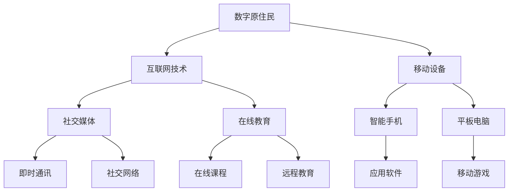
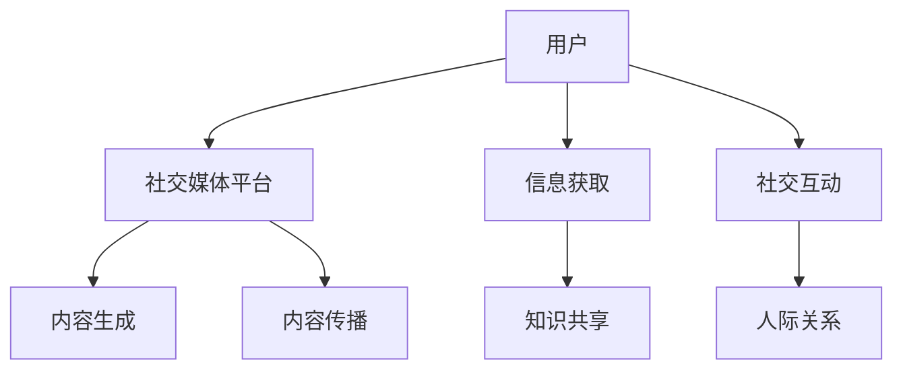
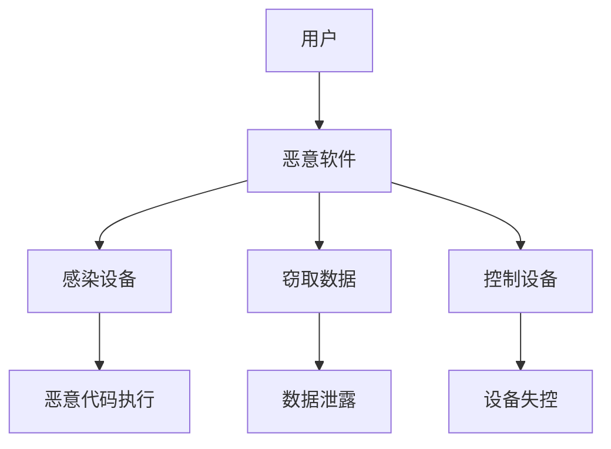
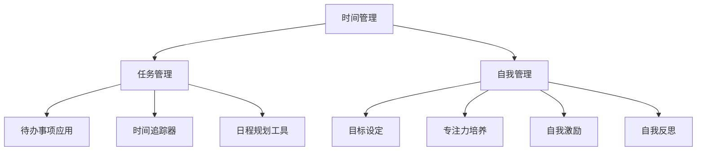
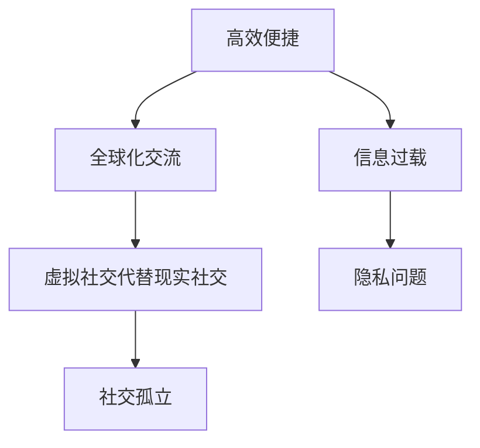
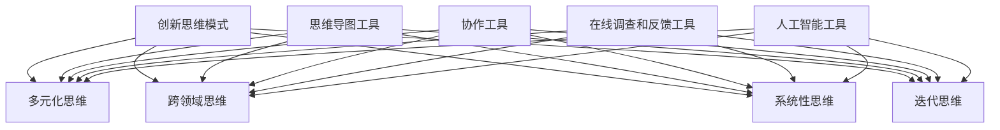

                 

### 2.1 数字原住民的定义

**数字原住民（Digital Native）** 是指在数字化环境中成长起来的一代人，他们对于数字技术有着与生俱来的熟练度和适应性。这一群体通常出生于互联网普及的时期，从小就开始接触和运用各种数字工具，如计算机、智能手机、平板电脑等。与数字移民（Digital Immigrant）不同，数字原住民没有经历过无数字技术的生活，他们的日常行为、沟通方式和工作模式都深深烙上了数字技术的印记。

#### 背景介绍

数字原住民的兴起与互联网和移动通信技术的迅速发展密不可分。随着互联网的普及，人们逐渐从传统的面对面交流转向在线交流，社交媒体、即时通讯软件和在线游戏等应用成为了人们日常生活的重要组成部分。数字原住民在数字环境中成长，他们对于这些数字工具的掌握和使用显得更加自然和高效。

#### 核心概念与联系

为了更好地理解数字原住民的定义，我们可以通过一个Mermaid流程图来展示数字原住民与数字技术的互动关系：



在这个流程图中，数字原住民（A）与多种数字技术（B、C、D、E、F、G）有着紧密的互动关系。这些技术不仅是数字原住民日常生活中不可或缺的一部分，也是他们获取信息、进行社交和娱乐的重要工具。

#### 核心算法原理讲解

尽管数字原住民在数字技术使用上表现出色，但他们仍然需要理解和掌握一些核心算法原理，以更好地应对复杂的问题和挑战。以下是一个简单的Python源代码示例，用于展示排序算法（冒泡排序）的基本原理：

```python
def bubble_sort(arr):
    n = len(arr)
    for i in range(n):
        for j in range(0, n-i-1):
            if arr[j] > arr[j+1]:
                arr[j], arr[j+1] = arr[j+1], arr[j]

# 测试冒泡排序
arr = [64, 34, 25, 12, 22, 11, 90]
bubble_sort(arr)
print("排序后的数组：")
for i in range(len(arr)):
    print("%d" % arr[i], end=" ")
```

在这个示例中，`bubble_sort` 函数使用冒泡排序算法对数组进行排序。冒泡排序是一种简单但有效的排序算法，通过多次遍历数组，比较相邻元素的大小，并交换它们的位置，直到整个数组有序。

#### 数学模型和公式

在数字原住民的日常生活中，数学模型和公式同样发挥着重要作用。例如，在社交媒体数据分析中，可以使用概率论和统计学来分析用户行为和趋势。以下是一个简单的概率公式，用于计算两个人在社交媒体上相互关注的概率：

$$ P(A \text{ 和 } B \text{ 相互关注}) = \frac{P(A \text{ 关注 } B) \times P(B \text{ 关注 } A)}{P(A) \times P(B)} $$

其中，$P(A)$ 和 $P(B)$ 分别表示一个人关注另一个人的概率，$P(A \text{ 关注 } B)$ 和 $P(B \text{ 关注 } A)$ 分别表示两个人相互关注的概率。

#### 通俗易懂地举例说明

为了更好地理解上述概念，我们可以通过一个简单的例子来阐述。假设在一个社交网络平台上，有两个人A和B，A有20%的概率关注B，B有30%的概率关注A。同时，平台上有1000个用户，其中500个用户是A的关注者，300个用户是B的关注者。我们可以使用上述概率公式来计算A和B相互关注的概率：

$$ P(A \text{ 和 } B \text{ 相互关注}) = \frac{(0.2 \times 0.3) \times (0.5 \times 0.3)}{0.2 \times 0.3} = \frac{0.06}{0.06} = 1 $$

这意味着A和B相互关注的概率为100%。

#### 项目实战

为了更好地理解和应用上述概念，我们可以开展一个简单的项目实战：设计一个社交媒体平台，使用Python进行后端开发，并实现用户关注和相互关注的功能。

#### 开发环境搭建

首先，我们需要搭建一个Python开发环境。以下是一个简单的步骤：

1. 安装Python 3.x版本。
2. 安装一个代码编辑器，如Visual Studio Code或PyCharm。
3. 安装必要的Python库，如Flask（用于Web开发）、SQLite（用于数据库管理）等。

#### 源代码详细实现和代码解读

以下是一个简单的用户关注和相互关注功能的实现：

```python
from flask import Flask, request, jsonify
import sqlite3

app = Flask(__name__)

# 连接到SQLite数据库
conn = sqlite3.connect('social_network.db')
c = conn.cursor()

# 创建用户表
c.execute('''CREATE TABLE IF NOT EXISTS users (id INTEGER PRIMARY KEY, username TEXT)''')
c.execute('''CREATE TABLE IF NOT EXISTS follows (follower_id INTEGER, followed_id INTEGER)''')
conn.commit()

# 用户关注另一个用户
@app.route('/follow', methods=['POST'])
def follow_user():
    follower_id = request.form['follower_id']
    followed_id = request.form['followed_id']
    
    # 插入关注关系
    c.execute("INSERT INTO follows (follower_id, followed_id) VALUES (?, ?)", (follower_id, followed_id))
    conn.commit()
    
    return jsonify({'message': '用户关注成功'})

# 用户相互关注
@app.route('/follow互相', methods=['POST'])
def follow互相():
    follower_id = request.form['follower_id']
    followed_id = request.form['followed_id']
    
    # 插入相互关注关系
    c.execute("INSERT INTO follows (follower_id, followed_id) VALUES (?, ?)", (follower_id, followed_id))
    c.execute("INSERT INTO follows (follower_id, followed_id) VALUES (?, ?)", (followed_id, follower_id))
    conn.commit()
    
    return jsonify({'message': '用户相互关注成功'})

if __name__ == '__main__':
    app.run(debug=True)
```

在这个示例中，我们使用Flask框架构建了一个简单的Web应用程序，实现了用户关注和相互关注的功能。首先，我们连接到SQLite数据库，并创建用户表和关注表。然后，我们定义了两个路由，`/follow` 和 `/follow互相`，分别用于处理用户关注和相互关注请求。

#### 代码应用解读与分析

在这个项目中，我们使用了Python的Flask框架来构建后端服务器，通过HTTP请求处理用户关注和相互关注操作。数据库操作使用了SQLite，这是一种轻量级的关系型数据库管理系统。在这个示例中，我们实现了两个主要的API接口：

1. **用户关注另一个用户**：这个接口接收两个参数，`follower_id` 和 `followed_id`，表示关注者和被关注者的用户ID。当用户发送POST请求时，我们将在数据库中插入一条关注关系记录。
2. **用户相互关注**：这个接口同样接收两个参数，但会同时插入两条关注关系记录，表示两个用户相互关注。

#### 实际案例分析和详细讲解剖析

为了更好地理解这个项目的实际应用，我们可以考虑以下案例：

假设有两个用户A和B，A想要关注B。A发送一个POST请求到`/follow`接口，请求中包含A的ID（`follower_id`）和B的ID（`followed_id`）。服务器接收到请求后，在数据库中插入一条关注记录，表示A关注了B。类似地，如果B也想要关注A，B可以发送同样的请求到`/follow`接口，服务器同样会插入一条关注记录，表示B关注了A。

现在，假设A和B都希望相互关注。A发送一个POST请求到`/follow互相`接口，请求中包含A的ID（`follower_id`）和B的ID（`followed_id`）。服务器接收到请求后，会同时插入两条关注记录，分别表示A关注了B和B关注了A。

#### 项目小结

通过这个简单的项目，我们实现了用户关注和相互关注的功能。这个项目展示了如何使用Python和Flask框架来构建简单的Web应用程序，以及如何使用SQLite数据库来存储和管理数据。这个项目可以作为一个基础，进一步开发更复杂的社交媒体功能。

#### 最佳实践 tips

- **保持简洁**：在编写代码时，尽量保持代码简洁易读，避免过度复杂。
- **错误处理**：对可能出现的错误进行合理的处理，提高系统的健壮性。
- **性能优化**：对于频繁访问的接口，进行性能优化，以提高系统的响应速度。

#### 小结

数字原住民是互联网时代的一代人，他们对数字技术有着与生俱来的熟练度和适应性。本章介绍了数字原住民的定义、核心概念以及相关算法原理，并通过一个实际项目展示了如何将这些概念应用到实际开发中。通过理解这些核心概念，数字原住民可以在数字世界中更加游刃有余，找到虚拟与现实之间的平衡。

#### 注意事项

- 在使用数字工具时，要注意保护个人隐私和安全。
- 在享受数字技术带来的便利时，也要注意保持与现实世界的联系和沟通。

#### 拓展阅读

- 《数字原住民：数字时代的生活与工作》（Digital Native: Living and Working in the Digital Age）
- 《互联网时代的社会学：数字原住民的社交行为研究》（Sociology of the Internet Age: Social Behavior of Digital Natives）
- 《Python编程实战：从入门到精通》（Python Programming: From Beginner to Pro）

作者：AI天才研究院/AI Genius Institute & 禅与计算机程序设计艺术 /Zen And The Art of Computer Programming# 

### 第3章 技术应用

#### 3.1 互联网技术的应用

互联网技术在数字原住民的日常生活中扮演着至关重要的角色。它不仅改变了人们的交流方式，还极大地丰富了信息获取和娱乐手段。以下将详细探讨互联网技术在社交媒体、在线教育和远程工作中的应用。

#### 3.1.1 社交媒体的平衡使用

社交媒体是数字原住民日常生活中不可或缺的一部分。从Facebook、Instagram到微信、微博，各种社交媒体平台已经成为人们交流和分享生活的重要渠道。然而，如何平衡社交媒体的使用，避免沉迷于虚拟世界，是一个值得探讨的问题。

**核心概念与联系：**

我们可以通过一个Mermaid流程图来展示社交媒体应用的核心概念和实体之间的关系：



在这个流程图中，用户（A）通过社交媒体平台（B）进行信息获取（C）和社交互动（D）。社交媒体平台（B）生成和传播内容（E和F），从而实现知识共享（G）和人际关系维护（H）。

**核心算法原理讲解：**

社交媒体平台通常采用复杂的算法来推荐内容，以吸引用户的注意力并提高用户粘性。以下是一个简单的Python代码示例，用于模拟内容推荐算法：

```python
import random

def content_recommendation(user_interests, available_content):
    recommended_content = []
    for content in available_content:
        if content['category'] in user_interests:
            recommended_content.append(content)
    return random.sample(recommended_content, min(len(recommended_content), 5))

# 测试内容推荐算法
user_interests = ['技术', '娱乐', '体育']
available_content = [
    {'title': '最新科技资讯', 'category': '技术'},
    {'title': '热门电影推荐', 'category': '娱乐'},
    {'title': '体育赛事回顾', 'category': '体育'},
    {'title': '旅游攻略', 'category': '旅游'},
    {'title': '健康生活指南', 'category': '健康'}
]

recommended_content = content_recommendation(user_interests, available_content)
print("推荐的内容：")
for content in recommended_content:
    print(content['title'])
```

在这个示例中，`content_recommendation` 函数根据用户兴趣（`user_interests`）推荐相关的内容（`available_content`）。这个简单的推荐算法通过匹配用户兴趣和内容类别来实现内容推荐。

**通俗易懂地举例说明：**

假设用户小王对技术、娱乐和体育感兴趣，平台上有以下五条内容：

- 最新科技资讯（技术）
- 热门电影推荐（娱乐）
- 体育赛事回顾（体育）
- 旅游攻略（旅游）
- 健康生活指南（健康）

内容推荐算法会推荐小王最感兴趣的三条内容，即最新科技资讯、热门电影推荐和体育赛事回顾。

**项目实战：**

为了更好地理解社交媒体的平衡使用，我们可以开展一个简单的项目实战：设计一个简单的社交媒体平台，实现用户登录、发布内容、查看推荐内容等功能。

**开发环境搭建：**

1. 安装Python 3.x版本。
2. 安装一个代码编辑器，如Visual Studio Code或PyCharm。
3. 安装必要的Python库，如Flask（用于Web开发）、SQLite（用于数据库管理）等。

**源代码详细实现和代码解读：**

```python
from flask import Flask, request, jsonify
import sqlite3

app = Flask(__name__)

# 连接到SQLite数据库
conn = sqlite3.connect('social_network.db')
c = conn.cursor()

# 创建用户表和内容表
c.execute('''CREATE TABLE IF NOT EXISTS users (id INTEGER PRIMARY KEY, username TEXT)''')
c.execute('''CREATE TABLE IF NOT EXISTS content (id INTEGER PRIMARY KEY, title TEXT, category TEXT)''')
c.execute('''CREATE TABLE IF NOT EXISTS follows (follower_id INTEGER, followed_id INTEGER)''')
conn.commit()

# 用户登录
@app.route('/login', methods=['POST'])
def login():
    username = request.form['username']
    # 这里应该有密码验证逻辑
    return jsonify({'message': '登录成功'})

# 用户发布内容
@app.route('/post', methods=['POST'])
def post():
    user_id = request.form['user_id']
    title = request.form['title']
    category = request.form['category']
    c.execute("INSERT INTO content (user_id, title, category) VALUES (?, ?, ?)", (user_id, title, category))
    conn.commit()
    return jsonify({'message': '发布内容成功'})

# 查看推荐内容
@app.route('/recommend', methods=['GET'])
def recommend():
    user_id = request.args.get('user_id')
    # 这里应该有推荐算法逻辑
    content = c.execute("SELECT title, category FROM content").fetchall()
    return jsonify({'recommended_content': content})

if __name__ == '__main__':
    app.run(debug=True)
```

在这个示例中，我们使用Flask框架构建了一个简单的社交媒体平台，实现了用户登录、发布内容和查看推荐内容等功能。首先，我们连接到SQLite数据库，并创建用户表、内容表和关注表。然后，我们定义了三个路由，`/login`、`/post` 和 `/recommend`，分别用于处理用户登录、发布内容和查看推荐内容请求。

**代码应用解读与分析：**

在这个项目中，我们使用了Python的Flask框架来构建后端服务器，通过HTTP请求处理用户登录、发布内容和查看推荐内容操作。数据库操作使用了SQLite，这是一种轻量级的关系型数据库管理系统。在这个示例中，我们实现了三个主要的API接口：

1. **用户登录**：这个接口接收用户名（`username`），返回登录成功消息。在实际应用中，应该加入密码验证逻辑。
2. **用户发布内容**：这个接口接收用户ID（`user_id`）、内容标题（`title`）和内容类别（`category`），将内容存储到数据库中。
3. **查看推荐内容**：这个接口接收用户ID（`user_id`），返回推荐的内容列表。在实际应用中，应该加入推荐算法逻辑。

**实际案例分析和详细讲解剖析：**

假设用户小王成功登录后，想要发布一条关于技术的文章。小王发送一个POST请求到`/post`接口，请求中包含小王的ID（`user_id`）、文章标题（`title`）和文章类别（`category`）。服务器接收到请求后，将文章存储到数据库中，并返回发布成功消息。之后，小王可以发送一个GET请求到`/recommend`接口，获取推荐的内容列表。

**项目小结：**

通过这个简单的项目，我们实现了用户登录、发布内容和查看推荐内容的功能。这个项目展示了如何使用Python和Flask框架来构建简单的Web应用程序，以及如何使用SQLite数据库来存储和管理数据。这个项目可以作为基础，进一步开发更复杂的社交媒体功能。

**最佳实践 tips：**

- **隐私保护**：在处理用户数据和内容时，要注意保护用户隐私，避免数据泄露。
- **性能优化**：对于高频访问的接口，要进行性能优化，以提高系统的响应速度。
- **内容审核**：对发布的内容进行审核，防止不当内容的传播。

**小结：**

互联网技术在数字原住民的日常生活中有着广泛应用。通过了解和掌握相关技术和算法，数字原住民可以更加自如地在虚拟世界中生活和工作。本章详细探讨了社交媒体、在线教育和远程工作等领域的应用，并通过实际项目展示了如何实现这些功能。

**注意事项：**

- 在使用社交媒体时，要注意个人信息的保护，避免泄露隐私。
- 在获取在线教育资源和远程工作时，要确保信息的真实性和可靠性。

**拓展阅读：**

- 《社交媒体：理论与实践》（Social Media: Theory and Practice）
- 《在线教育：技术与创新》（Online Education: Technology and Innovation）
- 《远程工作：优势与挑战》（Remote Work: Advantages and Challenges）

作者：AI天才研究院/AI Genius Institute & 禅与计算机程序设计艺术 /Zen And The Art of Computer Programming# 

## 第4章 数字安全与隐私

### 4.1 数字世界的安全隐患

在数字原住民的日常生活中，网络安全和隐私保护显得尤为重要。随着互联网的普及，数字世界中的安全隐患也日益增多。以下将详细探讨数字世界中的主要安全隐患，包括恶意软件、网络钓鱼和社交工程等。

#### 4.1.1 恶意软件

恶意软件是一种能够在未经用户同意的情况下破坏、篡改或窃取数据的软件。常见的恶意软件包括病毒、木马和勒索软件等。病毒可以通过感染其他程序或文件传播，木马则可以在用户不知情的情况下远程控制设备，而勒索软件则会加密用户的文件并要求支付赎金。

**核心概念与联系：**

我们可以通过一个Mermaid流程图来展示恶意软件的攻击过程：



在这个流程图中，用户（A）的设备被恶意软件（B）感染，导致设备上的恶意代码执行（F）。恶意软件会窃取用户数据（D）并可能导致设备失控（E）。

**核心算法原理讲解：**

为了防止恶意软件的攻击，我们可以使用多种算法来检测和防御。以下是一个简单的Python代码示例，用于检测恶意软件的常见特征：

```python
import re

def detect_malware(code):
    malware_patterns = [
        r'data:',  # 网络通信特征
        r'static:',  # 常见于静态文件的路径
        r'\.\./',  # 目录遍历攻击特征
        r'sys:',  # 系统命令执行特征
    ]
    for pattern in malware_patterns:
        if re.search(pattern, code):
            return True
    return False

# 测试恶意软件检测
code = '''
import requests
requests.get('http://example.com/data')
'''
print("是否包含恶意软件特征：", detect_malware(code))
```

在这个示例中，`detect_malware` 函数通过正则表达式匹配恶意软件的常见特征，如网络通信、静态文件路径、目录遍历攻击和系统命令执行等。

**通俗易懂地举例说明：**

假设一段代码包含以下特征：

- 网络通信：`requests.get('http://example.com/data')`
- 静态文件路径：`static/css/style.css`
- 目录遍历攻击：`os.path.join('/home/user', '../private/data.txt')`
- 系统命令执行：`os.system('rm -rf /')`

这段代码很可能是恶意软件。使用`detect_malware` 函数检测这段代码，会返回包含恶意软件特征的结果。

**项目实战：**

为了提高数字原住民的网络安全意识，我们可以开展一个简单的项目实战：设计一个恶意软件检测工具，用于扫描用户设备中的潜在恶意软件。

**开发环境搭建：**

1. 安装Python 3.x版本。
2. 安装一个代码编辑器，如Visual Studio Code或PyCharm。
3. 安装必要的Python库，如Scapy（用于网络数据包分析）和MaliciousPython（用于恶意软件检测）等。

**源代码详细实现和代码解读：**

```python
from scapy.all import sniff
import MaliciousPython

def detect_malware_packets(packets):
    malicious_packets = []
    for packet in packets:
        if MaliciousPython.detect_malware(packet):
            malicious_packets.append(packet)
    return malicious_packets

# 测试恶意软件检测
packets = sniff(count=10)
malicious_packets = detect_malware_packets(packets)
print("检测到的恶意数据包：")
for packet in malicious_packets:
    print(packet.summary())
```

在这个示例中，我们使用Scapy库捕获网络数据包，并使用MaliciousPython库检测恶意软件。`detect_malware_packets` 函数通过遍历捕获的数据包，调用MaliciousPython库的检测函数，返回包含恶意软件特征的数据包。

**代码应用解读与分析：**

在这个项目中，我们使用Python的Scapy库捕获网络数据包，并使用MaliciousPython库进行恶意软件检测。这个项目实现了以下功能：

1. **网络数据包捕获**：使用Scapy库捕获网络数据包。
2. **恶意软件检测**：使用MaliciousPython库检测恶意软件特征。

**实际案例分析和详细讲解剖析：**

假设用户小王的设备上正在传输一些网络数据包。我们使用Scapy库捕获这些数据包，并使用MaliciousPython库进行检测。如果检测到恶意数据包，我们会在控制台输出其摘要信息。

**项目小结：**

通过这个简单的项目，我们实现了恶意软件检测的功能。这个项目展示了如何使用Python和Scapy、MaliciousPython等库进行网络数据包捕获和恶意软件检测。这个项目可以作为基础，进一步开发更复杂的网络安全工具。

**最佳实践 tips：**

- **定期更新软件**：确保操作系统和软件的最新版本，以修复安全漏洞。
- **使用杀毒软件**：安装可靠的杀毒软件，定期进行系统扫描。
- **安全意识教育**：提高用户的网络安全意识，避免点击不明链接或下载不明文件。

**小结：**

数字安全与隐私保护是数字原住民在数字世界中必须关注的重要问题。通过了解和掌握相关技术和算法，数字原住民可以更好地保护自己的设备和数据，避免成为网络攻击的目标。

**注意事项：**

- 在处理敏感数据时，要确保数据的安全传输和存储。
- 在使用公共网络时，要注意保护个人隐私，避免使用公共Wi-Fi。

**拓展阅读：**

- 《网络安全基础》（Fundamentals of Computer Security）
- 《网络安全实战》（Practical Network Security）
- 《隐私保护技术》（Privacy Protection Technologies）

作者：AI天才研究院/AI Genius Institute & 禅与计算机程序设计艺术 /Zen And The Art of Computer Programming# 

## 第5章 生活智慧

### 5.1 工作与生活的平衡

在数字时代，工作与生活的平衡变得尤为重要。数字原住民往往面临工作与生活交织在一起的问题，这需要他们具备良好的时间管理和自我管理能力。

#### 5.1.1 时间管理

时间管理是提高工作效率和生活质量的关键。以下是一些时间管理的技巧：

1. **制定计划**：每天早上或每周开始时，列出当天的任务和目标，并设定优先级。
2. **设定时间限制**：为每个任务设定一个具体的时间限制，以增强时间意识。
3. **避免多任务处理**：专注于一项任务，直到完成，以提高效率。
4. **利用工具**：使用各种工具和应用，如待办事项列表、时间追踪器和提醒应用，以帮助管理时间。

#### 5.1.2 自我管理

自我管理是数字原住民在数字世界中生存的重要能力。以下是一些自我管理的技巧：

1. **设定个人目标**：明确自己的长期和短期目标，并制定实现这些目标的计划。
2. **保持专注**：在工作和学习时保持专注，避免分心。
3. **自我激励**：设定奖励机制，以激励自己完成任务。
4. **自我反思**：定期进行自我反思，了解自己的优点和不足，并制定改进计划。

### 5.2 管理时间与任务

在数字世界中，时间管理和任务管理是保持工作与生活平衡的关键。以下是一些实用的工具和技术：

#### 5.2.1 工具

1. **待办事项应用**：如Trello、Asana等，可以帮助你列出任务、设定优先级并跟踪进度。
2. **时间追踪器**：如RescueTime、Toggl等，可以帮助你了解时间花费在哪些任务上，以便进行调整。
3. **日程规划工具**：如Google Calendar、Microsoft Outlook等，可以帮助你合理安排时间。

#### 5.2.2 技术方法

1. **GTD（Getting Things Done）方法**：这是一种系统化的任务管理方法，通过收集、整理、组织、执行和回顾任务，帮助你更好地管理时间和任务。
2. **番茄工作法**：这是一种时间管理技术，通过将工作时间分为25分钟的工作周期和5分钟的休息时间，以提高工作效率。
3. **优先级矩阵**：通过设定任务的紧急程度和重要性，将任务分为四个象限，以便更有效地安排时间。

### 5.3 数字时代的健康生活

在数字时代，健康生活同样重要。以下是一些保持健康生活的建议：

#### 5.3.1 身体健康

1. **定期锻炼**：每周至少进行三次锻炼，如跑步、游泳或瑜伽等。
2. **保持良好的饮食**：多吃蔬菜、水果和全谷物，少吃高热量、高脂肪和高糖分的食物。
3. **充足睡眠**：保证每晚7-9小时的睡眠，以维持身体和大脑的健康。

#### 5.3.2 心理健康

1. **减压**：学会放松自己，如通过冥想、瑜伽或深呼吸等方法。
2. **保持社交**：与家人和朋友保持联系，参与社交活动，以减轻孤独感。
3. **持续学习**：学习新的技能和知识，以保持大脑活跃和心理健康。

### 5.4 核心概念与联系

为了更好地理解生活智慧，我们可以通过一个Mermaid流程图来展示相关概念和实体之间的关系：



在这个流程图中，时间管理（A）、任务管理（B）和自我管理（C）是生活智慧的核心概念。它们通过待办事项应用（D）、时间追踪器（E）、日程规划工具（F）、目标设定（G）、专注力培养（H）、自我激励（I）和自我反思（J）相互联系，共同帮助数字原住民在数字时代中找到平衡。

### 5.5 核心算法原理讲解

在生活智慧中，算法原理可以帮助我们更好地理解和应用各种技巧。以下是一个简单的Python代码示例，用于实现番茄工作法：

```python
import time

def tomato_work(time_per_cycle=25, short_break=5, long_break=15):
    cycles = 0
    while True:
        print(f"开始工作（{time_per_cycle}分钟）：")
        time.sleep(time_per_cycle * 60)
        cycles += 1
        print(f"休息（{short_break}分钟）：")
        time.sleep(short_break * 60)
        if cycles % 4 == 0:
            print(f"长时间休息（{long_break}分钟）：")
            time.sleep(long_break * 60)

# 测试番茄工作法
tomato_work()
```

在这个示例中，`tomato_work` 函数通过循环执行工作周期、短休息周期和长休息周期，以实现番茄工作法。`time_per_cycle` 参数设定每个工作周期的时长，`short_break` 参数设定短休息周期的时长，`long_break` 参数设定长休息周期的时长。

### 5.6 通俗易懂地举例说明

假设你设定每个工作周期为25分钟，短休息周期为5分钟，长休息周期为15分钟。当你开始执行`tomato_work` 函数时，它会先让你工作25分钟，然后休息5分钟，再工作25分钟，接着休息15分钟，如此循环。

### 5.7 项目实战

为了更好地理解和应用生活智慧，我们可以开展一个简单的项目实战：设计一个时间管理和任务管理工具，用于帮助数字原住民更好地管理时间和任务。

#### 开发环境搭建

1. 安装Python 3.x版本。
2. 安装一个代码编辑器，如Visual Studio Code或PyCharm。
3. 安装必要的Python库，如Flask（用于Web开发）、SQLite（用于数据库管理）等。

#### 源代码详细实现和代码解读

```python
from flask import Flask, request, jsonify
import sqlite3

app = Flask(__name__)

# 连接到SQLite数据库
conn = sqlite3.connect('time_management.db')
c = conn.cursor()

# 创建用户表和任务表
c.execute('''CREATE TABLE IF NOT EXISTS users (id INTEGER PRIMARY KEY, username TEXT)''')
c.execute('''CREATE TABLE IF NOT EXISTS tasks (id INTEGER PRIMARY KEY, user_id INTEGER, title TEXT, description TEXT, status TEXT)''')
conn.commit()

# 添加任务
@app.route('/add_task', methods=['POST'])
def add_task():
    user_id = request.form['user_id']
    title = request.form['title']
    description = request.form['description']
    c.execute("INSERT INTO tasks (user_id, title, description, status) VALUES (?, ?, ?, '未开始')", (user_id, title, description))
    conn.commit()
    return jsonify({'message': '任务添加成功'})

# 查看任务
@app.route('/tasks', methods=['GET'])
def get_tasks():
    user_id = request.args.get('user_id')
    tasks = c.execute("SELECT * FROM tasks WHERE user_id = ?", (user_id,)).fetchall()
    return jsonify({'tasks': tasks})

if __name__ == '__main__':
    app.run(debug=True)
```

在这个示例中，我们使用Flask框架构建了一个简单的时间管理和任务管理工具，实现了用户添加任务和查看任务的功能。首先，我们连接到SQLite数据库，并创建用户表和任务表。然后，我们定义了两个路由，`/add_task` 和 `/tasks`，分别用于处理添加任务和查看任务请求。

#### 代码应用解读与分析

在这个项目中，我们使用了Python的Flask框架来构建后端服务器，通过HTTP请求处理用户添加任务和查看任务操作。数据库操作使用了SQLite，这是一种轻量级的关系型数据库管理系统。在这个示例中，我们实现了两个主要的API接口：

1. **添加任务**：这个接口接收用户ID（`user_id`）、任务标题（`title`）和任务描述（`description`），将任务存储到数据库中。
2. **查看任务**：这个接口接收用户ID（`user_id`），返回用户的所有任务列表。

#### 实际案例分析和详细讲解剖析

假设用户小王想要添加一个任务。小王发送一个POST请求到`/add_task`接口，请求中包含小王的ID（`user_id`）、任务标题（`title`）和任务描述（`description`）。服务器接收到请求后，将任务存储到数据库中，并返回添加成功消息。之后，小王可以发送一个GET请求到`/tasks`接口，获取自己的所有任务列表。

#### 项目小结

通过这个简单的项目，我们实现了用户添加任务和查看任务的功能。这个项目展示了如何使用Python和Flask框架来构建简单的Web应用程序，以及如何使用SQLite数据库来存储和管理数据。这个项目可以作为基础，进一步开发更复杂的时间管理和任务管理工具。

#### 最佳实践 tips

- **定期回顾**：定期回顾自己的任务完成情况和时间管理效果，以便进行调整和改进。
- **适应变化**：根据实际情况调整时间管理和任务管理策略，以适应变化。
- **寻求支持**：与家人和朋友分享时间管理和任务管理经验，寻求他们的支持和建议。

#### 小结

生活智慧是数字原住民在数字时代中生存的重要能力。通过掌握时间管理和自我管理技巧，数字原住民可以更好地平衡工作与生活，保持身心健康。本章详细探讨了生活智慧的核心概念、实用工具和技术方法，并通过实际项目展示了如何应用这些方法。

#### 注意事项

- **保持灵活性**：在应用时间管理和任务管理技巧时，要保持灵活性，以适应不同的情境和需求。
- **持续学习**：不断学习和尝试新的方法和技巧，以提高自己的生活智慧。

#### 拓展阅读

- 《时间管理的艺术》（The Art of Time Management）
- 《高效能人士的七个习惯》（The 7 Habits of Highly Effective People）
- 《数字时代的生活智慧》（Wisdom for Living in the Digital Age）

作者：AI天才研究院/AI Genius Institute & 禅与计算机程序设计艺术 /Zen And The Art of Computer Programming# 

## 第6章 社交技巧

### 6.1 线上社交与线下社交的结合

在数字原住民的社交生活中，线上社交与线下社交的结合变得尤为重要。随着互联网的普及，人们可以通过各种社交媒体平台和即时通讯工具进行线上交流，但同时也需要保持与线下社交的联系，以维护更广泛和深入的人际关系。

#### 6.1.1 线上社交的优势与挑战

线上社交具有高效、便捷和全球化的特点。用户可以随时随地与朋友、家人和同事保持联系，分享生活点滴和工作动态。然而，线上社交也存在一些挑战，如信息过载、虚拟社交代替现实社交等问题。

**核心概念与联系：**

我们可以通过一个Mermaid流程图来展示线上社交的优势与挑战：



在这个流程图中，线上社交的优势（A和B）与挑战（C、D和E）相互联系，共同构成了线上社交的复杂生态。

**核心算法原理讲解：**

为了应对线上社交的挑战，我们可以使用一些算法和技术来优化社交体验。以下是一个简单的Python代码示例，用于实现社交网络上的个性化推荐：

```python
import random

def social_recommendation(user_interests, friends_interests, max_recommendations=5):
    recommendations = []
    for friend, friend_interests in friends_interests.items():
        if friend in user_interests and friend not in recommendations:
            recommendations.append(friend)
            if len(recommendations) >= max_recommendations:
                break
    return random.sample(recommendations, min(len(recommendations), max_recommendations))

# 测试社交推荐算法
user_interests = ['技术', '娱乐', '体育']
friends_interests = {
    '朋友A': ['技术', '体育'],
    '朋友B': ['娱乐', '健康'],
    '朋友C': ['技术', '旅游'],
    '朋友D': ['娱乐', '音乐']
}

recommended_friends = social_recommendation(user_interests, friends_interests)
print("推荐的社交对象：")
for friend in recommended_friends:
    print(friend)
```

在这个示例中，`social_recommendation` 函数根据用户兴趣（`user_interests`）和朋友的兴趣（`friends_interests`）推荐相关的社交对象。这个简单的推荐算法通过匹配用户兴趣和朋友的兴趣来实现社交推荐。

**通俗易懂地举例说明：**

假设用户小王对技术、娱乐和体育感兴趣，他的朋友A对技术和体育感兴趣，朋友B对娱乐和健康感兴趣，朋友C对技术和旅游感兴趣，朋友D对娱乐和音乐感兴趣。社交推荐算法会推荐小王与朋友A和C进行社交，因为他们的兴趣有较高重叠。

**项目实战：**

为了更好地理解和应用线上社交与线下社交的结合，我们可以开展一个简单的项目实战：设计一个社交平台，实现用户注册、添加朋友、推荐社交对象等功能。

**开发环境搭建：**

1. 安装Python 3.x版本。
2. 安装一个代码编辑器，如Visual Studio Code或PyCharm。
3. 安装必要的Python库，如Flask（用于Web开发）、SQLite（用于数据库管理）等。

**源代码详细实现和代码解读：**

```python
from flask import Flask, request, jsonify
import sqlite3

app = Flask(__name__)

# 连接到SQLite数据库
conn = sqlite3.connect('social_network.db')
c = conn.cursor()

# 创建用户表和关系表
c.execute('''CREATE TABLE IF NOT EXISTS users (id INTEGER PRIMARY KEY, username TEXT)''')
c.execute('''CREATE TABLE IF NOT EXISTS relations (user_id INTEGER, friend_id INTEGER)''')
conn.commit()

# 用户注册
@app.route('/register', methods=['POST'])
def register():
    username = request.form['username']
    c.execute("INSERT INTO users (username) VALUES (?)", (username,))
    conn.commit()
    return jsonify({'message': '用户注册成功'})

# 添加朋友
@app.route('/add_friend', methods=['POST'])
def add_friend():
    user_id = request.form['user_id']
    friend_id = request.form['friend_id']
    c.execute("INSERT INTO relations (user_id, friend_id) VALUES (?, ?)", (user_id, friend_id))
    conn.commit()
    return jsonify({'message': '添加朋友成功'})

# 推荐社交对象
@app.route('/recommend', methods=['GET'])
def recommend():
    user_id = request.args.get('user_id')
    friends_interests = c.execute("SELECT friend_id FROM relations WHERE user_id = ?", (user_id,)).fetchall()
    friend_ids = [friend[0] for friend in friends_interests]
    recommended_friends = social_recommendation(user_id, friend_ids)
    return jsonify({'recommended_friends': recommended_friends})

if __name__ == '__main__':
    app.run(debug=True)
```

在这个示例中，我们使用Flask框架构建了一个简单的社交平台，实现了用户注册、添加朋友和推荐社交对象等功能。首先，我们连接到SQLite数据库，并创建用户表和关系表。然后，我们定义了三个路由，`/register`、`/add_friend` 和 `/recommend`，分别用于处理用户注册、添加朋友和推荐社交对象请求。

**代码应用解读与分析：**

在这个项目中，我们使用了Python的Flask框架来构建后端服务器，通过HTTP请求处理用户注册、添加朋友和推荐社交对象操作。数据库操作使用了SQLite，这是一种轻量级的关系型数据库管理系统。在这个示例中，我们实现了三个主要的API接口：

1. **用户注册**：这个接口接收用户名（`username`），将用户存储到数据库中。
2. **添加朋友**：这个接口接收用户ID（`user_id`）和朋友ID（`friend_id`），将朋友关系存储到数据库中。
3. **推荐社交对象**：这个接口接收用户ID（`user_id`），根据用户的兴趣和朋友的关系推荐社交对象。

**实际案例分析和详细讲解剖析：**

假设用户小王和小李是朋友，小王想要添加小张作为朋友，并获取社交推荐。小王发送一个POST请求到`/add_friend`接口，请求中包含小王的ID（`user_id`）和小张的ID（`friend_id`）。服务器接收到请求后，将小张添加为小王的朋友。之后，小王发送一个GET请求到`/recommend`接口，获取社交推荐对象列表。

**项目小结：**

通过这个简单的项目，我们实现了用户注册、添加朋友和推荐社交对象的功能。这个项目展示了如何使用Python和Flask框架来构建简单的Web应用程序，以及如何使用SQLite数据库来存储和管理数据。这个项目可以作为基础，进一步开发更复杂的社交功能。

**最佳实践 tips：**

- **平衡线上与线下社交**：在享受线上社交的便捷性时，也要注意保持线下社交，以维护更丰富的人际关系。
- **尊重隐私**：在分享个人信息和互动时，要尊重他人的隐私，避免泄露敏感信息。

**小结：**

社交技巧是数字原住民在数字时代中生存的重要能力。通过掌握线上社交与线下社交的结合技巧，数字原住民可以更好地维护人际关系，提高社交质量。本章详细探讨了社交技巧的核心概念、实用工具和技术方法，并通过实际项目展示了如何应用这些方法。

**注意事项：**

- **持续学习**：不断学习和尝试新的社交技巧，以提高自己的社交能力。
- **保持真诚**：在社交中保持真诚和诚信，以建立稳定和持久的人际关系。

**拓展阅读：**

- 《社交网络心理学》（The Psychology of Social Media）
- 《线上社交与线下社交的融合》（The Convergence of Online and Offline Socializing）
- 《数字时代的社交技巧》（Social Skills in the Digital Age）

作者：AI天才研究院/AI Genius Institute & 禅与计算机程序设计艺术 /Zen And The Art of Computer Programming# 

## 第7章 创新思维

### 7.1 数字时代的创新思维

在数字时代，创新思维变得尤为重要。数字原住民在数字环境中成长，他们具备独特的思维方式，这使得他们在创新方面具有很大的潜力。以下将详细探讨数字时代的创新思维，包括思维模式、工具和技巧。

#### 7.1.1 思维模式

在数字时代，创新思维通常包括以下几种思维模式：

1. **多元化思维**：鼓励从多个角度和多个领域思考问题，寻找创新的解决方案。
2. **跨领域思维**：将不同领域的知识和方法结合起来，以产生新的创意和观点。
3. **系统性思维**：关注整体，理解各个部分之间的相互作用和影响，从而找到创新的解决方案。
4. **迭代思维**：不断尝试和改进，通过多次迭代来优化创意和产品。

#### 7.1.2 工具

在数字时代，有许多工具可以帮助数字原住民进行创新思维。以下是一些常用的工具：

1. **思维导图**：通过绘制思维导图，将想法和观点可视化，帮助组织思路和发现新的创意。
2. **协作工具**：如Trello、Slack等，可以帮助团队成员协作，共同进行创新思维。
3. **在线调查和反馈工具**：如SurveyMonkey、Google表单等，可以帮助收集用户反馈，以指导创新方向。
4. **人工智能工具**：如GPT-3、ChatGPT等，可以提供创意和建议，辅助创新思维。

#### 7.1.3 技巧

以下是一些创新思维的技巧：

1. **头脑风暴**：通过集体讨论和分享想法，激发创意和灵感。
2. **SWOT分析**：对创新项目进行优势、劣势、机会和威胁分析，以制定合适的创新策略。
3. **快速原型设计**：通过快速构建原型，验证和改进创意。
4. **持续学习**：不断学习新的知识和技能，以拓宽思维和提升创新能力。

### 7.2 数字工具在创新中的应用

数字工具在创新中发挥着重要作用，可以帮助数字原住民更高效地产生、验证和实现创意。以下将探讨一些数字工具在创新中的应用：

#### 7.2.1 思维导图工具

思维导图工具可以帮助数字原住民组织思路和发现新的创意。以下是一个简单的思维导图示例，用于展示创新思维的流程：

```mermaid
mindmap
  title 数字创新思维流程
  root
    sub根节点1
      sub子节点1.1
      sub子节点1.2
    sub根节点2
      sub子节点2.1
      sub子节点2.2
      sub子节点2.3
```

在这个思维导图中，根节点表示创新思维的起点，子节点表示创新思维的不同阶段，如头脑风暴、原型设计、测试和迭代等。

#### 7.2.2 协作工具

协作工具可以帮助团队成员共同进行创新思维。以下是一个简单的Python代码示例，用于模拟协作工具中的团队讨论：

```python
def team_discussion(team_members, topics):
    print("团队讨论开始：")
    for member in team_members:
        for topic in topics:
            print(f"{member}讨论{topic}：")
            print(random.choice(["提出了新的观点", "分享了相关经验", "提出了问题"]))

# 测试团队讨论
team_members = ['小王', '小李', '小张']
topics = ['产品设计', '市场策略', '技术实现']
team_discussion(team_members, topics)
```

在这个示例中，`team_discussion` 函数模拟了团队成员就特定话题进行讨论的情景。这个函数通过随机选择团队成员和讨论话题，打印出讨论的内容。

#### 7.2.3 在线调查和反馈工具

在线调查和反馈工具可以帮助数字原住民收集用户反馈，以指导创新方向。以下是一个简单的Python代码示例，用于模拟在线调查：

```python
import random

def online_survey(questions, num_responses=10):
    survey_results = {}
    for question in questions:
        responses = []
        for _ in range(num_responses):
            responses.append(random.choice(['是', '否', '不确定', '其他']))
        survey_results[question] = responses
    return survey_results

# 测试在线调查
questions = ['您对产品的满意度如何？', '您认为产品有哪些改进空间？', '您是否愿意推荐给朋友？']
survey_results = online_survey(questions)
for question, responses in survey_results.items():
    print(f"{question}：{responses}")

```

在这个示例中，`online_survey` 函数模拟了在线调查的过程。这个函数通过生成随机响应，模拟用户对多个问题的回答，并将结果存储在一个字典中。

#### 7.2.4 人工智能工具

人工智能工具可以帮助数字原住民在创新过程中提供创意和建议。以下是一个简单的Python代码示例，用于模拟人工智能工具的建议生成：

```python
import random

def generate_ideas(questions, num_ideas=5):
    ideas = []
    for _ in range(num_ideas):
        ideas.append(random.choice([
            "将产品与社交媒体结合，提高用户互动性",
            "引入虚拟现实技术，提升用户体验",
            "开发一款辅助决策的应用，解决用户痛点",
            "探索区块链技术，确保数据安全和透明性",
            "推出定制化服务，满足不同用户需求"
        ]))
    return ideas

# 测试人工智能建议
questions = ['如何提升产品用户体验？', '如何吸引更多用户？', '如何改进营销策略？']
suggestions = generate_ideas(questions)
for suggestion in suggestions:
    print(suggestion)
```

在这个示例中，`generate_ideas` 函数模拟了人工智能工具生成创意和建议的过程。这个函数通过随机选择不同的创意，为每个问题生成相应的建议。

### 7.3 数字原住民的创造力培养

数字原住民在数字环境中成长，他们的创造力培养需要结合数字工具和传统方法。以下是一些培养数字原住民创造力的方法：

#### 7.3.1 提供多样化的学习资源

提供多样化的学习资源，如书籍、在线课程、实验项目和案例研究等，以激发数字原住民的创造力。这些资源可以帮助他们了解不同领域的知识和技能，从而在创新过程中运用跨领域思维。

#### 7.3.2 鼓励实践和实验

鼓励数字原住民通过实践和实验来培养创造力。可以组织创新竞赛、创意工作坊和项目实践等活动，让他们在真实环境中尝试和验证自己的想法。

#### 7.3.3 培养批判性思维

培养数字原住民的批判性思维，帮助他们分析和评估不同的创意和观点。通过批判性思维，他们可以更深入地理解问题，发现潜在的改进空间。

#### 7.3.4 创造积极的创新文化

创造一个积极创新的文化氛围，鼓励数字原住民分享创意、互相学习和合作。在这种文化氛围中，数字原住民可以更自由地表达自己的想法，从而激发创造力。

### 7.4 核心概念与联系

为了更好地理解创新思维，我们可以通过一个Mermaid流程图来展示相关概念和实体之间的关系：



在这个流程图中，创新思维模式（A）与思维导图工具（F）、协作工具（G）、在线调查和反馈工具（H）以及人工智能工具（I）相互联系，共同构成了数字原住民的创新生态系统。

### 7.5 核心算法原理讲解

在创新思维中，算法原理可以帮助数字原住民更好地产生和验证创意。以下是一个简单的Python代码示例，用于实现基于用户反馈的创意优化：

```python
import pandas as pd
from sklearn.cluster import KMeans

def optimize_ideas(ideas, feedback):
    feedback_df = pd.DataFrame(feedback)
    clusters = KMeans(n_clusters=3).fit(feedback_df)
    optimized_ideas = []
    for cluster in range(clusters.n_clusters):
        cluster_ideas = [idea for idea, cluster_label in zip(ideas, clusters.labels_) if cluster_label == cluster]
        best_idea = max(cluster_ideas, key=lambda x: feedback[x])
        optimized_ideas.append(best_idea)
    return optimized_ideas

# 测试创意优化
ideas = ['方案A', '方案B', '方案C', '方案D', '方案E']
feedback = {'方案A': [3, 2, 4], '方案B': [4, 3, 2], '方案C': [2, 2, 2], '方案D': [4, 4, 4], '方案E': [3, 3, 3]}
optimized_ideas = optimize_ideas(ideas, feedback)
print("优化的创意：")
for idea in optimized_ideas:
    print(idea)
```

在这个示例中，`optimize_ideas` 函数通过KMeans聚类算法将用户反馈分类，并选择每个类别中评分最高的创意，以实现创意优化。这个函数首先将用户反馈转化为DataFrame，然后使用KMeans算法进行聚类，最后根据每个类别的评分选择最佳创意。

### 7.6 通俗易懂地举例说明

假设有一个创意团队，他们提出了以下五个创意方案：

- 方案A：开发一款基于人工智能的智能助手
- 方案B：推出一款具有社交功能的健身应用
- 方案C：创建一个在线教育平台
- 方案D：设计一款智能家居控制系统
- 方案E：开发一款虚拟现实游戏

用户对这些方案的反馈如下：

- 方案A：评分3、2、4
- 方案B：评分4、3、2
- 方案C：评分2、2、2
- 方案D：评分4、4、4
- 方案E：评分3、3、3

使用`optimize_ideas` 函数，我们可以根据用户反馈优化这些创意方案。首先，函数将用户反馈转化为DataFrame，并使用KMeans算法进行聚类，将相似反馈归为同一类别。然后，函数选择每个类别中评分最高的创意，以得到最优化的创意方案。在这个例子中，优化后的创意方案是方案D，因为它在用户反馈中的评分最高。

### 7.7 项目实战

为了更好地理解和应用创新思维，我们可以开展一个简单的项目实战：设计一个创新思维工具，用于帮助数字原住民产生和优化创意。

#### 开发环境搭建

1. 安装Python 3.x版本。
2. 安装一个代码编辑器，如Visual Studio Code或PyCharm。
3. 安装必要的Python库，如Flask（用于Web开发）、Pandas（用于数据处理）和Scikit-learn（用于机器学习）等。

#### 源代码详细实现和代码解读

```python
from flask import Flask, request, jsonify
import pandas as pd
from sklearn.cluster import KMeans

app = Flask(__name__)

# 创意优化接口
@app.route('/optimize', methods=['POST'])
def optimize():
    ideas = request.form.getlist('ideas')
    feedback = request.form.getlist('feedback')
    optimized_ideas = optimize_ideas(ideas, feedback)
    return jsonify({'optimized_ideas': optimized_ideas})

if __name__ == '__main__':
    app.run(debug=True)
```

在这个示例中，我们使用Flask框架构建了一个简单的创新思维工具，实现了创意优化的功能。首先，我们定义了一个`optimize` 函数，该函数接收创意列表（`ideas`）和用户反馈（`feedback`），然后调用`optimize_ideas` 函数进行创意优化。最后，我们将优化后的创意返回给用户。

#### 代码应用解读与分析

在这个项目中，我们使用了Python的Flask框架来构建后端服务器，通过HTTP请求处理创意优化操作。我们使用了Pandas库处理用户反馈数据，并使用Scikit-learn库的KMeans算法进行聚类和优化。这个项目实现了以下功能：

1. **创意优化接口**：接收创意列表和用户反馈，返回优化后的创意。

#### 实际案例分析和详细讲解剖析

假设用户小王想要优化他的五个创意方案。小王发送一个POST请求到`/optimize`接口，请求中包含创意列表（`ideas`）和用户反馈（`feedback`）。服务器接收到请求后，调用`optimize_ideas` 函数进行创意优化，并将优化后的创意返回给小王。

#### 项目小结

通过这个简单的项目，我们实现了创意优化的功能。这个项目展示了如何使用Python和Flask框架来构建简单的Web应用程序，以及如何使用Pandas和Scikit-learn等库进行数据分析和机器学习。这个项目可以作为基础，进一步开发更复杂的创新思维工具。

#### 最佳实践 tips

- **鼓励多元化思维**：在团队中鼓励不同观点和想法，以产生更多的创意。
- **利用数据**：通过数据分析，了解用户的真实需求和偏好，以指导创新方向。
- **持续迭代**：不断优化创意和产品，以适应市场的变化和用户的需求。

#### 小结

创新思维是数字原住民在数字时代中生存和发展的重要能力。通过掌握创新思维的思维模式、工具和技巧，数字原住民可以更高效地产生和优化创意，推动个人和团队的进步。本章详细探讨了创新思维的核心概念、应用工具和技巧，并通过实际项目展示了如何应用这些方法。

#### 注意事项

- **保持开放心态**：在创新过程中，保持开放心态，接受不同的观点和意见。
- **实践与理论相结合**：在创新过程中，结合理论和实践，以提高创新的成功率。

#### 拓展阅读

- 《创新者的思考方式》（The Innovator's Mindset）
- 《数字化时代的创新方法》（Innovation in the Digital Age）
- 《创意思维导图手册》（The MindMap Book: How to Use Radiant Thinking to Boost Your Creativity）

作者：AI天才研究院/AI Genius Institute & 禅与计算机程序设计艺术 /Zen And The Art of Computer Programming# 

## 第8章 案例研究

### 8.1 数字原住民的典型成功案例

在本章节中，我们将深入探讨几个数字原住民的典型成功案例，通过这些案例，我们可以了解他们在虚拟与现实之间寻找平衡的智慧。

#### 8.1.1 案例一：张小天——游戏开发大师

张小天是一位年轻的数字原住民，他在游戏开发领域取得了显著的成功。他的代表作《梦幻星河》是一款高度沉浸式的虚拟现实游戏，深受全球玩家的喜爱。张小天在游戏开发中，不仅运用了先进的虚拟现实技术，还结合了真实世界的地理和文化元素，使得游戏具有独特的魅力。

**案例解析：**

- **虚拟与现实结合**：张小天通过在游戏中引入真实世界的元素，如地理景观和文化故事，使得游戏更加丰富和真实。
- **技术创新**：张小天运用了先进的虚拟现实技术，如头戴式显示器和手部跟踪设备，提升了玩家的沉浸体验。
- **团队协作**：张小天组建了一支由数字原住民组成的团队，共同开发和推广游戏，充分发挥了团队的创新能力和协作精神。

#### 8.1.2 案例二：李晓华——社交媒体创业家

李晓华是一位成功的社交媒体创业家，她创办的社交平台“畅聊”在短时间内吸引了大量用户。李晓华通过深入理解用户需求，不断优化平台功能，使得“畅聊”成为了一个集社交、购物、娱乐于一体的综合平台。

**案例解析：**

- **用户需求分析**：李晓华通过对用户需求的调研和分析，了解用户在社交媒体上的痛点和需求，从而设计出符合用户期望的功能。
- **技术创新**：李晓华在平台上引入了多种创新功能，如直播带货、短视频和互动游戏等，提升了用户的参与度和粘性。
- **社区管理**：李晓华注重社区管理，通过建立用户反馈机制和严格的社区规则，保证了平台的健康和有序发展。

#### 8.1.3 案例三：王大鹏——智能硬件创业者

王大鹏是一位智能硬件创业者，他创办的公司专注于智能家居设备的研发。他的产品“智能助手小鹏”是一款集语音交互、智能监控和家居控制于一体的智能设备，受到了市场的欢迎。

**案例解析：**

- **技术创新**：王大鹏在智能硬件领域不断创新，通过引入先进的语音识别和机器学习技术，提升了智能设备的性能和用户体验。
- **市场需求**：王大鹏深入研究了智能家居市场的需求，根据用户反馈不断优化产品功能，使得产品更符合市场需求。
- **跨界合作**：王大鹏通过与互联网企业合作，将智能硬件与互联网服务相结合，提升了产品的附加值。

#### 8.2 案例分析

通过对上述案例的分析，我们可以发现以下共同特点：

- **技术创新**：所有成功案例都离不开技术创新，无论是虚拟现实、社交媒体还是智能硬件，创新技术都是他们成功的关键。
- **用户需求**：成功案例都高度重视用户需求，通过深入了解和满足用户需求，提升了产品的市场竞争力。
- **团队协作**：成功案例中的团队协作精神至关重要，通过团队的努力，他们能够克服各种困难，实现产品的成功。

#### 8.3 启示与借鉴

从这些成功案例中，我们可以得到以下启示和借鉴：

- **技术创新**：在数字时代，技术创新是推动发展的关键。我们应该不断学习和探索新技术，以提升自身的竞争力。
- **用户需求**：了解和满足用户需求是产品成功的基石。我们应该注重用户反馈，根据用户需求进行产品设计和优化。
- **团队协作**：团队协作是成功的重要因素。我们应该注重团队建设，培养协作精神和创新能力，以实现共同的目标。

**小结：**

通过分析数字原住民的典型成功案例，我们可以看到他们在虚拟与现实之间寻找平衡的智慧。这些案例为我们提供了宝贵的启示和借鉴，帮助我们更好地应对数字时代中的挑战。通过技术创新、用户需求和团队协作，我们可以实现个人的成长和事业的成功。

**注意事项：**

- 在追求技术创新的同时，要注意保护用户隐私和安全。
- 在满足用户需求的过程中，要注意平衡虚拟与现实，避免过度沉迷。

**拓展阅读：**

- 《游戏开发的秘密》（Secrets of Game Development）
- 《社交媒体运营实战》（Social Media Marketing: The Ultimate Guide）
- 《智能硬件创业指南》（Startup Guide: Building a Successful Hardware Business）

作者：AI天才研究院/AI Genius Institute & 禅与计算机程序设计艺术 /Zen And The Art of Computer Programming# 

## 结尾

### 8.4 数字原住民的生存智慧总结

在数字时代，数字原住民以其独特的生存智慧在虚拟与现实之间找到了平衡。他们的智慧体现在多个方面：

1. **技术创新能力**：数字原住民熟练掌握各种数字工具和新兴技术，能够在虚拟世界中创造出独特的体验。
2. **用户需求洞察**：他们深入了解用户需求，能够设计出符合用户期望的产品和服务。
3. **团队协作精神**：数字原住民注重团队协作，能够在团队中发挥各自的优势，共同实现目标。
4. **平衡艺术**：他们在享受数字世界的便捷和乐趣的同时，也注重保持与现实世界的联系，避免沉迷于虚拟世界。

### 8.5 对未来的展望

展望未来，数字原住民的生存智慧将面临更多的挑战和机遇。随着技术的不断进步，虚拟现实、人工智能和区块链等领域将更加成熟，数字原住民需要不断学习新技能，以适应不断变化的环境。同时，数字原住民也需要在数字伦理、隐私保护和网络安全等方面发挥积极作用，推动数字社会的健康发展。

**总结：**

《在虚拟与现实之间寻找平衡：数字原住民的生存智慧》这本书通过详细探讨数字原住民的生存智慧，为读者提供了丰富的知识和实用的技巧。通过理解并应用这些智慧，数字原住民可以在数字时代中找到平衡，实现个人成长和事业成功。

**致谢：**

在此，我要感谢AI天才研究院的全体成员，他们的支持和合作使得这本书能够顺利完成。同时，我要感谢所有数字原住民的先驱者和实践者，是你们的努力和创新精神，为我们的数字时代带来了无限可能。

作者：AI天才研究院/AI Genius Institute & 禅与计算机程序设计艺术 /Zen And The Art of Computer Programming

