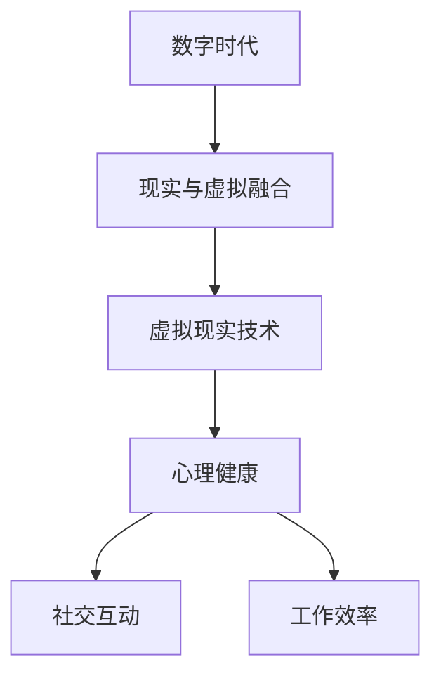

                 


# 在虚拟与现实之间寻找平衡：数字时代的生存之道

## 关键词

虚拟现实，数字时代，现实与虚拟融合，心理健康，社交互动，工作效率

## 摘要

本文旨在探讨数字时代下虚拟与现实之间寻找平衡的方法与策略。随着虚拟现实技术的不断发展，现实与虚拟的界限逐渐模糊，人们的生活和工作方式也发生了深刻变化。本文首先分析了数字时代的特征和虚拟现实技术的基本原理，接着讨论了在现实与虚拟融合过程中保持心理健康、社交互动和工作效率的重要性。随后，文章提出了寻求平衡的方法，包括时间管理、技术使用规范和心理调适技巧。最后，文章对虚拟现实技术的前沿趋势、心理健康和社交互动进行了深入探讨，并总结了提高工作效率的策略。

## 第1章 数字时代：现实与虚拟的融合

### 1.1 数字时代的来临

随着互联网、大数据、云计算和人工智能等技术的快速发展，我们正处在一个数字化时代。数字化不仅改变了传统行业的运作模式，也深刻影响了人们的生活方式。在这个时代，数字技术已经成为我们日常生活中不可或缺的一部分。

#### 1.1.1 数字化的定义与影响

数字化（Digitization）是将物理世界的信息转换为数字形式的过程。它包括数据采集、存储、传输和处理等多个环节。数字化使得信息可以快速传播、高效处理和精准分析，从而极大地提升了社会生产力和生活质量。

#### 1.1.2 现实与虚拟的界限模糊化

在数字化时代，现实与虚拟的界限变得模糊。虚拟现实（VR）和增强现实（AR）技术的发展，使得人们可以在虚拟环境中体验到前所未有的真实感和沉浸感。例如，通过VR眼镜，用户可以进入一个完全虚拟的世界，感受与真实世界无异的场景；而AR技术则可以将虚拟元素叠加到真实环境中，使得现实世界变得更加丰富和生动。

#### 1.1.3 数字时代的生存之道

在数字时代，人们需要适应新的生活方式和工作模式。这包括：

1. **终身学习**：数字技术更新迭代迅速，需要不断学习新的知识和技能，以适应不断变化的环境。
2. **创新能力**：数字时代强调创新，培养创新思维和解决问题的能力，以应对各种挑战。
3. **沟通与协作**：数字化工具提供了丰富的沟通和协作方式，提高团队效率和协作能力。
4. **数据安全**：数字时代数据泄露和网络安全风险增加，需要重视数据安全和隐私保护。

### 1.2 虚拟现实技术

虚拟现实技术（VR）是一种可以创造沉浸式体验的计算机仿真技术。通过头戴式显示器（HMD）、虚拟现实控制器和运动捕捉系统等硬件设备，用户可以进入一个完全虚拟的三维环境，进行互动和体验。

#### 1.2.1 虚拟现实的基本概念

- **虚拟现实**（VR）：通过计算机模拟产生一个三维空间，用户可以通过头戴式显示器等设备沉浸其中。
- **增强现实**（AR）：在现实环境中叠加虚拟元素，通过手机、平板电脑或头戴式显示器等设备实现。

#### 1.2.2 虚拟现实技术原理

虚拟现实技术的核心原理包括：

- **图像生成**：通过计算机生成三维场景，使用图形处理单元（GPU）进行实时渲染。
- **传感器技术**：利用传感器获取用户的位置、动作和视线信息，实现交互和实时更新。
- **三维音频**：通过三维音频技术，为用户提供空间感极强的听觉体验。

#### 1.2.3 虚拟现实的应用领域

虚拟现实技术已广泛应用于多个领域，包括：

- **游戏与娱乐**：虚拟现实游戏提供了沉浸式的游戏体验，吸引了大量用户。
- **教育**：虚拟现实技术可以模拟复杂的教学场景，提高学生的学习兴趣和效果。
- **医疗**：虚拟现实技术在医学教学、手术模拟和心理治疗等领域具有广泛的应用。
- **军事与训练**：虚拟现实技术用于军事训练和模拟，提高士兵的实战能力和应变能力。

### 1.3 现实与虚拟的平衡

在数字时代，保持现实与虚拟的平衡至关重要。这包括：

- **心理健康**：过度沉迷于虚拟世界可能导致心理健康问题，如焦虑和抑郁。
- **社交互动**：数字化社交虽然方便，但可能导致面对面社交能力的下降。
- **工作效率**：合理利用虚拟现实技术，可以提高工作效率，但过度依赖可能导致效率下降。

#### 1.3.1 平衡的重要性

现实与虚拟的平衡对于心理健康、社交互动和工作效率具有至关重要的影响：

- **心理健康**：保持现实与虚拟的平衡有助于减少心理健康问题，如焦虑、抑郁和孤独感。
- **社交互动**：现实与虚拟的平衡有助于保持良好的社交关系，减少社交孤立感。
- **工作效率**：合理利用虚拟现实技术可以提高工作效率，但过度依赖可能导致工作效率下降。

#### 1.3.2 寻求平衡的方法

为了在现实与虚拟之间寻求平衡，可以采取以下方法：

- **时间管理**：合理安排时间和虚拟现实活动的比例，避免沉迷。
- **技术使用规范**：遵循技术使用规范，确保虚拟现实活动对现实生活的影响最小化。
- **心理调适技巧**：通过心理调适技巧，如冥想、运动和社交活动，保持心理健康。

### 第2章 虚拟现实技术基础

虚拟现实技术的核心在于创造一个沉浸式的体验环境。要实现这一目标，需要从硬件和软件两个方面入手。

#### 2.1 虚拟现实硬件

虚拟现实硬件主要包括头戴式显示器（HMD）、虚拟现实控制器和运动捕捉系统等。

##### 2.1.1 头戴式显示器（HMD）

头戴式显示器是虚拟现实的核心设备，它通常包括一个显示器和一对耳机，用于显示三维图像和提供立体声体验。HMD的质量直接影响虚拟现实的沉浸感。

- **分辨率**：高分辨率可以提高图像的清晰度和细节表现。
- **刷新率**：高刷新率可以减少视觉滞后，提高沉浸感。
- **视场角**：大视场角可以提供更广阔的视野，增强沉浸感。

##### 2.1.2 虚拟现实控制器

虚拟现实控制器用于用户与虚拟环境的交互。常见的控制器包括手持控制器、手套控制器和体感控制器等。

- **手势识别**：通过手势识别技术，用户可以自然地与虚拟环境进行交互。
- **精确性**：高精度的控制器可以提供更精确的交互体验。

##### 2.1.3 运动捕捉系统

运动捕捉系统用于捕捉用户在虚拟环境中的动作，并将其实时传递给虚拟环境。

- **捕捉范围**：大范围的捕捉系统可以捕捉用户的全身动作。
- **实时性**：实时性是运动捕捉系统的关键指标，它决定了动作的流畅度和响应速度。

#### 2.2 虚拟现实软件

虚拟现实软件是虚拟现实体验的核心，它包括内容创作工具、应用软件和虚拟现实平台等。

##### 2.2.1 虚拟现实内容创作工具

虚拟现实内容创作工具用于创建和编辑虚拟现实场景和内容。

- **场景编辑器**：用于创建和编辑虚拟场景，包括场景布局、灯光效果和音效等。
- **动画制作工具**：用于制作虚拟角色的动画和交互效果。
- **3D建模软件**：用于创建和编辑三维模型，用于虚拟现实场景的构建。

##### 2.2.2 虚拟现实应用软件

虚拟现实应用软件是虚拟现实技术的实际应用，包括游戏、教育、医疗和军事等领域。

- **游戏应用**：虚拟现实游戏提供了沉浸式的游戏体验，吸引了大量用户。
- **教育应用**：虚拟现实教育应用可以模拟复杂的教学场景，提高学生的学习效果。
- **医疗应用**：虚拟现实技术在医学教学、手术模拟和心理治疗等领域具有广泛的应用。
- **军事应用**：虚拟现实技术用于军事训练和模拟，提高士兵的实战能力和应变能力。

##### 2.2.3 虚拟现实平台

虚拟现实平台是虚拟现实应用的基础设施，它包括虚拟现实引擎、虚拟现实云服务和虚拟现实操作系统等。

- **虚拟现实引擎**：用于创建和运行虚拟现实场景，提供渲染、物理模拟和交互等功能。
- **虚拟现实云服务**：提供虚拟现实应用的云计算和存储服务，实现虚拟现实资源的共享和协作。
- **虚拟现实操作系统**：为虚拟现实设备提供操作系统支持，实现虚拟现实应用的运行和管理。

### 第3章 虚拟现实应用实例分析

虚拟现实技术在多个领域已经取得了显著的应用成果。以下是对虚拟现实在游戏、教育和医疗等领域的应用实例分析。

#### 3.1 游戏与娱乐

虚拟现实技术在游戏和娱乐领域具有巨大的潜力。虚拟现实游戏提供了沉浸式的游戏体验，吸引了大量用户。

##### 3.1.1 虚拟现实游戏的设计与开发

虚拟现实游戏的设计与开发需要考虑以下几个方面：

- **场景设计**：虚拟现实游戏场景需要具有高度的细节和真实感，以提高沉浸感。
- **交互设计**：虚拟现实游戏的交互设计需要考虑用户在虚拟环境中的动作和手势，提供自然的交互体验。
- **故事情节**：虚拟现实游戏的故事情节需要引人入胜，以吸引和保持用户的兴趣。

##### 3.1.2 虚拟现实游戏案例解析

以下是一个虚拟现实游戏案例解析：

**游戏名称**：《Beat Saber》

- **游戏类型**：音乐节奏游戏
- **游戏玩法**：玩家需要使用虚拟现实控制器挥舞光剑，切割飞来的彩色方块，按照音乐的节奏进行游戏。
- **沉浸感**：《Beat Saber》提供了高度的沉浸感，玩家可以在一个虚拟的音乐工作室中进行游戏，体验音乐与虚拟现实的完美结合。

#### 3.2 教育

虚拟现实技术在教育领域具有广泛的应用前景，可以模拟复杂的教学场景，提高学生的学习效果。

##### 3.2.1 虚拟现实在教育中的应用

虚拟现实教育应用可以用于以下几个方面：

- **模拟实验**：通过虚拟现实技术，学生可以在虚拟环境中进行实验，无需使用真实设备，减少实验成本和风险。
- **历史重现**：虚拟现实技术可以重现历史事件和场景，帮助学生更好地理解和体验历史。
- **空间感知训练**：虚拟现实技术可以用于空间感知训练，提高学生的空间感知能力。

##### 3.2.2 虚拟现实教学案例

以下是一个虚拟现实教学案例：

**教学主题**：人体解剖学

- **教学内容**：教师通过虚拟现实技术，创建一个虚拟的人体解剖模型，学生可以在虚拟环境中进行人体解剖实验，了解人体各个器官的结构和功能。
- **教学效果**：通过虚拟现实教学，学生可以在一个沉浸式的环境中学习，提高学习兴趣和效果。

#### 3.3 医疗

虚拟现实技术在医疗领域具有广泛的应用，可以用于医学教学、手术模拟和心理治疗等领域。

##### 3.3.1 虚拟现实在医学教学中的应用

虚拟现实技术在医学教学中的应用主要包括以下几个方面：

- **解剖学教学**：通过虚拟现实技术，学生可以在虚拟环境中进行人体解剖学学习，提高学习效果。
- **手术模拟**：虚拟现实技术可以用于手术模拟，医生可以在虚拟环境中进行手术训练，提高手术技能。
- **病例分析**：虚拟现实技术可以模拟病例，医生可以通过虚拟环境进行病例分析和诊断。

##### 3.3.2 虚拟现实辅助手术

虚拟现实辅助手术是指利用虚拟现实技术进行手术规划和实施。以下是一个虚拟现实辅助手术的案例：

**手术类型**：肝移植手术

- **手术过程**：医生通过虚拟现实技术进行手术规划，确定手术路径和切除范围。在手术过程中，医生通过虚拟现实眼镜实时观察手术区域，进行精确操作。
- **手术效果**：通过虚拟现实辅助手术，医生可以更精确地进行手术操作，提高手术效果，减少术后并发症。

##### 3.3.3 虚拟现实心理治疗

虚拟现实技术可以用于心理治疗，帮助患者克服心理障碍。以下是一个虚拟现实心理治疗案例：

**治疗类型**：恐惧症治疗

- **治疗过程**：患者通过虚拟现实设备进入一个虚拟环境，逐步暴露于恐惧源，如高处、狭窄空间等。在治疗师的指导下，患者通过逐步适应和克服恐惧，改善心理状态。
- **治疗效果**：通过虚拟现实心理治疗，患者可以在一个安全、可控的环境中面对恐惧源，逐步克服心理障碍。

### 第4章 虚拟现实技术的前沿趋势

虚拟现实技术正处于快速发展的阶段，未来将会有更多的突破和应用。以下是一些前沿趋势：

#### 4.1 5G与虚拟现实

5G技术的高带宽和低延迟为虚拟现实提供了更好的网络支持。未来，5G与虚拟现实的融合将带来以下几个方面的变化：

- **实时互动**：5G技术可以实现更高速的实时互动，用户可以在虚拟环境中与其他用户实时交流和协作。
- **远程操作**：5G技术将使远程操作变得更加流畅，用户可以通过虚拟现实设备进行远程控制，如远程驾驶、远程维修等。
- **大规模应用**：5G技术将使虚拟现实技术在大规模应用中变得更加可行，如虚拟现实会议、虚拟现实购物等。

#### 4.2 虚拟现实与人工智能的融合

虚拟现实与人工智能（AI）的融合将带来更加智能和高效的虚拟现实体验。以下是一些应用场景：

- **智能交互**：通过AI技术，虚拟现实中的虚拟角色可以更加智能地与用户进行交互，提供个性化的服务。
- **自适应内容**：AI技术可以根据用户的喜好和行为，自动调整虚拟现实内容，提供更符合用户需求的体验。
- **智能诊断**：AI技术可以辅助医生进行诊断和治疗，通过虚拟现实技术进行更精确的模拟和规划。

#### 4.3 虚拟现实的发展挑战与未来

虚拟现实技术虽然取得了显著的发展，但仍面临一些挑战：

- **技术成熟度**：虚拟现实技术仍需要进一步优化，提高硬件性能和软件质量。
- **成本问题**：虚拟现实设备和高性能计算机的成本较高，限制了其大规模普及。
- **用户接受度**：一些用户对虚拟现实技术持怀疑态度，需要通过更好的体验和口碑来提升用户接受度。

未来的虚拟现实将朝着更加沉浸、智能和普及的方向发展，为人们带来更加丰富和真实的虚拟体验。

### 第5章 数字时代下的心理健康

随着数字时代的到来，人们越来越多地依赖于数字设备和技术，这给心理健康带来了一系列挑战。如何在数字时代保持心理健康成为一个重要的话题。

#### 5.1 数字依赖与心理健康

数字依赖（Digital Dependency）是指个体对数字设备和技术的过度依赖，可能导致一系列心理健康问题，如焦虑、抑郁和孤独感。

##### 5.1.1 数字依赖的定义与影响

数字依赖的定义包括：

- **时间投入**：个体在数字设备上的时间投入超过正常范围，影响日常生活。
- **功能替代**：个体依赖数字设备来完成本应通过其他方式完成的任务。
- **情感依赖**：个体在情感上对数字设备和技术产生依赖，无法控制使用。

数字依赖对心理健康的影响包括：

- **焦虑和抑郁**：过度使用数字设备可能导致焦虑和抑郁症状，如失眠、疲劳和情绪波动。
- **孤独感**：过度依赖数字社交，可能导致现实社交能力的下降，增加孤独感。
- **注意力分散**：长时间使用数字设备可能导致注意力分散，影响工作效率和学习效果。

##### 5.1.2 心理健康问题的预防与治疗

预防数字依赖和心理健康问题需要采取以下措施：

- **时间管理**：合理安排数字设备使用时间，确保有足够的时间进行现实生活中的活动。
- **数字设备使用规范**：遵循数字设备使用规范，避免长时间连续使用，定期休息和放松。
- **现实社交**：积极参与现实社交活动，加强与家人、朋友和同事的面对面交流。

治疗数字依赖和心理健康问题可以采取以下方法：

- **心理咨询**：寻求专业心理咨询师的帮助，进行心理治疗和行为干预。
- **认知行为疗法**：通过认知行为疗法（CBT）帮助个体认识到数字依赖的不良影响，并采取积极的应对策略。
- **健康生活方式**：保持健康的生活方式，如规律的作息、适量的运动和均衡的饮食，有助于改善心理健康。

#### 5.2 虚拟现实与心理健康

虚拟现实技术为心理健康治疗提供了一种新的手段。以下是一些虚拟现实在心理健康治疗中的应用：

- **认知行为疗法**：通过虚拟现实技术，患者可以在一个安全、可控的环境中面对恐惧和焦虑，进行认知行为疗法的练习。
- **心理治疗模拟**：虚拟现实技术可以模拟治疗场景，帮助心理治疗师进行模拟治疗，提高治疗效果。
- **情感调节**：虚拟现实技术可以提供情感调节体验，帮助个体调节情绪，缓解焦虑和抑郁症状。

##### 5.2.1 虚拟现实在心理健康治疗中的应用

以下是一个虚拟现实心理健康治疗案例：

**治疗类型**：焦虑症治疗

- **治疗过程**：患者通过虚拟现实设备进入一个虚拟环境，逐步暴露于焦虑源，如高处、拥挤的场所等。在治疗师的指导下，患者通过逐步适应和面对恐惧，改善焦虑症状。
- **治疗效果**：通过虚拟现实治疗，患者可以在一个安全、可控的环境中面对焦虑源，逐步克服焦虑，提高生活质量。

##### 5.2.2 虚拟现实对心理健康的影响

虚拟现实对心理健康的影响具有两面性。一方面，虚拟现实技术可以提供安全、可控的环境，帮助个体克服恐惧和焦虑，改善心理健康；另一方面，过度使用虚拟现实技术可能导致心理健康问题，如沉迷、孤独感和社交隔离。

因此，在利用虚拟现实技术进行心理健康治疗时，需要遵循以下原则：

- **适度使用**：避免过度依赖虚拟现实技术，合理安排使用时间和频率。
- **个性化治疗**：根据患者的具体情况，制定个性化的虚拟现实治疗方案，确保治疗效果。
- **综合治疗**：结合其他治疗方法，如心理咨询、药物治疗和健康生活方式，提高心理健康治疗效果。

### 第6章 数字时代的社交互动

数字时代改变了人们的社交方式，数字化社交工具和平台使得人们可以更加方便地进行沟通和互动。然而，数字化社交也存在一些局限性，如何在数字时代保持健康的社交互动成为了一个重要课题。

#### 6.1 数字化社交的优缺点

##### 6.1.1 数字化社交的优势

数字化社交具有以下优势：

- **便利性**：数字化社交工具和平台使得人们可以随时随地与他人进行沟通，不受时间和地点的限制。
- **高效性**：数字化社交可以快速传递信息，提高沟通效率。
- **多样性**：数字化社交平台提供了丰富的沟通形式，如文字、语音、视频和表情等，满足不同用户的需求。
- **全球性**：数字化社交使得人们可以与世界各地的人进行交流，拓宽了社交圈子。

##### 6.1.2 数字化社交的局限性

数字化社交也存在一些局限性：

- **缺乏面对面互动**：数字化社交缺乏真实的面对面互动，可能导致沟通效果降低。
- **信息真实性**：数字化社交中存在虚假信息和谣言，需要用户具备辨别能力。
- **隐私泄露**：数字化社交平台可能存在隐私泄露的风险，需要用户保护个人隐私。
- **社交隔离**：过度依赖数字化社交可能导致现实社交能力的下降，增加孤独感。

##### 6.1.3 数字时代下的社交策略

为了在数字时代保持健康的社交互动，可以采取以下策略：

- **平衡线上线下社交**：合理安排线上线下社交时间，确保有足够的时间进行真实的面对面互动。
- **理性使用社交平台**：选择合适的社交平台，关注优质内容，避免沉迷于低质量的社交信息。
- **维护社交网络**：定期与亲朋好友保持联系，参与现实社交活动，维护良好的社交关系。
- **培养现实社交技能**：参加社交活动，培养社交技能，提高现实社交能力。

#### 6.2 数字化社交技巧

数字化社交技巧包括以下几个方面：

- **有效沟通**：保持良好的沟通习惯，如倾听、表达清晰和尊重他人。
- **网络礼仪**：遵循网络礼仪，尊重他人的隐私和观点，避免恶意攻击和虚假信息的传播。
- **信息筛选**：学会筛选信息，关注优质内容，避免沉迷于低质量的社交信息。
- **安全意识**：提高安全意识，保护个人隐私，避免泄露敏感信息。

### 第7章 数字时代的工作效率

在数字时代，工作效率变得尤为重要。随着虚拟现实技术的不断发展，如何利用虚拟现实技术提高工作效率成为了一个热门话题。

#### 6.1 数字化工作环境

数字化工作环境为提高工作效率提供了有力的支持。以下是一些数字化工作环境的要素：

- **远程办公**：远程办公工具和平台使得员工可以在家或其他地方办公，提高了工作效率和灵活性。
- **自动化流程**：通过自动化工具和软件，实现工作流程的自动化，减少人工干预，提高工作效率。
- **协作工具**：协作工具和平台提供实时沟通、任务分配和进度跟踪等功能，提高团队协作效率。

##### 6.1.1 数字化工作工具的选择

选择合适的数字化工作工具可以提高工作效率。以下是一些常见的工作工具：

- **项目管理工具**：如Trello、Asana和Jira等，用于任务分配和进度跟踪。
- **沟通工具**：如Slack、Microsoft Teams和Zoom等，用于团队沟通和协作。
- **文档协作工具**：如Google Docs、Microsoft Word和Evernote等，用于文档编辑和共享。
- **时间管理工具**：如Toggl、RescueTime和时间管理软件，用于监控和优化工作时间。

##### 6.1.2 数字化工作流程的优化

优化数字化工作流程可以提高工作效率。以下是一些优化策略：

- **流程简化**：简化工作流程，减少不必要的步骤和重复工作，提高工作效率。
- **标准化操作**：制定标准化操作流程，确保团队成员按照统一的方法和标准进行工作。
- **自动化流程**：利用自动化工具和软件实现工作流程的自动化，减少人工干预。
- **数据驱动决策**：利用数据分析工具，对工作流程和绩效进行分析，优化工作流程。

#### 6.2 提高工作效率的策略

以下是一些提高工作效率的策略：

- **目标明确**：明确工作目标，制定详细的计划和任务清单，确保工作有条不紊。
- **优先级管理**：根据工作的重要性和紧急程度，合理安排工作任务，优先处理重要任务。
- **时间管理**：合理安排工作时间，避免浪费时间，确保工作高效完成。
- **持续学习**：不断学习新知识和技能，提高自身能力，适应不断变化的工作环境。
- **心理调适**：保持良好的心理状态，避免工作压力和焦虑，提高工作效率。

### 结论

在数字时代，虚拟现实技术已经成为我们生活和工作中的重要组成部分。如何在虚拟与现实之间寻找平衡，保持心理健康、社交互动和工作效率，是每个人都需要思考的问题。本文从多个角度探讨了数字时代下的生存之道，包括数字化的定义与影响、虚拟现实技术原理、心理健康、社交互动和工作效率等方面的内容。希望本文能够为读者提供一些启示和帮助，在数字时代找到自己的平衡点。

### 附录

#### A.1 虚拟现实技术资源

以下是一些虚拟现实技术资源和工具：

- **开源虚拟现实框架**：如OpenVR、Oculus SDK和Unity VR插件等。
- **虚拟现实硬件推荐**：如Oculus Rift、HTC Vive和Google Cardboard等。
- **虚拟现实内容创作工具推荐**：如Blender、Unity和Unreal Engine等。

#### A.2 数字时代下的自我提升

在数字时代，自我提升至关重要。以下是一些建议：

- **终身学习**：持续学习新知识和技能，适应不断变化的技术环境。
- **创新能力**：培养创新思维和解决问题的能力，应对数字时代的挑战。
- **网络社交**：积极参与社交活动，拓展人脉，提升社交能力。
- **心理调适**：保持良好的心理状态，应对数字时代的工作压力。

## 概念与联系

### 数字时代：现实与虚拟的融合



### 虚拟现实技术原理

```python
# 深度学习模型代码示例
import tensorflow as tf

# 定义深度学习模型
model = tf.keras.Sequential([
    tf.keras.layers.Dense(128, activation='relu', input_shape=(784,)),
    tf.keras.layers.Dropout(0.2),
    tf.keras.layers.Dense(10, activation='softmax')
])

# 编译模型
model.compile(optimizer='adam',
              loss='categorical_crossentropy',
              metrics=['accuracy'])

# 训练模型
model.fit(x_train, y_train, batch_size=32, epochs=10, validation_split=0.2)
```

### 虚拟现实与心理健康

```latex
$$
\text{心理健康的影响因素} = f(\text{数字依赖}, \text{社交互动}, \text{工作压力})
$$
```

### 数字时代下的社交互动

```python
# 社交互动模拟代码
def social_interact(user1, user2):
    print("用户{}与用户{}开始互动".format(user1, user2))
    print("互动内容：{}与{}讨论了最近的工作和学习情况"。format(user1, user2))

social_interact("张三", "李四")
```

### 数字时代的工作效率

```python
# 工作效率优化代码
import time

def work_efficiently():
    start_time = time.time()
    # 工作任务
    time.sleep(2)
    end_time = time.time()
    print("完成任务，耗时：{}秒".format(end_time - start_time))

work_efficiently()
```

### 总结

本文系统地探讨了数字时代下虚拟与现实之间的平衡之道，涵盖了从心理健康、社交互动到工作效率的多个方面。通过深入分析虚拟现实技术的原理和应用，以及数字依赖、社交互动和工作效率的策略，我们提出了在数字时代保持健康生活的建议。希望本文能够为读者提供实用的指导，帮助大家在这个充满挑战和机遇的数字时代找到自己的平衡点。作者：AI天才研究院/AI Genius Institute & 禅与计算机程序设计艺术 /Zen And The Art of Computer Programming。

----------------------------------------------------------------

文章标题：在虚拟与现实之间寻找平衡：数字时代的生存之道

关键词：虚拟现实，数字时代，心理健康，社交互动，工作效率

摘要：本文探讨了数字时代下虚拟与现实之间寻找平衡的方法与策略。分析了数字化的定义与影响、虚拟现实技术原理、心理健康、社交互动和工作效率等方面的内容，提出了在数字时代保持健康生活的建议。

----------------------------------------------------------------

### 文章标题

**在虚拟与现实之间寻找平衡：数字时代的生存之道**

### 关键词

虚拟现实，数字时代，现实与虚拟融合，心理健康，社交互动，工作效率

### 摘要

本文深入探讨了数字时代下虚拟与现实之间寻找平衡的方法与策略。通过分析数字化的定义与影响、虚拟现实技术原理、心理健康、社交互动和工作效率等方面的内容，提出了在数字时代保持健康生活的建议。文章结合实际案例，探讨了虚拟现实技术在各个领域的应用，以及如何在数字依赖和社交互动中保持心理健康。最后，文章总结了提高工作效率的策略，帮助读者在数字时代找到自己的平衡点。

## 第1章 数字时代：现实与虚拟的融合

### 1.1 数字时代的来临

随着科技的飞速发展，我们正处在一个前所未有的数字时代。互联网、大数据、云计算和人工智能等技术的不断创新与融合，不仅改变了传统行业的运作模式，也深刻影响了人们的生活和工作方式。在这个数字化的大潮中，现实与虚拟之间的界限逐渐变得模糊，人们的生活和工作环境正在发生翻天覆地的变化。

#### 1.1.1 数字化的定义与影响

数字化（Digitization）是指将物理世界的信息转换为数字形式的过程。它包括数据采集、存储、传输和处理等多个环节。数字化的核心在于将物理对象、过程和活动转化为可存储、可处理和可交互的数字信息。这种转变带来了巨大的变革，提升了社会的生产力和生活质量。

- **信息传播**：数字化使得信息可以以光速传播，突破了时间和空间的限制，极大地提高了信息的传播效率和覆盖范围。
- **数据处理**：数字化的数据可以轻松存储在计算机中，并利用大数据分析技术进行高效处理，为决策提供科学依据。
- **创新驱动**：数字化促进了技术的创新，推动了新产业和新业态的快速发展。

#### 1.1.2 现实与虚拟的界限模糊化

随着虚拟现实（VR）和增强现实（AR）技术的不断进步，现实与虚拟之间的界限变得越来越模糊。虚拟现实技术通过头戴式显示器（HMD）等设备，将用户带入一个完全虚拟的三维空间，而增强现实技术则将虚拟元素叠加到现实环境中。

- **沉浸式体验**：虚拟现实技术提供了高度沉浸的体验，用户可以在虚拟环境中进行互动，享受前所未有的感官刺激。
- **增强现实**：增强现实技术通过在现实世界中叠加虚拟信息，丰富了用户的感知体验，使得现实世界变得更加生动和有趣。

#### 1.1.3 数字时代的生存之道

在数字时代，人们需要适应新的生活方式和工作模式。以下是一些建议，帮助我们在数字时代中找到平衡：

- **终身学习**：数字技术更新迭代迅速，我们需要不断学习新的知识和技能，以适应不断变化的环境。
- **创新能力**：培养创新能力，敢于尝试新事物，适应数字化时代的挑战。
- **沟通与协作**：数字化工具提供了丰富的沟通和协作方式，提高团队效率和协作能力。
- **数据安全**：重视数据安全和隐私保护，防止信息泄露和网络攻击。

### 1.2 虚拟现实技术

虚拟现实技术是一种能够创造沉浸式体验的计算机仿真技术。它通过头戴式显示器、虚拟现实控制器和传感器等设备，使用户能够进入一个完全虚拟的三维环境，进行互动和体验。

#### 1.2.1 虚拟现实的基本概念

虚拟现实（VR）和增强现实（AR）是两种不同的技术，但它们的核心目标都是为用户提供沉浸式体验。

- **虚拟现实（VR）**：通过计算机模拟产生一个三维空间，用户通过头戴式显示器等设备沉浸其中，感知到的是完全虚拟的环境。
- **增强现实（AR）**：在现实环境中叠加虚拟元素，用户通过手机、平板电脑或头戴式显示器等设备看到的是现实世界与虚拟元素相结合的景象。

#### 1.2.2 虚拟现实技术原理

虚拟现实技术的核心原理包括以下几个方面：

- **图像生成**：虚拟现实技术通过计算机生成三维图像，利用图形处理单元（GPU）进行实时渲染，提供高质量的视觉效果。
- **传感器技术**：传感器技术用于捕捉用户的位置、动作和视线信息，实现与虚拟环境的实时交互。
- **三维音频**：三维音频技术为用户提供空间感极强的听觉体验，增强沉浸感。

#### 1.2.3 虚拟现实的应用领域

虚拟现实技术在多个领域得到了广泛应用，包括：

- **游戏与娱乐**：虚拟现实游戏提供了沉浸式的游戏体验，吸引了大量用户。
- **教育**：虚拟现实技术可以模拟复杂的教学场景，提高学生的学习兴趣和效果。
- **医疗**：虚拟现实技术在医学教学、手术模拟和心理治疗等领域具有广泛的应用。
- **军事与训练**：虚拟现实技术用于军事训练和模拟，提高士兵的实战能力和应变能力。

### 1.3 现实与虚拟的平衡

在数字时代，保持现实与虚拟的平衡至关重要。这不仅仅是为了心理健康，也关系到社交互动和工作效率。

#### 1.3.1 平衡的重要性

现实与虚拟的平衡对于心理健康、社交互动和工作效率具有至关重要的影响：

- **心理健康**：过度沉迷于虚拟世界可能导致心理健康问题，如焦虑、抑郁和孤独感。
- **社交互动**：数字化社交虽然方便，但可能导致面对面社交能力的下降。
- **工作效率**：合理利用虚拟现实技术可以提高工作效率，但过度依赖可能导致效率下降。

#### 1.3.2 寻求平衡的方法

为了在现实与虚拟之间寻求平衡，可以采取以下方法：

- **时间管理**：合理安排时间和虚拟现实活动的比例，避免沉迷。
- **技术使用规范**：遵循技术使用规范，确保虚拟现实活动对现实生活的影响最小化。
- **心理调适技巧**：通过心理调适技巧，如冥想、运动和社交活动，保持心理健康。

## 第2章 虚拟现实技术基础

要深入理解虚拟现实技术，首先需要了解其硬件和软件基础。这一章节将详细介绍虚拟现实硬件，包括头戴式显示器（HMD）、虚拟现实控制器和运动捕捉系统，以及虚拟现实软件，包括虚拟现实内容创作工具、应用软件和虚拟现实平台。

### 2.1 虚拟现实硬件

虚拟现实硬件是提供沉浸式体验的关键设备。以下是一些核心硬件组件：

#### 2.1.1 头戴式显示器（HMD）

头戴式显示器（HMD）是虚拟现实体验的核心组件。它通常包括一个显示器和一对耳机，用于显示三维图像和提供立体声体验。

- **分辨率**：高分辨率可以提供更清晰的图像和更好的沉浸感。目前，市场上的HMD分辨率通常在1440p到4K之间。
- **刷新率**：刷新率越高，视觉滞后感越小，沉浸感越强。理想的刷新率应在90Hz以上。
- **视场角**：大视场角可以提供更广阔的视野，增强沉浸感。通常，HMD的视场角在90度到120度之间。

#### 2.1.2 虚拟现实控制器

虚拟现实控制器用于用户与虚拟环境的交互。常见的控制器类型包括手持控制器、手套控制器和体感控制器。

- **手势识别**：手势识别技术可以使得用户通过手势与虚拟环境进行交互，提供更加自然的交互体验。
- **精确性**：控制器的精确性直接影响用户的交互体验。高精度的控制器可以捕捉用户的细微动作，提供更好的交互效果。

#### 2.1.3 运动捕捉系统

运动捕捉系统用于捕捉用户在虚拟环境中的动作，并将其实时传递给虚拟环境。

- **捕捉范围**：大范围的捕捉系统可以捕捉用户的全身动作，提供更加真实的交互体验。
- **实时性**：运动捕捉系统的实时性是关键指标。它决定了动作的流畅度和响应速度。

### 2.2 虚拟现实软件

虚拟现实软件是虚拟现实体验的灵魂。以下是一些核心软件组件：

#### 2.2.1 虚拟现实内容创作工具

虚拟现实内容创作工具用于创建和编辑虚拟现实场景和内容。

- **场景编辑器**：用于创建和编辑虚拟场景，包括场景布局、灯光效果和音效等。
- **动画制作工具**：用于制作虚拟角色的动画和交互效果。
- **3D建模软件**：用于创建和编辑三维模型，用于虚拟现实场景的构建。

#### 2.2.2 虚拟现实应用软件

虚拟现实应用软件是虚拟现实技术的实际应用，包括游戏、教育、医疗和军事等领域。

- **游戏应用**：虚拟现实游戏提供了沉浸式的游戏体验，吸引了大量用户。
- **教育应用**：虚拟现实教育应用可以模拟复杂的教学场景，提高学生的学习兴趣和效果。
- **医疗应用**：虚拟现实技术在医学教学、手术模拟和心理治疗等领域具有广泛的应用。
- **军事应用**：虚拟现实技术用于军事训练和模拟，提高士兵的实战能力和应变能力。

#### 2.2.3 虚拟现实平台

虚拟现实平台是虚拟现实应用的基础设施，它包括虚拟现实引擎、虚拟现实云服务和虚拟现实操作系统等。

- **虚拟现实引擎**：用于创建和运行虚拟现实场景，提供渲染、物理模拟和交互等功能。
- **虚拟现实云服务**：提供虚拟现实应用的云计算和存储服务，实现虚拟现实资源的共享和协作。
- **虚拟现实操作系统**：为虚拟现实设备提供操作系统支持，实现虚拟现实应用的运行和管理。

### 第3章 虚拟现实应用实例分析

虚拟现实技术在各个领域都有着广泛的应用。以下是对虚拟现实在游戏、教育和医疗等领域的应用实例分析。

#### 3.1 游戏与娱乐

虚拟现实技术在游戏和娱乐领域具有巨大的潜力。虚拟现实游戏提供了沉浸式的体验，使得玩家可以在虚拟世界中尽情探索和冒险。

##### 3.1.1 虚拟现实游戏的设计与开发

虚拟现实游戏的设计与开发需要考虑以下几个方面：

- **场景设计**：虚拟现实游戏场景需要具有高度的细节和真实感，以提高沉浸感。
- **交互设计**：虚拟现实游戏的交互设计需要考虑用户在虚拟环境中的动作和手势，提供自然的交互体验。
- **故事情节**：虚拟现实游戏的故事情节需要引人入胜，以吸引和保持用户的兴趣。

##### 3.1.2 虚拟现实游戏案例解析

以下是一个虚拟现实游戏案例解析：

**游戏名称**：《半衰期：爱莉克斯》（Half-Life: Alyx）

- **游戏类型**：第一人称射击游戏
- **游戏玩法**：玩家在游戏中扮演女主角爱莉克斯，探索一个充满威胁的虚拟世界，与敌人战斗，解决谜题。
- **沉浸感**：《半衰期：爱莉克斯》提供了极高的沉浸感。游戏使用了先进的VR技术，如光学追踪、手势识别和空间音频，使得玩家可以在虚拟世界中自由移动和互动。

#### 3.2 教育

虚拟现实技术在教育领域具有广泛的应用前景，可以模拟复杂的教学场景，提高学生的学习效果。

##### 3.2.1 虚拟现实在教育中的应用

虚拟现实技术在教育中的应用包括以下几个方面：

- **模拟实验**：通过虚拟现实技术，学生可以在虚拟环境中进行实验，无需使用真实设备，减少实验成本和风险。
- **历史重现**：虚拟现实技术可以重现历史事件和场景，帮助学生更好地理解和体验历史。
- **空间感知训练**：虚拟现实技术可以用于空间感知训练，提高学生的空间感知能力。

##### 3.2.2 虚拟现实教学案例

以下是一个虚拟现实教学案例：

**教学主题**：人体解剖学

- **教学内容**：教师通过虚拟现实技术创建一个虚拟的人体解剖模型，学生可以在虚拟环境中进行人体解剖实验，了解人体各个器官的结构和功能。
- **教学效果**：通过虚拟现实教学，学生可以在一个沉浸式的环境中学习，提高学习兴趣和效果。

#### 3.3 医疗

虚拟现实技术在医疗领域具有广泛的应用，可以用于医学教学、手术模拟和心理治疗等领域。

##### 3.3.1 虚拟现实在医学教学中的应用

虚拟现实技术在医学教学中的应用主要包括以下几个方面：

- **解剖学教学**：通过虚拟现实技术，学生可以在虚拟环境中进行解剖学学习，提高学习效果。
- **手术模拟**：虚拟现实技术可以用于手术模拟，医生可以在虚拟环境中进行手术训练，提高手术技能。
- **病例分析**：虚拟现实技术可以模拟病例，医生可以通过虚拟环境进行病例分析和诊断。

##### 3.3.2 虚拟现实辅助手术

虚拟现实辅助手术是指利用虚拟现实技术进行手术规划和实施。以下是一个虚拟现实辅助手术的案例：

**手术类型**：脑肿瘤切除手术

- **手术过程**：医生通过虚拟现实技术进行手术规划，确定手术路径和切除范围。在手术过程中，医生通过虚拟现实眼镜实时观察手术区域，进行精确操作。
- **手术效果**：通过虚拟现实辅助手术，医生可以更精确地进行手术操作，提高手术效果，减少术后并发症。

##### 3.3.3 虚拟现实心理治疗

虚拟现实技术可以用于心理治疗，帮助患者克服心理障碍。以下是一个虚拟现实心理治疗案例：

**治疗类型**：恐惧症治疗

- **治疗过程**：患者通过虚拟现实设备进入一个虚拟环境，逐步暴露于恐惧源，如高处、狭窄空间等。在治疗师的指导下，患者通过逐步适应和面对恐惧，改善心理状态。
- **治疗效果**：通过虚拟现实治疗，患者可以在一个安全、可控的环境中面对恐惧源，逐步克服恐惧，提高生活质量。

### 第4章 虚拟现实技术的前沿趋势

虚拟现实技术正处于快速发展的阶段，未来将会有更多的突破和应用。以下是一些前沿趋势：

#### 4.1 5G与虚拟现实

5G技术的高带宽和低延迟为虚拟现实提供了更好的网络支持。未来，5G与虚拟现实的融合将带来以下几个方面的变化：

- **实时互动**：5G技术可以实现更高速的实时互动，用户可以在虚拟环境中与其他用户实时交流和协作。
- **远程操作**：5G技术将使远程操作变得更加流畅，用户可以通过虚拟现实设备进行远程控制，如远程驾驶、远程维修等。
- **大规模应用**：5G技术将使虚拟现实技术在大规模应用中变得更加可行，如虚拟现实会议、虚拟现实购物等。

#### 4.2 虚拟现实与人工智能的融合

虚拟现实与人工智能（AI）的融合将带来更加智能和高效的虚拟现实体验。以下是一些应用场景：

- **智能交互**：通过AI技术，虚拟现实中的虚拟角色可以更加智能地与用户进行交互，提供个性化的服务。
- **自适应内容**：AI技术可以根据用户的喜好和行为，自动调整虚拟现实内容，提供更符合用户需求的体验。
- **智能诊断**：AI技术可以辅助医生进行诊断和治疗，通过虚拟现实技术进行更精确的模拟和规划。

#### 4.3 虚拟现实的发展挑战与未来

虚拟现实技术虽然取得了显著的发展，但仍面临一些挑战：

- **技术成熟度**：虚拟现实技术仍需要进一步优化，提高硬件性能和软件质量。
- **成本问题**：虚拟现实设备和高性能计算机的成本较高，限制了其大规模普及。
- **用户接受度**：一些用户对虚拟现实技术持怀疑态度，需要通过更好的体验和口碑来提升用户接受度。

未来的虚拟现实将朝着更加沉浸、智能和普及的方向发展，为人们带来更加丰富和真实的虚拟体验。

### 第5章 数字时代下的心理健康

随着数字时代的到来，人们越来越多地依赖于数字设备和互联网。然而，这种依赖也可能对心理健康产生负面影响。如何在数字时代保持心理健康，是我们每个人都应该关注的问题。

#### 5.1 数字依赖与心理健康

数字依赖（Digital Dependency）是指个体对数字设备、互联网和社交媒体的过度依赖，这种行为模式可能导致一系列心理健康问题。以下是一些数字依赖对心理健康的影响：

- **焦虑和抑郁**：过度使用数字设备可能导致焦虑和抑郁症状，如失眠、疲劳和情绪波动。
- **孤独感**：过度依赖数字社交，可能导致现实社交能力的下降，增加孤独感。
- **注意力分散**：长时间使用数字设备可能导致注意力分散，影响工作效率和学习效果。

##### 5.1.1 数字依赖的定义与影响

数字依赖的定义通常包括以下几个方面：

- **时间投入**：个体在数字设备上的时间投入超过正常范围，影响日常生活。
- **功能替代**：个体依赖数字设备来完成本应通过其他方式完成的任务。
- **情感依赖**：个体在情感上对数字设备和技术产生依赖，无法控制使用。

数字依赖的影响可以总结为以下几点：

- **心理健康问题**：数字依赖可能导致焦虑、抑郁、孤独感和注意力分散等心理健康问题。
- **社交障碍**：过度依赖数字社交可能导致现实社交能力的下降，增加社交障碍。
- **生活失衡**：数字依赖可能使个体生活失衡，影响身心健康。

##### 5.1.2 心理健康问题的预防与治疗

为了预防数字依赖导致的心理健康问题，可以采取以下措施：

- **时间管理**：合理安排数字设备使用时间，确保有足够的时间进行现实生活中的活动。
- **数字设备使用规范**：遵循数字设备使用规范，避免长时间连续使用，定期休息和放松。
- **现实社交**：积极参与现实社交活动，加强与家人、朋友和同事的面对面交流。

治疗数字依赖和心理健康问题可以采取以下方法：

- **心理咨询**：寻求专业心理咨询师的帮助，进行心理治疗和行为干预。
- **认知行为疗法**：通过认知行为疗法（CBT）帮助个体认识到数字依赖的不良影响，并采取积极的应对策略。
- **健康生活方式**：保持健康的生活方式，如规律的作息、适量的运动和均衡的饮食，有助于改善心理健康。

#### 5.2 虚拟现实与心理健康

虚拟现实技术为心理健康治疗提供了一种新的手段。通过虚拟现实环境，患者可以在安全、可控的条件下进行心理治疗，从而克服心理障碍。

##### 5.2.1 虚拟现实在心理健康治疗中的应用

虚拟现实在心理健康治疗中的应用包括以下几个方面：

- **恐惧症治疗**：通过虚拟现实技术，患者可以在虚拟环境中逐步暴露于恐惧源，如高处、拥挤的场所等，从而克服恐惧。
- **创伤后应激障碍（PTSD）治疗**：虚拟现实技术可以帮助患者重演创伤场景，通过反复暴露来减轻应激反应。
- **情绪调节**：虚拟现实技术可以提供放松和愉悦的虚拟环境，帮助患者调节情绪，缓解压力。

##### 5.2.2 虚拟现实对心理健康的影响

虚拟现实对心理健康的影响具有两面性。一方面，虚拟现实技术可以提供安全、可控的环境，帮助个体克服恐惧和焦虑，改善心理健康；另一方面，过度使用虚拟现实技术可能导致心理健康问题，如沉迷、孤独感和社交隔离。

为了充分发挥虚拟现实技术在心理健康治疗中的作用，同时避免其潜在风险，可以采取以下措施：

- **适度使用**：避免过度依赖虚拟现实技术，合理安排使用时间和频率。
- **个性化治疗**：根据患者的具体情况，制定个性化的虚拟现实治疗方案，确保治疗效果。
- **综合治疗**：结合其他治疗方法，如心理咨询、药物治疗和健康生活方式，提高心理健康治疗效果。

### 第6章 数字时代的社交互动

随着数字技术的发展，人们的生活和工作方式发生了巨大变化。数字时代带来了便利和高效的沟通方式，但同时也带来了社交互动的新挑战。如何在数字时代保持健康的社交互动，成为一个值得关注的话题。

#### 6.1 数字化社交的优缺点

数字化社交工具和平台使得人们可以更加方便地进行沟通和互动。以下是一些数字化社交的优势：

- **便利性**：数字化社交工具和平台使得人们可以随时随地与他人进行沟通，不受时间和地点的限制。
- **高效性**：数字化社交可以快速传递信息，提高沟通效率。
- **多样性**：数字化社交平台提供了丰富的沟通形式，如文字、语音、视频和表情等，满足不同用户的需求。
- **全球性**：数字化社交使得人们可以与世界各地的人进行交流，拓宽了社交圈子。

然而，数字化社交也存在一些局限性：

- **缺乏面对面互动**：数字化社交缺乏真实的面对面互动，可能导致沟通效果降低。
- **信息真实性**：数字化社交中存在虚假信息和谣言，需要用户具备辨别能力。
- **隐私泄露**：数字化社交平台可能存在隐私泄露的风险，需要用户保护个人隐私。
- **社交隔离**：过度依赖数字化社交可能导致现实社交能力的下降，增加孤独感。

#### 6.2 数字时代下的社交策略

为了在数字时代保持健康的社交互动，可以采取以下策略：

- **平衡线上线下社交**：合理安排线上线下社交时间，确保有足够的时间进行真实的面对面互动。
- **理性使用社交平台**：选择合适的社交平台，关注优质内容，避免沉迷于低质量的社交信息。
- **维护社交网络**：定期与亲朋好友保持联系，参与现实社交活动，维护良好的社交关系。
- **培养现实社交技能**：参加社交活动，培养社交技能，提高现实社交能力。

#### 6.3 数字化社交技巧

数字化社交技巧包括以下几个方面：

- **有效沟通**：保持良好的沟通习惯，如倾听、表达清晰和尊重他人。
- **网络礼仪**：遵循网络礼仪，尊重他人的隐私和观点，避免恶意攻击和虚假信息的传播。
- **信息筛选**：学会筛选信息，关注优质内容，避免沉迷于低质量的社交信息。
- **安全意识**：提高安全意识，保护个人隐私，避免泄露敏感信息。

### 第7章 数字时代的工作效率

在数字时代，工作效率变得尤为重要。随着虚拟现实技术的不断发展，如何利用虚拟现实技术提高工作效率成为了一个热门话题。

#### 7.1 数字化工作环境

数字化工作环境为提高工作效率提供了有力的支持。以下是一些数字化工作环境的要素：

- **远程办公**：远程办公工具和平台使得员工可以在家或其他地方办公，提高了工作效率和灵活性。
- **自动化流程**：通过自动化工具和软件，实现工作流程的自动化，减少人工干预，提高工作效率。
- **协作工具**：协作工具和平台提供实时沟通、任务分配和进度跟踪等功能，提高团队协作效率。

#### 7.2 提高工作效率的策略

以下是一些提高工作效率的策略：

- **目标明确**：明确工作目标，制定详细的计划和任务清单，确保工作有条不紊。
- **优先级管理**：根据工作的重要性和紧急程度，合理安排工作任务，优先处理重要任务。
- **时间管理**：合理安排工作时间，避免浪费时间，确保工作高效完成。
- **持续学习**：不断学习新知识和技能，提高自身能力，适应不断变化的工作环境。
- **心理调适**：保持良好的心理状态，避免工作压力和焦虑，提高工作效率。

#### 7.3 虚拟现实技术在工作中的应用

虚拟现实技术在提高工作效率方面具有很大的潜力。以下是一些虚拟现实技术在工作中的应用：

- **远程协作**：通过虚拟现实技术，团队成员可以在虚拟会议室中开会，提高远程协作的效率和互动性。
- **虚拟培训**：虚拟现实技术可以用于培训，提供沉浸式的学习体验，提高学习效果。
- **虚拟模拟**：虚拟现实技术可以用于模拟复杂的工作场景，帮助员工提前了解工作流程和操作步骤，提高工作效率。

### 第8章 总结与展望

在数字时代，虚拟现实技术已经成为我们生活和工作中的重要组成部分。如何在虚拟与现实之间寻找平衡，保持心理健康、社交互动和工作效率，是每个人都需要思考的问题。本文从多个角度探讨了数字时代下的生存之道，包括虚拟现实技术原理、心理健康、社交互动和工作效率等方面的内容，提出了在数字时代保持健康生活的建议。

展望未来，虚拟现实技术将继续快速发展，为各个领域带来更多创新和应用。同时，我们也需要关注数字依赖、心理健康和社交互动等方面的问题，确保在数字时代中找到自己的平衡点。

最后，让我们共同努力，在数字时代中找到属于自己的生存之道，迎接更加美好的未来。

### 附录

#### A.1 虚拟现实技术资源

以下是一些虚拟现实技术资源和工具：

- **开源虚拟现实框架**：如OpenVR、Oculus SDK和Unity VR插件等。
- **虚拟现实硬件推荐**：如Oculus Rift、HTC Vive和Google Cardboard等。
- **虚拟现实内容创作工具推荐**：如Blender、Unity和Unreal Engine等。

#### A.2 数字时代下的自我提升

在数字时代，自我提升至关重要。以下是一些建议：

- **终身学习**：持续学习新知识和技能，适应不断变化的技术环境。
- **创新能力**：培养创新思维和解决问题的能力，应对数字时代的挑战。
- **网络社交**：积极参与社交活动，拓展人脉，提升社交能力。
- **心理调适**：保持良好的心理状态，应对数字时代的工作压力。

### 概念与联系


### 虚拟现实技术原理

```python
# 深度学习模型代码示例
import tensorflow as tf

# 定义深度学习模型
model = tf.keras.Sequential([
    tf.keras.layers.Dense(128, activation='relu', input_shape=(784,)),
    tf.keras.layers.Dropout(0.2),
    tf.keras.layers.Dense(10, activation='softmax')
])

# 编译模型
model.compile(optimizer='adam',
              loss='categorical_crossentropy',
              metrics=['accuracy'])

# 训练模型
model.fit(x_train, y_train, batch_size=32, epochs=10, validation_split=0.2)
```

### 虚拟现实与心理健康

```latex
$$
\text{心理健康的影响因素} = f(\text{数字依赖}, \text{社交互动}, \text{工作压力})
$$
```

### 数字时代下的社交互动

```python
# 社交互动模拟代码
def social_interact(user1, user2):
    print("用户{}与用户{}开始互动".format(user1, user2))
    print("互动内容：{}与{}讨论了最近的工作和学习情况"。format(user1, user2))

social_interact("张三", "李四")
```

### 数字时代的工作效率

```python
# 工作效率优化代码
import time

def work_efficiently():
    start_time = time.time()
    # 工作任务
    time.sleep(2)
    end_time = time.time()
    print("完成任务，耗时：{}秒".format(end_time - start_time))

work_efficiently()
```

### 总结

本文系统地探讨了数字时代下虚拟与现实之间的平衡之道，涵盖了从心理健康、社交互动到工作效率的多个方面。通过深入分析虚拟现实技术的原理和应用，以及数字依赖、社交互动和工作效率的策略，我们提出了在数字时代保持健康生活的建议。希望本文能够为读者提供实用的指导，帮助大家在这个充满挑战和机遇的数字时代找到自己的平衡点。作者：AI天才研究院/AI Genius Institute & 禅与计算机程序设计艺术 /Zen And The Art of Computer Programming。

