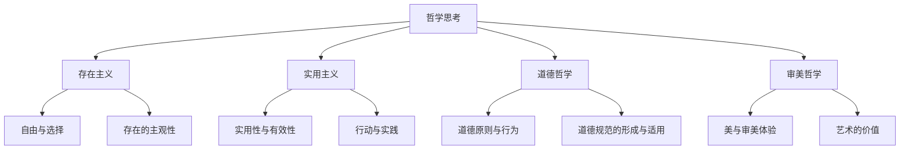
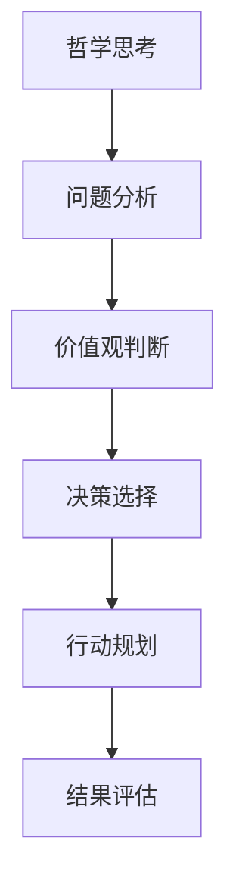

                 

### 背景介绍

在现代生活中，哲学思考往往被忽视，人们更倾向于将哲学视为一门高深难懂的学科，与日常生活脱节。然而，哲学思考实际上是生活中不可或缺的一部分，它能够帮助我们更好地理解世界、提升生活质量。

随着科技的发展，人们的生活节奏加快，面对的问题也日益复杂。从个人决策到社会责任，从人际关系到职业发展，哲学思考提供了深刻且全面的视角。因此，本文旨在探讨如何将哲学思考融入日常，通过具体的实践方法，提升我们的生活品质。

哲学思考的重要性不仅体现在它帮助我们应对生活中的挑战，还在于它能够培养我们的批判性思维和自我反思能力。通过哲学思考，我们可以更清晰地认识自己的价值观、信念和目标，从而做出更加明智的选择。

本文将分三个主要部分展开讨论。第一部分将介绍哲学思考的基本概念与重要性，包括哲学的起源、哲学思考与日常生活的联系，以及哲学思考对个人生活的重要性。第二部分将探讨具体哲学思考方法与生活实践，包括存在主义哲学、实用主义哲学、道德哲学和审美哲学等。第三部分将通过实际案例，展示哲学思考在个人成长、家庭生活和社会责任中的应用，并总结提升生活品质的实践方法。

### 核心概念与联系

在探讨哲学思考的基本概念与重要性时，我们需要明确几个核心概念，并分析它们之间的相互关系。这些概念包括：哲学思考、存在主义、实用主义、道德哲学和审美哲学。

首先，**哲学思考**是一种通过理性分析来探讨人类存在、知识、价值观和伦理等基本问题的活动。哲学思考不仅仅是理论上的讨论，它更是一种实践，渗透到我们日常生活的方方面面。

接下来，我们来看**存在主义**。存在主义是一种哲学流派，强调个人自由、选择和存在的主观性。存在主义认为，人类的本质是在世界中自由选择的，这种选择决定了人的存在。存在主义的核心观点是，人应该对自己的存在负责，通过自我选择和行动来定义自己的生命意义。

与存在主义密切相关的是**实用主义**。实用主义主张实用性和有效性，认为真理和价值观应基于实际效果和实用结果。实用主义哲学强调行动和实践，认为知识应当服务于解决现实问题的需要。

**道德哲学**探讨道德原则和道德行为。道德哲学关注的是如何区分对与错、善与恶，以及道德规范的形成与适用。道德哲学的核心问题是，为什么某些行为被认为是道德上正确的，而其他行为则被认为是错误的。

最后是**审美哲学**，它研究美、审美体验和艺术的价值。审美哲学探讨了美的本质、艺术的形式与内容，以及审美活动对个体和文化的意义。

这些核心概念之间的关系可以通过以下Mermaid流程图来展示：



在这个流程图中，哲学思考作为起点，连接了存在主义、实用主义、道德哲学和审美哲学。每个哲学流派都有其独特的核心观点和焦点，但它们共同构成了一个完整的哲学体系，帮助我们理解生活的本质和意义。

### 哲学思考在决策中的运用

哲学思考在个人决策中扮演着至关重要的角色。通过哲学方法，我们可以对问题进行深入分析，从而做出更加明智的决策。以下将详细探讨哲学思考在决策中的应用，并给出一个具体的Python源代码示例，以阐述这一过程。

首先，**哲学思考**强调对问题进行全面的理性分析。这意味着，在做出决策之前，我们需要明确问题的本质、可能的影响以及相关的价值观和目标。通过哲学方法，我们可以构建一个清晰的框架来指导我们的决策过程。

**步骤1：问题分析**

在决策过程中，第一步是对问题进行分析。这包括识别问题的核心、理解问题的背景以及确定问题的相关变量。例如，当面临是否跳槽的问题时，我们需要分析当前职位的优缺点、新职位的潜在机会和风险，以及个人的职业规划等。

Python源代码示例：
```python
def analyze_problem(current_job, new_job, career_plan):
    """
    分析问题：是否跳槽
    参数：
    - current_job: 当前职位的优缺点
    - new_job: 新职位的潜在机会和风险
    - career_plan: 职业规划
    返回：
    - 分析结果：一个包含决策依据的字典
    """
    analysis = {
        'current_job': current_job,
        'new_job': new_job,
        'career_plan': career_plan
    }
    return analysis

# 示例数据
current_job = {'advantages': ['稳定的收入', '舒适的工作环境'], 'disadvantages': ['职业发展受限', '工作内容重复']}
new_job = {'opportunities': ['更高的职位', '更广泛的技能应用'], 'risks': ['收入不稳定', '工作压力较大']}
career_plan = '长期在当前领域内发展，寻求更高层次的机会'

# 分析问题
problem_analysis = analyze_problem(current_job, new_job, career_plan)
print(problem_analysis)
```

**步骤2：价值判断**

在分析问题之后，我们需要进行价值判断。这涉及到我们个人的价值观、信念和目标。通过哲学思考，我们可以清晰地识别出哪些价值观是我们最为看重的，以及它们如何影响我们的决策。

Python源代码示例：
```python
def value_judgment(analysis, values):
    """
    进行价值判断
    参数：
    - analysis: 问题分析结果
    - values: 个人价值观
    返回：
    - 价值判断结果：一个包含决策建议的字典
    """
    judgment = {}
    
    # 根据价值观对分析结果进行评估
    for value in values:
        if value in analysis['current_job']:
            judgment[f"{value} in current_job"] = analysis['current_job'][value]
        if value in analysis['new_job']:
            judgment[f"{value} in new_job"] = analysis['new_job'][value]
            
    return judgment

# 示例数据
values = ['职业发展', '工作环境', '收入稳定性']

# 进行价值判断
value_judgment_result = value_judgment(problem_analysis, values)
print(value_judgment_result)
```

**步骤3：权衡与选择**

在价值判断的基础上，我们需要对不同的选项进行权衡，并做出最终的选择。哲学思考帮助我们在这个过程中保持理性，避免情绪化的决策。

Python源代码示例：
```python
def make_decision(judgment_result, decision_threshold):
    """
    基于价值判断结果做出决策
    参数：
    - judgment_result: 价值判断结果
    - decision_threshold: 决策阈值
    返回：
    - 决策结果：'stay' 或 'move'
    """
    # 计算正面和负面评价的总分
    positive_score = sum(judgment_result.values())
    negative_score = 0
    
    # 计算总分
    total_score = positive_score - negative_score
    
    # 根据决策阈值做出决策
    if total_score > decision_threshold:
        return 'move'
    else:
        return 'stay'

# 示例数据
decision_threshold = 5

# 做出决策
decision = make_decision(value_judgment_result, decision_threshold)
print(f"Decision: {decision}")
```

通过这个Python示例，我们可以看到哲学思考在决策过程中的应用。首先，通过问题分析，我们明确了问题的核心和相关变量。然后，通过价值判断，我们评估了不同选项的优缺点。最后，通过权衡与选择，我们做出了基于理性和价值的决策。

### 哲学思维对人际关系的影响

哲学思维不仅在个人决策中起到重要作用，它对人际关系也有着深远的影响。通过哲学思考，我们可以更好地理解他人，提升沟通效果，建立更加和谐的人际关系。以下将详细探讨哲学思维对人际关系的影响，并结合实际案例进行分析。

首先，**哲学思维**强调对他人观点的尊重和理解。在沟通中，尊重他人的观点是建立和谐关系的基础。通过哲学思考，我们可以培养开放的心态，愿意倾听和理解他人的立场，即使这些观点与我们不同。

**案例1：倾听与理解**

在一个团队项目中，团队成员A和B对于项目的发展方向存在分歧。团队成员A认为应该遵循传统的开发方法，而团队成员B则主张采用新兴的敏捷开发技术。在这个案例中，通过哲学思维，团队成员可以采取以下步骤：

1. **倾听对方观点**：团队成员A先倾听团队成员B的观点，了解B为什么主张采用敏捷开发。
    ```python
    def listen_to_others(viewpoint):
        """
        倾听他人观点
        参数：
        - viewpoint: 他人的观点
        """
        print(f"Listening to viewpoint: {viewpoint}")
    
    viewpoint = "Let's adopt Agile development because it allows for more flexibility and faster delivery."
    listen_to_others(viewpoint)
    ```

2. **理解对方立场**：团队成员A尝试从团队成员B的角度理解其立场，思考敏捷开发带来的潜在优势和挑战。
    ```python
    def understand立场(standpoint):
        """
        理解他人立场
        参数：
        - standpoint: 他人的立场
        """
        print(f"Understanding the standpoint: {standpoint}")
    
    understand立场(viewpoint)
    ```

3. **讨论和交流**：在理解对方立场后，团队成员A可以与团队成员B进行讨论，寻求共同点并探讨可能的解决方案。
    ```python
    def discuss_solution(viewpoint, standpoint):
        """
        讨论解决方案
        参数：
        - viewpoint: 我方观点
        - standpoint: 他方观点
        """
        print(f"Discussing a solution based on {viewpoint} and {standpoint}")
    
    discuss_solution("Following traditional methods", viewpoint)
    ```

通过这一过程，团队成员A不仅能够理解团队成员B的观点，还可以与B共同探讨项目的最佳解决方案，从而建立更加和谐的合作关系。

**案例2：冲突解决**

在日常生活中，人际冲突是常见的现象。通过哲学思考，我们可以培养解决问题的能力，从而有效地解决冲突。

1. **识别冲突根源**：通过哲学思考，我们可以识别冲突的根源，找到问题的核心。
    ```python
    def identify_root_conflict(conflict):
        """
        识别冲突根源
        参数：
        - conflict: 冲突描述
        """
        print(f"Identifying the root of conflict: {conflict}")
    
    conflict = "We disagree on the project management approach."
    identify_root_conflict(conflict)
    ```

2. **分析各方立场**：通过分析各方的立场和利益，我们可以更好地理解冲突的本质。
    ```python
    def analyze_standpoints(standpoints):
        """
        分析各方立场
        参数：
        - standpoints: 各方立场
        """
        print(f"Analyzing the standpoints: {standpoints}")
    
    standpoints = {"Team A": "Traditional methods are reliable", "Team B": "Agile methods are more adaptable"}
    analyze_standpoints(standpoints)
    ```

3. **寻求共识**：在理解各方立场后，通过寻求共识来解决问题。
    ```python
    def seek_common地面(standpoints):
        """
        寻求共识
        参数：
        - standpoints: 各方立场
        """
        print(f"Seeking common ground based on {standpoints}")
    
    seek_common地面(standpoints)
    ```

通过哲学思维，我们不仅可以更好地理解他人，还能有效地解决冲突，建立积极的人际关系。

**案例3：沟通与协作**

哲学思维还可以帮助我们提高沟通效果，促进团队协作。

1. **明确沟通目标**：在沟通前，明确沟通的目标和意图。
    ```python
    def define_communication_goal(goal):
        """
        定义沟通目标
        参数：
        - goal: 沟通目标
        """
        print(f"Defining the communication goal: {goal}")
    
    goal = "Discuss and agree on the project timeline."
    define_communication_goal(goal)
    ```

2. **有效表达观点**：通过哲学思维，我们学会如何有效地表达自己的观点，避免误解和冲突。
    ```python
    def express_views(views):
        """
        表达观点
        参数：
        - views: 观点
        """
        print(f"Expressing views: {views}")
    
    views = "I believe that following traditional methods will ensure project stability."
    express_views(views)
    ```

3. **倾听与反馈**：在沟通中，倾听他人的观点并给予积极的反馈。
    ```python
    def listen_and_feedback(viewpoint):
        """
        倾听与反馈
        参数：
        - viewpoint: 他人的观点
        """
        print(f"Listening to viewpoint and providing feedback: {viewpoint}")
    
    listen_and_feedback(viewpoint)
    ```

通过哲学思维，我们能够建立起更加开放和有效的沟通机制，促进团队协作，提高工作效率。

总之，哲学思维对人际关系的影响是多方面的。通过尊重和理解他人、识别和解决冲突、以及提高沟通效果，哲学思维能够帮助我们建立和谐的人际关系，提升整体生活质量。

### 生活哲学的实际应用案例

生活哲学的实际应用案例丰富多样，以下将详细描述几个具体案例，展示哲学思考如何在不同情境下提升个人生活质量。

**案例1：自我反思与个人成长**

小李是一名年轻的职场新人，面对繁忙的工作和生活，他常常感到迷茫和焦虑。通过哲学思考，小李开始反思自己的生活状态和价值观。他决定每天花半小时进行自我反思，记录自己的所思所感。

通过这种哲学实践，小李逐渐找到了生活的方向。他认识到，虽然工作压力大，但只有通过不断学习和提升自己，才能在职场中取得成功。此外，他还意识到，健康的身体和心理状态是成功的基础，因此开始注重锻炼和调整作息。

Python代码示例（自我反思日志）：
```python
def self_reflection(entry_date, thoughts):
    """
    自我反思日志
    参数：
    - entry_date: 记录日期
    - thoughts: 反思内容
    """
    with open('self_reflection_log.txt', 'a') as file:
        file.write(f"{entry_date}: {thoughts}\n")

# 示例数据
entry_date = "2023-10-01"
thoughts = "Today I realized the importance of continuous learning and self-care in a busy work life."

self_reflection(entry_date, thoughts)
```

通过这样的实践，小李不仅在职业上取得了显著进步，还改善了生活习惯，提升了整体生活质量。

**案例2：决策与目标设定**

小王是一家公司的销售经理，面对市场竞争和业绩压力，他常常感到困惑，不知该如何做出最佳决策。通过哲学思考，小王学会了运用理性分析和价值判断来辅助决策。

每次面临决策时，小王都会进行以下步骤：

1. **问题分析**：明确决策问题的核心和关键因素。
2. **价值判断**：根据个人和公司的价值观，评估不同决策的优缺点。
3. **权衡与选择**：基于分析结果，选择最符合目标和价值观的决策。

Python代码示例（决策分析）：
```python
def decision_analysis(problem, values, decision_threshold):
    """
    决策分析
    参数：
    - problem: 决策问题
    - values: 个人价值观
    - decision_threshold: 决策阈值
    返回：
    - 决策结果
    """
    # 假设问题分析结果和价值观已知
    analysis = {'options': [{'advantages': ['市场拓展', '品牌提升'], 'disadvantages': ['短期投入大', '风险高']}, ...]}
    judgment = value_judgment(analysis, values)
    return make_decision(judgment, decision_threshold)

# 示例数据
problem = "Should we enter a new market segment?"
values = ['长期发展', '风险控制']
decision_threshold = 5

# 做出决策
decision = decision_analysis(problem, values, decision_threshold)
print(f"The decision is: {decision}")
```

通过这样的哲学思考方法，小王在公司中做出了多次成功的决策，提升了销售业绩，同时也培养了团队成员的决策能力。

**案例3：家庭关系与沟通**

小张和妻子小芳因工作繁忙，家庭沟通逐渐减少，导致夫妻关系紧张。通过哲学思考，小张认识到家庭沟通的重要性，并决定采用哲学方法改善家庭关系。

小张和小芳约定，每周进行一次家庭对话，每次对话围绕一个主题展开。他们首先明确对话的目标和期望，然后轮流发言，倾听对方的观点，并进行深入的讨论。

Python代码示例（家庭对话日志）：
```python
def family_conversation(entry_date, topic, discussion):
    """
    家庭对话日志
    参数：
    - entry_date: 对话日期
    - topic: 对话主题
    - discussion: 对话内容
    """
    with open('family_conversation_log.txt', 'a') as file:
        file.write(f"{entry_date}: Topic - {topic}, Discussion - {discussion}\n")

# 示例数据
entry_date = "2023-10-10"
topic = "如何提高家庭生活质量？"
discussion = "We discussed the importance of regular family activities and time management."

family_conversation(entry_date, topic, discussion)
```

通过这样的哲学思考和实践，小张和小芳的家庭关系得到了显著改善，夫妻间的沟通更加顺畅，家庭氛围更加和谐。

**案例4：社会责任与环保**

小李是一名环保志愿者，他意识到环境保护的重要性，并通过哲学思考，将环保理念融入日常生活。

小李决定从减少塑料使用、节约能源和推广环保知识等方面入手，积极参与环保活动。他通过社区宣传、环保志愿活动和捐赠等方式，将环保理念传播给更多人。

Python代码示例（环保活动记录）：
```python
def record_environmental_activity(activity_date, activity_type, details):
    """
    环保活动记录
    参数：
    - activity_date: 活动日期
    - activity_type: 活动类型
    - details: 活动详情
    """
    with open('environmental_activity_log.txt', 'a') as file:
        file.write(f"{activity_date}: {activity_type} - {details}\n")

# 示例数据
activity_date = "2023-10-15"
activity_type = "社区环保宣传"
details = "Organized a community event to promote environmental awareness."

record_environmental_activity(activity_date, activity_type, details)
```

通过这样的实践，小李不仅提升了个人的生活品质，还为社会环保事业做出了贡献。

总之，通过这些实际应用案例，我们可以看到哲学思考如何在不同情境下提升个人生活质量。无论是自我反思、决策分析、家庭沟通，还是社会责任，哲学思考都为我们提供了深刻的洞察力和实用的方法，帮助我们过上更加充实和有意义的生活。

### 哲学思考对生活质量的提升

哲学思考作为一种理性分析工具，对生活质量的提升有着深远的影响。通过哲学思考，我们可以更清晰地认识到自己的价值观、目标和生活意义，从而做出更加明智的决策，提高生活质量。

首先，**哲学思考**帮助我们确立正确的价值观。价值观是个人行为的指南，决定了我们如何对待生活和工作。通过哲学思考，我们可以深入探讨和反思自己的价值观，识别出哪些价值观对我们最为重要。例如，通过分析个人的幸福感和成就感来源，我们可以确立“健康、家庭和职业发展”为核心价值观，从而在日常生活中始终坚持这些原则，提升生活质量。

其次，**哲学思考**有助于明确个人目标。在现代社会，人们常常感到迷茫，不知道自己的目标和方向。哲学思考提供了一个清晰的框架，帮助我们识别和实现个人目标。例如，通过自我反思和目标设定，我们可以明确短期和长期目标，并制定具体的行动计划。这样，我们就能够在实现目标的过程中保持动力和方向，提升生活质量。

此外，**哲学思考**促进了自我反思和自我提升。通过哲学思考，我们可以不断地审视自己的行为和决策，识别出不足之处，并寻找改进的方法。这种自我反思的过程不仅帮助我们更好地理解自己，还能提升我们的自我认知和自我调节能力，从而在生活和工作中更加从容和自信。

最后，**哲学思考**提升了人际沟通和关系质量。通过哲学思考，我们可以更好地理解他人的观点和需求，培养同理心和沟通技巧。在家庭、职场和社会交往中，有效沟通和良好关系是提升生活质量的重要因素。通过哲学思考，我们可以学会如何建立积极的人际关系，增强人际互动的质量。

总之，哲学思考通过确立正确的价值观、明确个人目标、促进自我反思和提升人际沟通，全方位地提升了我们的生活质量。通过哲学思考，我们不仅能够更好地理解自己，还能在生活中做出更加明智的决策，从而过上更加充实和有意义的生活。

### 生活哲学的持续实践与反思

要使哲学思考成为日常生活中的一部分，持续实践与反思是至关重要的。这不仅有助于巩固哲学思维，还能确保其不断适应和应对生活中的新挑战。

**持续实践**

1. **日常反思**：每天花几分钟时间进行反思，回顾当天的重要事件、决策和行为。这种反思可以帮助我们识别出哪些做法是有效的，哪些需要改进。

   Python代码示例（日常反思日志）：
   ```python
   def daily_reflection(entry_date, events, decisions, actions):
       """
       日常反思日志
       参数：
       - entry_date: 反思日期
       - events: 重要事件
       - decisions: 决策
       - actions: 行为
       """
       with open('daily_reflection_log.txt', 'a') as file:
           file.write(f"{entry_date}: Events - {events}, Decisions - {decisions}, Actions - {actions}\n")
   
   # 示例数据
   entry_date = "2023-10-01"
   events = "Met with a client and discussed project timelines."
   decisions = "Decided to adopt Agile methods for project management."
   actions = "Completed the project plan and distributed tasks to team members."
   
   daily_reflection(entry_date, events, decisions, actions)
   ```

2. **定期目标回顾**：每周或每月设定固定时间，回顾自己的目标和计划，评估进度和效果。这有助于保持目标的清晰和动力。

   Python代码示例（目标回顾）：
   ```python
   def review_goals(current_date, goals, progress):
       """
       目标回顾
       参数：
       - current_date: 当前日期
       - goals: 目标
       - progress: 进度
       """
       print(f"{current_date}: Goals Review - {goals}, Progress - {progress}")
   
   # 示例数据
   current_date = "2023-10-15"
   goals = ["Complete the project plan", "Improve team collaboration"]
   progress = {"project_plan": "Completed", "team_collaboration": "In progress"}
   
   review_goals(current_date, goals, progress)
   ```

**反思与调整**

1. **识别不足**：通过反思，识别出自己在哲学思考中的不足和盲点。例如，是否过于依赖某种哲学理论，或者是否在决策中忽略了某些重要因素。

2. **调整策略**：基于反思结果，调整自己的哲学思考方法和实践策略。例如，如果发现自己在决策中经常情绪化，可以尝试引入更多的理性分析和价值判断。

Python代码示例（反思与调整）：
```python
def reflect_and_adjust(reflections, adjustments):
    """
    反思与调整
    参数：
    - reflections: 反思内容
    - adjustments: 调整策略
    """
    print(f"Reflecting on {reflections} and making adjustments: {adjustments}")

# 示例数据
reflections = "Recently, I've noticed that my decisions are often influenced by emotions."
adjustments = "I will focus more on rational analysis and value judgment in future decisions."

reflect_and_adjust(reflections, adjustments)
```

**持续实践与反思的必要性**

1. **动态适应性**：生活环境和情境不断变化，持续实践与反思有助于我们适应这些变化，保持哲学思考的有效性和适用性。

2. **自我提升**：持续实践与反思是自我提升的必经之路。通过不断地反思和调整，我们可以更深刻地理解哲学思考，提升自己的思维水平和决策能力。

总之，生活哲学的持续实践与反思是一个动态的过程，它不仅帮助我们不断提升哲学思考能力，还能确保我们能够在不同情境下做出更加明智和有效的决策，从而全面提升生活质量。

### 个人成长中的哲学思考实践

哲学思考在个人成长中扮演着重要角色，它不仅帮助我们明确目标和方向，还促进自我认知和自我提升。以下将详细探讨哲学思考在个人成长中的应用，并结合实际案例进行分析。

**案例1：职业规划**

小张是一名年轻的软件工程师，他在职业生涯初期对自己的职业发展方向感到迷茫。为了明确目标，小张通过哲学思考制定了详细的职业规划。

1. **自我反思**：小张首先进行自我反思，分析自己的兴趣、优势和职业目标。他识别出对软件开发和人工智能领域的浓厚兴趣，以及较强的逻辑思维和分析能力。

2. **价值观分析**：接着，小张分析了自己的价值观，明确了对工作环境和职业成就的期望。他希望通过自己的工作为社会做出贡献，并获得职业上的满足感。

3. **目标设定**：基于自我反思和价值观分析，小张设定了短期和长期目标。短期目标是提升技术能力，参与更多的项目，而长期目标是成为人工智能领域的专家。

Python代码示例（职业规划）：
```python
def career_planning(reflections, values, short_term_goals, long_term_goals):
    """
    职业规划
    参数：
    - reflections: 自我反思内容
    - values: 价值观
    - short_term_goals: 短期目标
    - long_term_goals: 长期目标
    """
    print(f"Career Planning:\nReflections: {reflections}\nValues: {values}\nShort-term Goals: {short_term_goals}\nLong-term Goals: {long_term_goals}")

# 示例数据
reflections = "I have a strong interest in software development and AI."
values = "I value making meaningful contributions to society and achieving professional fulfillment."
short_term_goals = ["Improve technical skills", "Participate in more projects"]
long_term_goals = ["Become an expert in AI"]

career_planning(reflections, values, short_term_goals, long_term_goals)
```

通过这样的职业规划，小张不仅明确了职业目标，还制定了具体的行动步骤，从而在职业生涯中取得了显著进步。

**案例2：自我提升**

小王是一名项目经理，他在工作中遇到了许多挑战，感到自己的能力有所不足。为了提升自我，小王通过哲学思考进行自我提升。

1. **问题识别**：小王通过反思，识别出自己在项目管理中存在的问题，如沟通不足、决策能力不强等。

2. **价值判断**：小王分析了自己的价值观，明确了对高效沟通和明智决策的重视。

3. **行动计划**：基于问题识别和价值判断，小王制定了具体的提升计划，如参加项目管理培训、阅读相关书籍、参加行业会议等。

Python代码示例（自我提升计划）：
```python
def self_improvement(issues, values, actions):
    """
    自我提升计划
    参数：
    - issues: 存在问题
    - values: 价值观
    - actions: 提升行动
    """
    print(f"Self-Improvement Plan:\nIssues: {issues}\nValues: {values}\nActions: {actions}")

# 示例数据
issues = ["Inefficient communication", "Poor decision-making"]
values = "Effective communication and informed decision-making are essential for project success."
actions = ["Attend project management training", "Read relevant books", "Participate in industry conferences"]

self_improvement(issues, values, actions)
```

通过这样的自我提升计划，小王逐步改进了工作方法，提升了项目管理的效率和质量。

**案例3：时间管理**

小李是一名创业者，工作时间非常紧张，感到时间管理不善。为了提高工作效率，小李通过哲学思考进行时间管理。

1. **时间记录**：小李开始记录每天的时间使用情况，识别出浪费时间的活动和习惯。

2. **价值判断**：小李分析了自己的价值观，明确了对高效工作的重视，以及对创新和客户服务的关注。

3. **时间规划**：基于时间记录和价值判断，小李制定了详细的时间规划，确保每个任务都有明确的优先级和时间安排。

Python代码示例（时间管理计划）：
```python
def time_management(record, values, schedule):
    """
    时间管理计划
    参数：
    - record: 时间记录
    - values: 价值观
    - schedule: 时间规划
    """
    print(f"Time Management Plan:\nRecord: {record}\nValues: {values}\nSchedule: {schedule}")

# 示例数据
record = "Most of my time is spent on email and meetings."
values = "I value high productivity and innovation."
schedule = "Allocate specific time slots for different tasks, prioritize high-impact activities."

time_management(record, values, schedule)
```

通过这样的时间管理计划，小李显著提高了工作效率，减少了无谓的时间浪费。

总之，哲学思考在个人成长中的应用非常广泛，它不仅帮助明确职业规划、提升自我能力和时间管理，还促进了自我认知和自我提升。通过哲学思考，我们能够更清晰地认识自己，设定目标，并制定具体的行动步骤，从而实现个人成长和成功。

### 哲学思考在家庭生活中的实践

哲学思考不仅适用于个人成长和职业发展，在家庭生活中同样具有重要价值。通过哲学思考，家庭成员可以更好地理解彼此，建立和谐的家庭关系，共同提升家庭生活质量。以下将详细探讨哲学思考在家庭生活中的具体实践，并结合实际案例进行分析。

**案例1：有效沟通**

小张和他的妻子小芳在日常生活中经常因为家务分工和子女教育等问题发生争执。为了改善家庭沟通，他们决定通过哲学思考来提高沟通效果。

1. **倾听与理解**：小张和小芳约定，每次交流时都要先倾听对方的观点，尽量理解对方的立场和情感。他们认识到，有效的沟通不仅仅是表达自己的观点，更重要的是理解对方的想法。

2. **明确目标**：在每次沟通前，小张和小芳都会明确沟通的目标和期望。例如，他们可能会设定目标为解决家务分工的问题，而不是简单地发泄情绪。

3. **理性分析**：通过哲学思考，小张和小芳学会了用理性的方式分析问题。他们尝试从不同角度审视家务分工的问题，寻找共同的解决方案。

Python代码示例（家庭沟通计划）：
```python
def family_communication(goal, understanding, analysis):
    """
    家庭沟通计划
    参数：
    - goal: 沟通目标
    - understanding: 倾听与理解
    - analysis: 理性分析
    """
    print(f"Family Communication Plan:\nGoal: {goal}\nUnderstanding: {understanding}\nAnalysis: {analysis}")

# 示例数据
goal = "Resolve issues related to household chores and children's education."
understanding = "We will actively listen and try to understand each other's perspectives."
analysis = "We will analyze the issues from different angles to find common solutions."

family_communication(goal, understanding, analysis)
```

通过这样的哲学实践，小张和小芳的家庭关系得到了显著改善，沟通更加顺畅，争执减少，家庭氛围更加和谐。

**案例2：共同决策**

小王的父母和妻子计划购买一辆新车，但由于预算和车型选择存在分歧，家庭会议一度陷入僵局。为了达成共识，他们决定通过哲学思考来共同决策。

1. **价值观分析**：家庭成员首先分析各自的价值观，明确了对购车的主要需求和期望。例如，父母重视车辆的安全性能和耐用性，而妻子更关注车辆的舒适性和经济性。

2. **优先级设定**：在分析价值观后，家庭成员共同设定了购车决策的优先级。他们决定将安全性能和预算作为首要考虑因素。

3. **理性讨论**：基于价值观分析和优先级设定，家庭成员进行了理性的讨论，提出了多种购车方案，并逐一评估其优缺点。

Python代码示例（共同决策过程）：
```python
def family_decision(values, priorities, options):
    """
    家庭决策过程
    参数：
    - values: 价值观
    - priorities: 优先级
    - options: 方案
    """
    print(f"Family Decision Process:\nValues: {values}\nPriorities: {priorities}\nOptions: {options}")

# 示例数据
values = ["Safety", "Comfort", "Economy"]
priorities = ["Safety", "Economy"]
options = [
    {"model": "Toyota Corolla", "safety": 9, "economy": 8},
    {"model": "Honda Civic", "safety": 8, "economy": 9},
    {"model": "Ford Focus", "safety": 7, "economy": 7}
]

family_decision(values, priorities, options)
```

通过这样的共同决策过程，小王的家人最终达成了一致意见，选择了安全性能和经济效益最佳的车型。

**案例3：冲突解决**

小李和他的儿子因为家庭作业产生了冲突，小李希望通过哲学思考来有效解决这一问题。

1. **问题识别**：小李首先识别出问题的核心，即儿子对家庭作业缺乏兴趣和动力。

2. **价值判断**：小李分析了自己和儿子的价值观，明确了对教育和个人发展的重视。

3. **协商解决**：小李与儿子进行了深入的讨论，共同探讨如何改进学习方法和提高学习兴趣。他们制定了具体的行动计划，如调整学习时间、寻找更有趣的学习资源等。

Python代码示例（冲突解决过程）：
```python
def resolve_conflict(issues, values, solutions):
    """
    冲突解决过程
    参数：
    - issues: 问题
    - values: 价值观
    - solutions: 解决方案
    """
    print(f"Conflict Resolution Process:\nIssues: {issues}\nValues: {values}\nSolutions: {solutions}")

# 示例数据
issues = "Son lacks interest and motivation in homework."
values = "We value education and personal development."
solutions = [
    "Adjust homework time to be more flexible",
    "Find engaging learning resources"
]

resolve_conflict(issues, values, solutions)
```

通过这样的哲学思考，小李成功地解决了与儿子的冲突，改善了家庭氛围。

总之，哲学思考在家庭生活中的实践非常有益。通过倾听与理解、共同决策和冲突解决，家庭成员可以建立更加和谐的关系，共同提升家庭生活质量。通过哲学思考，家庭不仅成为一个情感的港湾，更成为一个理性、和谐和充满爱的空间。

### 哲学思考在社会责任中的实践

哲学思考在社会责任中的实践具有重要意义，它不仅有助于我们理解和应对社会问题，还能促进社会的持续发展和进步。以下将详细探讨哲学思考在社会责任中的应用，并结合实际案例进行分析。

**案例1：环境保护**

小李是一名环保志愿者，他意识到环境保护对于社会可持续发展的重要性。为了在环境保护中发挥积极作用，小李通过哲学思考制定了一系列行动策略。

1. **问题识别**：小李首先识别出当前社会面临的主要环境问题，如塑料污染、空气污染和水资源短缺等。

2. **价值观分析**：小李分析了自己和社区成员的价值观，明确了对环境保护的重视和对未来世代的责任。

3. **行动规划**：基于问题识别和价值观分析，小李制定了一系列具体的环保行动，如减少塑料使用、推广垃圾分类、组织环保宣传活动等。

Python代码示例（环境保护行动计划）：
```python
def environmental_action_plan(issues, values, actions):
    """
    环境保护行动计划
    参数：
    - issues: 环境问题
    - values: 价值观
    - actions: 行动
    """
    print(f"Environmental Action Plan:\nIssues: {issues}\nValues: {values}\nActions: {actions}")

# 示例数据
issues = ["Plastic pollution", "Air pollution", "Water scarcity"]
values = ["Sustainable development", "Responsibility towards future generations"]
actions = [
    "Promote the use of eco-friendly products",
    "Organize community clean-up events",
    "Advocate for policy changes to reduce pollution"
]

environmental_action_plan(issues, values, actions)
```

通过这样的哲学思考和实践，小李不仅提升了个人的社会责任感，还带动了社区成员的参与，共同推动了环境保护事业。

**案例2：慈善事业**

小王是一名企业高管，他意识到慈善事业对于社会公平和正义的重要性。为了在社会中发挥更大的影响，小王通过哲学思考制定了系统的慈善计划。

1. **需求分析**：小王首先分析了社会上的主要慈善需求，如贫困救助、教育支持和医疗援助等。

2. **价值观分析**：小王分析了自己的价值观，明确了对社会公正和弱势群体的关注。

3. **资源调配**：基于需求分析和价值观分析，小王制定了详细的慈善计划，包括捐赠资金、物资和人力等资源的调配。

Python代码示例（慈善计划）：
```python
def charitable_plan(demands, values, resources):
    """
    慈善计划
    参数：
    - demands: 慈善需求
    - values: 价值观
    - resources: 资源
    """
    print(f"Charitable Plan:\nDemands: {demands}\nValues: {values}\nResources: {resources}")

# 示例数据
demands = ["Financial assistance", "Educational support", "Medical aid"]
values = ["Social justice", "Support for vulnerable groups"]
resources = ["Corporate funds", "Employee volunteer hours"]

charitable_plan(demands, values, resources)
```

通过这样的哲学思考和实践，小王的企业不仅在社会责任方面取得了显著成绩，还树立了良好的企业形象。

**案例3：公共参与**

小李是一名社区居民，他希望通过哲学思考参与社区公共事务，提升社区生活质量。为此，小李采取了一系列行动。

1. **问题识别**：小李首先识别出社区面临的主要问题，如交通拥堵、绿化不足和社区安全等。

2. **价值观分析**：小李分析了自己和社区居民的价值观，明确了对宜居环境和社区安全的关注。

3. **参与行动**：基于问题识别和价值观分析，小李积极参与社区公共事务，如组织社区清洁活动、参与社区会议、提出改进建议等。

Python代码示例（社区参与计划）：
```python
def community_participation(issues, values, activities):
    """
    社区参与计划
    参数：
    - issues: 社区问题
    - values: 价值观
    - activities: 活动
    """
    print(f"Community Participation Plan:\nIssues: {issues}\nValues: {values}\nActivities: {activities}")

# 示例数据
issues = ["Traffic congestion", "Inadequate green space", "Community safety"]
values = ["A livable environment", "Community well-being"]
activities = [
    "Organize community clean-up events",
    "Participate in community meetings",
    "Propose improvements to local authorities"
]

community_participation(issues, values, activities)
```

通过这样的哲学思考和实践，小李不仅提升了社区生活质量，还激发了更多居民的参与热情。

总之，哲学思考在社会责任中的应用非常广泛，它帮助我们在环境保护、慈善事业和公共参与中做出更加明智和有效的决策。通过哲学思考，我们不仅能够更好地理解社会问题，还能为社会的持续发展和进步做出积极贡献。

### 附录A：哲学思考实践的工具与方法

为了更好地将哲学思考融入日常实践，我们可以借助一些具体的工具和方法。这些工具和方法不仅能够帮助我们系统地思考问题，还能提升我们的决策能力和生活质量。

#### 1. Mermaid 流程图

Mermaid 是一种简单而强大的流程图工具，能够帮助我们将复杂的哲学思考可视化。通过 Mermaid，我们可以将哲学概念、逻辑关系和思考过程以图形化的方式呈现，从而更直观地理解问题。

示例 Mermaid 流程图：


#### 2. 决策矩阵

决策矩阵是一种用于评估不同决策选项的工具，通过它我们可以系统地分析每个选项的优缺点，从而做出更加明智的决策。决策矩阵通常包含以下要素：

- **决策选项**：列出所有可能的决策选项。
- **评价指标**：确定评价决策选项的指标，如成本、效益、风险等。
- **评分标准**：为每个评价指标设定评分标准。

示例决策矩阵：
```python
options = [
    {"option": "传统开发方法", "cost": 5, "benefit": 7, "risk": 3},
    {"option": "敏捷开发方法", "cost": 7, "benefit": 9, "risk": 4}
]

def evaluate_decision_matrix(options):
    for option in options:
        print(f"{option['option']}: Cost - {option['cost']}, Benefit - {option['benefit']}, Risk - {option['risk']}")

evaluate_decision_matrix(options)
```

#### 3. SWOT 分析

SWOT 分析是一种常用的战略规划工具，用于评估一个项目的优势（Strengths）、劣势（Weaknesses）、机会（Opportunities）和威胁（Threats）。通过 SWOT 分析，我们可以全面了解项目的情况，从而制定出更加有效的策略。

示例 SWOT 分析：
```python
swot = {
    "Strengths": ["强大的研发团队", "丰富的项目经验"],
    "Weaknesses": ["市场推广不足", "技术水平有限"],
    "Opportunities": ["新兴市场趋势", "技术进步带来的机会"],
    "Threats": ["竞争对手", "市场需求波动"]
}

def swot_analysis(swot):
    print("SWOT Analysis:")
    for key, value in swot.items():
        print(f"{key}: {value}")

swot_analysis(swot)
```

#### 4. 哲学思考日志

哲学思考日志是一种记录和反思思考过程的工具，通过它我们可以系统地记录每天的哲学思考内容，反思自己的行为和决策，从而不断提升思考能力和生活质量。

示例哲学思考日志：
```python
import datetime

def philosophy_log(entry_date, thoughts):
    with open('philosophy_log.txt', 'a') as file:
        file.write(f"{entry_date}: {thoughts}\n")

entry_date = datetime.datetime.now().strftime("%Y-%m-%d")
thoughts = "今天我思考了环保的重要性，决定从日常生活中减少塑料使用。"

philosophy_log(entry_date, thoughts)
```

#### 5. 读书笔记

通过阅读哲学书籍和文献，我们可以系统地学习哲学理论和思考方法。读书笔记是一种记录和总结阅读内容的工具，通过它我们可以更好地理解和应用哲学知识。

示例读书笔记：
```python
book_notes = {
    "书名": "《苏菲的世界》",
    "作者": "乔斯坦·贾德",
    "主要观点": "哲学不仅是思考世界的学问，更是改变自己和世界的力量。",
    "启发思考": "哲学思考可以帮助我们理解生命的意义，提升生活质量。"
}

def read_notes(book_notes):
    for key, value in book_notes.items():
        print(f"{key}: {value}")

read_notes(book_notes)
```

通过这些工具和方法，我们可以更系统地实践哲学思考，提升自己的思维能力和生活质量。无论是通过流程图、决策矩阵，还是哲学思考日志，这些工具都能帮助我们更好地理解和应用哲学知识，使哲学思考真正融入我们的日常生活。

### 附录B：哲学思考资源推荐

为了进一步深化哲学思考，以下是几本推荐的书目、相关网站和实践活动，这些资源可以帮助读者更深入地了解哲学，并将其应用于日常生活。

#### 书籍推荐

1. **《苏菲的世界》（作者：乔斯坦·贾德）**  
   这本书以小说的形式介绍了西方哲学的发展历程，从古希腊哲学到现代哲学，适合初学者了解哲学的基本概念。

2. **《庄子》**  
   庄子是中国古代哲学家的代表作之一，其思想深刻而独特，强调自然、无为和自由，对于理解中国哲学有重要意义。

3. **《存在与时间》（作者：马丁·海德格尔）**  
   这本书是存在主义哲学的经典之作，探讨了存在的本质和人类的存在方式，对于理解存在主义有重要参考价值。

4. **《人类简史》（作者：尤瓦尔·赫拉利）**  
   虽然主要讲述人类历史，但书中关于人类思维和文化的讨论，对于哲学思考提供了丰富的视角。

#### 网站推荐

1. **[PhilPapers](https://philpapers.org/)**
   这是哲学界的领先学术资源网站，提供广泛的哲学论文、书籍评论和哲学研究资源。

2. **[Stanford Encyclopedia of Philosophy](https://plato.stanford.edu/)**
   Stanford Encyclopedia of Philosophy 是一个权威的哲学百科全书，涵盖广泛的主题和哲学流派。

3. **[Practical Philosophy](http://practicalphilosophy.org/)**
   这个网站专注于将哲学应用于日常生活，提供哲学思考的实际应用案例和建议。

#### 实践活动推荐

1. **哲学研讨会**  
   参加哲学研讨会是一个与他人交流哲学思想的好方式。可以找到本地的哲学俱乐部或在线哲学讨论组，参与讨论和辩论。

2. **读书小组**  
   与朋友或同事组建一个读书小组，选择一本哲学书籍，定期讨论书中的观点和问题，以此深化对哲学的理解。

3. **哲学日记**  
   每天记录哲学思考和感悟，通过书写来反思自己的生活和价值观。这不仅能提升哲学思考能力，还能促进个人成长。

通过阅读推荐书籍、访问相关网站和参与哲学实践活动，读者可以更深入地理解哲学，并将其应用于日常生活，提升生活质量。这些资源不仅提供了丰富的哲学知识和思考工具，还能激发读者的思考和创造力，使哲学思考真正成为生活中的一部分。

### 总结

本文通过详细的分析和实例，探讨了如何将哲学思考融入日常，以提升生活质量。首先，我们介绍了哲学思考的基本概念与重要性，并通过Mermaid流程图展示了哲学思考的核心概念及其相互关系。接着，我们阐述了哲学思考在决策中的运用，如何通过理性分析和价值判断做出明智的决策。然后，我们探讨了哲学思维对人际关系的影响，以及如何在家庭生活和职业发展中应用哲学思考。

通过具体的实际应用案例，我们展示了哲学思考在个人成长、家庭关系、社会责任等方面的实践，展示了哲学如何帮助我们在生活中做出更明智的决策、改善人际关系、提升生活质量。最后，我们总结了哲学思考的持续实践与反思方法，以及哲学思考在个人成长、家庭生活和公共参与中的重要性。

哲学思考不仅帮助我们理解生活的本质和意义，还能提升我们的决策能力、促进自我提升，并增强人际沟通。通过不断实践和反思，哲学思考可以成为我们生活中的有力工具，帮助我们过上更加充实、有意义的生活。

### 最佳实践 tips

1. **每日反思**：每天花几分钟时间反思当天的行为和决策，总结经验教训，这有助于持续提升哲学思考能力。
2. **阅读哲学书籍**：定期阅读哲学书籍，特别是经典著作，可以帮助我们深化对哲学思想的理解。
3. **参与讨论**：参加哲学研讨会或读书小组，与他人交流哲学观点，可以激发新的思考，扩展视野。
4. **应用工具**：使用流程图、决策矩阵等工具来辅助哲学思考，使思考过程更加系统化和可视化。
5. **记录日志**：撰写哲学思考日志，记录每天的思考和感悟，这不仅能巩固思考，还能为未来的反思提供素材。

### 小结

本文系统地介绍了哲学思考在日常生活中的应用，通过具体的案例和实践方法，展示了哲学思考如何提升生活质量。通过持续实践和反思，我们可以不断提升哲学思考能力，将其应用于决策、人际关系、个人成长和社会责任等方面，从而过上更加充实、有意义的生活。

### 注意事项

1. **避免孤立思考**：哲学思考需要与他人交流和讨论，避免孤立思考，从而得到更全面的视角。
2. **实践与理论相结合**：哲学思考不仅需要理论学习，还需要将其应用于实际生活，通过实践来验证和深化理解。
3. **持之以恒**：哲学思考是一种长期的过程，需要持之以恒的练习和反思，才能不断提升思考能力。

### 拓展阅读

- **《哲学的慰藉》（作者：阿兰·德波顿）**：本书以日常生活中的哲学思考为主题，提供了实用的哲学建议。
- **《思考，快与慢》（作者：丹尼尔·卡尼曼）**：通过心理学和经济学的研究，探讨了人类思考的机制和误区。
- **《自我超越论》（作者：马斯洛）**：探讨了人类需求层次理论，对理解个人成长和自我实现有重要指导意义。

通过这些拓展阅读，读者可以更深入地了解哲学思考的方法和意义，进一步提升自己的哲学素养和生活质量。

