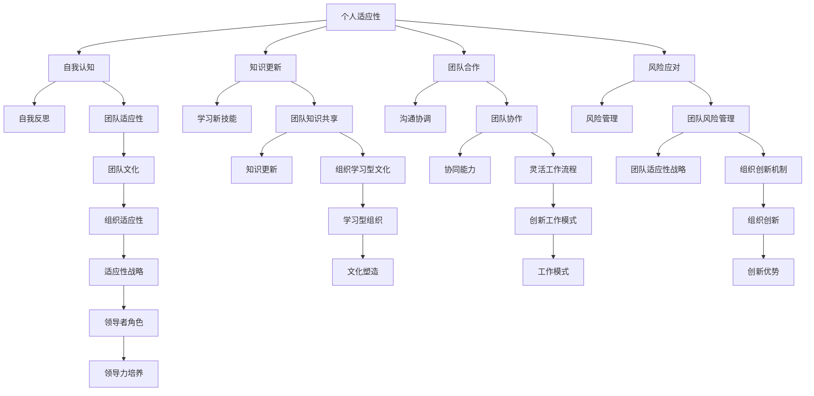

                 

### 《提高生存的灵活性：培养适应变化的能力》

在信息技术飞速发展的今天，生存的灵活性显得尤为重要。本博客将深入探讨如何在个人、团队和组织层面培养适应变化的能力，以提高生存的灵活性。以下是本博客的目录大纲，以及核心概念和联系架构的Mermaid流程图。

---

**目录大纲：**

# 《提高生存的灵活性：培养适应变化的能力》

> 关键词：灵活性、适应能力、变化、个人、团队、组织

> 摘要：本文将从定义、重要性、培养方法以及实践策略等多个角度，系统性地探讨如何在个人、团队和组织层面提高生存的灵活性，以应对不断变化的外部环境。

---

**核心概念与联系架构：**

以下是一个描述核心概念之间关系的Mermaid流程图：

---

接下来，我们将一步一步分析推理，深入探讨灵活性的重要性、变化的世界、适应性培养方法以及具体实践策略。希望通过本文的阐述，读者能够更好地理解如何在变化中保持灵活性，提升生存能力。让我们开始吧！
### 灵活性的定义与价值

灵活性，通常被理解为在变化的环境中迅速适应并有效应对各种挑战的能力。它不仅仅体现在个人层面上，还涉及团队和组织层面。在个人层面，灵活性意味着能够灵活调整自己的行为和思维模式，以适应不断变化的外部环境和内部需求。例如，一个灵活的个人可以在职业发展中快速掌握新技能，适应新的工作职责，甚至在面对突发事件时保持冷静和应对自如。

在团队层面，灵活性表现为团队成员之间的高度协同与合作，能够迅速调整团队策略以应对外部变化。一个具有高度灵活性的团队，能够在复杂和动态的环境中迅速做出决策，并高效执行这些决策。例如，一个敏捷开发团队能够灵活调整工作计划，快速响应客户需求变化，从而保持项目的顺利进行。

在组织层面，灵活性意味着组织能够灵活调整其战略、流程和文化，以适应外部环境和内部需求的变化。一个具有高度灵活性的组织，能够迅速适应市场变化，抓住新的商业机会，甚至在面对重大挑战时保持稳定和持续发展。例如，一些大型科技公司通过快速创新和灵活的市场策略，成功地在多个行业中占据领先地位。

灵活性在多个方面具有重要的价值。首先，它能够提高个人的竞争力和适应性。在当今快速变化的世界中，那些能够快速学习和适应新环境的个人，往往能够在职业生涯中取得更大的成功。其次，团队和组织的灵活性能够提高其效率和创新能力。灵活的团队和组织能够更快地响应市场变化，更好地满足客户需求，从而在竞争中保持优势。最后，灵活性有助于降低风险。在面对不确定性和变化时，灵活的个体、团队和组织能够更好地应对各种挑战，降低失败的可能性。

总之，灵活性是个人、团队和组织在变化的环境中生存和发展的关键能力。理解灵活性的定义和价值，是培养适应变化能力的第一步。在接下来的章节中，我们将进一步探讨变化的世界，以及如何在个人、团队和组织层面培养适应变化的能力。

#### 灵活性的重要性

在当今快速变化的世界中，灵活性成为个人、团队和组织生存与发展的关键能力。首先，从个人层面来看，灵活性是提升职业竞争力的重要因素。现代社会要求个人具备多方面的技能和快速学习的能力，以应对不断变化的工作环境和职业需求。一个具有高度灵活性的个人，能够迅速掌握新技能，适应新岗位，甚至在职业生涯中实现角色转换。例如，一名软件工程师可能需要不断学习新的编程语言和技术框架，以保持其在行业中的竞争力。灵活性使得个人能够在这种快速变化的环境中保持职业发展的优势。

其次，在团队层面，灵活性是提升团队协作效率和创新能力的重要手段。一个具有高度灵活性的团队，能够迅速适应外部环境的变化，灵活调整团队策略和工作流程。例如，在敏捷开发中，团队成员需要根据客户需求的变化，快速调整项目计划和开发策略，确保项目的顺利进行。这种灵活性不仅提高了团队的响应速度，也促进了创新和协作。团队成员之间的有效沟通和合作，使得团队在面对复杂问题时能够迅速找到解决方案。

在组织层面，灵活性是保持组织持续发展的关键。随着市场的不断变化和竞争的加剧，组织需要具备快速调整战略和灵活应对挑战的能力。一个具有高度灵活性的组织，能够迅速适应市场变化，抓住新的商业机会，并在面对危机时保持稳定。例如，一些成功的科技公司通过快速创新和灵活的市场策略，在竞争激烈的市场环境中始终保持领先地位。此外，灵活性还体现在组织的文化和管理模式上，一个具有灵活文化的组织，能够鼓励创新和自我调整，从而实现持续发展。

总的来说，灵活性在个人、团队和组织层面都有着重要的价值。它不仅能够提升个人的职业竞争力，还能提高团队的协作效率和创新能力，最终帮助组织在快速变化的市场环境中保持竞争优势。在下一章节中，我们将进一步探讨变化的世界，以及这种变化对个人、团队和组织带来的影响。

#### 变化的趋势与特征

在当今社会，变化已经成为一种常态，其趋势和特征日益显著。首先，技术的迅猛发展是推动变化的重要力量。从互联网的普及到人工智能、大数据和区块链等新兴技术的兴起，技术变革不断重塑社会结构和经济模式。例如，移动互联网的普及使得人们的生活方式发生了翻天覆地的变化，电子商务的兴起也彻底改变了传统零售行业的格局。

其次，全球化进程的加速也加剧了变化的速度和范围。全球化使得各国之间的联系更加紧密，资源、信息和人才的流动更加便捷。这不仅促进了经济的发展，也带来了文化、社会和经济的多样化。例如，跨国公司的发展使得不同国家和地区的商业环境相互影响，国际市场的竞争更加激烈，同时也为企业和个人提供了更多的机会和挑战。

此外，市场需求的快速变化也是变化的重要特征之一。消费者行为和需求不断演变，企业需要不断调整策略以满足这些变化。例如，随着消费者对环保和可持续发展的关注度增加，企业开始加大对绿色产品和服务的研发投入。这种市场需求的变化要求企业具备高度的灵活性和快速响应能力。

社会环境的动态变化也是变化的重要趋势。政治、法律、经济等多方面的因素都在不断变化，给个人和组织带来了不确定性。例如，税收政策的调整、国际贸易协议的变化等都可能对企业的运营产生影响。此外，社会价值观和文化的多元性也使得组织在管理和发展过程中面临更多的挑战和机遇。

总之，变化的趋势和特征体现在多个方面，包括技术、全球化、市场和社会环境等。这些变化不仅改变了个人和组织的工作方式，也要求其具备更高的灵活性和适应性。在下一章节中，我们将进一步探讨这些变化对个人、团队和组织带来的具体影响。

#### 变化对个人和组织的影响

变化对个人和组织的影响是深远且多维的。对于个人而言，变化意味着机遇与挑战并存。首先，个人需要应对快速变化的环境，不断提升自己的技能和知识储备，以适应新的职业要求。例如，随着数字化和自动化技术的普及，许多传统行业的工作岗位正在被新兴技术所取代，这要求个人必须具备适应新技术的能力。然而，这同时也带来了职业发展的新机遇，如数据分析师、人工智能工程师等新兴职业的涌现，为有志于追求新领域的人才提供了广阔的发展空间。

对于组织而言，变化同样带来了一系列挑战和机遇。首先，组织需要不断调整其战略和运营模式，以应对外部环境的变化。例如，市场的快速变化要求组织能够迅速调整产品策略和市场定位，以满足客户需求。此外，技术进步也迫使企业不断进行技术创新，以保持竞争力。例如，一些传统的制造业企业通过引入智能制造技术，不仅提高了生产效率，还实现了产品质量的持续提升。

然而，变化也带来了一定的风险和挑战。对于个人而言，快速变化的环境可能导致职业不稳定，甚至失业的风险增加。例如，自动化和人工智能技术的广泛应用可能导致部分传统岗位的消失，这要求个人必须具备更强的学习能力和适应性，以应对职业转换和岗位调整。对于组织而言，变化带来的不确定性可能影响其稳定性和发展速度。例如，市场的剧烈波动和竞争加剧可能对企业的盈利能力造成影响，这要求组织具备更高的灵活性和风险管理能力，以应对潜在的风险。

尽管变化带来了挑战，但它同样为个人和组织提供了机遇。对于个人而言，变化可以激发创新和创造力，帮助个人实现职业发展和个人成长。例如，通过学习新的技能和知识，个人可以更好地适应变化，甚至引领变化。对于组织而言，变化可以促使企业进行战略转型和创新，开拓新的市场和业务领域。例如，一些科技公司通过不断创新和变革，成功实现了从传统行业向新兴领域的转型，从而取得了巨大的商业成功。

总之，变化对个人和组织既是挑战也是机遇。个人和组织需要具备适应变化的能力，积极应对变化带来的挑战，同时抓住变化带来的机遇，以实现持续发展和成长。在下一章节中，我们将探讨如何从个人、团队和组织层面培养适应变化的能力。

### 个人层面的适应性培养

在个人层面，适应性培养是一个涉及自我认知、知识更新、团队合作和风险管理的多维度过程。以下将从这些方面详细探讨如何培养适应变化的能力。

#### 自我认知与反思

自我认知是适应性培养的基础。通过自我反思，个人可以深入了解自己的优势、劣势、兴趣和职业目标。这种自我认知有助于个人在变化的环境中明确自己的定位和方向。例如，通过定期进行自我评估，个人可以识别出自己在技能和知识上的短板，并制定相应的提升计划。

具体步骤如下：
1. **定期自我评估**：个人可以每年或每半年进行一次全面的自我评估，包括职业目标、技能水平、兴趣爱好等方面。
2. **反思日常行为**：在日常生活中，个人应时常反思自己的行为和决策，思考哪些是有效的，哪些需要改进。
3. **设定目标**：根据自我评估的结果，制定短期和长期的职业发展目标，确保目标具有可行性和可衡量性。

#### 学习与知识更新

知识更新是适应变化的重要手段。在技术飞速发展的时代，个人必须不断学习新知识和技能，以保持竞争力。以下是一些有效的学习方法：

1. **终身学习**：树立终身学习的观念，将学习视为一种生活方式，而不是一项任务。可以利用在线课程、专业书籍、研讨会等多种渠道进行学习。
2. **实践应用**：将所学知识应用到实际工作中，通过实践检验学习成果。例如，学习了一项新技术后，可以尝试将其应用到实际项目中。
3. **跨领域学习**：跨领域学习可以帮助个人拓宽视野，增强综合能力。例如，技术人员可以学习一些管理知识，而管理人员可以学习一些技术知识。

#### 团队合作与沟通

团队合作是个人适应变化的重要途径。在团队中，个人需要与不同背景和技能的人合作，共同应对挑战。以下是一些提高团队合作和沟通能力的策略：

1. **建立有效的沟通机制**：确保团队成员之间的信息流通畅通，避免误解和冲突。例如，定期召开团队会议，共享信息和进展。
2. **培养团队精神**：通过团队建设活动，增强团队成员之间的信任和合作意识。例如，组织团队拓展训练、团队聚餐等。
3. **分工合作**：合理分配任务，确保每个人都能发挥自己的优势。通过明确的分工，提高团队的效率和协作效果。

#### 风险管理与应对策略

在变化的环境中，个人和组织都面临着各种风险。有效的风险管理可以帮助个人降低风险，并从中寻找机遇。以下是一些风险管理的方法：

1. **风险评估**：定期对可能面临的风险进行评估，分析风险的可能性和影响程度。例如，使用概率分布图或风险矩阵进行评估。
2. **制定应急预案**：针对可能发生的高风险情况，制定相应的应急预案。例如，为突发的市场变化或技术故障制定应对方案。
3. **灵活调整**：在应对风险时，个人需要具备灵活调整的能力，根据实际情况调整策略和行动。例如，在技术更新时，灵活调整学习计划，确保跟上最新的技术趋势。

总之，个人层面的适应性培养涉及多个方面，包括自我认知、知识更新、团队合作和风险管理。通过不断学习和实践，个人可以提升适应变化的能力，更好地应对外部环境的变化。在下一章节中，我们将探讨团队层面的适应性培养。

#### 建立适应性的团队文化

在团队层面，培养适应性首先需要建立一个具有灵活性和创新精神的团队文化。这种文化不仅能够激励团队成员在面对变化时保持积极的态度，还能提高团队的协作效率和创新水平。以下是一些关键步骤和策略：

1. **明确团队目标**：确保所有团队成员对团队目标有清晰的认识和共识。团队目标应具有挑战性，同时也要具有可实现性，以激励团队成员不断追求卓越。具体步骤包括：
   - 定期回顾和更新团队目标，确保其与组织战略保持一致。
   - 与团队成员进行开放讨论，确保每个成员都参与目标的设定过程。

2. **培养开放沟通**：开放沟通是建立适应性团队文化的基础。团队成员应能够在任何情况下自由地表达自己的观点和想法，而不会担心被批评或排斥。具体策略包括：
   - 定期召开团队会议，鼓励成员分享自己的见解和问题。
   - 创建一个支持性环境，鼓励团队成员提出建设性的反馈和建议。
   - 采用匿名反馈机制，确保成员能够自由地表达真实想法。

3. **鼓励创新思维**：创新是团队适应变化的重要手段。通过鼓励创新思维，团队可以更快地适应新环境，抓住新的机遇。具体策略包括：
   - 设立创新奖项，表彰在团队创新活动中表现突出的成员。
   - 鼓励团队成员参与跨部门或跨领域的项目，以拓宽视野和思路。
   - 创建一个鼓励试错的环境，让团队成员在尝试新想法时不会担心失败。

4. **建立灵活的工作流程**：灵活的工作流程能够提高团队的响应速度和适应能力。具体步骤包括：
   - 采用敏捷开发方法，例如Scrum或Kanban，以快速响应客户需求和市场变化。
   - 实施远程工作和弹性工作时间制度，以适应团队成员的不同需求和生活方式。
   - 简化决策流程，减少冗长的审批环节，提高团队的决策效率。

5. **强化团队协作**：团队协作是实现团队目标的关键。通过强化团队协作，可以提高团队的整体效率和创新能力。具体策略包括：
   - 定期组织团队建设活动，增强团队成员之间的信任和默契。
   - 采用跨职能团队模式，促进不同部门之间的合作和知识共享。
   - 实施知识管理计划，确保团队内部的知识和经验得到有效积累和传播。

总之，建立适应性的团队文化需要明确团队目标、培养开放沟通、鼓励创新思维、建立灵活的工作流程和强化团队协作。通过这些策略，团队可以更好地应对外部环境的变化，提高整体适应能力和创新水平。在下一章节中，我们将探讨组织层面的适应性培养。

### 提升团队的灵活性和协同能力

要提升团队的灵活性和协同能力，关键在于优化团队的工作流程和协作机制，同时通过有效的策略和方法，增强团队成员之间的合作和互动。以下是一些具体的策略和方法：

1. **敏捷工作流程**：敏捷开发方法，如Scrum和Kanban，可以显著提升团队的灵活性和响应速度。通过短周期的迭代和持续反馈，团队能够快速适应变化，及时调整工作计划。具体步骤包括：
   - **定期迭代**：将项目划分为多个短期迭代，每个迭代结束后进行回顾和评估，确保团队能够不断优化工作流程。
   - **每日站会**：通过每日站会，团队成员可以快速交流进展、问题和计划，确保团队目标的一致性。
   - **任务看板**：使用看板（Kanban）方法，可视化团队的任务进度和瓶颈，帮助团队更好地协调工作。

2. **跨职能团队**：跨职能团队模式可以促进不同部门之间的知识共享和协作，提高团队的灵活性和整体效率。具体步骤包括：
   - **职责明确**：为每个团队成员明确其在团队中的角色和职责，确保每个成员都能发挥其专长。
   - **跨部门项目**：定期开展跨部门的合作项目，促进不同领域知识和技能的交流。
   - **共享资源**：共享团队资源，如技术工具、会议室等，以减少沟通障碍和资源浪费。

3. **信息透明**：确保团队内部信息的透明和流通，可以提高团队成员之间的协作效率。具体策略包括：
   - **实时沟通工具**：使用实时沟通工具（如Slack、Microsoft Teams）确保团队成员能够随时交流信息。
   - **知识共享平台**：建立内部知识共享平台，如Wiki或Confluence，使团队成员能够方便地查阅和分享文档、报告和经验。
   - **项目进度跟踪**：使用项目管理工具（如JIRA、Trello）实时跟踪项目进度，确保团队成员对项目状态有清晰的了解。

4. **灵活的决策机制**：在团队中建立灵活的决策机制，可以使团队在面对变化时能够迅速做出反应。具体策略包括：
   - **决策分层**：根据问题的紧急程度和影响范围，设定不同的决策层级，确保重要问题能够快速得到解决。
   - **集体决策**：鼓励团队成员参与决策过程，确保每个成员的声音都能被听到，增加决策的透明度和接受度。
   - **快速决策**：在必要时，采用快速决策机制，减少冗长的讨论和决策时间，提高响应速度。

5. **持续培训和学习**：为了提升团队的灵活性和协同能力，团队成员需要不断学习新技能和知识，以适应不断变化的环境。具体策略包括：
   - **定期培训**：为团队成员提供定期的技能培训，确保团队技能的持续提升。
   - **鼓励自学**：鼓励团队成员自主学习，提供在线课程、书籍和其他学习资源。
   - **经验分享**：定期组织经验分享会，团队成员可以分享自己的经验和教训，促进知识和经验的传递。

通过实施这些策略和方法，团队可以显著提升其灵活性和协同能力，更好地适应变化的环境，提高整体效率和创新能力。在下一章节中，我们将探讨组织层面的适应性培养。

### 组织层面的适应性培养

在组织层面，适应性培养是一个涉及战略、文化、工作模式和创新机制的系统过程。以下将从这些方面详细探讨如何培养组织整体的适应性。

#### 组织变革与适应性战略

组织变革是提升组织适应性的重要手段。通过系统性的变革，组织可以调整其战略、结构和文化，以更好地应对外部环境的变化。以下是一些关键步骤：

1. **制定适应性战略**：组织需要根据外部环境和内部资源，制定适应性战略。具体步骤包括：
   - **市场分析**：分析外部环境的变化趋势，如技术发展、市场动态等，确定组织需要适应的方向。
   - **资源评估**：评估内部资源，如人才、技术、资金等，确保战略的可行性。
   - **目标设定**：明确组织的目标和愿景，确保战略与组织的长期发展目标一致。

2. **领导层的支持**：领导层的支持和参与是组织变革成功的关键。具体策略包括：
   - **倡导变革**：领导层应积极倡导变革，树立变革的信心和决心。
   - **提供资源**：为变革提供必要的资源和支持，如资金、人力和时间等。
   - **沟通与培训**：通过有效的沟通和培训，确保全体员工理解变革的重要性和目的。

3. **分阶段实施**：组织变革应分阶段进行，逐步推进，避免一次性变革带来的冲击。具体步骤包括：
   - **试点项目**：在部分部门或项目中先行试点，积累经验和教训。
   - **逐步推广**：根据试点项目的反馈，逐步将变革推广到整个组织。

#### 建立学习型组织

学习型组织是一种能够持续学习和适应变化的组织形态。以下是一些建立学习型组织的策略：

1. **知识管理**：通过有效的知识管理，组织可以积累和传播经验，提高整体学习能力。具体策略包括：
   - **知识共享平台**：建立内部知识共享平台，如Wiki或Confluence，确保知识能够在组织内部自由流通。
   - **经验分享会**：定期组织经验分享会，让员工分享自己的经验和教训，促进知识的传播。

2. **员工培训**：定期为员工提供培训，提高其技能和知识水平。具体策略包括：
   - **定制化培训**：根据员工的岗位和需求，提供定制化的培训课程。
   - **外部培训**：鼓励员工参加外部培训和学习，拓展视野和知识面。

3. **鼓励创新**：鼓励员工提出创新想法，并为其提供支持和资源。具体策略包括：
   - **创新项目**：设立创新项目，鼓励员工参与并实践创新想法。
   - **奖励机制**：对提出创新想法并取得成果的员工进行奖励，激励创新氛围。

#### 灵活的工作模式与创新机制

灵活的工作模式和创新机制是提高组织适应性的关键。以下是一些具体策略：

1. **远程工作**：远程工作可以增强员工的灵活性和自主性，提高工作效率。具体策略包括：
   - **远程协作工具**：使用远程协作工具，如Zoom、Slack等，确保远程工作的顺利进行。
   - **弹性工作时间**：实施弹性工作时间制度，让员工能够根据个人需求调整工作时间。

2. **跨部门协作**：跨部门协作可以促进不同部门之间的知识共享和合作，提高组织的整体效率。具体策略包括：
   - **跨部门项目**：定期开展跨部门项目，促进部门间的交流和合作。
   - **共同目标**：确保跨部门项目具有共同的目标，减少部门间的摩擦和冲突。

3. **创新激励机制**：通过建立创新激励机制，鼓励员工提出创新想法并付诸实践。具体策略包括：
   - **创新奖项**：设立创新奖项，对提出创新想法并取得成功的员工进行奖励。
   - **预算支持**：为创新项目提供预算支持，确保创新想法能够得到实际应用。

4. **实验性工作环境**：创建实验性工作环境，鼓励员工进行实验和创新。具体策略包括：
   - **实验项目**：设立实验项目，允许员工在实验环境中进行创新尝试。
   - **风险容忍**：在实验环境中，对失败的尝试保持开放的态度，鼓励员工从失败中学习。

通过实施这些策略，组织可以显著提升其适应性，更好地应对外部环境的变化。在下一章节中，我们将探讨如何应对变化的具体策略和方法。

### 应对变化的策略与方法

在变化不断的环境中，组织需要采取一系列具体的策略和方法来确保其能够灵活应对各种挑战。以下是一些核心策略和方法：

#### 快速响应与决策

1. **敏捷决策框架**：建立敏捷决策框架，使组织能够快速响应外部环境的变化。具体步骤包括：
   - **简化决策流程**：减少不必要的审批环节，提高决策效率。
   - **决策权下放**：将决策权下放到最接近问题的一线团队，使决策更加快速和准确。
   - **实时沟通工具**：使用实时沟通工具，如Slack或Microsoft Teams，确保决策过程中的信息流通和协作。

2. **情景分析**：进行情景分析，预测可能的变化及其影响，制定相应的应对策略。具体步骤包括：
   - **识别关键因素**：识别可能影响组织的关键因素，如市场需求变化、技术进步等。
   - **模拟情景**：模拟不同的变化情景，分析其可能的影响和组织的应对措施。
   - **制定应急预案**：根据情景分析结果，制定相应的应急预案，确保在变化发生时能够迅速响应。

#### 适应性计划的制定与执行

1. **滚动计划**：采用滚动计划方法，根据外部环境的变化及时调整组织的战略和运营计划。具体步骤包括：
   - **定期回顾**：定期回顾组织的计划执行情况，分析存在的问题和新的变化。
   - **动态调整**：根据新的信息和反馈，动态调整计划，确保其与当前环境相符。

2. **弹性预算**：建立弹性预算，使组织在变化环境中能够灵活调整资源分配。具体步骤包括：
   - **预算灵活性**：在预算编制时考虑不确定因素，确保预算具有一定的灵活性。
   - **定期审查**：定期审查预算执行情况，根据实际情况进行调整。

#### 灵活调整与持续优化

1. **持续改进文化**：培养持续改进的文化，使组织成员不断寻找优化机会。具体策略包括：
   - **员工参与**：鼓励员工提出优化建议，并为其提供反馈和支持。
   - **改进机制**：建立改进机制，如持续改进项目（Kaizen），确保优化建议能够得到实施。

2. **实时监控与反馈**：通过实时监控和反馈机制，确保组织能够及时了解变化的影响，并进行调整。具体策略包括：
   - **关键指标监控**：监控关键业务指标，如销售额、客户满意度等，及时发现变化的影响。
   - **定期反馈**：定期收集和反馈员工和客户的信息，分析其意见和建议，确保组织能够及时响应。

3. **持续学习和创新**：通过持续学习和创新，组织能够保持其适应能力。具体策略包括：
   - **内部培训**：定期为员工提供培训，提高其技能和知识水平。
   - **外部学习**：鼓励员工参加外部培训和研讨会，了解最新的行业动态和技术趋势。

通过实施这些策略和方法，组织可以显著提升其适应变化的能力，确保在动态环境中保持竞争力和持续发展。在下一章节中，我们将通过案例分析，进一步探讨适应变化的具体实践。

### 灵活性与生存战略

灵活性在组织生存战略中扮演着至关重要的角色。它不仅是组织应对外部环境变化的利器，更是实现可持续发展的重要保障。以下从几个方面探讨灵活性在组织生存战略中的重要性。

#### 灵活性与可持续发展的关系

首先，灵活性是组织实现可持续发展的关键。在变化多端的市场环境中，只有具备灵活性的组织才能迅速适应外部变化，抓住新的商业机会，避免因市场波动带来的风险。例如，全球金融危机期间，许多企业通过灵活调整战略和运营模式，成功实现了业务的持续增长，而那些缺乏灵活性的企业则陷入了困境。

具体来说，灵活性在可持续发展中的重要性体现在以下几个方面：

1. **市场响应速度**：灵活性的组织能够更快地响应市场需求变化，推出符合市场期望的产品和服务。这种快速响应能力不仅能够提高市场份额，还能增强客户满意度。

2. **资源优化配置**：灵活性的组织能够根据外部环境的变化，及时调整资源分配策略，确保资源的最优配置。例如，在市场需求下降时，灵活性的组织可以迅速减少不必要的开支，避免资源浪费。

3. **创新驱动发展**：灵活性促使组织不断进行技术创新和管理创新，从而保持竞争力。例如，一些高科技企业通过不断推出新技术和产品，实现了持续的高速增长。

#### 灵活性在竞争中的优势

其次，灵活性是组织在竞争中保持优势的重要手段。在市场竞争日益激烈的环境下，只有具备灵活性的组织才能迅速调整战略，抢占市场先机。例如，在面对新兴市场或竞争对手的挑战时，灵活性的组织能够快速调整产品线、市场策略和运营模式，从而抢占市场份额。

具体来说，灵活性在竞争中的优势体现在以下几个方面：

1. **快速创新**：灵活性的组织能够迅速响应市场变化，进行技术创新和管理创新，从而保持领先地位。例如，一些科技企业通过持续的创新，推出了一系列革命性的产品，从而在市场中取得了巨大的成功。

2. **战略调整**：灵活性的组织能够根据市场环境和竞争对手的动态，迅速调整战略，确保在竞争中占据优势。例如，一些快速消费品企业通过灵活的市场策略，成功地在多个市场中占据领先地位。

3. **资源整合**：灵活性的组织能够迅速整合内外部资源，实现资源的最佳配置。例如，一些跨国企业通过全球资源整合，实现了全球业务的快速发展。

#### 灵活性对组织文化的塑造

最后，灵活性对组织文化的塑造也具有重要影响。一个具备高度灵活性的组织，往往能够形成开放、创新和包容的文化氛围。这种文化氛围不仅能够激发员工的创造力，还能提高组织的整体适应能力。

具体来说，灵活性对组织文化的塑造体现在以下几个方面：

1. **开放沟通**：灵活性的组织鼓励开放沟通，使员工能够自由地表达自己的观点和建议。这种开放沟通环境有助于提高组织的决策效率和创新能力。

2. **创新驱动**：灵活性的组织注重创新，鼓励员工进行创新思维和实践。这种创新文化能够激发员工的创造力，推动组织不断发展。

3. **包容性文化**：灵活性的组织尊重多样性和差异，为员工提供平等的发展机会。这种包容性文化能够提高员工的满意度和忠诚度，从而增强组织的凝聚力。

总之，灵活性在组织生存战略中具有不可替代的重要性。它不仅是组织应对外部环境变化的利器，更是实现可持续发展、保持竞争优势和塑造积极文化的重要保障。在下一章节中，我们将通过具体的案例，进一步探讨组织如何在实际操作中实现灵活性。

### 案例分析

在本章节中，我们将通过几个成功的适应性转型案例和失败的适应性尝试，深入剖析组织如何在实际操作中实现灵活性，以及如何从失败中吸取教训，总结最佳实践。

#### 成功的适应性转型案例

**案例一：谷歌的敏捷转型**

谷歌是知名的高科技企业，其成功的关键之一在于持续适应变化的能力。在2000年代初期，谷歌面临互联网泡沫破裂带来的市场环境变化和竞争压力。为了保持竞争优势，谷歌决定实施敏捷转型。

- **背景介绍**：谷歌在转型前面临市场动荡、竞争加剧和内部管理复杂等问题。为了应对这些挑战，谷歌决定采用敏捷开发方法，提高开发效率和产品迭代速度。
- **实施过程**：
  - **敏捷培训**：谷歌为全体员工提供了敏捷开发方法的培训，确保每个团队成员都了解和掌握敏捷原则。
  - **团队重构**：谷歌将传统的开发团队重构为多个小型、自主的敏捷团队，每个团队负责不同的项目模块。
  - **持续集成**：引入持续集成和持续交付（CI/CD）流程，实现快速开发和迭代。
- **结果**：通过敏捷转型，谷歌显著提高了开发效率，缩短了产品上线时间，并增强了团队的协作和创新能力。这一转型帮助谷歌在激烈的市场竞争中保持了领先地位。

**案例二：丹麦邮政的数字化转型**

丹麦邮政是一家传统的邮政服务企业，面对电商和数字技术的冲击，丹麦邮政决定进行全面的数字化转型，以提高灵活性和竞争力。

- **背景介绍**：随着电商的发展，传统邮政服务面临巨大的挑战。为了保持市场地位，丹麦邮政决定进行数字化转型，提供更加便捷和高效的物流服务。
- **实施过程**：
  - **业务重构**：丹麦邮政重新定义了其业务模式，从传统的邮政服务转型为综合物流服务提供商。
  - **技术创新**：引入物联网（IoT）、大数据和人工智能（AI）技术，提高物流效率和准确性。
  - **客户体验优化**：通过数字化手段，提升客户体验，如在线追踪、自助服务终端等。
- **结果**：数字化转型使丹麦邮政在物流市场上取得了显著优势，客户满意度大幅提升，业务收入和市场份额也实现了稳步增长。

#### 失败的适应性尝试与反思

**案例一：柯达的数字化转型失败**

柯达是一家成立于19世纪末的全球知名胶片公司，但在面对数字摄影的冲击时，柯达未能及时适应变化，最终导致公司破产。

- **背景介绍**：随着数字摄影技术的兴起，胶片摄影市场逐渐萎缩。柯达作为行业的领导者，本应抓住这一机遇进行数字化转型。
- **失败原因**：
  - **战略决策迟缓**：柯达在看到数字摄影的发展趋势后，未能及时调整战略，错失了转型的最佳时机。
  - **组织惯性**：柯达内部存在强烈的组织惯性，无法迅速适应新的业务模式和市场需求。
  - **文化滞后**：柯达的文化氛围相对保守，创新和变革的意识较弱，难以推动全面转型。
- **教训**：柯达的失败表明，组织在面对外部变化时，必须具备快速决策和灵活适应的能力。同时，组织文化和组织惯性也是成功转型的重要制约因素。

**案例二：诺基亚的智能手机战略失败**

诺基亚曾是全球最大的手机制造商，但在面对苹果和三星等竞争对手的挑战时，诺基亚未能及时调整其智能手机战略，最终导致市场份额大幅下降。

- **背景介绍**：随着智能手机市场的兴起，诺基亚作为传统手机市场的领导者，本应迅速调整产品策略，进入智能手机市场。
- **失败原因**：
  - **战略失误**：诺基亚在智能手机市场上的战略过于保守，未能及时推出具有竞争力的产品。
  - **研发投入不足**：诺基亚在技术研发上的投入相对不足，导致其智能手机产品缺乏创新和竞争力。
  - **组织结构调整缓慢**：诺基亚在组织结构调整上动作迟缓，无法快速适应市场变化。
- **教训**：诺基亚的失败提醒我们，组织在面对市场变化时，必须保持敏锐的战略眼光和快速响应能力，同时加大技术研发投入，以保持竞争优势。

#### 适应变化的最佳实践

1. **快速决策与执行**：组织在面对外部变化时，必须具备快速决策和执行的能力。通过简化决策流程、授权一线团队和引入敏捷决策框架，组织可以显著提高决策效率。

2. **持续创新**：组织应鼓励持续创新，建立创新文化和机制。通过设立创新项目、鼓励员工提出创新建议和提供必要的资源支持，组织可以不断提升其创新能力。

3. **组织文化和氛围**：组织文化和氛围对适应性具有重要影响。组织应营造开放、创新和包容的文化氛围，鼓励员工自由表达观点，勇于尝试和失败。

4. **灵活的工作模式**：组织应采用灵活的工作模式，如远程工作、弹性工作时间和跨部门协作，以提升团队的灵活性和协同能力。

5. **外部学习和合作**：组织应积极开展外部学习和合作，借鉴行业最佳实践，与合作伙伴共同应对外部变化。

通过以上最佳实践，组织可以更好地适应外部环境的变化，提升其生存能力和竞争优势。在下一章节中，我们将探讨如何通过终身学习和评估策略，持续提升灵活性。

### 持续提升灵活性

在快速变化的环境中，持续提升灵活性是组织和个人成功的关键。以下从终身学习、评估策略和持续改进的角度，探讨如何实现灵活性的不断提升。

#### 终身学习的力量

终身学习是提升灵活性不可或缺的一部分。在技术飞速发展的时代，知识更新速度极快，个人和组织必须不断学习新技能和知识，以保持竞争力。以下是一些有效的学习方法：

1. **在线学习平台**：利用在线学习平台，如Coursera、edX和Udemy，学习最新的技术课程和专业知识。在线学习灵活便捷，可以根据个人时间和进度进行学习。
2. **内部培训**：组织内部定期开展培训，邀请行业专家和内部优秀员工分享经验和技术。内部培训不仅能够提升员工的技能，还能促进知识共享和团队协作。
3. **实践应用**：将所学知识应用到实际工作中，通过实践检验学习成果。实践是检验真理的唯一标准，只有将知识转化为实际能力，才能真正提升灵活性。

#### 评估策略

有效的评估策略可以帮助组织和个人了解其当前的灵活性水平，并制定相应的改进计划。以下是一些常用的评估方法：

1. **灵活性评估指标**：建立灵活性评估指标体系，包括快速响应能力、创新水平、组织文化和员工满意度等。通过定期评估，组织可以了解自身在各个方面的表现，并发现需要改进的领域。
2. **员工反馈**：定期收集员工反馈，了解他们在工作中的感受和建议。员工是组织灵活性提升的重要参与者，他们的反馈可以为改进计划提供宝贵的信息。
3. **外部评估**：邀请外部专家对组织的灵活性进行评估，提供客观、专业的意见和建议。外部评估可以帮助组织从更广阔的视角审视自身的灵活性水平。

#### 持续改进的策略

灵活性不是一成不变的，而是一个持续改进的过程。以下是一些有效的持续改进策略：

1. **持续改进文化**：培养持续改进的文化，鼓励员工不断寻找优化机会，并提出改进建议。持续改进文化可以激发员工的创新思维和责任感，提高组织的整体灵活性。
2. **敏捷流程**：采用敏捷开发方法，如Scrum和Kanban，持续优化工作流程和项目管理。敏捷流程强调快速迭代和持续反馈，可以帮助组织迅速适应变化，提高响应速度。
3. **知识管理**：建立有效的知识管理体系，确保知识和经验能够在组织内部自由流通和共享。知识管理不仅能够提升员工的技能水平，还能提高组织的整体适应能力。

#### 持续提升灵活性的长期规划

1. **制定长期规划**：组织应制定长期规划，明确灵活性的提升目标和路径。长期规划应包括具体的行动步骤、时间表和资源分配。
2. **持续监控与评估**：定期监控和评估灵活性提升的效果，确保计划的有效实施。通过持续监控，组织可以及时发现问题，并进行调整。
3. **动态调整**：根据外部环境的变化和内部反馈，动态调整灵活性提升策略。灵活调整可以确保组织始终保持最佳的灵活性水平。

通过终身学习、评估策略和持续改进，组织和个人可以不断提升其灵活性，更好地适应快速变化的环境。在下一章节中，我们将总结本文的主要观点，并强调灵活性的重要性。

### 结论

本文从个人、团队和组织层面深入探讨了灵活性的重要性，并提出了具体的培养策略和实践方法。灵活性不仅是个人在职业发展中保持竞争优势的关键能力，也是团队和组织在快速变化的环境中生存与发展的基础。

在个人层面，灵活性意味着能够快速适应新技能和职业需求，提升自我认知和反思能力，通过终身学习不断更新知识和技能。团队合作中，灵活性表现为高效的协作与沟通，通过敏捷方法和跨职能团队模式提高团队响应速度和创新水平。在组织层面，灵活性体现在适应性战略的制定、学习型组织的建立、灵活工作模式的实施和创新机制的构建。

未来的生存与发展将更加依赖灵活性和适应能力。技术、市场和环境的快速变化要求个人、团队和组织具备更高的灵活性和创新力。只有通过持续学习和改进，不断提升灵活性，才能在动态环境中保持竞争力。

因此，培养适应变化的能力已成为当今社会不可或缺的技能。让我们共同努力，在个人和组织的层面上，不断提升灵活性，迎接未来的挑战，实现可持续发展和成功。

### 附录

**附录A：参考书目与资源链接**

1. 《敏捷开发实践指南》（《Agile Project Management: Creating Innovative Products》） - Jim Highsmith
2. 《精益创业》（《The Lean Startup》） - Eric Ries
3. 《学习之道》（《Mindset: The New Psychology of Success》） - Carol S. Dweck
4. 《团队的五项修炼》（《The Five Dysfunctions of a Team》） - Patrick Lencioni
5. 《跨界思维》（《Out of the Box: The Surprising Path to High Performance at Work and Home》） - Michael Mankins and Eric G. Brown
6. [敏捷开发官方指南](https://www.agilealliance.org/resources/agile-manifesto/)
7. [Scrum官方指南](https://www.scrum.org/resources/scrumbasics)
8. [Kanban方法官方指南](https://www.artofmanagement.org/kanban/)

**附录B：适应性培养实践指南**

1. **个人适应性培养实践指南**
   - 定期进行自我评估和职业规划
   - 利用在线学习平台学习新技能
   - 参与行业研讨会和培训课程
   - 建立学习小组，互相支持和学习

2. **团队适应性培养实践指南**
   - 定期召开团队会议，进行沟通和协作
   - 实施敏捷工作流程，如Scrum或Kanban
   - 建立跨职能团队，促进知识共享和协作
   - 定期进行团队建设活动，增强团队凝聚力

3. **组织适应性培养实践指南**
   - 制定适应性战略，确保与市场环境保持同步
   - 建立学习型组织，促进知识传播和持续学习
   - 采用灵活的工作模式，如远程工作和弹性工作时间
   - 设立创新项目，鼓励员工提出创新想法并付诸实践

**附录C：适应性培训计划模板**

1. **培训目标**
   - 提升个人/团队/组织的灵活性
   - 培养适应变化的能力

2. **培训内容**
   - **基础课程**：
     - 灵活性的定义与价值
     - 适应性战略的制定
     - 敏捷开发方法
     - 学习型组织的建立
   - **实践课程**：
     - 个人自我评估与职业规划
     - 团队协作与沟通技巧
     - 创新思维与问题解决
     - 灵活工作模式的实施

3. **培训安排**
   - **时长**：2-3天
   - **形式**：讲座、案例讨论、小组练习、实践应用

4. **评估方式**
   - **课程结束评估**：通过问卷和讨论，评估学员的学习成果
   - **后续跟踪**：通过定期跟踪，了解培训效果，并进行持续改进

通过这些附录内容，读者可以更好地理解和应用本文中的理论和方法，提升自身和团队的适应性。希望这些资源能够帮助大家在实践中取得成功。

