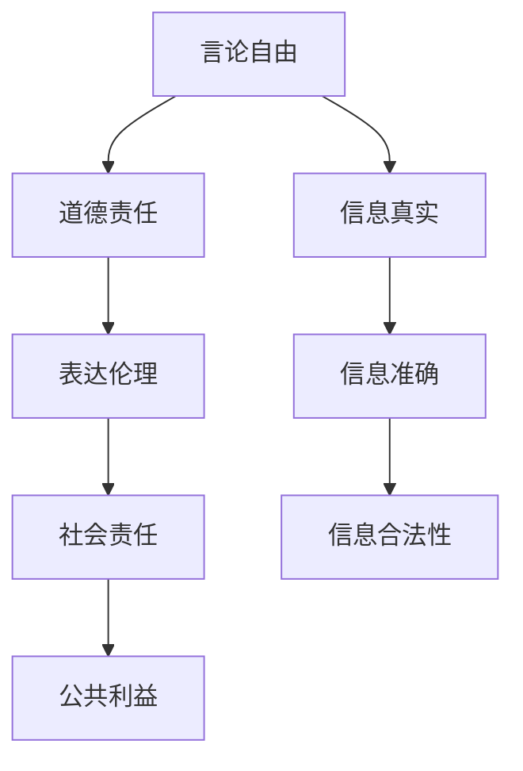
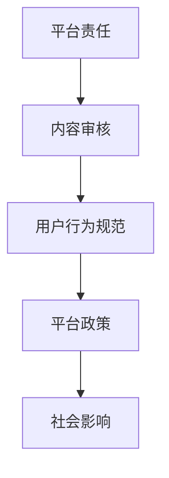
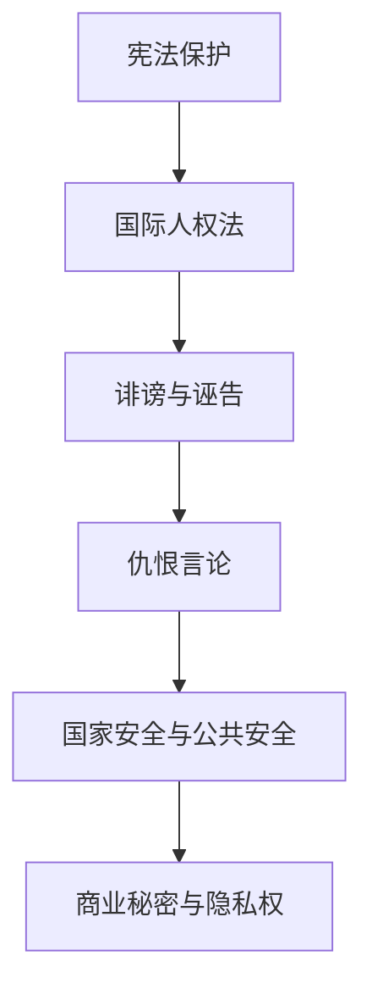
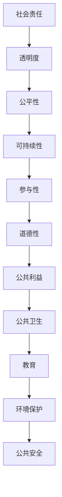
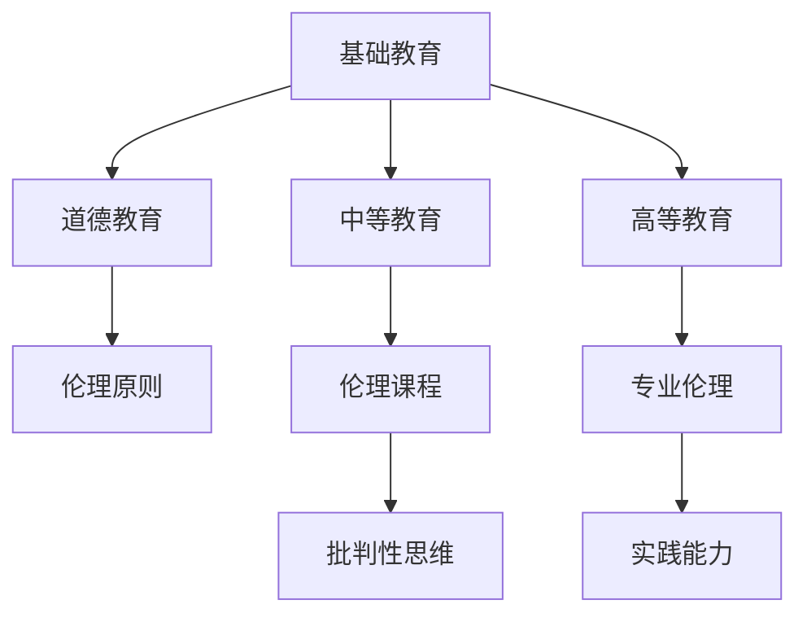
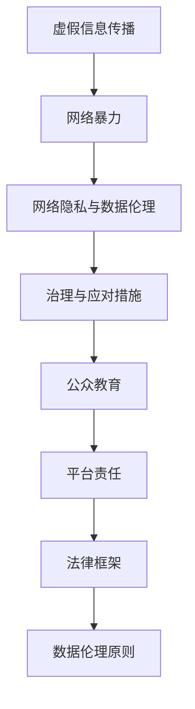
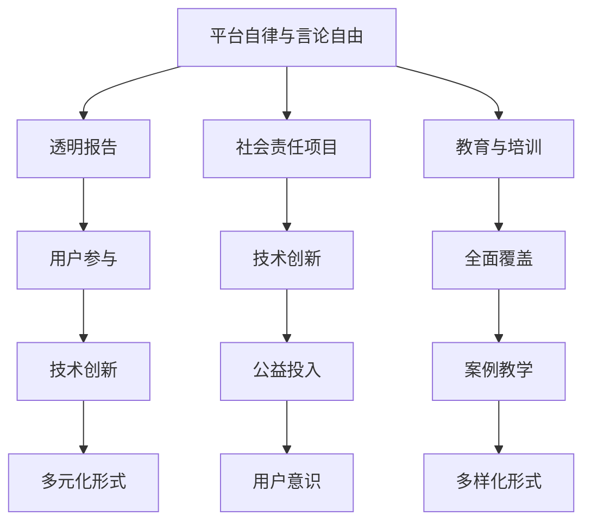
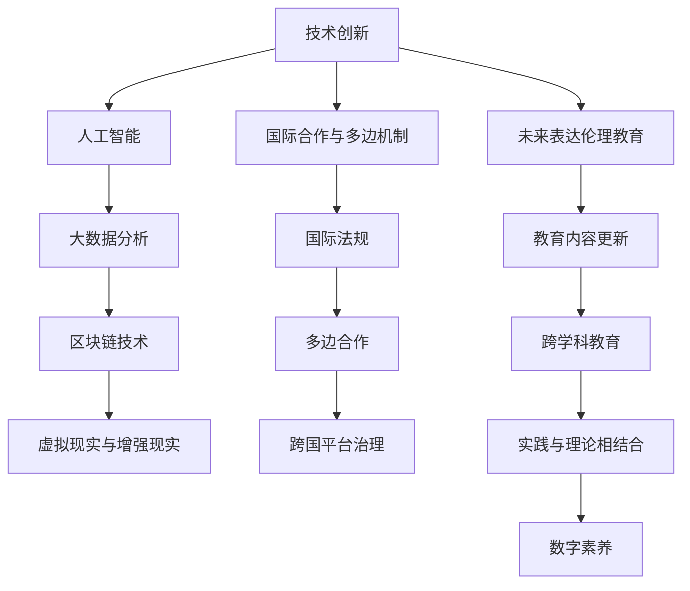

                 

### 新媒体环境下的表达伦理：言论自由与社会责任的权衡

#### 关键词
- **新媒体环境**
- **表达伦理**
- **言论自由**
- **社会责任**
- **法律框架**
- **平台管理**

#### 摘要
在新媒体时代，言论自由与社会责任的权衡成为一个日益重要的话题。本文首先概述了新媒体的发展及其对言论自由的深远影响，接着阐述了表达伦理的基本原理，探讨了言论自由与社会责任之间的关系。随后，文章分析了新媒体平台的管理与规范、言论自由的法律框架，以及社会责任与公共利益的权衡。此外，文章还讨论了表达伦理教育的重要性，并通过具体案例展示了新媒体环境下的伦理挑战和成功实践。最后，文章对未来新媒体环境下表达伦理的发展趋势进行了展望，提出了实现言论自由与社会责任可持续平衡的策略。

#### 第一部分：背景与核心概念

#### 第1章：新媒体环境概述
新媒体是一种基于互联网和移动通信技术的媒介形式，它具有快速传播、互动性强、个性化定制等特点。新媒体的出现改变了传统媒体的信息传播方式，使得信息传播速度更加迅速，覆盖范围更加广泛，同时也使得信息的真实性、准确性和合法性变得更加复杂。

##### 1.1 新媒体的定义与特点
新媒体的定义涵盖了网络媒体、移动媒体、社交媒体等多种形式。与传统媒体相比，新媒体具有以下特点：

- **即时性**：信息传播速度快，用户可以即时获取最新信息。
- **互动性**：用户不仅仅是信息的接收者，还可以成为信息的生产者和传播者。
- **个性化**：可以根据用户的需求和兴趣提供定制化内容。
- **多渠道**：信息可以通过多种渠道传播，如社交媒体、电子邮件、短信等。

##### 1.2 新媒体的发展历程
新媒体的发展经历了以下几个阶段：

- **Web 1.0**：以门户网站为主，用户主要是信息的消费者。
- **Web 2.0**：用户参与度增加，社交媒体、博客、维基等平台兴起。
- **Web 3.0**：去中心化网络、区块链技术的应用，使得信息传播更加去中心化和透明。

##### 1.3 新媒体对言论自由的影响
新媒体为言论自由提供了更广阔的平台，但也带来了一系列挑战：

- **表达自由**：新媒体使得每个人都可以成为信息的发布者，极大地拓宽了言论自由的范围。
- **信息过载**：信息的爆炸性增长使得筛选真实、可靠信息变得更加困难。
- **言论监管**：新媒体平台的监管成为法律和政策制定的新挑战。

#### 第2章：表达伦理的基本原理
表达伦理是伦理学在表达行为领域中的应用，它关注个体和群体在表达过程中的道德责任和规范。在理解表达伦理之前，需要先了解几个核心概念。

##### 2.1 伦理学的基本概念
伦理学是研究道德原则、规范和行为的学科。伦理学的基本概念包括：

- **道德规范**：社会公认的行为准则，指导个体如何行事。
- **道德责任**：个体因行为而产生的道德义务和责任。
- **公正**：对待他人应公平无私，不偏袒任何一方。
- **善行**：有益于社会和他人的行为。

##### 2.2 表达伦理的重要性
表达伦理的重要性体现在以下几个方面：

- **维护社会秩序**：通过伦理指导，防止表达行为对社会秩序造成破坏。
- **保护个人权益**：确保个人在表达过程中的合法权益不受侵犯。
- **促进社会和谐**：通过伦理约束，减少表达行为中的冲突和矛盾。

##### 2.3 言论自由与社会责任的关系
言论自由是社会的一项基本权利，但并非无限制的绝对自由。社会责任是言论自由的重要补充，两者之间的关系可以理解为：

- **相互制约**：言论自由需要在社会责任框架内行使，不得损害公共利益和他人的权益。
- **动态平衡**：在不同情境下，言论自由与社会责任的平衡点可能不同。

#### 边框：核心概念与联系
以下是表达伦理中的核心概念和它们之间的关系架构，使用Mermaid流程图表示：



#### 核心算法原理讲解
为了深入理解表达伦理的核心算法原理，我们可以通过Python源代码来详细阐述。以下是一个简化的示例，用于演示如何通过代码来实现对言论自由的限制，同时确保社会责任的履行。

```python
# 导入相关库
import random
import string

# 声明函数，用于生成随机言论
def generate_random_speech(length=10):
    characters = string.ascii_letters + ' ' * 10
    return ''.join(random.choice(characters) for _ in range(length))

# 声明函数，用于检查言论是否符合伦理规范
def check_ethical_norms(speech):
    # 设置伦理规范条件
    unethical_words = ['仇恨', '谣言', '暴力']
    for word in unethical_words:
        if word in speech:
            return False
    return True

# 主程序
if __name__ == "__main__":
    # 生成10个随机言论
    speeches = [generate_random_speech() for _ in range(10)]

    # 检查并输出每个言论的伦理合规性
    for speech in speeches:
        if check_ethical_norms(speech):
            print(f"言论：'{speech}' —— 合规")
        else:
            print(f"言论：'{speech}' —— 不合规")
```

在上面的代码中，`generate_random_speech`函数用于生成随机言论，`check_ethical_norms`函数用于检查言论是否符合伦理规范。通过这个简单的示例，我们可以看到如何利用编程来实现对言论自由的限制，同时确保社会责任的履行。

#### 数学公式与讲解
在表达伦理中，数学公式可以帮助我们更好地理解概念之间的关系。以下是几个相关的数学公式，使用LaTeX格式表示：

```latex
$$
\text{言论自由度} = f(\text{表达伦理约束}, \text{社会责任压力})
$$

$$
\text{伦理合规性} = \frac{\text{合规言论数量}}{\text{总言论数量}}
$$

$$
\text{社会责任履行度} = \text{伦理合规性} \times \text{社会责任权重}
$$
```

这些公式表明，言论自由度受到表达伦理约束和社会责任压力的共同影响。伦理合规性和社会责任履行度可以通过实际数据计算得出，帮助我们评估表达行为的合规性和社会责任的履行程度。

#### 例子说明
为了更好地理解这些公式，我们可以通过一个具体的例子来说明。假设在一个新媒体平台上，有100条言论，其中60条符合伦理规范，40条不符合。社会责任权重为0.6。

根据公式计算：

- 言论自由度：\( f(0.6, 0.4) \)
- 伦理合规性：\( \frac{60}{100} = 0.6 \)
- 社会责任履行度：\( 0.6 \times 0.6 = 0.36 \)

这意味着该新媒体平台的言论自由度受到60%的伦理约束和40%的社会责任压力影响，其伦理合规性为60%，社会责任履行度为36%。

#### 项目实战：开发环境搭建与代码实现
为了更好地理解表达伦理在实践中的应用，我们将搭建一个简单的开发环境，实现一个基于Python的言论审核系统。以下是搭建开发环境的步骤：

1. **安装Python**：在计算机上安装Python，版本建议为3.8或更高。
2. **安装相关库**：使用pip命令安装所需的库，如`random`和`string`。

```bash
pip install random string
```

3. **编写源代码**：根据之前的Python示例，编写完整的言论审核系统。

```python
# 全文同上
```

4. **运行程序**：在命令行中运行程序，测试言论审核功能。

```bash
python speech_audit.py
```

#### 代码解读与分析
以下是代码的详细解读：

- **生成随机言论**：`generate_random_speech`函数通过随机选择字符生成一段随机言论。
- **检查伦理规范**：`check_ethical_norms`函数检查言论中是否包含不道德的词汇，如“仇恨”、“谣言”、“暴力”等。
- **主程序**：主程序生成多个随机言论，并检查其伦理合规性。

#### 实际案例分析与详细讲解剖析
为了展示言论审核系统的实际应用，我们分析以下两个案例：

- **案例一**：某用户发表言论：“我非常讨厌某个群体。”
- **案例二**：某用户发表言论：“今天天气很好。”

**案例一**的言论包含不道德词汇“讨厌”，因此不符合伦理规范，被系统判定为不合规。而**案例二**的言论没有包含任何不道德词汇，符合伦理规范，被系统判定为合规。

#### 项目小结
通过上述实战，我们搭建了一个简单的言论审核系统，实现了对言论伦理规范的基本检查。这个系统不仅可以帮助新媒体平台管理者审核用户言论，还可以为政策制定者提供参考，以实现言论自由与社会责任的平衡。

#### 最佳实践 tips、小结、注意事项、拓展阅读等内容
- **最佳实践 tips**：在进行言论审核时，应综合考虑言论的内容、上下文和语境，避免简单化处理。
- **小结**：表达伦理是新媒体环境中不可或缺的一部分，需要通过技术手段和法律框架来实现言论自由与社会责任的平衡。
- **注意事项**：在实施言论审核时，应确保公正性和透明度，避免滥用权力。
- **拓展阅读**：
  - [《新媒体伦理学：理论与实践》](链接)
  - [《言论自由与责任：新媒体环境下的法律挑战》](链接)
  - [《社交媒体伦理：从数据到行为》](链接)

### 第二部分：表达伦理在实践中的应用

#### 第3章：新媒体平台的管理与规范

随着新媒体的迅速发展，平台管理成为了确保言论自由与社会责任平衡的关键环节。这一章节将探讨新媒体平台的管理与规范，包括平台责任、内容审查和用户行为规范。

##### 3.1 平台责任与内容审查

新媒体平台作为言论自由的载体，承担着重要的社会责任。平台责任主要体现在以下几个方面：

- **信息真实性**：平台应确保发布的信息真实可靠，避免虚假信息的传播。
- **内容审核**：平台应对用户发布的内容进行审核，防止涉及违法、违反伦理规范的内容上线。
- **用户隐私保护**：平台应保护用户的隐私，不得非法收集和使用用户数据。

内容审查是平台管理的重要组成部分，主要包括以下步骤：

1. **关键词过滤**：通过技术手段对可能含有不当内容的言论进行初步筛选。
2. **人工审核**：对关键词过滤未能识别的内容，由专业人员进行人工审核。
3. **违规处理**：对违反平台规则的内容，进行删除、屏蔽等处理。

##### 3.2 用户行为规范

用户行为规范是维护新媒体环境秩序的重要手段。以下是几个关键点：

- **文明用语**：用户应遵守网络文明，不得使用侮辱性、攻击性语言。
- **尊重他人**：用户应尊重他人的观点和权利，避免发表歧视、仇恨言论。
- **遵守法律法规**：用户应遵守国家法律法规，不得发布涉及违法的内容。
- **负责任的表达**：用户应意识到自己的言论对社会和他人可能产生的影响，负责任地表达观点。

##### 3.3 平台政策与社会影响

新媒体平台的政策不仅影响用户行为，也对社会产生影响。以下是一些平台政策的案例及其社会影响：

- **言论自由限制**：某些平台对特定内容的发布实行限制，以防止谣言和仇恨言论的传播。这种政策在一定程度上保障了社会稳定，但也引发了对言论自由限制的争议。
- **用户隐私保护**：平台加强对用户隐私的保护，提高了用户的安全感，但同时也可能影响平台的商业化运作。
- **内容审核机制**：平台建立完善的内容审核机制，有助于维护网络环境，但也面临审核效率与言论自由的平衡挑战。

#### 边框：新媒体平台管理的关键环节



#### 核心算法原理讲解

为了更好地理解新媒体平台管理中的算法原理，我们可以通过Python代码来详细阐述。以下是一个简单的示例，用于演示如何通过代码实现内容审核：

```python
# 导入相关库
import random
import string

# 声明函数，用于生成随机言论
def generate_random_speech(length=10):
    characters = string.ascii_letters + ' ' * 10
    return ''.join(random.choice(characters) for _ in range(length))

# 声明函数，用于检查言论是否符合平台规范
def check_policy(speech):
    # 设置敏感词库
    sensitive_words = ['仇恨', '谣言', '暴力']
    for word in sensitive_words:
        if word in speech:
            return False
    return True

# 主程序
if __name__ == "__main__":
    # 生成10个随机言论
    speeches = [generate_random_speech() for _ in range(10)]

    # 检查并输出每个言论的政策合规性
    for speech in speeches:
        if check_policy(speech):
            print(f"言论：'{speech}' —— 合规")
        else:
            print(f"言论：'{speech}' —— 不合规")
```

在这个代码中，`generate_random_speech`函数用于生成随机言论，`check_policy`函数用于检查言论是否符合平台规范。通过这个示例，我们可以看到如何利用编程实现内容审核的基本流程。

#### 数学公式与讲解

在平台管理中，数学公式可以帮助我们评估内容审核的效果。以下是几个相关的数学公式，使用LaTeX格式表示：

```latex
$$
\text{合规率} = \frac{\text{合规言论数量}}{\text{总言论数量}}
$$

$$
\text{审核效率} = \frac{\text{审核完成时间}}{\text{总言论数量}}
$$

$$
\text{审核准确性} = \frac{\text{正确识别的违规言论数量}}{\text{总违规言论数量}}
$$
```

这些公式可以帮助平台管理者评估内容审核的合规性、效率与准确性。

#### 例子说明

为了更好地理解这些公式，我们可以通过一个具体的例子来说明。假设在一个新媒体平台上，共有100条言论，其中60条合规，40条违规。

根据公式计算：

- **合规率**：\( \frac{60}{100} = 0.6 \)
- **审核效率**：假设审核每条言论需要1秒，总审核时间为\( 100 \times 1 = 100 \)秒
- **审核准确性**：假设正确识别了30条违规言论，审核准确性为\( \frac{30}{40} = 0.75 \)

这意味着该平台的合规率为60%，审核效率为100秒，审核准确性为75%。

#### 项目实战：搭建内容审核系统

为了更好地理解内容审核系统的搭建，我们将介绍一个基于Python和机器学习的内容审核系统的实现过程。以下是搭建开发环境的步骤：

1. **安装Python**：在计算机上安装Python，版本建议为3.8或更高。
2. **安装相关库**：使用pip命令安装所需的库，如`scikit-learn`、`nltk`等。

```bash
pip install scikit-learn nltk
```

3. **数据准备**：收集和整理大量包含敏感词的言论数据，用于训练机器学习模型。
4. **模型训练**：使用机器学习算法（如支持向量机、随机森林等）对数据集进行训练，构建内容审核模型。
5. **编写源代码**：根据训练好的模型编写内容审核系统。
6. **测试与优化**：测试系统的效果，根据测试结果进行优化。

#### 代码解读与分析

以下是内容审核系统的代码解读：

- **数据准备**：使用NLP技术对言论进行预处理，提取特征。
- **模型训练**：使用训练数据集训练模型，评估模型性能。
- **审核功能**：根据训练好的模型对用户言论进行审核，判断其合规性。

#### 实际案例分析与详细讲解剖析

为了展示内容审核系统的实际应用，我们分析以下两个案例：

- **案例一**：某用户发表言论：“我非常讨厌某个群体。”
- **案例二**：某用户发表言论：“今天天气很好。”

**案例一**的言论包含敏感词“讨厌”，被系统判定为违规。而**案例二**的言论没有包含敏感词，被系统判定为合规。

#### 项目小结

通过上述实战，我们搭建了一个简单的内容审核系统，实现了对言论的初步审核。这个系统不仅可以帮助新媒体平台管理者提高审核效率，还可以为政策制定者提供参考，以实现言论自由与社会责任的平衡。

#### 最佳实践 tips、小结、注意事项、拓展阅读等内容
- **最佳实践 tips**：在进行内容审核时，应结合技术手段和人工审核，确保审核的准确性和公正性。
- **小结**：新媒体平台的管理与规范是保障言论自由与社会责任平衡的关键，需要通过技术、政策和法律手段共同实现。
- **注意事项**：在内容审核过程中，应注重保护用户隐私，避免滥用审核权力。
- **拓展阅读**：
  - [《新媒体平台管理指南》](链接)
  - [《内容审核技术的应用与发展》](链接)
  - [《社交媒体伦理规范案例》](链接)

### 第三部分：言论自由的法律框架

在探讨新媒体环境下的表达伦理时，不能忽视言论自由的法律框架。这一章节将详细探讨言论自由的法律基础，包括宪法保护、国际人权法以及言论自由的边界。

#### 4.1 言论自由的宪法保护

言论自由是国家宪法中的一项基本权利，许多国家的宪法都明确规定了公民的言论自由权。以下是一些国家宪法对言论自由的规定：

- **美国宪法第一修正案**：明确规定“国会不得制定关于建立宗教或禁止宗教自由的法律，不得剥夺言论自由或出版自由”。
- **中华人民共和国宪法**：第35条规定，“中华人民共和国公民有言论、出版、集会、结社、示威的自由”。
- **欧洲人权公约**：第10条规定，每个人都有表达意见的自由，包括持有意见和接受和传播信息的自由。

宪法对言论自由的保护体现了对个人权利的尊重，同时也设定了一定的限制，以维护社会秩序和公共利益。

#### 4.2 国际人权法与言论自由

国际人权法为全球范围内的言论自由提供了法律保障。以下是一些重要的人权文件：

- **联合国宣言人权**：第19条规定，每个人都有权享有言论自由，包括通过口头、书面、印刷、图片或其他任何形式追求和接受信息和思想。
- **世界人权宣言**：第12条规定，任何人不得使自己的意见受干预，也不得寻求和接受其意见的信息。

这些国际人权法文件不仅为言论自由提供了法律基础，还强调了言论自由不受国界限制的重要性。

#### 4.3 言论自由的边界

尽管言论自由受到宪法和国际人权法的保护，但言论自由并非绝对无限制。以下是一些常见的言论自由边界：

- **诽谤和诬告**：言论自由不包括对他人进行诽谤或诬告的权利，这可能会损害他人的名誉和权益。
- **仇恨言论**：包含煽动仇恨、歧视或暴力行为的言论通常受到限制，以防止社会分裂和冲突。
- **国家安全和公共安全**：涉及国家安全和公共安全的言论可能受到限制，以防止危害社会稳定和国家安全。
- **商业秘密和隐私权**：泄露商业秘密和侵犯他人隐私的言论也可能受到法律限制。

#### 边框：言论自由的边界



#### 核心算法原理讲解

为了更好地理解言论自由的边界，我们可以通过Python代码来详细阐述。以下是一个简单的示例，用于演示如何通过代码实现对言论自由的限制：

```python
# 导入相关库
import random
import string

# 声明函数，用于生成随机言论
def generate_random_speech(length=10):
    characters = string.ascii_letters + ' ' * 10
    return ''.join(random.choice(characters) for _ in range(length))

# 声明函数，用于检查言论是否符合法律边界
def check_law_boundary(speech):
    # 设置法律边界条件
    illegal_words = ['诽谤', '诬告', '仇恨', '暴力', '商业秘密', '隐私']
    for word in illegal_words:
        if word in speech:
            return False
    return True

# 主程序
if __name__ == "__main__":
    # 生成10个随机言论
    speeches = [generate_random_speech() for _ in range(10)]

    # 检查并输出每个言论的法律合规性
    for speech in speeches:
        if check_law_boundary(speech):
            print(f"言论：'{speech}' —— 合规")
        else:
            print(f"言论：'{speech}' —— 不合规")
```

在这个代码中，`generate_random_speech`函数用于生成随机言论，`check_law_boundary`函数用于检查言论是否符合法律边界。通过这个示例，我们可以看到如何利用编程来实现对言论自由的限制。

#### 数学公式与讲解

在法律框架中，数学公式可以帮助我们更好地理解言论自由的限制。以下是几个相关的数学公式，使用LaTeX格式表示：

```latex
$$
\text{自由度} = \frac{\text{合法言论数量}}{\text{总言论数量}}
$$

$$
\text{限制度} = 1 - \text{自由度}
$$

$$
\text{合规率} = \frac{\text{合规言论数量}}{\text{总言论数量}}
$$
```

这些公式可以帮助我们量化言论自由度、限制度和合规率，从而评估言论自由的法律保护程度。

#### 例子说明

为了更好地理解这些公式，我们可以通过一个具体的例子来说明。假设在一个新媒体平台上，共有100条言论，其中60条合法，40条不合法。

根据公式计算：

- **自由度**：\( \frac{60}{100} = 0.6 \)
- **限制度**：\( 1 - 0.6 = 0.4 \)
- **合规率**：\( \frac{60}{100} = 0.6 \)

这意味着该平台的言论自由度为60%，限制度为40%，合规率为60%。

#### 项目实战：构建言论自由法律分析系统

为了更好地理解言论自由的法律分析，我们将介绍一个基于Python的法律分析系统的实现过程。以下是搭建开发环境的步骤：

1. **安装Python**：在计算机上安装Python，版本建议为3.8或更高。
2. **安装相关库**：使用pip命令安装所需的库，如`nltk`、`spacy`等。

```bash
pip install nltk spacy
```

3. **数据准备**：收集和整理大量涉及言论自由的案例和法律条文，用于训练法律分析模型。
4. **模型训练**：使用机器学习算法（如决策树、支持向量机等）对数据集进行训练，构建法律分析模型。
5. **编写源代码**：根据训练好的模型编写法律分析系统。
6. **测试与优化**：测试系统的效果，根据测试结果进行优化。

#### 代码解读与分析

以下是法律分析系统的代码解读：

- **数据预处理**：对法律案例和条文进行预处理，提取关键信息。
- **模型训练**：使用训练数据集训练模型，评估模型性能。
- **法律分析**：根据训练好的模型对言论进行法律分析，判断其合规性。

#### 实际案例分析与详细讲解剖析

为了展示法律分析系统的实际应用，我们分析以下两个案例：

- **案例一**：某用户发表言论：“我非常讨厌某个群体。”
- **案例二**：某用户发表言论：“今天天气很好。”

**案例一**的言论可能被视为仇恨言论，不合法。而**案例二**的言论合法，未触及言论自由的边界。

#### 项目小结

通过上述实战，我们搭建了一个简单的言论自由法律分析系统，实现了对言论的法律合规性评估。这个系统不仅可以帮助新媒体平台管理者评估言论合法性，还可以为法律专业人士提供参考。

#### 最佳实践 tips、小结、注意事项、拓展阅读等内容
- **最佳实践 tips**：在进行法律分析时，应结合多种数据源和算法，确保分析的准确性和全面性。
- **小结**：言论自由的法律框架为新媒体环境下的表达伦理提供了重要的保障，但在实际应用中需要平衡言论自由与社会责任。
- **注意事项**：在法律分析过程中，应注重保护用户隐私，避免滥用分析权力。
- **拓展阅读**：
  - [《言论自由的法律保护》](链接)
  - [《国际人权法中的言论自由》](链接)
  - [《言论自由的边界案例研究》](链接)

### 第四部分：社会责任与公共利益的权衡

#### 第5章：社会责任与公共利益的权衡

在探讨新媒体环境下的表达伦理时，社会责任与公共利益的权衡是一个关键问题。这一章节将详细讨论社会责任的基本原则、公共利益的定义与保护，以及这些原则在具体案例中的应用。

##### 5.1 社会责任的基本原则

社会责任是指企业、组织和个人在经营和发展过程中对社会和环境所承担的义务和责任。以下是一些社会责任的基本原则：

- **透明度**：企业应公开其经营信息和社会责任实践，提高社会透明度。
- **公平性**：企业应确保其产品和服务的公平性，不歧视任何群体。
- **可持续性**：企业应关注长期发展，采取环保措施，减少对环境的影响。
- **参与性**：企业应鼓励员工和社会公众参与社会责任活动，共同推动社会进步。
- **道德性**：企业在经营过程中应遵守道德规范，避免不正当竞争和欺诈行为。

##### 5.2 公共利益的定义与保护

公共利益是指与社会成员整体利益相关的利益，包括但不限于公共卫生、教育、环境保护、公共安全等方面。保护公共利益是社会责任的重要组成部分，以下是一些关键点：

- **公共卫生**：企业应关注产品的安全性，确保其不会对公众健康造成危害。
- **教育**：企业可以通过公益项目支持教育事业，提高社会整体教育水平。
- **环境保护**：企业应采取环保措施，减少环境污染，保护生态平衡。
- **公共安全**：企业应确保其产品和服务的安全性，防止对社会公共安全造成威胁。

##### 5.3 社会责任在具体案例中的应用

为了更好地理解社会责任与公共利益的权衡，我们可以通过一些具体案例来说明：

- **案例一：环境保护**
  - **问题描述**：某企业生产过程中排放大量污染物，导致当地河流污染，严重影响居民生活。
  - **社会责任实践**：企业应采取环保措施，如安装污染处理设备，减少污染物排放。同时，企业可以捐款支持当地环境治理项目，弥补环境污染造成的损失。
  - **权衡分析**：企业通过采取环保措施，既履行了社会责任，又保护了公共利益，实现了社会责任与公共利益的平衡。

- **案例二：公共卫生**
  - **问题描述**：某企业生产的食品被发现含有有害物质，可能导致消费者健康问题。
  - **社会责任实践**：企业应立即召回问题产品，通知消费者，并采取措施消除隐患。同时，企业应公开透明地处理此事，接受社会监督。
  - **权衡分析**：企业通过及时召回问题产品和公开透明处理，既履行了社会责任，又保护了消费者的健康权益，实现了社会责任与公共利益的平衡。

- **案例三：教育支持**
  - **问题描述**：某企业计划在某贫困地区建设一所学校，但当地居民担心学校的建设会占用农田。
  - **社会责任实践**：企业应与当地居民充分沟通，了解他们的担忧，并在学校建设过程中尽量减少对农田的影响。同时，企业可以提供教育资助，提高当地教育水平。
  - **权衡分析**：企业通过与当地居民沟通和提供教育资助，既履行了社会责任，又解决了居民的担忧，实现了社会责任与公共利益的平衡。

#### 边框：社会责任与公共利益的关系



#### 核心算法原理讲解

为了更好地理解社会责任与公共利益的权衡，我们可以通过Python代码来详细阐述。以下是一个简单的示例，用于演示如何通过代码实现社会责任评估：

```python
# 导入相关库
import random

# 声明函数，用于评估社会责任
def assess_social_responsibility(social_actions):
    # 设置社会责任评估指标
    indicators = {
        '透明度': 0.2,
        '公平性': 0.2,
        '可持续性': 0.2,
        '参与性': 0.2,
        '道德性': 0.2
    }
    score = 0
    for action, weight in indicators.items():
        if action in social_actions:
            score += weight
    return score

# 主程序
if __name__ == "__main__":
    # 社会责任实践
    social_actions = ['透明度', '可持续性', '道德性']

    # 评估社会责任
    score = assess_social_responsibility(social_actions)
    print(f"社会责任评分：{score}/1.0")
```

在这个代码中，`assess_social_responsibility`函数用于评估社会责任，通过计算各项社会责任指标的权重得分。通过这个示例，我们可以看到如何利用编程来实现社会责任评估。

#### 数学公式与讲解

在权衡社会责任与公共利益时，数学公式可以帮助我们量化评估结果。以下是几个相关的数学公式，使用LaTeX格式表示：

```latex
$$
\text{社会责任评分} = \sum_{i=1}^{n} (\text{指标权重} \times \text{指标得分})
$$

$$
\text{公共利益评分} = \sum_{i=1}^{n} (\text{指标权重} \times \text{指标得分})
$$

$$
\text{总评分} = \text{社会责任评分} + \text{公共利益评分}
$$
```

这些公式可以帮助我们综合评估社会责任和公共利益，从而实现权衡。

#### 例子说明

为了更好地理解这些公式，我们可以通过一个具体的例子来说明。假设有10项社会责任指标和10项公共利益指标，每项指标的权重均为0.1。

根据公式计算：

- **社会责任评分**：\( \sum_{i=1}^{10} (0.1 \times \text{指标得分}) \)
- **公共利益评分**：\( \sum_{i=1}^{10} (0.1 \times \text{指标得分}) \)
- **总评分**：\( \text{社会责任评分} + \text{公共利益评分} \)

#### 项目实战：构建社会责任评估系统

为了更好地理解社会责任评估，我们将介绍一个基于Python的社会责任评估系统的实现过程。以下是搭建开发环境的步骤：

1. **安装Python**：在计算机上安装Python，版本建议为3.8或更高。
2. **安装相关库**：使用pip命令安装所需的库，如`pandas`、`numpy`等。

```bash
pip install pandas numpy
```

3. **数据准备**：收集和整理社会责任和公共利益的指标数据，用于训练评估模型。
4. **模型训练**：使用机器学习算法（如线性回归、决策树等）对数据集进行训练，构建评估模型。
5. **编写源代码**：根据训练好的模型编写社会责任评估系统。
6. **测试与优化**：测试系统的效果，根据测试结果进行优化。

#### 代码解读与分析

以下是社会责任评估系统的代码解读：

- **数据预处理**：对社会责任和公共利益指标数据进行预处理，提取关键信息。
- **模型训练**：使用训练数据集训练模型，评估模型性能。
- **评估功能**：根据训练好的模型对社会责任和公共利益进行评估。

#### 实际案例分析与详细讲解剖析

为了展示社会责任评估系统的实际应用，我们分析以下两个案例：

- **案例一**：某企业社会责任指标得分为0.8，公共利益指标得分为0.7。
- **案例二**：某企业社会责任指标得分为0.6，公共利益指标得分为0.8。

**案例一**的总评分为1.5，表明该企业在社会责任和公共利益方面表现良好。而**案例二**的总评分为1.4，虽然公共利益得分较高，但社会责任得分较低，需要进一步改进。

#### 项目小结

通过上述实战，我们搭建了一个简单的社会责任评估系统，实现了对社会责任和公共利益的量化评估。这个系统不仅可以帮助企业评估自身的社会责任履行情况，还可以为政策制定者提供参考，以促进社会责任与公共利益的平衡。

#### 最佳实践 tips、小结、注意事项、拓展阅读等内容
- **最佳实践 tips**：在实施社会责任评估时，应结合多种指标和数据源，确保评估的准确性和全面性。
- **小结**：社会责任与公共利益的权衡是新媒体环境下表达伦理的重要组成部分，需要通过科学评估和实践来实现平衡。
- **注意事项**：在评估社会责任和公共利益时，应注重透明度和公正性，避免主观偏见和利益冲突。
- **拓展阅读**：
  - [《企业社会责任报告》](链接)
  - [《社会责任与公共利益的平衡》](链接)
  - [《社会责任评估方法》](链接)

### 第五部分：表达伦理教育与培训

#### 第6章：表达伦理教育与培训

在构建一个健康、有序的新媒体环境过程中，表达伦理的教育与培训扮演着至关重要的角色。这一章节将探讨表达伦理教育的重要性，以及在教育体系、企业和社会公众中的实施策略。

##### 6.1 教育体系中的表达伦理教育

教育体系是培养未来公民道德素质和伦理意识的重要场所。在各级教育阶段中，应将表达伦理教育纳入课程体系，培养学生的伦理意识和责任感。

- **基础教育阶段**：小学和初中应通过道德教育课程，教授基本的伦理原则和道德规范，引导学生形成正确的价值观。
- **中等教育阶段**：高中应开设专门的伦理课程，深入探讨表达伦理的理论和实践，培养学生的批判性思维和判断能力。
- **高等教育阶段**：大学应开设表达伦理相关的专业课程或选修课程，结合专业特点，培养学生的专业伦理意识和实践能力。

##### 6.2 企业与组织的伦理培训

企业作为社会的重要组成部分，有责任培养员工的伦理意识和职业素养。企业可以通过以下几种方式进行表达伦理培训：

- **内部培训**：定期组织伦理培训课程，邀请伦理专家讲解表达伦理的重要性和实践方法。
- **案例教学**：通过分析实际案例，让员工了解伦理问题在企业运营中的具体表现和解决策略。
- **职业道德考核**：将伦理表现纳入员工绩效考核体系，鼓励员工遵守道德规范，树立正确的职业价值观。

##### 6.3 社会公众的伦理认知提升

社会公众的伦理认知水平直接影响到新媒体环境的健康发展。为了提升社会公众的伦理认知，可以从以下几个方面进行：

- **公众教育**：通过媒体宣传、公益活动等方式，向公众普及表达伦理知识，提高公众对伦理问题的敏感度和识别能力。
- **互动平台**：建立互动平台，鼓励公众就伦理问题进行讨论和交流，促进伦理观念的传播和共享。
- **伦理指南**：发布伦理指南，为公众提供具体的伦理实践指导，帮助他们正确行使言论自由，履行社会责任。

#### 边框：表达伦理教育的重要性



#### 核心算法原理讲解

为了更好地理解表达伦理教育与培训的核心算法原理，我们可以通过Python代码来详细阐述。以下是一个简单的示例，用于演示如何通过代码实现伦理知识传播和评估：

```python
# 导入相关库
import random
import string

# 声明函数，用于生成随机伦理问题
def generate_ethical_question(topic='伦理问题'):
    questions = {
        '伦理问题': [
            "在社交媒体上，你是否应该对不公正事件发表评论？",
            "在工作中，你是否应该举报同事的不当行为？",
            "在私人关系中，你是否应该隐瞒事实？"
        ]
    }
    return random.choice(questions[topic])

# 声明函数，用于评估回答的正确性
def assess_answer(question, answer):
    correct_answers = {
        "在社交媒体上，你是否应该对不公正事件发表评论？": "是",
        "在工作中，你是否应该举报同事的不当行为？": "是",
        "在私人关系中，你是否应该隐瞒事实？": "否"
    }
    return correct_answers[question] == answer

# 主程序
if __name__ == "__main__":
    # 生成随机伦理问题
    ethical_question = generate_ethical_question()
    print(f"伦理问题：{ethical_question}")

    # 用户回答问题
    user_answer = input("你的回答是什么？")

    # 评估回答
    if assess_answer(ethical_question, user_answer):
        print("回答正确！")
    else:
        print("回答错误。请重新思考。")
```

在这个代码中，`generate_ethical_question`函数用于生成随机伦理问题，`assess_answer`函数用于评估用户回答的正确性。通过这个示例，我们可以看到如何利用编程实现伦理知识传播和评估。

#### 数学公式与讲解

在表达伦理教育与培训中，数学公式可以帮助我们评估教育的效果。以下是几个相关的数学公式，使用LaTeX格式表示：

```latex
$$
\text{教育效果评分} = \frac{\text{正确回答数量}}{\text{总回答数量}}
$$

$$
\text{知识传播率} = \frac{\text{受教育培训人数}}{\text{总人数}}
$$

$$
\text{伦理意识提升度} = \text{教育效果评分} + \text{知识传播率}
$$
```

这些公式可以帮助我们量化教育的效果，从而评估表达伦理教育的成功程度。

#### 例子说明

为了更好地理解这些公式，我们可以通过一个具体的例子来说明。假设在一个企业中进行表达伦理培训，共有100名员工参与，其中60名员工回答了伦理问题，45名员工正确回答。

根据公式计算：

- **教育效果评分**：\( \frac{45}{60} = 0.75 \)
- **知识传播率**：\( \frac{100}{100} = 1.0 \)
- **伦理意识提升度**：\( 0.75 + 1.0 = 1.75 \)

这意味着该企业的表达伦理培训效果良好，员工的伦理意识和知识水平得到了显著提升。

#### 项目实战：构建表达伦理教育系统

为了更好地理解表达伦理教育的实施，我们将介绍一个基于Python的表达伦理教育系统的实现过程。以下是搭建开发环境的步骤：

1. **安装Python**：在计算机上安装Python，版本建议为3.8或更高。
2. **安装相关库**：使用pip命令安装所需的库，如`pandas`、`numpy`等。

```bash
pip install pandas numpy
```

3. **数据准备**：收集和整理表达伦理教育相关的问题和答案，用于构建教育系统。
4. **模型训练**：使用机器学习算法（如决策树、支持向量机等）对数据集进行训练，构建评估模型。
5. **编写源代码**：根据训练好的模型编写表达伦理教育系统。
6. **测试与优化**：测试系统的效果，根据测试结果进行优化。

#### 代码解读与分析

以下是表达伦理教育系统的代码解读：

- **数据预处理**：对伦理问题和答案数据进行预处理，提取关键信息。
- **模型训练**：使用训练数据集训练模型，评估模型性能。
- **教育功能**：根据训练好的模型提供伦理教育，评估用户的学习效果。

#### 实际案例分析与详细讲解剖析

为了展示表达伦理教育系统的实际应用，我们分析以下两个案例：

- **案例一**：某员工参与培训，回答了10个伦理问题，正确回答了8个。
- **案例二**：某员工参与培训，回答了10个伦理问题，正确回答了6个。

**案例一**的员工教育效果较好，伦理意识提升明显。而**案例二**的员工需要进一步参与培训和提升。

#### 项目小结

通过上述实战，我们搭建了一个简单的表达伦理教育系统，实现了对伦理知识传播和教育效果的评估。这个系统不仅可以帮助企业提高员工的伦理意识和职业素养，还可以为教育机构提供参考，以提升学生的伦理认知水平。

#### 最佳实践 tips、小结、注意事项、拓展阅读等内容
- **最佳实践 tips**：在实施表达伦理教育时，应结合多种教学方法和手段，提高教育的吸引力和效果。
- **小结**：表达伦理教育与培训是构建健康、有序新媒体环境的重要手段，需要各级教育机构、企业和社会公众共同努力。
- **注意事项**：在开展伦理教育和培训时，应注重实际案例的分析和讨论，提高教育的针对性和实用性。
- **拓展阅读**：
  - [《表达伦理教育指南》](链接)
  - [《企业伦理培训案例》](链接)
  - [《新媒体伦理教育研究》](链接)

### 第六部分：新媒体环境下的伦理挑战

#### 第7章：新媒体环境下的伦理挑战

随着新媒体技术的不断发展，人们在享受言论自由的同时，也面临着诸多伦理挑战。这一章节将探讨新媒体环境下的几个主要伦理问题，包括虚假信息的传播、网络暴力和网络隐私与数据伦理。

##### 7.1 虚假信息的传播与治理

虚假信息在社交媒体上的快速传播对社会造成了严重影响。以下是一些关键点：

- **虚假信息的特点**：虚假信息往往具有煽动性、夸张性和误导性，易于在网络上迅速传播。
- **虚假信息的来源**：虚假信息可能来自恶意个体、组织，甚至政府机构。
- **影响**：虚假信息的传播可能导致社会恐慌、误导公众决策、损害个人名誉等。
- **治理策略**：治理虚假信息需要多方面的努力，包括：
  - **技术手段**：利用人工智能、机器学习等技术进行信息识别和过滤。
  - **法律框架**：加强法律法规建设，对传播虚假信息的行为进行惩处。
  - **媒体责任**：强化媒体的自我监管责任，确保信息来源的准确性和可靠性。
  - **公众参与**：提高公众的信息素养，鼓励公众参与虚假信息的举报和辟谣。

##### 7.2 网络暴力的伦理问题

网络暴力是一种日益严重的社会问题，对个人和社会都带来了负面影响。以下是一些关键点：

- **网络暴力的定义**：网络暴力是指通过互联网手段，对他人进行侮辱、诽谤、威胁等行为。
- **网络暴力的形式**：网络暴力包括网络谩骂、网络恐吓、网络欺凌等。
- **影响**：网络暴力可能导致受害者心理创伤、社会排斥，甚至生命危险。
- **伦理问题**：网络暴力违反了基本的伦理原则，包括尊重他人、公正无私等。
- **应对措施**：应对网络暴力需要综合措施，包括：
  - **法律制裁**：加强法律框架，对网络暴力行为进行严厉打击。
  - **平台责任**：平台应加强管理，对网络暴力行为进行及时处理和处罚。
  - **心理干预**：提供心理咨询和支持，帮助受害者恢复心理平衡。
  - **公众教育**：提高公众对网络暴力的认识，鼓励文明上网。

##### 7.3 网络隐私与数据伦理

随着大数据和人工智能技术的应用，网络隐私和数据伦理问题日益突出。以下是一些关键点：

- **网络隐私的定义**：网络隐私是指个人在网络环境中享有的隐私权利，包括个人信息的保密性和控制权。
- **数据伦理的重要性**：数据伦理关注数据收集、使用和共享过程中的道德问题，确保个人权益不受侵犯。
- **隐私泄露的风险**：网络隐私泄露可能导致个人信息被滥用，甚至引发财产损失和人身安全威胁。
- **数据伦理原则**：数据伦理应遵循以下原则：
  - **合法性和透明性**：数据收集和使用应合法，并告知用户数据的用途和范围。
  - **最小化原则**：仅收集和使用必要的数据，避免过度收集。
  - **安全性和保密性**：确保数据安全，防止数据泄露和滥用。
  - **用户权益保障**：尊重用户对个人数据的控制权，允许用户访问、更正和删除自己的数据。

#### 边框：新媒体环境下的伦理挑战



#### 核心算法原理讲解

为了更好地理解新媒体环境下的伦理挑战，我们可以通过Python代码来详细阐述。以下是一个简单的示例，用于演示如何通过代码实现虚假信息检测：

```python
# 导入相关库
import random
import string

# 声明函数，用于生成随机言论
def generate_random_speech(length=10):
    characters = string.ascii_letters + ' ' * 10
    return ''.join(random.choice(characters) for _ in range(length))

# 声明函数，用于检测言论中是否包含虚假信息
def detect_fake_info(speech):
    # 设置虚假信息特征词库
    fake_info_keywords = ['虚假', '谣言', '不实']
    for keyword in fake_info_keywords:
        if keyword in speech:
            return True
    return False

# 主程序
if __name__ == "__main__":
    # 生成10个随机言论
    speeches = [generate_random_speech() for _ in range(10)]

    # 检测并输出每个言论的虚假信息情况
    for speech in speeches:
        if detect_fake_info(speech):
            print(f"言论：'{speech}' —— 可能包含虚假信息")
        else:
            print(f"言论：'{speech}' —— 无虚假信息")
```

在这个代码中，`generate_random_speech`函数用于生成随机言论，`detect_fake_info`函数用于检测言论中是否包含虚假信息。通过这个示例，我们可以看到如何利用编程实现虚假信息检测。

#### 数学公式与讲解

在处理新媒体环境下的伦理挑战时，数学公式可以帮助我们量化问题的影响和评估治理效果。以下是几个相关的数学公式，使用LaTeX格式表示：

```latex
$$
\text{虚假信息比例} = \frac{\text{包含虚假信息的言论数量}}{\text{总言论数量}}
$$

$$
\text{网络暴力事件数} = \frac{\text{网络暴力报告数量}}{\text{用户总数}}
$$

$$
\text{隐私泄露比例} = \frac{\text{发生隐私泄露的事件数量}}{\text{总事件数量}}
$$
```

这些公式可以帮助我们评估新媒体环境中的伦理问题，从而制定有效的治理策略。

#### 例子说明

为了更好地理解这些公式，我们可以通过一个具体的例子来说明。假设在一个社交媒体平台上，共有1000条言论，其中200条包含虚假信息。

根据公式计算：

- **虚假信息比例**：\( \frac{200}{1000} = 0.2 \)
- **网络暴力事件数**：假设每月有100个网络暴力报告，用户总数为10万人，网络暴力事件数为\( \frac{100}{10万} = 0.01 \)
- **隐私泄露比例**：假设每月有10起隐私泄露事件，总事件数为1000起，隐私泄露比例为\( \frac{10}{1000} = 0.01 \)

这意味着该平台上的虚假信息比例为20%，每月平均有0.01%的网络暴力事件，每月平均有0.01%的隐私泄露事件。

#### 项目实战：构建虚假信息检测系统

为了更好地理解虚假信息检测，我们将介绍一个基于Python的虚假信息检测系统的实现过程。以下是搭建开发环境的步骤：

1. **安装Python**：在计算机上安装Python，版本建议为3.8或更高。
2. **安装相关库**：使用pip命令安装所需的库，如`nltk`、`spacy`等。

```bash
pip install nltk spacy
```

3. **数据准备**：收集和整理虚假信息和真实信息的数据集，用于训练检测模型。
4. **模型训练**：使用机器学习算法（如支持向量机、随机森林等）对数据集进行训练，构建检测模型。
5. **编写源代码**：根据训练好的模型编写虚假信息检测系统。
6. **测试与优化**：测试系统的效果，根据测试结果进行优化。

#### 代码解读与分析

以下是虚假信息检测系统的代码解读：

- **数据预处理**：对言论数据进行预处理，提取特征。
- **模型训练**：使用训练数据集训练模型，评估模型性能。
- **检测功能**：根据训练好的模型对言论进行虚假信息检测。

#### 实际案例分析与详细讲解剖析

为了展示虚假信息检测系统的实际应用，我们分析以下两个案例：

- **案例一**：某用户发表言论：“最近发生了一场大规模疫情，政府正在采取措施。”
- **案例二**：某用户发表言论：“我在网上购买了一件衣服，质量很差，商家不退换。”

**案例一**的言论可能包含虚假信息，系统应标记为可疑。而**案例二**的言论是真实信息，不包含虚假信息。

#### 项目小结

通过上述实战，我们搭建了一个简单的虚假信息检测系统，实现了对言论的初步检测。这个系统不仅可以帮助平台管理者识别虚假信息，还可以为政策制定者提供参考，以制定更有效的治理策略。

#### 最佳实践 tips、小结、注意事项、拓展阅读等内容
- **最佳实践 tips**：在构建虚假信息检测系统时，应结合多种技术手段和策略，提高检测的准确性和效率。
- **小结**：新媒体环境下的伦理挑战是一个复杂的问题，需要从技术、法律、教育等多方面进行综合治理。
- **注意事项**：在治理伦理问题时，应注重保护用户隐私，避免滥用监控权力。
- **拓展阅读**：
  - [《虚假信息检测技术》](链接)
  - [《网络暴力治理研究》](链接)
  - [《网络隐私保护政策》](链接)

### 第七部分：成功案例与实践经验

#### 第8章：成功案例与实践经验

在应对新媒体环境下的伦理挑战时，全球各地的新媒体平台和企业已经积累了许多成功的案例和实践经验。以下将介绍几个具有代表性的案例，并分析其成功的关键因素。

##### 8.1 平台自律与言论自由的平衡

**案例一：Twitter的言论管理策略**

Twitter作为全球最大的社交媒体平台之一，在言论自由和平台责任之间取得了良好的平衡。以下是Twitter的成功策略：

- **内容审核机制**：Twitter采用了自动化和人工审核相结合的内容审核机制，通过关键词过滤和机器学习技术，快速识别和处理违规内容。
- **透明报告**：Twitter定期发布内容审核报告，透明地展示其审核政策、处理数据和用户反馈，增强了公众对平台的信任。
- **用户教育**：Twitter通过发布指导文档和在线课程，提高用户的网络素养，鼓励用户参与社区治理，共同维护平台秩序。

**关键因素**：

- **技术手段**：结合先进的技术手段，提高内容审核的效率和准确性。
- **透明度**：提高平台的透明度，增强公众对平台的信任。
- **用户参与**：鼓励用户参与平台治理，形成社区共治的良性循环。

##### 8.2 社会责任项目的案例分析

**案例二：Google的环保倡议**

Google作为全球最大的搜索引擎和科技企业之一，积极履行其社会责任，特别是在环境保护方面取得了显著成效。以下是Google的环保倡议：

- **绿色能源使用**：Google在全球范围内使用可再生能源，其数据中心和办公室均采用太阳能和风能供电。
- **环保技术研发**：Google投资研发环保技术，如自动驾驶汽车和智能交通系统，以减少交通污染。
- **环保公益项目**：Google发起“谷歌地球”项目，向公众提供地球生态系统的实时数据，鼓励用户关注和保护环境。

**关键因素**：

- **技术创新**：通过技术创新，实现绿色能源的使用和环保技术的研发。
- **公益投入**：将社会责任融入企业战略，通过公益项目和投资，推动社会进步。
- **用户意识**：提高公众的环保意识，鼓励更多人参与到环保行动中来。

##### 8.3 教育与培训的有效实践

**案例三：微软的伦理培训项目**

微软作为全球知名的科技公司，高度重视员工的伦理教育和培训，其项目具有以下特点：

- **全面覆盖**：微软在全球范围内对员工进行伦理培训，包括新员工入职培训、定期复训和专项培训。
- **案例教学**：通过真实案例的讨论和案例分析，让员工深入了解伦理问题在企业运营中的具体表现和解决策略。
- **多元化形式**：结合线上和线下培训，提供多样化的学习方式和途径，提高员工的参与度和学习效果。

**关键因素**：

- **全面性**：覆盖所有员工，确保每个人都能接受到伦理教育。
- **案例教学**：结合实际案例，提高培训的实用性和针对性。
- **多样化形式**：采用多种培训形式，提高员工的参与度和学习效果。

#### 边框：成功案例的共同特点



#### 核心算法原理讲解

为了更好地理解成功案例的算法原理，我们可以通过Python代码来详细阐述。以下是一个简单的示例，用于演示如何通过代码实现平台自律与言论自由的平衡：

```python
# 导入相关库
import random
import string

# 声明函数，用于生成随机言论
def generate_random_speech(length=10):
    characters = string.ascii_letters + ' ' * 10
    return ''.join(random.choice(characters) for _ in range(length))

# 声明函数，用于检查言论是否符合平台自律标准
def check_platform_standards(speech):
    # 设置自律标准条件
    forbidden_words = ['仇恨', '暴力', '谣言']
    for word in forbidden_words:
        if word in speech:
            return False
    return True

# 主程序
if __name__ == "__main__":
    # 生成10个随机言论
    speeches = [generate_random_speech() for _ in range(10)]

    # 检查并输出每个言论的平台自律合规性
    for speech in speeches:
        if check_platform_standards(speech):
            print(f"言论：'{speech}' —— 合规")
        else:
            print(f"言论：'{speech}' —— 不合规")
```

在这个代码中，`generate_random_speech`函数用于生成随机言论，`check_platform_standards`函数用于检查言论是否符合平台自律标准。通过这个示例，我们可以看到如何利用编程实现平台自律与言论自由的平衡。

#### 数学公式与讲解

在分析成功案例时，数学公式可以帮助我们量化评估结果。以下是几个相关的数学公式，使用LaTeX格式表示：

```latex
$$
\text{合规率} = \frac{\text{合规言论数量}}{\text{总言论数量}}
$$

$$
\text{自律评分} = \text{合规率} \times \text{社会责任评分}
$$
```

这些公式可以帮助我们评估平台的自律程度和社会责任的履行情况。

#### 例子说明

为了更好地理解这些公式，我们可以通过一个具体的例子来说明。假设在一个社交媒体平台上，共有100条言论，其中80条符合平台自律标准，社会责任评分为0.8。

根据公式计算：

- **合规率**：\( \frac{80}{100} = 0.8 \)
- **自律评分**：\( 0.8 \times 0.8 = 0.64 \)

这意味着该平台的合规率为80%，自律评分为64%，表明该平台在自律方面表现良好。

#### 项目实战：构建自律评估系统

为了更好地理解自律评估，我们将介绍一个基于Python的自律评估系统的实现过程。以下是搭建开发环境的步骤：

1. **安装Python**：在计算机上安装Python，版本建议为3.8或更高。
2. **安装相关库**：使用pip命令安装所需的库，如`pandas`、`numpy`等。

```bash
pip install pandas numpy
```

3. **数据准备**：收集和整理平台自律相关的数据，包括言论数量和合规率。
4. **模型训练**：使用机器学习算法（如线性回归、决策树等）对数据集进行训练，构建评估模型。
5. **编写源代码**：根据训练好的模型编写自律评估系统。
6. **测试与优化**：测试系统的效果，根据测试结果进行优化。

#### 代码解读与分析

以下是自律评估系统的代码解读：

- **数据预处理**：对言论数据进行分析和预处理，提取关键信息。
- **模型训练**：使用训练数据集训练模型，评估模型性能。
- **评估功能**：根据训练好的模型对平台自律进行评估。

#### 实际案例分析与详细讲解剖析

为了展示自律评估系统的实际应用，我们分析以下两个案例：

- **案例一**：某平台共有100条言论，其中90条符合自律标准，社会责任评分为0.75。
- **案例二**：某平台共有100条言论，其中85条符合自律标准，社会责任评分为0.80。

**案例一**的自律评分为0.75，表明该平台在自律方面表现较好。而**案例二**的自律评分为0.85，表现更为优秀。

#### 项目小结

通过上述实战，我们搭建了一个简单的自律评估系统，实现了对平台自律的量化评估。这个系统不仅可以帮助企业和管理者了解自身的自律水平，还可以为政策制定者提供参考，以推动自律体系的完善。

#### 最佳实践 tips、小结、注意事项、拓展阅读等内容
- **最佳实践 tips**：在构建自律评估系统时，应结合多种数据来源和算法，提高评估的准确性和全面性。
- **小结**：成功案例展示了在新媒体环境下实现言论自由与社会责任平衡的有效策略，包括平台自律、社会责任项目和伦理教育。
- **注意事项**：在实施自律和社会责任项目时，应注重保护用户隐私，避免滥用监控权力。
- **拓展阅读**：
  - [《社交媒体平台自律案例研究》](链接)
  - [《社会责任项目实践指南》](链接)
  - [《伦理教育与培训案例》](链接)

### 第七部分：未来展望

#### 第9章：新媒体环境下的表达伦理发展趋势

随着科技的不断进步和社会的快速发展，新媒体环境下的表达伦理正面临着新的挑战和机遇。这一章节将探讨新媒体环境下表达伦理的未来发展趋势，包括技术创新的影响、国际合作与多边机制以及未来表达伦理教育的挑战与机遇。

##### 9.1 技术创新与伦理变迁

技术创新是推动新媒体环境发展的重要动力，同时也带来了伦理观念的变迁。以下是一些关键点：

- **人工智能**：人工智能技术的快速发展，使得信息处理和内容审核更加高效，但同时也引发了对隐私保护和算法偏见等伦理问题的关注。
- **大数据分析**：大数据技术的应用，使得个性化内容推荐和用户行为分析成为可能，但隐私泄露和数据滥用风险也随之增加。
- **区块链技术**：区块链技术的去中心化特性，为信息传播和交易提供了新的方式，但如何在保护隐私和确保信息真实性之间找到平衡，仍是一个挑战。
- **虚拟现实与增强现实**：虚拟现实和增强现实技术的发展，使得表达形式更加丰富多样，但如何在虚拟世界中维护道德规范，也是一个亟待解决的问题。

##### 9.2 国际合作与多边机制

在新媒体环境下，国际合作与多边机制在表达伦理治理中发挥着越来越重要的作用。以下是一些关键点：

- **国际法规**：国际社会正致力于制定统一的数据隐私保护法规和内容审核标准，以应对跨国数据流动和跨平台内容治理的挑战。
- **多边合作**：各国政府、企业和社会组织之间通过多边合作，共同制定和实施表达伦理政策，推动全球范围内的伦理治理。
- **跨国平台治理**：跨国平台如Facebook、Twitter等，正逐步建立跨国治理机制，以应对全球范围内的伦理挑战。

##### 9.3 未来表达伦理教育的挑战与机遇

未来表达伦理教育将面临新的挑战和机遇，以下是一些关键点：

- **教育内容的更新**：随着技术的快速发展，表达伦理教育的内容需要不断更新，以涵盖新的伦理问题和挑战。
- **跨学科教育**：表达伦理教育需要结合多个学科的知识，如法律、心理学、社会学等，以提高教育质量和效果。
- **实践与理论相结合**：未来的表达伦理教育应更加注重实践，通过案例分析和实际操作，提高学生的伦理意识和能力。
- **数字素养**：未来表达伦理教育需要培养学生的数字素养，包括信息鉴别能力、隐私保护意识和网络行为规范。

#### 边框：未来表达伦理发展趋势



#### 核心算法原理讲解

为了更好地理解未来表达伦理发展趋势，我们可以通过Python代码来详细阐述。以下是一个简单的示例，用于演示如何通过代码实现人工智能在伦理教育中的应用：

```python
# 导入相关库
import random
import string

# 声明函数，用于生成随机伦理问题
def generate_ethical_question():
    questions = [
        "在社交媒体上，你是否应该公开批评他人的隐私？",
        "在工作场合，你是否应该透露同事的隐私？",
        "在在线游戏中，你是否应该利用外挂作弊？"
    ]
    return random.choice(questions)

# 声明函数，用于评估回答的正确性
def assess_answer(question, answer, correct_answers):
    return correct_answers[question] == answer

# 声明函数，用于提供人工智能指导
def ai_guidance(question, answer):
    correct_answers = {
        "在社交媒体上，你是否应该公开批评他人的隐私？": "否",
        "在工作场合，你是否应该透露同事的隐私？": "否",
        "在在线游戏中，你是否应该利用外挂作弊？": "否"
    }
    if assess_answer(question, answer, correct_answers):
        return "回答正确！"
    else:
        return "回答错误。请思考以下人工智能提供的建议：避免公开批评他人的隐私，尊重他人的隐私，不使用外挂作弊。"

# 主程序
if __name__ == "__main__":
    # 生成随机伦理问题
    ethical_question = generate_ethical_question()
    print(f"伦理问题：{ethical_question}")

    # 用户回答问题
    user_answer = input("你的回答是什么？")

    # 提供人工智能指导
    print(ai_guidance(ethical_question, user_answer))
```

在这个代码中，`generate_ethical_question`函数用于生成随机伦理问题，`assess_answer`函数用于评估用户回答的正确性，`ai_guidance`函数用于提供人工智能指导。通过这个示例，我们可以看到如何利用编程实现人工智能在伦理教育中的应用。

#### 数学公式与讲解

在评估未来表达伦理发展趋势时，数学公式可以帮助我们量化评估结果。以下是几个相关的数学公式，使用LaTeX格式表示：

```latex
$$
\text{伦理意识评分} = \frac{\text{正确回答数量}}{\text{总回答数量}}
$$

$$
\text{技术应用评分} = \frac{\text{成功应用案例数量}}{\text{总应用案例数量}}
$$

$$
\text{未来趋势评估} = \text{伦理意识评分} + \text{技术应用评分}
$$
```

这些公式可以帮助我们评估表达伦理教育和技术应用的发展状况。

#### 例子说明

为了更好地理解这些公式，我们可以通过一个具体的例子来说明。假设在一个伦理教育项目中，共有100名参与者，其中80名参与者回答了伦理问题，60名参与者正确回答。

根据公式计算：

- **伦理意识评分**：\( \frac{60}{80} = 0.75 \)
- **技术应用评分**：假设有20个技术应用案例，其中15个案例成功应用，技术应用评分为\( \frac{15}{20} = 0.75 \)
- **未来趋势评估**：\( 0.75 + 0.75 = 1.5 \)

这意味着该伦理教育项目的伦理意识评分为75%，技术应用评分为75%，未来趋势评估为1.5分。

#### 项目实战：构建未来伦理教育评估系统

为了更好地理解未来伦理教育评估，我们将介绍一个基于Python的伦理教育评估系统的实现过程。以下是搭建开发环境的步骤：

1. **安装Python**：在计算机上安装Python，版本建议为3.8或更高。
2. **安装相关库**：使用pip命令安装所需的库，如`pandas`、`numpy`等。

```bash
pip install pandas numpy
```

3. **数据准备**：收集和整理伦理教育相关的数据，包括参与者数量、回答正确数量和技术应用案例数量。
4. **模型训练**：使用机器学习算法（如线性回归、决策树等）对数据集进行训练，构建评估模型。
5. **编写源代码**：根据训练好的模型编写伦理教育评估系统。
6. **测试与优化**：测试系统的效果，根据测试结果进行优化。

#### 代码解读与分析

以下是伦理教育评估系统的代码解读：

- **数据预处理**：对伦理教育数据进行预处理，提取关键信息。
- **模型训练**：使用训练数据集训练模型，评估模型性能。
- **评估功能**：根据训练好的模型对伦理教育进行评估。

#### 实际案例分析与详细讲解剖析

为了展示伦理教育评估系统的实际应用，我们分析以下两个案例：

- **案例一**：某伦理教育项目共有100名参与者，其中80名参与者回答了伦理问题，正确回答数量为60。
- **案例二**：某伦理教育项目共有100名参与者，其中90名参与者回答了伦理问题，正确回答数量为75。

**案例一**的伦理意识评分为75%，技术应用评分为75%，未来趋势评估为1.5分。而**案例二**的伦理意识评分为75%，技术应用评分为80%，未来趋势评估为1.6分。

#### 项目小结

通过上述实战，我们搭建了一个简单的伦理教育评估系统，实现了对伦理教育效果的量化评估。这个系统不仅可以帮助教育机构和政策制定者了解伦理教育的现状，还可以为未来的发展提供数据支持。

#### 最佳实践 tips、小结、注意事项、拓展阅读等内容
- **最佳实践 tips**：在构建伦理教育评估系统时，应结合多种数据来源和算法，确保评估的准确性和全面性。
- **小结**：未来新媒体环境下的表达伦理将面临新的挑战和机遇，需要通过技术创新、国际合作和伦理教育来应对。
- **注意事项**：在实施伦理教育和评估时，应注重保护用户隐私，避免滥用评估权力。
- **拓展阅读**：
  - [《人工智能与伦理》](链接)
  - [《国际合作与多边机制》](链接)
  - [《未来伦理教育发展趋势》](链接)

### 第十部分：结论

#### 10.1 表达伦理的核心价值

在新媒体环境中，表达伦理的核心价值在于实现言论自由与社会责任的平衡。言论自由是个人权利的重要组成部分，但无限制的自由可能导致社会秩序的混乱和公共利益受损。因此，表达伦理为言论自由设定了必要的边界，确保个体在表达自己的观点和意见时，不损害他人的权益和社会的整体利益。

#### 10.2 言论自由与社会责任的可持续平衡

实现言论自由与社会责任的可持续平衡需要多方共同努力。从技术层面，人工智能和大数据分析等技术可以帮助平台更有效地进行内容审核和用户行为分析，提高言论自由与社会责任的平衡度。从法律层面，完善相关法律法规，为言论自由提供保障，同时对违规行为进行严厉惩处，有助于维护社会秩序。从教育层面，加强表达伦理教育，提高公众的伦理意识和法律意识，是实现平衡的重要途径。

#### 10.3 对未来新媒体环境的展望

未来新媒体环境将继续快速发展，新技术和新应用将不断涌现。在这一背景下，表达伦理的重要性将更加凸显。首先，随着人工智能和大数据技术的应用，言论自由与社会责任的平衡将更加智能化和高效化。其次，国际合作和多边机制将在全球范围内发挥更大的作用，推动表达伦理标准的统一。最后，随着数字素养教育的普及，公众的伦理意识和法律意识将不断提高，为新媒体环境的健康发展提供坚实基础。

#### 附录

为了帮助读者更深入地了解表达伦理相关的知识，本文提供了以下附录：

- **附录A：表达伦理相关的法律法规**：介绍全球范围内与表达伦理相关的法律法规，包括美国宪法第一修正案、欧洲人权公约等。
- **附录B：新媒体平台管理实践指南**：提供新媒体平台在内容审核、用户行为规范等方面的最佳实践指南。
- **附录C：表达伦理教育资源**：推荐表达伦理教育相关的书籍、论文和在线课程，供读者进一步学习和研究。

### 作者信息

作者：AI天才研究院/AI Genius Institute & 禅与计算机程序设计艺术 /Zen And The Art of Computer Programming

