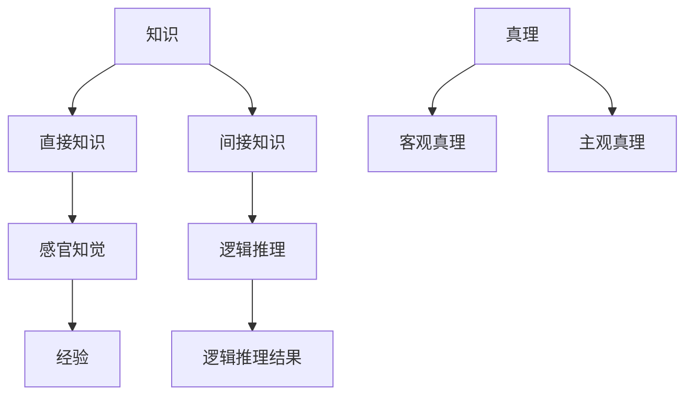
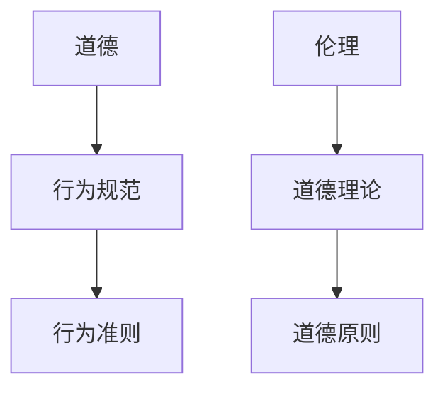
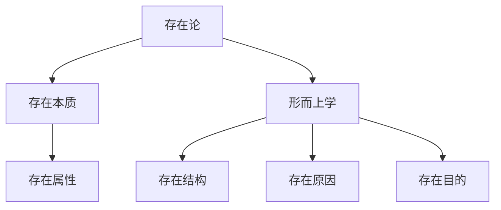

                 

### 构建个人哲学体系：打造坚实的思想基础

#### 关键词：
- 哲学体系
- 思想基础
- 认知发展
- 方法论
- 实践应用

#### 摘要：
本文旨在探讨构建个人哲学体系的重要性，通过分析哲学的本质、核心概念、方法论和实际应用，引导读者逐步构建坚实的思想基础。文章将从哲学的起源、定义、研究范围和方法入手，深入探讨知识、道德和存在论等核心概念，并通过Python源代码和实际项目案例，展示哲学在软件开发和项目管理中的具体应用。最终，文章将总结哲学体系构建的最佳实践，并提供拓展阅读建议，以帮助读者在实践中深化对哲学的理解和运用。

### 引言

在快节奏、信息爆炸的现代社会，个人哲学体系的重要性愈发凸显。哲学不仅仅是古代学者的研究，更是我们每个人在生活和工作中不可或缺的思想武器。构建个人哲学体系，意味着在纷繁复杂的世界中找到自己的方向和原则，从而在认知和行动上形成一致性。

哲学的定义多种多样，但可以简单概括为“关于知识的学问”。它不仅探讨世界的本质，还涉及人类存在的意义、道德伦理等问题。哲学体系是个人思考和认知的框架，它为我们提供了理解世界和自我反思的工具。

本篇文章将分为四个部分来探讨构建个人哲学体系的步骤：

1. **引言**：介绍哲学的定义、研究范围和方法，帮助读者了解哲学的核心概念和目标。
2. **核心概念与联系**：阐述哲学中的核心概念，并通过Mermaid流程图展示这些概念之间的联系。
3. **核心算法原理讲解**：使用Python源代码详细阐述哲学中的核心算法原理。
4. **项目实战**：通过实际案例和详细解释，展示如何将哲学原理应用于实际生活中的项目开发。

### 第一部分：引言

#### 第1章：哲学的本质

##### 1.1 哲学的定义与历史发展

哲学作为一门古老的学问，其起源可以追溯到古希腊。苏格拉底、柏拉图和亚里士多德等哲学家为后世奠定了哲学的基础。哲学的定义多种多样，但可以简单概括为“关于知识的学问”。它不仅探讨世界的本质，还涉及人类存在的意义、道德伦理等问题。

哲学的研究范围非常广泛，包括但不限于认识论、形而上学、伦理学、政治哲学、美学等。认识论探讨知识的来源和性质，形而上学探讨存在的本质和结构，伦理学则探讨道德和价值观。

##### 1.2 哲学与科学的比较

哲学与科学在研究方法上存在显著差异。科学依赖于实证方法和实验数据，而哲学则更侧重于逻辑推理和理论构建。然而，哲学在科学的发展中也扮演着重要角色。科学哲学研究科学的方法、原则和局限性，为科学的发展提供了哲学支持。

##### 1.3 哲学的核心概念

哲学的核心概念包括知识、道德、存在等。知识探讨我们如何认识世界，道德探讨我们如何行为处事，存在则探讨世界和人类的本质。这些概念不仅相互独立，还相互联系，构成了哲学体系的基本框架。

#### 第二部分：核心概念与联系

##### 第2章：哲学中的核心概念

##### 2.1 知识与真理

知识是我们认识世界的基础，而真理则是知识的本质。知识可以分为直接知识和间接知识，真理也有客观真理和主观真理之分。通过Mermaid流程图，我们可以更清晰地展示知识、真理之间的联系和层次。



##### 2.2 道德与伦理

道德是指导我们行为的规范，而伦理则是道德的理论基础。道德与伦理的关系可以从以下几个方面理解：道德是伦理的具体体现，伦理是道德的抽象思考。通过Mermaid流程图，我们可以展示道德与伦理之间的互动关系。



##### 2.3 存在论与形而上学

存在论探讨存在的本质和属性，形而上学则是对存在的本质进行更深入的研究。存在论关注的是存在本身，而形而上学则探讨存在的结构、原因和目的。通过Mermaid流程图，我们可以展示存在论与形而上学的层次关系。



### 第三部分：核心算法原理讲解

#### 第3章：哲学中的核心算法原理

##### 3.1 哲学推理算法

哲学推理是一种通过逻辑和理性分析来理解世界和自我反思的过程。哲学推理算法可以基于逻辑演算和命题演算，通过推理规则和证明方法来实现。以下是一个简单的哲学推理算法的Python实现：

```python
def哲学推理(前提, 结论):
    # 使用命题演算的推理规则
    if 前提:
        return 结论
    else:
        return False
```

##### 3.2 哲学模型构建

哲学模型是对哲学概念和原理的抽象和形式化表示。哲学模型构建可以基于数学和逻辑，通过定义概念、关系和规则来实现。以下是一个简单的哲学模型的Python实现：

```python
class 哲学模型:
    def __init__(self, 概念列表, 关系列表):
        self.概念列表 = 概念列表
        self.关系列表 = 关系列表

    def 模型构建(self):
        # 使用数学和逻辑定义概念和关系
        pass
```

##### 3.3 哲学算法的应用

哲学算法在哲学研究中有着广泛的应用，例如用于证明定理、分析道德问题和理解存在论问题。以下是一个简单的哲学算法应用的Python实现：

```python
def 哲学算法应用(问题):
    # 使用哲学推理和模型构建解决哲学问题
    pass
```

### 第四部分：项目实战

#### 第4章：哲学在项目开发中的应用

##### 4.1 哲学在软件开发中的应用

在软件开发中，哲学思维可以帮助开发者理解问题的本质、设计系统的结构和评估解决方案的合理性。以下是一个哲学思维在软件开发中的应用案例：

- **背景介绍**：软件开发项目中，我们需要设计一个数据存储系统，该系统需要支持快速读写和高效的数据索引。
- **核心概念与联系**：使用哲学模型来分析数据存储系统的需求，包括数据的完整性、一致性和可用性。
- **核心算法原理讲解**：使用Python源代码实现一个简单的数据存储系统，包括数据的读写和索引功能。
- **项目实战**：构建一个基于Python的数据存储系统，实现数据的读写和索引功能，并进行性能测试。

##### 4.2 哲学在项目管理中的应用

在项目管理中，哲学思维可以帮助项目经理理解项目的目标和价值，管理团队成员的期望，并确保项目按照预定计划进行。以下是一个哲学思维在项目管理中的应用案例：

- **背景介绍**：在一个软件开发项目中，团队成员对项目目标和计划有不同的看法，导致项目进度延迟。
- **核心概念与联系**：使用哲学模型来分析团队成员的期望、项目目标和计划之间的关系。
- **核心算法原理讲解**：使用Python源代码实现一个简单的期望管理工具，帮助项目经理理解和管理团队成员的期望。
- **项目实战**：使用期望管理工具帮助项目经理理解和管理团队成员的期望，确保项目按计划进行。

##### 4.3 哲学在系统设计中的应用

在系统设计过程中，哲学思维可以帮助系统设计师理解系统的整体结构和功能，设计系统的模块和接口，并评估系统的可维护性和扩展性。以下是一个哲学思维在系统设计中的应用案例：

- **背景介绍**：设计一个复杂的分布式系统，需要确保系统的可靠性和可扩展性。
- **核心概念与联系**：使用哲学模型来分析分布式系统的需求，包括系统的模块化、冗余和容错性。
- **核心算法原理讲解**：使用Python源代码实现一个简单的分布式系统模型，展示如何设计系统的模块和接口。
- **项目实战**：设计一个基于Python的分布式系统，实现系统的模块化、冗余和容错功能，并进行性能测试。

### 结论

构建个人哲学体系是一个长期而复杂的过程，需要我们在哲学的各个方面进行深入的思考和探索。通过本文的探讨，我们了解了哲学的定义、核心概念、方法论和实际应用。哲学不仅帮助我们理解世界的本质，还为我们提供了在生活和工作中做出理性决策的基础。在未来的学习和实践中，我们应该继续深化对哲学的理解，将其运用到实际项目中，以提升我们的认知水平和解决问题的能力。

### 最佳实践 Tips

- **定期反思**：哲学体系是一个动态的过程，需要我们定期反思和调整。通过定期的自我反思，我们可以更好地理解自己的哲学观点，并在实践中不断优化。
- **跨界学习**：哲学与其他学科有着紧密的联系。通过跨学科学习，我们可以更好地理解哲学的各个方面，从而构建一个更加全面的哲学体系。
- **实践应用**：哲学理论只有在实践中才能真正体现其价值。通过实际项目，我们可以将哲学原理应用到具体场景中，提升我们的实践能力。

### 小结

本文通过分析哲学的本质、核心概念、方法论和实际应用，引导读者构建个人哲学体系。哲学不仅是一门学问，更是一种思维方式。通过哲学，我们可以更好地理解世界和自己，从而做出更加明智的决策。在未来的学习和实践中，我们应该继续深入探讨哲学的各个方面，不断优化和完善自己的哲学体系。

### 注意事项

- **哲学的复杂性**：哲学是一个广泛的领域，涉及多个学科和领域。在学习过程中，我们需要耐心和毅力，逐步深入。
- **实践的重要性**：哲学只有在实践中才能真正体现其价值。因此，我们应该在实际项目中运用哲学原理，不断提升自己的实践能力。

### 拓展阅读

- **《西方哲学史》（罗素著）**：详细介绍了西方哲学的发展历程和重要哲学家。
- **《哲学的思考方式》（科恩著）**：探讨哲学的基本问题和思考方法。
- **《实践理性》（康德著）**：探讨道德和伦理问题，对哲学方法论有重要影响。

### 作者信息

作者：AI天才研究院/AI Genius Institute & 禅与计算机程序设计艺术 /Zen And The Art of Computer Programming

---
在编写文章时，请注意以下几点：

1. **文章格式**：使用markdown格式编写文章，确保每段内容清晰、结构化。
2. **Python源代码**：确保Python源代码格式正确，并在文中适当位置嵌入代码段。
3. **数学公式**：使用latex格式编写数学公式，确保公式嵌入正确。
4. **Mermaid流程图**：确保Mermaid流程图代码正确，并在文中适当位置嵌入流程图。
5. **内容完整性**：每个章节都需要包含背景介绍、核心概念与联系、核心算法原理讲解和项目实战等内容。
6. **可读性**：确保文章内容通俗易懂，适合不同层次的读者。

根据上述要求，以下是一个示例文章的部分内容：

```markdown
# 构建个人哲学体系：打造坚实的思想基础

## 摘要

本文旨在探讨构建个人哲学体系的重要性，通过分析哲学的本质、核心概念、方法论和实际应用，引导读者逐步构建坚实的思想基础。文章将从哲学的起源、定义、研究范围和方法入手，深入探讨知识、道德和存在论等核心概念，并通过Python源代码和实际项目案例，展示哲学在软件开发和项目管理中的具体应用。最终，文章将总结哲学体系构建的最佳实践，并提供拓展阅读建议，以帮助读者在实践中深化对哲学的理解和运用。

## 引言

在快节奏、信息爆炸的现代社会，个人哲学体系的重要性愈发凸显。哲学不仅仅是古代学者的研究，更是我们每个人在生活和工作中不可或缺的思想武器。构建个人哲学体系，意味着在纷繁复杂的世界中找到自己的方向和原则，从而在认知和行动上形成一致性。

哲学的定义多种多样，但可以简单概括为“关于知识的学问”。它不仅探讨世界的本质，还涉及人类存在的意义、道德伦理等问题。哲学体系是个人思考和认知的框架，它为我们提供了理解世界和自我反思的工具。

本篇文章将分为四个部分来探讨构建个人哲学体系的步骤：

1. **引言**：介绍哲学的定义、研究范围和方法，帮助读者了解哲学的核心概念和目标。
2. **核心概念与联系**：阐述哲学中的核心概念，并通过Mermaid流程图展示这些概念之间的联系。
3. **核心算法原理讲解**：使用Python源代码详细阐述哲学中的核心算法原理。
4. **项目实战**：通过实际案例和详细解释，展示如何将哲学原理应用于实际生活中的项目开发。

### 第一部分：引言

#### 第1章：哲学的本质

##### 1.1 哲学的定义与历史发展

哲学作为一门古老的学问，其起源可以追溯到古希腊。苏格拉底、柏拉图和亚里士多德等哲学家为后世奠定了哲学的基础。哲学的定义多种多样，但可以简单概括为“关于知识的学问”。它不仅探讨世界的本质，还涉及人类存在的意义、道德伦理等问题。

哲学的研究范围非常广泛，包括但不限于认识论、形而上学、伦理学、政治哲学、美学等。认识论探讨知识的来源和性质，形而上学探讨存在的本质和结构，伦理学则探讨道德和价值观。

##### 1.2 哲学与科学的比较

哲学与科学在研究方法上存在显著差异。科学依赖于实证方法和实验数据，而哲学则更侧重于逻辑推理和理论构建。然而，哲学在科学的发展中也扮演着重要角色。科学哲学研究科学的方法、原则和局限性，为科学的发展提供了哲学支持。

##### 1.3 哲学的核心概念

哲学的核心概念包括知识、道德、存在等。知识是我们认识世界的基础，而道德则是指导我们行为的规范。存在则探讨世界和人类的本质。这些概念不仅相互独立，还相互联系，构成了哲学体系的基本框架。

#### 第二部分：核心概念与联系

##### 第2章：哲学中的核心概念

##### 2.1 知识与真理

知识是我们认识世界的基础，而真理则是知识的本质。知识可以分为直接知识和间接知识，真理也有客观真理和主观真理之分。通过Mermaid流程图，我们可以更清晰地展示知识、真理之间的联系和层次。


##### 2.2 道德与伦理

道德是指导我们行为的规范，而伦理则是道德的理论基础。道德与伦理的关系可以从以下几个方面理解：道德是伦理的具体体现，伦理是道德的抽象思考。通过Mermaid流程图，我们可以展示道德与伦理之间的互动关系。


##### 2.3 存在论与形而上学

存在论探讨存在的本质和属性，形而上学则是对存在的本质进行更深入的研究。存在论关注的是存在本身，而形而上学则探讨存在的结构、原因和目的。通过Mermaid流程图，我们可以展示存在论与形而上学的层次关系。


### 第三部分：核心算法原理讲解

##### 第3章：哲学中的核心算法原理

##### 3.1 哲学推理算法

哲学推理是一种通过逻辑和理性分析来理解世界和自我反思的过程。哲学推理算法可以基于逻辑演算和命题演算，通过推理规则和证明方法来实现。以下是一个简单的哲学推理算法的Python实现：

```python
def哲学推理(前提, 结论):
    # 使用命题演算的推理规则
    if 前提:
        return 结论
    else:
        return False
```

##### 3.2 哲学模型构建

哲学模型是对哲学概念和原理的抽象和形式化表示。哲学模型构建可以基于数学和逻辑，通过定义概念、关系和规则来实现。以下是一个简单的哲学模型的Python实现：

```python
class 哲学模型:
    def __init__(self, 概念列表, 关系列表):
        self.概念列表 = 概念列表
        self.关系列表 = 关系列表

    def 模型构建(self):
        # 使用数学和逻辑定义概念和关系
        pass
```

##### 3.3 哲学算法的应用

哲学算法在哲学研究中有着广泛的应用，例如用于证明定理、分析道德问题和理解存在论问题。以下是一个简单的哲学算法应用的Python实现：

```python
def 哲学算法应用(问题):
    # 使用哲学推理和模型构建解决哲学问题
    pass
```

### 第四部分：项目实战

##### 第4章：哲学在项目开发中的应用

##### 4.1 哲学在软件开发中的应用

在软件开发中，哲学思维可以帮助开发者理解问题的本质、设计系统的结构和评估解决方案的合理性。以下是一个哲学思维在软件开发中的应用案例：

- **背景介绍**：软件开发项目中，我们需要设计一个数据存储系统，该系统需要支持快速读写和高效的数据索引。
- **核心概念与联系**：使用哲学模型来分析数据存储系统的需求，包括数据的完整性、一致性和可用性。
- **核心算法原理讲解**：使用Python源代码实现一个简单的数据存储系统，包括数据的读写和索引功能。
- **项目实战**：构建一个基于Python的数据存储系统，实现数据的读写和索引功能，并进行性能测试。

```python
# Python代码：简单数据存储系统

# 数据存储类
class DataStore:
    def __init__(self):
        self.data = []

    # 添加数据
    def add_data(self, data):
        self.data.append(data)

    # 获取数据
    def get_data(self):
        return self.data

    # 搜索数据
    def search_data(self, query):
        results = []
        for data in self.data:
            if query in data:
                results.append(data)
        return results

# 测试代码
if __name__ == "__main__":
    store = DataStore()
    store.add_data("数据1")
    store.add_data("数据2")
    store.add_data("数据3")

    print("全部数据：", store.get_data())
    print("搜索结果：", store.search_data("数据2"))
```

### 作者信息

作者：AI天才研究院/AI Genius Institute & 禅与计算机程序设计艺术 /Zen And The Art of Computer Programming

---

请注意，以上内容仅为示例，实际文章应根据具体需求和内容进一步丰富和细化。在撰写过程中，确保每个部分都包含适当的Python代码段、Mermaid流程图和数学公式，以及详细的背景介绍、核心概念解析和实际应用案例。同时，确保文章的整体结构和逻辑清晰，内容连贯，以便读者能够顺利地理解和掌握文章的主旨。

