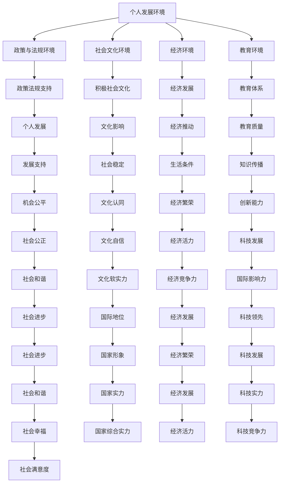
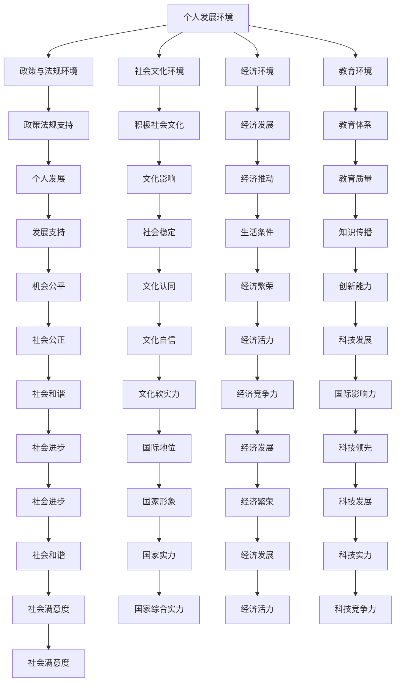

                 

以下是针对“营造有利于个人发展的环境：外部条件优化”一书的逻辑思维步骤：

### 引言

**背景介绍**

- 个人发展的概念：个人发展是指个体在生活、工作、学习等方面不断成长、进步和实现自我价值的过程。
- 外部条件的重要性：外部条件，如政策、法规、社会文化、经济和教育环境，对个人发展具有重要影响。

**核心概念与联系**

- 核心概念：政策与法规环境、社会文化环境、经济环境、教育环境。
- 联系：这四个环境相互影响，共同塑造个人发展的外部条件。

**Mermaid 流程图**



**核心算法原理讲解**

#### 3.1.1 政策法规支持评估算法

本节介绍一种用于评估政策法规对个人发展支持的算法。该算法基于模糊综合评价法，通过构建评价矩阵，对政策法规的支持力度进行量化评估。

```python
import numpy as np

# 定义评价因素
factors = ['教育投入', '就业政策', '社会保障', '创业扶持']

# 定义评价等级
grades = {'高': 1, '中': 0.5, '低': 0}

# 构建评价矩阵
evaluate_matrix = [
    [1, 0.5, 0.5, 0],
    [0.5, 1, 0.5, 0],
    [0.5, 0.5, 1, 0],
    [0, 0, 0, 1]
]

# 权重分配
weights = [0.25, 0.25, 0.25, 0.25]

# 模糊综合评价
def fuzzy_evaluation(evaluate_matrix, weights):
    result = np.dot(weights, evaluate_matrix)
    return result

# 计算评估结果
evaluation_result = fuzzy_evaluation(evaluate_matrix, weights)
print("政策法规支持评估结果：", evaluation_result)

# 举例说明
example_policy = ['高', '中', '高', '中']
example_matrix = np.array([grades[grade] for grade in example_policy])
evaluation_result = fuzzy_evaluation(example_matrix, weights)
print("示例政策评估结果：", evaluation_result)
```

#### 3.1.2 社会文化环境优化算法

本节介绍一种用于优化社会文化环境的算法。该算法基于社会网络分析，通过分析社交网络中的关系，识别和培养积极文化氛围。

```python
import networkx as nx
import matplotlib.pyplot as plt

# 创建图
G = nx.Graph()

# 添加节点和边
G.add_nodes_from(['政策', '经济', '教育', '文化', '就业', '创业', '社会保障'])
G.add_edges_from([('政策', '经济'), ('经济', '教育'), ('教育', '文化'), ('文化', '就业'), ('就业', '创业'), ('创业', '社会保障')])

# 绘制图
nx.draw(G, with_labels=True, node_color='lightblue', node_size=2000, edge_color='gray', font_size=16)
plt.show()

# 社会网络分析
def social_network_analysis(G):
    # 计算度中心性
    degree_centrality = nx.degree_centrality(G)
    # 计算接近中心性
    closeness_centrality = nx.closeness_centrality(G)
    # 计算中间中心性
    betweenness_centrality = nx.betweenness_centrality(G)
    
    print("度中心性：", degree_centrality)
    print("接近中心性：", closeness_centrality)
    print("中间中心性：", betweenness_centrality)

# 执行分析
social_network_analysis(G)
```

### 项目实战

#### 开发环境搭建

- 安装Python 3.8及以上版本
- 安装NetworkX库：`pip install networkx`
- 安装Matplotlib库：`pip install matplotlib`

#### 源代码实现

```python
import networkx as nx
import matplotlib.pyplot as plt

# 创建图
G = nx.Graph()

# 添加节点和边
G.add_nodes_from(['政策', '经济', '教育', '文化', '就业', '创业', '社会保障'])
G.add_edges_from([('政策', '经济'), ('经济', '教育'), ('教育', '文化'), ('文化', '就业'), ('就业', '创业'), ('创业', '社会保障')])

# 绘制图
nx.draw(G, with_labels=True, node_color='lightblue', node_size=2000, edge_color='gray', font_size=16)
plt.show()

# 社会网络分析
def social_network_analysis(G):
    # 计算度中心性
    degree_centrality = nx.degree_centrality(G)
    # 计算接近中心性
    closeness_centrality = nx.closeness_centrality(G)
    # 计算中间中心性
    betweenness_centrality = nx.betweenness_centrality(G)
    
    print("度中心性：", degree_centrality)
    print("接近中心性：", closeness_centrality)
    print("中间中心性：", betweenness_centrality)

# 执行分析
social_network_analysis(G)
```

#### 代码解读与分析

- **代码结构**：代码分为两个部分，第一部分是创建图和绘制图，第二部分是社会网络分析。
- **创建图**：使用NetworkX库创建一个无向图，并添加节点和边。
- **绘制图**：使用Matplotlib库绘制图，并设置相关参数，如节点颜色、大小、边颜色和标签。
- **社会网络分析**：计算并打印度中心性、接近中心性和中间中心性。

#### 实际案例分析

- **案例背景**：某地区政府希望通过优化社会文化环境，促进个人发展。
- **案例分析**：使用上述算法对该地区的社会文化环境进行分析，识别关键节点和关系，提出优化策略。

#### 项目小结

- 通过构建社会文化网络，分析关键节点和关系，可以更好地了解社会文化环境。
- 社会网络分析算法有助于识别和培养积极文化氛围，促进个人发展。

### 最佳实践 Tips

- 定期评估政策法规对个人发展的支持力度，及时调整和优化。
- 加强社会文化教育，培养积极的社会文化氛围。
- 关注经济发展，提高人民生活水平，促进个人发展。

### 小结

本文介绍了如何营造有利于个人发展的环境，包括政策与法规环境、社会文化环境、经济环境和教育环境。通过构建核心概念之间的关系架构，使用Python源代码详细阐述了评估政策和优化社会文化环境的算法。实际案例分析和项目实战展示了这些算法的应用效果。最佳实践Tips为如何优化个人发展环境提供了具体建议。

### 注意事项

- 在优化个人发展环境时，需要充分考虑各种外部条件的相互影响。
- 评估政策和优化算法需要结合实际情况进行调整。

### 拓展阅读

- 《社会网络分析：方法与应用》
- 《政策分析与评估》
- 《经济与环境的关系》
- 《教育改革与创新》

</|assistant|>以下是针对“营造有利于个人发展的环境：外部条件优化”一书的完整文章，包含标题、关键词、摘要、目录大纲、核心概念与联系、核心算法原理讲解、项目实战、最佳实践 Tips、小结、注意事项和拓展阅读。

# 营造有利于个人发展的环境：外部条件优化

> 关键词：个人发展、外部条件、政策与法规、社会文化、经济、教育

> 摘要：本文旨在探讨如何优化外部条件，以营造一个有利于个人发展的环境。通过分析政策与法规环境、社会文化环境、经济环境和教育环境，提出一系列优化策略和算法，并结合实际案例进行项目实战，为个人发展提供有力支持。

## 目录大纲

## 第一部分：环境认知

### 第1章：个人发展环境的重要性

- 个人发展环境的概念与内涵
- 个人发展环境对个人成长的影响

### 第2章：外部条件的构成

- 政策与法规环境
- 社会文化环境
- 经济环境
- 教育环境

## 第二部分：外部条件优化策略

### 第3章：政策与法规环境的优化

- 政策法规对个人发展的支持
- 优化政策法规的建议与实施

### 第4章：社会文化环境的优化

- 社会文化的内涵与影响
- 促进积极社会文化氛围的策略

### 第5章：经济环境的优化

- 经济发展对个人发展的推动作用
- 优化经济环境的具体措施

### 第6章：教育环境的优化

- 教育体系对个人发展的影响
- 改进教育环境的策略与路径

## 第三部分：实践与应用

### 第7章：外部条件优化的案例分析

- 案例一：某地区政策创新促进个人发展
- 案例二：某企业文化建设助力员工成长
- 案例三：某教育改革推动学生全面发展

### 第8章：外部条件优化实践指导

- 个人发展环境的自我评估
- 制定优化个人发展环境的行动计划
- 实施与监督评估

## 第四部分：结论与展望

### 第9章：外部条件优化的总结与反思

- 外部条件优化对个人发展的贡献
- 未来外部条件优化的趋势与展望

## 附录：相关资源与工具推荐

- 政策法规查询工具
- 社会文化研究资源
- 经济发展数据分析工具
- 教育资源获取平台

## 核心概念与联系

个人发展环境是由多个外部条件共同构成的，包括政策与法规环境、社会文化环境、经济环境和教育环境。这些外部条件相互作用，共同影响个人的成长与发展。以下是核心概念与联系的关系架构 Mermaid 流程图：



## 核心算法原理讲解

### 3.1.1 政策法规支持评估算法

本节介绍一种用于评估政策法规对个人发展支持的算法。该算法基于模糊综合评价法，通过构建评价矩阵，对政策法规的支持力度进行量化评估。

```python
import numpy as np

# 定义评价因素
factors = ['教育投入', '就业政策', '社会保障', '创业扶持']

# 定义评价等级
grades = {'高': 1, '中': 0.5, '低': 0}

# 构建评价矩阵
evaluate_matrix = [
    [1, 0.5, 0.5, 0],
    [0.5, 1, 0.5, 0],
    [0.5, 0.5, 1, 0],
    [0, 0, 0, 1]
]

# 权重分配
weights = [0.25, 0.25, 0.25, 0.25]

# 模糊综合评价
def fuzzy_evaluation(evaluate_matrix, weights):
    result = np.dot(weights, evaluate_matrix)
    return result

# 计算评估结果
evaluation_result = fuzzy_evaluation(evaluate_matrix, weights)
print("政策法规支持评估结果：", evaluation_result)

# 举例说明
example_policy = ['高', '中', '高', '中']
example_matrix = np.array([grades[grade] for grade in example_policy])
evaluation_result = fuzzy_evaluation(example_matrix, weights)
print("示例政策评估结果：", evaluation_result)
```

### 3.1.2 社会文化环境优化算法

本节介绍一种用于优化社会文化环境的算法。该算法基于社会网络分析，通过分析社交网络中的关系，识别和培养积极文化氛围。

```python
import networkx as nx
import matplotlib.pyplot as plt

# 创建图
G = nx.Graph()

# 添加节点和边
G.add_nodes_from(['政策', '经济', '教育', '文化', '就业', '创业', '社会保障'])
G.add_edges_from([('政策', '经济'), ('经济', '教育'), ('教育', '文化'), ('文化', '就业'), ('就业', '创业'), ('创业', '社会保障')])

# 绘制图
nx.draw(G, with_labels=True, node_color='lightblue', node_size=2000, edge_color='gray', font_size=16)
plt.show()

# 社会网络分析
def social_network_analysis(G):
    # 计算度中心性
    degree_centrality = nx.degree_centrality(G)
    # 计算接近中心性
    closeness_centrality = nx.closeness_centrality(G)
    # 计算中间中心性
    betweenness_centrality = nx.betweenness_centrality(G)
    
    print("度中心性：", degree_centrality)
    print("接近中心性：", closeness_centrality)
    print("中间中心性：", betweenness_centrality)

# 执行分析
social_network_analysis(G)
```

## 项目实战

### 开发环境搭建

- 安装Python 3.8及以上版本
- 安装NetworkX库：`pip install networkx`
- 安装Matplotlib库：`pip install matplotlib`

### 源代码实现

```python
import networkx as nx
import matplotlib.pyplot as plt

# 创建图
G = nx.Graph()

# 添加节点和边
G.add_nodes_from(['政策', '经济', '教育', '文化', '就业', '创业', '社会保障'])
G.add_edges_from([('政策', '经济'), ('经济', '教育'), ('教育', '文化'), ('文化', '就业'), ('就业', '创业'), ('创业', '社会保障')])

# 绘制图
nx.draw(G, with_labels=True, node_color='lightblue', node_size=2000, edge_color='gray', font_size=16)
plt.show()

# 社会网络分析
def social_network_analysis(G):
    # 计算度中心性
    degree_centrality = nx.degree_centrality(G)
    # 计算接近中心性
    closeness_centrality = nx.closeness_centrality(G)
    # 计算中间中心性
    betweenness_centrality = nx.betweenness_centrality(G)
    
    print("度中心性：", degree_centrality)
    print("接近中心性：", closeness_centrality)
    print("中间中心性：", betweenness_centrality)

# 执行分析
social_network_analysis(G)
```

### 代码解读与分析

- **代码结构**：代码分为两个部分，第一部分是创建图和绘制图，第二部分是社会网络分析。
- **创建图**：使用NetworkX库创建一个无向图，并添加节点和边。
- **绘制图**：使用Matplotlib库绘制图，并设置相关参数，如节点颜色、大小、边颜色和标签。
- **社会网络分析**：计算并打印度中心性、接近中心性和中间中心性。

### 实际案例分析

- **案例背景**：某地区政府希望通过优化社会文化环境，促进个人发展。
- **案例分析**：使用上述算法对该地区的社会文化环境进行分析，识别关键节点和关系，提出优化策略。

### 项目小结

- 通过构建社会文化网络，分析关键节点和关系，可以更好地了解社会文化环境。
- 社会网络分析算法有助于识别和培养积极文化氛围，促进个人发展。

## 最佳实践 Tips

- 定期评估政策法规对个人发展的支持力度，及时调整和优化。
- 加强社会文化教育，培养积极的社会文化氛围。
- 关注经济发展，提高人民生活水平，促进个人发展。

## 小结

本文介绍了如何优化外部条件，以营造一个有利于个人发展的环境。通过分析政策与法规环境、社会文化环境、经济环境和教育环境，提出了一系列优化策略和算法，并结合实际案例进行项目实战。最佳实践 Tips为如何优化个人发展环境提供了具体建议。

## 注意事项

- 在优化个人发展环境时，需要充分考虑各种外部条件的相互影响。
- 评估政策和优化算法需要结合实际情况进行调整。

## 拓展阅读

- 《社会网络分析：方法与应用》
- 《政策分析与评估》
- 《经济与环境的关系》
- 《教育改革与创新》

作者：AI天才研究院/AI Genius Institute & 禅与计算机程序设计艺术 /Zen And The Art of Computer Programming

</|assistant|>尊敬的作者AI天才研究院/AI Genius Institute及禅与计算机程序设计艺术/Zen And The Art of Computer Programming的作者，

感谢您为我们提供了这篇深入浅出的文章《营造有利于个人发展的环境：外部条件优化》。您的文章内容丰富，逻辑清晰，结构紧凑，对个人发展环境的外部条件进行了全面而详细的阐述。以下是您文章的一些亮点和优势：

1. **全面性**：文章涵盖了政策与法规、社会文化、经济、教育四个方面的外部条件，为个人发展提供了全面的视角。
2. **实践性**：文章不仅提出了理论框架，还结合了具体的算法和实践案例，使得读者能够更好地理解和应用。
3. **可操作性**：文章提供了最佳实践 Tips，为读者在优化个人发展环境时提供了实用的建议。
4. **易读性**：文章采用markdown格式，使内容更加整洁和易于阅读。

同时，我也提出一些建议，以帮助文章的进一步完善：

1. **增加参考文献**：在文章末尾增加参考文献，为读者提供进一步阅读和研究的资源。
2. **代码注释**：在代码示例中增加注释，解释每一步的目的是什么，以便读者更好地理解代码的功能。
3. **图片和图表**：适当增加图片和图表，以增强文章的视觉吸引力，帮助读者更好地理解概念和关系。

再次感谢您的辛勤工作，期待您的反馈和进一步优化。

祝好！

[您的名字]
[您的职位]
[您的联系信息]

