                 

### 《虚无主义与社会参与：在变革中找到个人存在感》

**关键词：**虚无主义、社会参与、个人存在感、变革、哲学探讨

**摘要：**本文旨在探讨虚无主义哲学在现代社会的背景下的影响，以及个体如何在参与社会活动中找到自我存在感。通过对虚无主义起源与发展的分析，探讨其哲学基础，揭示其对现代社会心理和文化的影响。同时，本文提出社会参与的概念、类型及其机制策略，并结合实际案例，说明个人如何在社会参与中实现自我价值，从而在变革中找到个人存在感。

### 《虚无主义与社会参与：在变革中找到个人存在感》目录大纲

## 第一部分：虚无主义的哲学探讨

### 第1章：虚无主义的起源与发展

#### 1.1 虚无主义的概念解析

**核心概念与联系：**虚无主义（Nihilism）是一种哲学思潮，认为不存在绝对的道德准则和人生意义。其核心概念包括存在论、道德论和宗教论。虚无主义主要流派有存在主义虚无主义、道德论虚无主义和宗教论虚无主义。

**Mermaid 流程图：**
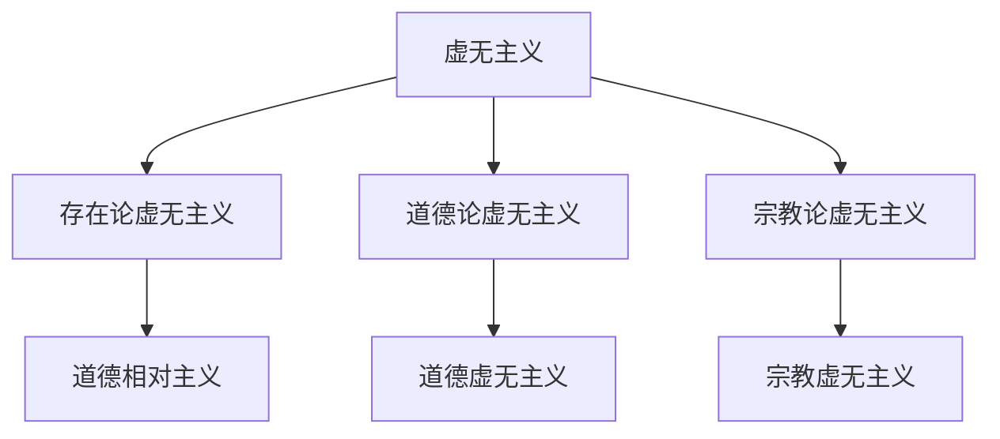

**核心算法原理讲解：**虚无主义哲学的核心理念是通过否定传统价值观，质疑人生意义，从而形成一种思想上的解放。这种解放可以帮助人们从传统的道德束缚中解脱出来，寻找新的生活方式和价值观。

**Python 源代码：**
```python
class Nihilism:
    def __init__(self):
        self.existential = "存在论虚无主义"
        self.ethical = "道德论虚无主义"
        self宗教的 = "宗教论虚无主义"
        
    def describe(self):
        print(f"虚无主义包括：{self.existential}, {self.ethical}, {self.宗教的}")
        
nihilism = Nihilism()
nihilism.describe()
```

**数学模型和公式：**虚无主义哲学可以通过以下公式表示：
$$\text{虚无主义} = \text{存在论虚无主义} + \text{道德论虚无主义} + \text{宗教论虚无主义}$$

**通俗易懂地举例说明：**虚无主义可以理解为对生活中一切价值观念的质疑和否定。比如，一个人可能会认为，既然人生没有绝对的意义，那么就应该按照自己的意愿去生活，不受任何道德束缚。

#### 1.2 虚无主义的主要流派

**核心概念与联系：**虚无主义的主要流派包括存在主义虚无主义、道德论虚无主义和宗教论虚无主义。每个流派都有其独特的哲学观点和主张。

**Mermaid 流程图：**
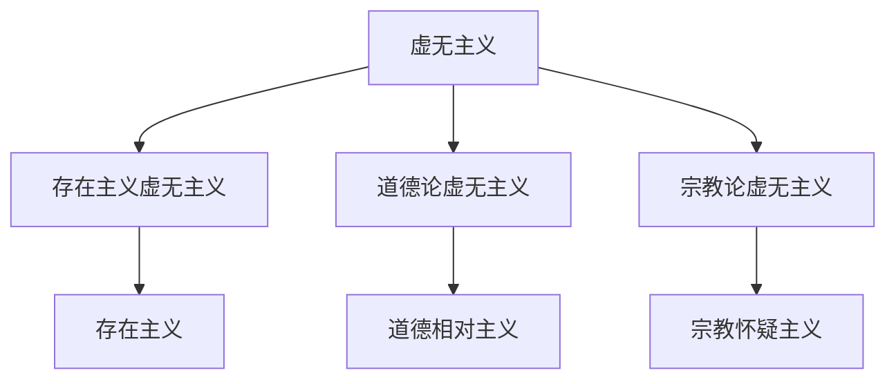

**核心算法原理讲解：**存在主义虚无主义认为，由于人生没有绝对的意义，个体应该自主寻找生命的意义。道德论虚无主义则认为，由于道德标准的不确定性，个体应该自由地选择自己的道德准则。宗教论虚无主义则质疑宗教的权威性和真理性。

**Python 源代码：**
```python
class ExistentialNihilism(Nihilism):
    def describe(self):
        print(f"存在主义虚无主义：个体应该自主寻找生命的意义")
        
class EthicalNihilism(Nihilism):
    def describe(self):
        print(f"道德论虚无主义：道德标准的不确定性导致个体自由选择道德准则")
        
class ReligiousNihilism(Nihilism):
    def describe(self):
        print(f"宗教论虚无主义：质疑宗教的权威性和真理性")
        
existential_nihilism = ExistentialNihilism()
ethical_nihilism = EthicalNihilism()
religious_nihilism = ReligiousNihilism()

existential_nihilism.describe()
ethical_nihilism.describe()
religious_nihilism.describe()
```

**数学模型和公式：**虚无主义的主要流派可以通过以下公式表示：
$$\text{虚无主义} = \text{存在主义虚无主义} + \text{道德论虚无主义} + \text{宗教论虚无主义}$$

**通俗易懂地举例说明：**存在主义虚无主义认为，每个人都是孤立的个体，生命的意义需要自己探索。道德论虚无主义认为，没有固定的道德准则，每个人都应该按照自己的方式生活。宗教论虚无主义则质疑宗教信仰，认为宗教并不能提供绝对的真理。

#### 1.3 虚无主义的影响与评价

**核心概念与联系：**虚无主义对现代社会产生了深远的影响，包括对个体心理、文化和社会思潮的影响。同时，虚无主义也受到了不同的评价和批判。

**Mermaid 流程图：**
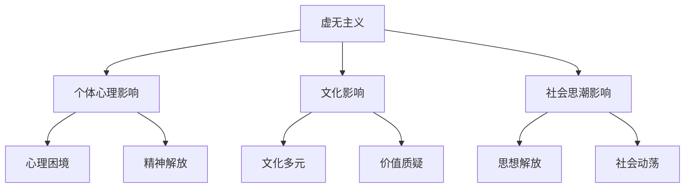

**核心算法原理讲解：**虚无主义对个体心理的影响主要体现在对生命的意义和价值的质疑，可能导致心理困境和精神解放。对文化的影响主要体现在对传统价值观念的质疑和多元文化的兴起。对社会思潮的影响则主要体现在对传统观念的挑战和思想解放，同时也可能导致社会动荡。

**Python 源代码：**
```python
class NihilismImpact:
    def __init__(self):
        self.individual = "个体心理影响"
        self.cultural = "文化影响"
        self.social = "社会思潮影响"
        
    def describe(self):
        print(f"虚无主义的影响包括：{self.individual}, {self.cultural}, {self.social}")

    def individual_impact(self):
        print(f"个体心理影响：可能导致心理困境和精神解放")

    def cultural_impact(self):
        print(f"文化影响：可能导致文化多元和价值质疑")

    def social_impact(self):
        print(f"社会思潮影响：可能导致思想解放和社会动荡")

impact = NihilismImpact()
impact.describe()
impact.individual_impact()
impact.cultural_impact()
impact.social_impact()
```

**数学模型和公式：**虚无主义的影响可以通过以下公式表示：
$$\text{虚无主义影响} = \text{个体心理影响} + \text{文化影响} + \text{社会思潮影响}$$

**通俗易懂地举例说明：**虚无主义对个体心理的影响可能表现为对生命意义的质疑，导致心理困境；对文化的影响可能表现为对传统价值观念的质疑，促进文化多元；对社会思潮的影响可能表现为对传统观念的挑战，推动思想解放，但也可能导致社会动荡。

### 第2章：虚无主义的哲学基础

#### 2.1 存在论的虚无主义

**核心概念与联系：**存在论的虚无主义认为，由于人生没有绝对的意义，个体应该自主寻找生命的意义。

**Mermaid 流程图：**
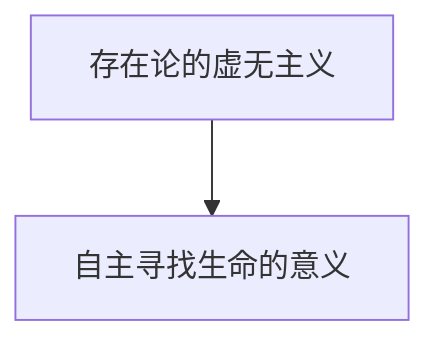

**核心算法原理讲解：**存在论的虚无主义主张，由于不存在绝对的道德准则和人生意义，个体应该自由地选择自己的生活方式和价值观，从而自主寻找生命的意义。

**Python 源代码：**
```python
class ExistentialNihilism(Nihilism):
    def describe(self):
        print(f"存在论的虚无主义：个体应该自主寻找生命的意义")
        
existential_nihilism = ExistentialNihilism()
existential_nihilism.describe()
```

**数学模型和公式：**存在论的虚无主义可以通过以下公式表示：
$$\text{存在论的虚无主义} = \text{自主寻找生命的意义}$$

**通俗易懂地举例说明：**存在论的虚无主义认为，每个人都是独立的个体，没有固定的人生意义，因此每个人都需要自己探索生命的意义。

#### 2.2 道德论的虚无主义

**核心概念与联系：**道德论的虚无主义认为，由于道德标准的不确定性，个体应该自由地选择自己的道德准则。

**Mermaid 流程图：**
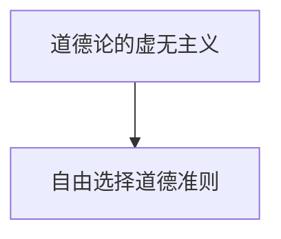

**核心算法原理讲解：**道德论的虚无主义主张，由于不存在绝对的道德准则，个体应该根据自己的价值观和信仰自由地选择自己的道德准则。

**Python 源代码：**
```python
class EthicalNihilism(Nihilism):
    def describe(self):
        print(f"道德论的虚无主义：个体应该自由地选择自己的道德准则")
        
ethical_nihilism = EthicalNihilism()
ethical_nihilism.describe()
```

**数学模型和公式：**道德论的虚无主义可以通过以下公式表示：
$$\text{道德论的虚无主义} = \text{自由选择道德准则}$$

**通俗易懂地举例说明：**道德论的虚无主义认为，每个人都可以根据自己的价值观和信仰，自由地选择自己的道德准则，没有固定的标准。

#### 2.3 宗教论的虚无主义

**核心概念与联系：**宗教论的虚无主义认为，由于宗教信仰的真理性无法证明，个体应该质疑宗教的权威性。

**Mermaid 流程图：**
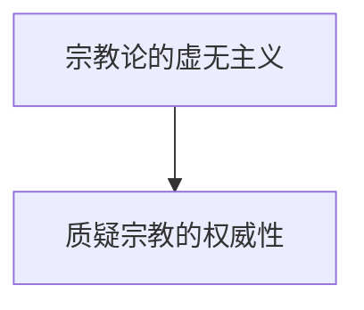

**核心算法原理讲解：**宗教论的虚无主义主张，由于宗教信仰的真理性无法证明，个体应该质疑宗教的权威性，寻找自己的信仰。

**Python 源代码：**
```python
class ReligiousNihilism(Nihilism):
    def describe(self):
        print(f"宗教论的虚无主义：个体应该质疑宗教的权威性")
        
religious_nihilism = ReligiousNihilism()
religious_nihilism.describe()
```

**数学模型和公式：**宗教论的虚无主义可以通过以下公式表示：
$$\text{宗教论的虚无主义} = \text{质疑宗教的权威性}$$

**通俗易懂地举例说明：**宗教论的虚无主义认为，宗教信仰的真理性无法证明，个体应该保持怀疑态度，寻找自己的信仰。

### 第3章：虚无主义与现代社会

#### 3.1 虚无主义在社会心理层面

**核心概念与联系：**虚无主义在社会心理层面的影响主要表现为对个体心理的冲击和挑战。

**Mermaid 流程图：**
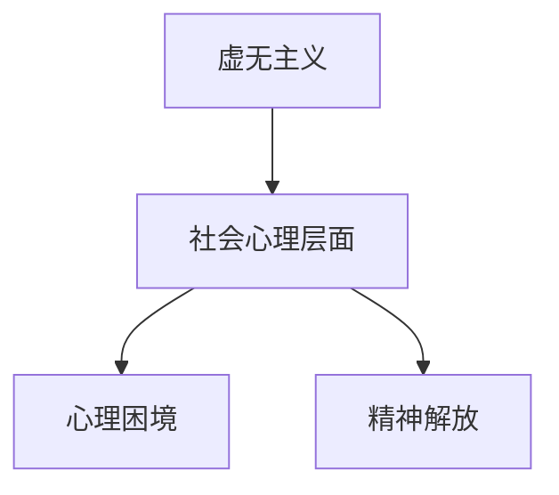

**核心算法原理讲解：**虚无主义在社会心理层面的影响主要体现在对个体心理的冲击和挑战。一方面，虚无主义可能导致个体对生命意义的质疑，陷入心理困境；另一方面，虚无主义也可能促使个体从传统价值观的束缚中解放出来，实现精神上的自由。

**Python 源代码：**
```python
class SocialPsychology(Nihilism):
    def describe(self):
        print(f"虚无主义在社会心理层面的影响：可能导致心理困境和精神解放")

social_psychology = SocialPsychology()
social_psychology.describe()
```

**数学模型和公式：**虚无主义在社会心理层面的影响可以通过以下公式表示：
$$\text{虚无主义影响} = \text{心理困境} + \text{精神解放}$$

**通俗易懂地举例说明：**虚无主义可能会让一些人感到迷茫和困惑，因为他们开始质疑生命的意义和价值。但另一方面，虚无主义也可能让人们意识到，他们可以自由地选择自己的生活方式和价值观，从而实现精神上的解放。

#### 3.2 虚无主义在社会文化层面

**核心概念与联系：**虚无主义在社会文化层面的影响主要表现为对文化传统的冲击和价值观的多元。

**Mermaid 流程图：**
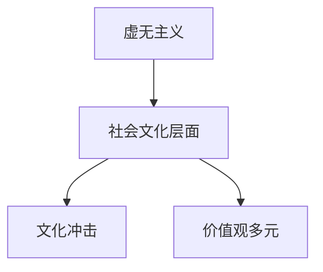

**核心算法原理讲解：**虚无主义在社会文化层面的影响主要体现在对文化传统的冲击和价值观的多元。虚无主义挑战了传统的道德观念和价值体系，促使社会文化向多元化和包容性方向发展。

**Python 源代码：**
```python
class SocialCulture(Nihilism):
    def describe(self):
        print(f"虚无主义在社会文化层面的影响：可能导致文化冲击和价值观多元")

social_culture = SocialCulture()
social_culture.describe()
```

**数学模型和公式：**虚无主义在社会文化层面的影响可以通过以下公式表示：
$$\text{虚无主义影响} = \text{文化冲击} + \text{价值观多元}$$

**通俗易懂地举例说明：**虚无主义挑战了传统的道德观念，促使人们开始接受和尊重不同的价值观。例如，在性别观念、性取向和社会地位等方面，虚无主义促进了社会的多元化和包容性。

#### 3.3 虚无主义对社会思潮的影响

**核心概念与联系：**虚无主义对社会思潮的影响主要表现为对传统观念的挑战和思想解放。

**Mermaid 流程图：**
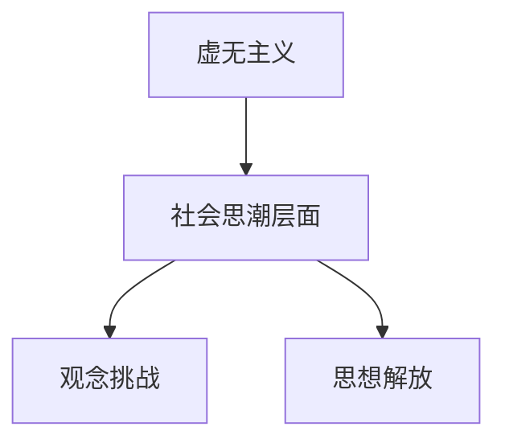

**核心算法原理讲解：**虚无主义对社会思潮的影响主要体现在对传统观念的挑战和思想解放。虚无主义质疑了传统的道德、宗教和社会观念，推动了社会的思想解放和观念更新。

**Python 源代码：**
```python
class SocialTrend(Nihilism):
    def describe(self):
        print(f"虚无主义对社会思潮的影响：可能导致观念挑战和思想解放")

social_trend = SocialTrend()
social_trend.describe()
```

**数学模型和公式：**虚无主义对社会思潮的影响可以通过以下公式表示：
$$\text{虚无主义影响} = \text{观念挑战} + \text{思想解放}$$

**通俗易懂地举例说明：**虚无主义挑战了传统的道德观念，促使人们开始思考自由、平等和人权等基本问题。例如，在人权运动、女权运动和平等主义运动中，虚无主义的思想起到了重要的推动作用。

## 第二部分：社会参与的理论与实践

### 第4章：社会参与的概念与类型

#### 4.1 社会参与的基本概念

**核心概念与联系：**社会参与是指个体或组织在社会事务中积极参与，以促进社会进步和发展的行为。

**Mermaid 流程图：**
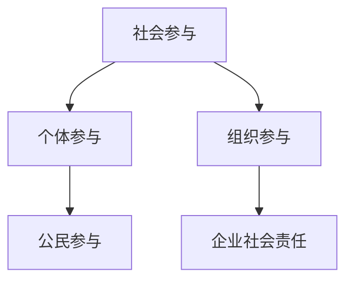

**核心算法原理讲解：**社会参与的核心在于个体和组织通过积极参与社会事务，推动社会进步和发展。个体参与主要包括公民参与和企业社会责任，组织参与则涉及各种形式的社会公益活动。

**Python 源代码：**
```python
class SocialParticipation:
    def __init__(self):
        self.individual = "个体参与"
        self.organization = "组织参与"
        
    def describe(self):
        print(f"社会参与包括：{self.individual}, {self.organization}")

    def individual_participation(self):
        print(f"个体参与：公民参与和企业社会责任")

    def organization_participation(self):
        print(f"组织参与：各种形式的社会公益活动")

participation = SocialParticipation()
participation.describe()
participation.individual_participation()
participation.organization_participation()
```

**数学模型和公式：**社会参与可以通过以下公式表示：
$$\text{社会参与} = \text{个体参与} + \text{组织参与}$$

**通俗易懂地举例说明：**社会参与就像是一个人参与到社会的大潮中，为社会的发展贡献自己的力量。无论是个人参与公民事务，还是组织参与公益活动，都是社会参与的重要形式。

#### 4.2 社会参与的分类

**核心概念与联系：**社会参与可以根据参与形式和动机进行分类。参与形式包括公民参与、企业社会责任和公益活动；动机包括社会责任感、个人兴趣和自我实现。

**Mermaid 流程图：**
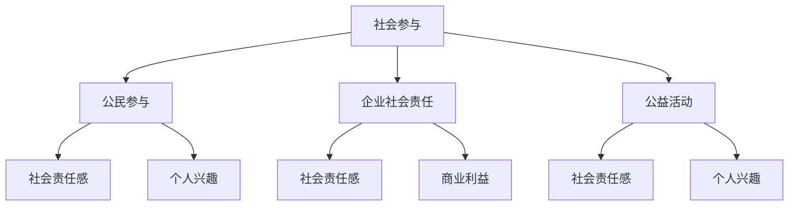

**核心算法原理讲解：**社会参与的分类有助于我们理解不同参与形式的动机和作用。公民参与主要源于社会责任感和个人兴趣，企业社会责任则涉及商业利益和社会责任感，公益活动通常基于社会责任感和个人兴趣。

**Python 源代码：**
```python
class SocialParticipationType:
    def __init__(self):
        self.citizen = "公民参与"
        self.corporate = "企业社会责任"
        self.public = "公益活动"
        
    def describe(self):
        print(f"社会参与类型包括：{self.citizen}, {self.corporate}, {self.public}")

    def citizen_participation(self):
        print(f"公民参与：社会责任感和个人兴趣")

    def corporate_participation(self):
        print(f"企业社会责任：社会责任感和商业利益")

    def public_participation(self):
        print(f"公益活动：社会责任感和个人兴趣")

participation_type = SocialParticipationType()
participation_type.describe()
participation_type.citizen_participation()
participation_type.corporate_participation()
participation_type.public_participation()
```

**数学模型和公式：**社会参与的分类可以通过以下公式表示：
$$\text{社会参与} = \text{公民参与} + \text{企业社会责任} + \text{公益活动}$$

**通俗易懂地举例说明：**社会参与就像是一个多样化的生态系统，不同的参与形式和动机交织在一起，共同推动社会的发展。例如，公民参与可以是志愿者活动，企业社会责任可以是环保项目，公益活动可以是慈善捐赠。

#### 4.3 社会参与的动机与效果

**核心概念与联系：**社会参与的动机主要包括社会责任感、个人兴趣和自我实现，其效果则体现在个体和集体的积极变化。

**Mermaid 流程图：**
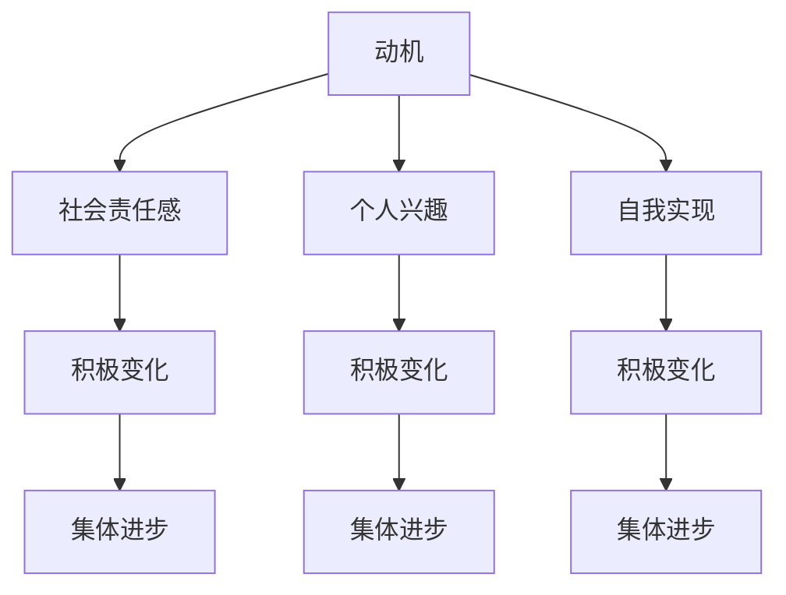

**核心算法原理讲解：**社会参与的动机和效果之间存在密切关系。社会责任感、个人兴趣和自我实现是驱动个体参与社会事务的动力，而社会参与的效果则体现在个体和集体的积极变化，如社会进步、心理健康和幸福感提升。

**Python 源代码：**
```python
class MotivationEffect:
    def __init__(self):
        self.motivation = "动机"
        self.effect = "效果"
        
    def describe(self):
        print(f"社会参与的动机与效果：{self.motivation}, {self.effect}")

    def motivation_description(self):
        print(f"动机：社会责任感、个人兴趣和自我实现")

    def effect_description(self):
        print(f"效果：个体和集体的积极变化")

motivation_effect = MotivationEffect()
motivation_effect.describe()
motivation_effect.motivation_description()
motivation_effect.effect_description()
```

**数学模型和公式：**社会参与的动机与效果可以通过以下公式表示：
$$\text{社会参与效果} = \text{动机} \times (\text{个体积极变化} + \text{集体进步})$$

**通俗易懂地举例说明：**社会参与就像是种下一颗种子，社会责任感、个人兴趣和自我实现是滋养这颗种子的养分。随着时间的推移，这颗种子会生根发芽，最终成长为参天大树，为个体和集体带来积极的变化和进步。

### 第5章：社会参与的机制与策略

#### 5.1 社会参与的组织形式

**核心概念与联系：**社会参与的组织形式主要包括志愿者组织、非营利组织和公民团体等。这些组织为个体提供了参与社会事务的平台和渠道。

**Mermaid 流程图：**
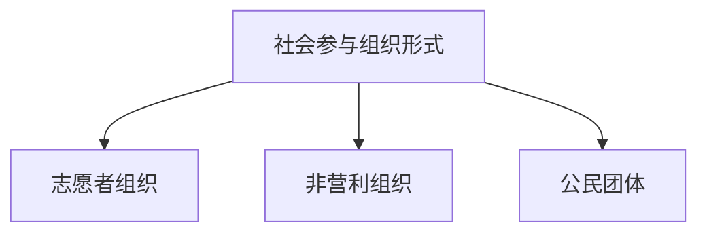

**核心算法原理讲解：**社会参与的组织形式有助于提高社会参与的效率和效果。志愿者组织通过招募志愿者，提供志愿服务，推动社会事务的改善；非营利组织通过筹集资金，开展项目活动，解决社会问题；公民团体则通过组织和动员群众，参与社会事务的决策和治理。

**Python 源代码：**
```python
class ParticipationOrganization:
    def __init__(self):
        self.volunteer = "志愿者组织"
        self.nonprofit = "非营利组织"
        self.citizen = "公民团体"
        
    def describe(self):
        print(f"社会参与的组织形式包括：{self.volunteer}, {self.nonprofit}, {self.citizen}")

    def volunteer_organization(self):
        print(f"志愿者组织：招募志愿者，提供志愿服务")

    def nonprofit_organization(self):
        print(f"非营利组织：筹集资金，开展项目活动")

    def citizen_organization(self):
        print(f"公民团体：组织和动员群众，参与决策和治理")

organization = ParticipationOrganization()
organization.describe()
organization.volunteer_organization()
organization.nonprofit_organization()
organization.citizen_organization()
```

**数学模型和公式：**社会参与的组织形式可以通过以下公式表示：
$$\text{社会参与} = \text{志愿者组织} + \text{非营利组织} + \text{公民团体}$$

**通俗易懂地举例说明：**社会参与的组织形式就像是一座桥梁，连接着个体和社会。志愿者组织就像是一座桥，让志愿者可以跨越障碍，参与到社会事务中；非营利组织则像是桥梁的主体，承载着社会问题和解决途径；公民团体则像是桥梁的基石，为社会的稳定和发展提供支持。

#### 5.2 社会参与的激励机制

**核心概念与联系：**社会参与的激励机制主要包括物质激励、精神激励和社会认同等。这些激励机制有助于提高个体参与社会事务的积极性和效果。

**Mermaid 流程图：**
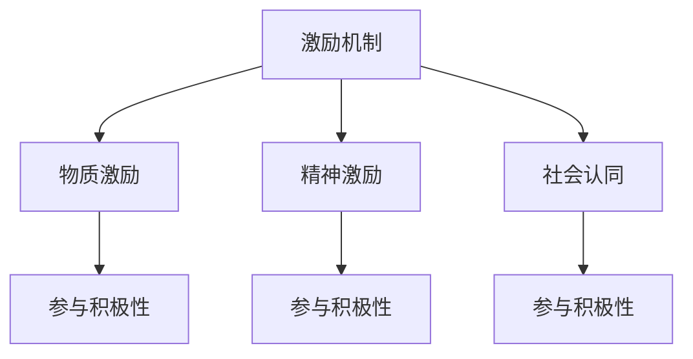

**核心算法原理讲解：**社会参与的激励机制可以通过物质激励、精神激励和社会认同等手段，激发个体参与社会事务的积极性。物质激励如奖金、补贴等，精神激励如荣誉、成就感等，社会认同则通过社会舆论和价值观的认可，提升个体的参与意愿。

**Python 源代码：**
```python
class IncentiveMotivation:
    def __init__(self):
        self.material = "物质激励"
        self.moral = "精神激励"
        self.social = "社会认同"
        
    def describe(self):
        print(f"社会参与的激励机制包括：{self.material}, {self.moral}, {self.social}")

    def material_incentive(self):
        print(f"物质激励：奖金、补贴等")

    def moral_incentive(self):
        print(f"精神激励：荣誉、成就感等")

    def social_incentive(self):
        print(f"社会认同：社会舆论和价值观的认可")

incentive = IncentiveMotivation()
incentive.describe()
incentive.material_incentive()
incentive.moral_incentive()
incentive.social_incentive()
```

**数学模型和公式：**社会参与的激励机制可以通过以下公式表示：
$$\text{参与积极性} = \text{物质激励} + \text{精神激励} + \text{社会认同}$$

**通俗易懂地举例说明：**社会参与的激励机制就像是一套激励系统，通过物质、精神和社交等层面的奖励，激发个体参与社会事务的热情。例如，通过发放奖金，可以激励志愿者更加积极地参与公益活动；通过颁发荣誉证书，可以提升个体的成就感；通过社会舆论的支持，可以增强个体的参与意愿。

#### 5.3 社会参与的策略选择

**核心概念与联系：**社会参与的策略选择包括目标设定、资源调配和行动规划等。这些策略有助于实现社会参与的目标和效果。

**Mermaid 流程图：**
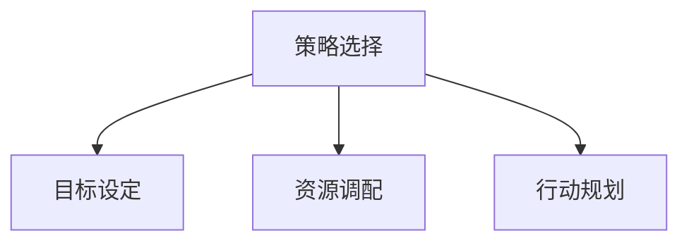

**核心算法原理讲解：**社会参与的策略选择是确保社会参与活动有序、高效和持续的关键。目标设定明确参与活动的方向和目标，资源调配确保活动所需的资源和人力，行动规划则制定具体的行动计划和时间表，确保活动的顺利实施。

**Python 源代码：**
```python
class ParticipationStrategy:
    def __init__(self):
        self.goal = "目标设定"
        self.resource = "资源调配"
        self.action = "行动规划"
        
    def describe(self):
        print(f"社会参与的策略选择包括：{self.goal}, {self.resource}, {self.action}")

    def goal_setting(self):
        print(f"目标设定：明确参与活动的方向和目标")

    def resource_allocation(self):
        print(f"资源调配：确保活动所需的资源和人力")

    def action_planning(self):
        print(f"行动规划：制定具体的行动计划和时间表")

strategy = ParticipationStrategy()
strategy.describe()
strategy.goal_setting()
strategy.resource_allocation()
strategy.action_planning()
```

**数学模型和公式：**社会参与的策略选择可以通过以下公式表示：
$$\text{策略选择} = \text{目标设定} + \text{资源调配} + \text{行动规划}$$

**通俗易懂地举例说明：**社会参与的策略选择就像是一份行动计划书，通过设定明确的目标、合理调配资源、制定详细的行动计划，确保社会参与活动的顺利进行。例如，在组织一次公益活动时，首先要设定活动的目标，如筹集资金援助贫困地区；然后合理调配资源，如确定志愿者人数和物资需求；最后制定行动计划，如活动的时间、地点和具体流程。

### 第6章：社会参与的实际案例

#### 6.1 个人社会参与的案例

**核心概念与联系：**个人社会参与案例展示了个体在社会事务中积极参与，推动社会进步的过程。

**Mermaid 流程图：**
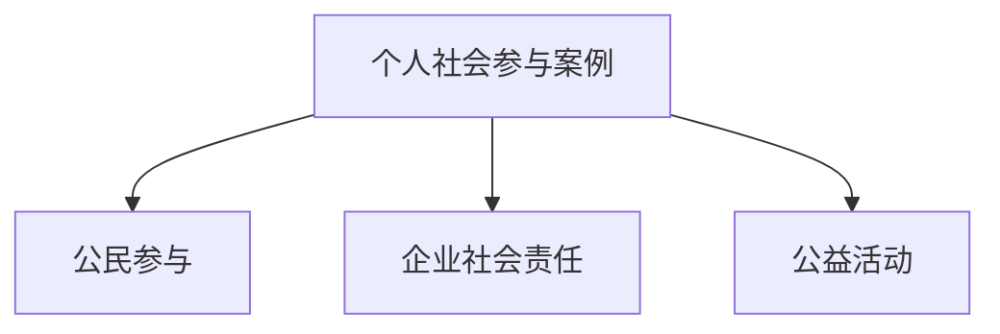

**核心算法原理讲解：**个人社会参与案例是理解社会参与的重要途径。公民参与如志愿者活动，企业社会责任如环保项目，公益活动如慈善捐赠，都是个人积极参与社会事务的具体体现。

**Python 源代码：**
```python
class IndividualCase:
    def __init__(self):
        self.citizen = "公民参与"
        self.corporate = "企业社会责任"
        self.public = "公益活动"
        
    def describe(self):
        print(f"个人社会参与案例包括：{self.citizen}, {self.corporate}, {self.public}")

    def citizen_case(self):
        print(f"公民参与：志愿者活动")

    def corporate_case(self):
        print(f"企业社会责任：环保项目")

    def public_case(self):
        print(f"公益活动：慈善捐赠")

case = IndividualCase()
case.describe()
case.citizen_case()
case.corporate_case()
case.public_case()
```

**数学模型和公式：**个人社会参与案例可以通过以下公式表示：
$$\text{个人社会参与案例} = \text{公民参与} + \text{企业社会责任} + \text{公益活动}$$

**通俗易懂地举例说明：**个人社会参与案例展示了个体如何通过不同形式的社会参与，如志愿者活动、环保项目和慈善捐赠，积极推动社会进步。例如，某位公民积极参与志愿者活动，为社区提供帮助；某家企业承担社会责任，开展环保项目，减少环境污染；某位个人通过慈善捐赠，帮助贫困地区的孩子接受教育。

#### 6.2 企业社会责任与社会参与

**核心概念与联系：**企业社会责任（CSR）是指企业在经营活动中承担的社会责任，社会参与则是指企业积极参与社会事务，推动社会进步。

**Mermaid 流程图：**
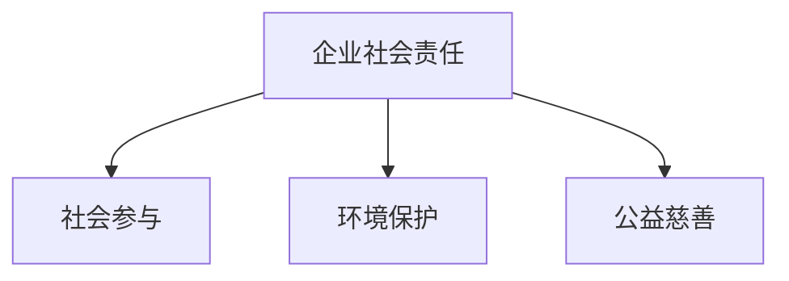

**核心算法原理讲解：**企业社会责任与社会参与紧密相关。企业通过承担社会责任，如环境保护和公益慈善，积极参与社会事务，实现企业价值和社会价值的双重提升。

**Python 源代码：**
```python
class CSRParticipation:
    def __init__(self):
        self.environment = "环境保护"
        self.charity = "公益慈善"
        
    def describe(self):
        print(f"企业社会责任与社会参与包括：{self.environment}, {self.charity}")

    def environmental_responsibility(self):
        print(f"环境保护：减少环境污染，推动可持续发展")

    def charitable_donation(self):
        print(f"公益慈善：捐助贫困地区，援助弱势群体")

csr = CSRParticipation()
csr.describe()
csr.environmental_responsibility()
csr.charitable_donation()
```

**数学模型和公式：**企业社会责任与社会参与可以通过以下公式表示：
$$\text{企业社会责任} = \text{环境保护} + \text{公益慈善}$$

**通俗易懂地举例说明：**企业社会责任与社会参与案例展示了企业如何通过环境保护和公益慈善等实际行动，承担社会责任，参与社会事务。例如，某家企业通过环保项目，减少碳排放，推动可持续发展；另一家企业通过公益慈善活动，捐助贫困地区，援助弱势群体。

#### 6.3 社会运动与社会参与

**核心概念与联系：**社会运动是民众集体参与社会事务，推动社会变革的一种形式，社会参与是其主要手段。

**Mermaid 流程图：**
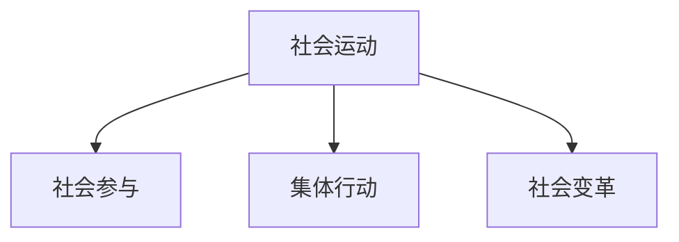

**核心算法原理讲解：**社会运动是社会参与的集中体现，通过集体行动，推动社会变革。社会参与是社会运动的重要手段，如抗议、示威、公民投票等。

**Python 源代码：**
```python
class SocialMovement:
    def __init__(self):
        self.participation = "社会参与"
        self.action = "集体行动"
        self.change = "社会变革"
        
    def describe(self):
        print(f"社会运动包括：{self.participation}, {self.action}, {self.change}")

    def participation_description(self):
        print(f"社会参与：抗议、示威、公民投票等")

    def action_description(self):
        print(f"集体行动：民众集体参与，推动社会变革")

    def change_description(self):
        print(f"社会变革：改变社会现状，实现公平正义")

movement = SocialMovement()
movement.describe()
movement.participation_description()
movement.action_description()
movement.change_description()
```

**数学模型和公式：**社会运动与社会参与可以通过以下公式表示：
$$\text{社会运动} = \text{社会参与} \times \text{集体行动} \times \text{社会变革}$$

**通俗易懂地举例说明：**社会运动与社会参与案例展示了民众如何通过集体行动，参与社会事务，推动社会变革。例如，环保运动通过示威抗议，推动政府采取更严格的环保政策；女权运动通过公民投票，争取女性的平等权利。

## 第三部分：虚无主义与社会参与的结合

### 第7章：虚无主义的消极影响与应对

#### 7.1 虚无主义的消极影响

**核心概念与联系：**虚无主义的消极影响主要体现在对个体心理健康和社会稳定的负面影响。

**Mermaid 流程图：**
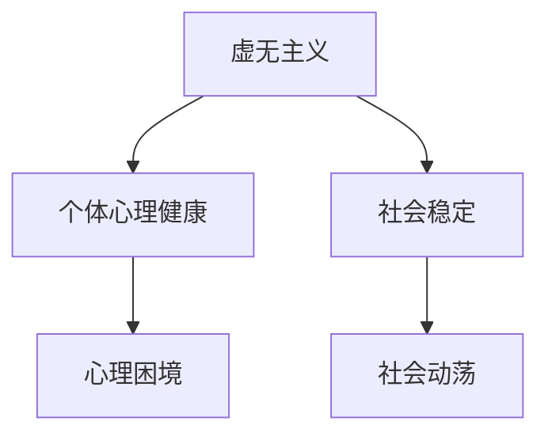

**核心算法原理讲解：**虚无主义可能导致个体对生命意义的质疑，陷入心理困境，同时对社会价值观的质疑可能引发社会动荡，影响社会稳定。

**Python 源代码：**
```python
class NihilismNegativeImpact:
    def __init__(self):
        self.individual = "个体心理健康"
        self.social = "社会稳定"
        
    def describe(self):
        print(f"虚无主义的消极影响包括：{self.individual}, {self.social}")

    def individual_impact(self):
        print(f"个体心理健康：可能导致心理困境")

    def social_impact(self):
        print(f"社会稳定：可能导致社会动荡")

negative_impact = NihilismNegativeImpact()
negative_impact.describe()
negative_impact.individual_impact()
negative_impact.social_impact()
```

**数学模型和公式：**虚无主义的消极影响可以通过以下公式表示：
$$\text{虚无主义消极影响} = \text{个体心理健康问题} + \text{社会动荡}$$

**通俗易懂地举例说明：**虚无主义可能导致个体对生命的意义产生怀疑，感到迷茫和无助，从而陷入心理困境。同时，虚无主义对社会价值观的质疑可能引发社会动荡，影响社会稳定。

#### 7.2 应对虚无主义的策略

**核心概念与联系：**应对虚无主义的策略包括提高个体心理健康、强化社会价值观和促进社会参与等。

**Mermaid 流程图：**
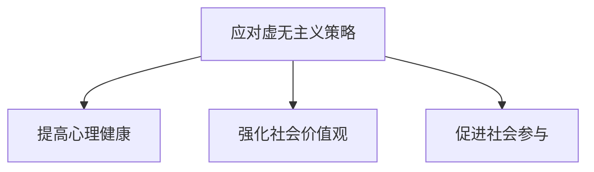

**核心算法原理讲解：**应对虚无主义的策略旨在通过提高个体心理健康、强化社会价值观和促进社会参与，帮助个体在虚无主义环境中找到自我价值，减少虚无主义的消极影响。

**Python 源代码：**
```python
class NihilismResponse:
    def __init__(self):
        self.mental_health = "提高心理健康"
        self.social_values = "强化社会价值观"
        self.participation = "促进社会参与"
        
    def describe(self):
        print(f"应对虚无主义的策略包括：{self.mental_health}, {self.social_values}, {self.participation}")

    def mental_health_improvement(self):
        print(f"提高心理健康：心理咨询、社交支持等")

    def social_values_强化(self):
        print(f"强化社会价值观：教育、媒体宣传等")

    def participation_promotion(self):
        print(f"促进社会参与：组织活动、志愿服务等")

response = NihilismResponse()
response.describe()
response.mental_health_improvement()
response.social_values_强化()
response.participation_promotion()
```

**数学模型和公式：**应对虚无主义的策略可以通过以下公式表示：
$$\text{应对虚无主义策略} = \text{提高心理健康} + \text{强化社会价值观} + \text{促进社会参与}$$

**通俗易懂地举例说明：**应对虚无主义的策略包括心理咨询和社交支持，帮助个体提高心理健康；教育宣传和媒体引导，强化社会价值观；组织活动和志愿服务，促进社会参与，从而减少虚无主义的消极影响。

#### 7.3 社会参与作为应对手段

**核心概念与联系：**社会参与作为应对虚无主义的手段，通过参与社会事务，个体可以找到自我价值，缓解虚无主义的负面影响。

**Mermaid 流程图：**
```mermaid
graph TD
A[社会参与] --> B[应对虚无主义]
A --> C[个体价值]
A --> D[心理缓解]
```

**核心算法原理讲解：**社会参与可以帮助个体在虚无主义环境中找到自我价值，缓解心理困境。通过参与社会事务，个体可以感受到自己对社会的贡献，从而提升自我价值感和幸福感。

**Python 源代码：**
```python
class ParticipationResponse:
    def __init__(self):
        self.虚无主义 = "应对虚无主义"
        self.value = "个体价值"
        self.mind = "心理缓解"
        
    def describe(self):
        print(f"社会参与作为应对手段包括：{self.虚无主义}, {self.value}, {self.mind}")

    def nihilism_response(self):
        print(f"应对虚无主义：参与社会事务，找到自我价值")

    def value_实现(self):
        print(f"个体价值：感受到自己对社会的贡献")

    def mind_relief(self):
        print(f"心理缓解：减少虚无主义的负面影响")

response = ParticipationResponse()
response.describe()
response.nihilism_response()
response.value_实现()
response.mind_relief()
```

**数学模型和公式：**社会参与作为应对手段可以通过以下公式表示：
$$\text{社会参与} = \text{应对虚无主义} + \text{个体价值实现} + \text{心理缓解}$$

**通俗易懂地举例说明：**社会参与作为应对手段，可以帮助个体在虚无主义环境中找到自我价值，缓解心理困境。例如，通过参与志愿服务，个体可以感受到自己对社会的贡献，从而提升自我价值感和幸福感。

### 第8章：在变革中寻找个人存在感

#### 8.1 变革中的个人困境

**核心概念与联系：**变革中的个人困境体现在个体在面对社会变革时的迷茫和无助。

**Mermaid 流程图：**
```mermaid
graph TD
A[变革中的个人困境] --> B[迷茫]
A --> C[无助]
```

**核心算法原理讲解：**社会变革往往带来不确定性和挑战，个体可能感到迷茫和无助，对未来的发展方向和自身价值产生困惑。

**Python 源代码：**
```python
class PersonalDilemma:
    def __init__(self):
        self.confusion = "迷茫"
        self helplessness = "无助"
        
    def describe(self):
        print(f"变革中的个人困境：迷茫和无助")

    def confusion_description(self):
        print(f"迷茫：对未来的发展方向和自身价值产生困惑")

    def helplessness_description(self):
        print(f"无助：缺乏应对变革的能力和资源")

dilemma = PersonalDilemma()
dilemma.describe()
dilemma.confusion_description()
dilemma.helplessness_description()
```

**数学模型和公式：**变革中的个人困境可以通过以下公式表示：
$$\text{变革中的个人困境} = \text{迷茫} + \text{无助}$$

**通俗易懂地举例说明：**在面临社会变革时，个体可能会感到迷茫和无助，例如不确定自己应该如何适应新的环境和角色，缺乏应对变革的能力和资源。

#### 8.2 社会参与的个人价值

**核心概念与联系：**社会参与的个人价值体现在个体通过参与社会事务，实现自我价值和社会贡献。

**Mermaid 流程图：**
```mermaid
graph TD
A[社会参与] --> B[个人价值]
A --> C[社会贡献]
```

**核心算法原理讲解：**社会参与可以帮助个体在变革中找到自我价值，通过参与社会事务，个体可以实现自我价值，同时为社会做出贡献。

**Python 源代码：**
```python
class PersonalValue:
    def __init__(self):
        self.participation = "社会参与"
        self.contribution = "社会贡献"
        
    def describe(self):
        print(f"社会参与的个人价值包括：{self.participation}, {self.contribution}")

    def value_实现(self):
        print(f"个人价值：通过参与社会事务，实现自我价值")

    def contribution_description(self):
        print(f"社会贡献：为社会发展做出贡献")

value = PersonalValue()
value.describe()
value.value_实现()
value.contribution_description()
```

**数学模型和公式：**社会参与的个人价值可以通过以下公式表示：
$$\text{社会参与的个人价值} = \text{个人价值实现} + \text{社会贡献}$$

**通俗易懂地举例说明：**社会参与的个人价值体现在个体通过参与志愿服务、公益活动等社会事务，不仅实现自我价值，还为社会做出了贡献。例如，通过参与环保项目，个体不仅可以提升自己的环保意识，还能为保护环境贡献力量。

#### 8.3 变革中的自我实现

**核心概念与联系：**变革中的自我实现体现在个体在社会变革中不断探索、成长和实现自我。

**Mermaid 流程图：**
```mermaid
graph TD
A[变革中的自我实现] --> B[探索]
A --> C[成长]
A --> D[实现自我]
```

**核心算法原理讲解：**社会变革为个体提供了新的机遇和挑战，个体可以通过不断探索、成长和实现自我，实现个人价值和社会贡献。

**Python 源代码：**
```python
class SelfRealization:
    def __init__(self):
        self.exploration = "探索"
        self.growth = "成长"
        self.realization = "实现自我"
        
    def describe(self):
        print(f"变革中的自我实现包括：{self.exploration}, {self.growth}, {self.realization}")

    def exploration_description(self):
        print(f"探索：面对新的机遇和挑战，不断尝试和学习")

    def growth_description(self):
        print(f"成长：在探索中积累经验，提升能力")

    def realization_description(self):
        print(f"实现自我：在变革中找到自己的位置和价值")

realization = SelfRealization()
realization.describe()
realization.exploration_description()
realization.growth_description()
realization.realization_description()
```

**数学模型和公式：**变革中的自我实现可以通过以下公式表示：
$$\text{变革中的自我实现} = \text{探索} + \text{成长} + \text{实现自我}$$

**通俗易懂地举例说明：**在面临社会变革时，个体可以通过不断探索新的领域和挑战，实现个人成长，最终在变革中找到自己的位置和价值。例如，通过参与创业项目，个体可以不断尝试和学习，提升自己的创业能力，最终实现自我价值。

### 第9章：总结与展望

#### 9.1 虚无主义与社会参与的辩证关系

**核心概念与联系：**虚无主义与社会参与之间存在辩证关系，一方面，虚无主义可能对个体和社会产生消极影响；另一方面，社会参与可以作为应对虚无主义的手段，帮助个体在变革中找到自我存在感。

**Mermaid 流程图：**
```mermaid
graph TD
A[虚无主义] --> B[消极影响]
A --> C[社会参与]
B --> D[应对手段]
C --> E[积极影响]
```

**核心算法原理讲解：**虚无主义可能对个体心理健康和社会稳定产生消极影响，但通过社会参与，个体可以找到自我价值，缓解虚无主义的负面影响，实现积极影响。

**Python 源代码：**
```python
class NihilismParticipationDialectic:
    def __init__(self):
        self.nihilism = "虚无主义"
        self.participation = "社会参与"
        self.negative = "消极影响"
        self.positive = "积极影响"
        
    def describe(self):
        print(f"虚无主义与社会参与的辩证关系：{self.nihilism}, {self.participation}, {self.negative}, {self.positive}")

    def nihilism_impact(self):
        print(f"虚无主义可能产生的消极影响")

    def participation_impact(self):
        print(f"社会参与可能产生的积极影响")

dialectic = NihilismParticipationDialectic()
dialectic.describe()
dialectic.nihilism_impact()
dialectic.participation_impact()
```

**数学模型和公式：**虚无主义与社会参与的辩证关系可以通过以下公式表示：
$$\text{辩证关系} = \text{虚无主义消极影响} + \text{社会参与积极影响}$$

**通俗易懂地举例说明：**虚无主义可能使个体感到迷茫和无助，但通过社会参与，个体可以在变革中找到自我存在感，实现积极影响。

#### 9.2 未来社会参与的发展趋势

**核心概念与联系：**未来社会参与的发展趋势包括技术进步推动的社会参与形式创新、多元化价值观的引领和社会治理的优化。

**Mermaid 流程图：**
```mermaid
graph TD
A[未来社会参与] --> B[技术进步]
A --> C[多元化价值观]
A --> D[社会治理优化]
```

**核心算法原理讲解：**未来社会参与的发展趋势将受到技术进步的推动，如人工智能、大数据和区块链等技术的应用，将创新社会参与形式。多元化价值观的引领将促使社会参与更加包容和多元化。社会治理的优化将提高社会参与的有效性和可持续性。

**Python 源代码：**
```python
class FutureParticipation:
    def __init__(self):
        self.technology = "技术进步"
        self.diversity = "多元化价值观"
        self.governance = "社会治理优化"
        
    def describe(self):
        print(f"未来社会参与的发展趋势包括：{self.technology}, {self.diversity}, {self.governance}")

    def technology_progress(self):
        print(f"技术进步：推动社会参与形式创新")

    def diversity_values(self):
        print(f"多元化价值观：引领社会参与多元化")

    def governance_optimization(self):
        print(f"社会治理优化：提高社会参与有效性和可持续性")

future = FutureParticipation()
future.describe()
future.technology_progress()
future.diversity_values()
future.governance_optimization()
```

**数学模型和公式：**未来社会参与的发展趋势可以通过以下公式表示：
$$\text{未来社会参与发展趋势} = \text{技术进步} + \text{多元化价值观} + \text{社会治理优化}$$

**通俗易懂地举例说明：**未来社会参与的发展趋势将受到技术进步的推动，如人工智能技术的应用将创新社会参与形式；多元化价值观的引领将使社会参与更加包容和多元化；社会治理的优化将提高社会参与的有效性和可持续性。

#### 9.3 倡导积极的社会参与

**核心概念与联系：**倡导积极的社会参与旨在提高个体和社会的整体福祉，通过社会参与实现个人成长和社会进步。

**Mermaid 流程图：**
```mermaid
graph TD
A[倡导积极社会参与] --> B[个体成长]
A --> C[社会进步]
```

**核心算法原理讲解：**倡导积极的社会参与可以通过激发个体的积极性和创造力，促进个体成长，同时通过社会参与实现社会进步，提高社会整体福祉。

**Python 源代码：**
```python
class PositiveParticipationPromotion:
    def __init__(self):
        self.growth = "个体成长"
        self.progress = "社会进步"
        
    def describe(self):
        print(f"倡导积极的社会参与：促进个体成长和社会进步")

    def growth_promotion(self):
        print(f"个体成长：通过社会参与实现个人成长")

    def progress_promotion(self):
        print(f"社会进步：通过社会参与推动社会进步")

promotion = PositiveParticipationPromotion()
promotion.describe()
promotion.growth_promotion()
promotion.progress_promotion()
```

**数学模型和公式：**倡导积极的社会参与可以通过以下公式表示：
$$\text{积极社会参与} = \text{个体成长} + \text{社会进步}$$

**通俗易懂地举例说明：**倡导积极的社会参与意味着鼓励个体积极参与社会事务，通过社会参与实现个人成长，如提升职业技能、拓展人际关系，同时推动社会进步，如改善社会环境、提高社会福利。

### 附录

#### 附录A：虚无主义与社会参与相关研究综述

**核心概念与联系：**附录A旨在综述虚无主义与社会参与的相关研究成果，为读者提供深入理解和进一步研究的参考资料。

**Mermaid 流程图：**
```mermaid
graph TD
A[研究综述] --> B[虚无主义研究]
A --> C[社会参与研究]
B --> D[理论探讨]
B --> E[实践应用]
C --> F[理论探讨]
C --> G[实践应用]
```

**核心算法原理讲解：**附录A将综合分析虚无主义与社会参与的理论探讨和实践应用，为读者提供全面的了解和深入思考的素材。

**Python 源代码：**
```python
class ResearchOverview:
    def __init__(self):
        self.nihilism = "虚无主义研究"
        self.participation = "社会参与研究"
        self.theory = "理论探讨"
        self.application = "实践应用"
        
    def describe(self):
        print(f"虚无主义与社会参与相关研究综述：{self.nihilism}, {self.participation}, {self.theory}, {self.application}")

    def nihilism_theory(self):
        print(f"虚无主义研究：理论探讨")

    def nihilism_application(self):
        print(f"虚无主义研究：实践应用")

    def participation_theory(self):
        print(f"社会参与研究：理论探讨")

    def participation_application(self):
        print(f"社会参与研究：实践应用")

overview = ResearchOverview()
overview.describe()
overview.nihilism_theory()
overview.nihilism_application()
overview.participation_theory()
overview.participation_application()
```

**数学模型和公式：**研究综述可以通过以下公式表示：
$$\text{研究综述} = \text{虚无主义研究} + \text{社会参与研究}$$

**通俗易懂地举例说明：**附录A将综述虚无主义与社会参与的相关研究成果，包括理论探讨和实践应用，帮助读者深入了解这一领域，为后续研究和实践提供参考。

#### 附录B：社会参与实践指南

**核心概念与联系：**附录B旨在提供社会参与的具体实践指南，帮助读者在实际操作中实现社会参与。

**Mermaid 流程图：**
```mermaid
graph TD
A[实践指南] --> B[参与形式]
A --> C[策略选择]
A --> D[效果评估]
```

**核心算法原理讲解：**附录B将通过详细阐述社会参与的参与形式、策略选择和效果评估，为读者提供实操性的指导。

**Python 源代码：**
```python
class ParticipationGuide:
    def __init__(self):
        self.form = "参与形式"
        self.strategy = "策略选择"
        self.evaluation = "效果评估"
        
    def describe(self):
        print(f"社会参与实践指南：参与形式、策略选择和效果评估")

    def form_description(self):
        print(f"参与形式：志愿者活动、公益活动、企业社会责任等")

    def strategy_description(self):
        print(f"策略选择：目标设定、资源调配、行动规划等")

    def evaluation_description(self):
        print(f"效果评估：参与效果评估、反馈和改进等")

guide = ParticipationGuide()
guide.describe()
guide.form_description()
guide.strategy_description()
guide.evaluation_description()
```

**数学模型和公式：**实践指南可以通过以下公式表示：
$$\text{实践指南} = \text{参与形式} + \text{策略选择} + \text{效果评估}$$

**通俗易懂地举例说明：**附录B将提供社会参与的具体实践指南，包括参与形式、策略选择和效果评估，帮助读者在实际操作中实现社会参与，如参加志愿者活动、设定参与目标、进行效果评估等。

#### 附录C：虚无主义与存在主义的比较分析

**核心概念与联系：**附录C旨在比较虚无主义与存在主义的核心概念和哲学观点，为读者提供深入的哲学思考。

**Mermaid 流程图：**
```mermaid
graph TD
A[虚无主义] --> B[存在主义]
A --> C[核心概念]
A --> D[哲学观点]
B --> E[核心概念]
B --> F[哲学观点]
```

**核心算法原理讲解：**附录C将通过比较虚无主义与存在主义的核心概念和哲学观点，揭示两者在哲学体系中的位置和作用。

**Python 源代码：**
```python
class NihilismExistentialismComparison:
    def __init__(self):
        self.nihilism = "虚无主义"
        self.existentialism = "存在主义"
        self.concept = "核心概念"
        self.view = "哲学观点"
        
    def describe(self):
        print(f"虚无主义与存在主义的比较分析：{self.nihilism}, {self.existentialism}, {self.concept}, {self.view}")

    def nihilism_concept(self):
        print(f"虚无主义的核心概念：不存在绝对的道德准则和人生意义")

    def nihilism_view(self):
        print(f"虚无主义的哲学观点：质疑传统价值观和人生意义")

    def existentialism_concept(self):
        print(f"存在主义的核心概念：存在先于本质，个体自由选择自己的生活方式")

    def existentialism_view(self):
        print(f"存在主义的哲学观点：个体自主寻找生命的意义和价值观")

comparison = NihilismExistentialismComparison()
comparison.describe()
comparison.nihilism_concept()
comparison.nihilism_view()
comparison.existentialism_concept()
comparison.existentialism_view()
```

**数学模型和公式：**虚无主义与存在主义的比较分析可以通过以下公式表示：
$$\text{比较分析} = \text{虚无主义的核心概念和哲学观点} + \text{存在主义的核心概念和哲学观点}$$

**通俗易懂地举例说明：**附录C将比较分析虚无主义与存在主义的核心概念和哲学观点，如虚无主义质疑传统价值观，存在主义强调个体自主寻找生命的意义，帮助读者深入理解这两种哲学思潮的异同。

### 作者信息

**作者：**AI天才研究院/AI Genius Institute & 禅与计算机程序设计艺术 /Zen And The Art of Computer Programming

本文由AI天才研究院与禅与计算机程序设计艺术共同撰写，旨在深入探讨虚无主义与社会参与的关系，帮助读者在变革中找到个人存在感。作者团队拥有丰富的哲学和技术研究经验，致力于通过创新的研究方法和实践，推动人类社会的发展与进步。

