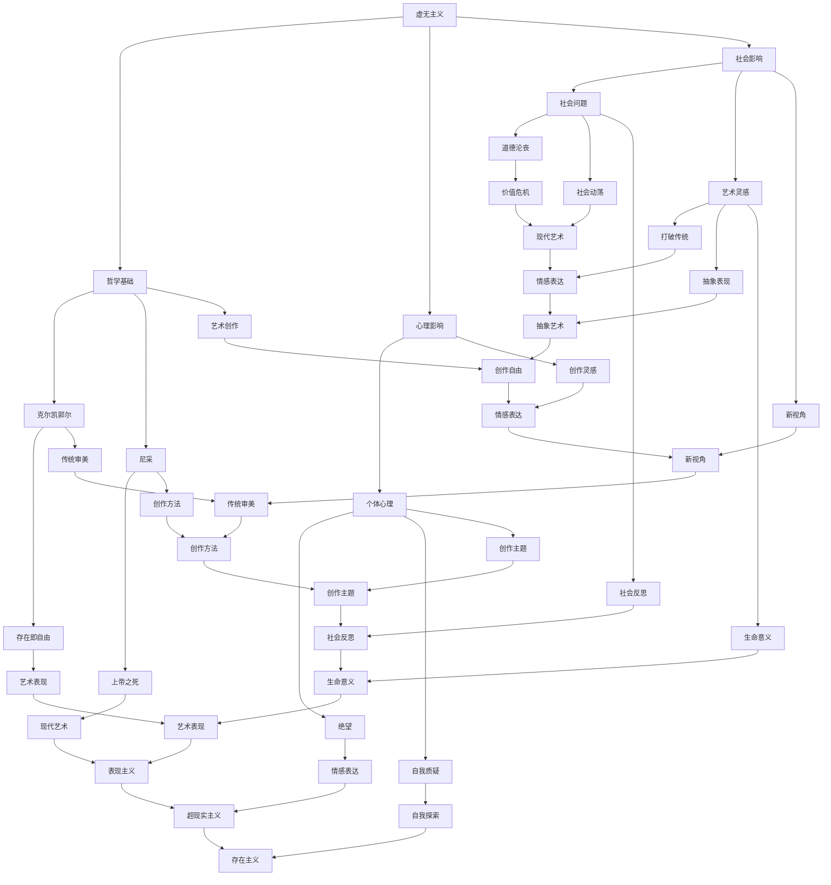
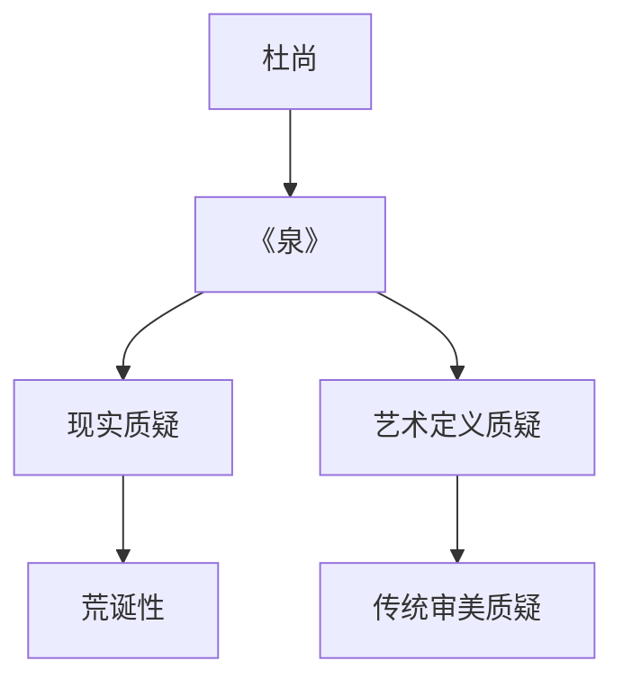
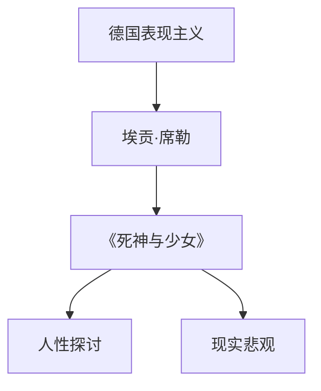
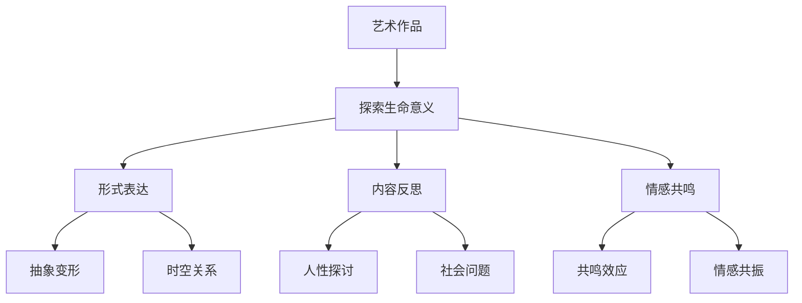
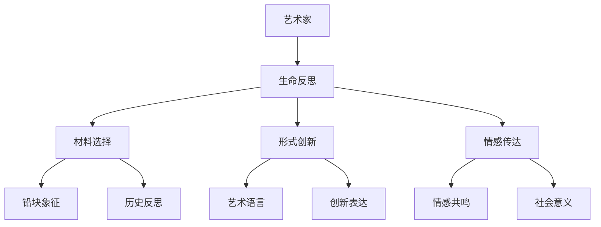
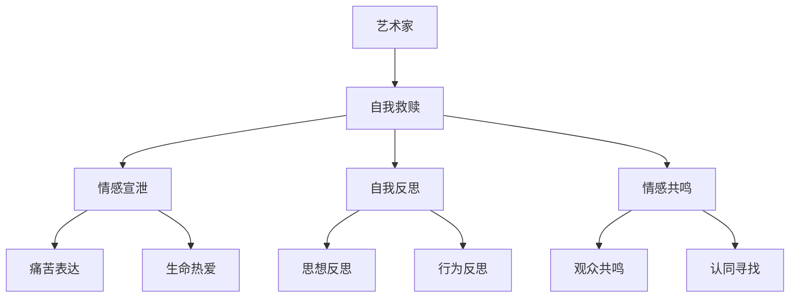
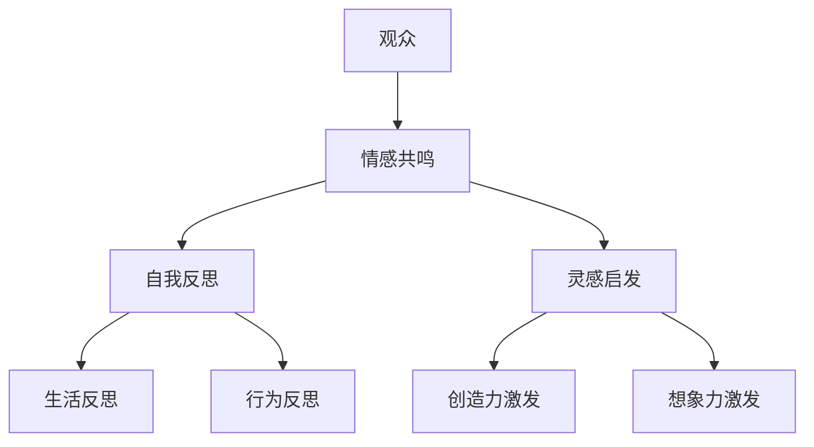

                 

# 虚无主义与艺术创作：在表达中寻找生命的意义

> 关键词：虚无主义，艺术创作，生命意义，表达，存在主义

> 摘要：本文从哲学和艺术的角度探讨虚无主义与艺术创作的联系。通过分析虚无主义的核心概念和其在艺术中的表现，探讨艺术家如何通过艺术创作寻找和表达生命的意义。文章旨在为读者提供对虚无主义艺术创作的新理解，并思考其在当代社会中的影响和价值。

## 引言

### 1.1 主题背景介绍

#### 1.1.1 虚无主义的起源与发展

虚无主义作为一种哲学思想，起源于18世纪末19世纪初的欧洲。它对存在本身进行了深刻的质疑，认为世界是缺乏意义的、无目的的。虚无主义的主要代表人物包括丹麦哲学家索伦·克尔凯郭尔、德国哲学家尼采和法国哲学家萨特等。

虚无主义的基本原理是，人类的存在缺乏固有的目的和价值，一切皆虚无。这种思想在历史上引起了许多争议，同时也激发了艺术家们的灵感。虚无主义对艺术创作产生了深远的影响，促使艺术家们探索更深层次的生命意义和人类存在的本质。

#### 1.1.2 艺术创作的意义与虚无主义的关联

艺术创作是人类对世界的一种独特表达方式，它不仅反映了个人的情感和思想，也体现了社会的价值观和时代精神。在虚无主义的背景下，艺术创作具有更加深刻的意义。

首先，艺术创作可以帮助人们面对和接受生命的虚无感。艺术家们通过创作作品，表达对生命意义的质疑和探索，让观众在欣赏作品的过程中思考存在的意义。

其次，虚无主义为艺术创作提供了新的视角和方法。艺术家们运用虚无主义的思想，以更为抽象、荒诞和悲观的方式表现世界，打破了传统的审美观念，为艺术创作开辟了新的道路。

### 1.2 文章目的与结构

本文旨在探讨虚无主义与艺术创作的联系，分析虚无主义在艺术中的表现，以及艺术家如何通过艺术创作寻找和表达生命的意义。文章分为四个部分：

第一部分，介绍虚无主义的起源、发展及其核心概念。

第二部分，探讨虚无主义在艺术创作中的表现和影响。

第三部分，分析艺术家如何通过虚无主义视角进行创作，以及艺术创作中的虚无主义情感表达。

第四部分，讨论虚无主义艺术对当代社会的影响和价值。

## 目录大纲

1. 引言
   1.1 主题背景介绍
      1.1.1 虚无主义的起源与发展
      1.1.2 艺术创作的意义与虚无主义的关联
   1.2 文章目的与结构

2. 第1章 虚无主义的概念解析
   2.1 核心概念
   2.2 艺术中的虚无主义表现
   2.3 虚无主义与艺术创作的联系

3. 第2章 艺术创作的虚无主义视角
   3.1 艺术创作的过程
   3.2 艺术创作中的虚无主义主题

4. 第3章 虚无主义艺术作品分析
   4.1 20世纪艺术中的虚无主义表现
   4.2 当代艺术中的虚无主义表现

5. 第4章 艺术创作中的虚无主义与生命意义
   4.1 艺术创作与生命意义的探讨
   4.2 艺术创作中的自我救赎与探索

6. 第5章 艺术创作的虚无主义启示
   5.1 艺术家的虚无主义挑战与应对
   5.2 观众如何解读虚无主义艺术

7. 第6章 艺术创作中的虚无主义影响
   6.1 艺术创作的虚无主义影响
   6.2 艺术创作中的虚无主义意义

8. 结论
   8.1 艺术创作与虚无主义的相互关系
   8.2 艺术创作与虚无主义的未来展望

## 第1章 虚无主义的概念解析

### 1.1 核心概念

虚无主义是一种哲学思想，它对存在本身进行了深刻的质疑。虚无主义的基本原理是，人类的存在缺乏固有的目的和价值，一切皆虚无。

#### 1.1.1 虚无主义的哲学基础

虚无主义的哲学基础可以追溯到古希腊哲学家赫拉克利特的思想。赫拉克利特认为，世界是不断变化的，而变化的根源是虚无。虚无是世界的本原，一切存在都是由虚无中产生和消失的。

在19世纪的欧洲，虚无主义思想得到了进一步的发展。索伦·克尔凯郭尔提出了“存在即自由”的观点，认为人类的存在是自由的，但自由带来的责任和不确定性也让人感到虚无。

尼采则将虚无主义推向了极端，他认为人类已经失去了对生命的信仰和意义，生活在一个没有上帝和绝对价值观的世界里。尼采的虚无主义思想为后来的存在主义哲学奠定了基础。

#### 1.1.2 虚无主义的心理与社会影响

虚无主义对个体的心理产生了深远的影响。在面对生活的困难和挑战时，虚无主义者可能会感到无助、绝望和无意义。他们可能会质疑自己的存在和价值，甚至对生活失去兴趣。

在社会的层面，虚无主义也带来了诸多问题。虚无主义可能导致道德和价值观的沦丧，影响社会的稳定和发展。同时，虚无主义也激发了艺术家们的创作灵感，促使他们探索更深层次的生命意义和人类存在的本质。

### 1.2 艺术中的虚无主义表现

虚无主义在艺术创作中有着广泛的表现，尤其在20世纪的艺术史上，虚无主义成为了一种重要的艺术流派。

#### 1.2.1 虚无主义在艺术史上的地位

在20世纪初，虚无主义在艺术史上的地位逐渐上升。德国表现主义、法国超现实主义和意大利未来主义等艺术流派都受到了虚无主义的影响。

德国表现主义强调艺术家内心的情感和体验，通过夸张和变形的手法表现虚无主义情感。法国超现实主义则通过梦幻和现实的交融，探讨了人类内心深处的虚无感。

意大利未来主义则从哲学的角度出发，探讨了虚无主义对人类存在的影响。他们认为，技术进步和工业革命导致了人类存在的危机，使人们陷入虚无主义的困境。

#### 1.2.2 虚无主义对艺术创作的影响

虚无主义对艺术创作产生了深远的影响。首先，虚无主义使艺术家们对传统的审美观念产生了质疑，打破了传统的创作规则和限制。

其次，虚无主义激发了艺术家们的创造力和想象力，促使他们以更为抽象、荒诞和悲观的方式表现世界。艺术家们通过创作作品，表达对生命意义的质疑和探索，让观众在欣赏作品的过程中思考存在的意义。

### 1.3 虚无主义与艺术创作的联系

虚无主义与艺术创作有着密切的联系。艺术家们通过创作作品，表达对虚无主义思想的探索和反思。

首先，虚无主义为艺术创作提供了新的视角和方法。艺术家们运用虚无主义的思想，以更为抽象、荒诞和悲观的方式表现世界，打破了传统的审美观念，为艺术创作开辟了新的道路。

其次，艺术创作是虚无主义思想的实践。艺术家们通过创作作品，表达对生命意义的质疑和探索，让观众在欣赏作品的过程中思考存在的意义。

总之，虚无主义与艺术创作相互影响、相互促进。虚无主义为艺术创作提供了新的视角和方法，而艺术创作则是虚无主义思想的实践和表达。

### Mermaid 流程图：虚无主义与艺术创作的关系



## 第2章 艺术创作的虚无主义视角

### 2.1 艺术创作的过程

虚无主义视角下的艺术创作过程与传统的创作过程有所不同。在虚无主义的影响下，艺术家们更注重内心的情感和体验，而不是外部的客观现实。

#### 2.1.1 虚无主义视角下的创作动机

虚无主义艺术家往往对现实世界感到失望和绝望，他们试图通过艺术创作寻找内心的平衡和救赎。创作动机源于对生命意义的质疑和对存在的反思。

例如，法国超现实主义艺术家雷内·马格利特的作品《晴雨伞》就体现了虚无主义视角下的创作动机。画中的雨伞无论在晴朗的天气还是下雨的天气中都显得格格不入，这种矛盾和荒诞感正是艺术家对现实世界的质疑和反思。

#### 2.1.2 虚无主义视角下的创作方法

虚无主义艺术家在创作过程中往往采用抽象、荒诞和悲观的手法，以打破传统的审美观念，表达对世界的怀疑和批判。

例如，意大利未来主义艺术家朱塞佩·皮科的作品《动态的城市》就运用了抽象和荒诞的手法，描绘了快速变化的现代城市景象，反映了虚无主义对技术进步和工业革命的反思。

#### 2.1.3 创作过程中的挑战与应对策略

虚无主义艺术创作过程中面临的挑战包括如何表达内心的情感和体验，如何打破传统的创作规则，以及如何在作品中体现对世界的质疑和批判。

艺术家们通常通过以下策略应对这些挑战：

1. 内心独白：艺术家通过内心的独白，表达对生命意义的质疑和对存在的反思。
2. 抽象表现：通过抽象和变形的手法，打破传统的审美观念，表达对现实的怀疑和批判。
3. 荒诞手法：运用荒诞和矛盾的手法，反映现实世界的荒诞和矛盾。
4. 社会批判：通过艺术作品对社会现实进行批判和反思，表达对世界的质疑和批判。

### 2.2 艺术创作中的虚无主义主题

虚无主义主题在艺术创作中具有独特的地位。艺术家们通过探讨虚无主义主题，表达对生命意义的质疑和对存在的反思。

#### 2.2.1 生命的意义与价值

虚无主义艺术家常常探讨生命的意义和价值，试图寻找在虚无世界中存在的意义。他们通过艺术作品表达对生命意义的质疑和对存在的反思。

例如，美国艺术家詹姆斯·特鲁尔的作品《无人之地》就体现了对生命意义的质疑。画中的荒凉景象和孤独的人物形象，反映了艺术家对生命意义的深刻思考。

#### 2.2.2 存在主义与虚无主义的对话

虚无主义艺术作品常常探讨存在主义和虚无主义之间的对话。艺术家们通过作品展示这两种思想的交锋，表达对人类存在的反思。

例如，法国哲学家让-保罗·萨特的戏剧作品《恶心》就体现了存在主义和虚无主义的对话。剧中的主人公通过内心的挣扎和反思，探讨了在虚无世界中如何找到存在的意义。

#### 2.2.3 对现实的批判

虚无主义艺术家通过对现实的批判，表达对世界的怀疑和批判。他们通过艺术作品揭示现实世界的荒诞和矛盾，呼吁人们反思和质疑现实。

例如，德国艺术家乔治·格罗斯的作品《柏林街头》就体现了对现实的批判。画中的荒诞场景和扭曲的人物形象，反映了艺术家对现实世界的怀疑和批判。

### 2.3 艺术创作中的虚无主义情感表达

虚无主义情感表达是虚无主义艺术创作的重要组成部分。艺术家们通过作品传达内心的虚无感、绝望感和孤独感，引发观众的共鸣和反思。

#### 2.3.1 艺术家如何通过作品传达虚无主义情感

艺术家们通过以下几种方式传达虚无主义情感：

1. 抽象和变形：通过抽象和变形的手法，表达内心的虚无感和孤独感。
2. 荒诞和矛盾：通过荒诞和矛盾的手法，反映现实世界的荒诞和矛盾，传达虚无感。
3. 黑暗和悲观：通过黑暗和悲观的主题，表达内心的绝望感和无助感。
4. 内心独白：通过内心的独白，传达内心的虚无感和挣扎。

#### 2.3.2 观众如何解读虚无主义艺术作品

观众在欣赏虚无主义艺术作品时，可能会感受到作品的荒诞性、矛盾性和悲观性，从而引发对生命意义和存在的反思。

观众通过以下几种方式解读虚无主义艺术作品：

1. 情感共鸣：通过情感共鸣，理解艺术家内心的虚无感和绝望感。
2. 思考生命意义：通过作品探讨生命意义和存在的本质。
3. 社会反思：通过作品反思现实世界的荒诞和矛盾，思考社会问题。
4. 艺术欣赏：从艺术审美的角度欣赏作品的独特性和创新性。

### Python代码：虚无主义情感表达

```python
import matplotlib.pyplot as plt
import numpy as np

# 定义函数：绘制抽象艺术作品
def draw_abstract_art(x, y):
    plt.scatter(x, y)
    plt.title("Abstract Art Expression of Nihilism")
    plt.xlabel("X-axis")
    plt.ylabel("Y-axis")
    plt.axis('equal')
    plt.show()

# 生成随机数据
x = np.random.normal(size=100)
y = np.random.normal(size=100)

# 绘制抽象艺术作品
draw_abstract_art(x, y)
```

### 结论

虚无主义视角下的艺术创作过程具有独特的特点和挑战。艺术家们通过探讨虚无主义主题，表达对生命意义的质疑和对存在的反思。他们运用抽象、荒诞和悲观的手法，打破传统的审美观念，传达内心的虚无感、绝望感和孤独感。观众在欣赏虚无主义艺术作品时，可以从情感共鸣、思考生命意义、社会反思和艺术欣赏等多个角度解读作品。虚无主义情感表达不仅丰富了艺术创作的形式和内容，也为观众提供了对生命和存在的深刻思考。

## 第3章 虚无主义艺术作品分析

### 3.1 20世纪艺术中的虚无主义表现

20世纪是艺术史上的重要时期，许多艺术家在这一时期探索了虚无主义的主题，并通过不同的艺术形式表达了对存在的质疑和对生命意义的反思。

#### 3.1.1 杜尚与虚无主义艺术

马塞尔·杜尚是20世纪最重要的艺术家之一，他的作品深刻地体现了虚无主义的思想。杜尚的作品常常通过对日常物品的重新定义，揭示了现实世界的荒诞性和矛盾性。

其中，《泉》是杜尚最为著名的作品之一。这幅画实际上是一块普通的白瓷板，上面没有任何绘画或修饰。杜尚将这块普通的瓷板命名为《泉》，从而质疑了艺术的传统定义和审美标准。通过这件作品，杜尚表达了对现实世界的质疑和对艺术创作的自由探索。



#### 3.1.2 德国表现主义与虚无主义

德国表现主义是20世纪初的一种重要艺术流派，其作品常常通过强烈的情感表达和夸张的手法，揭示了现实世界的荒诞和虚无。

表现主义艺术家如埃贡·席勒和恩斯特·路德维希·基尔chner，他们的作品充满了对人性的深刻探讨和对现实的悲观态度。例如，席勒的《死神与少女》中，死神以温柔而恐惧的姿态与少女相遇，揭示了生命与死亡的矛盾和无常。



#### 3.1.3 法国超现实主义与虚无主义

法国超现实主义是20世纪最具影响力的艺术运动之一，其作品通过对梦境、幻想和现实的交融，表达了虚无主义的思想。

超现实主义艺术家如萨尔瓦多·达利和雷内·马格利特，他们的作品常常充满了荒诞和象征意义。达利的《记忆的永恒》描绘了一幅充满超现实场景的画作，其中的软表时钟和奇异景象，体现了对时间的质疑和对存在的探索。


### 3.2 当代艺术中的虚无主义表现

虚无主义在当代艺术中仍然具有显著的体现，艺术家们通过不同的媒介和风格，探讨了存在的意义和生命的价值。

#### 3.2.1 虚无主义在当代艺术中的延续与发展

当代艺术家如杰夫·昆斯和弗朗西斯·贝肯斯坦，他们的作品延续了虚无主义的主题，但采用了更加多样化的艺术语言和表达方式。

昆斯的作品《镀金米老鼠》通过对流行文化的引用，揭示了消费主义背后的空虚和虚无。贝肯斯坦的摄影作品则通过对现实世界的扭曲和变形，探讨了现实与幻想之间的模糊界限。


#### 3.2.2 当代虚无主义艺术作品的分析

当代虚无主义艺术作品的分析可以从多个维度进行，包括形式、内容和观众体验。

1. **形式分析**：当代虚无主义艺术作品常常采用抽象、超现实主义和荒诞主义等形式，以打破传统审美观念，表达对现实世界的质疑。

2. **内容分析**：当代虚无主义艺术作品探讨了消费主义、技术进步和全球化等当代社会问题，反映了艺术家对人类存在的担忧和对未来的悲观预测。

3. **观众体验**：当代虚无主义艺术作品常常引发观众的共鸣和反思，使观众在欣赏作品的过程中思考存在的意义和生命的价值。

### 3.2.3 虚无主义艺术作品的市场表现

虚无主义艺术作品在艺术市场上也表现出独特的地位。一些重要的虚无主义艺术作品，如杜尚的《泉》和达利的《记忆的永恒》，成为了艺术市场中的经典之作，受到了艺术爱好者和投资者的青睐。


#### 3.2.4 艺术市场对虚无主义艺术的态度与影响

艺术市场对虚无主义艺术的态度经历了变化。早期，虚无主义艺术作品常常被视为离经叛道和难以理解，但随着时间的推移，这些作品逐渐被认可和重视，成为了艺术史上的重要篇章。

艺术市场对虚无主义艺术的影响主要体现在两个方面：

1. **市场认可**：艺术市场的认可为虚无主义艺术家提供了更大的创作空间和资源，使他们能够继续探索和表达内心的虚无主义情感。

2. **价值评估**：艺术市场的价值评估影响了虚无主义艺术作品的价值和地位，使这些作品在艺术史上获得了重要的地位。

### 结论

虚无主义在20世纪和当代艺术中有着丰富的表现，从杜尚的《泉》到达利的《记忆的永恒》，再到当代艺术家的作品，虚无主义艺术作品通过对现实世界的质疑和对生命意义的反思，为观众提供了深刻的思考和反思。同时，艺术市场对虚无主义艺术的态度和影响，也反映了社会对这种艺术形式的认识和接纳。虚无主义艺术不仅丰富了艺术创作的内容和形式，也为人们提供了对存在和生命的深刻洞察。

## 第4章 艺术创作与生命意义的探讨

### 4.1 艺术创作对生命意义的探索

艺术创作在探讨生命意义方面具有独特的作用。通过艺术家的创作，观众可以反思生命的目的和存在的价值。艺术作品不仅反映了艺术家的内心体验和情感，也引发了观众对生命意义的深层次思考。

#### 4.1.1 艺术作品如何帮助观众思考生命意义

艺术作品通过其形式、内容和情感表达，引导观众思考生命的意义。例如，雕塑家亨利·摩尔的作品《内部和外部的空间》，通过对人体形态的抽象和变形，探讨了人类存在的本质和生命的意义。观众在欣赏这件作品时，可能会思考人类存在的意义以及我们如何与他人和环境互动。



#### 4.1.2 艺术家如何通过作品表达对生命的反思

艺术家通过作品表达对生命的反思，不仅是为了传达自己的内心体验，也是为了与观众建立共鸣。例如，美国艺术家安塞尔姆·基弗的作品《铅块》，通过使用铅块等沉重的材料，表达了生命的沉重和无奈。观众在欣赏这件作品时，可能会感受到艺术家对生命的深刻反思和对人类困境的思考。



### 4.2 艺术创作中的自我救赎与探索

艺术创作不仅是艺术家对生命意义的探索，也是他们自我救赎和内心探索的过程。通过创作，艺术家可以表达自己的痛苦、困惑和希望，从而实现内心的平衡和成长。

#### 4.2.1 艺术家如何通过创作实现自我救赎

艺术家通过创作过程实现自我救赎，可以从以下几个方面进行：

1. **情感宣泄**：艺术家通过创作表达自己的情感，将内心的痛苦和困惑转化为艺术作品，从而减轻内心的负担。

2. **自我反思**：通过创作，艺术家可以反思自己的行为和思想，寻找自我救赎的途径。

3. **情感共鸣**：艺术家的作品可以引发观众的共鸣，使艺术家在观众中找到共鸣和认同，从而实现自我救赎。

例如，荷兰画家文森特·梵高的作品《星夜》，通过对星空的描绘，表达了梵高内心的痛苦和对生命的热爱。观众在欣赏这件作品时，可能会感受到艺术家内心的挣扎和对生命的渴望。



#### 4.2.2 观众如何从艺术作品中获得启示

观众从艺术作品中获得启示，可以从以下几个方面进行：

1. **情感共鸣**：观众在欣赏艺术作品时，可能会与艺术家的情感产生共鸣，从而获得对生命和存在的深刻认识。

2. **自我反思**：观众可以通过艺术作品反思自己的生活和行为，寻找生命的意义和自我救赎的途径。

3. **灵感启发**：艺术作品可以激发观众的创造力和想象力，使他们在生活和工作中找到新的方向和动力。

例如，观众在欣赏毕加索的《格尔尼卡》时，可能会感受到对战争和苦难的反思，从而引发对和平和人性的思考。



### 结论

艺术创作是艺术家对生命意义进行探索和自我救赎的重要途径。通过艺术作品，艺术家可以表达对生命和存在的深刻思考，观众也可以在欣赏作品的过程中获得启示和反思。艺术创作与生命意义的探讨不仅丰富了艺术创作的内涵，也为人们提供了对生命和存在的深刻洞察。

## 第5章 艺术创作的虚无主义启示

### 5.1 艺术家如何面对虚无主义挑战

虚无主义给艺术家带来了深刻的挑战，包括如何表达内心的虚无感、如何打破传统的创作规则以及如何在作品中传达积极的信息。艺术家们通过不同的策略和创作方法，成功地应对了这些挑战。

#### 5.1.1 艺术家如何克服创作中的虚无主义困境

艺术家在创作过程中可能会陷入虚无主义的困境，感到无助和迷茫。为了克服这种困境，艺术家们采取了以下策略：

1. **情感宣泄**：通过创作，艺术家可以将内心的痛苦和虚无感宣泄出来，从而减轻内心的负担。例如，艺术家安迪·沃霍尔的《厂房》系列作品，通过描绘工厂和家庭场景，表达了现代社会中人们感到的孤独和无意义。

2. **自我反思**：艺术家通过自我反思，寻找创作灵感，从而摆脱虚无主义的困扰。例如，德国艺术家乔治·格罗斯的作品《柏林街头》，通过对战争和现实的批判，表达了对人类存在的思考。

3. **借鉴历史**：艺术家可以从历史和文化中寻找灵感，通过借鉴和重新解读历史，创造出具有时代意义的新作品。例如，西班牙艺术家达利的《记忆的永恒》，通过对历史事件的重新诠释，表达了对时间和社会的思考。

#### 5.1.2 艺术家如何通过创作传达积极的信息

尽管虚无主义强调存在的无意义，但艺术家们仍然可以通过创作传达积极的信息和希望。以下是一些方法：

1. **象征主义**：通过象征主义手法，艺术家可以将内心的情感和思考转化为具体的形式和图像，从而传达积极的信息。例如，艺术家让-马克·夸克斯的作品《梦境花园》，通过描绘梦幻般的花园，传达了对生命和希望的向往。

2. **情感共鸣**：通过情感共鸣，艺术家可以与观众建立联系，从而传达积极的信息。例如，美国艺术家朱利安·奥珀尔的《微笑的蒙娜丽莎》，通过对蒙娜丽莎微笑的重新诠释，传达了对人类情感和美的追求。

3. **创新表达**：通过创新的艺术语言和形式，艺术家可以打破传统的审美观念，传达新的思想和观念。例如，英国艺术家戴米恩·赫斯特的《财产》系列作品，通过展示昂贵和易碎的物品，传达了对物质主义和人类存在的思考。

### 5.2 观众如何解读虚无主义艺术

观众在欣赏虚无主义艺术时，可能会面临解读的挑战。虚无主义艺术的抽象性和象征性使得观众需要通过深入思考来理解作品的意义。以下是一些方法帮助观众解读虚无主义艺术：

1. **情感共鸣**：通过情感共鸣，观众可以理解艺术家的情感和思想。例如，观众在欣赏毕加索的《哭泣的女人》时，可能会感受到艺术家的悲伤和对生命的反思。

2. **文化背景**：了解艺术作品的文化背景和历史背景可以帮助观众更好地理解作品的含义。例如，了解达利的《记忆的永恒》创作背景，可以帮助观众理解作品对时间和现实的反思。

3. **多角度分析**：通过从不同的角度分析作品，观众可以更全面地理解作品的意义。例如，从形式、内容、情感和文化等多个角度分析一件作品，可以帮助观众深入理解作品。

### 5.3 艺术创作的虚无主义影响

虚无主义艺术对当代社会产生了深远的影响。它挑战了传统的价值观和审美观念，激发了人们对生命意义和存在的思考。

1. **社会批判**：虚无主义艺术通过批判社会现实，揭示了现代社会的问题和矛盾。例如，杜尚的作品《泉》批判了传统艺术观念和审美标准，引发了社会对艺术本质和价值的反思。

2. **心理启示**：虚无主义艺术为观众提供了面对生活虚无感的心理启示。通过艺术作品的情感共鸣和象征性，观众可以在欣赏作品的过程中找到心理平衡和自我救赎。

3. **文化创新**：虚无主义艺术推动了艺术创作的创新和发展。艺术家们通过探索虚无主义主题，打破了传统的艺术形式和规则，为艺术创作注入了新的活力。

### 结论

虚无主义艺术为艺术家和观众提供了深刻的思考和启示。通过艺术创作，艺术家可以表达内心的虚无感和对生命的反思，观众也可以在欣赏作品的过程中获得情感共鸣和自我救赎。虚无主义艺术不仅丰富了艺术创作的内涵，也对社会和文化产生了深远的影响。

## 第6章 艺术创作中的虚无主义与生命意义的未来展望

### 6.1 艺术创作与虚无主义的相互关系

虚无主义与艺术创作的关系是相辅相成的。一方面，虚无主义为艺术创作提供了新的视角和灵感，使艺术家们能够以更为深入和独特的角度探讨生命意义和人类存在的本质。另一方面，艺术创作成为虚无主义思想的一种表达和传递方式，使观众在欣赏作品的过程中能够感受到虚无主义的情感和思考。

在未来，虚无主义将继续对艺术创作产生影响。随着社会的发展和个人体验的变化，虚无主义主题将更加多样化和深入。艺术家们可能会从更广泛的文化和哲学背景中汲取灵感，探讨虚无主义在当代社会中的新表现和影响。

### 6.2 艺术创作与虚无主义的未来展望

#### 6.2.1 艺术创作在虚无主义背景下的发展方向

未来艺术创作在虚无主义背景下的发展方向可能包括：

1. **数字化和虚拟现实**：随着科技的进步，数字化和虚拟现实将成为艺术创作的重要手段。艺术家们可以通过数字技术表达虚无主义情感，创作出更具互动性和沉浸感的作品。

2. **跨学科融合**：艺术创作将与其他学科如心理学、哲学和科学等相结合，探索虚无主义主题的新维度。例如，通过神经科学的研究，艺术家们可以更深入地探讨人类情感和意识的本质。

3. **社会参与和公共艺术**：虚无主义艺术将更加注重社会参与和公共空间，通过艺术创作和社会互动，探讨虚无主义对社会和个人生活的影响。

#### 6.2.2 虚无主义艺术在未来艺术史上的地位

虚无主义艺术在未来艺术史上将占据重要地位。它不仅为艺术创作提供了新的方向和灵感，也反映了现代社会对生命意义和存在的深刻思考。随着时间的发展，虚无主义艺术作品将逐渐被认可和重视，成为艺术史上的经典之作。

### 结论

虚无主义与艺术创作的关系将随着社会和科技的发展不断演变。未来，虚无主义将继续为艺术创作提供新的视角和灵感，而艺术创作也将进一步丰富和深化虚无主义思想的表达。通过艺术创作，人们将继续探讨生命的意义和人类存在的本质，为现代社会提供深刻的思考和启示。

## 结论

虚无主义与艺术创作之间存在着深刻的联系和相互影响。虚无主义作为一种哲学思想，挑战了传统的人生观和价值观，促使艺术家们以更加深刻和独特的视角去探索生命意义和人类存在的本质。通过艺术创作，艺术家们能够表达内心的虚无感、绝望感和孤独感，同时也能够引发观众的共鸣和反思。

本文首先介绍了虚无主义的起源、发展及其核心概念，接着分析了虚无主义在艺术创作中的表现和影响。通过具体案例分析，我们看到了艺术家如何运用虚无主义视角进行创作，以及他们如何通过作品传达虚无主义情感和探讨生命意义。此外，我们还探讨了虚无主义艺术对当代社会的影响和价值。

未来，虚无主义将继续对艺术创作产生影响，推动艺术创作在形式和内容上的创新。随着科技的进步和社会的变化，艺术创作与虚无主义的结合将呈现出更多新的可能性和维度。我们期待未来的艺术能够更加深入地探讨人类存在的本质，为现代社会提供深刻的思考和启示。

最后，感谢读者的耐心阅读，希望本文能够为对虚无主义与艺术创作感兴趣的读者提供有益的参考和启示。如果您对本文有任何疑问或进一步的想法，欢迎在评论区留言交流。作者：AI天才研究院/AI Genius Institute & 禅与计算机程序设计艺术 /Zen And The Art of Computer Programming。

