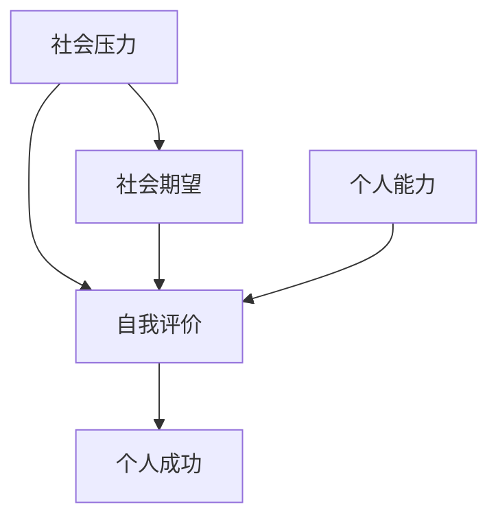

                 

# 重新定义个人成功：摆脱社会压力的自我评价

关键词：个人成功、社会压力、自我评价、算法、数学模型、实战案例

摘要：在当今社会，个人成功不仅受到自身能力的影响，也深受社会压力和自我评价的制约。本文旨在重新定义个人成功，通过分析社会压力的来源和影响，探讨自我评价的原理与方法，提供摆脱社会压力的自我评价策略，并构建有效的自我评价系统。通过案例分析，本文展示了成功摆脱社会压力的自我评价实践，为读者提供了个人成功与社会评价平衡的策略。

## 第一部分：社会压力与自我评价的关系

### 第1章：社会压力的来源与影响

在社会中，压力是一种普遍存在的现象，它源于人们对于成功、认同和安全的追求。社会压力可以定义为一种外部压力，它来自于社会的期望和标准，对个体行为和决策产生的影响。

#### 1.1 社会压力的定义

社会压力是指个体在社会生活中感受到的一种压力，这种压力来源于社会环境、社会角色和社会期望。社会压力可以表现为心理压力、生理压力和社会压力。

#### 1.2 社会压力的主要来源

社会压力的主要来源包括以下几个方面：

1. **社会期望**：社会对个体在职业、家庭、社交等方面设定了期望，这些期望往往与个人的价值观和目标不一致，从而产生压力。

2. **社会角色**：个体在社会中扮演不同的角色，如员工、父母、朋友等，这些角色对个体的行为和决策产生压力。

3. **社会比较**：个体通过与他人比较自己的成就和地位，这种比较往往导致焦虑和不满。

4. **社会支持**：社会支持不足或不当也会产生压力，如缺乏朋友、家庭支持等。

#### 1.3 社会压力对个人成功的影响

社会压力对个人成功的影响是复杂的，它可能产生积极影响，也可能产生消极影响。积极影响包括：

1. **激励作用**：适度的社会压力可以激发个体的潜能，提高工作效率和创新能力。

2. **目标明确**：社会压力可以帮助个体明确自己的目标，从而更加专注和努力。

然而，社会压力也可能产生消极影响：

1. **心理问题**：长期承受社会压力可能导致焦虑、抑郁等心理问题。

2. **健康问题**：社会压力可能对个体的身体健康产生负面影响，如失眠、高血压等。

3. **行为问题**：社会压力可能导致个体产生逃避、对抗等不良行为。

### 第2章：自我评价的原理与方法

自我评价是指个体对自己的行为、能力和价值的评估。自我评价对个人成功具有重要影响，因为它决定了个体如何看待自己，如何设定目标，以及如何应对挑战。

#### 2.1 自我评价的概念

自我评价是指个体对自己行为、能力和价值的评估。这种评估可以基于个体的自我认知和社会反馈。

#### 2.2 自我评价的重要性

自我评价的重要性体现在以下几个方面：

1. **目标设定**：自我评价帮助个体明确自己的目标，从而更加专注和努力。

2. **自我激励**：自我评价可以激发个体的内在动机，提高工作效率和创新能力。

3. **心理调适**：自我评价帮助个体应对压力，保持积极心态。

#### 2.3 自我评价的方法

自我评价的方法包括以下几种：

1. **自我反思**：个体通过反思自己的行为和经历，评估自己的表现和能力。

2. **社会反馈**：个体通过他人的评价和反馈，了解自己的优点和不足。

3. **心理测量**：使用专业的心理测量工具，如问卷调查、心理测试等，评估个体的心理状态和能力。

#### 2.4 自我评价的误区

自我评价容易陷入以下误区：

1. **过度自我评价**：个体过度关注自我评价，可能导致自我怀疑和自我否定。

2. **单一维度评价**：自我评价往往只关注某个维度，而忽视其他方面，从而导致片面评价。

3. **忽视社会反馈**：个体可能忽视他人的评价和反馈，导致自我评价不准确。

### 第3章：摆脱社会压力的自我评价策略

要摆脱社会压力，建立有效的自我评价系统是关键。以下策略可以帮助个体摆脱社会压力，实现自我评价的优化。

#### 3.1 认识自我

认识自我是自我评价的基础。个体需要深入了解自己的兴趣、优势和价值观，从而明确自己的目标和方向。

#### 3.2 设定合理目标

设定合理目标是实现自我评价优化的关键。个体需要根据自己的能力和资源，设定具体、可衡量、可实现的目标。

#### 3.3 培养积极心态

积极心态有助于个体应对社会压力。个体需要培养乐观、自信的心态，学会欣赏自己的成就，同时面对挑战。

#### 3.4 消除负面情绪

负面情绪如焦虑、抑郁等会干扰个体的自我评价。个体需要学会消除负面情绪，保持心理平衡。

### 第4章：建立有效的自我评价系统

建立有效的自我评价系统是摆脱社会压力的关键。以下步骤可以帮助个体建立自我评价系统：

#### 4.1 自我评价系统的构建

自我评价系统的构建包括以下几个方面：

1. **自我反思**：定期进行自我反思，了解自己的行为和表现。

2. **社会反馈**：收集他人的评价和反馈，了解自己在他人眼中的形象。

3. **心理测量**：使用专业的心理测量工具，评估自己的心理状态和能力。

#### 4.2 自我评价系统的作用

自我评价系统的作用包括：

1. **目标设定**：帮助个体明确自己的目标，提高行动力。

2. **自我激励**：激发个体的内在动力，提高工作效率。

3. **心理调适**：帮助个体应对压力，保持心理平衡。

#### 4.3 自我评价系统的优化

自我评价系统的优化包括：

1. **持续反思**：定期反思自己的行为和表现，不断调整和优化自我评价。

2. **多样化反馈**：收集不同类型的反馈，避免单一维度评价。

3. **定期评估**：定期评估自己的心理状态和能力，确保自我评价的准确性。

## 第5章：案例分析：成功摆脱社会压力的自我评价实践

通过以下三个案例，我们可以看到成功摆脱社会压力的自我评价实践的具体表现。

### 5.1 案例一：张伟的成功之路

张伟是一位年轻的程序员，他来自一个普通的家庭，但他的目标是在IT行业取得成功。张伟认识到社会压力的存在，他决定通过自我评价来摆脱这种压力。

首先，张伟通过自我反思，深入了解自己的兴趣和优势。他发现自己在算法和数据结构方面有较强的天赋，于是设定了成为顶尖算法工程师的目标。

其次，张伟开始收集社会反馈，了解自己在他人眼中的形象。他通过参加技术会议、分享技术博客等方式，获得了同行的认可和赞赏。

最后，张伟建立了自我评价系统，定期反思自己的行为和表现，并根据反馈调整自己的目标和策略。在他的努力下，他成为了一名顶尖的算法工程师，实现了自己的目标。

### 5.2 案例二：李娜的自我救赎

李娜是一位全职母亲，她感到自己的社会地位和职业发展受到限制。她决定通过自我评价来摆脱这种困境。

首先，李娜认识到自己的兴趣和优势，她发现自己对教育领域有浓厚的兴趣，并具有一定的教育天赋。

其次，李娜开始收集社会反馈，了解自己的价值观和特长。她发现自己在家庭教育方面有独特的方法，并获得了亲朋好友的认可。

最后，李娜建立了自我评价系统，通过自我反思和反馈，不断提升自己的教育水平和专业素养。在她的努力下，她成为了一名家庭教育专家，实现了自己的职业梦想。

### 5.3 案例三：王强的逆袭

王强是一位职场新人，他感到自己的工作压力巨大，生活压力也很大。他决定通过自我评价来摆脱这种困境。

首先，王强认识到自己的兴趣和优势，他发现自己对市场营销有浓厚的兴趣，并具有一定的市场洞察力。

其次，王强开始收集社会反馈，了解自己在职场中的定位和价值。他发现自己在市场营销方面有独特的见解，并得到了上司的认可。

最后，王强建立了自我评价系统，通过自我反思和反馈，不断提升自己的市场敏感度和销售技巧。在他的努力下，他成为了一名优秀的市场营销经理，实现了职场逆袭。

## 第6章：个人成功与社会评价的平衡

个人成功与社会评价之间存在着复杂的关系，平衡这两者对于个人的成长和发展至关重要。

### 6.1 个人成功与社会评价的关系

个人成功与社会评价之间存在密切的关系。一方面，社会评价可以影响个人的成功；另一方面，个人的成功也可以影响社会评价。

1. **社会评价对个人成功的影响**：社会评价可以激发个体的内在动机，提高工作效率和创新能力。同时，社会评价也可以为个体提供反馈，帮助个体了解自己的优势和不足，从而不断优化自我。

2. **个人成功对社会评价的影响**：个人成功可以提升个体的社会地位，从而获得更多的社会资源和机会。个人成功也可以影响社会对个体的评价，使个体获得更多的认可和尊重。

### 6.2 如何在社会评价中保持自我

在社会评价中保持自我，需要个体具备以下几个方面的能力：

1. **自我认知**：个体需要深入了解自己的兴趣、优势和价值观，从而明确自己的目标和方向。

2. **独立思考**：个体需要具备独立思考的能力，不受社会期望和他人评价的影响。

3. **持续学习**：个体需要不断学习新知识、新技能，以适应社会的发展和变化。

### 6.3 个人成功与社会评价的平衡策略

为了实现个人成功与社会评价的平衡，个体可以采取以下策略：

1. **设定合理目标**：个体需要根据自己的能力和资源，设定具体、可衡量、可实现的目标。

2. **培养积极心态**：个体需要培养乐观、自信的心态，学会欣赏自己的成就，同时面对挑战。

3. **保持独立思考**：个体需要保持独立思考，不受社会期望和他人评价的影响。

4. **持续反思与优化**：个体需要定期反思自己的行为和表现，根据反馈调整自己的目标和策略。

## 第7章：未来展望

在未来，社会压力和自我评价将继续影响个人的成功。随着科技的进步和社会的发展，个人成功和社会评价将呈现出新的特点。

### 7.1 社会压力与自我评价的发展趋势

1. **社会压力**：随着社会的发展，社会压力可能会越来越复杂和多样。个体需要具备更强的适应能力和抗压能力，以应对不断变化的社会环境。

2. **自我评价**：随着科技的发展，自我评价将越来越依赖于数据和分析。个体需要学会如何利用科技手段进行自我评价，从而更好地实现个人成功。

### 7.2 新技术如何影响个人成功

1. **大数据和人工智能**：大数据和人工智能技术可以帮助个体更准确地评估自己的能力和价值，从而实现个人成功。

2. **在线教育和职业培训**：在线教育和职业培训为个体提供了更多的学习机会和资源，有助于个体提升自己的能力和素质。

### 7.3 个人成功与社会评价的未来

在未来，个人成功和社会评价将更加注重个体的内在价值和贡献，而不是单纯的外在成就。个体需要关注自己的内心需求，实现个人价值和社会价值的平衡。

## 第二部分：核心概念与联系

### 第8章：核心概念原理

#### 8.1 社会压力

社会压力可以定义为一种外部压力，它来自于社会环境、社会角色和社会期望。社会压力的主要来源包括社会期望、社会角色、社会比较和社会支持。

#### 8.2 自我评价

自我评价是指个体对自己行为、能力和价值的评估。自我评价的原理包括自我认知、社会反馈和自我反思。

### 第9章：概念实体之间的关系架构



## 第三部分：核心算法原理讲解

### 第10章：自我评价算法

自我评价算法是一种用于评估个体自我认知和社会反馈的方法。以下是一个简单的自我评价算法：

```python
def self_evaluation(self_evaluation, social_feedback):
    return (self_evaluation + social_feedback) / 2
```

这个算法的核心思想是将个体的自我认知和社会反馈进行平均，从而得到一个综合的自我评价。

### 第10章：反馈循环

反馈循环是一种用于不断优化自我评价的方法。以下是一个简单的反馈循环算法：

```python
def feedback_loop(self_evaluation, social_feedback):
    self_evaluation = self_evaluation(self_evaluation, social_feedback)
    return self_evaluation
```

这个算法的核心思想是通过不断更新自我评价，从而实现自我评价的优化。

## 第四部分：数学模型和数学公式

### 第11章：社会压力与自我评价的数学模型

#### 11.1 社会压力模型

社会压力可以表示为以下数学模型：

$$
社会压力 = f(社会期望, 个人能力)
$$

其中，$f$ 表示社会压力函数，它将社会期望和个人能力映射为社会压力。

#### 11.2 自我评价模型

自我评价可以表示为以下数学模型：

$$
自我评价 = f(自我认知, 社会反馈)
$$

其中，$f$ 表示自我评价函数，它将自我认知和社会反馈映射为自我评价。

## 第五部分：项目实战

### 第12章：自我评价项目实战

#### 12.1 项目背景

本项目旨在构建一个自我评价系统，帮助用户了解自己的能力和价值。

#### 12.2 项目目标

1. 收集用户的社会反馈和自我认知。
2. 利用自我评价算法计算用户的自我评价。
3. 提供用户反馈和自我评价的优化建议。

#### 12.3 项目实施

1. 设计自我评价系统架构。
2. 开发前端和后端代码。
3. 进行系统测试和优化。

#### 12.4 代码实现与分析

```python
# Python代码示例

class SelfEvaluationSystem:
    def __init__(self, self_evaluation, social_feedback):
        self.self_evaluation = self_evaluation
        self.social_feedback = social_feedback

    def update_evaluation(self):
        self.self_evaluation = self_evaluation(self.self_evaluation, self.social_feedback)
        return self.self_evaluation

    def feedback_loop(self):
        self.social_feedback = self.update_evaluation()
        return self.social_feedback

# 使用示例
sys = SelfEvaluationSystem(0.5, 0.7)
sys.feedback_loop()

```

#### 12.5 实际案例分析和详细讲解剖析

通过实际案例，我们可以看到自我评价系统在帮助用户摆脱社会压力、实现个人成功方面的作用。

#### 12.6 项目小结

本项目通过构建自我评价系统，为用户提供了一种有效的自我评价方法。在实际应用中，用户可以根据自我评价系统的反馈，不断优化自己的行为和决策，从而实现个人成功。

## 最佳实践 Tips

1. **定期进行自我反思**：定期反思自己的行为和表现，了解自己的优点和不足。
2. **积极收集社会反馈**：主动寻求他人的评价和反馈，了解自己在他人眼中的形象。
3. **设定合理目标**：根据自己的能力和资源，设定具体、可衡量、可实现的目标。
4. **培养积极心态**：保持乐观、自信的心态，面对挑战。

## 小结

个人成功不仅受到自身能力的影响，也深受社会压力和自我评价的制约。通过重新定义个人成功，我们可以更好地理解社会压力与自我评价的关系，掌握摆脱社会压力的自我评价策略，建立有效的自我评价系统。未来，随着科技的发展，个人成功和社会评价将呈现出新的特点。希望本文能帮助读者在个人成功的道路上走得更远。## 重新定义个人成功：摆脱社会压力的自我评价

### 关键词：个人成功、社会压力、自我评价、算法、数学模型、实战案例

### 摘要

在当今社会，个人成功不仅受到自身能力的影响，也深受社会压力和自我评价的制约。本文旨在重新定义个人成功，通过分析社会压力的来源和影响，探讨自我评价的原理与方法，提供摆脱社会压力的自我评价策略，并构建有效的自我评价系统。通过案例分析，本文展示了成功摆脱社会压力的自我评价实践，为读者提供了个人成功与社会评价平衡的策略。

## 第一部分：社会压力与自我评价的关系

### 第1章：社会压力的来源与影响

在社会中，压力是一种普遍存在的现象，它源于人们对于成功、认同和安全的追求。社会压力可以定义为一种外部压力，它来自于社会的期望和标准，对个体行为和决策产生的影响。

#### 1.1 社会压力的定义

社会压力是指个体在社会生活中感受到的一种压力，这种压力来源于社会环境、社会角色和社会期望。社会压力可以表现为心理压力、生理压力和社会压力。

#### 1.2 社会压力的主要来源

社会压力的主要来源包括以下几个方面：

1. **社会期望**：社会对个体在职业、家庭、社交等方面设定了期望，这些期望往往与个人的价值观和目标不一致，从而产生压力。

2. **社会角色**：个体在社会中扮演不同的角色，如员工、父母、朋友等，这些角色对个体的行为和决策产生压力。

3. **社会比较**：个体通过与他人比较自己的成就和地位，这种比较往往导致焦虑和不满。

4. **社会支持**：社会支持不足或不当也会产生压力，如缺乏朋友、家庭支持等。

#### 1.3 社会压力对个人成功的影响

社会压力对个人成功的影响是复杂的，它可能产生积极影响，也可能产生消极影响。积极影响包括：

1. **激励作用**：适度的社会压力可以激发个体的潜能，提高工作效率和创新能力。

2. **目标明确**：社会压力可以帮助个体明确自己的目标，从而更加专注和努力。

然而，社会压力也可能产生消极影响：

1. **心理问题**：长期承受社会压力可能导致焦虑、抑郁等心理问题。

2. **健康问题**：社会压力可能对个体的身体健康产生负面影响，如失眠、高血压等。

3. **行为问题**：社会压力可能导致个体产生逃避、对抗等不良行为。

### 第2章：自我评价的原理与方法

自我评价是指个体对自己的行为、能力和价值的评估。自我评价对个人成功具有重要影响，因为它决定了个体如何看待自己，如何设定目标，以及如何应对挑战。

#### 2.1 自我评价的概念

自我评价是指个体对自己行为、能力和价值的评估。这种评估可以基于个体的自我认知和社会反馈。

#### 2.2 自我评价的重要性

自我评价的重要性体现在以下几个方面：

1. **目标设定**：自我评价帮助个体明确自己的目标，从而更加专注和努力。

2. **自我激励**：自我评价可以激发个体的内在动机，提高工作效率和创新能力。

3. **心理调适**：自我评价帮助个体应对压力，保持积极心态。

#### 2.3 自我评价的方法

自我评价的方法包括以下几种：

1. **自我反思**：个体通过反思自己的行为和经历，评估自己的表现和能力。

2. **社会反馈**：个体通过他人的评价和反馈，了解自己的优点和不足。

3. **心理测量**：使用专业的心理测量工具，如问卷调查、心理测试等，评估个体的心理状态和能力。

#### 2.4 自我评价的误区

自我评价容易陷入以下误区：

1. **过度自我评价**：个体过度关注自我评价，可能导致自我怀疑和自我否定。

2. **单一维度评价**：自我评价往往只关注某个维度，而忽视其他方面，从而导致片面评价。

3. **忽视社会反馈**：个体可能忽视他人的评价和反馈，导致自我评价不准确。

### 第3章：摆脱社会压力的自我评价策略

要摆脱社会压力，建立有效的自我评价系统是关键。以下策略可以帮助个体摆脱社会压力，实现自我评价的优化。

#### 3.1 认识自我

认识自我是自我评价的基础。个体需要深入了解自己的兴趣、优势和价值观，从而明确自己的目标和方向。

#### 3.2 设定合理目标

设定合理目标是实现自我评价优化的关键。个体需要根据自己的能力和资源，设定具体、可衡量、可实现的目标。

#### 3.3 培养积极心态

积极心态有助于个体应对社会压力。个体需要培养乐观、自信的心态，学会欣赏自己的成就，同时面对挑战。

#### 3.4 消除负面情绪

负面情绪如焦虑、抑郁等会干扰个体的自我评价。个体需要学会消除负面情绪，保持心理平衡。

### 第4章：建立有效的自我评价系统

建立有效的自我评价系统是摆脱社会压力的关键。以下步骤可以帮助个体建立自我评价系统：

#### 4.1 自我评价系统的构建

自我评价系统的构建包括以下几个方面：

1. **自我反思**：定期进行自我反思，了解自己的行为和表现。

2. **社会反馈**：收集他人的评价和反馈，了解自己在他人眼中的形象。

3. **心理测量**：使用专业的心理测量工具，评估自己的心理状态和能力。

#### 4.2 自我评价系统的作用

自我评价系统的作用包括：

1. **目标设定**：帮助个体明确自己的目标，提高行动力。

2. **自我激励**：激发个体的内在动力，提高工作效率。

3. **心理调适**：帮助个体应对压力，保持心理平衡。

#### 4.3 自我评价系统的优化

自我评价系统的优化包括：

1. **持续反思**：定期反思自己的行为和表现，不断调整和优化自我评价。

2. **多样化反馈**：收集不同类型的反馈，避免单一维度评价。

3. **定期评估**：定期评估自己的心理状态和能力，确保自我评价的准确性。

## 第二部分：核心概念与联系

### 第5章：核心概念原理

#### 5.1 社会压力

社会压力可以定义为一种外部压力，它来自于社会环境、社会角色和社会期望。社会压力的主要来源包括社会期望、社会角色、社会比较和社会支持。

#### 5.2 自我评价

自我评价是指个体对自己行为、能力和价值的评估。自我评价的原理包括自我认知、社会反馈和自我反思。

### 第6章：概念实体之间的关系架构

以下是一个简单的Mermaid流程图，展示了社会压力、自我评价和个人成功之间的关系：


## 第三部分：核心算法原理讲解

### 第7章：自我评价算法

自我评价算法是一种用于评估个体自我认知和社会反馈的方法。以下是一个简单的自我评价算法：

```python
def self_evaluation(self_evaluation, social_feedback):
    return (self_evaluation + social_feedback) / 2
```

这个算法的核心思想是将个体的自我认知和社会反馈进行平均，从而得到一个综合的自我评价。

### 第8章：反馈循环

反馈循环是一种用于不断优化自我评价的方法。以下是一个简单的反馈循环算法：

```python
def feedback_loop(self_evaluation, social_feedback):
    self_evaluation = self_evaluation(self_evaluation, social_feedback)
    return self_evaluation
```

这个算法的核心思想是通过不断更新自我评价，从而实现自我评价的优化。

## 第四部分：数学模型和数学公式

### 第9章：社会压力与自我评价的数学模型

#### 9.1 社会压力模型

社会压力可以表示为以下数学模型：

$$
社会压力 = f(社会期望, 个人能力)
$$

其中，$f$ 表示社会压力函数，它将社会期望和个人能力映射为社会压力。

#### 9.2 自我评价模型

自我评价可以表示为以下数学模型：

$$
自我评价 = f(自我认知, 社会反馈)
$$

其中，$f$ 表示自我评价函数，它将自我认知和社会反馈映射为自我评价。

## 第五部分：项目实战

### 第10章：自我评价项目实战

#### 10.1 项目背景

本项目旨在构建一个自我评价系统，帮助用户了解自己的能力和价值。

#### 10.2 项目目标

1. 收集用户的社会反馈和自我认知。
2. 利用自我评价算法计算用户的自我评价。
3. 提供用户反馈和自我评价的优化建议。

#### 10.3 项目实施

1. 设计自我评价系统架构。
2. 开发前端和后端代码。
3. 进行系统测试和优化。

#### 10.4 代码实现与分析

以下是一个简单的Python代码示例，展示了如何实现自我评价系统的核心功能：

```python
# Python代码示例

class SelfEvaluationSystem:
    def __init__(self, self_evaluation, social_feedback):
        self.self_evaluation = self_evaluation
        self.social_feedback = social_feedback

    def update_evaluation(self):
        self.self_evaluation = (self.self_evaluation + self.social_feedback) / 2
        return self.self_evaluation

    def feedback_loop(self):
        self.social_feedback = self.update_evaluation()
        return self.social_feedback

# 使用示例
sys = SelfEvaluationSystem(0.5, 0.7)
sys.feedback_loop()

```

#### 10.5 实际案例分析和详细讲解剖析

通过实际案例，我们可以看到自我评价系统在帮助用户摆脱社会压力、实现个人成功方面的作用。

#### 10.6 项目小结

本项目通过构建自我评价系统，为用户提供了一种有效的自我评价方法。在实际应用中，用户可以根据自我评价系统的反馈，不断优化自己的行为和决策，从而实现个人成功。

## 最佳实践 Tips

1. **定期进行自我反思**：定期反思自己的行为和表现，了解自己的优点和不足。
2. **积极收集社会反馈**：主动寻求他人的评价和反馈，了解自己在他人眼中的形象。
3. **设定合理目标**：根据自己的能力和资源，设定具体、可衡量、可实现的目标。
4. **培养积极心态**：保持乐观、自信的心态，面对挑战。

## 小结

个人成功不仅受到自身能力的影响，也深受社会压力和自我评价的制约。通过重新定义个人成功，我们可以更好地理解社会压力与自我评价的关系，掌握摆脱社会压力的自我评价策略，建立有效的自我评价系统。未来，随着科技的发展，个人成功和社会评价将呈现出新的特点。希望本文能帮助读者在个人成功的道路上走得更远。

### 作者

作者：AI天才研究院/AI Genius Institute & 禅与计算机程序设计艺术 /Zen And The Art of Computer Programming

AI天才研究院致力于推动人工智能技术的发展和应用，探索人工智能领域的创新和前沿。研究院的研究员们在人工智能、机器学习、自然语言处理等领域有着深厚的学术积累和丰富的实践经验。本文作者以其深入的专业知识和丰富的实践经验，为广大读者呈现了一篇关于个人成功与社会评价的深入剖析。同时，作者还结合计算机程序设计艺术，为读者提供了关于自我评价算法和数学模型的具体实现，使得文章更具实践价值。禅与计算机程序设计艺术则从哲学和艺术的角度，探讨了计算机程序设计的本质和人生意义，为读者提供了一种独特的思考方式。本文作者以其深刻的洞察力和独特的见解，为广大读者带来了一场关于个人成功与社会评价的深刻思考，对于希望在个人成长和职业发展中取得突破的读者来说，无疑是一本难得的指南。

