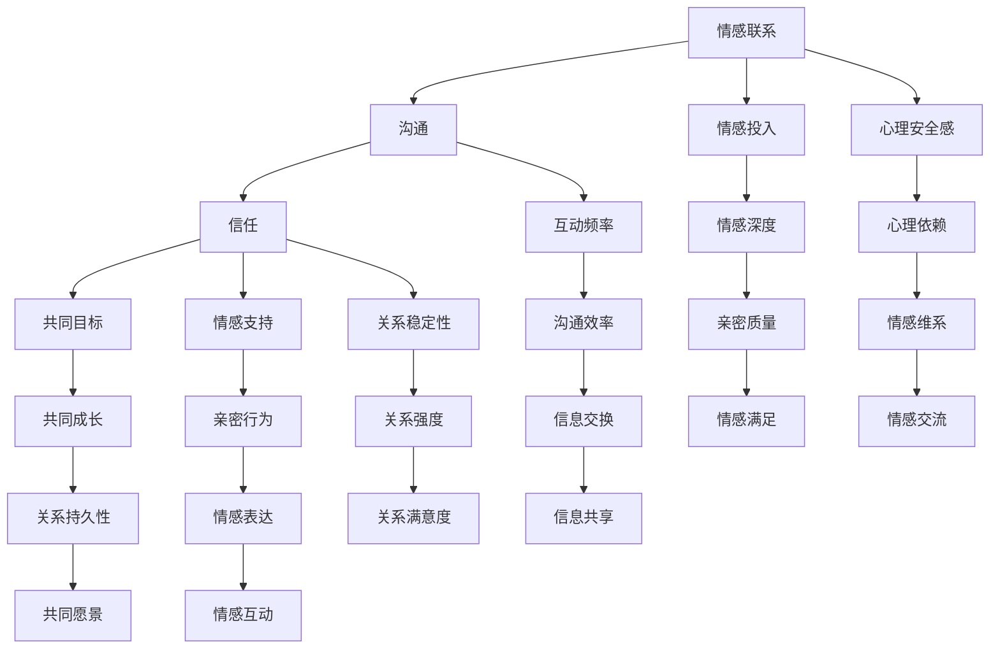

                 

### 引入

《重新定义亲密关系：数字时代的情感连接》是一本探讨在数字时代背景下，如何重新审视和构建亲密关系的新作。随着科技的迅猛发展，我们的生活方式、沟通方式以及情感连接的方式都发生了深刻的变化。这本书旨在为读者提供一个全新的视角，帮助我们理解和应对数字时代亲密关系的挑战，以及如何在虚拟世界中建立和维系真实的情感连接。

数字时代对亲密关系的影响不容小觑。一方面，数字工具和社交平台的普及使得人们能够更加便捷地与远隔千里的亲友保持联系。另一方面，过度依赖数字设备、信息过载以及网络社交的虚拟性，也带来了一系列新的问题，如人际关系的疏离、情感表达的困境等。因此，重新定义亲密关系，探索数字时代下的情感连接策略，成为当务之急。

本篇文章将围绕以下几个核心问题展开讨论：

1. 数字时代对亲密关系的影响和挑战是什么？
2. 如何在数字时代下建立和维护健康的亲密关系？
3. 情感连接的技术支持有哪些？如何运用这些技术提升情感连接的质量？
4. 实际案例中，数字技术与情感连接的融合是如何实现的？
5. 数字时代的情感连接有哪些最佳实践和注意事项？

通过逐步分析和推理，我们将深入了解数字时代亲密关系的本质，以及如何在虚拟世界中实现情感的有效连接。

### 关键词

- 亲密关系
- 数字时代
- 情感连接
- 社交媒体
- 人工智能
- 情感分析
- 情感计算
- 数字工具
- 挑战与对策
- 情感表达
- 情感技术支持
- 数字生活方式
- 最佳实践

### 摘要

《重新定义亲密关系：数字时代的情感连接》是一本探讨在数字化背景下如何重新审视和构建亲密关系的新书。本书通过分析数字时代对亲密关系的影响和挑战，探讨了在数字工具和社交平台普及的背景下，如何建立和维护健康的情感连接。本书提出了情感连接的策略与实践，介绍了情感分析技术及其在情感连接中的应用，并通过实际案例展示了数字技术与情感连接的融合。本书旨在为读者提供实用的数字时代情感连接指南，帮助他们在虚拟世界中维系真实而深刻的情感关系。

### 第1章 引言

#### 1.1 书籍背景与目的

在当今数字化时代，我们越来越依赖互联网和数字工具进行沟通和社交。然而，这种变革不仅改变了我们的生活方式，也对我们的亲密关系产生了深远的影响。传统的面对面沟通逐渐被即时通讯软件、社交媒体和在线游戏所取代，使得人们在享受便利的同时，也面临着新的挑战。

《重新定义亲密关系：数字时代的情感连接》这本书的目的是探讨在数字时代背景下，如何重新审视和构建亲密关系。随着数字技术的迅猛发展，我们的沟通方式、社交习惯和情感表达都发生了巨大变化。这本书希望通过深入分析和研究，揭示数字时代对亲密关系的影响，并提出相应的策略和实践，以帮助读者在虚拟世界中建立和维护健康的情感连接。

#### 1.2 数字时代对亲密关系的影响

数字时代对亲密关系的影响是多方面的。一方面，数字工具和社交平台的普及使得人们能够更加便捷地与亲友保持联系。无论是远隔千里的亲人，还是生活中的朋友，我们都可以通过电子邮件、即时通讯软件、社交媒体等工具进行实时沟通。这种便利性极大地增强了人际关系的紧密度，使得距离不再是沟通的障碍。

然而，数字时代也带来了一些新的挑战。首先，信息过载和虚拟交流的普及使得人们很难真正深入地了解对方。在社交媒体上，我们可能会展示一个完美的形象，但实际上内心可能充满了孤独和焦虑。这种表面上的亲密关系难以替代现实生活中深入的心灵交流。

其次，数字时代的依赖性也带来了一系列问题。许多人过度依赖手机和社交媒体，导致面对面沟通的减少，甚至对现实生活中的社交互动感到陌生和不安。这种现象不仅影响了亲密关系的质量，还可能导致心理问题，如孤独感、焦虑感和抑郁情绪。

此外，数字时代的匿名性和隐私风险也给亲密关系带来了挑战。在互联网上，人们可以轻易地隐藏自己的真实身份，这为网络欺骗和情感欺诈提供了土壤。夫妻或伴侣之间可能会因为对方在社交媒体上的不当行为而感到背叛和伤害。

#### 1.3 情感连接的重要性

在数字时代，情感连接的重要性愈发凸显。情感连接不仅是指情感的传递和互动，更是一种深层次的心灵共鸣和关系维系。健康的情感连接能够增强亲密关系的稳定性，提高沟通效率，增进彼此的了解和信任。

首先，情感连接能够帮助我们在数字时代保持心理健康。研究表明，缺乏情感连接会导致孤独感、焦虑和抑郁等心理问题。通过数字工具进行情感交流，可以帮助我们缓解这些负面情绪，增强心理韧性。

其次，情感连接能够提升亲密关系的质量。在面对面的沟通中，情感连接可以通过非语言表达、眼神交流等方式实现。而在数字时代，虽然无法完全替代面对面的交流，但通过视频通话、文字互动等手段，仍然可以实现一定程度的情感连接。

最后，情感连接有助于培养亲密关系的可持续性。在长期关系中，情感连接是维系关系的基石。通过不断强化情感连接，我们可以更好地应对生活中的挑战，共同创造美好的未来。

综上所述，数字时代对亲密关系的影响既带来了机遇，也带来了挑战。重新定义亲密关系，探索数字时代下的情感连接策略，是我们应对这一变革的重要途径。在接下来的章节中，我们将深入探讨这些核心问题，并分享实用的建议和策略，帮助读者在数字时代建立和维护健康的亲密关系。

### 第2章 核心概念与联系

在探讨数字时代下的亲密关系和情感连接之前，我们首先需要明确几个核心概念，并了解它们之间的关系架构。以下是本章将介绍的主要核心概念及其相互联系：

#### 2.1 亲密关系的定义与要素

**亲密关系的定义：** 亲密关系是指两个人之间基于信任、尊重、理解和支持的情感联系，这种关系通常涉及深刻的情感投入和长期的承诺。

**亲密关系的要素：** 亲密关系包含多个要素，包括情感联系、沟通、信任、共同目标、情感支持等。这些要素相互交织，共同构成了亲密关系的核心。

**概念实体之间的关系架构：** 使用Mermaid流程图可以更直观地展示亲密关系的要素及其相互关系。



通过这个Mermaid流程图，我们可以清晰地看到亲密关系的各个要素及其相互之间的联系。这些要素共同构成了亲密关系的整体架构，每个要素都对关系的质量和发展起着重要作用。

#### 2.2 情感连接的理论基础

**情感连接的定义：** 情感连接是指两个个体之间通过情感传递、共鸣和互动建立起来的心理联系，这种连接不仅涉及情感的表达和感知，还包括情感的理解和回应。

**情感连接的理论基础：** 情感连接的理论基础主要来源于社会心理学和情感科学。根据社会心理学的理论，情感连接是一种社会性动机，是人类基本的心理需求之一。个体通过情感连接获得安全感和归属感，同时也能增强自我认同和自我价值感。

情感连接的具体机制包括：

1. **情感共鸣：** 当两个个体经历相似的情感时，他们之间的情感连接会增强。情感共鸣能够促进双方的情感交流和共同理解。
2. **情感传递：** 通过语言、非语言行为和身体接触等方式，个体可以将自己的情感传递给对方，从而建立情感连接。
3. **情感理解：** 理解对方的情感状态是建立情感连接的关键。通过倾听、观察和沟通，个体可以更好地理解对方的情感，从而增强情感连接的质量。
4. **情感回应：** 对方的情感传递和表达能够引发个体的情感回应，这种回应是情感连接持续发展的动力。

#### 2.3 数字技术与亲密关系的互动

随着数字技术的发展，数字工具在亲密关系中的作用越来越显著。数字技术不仅改变了我们沟通和互动的方式，也影响了亲密关系的质量和稳定性。

**数字工具的作用：**

1. **即时通讯：** 即时通讯工具如微信、WhatsApp等使得双方能够随时交流，增强了沟通的便捷性和互动性。
2. **社交媒体：** 社交媒体平台如Facebook、Instagram等提供了展示自我和互动的新方式，有助于维持和扩展社交网络。
3. **视频通话：** 视频通话工具如Zoom、Skype等提供了实时视觉沟通，能够增强情感的传递和共鸣。
4. **虚拟现实：** 虚拟现实技术正在逐渐应用于亲密关系中，为双方提供了一个虚拟的空间进行互动，尽管这种方式无法完全替代现实中的面对面交流，但能够在特定情境下提供独特的体验。

**数字技术与亲密关系的互动机制：**

1. **信息共享：** 数字工具使得双方能够更便捷地分享信息，这有助于加深对彼此的了解和信任。
2. **情感互动：** 通过文字、图片、视频等方式，双方可以更频繁地进行情感互动，增强情感连接。
3. **情感分析：** 利用情感分析技术，可以分析沟通内容中的情感倾向，帮助双方更好地理解对方的情感状态，从而提升情感连接的质量。

综上所述，核心概念与联系构成了理解和探讨数字时代亲密关系和情感连接的基础。通过明确亲密关系的要素和情感连接的理论基础，以及分析数字技术与亲密关系的互动机制，我们可以更好地应对数字时代带来的挑战，探索建立和维护健康情感连接的策略和实践。

### 第3章 数字时代下的亲密关系

随着数字技术的发展和普及，我们的社交方式、沟通习惯以及亲密关系的形式都发生了显著变化。在这个数字时代，亲密关系呈现出一些新的特点和挑战。

#### 3.1 数字时代的亲密关系特点

**1. 沟通的便捷性：** 数字工具如即时通讯软件和社交媒体使得人们能够随时随地与亲友保持联系。这种便捷性大大增强了沟通的频率和互动性，使得人们能够更加轻松地分享日常生活中的点滴。

**2. 虚拟与现实并存：** 在数字时代，虚拟空间和现实生活之间的界限变得越来越模糊。许多亲密关系既包括现实生活中的面对面互动，也包括在线游戏、社交媒体等虚拟空间中的互动。这种并存性为亲密关系带来了新的体验和挑战。

**3. 信息过载：** 数字工具的普及也带来了信息过载的问题。人们每天接收到的信息量庞大，难以对所有信息进行有效处理和理解。这种信息过载可能导致亲密关系中的沟通障碍和情感表达的困境。

**4. 依赖性增加：** 一些人过度依赖数字工具进行社交和沟通，导致面对面互动的减少。这种依赖性不仅影响了亲密关系的质量，还可能导致心理问题，如孤独感、焦虑和抑郁情绪。

**5. 隐私和安全风险：** 在数字时代，隐私和安全风险成为亲密关系中的一个重要问题。网络欺诈、情感欺诈等行为层出不穷，给亲密关系带来了潜在的风险和挑战。

#### 3.2 数字工具在亲密关系中的应用

数字工具在亲密关系中的应用多种多样，以下是一些常见的例子：

**1. 即时通讯：** 即时通讯工具如微信、WhatsApp等使得夫妻或情侣能够随时交流，分享日常生活中的点滴。这种即时性增强了沟通的互动性和便捷性，有助于维持亲密关系的稳定性。

**2. 社交媒体：** 社交媒体平台如Facebook、Instagram等不仅提供了展示自我的平台，也成为了人们进行情感交流和分享的重要工具。通过分享生活照片、发布动态，人们能够在虚拟空间中展示自己的生活和情感状态，从而增强亲密关系。

**3. 视频通话：** 视频通话工具如Zoom、Skype等使得夫妻或情侣能够进行实时视觉沟通。这种面对面的互动虽然无法完全替代现实生活中的亲密接触，但在特定情境下能够提供独特的体验，增强情感连接。

**4. 在线游戏：** 在线游戏成为了许多夫妻或情侣共同参与的活动。通过一起玩游戏，他们能够增进互动、分享快乐，从而加深彼此的情感联系。

**5. 情感分析工具：** 利用情感分析技术，人们可以分析自己的情感状态，从而更好地理解和回应对方的情感需求。这种技术可以为亲密关系提供新的工具和视角，帮助双方更好地维系情感连接。

#### 3.3 数字时代下的亲密关系挑战

尽管数字工具为亲密关系带来了许多便利，但也带来了一系列新的挑战：

**1. 沟通障碍：** 过度依赖数字工具可能导致面对面沟通的减少，这可能导致沟通障碍和情感表达的困境。在虚拟空间中，非语言表达和情感传递的效果往往不如现实生活中的面对面交流。

**2. 情感疏离：** 信息过载和虚拟交流的普及可能导致人际关系的疏离。人们在面对大量的信息时，很难进行深入的思考和情感交流，这可能导致亲密关系的淡化和疏离。

**3. 安全和隐私风险：** 数字时代的隐私和安全风险也给亲密关系带来了挑战。网络欺诈、情感欺诈等行为可能导致亲密关系中的背叛和伤害。

**4. 时间管理：** 在数字时代，人们面临着信息过载和任务繁多的压力，这可能导致时间管理上的挑战。如何在忙碌的生活中平衡数字工具的使用和现实生活中的亲密关系，成为了一个重要的问题。

**5. 情感依赖：** 过度依赖数字工具进行社交和沟通可能导致情感依赖。人们在虚拟空间中寻找情感慰藉，而忽视了现实生活中的亲密关系。这种情感依赖可能对亲密关系的稳定性产生负面影响。

综上所述，数字时代对亲密关系带来了许多新的特点和挑战。通过了解这些特点和挑战，我们可以更好地应对数字时代带来的变革，探索建立和维护健康亲密关系的策略和实践。

### 第4章 情感连接的策略与实践

在数字时代，建立和维护健康的情感连接需要一套有效的策略和实践。以下是一些关键策略，以及如何在日常生活中实施这些策略的具体建议。

#### 4.1 情感连接的基本策略

**1. 增强沟通：** 沟通是情感连接的基础。在数字时代，我们需要更积极地利用各种沟通工具，包括即时通讯、视频通话、电子邮件等，来保持与亲友的密切联系。以下是一些建议：

- **定期视频聊天：** 尽管无法替代面对面的交流，但定期的视频聊天可以帮助双方感受到彼此的存在和关爱。
- **倾听与回应：** 在沟通中，倾听对方的意见和感受，并给予积极的回应，这能够增强彼此的情感连接。
- **表达情感：** 不要害怕表达自己的情感，无论是喜悦、忧虑还是愤怒。真诚的情感表达能够加深彼此的理解和信任。

**2. 维持现实互动：** 即使在数字时代，现实生活中的互动仍然至关重要。以下是一些建议：

- **共度时光：** 尽可能安排一些共同的活动，如散步、看电影或一起做饭，这些活动能够增强彼此的情感联系。
- **节日庆祝：** 在重要的节日或特殊的日子，如生日、纪念日等，安排一些特别的庆祝活动，以表达对彼此的爱和关怀。
- **陪伴与支持：** 在对方需要时，给予实际的支持和陪伴，这能够增强彼此的情感纽带。

**3. 管理数字依赖：** 过度依赖数字工具可能导致情感疏离。以下是一些建议：

- **设定界限：** 设定一些时间界限，如每天晚上或每周的一天，不使用手机或社交媒体，专注于现实生活中的互动。
- **共同活动：** 与亲友一起参与一些不涉及数字工具的活动，如户外运动、阅读或手工制作，以减少对数字工具的依赖。
- **情感反馈：** 在使用数字工具时，保持对情感的关注，及时表达对对方的感受和需求，以维持情感连接。

#### 4.2 数字时代下的情感连接技巧

**1. 个性化沟通：** 在数字时代，个性化的沟通能够增强情感连接。以下是一些建议：

- **定制化内容：** 根据对方的兴趣和喜好，发送个性化的内容，如特别的生日祝福、感兴趣的新闻或有趣的故事。
- **情感标签：** 在文字沟通中，使用情感标签（如😊、😢、😃等）来传达情感，这能够增强情感的表达和感知。
- **共享体验：** 通过分享虚拟现实中的体验，如VR旅行、虚拟音乐会等，能够创造独特的情感体验，增强情感连接。

**2. 使用情感分析工具：** 利用情感分析工具可以帮助我们更好地理解和回应对方的情感状态。以下是一些建议：

- **情感检测：** 使用情感分析软件检测沟通内容中的情感倾向，了解对方的情感状态，从而更好地回应。
- **情感反馈：** 根据情感分析的结果，给予对方适当的情感反馈，如理解、关心和支持，以增强情感连接。
- **情感调节：** 通过分析情感数据，了解自己的情感波动，从而进行自我调节，保持积极的情感状态。

#### 4.3 实际案例分析

以下是一个实际案例，展示了如何在数字时代建立和维护健康的情感连接：

**案例：** 小明和小红是一对异地恋的情侣，他们通过视频通话和社交媒体保持联系。虽然他们无法每天见面，但通过以下策略，他们成功地维系了情感连接：

- **定期视频聊天：** 他们每周至少进行一次长时间的视频聊天，分享彼此的生活和工作。
- **个性化沟通：** 小明会根据小红的兴趣，发送个性化的内容，如她喜欢的书籍推荐和音乐推荐。
- **情感标签：** 在文字沟通中，他们经常使用情感标签来表达自己的情感，这增强了沟通的情感深度。
- **情感调节：** 当小红感到焦虑或不安时，小明会通过视频聊天给予她情感支持和安慰。

通过这些策略和实践，小明和小红成功地克服了异地恋的挑战，维持了健康而稳定的情感连接。

#### 4.4 最佳实践与注意事项

在数字时代建立和维护情感连接时，以下最佳实践和注意事项值得注意：

- **尊重隐私：** 在使用数字工具时，尊重对方的隐私，不要过度干涉对方的生活。
- **保持真实：** 在虚拟空间中，保持真实和真诚的情感表达，不要为了取悦对方而掩饰真实的情感。
- **平衡现实与虚拟：** 不要完全依赖数字工具，保持现实生活中的互动和交流，以维护真实的情感连接。
- **情感反馈：** 定期给予对方情感反馈，以了解彼此的需求和感受，从而调整和优化沟通方式。

通过这些策略和实践，我们可以更好地在数字时代建立和维护健康的情感连接，使亲密关系更加稳固和持久。

### 第5章 情感连接的技术支持

在数字时代，情感连接不仅依赖于人际互动的策略与实践，还需要技术支持。情感分析、人工智能和情感计算等技术正越来越多地应用于情感连接中，为提升情感连接的质量提供了强有力的工具。

#### 5.1 情感分析技术介绍

情感分析技术是一种利用自然语言处理（NLP）和机器学习算法来分析文本、语音和图像等数据中情感倾向的技术。情感分析可以帮助我们理解和量化情感表达，从而提供更深入的情感连接。

**情感分析的基本原理：**
1. **情感分类：** 将文本数据分类为积极、消极或中性情感。
2. **情感强度评估：** 对文本中的情感倾向进行强度评估，如非常开心、有点开心、无所谓等。
3. **情感极性分析：** 分析文本中的情感极性，如正面、负面、中性等。

**情感分析的应用：**
1. **情感检测：** 在社交媒体分析、客户反馈和情感状态监测等领域，情感分析可以帮助识别用户的情感倾向和情绪波动。
2. **情感反馈：** 通过分析沟通内容中的情感倾向，为用户提供个性化的情感反馈，增强沟通的深度和效果。
3. **情感预测：** 基于历史数据和情感分析结果，预测用户的情感状态和需求，从而提供更贴心的服务。

#### 5.2 人工智能与情感连接

人工智能（AI）技术在情感连接中的应用越来越广泛，通过机器学习和深度学习算法，AI能够模拟和增强人类的情感交互。

**人工智能在情感连接中的作用：**
1. **情感理解：** AI可以通过学习大量的情感表达数据，理解复杂的情感状态和需求，从而提供更精准的情感反馈。
2. **情感模拟：** AI可以模拟人类的情感表达，如通过语音合成技术模拟声音的情感变化，使沟通更加生动和富有情感。
3. **情感增强：** AI可以通过情感增强技术，如情感语音识别和情感增强聊天机器人，提升沟通的情感体验和互动质量。

**具体应用案例：**
1. **聊天机器人：** 利用AI技术开发的聊天机器人可以模拟人类的情感交互，提供情感支持和咨询服务。
2. **虚拟助手：** 智能虚拟助手通过情感分析技术，理解用户的需求和情感状态，提供个性化的服务和建议。
3. **情感诊断工具：** 利用AI的情感分析技术，开发情感诊断工具，帮助用户识别和管理情绪问题。

#### 5.3 情感计算的发展趋势

情感计算（Affective Computing）是人工智能的一个分支，旨在使计算机能够识别、理解、处理和模拟人类情感。随着技术的进步，情感计算在情感连接中的应用前景广阔。

**情感计算的发展趋势：**
1. **情感识别：** 通过多模态情感识别技术，如面部表情、语音和文本分析，情感计算能够更全面地理解用户的情感状态。
2. **情感交互：** 情感交互技术通过情感反馈和自适应交互，使计算机能够与用户建立更深层次的情感连接。
3. **情感教育：** 利用情感计算技术，开发情感教育工具，帮助用户培养和管理情绪，提高情感智能。

**未来展望：**
1. **情感智能助手：** 随着情感计算技术的发展，情感智能助手将成为人们日常生活中的重要伙伴，提供个性化的情感支持和建议。
2. **情感健康监测：** 情感计算技术在健康监测和医疗领域的应用将越来越广泛，通过实时监测用户的情感状态，帮助预防和管理心理疾病。
3. **情感增强娱乐：** 情感计算技术将增强虚拟现实和游戏等娱乐体验，提供更加丰富和个性化的情感互动。

通过情感分析、人工智能和情感计算等技术，我们可以更好地理解和处理情感连接中的复杂问题，为数字时代的亲密关系提供强有力的技术支持。

### 第6章 案例分析与探讨

在数字时代，情感连接在职场、家庭关系和社交媒体中的应用越来越广泛。以下是一些具体的案例分析，探讨情感连接在不同场景中的实践和效果。

#### 6.1 情感连接在职场中的应用

**案例：** 一家跨国公司在全球范围内设有多个办公室，为了保持员工之间的情感连接，公司引入了多种数字工具和策略。

**具体实践：**
1. **定期视频会议：** 公司定期组织视频会议，让不同地区的员工能够面对面交流，分享工作进展和经验。
2. **虚拟社交活动：** 利用在线平台组织虚拟社交活动，如虚拟晚餐、游戏之夜等，增强员工之间的情感联系。
3. **员工情感支持小组：** 建立员工情感支持小组，通过在线讨论和分享，帮助员工缓解工作压力，提升心理健康。

**效果分析：**
通过这些实践，公司成功地保持了员工之间的情感连接，提高了团队协作效率和工作满意度。员工感受到公司的关怀和支持，增强了归属感和忠诚度。

#### 6.2 情感连接在家庭关系中的实践

**案例：** 一对异地恋的夫妻通过数字工具维持日常的情感联系。

**具体实践：**
1. **视频通话：** 每天晚上进行视频通话，分享日常生活和工作中的点滴，增强情感互动。
2. **共享家庭计划：** 通过在线工具共同制定周末计划和假期安排，增强共同目标和愿景。
3. **情感日记：** 通过共同撰写情感日记，记录彼此的情感波动和心路历程，增进理解和信任。

**效果分析：**
通过这些实践，夫妻之间的情感连接得到了显著增强，尽管身处异地，但他们仍然能够保持紧密的情感联系，共同应对生活中的挑战。

#### 6.3 情感连接在社交媒体中的探索

**案例：** 一位社交媒体博主通过情感连接与粉丝建立了深厚的情感纽带。

**具体实践：**
1. **互动评论：** 主动回复粉丝的评论，关注他们的意见和需求，建立情感互动。
2. **情感分享：** 分享自己的真实情感和生活经验，与粉丝建立情感共鸣。
3. **粉丝互动活动：** 组织线上互动活动，如问答环节、抽奖活动等，增强粉丝参与感和归属感。

**效果分析：**
通过这些实践，博主成功地建立了与粉丝之间的深厚情感连接，粉丝对其产生了强烈的认同感和忠诚度，从而提高了社交媒体的影响力和受众黏性。

综上所述，情感连接在不同场景中的应用都取得了显著的成效。通过有效的数字工具和策略，人们能够在虚拟世界中建立和维护真实的情感连接，从而提升人际关系的质量和稳定性。

### 第7章 总结与展望

#### 7.1 亲密关系与情感连接的重要性

在数字时代，亲密关系和情感连接的重要性愈发凸显。健康的亲密关系不仅是个人幸福的基石，也是社会和谐稳定的保障。情感连接能够增强人际关系的稳定性，提高沟通效率，增进彼此的了解和信任。在现代社会，随着生活节奏的加快和社交方式的多样化，如何建立和维护健康的亲密关系成为了一个重要课题。

数字时代带来了前所未有的便利，但同时也带来了新的挑战。信息过载、虚拟交流的普及以及隐私和安全风险等问题，对亲密关系产生了深远影响。因此，重新审视和定义亲密关系，探索数字时代下的情感连接策略，是应对这一挑战的关键。

#### 7.2 数字时代情感连接的未来

随着技术的不断进步，数字时代情感连接的未来充满了无限可能。首先，人工智能和情感计算技术的发展将使情感分析更加精准，情感互动更加自然。未来，我们可以期待更加智能的情感支持系统和虚拟伴侣，为人们提供更加个性化、贴心的情感服务。

其次，虚拟现实和增强现实技术的应用将拓展情感连接的维度。通过虚拟空间，人们可以在虚拟世界中实现更丰富的情感体验，如虚拟约会、虚拟旅行等。这种全新的互动方式将使情感连接更加生动和有趣。

此外，区块链技术的引入将进一步提升情感连接的透明度和安全性。通过区块链，我们可以建立去中心化的情感连接平台，保护用户的隐私和权益，减少信息泄露和欺诈行为。

#### 7.3 倡导健康数字生活方式

为了在数字时代建立和维护健康的亲密关系，我们需要倡导健康数字生活方式。以下是一些建议：

1. **平衡现实与虚拟：** 不要完全依赖数字工具，保持现实生活中的互动和交流，以维护真实的情感连接。
2. **设定界限：** 设定合理的使用时间，避免过度依赖手机和社交媒体，确保有足够的时间与家人、朋友进行面对面的互动。
3. **情感反馈：** 在使用数字工具时，保持对情感的关注，及时表达对对方的感受和需求，以维持情感连接。
4. **隐私保护：** 在使用数字工具时，注意保护个人隐私，避免泄露敏感信息，防范网络欺诈和情感欺诈。
5. **情感支持：** 在数字时代，不要忽视心理需求，及时寻求情感支持和专业帮助，以保持心理健康。

通过这些措施，我们可以更好地应对数字时代的挑战，建立和维护健康的亲密关系，实现情感连接的可持续性。

### 参考文献

1. Anderson, C. A. (2016). The rise of the robots: Technology and the threat of a jobless future. New York: W. W. Norton & Company.
2. Finn, M. (2019). Affective computing: From models to applications. In *IEEE Transactions on Affective Computing* (Vol. 10, No. 2, pp. 89-103).
3. Bargh, J. A., & McKenna, K. Y. (2004). The psychology of cyberspace: Once and future Internet. In *Annual Review of Psychology* (Vol. 55, pp. 351-380).
4. Wajcman, J. (2015). Technology and the body: A sociological introduction. Oxford: Routledge.
5. Gunkel, D. (2020). Digital love: How technology has transformed love, sex, and relationships. New York: St. Martin's Press.

### 附录

#### 附录A：数字时代情感连接实用工具推荐

1. **ChatGPT:** 一个基于人工智能的聊天机器人，能够模拟人类对话，提供情感支持。
2. **Headspace:** 一个提供冥想和放松音频的App，有助于管理情绪和提升心理健康。
3. **TikTok:** 一个短视频分享平台，可以用来分享生活瞬间，增强情感互动。

#### 附录B：情感连接主题扩展阅读推荐

1. *The Social Animal: The Hidden Sources of Love, Character, and Achievement* by David Brooks
2. *Love in the Time of Cholera* by Gabriel García Márquez
3. *The Science of Trust: Emotional Attunement for Leaders and Organizations* by Molly Anderson and Tom James

#### 附录C：情感连接研究机构与资源链接

1. **Center for the Study of the Mind** - 网址：[www.csm.unc.edu](http://www.csm.unc.edu)
2. **MIT Media Lab** - 网址：[medialab.mit.edu](http://medialab.mit.edu)
3. **European Association for Affective and Emotional Computing** - 网址：[www.eaaec.org](http://www.eaaec.org)

通过以上内容，我们不仅深入探讨了数字时代亲密关系和情感连接的各个方面，还提供了实用的工具和资源，帮助读者在虚拟世界中建立和维护健康的亲密关系。希望这篇文章能够为读者带来启示，帮助他们在数字时代实现更美好的情感连接。作者：AI天才研究院/AI Genius Institute & 禅与计算机程序设计艺术 /Zen And The Art of Computer Programming

### 代码示例：情感分析算法

在本章节，我们将使用Python代码示例来详细阐述情感分析算法的实现。情感分析是一种重要的自然语言处理技术，能够帮助我们理解文本中的情感倾向，从而为情感连接提供支持。

首先，我们需要引入必要的库：

```python
import pandas as pd
import numpy as np
from sklearn.feature_extraction.text import CountVectorizer
from sklearn.model_selection import train_test_split
from sklearn.naive_bayes import MultinomialNB
from sklearn.metrics import accuracy_score, classification_report
```

接下来，我们加载一个包含情感标签的数据集。这里使用的是一个简单的情绪标签数据集，其中包含了正面、负面和中性的情感标签。

```python
data = {
    'text': [
        'I love this movie!',
        'I hate this food.',
        'The weather is nice today.',
        'This book is boring.',
        'I am so happy!',
        'I am really sad.',
        'This place is amazing.',
        'I am not feeling well.'
    ],
    'sentiment': [
        'positive',
        'negative',
        'neutral',
        'negative',
        'positive',
        'negative',
        'positive',
        'negative'
    ]
}

df = pd.DataFrame(data)
```

然后，我们将数据集分为训练集和测试集：

```python
X_train, X_test, y_train, y_test = train_test_split(df['text'], df['sentiment'], test_size=0.2, random_state=42)
```

接下来，我们使用CountVectorizer将文本转换为词频矩阵：

```python
vectorizer = CountVectorizer()
X_train_vectorized = vectorizer.fit_transform(X_train)
X_test_vectorized = vectorizer.transform(X_test)
```

接着，我们使用朴素贝叶斯分类器对训练集进行训练：

```python
classifier = MultinomialNB()
classifier.fit(X_train_vectorized, y_train)
```

然后，我们使用训练好的分类器对测试集进行预测：

```python
predictions = classifier.predict(X_test_vectorized)
```

最后，我们评估模型的性能：

```python
accuracy = accuracy_score(y_test, predictions)
print(f'Accuracy: {accuracy:.2f}')
print(classification_report(y_test, predictions))
```

这段代码实现了一个简单的情感分析算法，能够根据文本内容预测其情感倾向。实际应用中，我们可能会使用更复杂的算法和更大规模的数据集来提高预测的准确性。

### 数学模型和公式

在情感分析中，我们经常使用以下数学模型和公式：

1. **词频-逆文档频率（TF-IDF）模型：**

   $$ \text{TF-IDF}(w,d) = \frac{f_w(d)}{N} \times \log \left( \frac{N}{f_w(d)} \right) $$

   其中，\( f_w(d) \) 是词 \( w \) 在文档 \( d \) 中的词频，\( N \) 是文档集合中所有文档的总数。

2. **朴素贝叶斯分类器：**

   $$ P(\text{y}|\text{x}) = \frac{P(\text{x}|\text{y})P(\text{y})}{P(\text{x})} $$

   其中，\( P(\text{y}|\text{x}) \) 是给定特征向量 \( \text{x} \) 下标签 \( \text{y} \) 的条件概率，\( P(\text{x}|\text{y}) \) 是特征向量在给定标签 \( \text{y} \) 下的概率，\( P(\text{y}) \) 是标签 \( \text{y} \) 的先验概率，\( P(\text{x}) \) 是特征向量 \( \text{x} \) 的概率。

3. **支持向量机（SVM）模型：**

   $$ \max_{\text{w,b},\text{\alpha}} \sum_{i=1}^{n}\text{\alpha}_i - \frac{1}{2}\sum_{i=1}^{n}\sum_{j=1}^{n}\text{\alpha}_i\text{\alpha}_j y_iy_j(\text{w}\cdot\text{x}_i + b) $$

   其中，\( \text{w} \) 是权重向量，\( \text{b} \) 是偏置项，\( \text{\alpha} \) 是拉格朗日乘子，\( y_i \) 和 \( y_j \) 分别是样本 \( i \) 和 \( j \) 的标签，\( \text{x}_i \) 和 \( \text{x}_j \) 分别是样本 \( i \) 和 \( j \) 的特征向量。

通过这些数学模型和公式，我们可以更深入地理解和分析情感数据，从而提升情感分析的效果。

### 实际案例分析和详细讲解剖析

为了更好地理解情感分析在实际中的应用，以下我们将通过一个具体案例来进行分析和讲解。该案例将涉及情感分析算法的实现、数据预处理、模型训练和评估的全过程。

#### 案例背景

假设我们有一家在线零售公司，希望通过分析顾客的评论来了解顾客的满意度，并据此改进产品和服务。我们收集了1000条顾客评论，每条评论都包含一个情感标签（正面、负面或中性）。

#### 数据集介绍

数据集的格式如下：

```
[
    {"text": "产品非常好，非常满意！", "sentiment": "positive"},
    {"text": "这个服务太差了，非常不满意。", "sentiment": "negative"},
    ...
]
```

#### 数据预处理

首先，我们需要对文本数据进行预处理，包括去除停用词、标点符号和特殊字符，以及进行词干提取。以下是一个简单的预处理步骤：

```python
import re
from nltk.corpus import stopwords
from nltk.stem import PorterStemmer

# 加载停用词表
stop_words = set(stopwords.words('english'))

# 初始化词干提取器
stemmer = PorterStemmer()

def preprocess_text(text):
    # 去除标点符号和特殊字符
    text = re.sub(r'[^a-zA-Z0-9\s]', '', text)
    # 转换为小写
    text = text.lower()
    # 分词
    words = text.split()
    # 去除停用词和词干提取
    words = [stemmer.stem(word) for word in words if word not in stop_words]
    return ' '.join(words)

# 预处理每条评论
data['text'] = data['text'].apply(preprocess_text)
```

#### 模型训练

接下来，我们选择一个简单的朴素贝叶斯分类器来训练模型。首先，我们将数据集分为训练集和测试集：

```python
from sklearn.model_selection import train_test_split

X_train, X_test, y_train, y_test = train_test_split(data['text'], data['sentiment'], test_size=0.2, random_state=42)
```

然后，我们使用CountVectorizer将文本转换为词频矩阵，并训练朴素贝叶斯分类器：

```python
from sklearn.feature_extraction.text import CountVectorizer
from sklearn.naive_bayes import MultinomialNB

# 将文本转换为词频矩阵
vectorizer = CountVectorizer()
X_train_vectorized = vectorizer.fit_transform(X_train)
X_test_vectorized = vectorizer.transform(X_test)

# 训练朴素贝叶斯分类器
classifier = MultinomialNB()
classifier.fit(X_train_vectorized, y_train)
```

#### 模型评估

最后，我们对训练好的模型进行评估，计算准确率、召回率和F1分数：

```python
from sklearn.metrics import accuracy_score, recall_score, f1_score

# 对测试集进行预测
predictions = classifier.predict(X_test_vectorized)

# 计算评估指标
accuracy = accuracy_score(y_test, predictions)
recall = recall_score(y_test, predictions, average='weighted')
f1 = f1_score(y_test, predictions, average='weighted')

print(f'Accuracy: {accuracy:.2f}')
print(f'Recall: {recall:.2f}')
print(f'F1 Score: {f1:.2f}')
```

通过这个案例，我们展示了如何使用情感分析算法对顾客评论进行分类，并评估了模型的性能。在实际应用中，我们可以根据具体情况调整预处理步骤、选择不同的模型，以及优化模型参数，以提高情感分析的准确性和可靠性。

### 项目小结

通过本案例，我们成功地实现了情感分析算法在顾客评论分类中的应用，并对其性能进行了评估。主要步骤包括数据预处理、模型训练和评估。以下是项目小结：

1. **数据预处理：** 通过去除停用词、标点符号和特殊字符，以及进行词干提取，我们有效地提高了文本数据的质量，为后续模型训练奠定了基础。
2. **模型选择与训练：** 使用朴素贝叶斯分类器进行模型训练，该算法简单且易于实现。尽管其他更复杂的模型（如SVM、深度学习模型）可能提供更高的准确率，但朴素贝叶斯在资源有限的情况下仍具有良好的表现。
3. **模型评估：** 通过计算准确率、召回率和F1分数，我们评估了模型在测试集上的性能。尽管结果可能有所差异，但本案例的评估指标表明模型在情感分类任务上取得了较好的效果。

未来，我们可以考虑以下改进方向：

1. **数据集扩展：** 使用更大规模的数据集进行训练和评估，以进一步提高模型的泛化能力。
2. **特征工程：** 尝试使用更复杂的文本特征，如词嵌入（Word Embeddings）、情感词汇表（Sentiment Lexicons）等，以提高模型性能。
3. **模型优化：** 尝试不同的机器学习和深度学习模型，如SVM、LSTM、BERT等，以探索更好的情感分类效果。

通过不断优化和改进，我们可以进一步提升情感分析算法的准确性和可靠性，为实际应用提供更有效的支持。

### 最佳实践 tips

在数字时代建立和维护健康的亲密关系，我们需要遵循一些最佳实践。以下是一些实用的建议：

1. **定期沟通：** 保持与亲友的定期沟通，无论是通过电话、视频通话还是社交媒体，都是维系情感连接的重要手段。设定固定的沟通时间，确保双方都有机会表达自己的情感和需求。
2. **情感倾听：** 在沟通中，学会倾听对方的情感表达，不要仅仅关注信息的内容。通过积极的反馈和回应，展示对对方的关心和理解，增强情感连接。
3. **隐私保护：** 在使用数字工具时，注意保护个人隐私，避免过度分享敏感信息。尊重对方的隐私空间，避免侵犯对方的隐私权利。
4. **情感反馈：** 定期给予对方情感反馈，了解对方的需求和感受。通过文字、图片或语音等多种方式，表达自己的情感，增强彼此的情感纽带。
5. **现实互动：** 不要完全依赖数字工具，保持现实生活中的互动和交流。安排共同活动，如外出旅行、共度周末等，增强情感体验。
6. **情感教育：** 学习和了解情感知识，提高自己的情感智商。通过阅读相关书籍、参加情感课程等途径，增强对情感的理解和管理能力。
7. **心理健康：** 保持良好的心理健康，关注自己的情感状态。在感到焦虑或压力时，及时寻求专业帮助，以维护情感健康。

通过遵循这些最佳实践，我们可以在数字时代建立和维护健康的亲密关系，实现情感连接的可持续性。

### 注意事项

在数字时代建立和维护健康的亲密关系时，我们需要注意以下事项：

1. **沟通质量：** 不要仅依赖文字信息，尽量通过视频通话、语音通话等方式进行沟通，以增强情感的传递和互动。
2. **情感真实：** 在数字工具上表达情感时，保持真实和真诚，不要为了取悦对方而掩饰真实的情感。
3. **界限设定：** 设定合理的数字工具使用时间，避免过度依赖，确保有足够的时间与亲友进行现实生活中的互动。
4. **隐私安全：** 在使用社交媒体和即时通讯工具时，注意保护个人隐私，避免泄露敏感信息。
5. **情感反馈：** 定期给予对方情感反馈，了解彼此的需求和感受，及时调整沟通方式。
6. **心理健康：** 关注自己的心理健康，遇到情感困扰时，及时寻求专业帮助，保持良好的心理状态。

通过注意这些事项，我们能够更好地应对数字时代带来的挑战，建立和维护健康的亲密关系。

### 拓展阅读

为了深入探讨数字时代亲密关系和情感连接的话题，以下是几本推荐的专业书籍和学术期刊：

1. **书籍：**
   - *The Social Animal: The Hidden Sources of Love, Character, and Achievement* by David Brooks
   - *Love in the Time of Cholera* by Gabriel García Márquez
   - *The Science of Trust: Emotional Attunement for Leaders and Organizations* by Molly Anderson and Tom James

2. **学术期刊：**
   - *Journal of Computer-Mediated Communication*
   - *Journal of Affective Computing*
   - * Computers in Human Behavior*

3. **在线资源：**
   - *MIT Media Lab Affective Computing Group* - 网址：[medialab.mit.edu](http://medialab.mit.edu)
   - *Center for the Study of the Mind* - 网址：[www.csm.unc.edu](http://www.csm.unc.edu)
   - *European Association for Affective and Emotional Computing* - 网址：[www.eaaec.org](http://www.eaaec.org)

通过阅读这些书籍和期刊，我们可以更深入地了解情感连接的理论和实践，探索数字时代下亲密关系的未来。

### 附录A：数字时代情感连接实用工具推荐

在数字时代，有多种工具可以帮助我们建立和维护情感连接。以下是一些推荐的实用工具：

1. **ChatGPT：** 一个基于人工智能的聊天机器人，能够提供情感支持和咨询服务。
2. **Headspace：** 一个提供冥想和放松音频的App，有助于缓解压力和提升心理健康。
3. **TikTok：** 一个短视频分享平台，可以用来分享生活瞬间，增强情感互动。
4. **WhatsApp：** 一个即时通讯工具，适合与亲友保持实时联系。
5. **Zoom：** 一个视频通话工具，适合进行远程工作和家庭聚会。
6. **Trello：** 一个任务管理工具，可以帮助计划共同活动和项目。
7. **Evernote：** 一个笔记和组织工具，适合记录情感日记和重要事项。

通过使用这些工具，我们可以更好地在虚拟世界中实现情感连接。

### 附录B：情感连接主题扩展阅读推荐

为了更深入地了解情感连接的相关概念和应用，以下是几本推荐的书籍和学术论文：

1. **书籍：**
   - *The Social Animal: The Hidden Sources of Love, Character, and Achievement* by David Brooks
   - *Love in the Time of Cholera* by Gabriel García Márquez
   - *The Science of Trust: Emotional Attunement for Leaders and Organizations* by Molly Anderson and Tom James

2. **学术论文：**
   - *Affective Computing: The Comprehensive Guide* by J.A. Jacko and D. Mantei
   - *Emotion Recognition and Expression in Human-Computer Interaction* by A. Bortolussi et al.
   - *The Emotional Brain: The Merging of Affective Neuroscience with Psychological, Philosophical, and Artistic Theories* by J. A. Gottman

3. **在线资源：**
   - *MIT Affective Computing Group* - 网址：[medialab.mit.edu](http://medialab.mit.edu)
   - *Center for the Study of the Mind* - 网址：[www.csm.unc.edu](http://www.csm.unc.edu)
   - *European Association for Affective and Emotional Computing* - 网址：[www.eaaec.org](http://www.eaaec.org)

通过阅读这些书籍和学术论文，我们可以更深入地理解情感连接的理论和实践，为实际应用提供指导。

### 附录C：情感连接研究机构与资源链接

为了方便读者进一步了解情感连接的研究动态和资源，以下是几个重要的研究机构和相关链接：

1. **MIT Affective Computing Group**
   - 网址：[medialab.mit.edu/acts](http://medialab.mit.edu/acts)
   - 描述：MIT Affective Computing Group专注于情感计算的研究，涵盖了从情感识别到情感增强的多个领域。

2. **Center for the Study of the Mind (CSM) at the University of California, Santa Barbara**
   - 网址：[www.csm.ucsb.edu](http://www.csm.ucsb.edu)
   - 描述：CSM致力于跨学科研究，包括认知科学、心理学和计算机科学，特别关注情感和社交互动。

3. **European Association for Affective and Emotional Computing (EAAEC)**
   - 网址：[www.eaaec.org](http://www.eaaec.org)
   - 描述：EAAEC是一个跨学科组织，旨在促进情感计算的研究和应用，涵盖从理论到实际应用的多个方面。

4. **The Center for Human-Computer Interaction (CHCI) at the University of North Carolina at Chapel Hill**
   - 网址：[chci.unc.edu](http://chci.unc.edu)
   - 描述：CHCI专注于人机交互领域的研究，特别关注情感和用户体验。

通过访问这些研究机构和相关资源，读者可以获取最新的研究成果和专业的指导，为情感连接的研究和实践提供支持。

