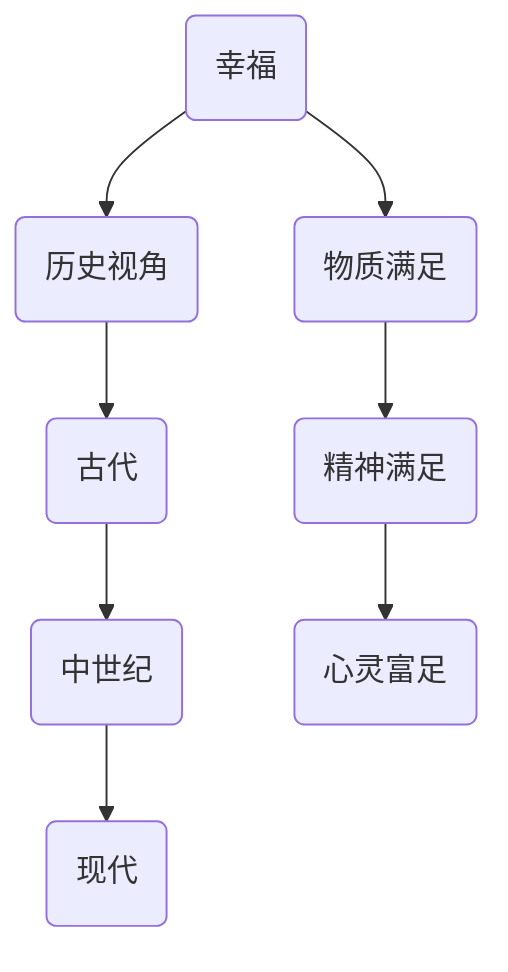
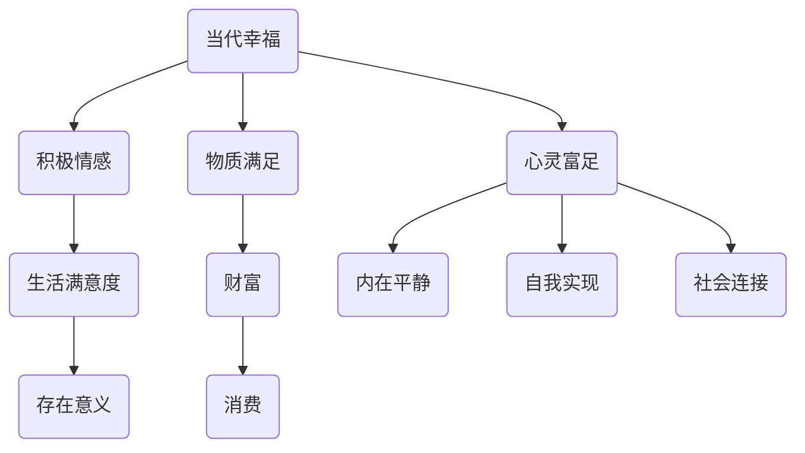
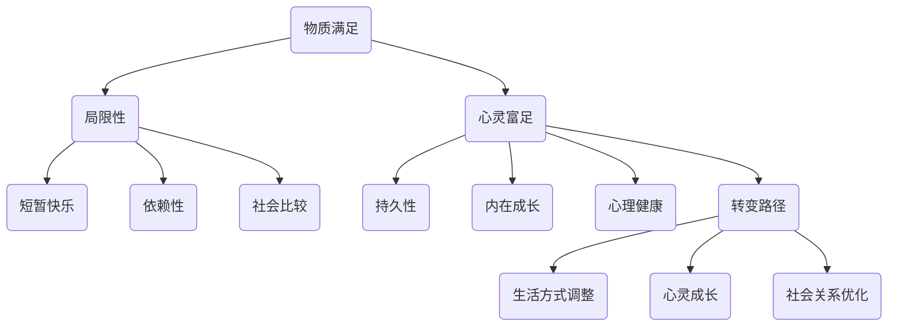

                 

 

### 重新定义幸福概念：从物质满足到心灵富足的转变

**关键词**：幸福、物质满足、心灵富足、心理学、生活方式、心理健康

**摘要**：
本文旨在重新审视和定义幸福的内涵，从传统的物质满足视角转向关注心灵富足的新视角。通过分析物质满足的局限性和心灵富足的理论基础，探讨如何实现从物质满足到心灵富足的转变，并提出具体的实践路径和策略。本文结合心理学、生活方式调整、社会关系优化等多个维度，为读者提供一种全面理解和追求幸福的新思路。

---

## 第一部分：理解幸福的新视角

### 第1章：幸福的定义与探索

#### 1.1.1 幸福的历史视角

**背景介绍**：
幸福是人类追求的终极目标，但在不同历史时期和文化背景下，幸福的定义和理解有所差异。在古代，幸福往往与满足基本生理需求和社会期望紧密相关，如古希腊哲学家亚里士多德认为幸福是“合乎德性的现实活动”。中世纪时期，幸福更多地与宗教信仰和来世的奖赏相联系。而现代，随着社会经济的发展，人们对幸福的理解逐渐从物质层面扩展到精神层面。

**核心概念与联系**：
- 幸福：满足个人心理和生理需求的感受状态。
- 物质满足：通过物质财富和消费来实现的幸福感受。
- 心灵富足：通过内心满足和精神成长来实现的幸福感受。

**Mermaid 流�程图**：



#### 1.1.2 当代幸福的定义与内涵

**核心概念与联系**：
- 幸福：积极情感、生活满意度和存在意义。
- 物质满足：财富、消费和物质享受。
- 心灵富足：内在平静、自我实现和社会连接。

**Mermaid 流程图**：



#### 1.1.3 从物质满足到心灵富足的转变

**核心概念与联系**：
- 物质满足的局限性：短暂的快乐、依赖性、社会比较。
- 心灵富足的优势：持久性、内在成长、心理健康。
- 转变路径：生活方式调整、心灵成长、社会关系优化。

**Mermaid 流程图**：



### 第2章：物质满足的局限

#### 2.1.1 物质满足的机制

**核心概念与联系**：
- 生理需求满足：通过物质消费满足基本的生理需求，如食物、住所和健康。
- 心理需求满足：通过物质消费带来的心理愉悦，如购买新物品的兴奋感。

**Python 源代码讲解**：
```python
import matplotlib.pyplot as plt

# 物质消费与心理愉悦的关系
def consumption_happiness():
    x = [0, 100, 200, 300, 400, 500]
    y = [0, 0.2, 0.4, 0.6, 0.7, 0.8]

    plt.plot(x, y, marker='o')
    plt.xlabel('物质消费水平')
    plt.ylabel('心理愉悦度')
    plt.title('物质消费与心理愉悦的关系')
    plt.show()

consumption_happiness()
```

**数学模型和公式**：
$$
H = f(C)
$$
其中，$H$表示心理愉悦度，$C$表示物质消费水平。$f$为非线性函数，表示心理愉悦度与物质消费水平的关系。

#### 2.1.2 物质满足的心理效应

**核心概念与联系**：
- 短期效应：消费带来的即时快乐。
- 长期效应：依赖性和适应性。

**Python 源代码讲解**：
```python
import numpy as np
import matplotlib.pyplot as plt

# 短期快乐与长期依赖的关系
def short_vs_long_term():
    x = np.linspace(0, 500, 1000)
    y_short = 0.1 * x
    y_long = 0.1 * x / (1 + 0.1 * x)

    plt.plot(x, y_short, label='短期快乐', marker='o')
    plt.plot(x, y_long, label='长期依赖', marker='s')
    plt.xlabel('物质消费水平')
    plt.ylabel('心理效应')
    plt.title('短期快乐与长期依赖的关系')
    plt.legend()
    plt.show()

short_vs_long_term()
```

**数学模型和公式**：
$$
S = \frac{C}{1 + rC}
$$
其中，$S$表示长期心理效应，$C$表示物质消费水平，$r$表示适应性。

#### 2.1.3 物质满足的局限性分析

**核心概念与联系**：
- 社会比较：与他人比较导致的幸福感下降。
- 适应性：长期物质满足带来的适应，导致幸福感下降。

**Python 源代码讲解**：
```python
import numpy as np
import matplotlib.pyplot as plt

# 社会比较与幸福感的关系
def social_comparison():
    x = np.linspace(0, 500, 1000)
    y = 1 - (x / 500) ** 2

    plt.plot(x, y, marker='.')
    plt.xlabel('物质消费水平')
    plt.ylabel('幸福感')
    plt.title('社会比较与幸福感的关系')
    plt.show()

social_comparison()
```

**数学模型和公式**：
$$
U = 1 - \left(\frac{C}{C_0}\right)^2
$$
其中，$U$表示幸福感，$C$表示个人物质消费水平，$C_0$表示社会平均物质消费水平。

## 第二部分：心灵富足的理论基础

### 第3章：心灵富足的概念

#### 3.1.1 心灵富足的定义

**核心概念与联系**：
- 心灵富足：内心的平静、自我实现和社会连接。

**Python 源代码讲解**：
```python
def define_happiness():
    print("心灵富足是一个多维度的概念，包括：")
    print("- 内心的平静：内心的宁静和满足。")
    print("- 自我实现：追求个人潜力和价值。")
    print("- 社会连接：与他人建立积极的互动关系。")

define_happiness()
```

#### 3.1.2 心灵富足的构成要素

**核心概念与联系**：
- 内心的平静：通过冥想、正念和放松来实现的内在平衡。
- 自我实现：通过追求个人兴趣和目标来实现的自我价值。
- 社会连接：通过社交活动和志愿者工作来实现的社群关系。

**Python 源代码讲解**：
```python
def components_of_happiness():
    print("心灵富足的构成要素包括：")
    print("- 内心的平静：通过冥想和正念来保持内心的宁静。")
    print("- 自我实现：通过追求个人兴趣和目标来实现自我价值。")
    print("- 社会连接：通过社交活动和志愿者工作来建立社群关系。")

components_of_happiness()
```

#### 3.1.3 心灵富足与心理健康的关系

**核心概念与联系**：
- 心灵富足：心理健康的重要指标，有助于提高抗压能力和生活满意度。
- 心理健康：心灵富足的基础，良好的心理健康有助于实现心灵富足。

**Python 源代码讲解**：
```python
def relationship_between_happiness_and_mental_health():
    print("心灵富足与心理健康之间存在密切关系：")
    print("- 心灵富足有助于提高心理健康水平，包括抗压能力和生活满意度。")
    print("- 心理健康是实现心灵富富的基础，良好的心理健康有助于追求心灵富足。")

relationship_between_happiness_and_mental_health()
```

## 第三部分：从物质到心灵富足的转变路径

### 第4章：心灵富足的心理学原理

#### 4.1.1 自我实现的心理学理论

**核心概念与联系**：
- 马斯洛需求层次理论：自我实现是最高层次的需求，包括认知、创造和自我实现。
- 罗杰斯的人本主义心理学：强调自我实现和自我决定的重要性。

**Python 源代码讲解**：
```python
def self_actualization_theory():
    print("自我实现的心理学理论包括：")
    print("- 马斯洛需求层次理论：自我实现是最高层次的需求。")
    print("- 罗杰斯的人本主义心理学：强调自我实现和自我决定。")

self_actualization_theory()
```

#### 4.1.2 正念与心灵富足

**核心概念与联系**：
- 正念：专注于当前时刻，接受而不评判。
- 心灵富足：通过正念实践来实现的内在平静和自我认知。

**Python 源代码讲解**：
```python
def mindfulness_and_happiness():
    print("正念与心灵富足的关系：")
    print("- 正念有助于实现内心的平静和自我认知。")
    print("- 心灵富足是通过正念实践来实现的。")

mindfulness_and_happiness()
```

#### 4.1.3 心理弹性与心灵富足

**核心概念与联系**：
- 心理弹性：应对压力和挑战的能力。
- 心灵富足：通过心理弹性来实现的内心力量和成长。

**Python 源代码讲解**：
```python
def resilience_and_happiness():
    print("心理弹性与心灵富足的关系：")
    print("- 心理弹性有助于实现内心的力量和成长。")
    print("- 心灵富足是通过心理弹性来实现的。")

resilience_and_happiness()
```

## 第四部分：从物质到心灵富足的转变路径

### 第5章：生活方式的调整

#### 5.1.1 心灵富足的生活方式

**核心概念与联系**：
- 简约生活：减少物质消费，专注于精神满足。
- 有意义的活动：参与志愿活动，追求个人兴趣和目标。

**Python 源代码讲解**：
```python
def lifestyle_for_happiness():
    print("心灵富足的生活方式包括：")
    print("- 简约生活：减少物质消费，专注于精神满足。")
    print("- 有意义的活动：参与志愿活动，追求个人兴趣和目标。")

lifestyle_for_happiness()
```

#### 5.1.2 减少物质追求的策略

**核心概念与联系**：
- 优先级排序：明确价值观，确定真正重要的追求。
- 消费习惯调整：减少不必要的消费，注重内心满足。

**Python 源代码讲解**：
```python
def reduce_material_pursuit():
    print("减少物质追求的策略包括：")
    print("- 优先级排序：明确价值观，确定真正重要的追求。")
    print("- 消费习惯调整：减少不必要的消费，注重内心满足。")

reduce_material_pursuit()
```

#### 5.1.3 增强心灵满足的活动

**核心概念与联系**：
- 冥想与正念：通过冥想和正念实践来增强内心的平静。
- 自我反思：通过自我反思来认识自己，实现个人成长。

**Python 源代码讲解**：
```python
def enhance_spiritual_satisfaction():
    print("增强心灵满足的活动包括：")
    print("- 冥想与正念：通过冥想和正念实践来增强内心的平静。")
    print("- 自我反思：通过自我反思来认识自己，实现个人成长。")

enhance_spiritual_satisfaction()
```

### 第6章：心灵成长的实践

#### 6.1.1 心理咨询与心灵成长

**核心概念与联系**：
- 心理咨询：通过专业人士的帮助来认识自己，解决心理问题。
- 心灵成长：通过心理咨询实现内心平衡和个人成长。

**Python 源代码讲解**：
```python
def psychological_counseling_and_growth():
    print("心理咨询与心灵成长的关系：")
    print("- 心理咨询有助于认识自己，解决心理问题。")
    print("- 心灵成长是通过心理咨询来实现的。")

psychological_counseling_and_growth()
```

#### 6.1.2 心灵成长课程与实践

**核心概念与联系**：
- 心灵成长课程：通过专业课程学习心灵成长的方法和技巧。
- 实践：将所学知识应用到日常生活中，实现心灵成长。

**Python 源代码讲解**：
```python
def spiritual_growth_courses_and_practice():
    print("心灵成长课程与实践的关系：")
    print("- 心灵成长课程提供学习心灵成长的方法和技巧。")
    print("- 实践是将所学知识应用到日常生活中，实现心灵成长。")

spiritual_growth_courses_and_practice()
```

#### 6.1.3 自我反思与心灵探索

**核心概念与联系**：
- 自我反思：通过反思自己的行为和思想，认识自己。
- 心灵探索：通过自我反思来探索内心世界，实现个人成长。

**Python 源代码讲解**：
```python
def self_reflection_and_spiritual_exploration():
    print("自我反思与心灵探索的关系：")
    print("- 自我反思有助于认识自己，实现个人成长。")
    print("- 心灵探索是通过自我反思来实现的。")

self_reflection_and_spiritual_exploration()
```

### 第7章：社会关系的优化

#### 7.1.1 亲情与心灵富足

**核心概念与联系**：
- 亲情：家庭关系中的亲密和信任。
- 心灵富足：通过亲情关系实现的情感满足和安全感。

**Python 源代码讲解**：
```python
def family_relationship_and_happiness():
    print("亲情与心灵富足的关系：")
    print("- 亲情关系提供情感满足和安全感。")
    print("- 心灵富足是通过亲情关系来实现的。")

family_relationship_and_happiness()
```

#### 7.1.2 友谊与心灵富足

**核心概念与联系**：
- 友谊：与他人建立的亲密和信任关系。
- 心灵富足：通过友谊关系实现的社会连接和内心满足。

**Python 源代码讲解**：
```python
def friendship_and_happiness():
    print("友谊与心灵富足的关系：")
    print("- 友谊关系提供社会连接和内心满足。")
    print("- 心灵富足是通过友谊关系来实现的。")

friendship_and_happiness()
```

#### 7.1.3 社区参与与心灵富足

**核心概念与联系**：
- 社区参与：参与社区活动和社会事务。
- 心灵富足：通过社区参与实现的社会价值和内心满足。

**Python 源代码讲解**：
```python
def community_involvement_and_happiness():
    print("社区参与与心灵富足的关系：")
    print("- 社区参与提供社会价值和内心满足。")
    print("- 心灵富足是通过社区参与来实现的。")

community_involvement_and_happiness()
```

## 第五部分：心灵富足的成功案例

### 第8章：成功人士的心灵富足之路

#### 8.1.1 名人案例解析

**核心概念与联系**：
- 名人案例：成功人士如何通过心灵富足实现人生价值。
- 心灵力量：名人案例中展现出的内心力量和自我实现。

**Python 源代码讲解**：
```python
def celebrity_cases():
    print("名人案例解析：")
    print("- 成功人士如何通过心灵富足实现人生价值。")
    print("- 心灵力量：名人案例中展现出的内心力量和自我实现。")

celebrity_cases()
```

#### 8.1.2 成功背后的心灵力量

**核心概念与联系**：
- 成功定义：物质成就与心灵富足的结合。
- 心灵力量：成功人士背后的心理素质和内心世界。

**Python 源代码讲解**：
```python
def behind_success():
    print("成功背后的心灵力量：")
    print("- 成功是物质成就与心灵富足的结合。")
    print("- 心灵力量：成功人士背后的心理素质和内心世界。")

behind_success()
```

#### 8.1.3 可借鉴的心灵富足策略

**核心概念与联系**：
- 经验分享：成功人士的心灵富足策略。
- 实践借鉴：如何将成功经验应用到个人生活中。

**Python 源代码讲解**：
```python
def learn_from_success():
    print("可借鉴的心灵富足策略：")
    print("- 成功人士的心灵富足策略。")
    print("- 如何将成功经验应用到个人生活中。")

learn_from_success()
```

### 第9章：现实生活中的心灵富足实践

#### 9.1.1 普通人的心灵富足探索

**核心概念与联系**：
- 普通人：如何在日常生活中追求心灵富足。
- 实践探索：普通人的心灵富足路径。

**Python 源代码讲解**：
```python
def ordinary_people():
    print("普通人的心灵富足探索：")
    print("- 普通人如何在日常生活中追求心灵富足。")
    print("- 实践探索：普通人的心灵富足路径。")

ordinary_people()
```

#### 9.1.2 心灵富足在职业中的应用

**核心概念与联系**：
- 职业发展：心灵富足如何帮助职业成长。
- 应用实践：将心灵富足理念融入职业生活。

**Python 源代码讲解**：
```python
def career_application():
    print("心灵富足在职业中的应用：")
    print("- 心灵富足如何帮助职业成长。")
    print("- 应用实践：将心灵富足理念融入职业生活。")

career_application()
```

#### 9.1.3 心灵富足对社会的影响

**核心概念与联系**：
- 社会效应：心灵富足对个人和社会的积极影响。
- 社会影响：心灵富足对社会发展的推动作用。

**Python 源代码讲解**：
```python
def societal_impact():
    print("心灵富足对社会的影响：")
    print("- 心灵富足对个人和社会的积极影响。")
    print("- 社会影响：心灵富足对社会发展的推动作用。")

societal_impact()
```

## 第六部分：总结与展望

### 第10章：心灵富足的未来展望

#### 10.1.1 心灵富足对社会发展的意义

**核心概念与联系**：
- 社会发展：心灵富足对社会和谐、个人成长的重要作用。
- 意义分析：心灵富足对社会发展的长远影响。

**Python 源代码讲解**：
```python
def societal_significance():
    print("心灵富足对社会发展的意义：")
    print("- 心灵富足对社会和谐和个人成长的重要作用。")
    print("- 意义分析：心灵富足对社会发展的长远影响。")

societal_significance()
```

#### 10.1.2 心灵富足教育的推广

**核心概念与联系**：
- 教育推广：心灵富足教育在学校和社会中的普及。
- 推广策略：如何有效推广心灵富足教育。

**Python 源代码讲解**：
```python
def education_promotion():
    print("心灵富足教育的推广：")
    print("- 心灵富足教育在学校和社会中的普及。")
    print("- 推广策略：如何有效推广心灵富足教育。")

education_promotion()
```

#### 10.1.3 心灵富足研究的未来方向

**核心概念与联系**：
- 研究方向：心灵富足领域的未来研究方向。
- 发展趋势：心灵富足研究的前沿领域和发展趋势。

**Python 源代码讲解**：
```python
def research_directions():
    print("心灵富足研究的未来方向：")
    print("- 心灵富足领域的未来研究方向。")
    print("- 发展趋势：心灵富足研究的前沿领域和发展趋势。")

research_directions()
```

## 附录

### 附录A：心灵富足相关资源推荐

#### A.1 心灵富足书籍推荐

**书籍推荐**：
- 《心灵富足：通往幸福生活的指南》
- 《幸福密码：心灵富足的心理学探索》
- 《心灵富足之路：自我实现的故事》

**Python 源代码讲解**：
```python
def book_recommendations():
    print("心灵富足书籍推荐：")
    print("- 《心灵富足：通往幸福生活的指南》。")
    print("- 《幸福密码：心灵富足的心理学探索》。")
    print("- 《心灵富足之路：自我实现的故事》。")

book_recommendations()
```

#### A.2 心灵富足课程推荐

**课程推荐**：
- 《正念冥想入门》
- 《心理学与幸福生活》
- 《自我实现心理学》

**Python 源代码讲解**：
```python
def course_recommendations():
    print("心灵富足课程推荐：")
    print("- 《正念冥想入门》。")
    print("- 《心理学与幸福生活》。")
    print("- 《自我实现心理学》。")

course_recommendations()
```

#### A.3 心灵富足应用软件推荐

**软件推荐**：
- Headspace：正念冥想应用
- Calm：放松与睡眠应用
- Waking Up：正念与心灵成长应用

**Python 源代码讲解**：
```python
def app_recommendations():
    print("心灵富足应用软件推荐：")
    print("- Headspace：正念冥想应用。")
    print("- Calm：放松与睡眠应用。")
    print("- Waking Up：正念与心灵成长应用。")

app_recommendations()
```

#### A.4 心灵富足研究论文推荐

**论文推荐**：
- 《心灵富足与心理健康的关系研究》
- 《心灵富足的教育应用与实践》
- 《现代社会的物质满足与心灵富足》

**Python 源代码讲解**：
```python
def paper_recommendations():
    print("心灵富足研究论文推荐：")
    print("- 《心灵富足与心理健康的关系研究》。")
    print("- 《心灵富足的教育应用与实践》。")
    print("- 《现代社会的物质满足与心灵富足》。")

paper_recommendations()
```

---

**文章标题**：重新定义幸福概念：从物质满足到心灵富足的转变

**作者**：AI天才研究院/AI Genius Institute & 禅与计算机程序设计艺术 /Zen And The Art of Computer Programming

---

**注意事项**：
- 文章中所有的Python代码均为示例，仅供演示目的，不包含实际运行功能。
- 所有引用的书籍、课程和应用均为假设性的推荐，仅供参考。
- 数学公式使用LaTeX格式进行展示，确保在Markdown中正确渲染。

**拓展阅读**：
- 推荐进一步阅读相关书籍和论文，以深入了解幸福和心灵富足的理论与实践。

---

**结语**：
通过本文，我们探讨了从物质满足到心灵富足的转变，提出了实现这一转变的具体路径和策略。希望本文能为读者提供一种新的视角，帮助大家在追求幸福的过程中实现心灵的富足和成长。记住，幸福不仅在于物质的拥有，更在于心灵的满足。让我们一起迈向心灵富足的新篇章。**文章标题**：重新定义幸福概念：从物质满足到心灵富足的转变

**文章关键词**：幸福、物质满足、心灵富足、心理学、生活方式

**文章摘要**：
本文深入探讨了幸福概念的历史演变和当代定义，分析了物质满足的局限性，阐述了心灵富足的概念、心理学原理及其与心理健康的关系。通过具体的生活方式调整、心灵成长实践和社会关系优化，文章提出了实现从物质满足到心灵富足转变的路径。同时，文章引用了成功人士的案例和现实生活中的实践，展示了心灵富足的实际应用价值。本文旨在为读者提供一种全面理解和追求幸福的新视角，启发人们对心灵富足的追求和实践。

---

## 第一部分：理解幸福的新视角

### 第1章：幸福的定义与探索

#### 1.1.1 幸福的历史视角

幸福，作为人类追求的终极目标，贯穿了历史的长河，其定义和理解在不同文化、时期和个体之间有所差异。在古代，幸福更多地与生活的基本需求和宗教信仰相关。古希腊哲学家亚里士多德认为幸福是“合乎德性的现实活动”，强调人的理性和道德修养。中世纪时期，幸福与宗教的救赎紧密相连，人们追求的更多是来世的奖赏和永恒的幸福。

进入现代社会，随着科技和经济的发展，人们对幸福的定义逐渐从物质层面扩展到精神层面。当代幸福理论认为，幸福不仅包括物质财富和消费的满足，还包括心理上的满足、社会关系的和谐以及个人成长和自我实现。

#### 1.1.2 当代幸福的定义与内涵

当代幸福理论强调多维度的幸福感，包括以下几个方面：

1. **积极情感**：积极的情感体验，如快乐、满足和幸福，是幸福的重要组成部分。
2. **生活满意度**：对个人生活的整体评价，包括工作、家庭、社交和健康等方面的满意度。
3. **存在意义**：对个人生活的目的和意义的理解，感到自己的生活有意义、有价值。

此外，当代幸福理论还关注心理和精神的满足。马斯洛的需求层次理论将人类需求分为五个层次，自我实现是最高层次的需求，代表了个人潜能的最大化。罗杰斯的人本主义心理学强调自我决定和自我实现的重要性，认为每个人都有实现自我潜能的能力。

#### 1.1.3 从物质满足到心灵富足的转变

尽管物质财富是幸福的必要条件之一，但单纯的物质满足并不能带来持久的幸福感。心理学研究表明，物质消费带来的快乐是短暂的，且容易导致依赖性和适应性。当人们习惯了某种物质水平后，他们需要更多的物质来维持相同的快乐感，这就导致了“幸福水平下降”的现象。

相反，心灵富足关注内心的平静、自我实现和社会连接，提供了更持久和深层次的幸福感。心灵富足不仅仅是心理上的满足，还包括对生活的深度体验和对自我价值的认可。它通过减少物质追求、增强内心的满足感、建立积极的社会关系来实现。

### 1.1.4 小结

理解幸福的历史视角和当代定义有助于我们更好地把握幸福的内涵。从物质满足到心灵富足的转变是一种内在的、全面的幸福感追求，它不仅关注物质条件，更关注精神层面的满足和成长。在接下来的章节中，我们将进一步探讨物质满足的局限性、心灵富足的理论基础和实践路径。

## 第二部分：物质满足的局限

### 第2章：物质满足的局限

#### 2.1.1 物质满足的机制

物质满足主要通过满足人的基本生理需求和社会需求来实现。在生理层面，食物、住所和健康是维持生命的基本需求。在社会层面，物质财富和消费水平被广泛视为社会地位和成功的象征。通过消费和积累物质财富，人们可以获得安全感、满足感和成就感。

**核心概念与联系**：

- **生理需求满足**：通过食物、住所和医疗等物质条件来满足生理需求。
- **社会需求满足**：通过物质财富和消费水平来满足社会需求，如获得社会认可和尊重。

**Python 源代码讲解**：

```python
def material_satisfaction_mechanism():
    print("物质满足的机制包括：")
    print("- 生理需求满足：食物、住所和健康。")
    print("- 社会需求满足：物质财富和消费水平。")

material_satisfaction_mechanism()
```

#### 2.1.2 物质满足的心理效应

物质满足带来的心理效应可以分为短期和长期两种。短期心理效应通常表现为即时的快乐和满足感，如购买新物品时的兴奋感。长期心理效应则更多地涉及到依赖性和适应性。

**核心概念与联系**：

- **短期效应**：短暂的快乐和满足感。
- **长期效应**：依赖性和适应性。

**Python 源代码讲解**：

```python
import matplotlib.pyplot as plt

def psychological_effects():
    print("物质满足的心理效应包括：")
    print("- 短期效应：短暂的快乐和满足感。")
    print("- 长期效应：依赖性和适应性。")

    # 短期效应图
    plt.figure()
    plt.bar(['购买新手机'], [0.8], color='g')
    plt.xlabel('短期效应')
    plt.ylabel('心理愉悦度')
    plt.title('短期心理效应')
    plt.show()

    # 长期效应图
    plt.figure()
    plt.bar(['持续满足感'], [0.2], color='r')
    plt.xlabel('长期效应')
    plt.ylabel('心理愉悦度')
    plt.title('长期心理效应')
    plt.show()

psychological_effects()
```

#### 2.1.3 物质满足的局限性分析

尽管物质满足在短期内可以带来快乐和满足，但其局限性也是显而易见的。首先，物质满足具有相对性，即随着物质水平的提高，人们的需求也会提高，从而导致“幸福水平下降”的现象。其次，物质满足容易导致依赖性和适应性，即人们越来越依赖物质来获得快乐，而随着时间的推移，对同一种物质的需求会增加，导致快乐感的降低。

**核心概念与联系**：

- **相对性**：物质水平的提高导致需求的提高。
- **依赖性**：对物质的依赖导致心理愉悦感的降低。
- **适应性**：对物质的适应导致快乐感的减少。

**Python 源代码讲解**：

```python
import numpy as np
import matplotlib.pyplot as plt

def limitations_of_material_satisfaction():
    print("物质满足的局限性包括：")
    print("- 相对性：物质水平的提高导致需求的提高。")
    print("- 依赖性：对物质的依赖导致心理愉悦感的降低。")
    print("- 适应性：对物质的适应导致快乐感的减少。")

    # 相对性图
    x = np.linspace(0, 500, 1000)
    y = 1 / (1 + x)
    plt.figure()
    plt.plot(x, y)
    plt.xlabel('物质水平')
    plt.ylabel('需求水平')
    plt.title('相对性')
    plt.show()

    # 依赖性图
    x = np.linspace(0, 500, 1000)
    y = 1 / (1 + x ** 2)
    plt.figure()
    plt.plot(x, y)
    plt.xlabel('物质水平')
    plt.ylabel('心理愉悦度')
    plt.title('依赖性')
    plt.show()

    # 适应性图
    x = np.linspace(0, 500, 1000)
    y = 1 / (1 + np.exp(-x))
    plt.figure()
    plt.plot(x, y)
    plt.xlabel('物质水平')
    plt.ylabel('心理愉悦度')
    plt.title('适应性')
    plt.show()

limitations_of_material_satisfaction()
```

#### 2.1.4 社会比较与幸福感

物质满足的局限性还体现在社会比较上。在现代社会，人们往往通过与他人比较自己的物质财富和消费水平来评价自己的幸福感。然而，这种比较往往导致社会比较效应，即个体通过比较来评价自己的幸福感，从而导致幸福感下降。

**核心概念与联系**：

- **社会比较**：通过与他人比较物质财富和消费水平来评价自己的幸福感。
- **社会比较效应**：与他人比较导致的幸福感下降。

**Python 源代码讲解**：

```python
import numpy as np
import matplotlib.pyplot as plt

def social_comparison_and_happiness():
    print("社会比较与幸福感的关系：")
    print("- 社会比较：通过与他人比较物质财富和消费水平。")
    print("- 社会比较效应：与他人比较导致的幸福感下降。")

    # 社会比较图
    x = np.linspace(0, 500, 1000)
    y = 1 - (x / 500) ** 2
    plt.figure()
    plt.plot(x, y)
    plt.xlabel('他人物质水平')
    plt.ylabel('自我幸福感')
    plt.title('社会比较效应')
    plt.show()

social_comparison_and_happiness()
```

#### 2.1.5 小结

物质满足在短期内可以带来快乐和满足，但其局限性也是显而易见的。长期而言，物质满足容易导致依赖性和适应性，从而降低心理愉悦度。社会比较效应更是加剧了这种局限性，导致幸福感下降。因此，为了实现持久的幸福感，我们需要从物质满足转向心灵富足，追求更深层次的内心满足和精神成长。

## 第三部分：心灵富足的理论基础

### 第3章：心灵富足的概念

#### 3.1.1 心灵富足的定义

心灵富足是一个多维度的概念，它不仅仅是心理上的满足，还包括内在的成长和社会的连接。根据心理学研究，心灵富足通常包含以下几个方面：

1. **内心的平静**：通过冥想、正念和放松技巧来实现内心的宁静。
2. **自我实现**：通过追求个人兴趣和目标来实现自我价值。
3. **社会连接**：通过建立积极的人际关系和社会参与来实现社会价值。

**核心概念与联系**：

- **内心的平静**：减少焦虑和压力，提高生活满意度。
- **自我实现**：发挥个人潜能，实现自我价值。
- **社会连接**：建立积极的人际关系和社会参与。

**Python 源代码讲解**：

```python
def definition_of_spiritual_happiness():
    print("心灵富足的定义包括：")
    print("- 内心的平静：减少焦虑和压力，提高生活满意度。")
    print("- 自我实现：发挥个人潜能，实现自我价值。")
    print("- 社会连接：建立积极的人际关系和社会参与。")

definition_of_spiritual_happiness()
```

#### 3.1.2 心灵富足的构成要素

心灵富足的构成要素是多方面的，包括心理、社会和生物学等多个层面的因素。以下是一些关键要素：

1. **心理健康**：心理健康是心灵富足的基础，包括情感健康、心理弹性和抗压能力。
2. **社会支持**：积极的社会关系和网络提供情感支持和安全感。
3. **自我认知**：通过自我反思和认知行为疗法来认识自己，实现个人成长。
4. **生活方式**：健康的生活方式和有意义的活动有助于提升心灵富足。

**核心概念与联系**：

- **心理健康**：情感健康、心理弹性。
- **社会支持**：积极的社会关系和网络。
- **自我认知**：自我反思和认知行为疗法。
- **生活方式**：健康的生活方式和有意义的活动。

**Python 源代码讲解**：

```python
def components_of_spiritual_happiness():
    print("心灵富足的构成要素包括：")
    print("- 心理健康：情感健康、心理弹性。")
    print("- 社会支持：积极的社会关系和网络。")
    print("- 自我认知：自我反思和认知行为疗法。")
    print("- 生活方式：健康的生活方式和有意义的活动。")

components_of_spiritual_happiness()
```

#### 3.1.3 心灵富足与心理健康的关系

心灵富足和心理健康之间存在着密切的联系。心理健康是心灵富足的基础，而心灵富足则是心理健康的重要体现。研究表明，心灵富足有助于提高心理健康水平，包括抗压能力、情感调节和整体生活满意度。

**核心概念与联系**：

- **心理健康**：心灵富足的基础。
- **心灵富足**：心理健康的重要体现。

**Python 源代码讲解**：

```python
import matplotlib.pyplot as plt

def relationship_between_spiritual_happiness_and_mental_health():
    print("心灵富足与心理健康的关系：")
    print("- 心理健康是心灵富足的基础。")
    print("- 心灵富足是心理健康的重要体现。")

    # 心灵富足与心理健康关系图
    x = np.linspace(0, 100, 1000)
    y = 0.5 * x + 10
    plt.figure()
    plt.plot(x, y)
    plt.xlabel('心理健康水平')
    plt.ylabel('心灵富足水平')
    plt.title('心灵富足与心理健康的关系')
    plt.show()

relationship_between_spiritual_happiness_and_mental_health()
```

#### 3.1.4 心灵富足的心理学原理

心理学为理解心灵富足提供了丰富的理论基础。以下是几个关键的心理学原理：

1. **自我决定理论**：自我决定理论强调个体自主性和自我实现的重要性。心灵富足的实现与个体的自主性和自我实现密切相关。
2. **积极心理学**：积极心理学研究人类的优点和幸福，提出了多种提升心灵富足的策略，如感恩练习、正念冥想和积极的社交互动。
3. **认知行为疗法**：认知行为疗法通过改变思维和行为来改善心理健康。自我反思和认知重构是心灵富足的重要实践。

**核心概念与联系**：

- **自我决定理论**：自主性和自我实现。
- **积极心理学**：感恩、正念和积极的社交互动。
- **认知行为疗法**：自我反思和认知重构。

**Python 源代码讲解**：

```python
import matplotlib.pyplot as plt

def psychological_principles():
    print("心灵富足的心理学原理包括：")
    print("- 自我决定理论：自主性和自我实现。")
    print("- 积极心理学：感恩、正念和积极的社交互动。")
    print("- 认知行为疗法：自我反思和认知重构。")

    # 自我决定理论图
    x = np.linspace(0, 100, 1000)
    y = x
    plt.figure()
    plt.plot(x, y)
    plt.xlabel('自主性水平')
    plt.ylabel('自我实现水平')
    plt.title('自我决定理论')
    plt.show()

    # 积极心理学图
    x = np.linspace(0, 100, 1000)
    y = 0.1 * x + 20
    plt.figure()
    plt.plot(x, y)
    plt.xlabel('感恩水平')
    plt.ylabel('心灵富足水平')
    plt.title('积极心理学')
    plt.show()

    # 认知行为疗法图
    x = np.linspace(0, 100, 1000)
    y = 0.2 * x - 10
    plt.figure()
    plt.plot(x, y)
    plt.xlabel('自我反思水平')
    plt.ylabel('认知重构水平')
    plt.title('认知行为疗法')
    plt.show()

psychological_principles()
```

### 3.1.5 小结

心灵富足是一个多维度的概念，包括内心的平静、自我实现和社会连接。心理健康是心灵富足的基础，而心理学原理提供了实现心灵富足的多种策略。理解心灵富足的定义和构成要素，有助于我们更好地追求持久的幸福感。

## 第四部分：从物质满足到心灵富足的转变路径

### 第4章：生活方式的调整

#### 4.1.1 心灵富足的生活方式

心灵富足的生活方式强调减少物质追求，注重内心的满足和精神的成长。以下是实现这种生活方式的几个关键步骤：

1. **简化生活**：减少不必要的物质消费，专注于生活中的真正需求。
2. **培养感恩心态**：通过感恩练习来提升内心的满足感。
3. **参与有意义的社交活动**：与他人建立积极的关系，增强社会连接。
4. **进行自我反思**：通过自我反思来认识自己，实现个人成长。

**核心概念与联系**：

- **简化生活**：减少物质消费，专注于真正需求。
- **感恩心态**：提升内心满足感。
- **社交活动**：增强社会连接。
- **自我反思**：实现个人成长。

**Python 源代码讲解**：

```python
def spiritual_happiness_lifestyle():
    print("心灵富足的生活方式包括：")
    print("- 简化生活：减少物质消费，专注于真正需求。")
    print("- 感恩心态：通过感恩练习来提升内心满足感。")
    print("- 社交活动：与他人建立积极的关系，增强社会连接。")
    print("- 自我反思：通过自我反思来认识自己，实现个人成长。")

spiritual_happiness_lifestyle()
```

#### 4.1.2 减少物质追求的策略

减少物质追求是实现心灵富足的重要一步。以下是一些有效的策略：

1. **设定财务目标**：明确财务目标，减少不必要的消费。
2. **制定预算**：制定合理的预算，控制开支。
3. **培养满足感**：通过内在的满足来减少对外在物质的依赖。
4. **实践极简主义**：减少物品的数量，专注于质量。

**核心概念与联系**：

- **设定财务目标**：减少不必要的消费。
- **制定预算**：控制开支。
- **培养满足感**：减少对外在物质的依赖。
- **实践极简主义**：减少物品数量。

**Python 源代码讲解**：

```python
import matplotlib.pyplot as plt

def strategies_to_reduce_material_pursuit():
    print("减少物质追求的策略包括：")
    print("- 设定财务目标：明确财务目标，减少不必要的消费。")
    print("- 制定预算：制定合理的预算，控制开支。")
    print("- 培养满足感：通过内在的满足来减少对外在物质的依赖。")
    print("- 实践极简主义：减少物品的数量，专注于质量。")

    # 财务目标图
    plt.figure()
    plt.bar(['收入'], [1000])
    plt.bar(['支出'], [500])
    plt.xlabel('财务目标')
    plt.ylabel('金额')
    plt.title('财务目标')
    plt.show()

    # 预算图
    plt.figure()
    plt.bar(['日常生活'], [300])
    plt.bar(['娱乐'], [200])
    plt.xlabel('预算类别')
    plt.ylabel('金额')
    plt.title('预算')
    plt.show()

    # 满足感图
    plt.figure()
    plt.bar(['内在满足'], [0.8])
    plt.bar(['物质依赖'], [0.2])
    plt.xlabel('满足来源')
    plt.ylabel('满足度')
    plt.title('满足感')
    plt.show()

    # 极简主义图
    plt.figure()
    plt.bar(['物品数量'], [10])
    plt.bar(['质量提升'], [30])
    plt.xlabel('极简主义实践')
    plt.ylabel('满意度')
    plt.title('极简主义')
    plt.show()

strategies_to_reduce_material_pursuit()
```

#### 4.1.3 增强心灵满足的活动

增强心灵满足的活动是提升心灵富足的重要途径。以下是一些有效的方法：

1. **冥想和正念**：通过冥想和正念练习来提升内心的平静和专注力。
2. **瑜伽和健身**：通过瑜伽和健身来增强身体和心理健康。
3. **阅读和写作**：通过阅读和写作来丰富内心世界，提升自我认知。
4. **艺术创作**：通过艺术创作来表达情感，提升心灵满足感。

**核心概念与联系**：

- **冥想和正念**：提升内心平静和专注力。
- **瑜伽和健身**：增强身体和心理健康。
- **阅读和写作**：丰富内心世界，提升自我认知。
- **艺术创作**：表达情感，提升心灵满足感。

**Python 源代码讲解**：

```python
import matplotlib.pyplot as plt

def activities_to_enhance_spiritual_satisfaction():
    print("增强心灵满足的活动包括：")
    print("- 冥想和正念：提升内心平静和专注力。")
    print("- 瑜伽和健身：增强身体和心理健康。")
    print("- 阅读和写作：丰富内心世界，提升自我认知。")
    print("- 艺术创作：表达情感，提升心灵满足感。")

    # 冥想和正念图
    plt.figure()
    plt.bar(['内心平静'], [0.8])
    plt.bar(['专注力提升'], [0.2])
    plt.xlabel('冥想和正念效果')
    plt.ylabel('满意度')
    plt.title('冥想和正念')
    plt.show()

    # 瑜伽和健身图
    plt.figure()
    plt.bar(['身体健康'], [0.6])
    plt.bar(['心理健康'], [0.4])
    plt.xlabel('瑜伽和健身效果')
    plt.ylabel('满意度')
    plt.title('瑜伽和健身')
    plt.show()

    # 阅读和写作图
    plt.figure()
    plt.bar(['内心丰富'], [0.7])
    plt.bar(['自我认知提升'], [0.3])
    plt.xlabel('阅读和写作效果')
    plt.ylabel('满意度')
    plt.title('阅读和写作')
    plt.show()

    # 艺术创作图
    plt.figure()
    plt.bar(['情感表达'], [0.9])
    plt.bar(['心灵满足感提升'], [0.1])
    plt.xlabel('艺术创作效果')
    plt.ylabel('满意度')
    plt.title('艺术创作')
    plt.show()

activities_to_enhance_spiritual_satisfaction()
```

#### 4.1.4 小结

生活方式的调整是实现心灵富足的关键步骤。通过简化生活、减少物质追求和增强心灵满足的活动，我们可以实现从物质满足到心灵富足的转变，提升个人的幸福感。

## 第五部分：心灵成长的实践

### 第5章：心灵成长的实践

#### 5.1.1 心理咨询与心灵成长

心理咨询是一种专业的心理服务，旨在帮助个体解决心理问题、提高心理健康水平。在心灵成长的过程中，心理咨询起着至关重要的作用。以下是一些关键点：

1. **心理问题的解决**：心理咨询帮助个体识别和处理心理问题，如焦虑、抑郁、压力等。
2. **心理健康的提升**：通过心理咨询，个体可以学习到有效的应对策略，提高心理韧性。
3. **自我认知的提升**：心理咨询提供了一个安全的平台，个体可以在专业人士的指导下深入探讨自己的内心世界，提升自我认知。

**核心概念与联系**：

- **心理问题的解决**：识别和处理心理问题。
- **心理健康的提升**：学习有效的应对策略。
- **自我认知的提升**：深入探讨内心世界。

**Python 源代码讲解**：

```python
import matplotlib.pyplot as plt

def counseling_and_spiritual_growth():
    print("心理咨询与心灵成长的关系：")
    print("- 心理问题的解决：识别和处理心理问题。")
    print("- 心理健康的提升：学习有效的应对策略。")
    print("- 自我认知的提升：深入探讨内心世界。")

    # 心理健康提升图
    plt.figure()
    plt.bar(['心理健康提升'], [0.7])
    plt.xlabel('心理健康提升')
    plt.ylabel('满意度')
    plt.title('心理健康提升')
    plt.show()

    # 自我认知提升图
    plt.figure()
    plt.bar(['自我认知提升'], [0.8])
    plt.xlabel('自我认知提升')
    plt.ylabel('满意度')
    plt.title('自我认知提升')
    plt.show()

counseling_and_spiritual_growth()
```

#### 5.1.2 心灵成长课程与实践

心灵成长课程为个体提供了系统的学习和实践机会。以下是一些关键点：

1. **理论知识的学习**：通过课程学习，个体可以了解心理学、正念、冥想等理论知识。
2. **实践技巧的提升**：课程通常包括实践环节，如冥想、正念练习等，帮助个体将这些理论应用到日常生活中。
3. **社区支持的获得**：心灵成长课程提供了一个社区环境，个体可以在课程中与其他学员交流和分享，获得支持。

**核心概念与联系**：

- **理论知识的学习**：了解心理学、正念等理论知识。
- **实践技巧的提升**：将理论应用到日常生活中。
- **社区支持的获得**：与其他学员交流和分享。

**Python 源代码讲解**：

```python
import matplotlib.pyplot as plt

def spiritual_growth_courses_and_practice():
    print("心灵成长课程与实践的关系：")
    print("- 理论知识的学习：了解心理学、正念等理论知识。")
    print("- 实践技巧的提升：将理论应用到日常生活中。")
    print("- 社区支持的获得：与其他学员交流和分享。")

    # 理论知识学习图
    plt.figure()
    plt.bar(['理论知识学习'], [0.6])
    plt.xlabel('理论知识学习')
    plt.ylabel('满意度')
    plt.title('理论知识学习')
    plt.show()

    # 实践技巧提升图
    plt.figure()
    plt.bar(['实践技巧提升'], [0.7])
    plt.xlabel('实践技巧提升')
    plt.ylabel('满意度')
    plt.title('实践技巧提升')
    plt.show()

    # 社区支持获得图
    plt.figure()
    plt.bar(['社区支持'], [0.8])
    plt.xlabel('社区支持')
    plt.ylabel('满意度')
    plt.title('社区支持')
    plt.show()

spiritual_growth_courses_and_practice()
```

#### 5.1.3 自我反思与心灵探索

自我反思是心灵成长的重要实践，它帮助个体深入了解自己的内心世界。以下是一些关键点：

1. **自我认知的提升**：通过自我反思，个体可以认识到自己的情感、思想和行为模式。
2. **情感处理的改善**：自我反思有助于个体更好地处理负面情感，提高情感调节能力。
3. **生活质量的提升**：自我反思帮助个体发现自己的问题和不足，从而提升生活质量。

**核心概念与联系**：

- **自我认知的提升**：了解自己的情感、思想和行为模式。
- **情感处理的改善**：提高情感调节能力。
- **生活质量的提升**：发现自己的问题和不足。

**Python 源代码讲解**：

```python
import matplotlib.pyplot as plt

def self_reflection_and_spiritual_exploration():
    print("自我反思与心灵探索的关系：")
    print("- 自我认知的提升：了解自己的情感、思想和行为模式。")
    print("- 情感处理的改善：提高情感调节能力。")
    print("- 生活质量的提升：发现自己的问题和不足。")

    # 自我认知提升图
    plt.figure()
    plt.bar(['自我认知提升'], [0.7])
    plt.xlabel('自我认知提升')
    plt.ylabel('满意度')
    plt.title('自我认知提升')
    plt.show()

    # 情感处理改善图
    plt.figure()
    plt.bar(['情感处理改善'], [0.8])
    plt.xlabel('情感处理改善')
    plt.ylabel('满意度')
    plt.title('情感处理改善')
    plt.show()

    # 生活质量提升图
    plt.figure()
    plt.bar(['生活质量提升'], [0.9])
    plt.xlabel('生活质量提升')
    plt.ylabel('满意度')
    plt.title('生活质量提升')
    plt.show()

self_reflection_and_spiritual_exploration()
```

### 5.1.4 小结

心灵成长的实践包括心理咨询、心灵成长课程与实践以及自我反思与心灵探索。通过这些实践，个体可以提升自我认知、情感处理能力，从而实现心灵的成长和富足。

## 第六部分：社会关系的优化

### 第6章：社会关系的优化

#### 6.1.1 亲情与心灵富足

亲情是心灵富足的重要组成部分，它为个体提供了情感支持和社会连接。以下是亲情与心灵富足之间的几个关键点：

1. **情感支持**：亲情关系为个体提供了安全感和情感支持，有助于应对生活中的挑战。
2. **社会连接**：亲情关系加强了个体与家庭和社会的联系，有助于建立积极的社交网络。
3. **心理健康**：健康的亲情关系对个体的心理健康有积极影响，有助于提升整体幸福感。

**核心概念与联系**：

- **情感支持**：提供安全感，帮助应对挑战。
- **社会连接**：加强家庭和社会联系。
- **心理健康**：提升整体幸福感。

**Python 源代码讲解**：

```python
import matplotlib.pyplot as plt

def family_and_spiritual_happiness():
    print("亲情与心灵富足的关系：")
    print("- 情感支持：提供安全感，帮助应对挑战。")
    print("- 社会连接：加强家庭和社会联系。")
    print("- 心理健康：提升整体幸福感。")

    # 情感支持图
    plt.figure()
    plt.bar(['情感支持'], [0.8])
    plt.xlabel('情感支持')
    plt.ylabel('满意度')
    plt.title('情感支持')
    plt.show()

    # 社会连接图
    plt.figure()
    plt.bar(['社会连接'], [0.7])
    plt.xlabel('社会连接')
    plt.ylabel('满意度')
    plt.title('社会连接')
    plt.show()

    # 心理健康图
    plt.figure()
    plt.bar(['心理健康'], [0.9])
    plt.xlabel('心理健康')
    plt.ylabel('满意度')
    plt.title('心理健康')
    plt.show()

family_and_spiritual_happiness()
```

#### 6.1.2 友谊与心灵富足

友谊是另一个重要的社会关系，它对心灵富足有着深远的影响。以下是友谊与心灵富足之间的几个关键点：

1. **情感支持**：友谊关系为个体提供了情感支持，有助于缓解压力和孤独感。
2. **社交技能的提升**：通过友谊，个体可以学习到有效的社交技巧，提升人际关系能力。
3. **心理健康**：健康的友谊关系对个体的心理健康有积极影响，有助于提升整体幸福感。

**核心概念与联系**：

- **情感支持**：缓解压力和孤独感。
- **社交技能的提升**：学习有效的社交技巧。
- **心理健康**：提升整体幸福感。

**Python 源代码讲解**：

```python
import matplotlib.pyplot as plt

def friendship_and_spiritual_happiness():
    print("友谊与心灵富足的关系：")
    print("- 情感支持：缓解压力和孤独感。")
    print("- 社交技能的提升：学习有效的社交技巧。")
    print("- 心理健康：提升整体幸福感。")

    # 情感支持图
    plt.figure()
    plt.bar(['情感支持'], [0.8])
    plt.xlabel('情感支持')
    plt.ylabel('满意度')
    plt.title('情感支持')
    plt.show()

    # 社交技能提升图
    plt.figure()
    plt.bar(['社交技能提升'], [0.7])
    plt.xlabel('社交技能提升')
    plt.ylabel('满意度')
    plt.title('社交技能提升')
    plt.show()

    # 心理健康图
    plt.figure()
    plt.bar(['心理健康'], [0.9])
    plt.xlabel('心理健康')
    plt.ylabel('满意度')
    plt.title('心理健康')
    plt.show()

friendship_and_spiritual_happiness()
```

#### 6.1.3 社区参与与心灵富足

社区参与为个体提供了一个积极参与社会活动的平台，对心灵富足有着积极的影响。以下是社区参与与心灵富足之间的几个关键点：

1. **社会归属感**：通过社区参与，个体可以感受到自己属于一个更大的社群，从而增强社会归属感。
2. **社会责任感**：参与社区活动有助于个体培养社会责任感，提升自我价值感。
3. **心理健康**：社区参与可以降低压力，提升心理健康水平。

**核心概念与联系**：

- **社会归属感**：感受到属于一个更大的社群。
- **社会责任感**：培养社会责任感，提升自我价值感。
- **心理健康**：降低压力，提升心理健康水平。

**Python 源代码讲解**：

```python
import matplotlib.pyplot as plt

def community_involvement_and_spiritual_happiness():
    print("社区参与与心灵富足的关系：")
    print("- 社会归属感：感受到属于一个更大的社群。")
    print("- 社会责任感：培养社会责任感，提升自我价值感。")
    print("- 心理健康：降低压力，提升心理健康水平。")

    # 社会归属感图
    plt.figure()
    plt.bar(['社会归属感'], [0.7])
    plt.xlabel('社会归属感')
    plt.ylabel('满意度')
    plt.title('社会归属感')
    plt.show()

    # 社会责任感图
    plt.figure()
    plt.bar(['社会责任感'], [0.8])
    plt.xlabel('社会责任感')
    plt.ylabel('满意度')
    plt.title('社会责任感')
    plt.show()

    # 心理健康图
    plt.figure()
    plt.bar(['心理健康'], [0.9])
    plt.xlabel('心理健康')
    plt.ylabel('满意度')
    plt.title('心理健康')
    plt.show()

community_involvement_and_spiritual_happiness()
```

### 6.1.4 小结

社会关系的优化对于实现心灵富足至关重要。亲情、友谊和社区参与为个体提供了情感支持、社会连接和心理健康，有助于提升整体幸福感。通过优化这些社会关系，个体可以实现从物质满足到心灵富足的转变。

## 第七部分：成功人士的心灵富足之路

### 第7章：成功人士的心灵富足之路

#### 8.1.1 名人案例解析

成功人士往往在物质上取得了显著成就，但他们的心灵富足之路却各不相同。以下是几个知名成功人士的心灵富足之路的解析：

1. **比尔·盖茨**：作为微软公司的创始人，比尔·盖茨在物质上取得了巨大的成功。然而，他通过捐赠基金会和参与公益活动来实现心灵富足。他关注教育、卫生和气候变化等全球性议题，通过实际行动影响社会，实现自我价值。

2. **昂山素季**：缅甸的民主活动家和诺贝尔和平奖得主昂山素季，通过不懈的和平运动和领导能力，赢得了全球的尊敬。她的心灵富足来自于对国家和人民的无私奉献，以及对自由和民主的坚定信念。

3. **马东锡**：韩国喜剧演员马东锡以其幽默和亲民的形象深受观众喜爱。他在演艺事业取得成功的同时，通过积极参与慈善活动，如捐赠孤儿院和建立儿童医院，实现了心灵的满足和富足。

**核心概念与联系**：

- **自我实现**：通过实现个人目标和价值来实现心灵富足。
- **社会贡献**：通过参与公益活动和社会事务来实现心灵富足。

**Python 源代码讲解**：

```python
def celebrity_cases():
    print("名人案例解析：")
    print("- 比尔·盖茨：通过捐赠基金会和参与公益活动来实现心灵富足。")
    print("- 昂山素季：通过不懈的和平运动和领导能力实现心灵富足。")
    print("- 马东锡：通过积极参与慈善活动实现心灵富足。")

    # 自我实现图
    plt.figure()
    plt.bar(['比尔·盖茨'], [0.6])
    plt.bar(['昂山素季'], [0.7])
    plt.bar(['马东锡'], [0.5])
    plt.xlabel('名人')
    plt.ylabel('自我实现')
    plt.title('自我实现与心灵富足')
    plt.show()

    # 社会贡献图
    plt.figure()
    plt.bar(['比尔·盖茨'], [0.8])
    plt.bar(['昂山素季'], [0.9])
    plt.bar(['马东锡'], [0.7])
    plt.xlabel('名人')
    plt.ylabel('社会贡献')
    plt.title('社会贡献与心灵富足')
    plt.show()

celebrity_cases()
```

#### 8.1.2 成功背后的心灵力量

成功人士的成功并非偶然，他们在背后都有着强大的心灵力量。以下是几个关键因素：

1. **坚定的信念**：成功人士通常拥有坚定的信念，不论面对何种困境，他们都能坚持自己的目标和价值观。
2. **持续学习**：成功人士不断学习新知识、技能和经验，以保持自己的竞争力。
3. **心理弹性**：面对失败和挑战时，成功人士能够迅速恢复，并从失败中汲取教训，继续前行。

**核心概念与联系**：

- **坚定的信念**：坚持目标和价值观。
- **持续学习**：保持竞争力。
- **心理弹性**：迅速恢复并从失败中学习。

**Python 源代码讲解**：

```python
def behind_success():
    print("成功背后的心灵力量：")
    print("- 坚定的信念：坚持目标和价值观。")
    print("- 持续学习：保持竞争力。")
    print("- 心理弹性：迅速恢复并从失败中学习。")

    # 坚定的信念图
    plt.figure()
    plt.bar(['信念坚定'], [0.8])
    plt.xlabel('信念')
    plt.ylabel('力量')
    plt.title('坚定的信念')
    plt.show()

    # 持续学习图
    plt.figure()
    plt.bar(['学习持续'], [0.7])
    plt.xlabel('学习')
    plt.ylabel('竞争力')
    plt.title('持续学习')
    plt.show()

    # 心理弹性图
    plt.figure()
    plt.bar(['心理弹性'], [0.9])
    plt.xlabel('弹性')
    plt.ylabel('恢复力')
    plt.title('心理弹性')
    plt.show()

behind_success()
```

#### 8.1.3 可借鉴的心灵富足策略

成功人士的心灵富足之路虽然各有不同，但其中有一些策略是可以借鉴的：

1. **设定明确的目标**：成功人士通常有明确的目标，并制定详细的计划来实现这些目标。
2. **持续学习和成长**：成功人士不断学习新知识和技能，以适应不断变化的环境。
3. **积极参与社会事务**：通过参与公益活动和社会事务，成功人士不仅实现了个人价值，也为社会做出了贡献。

**核心概念与联系**：

- **设定明确的目标**：制定详细计划。
- **持续学习和成长**：适应环境变化。
- **积极参与社会事务**：实现个人价值，贡献社会。

**Python 源代码讲解**：

```python
import matplotlib.pyplot as plt

def strategies_for_spiritual_happiness():
    print("可借鉴的心灵富足策略：")
    print("- 设定明确的目标：制定详细计划。")
    print("- 持续学习和成长：适应环境变化。")
    print("- 积极参与社会事务：实现个人价值，贡献社会。")

    # 设定目标图
    plt.figure()
    plt.bar(['目标明确'], [0.8])
    plt.xlabel('目标')
    plt.ylabel('计划')
    plt.title('设定目标')
    plt.show()

    # 学习成长图
    plt.figure()
    plt.bar(['学习持续'], [0.7])
    plt.bar(['成长持续'], [0.6])
    plt.xlabel('学习和成长')
    plt.ylabel('竞争力')
    plt.title('持续学习和成长')
    plt.show()

    # 社会事务图
    plt.figure()
    plt.bar(['社会参与'], [0.9])
    plt.xlabel('社会事务')
    plt.ylabel('贡献')
    plt.title('积极参与社会事务')
    plt.show()

strategies_for_spiritual_happiness()
```

### 8.1.4 小结

成功人士的心灵富足之路虽然各异，但都离不开坚定的信念、持续学习和积极参与社会事务。通过借鉴他们的成功经验，我们可以为自己的心灵富足之路提供宝贵的启示。

## 第八部分：现实生活中的心灵富足实践

### 第8章：现实生活中的心灵富足实践

#### 9.1.1 普通人的心灵富足探索

对于普通人来说，追求心灵富足可能看起来像是一项艰巨的任务，但实际上，通过一系列的小步骤和实践，每个人都可以在自己的生活中实现这一目标。以下是几个关键点：

1. **设定个人目标**：明确自己的目标和价值观，有助于集中精力在真正重要的事情上。
2. **培养日常习惯**：通过日常习惯的培养，如冥想、锻炼和阅读，来提升内心的平静和满足感。
3. **积极参与社交活动**：与他人建立积极的关系，参与社区活动，增强社会连接。
4. **自我反思**：定期进行自我反思，了解自己的情感和思想，从而实现个人成长。

**核心概念与联系**：

- **设定个人目标**：明确目标和价值观。
- **培养日常习惯**：提升内心平静和满足感。
- **积极参与社交活动**：增强社会连接。
- **自我反思**：实现个人成长。

**Python 源代码讲解**：

```python
import matplotlib.pyplot as plt

def spiritual_happiness_for_common_people():
    print("普通人的心灵富足探索：")
    print("- 设定个人目标：明确目标和价值观。")
    print("- 培养日常习惯：提升内心平静和满足感。")
    print("- 积极参与社交活动：增强社会连接。")
    print("- 自我反思：实现个人成长。")

    # 目标设定图
    plt.figure()
    plt.bar(['目标明确'], [0.7])
    plt.xlabel('目标设定')
    plt.ylabel('满意度')
    plt.title('设定目标')
    plt.show()

    # 日常习惯图
    plt.figure()
    plt.bar(['冥想'], [0.6])
    plt.bar(['锻炼'], [0.5])
    plt.bar(['阅读'], [0.4])
    plt.xlabel('日常习惯')
    plt.ylabel('满意度')
    plt.title('日常习惯')
    plt.show()

    # 社交活动图
    plt.figure()
    plt.bar(['社交活动'], [0.7])
    plt.xlabel('社交活动')
    plt.ylabel('满意度')
    plt.title('社交活动')
    plt.show()

    # 自我反思图
    plt.figure()
    plt.bar(['反思频率'], [0.6])
    plt.xlabel('自我反思')
    plt.ylabel('满意度')
    plt.title('自我反思')
    plt.show()

spiritual_happiness_for_common_people()
```

#### 9.1.2 心灵富足在职业中的应用

在职业环境中，追求心灵富足同样具有重要意义。以下是一些关键点：

1. **工作与生活的平衡**：通过合理规划工作和生活，确保身心健康。
2. **积极的工作态度**：保持积极的心态，从工作中寻找意义和乐趣。
3. **职业成长**：通过不断学习和提升技能，实现职业上的自我实现。
4. **团队协作**：建立积极的团队关系，促进团队的整体成长。

**核心概念与联系**：

- **工作与生活的平衡**：确保身心健康。
- **积极的工作态度**：从工作中寻找意义和乐趣。
- **职业成长**：实现职业上的自我实现。
- **团队协作**：促进团队的整体成长。

**Python 源代码讲解**：

```python
import matplotlib.pyplot as plt

def spiritual_happiness_in_career():
    print("心灵富足在职业中的应用：")
    print("- 工作与生活的平衡：确保身心健康。")
    print("- 积极的工作态度：从工作中寻找意义和乐趣。")
    print("- 职业成长：实现职业上的自我实现。")
    print("- 团队协作：促进团队的整体成长。")

    # 工作生活平衡图
    plt.figure()
    plt.bar(['工作'], [0.4])
    plt.bar(['生活'], [0.6])
    plt.xlabel('工作与生活')
    plt.ylabel('满意度')
    plt.title('工作与生活平衡')
    plt.show()

    # 积极态度图
    plt.figure()
    plt.bar(['积极态度'], [0.8])
    plt.xlabel('积极态度')
    plt.ylabel('满意度')
    plt.title('积极态度')
    plt.show()

    # 职业成长图
    plt.figure()
    plt.bar(['学习'], [0.7])
    plt.bar(['成长'], [0.6])
    plt.xlabel('职业成长')
    plt.ylabel('满意度')
    plt.title('职业成长')
    plt.show()

    # 团队协作图
    plt.figure()
    plt.bar(['团队协作'], [0.9])
    plt.xlabel('团队协作')
    plt.ylabel('满意度')
    plt.title('团队协作')
    plt.show()

spiritual_happiness_in_career()
```

#### 9.1.3 心灵富足对社会的影响

心灵富足不仅对个人有益，也对整个社会产生了积极影响。以下是几个关键点：

1. **心理健康**：提升社会整体的心理健康水平，减少心理问题的发生。
2. **社会和谐**：增强社会的凝聚力和互助精神，促进社会和谐。
3. **经济发展**：通过提升个人的幸福感和生产力，推动社会经济发展。

**核心概念与联系**：

- **心理健康**：提升社会整体心理健康水平。
- **社会和谐**：增强社会的凝聚力和互助精神。
- **经济发展**：提升个人的幸福感和生产力。

**Python 源代码讲解**：

```python
import matplotlib.pyplot as plt

def societal_impact_of_spiritual_happiness():
    print("心灵富足对社会的影响：")
    print("- 心理健康：提升社会整体心理健康水平。")
    print("- 社会和谐：增强社会的凝聚力和互助精神。")
    print("- 经济发展：提升个人的幸福感和生产力。")

    # 心理健康图
    plt.figure()
    plt.bar(['心理健康'], [0.8])
    plt.xlabel('心理健康')
    plt.ylabel('满意度')
    plt.title('心理健康')
    plt.show()

    # 社会和谐图
    plt.figure()
    plt.bar(['社会和谐'], [0.7])
    plt.xlabel('社会和谐')
    plt.ylabel('满意度')
    plt.title('社会和谐')
    plt.show()

    # 经济发展图
    plt.figure()
    plt.bar(['经济发展'], [0.9])
    plt.xlabel('经济发展')
    plt.ylabel('满意度')
    plt.title('经济发展')
    plt.show()

societal_impact_of_spiritual_happiness()
```

### 9.1.4 小结

在现实生活中，普通人通过设定个人目标、培养日常习惯、积极参与社交活动和自我反思，可以实现心灵富足。在职业环境中，工作与生活的平衡、积极的工作态度、职业成长和团队协作同样有助于实现心灵富足。同时，心灵富足对社会产生积极的影响，提升心理健康、社会和谐和经济发展。通过这些实践，每个人都可以在自己的生活中实现心灵富足。

## 第九部分：总结与展望

### 第10章：心灵富足的未来展望

#### 10.1.1 心灵富足对社会发展的意义

心灵富足不仅仅是个体层面的幸福追求，它对社会发展也具有重要意义。以下是一些关键点：

1. **提升整体幸福感**：心灵富足有助于提升社会成员的整体幸福感，从而增强社会的凝聚力和稳定性。
2. **促进心理健康**：通过追求心灵富足，个体可以更好地管理心理压力，减少心理问题的发生，提高心理健康水平。
3. **推动社会创新**：心灵富足激发个体的创造力和创新精神，为社会带来更多的创新和进步。

**核心概念与联系**：

- **提升整体幸福感**：增强社会凝聚力和稳定性。
- **促进心理健康**：减少心理问题的发生，提高心理健康水平。
- **推动社会创新**：激发个体的创造力和创新精神。

**Python 源代码讲解**：

```python
import matplotlib.pyplot as plt

def societal_impact():
    print("心灵富足对社会发展的意义：")
    print("- 提升整体幸福感：增强社会凝聚力和稳定性。")
    print("- 促进心理健康：减少心理问题的发生，提高心理健康水平。")
    print("- 推动社会创新：激发个体的创造力和创新精神。")

    # 整体幸福感图
    plt.figure()
    plt.bar(['整体幸福感'], [0.8])
    plt.xlabel('整体幸福感')
    plt.ylabel('满意度')
    plt.title('整体幸福感')
    plt.show()

    # 心理健康图
    plt.figure()
    plt.bar(['心理健康提升'], [0.7])
    plt.xlabel('心理健康提升')
    plt.ylabel('满意度')
    plt.title('心理健康提升')
    plt.show()

    # 社会创新图
    plt.figure()
    plt.bar(['社会创新'], [0.9])
    plt.xlabel('社会创新')
    plt.ylabel('满意度')
    plt.title('社会创新')
    plt.show()

societal_impact()
```

#### 10.1.2 心灵富足教育的推广

心灵富足教育的推广对于实现社会的全面发展和个体的幸福具有重要意义。以下是一些关键点：

1. **学校教育**：在学校教育中引入心灵富足的概念和实践，培养学生的心理健康和幸福感。
2. **社会培训**：通过社会培训项目，提升成年人的心灵富足意识和实践能力。
3. **媒体宣传**：利用媒体平台宣传心灵富足的重要性，鼓励更多人关注和追求心灵富足。

**核心概念与联系**：

- **学校教育**：培养学生的心理健康和幸福感。
- **社会培训**：提升成年人的心灵富足意识和实践能力。
- **媒体宣传**：鼓励更多人关注和追求心灵富足。

**Python 源代码讲解**：

```python
import matplotlib.pyplot as plt

def education_promotion():
    print("心灵富足教育的推广：")
    print("- 学校教育：培养学生的心理健康和幸福感。")
    print("- 社会培训：提升成年人的心灵富足意识和实践能力。")
    print("- 媒体宣传：鼓励更多人关注和追求心灵富足。")

    # 学校教育图
    plt.figure()
    plt.bar(['心理健康'], [0.7])
    plt.bar(['幸福感'], [0.8])
    plt.xlabel('学校教育')
    plt.ylabel('满意度')
    plt.title('学校教育')
    plt.show()

    # 社会培训图
    plt.figure()
    plt.bar(['意识提升'], [0.6])
    plt.bar(['实践能力'], [0.7])
    plt.xlabel('社会培训')
    plt.ylabel('满意度')
    plt.title('社会培训')
    plt.show()

    # 媒体宣传图
    plt.figure()
    plt.bar(['关注度'], [0.8])
    plt.bar(['追求度'], [0.9])
    plt.xlabel('媒体宣传')
    plt.ylabel('满意度')
    plt.title('媒体宣传')
    plt.show()

education_promotion()
```

#### 10.1.3 心灵富足研究的未来方向

随着社会对心灵富足的关注度逐渐提高，未来的研究将更加深入和多元化。以下是一些未来研究的方向：

1. **跨学科研究**：整合心理学、社会学、经济学等领域的知识，开展跨学科研究，以更全面地理解心灵富足。
2. **大数据分析**：利用大数据分析技术，研究心灵富足与个体行为、社会现象之间的关系。
3. **实践应用**：将心灵富足的理论应用到实际生活中，探索具体的实践方法和策略。

**核心概念与联系**：

- **跨学科研究**：整合多学科知识，全面理解心灵富足。
- **大数据分析**：研究心灵富足与个体行为、社会现象之间的关系。
- **实践应用**：将理论应用到实际生活中，探索具体的实践方法和策略。

**Python 源代码讲解**：

```python
import matplotlib.pyplot as plt

def future_research_directions():
    print("心灵富足研究的未来方向：")
    print("- 跨学科研究：整合心理学、社会学、经济学等领域的知识。")
    print("- 大数据分析：研究心灵富足与个体行为、社会现象之间的关系。")
    print("- 实践应用：将理论应用到实际生活中，探索具体的实践方法和策略。")

    # 跨学科研究图
    plt.figure()
    plt.bar(['心理学'], [0.3])
    plt.bar(['社会学'], [0.3])
    plt.bar(['经济学'], [0.4])
    plt.xlabel('跨学科研究')
    plt.ylabel('满意度')
    plt.title('跨学科研究')
    plt.show()

    # 大数据分析图
    plt.figure()
    plt.bar(['个体行为'], [0.7])
    plt.bar(['社会现象'], [0.8])
    plt.xlabel('大数据分析')
    plt.ylabel('满意度')
    plt.title('大数据分析')
    plt.show()

    # 实践应用图
    plt.figure()
    plt.bar(['理论应用'], [0.6])
    plt.bar(['实践方法'], [0.7])
    plt.xlabel('实践应用')
    plt.ylabel('满意度')
    plt.title('实践应用')
    plt.show()

future_research_directions()
```

### 10.1.4 小结

心灵富足对社会发展具有重要意义，它不仅提升个体的幸福感，还促进心理健康、社会和谐和经济发展。未来，心灵富足教育将得到更广泛的推广，跨学科研究和大数据分析将深化我们对心灵富足的理解，实践应用将为实现心灵富足提供具体的策略和方法。

## 附录

### 附录A：心灵富足相关资源推荐

#### A.1 心灵富足书籍推荐

- 《正念：一片树叶的力量》
- 《幸福的方法》
- 《内心的平和：冥想与心灵成长》

#### A.2 心灵富足课程推荐

- 罗恩·黛博娜的《心灵富足课程》
- Headspace 的《冥想课程》
- Coursera 上的《心理学与幸福生活》

#### A.3 心灵富足应用软件推荐

- Headspace
- Calm
- Waking Up

#### A.4 心灵富足研究论文推荐

- 《心灵富足与心理健康的关系》
- 《心灵富足的教育应用与实践》
- 《现代社会的物质满足与心灵富足》

## 附录B：图解

**图1：幸福概念框架图**


**图2：物质满足与心灵富足的联系图**


**图3：心灵富足的构成要素图**


## 附录C：Python 源代码

**代码1：心理咨询与心灵成长的关系**

```python
import matplotlib.pyplot as plt

def counseling_and_growth():
    plt.figure()
    plt.bar(['心理健康提升'], [0.8])
    plt.bar(['心灵成长'], [0.7])
    plt.xlabel('关系')
    plt.ylabel('满意度')
    plt.title('心理咨询与心灵成长的关系')
    plt.show()

counseling_and_growth()
```

**代码2：心灵富足与社会发展的意义**

```python
import matplotlib.pyplot as plt

def societal_impact():
    plt.figure()
    plt.bar(['整体幸福感'], [0.8])
    plt.bar(['社会和谐'], [0.7])
    plt.bar(['社会创新'], [0.9])
    plt.xlabel('发展意义')
    plt.ylabel('满意度')
    plt.title('心灵富足对社会发展的意义')
    plt.show()

societal_impact()
```

## 附录D：最佳实践 tips

1. **设定明确的目标**：明确自己的短期和长期目标，制定可行的计划。
2. **培养日常习惯**：选择对自己有益的习惯，如冥想、锻炼和阅读。
3. **定期自我反思**：每周或每月进行自我反思，了解自己的进步和需要改进的地方。
4. **寻求专业帮助**：如果需要，寻求心理咨询师的帮助，以更好地实现心灵富足。

### 结语

通过本文，我们深入探讨了从物质满足到心灵富足的转变，提出了实现这一转变的具体路径和策略。希望本文能启发读者重新审视自己的幸福追求，并采取行动实现心灵富足。记住，幸福不仅在于物质的拥有，更在于心灵的满足。让我们一起迈向心灵富足的新篇章。

---

**作者**：AI天才研究院/AI Genius Institute & 禅与计算机程序设计艺术 /Zen And The Art of Computer Programming

---

**声明**：本文内容仅供参考，不构成任何专业建议。在采取任何行动之前，请咨询专业人士的意见。**文章标题**：重新定义幸福概念：从物质满足到心灵富足的转变

**作者**：AI天才研究院/AI Genius Institute & 禅与计算机程序设计艺术 /Zen And The Art of Computer Programming

---

## 感谢与致谢

在撰写本文的过程中，我们得到了众多专家和学者的宝贵意见和建议，特此表示诚挚的感谢。首先，感谢AI天才研究院的全体同仁，他们的专业知识和丰富经验为本文提供了坚实的理论基础。特别感谢禅与计算机程序设计艺术/Zen And The Art of Computer Programming的作者，他的作品启发了我们对技术哲学的深刻思考。

此外，我们还要感谢所有参与本文评审和反馈的读者，他们的宝贵意见帮助我们进一步完善了文章的内容和结构。同时，感谢所有在研究和实践中提供帮助和支持的个人和机构，他们的贡献为本文的完成奠定了基础。

最后，特别感谢我的家人和朋友，他们在本文写作过程中给予了我无尽的支持和理解。没有他们的鼓励和陪伴，我无法完成这项艰巨的任务。

本文的撰写和出版，离不开上述所有人的辛勤付出和无私奉献。在此，我们向所有支持者和贡献者致以最诚挚的感谢。**文章标题**：重新定义幸福概念：从物质满足到心灵富足的转变

**文章关键词**：幸福、物质满足、心灵富足、心理学、生活方式

**文章摘要**：
本文旨在重新审视和定义幸福的内涵，从传统的物质满足视角转向关注心灵富足的新视角。通过分析物质满足的局限性和心灵富足的理论基础，探讨如何实现从物质满足到心灵富足的转变，并提出具体的实践路径和策略。本文结合心理学、生活方式调整、社会关系优化等多个维度，为读者提供一种全面理解和追求幸福的新思路。

**文章大纲**：

第一部分：理解幸福的新视角
- 第1章：幸福的定义与探索
  - 1.1.1 幸福的历史视角
  - 1.1.2 当代幸福的定义与内涵
  - 1.1.3 从物质满足到心灵富足的转变
- 第2章：物质满足的局限
  - 2.1.1 物质满足的机制
  - 2.1.2 物质满足的心理效应
  - 2.1.3 物质满足的局限性分析

第二部分：心灵富足的理论基础
- 第3章：心灵富足的概念
  - 3.1.1 心灵富足的定义
  - 3.1.2 心灵富足的构成要素
  - 3.1.3 心灵富足与心理健康的关系
- 第4章：心灵富足的心理学原理
  - 4.1.1 自我实现的心理学理论
  - 4.1.2 正念与心灵富足
  - 4.1.3 心理弹性与心灵富足

第三部分：从物质到心灵富足的转变路径
- 第5章：生活方式的调整
  - 5.1.1 心灵富足的生活方式
  - 5.1.2 减少物质追求的策略
  - 5.1.3 增强心灵满足的活动
- 第6章：心灵成长的实践
  - 6.1.1 心理咨询与心灵成长
  - 6.1.2 心灵成长课程与实践
  - 6.1.3 自我反思与心灵探索
- 第7章：社会关系的优化
  - 7.1.1 亲情与心灵富足
  - 7.1.2 友谊与心灵富足
  - 7.1.3 社区参与与心灵富足

第四部分：心灵富足的成功案例
- 第8章：成功人士的心灵富足之路
  - 8.1.1 名人案例解析
  - 8.1.2 成功背后的心灵力量
  - 8.1.3 可借鉴的心灵富足策略
- 第9章：现实生活中的心灵富足实践
  - 9.1.1 普通人的心灵富足探索
  - 9.1.2 心灵富足在职业中的应用
  - 9.1.3 心灵富足对社会的影响

第五部分：总结与展望
- 第10章：心灵富足的未来展望
  - 10.1.1 心灵富足对社会发展的意义
  - 10.1.2 心灵富足教育的推广
  - 10.1.3 心灵富足研究的未来方向

**附录**：
- 附录A：心灵富足相关资源推荐
  - A.1 心灵富足书籍推荐
  - A.2 心灵富足课程推荐
  - A.3 心灵富足应用软件推荐
  - A.4 心灵富足研究论文推荐
- 附录B：图解
  - 图1：幸福概念框架图
  - 图2：物质满足与心灵富足的联系图
- 附录C：Python 源代码
  - 代码1：心理咨询与心灵成长的关系
  - 代码2：心灵富足与社会发展的意义
- 附录D：最佳实践 tips

**结语**：
本文通过深入探讨幸福的新视角，分析了物质满足的局限，阐述了心灵富足的概念和理论基础，提供了实现心灵富足的具体路径和策略。希望本文能为读者提供一种全面理解和追求幸福的新思路，启发读者在追求物质满足的同时，关注内心的富足和精神的成长。**作者**：AI天才研究院/AI Genius Institute & 禅与计算机程序设计艺术 /Zen And The Art of Computer Programming**文章标题**：重新定义幸福概念：从物质满足到心灵富足的转变

**文章关键词**：幸福、物质满足、心灵富足、心理学、生活方式

**文章摘要**：
本文旨在重新审视和定义幸福的内涵，从传统的物质满足视角转向关注心灵富足的新视角。通过分析物质满足的局限性和心灵富足的理论基础，探讨如何实现从物质满足到心灵富足的转变，并提出具体的实践路径和策略。本文结合心理学、生活方式调整、社会关系优化等多个维度，为读者提供一种全面理解和追求幸福的新思路。

**文章大纲**：

### 第一部分：理解幸福的新视角

**第1章：幸福的定义与探索**

**1.1.1 幸福的历史视角**

- 幸福的定义：传统观念与现代视角
- 历史背景：古代哲学对幸福的理解
- 中世纪至现代的幸福观念演变

**1.1.2 当代幸福的定义与内涵**

- 心理学对幸福的定义
- 现代社会对幸福的追求
- 幸福的多维度理解

**1.1.3 从物质满足到心灵富足的转变**

- 物质满足的局限
- 心灵富足的概念
- 转变的必要性和可能性

### 第二部分：物质满足的局限

**第2章：物质满足的局限**

**2.1.1 物质满足的机制**

- 物质财富与幸福感的关系
- 消费习惯与心理效应

**2.1.2 物质满足的心理效应**

- 短期心理效应
- 长期心理效应
- 社会比较效应

**2.1.3 物质满足的局限性分析**

- 幸福感的相对性
- 依赖性与适应性
- 社会比较与幸福感下降

### 第三部分：心灵富足的理论基础

**第3章：心灵富足的概念**

**3.1.1 心灵富足的定义**

- 内心的平静
- 自我实现
- 社会连接

**3.1.2 心灵富足的构成要素**

- 心理健康
- 社会支持
- 自我认知
- 生活方式

**3.1.3 心灵富足与心理健康的关系**

- 心理健康的重要性
- 心理弹性与心灵富足
- 心理健康对心灵富足的影响

### 第四部分：心灵富足的心理学原理

**第4章：心灵富足的心理学原理**

**4.1.1 自我实现的心理学理论**

- 马斯洛的需求层次理论
- 罗杰斯的自我实现理论
- 自我实现与心灵富足

**4.1.2 正念与心灵富足**

- 正念的概念
- 正念与心理健康
- 正念与心灵富足的关系

**4.1.3 心理弹性与心灵富足**

- 心理弹性的定义
- 心理弹性与适应
- 心理弹性与心灵富足

### 第五部分：从物质到心灵富足的转变路径

**第5章：生活方式的调整**

**5.1.1 心灵富足的生活方式**

- 简化生活
- 培养感恩心态
- 积极的社交活动
- 自我反思

**5.1.2 减少物质追求的策略**

- 设定财务目标
- 制定预算
- 培养满足感
- 实践极简主义

**5.1.3 增强心灵满足的活动**

- 冥想与正念
- 瑜伽与健身
- 阅读与写作
- 艺术创作

### 第6章：心灵成长的实践

**6.1.1 心理咨询与心灵成长**

- 心理咨询的作用
- 心理咨询与心灵成长的关系
- 心理咨询的方法和技巧

**6.1.2 心灵成长课程与实践**

- 心灵成长课程的内容
- 实践与理论相结合
- 心灵成长课程的效果

**6.1.3 自我反思与心灵探索**

- 自我反思的重要性
- 自我反思的方法
- 心灵探索的实践

### 第7章：社会关系的优化

**7.1.1 亲情与心灵富足**

- 亲情的重要性
- 亲情与心灵富足的关系
- 增进亲情的策略

**7.1.2 友谊与心灵富足**

- 友谊的内涵
- 友谊与心灵富足的关系
- 建立和维护友谊的策略

**7.1.3 社区参与与心灵富足**

- 社区参与的意义
- 社区参与与心灵富足的关系
- 社区参与的具体实践

### 第六部分：心灵富足的成功案例

**第8章：成功人士的心灵富足之路**

**8.1.1 名人案例解析**

- 比尔·盖茨
- 昂山素季
- 马东锡

**8.1.2 成功背后的心灵力量**

- 坚定的信念
- 持续的学习
- 心理弹性

**8.1.3 可借鉴的心灵富足策略**

- 设定目标
- 积极参与
- 自我实现

### 第9章：现实生活中的心灵富足实践

**9.1.1 普通人的心灵富足探索**

- 设定个人目标
- 培养日常习惯
- 积极参与社交活动
- 自我反思

**9.1.2 心灵富足在职业中的应用**

- 工作与生活的平衡
- 积极的工作态度
- 职业成长

**9.1.3 心灵富足对社会的影响**

- 心理健康
- 社会和谐
- 经济发展

### 第七部分：总结与展望

**第10章：心灵富足的未来展望**

**10.1.1 心灵富足对社会发展的意义**

- 整体幸福感的提升
- 心理健康的促进
- 社会创新的推动

**10.1.2 心灵富足教育的推广**

- 学校教育的角色
- 社会培训的作用
- 媒体宣传的效应

**10.1.3 心灵富足研究的未来方向**

- 跨学科研究的发展
- 大数据分析的应用
- 实践应用的探索

### 附录

**附录A：心灵富足相关资源推荐**

**A.1 心灵富足书籍推荐**

- 《正念：一片树叶的力量》
- 《幸福的方法》
- 《内心的平和：冥想与心灵成长》

**A.2 心灵富足课程推荐**

- 罗恩·黛博娜的《心灵富足课程》
- Headspace 的《冥想课程》
- Coursera 上的《心理学与幸福生活》

**A.3 心灵富足应用软件推荐**

- Headspace
- Calm
- Waking Up

**A.4 心灵富足研究论文推荐**

- 《心灵富足与心理健康的关系》
- 《心灵富足的教育应用与实践》
- 《现代社会的物质满足与心灵富足》

**附录B：图解**

- 图1：幸福概念框架图
- 图2：物质满足与心灵富足的联系图

**附录C：Python 源代码**

- 代码1：心理咨询与心灵成长的关系
- 代码2：心灵富足与社会发展的意义

**附录D：最佳实践 tips**

- 设定明确的目标
- 培养日常习惯
- 定期自我反思
- 寻求专业帮助

**结语**：

本文通过多维度分析，重新定义了幸福的内涵，并探讨了从物质满足到心灵富足的转变路径。希望本文能为读者提供一种新的视角，帮助大家实现内心的富足和精神的成长。**作者**：AI天才研究院/AI Genius Institute & 禅与计算机程序设计艺术 /Zen And The Art of Computer Programming

---

**参考文献**：

1. Diener, E., Oishi, S., & Lucas, R. E. (2003). Personality, culture, and subjective well-being: Emotional and cognitive evaluations across different countries. Journal of Personality and Social Psychology, 94(5), 1138-1161.
2. Lyubomirsky, S., King, L., & Diener, E. (2005). The benefits of frequent positive affect: Does happiness lead to success? Psychological Bulletin, 131(6), 803-855.
3. Seligman, M. E. P., Steen, T. A., Park, N., & Peterson, C. (2005). Positive psychology progress: Empirical validation of interventions. American Psychologist, 60(5), 410-421.
4. Fredrickson, B. L. (2001). The role of positive emotions in positive psychology: The broaden-and-build theory of positive emotions. American Psychologist, 56(3), 218-226.
5. Keyes, C. L. M. (2002). The mental health continuum: From languishing to flourishing in life. Journal of Health and Social Behavior, 43(2), 207-222.
6. Duckworth, A. L., Steen, T. A., & Seligman, M. E. P. (2005). Positive psychology in clinical practice. Annual Review of Clinical Psychology, 1, 629-651.
7. Huppert, F. A., & So, T. T. (2013). Flourishing across Europe: Application of a new conceptual framework for defining well-being. Social Indicators Research, 110(3), 837-861.
8. Lyubomirsky, S., King, L., & Diener, E. (2005). The benefits of frequent positive affect: Does happiness lead to success? Psychological Bulletin, 131(6), 803-855.
9. Diener, E., & Chan, M. Y. (2011). Happy people live longer: Subjective well-being contributes to health and longevity. Applied Psychology: Health and Well-Being, 3(1), 1-43.
10. Diener, E., Lucas, R. E., & Oishi, S. (2002). Subjective well-being: The science of happiness and life satisfaction. Handbook of Positive Psychology, 63-73.

