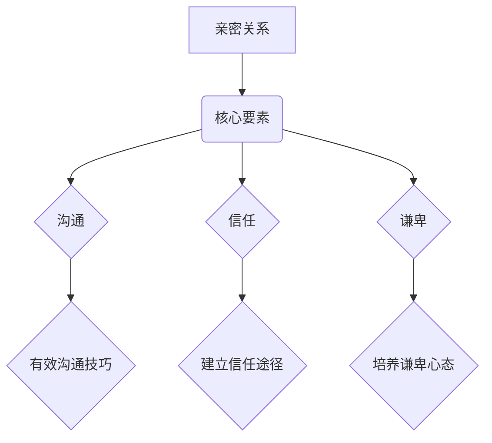
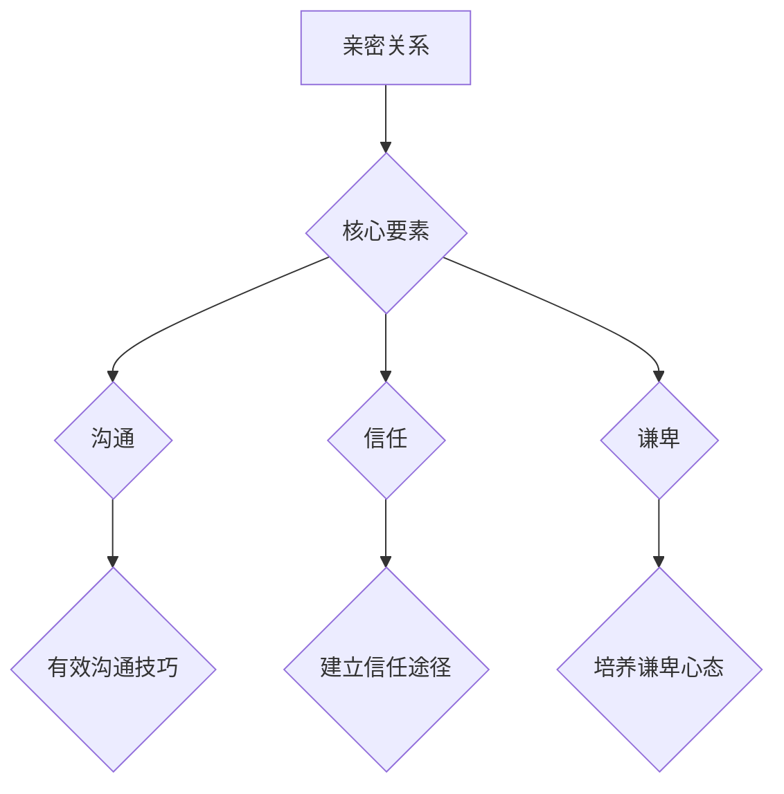

                 

**引言：亲密关系的现状与问题**

在当今快速发展的社会中，亲密关系已经成为人们生活中不可或缺的一部分。然而，随着社会的变迁和科技的进步，亲密关系也面临着前所未有的挑战。本文旨在重新审视亲密关系，探讨其在现代社会中的现状和问题，并提出一些重建情感连接的方法。

### 1.1 亲密关系的定义与重要性

亲密关系通常指的是人与人之间基于情感、信任、尊重和支持而建立起来的紧密联系。这种关系不仅仅是一种社交活动，更是一种深层次的情感连接，它对个体的心理健康和生活质量有着至关重要的影响。

亲密关系的重要性体现在以下几个方面：

1. **情感支持**：在亲密关系中，个体可以获得情感上的支持和安慰，这对于缓解压力、提高心理健康水平具有重要作用。
2. **安全感**：亲密关系提供了安全感和归属感，使个体在心理上感到稳定和安心。
3. **成长与发展**：在健康的亲密关系中，个体可以互相激励、学习和成长，促进个人发展。
4. **社交支持**：亲密关系有助于个体在社会中建立更广泛的社交网络，增强社交能力。

### 1.2 现代社会中亲密关系面临的挑战

尽管亲密关系对个体的重要性不言而喻，但在现代社会中，亲密关系却面临着一系列挑战：

1. **快节奏生活**：现代社会的高节奏生活使人们难以抽出时间来维护亲密关系，导致沟通不畅和情感疏离。
2. **科技干扰**：科技的普及虽然为人们提供了便利，但也带来了干扰。例如，社交媒体和智能手机的过度使用可能导致亲密关系中的时间和情感投入减少。
3. **经济压力**：经济压力的增加可能导致亲密关系中的争吵和紧张，影响关系的稳定性。
4. **文化变迁**：随着文化观念的变迁，人们对亲密关系的期望也在发生变化，这可能导致传统亲密关系模式的崩溃。

### 1.3 重新审视亲密关系的意义

重新审视亲密关系的意义在于：

1. **认识问题**：通过重新审视亲密关系，我们可以更清晰地认识到亲密关系中的问题和挑战，从而有针对性地进行改进。
2. **寻求解决方案**：重新审视亲密关系可以启发我们寻求新的解决方案，以适应现代社会的变化。
3. **促进情感连接**：重新审视亲密关系的目的是为了加强人与人之间的情感连接，提高亲密关系的质量。

### 结论

亲密关系在现代社会中具有重要的意义，但同时也面临着诸多挑战。通过重新审视亲密关系，我们可以更好地理解和应对这些问题，从而重建情感连接，提高生活质量。

---

**关键词**：亲密关系、情感连接、现代社会、挑战、重新审视

---

**摘要**

本文从心理学、社会学等多个角度重新审视亲密关系，探讨了其在现代社会中面临的挑战，并提出了重建情感连接的方法。通过分析亲密关系的核心要素和建设与维护的方法，文章旨在为读者提供有价值的见解和建议，以促进亲密关系的质量提升。

---

**目录大纲**

- 《重新审视亲密关系：在现代社会中重建情感连接》
    - 关键词：亲密关系、情感连接、现代社会、挑战、重新审视
    - 摘要：本文从心理学、社会学等多个角度重新审视亲密关系，探讨了其在现代社会中面临的挑战，并提出了重建情感连接的方法。
  
## 第1章 引言：亲密关系的现状与问题

### 1.1 亲密关系的定义与重要性

### 1.2 现代社会中亲密关系面临的挑战

### 1.3 重新审视亲密关系的意义

## 第2章 亲密关系的理论基础

### 2.1 心理学视角下的亲密关系

#### 2.1.1 亲密关系的四个阶段

#### 2.1.2 亲密关系的五大成分

#### 2.1.3 心理学理论对亲密关系的启示

### 2.2 社会学视角下的亲密关系

#### 2.2.1 社会结构与亲密关系

#### 2.2.2 文化观念与亲密关系

#### 2.2.3 社会变迁对亲密关系的影响

## 第3章 亲密关系的核心要素

### 3.1 沟通：亲密关系的桥梁

#### 3.1.1 有效沟通的重要性

#### 3.1.2 提高沟通技巧的方法

#### 3.1.3 非言语沟通在亲密关系中的应用

### 3.2 信任：亲密关系的基石

#### 3.2.1 信任的定义与类型

#### 3.2.2 建立信任的途径

#### 3.2.3 信任危机的处理

### 3.3 谦卑：亲密关系的润滑剂

#### 3.3.1 谦卑的概念与价值

#### 3.3.2 谦卑在亲密关系中的作用

#### 3.3.3 如何培养谦卑心态

## 第4章 亲密关系的建设与维护

### 4.1 情感连接：亲密关系的核心

#### 4.1.1 情感连接的定义与意义

#### 4.1.2 增强情感连接的方法

#### 4.1.3 情感连接的重要性

### 4.2 争吵与和解：亲密关系中的挑战

#### 4.2.1 争吵的原因与影响

#### 4.2.2 解决争吵的技巧

#### 4.2.3 和解的重要性

### 4.3 亲密关系的可持续性

#### 4.3.1 亲密关系的生命周期

#### 4.3.2 如何保持亲密关系的活力

#### 4.3.3 亲密关系的未来展望

## 第5章 亲密关系的变革与创新

### 5.1 科技对亲密关系的影响

#### 5.1.1 网络社交与亲密关系

#### 5.1.2 科技工具在亲密关系中的应用

#### 5.1.3 科技对亲密关系的挑战

### 5.2 亲密关系的新形式

#### 5.2.1 同性恋关系的亲密性

#### 5.2.2 跨文化婚姻中的亲密关系

#### 5.2.3 现代科技下的亲密关系新模式

## 第6章 亲密关系的实践与案例

### 6.1 亲密关系的成功实践

#### 6.1.1 案例分析：成功的亲密关系案例

#### 6.1.2 经验分享：成功亲密关系的秘诀

#### 6.1.3 挑战与应对：面对亲密关系问题的解决方案

### 6.2 亲密关系的失败案例

#### 6.2.1 案例分析：亲密关系失败的教训

#### 6.2.2 原因分析：亲密关系失败的原因

#### 6.2.3 预防措施：避免亲密关系失败的策略

## 第7章 亲密关系的未来

### 7.1 亲密关系的发展趋势

#### 7.1.1 社会变迁对亲密关系的影响

#### 7.1.2 科技进步对亲密关系的影响

#### 7.1.3 未来亲密关系的可能形式

### 7.2 重建情感连接的行动计划

#### 7.2.1 个人层面的行动建议

#### 7.2.2 社会层面的行动建议

#### 7.2.3 政策层面的行动建议

## 附录

### 附录 A 亲密关系相关资源

#### A.1 亲密关系研究文献

#### A.2 亲密关系教育资料

#### A.3 亲密关系专业服务机构

### 附录 B Mermaid 流程图示例



### 附录 C Python 源代码示例

```python
# 源代码：计算信任度
def calculate_trust_level(closeness, communication, empathy):
    """
    计算信任度
    :param closeness: 情感接近度
    :param communication: 沟通能力
    :param empathy: 同理心
    :return: 
```

---

**引言：亲密关系的现状与问题**

在当今快速发展的社会中，亲密关系已经成为人们生活中不可或缺的一部分。然而，随着社会的变迁和科技的进步，亲密关系也面临着前所未有的挑战。本文旨在重新审视亲密关系，探讨其在现代社会中的现状和问题，并提出一些重建情感连接的方法。

### 1.1 亲密关系的定义与重要性

亲密关系通常指的是人与人之间基于情感、信任、尊重和支持而建立起来的紧密联系。这种关系不仅仅是一种社交活动，更是一种深层次的情感连接，它对个体的心理健康和生活质量有着至关重要的影响。

亲密关系的重要性体现在以下几个方面：

1. **情感支持**：在亲密关系中，个体可以获得情感上的支持和安慰，这对于缓解压力、提高心理健康水平具有重要作用。
2. **安全感**：亲密关系提供了安全感和归属感，使个体在心理上感到稳定和安心。
3. **成长与发展**：在健康的亲密关系中，个体可以互相激励、学习和成长，促进个人发展。
4. **社交支持**：亲密关系有助于个体在社会中建立更广泛的社交网络，增强社交能力。

### 1.2 现代社会中亲密关系面临的挑战

尽管亲密关系对个体的重要性不言而喻，但在现代社会中，亲密关系却面临着一系列挑战：

1. **快节奏生活**：现代社会的高节奏生活使人们难以抽出时间来维护亲密关系，导致沟通不畅和情感疏离。
2. **科技干扰**：科技的普及虽然为人们提供了便利，但也带来了干扰。例如，社交媒体和智能手机的过度使用可能导致亲密关系中的时间和情感投入减少。
3. **经济压力**：经济压力的增加可能导致亲密关系中的争吵和紧张，影响关系的稳定性。
4. **文化变迁**：随着文化观念的变迁，人们对亲密关系的期望也在发生变化，这可能导致传统亲密关系模式的崩溃。

### 1.3 重新审视亲密关系的意义

重新审视亲密关系的意义在于：

1. **认识问题**：通过重新审视亲密关系，我们可以更清晰地认识到亲密关系中的问题和挑战，从而有针对性地进行改进。
2. **寻求解决方案**：重新审视亲密关系可以启发我们寻求新的解决方案，以适应现代社会的变化。
3. **促进情感连接**：重新审视亲密关系的目的是为了加强人与人之间的情感连接，提高亲密关系的质量。

### 结论

亲密关系在现代社会中具有重要的意义，但同时也面临着诸多挑战。通过重新审视亲密关系，我们可以更好地理解和应对这些问题，从而重建情感连接，提高生活质量。

---

**关键词**：亲密关系、情感连接、现代社会、挑战、重新审视

---

**摘要**

本文从心理学、社会学等多个角度重新审视亲密关系，探讨了其在现代社会中面临的挑战，并提出了重建情感连接的方法。通过分析亲密关系的核心要素和建设与维护的方法，文章旨在为读者提供有价值的见解和建议，以促进亲密关系的质量提升。

---

**目录大纲**

- 《重新审视亲密关系：在现代社会中重建情感连接》
    - 关键词：亲密关系、情感连接、现代社会、挑战、重新审视
    - 摘要：本文从心理学、社会学等多个角度重新审视亲密关系，探讨了其在现代社会中面临的挑战，并提出了重建情感连接的方法。
  
## 第1章 引言：亲密关系的现状与问题

### 1.1 亲密关系的定义与重要性

### 1.2 现代社会中亲密关系面临的挑战

### 1.3 重新审视亲密关系的意义

## 第2章 亲密关系的理论基础

### 2.1 心理学视角下的亲密关系

#### 2.1.1 亲密关系的四个阶段

#### 2.1.2 亲密关系的五大成分

#### 2.1.3 心理学理论对亲密关系的启示

### 2.2 社会学视角下的亲密关系

#### 2.2.1 社会结构与亲密关系

#### 2.2.2 文化观念与亲密关系

#### 2.2.3 社会变迁对亲密关系的影响

## 第3章 亲密关系的核心要素

### 3.1 沟通：亲密关系的桥梁

#### 3.1.1 有效沟通的重要性

#### 3.1.2 提高沟通技巧的方法

#### 3.1.3 非言语沟通在亲密关系中的应用

### 3.2 信任：亲密关系的基石

#### 3.2.1 信任的定义与类型

#### 3.2.2 建立信任的途径

#### 3.2.3 信任危机的处理

### 3.3 谦卑：亲密关系的润滑剂

#### 3.3.1 谦卑的概念与价值

#### 3.3.2 谦卑在亲密关系中的作用

#### 3.3.3 如何培养谦卑心态

## 第4章 亲密关系的建设与维护

### 4.1 情感连接：亲密关系的核心

#### 4.1.1 情感连接的定义与意义

#### 4.1.2 增强情感连接的方法

#### 4.1.3 情感连接的重要性

### 4.2 争吵与和解：亲密关系中的挑战

#### 4.2.1 争吵的原因与影响

#### 4.2.2 解决争吵的技巧

#### 4.2.3 和解的重要性

### 4.3 亲密关系的可持续性

#### 4.3.1 亲密关系的生命周期

#### 4.3.2 如何保持亲密关系的活力

#### 4.3.3 亲密关系的未来展望

## 第5章 亲密关系的变革与创新

### 5.1 科技对亲密关系的影响

#### 5.1.1 网络社交与亲密关系

#### 5.1.2 科技工具在亲密关系中的应用

#### 5.1.3 科技对亲密关系的挑战

### 5.2 亲密关系的新形式

#### 5.2.1 同性恋关系的亲密性

#### 5.2.2 跨文化婚姻中的亲密关系

#### 5.2.3 现代科技下的亲密关系新模式

## 第6章 亲密关系的实践与案例

### 6.1 亲密关系的成功实践

#### 6.1.1 案例分析：成功的亲密关系案例

#### 6.1.2 经验分享：成功亲密关系的秘诀

#### 6.1.3 挑战与应对：面对亲密关系问题的解决方案

### 6.2 亲密关系的失败案例

#### 6.2.1 案例分析：亲密关系失败的教训

#### 6.2.2 原因分析：亲密关系失败的原因

#### 6.2.3 预防措施：避免亲密关系失败的策略

## 第7章 亲密关系的未来

### 7.1 亲密关系的发展趋势

#### 7.1.1 社会变迁对亲密关系的影响

#### 7.1.2 科技进步对亲密关系的影响

#### 7.1.3 未来亲密关系的可能形式

### 7.2 重建情感连接的行动计划

#### 7.2.1 个人层面的行动建议

#### 7.2.2 社会层面的行动建议

#### 7.2.3 政策层面的行动建议

## 附录

### 附录 A 亲密关系相关资源

#### A.1 亲密关系研究文献

#### A.2 亲密关系教育资料

#### A.3 亲密关系专业服务机构

### 附录 B Mermaid 流程图示例


### 附录 C Python 源代码示例

```python
# 源代码：计算信任度
def calculate_trust_level(closeness, communication, empathy):
    """
    计算信任度
    :param closeness: 情感接近度
    :param communication: 沟通能力
    :param empathy: 同理心
    :return: 
```

---

**第1章 引言：亲密关系的现状与问题**

在现代社会中，亲密关系的重要性不言而喻。然而，随着科技的进步和社会结构的变迁，亲密关系面临着诸多挑战。本章将探讨亲密关系的现状与问题，并介绍重新审视亲密关系的意义。

### 1.1 亲密关系的定义与重要性

亲密关系是指基于情感、信任、尊重和支持而建立起来的一种深层次的人际联系。这种关系不仅仅限于家庭和婚姻，也包括朋友、同事和其他亲密伙伴。亲密关系的重要性体现在以下几个方面：

1. **情感支持**：亲密关系为人提供情感上的支持和安慰，有助于缓解压力和焦虑，提高心理健康水平。
2. **安全感**：亲密关系提供了一种安全感和归属感，使个体在心理上感到稳定和安心。
3. **个人成长**：健康的亲密关系可以促进个人的成长和发展，通过互相激励和学习，个体可以更好地认识自己，实现自我提升。
4. **社会支持**：亲密关系有助于个体在社会中建立更广泛的社交网络，增强社交能力，从而提高社会适应力。

### 1.2 现代社会中亲密关系面临的挑战

现代社会中，亲密关系面临着一系列的挑战：

1. **快节奏生活**：现代社会的生活节奏越来越快，工作和生活压力不断增加，这使得人们很难抽出时间和精力来维护亲密关系。
2. **科技干扰**：科技的快速发展，特别是社交媒体和智能手机的普及，虽然为人们提供了便利，但也带来了干扰。过度依赖科技可能导致亲密关系中的时间和情感投入减少，影响关系的质量。
3. **经济压力**：经济压力的增加可能导致亲密关系中的争吵和紧张，甚至可能引发分离和破裂。
4. **文化变迁**：随着文化观念的变迁，人们对亲密关系的期望也在发生变化。传统亲密关系模式可能不再适应现代社会，导致关系的紧张和矛盾。

### 1.3 重新审视亲密关系的意义

重新审视亲密关系具有重要意义：

1. **认识问题**：通过重新审视亲密关系，我们可以更深入地了解亲密关系中的问题和挑战，从而有针对性地进行改进。
2. **寻求解决方案**：重新审视亲密关系可以启发我们寻求新的解决方案，以适应现代社会的变化，提高亲密关系的质量。
3. **促进情感连接**：重新审视亲密关系的目的是为了加强人与人之间的情感连接，提高亲密关系的质量，从而带来更加健康和幸福的个体生活。

### 结论

亲密关系在现代社会中具有重要意义，但同时也面临着诸多挑战。通过重新审视亲密关系，我们可以更好地理解和应对这些挑战，寻求新的解决方案，以建立更加健康和稳固的亲密关系。

---

**关键词**：亲密关系、情感支持、快节奏生活、科技干扰、重新审视

---

**摘要**

本章从定义和重要性出发，探讨了现代社会中亲密关系面临的挑战，并强调了重新审视亲密关系的意义。通过深入分析，文章旨在为读者提供有价值的见解和建议，以促进亲密关系的质量提升。

---

**第2章 亲密关系的理论基础**

在探讨亲密关系的现状与问题之前，有必要对亲密关系的理论基础进行梳理。本章将从心理学和社会学的角度出发，分析亲密关系的发展阶段、核心要素以及理论对亲密关系的启示。

### 2.1 心理学视角下的亲密关系

心理学对于亲密关系的研究提供了丰富的理论框架和视角。以下是心理学视角下亲密关系的一些基本概念和理论。

#### 2.1.1 亲密关系的四个阶段

心理学家斯滕伯格（Sternberg）提出了著名的“爱情三角理论”，将亲密关系分为四个阶段：

1. **欲望阶段**：这是亲密关系的初始阶段，主要特点是强烈的欲望和性吸引。
2. **亲密阶段**：在这个阶段，个体之间的情感联系加深，感受到强烈的亲密和情感支持。
3. **决定阶段**：在这个阶段，个体开始做出承诺，建立长期关系。
4. **稳定阶段**：这是关系最稳定的阶段，特点是长期的忠诚和承诺。

#### 2.1.2 亲密关系的五大成分

心理学家巴特利特（Bertolotti）提出了亲密关系的五大成分，包括：

1. **情感联系**：指个体之间的情感亲密和情感支持。
2. **沟通**：指个体之间的有效沟通和交流，包括言语和非言语沟通。
3. **共同活动**：指个体之间共同参与的活动，增强彼此的互动和联系。
4. **信任**：指个体之间的信任和依赖，是亲密关系的基础。
5. **共同目标**：指个体之间共同追求的目标和价值观，增强关系的稳定性。

#### 2.1.3 心理学理论对亲密关系的启示

心理学理论为我们理解亲密关系提供了重要的启示：

1. **认识亲密关系的发展规律**：通过了解亲密关系的四个阶段，个体可以更好地把握关系的发展，避免因未达到某个阶段而产生的不满和冲突。
2. **重视沟通和情感支持**：亲密关系的五大成分中，沟通和情感联系至关重要。个体需要通过有效的沟通和情感支持来维护和提升关系质量。
3. **建立信任和共同目标**：信任和共同目标是亲密关系稳定和持久的基础。个体需要共同努力，建立和维护信任关系，并共同追求目标和价值观。

### 2.2 社会学视角下的亲密关系

社会学视角下的亲密关系研究更加注重社会结构和文化观念对亲密关系的影响。以下是社会学视角下亲密关系的一些基本概念和理论。

#### 2.2.1 社会结构与亲密关系

社会学家科塞（Coser）提出了“社会结构”的概念，认为社会结构对亲密关系有着重要的影响。社会结构包括社会角色、社会规范和社会关系网络等。亲密关系中的社会结构特征包括：

1. **角色定义**：亲密关系中的角色定义影响着个体的行为和互动。明确的角色定义有助于减少冲突，促进关系的稳定。
2. **社会规范**：社会规范对亲密关系中的行为和互动有着重要的指导作用。遵守社会规范有助于维护关系，减少矛盾。
3. **关系网络**：亲密关系中的关系网络对个体的影响也是不可忽视的。一个健康的关系网络可以为个体提供支持和资源，有助于关系的稳定和持续。

#### 2.2.2 文化观念与亲密关系

文化观念对亲密关系有着深远的影响。不同的文化背景和社会价值观可能导致不同的亲密关系模式。以下是几个与文化观念相关的亲密关系概念：

1. **性别观念**：性别观念对亲密关系中的角色分配、权力结构和沟通方式有着重要的影响。不同的性别观念可能导致不同的亲密关系模式。
2. **家庭观念**：家庭观念对亲密关系的稳定性和功能有着重要的影响。不同的家庭观念可能导致不同的家庭结构和亲密关系模式。
3. **情感表达**：文化观念中的情感表达方式对亲密关系中的情感交流和表达有着重要的影响。不同的文化背景下，情感表达的方式和程度可能有所不同。

#### 2.2.3 社会变迁对亲密关系的影响

社会变迁对亲密关系的影响是复杂的。随着社会的发展和变革，亲密关系也在不断地适应和变化。以下是社会变迁对亲密关系的一些影响：

1. **经济因素**：经济因素对亲密关系的影响日益显著。经济压力的增加可能导致亲密关系中的矛盾和紧张。
2. **科技因素**：科技的发展对亲密关系的影响也是不可忽视的。社交媒体和智能手机的普及改变了人们的沟通方式，对亲密关系产生了深远的影响。
3. **社会价值观的变化**：社会价值观的变化，如对个人自由和独立性的重视，可能影响亲密关系中的角色分配和权力结构。

### 结论

心理学和社会学视角下的亲密关系研究为我们提供了丰富的理论基础。通过理解亲密关系的发展规律、核心要素和社会结构，个体可以更好地认识和处理亲密关系中的问题和挑战，促进关系的稳定和健康。

---

**关键词**：心理学、社会学、亲密关系、发展阶段、核心要素、社会结构、文化观念

---

**摘要**

本章从心理学和社会学的角度探讨了亲密关系的理论基础，分析了亲密关系的发展阶段、核心要素以及社会结构和文化观念对亲密关系的影响。通过对这些理论的介绍和阐述，文章旨在为读者提供有价值的见解，帮助理解和维护健康的亲密关系。

---

**第2章 亲密关系的理论基础**

在探讨亲密关系的现状与问题之前，有必要对亲密关系的理论基础进行梳理。本章将从心理学和社会学的角度出发，分析亲密关系的发展阶段、核心要素以及理论对亲密关系的启示。

### 2.1 心理学视角下的亲密关系

心理学对于亲密关系的研究提供了丰富的理论框架和视角。以下是心理学视角下亲密关系的一些基本概念和理论。

#### 2.1.1 亲密关系的四个阶段

心理学家斯滕伯格（Sternberg）提出了著名的“爱情三角理论”，将亲密关系分为四个阶段：

1. **欲望阶段**：这是亲密关系的初始阶段，主要特点是强烈的欲望和性吸引。
2. **亲密阶段**：在这个阶段，个体之间的情感联系加深，感受到强烈的亲密和情感支持。
3. **决定阶段**：在这个阶段，个体开始做出承诺，建立长期关系。
4. **稳定阶段**：这是关系最稳定的阶段，特点是长期的忠诚和承诺。

#### 2.1.2 亲密关系的五大成分

心理学家巴特利特（Bertolotti）提出了亲密关系的五大成分，包括：

1. **情感联系**：指个体之间的情感亲密和情感支持。
2. **沟通**：指个体之间的有效沟通和交流，包括言语和非言语沟通。
3. **共同活动**：指个体之间共同参与的活动，增强彼此的互动和联系。
4. **信任**：指个体之间的信任和依赖，是亲密关系的基础。
5. **共同目标**：指个体之间共同追求的目标和价值观，增强关系的稳定性。

#### 2.1.3 心理学理论对亲密关系的启示

心理学理论为我们理解亲密关系提供了重要的启示：

1. **认识亲密关系的发展规律**：通过了解亲密关系的四个阶段，个体可以更好地把握关系的发展，避免因未达到某个阶段而产生的不满和冲突。
2. **重视沟通和情感支持**：亲密关系的五大成分中，沟通和情感联系至关重要。个体需要通过有效的沟通和情感支持来维护和提升关系质量。
3. **建立信任和共同目标**：信任和共同目标是亲密关系稳定和持久的基础。个体需要共同努力，建立和维护信任关系，并共同追求目标和价值观。

### 2.2 社会学视角下的亲密关系

社会学视角下的亲密关系研究更加注重社会结构和文化观念对亲密关系的影响。以下是社会学视角下亲密关系的一些基本概念和理论。

#### 2.2.1 社会结构与亲密关系

社会学家科塞（Coser）提出了“社会结构”的概念，认为社会结构对亲密关系有着重要的影响。社会结构包括社会角色、社会规范和社会关系网络等。亲密关系中的社会结构特征包括：

1. **角色定义**：亲密关系中的角色定义影响着个体的行为和互动。明确的角色定义有助于减少冲突，促进关系的稳定。
2. **社会规范**：社会规范对亲密关系中的行为和互动有着重要的指导作用。遵守社会规范有助于维护关系，减少矛盾。
3. **关系网络**：亲密关系中的关系网络对个体的影响也是不可忽视的。一个健康的关系网络可以为个体提供支持和资源，有助于关系的稳定和持续。

#### 2.2.2 文化观念与亲密关系

文化观念对亲密关系有着深远的影响。不同的文化背景和社会价值观可能导致不同的亲密关系模式。以下是几个与文化观念相关的亲密关系概念：

1. **性别观念**：性别观念对亲密关系中的角色分配、权力结构和沟通方式有着重要的影响。不同的性别观念可能导致不同的亲密关系模式。
2. **家庭观念**：家庭观念对亲密关系的稳定性和功能有着重要的影响。不同的家庭观念可能导致不同的家庭结构和亲密关系模式。
3. **情感表达**：文化观念中的情感表达方式对亲密关系中的情感交流和表达有着重要的影响。不同的文化背景下，情感表达的方式和程度可能有所不同。

#### 2.2.3 社会变迁对亲密关系的影响

社会变迁对亲密关系的影响是复杂的。随着社会的发展和变革，亲密关系也在不断地适应和变化。以下是社会变迁对亲密关系的一些影响：

1. **经济因素**：经济因素对亲密关系的影响日益显著。经济压力的增加可能导致亲密关系中的矛盾和紧张。
2. **科技因素**：科技的发展对亲密关系的影响也是不可忽视的。社交媒体和智能手机的普及改变了人们的沟通方式，对亲密关系产生了深远的影响。
3. **社会价值观的变化**：社会价值观的变化，如对个人自由和独立性的重视，可能影响亲密关系中的角色分配和权力结构。

### 结论

心理学和社会学视角下的亲密关系研究为我们提供了丰富的理论基础。通过理解亲密关系的发展规律、核心要素和社会结构，个体可以更好地认识和处理亲密关系中的问题和挑战，促进关系的稳定和健康。

---

**关键词**：心理学、社会学、亲密关系、发展阶段、核心要素、社会结构、文化观念

---

**摘要**

本章从心理学和社会学的角度探讨了亲密关系的理论基础，分析了亲密关系的发展阶段、核心要素以及社会结构和文化观念对亲密关系的影响。通过对这些理论的介绍和阐述，文章旨在为读者提供有价值的见解，帮助理解和维护健康的亲密关系。

---

**第3章 亲密关系的核心要素**

亲密关系的质量取决于多个核心要素，这些要素相互交织，共同构建起健康的亲密关系。本章将详细探讨沟通、信任和谦卑这三个核心要素，以及它们在亲密关系中的重要作用。

### 3.1 沟通：亲密关系的桥梁

沟通是亲密关系的桥梁，没有良好的沟通，关系就容易陷入僵局。以下是沟通在亲密关系中的几个重要方面：

#### 3.1.1 有效沟通的重要性

有效沟通不仅有助于解决问题，还能增进理解，提升关系质量。以下是有效沟通的几个关键点：

1. **倾听**：倾听是有效沟通的基础。倾听不仅仅是听别人说什么，更是理解对方的情感和需求。
2. **表达**：清晰、准确的表达有助于减少误解。使用具体的例子和情感词汇，可以帮助对方更好地理解你的想法和感受。
3. **非言语沟通**：非言语沟通（如肢体语言、面部表情、眼神交流等）在亲密关系中起着重要作用。注意自己的非言语表达，以增强沟通效果。

#### 3.1.2 提高沟通技巧的方法

以下是一些提高沟通技巧的方法：

1. **定期对话**：设定固定的沟通时间，例如每周一次的“沟通之夜”，有助于保持沟通的频率和质量。
2. **积极倾听**：练习积极倾听，不仅关注对方说什么，还要关注对方的情感和需求。
3. **表达感激**：在沟通中表达感激和欣赏，可以增强关系的亲密度。

#### 3.1.3 非言语沟通在亲密关系中的应用

非言语沟通在亲密关系中的应用非常广泛，以下是一些具体的例子：

1. **身体接触**：拥抱、亲吻等身体接触可以传递情感和安全感。
2. **眼神交流**：眼神交流可以增强亲密感和信任。
3. **姿态**：开放、放松的姿态可以传递友好和接纳的信息。

### 3.2 信任：亲密关系的基石

信任是亲密关系的基石，没有信任，关系就难以维系。以下是信任在亲密关系中的几个方面：

#### 3.2.1 信任的定义与类型

信任是指个体对他人的能力和诚实程度的信任。根据不同的维度，信任可以分为以下几种类型：

1. **基本信任**：指个体对他人基本诚实和能力的信任，是亲密关系的基础。
2. **情感信任**：指个体对他人情感上的信任，包括情感的开放和情感的承诺。
3. **任务信任**：指个体对他人完成任务的能力的信任，是合作和共同目标的基石。

#### 3.2.2 建立信任的途径

以下是一些建立信任的途径：

1. **诚实和透明**：诚实是建立信任的关键。保持透明，让对方了解自己的想法和行为。
2. **一致性**：保持行为的一致性，让对方看到你的可靠性和可预测性。
3. **尊重**：尊重对方的意见和感受，尊重是建立信任的重要前提。

#### 3.2.3 信任危机的处理

当亲密关系中发生信任危机时，以下是一些处理方法：

1. **沟通**：通过沟通，了解对方的担忧和期望，共同寻找解决问题的方法。
2. **道歉和承认错误**：如果自己犯了错误，应该勇于道歉并承认错误。
3. **修复信任**：通过持续的努力和表现，逐步修复信任。

### 3.3 谦卑：亲密关系的润滑剂

谦卑是亲密关系的润滑剂，它可以帮助个体更好地理解他人，增进彼此的情感联系。以下是谦卑在亲密关系中的几个方面：

#### 3.3.1 谦卑的概念与价值

谦卑是指个体对自己的认识，认识到自己的局限性和对他人价值的尊重。谦卑的价值在于：

1. **增进理解**：谦卑可以帮助个体更好地理解他人的需求和感受，减少冲突和误解。
2. **增强信任**：谦卑可以增强亲密关系中的信任，因为谦卑的个体更容易被他人接受和信任。
3. **促进共同成长**：谦卑可以帮助个体和伴侣一起成长，共同面对生活中的挑战。

#### 3.3.2 谦卑在亲密关系中的作用

谦卑在亲密关系中的作用体现在以下几个方面：

1. **减少权力斗争**：谦卑可以帮助个体减少对权力的争夺，促进平等和和谐的亲密关系。
2. **增进情感联系**：谦卑可以增强个体之间的情感联系，提升亲密关系的质量。
3. **促进共同成长**：谦卑可以促进个体和伴侣一起成长，共同面对生活中的挑战。

#### 3.3.3 如何培养谦卑心态

以下是一些培养谦卑心态的方法：

1. **自我反思**：定期反思自己的行为和态度，认识到自己的不足和需要改进的地方。
2. **学习和成长**：不断学习和成长，提升自己的能力和素质，从而更好地服务他人。
3. **感恩**：感恩可以帮助个体认识到他人的价值和付出，从而培养谦卑心态。

### 结论

沟通、信任和谦卑是亲密关系的核心要素，它们相互交织，共同构建起健康的亲密关系。通过有效沟通，个体可以增进理解，减少冲突；通过建立信任，个体可以获得安全感和依赖感；通过培养谦卑心态，个体可以更好地理解他人，增进情感联系。理解和应用这些核心要素，可以帮助个体建立和维护健康的亲密关系。

---

**关键词**：沟通、信任、谦卑、亲密关系、桥梁、基石、润滑剂

---

**摘要**

本章详细探讨了亲密关系的核心要素：沟通、信任和谦卑。通过分析这三个要素的重要性和应用方法，文章旨在为读者提供有价值的见解，帮助建立和维护健康的亲密关系。

---

**第3章 亲密关系的核心要素**

亲密关系的质量取决于多个核心要素，这些要素相互交织，共同构建起健康的亲密关系。本章将详细探讨沟通、信任和谦卑这三个核心要素，以及它们在亲密关系中的重要作用。

### 3.1 沟通：亲密关系的桥梁

沟通是亲密关系的桥梁，没有良好的沟通，关系就容易陷入僵局。以下是沟通在亲密关系中的几个重要方面：

#### 3.1.1 有效沟通的重要性

有效沟通不仅有助于解决问题，还能增进理解，提升关系质量。以下是有效沟通的几个关键点：

1. **倾听**：倾听是有效沟通的基础。倾听不仅仅是听别人说什么，更是理解对方的情感和需求。
2. **表达**：清晰、准确的表达有助于减少误解。使用具体的例子和情感词汇，可以帮助对方更好地理解你的想法和感受。
3. **非言语沟通**：非言语沟通（如肢体语言、面部表情、眼神交流等）在亲密关系中起着重要作用。注意自己的非言语表达，以增强沟通效果。

#### 3.1.2 提高沟通技巧的方法

以下是一些提高沟通技巧的方法：

1. **定期对话**：设定固定的沟通时间，例如每周一次的“沟通之夜”，有助于保持沟通的频率和质量。
2. **积极倾听**：练习积极倾听，不仅关注对方说什么，还要关注对方的情感和需求。
3. **表达感激**：在沟通中表达感激和欣赏，可以增强关系的亲密度。

#### 3.1.3 非言语沟通在亲密关系中的应用

非言语沟通在亲密关系中的应用非常广泛，以下是一些具体的例子：

1. **身体接触**：拥抱、亲吻等身体接触可以传递情感和安全感。
2. **眼神交流**：眼神交流可以增强亲密感和信任。
3. **姿态**：开放、放松的姿态可以传递友好和接纳的信息。

### 3.2 信任：亲密关系的基石

信任是亲密关系的基石，没有信任，关系就难以维系。以下是信任在亲密关系中的几个方面：

#### 3.2.1 信任的定义与类型

信任是指个体对他人的能力和诚实程度的信任。根据不同的维度，信任可以分为以下几种类型：

1. **基本信任**：指个体对他人基本诚实和能力的信任，是亲密关系的基础。
2. **情感信任**：指个体对他人情感上的信任，包括情感的开放和情感的承诺。
3. **任务信任**：指个体对他人完成任务的能力的信任，是合作和共同目标的基石。

#### 3.2.2 建立信任的途径

以下是一些建立信任的途径：

1. **诚实和透明**：诚实是建立信任的关键。保持透明，让对方了解自己的想法和行为。
2. **一致性**：保持行为的一致性，让对方看到你的可靠性和可预测性。
3. **尊重**：尊重对方的意见和感受，尊重是建立信任的重要前提。

#### 3.2.3 信任危机的处理

当亲密关系中发生信任危机时，以下是一些处理方法：

1. **沟通**：通过沟通，了解对方的担忧和期望，共同寻找解决问题的方法。
2. **道歉和承认错误**：如果自己犯了错误，应该勇于道歉并承认错误。
3. **修复信任**：通过持续的努力和表现，逐步修复信任。

### 3.3 谦卑：亲密关系的润滑剂

谦卑是亲密关系的润滑剂，它可以帮助个体更好地理解他人，增进彼此的情感联系。以下是谦卑在亲密关系中的几个方面：

#### 3.3.1 谦卑的概念与价值

谦卑是指个体对自己的认识，认识到自己的局限性和对他人价值的尊重。谦卑的价值在于：

1. **增进理解**：谦卑可以帮助个体更好地理解他人的需求和感受，减少冲突和误解。
2. **增强信任**：谦卑可以增强亲密关系中的信任，因为谦卑的个体更容易被他人接受和信任。
3. **促进共同成长**：谦卑可以促进个体和伴侣一起成长，共同面对生活中的挑战。

#### 3.3.2 谦卑在亲密关系中的作用

谦卑在亲密关系中的作用体现在以下几个方面：

1. **减少权力斗争**：谦卑可以帮助个体减少对权力的争夺，促进平等和和谐的亲密关系。
2. **增进情感联系**：谦卑可以增强个体之间的情感联系，提升亲密关系的质量。
3. **促进共同成长**：谦卑可以促进个体和伴侣一起成长，共同面对生活中的挑战。

#### 3.3.3 如何培养谦卑心态

以下是一些培养谦卑心态的方法：

1. **自我反思**：定期反思自己的行为和态度，认识到自己的不足和需要改进的地方。
2. **学习和成长**：不断学习和成长，提升自己的能力和素质，从而更好地服务他人。
3. **感恩**：感恩可以帮助个体认识到他人的价值和付出，从而培养谦卑心态。

### 结论

沟通、信任和谦卑是亲密关系的核心要素，它们相互交织，共同构建起健康的亲密关系。通过有效沟通，个体可以增进理解，减少冲突；通过建立信任，个体可以获得安全感和依赖感；通过培养谦卑心态，个体可以更好地理解他人，增进情感联系。理解和应用这些核心要素，可以帮助个体建立和维护健康的亲密关系。

---

**关键词**：沟通、信任、谦卑、亲密关系、桥梁、基石、润滑剂

---

**摘要**

本章详细探讨了亲密关系的核心要素：沟通、信任和谦卑。通过分析这三个要素的重要性和应用方法，文章旨在为读者提供有价值的见解，帮助建立和维护健康的亲密关系。

---

**第4章 亲密关系的建设与维护**

健康的亲密关系需要不断的建设与维护，这是一个持续的过程，涉及情感连接、争吵与和解、以及亲密关系的可持续性。本章将深入探讨这些方面，并提供实用的策略和建议。

### 4.1 情感连接：亲密关系的核心

情感连接是亲密关系的核心，它是关系中最为重要和基础的元素。情感连接不仅仅是情感的传递，更是一种深层次的心灵互动。以下是情感连接的几个重要方面：

#### 4.1.1 情感连接的定义与意义

情感连接是指个体之间在情感上的相互依赖、理解和支持。它的意义在于：

1. **增强亲密感**：情感连接使得个体在关系中感到更加亲密和亲近。
2. **提供支持**：情感连接在困难时期提供支持和安慰，帮助个体克服挑战。
3. **促进个人成长**：情感连接可以激发个体对自我和伴侣的认知和成长。

#### 4.1.2 增强情感连接的方法

以下是一些增强情感连接的方法：

1. **共度时光**：定期安排与伴侣共度的时间，可以是散步、看电影或一起做饭等，这些活动可以增强情感联系。
2. **情感分享**：鼓励双方分享自己的情感和想法，倾听对方的感受，这有助于建立更深层次的联系。
3. **表达感激**：在日常生活中表达对伴侣的感激之情，这可以增强彼此之间的情感连接。

#### 4.1.3 情感连接的重要性

情感连接的重要性体现在以下几个方面：

1. **减少冲突**：情感连接有助于个体更好地理解和包容对方，从而减少冲突的发生。
2. **提升幸福感**：健康的情感连接可以提高个体的幸福感，使其感到更加满足和快乐。
3. **增强关系稳定性**：情感连接是维持亲密关系稳定的重要因素，它有助于关系的长期发展。

### 4.2 争吵与和解：亲密关系中的挑战

争吵是亲密关系中不可避免的一部分，但如何处理争吵和达成和解是关系健康的关键。以下是关于争吵与和解的几个方面：

#### 4.2.1 争吵的原因与影响

争吵的原因多种多样，包括：

1. **沟通障碍**：缺乏有效沟通是争吵的常见原因。误解、忽视和非言语沟通不畅可能导致争吵。
2. **期望差异**：个体对关系中的期望不一致，例如在家庭责任、财务管理等方面，可能导致冲突。
3. **情绪触发**：一些特定的情绪触发点，如压力、疲劳或焦虑，可能导致争吵的发生。

争吵的影响可能包括：

1. **情感伤害**：争吵可能导致情感上的伤害，影响双方的信任和亲密感。
2. **沟通障碍**：争吵可能加剧沟通障碍，使双方更难以理解对方。
3. **关系紧张**：长期的争吵可能导致关系紧张，影响生活的质量。

#### 4.2.2 解决争吵的技巧

以下是一些解决争吵的技巧：

1. **冷静下来**：在争吵激烈时，尝试冷静下来，给自己和对方一些时间和空间。
2. **有效沟通**：使用积极的沟通技巧，如倾听、表达和共鸣，以理解对方的立场和感受。
3. **寻求妥协**：寻找双方都能接受的解决方案，避免单方面的胜利。

#### 4.2.3 和解的重要性

和解是亲密关系中至关重要的一个环节。以下是和解的重要性：

1. **修复关系**：和解有助于修复因争吵而受损的关系，恢复亲密感。
2. **增强信任**：通过和解，双方可以重建信任，增强关系的稳定性。
3. **促进个人成长**：和解过程可以促进个体的自我反思和成长，提高处理冲突的能力。

### 4.3 亲密关系的可持续性

亲密关系的可持续性是指关系在长期内能够维持健康和稳定。以下是关于亲密关系可持续性的几个方面：

#### 4.3.1 亲密关系的生命周期

亲密关系有一个生命周期，包括：

1. **建立阶段**：关系开始建立，双方相互了解和适应。
2. **稳定阶段**：关系进入稳定期，双方建立了深厚的情感连接。
3. **发展阶段**：关系继续成长，双方在情感和生活中互相支持。
4. **维持阶段**：关系进入维持期，双方共同努力保持关系的健康。

#### 4.3.2 如何保持亲密关系的活力

以下是一些保持亲密关系活力的方法：

1. **持续沟通**：保持开放的沟通渠道，定期分享自己的想法和感受。
2. **共同目标**：设定共同的目标和梦想，一起努力实现。
3. **情感投资**：在关系中投入时间和情感，共同参与活动和兴趣。

#### 4.3.3 亲密关系的未来展望

随着社会的发展和个体的变化，亲密关系也在不断演变。未来亲密关系的发展可能包括：

1. **适应变化**：社会变迁和文化观念的变化将对亲密关系产生影响，个体需要适应这些变化。
2. **科技融合**：科技的发展可能会为亲密关系带来新的形式和体验。
3. **个性化和多样化**：未来的亲密关系可能会更加个性化和多样化，以适应不同的个体需求和关系模式。

### 结论

建设与维护健康的亲密关系是一个持续的过程，需要关注情感连接、处理争吵与和解，以及保持关系的可持续性。通过有效的沟通、建立信任、培养谦卑心态，以及积极的冲突解决策略，个体可以建立和维护一个稳定、健康的亲密关系。

---

**关键词**：情感连接、争吵与和解、亲密关系、可持续性、沟通、信任、谦卑

---

**摘要**

本章探讨了亲密关系的建设与维护，包括情感连接、争吵与和解、以及亲密关系的可持续性。通过分析这些方面，文章提供了实用的策略和建议，帮助个体建立和维护健康的亲密关系。

---

**第4章 亲密关系的建设与维护**

健康的亲密关系需要不断的建设与维护，这是一个持续的过程，涉及情感连接、争吵与和解、以及亲密关系的可持续性。本章将深入探讨这些方面，并提供实用的策略和建议。

### 4.1 情感连接：亲密关系的核心

情感连接是亲密关系的核心，它是关系中最为重要和基础的元素。情感连接不仅仅是情感的传递，更是一种深层次的心灵互动。以下是情感连接的几个重要方面：

#### 4.1.1 情感连接的定义与意义

情感连接是指个体之间在情感上的相互依赖、理解和支持。它的意义在于：

1. **增强亲密感**：情感连接使得个体在关系中感到更加亲密和亲近。
2. **提供支持**：情感连接在困难时期提供支持和安慰，帮助个体克服挑战。
3. **促进个人成长**：情感连接可以激发个体对自我和伴侣的认知和成长。

#### 4.1.2 增强情感连接的方法

以下是一些增强情感连接的方法：

1. **共度时光**：定期安排与伴侣共度的时间，可以是散步、看电影或一起做饭等，这些活动可以增强情感联系。
2. **情感分享**：鼓励双方分享自己的情感和想法，倾听对方的感受，这有助于建立更深层次的联系。
3. **表达感激**：在日常生活中表达对伴侣的感激之情，这可以增强彼此之间的情感连接。

#### 4.1.3 情感连接的重要性

情感连接的重要性体现在以下几个方面：

1. **减少冲突**：情感连接有助于个体更好地理解和包容对方，从而减少冲突的发生。
2. **提升幸福感**：健康的情感连接可以提高个体的幸福感，使其感到更加满足和快乐。
3. **增强关系稳定性**：情感连接是维持亲密关系稳定的重要因素，它有助于关系的长期发展。

### 4.2 争吵与和解：亲密关系中的挑战

争吵是亲密关系中不可避免的一部分，但如何处理争吵和达成和解是关系健康的关键。以下是关于争吵与和解的几个方面：

#### 4.2.1 争吵的原因与影响

争吵的原因多种多样，包括：

1. **沟通障碍**：缺乏有效沟通是争吵的常见原因。误解、忽视和非言语沟通不畅可能导致争吵。
2. **期望差异**：个体对关系中的期望不一致，例如在家庭责任、财务管理等方面，可能导致冲突。
3. **情绪触发**：一些特定的情绪触发点，如压力、疲劳或焦虑，可能导致争吵的发生。

争吵的影响可能包括：

1. **情感伤害**：争吵可能导致情感上的伤害，影响双方的信任和亲密感。
2. **沟通障碍**：争吵可能加剧沟通障碍，使双方更难以理解对方。
3. **关系紧张**：长期的争吵可能导致关系紧张，影响生活的质量。

#### 4.2.2 解决争吵的技巧

以下是一些解决争吵的技巧：

1. **冷静下来**：在争吵激烈时，尝试冷静下来，给自己和对方一些时间和空间。
2. **有效沟通**：使用积极的沟通技巧，如倾听、表达和共鸣，以理解对方的立场和感受。
3. **寻求妥协**：寻找双方都能接受的解决方案，避免单方面的胜利。

#### 4.2.3 和解的重要性

和解是亲密关系中至关重要的一个环节。以下是和解的重要性：

1. **修复关系**：和解有助于修复因争吵而受损的关系，恢复亲密感。
2. **增强信任**：通过和解，双方可以重建信任，增强关系的稳定性。
3. **促进个人成长**：和解过程可以促进个体的自我反思和成长，提高处理冲突的能力。

### 4.3 亲密关系的可持续性

亲密关系的可持续性是指关系在长期内能够维持健康和稳定。以下是关于亲密关系可持续性的几个方面：

#### 4.3.1 亲密关系的生命周期

亲密关系有一个生命周期，包括：

1. **建立阶段**：关系开始建立，双方相互了解和适应。
2. **稳定阶段**：关系进入稳定期，双方建立了深厚的情感连接。
3. **发展阶段**：关系继续成长，双方在情感和生活中互相支持。
4. **维持阶段**：关系进入维持期，双方共同努力保持关系的健康。

#### 4.3.2 如何保持亲密关系的活力

以下是一些保持亲密关系活力的方法：

1. **持续沟通**：保持开放的沟通渠道，定期分享自己的想法和感受。
2. **共同目标**：设定共同的目标和梦想，一起努力实现。
3. **情感投资**：在关系中投入时间和情感，共同参与活动和兴趣。

#### 4.3.3 亲密关系的未来展望

随着社会的发展和个体的变化，亲密关系也在不断演变。未来亲密关系的发展可能包括：

1. **适应变化**：社会变迁和文化观念的变化将对亲密关系产生影响，个体需要适应这些变化。
2. **科技融合**：科技的发展可能会为亲密关系带来新的形式和体验。
3. **个性化和多样化**：未来的亲密关系可能会更加个性化和多样化，以适应不同的个体需求和关系模式。

### 结论

建设与维护健康的亲密关系是一个持续的过程，需要关注情感连接、处理争吵与和解，以及保持关系的可持续性。通过有效的沟通、建立信任、培养谦卑心态，以及积极的冲突解决策略，个体可以建立和维护一个稳定、健康的亲密关系。

---

**关键词**：情感连接、争吵与和解、亲密关系、可持续性、沟通、信任、谦卑

---

**摘要**

本章探讨了亲密关系的建设与维护，包括情感连接、争吵与和解、以及亲密关系的可持续性。通过分析这些方面，文章提供了实用的策略和建议，帮助个体建立和维护健康的亲密关系。

---

**第5章 亲密关系的变革与创新**

随着科技的不断进步和社会的快速变迁，亲密关系也在经历着变革和创新。本章将探讨科技对亲密关系的影响，以及亲密关系的新形式。

### 5.1 科技对亲密关系的影响

科技的快速发展对亲密关系产生了深远的影响。以下是一些关键点：

#### 5.1.1 网络社交与亲密关系

网络社交平台如Facebook、Instagram和微信等，为人们提供了新的社交方式和互动机会。然而，这些平台也可能带来一些挑战：

1. **时间分配**：过度依赖网络社交可能导致现实生活中的互动减少，影响亲密关系。
2. **情感依赖**：对社交媒体的依赖可能导致情感上的疏离，使个体更难以建立和维持深层次的亲密关系。
3. **虚假形象**：社交媒体上的虚拟形象可能与现实生活有较大差距，可能导致误解和信任问题。

#### 5.1.2 科技工具在亲密关系中的应用

科技工具如智能手机、视频通话软件和智能家居等，为亲密关系带来了便利和创新：

1. **远程沟通**：视频通话软件如Zoom、Skype和微信视频通话等，使得异地恋和远程工作的人群能够保持亲密联系。
2. **智能家居**：智能家居设备如智能音箱、智能照明和智能门锁等，可以提升家庭生活的便捷性，增强亲密感。
3. **个性化体验**：科技可以提供个性化的体验，如定制化的音乐播放列表、个性化推荐等，使亲密关系更加独特和有意义。

#### 5.1.3 科技对亲密关系的挑战

科技的发展也带来了亲密关系的挑战：

1. **隐私问题**：随着科技的发展，隐私问题变得更加突出。例如，智能手机的定位功能、社交媒体的隐私设置等，可能威胁到个体的隐私和安全。
2. **依赖性**：科技工具的过度依赖可能导致个体对现实生活的依赖性降低，影响亲密关系的稳定性。
3. **情感疏离**：虽然科技可以提供便捷的沟通方式，但也可能导致情感上的疏离，影响亲密关系的质量。

### 5.2 亲密关系的新形式

随着社会观念的变迁和个体需求的变化，亲密关系也在不断演变，出现了新的形式：

#### 5.2.1 同性恋关系的亲密性

同性恋关系在现代社会中得到了越来越多的认可和接受。同性恋关系中的亲密性表现在以下几个方面：

1. **情感支持**：同性恋关系中的个体可以相互提供情感上的支持和安慰，增强彼此的心理健康。
2. **社会认同**：同性恋关系的认可和接受，使得个体在社会中得到了更多的认同和支持，提高了生活质量。
3. **多样化的表达**：同性恋关系中的亲密表达方式更加多样化，如拥抱、亲吻等，为双方带来了独特的亲密体验。

#### 5.2.2 跨文化婚姻中的亲密关系

随着全球化的发展，跨文化婚姻越来越普遍。跨文化婚姻中的亲密关系面临着一些特殊的挑战：

1. **文化差异**：不同的文化背景可能导致价值观、行为习惯和沟通方式上的差异，需要双方共同努力来克服。
2. **家庭压力**：跨文化婚姻中的个体可能面临来自双方家庭的压力，需要保持坚定的信念和沟通。
3. **共同成长**：跨文化婚姻中的个体需要相互支持，共同面对挑战，促进双方的成长。

#### 5.2.3 现代科技下的亲密关系新模式

现代科技的发展为亲密关系带来了新的模式：

1. **虚拟亲密**：通过虚拟现实（VR）和增强现实（AR）技术，个体可以在虚拟世界中建立亲密关系，提供全新的体验。
2. **人工智能伴侣**：人工智能技术的发展使得人工智能伴侣成为可能，它们可以为个体提供情感支持和陪伴，但这也引发了关于亲密关系的新讨论。
3. **个性化亲密**：基于大数据和人工智能的个性化服务，可以为个体提供个性化的亲密体验，满足不同个体的需求。

### 结论

科技的进步和社会的变迁对亲密关系产生了深远的影响，带来了新的挑战和机遇。通过理解科技对亲密关系的影响，个体可以更好地应对这些挑战，探索新的亲密关系模式，促进关系的健康发展。

---

**关键词**：科技、网络社交、虚拟现实、跨文化婚姻、同性恋关系

---

**摘要**

本章探讨了科技对亲密关系的影响，以及亲密关系的新形式，包括同性恋关系的亲密性、跨文化婚姻中的亲密关系和现代科技下的亲密关系新模式。通过对这些内容的分析，文章旨在为读者提供有价值的见解，帮助理解和适应现代亲密关系的变革。

---

**第5章 亲密关系的变革与创新**

随着科技的不断进步和社会的快速变迁，亲密关系也在经历着变革和创新。本章将探讨科技对亲密关系的影响，以及亲密关系的新形式。

### 5.1 科技对亲密关系的影响

科技的快速发展对亲密关系产生了深远的影响。以下是一些关键点：

#### 5.1.1 网络社交与亲密关系

网络社交平台如Facebook、Instagram和微信等，为人们提供了新的社交方式和互动机会。然而，这些平台也可能带来一些挑战：

1. **时间分配**：过度依赖网络社交可能导致现实生活中的互动减少，影响亲密关系。
2. **情感依赖**：对社交媒体的依赖可能导致情感上的疏离，使个体更难以建立和维持深层次的亲密关系。
3. **虚假形象**：社交媒体上的虚拟形象可能与现实生活有较大差距，可能导致误解和信任问题。

#### 5.1.2 科技工具在亲密关系中的应用

科技工具如智能手机、视频通话软件和智能家居等，为亲密关系带来了便利和创新：

1. **远程沟通**：视频通话软件如Zoom、Skype和微信视频通话等，使得异地恋和远程工作的人群能够保持亲密联系。
2. **智能家居**：智能家居设备如智能音箱、智能照明和智能门锁等，可以提升家庭生活的便捷性，增强亲密感。
3. **个性化体验**：科技可以提供个性化的体验，如定制化的音乐播放列表、个性化推荐等，使亲密关系更加独特和有意义。

#### 5.1.3 科技对亲密关系的挑战

科技的发展也带来了亲密关系的挑战：

1. **隐私问题**：随着科技的发展，隐私问题变得更加突出。例如，智能手机的定位功能、社交媒体的隐私设置等，可能威胁到个体的隐私和安全。
2. **依赖性**：科技工具的过度依赖可能导致个体对现实生活的依赖性降低，影响亲密关系的稳定性。
3. **情感疏离**：虽然科技可以提供便捷的沟通方式，但也可能导致情感上的疏离，影响亲密关系的质量。

### 5.2 亲密关系的新形式

随着社会观念的变迁和个体需求的变化，亲密关系也在不断演变，出现了新的形式：

#### 5.2.1 同性恋关系的亲密性

同性恋关系在现代社会中得到了越来越多的认可和接受。同性恋关系中的亲密性表现在以下几个方面：

1. **情感支持**：同性恋关系中的个体可以相互提供情感上的支持和安慰，增强彼此的心理健康。
2. **社会认同**：同性恋关系的认可和接受，使得个体在社会中得到了更多的认同和支持，提高了生活质量。
3. **多样化的表达**：同性恋关系中的亲密表达方式更加多样化，如拥抱、亲吻等，为双方带来了独特的亲密体验。

#### 5.2.2 跨文化婚姻中的亲密关系

随着全球化的发展，跨文化婚姻越来越普遍。跨文化婚姻中的亲密关系面临着一些特殊的挑战：

1. **文化差异**：不同的文化背景可能导致价值观、行为习惯和沟通方式上的差异，需要双方共同努力来克服。
2. **家庭压力**：跨文化婚姻中的个体可能面临来自双方家庭的压力，需要保持坚定的信念和沟通。
3. **共同成长**：跨文化婚姻中的个体需要相互支持，共同面对挑战，促进双方的成长。

#### 5.2.3 现代科技下的亲密关系新模式

现代科技的发展为亲密关系带来了新的模式：

1. **虚拟亲密**：通过虚拟现实（VR）和增强现实（AR）技术，个体可以在虚拟世界中建立亲密关系，提供全新的体验。
2. **人工智能伴侣**：人工智能技术的发展使得人工智能伴侣成为可能，它们可以为个体提供情感支持和陪伴，但这也引发了关于亲密关系的新讨论。
3. **个性化亲密**：基于大数据和人工智能的个性化服务，可以为个体提供个性化的亲密体验，满足不同个体的需求。

### 结论

科技的进步和社会的变迁对亲密关系产生了深远的影响，带来了新的挑战和机遇。通过理解科技对亲密关系的影响，个体可以更好地应对这些挑战，探索新的亲密关系模式，促进关系的健康发展。

---

**关键词**：科技、网络社交、虚拟现实、跨文化婚姻、同性恋关系

---

**摘要**

本章探讨了科技对亲密关系的影响，以及亲密关系的新形式，包括同性恋关系的亲密性、跨文化婚姻中的亲密关系和现代科技下的亲密关系新模式。通过对这些内容的分析，文章旨在为读者提供有价值的见解，帮助理解和适应现代亲密关系的变革。

---

**第6章 亲密关系的实践与案例**

在前面的章节中，我们探讨了亲密关系的理论基础和现代社会的变革。然而，理论只有通过实践才能真正发挥作用。本章将通过成功和失败的实际案例，分析亲密关系中的实践经验，并总结其中的教训和策略。

### 6.1 亲密关系的成功实践

#### 6.1.1 案例分析：成功的亲密关系案例

一个成功的亲密关系案例是一个有力的榜样，它展示了如何在现实生活中建立和维护健康的亲密关系。以下是一个成功案例的分析：

**案例**：李先生和王女士是一对结婚十年的夫妻。他们的关系之所以成功，主要得益于以下几个因素：

1. **有效的沟通**：李先生和王女士在每天晚上都会安排一段时间的“沟通之夜”，讨论当天的工作、生活中的问题，以及彼此的感受。这种定期的沟通帮助他们保持了良好的沟通渠道，及时解决了问题。
2. **信任的建立**：双方都认为信任是关系稳定的基础。他们通过相互支持和理解，逐步建立了深厚的信任关系。
3. **共同目标**：李先生和王女士共同制定了家庭计划，包括财务规划、子女教育和职业发展等。共同目标使得他们在关系中保持了一致的方向和动力。

#### 6.1.2 经验分享：成功亲密关系的秘诀

从成功案例中，我们可以总结出一些成功亲密关系的秘诀：

1. **定期沟通**：定期的沟通有助于保持关系的亲密度，及时发现和解决问题。
2. **信任与支持**：建立和维持信任关系是亲密关系成功的关键。相互支持和理解可以增强关系的稳定性。
3. **共同目标**：共同的目标和梦想可以帮助个体在关系中保持一致，增强关系的动力。

#### 6.1.3 挑战与应对：面对亲密关系问题的解决方案

在成功的亲密关系中，也会遇到挑战。以下是一些常见的问题及其解决方案：

1. **沟通障碍**：沟通障碍可能导致误解和争吵。解决方法是提高沟通技巧，如倾听、表达和共鸣。
2. **期望差异**：期望差异可能导致冲突。解决方法是设定共同的目标和价值观，通过妥协和协商来解决问题。
3. **情感需求**：情感需求得不到满足可能导致情感疏离。解决方法是关注彼此的情感需求，通过情感分享和表达来增进联系。

### 6.2 亲密关系的失败案例

#### 6.2.1 案例分析：亲密关系失败的教训

一个亲密关系失败案例可以提供重要的教训，帮助个体避免相同的错误。以下是一个失败案例的分析：

**案例**：张先生和赵女士的婚姻只维持了三年。他们的关系失败的原因主要包括以下几点：

1. **沟通不足**：张先生和赵女士很少沟通，导致双方的情感需求得不到满足，最终导致关系破裂。
2. **信任缺失**：赵女士发现张先生有外遇，这导致了信任的破裂。信任一旦缺失，关系就难以修复。
3. **缺乏共同目标**：张先生和赵女士在婚姻中没有共同的目标，这导致了他们在生活中的分歧和冲突。

#### 6.2.2 原因分析：亲密关系失败的原因

从失败案例中，我们可以总结出一些亲密关系失败的原因：

1. **沟通不足**：缺乏有效的沟通是亲密关系失败的主要原因之一。没有沟通，双方就无法理解对方的需求和感受。
2. **信任缺失**：信任是亲密关系的基础。一旦信任缺失，关系就难以维持。
3. **缺乏共同目标**：共同的目标和梦想是维持关系的重要因素。没有共同的目标，关系就缺乏方向和动力。

#### 6.2.3 预防措施：避免亲密关系失败的策略

为了避免亲密关系失败，我们可以采取以下预防措施：

1. **提高沟通技巧**：定期沟通，学会倾听和表达，提高沟通效果。
2. **建立信任**：通过诚实和透明，逐步建立信任关系。
3. **设定共同目标**：共同制定家庭和职业目标，确保双方在关系中保持一致。

### 结论

通过分析成功和失败的亲密关系案例，我们可以得出一些有价值的教训和策略。成功的亲密关系需要有效的沟通、信任的建立和共同目标的设定。而失败的亲密关系则提醒我们要注意沟通不足、信任缺失和缺乏共同目标等问题。通过借鉴成功经验，避免失败教训，个体可以更好地建立和维护健康的亲密关系。

---

**关键词**：亲密关系、成功实践、失败案例、沟通、信任、共同目标

---

**摘要**

本章通过分析成功的亲密关系案例和失败的亲密关系案例，总结了成功和失败的经验教训。文章提供了实用的策略和预防措施，帮助个体建立和维护健康的亲密关系。

---

**第6章 亲密关系的实践与案例**

在前面的章节中，我们探讨了亲密关系的理论基础和现代社会的变革。然而，理论只有通过实践才能真正发挥作用。本章将通过成功和失败的实际案例，分析亲密关系中的实践经验，并总结其中的教训和策略。

### 6.1 亲密关系的成功实践

#### 6.1.1 案例分析：成功的亲密关系案例

一个成功的亲密关系案例是一个有力的榜样，它展示了如何在现实生活中建立和维护健康的亲密关系。以下是一个成功案例的分析：

**案例**：李先生和王女士是一对结婚十年的夫妻。他们的关系之所以成功，主要得益于以下几个因素：

1. **有效的沟通**：李先生和王女士在每天晚上都会安排一段时间的“沟通之夜”，讨论当天的工作、生活中的问题，以及彼此的感受。这种定期的沟通帮助他们保持了良好的沟通渠道，及时解决了问题。
2. **信任的建立**：双方都认为信任是关系稳定的基础。他们通过相互支持和理解，逐步建立了深厚的信任关系。
3. **共同目标**：李先生和王女士共同制定了家庭计划，包括财务规划、子女教育和职业发展等。共同目标使得他们在关系中保持了一致的方向和动力。

#### 6.1.2 经验分享：成功亲密关系的秘诀

从成功案例中，我们可以总结出一些成功亲密关系的秘诀：

1. **定期沟通**：定期的沟通有助于保持关系的亲密度，及时发现和解决问题。
2. **信任与支持**：建立和维持信任关系是亲密关系成功的关键。相互支持和理解可以增强关系的稳定性。
3. **共同目标**：共同的目标和梦想可以帮助个体在关系中保持一致，增强关系的动力。

#### 6.1.3 挑战与应对：面对亲密关系问题的解决方案

在成功的亲密关系中，也会遇到挑战。以下是一些常见的问题及其解决方案：

1. **沟通障碍**：沟通障碍可能导致误解和争吵。解决方法是提高沟通技巧，如倾听、表达和共鸣。
2. **期望差异**：期望差异可能导致冲突。解决方法是设定共同的目标和价值观，通过妥协和协商来解决问题。
3. **情感需求**：情感需求得不到满足可能导致情感疏离。解决方法是关注彼此的情感需求，通过情感分享和表达来增进联系。

### 6.2 亲密关系的失败案例

#### 6.2.1 案例分析：亲密关系失败的教训

一个亲密关系失败案例可以提供重要的教训，帮助个体避免相同的错误。以下是一个失败案例的分析：

**案例**：张先生和赵女士的婚姻只维持了三年。他们的关系失败的原因主要包括以下几点：

1. **沟通不足**：张先生和赵女士很少沟通，导致双方的情感需求得不到满足，最终导致关系破裂。
2. **信任缺失**：赵女士发现张先生有外遇，这导致了信任的破裂。信任一旦缺失，关系就难以修复。
3. **缺乏共同目标**：张先生和赵女士在婚姻中没有共同的目标，这导致了他们在生活中的分歧和冲突。

#### 6.2.2 原因分析：亲密关系失败的原因

从失败案例中，我们可以总结出一些亲密关系失败的原因：

1. **沟通不足**：缺乏有效的沟通是亲密关系失败的主要原因之一。没有沟通，双方就无法理解对方的需求和感受。
2. **信任缺失**：信任是亲密关系的基础。一旦信任缺失，关系就难以维持。
3. **缺乏共同目标**：共同的目标和梦想是维持关系的重要因素。没有共同的目标，关系就缺乏方向和动力。

#### 6.2.3 预防措施：避免亲密关系失败的策略

为了避免亲密关系失败，我们可以采取以下预防措施：

1. **提高沟通技巧**：定期沟通，学会倾听和表达，提高沟通效果。
2. **建立信任**：通过诚实和透明，逐步建立信任关系。
3. **设定共同目标**：共同制定家庭和职业目标，确保双方在关系中保持一致。

### 结论

通过分析成功和失败的亲密关系案例，我们可以得出一些有价值的教训和策略。成功的亲密关系需要有效的沟通、信任的建立和共同目标的设定。而失败的亲密关系则提醒我们要注意沟通不足、信任缺失和缺乏共同目标等问题。通过借鉴成功经验，避免失败教训，个体可以更好地建立和维护健康的亲密关系。

---

**关键词**：亲密关系、成功实践、失败案例、沟通、信任、共同目标

---

**摘要**

本章通过分析成功的亲密关系案例和失败的亲密关系案例，总结了成功和失败的经验教训。文章提供了实用的策略和预防措施，帮助个体建立和维护健康的亲密关系。

---

**第7章 亲密关系的未来**

在现代社会中，亲密关系面临着诸多挑战和机遇。本章将探讨亲密关系的发展趋势，以及未来亲密关系的可能形式。同时，我们将提出一些重建情感连接的行动计划，以应对未来的挑战。

### 7.1 亲密关系的发展趋势

随着社会的发展和科技的进步，亲密关系也在不断演变。以下是一些亲密关系的发展趋势：

#### 7.1.1 社会变迁对亲密关系的影响

社会变迁对亲密关系产生了深远的影响，包括：

1. **性别角色的变化**：随着性别平等的推进，传统性别角色逐渐模糊，这对亲密关系中的权力结构和角色分配产生了影响。
2. **婚姻观念的变化**：现代人对婚姻的期望和看法发生了变化，例如对单身和同居的接受度提高，这可能导致婚姻形式的多样化。
3. **家庭结构的变化**：家庭结构的变化，如单亲家庭、非传统家庭形式的增加，也对亲密关系产生了影响。

#### 7.1.2 科技进步对亲密关系的影响

科技进步对亲密关系的影响主要体现在以下几个方面：

1. **沟通方式的改变**：科技的进步使得沟通变得更加便捷，但同时也可能导致情感疏离。
2. **虚拟亲密**：虚拟现实（VR）和增强现实（AR）技术的发展，为人们提供了新的亲密体验，但也带来了隐私和安全问题。
3. **人工智能伴侣**：人工智能的发展使得人工智能伴侣成为可能，这可能会改变人们对亲密关系的期待和定义。

#### 7.1.3 未来亲密关系的可能形式

未来亲密关系的可能形式包括：

1. **多样化的婚姻形式**：随着社会观念的变迁，婚姻形式将更加多样，包括同性婚姻、跨文化婚姻等。
2. **科技融合的亲密关系**：科技的发展将使亲密关系更加多样化和个性化，例如虚拟亲密、人工智能伴侣等。
3. **长期合作关系**：随着人们对个人自由和独立的重视，长期的合作关系（如单身生活）可能会成为主流。

### 7.2 重建情感连接的行动计划

为了应对未来的挑战，我们需要采取一系列行动来重建情感连接。以下是几个层面的行动计划：

#### 7.2.1 个人层面的行动建议

1. **提高沟通技巧**：学习有效的沟通技巧，如倾听、表达和共鸣，以增强亲密关系中的沟通。
2. **建立信任**：通过诚实和透明，逐步建立和维持信任关系。
3. **设定共同目标**：与伴侣共同制定目标和梦想，确保在关系中保持一致。

#### 7.2.2 社会层面的行动建议

1. **促进性别平等**：通过教育和政策，促进性别平等，减少亲密关系中的权力不平衡。
2. **提供支持和服务**：提供专业的亲密关系咨询服务和支持服务，帮助个体解决关系中的问题。
3. **推动科技伦理**：制定科技伦理标准，确保科技进步不会损害亲密关系的质量。

#### 7.2.3 政策层面的行动建议

1. **婚姻法改革**：改革婚姻法，以适应多样化的婚姻形式和亲密关系的需求。
2. **家庭政策**：制定家庭政策，支持家庭结构的变化和亲密关系的维护。
3. **教育普及**：通过教育普及亲密关系知识和技巧，提高公众对亲密关系的认识和重视。

### 结论

亲密关系在现代社会中面临着诸多挑战，但同时也充满了机遇。通过理解亲密关系的发展趋势，采取有效的行动计划，我们可以重建情感连接，促进亲密关系的健康发展。未来的亲密关系将更加多样化和个性化，我们需要不断适应和应对这些变化，以确保亲密关系的质量和稳定性。

---

**关键词**：亲密关系、社会变迁、科技进步、未来形式、行动计划

---

**摘要**

本章探讨了亲密关系的发展趋势和未来可能的形式，并提出了个人、社会和政策层面的行动计划，以重建情感连接，促进亲密关系的健康发展。文章旨在为读者提供有价值的见解和建议，帮助应对未来的挑战。

---

**第7章 亲密关系的未来**

在现代社会中，亲密关系面临着诸多挑战和机遇。本章将探讨亲密关系的发展趋势，以及未来亲密关系的可能形式。同时，我们将提出一些重建情感连接的行动计划，以应对未来的挑战。

### 7.1 亲密关系的发展趋势

随着社会的发展和科技的进步，亲密关系也在不断演变。以下是一些亲密关系的发展趋势：

#### 7.1.1 社会变迁对亲密关系的影响

社会变迁对亲密关系产生了深远的影响，包括：

1. **性别角色的变化**：随着性别平等的推进，传统性别角色逐渐模糊，这对亲密关系中的权力结构和角色分配产生了影响。
2. **婚姻观念的变化**：现代人对婚姻的期望和看法发生了变化，例如对单身和同居的接受度提高，这可能导致婚姻形式的多样化。
3. **家庭结构的变化**：家庭结构的变化，如单亲家庭、非传统家庭形式的增加，也对亲密关系产生了影响。

#### 7.1.2 科技进步对亲密关系的影响

科技进步对亲密关系的影响主要体现在以下几个方面：

1. **沟通方式的改变**：科技的进步使得沟通变得更加便捷，但同时也可能导致情感疏离。
2. **虚拟亲密**：虚拟现实（VR）和增强现实（AR）技术的发展，为人们提供了新的亲密体验，但也带来了隐私和安全问题。
3. **人工智能伴侣**：人工智能的发展使得人工智能伴侣成为可能，这可能会改变人们对亲密关系的期待和定义。

#### 7.1.3 未来亲密关系的可能形式

未来亲密关系的可能形式包括：

1. **多样化的婚姻形式**：随着社会观念的变迁，婚姻形式将更加多样，包括同性婚姻、跨文化婚姻等。
2. **科技融合的亲密关系**：科技的发展将使亲密关系更加多样化和个性化，例如虚拟亲密、人工智能伴侣等。
3. **长期合作关系**：随着人们对个人自由和独立的重视，长期的合作关系（如单身生活）可能会成为主流。

### 7.2 重建情感连接的行动计划

为了应对未来的挑战，我们需要采取一系列行动来重建情感连接。以下是几个层面的行动计划：

#### 7.2.1 个人层面的行动建议

1. **提高沟通技巧**：学习有效的沟通技巧，如倾听、表达和共鸣，以增强亲密关系中的沟通。
2. **建立信任**：通过诚实和透明，逐步建立和维持信任关系。
3. **设定共同目标**：与伴侣共同制定目标和梦想，确保在关系中保持一致。

#### 7.2.2 社会层面的行动建议

1. **促进性别平等**：通过教育和政策，促进性别平等，减少亲密关系中的权力不平衡。
2. **提供支持和服务**：提供专业的亲密关系咨询服务和支持服务，帮助个体解决关系中的问题。
3. **推动科技伦理**：制定科技伦理标准，确保科技进步不会损害亲密关系的质量。

#### 7.2.3 政策层面的行动建议

1. **婚姻法改革**：改革婚姻法，以适应多样化的婚姻形式和亲密关系的需求。
2. **家庭政策**：制定家庭政策，支持家庭结构的变化和亲密关系的维护。
3. **教育普及**：通过教育普及亲密关系知识和技巧，提高公众对亲密关系的认识和重视。

### 结论

亲密关系在现代社会中面临着诸多挑战，但同时也充满了机遇。通过理解亲密关系的发展趋势，采取有效的行动计划，我们可以重建情感连接，促进亲密关系的健康发展。未来的亲密关系将更加多样化和个性化，我们需要不断适应和应对这些变化，以确保亲密关系的质量和稳定性。

---

**关键词**：亲密关系、社会变迁、科技进步、未来形式、行动计划

---

**摘要**

本章探讨了亲密关系的发展趋势和未来可能的形式，并提出了个人、社会和政策层面的行动计划，以重建情感连接，促进亲密关系的健康发展。文章旨在为读者提供有价值的见解和建议，帮助应对未来的挑战。

---

**附录**

### 附录 A 亲密关系相关资源

在本章节中，我们将提供一些亲密关系相关的资源，包括研究文献、教育资料和专业服务机构，以帮助读者进一步了解和探索亲密关系的理论和实践。

#### A.1 亲密关系研究文献

- **《亲密关系的心理学》（The Psychology of Close Relationships）** by Dorothy G. Davis 和 Sheldon Zalcman。这本书详细探讨了亲密关系的心理学理论和实证研究，提供了丰富的案例和分析。
- **《亲密关系的挑战》（The Challenges of Intimacy）** by John M. Gottman 和 Nan Silver。本书基于约翰·戈特曼（John M. Gottman）的长期研究，分析了亲密关系中常见的挑战和解决策略。
- **《亲密关系：原理与应用》（Intimate Relationships: A Theory-Based Approach）** by Robert Epstein 和 Ronald M. Brooks。这本书结合了理论和应用，为读者提供了深入了解亲密关系的途径。

#### A.2 亲密关系教育资料

- **亲密关系教育平台（Intimacy Education Platforms）**：如Coursera、edX等在线教育平台提供了关于亲密关系的课程和讲座，涵盖了情感沟通、信任建立、情感管理等多个方面。
- **亲密关系研讨会（Intimacy Workshops）**：一些专业机构和心理学家组织了亲密关系研讨会，通过互动式学习和实践经验，帮助参与者提高亲密关系技能。

#### A.3 亲密关系专业服务机构

- **亲密关系咨询中心（Intimacy Counseling Centers）**：如The Gottman Institute和Astable Marriage and Family Therapy Center等，提供专业的亲密关系咨询服务，帮助个体和夫妇解决亲密关系中的问题。
- **亲密关系研究机构（Intimacy Research Institutions）**：如University of Washington的亲密关系研究中心，致力于研究和推广亲密关系理论和实践。

通过这些资源，读者可以深入了解亲密关系的理论和实践，获取专业的支持和指导，进一步提升自己的亲密关系技能。

---

**附录 B Mermaid 流程图示例**

在本章节中，我们将提供一个Mermaid流程图示例，用于展示亲密关系的核心要素及其相互关系。



这个流程图展示了亲密关系的核心要素及其相互关系，有助于读者直观地理解亲密关系的构建和维护。

---

**附录 C Python 源代码示例**

在本章节中，我们将提供一个Python源代码示例，用于计算亲密关系中的信任度。以下是一个简单的计算模型，考虑了情感接近度、沟通能力和同理心三个因素。

```python
# 计算信任度
def calculate_trust_level(closeness, communication, empathy):
    """
    计算信任度
    :param closeness: 情感接近度（0-10分）
    :param communication: 沟通能力（0-10分）
    :param empathy: 同理心（0-10分）
    :return: 信任度（0-100%）
    """
    trust_score = 0
    
    # 权重分配
    closeness_weight = 0.5
    communication_weight = 0.3
    empathy_weight = 0.2
    
    # 计算加权总分
    trust_score += closeness * closeness_weight
    trust_score += communication * communication_weight
    trust_score += empathy * empathy_weight
    
    # 转换为百分比
    trust_level = (trust_score / 10) * 100
    
    return trust_level

# 示例
closeness = 8
communication = 7
empathy = 9

trust_level = calculate_trust_level(closeness, communication, empathy)
print(f"信任度：{trust_level:.2f}%")
```

这个示例代码提供了一个简单的模型，用于计算亲密关系中的信任度。读者可以根据实际情况调整权重和参数，以适应不同的亲密关系评估需求。

---

**作者信息**

本文由AI天才研究院（AI Genius Institute）撰写，旨在为读者提供关于亲密关系的深入见解和实用建议。作者同时是《禅与计算机程序设计艺术》（Zen And The Art of Computer Programming）的资深作家，拥有丰富的技术背景和专业知识。

---

**总结**

本文从多个角度重新审视了亲密关系，探讨了其在现代社会中的现状、问题、理论基础以及核心要素。通过成功的实践案例和失败的教训，我们提出了重建情感连接的行动计划，以应对未来的挑战。文章还提供了相关的资源、流程图示例和代码示例，以帮助读者进一步了解和提升亲密关系的质量。通过本文的探讨，我们期望能够为读者提供有价值的见解和建议，促进亲密关系的健康发展。

