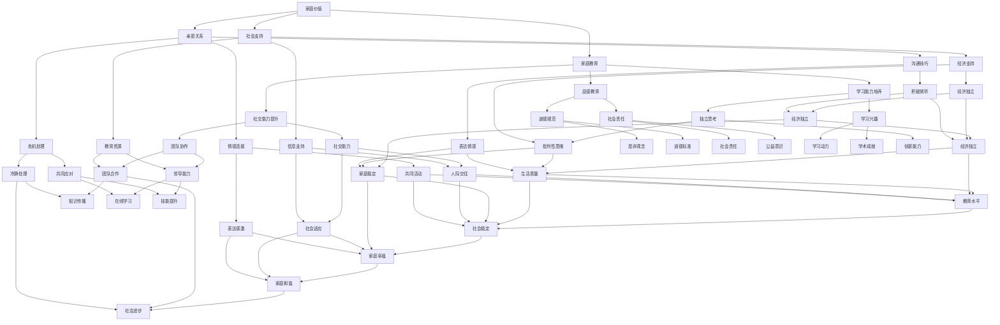

                 

### 第1章 引言

#### 1.1 家庭价值的定义与演变

家庭，作为社会的基本单元，承载了传承文化、教育后代、维系情感等重要功能。家庭价值，是指家庭成员之间所遵循的道德规范、行为准则以及共同的生活信念。传统的家庭价值观念通常以孝道、忠诚、和谐为核心，强调家庭内部的长幼尊卑和责任担当。

随着现代社会的发展，家庭价值观念也在不断演变。从传统的一元化家庭模式，到现代社会中的多元化家庭结构，家庭价值面临着新的挑战和机遇。现代家庭不再局限于传统的“三口之家”，而是扩展到单亲家庭、重组家庭、跨国家庭等不同形式。这种结构的变化，使得家庭价值的内涵和外延都发生了显著的变化。

在现代社会中，家庭价值的挑战主要体现在以下几个方面：

1. **婚姻观念的转变**：传统的婚姻观念强调婚姻的神圣性和稳定性，而现代社会中，离婚率上升、婚前同居等现象增多，婚姻观念发生了显著的转变。
2. **亲密关系的维护**：随着社会压力的增大，家庭成员之间的亲密关系面临新的挑战，如何维护良好的亲密关系成为现代社会的重要课题。
3. **家庭责任与个人成长的平衡**：现代家庭中，家庭成员既要承担家庭责任，又要追求个人成长和职业发展，如何在两者之间找到平衡成为家庭价值重建的重要问题。

家庭价值的重要性在于它不仅关系到家庭的稳定和幸福，也对社会整体的和谐与进步产生深远影响。一个具有健康家庭价值的家庭，能够为社会的可持续发展提供坚实的支撑。

#### 1.2 亲密关系的本质与重要性

亲密关系，是家庭价值的重要组成部分。它不仅涉及夫妻之间的情感纽带，还涵盖了家庭成员之间的相互理解和支持。亲密关系的本质，是一种深层次的情感联结，它建立在信任、尊重和关爱的基础上。

在现代社会中，亲密关系的重要性不容忽视。首先，亲密关系对家庭稳定起着关键作用。一个家庭如果缺乏亲密关系，家庭成员之间的摩擦和冲突就会增加，家庭的凝聚力也会削弱。相反，良好的亲密关系能够促进家庭成员之间的和谐相处，增强家庭稳定性。

其次，亲密关系对子女的成长也具有重要影响。在一个充满爱和关怀的家庭环境中，子女更容易形成健康的人格和价值观。亲密关系能够为子女提供情感支持，帮助他们应对成长中的各种挑战和压力。研究表明，在亲密关系良好的家庭中，子女的心理健康水平普遍较高，学业表现也更为优秀。

最后，亲密关系还对家庭成员的个人幸福感产生深远影响。一个和谐的家庭关系，能够为家庭成员提供心理上的安全感，减轻生活和工作中的压力。在亲密关系的滋养下，家庭成员能够感受到彼此的关心和支持，从而提升整体幸福感。

因此，重建亲密关系不仅是家庭价值的重要体现，也是现代家庭面临的紧迫任务。通过建立和维护良好的亲密关系，家庭能够更好地应对社会变革带来的挑战，为家庭成员的幸福和成长提供坚实的保障。

#### 1.3 重建亲密关系的必要性

在现代社会中，重建亲密关系显得尤为重要。随着经济的发展和社会的变革，家庭成员之间的互动模式发生了显著变化，这种变化给亲密关系带来了新的挑战。

首先，社会压力的增大是重建亲密关系的重要原因之一。现代社会中，人们面临的工作压力、生活压力不断增加，这导致了家庭成员之间的沟通时间减少，情感交流不足。长时间的分离和缺乏有效的沟通，使得亲密关系变得脆弱。

其次，技术发展也对亲密关系产生了深远影响。虽然互联网和社交媒体为人们提供了便捷的沟通方式，但过度依赖这些工具反而可能削弱了现实生活中的人际互动。虚拟沟通难以替代面对面的交流和情感表达，这无疑对亲密关系的维护构成了挑战。

此外，家庭结构的多样化也使得重建亲密关系变得更加复杂。现代家庭可能由不同背景、不同文化背景的成员组成，如何在多元化的家庭环境中建立和谐的亲密关系，成为新的课题。

重建亲密关系的必要性还体现在家庭成员的个人需求上。在现代社会中，每个人都在追求个人成长和自我实现，这使得家庭成员之间如何平衡个人需求和共同生活的关系变得更加重要。重建亲密关系，可以帮助家庭成员更好地理解和支持彼此，从而实现家庭内部的和谐与稳定。

总的来说，重建亲密关系是应对现代社会变革的必要举措。只有通过积极的努力，建立和维护良好的亲密关系，家庭才能在复杂的现代社会中找到自己的平衡点，为家庭成员的幸福和成长提供坚实的保障。

#### 1.4 重建亲密关系的意义

重建亲密关系不仅在家庭层面上具有深远意义，也在社会层面上具有重要价值。在家庭层面，亲密关系的重建能够促进家庭成员之间的理解和信任，增强家庭的凝聚力。一个充满爱和关怀的家庭环境，有助于子女形成健康的人格和价值观，提高家庭成员的整体幸福感。

在社会层面，家庭是社会的细胞，家庭的稳定和幸福对社会整体的和谐与进步具有积极作用。重建亲密关系能够减少家庭冲突，降低离婚率，从而减少社会不稳定因素。此外，一个具有健康亲密关系的家庭，其成员更愿意积极参与社会活动，促进社会的整体发展。

总的来说，重建亲密关系不仅是为了家庭的幸福和稳定，也是为了社会的可持续发展。通过重建亲密关系，家庭和社会都能够实现更为和谐的发展，共同迎接未来挑战。

### 第2章 现代社会中的家庭变革

#### 2.1 家庭结构的变迁

现代社会中，家庭结构的变迁成为不可忽视的课题。从传统的“大家庭”到现代的“小家庭”，再到多样化的新型家庭结构，家庭结构的变化反映了社会变迁和家庭价值观的演变。

首先，家庭规模的变化是一个显著特征。传统的大家庭模式通常包括多代同堂、兄弟姐妹众多，而现代社会中，随着城市化进程的加快和生育政策的调整，家庭规模逐渐缩小，核心家庭（夫妻及未成年子女）成为主流。这种变化不仅影响了家庭的经济负担和资源分配，也改变了家庭成员之间的互动模式。

其次，家庭关系的多样性也日益明显。现代社会中，单亲家庭、再婚家庭、同性婚姻家庭等新型家庭结构逐渐增多，打破了传统家庭的单一性和同质性。这些多样化家庭结构不仅体现了家庭价值观的多元化，也对家庭内部的亲密关系提出了新的挑战和机遇。

最后，家庭功能的变化也是不可忽视的趋势。在传统家庭中，家庭主要承担着生育、教育和经济支持等基本功能。而现代社会中，家庭功能逐渐扩展，包括情感支持、个人成长和职业发展等方面。家庭成员之间的关系更加平等和互相依赖，这种变化对家庭价值观念和亲密关系的维护提出了更高的要求。

总的来说，家庭结构的变迁不仅反映了社会经济的发展和人们生活方式的变化，也对家庭价值观念和亲密关系的维护产生了深远影响。了解这些变化，有助于我们更好地应对现代社会中的家庭挑战，重建健康的家庭价值。

#### 2.2 婚姻与亲密关系的挑战

在现代社会中，婚姻与亲密关系面临着诸多挑战，这些挑战不仅影响家庭的稳定性，也对家庭成员的幸福产生深远影响。

首先，婚姻观念的转变是一个显著特征。随着社会的发展和个人主义价值观的兴起，越来越多的人开始质疑婚姻的传统意义。离婚率上升、婚前同居现象增多，这些都反映了婚姻观念的变化。许多人不再将婚姻视为人生的必经阶段，而是更倾向于根据个人感受和需要来决定是否结婚。这种变化对婚姻关系的稳定性提出了挑战。

其次，亲密关系的维护也面临新的难题。现代社会中，家庭成员之间的沟通时间减少，情感交流不足。工作压力、生活节奏加快，使得夫妻之间很难找到共同的时间进行深入的交流和互动。此外，互联网和社交媒体的普及，虽然为人们提供了便捷的沟通方式，但也可能导致现实生活中的情感联系变得淡漠。虚拟沟通难以替代面对面的交流和情感表达，这对亲密关系的维护构成了挑战。

另外，社会变革和家庭结构的变化也对婚姻与亲密关系产生了影响。现代家庭结构的多样性，如单亲家庭、再婚家庭和跨国家庭等，使得婚姻与亲密关系的维护更加复杂。家庭成员之间的文化背景、价值观念的差异，增加了家庭内部的冲突和矛盾，也对亲密关系的稳定性提出了更高的要求。

最后，个人成长与家庭责任的平衡也是一个重要的挑战。现代社会中，每个人都在追求个人成长和自我实现，这使得家庭成员之间的责任和期望变得更加复杂。如何在个人追求和家庭责任之间找到平衡，是维持婚姻和亲密关系稳定的重要课题。

总的来说，婚姻与亲密关系在现代社会中面临诸多挑战，这些挑战不仅影响家庭的稳定性，也对家庭成员的幸福产生深远影响。了解这些挑战，有助于我们更好地应对现代社会中的婚姻和亲密关系难题，重建健康的家庭价值。

#### 2.3 家庭责任与个人成长的平衡

在现代社会中，家庭责任与个人成长的平衡成为家庭成员面临的重要课题。随着社会的发展和个人价值观的转变，家庭成员不仅需要承担家庭责任，还要追求个人成长和职业发展。如何在这两者之间找到平衡，成为维持家庭稳定和个人幸福的关键。

首先，家庭责任与个人成长之间的关系是相互依存的。家庭责任通常包括照顾子女、维护家庭经济和情感支持等方面，这些责任是家庭稳定和幸福的基础。然而，个人成长和职业发展同样重要，它们能够为家庭成员提供成就感和满足感，促进个人幸福和自我实现。

为了在家庭责任与个人成长之间找到平衡，家庭成员可以采取以下策略：

1. **有效沟通**：家庭成员之间需要保持开放和诚实的沟通，共同讨论家庭责任和个人成长的期望。通过沟通，可以更好地理解彼此的需求和期望，找到共同的支持和解决方案。

2. **时间管理**：合理规划时间，确保既能完成家庭责任，又有足够的时间进行个人成长和职业发展。例如，可以设定家庭活动和个人学习的时间，确保两者都能得到充分关注。

3. **分担责任**：在家庭内部，合理分担责任，让每个家庭成员都能参与家庭事务，减轻个体的负担。例如，夫妻可以共同分担家务和照顾子女的责任，从而有更多的时间专注于个人成长。

4. **支持与鼓励**：家庭成员之间需要相互支持和鼓励，特别是在对方追求个人成长和职业发展时。通过鼓励和支持，可以增强家庭成员的信心和动力，促进家庭内部的和谐与稳定。

总的来说，家庭责任与个人成长的平衡是一个复杂而重要的课题。通过有效的沟通、合理的时间管理和相互支持，家庭成员可以在家庭责任和个人成长之间找到平衡，实现家庭稳定和个人幸福。

#### 2.4 家庭价值重建的理论基础

家庭价值重建是一个复杂的过程，需要扎实的理论基础来指导实践。以下是家庭价值重建的主要理论基础，包括家庭系统的概念、亲密关系的心理学理论以及家庭价值重建的策略。

##### 2.4.1 家庭系统的概念与功能

家庭系统理论是家庭价值重建的重要理论基础之一。家庭系统理论认为，家庭是一个由多个个体组成的动态系统，每个家庭成员都与其他成员相互影响。家庭系统的功能主要体现在以下几个方面：

1. **情感支持**：家庭为成员提供情感上的支持，帮助他们应对生活中的压力和挑战。这种支持有助于增强家庭成员的归属感和安全感。
2. **资源分配**：家庭系统负责分配家庭资源，包括经济资源、时间和精力。合理分配资源可以促进家庭内部的和谐与稳定。
3. **社会化和教育**：家庭是儿童社会化的重要场所，通过家庭教育和互动，儿童学习社会规范和价值观，形成健康的人格和价值观。
4. **决策和解决问题**：家庭系统通过共同的决策和协作解决问题，增强家庭的凝聚力和适应性。

了解家庭系统的概念和功能，有助于我们更好地理解家庭价值的形成和变化，从而为家庭价值重建提供指导。

##### 2.4.2 亲密关系的心理学理论

亲密关系心理学是研究家庭成员之间情感联结和互动的科学。以下是几个重要的亲密关系心理学理论：

1. **情感依恋理论**：情感依恋理论认为，婴儿与父母之间的情感联结对其成长至关重要。这种依恋关系不仅影响儿童的早期发展，也影响他们成年后的亲密关系。

2. **沟通理论**：沟通是亲密关系中的核心要素。有效的沟通能够增强家庭成员之间的理解和信任，减少冲突和误解。沟通理论提供了多种沟通技巧，如积极倾听、表达情感、非暴力沟通等，以帮助家庭成员建立和维护良好的亲密关系。

3. **冲突解决理论**：冲突是家庭中不可避免的现象，但如何处理冲突对亲密关系至关重要。冲突解决理论提供了多种策略，如协商、妥协和回避，以帮助家庭成员有效地处理冲突，维护亲密关系。

##### 2.4.3 家庭价值重建的策略

家庭价值重建需要系统的策略和实际行动。以下是几个重要的家庭价值重建策略：

1. **建立情感联结**：通过共同的兴趣爱好、情感交流和相互支持，建立和强化家庭成员之间的情感联结。

2. **增强沟通技巧**：通过培训和学习沟通技巧，提高家庭成员之间的沟通效率，减少误解和冲突。

3. **制定家庭规则**：制定明确的家庭规则和期望，帮助家庭成员建立一致的行为准则，增强家庭凝聚力。

4. **平衡家庭责任与个人成长**：通过合理分工和共同参与，实现家庭责任与个人成长的平衡，确保每个家庭成员都能得到关注和支持。

5. **寻求专业支持**：在家庭价值重建过程中，可以寻求心理咨询师、社工等专业人士的支持，帮助他们解决家庭内部的问题，提供专业的建议和指导。

综上所述，家庭价值重建的理论基础包括家庭系统的概念与功能、亲密关系的心理学理论和具体的重建策略。通过理解和应用这些理论，我们可以更好地实施家庭价值重建，促进家庭的和谐与幸福。

#### 2.5 家庭价值重建的实践方法

家庭价值重建不仅需要理论支持，更需要具体的实践方法。以下是一些有效的家庭价值重建实践方法，包括沟通技巧的提升、情感连接的增强以及危机处理的技巧。

##### 2.5.1 沟通技巧的提升

沟通技巧是建立和维护良好家庭关系的关键。以下是一些提升沟通技巧的方法：

1. **积极倾听**：在沟通中，积极倾听比表达自己的意见更重要。通过认真倾听对方的观点，可以更好地理解对方的情感和需求，减少误解和冲突。

2. **表达情感**：学会表达自己的情感，而不是压抑或发泄。通过明确、具体地表达情感，可以增进家庭成员之间的理解和信任。

3. **非暴力沟通**：使用非暴力沟通技巧，如“I”语句（例如，“我感到...因为...我需要...”，而不是“你让我...”），可以帮助家庭成员避免指责和攻击，建立建设性的对话。

4. **定期家庭会议**：定期召开家庭会议，让每个家庭成员都有机会表达自己的看法和需求。这不仅可以增进家庭成员之间的沟通，还可以提高家庭决策的透明度和参与度。

##### 2.5.2 情感连接的增强

情感连接是家庭关系的核心。以下是一些增强情感连接的方法：

1. **共同活动**：参与共同的活动，如一起做饭、看电影或户外运动，可以增进家庭成员之间的情感互动和亲密感。

2. **表达感激**：经常表达对家庭成员的感激和欣赏，可以增强家庭成员之间的情感联系和归属感。

3. **情感支持**：在家庭成员遇到困难或挑战时，提供情感支持，让他们感受到家庭的温暖和力量。

4. **维护个人空间**：在增强情感连接的同时，也要尊重每个家庭成员的个人空间和隐私，这有助于维持健康的家庭关系。

##### 2.5.3 危机处理的技巧

家庭中难免会遇到各种危机，如何处理这些危机对于维护家庭稳定至关重要。以下是一些危机处理的技巧：

1. **冷静处理**：在危机发生时，保持冷静，避免情绪化的反应，这有助于更好地分析和解决问题。

2. **共同应对**：家庭成员共同面对危机，共同制定解决方案，这可以增强家庭的凝聚力。

3. **寻求专业帮助**：如果危机难以解决，可以寻求专业心理咨询师或社工的帮助，他们可以提供专业的建议和支持。

4. **危机后的恢复**：危机过后，帮助家庭成员恢复情绪，重建信任和亲密感，这是重建家庭价值的必要步骤。

综上所述，家庭价值重建的实践方法包括提升沟通技巧、增强情感连接以及危机处理的技巧。通过这些具体的方法，家庭可以更好地应对现代社会的挑战，重建健康的家庭价值。

#### 4.1 重建亲密关系的重要性

重建亲密关系在现代社会中具有不可忽视的重要性。首先，亲密关系对家庭稳定起着关键作用。在现代社会，家庭成员面临的生活和工作压力不断增加，亲密关系良好的家庭能够更好地应对这些压力，减少家庭内部的摩擦和冲突，增强家庭的凝聚力。

其次，重建亲密关系对子女的成长具有重要影响。在一个充满爱和关怀的家庭环境中，子女能够得到充分的情感支持，这对他们的心理健康和人格发展至关重要。亲密关系良好的家庭，能够为子女提供稳定的成长环境，帮助他们形成健康的价值观和良好的社会适应能力。

最后，重建亲密关系对家庭成员的个人幸福感也有深远影响。良好的亲密关系能够为家庭成员提供情感上的支持和安全感，减轻生活和工作中的压力。在一个和谐的家庭环境中，每个成员都能感受到彼此的关心和支持，从而提高整体幸福感。

总的来说，重建亲密关系不仅是家庭稳定和个人幸福的基石，也是社会和谐与进步的重要保障。通过积极的努力，建立和维护良好的亲密关系，家庭和社会都能实现更为和谐的发展。

#### 4.2 提升亲密关系的策略

提升亲密关系需要系统性和持续的努力。以下是一些有效的策略，可以帮助家庭成员改善和加强彼此之间的亲密关系：

##### 4.2.1 沟通技巧的提升

沟通是亲密关系的核心。提升沟通技巧可以从以下几个方面入手：

1. **积极倾听**：在对方讲话时，全身心投入，避免打断，用肢体语言和表情反馈表示理解。积极倾听能够增进彼此的理解和信任。

2. **表达情感**：学会用“I”语言表达情感，如“I感到...因为...”，而不是指责对方，这有助于减少冲突，增强亲密感。

3. **定期交流**：设定固定的交流时间，如每天晚上一起聊天，分享一天中的经历和感受，有助于保持沟通的连贯性和深度。

4. **解决冲突**：学习冲突解决技巧，如冷静讨论、避免指责和攻击，寻找共同点和解决方案，有助于维护亲密关系。

##### 4.2.2 情感连接的增强

增强情感连接可以采取以下措施：

1. **共同活动**：参与共同的活动，如一起做饭、看电影、旅行等，可以增进情感互动和亲密感。

2. **表达感激**：经常表达对对方的感激和赞赏，如“感谢你帮我完成了这项任务”或“我很感激你每天早起做早餐”。这些简单的表达能够增强情感连接。

3. **身体接触**：适当的身体接触，如拥抱、牵手等，可以传达关心和爱意，增强情感纽带。

4. **维护个人空间**：在增强情感连接的同时，也要尊重彼此的个人空间，这有助于保持关系的平衡和健康。

##### 4.2.3 危机处理的技巧

在家庭生活中，难免会遇到各种危机和冲突。学会处理危机是维护亲密关系的重要一环：

1. **冷静处理**：在危机发生时，保持冷静，避免情绪化的反应，这有助于更理性地分析和解决问题。

2. **共同应对**：危机面前，家庭成员应携手面对，共同寻找解决方案，这有助于增强家庭的凝聚力和信任。

3. **寻求专业帮助**：如果危机难以自行解决，可以寻求心理咨询师或社工的帮助，他们可以提供专业的指导和支持。

4. **危机后的恢复**：危机过后，帮助家庭成员恢复情绪，重建信任和亲密感。可以通过共同活动、深入交流等方式，修复关系，增强家庭的稳定性。

总的来说，提升亲密关系需要家庭成员共同努力，通过有效的沟通技巧、情感连接和危机处理策略，可以建立和维护一个和谐、稳定的家庭环境。通过这些努力，家庭成员之间的亲密关系将更加紧密，家庭的幸福感也将得到提升。

#### 4.3 实例分析：重建亲密关系的成功案例

为了更好地理解重建亲密关系的实践过程和效果，以下是一个成功案例的分析。

##### 4.3.1 案例背景

张先生和李女士是一对结婚多年的夫妇，他们在事业发展上都很成功，但近年来，由于工作压力和家庭责任的增加，两人之间的亲密关系逐渐疏远。每天回到家，他们更多的是在忙碌于各自的事情，很少有时间进行深入的交流和互动。这导致了双方的情感需求得不到满足，家庭气氛也变得紧张。经过反思，他们意识到需要采取措施来重建亲密关系。

##### 4.3.2 案例分析

张先生和李女士决定采取以下措施来重建他们的亲密关系：

1. **设定固定交流时间**：他们约定每天晚上7点到8点为家庭交流时间，在这段时间内，他们关掉手机和其他电子设备，专注于彼此的交流和分享。

2. **积极倾听和表达情感**：在交流过程中，他们学会了使用“I”语言表达自己的感受和需求，如“我感到孤独，因为我希望你能多和我分享你的工作和生活”。

3. **共同活动**：他们开始一起规划周末活动，如一起做晚餐、看电影或进行户外运动。这些共同活动不仅增进了他们的情感连接，也缓解了日常生活的压力。

4. **表达感激**：每天晚上，他们会轮流分享彼此对对方的感激之情，如“谢谢你今天帮我照顾孩子，让我有更多的时间休息”。

5. **寻求专业帮助**：在尝试自我调整一段时间后，他们决定寻求心理咨询师的帮助。心理咨询师提供了专业的建议和指导，帮助他们解决了深层次的沟通问题。

##### 4.3.3 案例总结

通过一系列的努力，张先生和李女士的亲密关系得到了显著改善。他们发现，通过设定固定的交流时间、积极倾听和表达情感、共同活动以及表达感激，他们之间的沟通变得更加顺畅，情感连接也得到了增强。专业的心理咨询也帮助他们解决了深层次的沟通问题，增强了他们的信任和安全感。

这个案例表明，重建亲密关系需要家庭成员的共同努力和持续投入。通过有效的沟通技巧、情感连接和危机处理策略，家庭可以重拾和谐与幸福。同时，这个案例也提醒我们，在家庭关系中，专业支持是一个重要而有效的补充。

#### 4.4 家庭教育在重建家庭价值中的角色

家庭教育在重建家庭价值中扮演着至关重要的角色。它不仅影响子女的成长和价值观的形成，还关系到家庭的和谐与稳定。以下是家庭教育在重建家庭价值中的核心内容和实施方法。

##### 4.4.1 家庭教育的核心内容

1. **品德教育**：品德教育是家庭教育的核心内容之一。通过树立正确的是非观念、培养良好的道德品质，如诚实、尊重、关爱和责任感，家庭成员能够形成健康的人格和价值观。

2. **学习能力培养**：家庭教育不仅要关注子女的学业成绩，还要培养他们的学习兴趣和独立思考能力。通过激发学习兴趣、培养良好的学习习惯和提供适当的学习资源，可以帮助子女更好地适应未来的挑战。

3. **社交能力提升**：社交能力是子女在未来社会中生存和发展的重要技能。通过家庭教育，子女可以学会如何与人相处、合作和沟通，从而提高他们的社交能力，增强社会适应能力。

##### 4.4.2 家庭教育的实施方法

1. **树立榜样**：家庭成员应该通过自己的行为为子女树立榜样。父母的行为习惯、价值观念和生活方式都会对子女产生深远影响。因此，家庭成员应该通过自己的行动来传递正确的价值观和行为准则。

2. **亲子互动**：亲子互动是家庭教育的重要组成部分。通过共同参与家庭活动、游戏和旅行等，家庭成员可以增进彼此的感情，同时也有助于子女在互动中学习和成长。

3. **沟通和引导**：家长应该与子女保持开放的沟通渠道，倾听他们的想法和需求，并给予积极的引导。通过有效的沟通，家长可以帮助子女理解社会规范和价值观，培养他们的判断力和决策能力。

4. **培养习惯**：良好的生活习惯对子女的成长至关重要。家长可以通过制定合理的作息时间、安排家庭作业和鼓励子女参与家务等方式，帮助子女养成良好的生活习惯。

5. **教育与陪伴**：家长不仅要在教育上给予关注，还要在陪伴上给予支持。在子女成长的关键阶段，家长应该给予足够的陪伴和时间，帮助他们度过成长中的困难和挑战。

通过上述方法，家庭教育可以在重建家庭价值中发挥重要作用。一个充满爱和关怀、有正确价值观和良好习惯的家庭，能够为子女提供坚实的成长基础，帮助他们成为有责任感、有担当的社会成员。

#### 4.5 家庭教育的方法与技巧

家庭教育在子女的成长过程中起着至关重要的作用。以下是几种有效的家庭教育方法与技巧，帮助家长培养孩子的品德、学习能力和社交能力。

##### 4.5.1 家庭教育的原则

1. **尊重与关爱**：尊重孩子是家庭教育的基础。家长应该尊重孩子的个性和选择，给予他们充足的关爱和支持，让孩子感受到家庭的温暖。

2. **一致性**：家长在教育孩子时，应保持一致性。明确的行为规范和一致的奖惩机制，有助于孩子理解和遵守家庭规则，建立良好的行为习惯。

3. **以身作则**：家长是孩子最直接的榜样。通过自己的言行举止，家长可以潜移默化地影响孩子，培养他们正确的价值观和行为准则。

4. **耐心与鼓励**：教育孩子需要耐心，尤其是面对孩子的错误和挫折时，家长应给予足够的理解和鼓励，帮助他们从失败中学习，增强自信。

##### 4.5.2 家庭教育的方法

1. **共同活动**：通过共同参与家庭活动，如做家务、一起购物、共进晚餐等，家长可以增进与孩子的情感交流，同时培养孩子的责任感和团队协作能力。

2. **引导式教育**：家长可以通过提问、讨论和引导孩子思考，激发他们的学习兴趣和独立思考能力。例如，在阅读时，家长可以提出问题，引导孩子理解和分析文本。

3. **情感教育**：情感教育是家庭教育的重要组成部分。家长可以通过讲述故事、分享自己的情感经历等方式，帮助孩子理解和表达情感，培养他们的情绪管理能力。

4. **榜样示范**：家长应该通过自己的言行举止为孩子树立榜样。例如，在孩子的面前保持礼貌、尊重他人，帮助他们理解社会规范和价值观。

##### 4.5.3 家庭教育的技巧

1. **有效沟通**：家长应学会与孩子进行有效沟通，包括倾听孩子的想法、表达自己的意见和感受，以及解决沟通中的冲突。通过良好的沟通，家长可以更好地了解孩子的需求和困惑，提供有针对性的帮助。

2. **鼓励与表扬**：在孩子取得进步和成就时，家长应及时给予鼓励和表扬。这不仅可以增强孩子的自信心，还可以激励他们继续努力。

3. **设定目标**：家长可以帮助孩子设定具体、可实现的短期和长期目标，并通过激励和监督，帮助他们实现目标，培养他们的自律能力和成就感。

4. **教育资源的利用**：家长可以利用各种教育资源，如图书、网络课程、课外辅导等，为孩子提供丰富的学习资源，帮助他们全面发展。

通过遵循家庭教育原则、采用有效的教育方法和技巧，家长可以为孩子创造一个充满爱和关怀的成长环境，帮助他们成为有责任感、有担当的社会成员。

#### 4.6 社会支持在家庭价值重建中的作用

社会支持在家庭价值重建中发挥着至关重要的作用。它不仅为家庭提供外部资源和支持，还能帮助家庭克服内部和外部的挑战，从而实现家庭价值的重建。以下是社会支持的概念、其在家庭价值重建中的作用以及如何构建有效的社会支持体系。

##### 4.6.1 社会支持的概念

社会支持是指社会网络和机构为个体和家庭提供的帮助和支持。这些支持可以来自家庭、朋友、社区、宗教组织、非政府组织以及政府机构等。社会支持的形式多种多样，包括情感支持、信息支持、经济支持、教育支持等。

##### 4.6.2 社会支持在家庭价值重建中的作用

1. **情感支持**：情感支持是家庭价值重建的重要组成部分。当家庭成员面临压力、困难和挑战时，来自亲朋好友、社区和专业人士的情感支持可以提供安慰、理解和支持，帮助他们缓解负面情绪，增强心理韧性。

2. **经济支持**：经济困难是家庭面临的常见问题。社会支持体系可以通过提供经济援助、就业培训、住房补贴等，帮助家庭摆脱经济困境，维护家庭的基本生活需求，从而有助于重建家庭价值。

3. **信息支持**：现代社会中，信息资源对于家庭价值重建也至关重要。通过提供教育资源、健康咨询、法律援助等，社会支持可以增强家庭成员的知识储备，帮助他们做出更明智的决策，改善家庭生活质量。

4. **教育支持**：教育支持是培养家庭成员价值观和能力的重要途径。社会支持体系可以通过提供儿童教育、成人继续教育、职业技能培训等，帮助家庭成员提升教育水平和就业能力，增强家庭的社会地位和自尊感。

##### 4.6.3 社会支持体系的构建

构建有效的社会支持体系需要多方面的努力：

1. **政府角色**：政府应承担起主导责任，制定相关政策，提供资金和资源支持，确保社会支持体系的建立和运行。

2. **社会组织参与**：非政府组织、社区组织和志愿者团体可以发挥重要作用，提供多样化的服务，如心理辅导、社区活动、法律援助等，为家庭提供更全面的支持。

3. **家庭互助**：家庭之间的互助也是社会支持体系的重要组成部分。通过建立家庭互助小组、社区支持网络等，家庭之间可以相互支持和帮助，共同应对生活中的挑战。

4. **教育资源整合**：整合和优化现有的教育资源，提供便捷、高质量的服务，如建立社区学习中心、在线教育资源等，帮助家庭提升教育水平和知识储备。

通过构建和优化社会支持体系，可以为家庭提供更多的外部资源和支持，帮助家庭克服困难和挑战，重建健康的家庭价值。这不仅能提高家庭成员的幸福感和生活质量，也能促进社会的和谐与进步。

#### 4.7 社区在家庭价值重建中的角色

社区在家庭价值重建中发挥着至关重要的作用。作为一个小型的社会单位，社区不仅为家庭提供日常生活的支持和资源，还通过多种形式促进家庭内部的和谐与稳定。以下是社区在家庭价值重建中的具体角色和作用。

##### 4.7.1 社区的定义与功能

社区是指生活在同一地理区域内，具有共同利益和相互关联的个体组成的集体。社区的功能主要包括以下几个方面：

1. **社会支持**：社区为居民提供情感上的支持，如邻里互助、社区活动等，帮助家庭在遇到困难时获得帮助和安慰。

2. **资源整合**：社区通过整合本地资源，如教育机构、医疗机构、公共设施等，为家庭提供便捷的服务和资源，提高家庭生活质量。

3. **社会参与**：社区通过组织各种活动和项目，鼓励居民参与社区建设，增强居民的社会归属感和责任感。

4. **社会教育**：社区通过举办教育讲座、培训课程等活动，提高居民的教育水平和知识储备，促进家庭内部的和谐与稳定。

##### 4.7.2 社区在家庭价值重建中的作用

1. **促进家庭凝聚力**：社区活动可以增进家庭成员之间的互动和交流，增强家庭的凝聚力。通过共同参与社区活动，家庭成员能够更好地了解彼此的需求和兴趣，促进家庭内部的和谐。

2. **提供教育资源**：社区可以通过建立社区图书馆、学习中心等，为家庭提供丰富的教育资源。这些资源不仅有助于子女的学习和成长，也有助于家长提升自身的教育水平和知识储备。

3. **支持家庭发展**：社区可以通过提供就业培训、职业咨询等服务，帮助家庭实现经济独立和自我发展。这有助于提高家庭的经济状况，增强家庭价值。

4. **危机干预**：在家庭成员面临危机时，社区可以提供及时的心理咨询和危机干预服务，帮助他们度过困难时期，维护家庭稳定。

5. **促进社区参与**：通过鼓励家庭参与社区活动，如志愿者服务、社区治理等，可以增强家庭成员的社会责任感和参与感，促进家庭与社区的良性互动。

总的来说，社区在家庭价值重建中发挥着不可或缺的作用。通过提供社会支持、教育资源、危机干预以及促进社区参与，社区可以促进家庭内部的和谐与稳定，为家庭成员的幸福和成长提供坚实的保障。

#### 4.8 政策支持在家庭价值重建中的作用

政策支持在家庭价值重建中扮演着至关重要的角色。政府的政策制定和实施不仅能够为家庭提供必要的资源和支持，还能通过制度化的方式推动家庭价值的重建。以下是政策支持在家庭价值重建中的具体措施、挑战以及应对策略。

##### 4.8.1 政策支持的种类

1. **经济补贴和福利**：政府可以通过提供经济补贴、福利援助等方式，帮助家庭缓解经济压力，提高生活质量。例如，提供低收入家庭的住房补贴、子女的教育补贴等。

2. **育儿支持**：政府可以通过设立育儿假期、提供育儿津贴等措施，支持家庭育儿，减轻家庭的经济负担。此外，政府还可以提供育儿培训和咨询服务，帮助父母更好地照顾和教育子女。

3. **家庭政策**：政府可以通过制定和实施家庭政策，如婚姻家庭法、家庭支持法等，明确家庭在法律上的权利和义务，推动家庭价值的规范化和制度化。

4. **社区建设**：政府可以通过投资社区建设，如修建社区中心、公园等，提供家庭休闲娱乐的场所，增强社区的功能，促进家庭价值的传承和弘扬。

##### 4.8.2 政策支持在家庭价值重建中的具体措施

1. **制定和实施家庭政策**：政府应制定和实施一系列家庭政策，如家庭税收优惠、家庭育儿支持等，为家庭提供经济上的支持和保障。

2. **提供公共服务**：政府应提供高质量的公共服务，如教育、医疗、社会保障等，确保家庭能够得到必要的资源和帮助。

3. **推动社区发展**：政府应推动社区发展，增强社区的功能和服务能力，为家庭提供更多的支持。

4. **加强家庭教育和指导**：政府可以通过设立家庭教育机构、提供家庭教育指导服务，帮助家庭提升教育水平和家庭教育能力。

##### 4.8.3 政策支持的挑战与应对策略

1. **资源有限**：政府面临资源有限的挑战，需要合理分配资源，确保政策支持的公平性和有效性。

2. **政策执行难度**：政策在执行过程中可能遇到各种挑战，如政策理解不足、执行效率低等。政府应加强政策宣传和培训，提高政策执行的效率和效果。

3. **社会接受度**：政策支持需要得到社会的广泛接受和支持。政府应加强与公众的沟通，提高政策的透明度和可接受性。

4. **持续监督和评估**：政府应建立持续监督和评估机制，确保政策支持的有效性和可持续性。

通过采取上述措施和策略，政府可以更好地发挥政策支持在家庭价值重建中的作用，为家庭提供必要的资源和支持，促进家庭价值的重建和传承。

#### 4.9 家庭教育在子女成长过程中的关键作用

家庭教育在子女的成长过程中扮演着至关重要的角色。它是子女形成健全人格、培养积极态度和掌握基本生活技能的基石。以下是家庭教育在子女成长过程中的关键作用、具体实践方法和实际效果。

##### 4.9.1 家庭教育在子女成长过程中的关键作用

1. **价值观塑造**：家庭教育是子女树立正确价值观的重要途径。通过家庭教育和榜样示范，子女能够学习到道德规范、社会责任和人生目标，形成健康的人格和价值观。

2. **习惯培养**：良好的生活习惯对子女的成长至关重要。家庭教育可以通过制定日常作息、设定学习目标、培养兴趣爱好等方式，帮助子女养成自律、勤奋和健康的生活习惯。

3. **情感支持**：家庭是子女情感需求的第一个来源。通过家庭教育和情感交流，子女能够获得安全感、信任感和归属感，这对于他们的心理健康和情绪管理具有重要作用。

4. **学习能力提升**：家庭教育不仅关注学业成绩，更注重子女的学习能力和方法。家长可以通过引导式教育和互动学习，提高子女的学习兴趣和独立思考能力，为他们未来的学习和职业发展奠定基础。

##### 4.9.2 家庭教育的具体实践方法

1. **亲子互动**：家长应与子女建立良好的亲子关系，通过共同活动、游戏和交流，增进彼此的感情，培养子女的社交能力和合作精神。

2. **榜样示范**：家长是子女最重要的榜样，通过自己的言行举止，家长可以潜移默化地影响子女的行为和态度。例如，保持礼貌、尊重他人、勤奋工作等，都能为子女树立良好的榜样。

3. **情感教育**：家长应重视情感教育，与子女进行开放、诚实的交流，帮助他们理解和表达情感，培养良好的情绪管理能力。

4. **家庭读书会**：通过家庭读书会，家长可以与子女一起阅读、讨论，提高他们的阅读能力和理解能力，培养他们的学习兴趣和习惯。

5. **设定目标**：家长可以帮助子女设定具体、可实现的短期和长期目标，并通过激励和监督，帮助他们实现目标，培养他们的自律能力和成就感。

##### 4.9.3 家庭教育的实际效果

1. **子女的学业成绩提高**：通过家庭教育和有效的学习指导，子女的学业成绩普遍提高，学习兴趣和动力增强。

2. **子女的社会适应能力增强**：良好的家庭教育能够帮助子女更好地适应社会环境，培养他们的社交能力和团队合作精神。

3. **子女的心理健康水平提升**：在充满关爱和支持的家庭环境中，子女的心理健康水平显著提高，情绪稳定，自信乐观。

4. **家庭的和谐与稳定**：家庭教育不仅关注子女的成长，也促进了家庭的和谐与稳定。家庭成员之间的关系更加紧密，家庭氛围更加温馨和谐。

总之，家庭教育在子女成长过程中具有关键作用。通过有效的实践方法和持续的努力，家长可以为子女提供良好的成长环境，帮助他们成为有责任感、有担当的社会成员。

### 第7章 结论

#### 7.1 家庭价值重建的重要性

家庭价值重建在现代社会中具有至关重要的意义。首先，家庭是社会的细胞，家庭价值的稳定和健康直接影响社会的和谐与进步。随着社会变革和价值观的多元化，传统的家庭价值观念受到了冲击，重建家庭价值成为应对这一挑战的必要举措。

家庭价值重建不仅关系到每个家庭的幸福和稳定，也对社会的整体发展产生深远影响。一个具有健康家庭价值的家庭，能够为子女提供良好的成长环境，培养出有责任感、有担当的社会成员。此外，家庭价值的重建有助于增强家庭的凝聚力，减少家庭冲突和矛盾，从而提高社会整体的稳定性。

#### 7.2 家庭价值重建的策略与实践

家庭价值重建需要系统的策略和实践。以下是几个关键策略和实践方法：

1. **强化家庭教育**：家庭教育是家庭价值重建的基础。家长应注重品德教育、学习能力培养和情感支持，为子女提供全面的教育和关爱。

2. **提高沟通技巧**：沟通是家庭关系的核心。家庭成员应学会有效沟通，避免冲突和误解，增强彼此的理解和支持。

3. **增强社区支持**：社区是家庭的重要外部支持系统。通过加强社区建设，提供教育资源、心理健康咨询和社会服务，可以为家庭提供更多的支持和帮助。

4. **政策支持**：政府应制定和实施相关政策，为家庭提供经济援助、育儿支持和法律保障，为家庭价值重建提供制度化的支持。

5. **加强社会宣传**：通过社会宣传和教育活动，提高公众对家庭价值的认识和重视，营造有利于家庭价值重建的社会氛围。

#### 7.3 家庭价值重建的未来展望

随着社会的发展，家庭价值重建面临着新的机遇和挑战。未来，我们需要更加关注以下几个方面：

1. **技术创新**：利用现代科技手段，如互联网、人工智能等，为家庭提供更多的教育资源和沟通工具，促进家庭价值的传承和弘扬。

2. **文化多样性的融合**：在多元化文化背景下，家庭价值重建需要尊重和融合不同的文化观念，推动家庭内部的和谐与稳定。

3. **持续的社会参与**：家庭价值重建不仅是家庭内部的事务，也需要社会各界的广泛参与。通过社会各界的共同努力，可以为家庭提供更多的支持，推动家庭价值的重建。

4. **政策完善**：政府应不断调整和完善相关政策，适应社会发展的需求，为家庭提供更有效的支持和保障。

总之，家庭价值重建是一个长期而复杂的过程，需要家庭成员、社区和社会的共同努力。通过有效的策略和实践，我们可以重建健康的家庭价值，为社会的可持续发展提供坚实的支撑。

### 附录

#### 附录 A: 相关资源与参考资料

**A.1 学术文献**

1. **Bowlby, J. (1969).* Attachment and Loss, Vol. 1: Attachment.*
2. **Baker, L. (1980).* Family Process in Psychotherapy: A Cognitive-Behavioral Systems Approach.*
3. **Erikson, E. H. (1950).* Childhood and Society.*

**A.2 书籍推荐**

1. **Schechter, H. (2009).* The Science of Parenting: How to Raise a Smart, Happy, and Amazing Child from Birth to Age Five.*
2. **Diamond, L. S. (2010).* Play: How It Shapes the Brain, Opens the Imagination, and Invigorates the Soul.*

**A.3 在线资源链接**

1. **National Institute of Child Health and Human Development (NICHD)*: [www.nichd.nih.gov]
2. **National Parenting Education Network (NPEA)*: [www.npea.org]

通过这些资源，读者可以进一步了解家庭价值重建的相关理论和实践方法，为家庭价值的重建提供有益的参考和指导。

### 绘制家庭价值核心概念与联系流程图（Mermaid）

此Mermaid流程图展示了家庭价值、亲密关系、家庭教育和社会支持之间的核心概念及其相互联系，为理解和实施家庭价值重建提供了一个直观的框架。通过这样的结构图，读者可以更好地把握家庭价值重建的各个方面及其相互影响。

