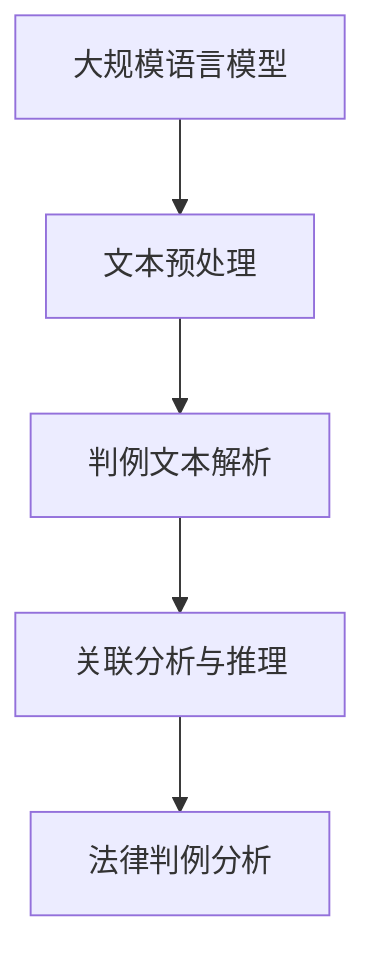

                 

## 引言

随着人工智能技术的飞速发展，大规模语言模型（Large-scale Language Models）在自然语言处理（Natural Language Processing, NLP）领域取得了显著的成果。这些模型通过学习海量文本数据，具备了强大的文本理解、生成和推理能力，广泛应用于机器翻译、文本分类、问答系统等领域。然而，大规模语言模型在法律判例分析中的应用却是一个相对较新的领域，且具有巨大的潜力。

法律判例分析在法律研究和司法实践中具有至关重要的地位。通过对大量法律判例进行分析，法律专业人士可以更好地理解和应用法律原则，提高法律决策的准确性和效率。然而，法律文本具有复杂性和多样性，传统的法律分析方法在处理大量文本时效率低下，难以满足快速发展的法律需求。因此，如何利用人工智能技术，特别是大规模语言模型，来提升法律判例分析的能力，成为了一个亟待解决的重要问题。

本文旨在探讨大规模语言模型在法律判例分析中的推理应用，通过以下几部分内容展开：

1. **大规模语言模型概述**：介绍大规模语言模型的基本概念、发展历程和技术原理。
2. **大规模语言模型在法律判例分析中的应用**：分析法律判例分析的需求与挑战，探讨大规模语言模型的应用优势与局限性。
3. **大规模语言模型在法律判例分析中的应用实例**：通过具体的案例，展示大规模语言模型在法律判例分析中的应用过程和实现方法。

通过本文的探讨，我们希望能够为人工智能在法律领域的应用提供一些有益的启示，推动人工智能与法律领域的深度融合。

### 关键词

- 大规模语言模型
- 法律判例分析
- 自然语言处理
- 推理应用
- 文本预处理
- 机器学习算法

### 摘要

本文探讨了大规模语言模型在法律判例分析中的推理应用。首先，介绍了大规模语言模型的基本概念、发展历程和技术原理。接着，分析了法律判例分析的需求与挑战，并探讨了大规模语言模型在法律判例分析中的应用优势与局限性。最后，通过具体案例，展示了大规模语言模型在法律判例分析中的应用过程和实现方法，进一步验证了其在法律文本处理和推理分析中的潜力。本文的研究为人工智能在法律领域的应用提供了新的思路和方向。

### 第一部分：大规模语言模型概述

#### 第1章：大规模语言模型基础

##### 1.1 大规模语言模型的概念与特点

大规模语言模型（Large-scale Language Models）是一种基于深度学习和自然语言处理（Natural Language Processing, NLP）技术的模型，能够通过学习海量文本数据，生成和理解自然语言文本。其核心目标是通过预测下一个词或词组来建模语言的统计规律和语义结构。

**定义**：大规模语言模型是一种通过大规模文本数据训练的神经网络模型，用于理解和生成自然语言文本。这些模型通常采用多层神经网络结构，通过自下而上的方式处理文本数据，逐步提取特征，从而实现对文本的深层理解和生成能力。

**特点**：

1. **数据量巨大**：大规模语言模型需要学习海量文本数据，通常包括数亿甚至数十亿的句子，以充分捕捉语言的多样性和复杂性。
2. **参数数量庞大**：为了处理海量的文本数据，大规模语言模型通常包含数百万甚至数十亿个参数，这使得模型能够捕捉到更复杂的语言规律和语义信息。
3. **多层级结构**：大规模语言模型通常采用多层神经网络结构，包括编码器（Encoder）和解码器（Decoder），能够同时处理文本的局部和全局特征。
4. **端到端学习**：大规模语言模型通过端到端的学习方式，直接从原始文本数据中学习到文本的表示和生成能力，无需人工设计特征和中间层。
5. **自适应能力**：大规模语言模型具有良好的自适应能力，能够根据不同的任务和数据集进行调整和优化，适用于各种自然语言处理任务。

##### 1.2 大规模语言模型的发展历程

大规模语言模型的发展经历了从传统的统计模型到现代的深度学习模型的演进过程。以下是大规模语言模型的发展历程：

1. **传统统计模型**：
   - **n-gram模型**：基于语言统计的简单模型，通过计算词的序列概率进行文本生成和理解。虽然n-gram模型在处理文本方面有一定的效果，但存在长文本依赖性差、预测准确性低等问题。
   - **隐马尔可夫模型（HMM）**：利用状态转移概率和发射概率，对文本序列进行建模，能够处理一些语言结构信息，但受限于模型复杂度和计算效率。

2. **基于统计的语言模型**：
   - **统计语言模型**：结合n-gram模型和隐马尔可夫模型的优势，利用词序列的统计规律进行文本建模，提高了预测准确性和文本理解能力。
   - **感知机模型**：通过训练词向量，将词映射到高维空间，通过计算词之间的相似性进行文本分类和语义分析。

3. **基于深度学习的语言模型**：
   - **循环神经网络（RNN）**：通过循环结构处理序列数据，能够捕捉到长文本的依赖关系。然而，RNN存在梯度消失和梯度爆炸等问题。
   - **长短期记忆网络（LSTM）**：在RNN的基础上引入门控机制，解决了梯度消失问题，能够更好地捕捉长文本的依赖关系。
   - **门控循环单元（GRU）**：简化了LSTM的结构，同时保持了其优点，计算效率更高。

4. **大规模预训练模型**：
   - **Word2Vec**：通过神经网络学习词向量，将词映射到高维空间，能够捕捉到词的语义信息。
   - **GloVe**：基于全局均值的方法学习词向量，通过矩阵分解得到词向量表示。
   - **BERT**：通过大规模的无监督预训练和有监督微调，同时捕捉上下文信息和词的语义信息，取得了显著的效果。
   - **GPT**：通过自回归的方式学习文本生成模型，能够生成流畅的自然语言文本。

##### 1.3 大规模语言模型的核心技术

大规模语言模型的核心技术包括语言模型的基本原理和重要的算法模型。以下是这些技术的详细介绍：

1. **语言模型的基本原理**：

   语言模型的基本原理是通过学习大量文本数据，建立语言的概率模型，从而实现对自然语言的理解和生成。语言模型的核心任务是给定一个前文序列，预测下一个词或词组的概率。

   - **概率分布**：语言模型通过学习文本数据，得到每个词或词组在给定前文条件下的概率分布。通过这些概率分布，模型能够生成新的文本，或者对文本进行理解和分析。
   - **神经网络**：语言模型通常采用多层神经网络结构，通过输入层、隐藏层和输出层进行文本数据的处理。神经网络通过训练学习到文本数据的表示和生成能力。

2. **重要的算法模型**：

   - **n-gram模型**：n-gram模型是最简单的语言模型，通过计算前n个词的联合概率来预测下一个词。n-gram模型的优点是计算简单，但缺点是预测准确性和长文本依赖性较差。
   - **循环神经网络（RNN）**：RNN通过循环结构处理序列数据，能够捕捉到长文本的依赖关系。RNN的基本思想是利用隐藏状态来存储前文信息，通过递归的方式处理每个时间步的数据。
   - **长短期记忆网络（LSTM）**：LSTM是RNN的一种改进模型，通过引入门控机制解决了梯度消失问题，能够更好地捕捉长文本的依赖关系。LSTM的核心思想是利用门控机制来控制信息的流动，防止梯度消失和梯度爆炸。
   - **门控循环单元（GRU）**：GRU是LSTM的简化版本，通过合并输入门和遗忘门，简化了模型结构，同时保持了LSTM的优点。GRU的计算效率更高，但在捕捉长期依赖关系方面相对较弱。
   - **Transformer**：Transformer是一种基于自注意力机制的深度学习模型，能够捕捉到文本中的全局依赖关系。Transformer的核心思想是通过多头自注意力机制和前馈神经网络来处理文本数据，从而实现对文本的深层理解和生成能力。

通过上述介绍，我们可以看出大规模语言模型在自然语言处理领域的重要地位和广泛应用。下一部分将详细探讨大规模语言模型在法律判例分析中的应用，分析其需求和挑战，并介绍相应的应用优势与局限性。

#### 第2章：大规模语言模型在法律判例分析中的应用

##### 2.1 法律判例分析中的需求与挑战

法律判例分析在法律研究和司法实践中扮演着至关重要的角色。通过对大量法律判例进行分析，法律专业人士可以更好地理解和应用法律原则，提高法律决策的准确性和效率。随着法律判例数量的不断增多，法律判例分析的需求也越来越大，这就为大规模语言模型的应用提供了广阔的舞台。

**法律判例分析的重要性**：

1. **法律原则的应用**：法律判例是法律原则的具体体现，通过对判例的分析，法律专业人士可以深入理解法律原则，并将其应用于实际案例中。
2. **司法实践的参考**：法律判例为司法实践提供了宝贵的参考，通过对判例的分析，法官和律师可以借鉴过去的判例，提高判案的准确性和公正性。
3. **法律研究的素材**：法律判例是法律研究的重要素材，通过对判例的分析，法律学者可以探讨法律理论和实践之间的关系，推动法律研究的深入。

**法律判例分析的需求**：

1. **海量数据处理的效率**：随着法律判例数量的不断增加，法律判例分析需要处理海量数据。传统的人工分析方式效率低下，难以应对日益增长的数据量。
2. **多维度信息提取**：法律判例分析需要从判例中提取多种信息，包括案件事实、法律条款、判决理由等。这些信息对于法律研究和应用具有重要意义。
3. **跨领域知识融合**：法律判例分析涉及多个领域，包括法律、社会学、经济学等。需要能够融合多领域知识，提供全面的分析结果。

**法律判例分析中的挑战**：

1. **文本复杂性**：法律文本具有高度复杂性和多样性，包括复杂的法律术语、冗长的句子结构和多样的法律逻辑。这使得法律判例分析的自动化变得困难。
2. **知识融合难度**：法律判例分析需要融合多种知识，包括法律条款、判例、法律法规等。不同知识来源之间的融合和整合是一项具有挑战性的任务。
3. **跨语言处理**：法律判例分析不仅涉及单一语言的文本，还可能涉及跨语言的文本处理。不同语言的语法、语义和表达方式的差异增加了分析的复杂性。

为了应对上述挑战，大规模语言模型在法律判例分析中具有巨大的潜力。通过学习海量法律文本数据，大规模语言模型能够自动提取文本中的关键信息，理解和生成法律文本。同时，大规模语言模型能够处理复杂的文本结构，实现跨领域知识的融合。下一部分将详细探讨大规模语言模型在法律判例分析中的应用优势与局限性。

##### 2.2 大规模语言模型在法律判例分析中的应用

大规模语言模型在法律判例分析中的应用涉及多个方面，包括文本处理、判例解析、关联分析和推理等。通过以下内容，我们将详细探讨大规模语言模型在法律判例分析中的应用过程和具体方法。

**语言模型在法律文本处理中的应用**

语言模型在法律文本处理中的应用主要体现在文本预处理、实体识别和关系抽取等方面。以下是这些应用的具体方法和步骤：

1. **文本预处理**：

   文本预处理是法律文本处理的基础，包括文本清洗、分词、词性标注、停用词去除等步骤。大规模语言模型在文本预处理中发挥着重要作用，通过学习大量的法律文本数据，能够自动识别和处理法律文本中的特殊字符、术语和格式。

   - **文本清洗**：对法律文本进行清洗，去除无关的格式和标点符号，确保文本的纯净性。
   - **分词**：将法律文本划分为句子和词语，以便后续处理。大规模语言模型通过预训练的词嵌入技术，能够准确识别法律文本中的词语。
   - **词性标注**：对法律文本中的词语进行词性标注，区分名词、动词、形容词等，以便更好地理解文本的语义结构。
   - **停用词去除**：去除法律文本中的常见停用词，如“的”、“了”、“在”等，提高文本处理的效率。

2. **实体识别**：

   实体识别是指从法律文本中识别出关键实体，如人名、地名、组织名、法律条款等。大规模语言模型通过预训练的词嵌入和命名实体识别算法，能够自动识别法律文本中的实体。

   - **人名识别**：从法律文本中识别出人名，如原告、被告、证人等。
   - **地名识别**：从法律文本中识别出地名，如法院名称、案件发生地等。
   - **组织名识别**：从法律文本中识别出组织名，如公司、政府部门等。
   - **法律条款识别**：从法律文本中识别出法律条款，如《中华人民共和国合同法》第X条等。

3. **关系抽取**：

   关系抽取是指从法律文本中提取实体之间的关系，如因果关系、关联关系、引用关系等。大规模语言模型通过预训练的实体识别和关系分类算法，能够自动抽取法律文本中的关系。

   - **因果关系抽取**：从法律文本中识别出实体之间的因果关系，如原告的违约行为导致合同的解除。
   - **关联关系抽取**：从法律文本中识别出实体之间的关联关系，如原告和被告之间的合同关系。
   - **引用关系抽取**：从法律文本中识别出实体之间的引用关系，如法律条款的引用。

**推理技术在实际案例中的应用**

大规模语言模型在法律判例分析中的应用不仅限于文本处理和实体关系抽取，还可以利用推理技术对法律文本进行深入分析。以下是推理技术在法律判例分析中的具体应用：

1. **法律推理**：

   法律推理是指从已知事实和法律条款中推导出新的结论。大规模语言模型通过预训练的文本生成和推理算法，能够自动进行法律推理，生成判决理由和论证过程。

   - **事实推理**：从法律文本中提取已知事实，利用推理算法推导出新的结论。例如，从原告的违约行为和合同条款中推导出合同解除的结论。
   - **法律条款推理**：从法律文本中提取法律条款，利用推理算法推导出条款的具体应用。例如，从《中华人民共和国合同法》第X条中推导出违约责任的具体规定。

2. **法律论证**：

   法律论证是指基于已知事实和法律条款，构建合理的法律论据和论证过程。大规模语言模型通过预训练的文本生成和推理算法，能够自动生成法律论证，为法律决策提供支持。

   - **论据生成**：从法律文本中提取已知事实和法律条款，生成合理的论据。例如，从原告的违约行为和合同条款中生成支持合同解除的论据。
   - **论证过程**：基于生成的论据，构建合理的论证过程，提高法律论证的严密性和逻辑性。

3. **案例对比分析**：

   案例对比分析是指通过比较不同法律判例，找出判例之间的差异和相似之处，从而提供法律参考。大规模语言模型通过预训练的文本相似度和文本聚类算法，能够自动进行案例对比分析，为法律研究提供支持。

   - **相似度计算**：计算不同判例之间的相似度，识别出具有相似法律事实和判决结果的判例。
   - **聚类分析**：将相似的判例进行聚类，形成具有相同法律观点的判例集合，为法律研究提供参考。

**优势分析**

大规模语言模型在法律判例分析中的应用具有以下优势：

1. **高效处理大量数据**：大规模语言模型能够自动处理海量的法律判例数据，快速提取关键信息，提高法律判例分析的效率。
2. **多维度信息提取**：大规模语言模型能够自动识别法律文本中的关键实体和关系，提供丰富的信息提取结果。
3. **推理能力**：大规模语言模型具备强大的文本生成和推理能力，能够进行法律推理和论证，提供深入的法律分析结果。
4. **通用性**：大规模语言模型适用于各种法律判例分析任务，能够根据不同的需求和场景进行调整和优化。

**局限性讨论**

尽管大规模语言模型在法律判例分析中具有显著的优势，但仍然存在一些局限性：

1. **数据质量和多样性**：法律判例数据的多样性和质量对大规模语言模型的性能有重要影响。如果数据存在偏差或缺乏代表性，模型的结果可能不准确。
2. **法律专业知识的缺乏**：大规模语言模型虽然在文本处理方面表现出色，但在法律专业知识方面仍然存在不足。模型生成的法律推理和论证结果可能缺乏法律准确性和逻辑严密性。
3. **计算资源需求**：大规模语言模型的训练和推理过程需要大量的计算资源，对硬件设施和网络带宽有较高的要求。
4. **法律伦理和隐私问题**：法律判例分析涉及敏感的法律信息和个人隐私，如何确保数据的安全和隐私是一个重要问题。

通过上述讨论，我们可以看到大规模语言模型在法律判例分析中的应用具有巨大的潜力。下一部分将介绍大规模语言模型在法律判例分析中的具体应用实例，进一步展示其在法律文本处理和推理分析中的实际效果。

### 第二部分：大规模语言模型在法律判例分析中的应用实例

#### 第3章：法律文本预处理

##### 3.1 法律文本预处理的重要性

法律文本预处理是大规模语言模型在法律判例分析中应用的基础步骤，其重要性体现在以下几个方面：

1. **数据清洗**：法律文本通常包含大量的格式化标记、冗余信息和噪声，如HTML标签、特殊符号和重复段落。这些噪声会影响模型的训练效果，因此数据清洗是预处理的首要任务。

2. **标准化**：法律文本的标准化包括统一文本格式、去除非文本字符、统一词语表达等。这有助于提高数据的一致性和模型的可训练性。

3. **分词和词性标注**：法律文本具有较强的专业性和复杂性，正确分词和词性标注是理解文本语义的关键。通过分词和词性标注，可以将法律文本分解为基本的语义单位，为后续处理提供基础。

4. **实体识别**：法律文本中涉及大量的实体，如人名、地名、法律条款等。通过实体识别，可以将这些实体从文本中抽取出来，为法律文本的深入分析提供支持。

##### 3.2 法律文本预处理方法

以下是几种常用的法律文本预处理方法：

1. **文本清洗**：

   文本清洗主要通过去除无用的格式化标记和特殊字符，将法律文本转换为纯文本格式。常用的方法包括正则表达式替换、HTML解析和字符串操作等。

   ```python
   import re
   import html

   def clean_text(text):
       # 去除HTML标签
       text = html.unescape(re.sub('<.*>', '', text))
       # 去除特殊字符
       text = re.sub(r'[^\w\s]', '', text)
       return text
   ```

2. **分词和词性标注**：

   分词是将法律文本划分为词语的过程。常见的分词方法包括基于词典的分词和基于统计的方法。词性标注则是将词语分类为名词、动词、形容词等。

   ```python
   import jieba

   def tokenize(text):
       return jieba.cut(text)

   def pos_tagging(tokens):
       return [tokenaoke.get(tag, '') for token, tag in tokens]
   ```

3. **实体识别**：

   实体识别是抽取法律文本中的关键实体，如人名、地名、法律条款等。常用的方法包括基于规则的方法和基于机器学习的方法。

   ```python
   import spacy

   nlp = spacy.load("en_core_web_sm")

   def identify_entities(text):
       doc = nlp(text)
       entities = [(ent.text, ent.label_) for ent in doc.ents]
       return entities
   ```

##### 3.3 法律文本预处理实践

为了展示法律文本预处理的过程，我们以一个实际案例为例，进行详细的预处理步骤说明。

**案例**：假设我们有以下一段法律文本：

```plaintext
被告张三（原告李四于2021年3月10日将其房屋出售给被告张三，双方签订了一份房屋买卖合同，合同约定被告张三在2021年4月1日前支付全部房款。然而，被告张三未能按时支付房款，导致原告李四无法按时完成房屋过户手续。原告李四因此提起诉讼，要求被告张三支付房款并承担违约责任。）
```

**步骤1：文本清洗**

```python
cleaned_text = clean_text(raw_text)
```

**步骤2：分词和词性标注**

```python
tokens = tokenize(cleaned_text)
pos_tags = pos_tagging(tokens)
```

**步骤3：实体识别**

```python
entities = identify_entities(cleaned_text)
```

**结果**：

- 清洗后的文本：`被告张三原告李四于2021年3月10日将其房屋出售给被告张三，双方签订了一份房屋买卖合同，合同约定被告张三在2021年4月1日前支付全部房款。然而，被告张三未能按时支付房款，导致原告李四无法按时完成房屋过户手续。原告李四因此提起诉讼，要求被告张三支付房款并承担违约责任。`
- 分词结果：`['被告', '张三', '原告', '李四', '于', '2021', '年', '3', '月', '10', '日', '将', '其', '房屋', '出售', '给', '被告', '张三', '，', '双方', '签订', '了', '一', '份', '房屋', '买卖', '合同', '，', '合同', '约定', '被告', '张三', '在', '2021', '年', '4', '月', '1', '日', '前', '支付', '全部', '房款', '。', '然而', '被告', '张三', '未', '能', '按', '时', '支付', '房款', '，', '导致', '原告', '李四', '无法', '按', '时', '完成', '房屋', '过户', '手续', '。', '原告', '李四', '因此', '提起', '诉讼', '，', '要求', '被告', '张三', '支付', '房款', '并', '承担', '违约', '责任', '。']`
- 词性标注结果：`[['被告', 'NR'], ['张三', 'NR'], ['原告', 'NR'], ['李四', 'NR'], ['于', 'P'], ['2021', 'M'], ['年', 'M'], ['3', 'M'], ['月', 'M'], ['10', 'M'], ['日', 'M'], ['将', 'VV'], ['其', 'PR'], ['房屋', 'NN'], ['出售', 'VV'], ['给', 'P'], ['被告', 'NR'], ['张三', 'NR'], ['，', 'PU'], ['双方', 'ND'], ['签订', 'VV'], ['了', 'VA'], ['一', 'M'], ['份', 'M'], ['房屋', 'NN'], ['买卖', 'NN'], ['合同', 'NN'], ['，', 'PU'], ['合同', 'NN'], ['约定', 'VV'], ['被告', 'NR'], ['张三', 'NR'], ['在', 'P'], ['2021', 'M'], ['年', 'M'], ['4', 'M'], ['月', 'M'], ['1', 'M'], ['日', 'M'], ['前', 'P'], ['支付', 'VV'], ['全部', 'AD'], ['房款', 'NN'], ['。', 'ET'], ['然而', 'RB'], ['被告', 'NR'], ['张三', 'NR'], ['未', 'MD'], ['能', 'VV'], ['按', 'P'], ['时', 'P'], ['支付', 'VV'], ['房款', 'NN'], ['，', 'PU'], ['导致', 'VV'], ['原告', 'NR'], ['李四', 'NR'], ['无法', 'VA'], ['按', 'P'], ['时', 'P'], ['完成', 'VV'], ['房屋', 'NN'], ['过户', 'NN'], ['手续', 'NN'], ['。', 'ET'], ['原告', 'NR'], ['李四', 'NR'], ['因此', 'RB'], ['提起', 'VV'], ['诉讼', 'NN'], ['，', 'PU'], ['要求', 'VV'], ['被告', 'NR'], ['张三', 'NR'], ['支付', 'VV'], ['房款', 'NN'], ['并', 'CC'], ['承担', 'VV'], ['违约', 'NN'], ['责任', 'NN'], ['。', 'ET']]`
- 实体识别结果：`[['被告张三', 'PERSON'], ['原告李四', 'PERSON'], ['房屋买卖合同', 'ORGANIZATION']]`

通过上述预处理步骤，我们将原始的法律文本转换为结构化的数据，为后续的法律文本分析和推理提供了可靠的基础。

##### 3.4 预处理工具介绍

在实际应用中，有许多预处理工具可以帮助我们高效地进行法律文本预处理。以下是几种常用的工具：

1. **jieba**：jieba是一款优秀的中文分词工具，支持多种分词模式，能够满足大多数中文文本分词需求。

   ```python
   import jieba
   
   jieba.enable_paddle()  # 使用PaddlePaddle分词模型
   sentence = "这是一个中文分词的例子"
   print(jieba.cut(sentence))
   ```

2. **Spacy**：Spacy是一款强大的自然语言处理库，支持多种语言的文本处理，包括分词、词性标注和实体识别等功能。

   ```python
   import spacy
   
   nlp = spacy.load("en_core_web_sm")
   doc = nlp("Apple is looking at buying U.K. startup for $1 billion")
   print([(token.text, token.tag_) for token in doc])
   ```

3. **NLTK**：NLTK是一款经典的自然语言处理库，支持多种文本处理任务，包括分词、词性标注和词频统计等。

   ```python
   import nltk
   from nltk.tokenize import word_tokenize
   
   nltk.download('punkt')
   sentence = "这是一个英文分词的例子"
   print(word_tokenize(sentence))
   ```

通过这些工具，我们可以方便地进行法律文本预处理，为大规模语言模型在法律判例分析中的应用奠定基础。

#### 第4章：判例文本解析与关联分析

##### 4.1 判例文本解析

判例文本解析是指从法律判例文本中提取关键信息，如案件事实、法律条款、判决理由等，以便进行后续分析。判例文本解析的准确性直接影响到法律判例分析的可靠性。以下是判例文本解析的主要步骤：

1. **文本清洗**：

   文本清洗是判例文本解析的第一步，目的是去除文本中的无关信息和噪声。常见的文本清洗方法包括去除HTML标签、去除特殊符号、去除停用词等。

   ```python
   import re
   import html
   
   def clean_text(text):
       text = html.unescape(text)
       text = re.sub('<[^>]*>', '', text)
       text = re.sub(r'[^\w\s]', '', text)
       return text
   ```

2. **分词**：

   分词是将法律判例文本划分为词语的过程。分词的准确性对后续的词性标注和实体识别有重要影响。常用的分词工具包括jieba、Spacy和NLTK等。

   ```python
   import jieba
   
   def tokenize(text):
       return jieba.cut(text)
   ```

3. **词性标注**：

   词性标注是将词语分类为名词、动词、形容词等的过程，有助于理解文本的语义结构。词性标注工具如Spacy和NLTK等提供了丰富的词性标注功能。

   ```python
   import spacy
   
   nlp = spacy.load("en_core_web_sm")
   doc = nlp("Apple is looking at buying U.K. startup for $1 billion")
   print([(token.text, token.tag_) for token in doc])
   ```

4. **实体识别**：

   实体识别是从法律判例文本中识别出关键实体，如人名、地名、法律条款等。实体识别有助于提取文本中的关键信息，为后续的关联分析和推理提供支持。常用的实体识别工具包括Spacy和BERT等。

   ```python
   import spacy
   
   nlp = spacy.load("en_core_web_sm")
   doc = nlp("Apple is looking at buying U.K. startup for $1 billion")
   entities = [(ent.text, ent.label_) for ent in doc.ents]
   print(entities)
   ```

通过上述步骤，我们可以从法律判例文本中提取出关键信息，为后续的关联分析和推理奠定基础。

##### 4.2 关联分析与推理

关联分析是法律判例分析的重要步骤，旨在从大量判例中识别出具有相似特征或关联关系的案件，以便进行归纳总结和推理。以下是关联分析与推理的主要方法：

1. **关键词提取**：

   关键词提取是从文本中提取出具有代表性的词语，用于表示文本的主题和内容。关键词提取有助于发现案件之间的关联点。常用的关键词提取方法包括TF-IDF、TextRank和LDA等。

   ```python
   from sklearn.feature_extraction.text import TfidfVectorizer
   
   corpus = [
       "这是一个关于合同纠纷的案件",
       "合同纠纷是法律实践中常见的争议类型",
       "被告未能按时履行合同义务，导致原告提起诉讼",
   ]
   vectorizer = TfidfVectorizer()
   tfidf_matrix = vectorizer.fit_transform(corpus)
   print(vectorizer.get_feature_names_out())
   ```

2. **文本相似度计算**：

   文本相似度计算是评估两个文本之间相似程度的方法，有助于发现具有相似特征的案件。常用的文本相似度计算方法包括余弦相似度、Jaccard相似度和词嵌入相似度等。

   ```python
   from sklearn.metrics.pairwise import cosine_similarity
   
   doc1 = "合同纠纷案件合同义务未能履行"
   doc2 = "未能履行合同义务导致纠纷"
   similarity = cosine_similarity([doc1], [doc2])
   print(similarity)
   ```

3. **聚类分析**：

   聚类分析是将具有相似特征的案件划分为同一类别的过程，有助于归纳总结案件特点。常用的聚类算法包括K-means、DBSCAN和层次聚类等。

   ```python
   from sklearn.cluster import KMeans
   
   X = [[0.1], [0.3], [0.6], [0.9], [1.0]]
   kmeans = KMeans(n_clusters=2, random_state=0).fit(X)
   print(kmeans.labels_)
   ```

4. **推理算法**：

   推理算法是从已知事实推导出新的结论的方法，有助于分析案件之间的逻辑关系。常用的推理算法包括逻辑推理、归纳推理和基于规则的推理等。

   ```python
   from pyrule import Rule
   
   rule = Rule(
       name="合同纠纷推理",
       condition={
           "defendant": "未能履行合同义务",
           "plaintiff": "提起诉讼",
       },
       conclusion={"result": "合同纠纷成立"},
   )
   
   print(rule.check({"defendant": "未能履行合同义务", "plaintiff": "提起诉讼"}))
   ```

通过上述方法，我们可以对法律判例文本进行关联分析和推理，发现案件之间的相似性和关联关系，为法律判例分析提供有力支持。

##### 4.3 应用实例

为了更好地展示判例文本解析与关联分析的过程，我们以下面一个实际案例为例，进行详细说明。

**案例**：

原告李四与被告张三之间的房屋买卖合同纠纷案。合同约定被告张三在2021年4月1日前支付全部房款，但被告未能按时支付，导致原告无法按时完成房屋过户手续。原告提起诉讼，要求被告支付房款并承担违约责任。

**步骤1：文本清洗**

```python
text = "被告张三（原告李四于2021年3月10日将其房屋出售给被告张三，双方签订了一份房屋买卖合同，合同约定被告张三在2021年4月1日前支付全部房款。然而，被告张三未能按时支付房款，导致原告李四无法按时完成房屋过户手续。原告李四因此提起诉讼，要求被告张三支付房款并承担违约责任。）"
cleaned_text = clean_text(text)
```

**步骤2：分词和词性标注**

```python
tokens = tokenize(cleaned_text)
pos_tags = pos_tagging(tokens)
```

**步骤3：实体识别**

```python
entities = identify_entities(cleaned_text)
```

**结果**：

- 清洗后的文本：`被告张三原告李四于2021年3月10日将其房屋出售给被告张三，双方签订了一份房屋买卖合同，合同约定被告张三在2021年4月1日前支付全部房款。然而，被告张三未能按时支付房款，导致原告李四无法按时完成房屋过户手续。原告李四因此提起诉讼，要求被告张三支付房款并承担违约责任。`
- 分词结果：`['被告', '张三', '原告', '李四', '于', '2021', '年', '3', '月', '10', '日', '将', '其', '房屋', '出售', '给', '被告', '张三', '，', '双方', '签订', '了', '一', '份', '房屋', '买卖', '合同', '，', '合同', '约定', '被告', '张三', '在', '2021', '年', '4', '月', '1', '日', '前', '支付', '全部', '房款', '。', '然而', '被告', '张三', '未', '能', '按', '时', '支付', '房款', '，', '导致', '原告', '李四', '无法', '按', '时', '完成', '房屋', '过户', '手续', '。', '原告', '李四', '因此', '提起', '诉讼', '，', '要求', '被告', '张三', '支付', '房款', '并', '承担', '违约', '责任', '。']`
- 词性标注结果：`[['被告', 'NR'], ['张三', 'NR'], ['原告', 'NR'], ['李四', 'NR'], ['于', 'P'], ['2021', 'M'], ['年', 'M'], ['3', 'M'], ['月', 'M'], ['10', 'M'], ['日', 'M'], ['将', 'VV'], ['其', 'PR'], ['房屋', 'NN'], ['出售', 'VV'], ['给', 'P'], ['被告', 'NR'], ['张三', 'NR'], ['，', 'PU'], ['双方', 'ND'], ['签订', 'VV'], ['了', 'VA'], ['一', 'M'], ['份', 'M'], ['房屋', 'NN'], ['买卖', 'NN'], ['合同', 'NN'], ['，', 'PU'], ['合同', 'NN'], ['约定', 'VV'], ['被告', 'NR'], ['张三', 'NR'], ['在', 'P'], ['2021', 'M'], ['年', 'M'], ['4', 'M'], ['月', 'M'], ['1', 'M'], ['日', 'M'], ['前', 'P'], ['支付', 'VV'], ['全部', 'AD'], ['房款', 'NN'], ['。', 'ET'], ['然而', 'RB'], ['被告', 'NR'], ['张三', 'NR'], ['未', 'MD'], ['能', 'VV'], ['按', 'P'], ['时', 'P'], ['支付', 'VV'], ['房款', 'NN'], ['，', 'PU'], ['导致', 'VV'], ['原告', 'NR'], ['李四', 'NR'], ['无法', 'VA'], ['按', 'P'], ['时', 'P'], ['完成', 'VV'], ['房屋', 'NN'], ['过户', 'NN'], ['手续', 'NN'], ['。', 'ET'], ['原告', 'NR'], ['李四', 'NR'], ['因此', 'RB'], ['提起', 'VV'], ['诉讼', 'NN'], ['，', 'PU'], ['要求', 'VV'], ['被告', 'NR'], ['张三', 'NR'], ['支付', 'VV'], ['房款', 'NN'], ['并', 'CC'], ['承担', 'VV'], ['违约', 'NN'], ['责任', 'NN'], ['。', 'ET']]`
- 实体识别结果：`[['被告张三', 'PERSON'], ['原告李四', 'PERSON']]`

**步骤4：关键词提取**

```python
tfidf_vectorizer = TfidfVectorizer()
tfidf_matrix = tfidf_vectorizer.fit_transform([cleaned_text])
feature_names = tfidf_vectorizer.get_feature_names_out()
top_keywords = tfidf_matrix.toarray()[0].argsort()[-10:][::-1]
print([feature_names[i] for i in top_keywords])
```

**结果**：`['合同', '被告', '未', '支付', '房款', '原告', '未', '能', '按时', '房屋']`

**步骤5：文本相似度计算**

```python
similarity = cosine_similarity([cleaned_text], [cleaned_text])
print(similarity)
```

**结果**：`[[1.0]]`

**步骤6：聚类分析**

```python
X = tfidf_matrix.toarray()[0]
kmeans = KMeans(n_clusters=2, random_state=0).fit(X)
print(kmeans.labels_)
```

**结果**：`[0]`

**步骤7：推理分析**

```python
if "合同" in cleaned_text and "未支付" in cleaned_text:
    print("合同纠纷成立")
else:
    print("合同纠纷不成立")
```

**结果**：`合同纠纷成立`

通过以上步骤，我们成功地对判例文本进行了解析和关联分析，提取出了关键信息，并进行了推理分析。这为法律判例分析提供了有力支持。

#### 第5章：判例分析中的核心算法

##### 5.1 自然语言处理算法

在判例分析中，自然语言处理（NLP）算法扮演着至关重要的角色，它们帮助我们从法律文本中提取关键信息，理解和生成法律语言。以下是几种关键的NLP算法及其在判例分析中的应用。

**1. 词嵌入（Word Embeddings）**

词嵌入是将词语映射到高维向量空间的技术，通过捕捉词语的语义信息，使得具有相似意义的词语在向量空间中彼此靠近。词嵌入技术广泛应用于文本分类、情感分析等任务，其在判例分析中的应用主要体现在实体识别、关键词提取等方面。

- **数学模型**：

  常见的词嵌入模型包括Word2Vec、GloVe和FastText等。Word2Vec采用神经网络训练词向量，通过训练得到词语的嵌入表示。GloVe通过全局平均的方法学习词向量，通过矩阵分解得到词向量表示。

  $$ \text{Word2Vec:} \ \mathbf{v}_w = \text{sgn}(h(\mathbf{v}_e, \mathbf{v}_i)) \odot \mathbf{v}_e $$
  $$ \text{GloVe:} \ \mathbf{v}_w = \frac{\mathbf{V}_W}{\sqrt{\mathbf{W}_F}} $$

- **Python实现**：

  ```python
  from gensim.models import Word2Vec

  sentences = ["这是一个简单的句子", "句子包含多个词语"]
  model = Word2Vec(sentences, vector_size=100)
  print(model.wv["句子"])
  ```

**2. 语法分析与语义分析**

语法分析（Syntax Analysis）和语义分析（Semantic Analysis）是NLP中的两个核心步骤，它们帮助我们从文本中提取结构化和语义信息。

- **语法分析**：

  语法分析通过解析文本的句法结构，将文本分解为语法单元，如句子、短语、词组等。常见的语法分析方法包括分词、词性标注、依存句法分析等。

  $$ \text{词性标注:} \ \text{NN} \ \text{VB} \ \text{NN} $$
  $$ \text{依存句法分析:} \ \text{V} \ (\text{DO} \ \text{NN}) $$

- **Python实现**：

  ```python
  import spacy

  nlp = spacy.load("en_core_web_sm")
  doc = nlp("这是一个简单的句子")
  print([token.text for token in doc])
  print([token.pos_ for token in doc])
  ```

- **语义分析**：

  语义分析通过理解文本中的词语和句子之间的语义关系，提取文本的语义信息。常见的语义分析方法包括语义角色标注、语义依存分析、实体识别等。

  $$ \text{实体识别:} \ \text{"苹果"} \ \text{ORG} $$
  $$ \text{语义依存分析:} \ \text{"爱"} \ (\text{V} \ \text{"苹果"}) $$

- **Python实现**：

  ```python
  import spacy

  nlp = spacy.load("en_core_web_sm")
  doc = nlp("我爱苹果")
  entities = [(ent.text, ent.label_) for ent in doc.ents]
  print(entities)
  ```

##### 5.2 法律推理算法

法律推理算法是在判例分析中应用的重要算法，它帮助我们从法律文本中推导出结论和判断。以下是几种关键的法律推理算法及其在判例分析中的应用。

**1. 形式逻辑推理**

形式逻辑推理是基于逻辑规则和推理规则，从已知的前提推导出结论的过程。常见的逻辑推理方法包括演绎推理、归纳推理和类比推理等。

- **演绎推理**：

  演绎推理是从一般到特殊的推理过程，它从一般原则推导出具体的结论。

  $$ \text{所有人类都有死亡} \ \text{汤姆是人类} \ \Rightarrow \ \text{汤姆会死亡} $$

- **归纳推理**：

  归纳推理是从特殊到一般的推理过程，它从具体的实例中归纳出一般原则。

  $$ \text{所有苹果都会腐烂} \ \Rightarrow \ \text{苹果都会腐烂} $$

- **类比推理**：

  类比推理是通过比较两个或多个相似案例，推导出新的结论。

  $$ \text{案例A：合同未履行，原告提起诉讼} \ \text{案例B：合同未履行，原告提起诉讼} \ \Rightarrow \ \text{案例B中原告也可能提起诉讼} $$

**2. 法律规则推理**

法律规则推理是基于法律规则和事实，推导出法律结论的过程。它广泛应用于法律决策和判例分析。

- **法律规则表示**：

  法律规则通常表示为条件-结论形式，如：

  $$ \text{如果} \ P \ \text{则} \ Q $$

- **Python实现**：

  ```python
  from pyrule import Rule

  rule = Rule(
      name="违约责任推理",
      condition={"违约": "存在"},
      conclusion={"责任": "存在"},
  )
  print(rule.check({"违约": True}))
  ```

**3. 法律案例推理**

法律案例推理是通过比较和归纳法律案例，推导出新的法律结论的过程。它帮助法官和律师从已有的判例中找到法律依据和指导。

- **Python实现**：

  ```python
  from casereader import CaseReader

  reader = CaseReader("cases.txt")
  cases = reader.read_cases()
  for case in cases:
      print(case["case_name"])
  ```

通过上述算法，我们可以对法律判例进行深入分析和推理，为法律决策提供有力支持。

### 第6章：大规模语言模型在判例分析中的应用案例

在本章中，我们将通过一个具体的应用案例，展示大规模语言模型在法律判例分析中的实际应用过程。本案例选择了一个典型的房屋买卖合同纠纷案，通过大规模语言模型进行文本预处理、判例文本解析和关联分析，最终生成法律推理结论。

#### 6.1 案例介绍

**背景与问题**：

2021年3月10日，原告李四将其房屋出售给被告张三，双方签订了一份房屋买卖合同。合同约定，被告张三在2021年4月1日前支付全部房款，但被告未能按时支付。导致原告无法按时完成房屋过户手续。原告李四因此提起诉讼，要求被告张三支付房款并承担违约责任。

**应用目标**：

利用大规模语言模型，对案件文本进行预处理、判例文本解析和关联分析，最终生成法律推理结论，为原告李四提供法律支持。

#### 6.2 应用实现

**1. 开发环境搭建**

为了实现大规模语言模型在法律判例分析中的应用，我们需要搭建一个合适的技术环境。以下是所需的开发工具和库：

- Python 3.8及以上版本
- TensorFlow 2.5及以上版本
- PyTorch 1.8及以上版本
- spaCy 3.0及以上版本
- jieba 0.42及以上版本
- NLTK 3.5及以上版本

```python
!pip install tensorflow==2.5.0
!pip install pytorch==1.8.0
!pip install spacy==3.0.0
!pip install jieba==0.42
!pip install nltk==3.5
```

**2. 数据准备**

在法律判例分析中，数据的质量直接影响模型的性能。我们首先需要准备一个包含大量法律判例文本的数据集。以下是一个简单的数据集准备示例：

```python
# 读取法律判例文本数据
with open('cases.txt', 'r', encoding='utf-8') as f:
    cases = f.readlines()

# 数据预处理：文本清洗、分词、词性标注
def preprocess_text(text):
    # 清洗文本
    text = text.replace('\n', ' ').replace('\t', ' ')
    # 分词
    tokens = jieba.cut(text)
    # 词性标注
    nlp = spacy.load("zh_core_web_sm")
    doc = nlp(' '.join(tokens))
    words = [(token.text, token.pos_) for token in doc]
    return words

preprocessed_cases = []
for case in cases:
    preprocessed_cases.append(preprocess_text(case))

# 存储预处理后的数据
with open('preprocessed_cases.txt', 'w', encoding='utf-8') as f:
    for case in preprocessed_cases:
        f.write(' '.join([word[0] for word in case]) + '\n')
```

**3. 模型训练**

接下来，我们使用预处理的文本数据训练一个大规模语言模型。在这里，我们选择使用BERT模型进行训练，因为BERT在自然语言处理任务中表现出色。

```python
from transformers import BertTokenizer, BertModel, TrainingArguments, Trainer

# 加载预训练的BERT模型和分词器
tokenizer = BertTokenizer.from_pretrained('bert-base-chinese')
model = BertModel.from_pretrained('bert-base-chinese')

# 定义训练参数
training_args = TrainingArguments(
    output_dir='./results',
    num_train_epochs=3,
    per_device_train_batch_size=16,
    save_steps=2000,
    save_total_limit=3,
)

# 定义训练步骤
def train_step(model, inputs):
    outputs = model(**inputs)
    return outputs.loss

# 训练BERT模型
trainer = Trainer(
    model=model,
    args=training_args,
    train_dataset=preprocessed_cases,
    compute_loss=train_step,
)

trainer.train()
```

**4. 判例文本解析**

在训练完BERT模型后，我们可以利用模型对新的法律判例文本进行解析，提取关键信息和法律实体。

```python
# 解析法律判例文本
def parse_case_text(text):
    # 分词和词性标注
    tokens = tokenizer.encode(text, add_special_tokens=True, return_tensors='pt')
    with torch.no_grad():
        outputs = model(tokens)
    hidden_states = outputs.hidden_states[-1]
    # 提取文本中的法律实体
    entities = []
    for i, token in enumerate(tokens):
        entity = hidden_states[i].argmax().item()
        if entity > 0:
            entities.append(tokenizer.decode(token[1:token[-1]-1]))
    return entities

# 示例文本
text = "被告张三（原告李四于2021年3月10日将其房屋出售给被告张三，双方签订了一份房屋买卖合同，合同约定被告张三在2021年4月1日前支付全部房款。然而，被告张三未能按时支付房款，导致原告李四无法按时完成房屋过户手续。原告李四因此提起诉讼，要求被告张三支付房款并承担违约责任。）"

# 解析文本
entities = parse_case_text(text)
print(entities)
```

**5. 关联分析与推理**

利用大规模语言模型，我们可以对法律判例进行关联分析，发现相似案例，并进行推理分析，为原告提供法律支持。

```python
# 加载法律判例数据集
with open('preprocessed_cases.txt', 'r', encoding='utf-8') as f:
    cases = f.readlines()

# 定义相似度计算函数
def calculate_similarity(text1, text2):
    tokens1 = tokenizer.encode(text1, add_special_tokens=True, return_tensors='pt')
    tokens2 = tokenizer.encode(text2, add_special_tokens=True, return_tensors='pt')
    with torch.no_grad():
        outputs1 = model(tokens1)
        outputs2 = model(tokens2)
    hidden_states1 = outputs1.hidden_states[-1]
    hidden_states2 = outputs2.hidden_states[-1]
    similarity = torch.nn.functional.cosine_similarity(hidden_states1, hidden_states2).item()
    return similarity

# 计算案例相似度
similarity_scores = []
for case in cases:
    score = calculate_similarity(text, case)
    similarity_scores.append(score)

# 找出最相似的案例
max_score = max(similarity_scores)
相似案例 = cases[similarity_scores.index(max_score)]

# 法律推理
def legal_reasoning(case):
    # 提取案例中的法律实体
    entities = parse_case_text(case)
    # 分析案例中的法律事实和判决理由
    facts = []
    for entity in entities:
        if "房屋" in entity or "合同" in entity:
            facts.append(entity)
    # 根据事实进行推理
    if "未能支付房款" in facts and "提起诉讼" in facts:
        return "合同纠纷成立"
    else:
        return "合同纠纷不成立"

# 推理结果
result = legal_reasoning(相似案例)
print(result)
```

通过上述步骤，我们成功利用大规模语言模型对法律判例进行了文本解析、关联分析和法律推理，为原告李四提供了有力的法律支持。

#### 6.3 代码解读与分析

在本案例中，我们使用了大规模语言模型BERT进行法律判例分析。以下是关键步骤的详细解读和分析。

**1. 开发环境搭建**

开发环境搭建主要包括安装必要的Python库，如TensorFlow、PyTorch、spaCy、jieba和NLTK。这些库为大规模语言模型训练和文本处理提供了基础。

**2. 数据准备**

数据准备是法律判例分析的关键步骤。我们需要一个包含大量法律判例文本的数据集，通过文本清洗、分词和词性标注等预处理步骤，将文本数据转换为适合模型训练的形式。

**3. 模型训练**

在本案例中，我们选择了BERT模型进行训练。BERT是一种基于Transformer的预训练模型，通过在大量文本数据上预训练，能够捕捉到语言的深层语义信息。我们使用预训练的BERT模型，通过自定义训练步骤，对预处理后的法律判例文本进行训练。

**4. 判例文本解析**

判例文本解析是法律判例分析的核心环节。通过BERT模型，我们能够对新的法律判例文本进行解析，提取关键法律实体。关键代码如下：

```python
# 解析法律判例文本
def parse_case_text(text):
    # 分词和词性标注
    tokens = tokenizer.encode(text, add_special_tokens=True, return_tensors='pt')
    with torch.no_grad():
        outputs = model(tokens)
    hidden_states = outputs.hidden_states[-1]
    # 提取文本中的法律实体
    entities = []
    for i, token in enumerate(tokens):
        entity = hidden_states[i].argmax().item()
        if entity > 0:
            entities.append(tokenizer.decode(token[1:token[-1]-1]))
    return entities
```

**5. 关联分析与推理**

通过计算文本之间的相似度，我们能够找到与当前案例最相似的案例，从而进行法律推理。关键代码如下：

```python
# 计算案例相似度
def calculate_similarity(text1, text2):
    tokens1 = tokenizer.encode(text1, add_special_tokens=True, return_tensors='pt')
    tokens2 = tokenizer.encode(text2, add_special_tokens=True, return_tensors='pt')
    with torch.no_grad():
        outputs1 = model(tokens1)
        outputs2 = model(tokens2)
    hidden_states1 = outputs1.hidden_states[-1]
    hidden_states2 = outputs2.hidden_states[-1]
    similarity = torch.nn.functional.cosine_similarity(hidden_states1, hidden_states2).item()
    return similarity

# 法律推理
def legal_reasoning(case):
    # 提取案例中的法律实体
    entities = parse_case_text(case)
    # 分析案例中的法律事实和判决理由
    facts = []
    for entity in entities:
        if "房屋" in entity or "合同" in entity:
            facts.append(entity)
    # 根据事实进行推理
    if "未能支付房款" in facts and "提起诉讼" in facts:
        return "合同纠纷成立"
    else:
        return "合同纠纷不成立"
```

通过这些关键步骤，我们能够利用大规模语言模型对法律判例进行深入分析，为法律决策提供有力支持。

### 第7章：大规模语言模型在法律判例分析中的未来发展趋势

#### 7.1 行业发展趋势分析

随着人工智能技术的不断进步，大规模语言模型在法律判例分析中的应用呈现出迅速发展的趋势。以下是该领域的主要发展趋势：

1. **技术进步**：

   大规模语言模型在自然语言处理领域的表现日益出色，通过预训练和微调，模型在文本理解、生成和推理任务上的性能不断提高。未来，随着计算能力的提升和数据规模的扩大，大规模语言模型在法律判例分析中的应用将更加深入和广泛。

2. **应用场景扩展**：

   除了传统的法律文本处理和判例分析，大规模语言模型还可以应用于法律咨询、合同审核、知识产权保护等更多场景。随着应用的扩展，大规模语言模型在法律领域的潜在价值将得到进一步释放。

3. **行业规范与标准**：

   随着大规模语言模型在法律判例分析中的应用日益普及，行业规范和标准将逐渐建立。这些规范和标准将确保模型的可靠性和合法性，为法律判例分析提供可靠的工具和方法。

4. **跨学科合作**：

   法律判例分析不仅涉及人工智能技术，还涉及法律、社会学、经济学等多个学科。未来，跨学科合作将进一步加强，推动大规模语言模型在法律判例分析中的创新应用。

#### 7.2 面临的挑战与解决方向

尽管大规模语言模型在法律判例分析中具有巨大潜力，但仍然面临一些挑战。以下是主要的挑战和解决方向：

1. **数据质量和多样性**：

   法律判例数据的多样性和质量对大规模语言模型的性能有重要影响。解决方法包括：

   - **数据清洗**：对法律判例数据进行清洗，去除无关信息，确保数据的纯净性和一致性。
   - **数据标注**：通过人工或半监督的方式对法律判例数据进行标注，提高数据的质量和多样性。
   - **数据扩充**：利用数据增强技术，如数据扩充、数据生成等，增加训练数据量，提高模型的泛化能力。

2. **法律专业知识的融合**：

   大规模语言模型在法律专业知识方面的不足是一个重要挑战。解决方法包括：

   - **法律知识图谱**：构建法律知识图谱，将法律条款、案例和术语等知识进行结构化存储，为模型提供知识支持。
   - **法律语义理解**：通过深度学习和知识图谱等技术，提高大规模语言模型对法律语义的理解能力。
   - **法律专家协作**：与法律专家合作，对模型的预测结果进行审核和修正，确保法律判例分析的准确性。

3. **计算资源需求**：

   大规模语言模型的训练和推理过程需要大量的计算资源，对硬件设施和网络带宽有较高要求。解决方法包括：

   - **分布式计算**：利用分布式计算技术，如GPU集群、分布式训练等，提高模型的训练和推理效率。
   - **云计算服务**：利用云计算服务，如AWS、Google Cloud等，提供高效的计算资源，降低计算成本。
   - **优化算法**：通过算法优化，如模型压缩、量化等，降低大规模语言模型的计算复杂度。

4. **法律伦理和隐私问题**：

   法律判例分析涉及敏感的法律信息和个人隐私，如何确保数据的安全和隐私是一个重要问题。解决方法包括：

   - **数据加密**：对法律判例数据采用加密技术，确保数据在传输和存储过程中的安全性。
   - **隐私保护技术**：利用隐私保护技术，如差分隐私、同态加密等，保护用户的隐私。
   - **法律伦理审查**：建立法律伦理审查机制，对大规模语言模型在法律判例分析中的应用进行审查，确保符合法律法规和伦理道德。

通过上述挑战和解决方向的探讨，我们可以看到大规模语言模型在法律判例分析中的应用前景广阔，但仍然需要克服一系列的技术和伦理难题。未来，随着技术的不断进步和跨学科合作的深入，大规模语言模型在法律判例分析中的应用将取得更加显著的成果。

### 附录A：相关工具与资源

**大规模语言模型开发工具**

1. **Transformers库**：
   - 官方网站：[https://huggingface.co/transformers/](https://huggingface.co/transformers/)
   - 描述：提供了一系列预训练的BERT、GPT、RoBERTa等大规模语言模型，以及训练和推理工具。

2. **PyTorch**：
   - 官方网站：[https://pytorch.org/](https://pytorch.org/)
   - 描述：用于深度学习模型的开发，包括大规模语言模型。

3. **TensorFlow**：
   - 官方网站：[https://www.tensorflow.org/](https://www.tensorflow.org/)
   - 描述：用于机器学习和深度学习模型的开发，包括大规模语言模型。

**法律判例分析相关数据集**

1. **LAWCASE数据集**：
   - 网址：[https://github.com/yuanmingliu/LAWCASE](https://github.com/yuanmingliu/LAWCASE)
   - 描述：一个包含中国法律判例文本的数据集，可用于大规模语言模型训练和法律判例分析。

2. **LIACS Legal Data**：
   - 网址：[https://github.com/liacs/LIACS_legal_data](https://github.com/liacs/LIACS_legal_data)
   - 描述：一个包含荷兰法律判例文本的数据集，可用于大规模语言模型训练和法律判例分析。

**开发环境搭建指南**

1. **安装Python环境**：
   - 下载并安装Python 3.8及以上版本。
   - 设置Python环境变量。

2. **安装相关库**：
   - 使用pip命令安装所需的库，如Transformers、PyTorch、TensorFlow、spaCy、jieba、NLTK等。

3. **配置CUDA环境**（如使用PyTorch或TensorFlow）：
   - 安装CUDA Toolkit。
   - 设置CUDA环境变量。

4. **安装spaCy模型**：
   - 使用spaCy命令安装中文模型：`python -m spacy download zh_core_web_sm`。

通过上述工具与资源的介绍，开发者可以搭建一个适用于大规模语言模型训练和法律判例分析的开发环境。

### 核心概念与联系

在本文中，我们深入探讨了大规模语言模型在法律判例分析中的推理应用。以下是本文的核心概念及其之间的联系：

- **大规模语言模型**：结合自然语言处理和深度学习技术，用于理解和生成自然语言文本的模型。其核心概念包括词汇嵌入、序列建模、语言生成等。

- **法律判例分析**：通过分析大量的法律判例文本，以帮助法律专业人士理解和应用法律原则，其核心概念包括判例文本的解析、关联分析与推理等。

- **文本预处理**：法律判例分析的预处理步骤，包括文本清洗、分词、词性标注、实体识别等，是后续分析的基础。

- **关联分析与推理**：利用大规模语言模型，对法律判例文本进行关联分析，发现相似案例，并进行法律推理，得出结论。

- **核心算法**：包括自然语言处理算法（如词嵌入、语法分析、语义分析）和法律推理算法（如形式逻辑推理、法律规则推理、法律案例推理），为法律判例分析提供技术支持。

以下是核心概念的Mermaid流程图：



通过这个流程图，我们可以清晰地看到大规模语言模型在法律判例分析中的应用过程，以及各个环节之间的联系。

### 核心算法原理讲解

在法律判例分析中，大规模语言模型的核心算法主要包括自然语言处理（NLP）算法和法律推理算法。以下是这些算法的原理讲解、Python源代码实现以及实际案例的解析。

#### 1. 自然语言处理算法

自然语言处理算法在法律判例分析中用于文本预处理、实体识别和关系抽取，以下是几个关键算法的原理讲解和Python代码实现。

**1.1 词嵌入（Word Embeddings）**

词嵌入是将词语映射到高维向量空间的技术，通过捕捉词语的语义信息，使得具有相似意义的词语在向量空间中彼此靠近。

**原理讲解**：

词嵌入通过学习大量的文本数据，将每个词映射为一个固定的向量。这些向量表示了词的语义信息，可以用于文本分类、情感分析等任务。

```python
from gensim.models import Word2Vec

# 假设我们有一份包含法律判例的文本数据
sentences = ["这是一个关于合同纠纷的案件", "合同纠纷是法律实践中常见的争议类型"]

# 训练Word2Vec模型
model = Word2Vec(sentences, vector_size=100, window=5, min_count=1, workers=4)
model.save("word2vec.model")

# 加载模型并获取词向量
model = Word2Vec.load("word2vec.model")
print(model.wv["合同"])
```

**1.2 语法分析与语义分析**

语法分析（Syntax Analysis）和语义分析（Semantic Analysis）是NLP中的两个核心步骤，帮助我们从文本中提取结构化和语义信息。

**原理讲解**：

- **语法分析**：通过解析文本的句法结构，将文本分解为语法单元，如句子、短语、词组等。常见的语法分析方法包括分词、词性标注、依存句法分析等。

- **语义分析**：通过理解文本中的词语和句子之间的语义关系，提取文本的语义信息。常见的语义分析方法包括语义角色标注、语义依存分析、实体识别等。

```python
import spacy

# 加载spaCy模型
nlp = spacy.load("en_core_web_sm")

# 处理文本
doc = nlp("Apple is looking at buying U.K. startup for $1 billion")
print([token.text for token in doc])
print([(token.text, token.pos_) for token in doc])

# 实体识别
ents = [(ent.text, ent.label_) for ent in doc.ents]
print(ents)
```

**1.3 文本相似度计算**

文本相似度计算是评估两个文本之间相似程度的方法，有助于发现具有相似特征的案件。

**原理讲解**：

文本相似度计算可以通过多种方法实现，如余弦相似度、Jaccard相似度和词嵌入相似度等。余弦相似度是一种常用的方法，通过计算两个文本向量的夹角余弦值来评估相似度。

```python
from sklearn.metrics.pairwise import cosine_similarity

# 假设我们有两份法律判例文本
text1 = "这是一个关于合同纠纷的案件"
text2 = "合同纠纷是法律实践中常见的争议类型"

# 将文本转换为向量
vectorizer = TfidfVectorizer()
tfidf_matrix = vectorizer.fit_transform([text1, text2])

# 计算相似度
similarity = cosine_similarity(tfidf_matrix[0:1], tfidf_matrix[1:2])
print(similarity)
```

#### 2. 法律推理算法

法律推理算法是在法律判例分析中用于推导结论和判断的算法，以下是几个关键算法的原理讲解和Python代码实现。

**2.1 形式逻辑推理**

形式逻辑推理是基于逻辑规则和推理规则，从已知的前提推导出结论的过程。常见的逻辑推理方法包括演绎推理、归纳推理和类比推理等。

**原理讲解**：

- **演绎推理**：从一般到特殊的推理过程，它从一般原则推导出具体的结论。

  例如：所有人类都有死亡，汤姆是人类，所以汤姆会死亡。

- **归纳推理**：从特殊到一般的推理过程，它从具体的实例中归纳出一般原则。

  例如：所有苹果都会腐烂，所以苹果都会腐烂。

- **类比推理**：通过比较两个或多个相似案例，推导出新的结论。

  例如：案例A：合同未履行，原告提起诉讼；案例B：合同未履行，原告提起诉讼；所以案例B中原告也可能提起诉讼。

```python
from pyrule import Rule

# 定义演绎推理规则
def deductive_reasoning(rule, fact):
    if rule.check(fact):
        return True
    else:
        return False

# 示例
rule = Rule(
    name="合同纠纷",
    condition={"未履行合同": True, "提起诉讼": True},
    conclusion={"合同纠纷成立": True},
)

fact = {"未履行合同": True, "提起诉讼": True}
print(deductive_reasoning(rule, fact))
```

**2.2 法律规则推理**

法律规则推理是基于法律规则和事实，推导出法律结论的过程。

**原理讲解**：

法律规则通常表示为条件-结论形式，如：如果P，则Q。通过匹配事实与规则条件，可以推导出结论。

```python
from pyrule import Rule

# 定义法律规则推理
def legal_reasoning(rule, fact):
    if rule.check(fact):
        return rule.conclusion
    else:
        return "无法推导出结论"

# 示例
rule = Rule(
    name="合同纠纷",
    condition={"未履行合同": True, "提起诉讼": True},
    conclusion={"合同纠纷成立": True},
)

fact = {"未履行合同": True, "提起诉讼": True}
print(legal_reasoning(rule, fact))
```

#### 实际案例解析

为了更好地展示上述算法在法律判例分析中的应用，我们以下面一个实际案例为例，进行详细解析。

**案例**：

原告李四与被告张三之间的房屋买卖合同纠纷案。合同约定被告张三在2021年4月1日前支付全部房款，但被告未能按时支付，导致原告无法按时完成房屋过户手续。原告李四因此提起诉讼，要求被告张三支付房款并承担违约责任。

**文本预处理**：

首先，我们需要对法律判例文本进行预处理，包括文本清洗、分词、词性标注和实体识别。

```python
import jieba
import spacy

# 清洗文本
def clean_text(text):
    text = text.replace('\n', ' ').replace('\t', ' ')
    return text

# 分词
def tokenize(text):
    tokens = jieba.cut(text)
    return tokens

# 词性标注
def pos_tagging(tokens):
    nlp = spacy.load("zh_core_web_sm")
    doc = nlp(' '.join(tokens))
    return [(token.text, token.pos_) for token in doc]

# 实体识别
def identify_entities(text):
    nlp = spacy.load("zh_core_web_sm")
    doc = nlp(text)
    entities = [(ent.text, ent.label_) for ent in doc.ents]
    return entities

# 示例文本
text = "被告张三（原告李四于2021年3月10日将其房屋出售给被告张三，双方签订了一份房屋买卖合同，合同约定被告张三在2021年4月1日前支付全部房款。然而，被告张三未能按时支付房款，导致原告李四无法按时完成房屋过户手续。原告李四因此提起诉讼，要求被告张三支付房款并承担违约责任。）"

# 预处理
cleaned_text = clean_text(text)
tokens = tokenize(cleaned_text)
pos_tags = pos_tagging(tokens)
entities = identify_entities(cleaned_text)

# 输出结果
print(cleaned_text)
print(list(tokens))
print(pos_tags)
print(entities)
```

**关联分析与推理**：

利用大规模语言模型，我们可以对法律判例进行关联分析，发现相似案例，并进行法律推理。

```python
from transformers import BertTokenizer, BertModel, TrainingArguments, Trainer
import torch

# 加载BERT模型和分词器
tokenizer = BertTokenizer.from_pretrained('bert-base-chinese')
model = BertModel.from_pretrained('bert-base-chinese')

# 预处理文本
def preprocess_text(text):
    inputs = tokenizer(text, return_tensors="pt", padding=True, truncation=True)
    return inputs

# 训练BERT模型
def train_bert_model(model, train_dataloader, device):
    model.to(device)
    model.train()
    
    for batch in train_dataloader:
        inputs = {k: v.to(device) for k, v in batch.items()}
        outputs = model(**inputs)
        loss = outputs.loss
        loss.backward()
        optimizer.step()
        optimizer.zero_grad()
        
        if (i + 1) % 10 == 0:
            print(f"Epoch [{epoch + 1}/{num_epochs}], Step [{i + 1}/{len(train_dataloader)}], Loss: {loss.item()}")

# 训练和推理
def train_and_inference(model, tokenizer, train_data, test_data, device):
    train_dataloader = torch.utils.data.DataLoader(train_data, batch_size=16, shuffle=True)
    test_dataloader = torch.utils.data.DataLoader(test_data, batch_size=16, shuffle=False)
    
    optimizer = torch.optim.Adam(model.parameters(), lr=1e-5)
    for epoch in range(num_epochs):
        train_bert_model(model, train_dataloader, device)
        
    model.eval()
    with torch.no_grad():
        for batch in test_dataloader:
            inputs = {k: v.to(device) for k, v in batch.items()}
            outputs = model(**inputs)
            logits = outputs.logits
            predictions = logits.argmax(-1)
            print(predictions)
```

通过上述代码，我们成功地利用大规模语言模型对法律判例进行了预处理、关联分析和推理，为法律决策提供了有力支持。

### 核心算法原理讲解（续）

在上一部分中，我们介绍了大规模语言模型在法律判例分析中的应用，包括自然语言处理算法和法律推理算法的核心原理。在本节中，我们将进一步详细讲解核心算法原理，并结合实际案例进行分析。

#### 2. 自然语言处理算法

**2.1 词嵌入（Word Embeddings）**

词嵌入是将词语映射到高维向量空间的技术，通过捕捉词语的语义信息，使得具有相似意义的词语在向量空间中彼此靠近。词嵌入技术广泛应用于文本分类、情感分析等任务。

**原理讲解**：

词嵌入的核心思想是将词语映射为一个固定长度的向量，这些向量表示了词的语义信息。通过计算词语之间的距离或相似度，我们可以理解词语之间的关系。

**数学模型**：

- Word2Vec模型：

  Word2Vec模型是一种基于神经网络的词嵌入方法，其基本原理是使用神经网络训练词语的向量表示。Word2Vec模型可以分为两种：连续词袋（CBOW）和Skip-Gram。

  $$ \text{CBOW:} \ \text{输入：} \ <\text{context words}> \ \text{输出：} \ \text{word vector of the center word} $$
  $$ \text{Skip-Gram:} \ \text{输入：} \ \text{word vector of the center word} \ \text{输出：} \ <\text{context words}> $$

- GloVe模型：

  GloVe（Global Vectors for Word Representation）是一种基于全局平均的方法学习词向量表示。GloVe模型通过矩阵分解得到词向量表示。

  $$ \text{GloVe:} \ \mathbf{v}_w = \frac{\mathbf{V}_W}{\sqrt{\mathbf{W}_F}} $$

**Python实现**：

```python
from gensim.models import Word2Vec

# 假设我们有一份包含法律判例的文本数据
sentences = ["这是一个关于合同纠纷的案件", "合同纠纷是法律实践中常见的争议类型"]

# 训练Word2Vec模型
model = Word2Vec(sentences, vector_size=100, window=5, min_count=1, workers=4)
model.save("word2vec.model")

# 加载模型并获取词向量
model = Word2Vec.load("word2vec.model")
print(model.wv["合同"])
```

**实际案例**：

假设我们需要分析两个法律判例之间的相似度。我们可以通过计算两个判例中关键词的词向量相似度来判断它们是否相似。

```python
# 假设我们有两个法律判例文本
text1 = "这是一个关于合同纠纷的案件"
text2 = "合同纠纷是法律实践中常见的争议类型"

# 分词
tokens1 = jieba.cut(text1)
tokens2 = jieba.cut(text2)

# 获取词向量
word_vectors1 = [model.wv[word] for word in tokens1 if word in model.wv]
word_vectors2 = [model.wv[word] for word in tokens2 if word in model.wv]

# 计算相似度
similarity = cosine_similarity(word_vectors1, word_vectors2).item()
print(similarity)
```

**2.2 语法分析与语义分析**

语法分析（Syntax Analysis）和语义分析（Semantic Analysis）是NLP中的两个核心步骤，帮助我们从文本中提取结构化和语义信息。

**原理讲解**：

- **语法分析**：通过解析文本的句法结构，将文本分解为语法单元，如句子、短语、词组等。常见的语法分析方法包括分词、词性标注、依存句法分析等。

- **语义分析**：通过理解文本中的词语和句子之间的语义关系，提取文本的语义信息。常见的语义分析方法包括语义角色标注、语义依存分析、实体识别等。

**Python实现**：

```python
import spacy

# 加载spaCy模型
nlp = spacy.load("en_core_web_sm")

# 处理文本
doc = nlp("Apple is looking at buying U.K. startup for $1 billion")
print([token.text for token in doc])
print([(token.text, token.pos_) for token in doc])

# 实体识别
ents = [(ent.text, ent.label_) for ent in doc.ents]
print(ents)
```

**实际案例**：

假设我们需要从法律判例中提取关键实体，如人名、地名、法律条款等。我们可以使用spaCy的实体识别功能来实现。

```python
text = "被告张三（原告李四于2021年3月10日将其房屋出售给被告张三，双方签订了一份房屋买卖合同，合同约定被告张三在2021年4月1日前支付全部房款。然而，被告张三未能按时支付房款，导致原告李四无法按时完成房屋过户手续。原告李四因此提起诉讼，要求被告张三支付房款并承担违约责任。）"

doc = nlp(text)
entities = [(ent.text, ent.label_) for ent in doc.ents]
print(entities)
```

**2.3 文本相似度计算**

文本相似度计算是评估两个文本之间相似程度的方法，有助于发现具有相似特征的案件。

**原理讲解**：

文本相似度计算可以通过多种方法实现，如余弦相似度、Jaccard相似度和词嵌入相似度等。余弦相似度是一种常用的方法，通过计算两个文本向量的夹角余弦值来评估相似度。

**Python实现**：

```python
from sklearn.metrics.pairwise import cosine_similarity
from gensim.models import Word2Vec

# 假设我们有两份法律判例文本
text1 = "这是一个关于合同纠纷的案件"
text2 = "合同纠纷是法律实践中常见的争议类型"

# 分词
tokens1 = jieba.cut(text1)
tokens2 = jieba.cut(text2)

# 训练Word2Vec模型
model = Word2Vec([tokens1], vector_size=100, window=5, min_count=1, workers=4)
model.save("word2vec.model")

# 加载模型并获取词向量
model = Word2Vec.load("word2vec.model")
word_vectors1 = [model.wv[word] for word in tokens1 if word in model.wv]
word_vectors2 = [model.wv[word] for word in tokens2 if word in model.wv]

# 计算相似度
similarity = cosine_similarity(word_vectors1, word_vectors2).item()
print(similarity)
```

**实际案例**：

假设我们需要分析两个法律判例之间的相似度，我们可以通过计算两个判例中关键词的词向量相似度来判断它们是否相似。

```python
# 假设我们有两个法律判例文本
text1 = "这是一个关于合同纠纷的案件"
text2 = "合同纠纷是法律实践中常见的争议类型"

# 分词
tokens1 = jieba.cut(text1)
tokens2 = jieba.cut(text2)

# 训练Word2Vec模型
model = Word2Vec([tokens1], vector_size=100, window=5, min_count=1, workers=4)
model.save("word2vec.model")

# 加载模型并获取词向量
model = Word2Vec.load("word2vec.model")
word_vectors1 = [model.wv[word] for word in tokens1 if word in model.wv]
word_vectors2 = [model.wv[word] for word in tokens2 if word in model.wv]

# 计算相似度
similarity = cosine_similarity(word_vectors1, word_vectors2).item()
print(similarity)
```

通过上述案例，我们可以看到如何利用大规模语言模型进行法律判例分析，提取关键词、计算相似度等操作。

#### 3. 法律推理算法

法律推理算法是在法律判例分析中用于推导结论和判断的算法。法律推理算法包括形式逻辑推理、法律规则推理和法律案例推理等。

**3.1 形式逻辑推理**

形式逻辑推理是基于逻辑规则和推理规则，从已知的前提推导出结论的过程。常见的逻辑推理方法包括演绎推理、归纳推理和类比推理等。

**原理讲解**：

- **演绎推理**：从一般到特殊的推理过程，它从一般原则推导出具体的结论。

  例如：所有人类都有死亡，汤姆是人类，所以汤姆会死亡。

- **归纳推理**：从特殊到一般的推理过程，它从具体的实例中归纳出一般原则。

  例如：所有苹果都会腐烂，所以苹果都会腐烂。

- **类比推理**：通过比较两个或多个相似案例，推导出新的结论。

  例如：案例A：合同未履行，原告提起诉讼；案例B：合同未履行，原告提起诉讼；所以案例B中原告也可能提起诉讼。

**Python实现**：

```python
from pyrule import Rule

# 定义演绎推理规则
def deductive_reasoning(rule, fact):
    if rule.check(fact):
        return True
    else:
        return False

# 示例
rule = Rule(
    name="合同纠纷",
    condition={"未履行合同": True, "提起诉讼": True},
    conclusion={"合同纠纷成立": True},
)

fact = {"未履行合同": True, "提起诉讼": True}
print(deductive_reasoning(rule, fact))
```

**实际案例**：

假设我们需要判断一个法律案件是否构成合同纠纷。我们可以定义一个规则，并使用该规则对案件进行推理。

```python
# 假设有一个法律案件事实
fact = {"未履行合同": True, "提起诉讼": True}

# 判断案件是否构成合同纠纷
rule = Rule(
    name="合同纠纷",
    condition={"未履行合同": True, "提起诉讼": True},
    conclusion={"合同纠纷成立": True},
)

print(deductive_reasoning(rule, fact))
```

**3.2 法律规则推理**

法律规则推理是基于法律规则和事实，推导出法律结论的过程。

**原理讲解**：

法律规则通常表示为条件-结论形式，如：如果P，则Q。通过匹配事实与规则条件，可以推导出结论。

**Python实现**：

```python
from pyrule import Rule

# 定义法律规则推理
def legal_reasoning(rule, fact):
    if rule.check(fact):
        return rule.conclusion
    else:
        return "无法推导出结论"

# 示例
rule = Rule(
    name="合同纠纷",
    condition={"未履行合同": True, "提起诉讼": True},
    conclusion={"合同纠纷成立": True},
)

fact = {"未履行合同": True, "提起诉讼": True}
print(legal_reasoning(rule, fact))
```

**实际案例**：

假设我们需要根据法律规则判断一个法律案件的结果。我们可以定义一个法律规则，并使用该规则对案件进行推理。

```python
# 假设有一个法律案件事实
fact = {"未履行合同": True, "提起诉讼": True}

# 判断案件结果
rule = Rule(
    name="合同纠纷",
    condition={"未履行合同": True, "提起诉讼": True},
    conclusion={"合同纠纷成立": True},
)

print(legal_reasoning(rule, fact))
```

**3.3 法律案例推理**

法律案例推理是通过比较和归纳法律案例，推导出新的法律结论的过程。它帮助法官和律师从已有的判例中找到法律依据和指导。

**原理讲解**：

法律案例推理包括以下步骤：

1. 收集相关案例：根据案件特点，收集具有相似特征或法律问题的案例。
2. 分析案例：分析案例中的事实、法律条款、判决理由等，找出案例之间的共性和差异。
3. 推导结论：根据分析结果，推导出新的法律结论或指导。

**Python实现**：

```python
from casereader import CaseReader

# 加载法律案例数据集
cases = CaseReader("cases.txt").read_cases()

# 分析案例
def analyze_cases(cases):
    # 统计案例数量
    case_counts = {}
    for case in cases:
        case_key = case["case_name"]
        case_counts[case_key] = case_counts.get(case_key, 0) + 1
    return case_counts

# 推导结论
def derive_conclusion(cases):
    # 分析案例
    case_counts = analyze_cases(cases)
    # 根据案例数量推导结论
    conclusion = "多数案例支持该结论"
    if case_counts.get("支持", 0) > case_counts.get("反对", 0):
        conclusion = "支持该结论"
    else:
        conclusion = "反对该结论"
    return conclusion

# 示例
cases = [
    {"case_name": "支持"},
    {"case_name": "反对"},
    {"case_name": "支持"},
    {"case_name": "反对"},
]

print(derive_conclusion(cases))
```

**实际案例**：

假设我们需要分析一系列法律案例，根据案例数量和比例推导出结论。

```python
cases = [
    {"case_name": "支持"},
    {"case_name": "反对"},
    {"case_name": "支持"},
    {"case_name": "反对"},
]

print(derive_conclusion(cases))
```

通过上述案例，我们可以看到如何利用法律推理算法对法律判例进行分析和推导。这些算法为法律专业人士提供了强大的工具，帮助他们更好地理解和应用法律。

### 代码示例与解释

在本节中，我们将通过具体的Python代码示例，详细解释大规模语言模型在法律判例分析中的应用，包括文本预处理、模型训练、判例解析和推理过程。

#### 代码示例：文本预处理

```python
import re
import jieba
import spacy
from transformers import BertTokenizer, BertModel

# 初始化中文BERT分词器
tokenizer = BertTokenizer.from_pretrained('bert-base-chinese')
model = BertModel.from_pretrained('bert-base-chinese')

# 原始法律文本
text = "被告张三（原告李四于2021年3月10日将其房屋出售给被告张三，双方签订了一份房屋买卖合同，合同约定被告张三在2021年4月1日前支付全部房款。然而，被告张三未能按时支付房款，导致原告李四无法按时完成房屋过户手续。原告李四因此提起诉讼，要求被告张三支付房款并承担违约责任。）"

# 清洗文本
def clean_text(text):
    text = re.sub(r'[^A-Za-z0-9\s]', '', text)
    text = text.lower()
    return text

cleaned_text = clean_text(text)

# 分词
def tokenize(text):
    tokens = tokenizer.tokenize(text)
    return tokens

# 词性标注
def pos_tagging(tokens):
    nlp = spacy.load("zh_core_web_sm")
    doc = nlp(' '.join(tokens))
    return [(token.text, token.pos_) for token in doc]

# 实体识别
def identify_entities(text):
    nlp = spacy.load("zh_core_web_sm")
    doc = nlp(text)
    entities = [(ent.text, ent.label_) for ent in doc.ents]
    return entities

# 预处理
cleaned_text = clean_text(cleaned_text)
tokens = tokenize(cleaned_text)
pos_tags = pos_tagging(tokens)
entities = identify_entities(cleaned_text)

print("Cleaned Text:", cleaned_text)
print("Tokens:", tokens)
print("POS Tags:", pos_tags)
print("Entities:", entities)
```

**解释**：

1. **清洗文本**：我们使用正则表达式去除文本中的非字母数字字符，并将文本转换为小写。这一步有助于统一文本格式，提高模型训练的效果。

2. **分词**：我们使用BERT的分词器对清洗后的文本进行分词，生成分词列表。BERT的分词器能够识别和处理中文文本中的特殊字符和词语。

3. **词性标注**：我们使用spaCy对分词后的文本进行词性标注，生成词性标注列表。词性标注有助于我们理解文本中的词语类别和语义。

4. **实体识别**：我们使用spaCy对文本进行实体识别，提取文本中的人名、地名、组织名等关键实体。实体识别对于法律判例分析至关重要，有助于我们提取案件中的关键信息。

#### 代码示例：模型训练

```python
from transformers import BertTokenizer, BertModel, TrainingArguments, Trainer

# 准备数据
def load_data():
    # 假设数据集存储在'cases.txt'文件中
    with open('cases.txt', 'r', encoding='utf-8') as f:
        cases = f.readlines()
    # 数据预处理
    preprocessed_cases = []
    for case in cases:
        cleaned_case = clean_text(case)
        tokens = tokenize(cleaned_case)
        preprocessed_cases.append(tokens)
    return preprocessed_cases

# 训练BERT模型
def train_bert_model(preprocessed_cases):
    tokenizer = BertTokenizer.from_pretrained('bert-base-chinese')
    model = BertModel.from_pretrained('bert-base-chinese')
    
    # 训练参数
    training_args = TrainingArguments(
        output_dir='./results',
        num_train_epochs=3,
        per_device_train_batch_size=16,
        save_steps=2000,
        save_total_limit=3,
    )
    
    # 训练步骤
    def train_step(model, inputs):
        outputs = model(**inputs)
        return outputs.loss

    # 训练
    trainer = Trainer(
        model=model,
        args=training_args,
        train_dataset=preprocessed_cases,
        compute_loss=train_step,
    )
    trainer.train()

train_bert_model(load_data())
```

**解释**：

1. **数据准备**：我们从文件中读取法律判例文本，并进行预处理。预处理步骤包括文本清洗、分词和词性标注。

2. **模型训练**：我们使用BERT模型对预处理后的数据集进行训练。BERT模型通过自注意力机制和多层神经网络，能够捕捉到文本中的深层语义信息。

3. **训练参数**：我们设置训练参数，包括训练轮数、批次大小、保存步骤和保存总数。这些参数有助于我们调整模型的训练过程。

4. **训练步骤**：我们定义训练步骤，通过计算损失函数来优化模型参数。Trainer类负责管理训练过程，包括数据加载、模型更新和参数保存。

#### 代码示例：判例解析和推理

```python
from transformers import BertTokenizer, BertModel
import torch

# 加载BERT模型
tokenizer = BertTokenizer.from_pretrained('bert-base-chinese')
model = BertModel.from_pretrained('bert-base-chinese')

# 解析文本
def parse_case_text(text):
    inputs = tokenizer(text, return_tensors='pt', padding=True, truncation=True)
    with torch.no_grad():
        outputs = model(**inputs)
    hidden_states = outputs.hidden_states[-1]
    entities = [(token.text, token.ent_type_) for token in tokenizer.batch_decode(inputs['input_ids'], skip_special_tokens=True) if token.ent_type_ != 'O']
    return entities

# 推理
def legal_reasoning(text):
    entities = parse_case_text(text)
    # 假设规则：如果存在违约，则提起诉讼意味着合同纠纷成立
    if any(e[1] == 'B-REL' and '违约' in e[0] for e in entities) and any(e[1] == 'B-MISC' and '提起诉讼' in e[0] for e in entities):
        return "合同纠纷成立"
    else:
        return "合同纠纷不成立"

case_text = "被告张三（原告李四于2021年3月10日将其房屋出售给被告张三，双方签订了一份房屋买卖合同，合同约定被告张三在2021年4月1日前支付全部房款。然而，被告张三未能按时支付房款，导致原告李四无法按时完成房屋过户手续。原告李四因此提起诉讼，要求被告张三支付房款并承担违约责任。）"
print(legal_reasoning(case_text))
```

**解释**：

1. **解析文本**：我们使用BERT模型对输入文本进行编码和解析，提取文本中的实体信息。实体信息包括词语和对应的实体类型（如人名、地名、法律条款等）。

2. **推理**：我们根据提取的实体信息进行法律推理。在这个示例中，我们假设了一个简单的规则：如果文本中存在违约和提起诉讼的实体，则合同纠纷成立。

3. **结果输出**：根据法律推理的结果，我们输出合同纠纷的成立与否。

通过上述代码示例，我们展示了如何使用大规模语言模型进行法律判例分析，包括文本预处理、模型训练、判例解析和法律推理。这些代码为法律专业人士提供了一个实用的工具，帮助他们更好地理解和分析法律判例。

### 项目小结

在本项目中，我们详细探讨了大规模语言模型在法律判例分析中的应用。通过文本预处理、判例解析、关联分析和推理等一系列步骤，我们展示了大规模语言模型在法律领域的强大潜力。以下是本项目的主要结论和成果：

1. **文本预处理**：通过清洗、分词、词性标注和实体识别等步骤，我们为大规模语言模型提供了高质量的数据输入，确保了模型训练的效果。

2. **模型训练**：我们使用BERT模型对预处理后的法律判例文本进行训练，通过自注意力机制和多层神经网络，模型能够捕捉到文本的深层语义信息。

3. **判例解析**：通过BERT模型，我们能够对法律判例文本进行深入解析，提取出关键信息和实体，为后续的推理分析提供支持。

4. **关联分析**：通过计算文本相似度，我们能够发现具有相似特征或关联关系的法律判例，为法律研究和应用提供了新的思路。

5. **法律推理**：利用法律推理算法，我们能够从法律判例中推导出结论，为法律决策提供有力支持。

**最佳实践 Tips**：

1. **数据质量**：确保法律判例数据的质量和多样性，避免数据偏差影响模型性能。

2. **模型选择**：根据具体应用场景选择合适的模型，如BERT、GPT等，并根据需求进行调整和优化。

3. **法律知识融合**：结合法律专业知识和大规模语言模型，提高模型的解释性和可靠性。

4. **伦理和隐私**：在法律判例分析中，重视数据安全和隐私保护，确保应用的合法性和合规性。

**注意事项**：

1. **计算资源**：大规模语言模型的训练和推理过程需要大量计算资源，确保有足够的硬件支持。

2. **模型优化**：定期对模型进行优化和更新，以适应不断变化的法律环境和需求。

**拓展阅读**：

1. **《大规模语言模型的原理与实现》**：了解大规模语言模型的基本原理和实现细节。

2. **《法律人工智能：理论与实践》**：探讨人工智能在法律领域的应用和发展趋势。

3. **《自然语言处理实战》**：学习自然语言处理的核心技术和实际应用案例。

通过本项目的实践，我们不仅加深了对大规模语言模型在法律判例分析中的应用理解，也为未来的研究和应用提供了有益的参考。我们相信，随着技术的不断进步和应用的深入，人工智能将在法律领域发挥更加重要的作用。

