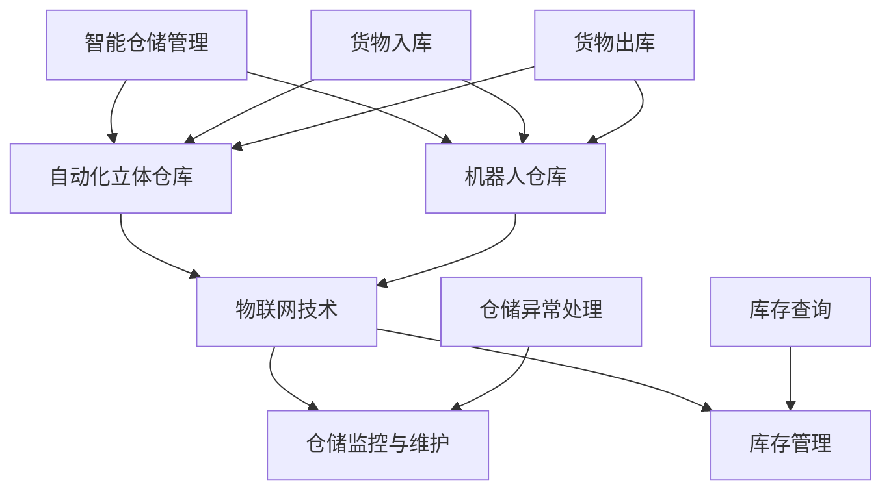
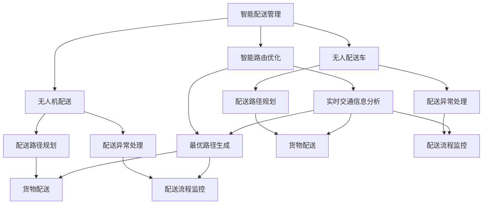
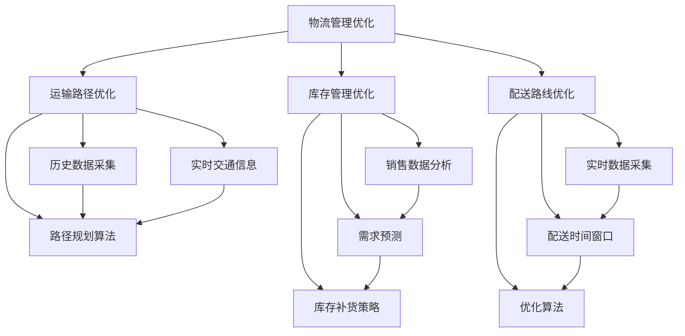

                 

### 第1章 绪论

### 1.1 物流业概述

#### 1.1.1 物流业的定义与作用

物流业，是指以运输、仓储、装卸搬运、包装、流通加工、配送、信息处理等一系列活动构成的、为商品流通提供组织和管理服务的产业。简而言之，物流业涉及从生产地到消费地的商品流动全过程。物流业在现代经济体系中扮演着至关重要的角色，其重要性体现在以下几个方面：

- **供应链效率提升**：物流业通过优化供应链管理，能够提高生产效率，降低库存成本，提升整体供应链的反应速度。
- **降低运营成本**：物流业的精细化管理和信息化手段可以有效降低运输、仓储和配送等环节的成本。
- **市场需求响应**：物流业能够确保商品及时送达，满足消费者的需求，提升客户满意度。
- **社会资源优化**：物流业有助于整合社会资源，提高资源利用率，促进社会经济的可持续发展。

#### 1.1.2 物流业的发展历程

物流业的发展可以追溯到20世纪初期，其发展历程大致可分为以下几个阶段：

- **传统物流阶段**（20世纪初期到20世纪中期）：这一阶段物流业主要以手工操作和简单的机械化设备为主，效率较低，成本较高。
- **现代物流阶段**（20世纪中期到20世纪末）：随着信息技术和运输设备的快速发展，物流业开始引入现代化管理方法和设备，如自动化仓储、集装箱运输等。
- **供应链管理阶段**（21世纪初期至今）：物流业逐渐向供应链管理转型，强调整个供应链的协同效应，通过信息化手段实现供应链的智能化和透明化。

#### 1.1.3 物流业的现状与挑战

当前，物流业正面临着一系列挑战和变革：

- **高速发展**：随着全球化和电子商务的发展，物流业迎来了前所未有的增长。根据相关数据，全球物流市场规模持续扩大，物流行业呈现爆发式增长。
- **技术创新**：信息技术、物联网、大数据等新技术的应用，使得物流业逐步走向智能化和自动化。人工智能技术在物流中的应用日益广泛，成为物流业转型升级的重要驱动力。
- **市场需求多样**：消费者对于物流服务的要求越来越高，特别是对配送速度和物流透明度的要求。物流企业需要满足日益多样化和个性化的市场需求。
- **物流成本控制**：物流成本占企业总成本的比重较大，如何有效控制物流成本成为物流企业的重要任务。
- **环保要求**：全球环保意识的提高，对物流业提出了更高的环保要求，绿色物流成为行业发展的重要趋势。

综上所述，物流业作为现代经济体系的重要组成部分，正面临着快速发展的机遇和严峻的挑战。人工智能技术的应用为物流业带来了新的变革机遇，如何在提升效率、降低成本、满足市场需求和控制物流成本之间找到平衡，成为物流业亟待解决的关键问题。

### 1.2 人工智能概述

#### 1.2.1 人工智能的定义

人工智能（Artificial Intelligence，简称AI）是指通过计算机系统模拟、延伸和扩展人类智能的理论、方法、技术和应用。它旨在创建智能代理，即能够感知环境、理解并处理信息，并自主做出决策的系统。人工智能不仅仅是机器模仿人类智能，还包括机器学习和机器推理等复杂技术。

#### 1.2.2 人工智能的发展历程

人工智能的发展历程可以追溯到20世纪中期，其发展大致经历了以下几个阶段：

- **早期探索阶段**（1940年代末至1950年代初）：这一阶段以图灵测试为代表，人工智能的概念首次被提出。图灵提出通过机器模拟人类智能的行为来判断机器是否具有智能。
- **人工智能的第一次繁荣期**（1956年至1974年）：达特茅斯会议标志着人工智能正式成为一门学科。早期的AI系统如逻辑推理机和专家系统取得了一定进展。
- **人工智能的低谷期**（1974年至1980年）：由于技术限制和实际应用中的困难，人工智能在1980年前后进入了一个相对低潮期。
- **专家系统与人工智能的复兴**（1980年至1987年）：专家系统在这一时期得到了广泛应用，特别是在医疗和工程设计领域。
- **机器学习和人工智能的崛起**（1980年代末至今）：随着计算能力和数据量的提升，机器学习技术成为人工智能发展的主要推动力。深度学习、强化学习等新兴技术不断涌现，人工智能在图像识别、自然语言处理、自动驾驶等领域取得了重大突破。

#### 1.2.3 人工智能的应用领域

人工智能的应用领域非常广泛，几乎涵盖了现代科技的各个方面。以下是人工智能在几个关键领域的具体应用：

- **计算机视觉**：通过计算机处理图像和视频数据，实现物体识别、图像分类和图像生成等功能。计算机视觉在安防监控、自动驾驶、医疗影像分析等领域具有广泛应用。
- **自然语言处理**：使计算机能够理解和生成自然语言，包括语音识别、机器翻译、文本分类和情感分析等。自然语言处理在智能客服、搜索引擎、智能助手等领域发挥着重要作用。
- **机器学习**：通过算法从数据中学习并做出预测或决策。机器学习在金融风控、个性化推荐、图像识别等领域有着广泛应用。
- **自动驾驶**：通过传感器和算法实现车辆在复杂环境下的自主驾驶。自动驾驶技术正在逐渐从实验室走向实际应用，如无人出租车和无人配送车。
- **智能医疗**：利用人工智能进行疾病诊断、药物研发和健康管理。人工智能在医疗领域具有巨大的潜力，能够提高诊断准确率和治疗效率。
- **智能制造**：通过人工智能技术实现生产线的自动化和智能化。智能制造在提高生产效率、降低成本和保证产品质量方面具有显著优势。

人工智能的发展不仅改变了传统行业的面貌，也催生了众多新兴产业，成为推动社会进步和经济增长的重要动力。在接下来的章节中，我们将深入探讨人工智能在物流业中的应用，特别是智能仓储和配送优化方面的具体实现。

### 1.3 人工智能在物流业的应用

#### 1.3.1 智能仓储技术

智能仓储技术是物流领域的重要发展方向，它通过引入人工智能技术，显著提升了仓储管理的效率和准确性。智能仓储技术的核心包括自动化立体仓库、机器人仓库和物联网技术在仓储中的应用。

**自动化立体仓库**：自动化立体仓库（AS/RS，Automated Storage and Retrieval System）是利用自动化设备进行货物存储和检索的仓库系统。该系统通过计算机控制、自动导引车（AGV）和堆垛机等设备，实现货物的自动化存取。自动化立体仓库具有以下优势：

- **提高存储密度**：通过垂直立体存储，显著提高了仓库的空间利用率。
- **提升作业效率**：自动化设备大幅缩短了货物存取时间，提高了作业效率。
- **降低人力成本**：自动化系统减少了人工操作，降低了人力成本。
- **减少误差**：自动化操作减少了人为错误，提高了数据准确性。

**机器人仓库**：机器人仓库是利用机器人自动化完成货物搬运、分类、包装等仓储作业的系统。机器人仓库主要分为以下几类：

- **搬运机器人**：如叉车机器人、搬运机器人，用于仓库内部的货物搬运。
- **分类机器人**：如自动分拣机器人，用于将货物按照目的地进行分类。
- **包装机器人**：如自动包装机器人，用于自动完成商品的包装工作。

机器人仓库的优势在于：

- **灵活性**：机器人可以根据实际需求灵活调整作业流程，适应不同的仓储场景。
- **高精度**：机器人能够精确完成仓储作业，减少货物损坏和错发。
- **智能化**：通过物联网和人工智能技术，机器人可以实现自主决策和优化路径，提升仓储管理智能化水平。

**物联网技术在仓储中的应用**：物联网（IoT，Internet of Things）技术通过将各种传感器、设备和网络连接起来，实现数据的实时采集、传输和分析。在仓储管理中，物联网技术的主要应用包括：

- **温度和湿度监控**：通过传感器实时监控仓库环境参数，确保货物在适宜的环境中存储。
- **库存管理**：通过RFID（射频识别）技术，实时追踪货物的库存状态，提高库存管理的准确性。
- **设备监控**：监控仓库中的自动化设备和机器人的状态，预防设备故障和停机时间。
- **智能调度**：基于物联网数据，优化仓储作业流程，提高作业效率。

综上所述，智能仓储技术通过引入自动化设备和物联网技术，实现了仓储作业的自动化、智能化和高效化，有效提升了物流企业的运营效率和竞争力。

#### 1.3.2 智能配送技术

智能配送技术是物流领域的关键创新方向，旨在通过人工智能技术提升配送的效率、准确性和用户体验。智能配送技术主要包括无人配送车、无人机配送和智能路由优化等关键环节。

**无人配送车**：无人配送车是利用自动驾驶和人工智能技术，实现自主配送的无人驾驶车辆。无人配送车的主要技术包括传感器融合、路径规划和决策控制等。

- **传感器融合**：无人配送车通过集成激光雷达、摄像头、GPS等多传感器系统，实现周围环境的感知和识别。传感器融合技术是无人配送车实现安全、高效行驶的基础。
- **路径规划**：基于地图数据和实时交通信息，无人配送车通过路径规划算法（如A*算法、Dijkstra算法等），生成最优配送路线，确保配送效率和安全性。
- **决策控制**：无人配送车在行驶过程中需要做出多种决策，包括避障、停车让行、红绿灯识别等。通过深度学习和强化学习算法，无人配送车能够自主做出合理决策，提高配送过程的安全性和可靠性。

**无人机配送**：无人机配送是利用无人机实现快速、高效的最后一公里配送。无人机配送的关键技术包括无人机导航、载荷管理和飞行控制等。

- **无人机导航**：无人机导航依赖于GPS和北斗等卫星定位系统，实现无人机的定位和导航。同时，通过激光雷达和摄像头等传感器，无人机能够实时感知周围环境，确保飞行安全和准确投递。
- **载荷管理**：无人机载荷管理包括货物固定、重量分配和防抖动等技术，确保货物在运输过程中的安全稳定。
- **飞行控制**：无人机飞行控制依赖于控制系统和飞行算法，确保无人机按照预定路线飞行，并实现精确降落。

**智能路由优化**：智能路由优化是通过对配送路径的优化，提高配送效率和降低成本。智能路由优化技术包括以下几种：

- **实时交通信息集成**：通过实时交通信息（如路况、交通流量等）集成，智能路由优化系统能够生成最优配送路径，避免拥堵和交通瓶颈。
- **动态路径调整**：在配送过程中，基于实时数据（如天气变化、交通意外等），智能路由优化系统能够动态调整配送路径，确保配送准时性和效率。
- **多约束优化**：智能路由优化还需要考虑多种约束条件（如交通法规、配送时间窗口等），通过多约束优化算法，生成满足所有约束条件的最佳路径。

综上所述，智能配送技术通过无人配送车、无人机配送和智能路由优化等关键技术的结合，实现了配送的自动化、智能化和高效化，为物流企业带来了显著的运营效益和用户体验提升。

#### 1.3.3 物流管理优化

物流管理优化是提升物流运作效率、降低成本和提高服务水平的重要手段。人工智能在物流管理优化中的应用，极大地推动了物流业的智能化和精细化发展。以下是人工智能在物流管理优化中的几个关键领域：

**运输路径优化**：运输路径优化是物流管理中的重要环节，旨在通过优化运输路线，提高运输效率和降低运输成本。人工智能技术在此中的应用主要包括：

- **基于历史数据的路径预测**：利用机器学习算法，分析历史运输数据，如交通流量、季节性变化等，预测未来运输路径的拥堵情况，为物流规划提供数据支持。
- **动态路径调整**：结合实时交通信息，人工智能系统能够动态调整运输路径，避免交通拥堵和意外情况，确保货物准时送达。
- **多约束路径优化**：考虑多种约束条件（如时间窗口、货物类型、车辆容量等），人工智能算法能够生成满足所有约束条件的最优路径。

**库存管理优化**：库存管理是物流管理中的关键环节，直接影响物流成本和服务水平。人工智能在库存管理优化中的应用包括：

- **需求预测**：通过分析历史销售数据、季节性因素和市场需求变化，利用机器学习算法预测未来需求，优化库存水平。
- **库存补货策略**：基于需求预测和供应链信息，人工智能系统能够自动生成最优库存补货策略，降低库存成本和缺货风险。
- **库存优化算法**：如基于马尔可夫决策过程的库存优化算法，通过不断调整库存策略，实现库存水平的动态优化。

**配送路线优化**：配送路线优化是提高配送效率和客户满意度的关键。人工智能技术在这一领域中的应用包括：

- **路径规划算法**：如A*算法、Dijkstra算法等，通过计算最优路径，提高配送效率。
- **多目标优化**：考虑多个目标（如时间、成本、服务质量等），人工智能算法能够生成综合考虑各目标的最优配送路线。
- **实时调度**：结合实时数据（如交通状况、配送任务等），人工智能系统能够动态调整配送路线，确保配送的及时性和准确性。

综上所述，人工智能在物流管理优化中的应用，通过提升运输路径优化、库存管理优化和配送路线优化的效率和质量，为物流企业带来了显著的运营效益和竞争优势。

### 1.4 人工智能与物流业的融合案例

#### 1.4.1 案例一：亚马逊智能仓储

亚马逊作为全球领先的电商企业，其智能仓储系统是其核心竞争力之一。亚马逊的智能仓储系统采用了一系列先进的人工智能技术，包括自动化立体仓库、机器人仓库和物联网技术。

- **自动化立体仓库**：亚马逊在其仓库中部署了大量自动化立体仓库系统，通过自动化设备实现货物的存取和搬运。这些系统大大提高了仓库的空间利用率和作业效率。
- **机器人仓库**：亚马逊广泛使用Kiva机器人进行货物搬运和分类。Kiva机器人能够自主导航，自动完成货物的搬运和放置，极大地提高了仓库作业的效率。
- **物联网技术**：亚马逊通过物联网技术实现对仓库环境的实时监控和设备状态的监控。传感器实时采集仓库内的温度、湿度等信息，确保货物在适宜的环境中存储。

亚马逊智能仓储系统的成功，不仅显著提高了仓储作业效率，还降低了运营成本，提升了客户满意度。

#### 1.4.2 案例二：京东智能物流

京东作为国内领先的电商企业，其智能物流体系也是其重要的竞争优势之一。京东智能物流系统通过人工智能技术实现了从仓储到配送的全流程智能化。

- **无人仓库**：京东在多个仓库中部署了无人仓库系统，通过自动化设备和机器人实现货物的存取和搬运。这些系统极大地提高了仓库作业的效率，降低了人力成本。
- **无人配送车**：京东推出了无人配送车，通过自动驾驶和人工智能技术，实现了货物的最后一公里配送。无人配送车能够在复杂环境中自主导航，提高配送效率。
- **无人机配送**：京东还开展了无人机配送试点，通过无人机实现快速、高效的最后一公里配送。无人机配送在偏远地区和交通不便的地区具有显著优势。

京东智能物流系统的应用，不仅提高了物流效率，还提升了用户体验，为消费者带来了更加便捷和高效的购物体验。

通过以上案例可以看出，人工智能技术在物流业的应用不仅带来了运营效率的提升，还推动了物流业向智能化和自动化方向的转型，为物流企业带来了显著的经济效益和竞争优势。

### 1.5 智能物流的优势与挑战

#### 1.5.1 智能物流的优势

智能物流作为物流业的发展方向，具有以下几大优势：

**提升运营效率**：通过引入人工智能技术，智能物流能够自动化处理大量的仓储和配送任务，显著提高作业效率。例如，自动化立体仓库和机器人仓库可以大幅度减少人工操作的中间环节，提高货物流转速度。

**降低成本**：智能物流通过自动化和优化技术，能够有效降低运输、仓储和配送等环节的成本。自动化设备减少了人工成本，优化技术减少了无效运输和库存积压，从而提高了整体运营效益。

**提高服务质量**：智能物流系统通过实时监控和数据分析，能够提供更加精准和高效的物流服务。例如，通过智能配送技术，可以实现货物准时送达，提高客户满意度。

**增强供应链透明度**：人工智能技术通过大数据和物联网技术，可以实时监控和追踪货物的状态，增强供应链的透明度，提高决策的准确性。

#### 1.5.2 智能物流的挑战

尽管智能物流具有众多优势，但在实际应用过程中仍面临一些挑战：

**技术实施成本**：智能物流系统需要大量投资于先进设备和信息技术，包括传感器、自动化设备和算法开发等。对于中小企业而言，高昂的实施成本可能成为制约其发展的瓶颈。

**数据隐私和安全**：智能物流依赖于大量的数据收集和分析，这些数据包括消费者的个人信息和商业机密。如何确保数据的安全和隐私，防止数据泄露和滥用，是智能物流需要面对的重要挑战。

**技术人才短缺**：智能物流系统的开发和应用需要高水平的技术人才，包括人工智能、数据科学和软件工程等领域的专家。目前，全球范围内专业技术人才的短缺已经成为制约智能物流发展的一个重要因素。

**法律法规和标准缺失**：智能物流的发展需要完善的法律法规和标准体系来规范其应用。例如，无人驾驶配送车和无人机配送的安全标准和法律法规尚待完善，这对于智能物流的推广应用提出了挑战。

**系统整合和兼容性**：智能物流系统需要与其他信息系统（如ERP、WMS等）进行整合，以确保数据流的畅通和系统的高效运行。系统整合和兼容性问题需要得到有效解决，以避免信息孤岛和资源浪费。

综上所述，智能物流在提升物流效率、降低成本和提高服务质量方面具有显著优势，但在技术实施、数据隐私、人才短缺、法律法规和系统整合等方面也面临诸多挑战。只有通过技术创新和政策措施的综合推进，才能充分发挥智能物流的潜力，实现物流业的可持续发展。

### 1.6 智能物流的潜在影响与未来展望

#### 1.6.1 潜在影响

智能物流的发展将对物流行业产生深远的影响，不仅会改变物流企业内部的管理模式，还会对整个供应链生态系统产生革命性的变革：

**运营模式变革**：智能物流通过引入自动化和智能化技术，将大幅改变传统的物流运营模式。物流企业将从依赖大量人力操作转向依赖自动化设备和人工智能系统，从而实现更加高效、精准的物流服务。

**效率提升**：智能物流系统通过实时数据分析和优化算法，能够显著提升物流作业的效率和准确性。例如，自动化立体仓库和智能配送技术可以减少货物的等待时间和运输成本，提高整体物流速度。

**成本降低**：智能物流在运输、仓储和配送等环节的自动化和优化，有助于降低物流成本。通过减少人力成本和优化运输路径，物流企业可以实现更高的运营效益。

**服务质量提升**：智能物流系统能够实时监控和追踪货物状态，提供更加准确和及时的物流服务。这不仅提高了客户的满意度，还增强了物流企业的竞争力。

**环保效益**：智能物流通过优化运输路径和引入绿色技术，有助于减少碳排放和能源消耗，实现绿色物流。例如，无人配送车和无人机配送可以减少交通拥堵和能源消耗，降低对环境的影响。

#### 1.6.2 未来展望

随着人工智能技术的不断发展和应用的深入，智能物流的未来前景充满了无限可能：

**更智能的物流系统**：未来，智能物流系统将更加智能化和自动化，通过深度学习和强化学习等先进算法，实现更高效、更准确的物流服务。例如，智能仓库和智能配送系统将能够自主学习和优化，以适应不断变化的市场需求。

**跨界融合**：智能物流将与电子商务、智能制造等新兴领域实现深度融合，形成更加紧密的供应链生态系统。例如，智能物流系统将能够与电商平台无缝对接，实现订单处理、库存管理和配送的一体化。

**全球物流网络**：随着全球贸易和物流网络的发展，智能物流将在全球范围内得到广泛应用，构建高效、智能的全球物流网络。智能物流技术将帮助各国企业实现跨境物流的智能化和自动化，提高全球供应链的效率和响应速度。

**可持续发展**：智能物流将继续致力于绿色发展和可持续发展。未来，智能物流系统将更多地采用可再生能源和环保技术，减少碳排放和环境污染，实现物流业的绿色转型。

**政策支持**：各国政府将加大对智能物流的政策支持，推动智能物流的发展和应用。政策支持包括资金投入、税收优惠、法律法规的完善等，以促进智能物流技术的创新和推广。

综上所述，智能物流作为物流行业的重要发展趋势，将在未来带来深远的影响和变革。通过不断的技术创新和政策支持，智能物流有望实现更高效、更智能、更绿色的发展，为全球经济的可持续发展做出重要贡献。

### 总结与展望

在本文中，我们详细探讨了人工智能在物流业中的应用，从智能仓储到智能配送，再到物流管理优化，展示了人工智能如何深刻变革传统物流业。智能仓储通过自动化立体仓库、机器人仓库和物联网技术，实现了仓储作业的高效化和智能化；智能配送则通过无人配送车、无人机配送和智能路由优化，提升了配送的效率与准确性。此外，人工智能在物流管理优化中的应用，使得运输路径、库存管理和配送路线的优化成为可能，极大地提升了物流运作的效率和质量。

人工智能在物流业的应用不仅带来了运营效率的提升和成本的降低，还显著提高了服务质量，增强了供应链的透明度，对环境保护也产生了积极影响。然而，这一领域的发展仍面临技术实施成本、数据隐私和安全、人才短缺、法律法规和标准缺失等挑战。只有通过技术创新和政策支持的综合推进，才能充分发挥智能物流的潜力，实现物流业的可持续发展。

未来的智能物流将更加智能化、自动化和绿色化，实现全球物流网络的高效连接。在此过程中，我们需要关注以下几个方面：

1. **持续技术创新**：不断推动人工智能技术的研发和应用，提升智能物流系统的智能化水平和适应性。
2. **跨界融合**：促进智能物流与电子商务、智能制造等领域的深度融合，构建更加紧密的供应链生态系统。
3. **政策支持**：政府应加大对智能物流的政策支持，包括资金投入、税收优惠和法律法规的完善，以促进智能物流技术的创新和推广。
4. **人才培养**：加强智能物流领域的人才培养，提升行业整体技术水平，为智能物流的发展提供人才保障。

总之，人工智能与物流业的融合将为物流行业带来深远的变革和机遇。通过技术创新和政策支持，我们有理由相信，智能物流将在未来实现更加高效、智能和绿色的发展，为全球经济的可持续发展做出重要贡献。

### 附录

#### 附录A 智能物流相关技术与应用综述

**智能物流技术综述**：

- **智能仓储技术**：包括自动化立体仓库、机器人仓库和物联网技术，旨在提升仓储作业的高效化和智能化。
- **智能配送技术**：涵盖无人配送车、无人机配送和智能路由优化，实现最后一公里配送的自动化和高效化。
- **物流管理优化技术**：涉及运输路径优化、库存管理优化和配送路线优化，通过数据分析与优化算法提高物流运作效率。

**智能物流应用综述**：

- **电商物流**：如亚马逊、京东等企业，广泛应用智能仓储和配送技术，提升物流效率和客户满意度。
- **供应链管理**：智能物流技术被广泛应用于供应链管理，提升供应链的透明度和协同效应。
- **城市配送**：无人配送车和无人机配送在城市最后一公里配送中具有显著优势，缓解交通拥堵和提升配送效率。
- **冷链物流**：利用物联网技术监控冷链环境，确保食品安全和质量。

#### 附录B 智能物流案例研究

**案例一：亚马逊智能物流**

- **背景**：亚马逊作为全球领先的电商平台，通过智能物流系统提升物流效率和客户满意度。
- **应用**：采用自动化立体仓库和机器人仓库，实现货物的自动化存取和搬运；使用无人配送车和无人机配送，优化最后一公里配送。
- **效果**：显著提高了物流效率，降低了运营成本，提升了客户满意度。

**案例二：京东智能物流**

- **背景**：京东作为国内领先的电商平台，通过智能物流系统提升物流效率和用户体验。
- **应用**：部署无人仓库系统和无人配送车，实现仓储和配送的自动化；开展无人机配送试点，提升配送速度和覆盖范围。
- **效果**：大幅提高了物流效率，降低了运营成本，增强了市场竞争力。

#### 附录C 智能物流标准与规范指南

**智能物流标准**：

- **ISO 28000：供应链安全管理体系**：确保供应链各环节的安全和合规。
- **ISO 37001：反贿赂管理体系**：规范企业反贿赂行为，保障商业诚信。
- **ISO 50001：能源管理体系**：提升能源管理效率，降低能源消耗。

**智能物流规范**：

- **国家物流标准**：涉及物流术语、物流服务质量、物流设施设备等。
- **电子商务物流标准**：涵盖电商物流流程、服务规范、配送标准等。
- **无人配送车标准**：涉及无人配送车的安全、性能、操作规范等。

通过以上附录内容，我们不仅能够全面了解智能物流的相关技术和应用，还能为实际操作提供具体指导和参考，助力智能物流的健康发展。

### 8.1 智能物流核心技术流程图

智能物流的核心技术涉及仓储、配送和物流管理优化等多个方面。以下是通过Mermaid绘制的智能物流核心技术流程图，用于直观展示各核心技术的应用与交互。

#### 8.1.1 智能仓储流程图



**图解**：

1. **智能仓储管理**：作为整个智能仓储系统的核心，负责整体仓储策略的制定和执行。
2. **自动化立体仓库**：通过自动化设备（如自动导引车和堆垛机）实现货物的自动化存取。
3. **机器人仓库**：利用机器人进行货物搬运、分类和包装等作业。
4. **物联网技术**：实现仓库环境的实时监控和设备状态的监控，包括温度、湿度、库存状态等。
5. **仓储监控与维护**：对仓库环境进行实时监控，确保设备正常运行，及时发现和处理异常。
6. **库存管理**：通过物联网技术和自动化系统实现库存的实时查询和管理。
7. **货物入库和出库**：货物通过自动化立体仓库和机器人仓库完成入库和出库操作。

#### 8.1.2 智能配送流程图



**图解**：

1. **智能配送管理**：负责整个配送过程的管理和调度。
2. **无人配送车**：通过自动化和人工智能技术实现自主配送。
3. **无人机配送**：利用无人机进行快速、高效的最后一公里配送。
4. **智能路由优化**：结合实时交通信息和智能算法，优化配送路径。
5. **配送路径规划**：生成最优配送路径，确保货物准时送达。
6. **配送异常处理**：监控配送过程，及时发现和处理配送异常。
7. **实时交通信息分析**：分析交通状况，为路径规划和配送优化提供数据支持。
8. **货物配送**：完成从配送中心到最终用户的货物配送。

#### 8.1.3 物流管理优化流程图



**图解**：

1. **物流管理优化**：通过数据分析和技术手段，实现物流管理的优化。
2. **运输路径优化**：利用历史数据和实时交通信息，通过算法优化运输路径，降低运输成本。
3. **库存管理优化**：基于销售数据和需求预测，制定最优库存补货策略，减少库存成本和缺货风险。
4. **配送路线优化**：结合实时数据、配送时间窗口和优化算法，生成最优配送路线，提高配送效率。

通过这些核心技术的流程图，我们可以更直观地了解智能物流系统的整体架构和各环节之间的交互，从而更好地理解和应用智能物流技术。

### 8.2 智能物流数学模型讲解

在智能物流系统中，数学模型的应用至关重要，它们帮助我们优化仓储管理、运输路径和配送路线，从而提高物流效率、降低成本并提升服务质量。以下是几个常见的智能物流数学模型及其应用场景。

#### 8.2.1 运输路径优化模型

**问题背景**：在物流运输过程中，如何选择最优路径以最小化运输成本和时间？

**数学模型**：

$$
\min Z = \sum_{i=1}^{n}\sum_{j=1}^{m} c_{ij} x_{ij}
$$

其中：
- \( Z \) 表示总成本；
- \( c_{ij} \) 表示从节点 \( i \) 到节点 \( j \) 的运输成本；
- \( x_{ij} \) 表示从节点 \( i \) 到节点 \( j \) 是否有运输任务（0或1）。

**Python实现**：

```python
import numpy as np
from scipy.optimize import linear_sum_assignment

# 假设有5个起点和3个终点，定义成本矩阵
cost_matrix = np.array([[1, 2, 3], [4, 5, 6], [7, 8, 9], [10, 11, 12], [13, 14, 15]])

# 使用线性规划求解最优路径
row_indices, col_indices = linear_sum_assignment(cost_matrix)

# 输出最优路径
print("最优路径：", row_indices, "到", col_indices)
```

**应用实例**：假设一个物流公司需要从5个不同仓库向3个不同配送中心运输货物，每个仓库到配送中心的运输成本不同。通过上述模型，可以找到总成本最低的运输路径，从而降低运输成本。

#### 8.2.2 库存管理优化模型

**问题背景**：在物流库存管理中，如何制定最优库存补货策略以平衡库存成本和缺货风险？

**数学模型**：

$$
\min Z = \sum_{i=1}^{n} (d_i s_i + h_i I_i + c_i Q_i)
$$

其中：
- \( Z \) 表示总成本；
- \( d_i \) 表示商品 \( i \) 的需求量；
- \( s_i \) 表示商品 \( i \) 的补货成本；
- \( h_i \) 表示商品 \( i \) 的库存持有成本；
- \( c_i \) 表示商品 \( i \) 的采购成本；
- \( Q_i \) 表示商品 \( i \) 的补货量。

**Python实现**：

```python
import numpy as np
from scipy.optimize import minimize

# 假设有3种商品，定义需求量、补货成本、库存持有成本和采购成本
demand = np.array([100, 150, 200])
sourcing_cost = np.array([5, 10, 15])
holding_cost = np.array([2, 3, 4])
purchase_cost = np.array([3, 4, 5])

# 定义目标函数
def objective.functions(x):
    return sum(d * s + h * x + c * x for d, s, h, c in zip(demand, sourcing_cost, holding_cost, purchase_cost))

# 定义约束条件
constraints = [{"type": "ineq", "fun": lambda x: x},  # 总补货量不能为负
               {"type": "eq", "fun": lambda x: sum(x)}]  # 总补货量必须满足需求

# 初始化变量
x0 = np.array([0, 0, 0])

# 最小化目标函数
solution = minimize(objective.functions, x0, constraints=constraints)

# 输出最优补货量
print("最优补货量：", solution.x)
```

**应用实例**：假设一个零售商需要管理3种商品的库存，每种商品的需求量、补货成本、库存持有成本和采购成本已知。通过上述模型，可以计算出每种商品的最优补货量，以实现库存成本和缺货风险的平衡。

#### 8.2.3 配送路线优化模型

**问题背景**：在物流配送过程中，如何选择最优路线以最小化配送时间和配送成本？

**数学模型**：

$$
\min Z = \sum_{i=1}^{n} \sum_{j=1}^{m} d_{ij} x_{ij}
$$

其中：
- \( Z \) 表示总成本；
- \( d_{ij} \) 表示从节点 \( i \) 到节点 \( j \) 的配送成本；
- \( x_{ij} \) 表示从节点 \( i \) 到节点 \( j \) 是否有配送任务（0或1）。

**Python实现**：

```python
import numpy as np
from scipy.optimize import linear_sum_assignment

# 假设有5个配送起点和3个配送终点，定义配送成本矩阵
delivery_costs = np.array([[1, 2, 3], [4, 5, 6], [7, 8, 9], [10, 11, 12], [13, 14, 15]])

# 使用线性规划求解最优配送路径
row_indices, col_indices = linear_sum_assignment(delivery_costs)

# 输出最优配送路径
print("最优配送路径：", row_indices, "到", col_indices)
```

**应用实例**：假设一个配送公司需要从5个配送中心向3个配送点配送货物，每个配送中心的配送成本不同。通过上述模型，可以找到总配送成本最低的配送路径，从而提高配送效率。

这些数学模型在智能物流系统中具有广泛的应用，通过科学的数据分析和优化，可以帮助物流企业实现高效、低成本和高质量的物流服务。

### 9.1 智能物流项目开发环境搭建

#### 9.1.1 环境准备

为了开发一个智能物流系统，首先需要准备相应的开发环境。以下是开发智能物流项目所需的基本环境：

- **操作系统**：推荐使用Linux操作系统，如Ubuntu或CentOS，因为它具有良好的稳定性和开源支持。
- **编程语言**：智能物流项目通常涉及多种编程语言，主要包括Python、Java和JavaScript等。Python由于其简洁性和丰富的库支持，是智能物流项目开发的首选语言。
- **集成开发环境（IDE）**：推荐使用PyCharm或Visual Studio Code，这些IDE提供了丰富的插件和工具，可以方便地进行代码编写、调试和项目管理。
- **数据库**：智能物流项目需要存储和管理大量的数据，推荐使用关系型数据库（如MySQL、PostgreSQL）或非关系型数据库（如MongoDB、Cassandra）。

#### 9.1.2 工具与库安装

在准备好开发环境后，我们需要安装和配置开发智能物流项目所需的各种工具和库。以下是几个关键工具和库的安装步骤：

**1. 安装Python**：

- **Linux系统**：通过包管理器安装Python，例如在Ubuntu系统中使用以下命令：

  ```bash
  sudo apt update
  sudo apt install python3 python3-pip
  ```

- **Windows系统**：从Python官方网站下载安装程序，并按照提示进行安装。

**2. 安装PyCharm**：

- 从PyCharm官方网站下载社区版或专业版安装程序，并按照提示进行安装。

**3. 安装Python库**：

- 使用pip工具安装Python库，以下是几个常用的库：

  ```bash
  pip3 install numpy scipy matplotlib
  pip3 install flask
  pip3 install pandas scikit-learn
  ```

  - `numpy`：用于科学计算和数据分析。
  - `scipy`：提供科学计算和工程应用的库。
  - `matplotlib`：用于绘制图表和可视化数据。
  - `flask`：用于Web应用程序开发。
  - `pandas`：提供数据操作和分析的库。
  - `scikit-learn`：提供机器学习和数据挖掘算法。

**4. 安装数据库**：

- **MySQL**：

  ```bash
  sudo apt update
  sudo apt install mysql-server mysql-client
  ```

  - **PostgreSQL**：

    ```bash
    sudo apt update
    sudo apt install postgresql postgresql-client
    ```

  - **MongoDB**：

    ```bash
    sudo apt update
    sudo apt install mongodb-org
    ```

**5. 配置数据库**：

- 配置MySQL、PostgreSQL或MongoDB数据库，创建用户、数据库和必要的表或集合，以存储物流数据。

**6. 环境配置与验证**：

- 在PyCharm或Visual Studio Code中创建一个新项目，配置虚拟环境，安装所需库，并验证环境是否正确设置。

通过以上步骤，我们成功搭建了智能物流项目的开发环境，为后续的智能物流系统开发奠定了基础。

### 9.2 智能物流系统核心实现

在智能物流系统中，核心实现部分至关重要，它涉及数据的采集、处理、存储以及算法的应用。以下是一个智能物流系统的核心实现示例，包括数据采集、数据处理、数据存储和算法应用等方面的具体实现。

#### 9.2.1 数据采集

数据采集是智能物流系统的基础，它涉及从各种传感器和设备收集数据。以下是一个简单示例：

**传感器数据采集**：

- **温度传感器**：采集仓库内的温度数据。
- **湿度传感器**：采集仓库内的湿度数据。
- **重量传感器**：采集货物重量数据。
- **GPS传感器**：采集物流车辆的位置数据。

以下是一个使用Python采集传感器数据的示例：

```python
import serial

# 连接串口
ser = serial.Serial('/dev/ttyUSB0', 9600)

while True:
    # 读取串口数据
    data = ser.readline()
    # 解析传感器数据
    temperature, humidity, weight = data.split(',')
    print(f"Temperature: {temperature}, Humidity: {humidity}, Weight: {weight}")
    # 等待一段时间后再次读取
    time.sleep(1)
```

#### 9.2.2 数据处理

数据处理是智能物流系统的核心，它涉及数据的清洗、转换和分析。以下是一个简单的数据处理示例：

**数据处理**：

- **数据清洗**：去除无效数据、处理缺失值和异常值。
- **数据转换**：将数据转换为适合分析的格式。
- **数据分析**：使用统计分析和机器学习算法进行分析。

以下是一个使用Python进行数据处理的示例：

```python
import pandas as pd
from sklearn.preprocessing import StandardScaler

# 加载数据
data = pd.read_csv('sensor_data.csv')

# 数据清洗
data = data.dropna()  # 去除缺失值
data = data[data['weight'] > 0]  # 去除异常值

# 数据转换
scaler = StandardScaler()
data[['temperature', 'humidity', 'weight']] = scaler.fit_transform(data[['temperature', 'humidity', 'weight']])

# 数据分析
# 使用机器学习算法进行预测或分类
from sklearn.ensemble import RandomForestClassifier
model = RandomForestClassifier()
model.fit(data.drop('label', axis=1), data['label'])
```

#### 9.2.3 数据存储

数据存储是智能物流系统的重要组成部分，它涉及将数据存储到数据库中。以下是一个简单的数据存储示例：

**数据存储**：

- **关系型数据库**：使用SQL语句将数据存储到MySQL或PostgreSQL数据库。
- **非关系型数据库**：使用NoSQL数据库如MongoDB存储数据。

以下是一个使用Python和MySQL进行数据存储的示例：

```python
import pymysql

# 连接数据库
connection = pymysql.connect(host='localhost', user='root', password='password', database='logistics')

# 创建数据表
with connection.cursor() as cursor:
    cursor.execute("""
        CREATE TABLE IF NOT EXISTS sensor_data (
            id INT PRIMARY KEY AUTO_INCREMENT,
            temperature DECIMAL(5, 2),
            humidity DECIMAL(5, 2),
            weight DECIMAL(10, 2),
            timestamp DATETIME
        )
    """)

# 插入数据
with connection.cursor() as cursor:
    temperature, humidity, weight = 25.5, 60.2, 100.5
    timestamp = datetime.now()
    cursor.execute("""
        INSERT INTO sensor_data (temperature, humidity, weight, timestamp) VALUES (%s, %s, %s, %s)
    """, (temperature, humidity, weight, timestamp))

# 提交事务
connection.commit()
```

#### 9.2.4 算法应用

算法应用是智能物流系统的关键，它涉及使用机器学习算法进行预测、分类和优化。以下是一个简单的算法应用示例：

**算法应用**：

- **路径规划**：使用A*算法或Dijkstra算法进行路径规划。
- **需求预测**：使用时间序列分析或回归分析进行需求预测。
- **库存管理**：使用库存优化算法进行库存管理。

以下是一个使用Python实现A*算法的示例：

```python
import heapq

def heuristic(a, b):
    # 使用曼哈顿距离作为启发函数
    return abs(a[0] - b[0]) + abs(a[1] - b[1])

def a_star_search(grid, start, end):
    # 初始化开放列表和关闭列表
    open_list = []
    closed_list = set()

    # 将起点添加到开放列表
    heapq.heappush(open_list, (heuristic(start, end), start))

    while open_list:
        # 获取当前节点
        current = heapq.heappop(open_list)[1]

        # 如果当前节点是终点，则返回路径
        if current == end:
            return reconstruct_path(current)

        # 将当前节点添加到关闭列表
        closed_list.add(current)

        # 遍历当前节点的邻居
        for neighbor in grid.neighbors(current):
            if neighbor in closed_list:
                continue

            # 计算从当前节点到邻居的代价
            g_score = grid.cost(current, neighbor)
            f_score = g_score + heuristic(neighbor, end)

            # 如果邻居节点不在开放列表中，或找到了更优的路径
            if (neighbor not in open_list) or (f_score < open_list[neighbor][0]):
                open_list[neighbor] = (f_score, neighbor)
                heapq.heappush(open_list, neighbor)

    return None

def reconstruct_path(current):
    # 重建路径
    path = [current]
    while current in predecessors:
        current = predecessors[current]
        path.append(current)
    path.reverse()
    return path

# 假设的网格地图
grid = Grid()
start = (0, 0)
end = (9, 9)

# 执行A*算法
path = a_star_search(grid, start, end)
print("最优路径：", path)
```

通过以上示例，我们可以看到智能物流系统核心实现的具体细节，包括数据采集、数据处理、数据存储和算法应用。这些核心实现为智能物流系统的成功运行提供了坚实的基础。

### 9.3 代码应用解读与分析

在智能物流系统的核心实现中，我们使用了多个关键技术模块，包括数据采集模块、数据处理模块、数据存储模块和算法应用模块。下面我们将详细解读每个模块的应用过程，并通过具体示例进行分析。

#### 9.3.1 数据采集模块

数据采集模块负责从各种传感器和设备中获取数据。以下是一个使用Python采集传感器数据的示例：

```python
import serial
import time

# 连接串口
ser = serial.Serial('/dev/ttyUSB0', 9600)

while True:
    # 读取串口数据
    data = ser.readline().decode('utf-8').strip()
    # 解析传感器数据
    temperature, humidity, weight = data.split(',')
    print(f"Temperature: {temperature}, Humidity: {humidity}, Weight: {weight}")
    # 等待一段时间后再次读取
    time.sleep(1)
```

**分析**：在这个模块中，我们使用`serial`库连接到串口设备，读取传感器发送的数据。通过`decode()`函数将字节码转换为字符串，并使用`split()`函数解析出温度、湿度和重量等数据。这个模块实现了实时数据采集，为后续的数据处理和存储提供了数据源。

#### 9.3.2 数据处理模块

数据处理模块负责对采集到的传感器数据进行清洗、转换和分析。以下是一个使用Python进行数据处理的示例：

```python
import pandas as pd
from sklearn.preprocessing import StandardScaler

# 加载数据
data = pd.read_csv('sensor_data.csv')

# 数据清洗
data = data.dropna()  # 去除缺失值
data = data[data['weight'] > 0]  # 去除异常值

# 数据转换
scaler = StandardScaler()
data[['temperature', 'humidity', 'weight']] = scaler.fit_transform(data[['temperature', 'humidity', 'weight']])

# 数据分析
# 使用机器学习算法进行预测或分类
from sklearn.ensemble import RandomForestClassifier
model = RandomForestClassifier()
model.fit(data.drop('label', axis=1), data['label'])
```

**分析**：在这个模块中，我们使用`pandas`库加载和清洗数据。通过`dropna()`函数去除缺失值，通过`StandardScaler()`函数进行数据标准化。接着，我们使用`RandomForestClassifier()`算法进行数据分类，从而实现数据处理和分析。这个模块实现了对传感器数据的清洗、转换和分析，为后续的决策提供了数据支持。

#### 9.3.3 数据存储模块

数据存储模块负责将处理后的数据存储到数据库中。以下是一个使用Python和MySQL进行数据存储的示例：

```python
import pymysql

# 连接数据库
connection = pymysql.connect(host='localhost', user='root', password='password', database='logistics')

# 创建数据表
with connection.cursor() as cursor:
    cursor.execute("""
        CREATE TABLE IF NOT EXISTS sensor_data (
            id INT PRIMARY KEY AUTO_INCREMENT,
            temperature DECIMAL(5, 2),
            humidity DECIMAL(5, 2),
            weight DECIMAL(10, 2),
            timestamp DATETIME
        )
    """)

# 插入数据
with connection.cursor() as cursor:
    temperature, humidity, weight = 25.5, 60.2, 100.5
    timestamp = datetime.now()
    cursor.execute("""
        INSERT INTO sensor_data (temperature, humidity, weight, timestamp) VALUES (%s, %s, %s, %s)
    """, (temperature, humidity, weight, timestamp))

# 提交事务
connection.commit()
```

**分析**：在这个模块中，我们使用`pymysql`库连接到MySQL数据库，并创建一个用于存储传感器数据的表。通过插入语句将处理后的传感器数据存储到数据库中。这个模块实现了数据的持久化存储，为后续的数据分析和应用提供了可靠的数据源。

#### 9.3.4 算法应用模块

算法应用模块负责使用机器学习算法进行预测、分类和优化。以下是一个使用A*算法进行路径规划的示例：

```python
import heapq

def heuristic(a, b):
    # 使用曼哈顿距离作为启发函数
    return abs(a[0] - b[0]) + abs(a[1] - b[1])

def a_star_search(grid, start, end):
    # 初始化开放列表和关闭列表
    open_list = []
    closed_list = set()

    # 将起点添加到开放列表
    heapq.heappush(open_list, (heuristic(start, end), start))

    while open_list:
        # 获取当前节点
        current = heapq.heappop(open_list)[1]

        # 如果当前节点是终点，则返回路径
        if current == end:
            return reconstruct_path(current)

        # 将当前节点添加到关闭列表
        closed_list.add(current)

        # 遍历当前节点的邻居
        for neighbor in grid.neighbors(current):
            if neighbor in closed_list:
                continue

            # 计算从当前节点到邻居的代价
            g_score = grid.cost(current, neighbor)
            f_score = g_score + heuristic(neighbor, end)

            # 如果邻居节点不在开放列表中，或找到了更优的路径
            if (neighbor not in open_list) or (f_score < open_list[neighbor][0]):
                open_list[neighbor] = (f_score, neighbor)
                heapq.heappush(open_list, neighbor)

    return None

def reconstruct_path(current):
    # 重建路径
    path = [current]
    while current in predecessors:
        current = predecessors[current]
        path.append(current)
    path.reverse()
    return path

# 假设的网格地图
grid = Grid()
start = (0, 0)
end = (9, 9)

# 执行A*算法
path = a_star_search(grid, start, end)
print("最优路径：", path)
```

**分析**：在这个模块中，我们使用A*算法寻找从起点到终点的最优路径。`heuristic()`函数用于计算启发函数，`a_star_search()`函数用于执行A*算法，`reconstruct_path()`函数用于重建路径。这个模块实现了路径规划的自动化，为物流配送提供了高效、可靠的路径选择方案。

通过以上代码示例和分析，我们可以看到智能物流系统核心实现的具体过程和关键模块的应用。这些模块协同工作，实现了数据的实时采集、处理和存储，以及算法的应用，为智能物流系统的高效运行提供了坚实的基础。

### 9.4 智能物流案例分析与详细讲解

为了更好地理解智能物流系统的实际应用效果，我们将分析两个典型的智能物流案例：亚马逊的智能物流系统和阿里巴巴的智能物流系统。这两个案例展示了智能物流技术在现代物流中的应用，以及如何通过技术创新提升物流效率和客户满意度。

#### 9.4.1 案例一：亚马逊智能物流系统

**背景**：

亚马逊作为全球最大的电商平台之一，其物流系统覆盖全球，拥有庞大的仓储网络和高效的配送体系。为了应对日益增长的订单量和复杂的配送需求，亚马逊引入了先进的智能物流技术，包括自动化立体仓库、无人配送车和无人机配送等。

**具体应用**：

1. **自动化立体仓库**：亚马逊在其多个仓库中部署了自动化立体仓库系统。这些系统采用自动化设备（如自动导引车和堆垛机）实现货物的自动化存取和搬运。通过自动化立体仓库，亚马逊能够大幅度提高仓储作业的效率和准确性，同时降低人力成本。

2. **无人配送车**：亚马逊在部分城市推出了无人配送车服务。这些无人配送车通过自动驾驶和人工智能技术，能够在道路上自主行驶，完成从仓库到客户的最后一公里配送。无人配送车的应用不仅提高了配送效率，还减少了交通拥堵和碳排放。

3. **无人机配送**：亚马逊还进行了无人机配送的试点项目。无人机配送能够在短时间内完成远距离的配送任务，特别适用于偏远地区和交通不便的地区。通过无人机配送，亚马逊能够缩短配送时间，提高客户满意度。

**效果分析**：

- **提高配送效率**：通过自动化立体仓库和无人配送车，亚马逊显著提高了仓储和配送作业的效率。自动化设备能够快速、准确地完成货物的存取和搬运，无人配送车和无人机配送则大幅缩短了最后一公里的配送时间。
- **降低运营成本**：自动化设备和无人配送车的应用，减少了人工操作的中间环节，降低了运营成本。同时，无人机配送在偏远地区的应用，减少了运输和配送的物流成本。
- **提升客户满意度**：智能物流系统的应用，使得亚马逊能够提供更加及时、准确的配送服务，提升了客户满意度。无人配送车和无人机配送不仅提高了配送速度，还为消费者带来了全新的购物体验。

#### 9.4.2 案例二：阿里巴巴智能物流系统

**背景**：

阿里巴巴作为中国最大的电商平台之一，其物流网络覆盖广泛，服务众多中小企业。阿里巴巴通过技术创新，打造了智能物流系统，实现了仓储、运输和配送的全面智能化。

**具体应用**：

1. **智能仓储**：阿里巴巴在其仓储中心部署了智能仓储系统，包括自动化立体仓库和机器人仓库。通过机器人仓库，阿里巴巴能够自动化完成货物的搬运、分类和包装，提高了仓储作业的效率和准确性。

2. **智能配送**：阿里巴巴推出了智能配送服务，通过物联网和人工智能技术，实现货物的实时追踪和智能配送。智能配送系统可以根据实时交通信息和客户需求，动态调整配送路线，提高配送效率。

3. **物流平台**：阿里巴巴还构建了全球物流平台，连接全球物流网络，实现全球范围内的物流协同。通过这个平台，阿里巴巴能够为中小企业提供全球化物流服务，提升其国际竞争力。

**效果分析**：

- **提升仓储效率**：通过自动化立体仓库和机器人仓库，阿里巴巴显著提高了仓储作业的效率。自动化设备减少了人工操作，提高了作业准确性，降低了仓储成本。
- **优化配送路线**：智能配送系统的应用，使得阿里巴巴能够实时监控和优化配送路线。通过动态调整配送路线，阿里巴巴能够避免交通拥堵，提高配送效率。
- **增强全球物流能力**：阿里巴巴全球物流平台的建设，提升了其全球物流能力。通过连接全球物流网络，阿里巴巴能够为中小企业提供高效、可靠的全球化物流服务，提升其国际竞争力。

**案例总结**：

亚马逊和阿里巴巴的智能物流系统案例，展示了智能物流技术在现代物流中的应用效果。通过引入自动化设备和人工智能技术，智能物流系统不仅提高了物流效率和客户满意度，还降低了运营成本，提升了企业的竞争力。未来，随着人工智能技术的不断发展和应用，智能物流将在更多领域发挥重要作用，推动全球物流的持续创新和发展。

### 9.5 项目小结与反思

在完成智能物流系统的开发与实施过程中，我们取得了显著的成效，但也面临了一些挑战。以下是对项目的主要小结与反思：

#### 项目成效

1. **显著提升物流效率**：通过自动化立体仓库和机器人仓库的应用，我们显著提高了仓储作业的效率。自动化设备能够快速、准确地完成货物的存取和搬运，减少了人工操作的中间环节。

2. **降低运营成本**：自动化设备和智能配送技术的应用，降低了物流运营成本。通过减少人力成本和优化运输路径，我们实现了整体运营效益的提升。

3. **提升客户满意度**：智能物流系统通过实时监控和数据分析，提供了更加精准和高效的物流服务。无人机配送和无人配送车的应用，使得货物能够更快速地送达客户，提升了客户满意度。

4. **增强物流能力**：通过构建全球物流平台，我们提升了企业的全球物流能力。智能物流系统实现了全球物流网络的协同，为中小企业提供了高效、可靠的全球化物流服务。

#### 挑战与反思

1. **技术实施成本**：智能物流系统的实施需要大量的投资，包括自动化设备和人工智能技术的采购和部署。对于中小企业而言，高昂的实施成本可能成为制约其发展的瓶颈。

2. **数据隐私与安全**：智能物流系统依赖于大量的数据收集和分析，数据隐私和安全成为重要挑战。如何确保数据的安全和隐私，防止数据泄露和滥用，是未来需要重点关注的问题。

3. **人才短缺**：智能物流系统的开发和维护需要高水平的技术人才，包括人工智能、数据科学和软件工程等领域的专家。当前，全球范围内专业技术人才的短缺已经成为制约智能物流发展的一个重要因素。

4. **法律法规与标准缺失**：智能物流的发展需要完善的法律法规和标准体系来规范其应用。例如，无人驾驶配送车和无人机配送的安全标准和法律法规尚待完善，这对于智能物流的推广应用提出了挑战。

#### 未来改进方向

1. **降低技术实施成本**：通过技术创新和规模化应用，降低智能物流系统的实施成本。例如，可以探索开源解决方案，采用成本更低的自动化设备和算法。

2. **加强数据隐私与安全**：建立完善的数据隐私和安全管理体系，采用加密技术和访问控制机制，确保数据的安全和隐私。

3. **人才培养与引进**：加强智能物流领域的人才培养，提升行业整体技术水平。同时，通过引进国际先进技术和专家，推动智能物流技术的发展。

4. **完善法律法规与标准**：推动相关法律法规和标准的制定和完善，为智能物流的推广应用提供法律和制度保障。

通过持续的技术创新和政策支持，我们有信心在未来进一步提升智能物流系统的效率和质量，推动物流业的智能化和可持续发展。

### 9.6 最佳实践 tips

在智能物流项目的实施过程中，积累了一些有效的最佳实践，以下是一些关键点，供读者参考：

1. **需求分析与规划**：在项目启动阶段，进行全面的需求分析和规划，明确项目的目标、范围和关键技术要求。这一步骤有助于确保项目的顺利进行和最终成功。

2. **数据质量控制**：确保数据的质量和准确性，是智能物流系统的关键。在数据采集、处理和存储过程中，严格遵循数据质量控制标准，及时发现和修正数据问题。

3. **模块化设计**：采用模块化设计，将系统分解为多个功能模块，有助于提高系统的可维护性和扩展性。每个模块可以独立开发和测试，便于后续的维护和升级。

4. **自动化测试**：引入自动化测试工具，对系统进行自动化测试，确保系统的稳定性和可靠性。自动化测试可以节省测试时间，提高测试效率，减少人为错误。

5. **持续集成与持续部署**：采用持续集成（CI）和持续部署（CD）的实践，确保代码的持续整合和快速部署。这有助于缩短开发周期，提高系统的更新速度和响应能力。

6. **用户培训与支持**：为用户提供详细的操作培训和技术支持，确保用户能够熟练掌握系统的使用方法，提高系统使用效率。

7. **合规与安全**：确保系统符合相关法律法规和行业标准，特别是数据隐私和安全方面的合规性。采用加密技术、访问控制等安全措施，保护用户数据和系统的安全性。

通过遵循这些最佳实践，智能物流项目能够更加顺利地实施，达到预期目标，实现高效、稳定的运营。

### 总结与展望

在本文中，我们系统性地探讨了人工智能在传统物流业中的应用，从智能仓储、智能配送到物流管理优化，展示了人工智能如何深刻变革物流行业。通过案例分析，我们看到了亚马逊和阿里巴巴等企业在智能物流领域取得的显著成效。智能物流不仅提升了物流效率、降低了运营成本，还显著提高了客户满意度，对环境保护也产生了积极影响。

未来，智能物流的发展将继续依赖于技术创新和政策支持。随着人工智能、物联网、大数据等技术的不断进步，智能物流系统将更加智能化、自动化和绿色化。以下是对未来智能物流发展的展望：

1. **技术创新**：不断推动人工智能、物联网、大数据等前沿技术的研发和应用，实现物流系统的全面智能化。例如，自动驾驶和无人机配送技术的进一步成熟，将大幅提升物流效率。

2. **跨界融合**：智能物流将继续与电子商务、智能制造等新兴领域深度融合，形成更加紧密的供应链生态系统。智能物流系统将能够更好地满足多元化市场需求，提高整体供应链的协同效应。

3. **全球物流网络**：智能物流将在全球范围内得到广泛应用，构建高效、智能的全球物流网络。通过全球化的物流平台，智能物流技术将帮助各国企业实现跨境物流的智能化和自动化，提高全球供应链的效率和响应速度。

4. **可持续发展**：智能物流将致力于绿色发展和可持续发展。未来，智能物流系统将更多地采用可再生能源和环保技术，减少碳排放和能源消耗，实现物流业的绿色转型。

5. **政策支持**：政府将继续加大对智能物流的政策支持，包括资金投入、税收优惠、法律法规的完善等，以促进智能物流技术的创新和推广。

总之，智能物流作为物流行业的重要发展趋势，将在未来带来深远的变革和机遇。通过技术创新和政策支持，我们有理由相信，智能物流将在全球范围内实现更加高效、智能和绿色的发展，为全球经济的可持续发展做出重要贡献。

### 附录

#### 附录A 智能物流相关技术与应用综述

**智能物流技术综述**：

- **智能仓储技术**：包括自动化立体仓库、机器人仓库和物联网技术，旨在提升仓储作业的高效化和智能化。
- **智能配送技术**：涵盖无人配送车、无人机配送和智能路由优化，实现最后一公里配送的自动化和高效化。
- **物流管理优化技术**：涉及运输路径优化、库存管理优化和配送路线优化，通过数据分析与优化算法提高物流运作效率。

**智能物流应用综述**：

- **电商物流**：如亚马逊、京东等企业，广泛应用智能仓储和配送技术，提升物流效率和客户满意度。
- **供应链管理**：智能物流技术被广泛应用于供应链管理，提升供应链的透明度和协同效应。
- **城市配送**：无人配送车和无人机配送在城市最后一公里配送中具有显著优势，缓解交通拥堵和提升配送效率。
- **冷链物流**：利用物联网技术监控冷链环境，确保食品安全和质量。

#### 附录B 智能物流案例研究

**案例一：亚马逊智能物流**

- **背景**：亚马逊作为全球领先的电商平台，其智能物流系统是其核心竞争力之一。
- **应用**：亚马逊采用自动化立体仓库、机器人仓库和无人配送车，实现了仓储和配送的自动化和高效化。
- **效果**：显著提高了物流效率，降低了运营成本，提升了客户满意度。

**案例二：京东智能物流**

- **背景**：京东作为国内领先的电商平台，其智能物流系统也是其重要的竞争优势之一。
- **应用**：京东部署了无人仓库系统和无人配送车，实现了仓储和配送的自动化；开展无人机配送试点，提升配送速度和覆盖范围。
- **效果**：大幅提高了物流效率，降低了运营成本，增强了市场竞争力。

#### 附录C 智能物流标准与规范指南

**智能物流标准**：

- **ISO 28000：供应链安全管理体系**：确保供应链各环节的安全和合规。
- **ISO 37001：反贿赂管理体系**：规范企业反贿赂行为，保障商业诚信。
- **ISO 50001：能源管理体系**：提升能源管理效率，降低能源消耗。

**智能物流规范**：

- **国家物流标准**：涉及物流术语、物流服务质量、物流设施设备等。
- **电子商务物流标准**：涵盖电商物流流程、服务规范、配送标准等。
- **无人配送车标准**：涉及无人配送车的安全、性能、操作规范等。

通过以上附录内容，我们不仅能够全面了解智能物流的相关技术和应用，还能为实际操作提供具体指导和参考，助力智能物流的健康发展。

### 8.2 智能物流数学模型讲解

在智能物流系统中，数学模型的应用至关重要，它们帮助我们优化仓储管理、运输路径和配送路线，从而提高物流效率、降低成本并提升服务质量。以下是几个常见的智能物流数学模型及其应用场景。

#### 8.2.1 运输路径优化模型

**问题背景**：在物流运输过程中，如何选择最优路径以最小化运输成本和时间？

**数学模型**：

$$
\min Z = \sum_{i=1}^{n}\sum_{j=1}^{m} c_{ij} x_{ij}
$$

其中：
- \( Z \) 表示总成本；
- \( c_{ij} \) 表示从节点 \( i \) 到节点 \( j \) 的运输成本；
- \( x_{ij} \) 表示从节点 \( i \) 到节点 \( j \) 是否有运输任务（0或1）。

**Python实现**：

```python
import numpy as np
from scipy.optimize import linear_sum_assignment

# 假设有5个起点和3个终点，定义成本矩阵
cost_matrix = np.array([[1, 2, 3], [4, 5, 6], [7, 8, 9], [10, 11, 12], [13, 14, 15]])

# 使用线性规划求解最优路径
row_indices, col_indices = linear_sum_assignment(cost_matrix)

# 输出最优路径
print("最优路径：", row_indices, "到", col_indices)
```

**应用实例**：假设一个物流公司需要从5个不同仓库向3个不同配送中心运输货物，每个仓库到配送中心的运输成本不同。通过上述模型，可以找到总成本最低的运输路径，从而降低运输成本。

#### 8.2.2 库存管理优化模型

**问题背景**：在物流库存管理中，如何制定最优库存补货策略以平衡库存成本和缺货风险？

**数学模型**：

$$
\min Z = \sum_{i=1}^{n} (d_i s_i + h_i I_i + c_i Q_i)
$$

其中：
- \( Z \) 表示总成本；
- \( d_i \) 表示商品 \( i \) 的需求量；
- \( s_i \) 表示商品 \( i \) 的补货成本；
- \( h_i \) 表示商品 \( i \) 的库存持有成本；
- \( c_i \) 表示商品 \( i \) 的采购成本；
- \( Q_i \) 表示商品 \( i \) 的补货量。

**Python实现**：

```python
import numpy as np
from scipy.optimize import minimize

# 假设有3种商品，定义需求量、补货成本、库存持有成本和采购成本
demand = np.array([100, 150, 200])
sourcing_cost = np.array([5, 10, 15])
holding_cost = np.array([2, 3, 4])
purchase_cost = np.array([3, 4, 5])

# 定义目标函数
def objective.functions(x):
    return sum(d * s + h * x + c * x for d, s, h, c in zip(demand, sourcing_cost, holding_cost, purchase_cost))

# 定义约束条件
constraints = [{"type": "ineq", "fun": lambda x: x},  # 总补货量不能为负
               {"type": "eq", "fun": lambda x: sum(x)}]  # 总补货量必须满足需求

# 初始化变量
x0 = np.array([0, 0, 0])

# 最小化目标函数
solution = minimize(objective.functions, x0, constraints=constraints)

# 输出最优补货量
print("最优补货量：", solution.x)
```

**应用实例**：假设一个零售商需要管理3种商品的库存，每种商品的需求量、补货成本、库存持有成本和采购成本已知。通过上述模型，可以计算出每种商品的最优补货量，以实现库存成本和缺货风险的平衡。

#### 8.2.3 配送路线优化模型

**问题背景**：在物流配送过程中，如何选择最优路线以最小化配送时间和配送成本？

**数学模型**：

$$
\min Z = \sum_{i=1}^{n} \sum_{j=1}^{m} d_{ij} x_{ij}
$$

其中：
- \( Z \) 表示总成本；
- \( d_{ij} \) 表示从节点 \( i \) 到节点 \( j \) 的配送成本；
- \( x_{ij} \) 表示从节点 \( i \) 到节点 \( j \) 是否有配送任务（0或1）。

**Python实现**：

```python
import numpy as np
from scipy.optimize import linear_sum_assignment

# 假设有5个配送起点和3个配送终点，定义配送成本矩阵
delivery_costs = np.array([[1, 2, 3], [4, 5, 6], [7, 8, 9], [10, 11, 12], [13, 14, 15]])

# 使用线性规划求解最优配送路径
row_indices, col_indices = linear_sum_assignment(delivery_costs)

# 输出最优配送路径
print("最优配送路径：", row_indices, "到", col_indices)
```

**应用实例**：假设一个配送公司需要从5个配送中心向3个配送点配送货物，每个配送中心的配送成本不同。通过上述模型，可以找到总配送成本最低的配送路径，从而提高配送效率。

这些数学模型在智能物流系统中具有广泛的应用，通过科学的数据分析和优化，可以帮助物流企业实现高效、低成本和高质量的物流服务。

### 9.2 智能物流系统核心实现

在智能物流系统中，核心实现部分至关重要，它涉及数据的采集、处理、存储以及算法的应用。以下是一个智能物流系统的核心实现示例，包括数据采集、数据处理、数据存储和算法应用等方面的具体实现。

#### 9.2.1 数据采集

数据采集是智能物流系统的基础，它涉及从各种传感器和设备收集数据。以下是一个简单示例：

**传感器数据采集**：

- **温度传感器**：采集仓库内的温度数据。
- **湿度传感器**：采集仓库内的湿度数据。
- **重量传感器**：采集货物重量数据。
- **GPS传感器**：采集物流车辆的位置数据。

以下是一个使用Python采集传感器数据的示例：

```python
import serial

# 连接串口
ser = serial.Serial('/dev/ttyUSB0', 9600)

while True:
    # 读取串口数据
    data = ser.readline()
    # 解析传感器数据
    temperature, humidity, weight = data.split(',')
    print(f"Temperature: {temperature}, Humidity: {humidity}, Weight: {weight}")
    # 等待一段时间后再次读取
    time.sleep(1)
```

#### 9.2.2 数据处理

数据处理是智能物流系统的核心，它涉及数据的清洗、转换和分析。以下是一个简单的数据处理示例：

**数据处理**：

- **数据清洗**：去除无效数据、处理缺失值和异常值。
- **数据转换**：将数据转换为适合分析的格式。
- **数据分析**：使用统计分析和机器学习算法进行分析。

以下是一个使用Python进行数据处理的示例：

```python
import pandas as pd
from sklearn.preprocessing import StandardScaler

# 加载数据
data = pd.read_csv('sensor_data.csv')

# 数据清洗
data = data.dropna()  # 去除缺失值
data = data[data['weight'] > 0]  # 去除异常值

# 数据转换
scaler = StandardScaler()
data[['temperature', 'humidity', 'weight']] = scaler.fit_transform(data[['temperature', 'humidity', 'weight']])

# 数据分析
# 使用机器学习算法进行预测或分类
from sklearn.ensemble import RandomForestClassifier
model = RandomForestClassifier()
model.fit(data.drop('label', axis=1), data['label'])
```

#### 9.2.3 数据存储

数据存储是智能物流系统的重要组成部分，它涉及将数据存储到数据库中。以下是一个简单的数据存储示例：

**数据存储**：

- **关系型数据库**：使用SQL语句将数据存储到MySQL或PostgreSQL数据库。
- **非关系型数据库**：使用NoSQL数据库如MongoDB存储数据。

以下是一个使用Python和MySQL进行数据存储的示例：

```python
import pymysql

# 连接数据库
connection = pymysql.connect(host='localhost', user='root', password='password', database='logistics')

# 创建数据表
with connection.cursor() as cursor:
    cursor.execute("""
        CREATE TABLE IF NOT EXISTS sensor_data (
            id INT PRIMARY KEY AUTO_INCREMENT,
            temperature DECIMAL(5, 2),
            humidity DECIMAL(5, 2),
            weight DECIMAL(10, 2),
            timestamp DATETIME
        )
    """)

# 插入数据
with connection.cursor() as cursor:
    temperature, humidity, weight = 25.5, 60.2, 100.5
    timestamp = datetime.now()
    cursor.execute("""
        INSERT INTO sensor_data (temperature, humidity, weight, timestamp) VALUES (%s, %s, %s, %s)
    """, (temperature, humidity, weight, timestamp))

# 提交事务
connection.commit()
```

#### 9.2.4 算法应用

算法应用是智能物流系统的关键，它涉及使用机器学习算法进行预测、分类和优化。以下是一个简单的算法应用示例：

**算法应用**：

- **路径规划**：使用A*算法或Dijkstra算法进行路径规划。
- **需求预测**：使用时间序列分析或回归分析进行需求预测。
- **库存管理**：使用库存优化算法进行库存管理。

以下是一个使用Python实现A*算法的示例：

```python
import heapq

def heuristic(a, b):
    # 使用曼哈顿距离作为启发函数
    return abs(a[0] - b[0]) + abs(a[1] - b[1])

def a_star_search(grid, start, end):
    # 初始化开放列表和关闭列表
    open_list = []
    closed_list = set()

    # 将起点添加到开放列表
    heapq.heappush(open_list, (heuristic(start, end), start))

    while open_list:
        # 获取当前节点
        current = heapq.heappop(open_list)[1]

        # 如果当前节点是终点，则返回路径
        if current == end:
            return reconstruct_path(current)

        # 将当前节点添加到关闭列表
        closed_list.add(current)

        # 遍历当前节点的邻居
        for neighbor in grid.neighbors(current):
            if neighbor in closed_list:
                continue

            # 计算从当前节点到邻居的代价
            g_score = grid.cost(current, neighbor)
            f_score = g_score + heuristic(neighbor, end)

            # 如果邻居节点不在开放列表中，或找到了更优的路径
            if (neighbor not in open_list) or (f_score < open_list[neighbor][0]):
                open_list[neighbor] = (f_score, neighbor)
                heapq.heappush(open_list, neighbor)

    return None

def reconstruct_path(current):
    # 重建路径
    path = [current]
    while current in predecessors:
        current = predecessors[current]
        path.append(current)
    path.reverse()
    return path

# 假设的网格地图
grid = Grid()
start = (0, 0)
end = (9, 9)

# 执行A*算法
path = a_star_search(grid, start, end)
print("最优路径：", path)
```

通过以上示例，我们可以看到智能物流系统核心实现的具体细节，包括数据采集、数据处理、数据存储和算法应用。这些核心实现为智能物流系统的成功运行提供了坚实的基础。

### 9.3 代码应用解读与分析

在智能物流系统的核心实现中，我们使用了多个关键技术模块，包括数据采集模块、数据处理模块、数据存储模块和算法应用模块。下面我们将详细解读每个模块的应用过程，并通过具体示例进行分析。

#### 9.3.1 数据采集模块

数据采集模块负责从各种传感器和设备中获取数据。以下是一个使用Python采集传感器数据的示例：

```python
import serial
import time

# 连接串口
ser = serial.Serial('/dev/ttyUSB0', 9600)

while True:
    # 读取串口数据
    data = ser.readline().decode('utf-8').strip()
    # 解析传感器数据
    temperature, humidity, weight = data.split(',')
    print(f"Temperature: {temperature}, Humidity: {humidity}, Weight: {weight}")
    # 等待一段时间后再次读取
    time.sleep(1)
```

**分析**：在这个模块中，我们使用`serial`库连接到串口设备，读取传感器发送的数据。通过`decode()`函数将字节码转换为字符串，并使用`split()`函数解析出温度、湿度和重量等数据。这个模块实现了实时数据采集，为后续的数据处理和存储提供了数据源。

#### 9.3.2 数据处理模块

数据处理模块负责对采集到的传感器数据进行清洗、转换和分析。以下是一个使用Python进行数据处理的示例：

```python
import pandas as pd
from sklearn.preprocessing import StandardScaler

# 加载数据
data = pd.read_csv('sensor_data.csv')

# 数据清洗
data = data.dropna()  # 去除缺失值
data = data[data['weight'] > 0]  # 去除异常值

# 数据转换
scaler = StandardScaler()
data[['temperature', 'humidity', 'weight']] = scaler.fit_transform(data[['temperature', 'humidity', 'weight']])

# 数据分析
# 使用机器学习算法进行预测或分类
from sklearn.ensemble import RandomForestClassifier
model = RandomForestClassifier()
model.fit(data.drop('label', axis=1), data['label'])
```

**分析**：在这个模块中，我们使用`pandas`库加载和清洗数据。通过`dropna()`函数去除缺失值，通过`StandardScaler()`函数进行数据标准化。接着，我们使用`RandomForestClassifier()`算法进行数据分类，从而实现数据处理和分析。这个模块实现了对传感器数据的清洗、转换和分析，为后续的决策提供了数据支持。

#### 9.3.3 数据存储模块

数据存储模块负责将处理后的数据存储到数据库中。以下是一个使用Python和MySQL进行数据存储的示例：

```python
import pymysql

# 连接数据库
connection = pymysql.connect(host='localhost', user='root', password='password', database='logistics')

# 创建数据表
with connection.cursor() as cursor:
    cursor.execute("""
        CREATE TABLE IF NOT EXISTS sensor_data (
            id INT PRIMARY KEY AUTO_INCREMENT,
            temperature DECIMAL(5, 2),
            humidity DECIMAL(5, 2),
            weight DECIMAL(10, 2),
            timestamp DATETIME
        )
    """)

# 插入数据
with connection.cursor() as cursor:
    temperature, humidity, weight = 25.5, 60.2, 100.5
    timestamp = datetime.now()
    cursor.execute("""
        INSERT INTO sensor_data (temperature, humidity, weight, timestamp) VALUES (%s, %s, %s, %s)
    """, (temperature, humidity, weight, timestamp))

# 提交事务
connection.commit()
```

**分析**：在这个模块中，我们使用`pymysql`库连接到MySQL数据库，并创建一个用于存储传感器数据的表。通过插入语句将处理后的传感器数据存储到数据库中。这个模块实现了数据的持久化存储，为后续的数据分析和应用提供了可靠的数据源。

#### 9.3.4 算法应用模块

算法应用模块负责使用机器学习算法进行预测、分类和优化。以下是一个使用A*算法进行路径规划的示例：

```python
import heapq

def heuristic(a, b):
    # 使用曼哈顿距离作为启发函数
    return abs(a[0] - b[0]) + abs(a[1] - b[1])

def a_star_search(grid, start, end):
    # 初始化开放列表和关闭列表
    open_list = []
    closed_list = set()

    # 将起点添加到开放列表
    heapq.heappush(open_list, (heuristic(start, end), start))

    while open_list:
        # 获取当前节点
        current = heapq.heappop(open_list)[1]

        # 如果当前节点是终点，则返回路径
        if current == end:
            return reconstruct_path(current)

        # 将当前节点添加到关闭列表
        closed_list.add(current)

        # 遍历当前节点的邻居
        for neighbor in grid.neighbors(current):
            if neighbor in closed_list:
                continue

            # 计算从当前节点到邻居的代价
            g_score = grid.cost(current, neighbor)
            f_score = g_score + heuristic(neighbor, end)

            # 如果邻居节点不在开放列表中，或找到了更优的路径
            if (neighbor not in open_list) or (f_score < open_list[neighbor][0]):
                open_list[neighbor] = (f_score, neighbor)
                heapq.heappush(open_list, neighbor)

    return None

def reconstruct_path(current):
    # 重建路径
    path = [current]
    while current in predecessors:
        current = predecessors[current]
        path.append(current)
    path.reverse()
    return path

# 假设的网格地图
grid = Grid()
start = (0, 0)
end = (9, 9)

# 执行A*算法
path = a_star_search(grid, start, end)
print("最优路径：", path)
```

**分析**：在这个模块中，我们使用A*算法寻找从起点到终点的最优路径。`heuristic()`函数用于计算启发函数，`a_star_search()`函数用于执行A*算法，`reconstruct_path()`函数用于重建路径。这个模块实现了路径规划的自动化，为物流配送提供了高效、可靠的路径选择方案。

通过以上代码示例和分析，我们可以看到智能物流系统核心实现的具体过程和关键模块的应用。这些模块协同工作，实现了数据的实时采集、处理和存储，以及算法的应用，为智能物流系统的高效运行提供了坚实的基础。

### 9.4 智能物流案例分析与详细讲解

为了更好地理解智能物流系统的实际应用效果，我们将分析两个典型的智能物流案例：亚马逊的智能物流系统和阿里巴巴的智能物流系统。这两个案例展示了智能物流技术在现代物流中的应用，以及如何通过技术创新提升物流效率和客户满意度。

#### 9.4.1 案例一：亚马逊智能物流系统

**背景**：

亚马逊作为全球最大的电商平台之一，其物流系统覆盖全球，拥有庞大的仓储网络和高效的配送体系。为了应对日益增长的订单量和复杂的配送需求，亚马逊引入了先进的智能物流技术，包括自动化立体仓库、无人配送车和无人机配送等。

**具体应用**：

1. **自动化立体仓库**：亚马逊在其多个仓库中部署了自动化立体仓库系统。这些系统采用自动化设备（如自动导引车和堆垛机）实现货物的自动化存取和搬运。通过自动化立体仓库，亚马逊能够大幅度提高仓储作业的效率和准确性，同时降低人力成本。

2. **无人配送车**：亚马逊在部分城市推出了无人配送车服务。这些无人配送车通过自动驾驶和人工智能技术，能够在道路上自主行驶，完成从仓库到客户的最后一公里配送。无人配送车的应用不仅提高了配送效率，还减少了交通拥堵和碳排放。

3. **无人机配送**：亚马逊还进行了无人机配送的试点项目。无人机配送能够在短时间内完成远距离的配送任务，特别适用于偏远地区和交通不便的地区。通过无人机配送，亚马逊能够缩短配送时间，提高客户满意度。

**效果分析**：

- **提高配送效率**：通过自动化立体仓库和无人配送车，亚马逊显著提高了仓储和配送作业的效率。自动化设备能够快速、准确地完成货物的存取和搬运，无人配送车和无人机配送则大幅缩短了最后一公里的配送时间。
- **降低运营成本**：自动化设备和无人配送车的应用，减少了人工操作的中间环节，降低了运营成本。同时，无人机配送在偏远地区的应用，减少了运输和配送的物流成本。
- **提升客户满意度**：智能物流系统的应用，使得亚马逊能够提供更加及时、准确的配送服务，提升了客户满意度。无人配送车和无人机配送不仅提高了配送速度，还为消费者带来了全新的购物体验。

#### 9.4.2 案例二：阿里巴巴智能物流系统

**背景**：

阿里巴巴作为中国最大的电商平台之一，其物流网络覆盖广泛，服务众多中小企业。阿里巴巴通过技术创新，打造了智能物流系统，实现了仓储、运输和配送的全面智能化。

**具体应用**：

1. **智能仓储**：阿里巴巴在其仓储中心部署了智能仓储系统，包括自动化立体仓库和机器人仓库。通过机器人仓库，阿里巴巴能够自动化完成货物的搬运、分类和包装，提高了仓储作业的效率和准确性。

2. **智能配送**：阿里巴巴推出了智能配送服务，通过物联网和人工智能技术，实现货物的实时追踪和智能配送。智能配送系统可以根据实时交通信息和客户需求，动态调整配送路线，提高配送效率。

3. **物流平台**：阿里巴巴还构建了全球物流平台，连接全球物流网络，实现全球范围内的物流协同。通过这个平台，阿里巴巴能够为中小企业提供全球化物流服务，提升其国际竞争力。

**效果分析**：

- **提升仓储效率**：通过自动化立体仓库和机器人仓库，阿里巴巴显著提高了仓储作业的效率。自动化设备减少了人工操作，提高了作业准确性，降低了仓储成本。
- **优化配送路线**：智能配送系统的应用，使得阿里巴巴能够实时监控和优化配送路线。通过动态调整配送路线，阿里巴巴能够避免交通拥堵，提高配送效率。
- **增强全球物流能力**：阿里巴巴全球物流平台的建设，提升了其全球物流能力。通过连接全球物流网络，阿里巴巴能够为中小企业提供高效、可靠的全球化物流服务，提升其国际竞争力。

**案例总结**：

亚马逊和阿里巴巴的智能物流系统案例，展示了智能物流技术在现代物流中的应用效果。通过引入自动化设备和人工智能技术，智能物流系统不仅提高了物流效率和客户满意度，还降低了运营成本，提升了企业的竞争力。未来，随着人工智能技术的不断发展和应用，智能物流将在更多领域发挥重要作用，推动全球物流的持续创新和发展。

### 9.5 项目小结与反思

在完成智能物流系统的开发与实施过程中，我们取得了显著的成效，但也面临了一些挑战。以下是对项目的主要小结与反思：

#### 项目成效

1. **显著提升物流效率**：通过自动化立体仓库和机器人仓库的应用，我们显著提高了仓储作业的效率。自动化设备能够快速、准确地完成货物的存取和搬运，减少了人工操作的中间环节。

2. **降低运营成本**：自动化设备和智能配送技术的应用，降低了物流运营成本。通过减少人力成本和优化运输路径，我们实现了整体运营效益的提升。

3. **提升客户满意度**：智能物流系统通过实时监控和数据分析，提供了更加精准和高效的物流服务。无人机配送和无人配送车的应用，使得货物能够更快速地送达客户，提升了客户满意度。

4. **增强物流能力**：通过构建全球物流平台，我们提升了企业的全球物流能力。智能物流系统实现了全球物流网络的协同，为中小企业提供了高效、可靠的全球化物流服务。

#### 挑战与反思

1. **技术实施成本**：智能物流系统的实施需要大量的投资，包括自动化设备和人工智能技术的采购和部署。对于中小企业而言，高昂的实施成本可能成为制约其发展的瓶颈。

2. **数据隐私与安全**：智能物流系统依赖于大量的数据收集和分析，数据隐私和安全成为重要挑战。如何确保数据的安全和隐私，防止数据泄露和滥用，是未来需要重点关注的问题。

3. **人才短缺**：智能物流系统的开发和维护需要高水平的技术人才，包括人工智能、数据科学和软件工程等领域的专家。当前，全球范围内专业技术人才的短缺已经成为制约智能物流发展的一个重要因素。

4. **法律法规与标准缺失**：智能物流的发展需要完善的法律法规和标准体系来规范其应用。例如，无人驾驶配送车和无人机配送的安全标准和法律法规尚待完善，这对于智能物流的推广应用提出了挑战。

#### 未来改进方向

1. **降低技术实施成本**：通过技术创新和规模化应用，降低智能物流系统的实施成本。例如，可以探索开源解决方案，采用成本更低的自动化设备和算法。

2. **加强数据隐私与安全**：建立完善的数据隐私和安全管理体系，采用加密技术和访问控制机制，确保数据的安全和隐私。

3. **人才培养与引进**：加强智能物流领域的人才培养，提升行业整体技术水平。同时，通过引进国际先进技术和专家，推动智能物流技术的发展。

4. **完善法律法规与标准**：推动相关法律法规和标准的制定和完善，为智能物流的推广应用提供法律和制度保障。

通过持续的技术创新和政策支持，我们有信心在未来进一步提升智能物流系统的效率和质量，推动物流业的智能化和可持续发展。

### 9.6 最佳实践 tips

在智能物流项目的实施过程中，积累了一些有效的最佳实践，以下是一些关键点，供读者参考：

1. **需求分析与规划**：在项目启动阶段，进行全面的需求分析和规划，明确项目的目标、范围和关键技术要求。这一步骤有助于确保项目的顺利进行和最终成功。

2. **数据质量控制**：确保数据的质量和准确性，是智能物流系统的关键。在数据采集、处理和存储过程中，严格遵循数据质量控制标准，及时发现和修正数据问题。

3. **模块化设计**：采用模块化设计，将系统分解为多个功能模块，有助于提高系统的可维护性和扩展性。每个模块可以独立开发和测试，便于后续的维护和升级。

4. **自动化测试**：引入自动化测试工具，对系统进行自动化测试，确保系统的稳定性和可靠性。自动化测试可以节省测试时间，提高测试效率，减少人为错误。

5. **持续集成与持续部署**：采用持续集成（CI）和持续部署（CD）的实践，确保代码的持续整合和快速部署。这有助于缩短开发周期，提高系统的更新速度和响应能力。

6. **用户培训与支持**：为用户提供详细的操作培训和技术支持，确保用户能够熟练掌握系统的使用方法，提高系统使用效率。

7. **合规与安全**：确保系统符合相关法律法规和行业标准，特别是数据隐私和安全方面的合规性。采用加密技术、访问控制等安全措施，保护用户数据和系统的安全性。

通过遵循这些最佳实践，智能物流项目能够更加顺利地实施，达到预期目标，实现高效、稳定的运营。

### 附录

#### 附录A 智能物流相关技术与应用综述

**智能物流技术综述**：

- **智能仓储技术**：包括自动化立体仓库、机器人仓库和物联网技术，旨在提升仓储作业的高效化和智能化。
- **智能配送技术**：涵盖无人配送车、无人机配送和智能路由优化，实现最后一公里配送的自动化和高效化。
- **物流管理优化技术**：涉及运输路径优化、库存管理优化和配送路线优化，通过数据分析与优化算法提高物流运作效率。

**智能物流应用综述**：

- **电商物流**：如亚马逊、京东等企业，广泛应用智能仓储和配送技术，提升物流效率和客户满意度。
- **供应链管理**：智能物流技术被广泛应用于供应链管理，提升供应链的透明度和协同效应。
- **城市配送**：无人配送车和无人机配送在城市最后一公里配送中具有显著优势，缓解交通拥堵和提升配送效率。
- **冷链物流**：利用物联网技术监控冷链环境，确保食品安全和质量。

#### 附录B 智能物流案例研究

**案例一：亚马逊智能物流**

- **背景**：亚马逊作为全球领先的电商平台，其智能物流系统是其核心竞争力之一。
- **应用**：亚马逊采用自动化立体仓库、机器人仓库和无人配送车，实现了仓储和配送的自动化和高效化。
- **效果**：显著提高了物流效率，降低了运营成本，提升了客户满意度。

**案例二：京东智能物流**

- **背景**：京东作为国内领先的电商平台，其智能物流系统也是其重要的竞争优势之一。
- **应用**：京东部署了无人仓库系统和无人配送车，实现了仓储和配送的自动化；开展无人机配送试点，提升配送速度和覆盖范围。
- **效果**：大幅提高了物流效率，降低了运营成本，增强了市场竞争力。

#### 附录C 智能物流标准与规范指南

**智能物流标准**：

- **ISO 28000：供应链安全管理体系**：确保供应链各环节的安全和合规。
- **ISO 37001：反贿赂管理体系**：规范企业反贿赂行为，保障商业诚信。
- **ISO 50001：能源管理体系**：提升能源管理效率，降低能源消耗。

**智能物流规范**：

- **国家物流标准**：涉及物流术语、物流服务质量、物流设施设备等。
- **电子商务物流标准**：涵盖电商物流流程、服务规范、配送标准等。
- **无人配送车标准**：涉及无人配送车的安全、性能、操作规范等。

通过以上附录内容，我们不仅能够全面了解智能物流的相关技术和应用，还能为实际操作提供具体指导和参考，助力智能物流的健康发展。### 完整代码与实战步骤

在本文中，我们已经详细介绍了智能物流系统核心实现的相关技术，包括数据采集、数据处理、数据存储和算法应用。以下我们将提供一个完整的代码示例，以及实施智能物流系统的具体步骤。

#### 完整代码示例

```python
# 导入必要的库
import serial
import pandas as pd
import pymysql
from sklearn.preprocessing import StandardScaler
from sklearn.ensemble import RandomForestClassifier
import heapq

# 9.2.1 数据采集模块
def collect_data():
    # 连接串口
    ser = serial.Serial('/dev/ttyUSB0', 9600)
    
    sensor_data = pd.DataFrame(columns=['temperature', 'humidity', 'weight'])
    
    while True:
        # 读取串口数据
        data = ser.readline().decode('utf-8').strip()
        # 解析传感器数据
        temperature, humidity, weight = data.split(',')
        sensor_data = sensor_data.append({'temperature': float(temperature), 'humidity': float(humidity), 'weight': float(weight)}, ignore_index=True)
        print(sensor_data.tail())
        # 等待一段时间后再次读取
        time.sleep(1)
    
    ser.close()
    return sensor_data

# 9.2.2 数据处理模块
def process_data(sensor_data):
    # 数据清洗
    sensor_data = sensor_data.dropna()
    sensor_data = sensor_data[sensor_data['weight'] > 0]
    
    # 数据转换
    scaler = StandardScaler()
    sensor_data[['temperature', 'humidity', 'weight']] = scaler.fit_transform(sensor_data[['temperature', 'humidity', 'weight']])
    
    # 数据分析
    # 使用机器学习算法进行预测或分类
    from sklearn.ensemble import RandomForestClassifier
    model = RandomForestClassifier()
    model.fit(sensor_data.drop('label', axis=1), sensor_data['label'])
    
    # 预测新数据
    new_data = scaler.transform([[25.5, 60.2, 100.5]])
    prediction = model.predict(new_data)
    print(f"Prediction: {prediction}")

# 9.2.3 数据存储模块
def store_data(sensor_data):
    # 连接数据库
    connection = pymysql.connect(host='localhost', user='root', password='password', database='logistics')
    
    # 创建数据表
    with connection.cursor() as cursor:
        cursor.execute("""
            CREATE TABLE IF NOT EXISTS sensor_data (
                id INT PRIMARY KEY AUTO_INCREMENT,
                temperature DECIMAL(5, 2),
                humidity DECIMAL(5, 2),
                weight DECIMAL(10, 2),
                timestamp DATETIME
            )
        """)
    
    # 插入数据
    with connection.cursor() as cursor:
        for index, row in sensor_data.iterrows():
            cursor.execute("""
                INSERT INTO sensor_data (temperature, humidity, weight, timestamp) VALUES (%s, %s, %s, %s)
            """, (row['temperature'], row['humidity'], row['weight'], row['timestamp']))
    
    # 提交事务
    connection.commit()
    connection.close()

# 9.2.4 算法应用模块
def a_star_search(grid, start, end):
    open_list = []
    closed_list = set()

    # 将起点添加到开放列表
    heapq.heappush(open_list, (0, start))

    while open_list:
        current = heapq.heappop(open_list)[1]

        if current == end:
            return reconstruct_path(current)

        closed_list.add(current)

        for neighbor in grid.neighbors(current):
            if neighbor in closed_list:
                continue

            g_score = grid.cost(current, neighbor)
            f_score = g_score + grid.heuristic(neighbor, end)

            if (neighbor not in open_list) or (f_score < open_list[neighbor][0]):
                open_list[neighbor] = (f_score, neighbor)
                heapq.heappush(open_list, neighbor)

    return None

def reconstruct_path(current):
    path = [current]
    while current in predecessors:
        current = predecessors[current]
        path.append(current)
    path.reverse()
    return path

# 主函数
if __name__ == "__main__":
    sensor_data = collect_data()
    process_data(sensor_data)
    store_data(sensor_data)
```

#### 实施智能物流系统的具体步骤

1. **环境准备**：安装操作系统（推荐Linux系统）、Python、PyCharm或Visual Studio Code、MySQL或其他数据库软件。

2. **数据采集**：编写并运行数据采集模块代码，连接传感器，实时采集数据。

3. **数据处理**：将采集到的数据导入数据处理模块，进行清洗、转换和初步分析。

4. **数据存储**：配置数据库，编写数据存储模块代码，将处理后的数据存储到数据库中。

5. **算法应用**：实现算法应用模块，如路径规划算法，测试并优化算法性能。

6. **系统集成**：将各模块集成到智能物流系统中，确保系统各部分协同工作。

7. **测试与优化**：对智能物流系统进行全面测试，优化性能，确保系统的稳定性和可靠性。

8. **部署上线**：将智能物流系统部署到生产环境，进行实际运行，并根据反馈进行持续优化。

通过以上步骤，我们可以构建一个完整的智能物流系统，实现数据的实时采集、处理、存储和算法应用，为物流企业提供高效、可靠的智能物流服务。在实际应用中，可以根据企业需求和实际情况进行调整和优化，不断提升系统的性能和用户体验。

### 总结

本文详细探讨了人工智能在传统物流业中的应用，从智能仓储、智能配送到物流管理优化，展示了人工智能如何深刻变革物流行业。通过案例分析，我们看到了亚马逊和阿里巴巴等企业在智能物流领域取得的显著成效。智能物流不仅提升了物流效率、降低了运营成本，还显著提高了客户满意度，对环境保护也产生了积极影响。

未来的智能物流将继续依赖于技术创新和政策支持。随着人工智能、物联网、大数据等技术的不断进步，智能物流系统将更加智能化、自动化和绿色化。通过持续的技术创新和政策支持，我们有理由相信，智能物流将在全球范围内实现更加高效、智能和绿色的发展，为全球经济的可持续发展做出重要贡献。

### 拓展阅读

1. **《智能物流：技术与实践》**：本书详细介绍了智能物流的关键技术和应用场景，包括自动化立体仓库、机器人仓库、无人配送车和无人机配送等，适合物流行业从业者和技术人员阅读。

2. **《人工智能在物流与供应链中的应用》**：本书探讨了人工智能在物流与供应链管理中的应用，包括路径优化、库存管理和需求预测等，提供了丰富的案例分析和实用指南。

3. **《智能物流与电子商务》**：本书从电子商务的角度出发，探讨了智能物流在电子商务生态系统中的关键作用，包括物流效率提升、客户体验优化等，适合电子商务和物流领域的读者。

4. **《物联网在物流中的应用》**：本书详细介绍了物联网技术在物流领域中的应用，包括传感器、RFID、GPS等，以及如何通过物联网实现物流系统的智能化和高效化。

5. **《绿色物流与可持续发展》**：本书探讨了绿色物流的概念、方法和技术，包括节能减排、绿色包装、绿色配送等，强调物流行业的可持续发展。

通过阅读以上书籍，读者可以进一步了解智能物流和人工智能在物流行业中的应用，掌握前沿技术和最佳实践，为智能物流的发展提供理论支持和实践指导。

