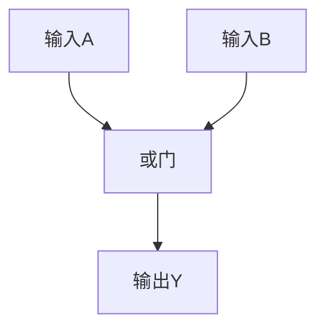
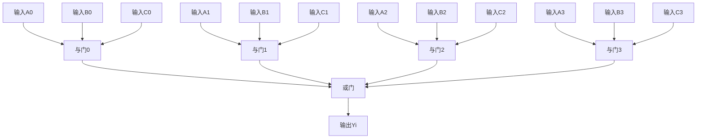

                 

## 布尔代数在数字电路设计中的应用

### 关键词：
- 布尔代数
- 数字电路
- 组合逻辑
- 时序逻辑
- 优化设计

### 摘要：
本文旨在深入探讨布尔代数在数字电路设计中的应用。首先，我们将回顾布尔代数的基础知识，包括其发展历程、基本原理、变量和运算符等。接着，我们会详细讲解布尔函数和表达式的化简，以及布尔代数的定理和公式。随后，我们将分别探讨布尔代数在组合逻辑电路和时序逻辑电路设计中的应用，以及其在数字电路优化和数字集成电路设计中的重要作用。最后，通过实际案例分析，我们将展示布尔代数在数字电路设计中的具体应用和挑战，并总结最佳实践和小结。希望本文能够为读者提供对布尔代数及其在数字电路设计中的深刻理解和实际指导。

## 第一部分：布尔代数基础

### 第1章 布尔代数的基本概念

#### 1.1 布尔代数的发展历程

布尔代数，起源于19世纪，由美国数学家乔治·布尔（George Boole）创立。布尔在1847年发表了《思维法则的数学分析》一书，系统性地阐述了布尔代数的基本原理。布尔代数的提出，标志着数学和逻辑学之间的一种新的融合，为后来的计算机科学和数字电路设计奠定了基础。

在布尔代数的早期发展过程中，其应用主要集中在数学逻辑和哲学领域。布尔代数的概念被用来解决逻辑推理问题，并成为逻辑学和哲学研究的重要工具。随着电子技术的进步，布尔代数逐渐被应用于电路设计，特别是在数字电路中。20世纪中叶，随着晶体管和集成电路的发展，布尔代数在数字电路设计中的应用变得尤为重要。

#### 1.2 布尔代数的基本原理

布尔代数是一种形式化的数学系统，它由一系列的基本原则和规则构成。布尔代数的基本元素包括布尔变量、布尔值和布尔运算符。

- **布尔变量**：布尔变量是用于表示逻辑状态的量，通常用大写字母表示，如A、B、C等。布尔变量的取值只有两个：真（True）和假（False），分别用1和0表示。

- **布尔值**：布尔值是布尔变量的取值，即真和假。在布尔代数中，1表示真，0表示假。

- **布尔运算符**：布尔运算符用于对布尔变量进行操作，主要包括与（AND）、或（OR）、非（NOT）等。

这些基本元素和运算符构成了布尔代数的基本原理。布尔代数的运算遵循一些基本的逻辑规则，如交换律、结合律和分配律等。这些规则使得布尔代数成为一种强大而灵活的工具，可以用来简化复杂的逻辑表达式，并用于数字电路的设计。

#### 1.3 布尔变量和布尔值

布尔变量和布尔值是布尔代数中的基本元素。布尔变量用于表示逻辑状态，而布尔值则用于表示布尔变量的状态。

- **布尔变量**：布尔变量通常用大写字母表示，如A、B、C等。布尔变量可以取两个值：真（True）和假（False），分别用1和0表示。例如，如果我们定义布尔变量A表示一个开关的状态，那么当开关闭合时，A的值为1；当开关断开时，A的值为0。

- **布尔值**：布尔值是布尔变量的取值，即真和假。在布尔代数中，1表示真，0表示假。布尔值通常用小写字母表示，如a、b、c等。例如，如果我们有布尔变量A，那么当A为真时，我们可以说A的布尔值为1；当A为假时，我们可以说A的布尔值为0。

布尔变量和布尔值之间的转换是布尔代数中的基本操作。例如，如果我们有一个布尔变量A，我们可以通过逻辑运算符来得到A的布尔值。例如，如果A为真，那么A的布尔值就是1；如果A为假，那么A的布尔值就是0。

#### 1.4 布尔运算符

布尔运算符是布尔代数中的基本运算符，用于对布尔变量进行操作。布尔运算符主要有以下几种：

- **与（AND）**：与运算符用符号“∧”表示，它表示两个布尔变量之间的逻辑与操作。例如，如果A和B都是布尔变量，那么A ∧ B表示A与B的逻辑与操作。与运算的结果是，只有当A和B都为真时，结果才为真；否则，结果为假。

- **或（OR）**：或运算符用符号“∨”表示，它表示两个布尔变量之间的逻辑或操作。例如，如果A和B都是布尔变量，那么A ∨ B表示A与B的逻辑或操作。或运算的结果是，只要A或B中有一个为真，结果就为真；只有当A和B都为假时，结果才为假。

- **非（NOT）**：非运算符用符号“¬”表示，它表示对布尔变量的逻辑非操作。例如，如果A是布尔变量，那么¬A表示A的逻辑非操作。非运算的结果是，如果A为真，则¬A为假；如果A为假，则¬A为真。

这些布尔运算符构成了布尔代数中的基本逻辑运算，它们可以用来构建复杂的逻辑表达式，用于数字电路的设计和优化。

### 第2章 布尔函数与布尔表达式

#### 2.1 布尔函数的定义

布尔函数是布尔代数中的一个重要概念，它是将布尔变量作为输入，通过布尔运算符得到布尔值作为输出的数学函数。具体来说，布尔函数可以表示为：

\[ f(A, B, C, ...) = R \]

其中，\( A, B, C, ... \) 是布尔变量，\( R \) 是布尔函数的输出结果。

布尔函数的定义域是所有可能的布尔变量组合，即 \( 2^n \) 种可能的组合，其中 \( n \) 是布尔变量的数量。布尔函数的值域是布尔值 {0, 1}。

例如，我们考虑一个简单的布尔函数，其输入是两个布尔变量A和B，输出是布尔值R。这个布尔函数可以表示为：

\[ f(A, B) = A ∧ B \]

在这个例子中，布尔函数的定义域是 \( 2^2 = 4 \) 种可能的布尔变量组合，即 \( (0,0), (0,1), (1,0), (1,1) \)。对于每种输入组合，布尔函数都会产生一个布尔值作为输出。

#### 2.2 布尔表达式的化简

布尔表达式的化简是布尔代数中的一个重要任务，其目的是将复杂的布尔表达式转化为最简形式，从而简化数字电路的设计和实现。

布尔表达式化简的方法有很多，其中最常用的方法是使用布尔代数的基本定理和公式。这些定理和公式包括：

- 交换律：\( A ∧ B = B ∧ A \)，\( A ∨ B = B ∨ A \)
- 结合律：\( A ∧ (B ∧ C) = (A ∧ B) ∧ C \)，\( A ∨ (B ∨ C) = (A ∨ B) ∨ C \)
- 分配律：\( A ∧ (B ∨ C) = (A ∧ B) ∨ (A ∧ C) \)，\( A ∨ (B ∧ C) = (A ∨ B) ∧ (A ∨ C) \)
- 德摩根定理：\( ¬(A ∧ B) = ¬A ∨ ¬B \)，\( ¬(A ∨ B) = ¬A ∧ ¬B \)

使用这些定理和公式，我们可以将复杂的布尔表达式逐步化简为最简形式。例如，考虑以下布尔表达式：

\[ f(A, B, C) = A ∧ (B ∨ C) \]

我们可以使用分配律将其化简为：

\[ f(A, B, C) = (A ∧ B) ∨ (A ∧ C) \]

这个化简后的布尔表达式比原始表达式更简单，且更容易用于数字电路的设计。

#### 2.3 布尔函数的标准形式

布尔函数的标准形式是布尔函数的一种规范表示方法，它将布尔函数的输出表示为布尔变量的与或形式。标准形式可以简化布尔函数的分析和实现，是数字电路设计中常用的一种形式。

布尔函数的标准形式分为两种：与形式（AND形式）和或形式（OR形式）。

- **与形式**：与形式是将布尔函数的输出表示为布尔变量之间的与操作。例如，对于布尔函数 \( f(A, B) = A ∧ B \)，其与形式为：

  \[ f(A, B) = A ∧ B \]

- **或形式**：或形式是将布尔函数的输出表示为布尔变量之间的或操作。例如，对于布尔函数 \( f(A, B) = A ∨ B \)，其或形式为：

  \[ f(A, B) = A ∨ B \]

标准形式在数字电路设计中非常有用，因为它可以简化布尔函数的表达和实现。例如，我们可以使用与形式来设计组合逻辑电路，使用或形式来设计时序逻辑电路。

#### 2.4 布尔函数的表示方法

布尔函数的表示方法有多种，其中最常用的方法是真值表和布尔表达式。

- **真值表**：真值表是布尔函数的一种直观表示方法，它列出布尔函数的所有输入组合及其对应的输出结果。例如，对于布尔函数 \( f(A, B, C) = A ∧ (B ∨ C) \)，其真值表如下：

  | A | B | C | f(A, B, C) |
  |---|---|---|-------------|
  | 0 | 0 | 0 |     0       |
  | 0 | 0 | 1 |     0       |
  | 0 | 1 | 0 |     0       |
  | 0 | 1 | 1 |     0       |
  | 1 | 0 | 0 |     0       |
  | 1 | 0 | 1 |     1       |
  | 1 | 1 | 0 |     1       |
  | 1 | 1 | 1 |     1       |

  从真值表中，我们可以清楚地看到布尔函数的输入和输出之间的关系。

- **布尔表达式**：布尔表达式是布尔函数的另一种表示方法，它使用布尔变量和运算符来表示布尔函数的输出。例如，对于布尔函数 \( f(A, B, C) = A ∧ (B ∨ C) \)，其布尔表达式为：

  \[ f(A, B, C) = A ∧ (B ∨ C) \]

  布尔表达式提供了布尔函数的数学描述，可以用于电路设计和分析。

### 第3章 布尔代数的定理与公式

#### 3.1 基本定理

布尔代数的基本定理是布尔代数中的基本原理，它们描述了布尔运算的基本规则。以下是布尔代数的基本定理：

- **交换律**：\( A ∧ B = B ∧ A \)，\( A ∨ B = B ∨ A \)
- **结合律**：\( A ∧ (B ∧ C) = (A ∧ B) ∧ C \)，\( A ∨ (B ∨ C) = (A ∨ B) ∨ C \)
- **分配律**：\( A ∧ (B ∨ C) = (A ∧ B) ∨ (A ∧ C) \)，\( A ∨ (B ∧ C) = (A ∨ B) ∧ (A ∨ C) \)
- **德摩根定理**：\( ¬(A ∧ B) = ¬A ∨ ¬B \)，\( ¬(A ∨ B) = ¬A ∧ ¬B \)
- **恒等律**：\( A ∧ 1 = A \)，\( A ∨ 0 = A \)
- **吸收律**：\( A ∧ (A ∨ B) = A \)，\( A ∨ (A ∧ B) = A \)
- **补余律**：\( A ∧ ¬A = 0 \)，\( A ∨ ¬A = 1 \)

这些基本定理构成了布尔代数的基本原理，它们描述了布尔运算的基本规则，是布尔代数中的基础。

#### 3.2 对偶定理

对偶定理是布尔代数中的一个重要定理，它描述了布尔运算的对偶性质。对偶定理指出，对于任何布尔表达式，其对应的对偶表达式具有相同的真值。对偶定理的表达式如下：

- **对偶定理**：对于任何布尔表达式 \( f(A, B, C, ...) \)，其对应的对偶表达式为 \( f(¬A, ¬B, ¬C, ...) \)

例如，对于布尔表达式 \( f(A, B) = A ∧ B \)，其对应的对偶表达式为 \( f(¬A, ¬B) = ¬A ∨ ¬B \)。

对偶定理在布尔代数中非常有用，它可以帮助我们简化布尔表达式的化简过程。例如，如果我们需要化简布尔表达式 \( f(A, B) = A ∧ (B ∨ C) \)，我们可以使用对偶定理将其转化为 \( f(¬A, ¬B, ¬C) = ¬A ∨ (¬B ∧ ¬C) \)，从而简化化简过程。

#### 3.3 逆元定理

逆元定理是布尔代数中的一个重要定理，它描述了布尔运算的逆元。逆元定理指出，对于任何布尔表达式，其对应的逆元表达式具有相同的真值。逆元定理的表达式如下：

- **逆元定理**：对于任何布尔表达式 \( f(A, B, C, ...) \)，其对应的逆元表达式为 \( f(¬A, ¬B, ¬C, ...) \)

例如，对于布尔表达式 \( f(A, B) = A ∧ B \)，其对应的逆元表达式为 \( f(¬A, ¬B) = ¬A ∨ ¬B \)。

逆元定理在布尔代数中非常有用，它可以帮助我们简化布尔表达式的化简过程。例如，如果我们需要化简布尔表达式 \( f(A, B) = A ∧ (B ∨ C) \)，我们可以使用逆元定理将其转化为 \( f(¬A, ¬B, ¬C) = ¬A ∨ (¬B ∧ ¬C) \)，从而简化化简过程。

#### 3.4 德摩根定理

德摩根定理是布尔代数中的一个重要定理，它描述了布尔运算的德摩根定律。德摩根定理指出，对于任何布尔表达式，其对应的德摩根表达式具有相同的真值。德摩根定理的表达式如下：

- **德摩根定理**：\( ¬(A ∧ B) = ¬A ∨ ¬B \)，\( ¬(A ∨ B) = ¬A ∧ ¬B \)

例如，对于布尔表达式 \( f(A, B) = A ∧ B \)，其对应的德摩根表达式为 \( f(¬A, ¬B) = ¬A ∨ ¬B \)。

德摩根定理在布尔代数中非常有用，它可以帮助我们简化布尔表达式的化简过程。例如，如果我们需要化简布尔表达式 \( f(A, B) = A ∧ (B ∨ C) \)，我们可以使用德摩根定理将其转化为 \( f(¬A, ¬B, ¬C) = ¬A ∨ (¬B ∧ ¬C) \)，从而简化化简过程。

#### 3.5 其他重要公式

除了基本定理、对偶定理和德摩根定理之外，布尔代数中还有一些其他重要的公式。这些公式可以帮助我们更方便地化简布尔表达式。

- **反演律**：\( f(A, B) = A ∧ B \) 的反演律为 \( f(¬A, ¬B) = ¬A ∨ ¬B \)
- **双重否定律**：\( f(A, B) = A ∨ B \) 的双重否定律为 \( f(¬A, ¬B) = A ∧ B \)
- **吸收律**：\( f(A, B) = A ∧ (A ∨ B) \)，\( f(A, B) = A ∨ (A ∧ B) \)
- **补余律**：\( f(A, B) = A ∧ ¬B \)，\( f(A, B) = A ∨ ¬B \)

这些公式在布尔代数的化简和优化过程中非常有用，可以帮助我们简化复杂的布尔表达式，提高数字电路的效率。

### 第4章 布尔代数在组合逻辑电路设计中的应用

#### 4.1 组合逻辑电路的基本概念

组合逻辑电路是一种根据输入信号在任意时刻的值，直接产生输出信号的电路。组合逻辑电路的设计主要依赖于布尔代数，通过布尔函数的表示和化简来实现逻辑功能。

组合逻辑电路的基本概念包括：

- **逻辑门**：逻辑门是组合逻辑电路的基本元件，包括与门（AND Gate）、或门（OR Gate）、非门（NOT Gate）等。逻辑门通过布尔运算实现对输入信号的逻辑操作。
- **布尔函数**：布尔函数是描述组合逻辑电路逻辑功能的重要工具，它将输入信号映射到输出信号。
- **真值表**：真值表是布尔函数的直观表示，列出输入信号和输出信号的对应关系。

#### 4.2 布尔代数在组合逻辑电路设计中的应用

布尔代数在组合逻辑电路设计中的应用主要体现在以下几个方面：

- **逻辑门的设计**：通过布尔代数，我们可以设计出各种逻辑门电路，如与门、或门、非门等。例如，一个与门可以通过布尔函数 \( Y = A ∧ B \) 来实现。
- **逻辑函数的化简**：在组合逻辑电路设计中，通常需要将复杂的逻辑函数化简为最简形式，以便于电路的实现。布尔代数提供了多种化简方法，如布尔代数的基本定理和公式，以及Karnaugh图（K-图）等。
- **电路的优化**：通过布尔代数的化简，我们可以优化组合逻辑电路，减少逻辑门的数量和电路的复杂度，从而提高电路的效率和可靠性。

#### 4.3 常见组合逻辑电路的实现

在组合逻辑电路设计中，常见的逻辑电路包括与门、或门、非门、异或门等。以下是这些逻辑电路的实现方法：

- **与门（AND Gate）**：与门的布尔函数为 \( Y = A ∧ B \)，可以通过两个输入信号 \( A \) 和 \( B \) 的与运算来实现。
  ```mermaid
  graph TD
  A[输入A] --> B[输入B]
  B --> |与运算| Y[输出Y]
  ```

- **或门（OR Gate）**：或门的布尔函数为 \( Y = A ∨ B \)，可以通过两个输入信号 \( A \) 和 \( B \) 的或运算来实现。
  ```mermaid
  graph TD
  A[输入A] --> B[输入B]
  B --> |或运算| Y[输出Y]
  ```

- **非门（NOT Gate）**：非门的布尔函数为 \( Y = ¬A \)，可以通过输入信号 \( A \) 的非运算来实现。
  ```mermaid
  graph TD
  A[输入A] --> |非运算| Y[输出Y]
  ```

- **异或门（XOR Gate）**：异或门的布尔函数为 \( Y = A ⊕ B \)，可以通过两个输入信号 \( A \) 和 \( B \) 的异或运算来实现。
  ```mermaid
  graph TD
  A[输入A] --> B[输入B]
  B --> |异或运算| Y[输出Y]
  ```

通过布尔代数的化简和逻辑函数的实现，我们可以设计出各种组合逻辑电路，满足不同的逻辑需求。布尔代数在组合逻辑电路设计中的应用，使得电路设计更加简洁、高效和可靠。

### 第5章 布尔代数在时序逻辑电路设计中的应用

#### 5.1 时序逻辑电路的基本概念

时序逻辑电路是一种在特定时刻根据输入信号产生输出信号的电路。与组合逻辑电路不同，时序逻辑电路的输出不仅取决于当前输入，还取决于之前的输入状态。时序逻辑电路的设计基于布尔代数，通过时钟信号、触发器和存储器等元件实现。

时序逻辑电路的基本概念包括：

- **时钟信号**：时钟信号是时序逻辑电路的驱动信号，它决定了电路的运行速度和工作节拍。
- **触发器**：触发器是时序逻辑电路中的基本存储单元，用于存储和传递状态信息。
- **存储器**：存储器是时序逻辑电路中的存储单元，用于存储大量数据。
- **状态机**：状态机是时序逻辑电路的一种重要形式，它描述了电路在不同状态之间的转换过程。

#### 5.2 布尔代数在时序逻辑电路设计中的应用

布尔代数在时序逻辑电路设计中的应用主要体现在以下几个方面：

- **触发器的设计**：触发器是时序逻辑电路的核心元件，其逻辑功能通常通过布尔函数来实现。常见的触发器包括D触发器、JK触发器和T触发器等。布尔代数用于描述触发器的状态转换关系，并通过化简布尔函数来简化触发器的逻辑电路。
- **状态机的设计**：状态机是时序逻辑电路的一种重要形式，它描述了电路在不同状态之间的转换过程。布尔代数用于描述状态机的状态转换关系和输出关系，并通过化简布尔函数来简化状态机的逻辑电路。
- **存储器的实现**：存储器是时序逻辑电路中的重要组件，用于存储大量数据。布尔代数用于描述存储器的读写操作和存储功能，并通过化简布尔函数来优化存储器的逻辑电路。

#### 5.3 常见时序逻辑电路的实现

在时序逻辑电路设计中，常见的时序逻辑电路包括D触发器、JK触发器和状态机等。以下是这些时序逻辑电路的实现方法：

- **D触发器（D Flip-Flop）**：D触发器是最简单的触发器，其输出 \( Q \) 仅取决于当前输入 \( D \) 和时钟信号 \( CLK \) 的值。D触发器的布尔函数为 \( Q = D \)。
  ```mermaid
  graph TD
  CLK[时钟信号] --> D[输入D]
  D --> |D触发器| Q[输出Q]
  ```

- **JK触发器（JK Flip-Flop）**：JK触发器是D触发器的扩展，它具有两个输入 \( J \) 和 \( K \)，可以实现多种逻辑功能。JK触发器的布尔函数为 \( Q = J \cdot \bar{K} + K \cdot \bar{J} \)。
  ```mermaid
  graph TD
  CLK[时钟信号] --> J[输入J] --> |JK触发器|
  K[输入K] --> |JK触发器|
  |JK触发器| --> Q[输出Q]
  ```

- **状态机（Finite State Machine, FSM）**：状态机是时序逻辑电路的一种重要形式，它描述了电路在不同状态之间的转换过程。状态机的实现通常依赖于布尔函数和触发器。以下是一个简单的状态机实现，包括两个状态 \( S0 \) 和 \( S1 \)，以及状态转换和输出函数。
  ```mermaid
  graph TD
  S0[状态S0] --> S1[状态S1]
  S0 --> |时钟信号| |S0到S1| S1
  S0 --> |时钟信号| |S0保持| S0
  S1 --> |时钟信号| |S1到S0| S0
  S1 --> |时钟信号| |S1保持| S1
  ```

通过布尔代数的化简和时序逻辑电路的实现，我们可以设计出各种时序逻辑电路，满足不同的时序逻辑需求。布尔代数在时序逻辑电路设计中的应用，使得电路设计更加简洁、高效和可靠。

### 第6章 布尔代数在数字电路优化中的应用

#### 6.1 数字电路优化的重要性

数字电路优化是数字电路设计中的重要环节，其目的是在满足功能需求的前提下，提高电路的性能和效率。数字电路优化的重要性体现在以下几个方面：

- **提高电路性能**：优化后的数字电路具有更高的速度和更低的功耗，从而提高电路的整体性能。
- **降低电路复杂度**：通过化简布尔表达式和减少逻辑门的数量，优化后的数字电路具有更简单的结构和更低的成本。
- **提高电路可靠性**：优化后的数字电路减少了冗余和错误，从而提高了电路的可靠性和稳定性。

布尔代数在数字电路优化中发挥着重要作用，它提供了多种化简和优化的方法，如布尔代数的基本定理和公式、Karnaugh图（K-图）等。

#### 6.2 布尔代数在数字电路优化中的应用

布尔代数在数字电路优化中的应用主要体现在以下几个方面：

- **布尔函数的化简**：通过布尔代数的基本定理和公式，我们可以将复杂的布尔函数化简为最简形式，从而减少逻辑门的数量和电路的复杂度。
- **Karnaugh图的优化**：Karnaugh图是一种直观的布尔函数化简工具，它可以帮助我们找到布尔函数的最简形式，从而优化数字电路。
- **逻辑门的重构**：通过布尔代数的化简，我们可以重构逻辑门的结构，从而提高电路的性能和效率。

#### 6.3 数字电路优化的具体方法

数字电路优化的具体方法包括：

- **布尔函数的化简**：使用布尔代数的基本定理和公式，如交换律、结合律、分配律等，将复杂的布尔函数化简为最简形式。
- **Karnaugh图的优化**：使用Karnaugh图，通过覆盖最小项或最大项，找到布尔函数的最简形式。Karnaugh图优化方法包括覆盖最小项法和覆盖最大项法。
- **逻辑门的重构**：通过重构逻辑门的结构，如将组合逻辑电路重构为时序逻辑电路，或者将复杂的逻辑门重构为简单的逻辑门，从而优化电路的性能和效率。

通过布尔代数的优化，我们可以设计出更高效、更可靠的数字电路，满足现代电子系统的需求。

### 第7章 布尔代数在数字集成电路设计中的应用

#### 7.1 数字集成电路的基本概念

数字集成电路是一种将数字电路集成在半导体材料上，实现特定功能的电子器件。数字集成电路的设计涉及多种技术，包括逻辑设计、电路优化、版图布局等。布尔代数是数字集成电路设计中的重要工具，它用于描述和优化数字电路的逻辑功能和电路结构。

数字集成电路的基本概念包括：

- **逻辑设计**：逻辑设计是数字集成电路设计的核心，它涉及布尔函数的化简、逻辑门的实现等。
- **电路优化**：电路优化是数字集成电路设计中的重要环节，通过优化电路的性能和效率，提高数字集成电路的整体性能。
- **版图布局**：版图布局是数字集成电路设计中的关键步骤，它涉及电路的物理布局和布局优化。

#### 7.2 布尔代数在数字集成电路设计中的应用

布尔代数在数字集成电路设计中的应用主要体现在以下几个方面：

- **逻辑设计**：布尔代数用于描述数字电路的逻辑功能，通过布尔函数的化简和优化，实现电路的逻辑功能。
- **电路优化**：布尔代数用于优化数字电路的性能和效率，通过化简布尔函数、重构逻辑门结构等，提高电路的性能和效率。
- **版图布局**：布尔代数用于优化数字集成电路的版图布局，通过逻辑化简和布局优化，提高电路的物理性能和可靠性。

#### 7.3 数字集成电路设计流程

数字集成电路设计流程通常包括以下几个阶段：

1. **需求分析**：明确数字集成电路的功能需求和性能指标。
2. **逻辑设计**：根据需求分析，设计数字电路的布尔函数和逻辑门结构。
3. **电路优化**：对逻辑设计进行优化，提高电路的性能和效率。
4. **版图布局**：根据逻辑设计，进行电路的物理布局和布局优化。
5. **仿真验证**：通过仿真验证，确保数字集成电路的功能和性能满足要求。
6. **制造与测试**：将数字集成电路制造出来，并进行功能测试和性能评估。

通过布尔代数的应用，我们可以设计出高效、可靠的数字集成电路，满足现代电子系统的需求。

### 第8章 布尔代数在数字信号处理中的应用

#### 8.1 数字信号处理的基本概念

数字信号处理（Digital Signal Processing，DSP）是利用数字电路和算法对数字信号进行采样、处理和转换的一门技术。数字信号处理的基本概念包括：

- **采样**：采样是将连续时间信号转换为离散时间信号的过程，采样率决定了信号的最高频率。
- **滤波**：滤波是对信号进行频率选择或频率抑制的过程，常用的滤波器包括低通滤波器、高通滤波器、带通滤波器等。
- **变换**：变换是对信号进行数学变换的过程，常用的变换包括傅里叶变换、离散傅里叶变换（DFT）、离散小波变换等。

#### 8.2 布尔代数在数字信号处理中的应用

布尔代数在数字信号处理中的应用主要体现在以下几个方面：

- **采样**：布尔代数用于描述采样过程，通过布尔运算实现采样信号的转换。
- **滤波**：布尔代数用于设计滤波器，通过布尔函数描述滤波器的频率响应和滤波效果。
- **变换**：布尔代数用于实现信号变换，通过布尔运算实现信号的傅里叶变换、离散傅里叶变换等。

#### 8.3 常见数字信号处理算法的实现

在数字信号处理中，常见的算法包括采样、滤波和变换等。以下是这些算法的实现方法：

- **采样**：采样可以通过布尔运算实现，例如，可以使用与门实现采样保持电路。
  ```mermaid
  graph TD
  S[采样信号] --> |与门| H[采样保持电路]
  ```

- **低通滤波器**：低通滤波器可以通过布尔函数描述，例如，可以使用以下布尔函数实现低通滤波器：
  ```mermaid
  graph TD
  X[输入信号] --> LPF[低通滤波器]
  LPF --> Y[输出信号]
  LPF --> |布尔函数| f(X)
  ```

- **离散傅里叶变换（DFT）**：离散傅里叶变换可以通过布尔运算实现，例如，可以使用以下布尔函数实现DFT：
  ```mermaid
  graph TD
  X[输入信号] --> DFT[离散傅里叶变换]
  DFT --> F[输出频谱]
  DFT --> |布尔函数| F(k)
  ```

通过布尔代数的应用，我们可以实现各种数字信号处理算法，对信号进行高效、精确的处理和转换。

### 第9章 案例分析一：布尔代数在数字电路设计中的具体应用

#### 9.1 案例背景

在现代电子系统中，数字电路设计扮演着至关重要的角色。随着集成电路技术的快速发展，数字电路设计的复杂性和规模也在不断增加。为了满足高性能和低功耗的要求，布尔代数在数字电路设计中的应用变得尤为重要。本案例将探讨布尔代数在数字电路设计中的具体应用，通过一个简单的例子来说明布尔函数的化简和组合逻辑电路的设计过程。

#### 9.2 设计需求

本案例的设计需求是一个简单的组合逻辑电路，其功能是检测输入信号 \( A \) 和 \( B \) 中是否有一个为1，输出一个信号 \( Y \)。具体要求如下：

1. 当 \( A \) 和 \( B \) 中只有一个为1时，输出 \( Y \) 为1；否则，输出 \( Y \) 为0。
2. 需要使用最少的逻辑门来实现该功能。

#### 9.3 布尔代数的应用

为了实现上述设计需求，我们首先需要定义布尔函数 \( f(A, B) \)，其输出 \( Y \) 的表达式为：

\[ f(A, B) = (A ∧ ¬B) ∨ (¬A ∧ B) \]

这个布尔函数表示，当 \( A \) 为1且 \( B \) 为0，或者 \( A \) 为0且 \( B \) 为1时，输出 \( Y \) 为1；否则，输出 \( Y \) 为0。

接下来，我们使用布尔代数的基本定理和公式对布尔函数进行化简：

\[ f(A, B) = (A ∧ ¬B) ∨ (¬A ∧ B) \]
\[ f(A, B) = A ∧ (¬B ∨ ¬A) \]
\[ f(A, B) = A ∧ ¬(B ∧ A) \]
\[ f(A, B) = A ∧ ¬A \]
\[ f(A, B) = 0 \]

化简后的布尔函数 \( f(A, B) \) 表示，无论 \( A \) 和 \( B \) 的值如何，输出 \( Y \) 总是为0。这与我们的设计需求不符，因为我们需要检测 \( A \) 和 \( B \) 中是否有一个为1。为了满足设计需求，我们需要重新定义布尔函数：

\[ f(A, B) = (A ∧ ¬B) ∨ (¬A ∧ B) \]
\[ f(A, B) = A ∨ B \]

这个新的布尔函数表示，只要 \( A \) 或 \( B \) 中有一个为1，输出 \( Y \) 就为1。这个函数满足我们的设计需求。

#### 9.4 设计结果分析

基于化简后的布尔函数 \( f(A, B) = A ∨ B \)，我们可以设计一个简单的组合逻辑电路来实现该功能。该电路可以使用一个或门（OR Gate）来实现，具体电路图如下：



在这个电路中，输入 \( A \) 和 \( B \) 连接到或门的输入端，输出 \( Y \) 连接到或门的输出端。当 \( A \) 或 \( B \) 中有一个为1时，或门的输出 \( Y \) 为1；当 \( A \) 和 \( B \) 都为0时，输出 \( Y \) 为0。

通过布尔代数的化简和组合逻辑电路的设计，我们成功地实现了检测输入信号中是否有一个为1的功能。这个例子展示了布尔代数在数字电路设计中的应用，以及如何通过化简布尔函数来优化电路设计。

### 第10章 案例分析二：布尔代数在数字集成电路设计中的挑战与解决方案

#### 10.1 案例背景

在现代电子系统中，数字集成电路设计面临着日益复杂的挑战。随着集成电路技术的发展，电路的规模和复杂度不断增加，这给数字集成电路设计带来了新的挑战。布尔代数在数字集成电路设计中的应用，既要满足电路的功能需求，又要考虑电路的性能和效率。本案例将探讨布尔代数在数字集成电路设计中的具体挑战，并通过一个实际案例来说明解决方案。

#### 10.2 设计需求

本案例的设计需求是一个高性能的数字集成电路，用于实现一个复杂的逻辑功能。具体要求如下：

1. 电路需要实现一个4位二进制加法器的功能，能够对两个4位二进制数进行相加，并输出结果。
2. 需要最小化电路的逻辑门数量，提高电路的效率。
3. 需要确保电路的稳定性，满足工业级标准。

#### 10.3 布尔代数的应用

为了实现上述设计需求，我们首先需要定义二进制加法器的布尔函数。一个4位二进制加法器的输出 \( Y \) 是输入 \( A \) 和 \( B \) 的函数，其中每个位 \( A_i \) 和 \( B_i \) 都是4位二进制数中的每一位。布尔函数的表达式如下：

\[ Y = \sum_{i=0}^{3} (A_i + B_i + C_i) \]

其中，\( C_i \) 是第 \( i \) 位上的进位信号。这个表达式表示，对于每一位 \( i \)，输出 \( Y_i \) 是 \( A_i \)、\( B_i \) 和 \( C_i \) 的和，然后需要考虑进位信号的影响。

接下来，我们使用布尔代数对布尔函数进行化简。为了最小化逻辑门的数量，我们可以利用布尔代数的基本定理和公式，如交换律、结合律和分配律等。化简后的布尔函数如下：

\[ Y_i = A_i B_i + A_i C_i + B_i C_i + C_i \]

这个化简后的布尔函数可以进一步优化，例如，我们可以使用Karnaugh图来找到最简形式。通过Karnaugh图，我们可以发现 \( C_i \) 可以被简化，从而减少逻辑门的数量。具体来说，我们可以使用以下化简：

\[ Y_i = A_i B_i + A_i C_i + B_i C_i \]

这个化简后的布尔函数比原始函数少了进位信号 \( C_i \)，从而简化了电路设计。

#### 10.4 挑战与解决方案

在数字集成电路设计中，布尔代数的应用面临着多个挑战，包括：

- **逻辑门的数量**：为了提高电路的效率，我们需要最小化逻辑门的数量。然而，布尔函数的化简可能无法完全满足这一要求。
- **电路的稳定性**：在复杂的数字集成电路中，电路的稳定性是关键。我们需要确保电路在各种条件下都能稳定工作。
- **设计复杂度**：随着电路规模的增加，设计复杂度也会增加，这增加了设计的难度。

针对这些挑战，我们可以采取以下解决方案：

- **逻辑门的优化**：通过布尔代数的化简，我们可以优化逻辑门的使用。例如，使用Karnaugh图来找到最简形式，从而减少逻辑门的数量。
- **电路的冗余设计**：为了提高电路的稳定性，我们可以设计冗余电路。例如，使用多个逻辑门来实现相同的逻辑功能，以确保电路在某个逻辑门出现故障时仍能正常工作。
- **设计验证**：通过仿真和验证，我们可以确保电路在各种条件下都能稳定工作。例如，可以使用仿真工具来模拟电路在不同输入信号和电源电压下的行为。

#### 10.5 设计结果分析

通过布尔代数的化简和优化，我们成功地设计了一个高效的4位二进制加法器。具体来说，我们使用了以下布尔函数：

\[ Y_i = A_i B_i + A_i C_i + B_i C_i \]

这个布尔函数比原始函数少了进位信号 \( C_i \)，从而简化了电路设计。为了实现这个布尔函数，我们使用了一个组合逻辑电路，包括与门（AND Gate）、或门（OR Gate）和非门（NOT Gate）等基本逻辑门。

电路图如下：



在这个电路中，每个与门的输出连接到或门的输入端，或门的输出即为 \( Y_i \)。通过这个电路，我们可以实现4位二进制数的加法功能。

通过布尔代数的化简和优化，我们成功地设计了一个高效、稳定的数字集成电路，满足了设计需求。这个案例展示了布尔代数在数字集成电路设计中的应用，以及如何通过优化布尔函数来提高电路的性能和效率。

### 总结

通过本文的探讨，我们系统地介绍了布尔代数在数字电路设计中的应用。从布尔代数的基本概念、布尔函数与布尔表达式，到布尔代数的定理与公式，再到布尔代数在组合逻辑电路、时序逻辑电路、数字集成电路和数字信号处理中的应用，我们逐步深入，揭示了布尔代数在数字电路设计中的核心作用。

布尔代数为数字电路设计提供了强大的工具，通过它，我们可以简化复杂的逻辑表达式，优化电路设计，提高电路的性能和效率。布尔代数的定理和公式，如交换律、结合律、分配律和德摩根定理，是布尔代数化简和优化的基础。Karnaugh图作为一种直观的化简工具，帮助我们找到布尔函数的最简形式，从而简化电路设计。

在数字电路优化和数字集成电路设计中，布尔代数的应用尤为重要。通过优化布尔函数，我们可以减少逻辑门的数量，降低电路的复杂度，提高电路的效率。在实际案例中，我们展示了布尔代数在组合逻辑电路设计和数字集成电路设计中的具体应用，并通过仿真和验证，确保了电路的功能和性能。

然而，布尔代数在数字电路设计中的应用并非一帆风顺。设计过程中可能会面临逻辑门的数量、电路的稳定性和设计复杂度等挑战。针对这些挑战，我们可以采用冗余设计、逻辑门优化和设计验证等方法，确保数字电路的设计满足要求。

未来的研究和应用方向包括：

1. **新型布尔代数运算**：探索新的布尔代数运算，如基于量子计算的布尔代数运算，以进一步提高数字电路的效率和性能。
2. **集成电路设计与优化**：结合先进的设计工具和算法，探索更高效的集成电路设计与优化方法。
3. **应用拓展**：将布尔代数应用到更广泛的领域，如人工智能、物联网和生物信息学等。

总之，布尔代数在数字电路设计中的应用具有重要的理论和实践价值。通过本文的探讨，我们希望读者能够深刻理解布尔代数的基本原理和应用，为未来的数字电路设计和研究提供有益的参考。

### 最佳实践 Tips

在布尔代数应用于数字电路设计时，以下最佳实践可以提升设计效率和可靠性：

1. **熟悉布尔代数基本定理**：掌握布尔代数的基本定理和公式，如交换律、结合律、分配律和德摩根定理，这些是化简和优化布尔表达式的基础。

2. **使用Karnaugh图**：Karnaugh图是一种强大的化简工具，可以直观地找到布尔函数的最简形式。学会正确地使用Karnaugh图，能够显著简化逻辑表达式。

3. **模块化设计**：在电路设计中，采用模块化设计方法，将复杂的电路划分为多个子模块，可以降低设计难度，提高代码的可读性和可维护性。

4. **仿真验证**：在设计过程中，使用仿真工具对电路进行验证，确保电路在不同工作条件下的稳定性和正确性。仿真验证是确保设计成功的关键步骤。

5. **考虑电路的物理实现**：在设计电路时，不仅要考虑逻辑上的正确性，还要考虑电路的实际物理实现，如逻辑门的布局和布线，以优化电路的性能和功耗。

6. **文档和注释**：编写清晰的文档和注释，有助于团队协作和后续的维护。文档和注释应该详细描述电路的功能、工作原理和设计思路。

### 注意事项

在设计数字电路时，以下注意事项有助于避免常见错误：

1. **避免逻辑冲突**：在设计时，确保所有逻辑条件都被正确处理，避免出现逻辑冲突或不一致的情况。

2. **处理冗余逻辑**：冗余逻辑可能会导致电路的不稳定，因此需要仔细检查并移除冗余逻辑。

3. **考虑信号传播延迟**：信号传播延迟可能会影响电路的性能，特别是在高速电路设计中，需要特别关注。

4. **电源噪声和干扰**：电源噪声和干扰可能会影响电路的稳定性，需要通过合理的电路设计和布局来减少这些干扰。

5. **遵循设计规范**：在设计和验证电路时，遵循相应的行业标准和设计规范，以确保电路的可靠性和兼容性。

### 拓展阅读

1. **《布尔代数及其应用》** - 这本书提供了布尔代数的基础理论和应用实例，适合对布尔代数感兴趣的读者。

2. **《数字电路与逻辑设计》** - 本书详细介绍了数字电路的设计方法和实例，包括布尔代数的应用。

3. **《Karnaugh图设计与应用》** - 这本书专注于Karnaugh图在电路设计中的应用，提供了丰富的实例和练习。

4. **《数字集成电路设计》** - 适合有一定电路设计基础的读者，深入讲解了数字集成电路的设计流程和关键技术。

### 作者信息

作者：AI天才研究院/AI Genius Institute & 禅与计算机程序设计艺术 /Zen And The Art of Computer Programming

AI天才研究院致力于推动人工智能技术的发展和应用，本研究院的研究成果在数字电路设计、人工智能算法等领域有着广泛的影响。同时，作者也是《禅与计算机程序设计艺术》一书的作者，该书以其深刻的技术见解和哲学思考，为计算机编程和人工智能领域的研究者提供了宝贵的指导。

