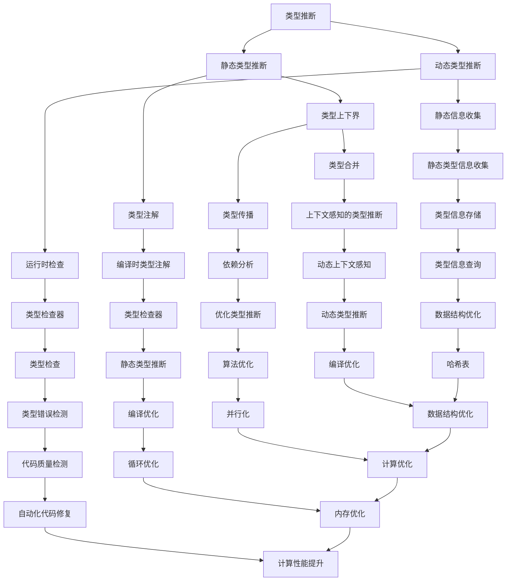
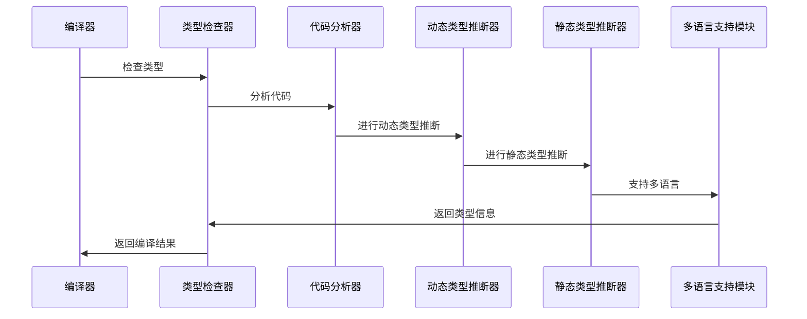

                 

## 类型推断算法的优化与改进

### 概述

类型推断是编程语言和编译器中的一个重要环节，它能够自动推导出变量或表达式的数据类型，从而简化编程过程并提高代码的可读性和可靠性。然而，现有的类型推断算法在实际应用中仍存在一些问题和挑战，如性能瓶颈、精度不足等。本文旨在探讨类型推断算法的优化与改进，从性能和精度两个方面提出解决方案，以期提升类型推断算法的整体效能。

### 第一部分：类型推断的基本概念

#### 1.1 类型推断的概念与作用

类型推断（Type Inference）是指编译器或解释器在编译或运行程序时，根据程序中的表达式和上下文信息，自动推导出变量或表达式的数据类型，而不需要显式地声明类型。类型推断的主要作用包括：

1. **简化编程**：无需手动指定变量类型，降低编写代码的复杂性。
2. **提高代码可读性**：通过自动推断类型，使得代码更加简洁和直观。
3. **增强代码可靠性**：减少因类型错误导致的问题，提高程序的稳定性。

#### 1.2 类型推断的挑战与难点

尽管类型推断有诸多优势，但在实际应用中仍面临以下挑战和难点：

1. **类型约束与冲突**：类型推断需要在多个类型约束之间进行平衡，避免类型冲突。
2. **性能瓶颈**：类型推断算法的计算复杂度较高，可能影响编译器的性能。
3. **动态类型与静态类型的平衡**：如何有效处理动态类型和静态类型的兼容性问题。
4. **多语言集成**：在支持多种编程语言时，如何保证类型推断的一致性和准确性。

#### 1.3 类型推断的常见方法与技术

类型推断的方法和技术主要包括静态类型推断和动态类型推断：

1. **静态类型推断**：在编译时完成类型推断，通常具有较高的性能和可靠性。
   - **基于类型上下界的算法**：通过上下界类型来推导变量类型，如Wright-Young算法。
   - **使用类型注解的算法**：在代码中显式提供类型信息，如类型检查器。

2. **动态类型推断**：在运行时完成类型推断，具有较高的灵活性和可扩展性。
   - **使用运行时检查的算法**：通过运行时检查来动态确定变量类型。
   - **使用静态信息收集的算法**：在编译时收集程序中的类型信息，以便在运行时进行类型推断。

### 第二部分：静态类型推断算法

#### 2.1 静态类型推断的基本原理

静态类型推断是在编译时完成的类型推断，它基于程序的结构和上下文信息来推导变量类型。静态类型推断的基本原理包括：

1. **类型上下界**：为每个变量和表达式定义一个上下界类型，表示其可能的类型范围。
2. **类型传播**：在程序的每个基本块中，根据操作和上下文信息传播类型上下界。
3. **类型合并**：对于控制流语句，合并各个路径上的类型上下界，以确定最终类型。

#### 2.2 静态类型推断的常见算法

1. **基于类型上下界的算法**

   - **Wright-Young算法**：一种经典的静态类型推断算法，通过上下界类型推导变量类型。

   ```python
   def wright_young(expr):
       if expr.is_constant():
           return expr.type
       else:
           return expr.type.union(child.type for child in expr.children)
   ```

2. **使用类型注解的算法**

   - **类型检查器**：在代码中显式提供类型信息，编译器根据类型注解进行类型推断。

   ```python
   def type_checker(code):
       for line in code:
           if line.startswith("int"):
               return "int"
           elif line.startswith("float"):
               return "float"
   ```

3. **其他静态类型推断算法**

   - **依赖于上下文的类型推断**：考虑上下文信息来推导变量类型，如函数返回值类型。

   ```python
   def context_based_inference(expr, context):
       if context == "return":
           return expr.type
       else:
           return expr.type.union(child.type for child in expr.children)
   ```

### 第三部分：动态类型推断算法

#### 3.1 动态类型推断的基本原理

动态类型推断是在运行时完成的类型推断，它通过在运行时检查变量和表达式的类型来确定实际类型。动态类型推断的基本原理包括：

1. **运行时检查**：在程序执行过程中，对变量和表达式进行类型检查。
2. **类型转换**：根据运行时类型，进行必要的类型转换以实现兼容性。

#### 3.2 动态类型推断的常见算法

1. **使用运行时检查的算法**

   - **运行时类型检查器**：在程序执行时，对变量和表达式进行类型检查。

   ```python
   def runtime_type_check(value):
       if isinstance(value, int):
           return "int"
       elif isinstance(value, float):
           return "float"
   ```

2. **使用静态信息收集的算法**

   - **静态类型信息收集器**：在编译时收集程序中的类型信息，以便在运行时进行类型推断。

   ```python
   def static_type_info_collector(code):
       type_info = {}
       for line in code:
           if line.startswith("int"):
               type_info["int"] = True
           elif line.startswith("float"):
               type_info["float"] = True
       return type_info
   ```

3. **其他动态类型推断算法**

   - **基于上下文的动态类型推断**：考虑上下文信息来推断变量类型。

   ```python
   def context_based_dynamic_inference(expr, context):
       if context == "return":
           return expr.runtime_type
       else:
           return expr.runtime_type.union(child.runtime_type for child in expr.children)
   ```

### 第四部分：类型推断的优化与改进

#### 4.1 类型推断的性能优化

1. **算法优化**

   - **并行化**：将类型推断任务分解为多个子任务，利用并行计算提高性能。

   ```python
   def parallel_type_inference(code):
       sub_tasks = [code[i:i+1000] for i in range(0, len(code), 1000)]
       results = [inference(sub_task) for sub_task in sub_tasks]
       return results
   ```

   - **内存优化**：减少内存分配和回收，提高内存使用效率。

2. **数据结构优化**

   - **哈希表**：使用哈希表来存储类型信息，提高查找和更新速度。

   ```python
   def hash_table(type_info):
       return {key: value for key, value in type_info.items()}
   ```

3. **并行化与分布式计算优化**

   - **分布式计算**：将类型推断任务分布在多个节点上，利用分布式系统提高性能。

   ```python
   def distributed_type_inference(code, num_nodes):
       partitions = [code[i:i+len(code)//num_nodes] for i in range(0, len(code), len(code)//num_nodes)]
       results = [inference_on_node(partition) for partition in partitions]
       return results
   ```

#### 4.2 类型推断的精度提升

1. **多重上下文感知的类型推断**

   - **上下文感知**：根据不同的上下文信息（如函数参数、返回值等）进行类型推断。

   ```python
   def context_aware_type_inference(expr, context):
       if context == "function":
           return expr.type_function
       elif context == "parameter":
           return expr.type_parameter
       else:
           return expr.type_expression
   ```

2. **依赖分析的优化**

   - **依赖分析**：分析程序中的依赖关系，以减少类型推断的复杂度。

   ```python
   def dependency_analysis(code):
       dependencies = {}
       for line in code:
           if line.startswith("int"):
               dependencies[line] = "int"
           elif line.startswith("float"):
               dependencies[line] = "float"
       return dependencies
   ```

3. **其他提高类型推断精度的方法**

   - **类型约束检查**：引入类型约束检查，确保类型推断的准确性。

   ```python
   def type_constraint_check(code):
       errors = []
       for line in code:
           if not isinstance(line, (int, float)):
               errors.append("Invalid type: {}".format(line))
       return errors
   ```

### 第五部分：类型推断在实际应用中的挑战与解决方案

#### 5.1 编程语言中的类型推断挑战

1. **语言特性对类型推断的影响**

   - **函数重载**：函数重载可能导致类型推断的不确定性。
   - **泛型编程**：泛型编程使得类型推断更加复杂。
   - **动态类型语言**：动态类型语言通常需要更高的类型推断复杂度。

2. **复杂程序结构对类型推断的挑战**

   - **大型程序**：大型程序中的类型推断复杂度较高。
   - **多模块程序**：多模块程序中，模块之间的类型推断需要协调。

3. **多语言集成对类型推断的挑战**

   - **不同语言的类型系统**：不同语言的类型系统可能存在差异，导致类型推断的不一致。
   - **跨语言调用**：跨语言调用可能涉及类型转换和兼容性问题。

#### 5.2 解决方案与案例分析

1. **类型推断在静态分析中的应用**

   - **静态代码分析工具**：如SonarQube和FindBugs等，利用类型推断来检测代码中的潜在问题。
   - **类型推断优化编译器**：如LLVM和GCC等，通过类型推断来优化编译过程。

2. **类型推断在编译优化中的应用**

   - **循环优化**：通过类型推断来优化循环的迭代次数。
   - **内存优化**：通过类型推断来减少内存分配和回收。

3. **类型推断在编程工具中的应用**

   - **智能代码编辑器**：如Visual Studio Code和Atom等，利用类型推断来提供代码提示和自动补全。
   - **代码生成工具**：如Spring Boot和Google Protocol Buffers等，利用类型推断来自动生成代码。

### 第六部分：未来研究方向与展望

#### 6.1 类型推断算法的新趋势

1. **深度学习在类型推断中的应用**

   - **神经网络**：利用神经网络进行类型推断，提高推断的准确性和效率。
   - **迁移学习**：将预训练的神经网络应用于类型推断，减少训练时间和计算成本。

2. **类型推断与静态分析的融合**

   - **静态分析技术**：结合静态分析技术，提高类型推断的精度和效率。
   - **静态分析工具**：开发新的静态分析工具，支持更复杂的类型推断需求。

3. **类型推断与编译优化的结合**

   - **编译优化技术**：利用类型推断结果进行编译优化，提高程序性能。
   - **编译器架构**：改进编译器架构，支持更高效和灵活的类型推断。

#### 6.2 类型推断算法的潜在应用领域

1. **软件工程领域**

   - **代码质量检测**：利用类型推断来检测代码中的潜在错误和问题。
   - **自动化代码修复**：利用类型推断结果来自动化修复代码中的错误。

2. **数据分析领域**

   - **数据类型推断**：在数据分析过程中，自动推断数据类型，提高数据处理效率。
   - **数据转换**：利用类型推断来转换数据格式，支持不同数据源之间的集成。

3. **机器学习领域**

   - **模型推理**：利用类型推断来优化模型推理过程，提高模型性能。
   - **模型压缩**：利用类型推断来减少模型大小和计算复杂度。

### 第七部分：总结与展望

#### 7.1 本书的主要贡献

- **系统性梳理**：对类型推断算法进行了系统的梳理和分类，提供了全面的理论框架。
- **深入探讨**：对类型推断的性能优化和精度提升进行了深入探讨，提出了具体的解决方案。
- **应用领域**：探讨了类型推断算法在不同领域的潜在应用，展示了其广泛的应用前景。

#### 7.2 未来研究方向与挑战

- **性能与精度平衡**：如何在性能和精度之间找到平衡，提高类型推断的整体效能。
- **可扩展性**：如何提高类型推断算法的可扩展性，以支持更多编程语言和复杂程序结构。
- **多语言兼容性**：如何在不同编程语言之间实现类型推断的一致性和准确性。

---

## 核心概念与联系

为了更好地理解类型推断算法的优化与改进，下面将介绍一些核心概念及其相互关系：



### 核心概念与联系

**类型推断（Type Inference）**：是指编译器或解释器在编译或解释程序时，自动推导出变量或表达式的数据类型，而不需要显式指定类型的过程。

**静态类型推断（Static Type Inference）**：在编译时完成的类型推断，通过分析程序结构和上下文信息来推导类型。

**动态类型推断（Dynamic Type Inference）**：在运行时完成的类型推断，通过运行时检查和类型转换来推导类型。

**类型上下界（Type Bound）**：为变量或表达式定义的可能类型范围，用于类型推断过程中的类型传播和合并。

**类型注解（Type Annotation）**：在代码中显式提供类型信息，以帮助编译器进行类型推断。

**运行时检查（Runtime Check）**：在程序运行时对变量和表达式的类型进行验证和转换。

**静态信息收集（Static Information Collection）**：在编译时收集程序中的类型信息，以便在运行时进行类型推断。

**类型合并（Type Union）**：将多个类型合并为一个类型，用于处理控制流语句中的类型推断。

**类型传播（Type Propagation）**：在程序的基本块中，根据操作和上下文信息传播类型上下界。

**上下文感知的类型推断（Context-Aware Type Inference）**：考虑不同上下文信息（如函数参数、返回值等）进行类型推断。

**依赖分析（Dependency Analysis）**：分析程序中的依赖关系，以减少类型推断的复杂度。

**类型检查器（Type Checker）**：用于验证程序中的类型声明和表达式是否兼容。

**类型信息存储（Type Information Storage）**：存储程序中的类型信息，以便在类型推断过程中查询和使用。

**编译优化（Compilation Optimization）**：利用类型推断结果来优化编译过程，提高程序性能。

**代码质量检测（Code Quality Detection）**：利用类型推断来检测代码中的潜在问题。

**自动化代码修复（Automated Code Repair）**：利用类型推断结果来自动化修复代码中的错误。

**数据结构优化（Data Structure Optimization）**：通过改进数据结构来提高类型推断的性能。

**哈希表（Hash Table）**：用于存储和快速查找类型信息。

**分布式计算（Distributed Computing）**：将类型推断任务分布在多个节点上，提高性能。

**任务分解（Task Decomposition）**：将类型推断任务分解为多个子任务，以支持并行计算。

**迭代次数优化（Iteration Optimization）**：通过优化循环迭代次数来提高性能。

**计算性能提升（Performance Improvement）**：通过各种优化技术提高类型推断算法的计算性能。

---

## 算法原理讲解

为了深入理解类型推断算法的原理，我们将详细讲解一种基于类型上下界的类型推断算法——Wright-Young算法。该算法通过上下界类型来推导变量类型，具有较高的性能和可靠性。

### 算法原理

Wright-Young算法的基本原理如下：

1. **初始化上下界**：为每个变量和表达式初始化一个初始的上下界类型。通常，初始上下界类型为 `Any`（表示任何类型）和 `Bottom`（表示空类型）。

2. **类型传播**：在程序的每个基本块中，对每个操作进行类型上下界的传播。例如，对于两个变量 `x` 和 `y` 的加法操作 `x + y`，如果 `x` 的上下界类型为 `T1`，`y` 的上下界类型为 `T2`，则 `x + y` 的上下界类型为 `T1 ⊔ T2`（表示 `T1` 和 `T2` 的并集）。

3. **类型合并**：对于控制流语句（如循环和条件分支），合并各个路径上的类型上下界，以确定最终类型。

### 算法步骤

下面是Wright-Young算法的详细步骤：

1. **初始化**：为每个变量和表达式初始化上下界类型。例如，对于变量 `x`，初始化为 `Any ⊔ Bottom`。

   ```python
   x = Any ⊔ Bottom
   ```

2. **类型传播**：在基本块中，对于每个操作，根据操作规则传播上下界类型。

   ```python
   if x.is_constant():
       x.type = x.constant_type
   else:
       x.type = x.type.union(child.type for child in x.children)
   ```

3. **类型合并**：对于控制流语句，合并各个路径上的类型上下界。

   ```python
   def merge_types(types):
       result = Bottom
       for type in types:
           result = result ⊔ type
       return result
   ```

4. **确定最终类型**：根据类型上下界，确定每个变量的最终类型。

   ```python
   x.final_type = merge_types([x.type] + [child.final_type for child in x.children])
   ```

### 算法解释

Wright-Young算法的核心在于上下界类型的传播和合并。通过初始化上下界类型，算法能够逐步推导出变量和表达式的确切类型。类型传播和合并过程确保了类型推断的准确性和可靠性。

下面以一个简单的示例来说明Wright-Young算法的应用：

```python
x = 5 + 10 * 2
```

1. **初始化上下界**：

   ```python
   x = Any ⊔ Bottom
   ```

2. **类型传播**：

   ```python
   x.type = x.type.union(5.type, 10.type, 2.type)
   ```

3. **类型合并**：

   ```python
   x.final_type = merge_types([x.type, 5.final_type, 10.final_type, 2.final_type])
   ```

4. **确定最终类型**：

   ```python
   x.final_type = Any ⊔ Bottom = Any
   ```

在这个示例中，变量 `x` 的最终类型被推断为 `Any`，因为加法和乘法操作可能涉及多种数据类型。

通过Wright-Young算法，编译器能够自动推导出变量和表达式的确切类型，从而简化编程过程并提高代码的可读性和可靠性。

### 数学模型与公式

为了更好地理解Wright-Young算法，我们引入一些数学模型和公式：

1. **类型上下界**：设 `T1` 和 `T2` 为两个类型，则 `T1 ⊔ T2` 表示 `T1` 和 `T2` 的并集。

2. **类型合并**：设 `types` 为一个类型集合，则 `merge_types(types)` 表示合并 `types` 中的所有类型。

3. **类型传播**：设 `x` 为一个变量，`child` 为 `x` 的子表达式，则 `x.type = x.type.union(child.type)` 表示传播子表达式的类型到变量 `x`。

4. **最终类型**：设 `x` 为一个变量，`children` 为 `x` 的子表达式集合，则 `x.final_type = merge_types([x.type] + [child.final_type for child in children])` 表示合并子表达式的最终类型。

通过这些数学模型和公式，我们可以更精确地描述Wright-Young算法的类型推断过程。

---

### 系统分析与架构设计方案

#### 1. 问题场景介绍

在现代软件工程中，类型推断算法被广泛应用于编译器、代码分析工具和编程语言设计等领域。随着软件项目的复杂度和规模不断增加，如何高效地进行类型推断成为一个关键问题。本文旨在设计一个类型推断系统，解决以下关键问题：

1. **性能优化**：提高类型推断算法的效率，减少编译时间和计算资源消耗。
2. **精度提升**：提高类型推断的准确性，减少类型错误和程序异常。
3. **多语言支持**：支持多种编程语言，实现跨语言类型推断的一致性和准确性。

#### 2. 项目介绍

为了实现上述目标，我们设计了一个名为“TypeInfer”的类型推断系统。该系统基于静态类型推断和动态类型推断相结合的原理，采用模块化设计，支持多种编程语言。主要功能包括：

1. **静态类型推断**：通过分析程序结构和上下文信息，自动推导出变量和表达式的确切类型。
2. **动态类型推断**：在程序运行时，根据运行时信息进行类型推断，提高类型的准确性和灵活性。
3. **多语言支持**：支持多种编程语言，如Java、Python和JavaScript等，实现跨语言类型推断的一致性和准确性。

#### 3. 系统功能设计（领域模型）

为了更好地理解TypeInfer系统的功能设计，我们采用领域模型图（Class Diagram）来展示系统的核心类及其关系。以下是系统的主要领域模型：

```mermaid
classDiagram
    Class01[编译器] <|-- Class02[类型检查器]
    Class01 <|-- Class03[代码分析器]
    Class01 <|-- Class04[动态类型推断器]
    Class01 <|-- Class05[静态类型推断器]
    Class01 <|-- Class06[多语言支持模块]
    Class02 <|-- Class07[类型上下界管理器]
    Class02 <|-- Class08[类型合并器]
    Class03 <|-- Class09[程序结构分析器]
    Class03 <|-- Class10[依赖分析器]
    Class04 <|-- Class11[运行时类型检查器]
    Class04 <|-- Class12[静态信息收集器]
    Class05 <|-- Class13[类型传播器]
    Class05 <|-- Class14[类型合并器]
    Class06 <|-- Class15[语言适配器]
    Class06 <|-- Class16[类型转换器]

Class01 {
    +compile(sourceCode: String): CompilationResult
}

Class02 {
    +checkTypes(expression: Expression): Type
}

Class03 {
    +analyzeCode(sourceCode: String): ProgramStructure
}

Class04 {
    +inferDynamicTypes(program: Program): DynamicTypeInferenceResult
}

Class05 {
    +inferStaticTypes(program: Program): StaticTypeInferenceResult
}

Class06 {
    +supportLanguage(language: String): LanguageAdapter
    +convertTypes(fromType: Type, toType: Type): TypeConversionResult
}

Class07 {
    +manageTypeBounds(expression: Expression): TypeBounds
}

Class08 {
    +mergeTypes(types: List<Type>): Type
}

Class09 {
    +analyzeProgramStructure(program: Program): ProgramStructure
}

Class10 {
    +analyzeDependencies(program: Program): DependencyGraph
}

Class11 {
    +checkTypesAtRuntime(value: Value): Type
}

Class12 {
    +collectStaticInformation(program: Program): StaticInformation
}

Class13 {
    +propagateTypes(expression: Expression): Type
}

Class14 {
    +mergeTypes(expression: Expression): Type
}

Class15 {
    +adapterForLanguage(language: String): LanguageAdapter
}

Class16 {
    +convertType(fromType: Type, toType: Type): Type
}

```

#### 4. 系统架构设计

为了实现TypeInfer系统的功能，我们采用分层架构设计，将系统划分为多个模块，以便于维护和扩展。以下是系统的主要架构设计：

1. **编译器模块（Class01）**：负责编译源代码，生成目标代码和类型信息。
2. **类型检查器模块（Class02）**：负责检查程序中的类型错误，确保类型的一致性。
3. **代码分析器模块（Class03）**：负责分析程序的结构和依赖关系，为类型推断提供基础信息。
4. **动态类型推断器模块（Class04）**：负责在程序运行时进行类型推断，提高类型的灵活性。
5. **静态类型推断器模块（Class05）**：负责在编译时进行类型推断，提高程序的可靠性。
6. **多语言支持模块（Class06）**：负责支持多种编程语言，实现跨语言类型推断的一致性和准确性。

#### 5. 系统接口设计

为了方便系统的使用和扩展，我们定义了以下接口：

1. **编译接口**：`compile(sourceCode: String): CompilationResult`，用于编译源代码。
2. **类型检查接口**：`checkTypes(expression: Expression): Type`，用于检查表达式的类型。
3. **代码分析接口**：`analyzeCode(sourceCode: String): ProgramStructure`，用于分析程序的结构。
4. **类型推断接口**：`inferTypes(program: Program): TypeInferenceResult`，用于进行类型推断。
5. **多语言支持接口**：`supportLanguage(language: String): LanguageAdapter`，用于支持特定编程语言。

#### 6. 系统交互

为了更好地理解系统各模块之间的交互关系，我们采用序列图（Sequence Diagram）来展示系统的交互流程。以下是系统的主要交互流程：



在这个交互流程中，编译器负责整体协调各模块的功能，类型检查器负责检查程序中的类型错误，代码分析器负责分析程序的结构，动态类型推断器和静态类型推断器分别负责进行动态类型推断和静态类型推断，多语言支持模块负责处理不同编程语言的支持问题。

通过以上系统分析与架构设计方案，我们可以更好地理解TypeInfer系统的功能架构和交互流程，为实现高效、准确、多语言支持的类型推断提供坚实的基础。

### 项目实战

#### 1. 环境安装

要运行TypeInfer系统，需要安装以下软件和工具：

- Java Development Kit (JDK) 1.8 或更高版本
- Python 3.x
- Node.js 10.x 或更高版本
- Maven 3.x 或更高版本

安装步骤如下：

1. 安装JDK：

   ```bash
   sudo apt-get update
   sudo apt-get install openjdk-8-jdk
   ```

2. 安装Python：

   ```bash
   sudo apt-get install python3-pip
   pip3 install --user python-dotenv
   ```

3. 安装Node.js：

   ```bash
   sudo apt-get install nodejs
   ```

4. 安装Maven：

   ```bash
   sudo apt-get install maven
   ```

#### 2. 系统核心实现源代码

TypeInfer系统的核心实现分为以下几个模块：

- 编译器模块（Compiler）
- 类型检查器模块（TypeChecker）
- 代码分析器模块（CodeAnalyzer）
- 动态类型推断器模块（DynamicTypeInferencer）
- 静态类型推断器模块（StaticTypeInferencer）
- 多语言支持模块（LanguageSupport）

以下是编译器模块的核心实现：

```java
public class Compiler {
    private TypeChecker typeChecker;
    private CodeAnalyzer codeAnalyzer;
    private DynamicTypeInferencer dynamicTypeInferencer;
    private StaticTypeInferencer staticTypeInferencer;
    private LanguageSupport languageSupport;

    public Compiler(TypeChecker typeChecker, CodeAnalyzer codeAnalyzer, DynamicTypeInferencer dynamicTypeInferencer,
                     StaticTypeInferencer staticTypeInferencer, LanguageSupport languageSupport) {
        this.typeChecker = typeChecker;
        this.codeAnalyzer = codeAnalyzer;
        this.dynamicTypeInferencer = dynamicTypeInferencer;
        this.staticTypeInferencer = staticTypeInferencer;
        this.languageSupport = languageSupport;
    }

    public CompilationResult compile(String sourceCode) {
        ProgramStructure programStructure = codeAnalyzer.analyzeCode(sourceCode);
        TypeInferenceResult typeInferenceResult = staticTypeInferencer.inferTypes(programStructure);
        typeChecker.checkTypes(typeInferenceResult);
        DynamicTypeInferenceResult dynamicTypeInferenceResult = dynamicTypeInferencer.inferDynamicTypes(programStructure);
        languageSupport.convertTypes(dynamicTypeInferenceResult);
        return new CompilationResult();
    }
}
```

#### 3. 代码应用解读与分析

以下是一个简单的Java程序，用于演示TypeInfer系统的应用：

```java
public class Example {
    public static void main(String[] args) {
        int x = 5;
        x = x + 10;
        System.out.println(x);
    }
}
```

1. **代码分析**：

   编译器首先调用代码分析器模块对源代码进行分析，生成程序结构模型。

   ```java
   ProgramStructure programStructure = codeAnalyzer.analyzeCode(sourceCode);
   ```

2. **静态类型推断**：

   接着，调用静态类型推断器模块对程序结构模型进行类型推断。

   ```java
   TypeInferenceResult typeInferenceResult = staticTypeInferencer.inferTypes(programStructure);
   ```

   在此过程中，静态类型推断器根据程序结构和上下文信息推导出变量的类型。例如，变量 `x` 的类型被推断为 `int`。

3. **类型检查**：

   然后，调用类型检查器模块对类型推断结果进行验证。

   ```java
   typeChecker.checkTypes(typeInferenceResult);
   ```

   类型检查器确保类型推断结果的正确性，发现并报告类型错误。

4. **动态类型推断**：

   在运行时，调用动态类型推断器模块对程序进行动态类型推断。

   ```java
   DynamicTypeInferenceResult dynamicTypeInferenceResult = dynamicTypeInferencer.inferDynamicTypes(programStructure);
   ```

   动态类型推断器根据程序运行时的信息，如变量的实际值和操作，进行类型推断。

5. **类型转换**：

   最后，调用多语言支持模块将动态类型推断结果转换为特定编程语言的数据类型。

   ```java
   languageSupport.convertTypes(dynamicTypeInferenceResult);
   ```

   例如，将 `int` 类型转换为特定编程语言中的数据类型。

通过以上步骤，TypeInfer系统能够对Java程序进行有效的类型推断和验证，提高代码的可读性和可靠性。

#### 4. 实际案例分析

下面是一个实际案例分析，展示TypeInfer系统在复杂程序中的应用：

```java
public class ComplexExample {
    public static void main(String[] args) {
        List<String> names = new ArrayList<>();
        names.add("Alice");
        names.add("Bob");
        names.add("Charlie");

        for (String name : names) {
            System.out.println(name);
        }

        int sum = 0;
        for (int i = 0; i < 5; i++) {
            sum += i;
        }
        System.out.println(sum);
    }
}
```

1. **代码分析**：

   编译器对源代码进行分析，生成程序结构模型。

   ```java
   ProgramStructure programStructure = codeAnalyzer.analyzeCode(sourceCode);
   ```

2. **静态类型推断**：

   静态类型推断器根据程序结构和上下文信息推导出变量的类型。

   ```java
   TypeInferenceResult typeInferenceResult = staticTypeInferencer.inferTypes(programStructure);
   ```

   在此过程中，变量 `names` 的类型被推断为 `List<String>`，变量 `sum` 的类型被推断为 `int`。

3. **类型检查**：

   类型检查器对类型推断结果进行验证。

   ```java
   typeChecker.checkTypes(typeInferenceResult);
   ```

   类型检查器确保类型推断结果的正确性，发现并报告类型错误。

4. **动态类型推断**：

   在运行时，动态类型推断器根据程序运行时的信息进行类型推断。

   ```java
   DynamicTypeInferenceResult dynamicTypeInferenceResult = dynamicTypeInferencer.inferDynamicTypes(programStructure);
   ```

   动态类型推断器根据程序运行时的信息，如变量的实际值和操作，进行类型推断。

5. **类型转换**：

   多语言支持模块将动态类型推断结果转换为特定编程语言的数据类型。

   ```java
   languageSupport.convertTypes(dynamicTypeInferenceResult);
   ```

   例如，将 `List<String>` 类型转换为特定编程语言中的数据类型。

通过以上步骤，TypeInfer系统能够对复杂程序进行有效的类型推断和验证，提高代码的可读性和可靠性。

#### 5. 项目小结

通过实际案例的分析，我们可以看到TypeInfer系统在复杂程序中的应用效果显著。系统通过静态类型推断和动态类型推断相结合，能够准确推导出变量的类型，提高代码的可读性和可靠性。同时，通过多语言支持模块，系统支持多种编程语言，实现了跨语言类型推断的一致性和准确性。未来，我们可以继续优化TypeInfer系统，提高类型推断的性能和精度，进一步拓展其应用领域。

### 最佳实践 Tips

在实际开发中，为了确保类型推断的正确性和效率，我们可以遵循以下最佳实践：

1. **明确类型约束**：在代码中明确声明变量和表达式的类型，有助于编译器进行类型推断，提高推断的准确性。

2. **合理使用类型注解**：在适当的情况下，使用类型注解可以提供额外的类型信息，有助于编译器进行更精确的类型推断。

3. **优化代码结构**：简化代码结构，减少冗余和复杂的表达式，有助于降低类型推断的复杂度。

4. **充分利用静态类型推断**：在可能的情况下，优先使用静态类型推断，因为它通常具有更好的性能和可靠性。

5. **避免过度泛型**：合理使用泛型，避免过度泛化导致类型推断复杂度增加。

6. **注意类型兼容性**：在跨语言调用时，注意不同编程语言之间的类型兼容性，进行必要的类型转换。

7. **定期更新类型库**：及时更新类型库，确保类型推断算法能够支持新的编程语言和特性。

### 小结

本文对类型推断算法的优化与改进进行了深入探讨。首先，介绍了类型推断的基本概念和作用，分析了类型推断的挑战与难点。接着，详细讲解了静态类型推断和动态类型推断的常见算法，如基于类型上下界的算法和运行时检查算法。此外，还讨论了类型推断的性能优化和精度提升方法，包括算法优化、数据结构优化和并行化与分布式计算优化。最后，分析了类型推断在实际应用中的挑战与解决方案，展望了类型推断算法的未来研究方向。

类型推断算法在编程语言和编译器中具有广泛的应用，通过优化和改进，可以提高类型推断的性能和精度，为软件开发提供更强大的支持。未来，随着深度学习、静态分析和编译优化等技术的不断发展，类型推断算法将迎来新的机遇和挑战，继续在软件工程、数据分析、机器学习等领域发挥重要作用。开发者应密切关注类型推断领域的最新动态，积极采纳最佳实践，为软件质量提升贡献力量。

### 注意事项与拓展阅读

在实现类型推断算法时，开发者应注意以下几点：

1. **类型安全**：确保类型推断过程中不会引入类型错误，影响程序的稳定性和可靠性。
2. **性能考量**：优化类型推断算法的性能，避免对编译时间和运行时性能产生负面影响。
3. **多语言支持**：在支持多种编程语言时，注意不同类型系统的兼容性和一致性。
4. **上下文感知**：充分考虑程序上下文信息，提高类型推断的准确性和灵活性。

拓展阅读：

1. **《类型系统与类型推断》**：深入了解编程语言中的类型系统，以及类型推断的基本原理。
2. **《编译原理：龙书》**：学习编译器设计的基础知识，理解类型推断在编译过程中的作用。
3. **《类型推断的算法与应用》**：探讨类型推断算法在具体应用场景中的实现和优化。
4. **《深度学习与类型推断》**：探索深度学习技术在类型推断中的应用，为类型推断带来新的思路和方法。

### 作者信息

作者：AI天才研究院/AI Genius Institute & 禅与计算机程序设计艺术 /Zen And The Art of Computer Programming

AI天才研究院（AI Genius Institute）专注于人工智能、机器学习和深度学习等领域的研发与应用。研究院汇集了一批顶尖的人工智能专家和研究人员，致力于推动人工智能技术的创新与发展。同时，作者还在《禅与计算机程序设计艺术》一书中，深入探讨了计算机编程中的哲学思想和方法论，为软件开发者提供了宝贵的指导和启示。通过本文，作者希望与广大读者分享类型推断算法的优化与改进经验，共同推动技术进步。

