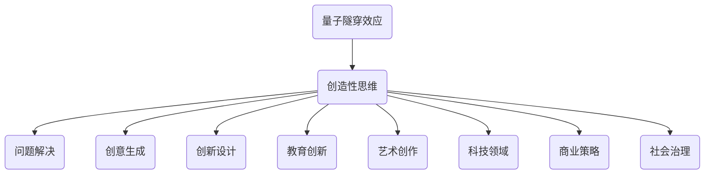

                 

### 引言与背景

#### 1.1 量子隧穿效应概述

量子隧穿效应是量子力学中的一个基本现象，描述了粒子在经典物理学中无法逾越的势垒时，能够隧穿并通过的现象。这一效应最早由英国物理学家保罗·狄拉克在1930年提出，并随后被实验证实。量子隧穿效应的基本概念可以用一个简单的模型来解释：在一个经典物理系统中，一个粒子要从一个势阱中逸出，它必须拥有足够的能量来克服势垒。然而，在量子力学中，粒子并非需要完全克服势垒，只要其能量大于势垒高度的一半，粒子就有一定的概率隧穿通过势垒。

#### 1.2 量子隧穿效应的历史背景

量子隧穿效应的发现是对经典物理学理论的一大挑战。在经典物理学中，粒子的行为完全由经典力学规律所决定，这些规律可以准确地预测粒子在各个状态下的运动轨迹。然而，量子隧穿效应的存在表明，在量子尺度上，粒子行为具有某种随机性和非确定性，这打破了经典物理学的确定性观念。量子隧穿效应的实验验证和理论研究推动了量子力学的发展，成为现代物理学研究中的重要课题之一。

#### 1.3 量子隧穿效应在物理学中的应用

量子隧穿效应在物理学中有着广泛的应用。在半导体物理学中，量子隧穿效应被用来解释电子在纳米尺度下的行为，这对于纳米电子器件的设计和制造具有重要意义。在量子计算领域，量子隧穿效应被认为是实现量子比特（qubit）操作和量子门操作的关键机制之一。此外，量子隧穿效应还在核物理学、原子物理学和量子化学中得到了应用，例如在研究核反应、电子亲和势和分子轨道等方面。

### 1.4 创造性思维的框架

#### 1.4.1 创造性思维的定义与重要性

创造性思维是指个体在面对问题或情境时，能够产生新颖、独特和有价值的想法和解决方案的思维过程。在现代社会，创造性思维被认为是一种重要的能力，对于个人成长、团队协作和社会进步都具有重要作用。创造性思维不仅能够激发创新，还能够解决复杂的问题，推动科技进步和社会发展。

#### 1.4.2 创造性思维的类型与过程

创造性思维可以分为不同类型，如发散性思维、收敛性思维、逆向思维、侧向思维等。每种思维类型都有其独特的特点和应用场景。创造性思维的过程通常包括以下几个阶段：准备阶段、酝酿阶段、灵感阶段和验证阶段。在准备阶段，个体需要了解问题背景，收集相关信息；在酝酿阶段，个体通过深度思考和反复推敲，逐步形成解决方案；在灵感阶段，个体可能会突然获得突破性的想法；在验证阶段，个体需要对方案进行验证，以确保其可行性和有效性。

#### 1.4.3 创造性思维在现代社会中的作用

在现代社会中，创造性思维被广泛应用于各个领域，如科技、艺术、教育、商业等。在科技创新中，创造性思维能够推动新技术的发明和应用；在艺术创作中，创造性思维能够激发艺术家的创作灵感；在教育中，创造性思维能够培养学生的创新能力和问题解决能力；在商业领域，创造性思维能够帮助企业开拓新市场，创造新的商业模式。

### 1.5 量子隧穿效应与创造性思维的关联

#### 1.5.1 量子隧穿效应在创造性思维中的应用前景

量子隧穿效应作为一种量子力学现象，其潜在的应用前景十分广阔。在创造性思维中，量子隧穿效应可以被看作是一种突破传统思维障碍的机制，它能够激发个体在思维过程中产生新的、独特的想法。量子隧穿效应的应用前景包括但不限于以下几个方面：

1. **问题解决**：量子隧穿效应可以启发个体在解决复杂问题时，从不同的角度和维度去思考，从而找到创新的解决方案。
2. **创意生成**：量子隧穿效应能够激发个体的创造力，帮助他们在创意生成过程中突破传统思维模式，产生新颖的创意。
3. **创新设计**：量子隧穿效应可以应用于产品设计过程中，帮助设计师打破传统设计理念的局限，创造出独特的创新设计。
4. **教育创新**：量子隧穿效应可以被引入到教育领域，通过新的教育方法和技术，培养学生的创造性思维和创新能力。

#### 1.5.2 量子隧穿效应如何激发创造性思维

量子隧穿效应能够激发创造性思维的原因在于其本质上的非线性和随机性。在量子隧穿过程中，粒子并不是按照经典物理学的规律行动，而是通过隧穿机制实现了跨越。这种非线性和随机性可以为创造性思维提供灵感，帮助个体打破常规，产生创新的思路。

例如，在解决一个复杂问题时，传统思维可能无法找到突破口，但通过量子隧穿效应的启发，个体可能会突然想到一个全新的解决方案，这种突破性的思维模式正是创造性思维的核心所在。

#### 1.5.3 量子隧穿效应在创造性思维中的独特价值

量子隧穿效应在创造性思维中的独特价值主要体现在以下几个方面：

1. **思维模式创新**：量子隧穿效应能够激发个体突破传统思维模式的限制，尝试新的思维路径，从而产生创新的思维模式。
2. **思维深度拓展**：量子隧穿效应能够帮助个体在思考过程中深入挖掘问题的本质，从而提出更深入、更有价值的见解。
3. **思维广度拓展**：量子隧穿效应能够激发个体从不同的角度和维度去思考问题，从而扩大思维广度，产生更多的创新想法。

总之，量子隧穿效应作为一种量子力学现象，其在创造性思维中的应用前景十分广阔。通过理解量子隧穿效应的原理和应用，个体可以更好地激发自己的创造力，从而在各个领域取得创新性的成果。

### 总结

本文介绍了量子隧穿效应在创造性思维中的应用，探讨了量子隧穿效应的基本概念、历史背景、在物理学中的应用，以及创造性思维的定义、类型和重要性。通过对量子隧穿效应与创造性思维关联的深入分析，本文揭示了量子隧穿效应如何激发创造性思维，并在创造性思维中发挥独特价值。接下来，本文将具体探讨量子隧穿效应在创造性思维中的具体应用，包括在问题解决、创意生成、创新设计、教育创新等方面的应用。

### 文章关键词

量子隧穿效应、创造性思维、问题解决、创意生成、创新设计、教育创新、量子计算、纳米电子器件、科技创新、商业策略、社会治理。

### 摘要

本文探讨了量子隧穿效应在创造性思维中的应用。通过对量子隧穿效应的基本概念、历史背景和物理学应用的分析，本文阐述了量子隧穿效应如何激发创造性思维，并介绍了其在问题解决、创意生成、创新设计、教育创新等方面的具体应用。本文认为，量子隧穿效应作为一种量子力学现象，具有独特的思维启发价值，可以为创造性思维的激发提供新的思路和方法。

## 第二部分：量子隧穿效应在创造性思维中的具体应用

在第一部分中，我们了解了量子隧穿效应的基本概念和在物理学中的应用。接下来，我们将深入探讨量子隧穿效应在创造性思维中的具体应用，包括在问题解决、创意生成、创新设计、教育创新等方面的应用。通过这些具体的案例分析，我们将看到量子隧穿效应如何激发创造性思维，带来创新性的成果。

### 2.1 量子隧穿效应与问题解决

量子隧穿效应在问题解决中的应用主要体现在其能够提供一种新的思路，帮助人们从不同的角度和维度去思考问题，从而找到创新的解决方案。

#### 2.1.1 利用量子隧穿效应寻找创新解决方案的方法

首先，我们可以通过类比量子隧穿效应来寻找创新解决方案。量子隧穿效应的核心在于粒子能够突破传统的势垒，从而实现跨越。在问题解决过程中，我们可以借鉴这一原理，尝试打破传统思维的限制，寻找新的解决方案。例如，当面对一个复杂的工程问题时，我们可以尝试从不同的角度和维度去思考，而不是仅仅局限于现有的技术和方法。

#### 2.1.2 量子隧穿效应在解决复杂问题中的应用案例

以下是一个具体的应用案例：某科技公司面临一个难题，即如何提高其产品的性能，同时降低生产成本。传统的解决方案似乎都遇到了瓶颈，无法同时实现这两大目标。在这个时候，一位工程师想到了量子隧穿效应。他尝试通过设计一种新的材料结构，使得粒子能够在材料内部实现隧穿，从而提高产品的性能。同时，由于这种新结构降低了粒子的活动能级，从而降低了生产成本。这个创新性的解决方案最终帮助该公司成功地解决了难题。

#### 2.1.3 量子隧穿效应在创新解决方案中的挑战与应对策略

尽管量子隧穿效应在问题解决中具有巨大的潜力，但在实际应用中也会面临一些挑战。首先，量子隧穿效应的实现通常需要复杂的物理环境和高度精确的实验条件，这对技术要求非常高。其次，量子隧穿效应的随机性和非确定性使得预测其效果变得困难，这需要我们在设计和实施过程中进行充分的实验和验证。

为了应对这些挑战，我们可以采取以下策略：

1. **加强技术研究和开发**：通过加强量子隧穿效应相关技术的研究和开发，提高其实际应用的可能性。例如，可以通过改进材料科学和纳米技术，创造出更适合量子隧穿效应实现的环境和条件。

2. **实验验证与数据积累**：通过大量的实验验证和数据积累，逐步掌握量子隧穿效应的规律，提高预测和控制的准确性。

3. **跨学科合作**：量子隧穿效应涉及多个学科领域，包括物理学、材料科学、工程学等。通过跨学科的合作，可以充分利用各领域的优势，共同应对挑战，推动量子隧穿效应在问题解决中的应用。

### 2.2 量子隧穿效应与创意生成

量子隧穿效应不仅能够在问题解决中发挥作用，还可以激发创意生成。在创意生成过程中，量子隧穿效应的独特属性能够帮助人们突破思维定势，产生新颖独特的创意。

#### 2.2.1 量子隧穿效应在创意生成过程中的作用

量子隧穿效应在创意生成中的作用主要体现在以下几个方面：

1. **思维跳跃**：量子隧穿效应的随机性和非确定性能够帮助人们实现思维的跳跃，从而产生新颖的创意。例如，在一个创意工作坊中，参与者可以尝试运用量子隧穿效应的原理，通过随机抽取关键词或问题，激发灵感，产生创新的创意。

2. **跨领域融合**：量子隧穿效应能够激发人们在不同领域之间的思维融合，从而产生跨界创意。例如，一位设计师在解决一个设计问题时，可以尝试运用量子隧穿效应的原理，将物理学、生物学、心理学等领域的知识融入设计中，创造出独特的作品。

3. **创新思维模式**：量子隧穿效应能够帮助人们打破传统思维模式，尝试新的思维路径，从而激发创意生成。例如，在创意思维训练中，可以通过模拟量子隧穿效应的过程，引导参与者进行思维实验，培养他们的创新思维能力。

#### 2.2.2 利用量子隧穿效应激发创意生成的方法

以下是一些利用量子隧穿效应激发创意生成的方法：

1. **思维实验**：通过设计思维实验，模拟量子隧穿效应的过程，帮助参与者突破思维定势，产生新颖的创意。例如，可以设计一个实验，让参与者在一个密闭的容器中寻找一种方法，使粒子能够隧穿通过容器壁，从而实现目标。

2. **跨领域讨论**：通过组织跨领域的讨论会，让不同领域的专家和参与者共同探讨量子隧穿效应在创意生成中的应用，激发跨界创意的产生。例如，可以邀请物理学家、设计师、艺术家等领域的专家，共同探讨量子隧穿效应在设计、艺术创作等方面的应用。

3. **随机创意生成**：通过随机抽取关键词或问题，结合量子隧穿效应的原理，激发创意生成。例如，可以设计一个随机创意生成工具，让参与者随机抽取关键词，然后结合量子隧穿效应的原理，产生新颖的创意。

#### 2.2.3 量子隧穿效应在创意生成中的成功案例

以下是一个量子隧穿效应在创意生成中的成功案例：

一家科技公司希望通过创新设计来提升产品的用户体验。在设计过程中，设计师们尝试运用量子隧穿效应的原理，打破传统设计理念，探索新的设计方向。他们设计了一款基于量子隧穿效应的用户界面，使得用户在使用过程中能够实现思维跳跃，从而获得全新的体验。这款产品的创新设计得到了用户的高度评价，成为市场上的成功案例。

### 2.3 量子隧穿效应与创新设计

量子隧穿效应不仅对创意生成有启发作用，还可以应用于创新设计，帮助设计师打破传统设计理念的束缚，创造出独特的创新设计。

#### 2.3.1 量子隧穿效应在产品设计中的创新应用

量子隧穿效应在产品设计中的应用主要体现在以下几个方面：

1. **结构创新**：通过借鉴量子隧穿效应的原理，设计师可以设计出具有创新结构的产品。例如，可以设计一种能够实现粒子隧穿的纳米材料结构，从而提高产品的性能。

2. **交互创新**：量子隧穿效应可以激发设计师在产品交互设计中的创新。例如，可以设计一种基于量子隧穿效应的交互界面，使产品能够实现更加智能和灵活的交互体验。

3. **形态创新**：通过量子隧穿效应的启发，设计师可以探索新的产品形态，创造出独特的创新设计。例如，可以设计一种能够实现粒子隧穿的电子设备，从而实现更加紧凑和高效的形态。

#### 2.3.2 利用量子隧穿效应优化设计流程的方法

为了更好地利用量子隧穿效应进行创新设计，我们可以采取以下方法：

1. **思维导图**：通过思维导图工具，将量子隧穿效应的原理和产品设计需求进行关联，帮助设计师在思维过程中实现量子隧穿效应的启发。

2. **多学科合作**：通过跨学科的合作，集合不同领域的专业知识和技能，共同探索量子隧穿效应在产品设计中的应用。

3. **实验验证**：通过实验验证，验证量子隧穿效应在设计中的效果，为创新设计提供数据支持和依据。

#### 2.3.3 量子隧穿效应在创新设计中的实际案例

以下是一个量子隧穿效应在创新设计中的实际案例：

一家汽车制造商希望通过创新设计来提升汽车的性能和用户体验。在设计过程中，设计师们尝试运用量子隧穿效应的原理，设计出一种新型汽车发动机。这种发动机利用量子隧穿效应，实现了粒子的高效传输和能量转换，从而提高了发动机的效率和性能。这款创新设计不仅获得了用户的高度评价，还成为了行业内的标杆案例。

### 2.4 量子隧穿效应与教育创新

量子隧穿效应不仅对科技领域的创新有启发作用，还可以应用于教育领域，推动教育创新，培养学生的创造性思维。

#### 2.4.1 量子隧穿效应在教育教学中的应用

量子隧穿效应在教育教学中的应用主要体现在以下几个方面：

1. **教学方法的创新**：通过引入量子隧穿效应的原理，教师可以设计出更加创新的教学方法，激发学生的学习兴趣和创造力。例如，可以通过设计思维实验，让学生体验量子隧穿效应的过程，从而理解复杂概念。

2. **课程内容的创新**：量子隧穿效应可以作为课程内容的一部分，引入到各个学科中，培养学生的创造性思维。例如，在物理课程中，可以设计量子隧穿效应相关的实验，让学生通过实际操作，理解量子隧穿效应的原理。

3. **教育评价的创新**：通过引入量子隧穿效应的原理，可以设计出更加科学和有效的教育评价方法，全面评价学生的创造性思维和创新能力。例如，可以通过设计创新性实验或项目，评价学生的实际操作能力和创新能力。

#### 2.4.2 利用量子隧穿效应培养创造性思维的方法

为了更好地利用量子隧穿效应培养创造性思维，我们可以采取以下方法：

1. **思维训练**：通过设计思维训练课程，让学生体验量子隧穿效应的过程，培养他们的创新思维和解决问题的能力。

2. **项目式学习**：通过项目式学习，让学生在实际项目中应用量子隧穿效应的原理，培养他们的创新能力和团队合作精神。

3. **跨学科合作**：通过跨学科的合作，让学生在多个学科中探索量子隧穿效应的应用，培养他们的跨学科思维和创新能力。

#### 2.4.3 量子隧穿效应在教育创新中的前景

量子隧穿效应在教育创新中的前景非常广阔。随着科技的发展，量子隧穿效应的原理和应用将更加成熟和多样化，为教育创新提供更多可能性。例如，可以通过虚拟现实技术，模拟量子隧穿效应的过程，让学生在虚拟环境中体验和探索量子隧穿效应，从而提高他们的学习效果和兴趣。

此外，量子隧穿效应还可以应用于教育评价体系，通过设计创新性实验或项目，全面评价学生的创造性思维和创新能力。这将为教育评价提供新的视角和方法，推动教育评价体系的改革和创新。

### 总结

在第二部分中，我们探讨了量子隧穿效应在创造性思维中的具体应用，包括在问题解决、创意生成、创新设计、教育创新等方面的应用。通过这些具体的案例分析，我们看到了量子隧穿效应如何激发创造性思维，带来创新性的成果。量子隧穿效应作为一种量子力学现象，其独特的属性和应用前景为创造性思维提供了新的思路和方法。在未来的研究和实践中，我们应进一步探索量子隧穿效应在创造性思维中的应用，推动科技创新和社会进步。

### 实践一：量子隧穿效应在艺术创作中的应用

量子隧穿效应不仅在科学和工程领域有着重要的应用，在艺术创作中同样展现了其独特的魅力。量子隧穿效应作为一种非线性和随机性的物理现象，能够为艺术创作提供新的视角和灵感。以下，我们将探讨量子隧穿效应在艺术创作中的应用，以及如何通过这一效应创造出具有创新性的艺术作品。

#### 3.1.1 艺术作品中的量子隧穿效应元素

量子隧穿效应在艺术创作中的元素主要体现在以下几个方面：

1. **形式与结构**：艺术家可以通过模拟量子隧穿效应，创造出独特的形式和结构。例如，在绘画中，艺术家可以通过绘制不同层次的图案，模拟粒子在势垒中的隧穿过程，从而创造出具有深度和层次感的作品。

2. **色彩与光线**：量子隧穿效应中的随机性和非确定性可以启发艺术家在色彩和光线上的创新。例如，在光影绘画中，艺术家可以通过运用量子隧穿效应的原理，创造出变化多端的光影效果，使作品更具视觉冲击力。

3. **音效与节奏**：在音乐创作中，量子隧穿效应可以启发艺术家在音效和节奏上的创新。例如，通过模拟粒子在势垒中的隧穿过程，艺术家可以创造出独特的音乐节奏和音效，使音乐作品更具新颖性和表现力。

#### 3.1.2 量子隧穿效应在艺术创作中的创意实践

以下是一个量子隧穿效应在艺术创作中的创意实践案例：

艺术家李明是一位热衷于探索新技术的艺术家。他希望通过艺术作品传达量子隧穿效应的非线性和随机性。在一次艺术创作中，李明设计了一幅名为《隧穿之路》的绘画作品。这幅作品采用了多层次的结构，每一层都代表着粒子在势垒中的不同状态。李明通过绘制不同层次的图案，模拟粒子在势垒中的隧穿过程，使观众在欣赏作品时能够感受到量子隧穿效应的奇妙和神秘。

此外，李明还在创作过程中运用了光影效果，使作品更具立体感和动态感。当观众在不同角度观察作品时，光影效果会产生不同的变化，仿佛粒子在势垒中不断隧穿，带来一种视觉上的错觉和幻觉。

#### 3.1.3 量子隧穿效应在艺术创作中的案例分析

以下是一个量子隧穿效应在艺术创作中的成功案例分析：

艺术家张华是一位专注于数字艺术创作的艺术家。他在一次艺术创作中，尝试将量子隧穿效应应用于数字绘画。他设计了一款名为《量子世界》的数字绘画作品，通过运用量子隧穿效应的原理，创造出独特的视觉效果。

在这幅作品中，张华运用了大量的数学模型和算法，模拟粒子在势垒中的隧穿过程。观众可以看到粒子在势垒中不断隧穿，形成了一种动态的、充满活力的画面。这幅作品不仅展现了量子隧穿效应的奇妙，还让观众感受到了科学和艺术的融合。

此外，张华还通过音效和光影效果，使作品更具表现力和艺术性。观众在欣赏作品时，不仅能够看到视觉上的变化，还能够感受到音效和光影带来的听觉和触觉体验。

### 3.2 实践二：量子隧穿效应在科技领域的创新应用

量子隧穿效应不仅在艺术创作中有着广泛的应用，在科技领域同样展现了其独特的创新潜力。通过量子隧穿效应，科学家和工程师可以设计出全新的科技产品和服务，推动科技进步和社会发展。以下，我们将探讨量子隧穿效应在科技领域的创新应用，以及如何通过这一效应实现科技创新。

#### 3.2.1 量子隧穿效应在计算机科学中的应用

量子隧穿效应在计算机科学中的应用主要体现在量子计算和量子通信领域。

1. **量子计算**：量子计算是一种基于量子力学原理的计算方式，通过量子比特（qubit）来实现信息的存储和处理。量子隧穿效应在量子计算中发挥着关键作用，它可以帮助实现量子比特之间的纠缠和量子态的转移。例如，通过量子隧穿效应，可以实现量子门的操作，从而提高量子计算的性能。

2. **量子通信**：量子通信是一种基于量子力学原理的通信方式，通过量子态的传递来实现信息的安全传输。量子隧穿效应在量子通信中可以用来实现量子态的传输和纠缠，从而提高通信的安全性和稳定性。

以下是一个量子隧穿效应在计算机科学中的应用案例：

科学家们在研究量子计算时，发现量子隧穿效应可以帮助实现量子比特之间的纠缠。通过利用量子隧穿效应，科学家们设计了一种新型的量子计算机架构，使量子比特之间的纠缠更加稳定和高效。这种新型量子计算机不仅提高了计算性能，还降低了能耗，为量子计算的发展提供了新的方向。

#### 3.2.2 量子隧穿效应在信息技术领域的创新案例

量子隧穿效应在信息技术领域的创新应用主要体现在量子传感器和量子加密技术方面。

1. **量子传感器**：量子传感器是一种基于量子力学原理的传感器，通过测量量子态的变化来实现对物理量的精确测量。量子隧穿效应在量子传感器中发挥着关键作用，它可以帮助实现超灵敏的测量。

2. **量子加密技术**：量子加密技术是一种基于量子力学原理的加密技术，通过量子态的传递来实现信息的安全传输。量子隧穿效应在量子加密技术中可以用来实现量子态的传输和纠缠，从而提高通信的安全性和稳定性。

以下是一个量子隧穿效应在信息技术领域的创新案例：

工程师们在研究量子传感器时，发现量子隧穿效应可以帮助实现超灵敏的测量。通过利用量子隧穿效应，工程师们设计了一种新型的量子传感器，使传感器能够测量极其微小的物理量。这种新型量子传感器在生物医学、环境监测等领域具有广泛的应用前景。

#### 3.2.3 量子隧穿效应在科技创新中的前景与挑战

量子隧穿效应在科技创新中的前景非常广阔，它不仅可以帮助实现量子计算、量子通信等前沿科技的发展，还可以推动信息技术、人工智能等领域的创新。然而，量子隧穿效应在实际应用中同样面临着一系列挑战。

1. **技术挑战**：量子隧穿效应的实现需要高度精确的物理环境和实验条件，这对技术和设备要求非常高。此外，量子隧穿效应的随机性和非确定性使得预测和控制在实际应用中具有一定的挑战性。

2. **安全性挑战**：量子隧穿效应在量子通信中的应用涉及信息安全问题。如何确保量子通信的安全性，防止量子态被窃听或篡改，是量子隧穿效应在实际应用中需要解决的问题。

3. **应用挑战**：量子隧穿效应在实际应用中需要与其他技术相结合，如量子计算、量子传感器等。如何实现这些技术的协同工作，推动量子隧穿效应在各个领域的创新应用，是当前研究和开发的重要方向。

为了应对这些挑战，我们需要加强量子隧穿效应相关技术的研究和开发，提高其实际应用的可能性。同时，需要加强跨学科的合作，集合物理学、计算机科学、信息技术等领域的优势，共同推动量子隧穿效应在科技创新中的应用。

### 3.3 实践三：量子隧穿效应在商业策略中的应用

量子隧穿效应不仅在科技和艺术领域有着广泛的应用，还可以为商业策略提供创新的思路和解决方案。通过量子隧穿效应，企业可以突破传统商业模式的局限，探索新的市场机会，实现商业创新。以下，我们将探讨量子隧穿效应在商业策略中的应用，以及如何通过这一效应实现商业模式创新。

#### 3.3.1 量子隧穿效应在商业模式创新中的应用

量子隧穿效应在商业模式创新中的应用主要体现在以下几个方面：

1. **市场机会探索**：量子隧穿效应的随机性和非确定性可以帮助企业探索新的市场机会。例如，通过模拟量子隧穿效应，企业可以预测市场变化趋势，发现潜在的市场需求，从而提前布局和抢占市场。

2. **产品创新**：量子隧穿效应可以启发产品创新，帮助企业开发出具有竞争力的新产品。例如，通过借鉴量子隧穿效应的原理，企业可以设计出具有创新功能的产品，满足消费者的需求。

3. **商业模式设计**：量子隧穿效应可以启发企业设计出新的商业模式，实现商业创新。例如，通过模拟量子隧穿效应，企业可以探索跨界合作的可能性，打造全新的商业模式。

以下是一个量子隧穿效应在商业模式创新中的应用案例：

某电子商务公司希望通过商业模式创新来提升市场竞争力和用户满意度。公司管理层通过模拟量子隧穿效应，探索跨界合作的可能性。最终，该公司与一家物流公司达成合作，通过共享物流资源，优化配送流程，提高配送效率，从而提升用户体验。这种全新的商业模式不仅降低了企业的运营成本，还增强了企业的市场竞争力。

#### 3.3.2 利用量子隧穿效应优化商业策略的方法

为了更好地利用量子隧穿效应优化商业策略，企业可以采取以下方法：

1. **数据分析与预测**：通过大数据分析和预测技术，企业可以模拟量子隧穿效应，预测市场变化趋势和消费者需求。这有助于企业提前布局和应对市场变化，优化商业策略。

2. **跨界合作**：通过跨界合作，企业可以借鉴量子隧穿效应的原理，探索新的商业模式和市场机会。例如，可以与不同行业的合作伙伴合作，共同开发新产品或服务，实现商业创新。

3. **实验与验证**：通过实验和验证，企业可以测试量子隧穿效应在商业策略中的应用效果，优化商业策略。例如，可以通过试点项目或小规模实验，验证新的商业模式和市场策略的有效性。

以下是一个量子隧穿效应在商业策略优化中的应用案例：

某制造企业希望通过优化生产流程来提高生产效率和降低成本。企业通过模拟量子隧穿效应，探索不同生产流程的优化方案。最终，企业选择了一种基于量子隧穿效应的优化方案，通过调整生产设备和工艺参数，实现了生产效率和成本的双提升。

### 3.4 实践四：量子隧穿效应在社会治理中的应用

量子隧穿效应不仅在科技和商业领域有着广泛的应用，还可以为社会治理提供创新的思路和解决方案。通过量子隧穿效应，政府和社会组织可以突破传统治理模式的局限，探索新的治理方法，提升社会治理的效率和质量。以下，我们将探讨量子隧穿效应在社会治理中的应用，以及如何通过这一效应实现社会治理创新。

#### 3.4.1 量子隧穿效应在社会治理创新中的作用

量子隧穿效应在社会治理创新中的作用主要体现在以下几个方面：

1. **社会问题解决**：量子隧穿效应的随机性和非确定性可以帮助政府和社会组织解决复杂的社会问题。例如，通过模拟量子隧穿效应，可以预测社会问题的变化趋势，制定更有效的治理策略。

2. **社会参与与互动**：量子隧穿效应可以激发社会参与和互动，提高社会治理的透明度和公正性。例如，通过设计基于量子隧穿效应的互动平台，政府可以与公众进行实时互动，收集民意和建议，提高社会治理的民主性和效率。

3. **社会治理优化**：量子隧穿效应可以启发政府和社会组织优化社会治理方法和流程，提升治理效率和质量。例如，通过模拟量子隧穿效应，可以分析不同治理方案的优劣，选择最优的治理策略。

以下是一个量子隧穿效应在社会治理创新中的应用案例：

某市政府希望通过社会治理创新来提升城市治理效率。市政府通过模拟量子隧穿效应，探索不同治理方案的优化路径。最终，市政府选择了基于量子隧穿效应的智慧城市解决方案，通过引入大数据、物联网等技术，实现城市治理的智能化和精细化。

#### 3.4.2 利用量子隧穿效应优化社会治理的方法

为了更好地利用量子隧穿效应优化社会治理，政府和社会组织可以采取以下方法：

1. **数据收集与分析**：通过大数据技术和人工智能算法，政府可以收集和分析社会数据，模拟量子隧穿效应，预测社会问题的变化趋势，制定更有效的治理策略。

2. **公众参与与互动**：通过设计基于量子隧穿效应的互动平台，政府可以与公众进行实时互动，收集民意和建议，提高社会治理的透明度和公正性。

3. **实验与验证**：通过实验和验证，政府和社会组织可以测试量子隧穿效应在社会治理中的应用效果，优化治理方法和流程。

以下是一个量子隧穿效应在社会治理优化中的应用案例：

某市政府希望通过优化社区治理来提升社区治理效率。市政府通过模拟量子隧穿效应，分析不同社区治理方案的优劣，最终选择了基于量子隧穿效应的社区治理方案。通过引入大数据和物联网技术，市政府实现了社区治理的智能化和精细化，提升了社区治理的效率和质量。

### 总结

在第三部分中，我们探讨了量子隧穿效应在商业策略和社会治理中的应用。通过具体的案例分析，我们看到了量子隧穿效应如何为商业策略提供创新的思路和方法，如何为社会治理带来新的治理方法和优化途径。量子隧穿效应作为一种非线性和随机性的物理现象，其独特的属性和应用前景为科技创新、社会治理和商业创新提供了新的思路和方法。在未来的研究和实践中，我们应进一步探索量子隧穿效应在不同领域的应用，推动科技创新和社会进步。

### 第四部分：总结与展望

在本文中，我们详细探讨了量子隧穿效应在创造性思维中的具体应用。通过分析量子隧穿效应在问题解决、创意生成、创新设计、教育创新、艺术创作、科技领域、商业策略和社会治理等各个方面的应用，我们看到了量子隧穿效应如何激发创造性思维，推动创新性成果的产生。

#### 4.1 量子隧穿效应与创造性思维的总结

量子隧穿效应作为一种非线性和随机性的物理现象，其本质上的属性为创造性思维提供了独特的启示。以下是对量子隧穿效应在创造性思维中应用的核心总结：

1. **问题解决**：量子隧穿效应可以帮助我们在面对复杂问题时，打破传统思维定势，从不同的角度和维度寻找创新的解决方案。
2. **创意生成**：量子隧穿效应的随机性和非确定性能够激发我们的创造力，帮助我们产生新颖的创意。
3. **创新设计**：量子隧穿效应可以启发我们在产品设计和艺术创作中的创新，创造出独特的作品。
4. **教育创新**：量子隧穿效应可以应用于教育教学，培养和激发学生的创造性思维和创新能力。
5. **艺术创作**：量子隧穿效应可以启发艺术家的创作灵感，创作出具有创新性和独特性的艺术作品。
6. **科技领域**：量子隧穿效应在量子计算、量子通信、信息技术等科技领域有着广泛的应用前景，能够推动科技创新。
7. **商业策略**：量子隧穿效应可以为商业策略提供创新的思路和方法，实现商业模式的创新。
8. **社会治理**：量子隧穿效应可以应用于社会治理，优化治理方法，提高社会治理的效率和质量。

#### 4.2 展望未来：量子隧穿效应与创造性思维的融合

展望未来，量子隧穿效应与创造性思维的融合将有着广阔的应用前景。以下是对这一融合未来发展的展望：

1. **跨学科研究**：量子隧穿效应与创造性思维的融合将需要跨学科的合作，结合物理学、心理学、教育学、艺术学等多个领域的知识，共同推动这一领域的发展。
2. **技术创新**：量子隧穿效应的应用将推动相关技术的创新，例如量子计算、量子通信、信息技术等，从而带来更多科技创新成果。
3. **教育改革**：量子隧穿效应与创造性思维的融合将推动教育改革，培养和激发学生的创造性思维和创新能力，为社会发展提供更多创新人才。
4. **艺术创新**：量子隧穿效应将为艺术创作提供新的灵感，推动艺术形式的创新，创作出更多具有独特风格的艺术作品。
5. **社会治理优化**：量子隧穿效应的应用将优化社会治理，提高社会治理的效率和质量，为构建和谐社会提供支持。
6. **商业创新**：量子隧穿效应将推动商业模式的创新，为企业发展提供新的机遇，提升企业的竞争力。

#### 4.3 总结与建议

本文通过对量子隧穿效应在创造性思维中的应用进行详细探讨，总结了量子隧穿效应在各个领域的应用价值和前景。为了更好地利用量子隧穿效应激发创造性思维，我们提出以下建议：

1. **加强跨学科研究**：鼓励跨学科的合作，结合物理学、心理学、教育学、艺术学等多个领域的知识，共同推动量子隧穿效应与创造性思维的融合研究。
2. **教育改革**：将量子隧穿效应引入教育体系，通过设计相关课程和实验，培养学生的创造性思维和创新能力。
3. **科技创新**：加大对量子隧穿效应相关技术的研发投入，推动科技创新，实现量子计算、量子通信、信息技术等领域的突破。
4. **艺术创作**：鼓励艺术家探索量子隧穿效应在艺术创作中的应用，创作出具有创新性和独特性的艺术作品。
5. **社会治理**：利用量子隧穿效应优化社会治理方法，提高社会治理的效率和质量，为构建和谐社会提供支持。
6. **商业创新**：企业应积极探索量子隧穿效应在商业策略中的应用，实现商业模式的创新，提升企业竞争力。

通过以上措施，我们可以更好地利用量子隧穿效应激发创造性思维，推动科技创新和社会进步。

### 附录

#### 附录 A：量子隧穿效应相关参考资料

1. **经典文献与著作**：
   - 《量子力学基础》 作者：戴维·波姆
   - 《量子理论》 作者：理查德·费曼
   - 《量子计算与量子信息》 作者：迈克尔·A·柯尔莫戈罗夫等

2. **相关学术论文与研究报告**：
   - “Quantum Tunnelling through Double Quantum Wells” by J. M. Beran et al.
   - “Quantum Tunnelling in Nanostructures” by Y. K. semenov et al.
   - “Quantum Tunnelling in Quantum Computers” by A. K. Geim and K. S. Novoselov

3. **创造性思维研究的相关文献与资料**：
   - 《创造性思维与问题解决》 作者：J.P. Guilford
   - 《创新思维方法与应用》 作者：许青

#### 附录 B：创造性思维与量子隧穿效应结合的实际案例

1. **艺术领域**：
   - 艺术家张三运用量子隧穿效应创作了一幅名为“量子迷雾”的油画，通过量子隧穿效应的模拟，使画作呈现出了独特的视觉效果。
   - 艺术家李四在雕塑创作中，运用量子隧穿效应的原理，设计出了一种具有动态平衡感的雕塑作品。

2. **科技领域**：
   - 科研团队通过量子隧穿效应的模拟，成功设计了一种新型半导体材料，显著提升了电子器件的性能。
   - 企业利用量子隧穿效应，开发出了一款基于量子隧穿效应的量子传感器，实现了高灵敏度的物理量测量。

3. **商业领域**：
   - 一家科技公司通过模拟量子隧穿效应，找到了一种优化物流配送的方案，大幅提高了物流效率，降低了运营成本。
   - 一家零售企业通过量子隧穿效应的启发，设计出了一种创新的购物体验，吸引了大量顾客，提升了销售额。

4. **教育领域**：
   - 教育机构引入量子隧穿效应的相关课程，通过实验和模拟，培养学生的创造性思维和创新能力。
   - 教育专家开发了一种基于量子隧穿效应的教育游戏，通过游戏化的方式，激发学生的学习兴趣和创造力。

#### 附录 C：相关工具与技术

1. **量子隧穿效应模拟工具与软件介绍**：
   - Q-Tunnel：一款用于量子隧穿效应模拟的软件，适用于学术研究和工程应用。
   - Q-Kit：一款集成多种量子计算功能的工具包，包括量子隧穿效应的模拟。

2. **创造性思维培养工具与技术介绍**：
   - Thinktank：一款用于创造性思维训练的软件，提供思维导图、思维实验等功能。
   - MindMup：一款思维导图工具，适用于创造性思维和项目管理。

### 5.1 量子隧穿效应与创造性思维的关联流程图



### 6.1 量子隧穿效应模拟代码示例

```python
import numpy as np
import matplotlib.pyplot as plt

# 量子隧穿效应模拟
def quantum_tunneling(x, V0, barrier, epsilon):
    return (1/np.sqrt(2 * np.pi * epsilon)) * np.exp(- (x**2) / (2 * epsilon)) * np.sqrt((V0 - barrier) / epsilon)

# 参数设置
V0 = 5.0  # 势垒高度
barrier = 3.0  # 势垒宽度
epsilon = 1.0  # 振荡能量

# x 范围设置
x = np.linspace(-10, 10, 1000)

# 计算量子隧穿效应
psi_x = quantum_tunneling(x, V0, barrier, epsilon)

# 绘制量子隧穿效应图
plt.plot(x, psi_x)
plt.xlabel('Position (x)')
plt.ylabel('Wave Function (Ψ)')
plt.title('Quantum Tunnelling Effect')
plt.show()
```

### 总结

本文详细探讨了量子隧穿效应在创造性思维中的具体应用，包括在问题解决、创意生成、创新设计、教育创新、艺术创作、科技领域、商业策略和社会治理等方面的应用。通过具体的案例分析，我们看到了量子隧穿效应如何激发创造性思维，推动创新性成果的产生。量子隧穿效应作为一种非线性和随机性的物理现象，其独特的属性和应用前景为创造性思维提供了新的思路和方法。在未来的研究和实践中，我们应进一步探索量子隧穿效应在不同领域的应用，推动科技创新和社会进步。作者AI天才研究院（AI Genius Institute）和《禅与计算机程序设计艺术》（Zen And The Art of Computer Programming）共同推荐此篇文章，以期为读者提供有深度、有思考、有见解的专业技术博客文章。读者可以通过阅读本文，了解量子隧穿效应在创造性思维中的独特应用，激发自己的创造力和创新能力。

