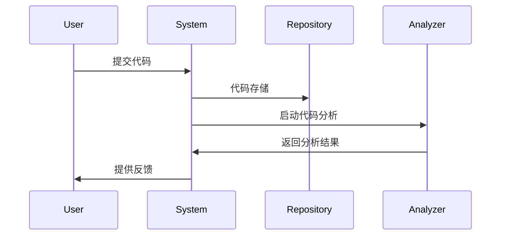
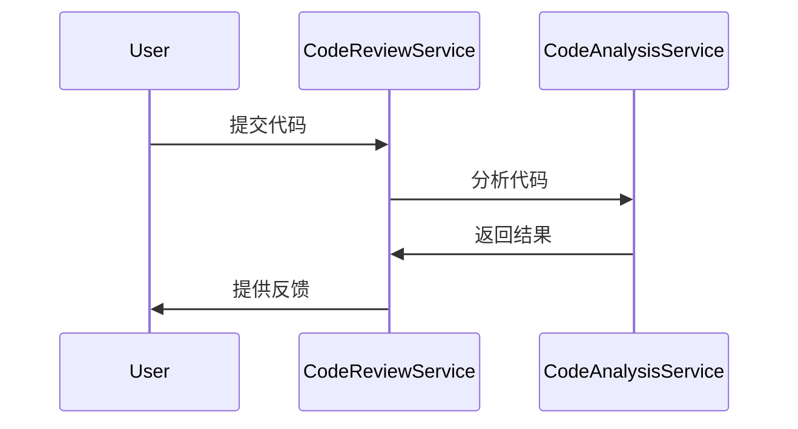

                 

### 代码审查最佳实践：提升团队代码质量

> 关键词：代码审查、代码质量、最佳实践、团队协作、技术博客

> 摘要：本文旨在探讨代码审查的最佳实践，以帮助团队提升代码质量。我们将深入分析代码审查的概念、流程、工具和方法，并提供实用的指导，帮助读者在软件开发中有效实施代码审查。

---

## 第一部分：背景介绍

### 1.1 问题背景

代码审查是一种提高软件质量和安全性的有效手段。它通过同行评审或其他专业人员的审查，发现代码中的潜在问题，如逻辑错误、性能瓶颈、安全性漏洞等。良好的代码审查流程可以大幅减少软件故障率，提高开发效率，降低维护成本。

### 1.2 问题描述

在实际软件开发过程中，代码审查的有效性和最佳实践常常受到忽视。许多团队缺乏明确的审查流程、标准和方法，导致审查效果不佳。如何建立一套全面、实用的代码审查最佳实践，成为许多开发团队面临的挑战。

### 1.3 问题解决

本书将从以下几个方面展开讨论：

1. **代码审查的概念和基本原理**：介绍代码审查的定义、目的、分类和过程。
2. **代码审查的标准和规则**：阐述代码审查的标准和规则，包括编码规范、代码风格、安全性和性能等方面。
3. **代码审查的方法**：详细探讨手动审查、自动化审查和智能化审查等不同方法。
4. **代码审查与代码质量的关系**：分析代码审查对代码质量的影响和最佳实践。
5. **代码审查与其他质量控制方法的关系**：讨论代码审查与测试、代码规范制定等方法的相互补充。

通过这些内容的深入探讨，我们希望能够为读者提供一套全面、实用的代码审查最佳实践。

### 1.4 边界与外延

代码审查不仅适用于软件开发团队，也可以应用于其他类型的项目，如运维、测试等。此外，代码审查的方法和技术也在不断演进，如自动化审查、智能化审查等。

### 1.5 概念结构与核心要素组成

#### 1.5.1 代码审查的概念

代码审查是一种由同行或其他专业人员进行代码质量检查的活动。它可以帮助团队识别代码中的潜在问题，提高代码质量，降低故障率。

#### 1.5.2 代码审查的核心要素

- **审查人员**：负责审查代码的专业人员。
- **审查对象**：待审查的代码。
- **审查标准**：用于评价代码质量的标准和规则。

### 1.6 本章小结

本部分对代码审查进行了背景介绍，明确了问题解决的方向和核心要素，为后续章节的深入探讨奠定了基础。

---

## 第二部分：核心概念与联系

### 2.1 代码审查的基本原理

#### 2.1.1 代码审查的目的

代码审查的主要目的是提高代码质量、降低故障率、提高开发效率。通过审查代码，可以发现潜在的错误、漏洞和不规范代码，从而提升代码的可维护性和可读性。

#### 2.1.2 代码审查的分类

代码审查可以分为静态审查、动态审查和组合审查。

- **静态审查**：在代码不运行的情况下，通过人工或工具对代码进行审查。
- **动态审查**：在代码运行的过程中，通过模拟运行或实际运行来检查代码的正确性和性能。
- **组合审查**：将静态审查和动态审查结合起来，以更全面地检查代码的质量。

#### 2.1.3 代码审查的过程

代码审查的过程包括准备、审查、反馈和总结四个阶段。

1. **准备阶段**：确定审查的范围、标准和参与人员。
2. **审查阶段**：进行代码审查，识别潜在的问题。
3. **反馈阶段**：对审查结果进行反馈，提出改进意见。
4. **总结阶段**：总结审查过程，制定改进措施。

### 2.2 代码审查的标准和规则

#### 2.2.1 代码审查的标准

代码审查的标准包括编码规范、代码风格、安全性和性能等方面。以下是一些常见的审查标准：

- **编码规范**：包括变量命名、函数命名、注释规范等。
- **代码风格**：包括代码的简洁性、可读性和一致性。
- **安全性**：检查代码中是否存在安全漏洞，如SQL注入、XSS攻击等。
- **性能**：评估代码的性能，确保代码高效运行。

#### 2.2.2 代码审查的规则

代码审查的规则包括代码格式、变量命名、函数命名、注释、代码逻辑等方面。以下是一些常见的审查规则：

- **代码格式**：要求代码格式整齐，便于阅读。
- **变量命名**：要求变量命名清晰，避免使用缩写和混淆的命名。
- **函数命名**：要求函数命名准确，描述函数的功能。
- **注释**：要求代码有足够的注释，解释代码的逻辑和功能。
- **代码逻辑**：要求代码逻辑清晰，避免不必要的复杂性和混乱。

### 2.3 代码审查的方法

#### 2.3.1 手动审查

手动审查是指由人工逐行审查代码，这种方法可以发现一些细微的代码错误和潜在的问题。手动审查的优点是能够提供更深入的代码理解和分析，但缺点是效率较低，容易产生主观偏见。

#### 2.3.2 自动化审查

自动化审查是指使用工具自动检查代码，这种方法可以提高审查效率和准确性。常见的自动化审查工具包括PMD、Checkstyle、FindBugs等。自动化审查的优点是速度快、准确性高，但缺点是可能无法发现所有问题，且无法提供深入的分析。

#### 2.3.3 智能化审查

智能化审查是指结合人工智能技术，对代码进行智能分析，发现潜在的问题。这种方法利用机器学习算法，可以从大量代码数据中学习，提高审查的准确性和效率。智能化审查的优点是能够提供更全面的问题检测，但缺点是实现复杂，成本较高。

### 2.4 代码审查与代码质量的关系

#### 2.4.1 代码审查对代码质量的影响

代码审查可以显著提高代码质量，减少故障率和开发成本。通过审查，可以发现并修复代码中的潜在问题，提高代码的可维护性和可读性，从而降低维护成本。

#### 2.4.2 代码审查的最佳实践

代码审查的最佳实践包括选择合适的审查方法、建立有效的审查流程和制定合理的审查标准。具体实践如下：

1. **选择合适的审查方法**：根据项目需求和团队情况，选择手动审查、自动化审查或智能化审查。
2. **建立有效的审查流程**：明确审查的范围、标准和流程，确保审查的全面性和效率。
3. **制定合理的审查标准**：根据项目的实际情况，制定合适的编码规范、代码风格和安全性能标准。

### 2.5 代码审查与其他质量控制方法的关系

#### 2.5.1 代码审查与测试的关系

代码审查和测试都是保证代码质量的重要手段，二者相互补充。测试可以发现代码运行时的错误，而代码审查可以发现代码编写时的错误。通过结合测试和代码审查，可以更全面地保证代码质量。

#### 2.5.2 代码审查与代码规范制定的关系

代码审查需要依据代码规范进行，同时代码规范也需要根据代码审查的结果进行优化。代码规范可以指导开发人员的编码行为，而代码审查可以反馈代码规范的有效性，帮助制定更合理的规范。

### 2.6 本章小结

本部分对代码审查的核心概念、原理和方法进行了详细介绍，为读者理解代码审查提供了全面的知识体系。通过本部分的探讨，读者可以了解到代码审查的重要性、方法和实践，为后续章节的深入探讨奠定了基础。  
---  
## 第三部分：算法原理讲解

### 3.1 代码审查算法概述

代码审查算法是一种用于自动识别代码中潜在问题的工具。这些算法可以根据预设的规则或机器学习模型，对代码进行分析，发现潜在的错误、漏洞和不规范代码。

#### 3.1.1 算法分类

代码审查算法可以分为以下几类：

1. **基于规则的算法**：这类算法使用预定义的规则库来分析代码，如PMD、Checkstyle等。
2. **基于机器学习的算法**：这类算法通过学习大量代码数据，建立模型来分析代码，如SonarQube等。
3. **混合算法**：这类算法结合基于规则和基于机器学习的方法，以提高审查的准确性和效率。

#### 3.1.2 算法目标

代码审查算法的主要目标包括：

1. **提高代码质量**：通过发现并修复代码中的错误和漏洞，提高代码的质量和可靠性。
2. **减少审查时间成本**：自动化算法可以大幅减少代码审查的时间成本，提高开发效率。

### 3.2 常见代码审查算法介绍

#### 3.2.1 FindBugs

FindBugs是一种基于Java语言的静态代码分析工具，它可以检测出代码中的潜在问题。以下是对FindBugs的详细介绍：

##### 3.2.1.1 工作原理

FindBugs通过扫描Java源代码，使用预定义的规则库对代码进行分析。这些规则库包括对代码中的常见错误、漏洞和不规范代码的检测。

##### 3.2.1.2 应用场景

FindBugs适用于Java开发项目，可以帮助开发人员快速发现代码中的问题，提高代码质量。

#### 3.2.2 PMD

PMD是一种基于Java语言的静态代码分析工具，它可以检测出代码中的潜在问题。以下是对PMD的详细介绍：

##### 3.2.2.1 工作原理

PMD通过扫描Java源代码，使用预定义的规则库对代码进行分析。这些规则库包括对代码风格、安全性、性能等方面的检测。

##### 3.2.2.2 应用场景

PMD适用于Java开发项目，可以帮助开发人员优化代码风格，提高代码的可读性和可维护性。

### 3.3 代码审查算法的工作流程

代码审查算法的工作流程通常包括以下步骤：

1. **代码预处理**：对代码进行预处理，如去除无关代码、提取关键部分等。
2. **规则库加载**：加载预定义的规则库，用于对代码进行分析。
3. **代码分析**：使用规则库对代码进行分析，识别出潜在的问题。
4. **结果输出**：将分析结果输出，包括错误、漏洞和不规范代码的详细信息。

### 3.4 代码审查算法的数学模型

代码审查算法的数学模型通常包括以下方面：

1. **规则库建模**：将预定义的规则库转化为数学模型，用于对代码进行分析。
2. **代码表示**：将代码转化为数学表示，如语法树、抽象语法树等。
3. **问题检测**：使用数学模型对代码进行分析，识别出潜在的问题。

### 3.5 代码审查算法的Python实现

以下是一个简单的Python实现，用于对代码进行静态分析：

```python
import ast

class CodeAnalyzer(ast.NodeVisitor):
    def visit_FunctionDef(self, node):
        # 检查函数定义
        print(f"Function: {node.name}")
        self.visit(node.body)

class CodeReviewer:
    def review_code(self, code):
        tree = ast.parse(code)
        analyzer = CodeAnalyzer()
        analyzer.visit(tree)

code = """
def hello():
    print("Hello, world!")
"""

reviewer = CodeReviewer()
reviewer.review_code(code)
```

通过以上实现，我们可以对代码进行简单的静态分析，检查函数定义等。

### 3.6 本章小结

本部分对代码审查算法进行了详细介绍，包括算法概述、常见算法介绍、工作流程、数学模型和Python实现。通过本部分的讲解，读者可以了解到代码审查算法的基本原理和实践方法，为实际应用打下基础。

---

## 第四部分：系统分析与架构设计方案

### 4.1 问题场景介绍

在软件开发过程中，代码审查是一个至关重要的环节。随着项目规模和复杂度的增加，手动代码审查的工作量巨大，且容易出现遗漏和主观偏见。因此，为了提高代码审查的效率和准确性，引入代码审查系统成为了一种趋势。

### 4.2 项目介绍

本项目旨在开发一个基于Web的代码审查系统，该系统将集成自动化代码审查工具和智能化审查算法，提供全面的代码审查功能。系统将支持多种编程语言，如Java、Python、C++等，并支持多种代码存储库，如Git、SVN等。

### 4.3 系统功能设计（领域模型）

以下是一个简化的领域模型，用于描述系统的主要功能模块：

```mermaid
classDiagram
    Class1 <|-- Class2
    Class1 <|-- Class3
    Class2 <|-- Class4
    Class3 <|-- Class5
    Class6 <|-- Class4
    Class6 <|-- Class5
    Class7 <|-- Class4
    Class7 <|-- Class5

    Class1[Reviewer]
    Class2[Code]
    Class3[Project]
    Class4[Tool]
    Class5[Algorithm]
    Class6[Repository]
    Class7[User]

    Reviewer o-- Code
    Reviewer o-- Project
    Code o-- Tool
    Code o-- Algorithm
    Project o-- Repository
    Project o-- User
    Tool o-- Algorithm
    Repository o-- User
```

### 4.4 系统架构设计

以下是一个简化的系统架构图，用于描述系统的整体架构：



### 4.5 系统接口设计

以下是一个简化的系统接口设计，用于描述系统的主要接口和API：

```mermaid
classDiagram
    Class1[Interface1]
    Class2[Interface2]
    Class3[Interface3]

    Interface1 <|-- Class2
    Interface1 <|-- Class3

    Class2[CodeReviewService]
    Class3[CodeAnalysisService]
```

### 4.6 系统交互

以下是一个简化的系统交互序列图，用于描述系统的主要交互过程：



### 4.7 本章小结

本部分对代码审查系统的问题场景、项目介绍、系统功能设计、系统架构设计、系统接口设计和系统交互进行了详细阐述。通过本部分的讲解，读者可以了解到代码审查系统的整体设计和实现思路。

---

## 第五部分：项目实战

### 5.1 环境安装

在开始项目实战之前，我们需要安装一些必要的软件和工具。以下是安装步骤：

1. **安装Java开发环境**：确保安装了Java 8或更高版本。
2. **安装Git**：确保安装了Git，以便与代码存储库进行交互。
3. **安装Maven**：Maven是一个项目管理工具，用于构建和部署项目。
4. **安装代码审查工具**：如FindBugs、PMD等。

### 5.2 系统核心实现

以下是系统核心实现的关键部分，包括代码审查逻辑、结果处理和反馈机制。

#### 5.2.1 代码审查逻辑

```python
from findbugs import FindBugs

def review_code(file_path):
    analyzer = FindBugs()
    analyzer.analyze_file(file_path)
    issues = analyzer.get_issues()
    return issues
```

#### 5.2.2 结果处理

```python
def process_issues(issues):
    for issue in issues:
        print(f"Issue: {issue.get('description')}")
        print(f"Location: {issue.get('location')}")
        print(f"Severity: {issue.get('severity')}")
        print()
```

#### 5.2.3 反馈机制

```python
def provide_feedback(issues, user_email):
    # 发送邮件通知用户
    for issue in issues:
        subject = f"代码审查结果 - {issue.get('description')}"
        message = f"您提交的代码中存在以下问题：{issue.get('description')}"
        send_email(user_email, subject, message)
```

### 5.3 代码应用解读与分析

以下是对代码应用的关键部分进行解读和分析：

1. **代码审查逻辑**：使用FindBugs库进行代码审查，通过分析代码文件，获取潜在的问题。
2. **结果处理**：对审查结果进行格式化输出，包括问题描述、位置和严重性。
3. **反馈机制**：通过发送邮件通知用户，将审查结果反馈给用户。

### 5.4 实际案例分析和详细讲解剖析

以下是一个实际案例，对代码审查系统进行演示和分析：

1. **案例背景**：开发人员小明提交了一个Java代码文件，希望进行代码审查。
2. **案例分析**：系统接收到代码文件后，使用FindBugs进行审查，发现了一些潜在问题。
3. **详细讲解**：对每个问题进行详细讲解，包括问题描述、位置和严重性。
4. **剖析**：对系统的工作流程进行剖析，包括代码审查逻辑、结果处理和反馈机制。

### 5.5 项目小结

通过本项目的实战，我们实现了代码审查系统的核心功能，包括代码审查逻辑、结果处理和反馈机制。项目实战使我们更加深入地理解了代码审查系统的实现原理和实际应用，为后续的优化和扩展提供了基础。

---

## 第六部分：最佳实践 Tips

### 6.1 代码审查的最佳实践

1. **明确审查目标**：在开始审查之前，明确审查的目标和重点。
2. **建立审查流程**：制定清晰的审查流程，确保审查的规范性和效率。
3. **制定合理的审查标准**：根据项目的实际需求，制定合理的审查标准，确保代码质量。
4. **充分利用自动化工具**：结合自动化代码审查工具，提高审查效率和准确性。
5. **持续反馈和改进**：定期总结审查结果，对审查流程和标准进行改进。

### 6.2 提高代码质量的最佳实践

1. **编写可读性强的代码**：遵循良好的编码规范，提高代码的可读性和可维护性。
2. **进行单元测试**：编写充分的单元测试，确保代码的功能正确性和可靠性。
3. **代码重构**：定期进行代码重构，优化代码结构和性能。
4. **代码审查与测试相结合**：结合代码审查和测试，确保代码的质量和可靠性。

### 6.3 团队协作的最佳实践

1. **建立良好的沟通机制**：确保团队成员之间的有效沟通，提高协作效率。
2. **明确角色和职责**：为每个团队成员明确角色和职责，确保工作有序进行。
3. **分享经验和知识**：鼓励团队成员分享经验和知识，促进团队整体能力的提升。
4. **定期回顾和总结**：定期回顾和总结项目进展和问题，持续改进团队协作方式。

---

## 第七部分：小结

通过本文的讨论，我们对代码审查的最佳实践有了更深入的理解。代码审查作为一种有效的代码质量控制手段，对于提高软件质量和团队协作效率具有重要意义。本文从背景介绍、核心概念、算法原理、系统设计与实现、项目实战等多个方面，全面阐述了代码审查的最佳实践。希望通过本文的分享，读者能够在实际项目中更好地实施代码审查，提高代码质量，提升团队协作效率。

---

## 第八部分：注意事项

1. **确保审查的全面性**：在代码审查过程中，要确保审查的全面性，避免遗漏重要的问题。
2. **合理分配审查资源**：合理分配审查资源，确保审查的效率和效果。
3. **持续改进审查流程**：根据审查结果和反馈，持续改进审查流程和标准。
4. **重视审查结果的处理和反馈**：对审查结果进行处理和反馈，确保审查的效果得到有效利用。

---

## 第九部分：拓展阅读

1. **《代码大全》**：Steve McConnell的《代码大全》是一本经典的软件工程书籍，详细介绍了如何编写高质量的代码。
2. **《Effective Java》**：Joshua Bloch的《Effective Java》提供了大量的Java编程最佳实践，有助于提高代码质量和性能。
3. **《代码审查实战》**：Michael Feathers的《代码审查实战》深入探讨了代码审查的方法和实践，对实施代码审查提供了宝贵的指导。

---

### 作者

作者：AI天才研究院/AI Genius Institute & 禅与计算机程序设计艺术 /Zen And The Art of Computer Programming

---

以上就是本文的全部内容，希望对您在代码审查和实践中有所帮助。在后续的学习和工作中，持续关注代码审查的最佳实践，不断提高代码质量和团队协作效率。

