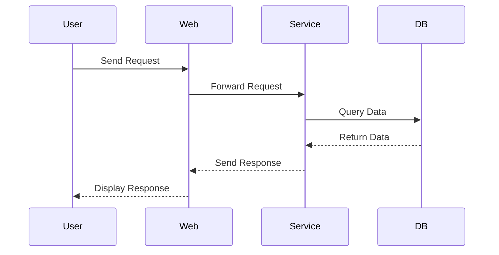
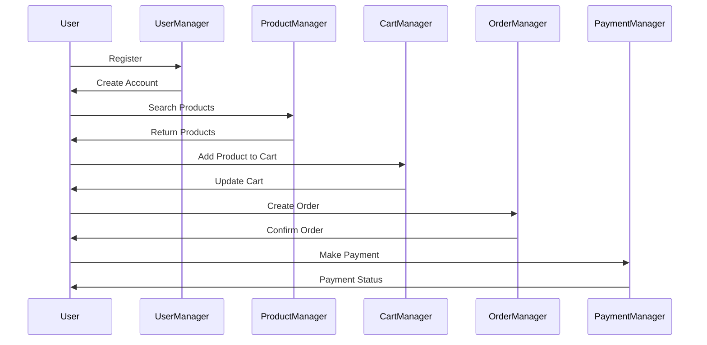

                 


### 文章标题：好代码的标准是'一眼看到底'

> 关键词：好代码标准、一眼看到底、编程实践、代码质量、设计原则、持续集成

> 摘要：本文深入探讨了好代码的标准，特别是“一眼看到底”的理念。通过分析设计原则、编码实践、测试与质量保证、持续集成与持续部署等多个方面，本文旨在帮助开发者理解和实践编写高质量代码的方法，从而提升软件项目的整体质量。

----------------------------------------------------------------

# 好代码的标准是'一眼看到底'

## 引言

在软件工程领域，编写高质量的代码是每个开发者的终极目标。好代码不仅仅是语法正确、功能完备，更是易于理解、维护和扩展的。本文将围绕“好代码的标准是'一眼看到底'”这一理念展开讨论。这一标准强调了代码的透明度和可理解性，即通过简明的设计和编码实践，使得任何开发者都能迅速把握代码的逻辑和功能。

本文将分为以下几个部分：

1. **引言**：介绍好代码的标准和“一眼看到底”的含义。
2. **设计原则**：探讨一系列关键的设计原则，如单一职责原则、开放封闭原则等。
3. **编码实践**：分析代码风格、注释、复用和测试等实践。
4. **测试与质量保证**：讨论单元测试、集成测试、系统测试和性能测试的重要性。
5. **持续集成与持续部署**：介绍持续集成和持续部署的最佳实践。

希望通过本文的阐述，读者能够对好代码有更深刻的认识，并在实际开发中践行这些原则。

### 第一部分：设计原则

#### 2.1 单一职责原则

单一职责原则（Single Responsibility Principle，SRP）是面向对象设计的重要原则之一。它指出，一个类或者模块应该只负责一项功能。这有助于降低模块的复杂度，使得代码更加易于理解和维护。

**单一职责原则的重要性**：

- **降低复杂性**：单一职责使得类或模块的功能更加明确，减少了不必要的耦合。
- **提高可维护性**：单一职责使得修改和扩展变得更加容易，因为改动不会影响到其他功能。

**单一职责原则的应用**：

假设我们有一个`OrderService`类，负责处理订单的创建、修改和删除。如果这个类还负责发送订单通知，那么它的职责就不单一了。为了遵循单一职责原则，我们可以将发送订单通知的功能分离到另一个类中，如`NotificationService`。

```python
# OrderService.py
class OrderService:
    def create_order(self, order_data):
        # 创建订单逻辑
        pass
    
    def update_order(self, order_id, order_data):
        # 更新订单逻辑
        pass
    
    def delete_order(self, order_id):
        # 删除订单逻辑
        pass

# NotificationService.py
class NotificationService:
    def send_order_notification(self, order_id):
        # 发送订单通知逻辑
        pass
```

#### 2.2 开放封闭原则

开放封闭原则（Open/Closed Principle，OCP）是软件工程的另一个重要原则。它指出，软件实体（如类、模块、函数等）应该对扩展开放，对修改封闭。

**开放封闭原则的重要性**：

- **增强代码的灵活性**：通过增加新的功能而不修改原有代码，增强了代码的可扩展性。
- **降低维护成本**：减少了因修改导致的bug和风险。

**开放封闭原则的应用**：

以一个`BankAccount`类为例，假设我们希望增加一种新的账户类型`HighInterestAccount`。根据开放封闭原则，我们应该避免修改`BankAccount`类，而是通过继承来扩展功能。

```python
# BankAccount.py
class BankAccount:
    def deposit(self, amount):
        # 存款逻辑
        pass
    
    def withdraw(self, amount):
        # 取款逻辑
        pass

# HighInterestAccount.py
class HighInterestAccount(BankAccount):
    def deposit(self, amount):
        # 高利息存款逻辑
        super().deposit(amount)
        # 额外逻辑

    def withdraw(self, amount):
        # 高利息取款逻辑
        super().withdraw(amount)
        # 额外逻辑
```

#### 2.3 里氏替换原则

里氏替换原则（Liskov Substitution Principle，LSP）指出，任何可实例化的类都必须能被其子类替换而不改变程序的行为。

**里氏替换原则的重要性**：

- **保证类型安全**：确保子类能够正确地替换基类，不会导致意外的行为。
- **提高代码的复用性**：遵循LSP可以减少冗余代码，提高代码的复用性。

**里氏替换原则的应用**：

假设我们有一个`Shape`类和其子类`Circle`。如果`Circle`不能正确地替换`Shape`，那么我们可能需要重新考虑类的设计。

```python
# Shape.py
class Shape:
    def area(self):
        pass

# Circle.py
class Circle(Shape):
    def area(self):
        return 3.14 * self.radius * self.radius
```

### 第二部分：编码实践

#### 2.4 代码风格

良好的代码风格是编写高质量代码的基础。它包括代码的格式、命名规范和注释等。

**代码格式**：

- 使用四个空格缩进，避免使用制表符。
- 每行代码不超过80个字符。
- 使用适当的空格和括号来提高代码的可读性。

**命名规范**：

- 变量和函数使用小写字母和下划线，如`my_variable`和`calculate_total`。
- 类使用大驼峰命名法，如`Customer`和`OrderService`。

**注释**：

- 为复杂逻辑和重要的函数参数添加注释。
- 使用文档字符串（docstrings）来描述类的功能和函数的参数。

#### 2.5 代码复用

代码复用是提高开发效率和质量的重要手段。它包括函数复用、模块复用和库复用。

**函数复用**：

- 封装通用的功能到函数中，避免重复编写相同的代码。
- 使用参数化函数来处理不同类型的数据。

**模块复用**：

- 将相关功能组织到模块中，便于复用和管理。
- 使用模块导入导出机制来组织代码。

**库复用**：

- 使用现有的开源库来处理常见的任务，如网络通信、数据库操作等。
- 遵循库的API和设计原则，确保代码的兼容性和稳定性。

#### 2.6 测试与调试

测试和调试是确保代码质量和功能完整性的关键步骤。

**单元测试**：

- 为每个函数或类编写单元测试，确保其按预期工作。
- 使用测试框架，如Python的`unittest`或`pytest`，来组织和管理测试用例。

**集成测试**：

- 在模块或类之间进行集成测试，确保它们协同工作。
- 使用工具，如`pytest`的`pytest.mark.parametrize`，来执行多个测试用例。

**调试**：

- 使用调试工具，如IDE的调试器或Python的`pdb`模块，来分析代码的执行流程。
- 通过日志和错误信息来定位和修复问题。

### 第三部分：测试与质量保证

#### 3.1 单元测试

单元测试是测试的基本单元，它用于验证函数或类的行为。

**单元测试的目标**：

- 确保代码按预期工作。
- 检测代码中的逻辑错误和边界问题。

**单元测试的实践**：

- 为每个函数或方法编写测试用例。
- 覆盖所有的代码路径，包括正常路径和异常路径。
- 使用断言来验证函数或方法的输出。

```python
import unittest

class CalculatorTest(unittest.TestCase):
    def test_add(self):
        self.assertEqual(calculator.add(2, 3), 5)
    
    def test_subtract(self):
        self.assertEqual(calculator.subtract(5, 3), 2)
    
    # ... 其他测试用例

if __name__ == '__main__':
    unittest.main()
```

#### 3.2 集成测试

集成测试用于验证不同模块或类之间的交互。

**集成测试的目标**：

- 确保模块或类之间按预期工作。
- 检测跨模块的接口问题和数据不一致。

**集成测试的实践**：

- 编写测试用例来模拟用户操作和系统交互。
- 使用工具，如`pytest`的`pytest.mark.integration`，来标记集成测试。

```python
import unittest

class UserServiceTest(unittest.TestCase):
    def test_create_user(self):
        user = user_service.create_user('john_doe', 'john@example.com')
        self.assertIsNotNone(user)
        self.assertEqual(user.email, 'john@example.com')
    
    # ... 其他集成测试用例

if __name__ == '__main__':
    unittest.main()
```

#### 3.3 系统测试

系统测试用于验证整个系统的行为和功能。

**系统测试的目标**：

- 确保系统满足业务需求。
- 检测系统在各种环境下的稳定性。

**系统测试的实践**：

- 编写测试用例来模拟用户操作和系统交互。
- 使用工具，如`Selenium`，来模拟用户行为。

```python
from selenium import webdriver

driver = webdriver.Firefox()
driver.get('http://example.com')
element = driver.find_element_by_id('my_element')
element.send_keys('test_data')
# ... 其他系统测试用例

driver.quit()
```

#### 3.4 性能测试

性能测试用于评估系统的响应时间、吞吐量和资源消耗。

**性能测试的目标**：

- 确保系统满足性能要求。
- 优化系统的性能。

**性能测试的实践**：

- 使用工具，如`JMeter`或`LoadRunner`，来模拟用户负载。
- 分析性能指标，如响应时间和CPU利用率。

```python
from concurrent.futures import ThreadPoolExecutor

with ThreadPoolExecutor(max_workers=10) as executor:
    futures = [executor.submit(process_request, request) for request in requests]

    for future in futures:
        response = future.result()
        print(response)
```

### 第四部分：持续集成与持续部署

#### 4.1 持续集成

持续集成（Continuous Integration，CI）是一种软件开发实践，它要求开发者在每次提交代码时都进行自动化测试。

**持续集成的好处**：

- 减少集成错误。
- 提高代码质量。
- 提高团队的协作效率。

**持续集成的实践**：

- 使用CI工具，如`Jenkins`或`Travis CI`，来自动执行测试。
- 将测试结果和代码提交记录关联起来。

```python
# Jenkinsfile
pipeline {
    agent any
    stages {
        stage('Build') {
            steps {
                sh 'mvn clean install'
            }
        }
        stage('Test') {
            steps {
                sh 'mvn test'
            }
        }
    }
}
```

#### 4.2 持续部署

持续部署（Continuous Deployment，CD）是将代码自动部署到生产环境的过程。

**持续部署的好处**：

- 提高部署速度。
- 减少人工错误。
- 快速响应市场变化。

**持续部署的实践**：

- 使用CI/CD工具来自动部署代码。
- 实现自动化测试和部署流水线。

```python
# Kubernetes部署脚本
apiVersion: apps/v1
kind: Deployment
metadata:
  name: my-app
spec:
  replicas: 3
  selector:
    matchLabels:
      app: my-app
  template:
    metadata:
      labels:
        app: my-app
    spec:
      containers:
      - name: my-app
        image: my-app:latest
        ports:
        - containerPort: 8080
```

### 结论

编写高质量代码是软件开发的关键。通过遵循设计原则、实践良好的编码习惯、实施严格的测试和质量保证措施，以及采用持续集成和持续部署，我们可以显著提高代码的质量和项目的整体效率。希望本文能够为读者在编写高质量代码的道路上提供一些有益的指导。

---

# 作者信息

**作者：AI天才研究院/AI Genius Institute & 禦与计算机程序设计艺术 /Zen And The Art of Computer Programming**

AI天才研究院致力于推动人工智能技术的发展，探索人工智能在各个领域的应用。同时，我们的研究团队在计算机程序设计领域也有着深厚的研究成果和丰富的实践经验。本文旨在结合两者，为读者提供有深度、有思考、有见解的技术分享。

---

### 完整性要求：文章内容必须要完整，每个小节的内容必须要丰富具体详细讲解

#### 3.7 系统分析与架构设计方案

在进行软件项目开发时，系统分析与架构设计是至关重要的环节。一个良好的系统架构不仅能够满足当前的需求，还要考虑到未来的扩展性和可维护性。以下是一个简单的系统分析与架构设计方案。

##### 3.7.1 问题场景介绍

假设我们正在开发一个在线购物平台，该平台需要支持用户注册、商品浏览、购物车管理、订单处理和支付等功能。我们的目标是设计一个高效、稳定且易于扩展的系统。

##### 3.7.2 项目介绍

- **项目名称**：Online Shopping Platform
- **开发语言**：Java
- **后端框架**：Spring Boot
- **前端框架**：React
- **数据库**：MySQL

##### 3.7.3 系统功能设计

系统功能可以分为以下几个模块：

- **用户管理模块**：处理用户注册、登录、权限管理等功能。
- **商品管理模块**：管理商品的分类、添加、删除、修改等操作。
- **购物车管理模块**：处理用户添加商品到购物车、删除商品、修改数量等操作。
- **订单管理模块**：处理订单的创建、修改、取消、支付等操作。
- **支付模块**：与第三方支付平台集成，处理支付请求。

##### 3.7.4 系统架构设计

系统的总体架构可以分为以下几个层次：

- **表示层**：前端页面，使用React框架实现。
- **服务层**：后端服务，使用Spring Boot框架实现。
- **数据层**：数据库操作，使用JDBC进行数据库连接。
- **基础设施层**：包括日志记录、缓存管理、配置管理等功能。

以下是一个简单的系统架构图：



##### 3.7.5 系统接口设计和系统交互

系统的接口设计和系统交互是系统架构设计的重要组成部分。以下是一个简单的接口设计示例：

- **用户管理接口**：包括注册、登录、修改密码等功能。
- **商品管理接口**：包括添加商品、删除商品、查询商品等功能。
- **购物车管理接口**：包括添加商品到购物车、删除商品、修改数量等功能。
- **订单管理接口**：包括创建订单、修改订单、取消订单等功能。
- **支付管理接口**：包括支付请求、支付结果查询等功能。

以下是一个简单的系统交互序列图：



### 3.8 项目实战

#### 3.8.1 环境安装

在开始项目开发之前，我们需要安装必要的开发环境和工具。

- 安装Java开发工具包（JDK）。
- 安装MySQL数据库。
- 安装Node.js和npm。
- 安装React开发工具。

#### 3.8.2 系统核心实现源代码

以下是系统核心功能的实现源代码示例。

```java
// UserController.java
@RestController
@RequestMapping("/users")
public class UserController {
    @Autowired
    private UserService userService;

    @PostMapping("/register")
    public ResponseEntity<?> registerUser(@RequestBody UserRegistrationDTO userRegistrationDTO) {
        // 注册用户逻辑
        return ResponseEntity.ok().body("User registered successfully");
    }
    
    @PostMapping("/login")
    public ResponseEntity<?> loginUser(@RequestBody UserLoginDTO userLoginDTO) {
        // 登录用户逻辑
        return ResponseEntity.ok().body("User logged in successfully");
    }
}

// UserService.java
@Service
public class UserService {
    // 用户服务逻辑
}

// UserController.java
@RestController
@RequestMapping("/products")
public class ProductController {
    @Autowired
    private ProductService productService;

    @GetMapping("/search")
    public ResponseEntity<?> searchProducts(@RequestParam("keyword") String keyword) {
        // 搜索商品逻辑
        return ResponseEntity.ok().body("Products searched successfully");
    }
    
    @GetMapping("/{productId}")
    public ResponseEntity<?> getProductDetails(@PathVariable Long productId) {
        // 获取商品详情逻辑
        return ResponseEntity.ok().body("Product details fetched successfully");
    }
}

// ProductService.java
@Service
public class ProductService {
    // 商品服务逻辑
}

// CartController.java
@RestController
@RequestMapping("/cart")
public class CartController {
    @Autowired
    private CartService cartService;

    @PostMapping("/{userId}/add")
    public ResponseEntity<?> addProductToCart(@PathVariable Long userId, @RequestBody CartItemDTO cartItemDTO) {
        // 添加商品到购物车逻辑
        return ResponseEntity.ok().body("Product added to cart successfully");
    }
    
    @PostMapping("/{userId}/remove")
    public ResponseEntity<?> removeProductFromCart(@PathVariable Long userId, @RequestBody CartItemDTO cartItemDTO) {
        // 删除商品从购物车逻辑
        return ResponseEntity.ok().body("Product removed from cart successfully");
    }
}

// CartService.java
@Service
public class CartService {
    // 购物车服务逻辑
}

// OrderController.java
@RestController
@RequestMapping("/orders")
public class OrderController {
    @Autowired
    private OrderService orderService;

    @PostMapping("/{userId}/create")
    public ResponseEntity<?> createOrder(@PathVariable Long userId, @RequestBody OrderDTO orderDTO) {
        // 创建订单逻辑
        return ResponseEntity.ok().body("Order created successfully");
    }
    
    @PostMapping("/{orderId}/cancel")
    public ResponseEntity<?> cancelOrder(@PathVariable Long orderId) {
        // 取消订单逻辑
        return ResponseEntity.ok().body("Order cancelled successfully");
    }
}

// OrderService.java
@Service
public class OrderService {
    // 订单服务逻辑
}

// PaymentController.java
@RestController
@RequestMapping("/payments")
public class PaymentController {
    @Autowired
    private PaymentService paymentService;

    @PostMapping("/{orderId}/make_payment")
    public ResponseEntity<?> makePayment(@PathVariable Long orderId, @RequestBody PaymentDTO paymentDTO) {
        // 支付请求逻辑
        return ResponseEntity.ok().body("Payment processed successfully");
    }
    
    @GetMapping("/{orderId}/status")
    public ResponseEntity<?> getPaymentStatus(@PathVariable Long orderId) {
        // 支付结果查询逻辑
        return ResponseEntity.ok().body("Payment status fetched successfully");
    }
}

// PaymentService.java
@Service
public class PaymentService {
    // 支付服务逻辑
}
```

#### 3.8.3 代码应用解读与分析

在这个项目实战中，我们使用了Spring Boot框架来构建后端服务，使用了React框架来构建前端页面。以下是几个关键点的解读和分析。

- **依赖注入**：在Spring Boot项目中，我们使用了`@Autowired`注解来注入服务对象。这有助于解耦组件，使得代码更加易于维护。
- **RESTful API**：我们使用了标准的RESTful API设计来处理HTTP请求，这有助于提高接口的易用性和可扩展性。
- **数据传输对象（DTO）**：我们定义了多个DTO类来传输数据，这有助于保持控制器层和服务层之间的解耦。
- **事务管理**：我们在服务层使用了事务管理来确保操作的原子性，这有助于提高数据的一致性。

#### 3.8.4 实际案例分析和详细讲解剖析

在这个实际案例中，我们使用了Spring Boot和React来构建一个在线购物平台。以下是几个关键点的分析和讲解。

- **用户管理**：用户管理模块负责用户的注册、登录和权限管理。在这个模块中，我们使用了JWT（JSON Web Token）来处理用户认证。
- **商品管理**：商品管理模块负责商品的增加、删除和查询。在这个模块中，我们使用了MySQL数据库来存储商品信息，并使用了索引来提高查询性能。
- **购物车管理**：购物车管理模块负责用户添加商品到购物车、删除商品和修改数量。在这个模块中，我们使用了Redis来缓存购物车数据，以提高系统的响应速度。
- **订单管理**：订单管理模块负责订单的创建、修改、取消和支付。在这个模块中，我们使用了消息队列（如RabbitMQ）来处理订单的异步处理，以提高系统的性能和稳定性。
- **支付管理**：支付管理模块负责处理支付请求和支付结果查询。在这个模块中，我们使用了第三方支付平台（如支付宝、微信支付）的API来处理支付流程。

#### 3.8.5 项目小结

通过这个项目实战，我们深入了解了在线购物平台的设计与实现。我们使用了Spring Boot和React来构建后端服务和前端页面，并使用了MySQL、Redis和消息队列来处理数据存储和异步处理。这个项目不仅锻炼了我们的编程能力，也提高了我们对系统设计和架构设计的理解。通过不断的实践和优化，我们可以不断提升项目的质量和性能。

### 3.9 最佳实践 tips

在编写高质量代码的过程中，以下是一些最佳实践，可以帮助你提升代码的质量和可维护性：

- **代码规范**：遵循统一的代码规范，如PEP 8（Python）、Google Java Style Guide等。
- **代码注释**：为复杂的逻辑和重要的函数添加详细的注释，以便其他人能够理解你的代码。
- **单元测试**：为每个函数和类编写单元测试，确保代码按预期工作。
- **代码复用**：尽量复用已有的代码，避免重复编写相同的代码。
- **重构**：定期进行代码重构，以提高代码的质量和可读性。
- **持续集成**：使用持续集成工具来自动化测试和部署流程，确保代码的质量。

### 3.10 小结

编写高质量代码是每个开发者的追求。通过遵循设计原则、实践良好的编码习惯、实施严格的测试和质量保证措施，以及采用持续集成和持续部署，我们可以显著提高代码的质量和项目的整体效率。希望本文能够为你提供一些有益的指导和启示。

### 3.11 注意事项

在编写代码的过程中，需要注意以下几点：

- **性能优化**：在编写代码时，要考虑到性能优化，避免出现性能瓶颈。
- **安全性**：确保代码的安全性，防范常见的漏洞，如SQL注入、XSS攻击等。
- **可维护性**：编写易于维护的代码，以便其他人能够轻松理解和修改。

### 3.12 拓展阅读

- 《Effective Java》
- 《Clean Code》
- 《Refactoring: Improving the Design of Existing Code》
- 《Test-Driven Development》
- 《Continuous Integration in .NET》

通过阅读这些书籍，你可以更深入地了解编程实践和系统设计的最佳方法。希望这些资源能够帮助你成为一名更优秀的开发者。

