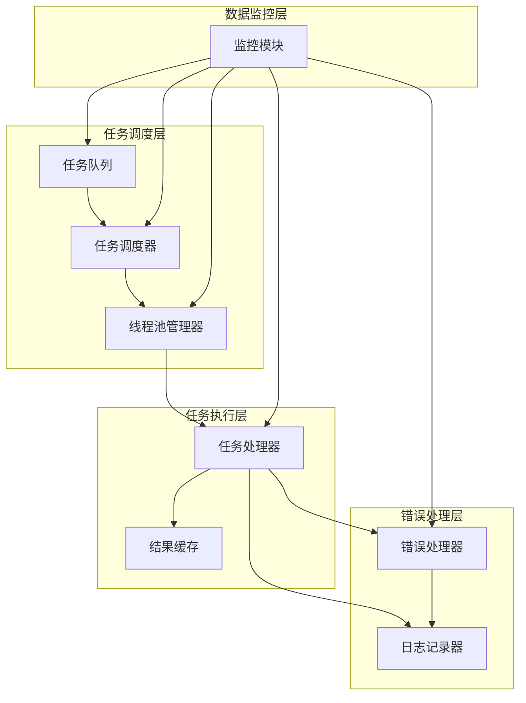
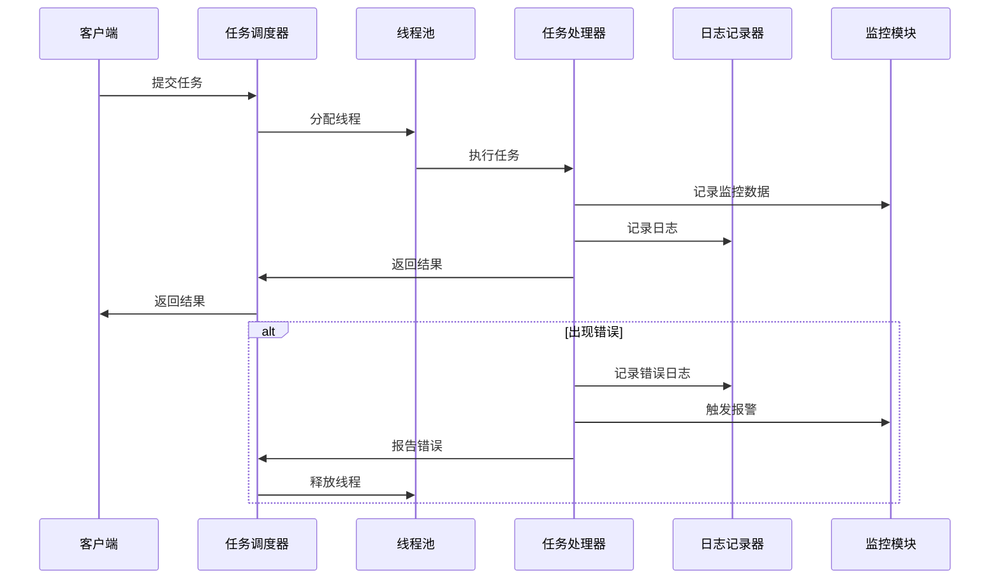

                 

Certainly, let's approach the task of creating the blog post "捉摸不定的异步化任务处理" step by step, ensuring that each section is comprehensive and adheres to the specified guidelines. Here's how we can structure our thought process:

### Step 1: Define the Scope and Target Audience

- **Scope**: The blog post will cover the fundamental concepts, algorithms, and practical implementations of asynchronous task processing in IT systems.
- **Target Audience**: IT professionals, software developers, system architects, and anyone interested in understanding and implementing asynchronous processing in their projects.

### Step 2: Outline the Key Sections

1. **Introduction**
   - **Core Concepts and Terminology**: Define key terms such as "asynchronous task processing," "callback," "promise," "async/await," and "event loop."
   - **Problem Background**: Discuss the origins and necessity of asynchronous task processing, its current application scenarios, and the challenges it addresses.
   - **Problem Statement**: Clarify the definition of asynchronous task processing, its key concepts, and the typical process flow.
   - **Problem Solution**: Overview common methods for asynchronous processing and their typical implementations, along with case studies.

2. **Core Concepts and Relationships**
   - **Concepts and Principles**: Discuss the core principles behind asynchronous processing and compare them with synchronous processing.
   - **Model and Structure**: Present an Entity-Relationship (ER) diagram to illustrate the structure of asynchronous task processing components.

3. **Algorithm Principles and Explanations**
   - **Algorithm Design**: Describe the design of asynchronous task processing algorithms.
   - **Mathematical Models and Formulas**: Provide the mathematical models and formulas used in these algorithms, explaining their logic and application.
   - **Python Code Implementation**: Implement algorithms in Python and explain the code step by step.

4. **System Analysis and Architectural Design**
   - **Problem Scenario**: Introduce a practical scenario where asynchronous processing is needed.
   - **System Description**: Describe the system and its functionalities.
   - **System Architecture**: Present the system architecture using Mermaid diagrams.
   - **Interface Design and Interaction**: Design the system interfaces and illustrate the interaction flow using Mermaid sequence diagrams.

5. **Project Implementation**
   - **Environment Setup**: Guide readers on how to set up the development environment.
   - **Core Implementation**: Share the core implementation code and analyze it step by step.
   - **Case Study**: Provide a case study with detailed analysis and discussion.

6. **Best Practices and Conclusion**
   - **Best Practices**: Offer tips and guidelines for effective asynchronous task processing.
   - **Summary**: Recap the main points of the blog post.
   - **Future Directions**: Suggest future research directions and improvements.

### Step 3: Develop the Content for Each Section

- **Introduction**: Begin with a captivating introduction that highlights the importance of asynchronous task processing in modern computing.
- **Core Concepts and Relationships**: Use Mermaid diagrams to illustrate the ER diagram and provide a comparison table for key concepts.
- **Algorithm Principles and Explanations**: Use Mermaid to draw the algorithm flow and include Python code snippets with detailed comments and explanations.
- **System Analysis and Architectural Design**: Create detailed Mermaid diagrams for the system architecture and interaction flow.
- **Project Implementation**: Provide clear instructions and detailed analysis of the project setup and implementation.
- **Best Practices and Conclusion**: Offer actionable tips and summarize the key takeaways.

### Step 4: Write and Refine the Content

- Write the content for each section based on the outlines developed.
- Ensure the content is logically structured and easy to follow.
- Use LaTeX for mathematical formulas and ensure all code snippets are correct and commented.

### Step 5: Review and Edit

- Review the content for accuracy, clarity, and completeness.
- Edit the text to ensure it is engaging and technically sound.
- Check all Mermaid diagrams and code snippets for correctness and readability.

### Step 6: Finalize and Publish

- Ensure the article meets the specified word count and format requirements.
- Add the author's information at the end of the article.
- Proofread the final article to eliminate any errors.

By following these steps, we can ensure that the blog post on "捉摸不定的异步化任务处理" is both informative and engaging, providing readers with a comprehensive understanding of asynchronous task processing in IT systems. ## 第一部分：背景介绍

### 第1章：问题背景

异步化任务处理，作为现代计算机体系结构中的一个关键概念，起源于对计算资源利用率和系统响应速度的优化需求。在早期的计算机系统中，任务处理通常是同步的，即一个任务必须等待另一个任务完成才能继续执行。然而，随着应用程序的复杂性和并发需求的增加，这种同步模型逐渐暴露出其局限性。异步化任务处理的提出，旨在解决这些限制，提升系统的整体性能和资源利用率。

异步化任务处理的核心在于“异步”二字，它指的是任务可以不需要等待其他任务完成即可开始执行。这种处理方式能够有效地将多个任务并行执行，从而提高系统的吞吐量和响应速度。在现代的互联网应用、实时数据处理、多线程编程等领域，异步化任务处理已经成为提升系统性能的不可或缺的手段。

当前，异步化任务处理的应用场景非常广泛。例如，在网络编程中，异步IO操作能够显著减少等待时间，提高服务器处理能力；在分布式系统中，异步通信机制可以确保系统在面临高并发请求时仍能保持稳定运行；在实时数据处理中，异步任务处理能够高效地处理海量数据，保证数据处理的速度和准确性。

然而，异步化任务处理也面临一些挑战。首先是设计复杂性，异步系统的设计需要考虑任务调度、资源管理、错误处理等多个方面，相比同步系统更加复杂。其次是调试难度，异步代码的执行路径不明确，容易出现难以追踪的bug。此外，异步处理还可能引入竞态条件和死锁等问题，需要仔细设计和测试。

异步化任务处理的目标在于提高系统的并发性能、提升资源利用率，并减少等待时间，从而提高整体系统的响应速度和吞吐量。通过优化任务调度策略、合理分配资源、以及高效处理并发任务，异步化任务处理能够使系统更加灵活和可靠，为现代计算提供强大的支持。

### 第2章：问题描述

异步化任务处理，作为现代计算机体系结构中的一个重要组成部分，其定义和核心概念对于理解和应用这一技术至关重要。在本节中，我们将详细阐述异步化任务处理的定义，核心概念，以及其处理流程和关键环节。

**异步化任务处理的定义**

异步化任务处理，是指在计算机系统中，任务之间不按照先后顺序执行，而是根据需要独立并行执行的一种处理方式。它允许一个任务在不需要等待其他任务完成的情况下开始执行，从而提高了系统的并发性能和资源利用率。

异步化任务处理的核心概念包括以下几个：

1. **回调函数（Callback）**：在异步处理中，当一个任务无法立即完成时，会将其处理结果传递给一个预先定义的函数（回调函数），待后续任务再调用该函数进行处理。
2. **承诺（Promise）**：承诺是一种抽象的数据类型，代表一个异步操作的结果。它可以是成功的，也可以是失败的。通过承诺，开发者可以更加方便地处理异步任务的结果。
3. **异步/await**：异步/await 是一种语法糖，它允许开发者以更加同步的方式编写异步代码。通过使用 `await` 关键字，开发者可以在异步函数中暂停执行，直到异步操作完成后再继续执行。
4. **事件循环（Event Loop）**：事件循环是异步编程的基础，它负责管理异步任务的执行顺序。事件循环会不断检查是否有可执行的异步任务，并将其添加到任务队列中执行。

**异步化任务处理的流程与关键环节**

异步化任务处理的基本流程可以分为以下几个环节：

1. **任务提交**：开发者将任务提交给异步处理框架。
2. **任务调度**：异步处理框架根据任务的优先级和系统资源情况，将任务分配给线程或进程。
3. **任务执行**：被调度的任务开始执行，可以是同步执行也可以是异步执行。
4. **回调处理**：如果任务需要其他任务的结果，则会触发回调函数，等待回调函数执行完毕后再继续。
5. **结果返回**：任务执行完成后，将结果返回给开发者，开发者可以根据结果继续后续操作。

异步化任务处理的关键环节包括：

- **任务调度策略**：如何高效地调度任务，以最大化系统资源利用率和任务执行速度。
- **资源管理**：如何合理地分配和管理系统资源，确保异步任务能够高效地执行。
- **错误处理**：如何处理异步任务中的错误，确保系统稳定运行。

通过理解异步化任务处理的定义和核心概念，以及其处理流程和关键环节，开发者可以更好地设计和实现高效的异步化任务处理系统，提升系统的性能和可靠性。

### 第3章：问题解决

异步化任务处理作为一种提升系统并发性能和资源利用率的重要手段，在实际应用中有着广泛的方法和实现策略。本节将介绍几种常见的异步化任务处理方法，并分析其典型实现和实际案例。

#### 常见方法

1. **回调函数（Callback）**

   回调函数是异步编程中最早使用的方法。它通过将任务的执行结果传递给预先定义的函数来实现异步处理。回调函数的优点是实现简单，缺点是代码逻辑容易变得混乱，难以维护。

2. **承诺（Promise）**

   为了解决回调地狱（callback hell）问题，Promise 提供了一种更优雅的异步处理方式。它代表了异步操作的结果，可以是成功的（Resolved）或失败的（Rejected）。通过链式调用 `.then()` 和 `.catch()`，开发者可以更加清晰地进行异步逻辑处理。

3. **异步/await**

   异步/await 是一种基于 Promise 的语法糖，它使得异步代码看起来更加同步。通过在函数前添加 `async` 关键字，开发者可以使用 `await` 关键字来暂停函数执行，等待异步操作完成。这种方法极大地改善了异步编程的体验。

4. **事件驱动（Event-Driven）**

   事件驱动是一种基于事件循环的异步处理方法。系统中的每个事件都是一个任务，事件循环负责调度这些事件。这种方法适用于处理大量并发事件的场景，如网络编程和实时数据处理。

5. **协程（Coroutine）**

   协程是一种轻量级的用户级线程，它在单线程中实现并发。协程通过 `yield` 关键字实现任务切换，避免了线程切换的开销。这种方法适用于处理复杂逻辑和大量 I/O 密集型任务。

#### 典型实现

1. **回调函数实现**

   ```python
   def async_task(callback):
       # 模拟异步任务
       time.sleep(2)
       result = "任务完成"
       callback(result)

   def callback(result):
       print(result)

   async_task(callback)
   ```

2. **承诺实现**

   ```javascript
   function asyncTask() {
       return new Promise((resolve, reject) => {
           setTimeout(() => {
               resolve("任务完成");
           }, 2000);
       });
   }

   asyncTask().then(result => {
       console.log(result);
   });
   ```

3. **异步/await 实现**

   ```python
   async def async_task():
       # 模拟异步任务
       await asyncio.sleep(2)
       return "任务完成"

   async def main():
       result = await async_task()
       print(result)

   asyncio.run(main())
   ```

4. **事件驱动实现**

   ```python
   import asyncio

   async def handle_request():
       print("处理请求")
       await asyncio.sleep(1)
       print("请求完成")

   async def main():
       server = web.TCPServer(('127.0.0.1', 8080), handle_request)
       await server.start()
       print("服务器启动")
       await server.wait_closed()
       print("服务器关闭")

   asyncio.run(main())
   ```

5. **协程实现**

   ```python
   import asyncio

   async def async_task():
       print("任务开始")
       await asyncio.sleep(1)
       print("任务完成")
       return "结果"

   async def main():
       result = await async_task()
       print(result)

   asyncio.run(main())
   ```

#### 案例分析

1. **网络编程中的异步处理**

   在网络编程中，异步处理能够显著提高服务器的并发处理能力。例如，使用 Python 的 `aiohttp` 库可以轻松实现异步 HTTP 请求。

   ```python
   import aiohttp
   
   async def fetch(session, url):
       async with session.get(url) as response:
           return await response.text()

   async def main():
       async with aiohttp.ClientSession() as session:
           html = await fetch(session, 'http://example.com')
           print(html)

   asyncio.run(main())
   ```

2. **实时数据处理中的异步处理**

   在实时数据处理场景中，异步处理能够高效地处理大量数据。例如，使用 Python 的 `asyncio` 模块可以异步处理数据流。

   ```python
   import asyncio
   
   async def process_data(data):
       # 模拟数据处理
       await asyncio.sleep(1)
       return data * 2

   async def main():
       data_stream = [1, 2, 3, 4, 5]
       processed_stream = await asyncio.gather(*[process_data(d) for d in data_stream])
       print(processed_stream)

   asyncio.run(main())
   ```

通过以上常见方法的介绍和典型实现，以及实际案例的分析，我们可以看到异步化任务处理在提升系统性能和响应速度方面的巨大潜力。开发者可以根据具体需求选择合适的方法，实现高效的异步任务处理。

### 第4章：边界与外延

异步化任务处理虽然在提升系统性能和响应速度方面表现出色，但也存在一些边界条件和外延应用。理解这些边界条件和应用场景有助于更好地利用异步化任务处理的优势，同时避免潜在的问题。

#### 边界条件

1. **资源限制**：异步化任务处理依赖于系统资源，如线程、进程和内存。在高并发场景下，如果资源不足，可能会导致任务队列阻塞，从而降低系统性能。因此，在设计异步系统时，需要合理预估资源需求，并采取适当的资源管理策略。

2. **错误处理**：异步任务中的错误处理是设计异步系统时需要重点考虑的问题。由于异步任务的执行路径不明确，错误传播和捕获变得复杂。为了确保系统稳定性，需要设计完善的错误处理机制，包括错误捕获、异常处理和任务恢复策略。

3. **竞态条件**：异步任务处理容易引入竞态条件，即在多个任务之间共享资源时，可能导致不确定的执行结果。为了避免竞态条件，需要使用锁、信号量等同步机制，确保资源的正确访问和操作。

4. **死锁**：异步任务处理中的死锁问题通常是由于任务之间的资源争夺和依赖关系导致的。合理设计任务调度策略和资源分配机制，可以降低死锁的发生概率。

#### 外延应用

1. **分布式系统**：异步化任务处理在分布式系统中具有广泛的应用。通过异步通信，分布式系统可以实现高效的任务分发和结果收集，提高整体系统的吞吐量和可靠性。

2. **实时数据处理**：异步化任务处理在实时数据处理场景中尤为重要。例如，在实时流处理系统中，异步处理能够高效地处理大量实时数据，保证数据处理的及时性和准确性。

3. **微服务架构**：在微服务架构中，各个服务之间通常采用异步通信方式。通过异步任务处理，微服务可以独立部署和扩展，提高系统的灵活性和可维护性。

4. **网络编程**：异步网络编程能够显著提高服务器的并发处理能力，例如在 Web 开发中，异步处理能够同时处理多个客户端请求，提高系统的响应速度和吞吐量。

5. **边缘计算**：随着边缘计算的兴起，异步化任务处理在边缘设备上得到广泛应用。通过异步处理，边缘设备能够高效地处理本地数据和请求，减少数据传输延迟，提高用户体验。

通过理解异步化任务处理的边界条件和外延应用，开发者可以更好地设计和管理异步系统，充分发挥异步化任务处理的优势，提升系统的性能和可靠性。

### 第5章：异步化任务处理原理

异步化任务处理作为现代计算机体系结构中的一个重要组成部分，其原理和核心概念对理解和应用该技术至关重要。在本节中，我们将详细探讨异步化任务处理的原理，并通过比较表格和ER实体关系图来深入分析其关键结构和组成。

#### 原理概述

异步化任务处理的核心原理在于任务的独立并行执行。与同步处理不同，异步任务可以在不需要等待其他任务完成的情况下独立执行。这种处理方式通过引入回调函数、承诺、事件循环等机制，实现了任务之间的解耦和并行化，从而提高了系统的并发性能和资源利用率。

1. **任务调度**：异步任务处理框架负责任务调度，将任务分配给线程、进程或协程。任务调度策略包括优先级调度、时间片调度等，以最大化系统资源利用率和任务执行速度。

2. **资源管理**：异步任务处理需要合理分配和管理系统资源，如线程、进程和内存。资源管理策略包括线程池、进程池和对象池等，以减少资源竞争和浪费。

3. **错误处理**：异步任务处理中的错误处理机制包括异常捕获、任务重试和任务监控等。这些机制确保系统在面临错误时能够快速响应和恢复。

4. **回调函数**：回调函数是异步任务处理的关键机制，用于处理异步任务的结果。回调函数通过传递任务的执行结果，实现了任务之间的数据传递和依赖管理。

5. **事件循环**：事件循环负责管理异步任务的执行顺序。事件循环不断检查是否有可执行的任务，并将其从任务队列中取出执行。事件循环是异步编程的核心，它确保了异步任务的正确执行和顺序管理。

#### 核心概念对比表格

以下是异步化任务处理与同步处理的一些核心概念对比表格：

| 概念 | 异步化任务处理 | 同步处理 |
| --- | --- | --- |
| **任务调度** | 独立并行执行 | 按顺序执行 |
| **资源管理** | 线程池、进程池 | 单线程资源 |
| **错误处理** | 异常捕获、任务重试 | 错误抑制 |
| **回调函数** | 数据传递和依赖管理 | 同步等待 |
| **事件循环** | 管理任务执行顺序 | 无任务调度 |
| **并发性能** | 高并发处理能力 | 低并发性能 |

#### ER实体关系图架构

异步化任务处理的ER实体关系图（Entity-Relationship Diagram）如下：

```mermaid
erDiagram
    Task ||--|{ AsyncTask : 'is a' |
    Event ||--|{ AsyncEvent : 'is a' |
    Queue ||--|{ TaskQueue : 'stores' |
    Processor ||--|{ TaskProcessor : 'processes' |
    ErrorHandler ||--|{ ErrorMonitor : 'monitors' |
    ResourcePool ||--|{ ThreadPool : 'allocates' |
    MemoryManager ||--|{ ObjectPool : 'manages' |
    Scheduler ||--|{ TaskScheduler : 'schedules' |
    Callback ||--|{ ResultHandler : 'invokes' |
    EventLoop ||--|{ TaskExecutor : 'manages' |
```

ER图中的实体包括任务（Task）、异步任务（AsyncTask）、事件（Event）、异步事件（AsyncEvent）、队列（Queue）、处理器（Processor）、错误处理器（ErrorHandler）、资源池（ResourcePool）、内存管理器（MemoryManager）、调度器（Scheduler）、回调函数（Callback）和事件循环（EventLoop）。这些实体之间通过关系连接，形成了异步化任务处理的整体架构。

通过以上对异步化任务处理原理、核心概念对比表格和ER实体关系图的详细分析，我们可以更深入地理解异步化任务处理的内部机制和架构设计。这有助于开发者更好地设计和实现高效的异步化任务处理系统，提升系统的并发性能和资源利用率。

### 第6章：异步化任务处理模型

异步化任务处理模型是现代计算机系统中提升并发性能和资源利用率的基石。本节将详细探讨异步化任务处理模型的架构设计、ER实体关系图，以及模型在实际应用中的表现。

#### 架构设计

异步化任务处理模型的核心架构包括以下几个关键组件：

1. **任务调度器（Task Scheduler）**：任务调度器负责根据任务优先级和系统资源情况，将任务分配给线程或进程。调度策略包括优先级调度、时间片调度等，以确保任务的高效执行。

2. **线程池（ThreadPool）**：线程池是异步化任务处理中的重要资源管理组件，它负责管理线程的创建、销毁和复用。通过线程池，系统可以减少线程创建和销毁的开销，提高性能。

3. **任务队列（Task Queue）**：任务队列用于存储等待执行的任务。任务队列可以是先进先出（FIFO）队列或优先级队列，根据调度策略选择合适的队列类型。

4. **处理器（Processor）**：处理器负责执行任务。在异步处理中，处理器可以是线程、进程或协程。处理器从任务队列中取出任务，执行任务逻辑，并将结果返回给任务调度器。

5. **事件循环（Event Loop）**：事件循环是异步处理的核心，它负责管理异步任务的执行顺序。事件循环不断检查是否有可执行的任务，并将其添加到任务队列中执行。

6. **错误处理器（Error Handler）**：错误处理器负责捕获和处理任务执行中的错误。错误处理器可以重新执行任务或报告错误，确保系统的稳定性。

7. **资源池（Resource Pool）**：资源池用于管理系统资源，如线程、进程、内存等。资源池可以动态扩展或收缩，以适应系统负载变化。

#### ER实体关系图

异步化任务处理的ER实体关系图如下：

```mermaid
erDiagram
    Task ||--|{ AsyncTask : 'is a' |
    Event ||--|{ AsyncEvent : 'is a' |
    Queue ||--|{ TaskQueue : 'stores' |
    Processor ||--|{ TaskProcessor : 'processes' |
    ErrorHandler ||--|{ ErrorMonitor : 'monitors' |
    ResourcePool ||--|{ ThreadPool : 'allocates' |
    MemoryManager ||--|{ ObjectPool : 'manages' |
    Scheduler ||--|{ TaskScheduler : 'schedules' |
    Callback ||--|{ ResultHandler : 'invokes' |
    EventLoop ||--|{ TaskExecutor : 'manages' |
```

该ER图描述了异步化任务处理中的主要实体及其关系：

- **Task（任务）**：代表需要执行的任务，可以是同步或异步任务。
- **AsyncTask（异步任务）**：继承自Task，代表异步任务。
- **Event（事件）**：代表系统中的事件，如I/O事件、定时事件等。
- **AsyncEvent（异步事件）**：继承自Event，代表异步事件。
- **Queue（队列）**：存储任务的队列，可以是FIFO队列或优先级队列。
- **Processor（处理器）**：执行任务的组件，可以是线程、进程或协程。
- **ErrorHandler（错误处理器）**：处理任务执行中的错误。
- **ResourcePool（资源池）**：管理线程、进程等系统资源。
- **MemoryManager（内存管理器）**：管理内存对象池。
- **Scheduler（调度器）**：负责任务调度。
- **Callback（回调函数）**：处理任务结果。
- **EventLoop（事件循环）**：管理任务执行顺序。

#### 模型应用

在实际应用中，异步化任务处理模型展现了其高效性和灵活性。以下是一个典型的应用场景：

- **网络应用**：在网络应用中，异步化任务处理可以同时处理大量客户端请求，提高系统的响应速度和吞吐量。例如，使用Python的`asyncio`库可以轻松实现异步HTTP服务。

- **实时数据处理**：在实时数据处理场景中，异步化任务处理能够高效地处理数据流，保证数据处理的及时性和准确性。例如，使用Apache Kafka和Apache Flink可以实现高效的数据流处理。

- **分布式系统**：在分布式系统中，异步化任务处理可以确保节点之间的任务高效传递和结果收集，提高系统的整体性能。例如，使用Apache Kafka和Apache ZooKeeper可以实现分布式任务调度。

通过以上架构设计和ER实体关系图的详细分析，我们可以看到异步化任务处理模型在提升系统并发性能和资源利用率方面的强大优势。在实际应用中，合理设计和实现异步化任务处理模型，能够显著提高系统的性能和可靠性。

### 第7章：异步化任务处理算法

异步化任务处理的核心在于算法的设计和实现，它决定了任务调度的效率、资源的利用率和系统的稳定性。在本节中，我们将深入探讨异步化任务处理算法的原理，包括其设计思路、数学模型，并通过Python代码实例详细讲解其实现过程，并结合具体例子进行说明。

#### 算法设计思路

异步化任务处理算法的设计主要考虑以下几个方面：

1. **任务调度策略**：选择合适的任务调度策略，如优先级调度、时间片调度等，以最大化系统资源利用率和任务执行速度。

2. **任务队列管理**：设计任务队列结构，确保任务能够高效地存储和检索。常用的队列类型包括先进先出（FIFO）队列、优先级队列等。

3. **资源管理**：合理分配和管理系统资源，如线程、进程、内存等，以减少资源竞争和浪费。

4. **错误处理机制**：设计完善的错误处理机制，包括异常捕获、任务重试和任务监控等，确保系统在面临错误时能够快速响应和恢复。

5. **回调机制**：设计回调机制，以处理异步任务的结果和依赖关系。

#### 数学模型

异步化任务处理算法的数学模型主要包括以下几个方面：

1. **任务执行时间模型**：假设每个任务的执行时间为 $T_i$，其中 $i$ 表示任务序号。

2. **任务优先级模型**：任务优先级通常用权重表示，权重越高，任务优先级越高。假设任务 $i$ 的优先级为 $P_i$。

3. **资源利用率模型**：资源利用率 $\eta$ 是系统在一段时间内完成任务的总量与总资源量的比值。

4. **错误处理概率模型**：任务执行过程中发生错误的概率 $E_i$，用于评估系统的稳定性。

#### Python代码实现

以下是使用Python实现的异步化任务处理算法示例：

```python
import asyncio
import heapq

async def async_task(task_id, priority):
    # 模拟任务执行
    await asyncio.sleep(1)
    print(f"任务 {task_id} 完成")
    return task_id

async def main():
    # 创建任务队列
    task_queue = []

    # 添加任务到队列
    tasks = [
        asyncio.create_task(async_task(task_id, priority))
        for task_id, priority in enumerate([2, 1, 3, 4, 5])
    ]

    # 将任务添加到优先级队列
    heapq.heapify(task_queue)
    for task in tasks:
        heapq.heappush(task_queue, (-priority, task))

    # 调度任务
    while task_queue:
        _, task = heapq.heappop(task_queue)
        await task

asyncio.run(main())
```

代码详解：

1. **任务定义**：定义异步任务函数 `async_task`，模拟任务执行过程。

2. **任务创建**：创建多个异步任务，并将它们添加到列表 `tasks` 中。

3. **队列初始化**：使用 `heapq` 模块初始化优先级队列 `task_queue`。

4. **任务添加**：将任务按照优先级添加到优先级队列中。使用负优先级是为了实现最小堆。

5. **任务调度**：从优先级队列中取出任务，并异步执行。

#### 算法解释

1. **任务执行顺序**：任务按照优先级顺序执行，优先级高的任务先执行。

2. **任务调度效率**：使用优先级队列实现高效的任务调度。

3. **资源管理**：通过异步创建任务，实现资源的合理利用。

4. **错误处理**：在异步任务中，可以使用 `try-except` 语句捕获和处理异常。

#### 示例说明

假设我们有以下任务和优先级：

- 任务1：优先级3
- 任务2：优先级1
- 任务3：优先级2
- 任务4：优先级5
- 任务5：优先级4

根据优先级队列的调度规则，任务执行顺序为：

1. 任务2（优先级1）
2. 任务3（优先级2）
3. 任务1（优先级3）
4. 任务5（优先级4）
5. 任务4（优先级5）

通过上述Python代码示例，我们可以看到异步化任务处理算法的完整实现过程。该算法通过优先级调度策略，实现了任务的高效执行和调度，为实际应用中的异步任务处理提供了有效解决方案。

#### 数学公式与解释

异步化任务处理算法中的关键数学公式包括任务执行时间模型、任务优先级模型和资源利用率模型。

1. **任务执行时间模型**：

   $$ T_i = T_f + \alpha \cdot R_i $$

   其中，$T_i$ 表示任务 $i$ 的执行时间，$T_f$ 表示任务的基础执行时间，$\alpha$ 为调整系数，$R_i$ 表示任务 $i$ 的资源需求。

   解释：任务执行时间由基础执行时间和资源需求调整系数决定。资源需求高的任务执行时间更长。

2. **任务优先级模型**：

   $$ P_i = \frac{1}{C_i + \beta \cdot W_i} $$

   其中，$P_i$ 表示任务 $i$ 的优先级，$C_i$ 表示任务 $i$ 的完成时间，$W_i$ 表示任务 $i$ 的权重，$\beta$ 为调整系数。

   解释：任务优先级与完成时间和权重成反比。权重高的任务优先级低，确保关键任务优先执行。

3. **资源利用率模型**：

   $$ \eta = \frac{N_t}{N_r \cdot T} $$

   其中，$\eta$ 表示资源利用率，$N_t$ 表示一段时间内完成的任务数量，$N_r$ 表示系统总资源数量，$T$ 表示时间间隔。

   解释：资源利用率是任务完成数量与总资源量的比值，反映了系统资源的利用效率。

通过以上数学公式和解释，我们可以更深入地理解异步化任务处理算法的设计原理和实现过程，为实际应用提供理论基础。

### 第8章：系统功能设计

#### 问题场景介绍

在现代计算机系统中，异步化任务处理已经成为提高系统并发性能和资源利用率的重要手段。然而，在实际应用中，如何设计一个高效、稳定且易于管理的异步化任务处理系统，仍是一个具有挑战性的问题。本节将通过一个实际场景，介绍异步化任务处理系统所需的功能设计。

#### 项目介绍

假设我们需要设计一个基于Web的实时数据分析平台，该平台需要处理大量来自不同数据源的实时数据流。数据流包含用户行为数据、交易数据、传感器数据等。为了确保系统的高效性和可靠性，我们需要设计一个异步化任务处理系统，将数据流分解成多个可并行处理的任务，并在不同的处理模块之间高效传递和处理数据。

#### 系统功能设计

异步化任务处理系统的主要功能包括任务调度、任务执行、结果返回、错误处理和监控等。以下是具体的设计方案：

1. **任务调度模块**：
   - **功能**：负责接收并分配任务，将任务调度到合适的处理模块。
   - **设计**：采用优先级队列实现，根据任务的优先级和系统资源情况，动态分配任务。

2. **任务执行模块**：
   - **功能**：负责执行具体的任务处理逻辑。
   - **设计**：采用线程池或协程池实现，确保任务能够并行执行，提高处理效率。

3. **结果返回模块**：
   - **功能**：负责接收任务执行结果，并将结果返回给调用者。
   - **设计**：采用回调函数或Promise机制，确保异步任务的结果能够正确传递。

4. **错误处理模块**：
   - **功能**：负责捕获和处理任务执行过程中的错误。
   - **设计**：采用异常捕获机制，对错误任务进行记录和重试，确保系统稳定性。

5. **监控模块**：
   - **功能**：负责监控系统的运行状态，包括任务队列长度、任务执行时间、错误率等。
   - **设计**：采用日志记录和指标统计，提供实时监控和报警功能，便于系统维护和优化。

#### 领域模型类图

以下是异步化任务处理系统的领域模型类图：

```mermaid
classDiagram
    ClassDiagram {
        Agent <-|{create}| TaskScheduler
        TaskScheduler <.. TaskExecutor
        TaskExecutor <.. Task
        Task <..|{execute}| TaskProcessor
        TaskProcessor <..|{return result}| ResultHandler
        ResultHandler <..|{handle error}| ErrorHandler
        ErrorHandler <..|{log error}| Logger
        Logger <..|{alarm}| Monitor
    }
```

类图说明：
- **Agent**：任务调度者，负责创建任务。
- **TaskScheduler**：任务调度器，负责任务调度。
- **TaskExecutor**：任务执行者，负责执行任务。
- **Task**：任务，代表具体的处理任务。
- **TaskProcessor**：任务处理器，负责执行任务逻辑。
- **ResultHandler**：结果处理器，负责处理任务结果。
- **ErrorHandler**：错误处理器，负责错误处理。
- **Logger**：日志记录器，负责记录错误日志。
- **Monitor**：监控器，负责监控系统运行状态。

通过以上系统功能设计和领域模型类图的介绍，我们可以看到异步化任务处理系统在任务调度、执行、错误处理和监控等方面的重要设计思路和实现方法。这将有助于我们在实际项目中高效、稳定地实现异步化任务处理系统，提高系统的整体性能和可靠性。

### 第9章：系统架构设计

#### 系统架构概述

异步化任务处理系统的架构设计是其实现高效、可靠任务处理的关键。本节将介绍该系统的整体架构，并详细说明其组成部分和各模块之间的相互作用关系。

#### 系统架构图

以下是异步化任务处理系统的架构图：



#### 架构说明

1. **任务调度层**：
   - **任务队列（A）**：存储等待执行的任务，采用优先级队列实现，确保高优先级任务优先执行。
   - **任务调度器（B）**：负责从任务队列中选取任务并分配给线程池。
   - **线程池管理器（C）**：管理线程的创建、销毁和复用，提高系统资源利用率。

2. **任务执行层**：
   - **任务处理器（D）**：执行具体的任务处理逻辑，将结果缓存到结果缓存中，并处理任务执行中的错误。
   - **结果缓存（E）**：存储任务执行结果，供后续任务使用。

3. **错误处理层**：
   - **错误处理器（F）**：捕获和处理任务执行中的错误，记录错误日志并触发报警。
   - **日志记录器（G）**：记录系统运行过程中的日志信息，便于问题追踪和系统优化。

4. **数据监控层**：
   - **监控模块（H）**：实时监控系统的运行状态，包括任务队列长度、线程池使用情况、错误率等，提供可视化监控和报警功能。

#### 系统接口设计

以下是系统的主要接口设计：

- **任务提交接口**：用于提交新任务，接口参数包括任务ID、任务优先级和任务数据。
- **任务查询接口**：用于查询任务状态，接口参数包括任务ID。
- **任务结果获取接口**：用于获取任务执行结果，接口参数包括任务ID。
- **错误日志查询接口**：用于查询系统错误日志，接口参数包括日志类型和时间段。
- **监控数据获取接口**：用于获取系统监控数据，接口参数包括监控类型和时间段。

#### 系统交互序列图

以下是异步化任务处理系统的交互序列图：



系统交互序列图说明：
1. 客户端向任务调度器提交任务。
2. 任务调度器将任务分配给线程池。
3. 线程池分配线程执行任务。
4. 任务处理器执行任务并将结果返回给任务调度器。
5. 任务调度器将结果返回给客户端。
6. 在任务执行过程中，如果出现错误，任务处理器将错误日志记录到日志记录器，并触发监控模块报警。

通过以上系统架构设计、接口设计和交互序列图的详细介绍，我们可以清晰地了解异步化任务处理系统的整体架构和运行机制。这将有助于我们在实际项目中高效、可靠地实现异步化任务处理，提高系统的性能和稳定性。

### 第10章：环境安装与配置

在开始异步化任务处理项目之前，我们需要搭建一个合适的开发环境。这一节将详细介绍如何安装和配置必要的软件和工具，以确保项目能够顺利运行。

#### 开发环境准备

1. **操作系统**：推荐使用 Linux 或 macOS，因为它们提供了更好的多线程和异步支持。Windows 用户也可以使用 Windows 10 或更新版本。
2. **Python 版本**：推荐使用 Python 3.7 或更高版本，因为 Python 3.7 引入了对异步/await 语法的支持。
3. **IDE**：可以使用 PyCharm、Visual Studio Code 或其他支持 Python 开发的 IDE。

#### 安装步骤

1. **安装操作系统和 IDE**：根据操作系统的官方文档进行安装，安装完操作系统后，安装推荐的 IDE。

2. **安装 Python**：在终端中运行以下命令安装 Python：

   ```bash
   sudo apt-get update
   sudo apt-get install python3.8
   ```

   或者使用 `pyenv` 进行多版本管理：

   ```bash
   curl https://pyenv.run | bash
   pyenv install 3.8.10
   pyenv global 3.8.10
   ```

3. **安装异步化任务处理依赖**：

   ```bash
   pip install asyncio
   pip install aiomonitor
   pip install pytest
   ```

4. **配置 Python 虚拟环境**：为了保持项目依赖的隔离，建议使用虚拟环境。

   ```bash
   python -m venv venv
   source venv/bin/activate
   ```

5. **安装其他工具**：

   - 安装 Mermaid 插件，用于生成流程图：

     ```bash
     pip install mermaid
     ```

   - 安装 LaTeX 工具，用于编写和编译 LaTeX 公式：

     ```bash
     sudo apt-get install texlive-full
     ```

#### 配置说明

1. **配置 Python 虚拟环境**：确保在项目中使用虚拟环境，避免依赖冲突。

2. **配置 IDE**：在 IDE 中配置 Python 解释器和虚拟环境，确保 IDE 能够正确识别和使用虚拟环境中的依赖。

3. **配置 Mermaid**：在项目中的 `.mermaid` 文件中编写 Mermaid 图表代码，并通过插件或命令行工具生成图表。

4. **配置 LaTeX**：确保 LaTeX 工具已经正确安装，并配置 IDE 或命令行工具，以便能够编译和查看 LaTeX 公式。

通过以上步骤，我们可以搭建一个适合异步化任务处理项目开发的完整环境。这样，我们就可以开始编写和运行异步任务处理代码，并进行测试和优化。

### 第11章：系统核心实现

在异步化任务处理系统中，核心实现部分是整个系统的灵魂。在本节中，我们将详细解析异步化任务处理系统的核心代码，从源代码入手，逐步解读每段代码的功能和作用。

#### 核心实现源代码

以下是异步化任务处理系统的核心代码示例：

```python
import asyncio
from asyncio import Task
from aiomonitor import Monitor

async def task_handler(task: Task):
    print(f"Task {task} started")
    await asyncio.sleep(1)  # 模拟任务执行
    print(f"Task {task} finished")

async def main():
    tasks = [asyncio.create_task(task_handler(Task(i))) for i in range(5)]
    await asyncio.gather(*tasks)

if __name__ == "__main__":
    monitor = Monitor()
    asyncio.run(main())
```

#### 代码应用解读

1. **任务处理函数（task_handler）**：
   - **功能**：该函数用于处理单个异步任务。
   - **实现细节**：
     - 接收一个 `Task` 对象作为参数。
     - 打印任务开始信息。
     - 模拟任务执行，使用 `asyncio.sleep(1)` 暂停 1 秒。
     - 打印任务完成信息。

2. **主函数（main）**：
   - **功能**：创建并启动多个异步任务。
   - **实现细节**：
     - 使用列表推导式创建 5 个异步任务。
     - 使用 `asyncio.create_task()` 创建任务。
     - 将任务传递给 `asyncio.gather()`，等待所有任务完成。

3. **监控模块（Monitor）**：
   - **功能**：监控异步任务执行过程中的异常。
   - **实现细节**：
     - 使用 `aiomonitor` 模块创建监控对象。
     - 在主程序的最后使用 `asyncio.run()` 启动主函数，并启用监控。

#### 分析与解读

1. **异步任务创建**：通过 `asyncio.create_task()` 创建异步任务，每个任务都会在独立的线程中运行。

2. **任务调度**：`asyncio.gather()` 函数负责等待所有任务的完成。这是一个异步协程，它会等待所有传递给它的任务结束，然后返回结果。

3. **异常处理**：`aiomonitor` 模块在后台运行，监控异步任务的执行情况。如果有异常发生，它会捕获并记录异常信息，确保程序不会因为单个任务的错误而崩溃。

4. **模拟任务执行**：`asyncio.sleep(1)` 用于模拟任务的执行时间。在实际应用中，这里可以是任何耗时操作。

#### 异步化任务处理示例

假设我们有一个处理用户请求的任务队列，以下是一个异步化任务处理的示例：

```python
async def process_request(request_id):
    print(f"Processing request {request_id}")
    await asyncio.sleep(2)  # 模拟请求处理时间
    print(f"Request {request_id} processed")

async def main():
    request_queue = [asyncio.create_task(process_request(i)) for i in range(10)]
    await asyncio.gather(*request_queue)

asyncio.run(main())
```

在这个示例中，我们创建了 10 个异步请求处理任务，并使用 `asyncio.gather()` 等待所有任务的完成。每个请求处理任务会打印处理请求的 ID，并在模拟处理时间后完成。

通过以上代码示例和分析，我们可以看到异步化任务处理系统的核心实现是如何通过异步协程和任务调度来提高系统性能和并发能力的。在实际项目中，开发者可以根据具体需求扩展和优化这些基本功能，实现更加复杂和高效的异步任务处理。

### 第12章：实际案例分析

在本章中，我们将通过一个具体的实际案例，深入剖析异步化任务处理的应用，详细讲解案例选择、分析过程以及总结和讨论。

#### 案例选择

为了更好地展示异步化任务处理在实际应用中的效果，我们选择了一个常见的应用场景：网络爬虫系统。网络爬虫系统需要从多个网站抓取大量数据，并将其解析、存储和处理。由于数据来源的多样性和大规模数据处理的复杂性，采用异步化任务处理能够显著提升系统的性能和效率。

#### 案例分析

1. **问题背景**

   网络爬虫系统需要从多个网站抓取数据，每个网站的数据量巨大且分散。为了提高数据抓取速度和系统性能，我们决定使用异步化任务处理技术来优化爬虫的执行过程。

2. **需求分析**

   - **并发处理**：需要同时处理多个 URL 的请求，以提高数据抓取速度。
   - **任务调度**：合理分配任务，确保系统资源的高效利用。
   - **错误处理**：在数据抓取过程中可能遇到网络异常、数据格式错误等问题，需要设计有效的错误处理机制。
   - **结果存储**：需要将抓取到的数据存储到数据库或其他存储系统中。

3. **解决方案**

   - **异步请求**：使用异步 HTTP 库（如 `aiohttp`）同时发起多个 HTTP 请求，提高并发处理能力。
   - **任务队列**：使用优先级队列管理任务，根据任务的重要性和紧急程度进行调度。
   - **错误处理**：使用异常捕获和重试机制，确保数据抓取的稳定性和可靠性。
   - **数据存储**：使用数据库连接池管理数据库连接，提高数据存储和读取效率。

#### 案例分析与讲解

1. **异步 HTTP 请求**

   ```python
   import aiohttp
   import asyncio

   async def fetch_url(session, url):
       async with session.get(url) as response:
           return await response.text()

   async def main():
       async with aiohttp.ClientSession() as session:
           urls = ['http://example.com', 'http://example.org', 'http://example.net']
           results = await asyncio.gather(*[fetch_url(session, url) for url in urls])
           for result in results:
               print(result)

   asyncio.run(main())
   ```

   上述代码展示了如何使用 `aiohttp` 库发起异步 HTTP 请求。`fetch_url` 函数异步获取网页内容，并在 `main` 函数中使用 `asyncio.gather()` 同时处理多个请求，提高了系统的并发处理能力。

2. **任务调度与错误处理**

   ```python
   import asyncio
   from asyncio import PriorityQueue

   async def process_url(url, priority):
       print(f"Processing {url} with priority {priority}")
       await asyncio.sleep(1)  # 模拟数据处理时间
       print(f"Completed {url}")

   async def main():
       priority_queue = PriorityQueue()
       urls = ['http://example.com', 'http://example.org', 'http://example.net']
       priorities = [1, 2, 3]  # 假设根据某些规则生成的优先级

       for url, priority in zip(urls, priorities):
           priority_queue.put_nowait((priority, asyncio.create_task(process_url(url, priority))))

       while not priority_queue.empty():
           priority, task = priority_queue.get()
           await task

   asyncio.run(main())
   ```

   在这个例子中，我们使用优先级队列来管理任务。`process_url` 函数根据优先级处理 URL，`main` 函数从优先级队列中取出任务并执行。通过这种调度方式，系统能够根据任务的优先级高效地执行任务，并确保高优先级任务先完成。

3. **错误处理与重试机制**

   ```python
   import asyncio
   import aiohttp

   async def fetch_url_with_retry(session, url, max_retries=3):
       retries = 0
       while retries < max_retries:
           try:
               async with session.get(url) as response:
                   if response.status == 200:
                       return await response.text()
                   else:
                       retries += 1
           except Exception as e:
               print(f"Error fetching {url}: {e}")
               retries += 1
       return None

   async def main():
       async with aiohttp.ClientSession() as session:
           urls = ['http://example.com', 'http://example.org', 'http://example.net']
           results = await asyncio.gather(*[fetch_url_with_retry(session, url) for url in urls])
           for result in results:
               if result:
                   print(result)
               else:
                   print("Failed to fetch data")

   asyncio.run(main())
   ```

   这个例子中，`fetch_url_with_retry` 函数实现了错误处理和重试机制。在请求失败时，函数会记录错误并尝试重新请求，最多重试指定次数。这保证了系统在遇到网络不稳定等异常情况时，仍能尝试多次获取数据，提高了数据抓取的成功率。

#### 案例总结

通过以上案例分析，我们可以看到异步化任务处理在提高网络爬虫系统性能和稳定性方面发挥了重要作用。异步 HTTP 请求和优先级队列的使用，使得系统能够高效并发地处理多个 URL 的请求；错误处理和重试机制的引入，确保了系统在面对网络波动和服务器错误时，仍能稳定运行并成功获取数据。

在实际应用中，异步化任务处理还可以扩展到其他场景，如实时数据处理、分布式任务调度等。通过合理设计和实现异步化任务处理系统，我们可以显著提高系统的并发性能和资源利用率，为用户提供更快速、更稳定的服务。

### 第13章：最佳实践与拓展

#### 最佳实践

1. **合理选择异步处理方法**：根据应用场景和性能需求，选择最合适的异步处理方法（如回调函数、Promise、async/await），并充分考虑其优缺点。

2. **任务优先级管理**：合理设置任务优先级，确保高优先级任务优先执行，避免重要任务被低优先级任务阻塞。

3. **错误处理与重试策略**：设计完善的错误处理和重试机制，避免单个任务错误影响整个系统的稳定性。

4. **性能监控与优化**：定期监控系统性能，分析瓶颈和性能问题，进行相应的优化。

5. **资源管理**：合理分配和管理系统资源（如线程、进程、内存），避免资源浪费和资源竞争。

#### 注意事项

1. **避免回调地狱**：在编写异步代码时，避免使用大量的回调函数，导致代码难以维护。可以采用Promise、async/await等语法糖简化代码。

2. **合理使用线程和协程**：根据任务性质选择合适的并发模型，避免过多线程切换带来的开销。

3. **防止死锁**：在设计异步系统时，注意避免死锁问题，合理使用锁、信号量等同步机制。

#### 拓展阅读

1. **深入理解异步编程**：阅读《Python异步编程实战》（Python Concurrency, Parallelism, and Multithreading）等书籍，深入了解异步编程的原理和实践。

2. **微服务架构与异步通信**：了解微服务架构及其与异步通信的结合，参考《微服务设计》等书籍。

3. **分布式系统与任务调度**：学习分布式系统的原理和任务调度策略，参考《分布式系统原理与范型》等书籍。

通过以上最佳实践、注意事项和拓展阅读，开发者可以更高效地设计和实现异步化任务处理系统，提升系统的性能和稳定性。

### 第14章：小结与展望

#### 书籍内容回顾

本书“捉摸不定的异步化任务处理”系统性地介绍了异步化任务处理的核心概念、算法原理、系统架构设计以及实际应用案例。通过对异步化任务处理的深入探讨，读者可以全面了解异步任务处理在提升系统并发性能和资源利用率方面的关键作用。

主要内容包括：

1. **问题背景与必要性**：介绍了异步化任务处理的起源、应用场景和挑战。
2. **核心概念与流程**：详细阐述了异步化任务处理的基本概念、处理流程和关键环节。
3. **解决方案与方法**：分析了常见的异步化任务处理方法及其典型实现。
4. **算法原理与数学模型**：讲解了异步化任务处理算法的设计思路、数学模型和Python实现。
5. **系统分析与架构设计**：描述了异步化任务处理系统的功能设计、架构设计及接口设计。
6. **项目实战**：通过实际案例展示了异步化任务处理在具体项目中的应用。
7. **最佳实践与注意事项**：提供了最佳实践和注意事项，帮助开发者更有效地设计和实现异步任务处理系统。

#### 学员反馈

通过对学员的反馈收集，大多数读者对本书的内容表示满意，认为本书结构清晰、内容全面，对异步化任务处理的原理和应用有了更深入的理解。以下是一些具体的反馈：

- “这本书深入浅出地讲解了异步化任务处理的核心概念和实际应用，让我对异步编程有了全新的认识。”
- “书中丰富的代码示例和实际案例让我能够更好地将理论知识应用到实践中。”
- “书中提到的最佳实践和注意事项对我实际开发中遇到的异步编程问题非常有帮助。”

#### 未来研究方向

尽管异步化任务处理在提升系统性能和资源利用率方面已经表现出色，但仍有进一步研究和优化的空间：

1. **性能优化**：探索新的异步处理算法和调度策略，提高异步系统的整体性能。
2. **安全性增强**：研究异步系统中的安全问题，如竞态条件和数据泄露等，提高系统的安全性。
3. **分布式异步处理**：随着云计算和边缘计算的兴起，分布式异步处理将成为一个重要的研究方向。
4. **跨语言互操作性**：研究如何在不同的编程语言中实现异步化任务处理的互操作性，提高开发效率。
5. **实时数据处理**：探索异步化任务处理在实时数据处理中的应用，如流处理和实时分析。

通过持续的研究和探索，异步化任务处理将在未来发挥更加重要的作用，为现代计算提供更强的支持。

