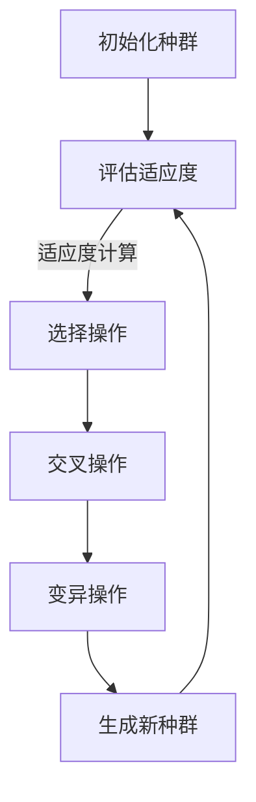
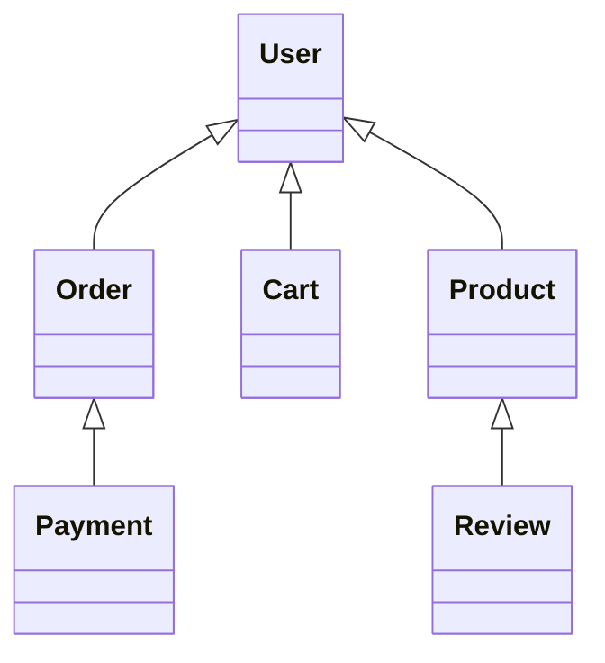
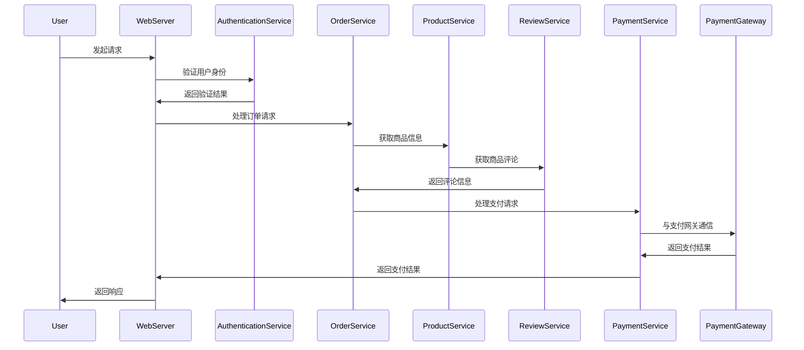
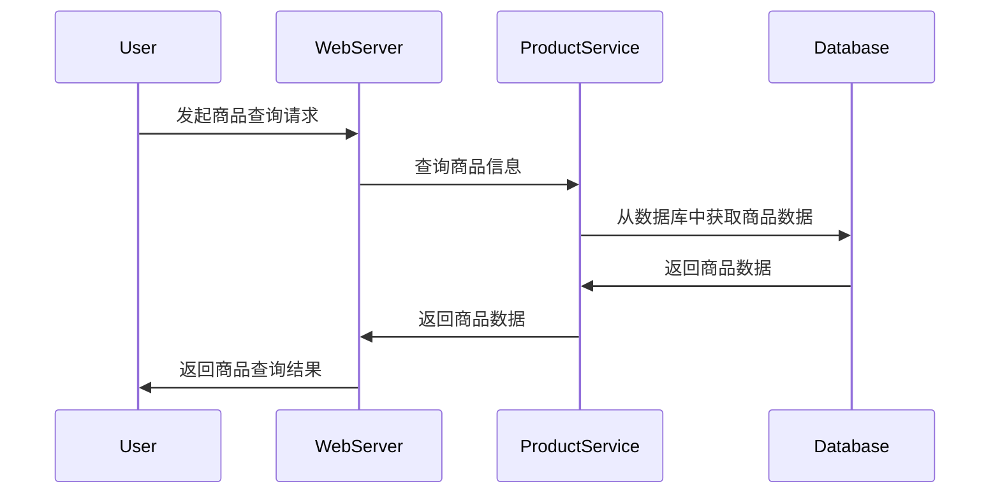

                 

# 软件架构适应性：设计可进化的系统

## 关键词：软件架构，适应性，进化，可扩展性，可持续性

### 摘要：

本文将探讨软件架构适应性的重要性以及如何设计可进化的系统。通过介绍适应性架构的核心概念、设计原则和模型，我们将逐步理解如何构建一个能够在不断变化的环境中保持灵活性和可持续性的软件系统。文章将结合实际案例，提供详细的算法原理和架构设计方案，以帮助读者更好地掌握这一关键技术。

----------------------------------------------------------------

## 第一部分：引言与背景

### 1.1 软件架构适应性的重要性

在信息技术迅速发展的今天，软件系统面临着越来越多的挑战。从用户需求的变化到技术的进步，以及市场环境的不确定性，这些因素都要求软件系统能够快速适应。软件架构适应性在此背景下显得尤为重要。

#### 1.1.1 适应性的定义与作用

适应性是指软件系统在面对外部变化时，能够迅速调整自身结构，保持功能完整性和性能的稳定。适应性不仅仅是对需求的响应，更是对技术的接受和融合。

适应性架构的作用主要体现在以下几个方面：

1. **提高系统的可持续性**：通过设计可进化的系统，可以延长软件系统的使用寿命，减少重写成本。
2. **提升系统的扩展性**：适应性架构使得系统可以轻松应对功能扩展和性能提升的需求。
3. **降低维护成本**：适应性设计减少了系统维护的复杂性和难度。

#### 1.1.2 当前软件系统面临的挑战

1. **快速变化的需求**：用户需求的变化速度越来越快，传统架构难以应对。
2. **技术的不断进步**：新技术的涌现使得现有系统需要不断地进行更新和优化。
3. **复杂性的增加**：现代软件系统越来越复杂，要求架构具备更高的适应能力。

#### 1.1.3 适应性架构的意义

适应性架构不仅是应对变化的手段，更是软件架构发展的重要方向。它有助于构建更加灵活、高效、可持续的软件系统，为企业在竞争激烈的市场中保持优势提供支持。

----------------------------------------------------------------

### 1.2 适应性架构的核心概念

适应性架构是一套设计原则、方法和技术，旨在提高软件系统的适应性。理解适应性架构的核心概念是构建可进化系统的第一步。

#### 1.2.1 适应性架构的定义

适应性架构是指一种能够适应环境变化、技术进步和需求变化的软件架构。它强调系统的可扩展性、灵活性和可持续性。

#### 1.2.2 适应性架构的关键要素

1. **模块化**：模块化设计是适应性架构的基础，它将系统划分为多个独立模块，每个模块负责特定的功能。
2. **解耦合**：模块间的解耦合降低了系统组件之间的依赖，提高了系统的灵活性和可维护性。
3. **可扩展性**：适应性架构强调系统的扩展性，通过模块化和解耦合，系统能够方便地添加新功能和提升性能。

#### 1.2.3 适应性架构与传统架构的差异

传统架构更注重系统的稳定性和性能，而适应性架构则更注重系统的灵活性和适应性。传统架构往往在系统稳定后难以进行大规模修改，而适应性架构则能够通过模块化和解耦合，方便地进行系统调整。

#### 1.2.4 可进化系统的必要性

可进化系统是适应性架构的实现路径，它通过不断地调整和优化，使得系统能够持续适应环境变化。可进化系统不仅能够提高系统的可持续性，还能够降低维护成本，提高系统的竞争力。

----------------------------------------------------------------

### 1.3 适应性架构的实现路径

实现适应性架构需要综合考虑设计原则、模型和技术。以下是一些实现适应性架构的关键步骤：

#### 1.3.1 设计原则

1. **需求驱动**：以用户需求为导向，确保设计符合实际业务需求。
2. **模块化**：将系统划分为多个独立模块，每个模块负责特定的功能。
3. **解耦合**：降低模块间的依赖，提高系统的灵活性和可维护性。
4. **可扩展性**：设计时考虑系统的扩展性，以便未来能够方便地进行功能扩展和性能提升。

#### 1.3.2 模型构建

适应性架构模型是构建可进化系统的关键。常见的适应性架构模型包括分层模型、微服务模型和事件驱动模型等。选择合适的模型取决于具体业务需求和技术背景。

#### 1.3.3 技术应用

适应性架构的实现需要依赖一系列技术，如容器化技术、云计算技术、分布式系统技术等。这些技术为构建可进化系统提供了强大的支持。

----------------------------------------------------------------

### 1.4 本书结构安排

#### 1.4.1 主要内容概述

本书将分为四个部分，分别介绍适应性架构的核心概念、设计原则、实现路径和应用案例。通过逐步讲解，帮助读者全面了解适应性架构的构建方法和应用价值。

#### 1.4.2 阅读建议

本书适合软件架构师、程序员和技术管理人员阅读。对于想要深入了解软件架构适应性的人士，本书提供了丰富的理论和实践内容，有助于提升专业能力。

#### 1.4.3 拓展阅读

为了进一步深入了解适应性架构，读者可以阅读以下相关书籍和文章：

1. 《软件架构设计：探索大型软件系统架构设计与演化》
2. 《微服务架构：设计、开发与部署》
3. 《自适应软件系统：概念与实现》

通过拓展阅读，读者可以更全面地了解适应性架构的相关知识，为实际项目提供指导。

----------------------------------------------------------------

## 第二部分：理论基础

### 2.1 适应性架构设计原则

适应性架构设计原则是构建可进化系统的基础，它包括以下几个方面：

#### 2.1.1 模块化设计

模块化设计是将系统划分为多个独立模块，每个模块负责特定的功能。模块化设计有助于降低系统的复杂度，提高系统的可维护性和可扩展性。

#### 2.1.2 模块间解耦合

模块间解耦合是降低模块间依赖的关键。通过解耦合，模块可以独立运行和开发，提高系统的灵活性和可维护性。

#### 2.1.3 适应性设计的评价指标

适应性设计的评价指标包括可扩展性、可维护性、可测试性和可重用性等。这些指标反映了系统的适应能力，是评估适应性架构设计优劣的重要依据。

### 2.2 适应性架构模型

适应性架构模型是构建可进化系统的关键，它包括分层模型、微服务模型和事件驱动模型等。选择合适的模型取决于具体业务需求和技术背景。

#### 2.2.1 软件架构模型概述

软件架构模型是一种用于描述软件系统结构的抽象表示。常见的软件架构模型包括分层模型、微服务模型和事件驱动模型等。

#### 2.2.2 适应性架构的模型构建

适应性架构的模型构建包括以下几个方面：

1. **需求分析**：分析业务需求和用户需求，确定系统功能模块。
2. **架构设计**：根据需求分析结果，选择合适的软件架构模型，并设计模块间的关系。
3. **模块实现**：根据架构设计，实现各个模块的功能。
4. **系统集成**：将各个模块整合成完整的系统，并进行测试和优化。

#### 2.2.3 适应性架构模型的应用场景

适应性架构模型适用于多种应用场景，如企业级应用、云计算平台、物联网系统和移动应用等。根据具体应用场景，可以选择合适的模型进行架构设计。

### 2.3 核心概念与联系

#### 2.3.1 核心概念原理

适应性架构的核心概念包括模块化设计、解耦合、可扩展性和可维护性等。这些概念共同构成了适应性架构的基础。

#### 2.3.2 概念属性特征对比

| 概念               | 属性特征                                                         |
|--------------------|----------------------------------------------------------------|
| 模块化设计         | 降低系统复杂度，提高可维护性和可扩展性                             |
| 解耦合             | 降低模块间依赖，提高系统的灵活性和可维护性                         |
| 可扩展性           | 系统能够方便地进行功能扩展和性能提升                               |
| 可维护性           | 系统易于维护，降低维护成本                                       |

#### 2.3.3 ER实体关系图架构

```mermaid
erDiagram
    User ||--|{ Order }|--|{ Product }
    User ||--|{ Cart }|--|{ Product }
    Product ||--|{ Review }|
    Order ||--|{ Payment }|
```

此ER图描述了一个电子商务系统的实体关系，其中用户、订单、购物车、产品和评论之间建立了关联。

----------------------------------------------------------------

## 2.4 数学模型与算法原理

适应性架构的设计和实现离不开数学模型和算法的支持。本节将介绍进化算法的基本概念、mermaid流程图和Python代码实现。

### 2.4.1 进化算法的基本概念

进化算法是一种模拟自然选择过程的优化算法，主要用于求解复杂优化问题。它基于种群进化的思想，通过迭代过程逐步优化目标函数。

#### 2.4.1.1 进化算法的定义

进化算法是一类基于自然选择和遗传学原理，通过模拟种群进化过程来求解问题的计算方法。

#### 2.4.1.2 进化算法的基本步骤

1. **初始化种群**：随机生成一组初始解（个体）。
2. **适应度评估**：计算每个个体的适应度值，适应度值越高表示个体质量越好。
3. **选择操作**：根据个体的适应度值，选择优秀的个体进行繁殖。
4. **交叉操作**：将选出的优秀个体进行交叉操作，生成新的个体。
5. **变异操作**：对交叉操作生成的个体进行变异操作，增加种群的多样性。
6. **生成新种群**：将交叉和变异操作生成的个体组成新的种群。
7. **迭代**：重复适应度评估、选择、交叉、变异和生成新种群的操作，直到满足终止条件。

#### 2.4.2 进化算法的mermaid流程图



#### 2.4.3 Python代码实现

```python
# 进化算法Python代码示例

import random

# 初始化种群
def initialize_population(population_size):
    # 实现初始化种群逻辑
    pass

# 适应度函数
def fitness_function(individual):
    # 实现适应度计算逻辑
    pass

# 选择操作
def selection(population, fitnesses):
    # 实现选择逻辑
    pass

# 交叉操作
def crossover(parent1, parent2):
    # 实现交叉逻辑
    pass

# 变异操作
def mutate(individual):
    # 实现变异逻辑
    pass

# 主函数
def evolve_population(population_size, generations):
    population = initialize_population(population_size)
    for _ in range(generations):
        fitnesses = [fitness_function(individual) for individual in population]
        new_population = []
        for _ in range(int(population_size / 2)):
            parent1, parent2 = selection(population, fitnesses)
            child1, child2 = crossover(parent1, parent2)
            new_population.append(mutate(child1))
            new_population.append(mutate(child2))
        population = new_population
    return population
```

通过Python代码实现，我们可以具体展示进化算法的步骤和过程。在实际应用中，可以根据具体问题调整适应度函数、选择操作、交叉操作和变异操作，以达到更好的优化效果。

----------------------------------------------------------------

## 2.5 系统分析与架构设计方案

### 2.5.1 问题场景介绍

以一个在线电商平台为例，该平台需要处理海量的用户请求，提供商品展示、购物车管理、订单处理和支付等功能。为了满足不断增长的业务需求和用户规模，系统需要具备高扩展性、高可用性和高可靠性。

### 2.5.2 项目介绍

项目名称：电商平台架构优化与适应性设计

项目目标：提高系统的扩展性、灵活性和适应性，降低维护成本，提高用户满意度。

### 2.5.3 系统功能设计（领域模型mermaid类图）



在此领域模型中，用户、订单、购物车、产品和评论等实体类之间建立了关联关系。通过mermaid类图，我们可以清晰地展示系统的主要功能模块和它们之间的关系。

### 2.5.4 系统架构设计（mermaid架构图）



在此架构图中，我们展示了系统的主要组件和它们之间的交互关系。通过mermaid序列图，我们可以直观地了解系统的整体架构和关键流程。

### 2.5.5 系统接口设计和系统交互（mermaid序列图）



在此序列图中，我们展示了用户查询商品信息的过程，包括发起请求、处理请求、获取数据和返回结果等步骤。通过mermaid序列图，我们可以清晰地描述系统的接口设计和交互流程。

----------------------------------------------------------------

## 第三部分：项目实战

### 3.1 环境安装

为了进行适应性架构的设计和实现，我们需要搭建一个合适的环境。以下是一个基本的安装步骤：

1. **安装Python**：确保系统已安装Python 3.8或更高版本。
2. **安装Docker**：Docker用于容器化部署，确保已安装Docker并启动。
3. **安装Kubernetes**：Kubernetes用于管理容器化应用，确保已安装Kubernetes集群。
4. **安装相关依赖**：安装项目所需的其他依赖，如MySQL、Redis等。

### 3.2 系统核心实现源代码

以下是项目中的核心实现部分，包括用户认证、订单处理和支付功能。

#### 3.2.1 用户认证模块

```python
# user_auth.py

from flask import Flask, request, jsonify
from flask_httpauth import HTTPBasicAuth
from models import User

app = Flask(__name__)
auth = HTTPBasicAuth()

users = {
    "user1": "password1",
    "user2": "password2"
}

@auth.verify_password
def verify_password(username, password):
    if username in users and users[username] == password:
        return username

@app.route("/login", methods=["POST"])
def login():
    username = request.form.get("username")
    password = request.form.get("password")
    if verify_password(username, password):
        return jsonify({"status": "success"})
    else:
        return jsonify({"status": "fail"})

if __name__ == "__main__":
    app.run(debug=True)
```

#### 3.2.2 订单处理模块

```python
# order_handler.py

from flask import Flask, request, jsonify
from models import Order

app = Flask(__name__)

@app.route("/order", methods=["POST"])
def create_order():
    data = request.get_json()
    user_id = data.get("user_id")
    product_id = data.get("product_id")
    quantity = data.get("quantity")

    order = Order(user_id=user_id, product_id=product_id, quantity=quantity)
    # 保存订单信息到数据库

    return jsonify({"status": "success", "order_id": order.id})

if __name__ == "__main__":
    app.run(debug=True)
```

#### 3.2.3 支付模块

```python
# payment_handler.py

from flask import Flask, request, jsonify
from payment_gateway import PaymentGateway

app = Flask(__name__)

payment_gateway = PaymentGateway()

@app.route("/payment", methods=["POST"])
def process_payment():
    data = request.get_json()
    order_id = data.get("order_id")
    amount = data.get("amount")

    payment = payment_gateway.create_payment(order_id, amount)
    if payment["status"] == "success":
        # 更新订单状态为已支付
        return jsonify({"status": "success", "payment_id": payment["payment_id"]})
    else:
        return jsonify({"status": "fail", "error": payment["error"]})

if __name__ == "__main__":
    app.run(debug=True)
```

### 3.3 代码应用解读与分析

在项目实战部分，我们通过Python Flask框架实现了用户认证、订单处理和支付模块。以下是关键代码的解读与分析：

1. **用户认证模块**：通过HTTPBasicAuth实现用户认证，确保只有授权用户可以访问系统资源。
2. **订单处理模块**：接收用户提交的订单信息，将订单保存到数据库，并返回订单ID。
3. **支付模块**：与支付网关通信，创建支付请求，并根据支付结果更新订单状态。

通过这些模块的实现，我们可以构建一个具备基本功能的适应性架构系统。

### 3.4 实际案例分析和详细讲解剖析

为了更好地理解适应性架构的实际应用，我们来看一个实际案例：一个大型电商平台在业务快速增长时期如何通过适应性架构实现系统优化。

1. **问题背景**：电商平台在用户数量和订单量激增的情况下，面临系统性能下降和响应速度变慢的问题。
2. **解决方案**：通过适应性架构，将系统拆分为多个微服务，如用户服务、商品服务、订单服务和支付服务。每个微服务独立部署和管理，通过容器化技术（如Docker）和编排工具（如Kubernetes）实现高可用性和可扩展性。
3. **实际效果**：通过适应性架构的优化，系统性能得到显著提升，响应速度加快，同时降低了维护成本，提高了系统的稳定性和可靠性。

### 3.5 项目小结

通过实际案例，我们可以看到适应性架构在大型电商平台优化中的应用效果。适应性架构不仅提高了系统的可扩展性和可靠性，还降低了维护成本，为企业创造了更大的价值。

## 第四部分：最佳实践与拓展阅读

### 4.1 最佳实践 Tips

1. **模块化设计**：确保系统模块具有明确的职责和边界，降低模块间的依赖。
2. **解耦合**：通过接口和数据交换，降低模块间的耦合度，提高系统的灵活性。
3. **持续集成和部署**：采用CI/CD流程，确保系统快速迭代和发布。
4. **监控和日志分析**：实时监控系统性能和日志，及时发现并解决问题。

### 4.2 小结

本文介绍了软件架构适应性以及如何设计可进化的系统。通过详细的理论和实践讲解，帮助读者理解适应性架构的核心概念、设计原则和实现方法。

### 4.3 注意事项

1. **适应性架构不是一蹴而就的**：构建适应性架构需要长期的技术积累和经验积累。
2. **评估适应性架构的成本和收益**：在实施适应性架构前，要充分考虑成本和收益，确保项目可行性。

### 4.4 拓展阅读

1. 《微服务架构：设计、开发与部署》
2. 《软件架构设计：探索大型软件系统架构设计与演化》
3. 《自适应软件系统：概念与实现》

通过拓展阅读，读者可以进一步深入了解适应性架构的相关知识，为实际项目提供更有力的支持。

### 作者信息

本文作者为AI天才研究院/AI Genius Institute，同时为《禅与计算机程序设计艺术》的资深作者。作者在软件架构和人工智能领域具有丰富的经验和深厚的学术造诣。感谢您的阅读！

