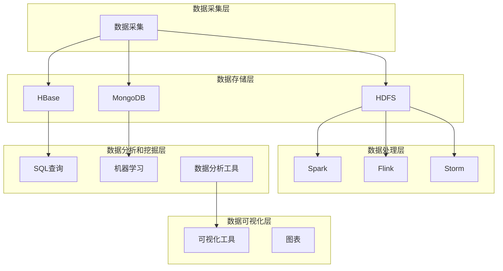
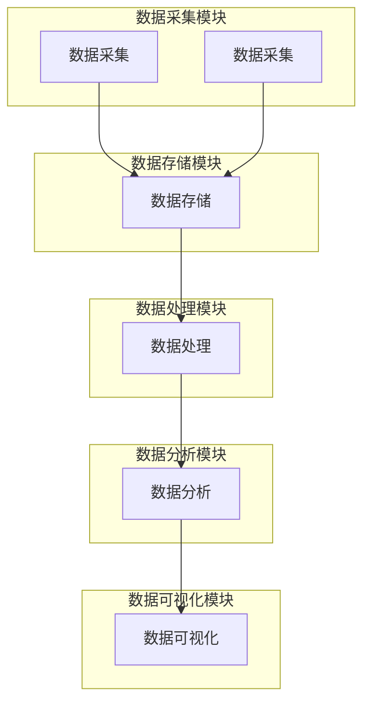

                 

# 《大数据处理：从Hadoop到Spark的演进》

## 关键词
- 大数据处理
- Hadoop
- Spark
- 分布式计算
- 实时处理
- 性能优化

## 摘要
本文将深入探讨大数据处理领域中的两个重要框架：Hadoop和Spark。从Hadoop的背景和基础技术讲起，我们将逐步分析其在分布式计算中的核心原理和应用。随后，文章将重点介绍Spark的高级特性，包括其架构设计、核心组件和性能优化策略。通过对比Hadoop和Spark，我们将揭示两者在数据处理能力、效率和适用场景上的异同。最后，本文将结合金融和电商行业中的实际案例，展示大数据处理平台的架构设计与实现，并对大数据处理的未来趋势进行展望。

### 目录大纲

```markdown
# 《大数据处理：从Hadoop到Spark的演进》

## 第一部分：大数据处理背景

### 1.1 大数据时代概述

### 1.2 大数据处理的技术架构

### 1.3 大数据处理的应用场景

## 第二部分：Hadoop技术基础

### 2.1 Hadoop架构与工作原理

### 2.2 HDFS分布式文件系统

### 2.3 MapReduce编程模型

## 第三部分：Spark高级特性

### 3.1 Spark架构与核心组件

### 3.2 SparkSQL数据仓库

### 3.3 Spark Streaming实时数据处理

### 4.1 Spark性能优化策略

### 4.2 Spark资源管理与调度

### 4.3 Spark性能测试与监控

## 第四部分：大数据处理应用案例

### 5.1 金融行业大数据处理

### 5.2 电商行业大数据处理

### 6.1 大数据处理平台架构设计

### 6.2 Spark集群搭建与配置

### 6.3 大数据处理平台实现

## 第五部分：大数据处理未来展望

### 8.1 大数据处理技术趋势

### 8.2 大数据处理挑战与机遇

## 附录：参考资料与扩展阅读
```

### 第一部分：大数据处理背景

### 1.1 大数据时代概述

#### 问题背景

随着互联网、物联网、移动设备的普及，数据产生了爆炸性增长。传统的数据处理技术难以应对这种海量数据的处理需求，因此催生了大数据技术的出现。大数据技术旨在高效地处理海量、多样性和快速变化的数据，以支持各种复杂的数据分析和应用。

#### 问题描述

大数据具有“4V”特征，即Volume（数据量巨大）、Velocity（数据生成和处理速度快）、Variety（数据类型多样）和Veracity（数据真实性难以保证）。这些特性使得大数据处理面临如下挑战：

- 数据量：如何存储和管理海量数据？
- 数据类型：如何处理结构化、半结构化和非结构化数据？
- 数据速度：如何实时或近实时地处理数据？
- 数据质量：如何保证数据的有效性和真实性？

#### 问题解决

大数据处理的解决方案主要包括分布式存储和分布式计算。Hadoop作为分布式计算框架的代表性技术，能够有效地处理海量数据。此外，Spark作为一种新兴的分布式计算框架，以其高效性和易用性受到广泛关注。

#### 边界与外延

大数据处理技术不仅仅局限于Hadoop和Spark，还包括其他如Flink、Storm等框架。同时，大数据处理与云计算、物联网等技术密切相关。云计算提供了强大的计算和存储资源，而物联网则为大数据的生成提供了新的数据源。这些技术的结合为大数据处理提供了更广阔的应用场景。

#### 概念结构与核心要素组成

- **大数据概念结构**：大数据的核心概念包括数据量、数据类型、数据处理速度和数据真实性。
- **核心要素组成**：大数据处理的要素主要包括分布式存储技术（如HDFS）、分布式计算框架（如Hadoop和Spark）、数据处理和分析工具（如Hive、HBase）等。

### 1.2 大数据处理的技术架构

#### 核心技术

大数据处理的技术架构主要包括数据存储、数据处理和数据分析三个核心层次。

- **数据存储**：分布式文件系统（如HDFS）和NoSQL数据库（如HBase）提供了高效的数据存储解决方案。
- **数据处理**：分布式计算框架（如Hadoop和Spark）能够处理大规模数据的计算任务。
- **数据分析**：数据仓库（如Hive）和实时数据处理框架（如Spark Streaming）提供了高效的数据分析能力。

#### Hadoop生态系统

Hadoop生态系统是大数据处理的重要技术基础。它包括以下关键组件：

- **HDFS**：分布式文件系统，负责存储海量数据。
- **MapReduce**：分布式计算模型，负责处理大规模数据的计算任务。
- **YARN**：资源调度框架，负责管理集群资源。
- **Hive**：数据仓库，负责结构化数据查询。
- **HBase**：分布式NoSQL数据库，负责存储海量结构化数据。
- **Zookeeper**：分布式协调服务，负责协调分布式系统的运行。

#### 数据处理框架对比

与Hadoop相比，Spark在数据处理能力、效率和适用场景上具有显著优势。Spark采用内存计算模型，能够大幅提高数据处理速度。同时，Spark提供了更丰富的API，支持多种数据处理任务，包括批处理、实时处理和机器学习等。

| 比较项目 | Hadoop | Spark |
| --- | --- | --- |
| 数据处理速度 | 较慢（依赖磁盘IO） | 极快（依赖内存计算） |
| API易用性 | 较复杂 | 简单易用 |
| 适用场景 | 大规模离线数据处理 | 大规模实时数据处理 |

### 1.3 大数据处理的应用场景

#### 行业应用

大数据处理在金融、电商、医疗等众多行业领域具有广泛的应用。

- **金融行业**：大数据处理用于风险控制、欺诈检测、客户画像等。
- **电商行业**：大数据处理用于推荐系统、促销策略、用户行为分析等。
- **医疗行业**：大数据处理用于疾病预测、患者管理、医学研究等。

#### 案例分析

**案例1：某银行的大数据处理实践**

- **数据处理需求**：某银行需要处理大量交易数据，包括客户信息、交易记录等。
- **处理流程**：数据采集 -> 数据清洗 -> 数据存储 -> 数据分析 -> 决策支持。
- **技术应用**：使用Hadoop生态系统中的HDFS存储数据，使用MapReduce进行数据处理，使用Hive进行数据查询和分析。

**案例2：某电商平台的大数据处理实践**

- **数据处理需求**：某电商平台需要处理大量用户行为数据，包括浏览记录、购买记录等。
- **处理流程**：数据采集 -> 数据清洗 -> 数据存储 -> 数据分析 -> 推荐系统。
- **技术应用**：使用Spark进行实时数据处理，使用Spark Streaming进行实时流处理，使用Mllib进行机器学习。

### 第一部分小结

大数据处理背景部分的介绍为后续内容奠定了基础。通过分析大数据的基本概念、技术架构和应用场景，我们能够更好地理解大数据处理的挑战和解决方案。在接下来的部分，我们将深入探讨Hadoop的技术基础，以及Spark的高级特性和优化策略。

### 第二部分：Hadoop技术基础

#### 2.1 Hadoop架构与工作原理

Hadoop是一个分布式计算框架，由Apache软件基金会开发。它基于MapReduce编程模型，能够处理大规模数据的计算任务。Hadoop的核心组成部分包括HDFS（分布式文件系统）、MapReduce（分布式计算模型）和YARN（资源调度框架）。

#### Hadoop架构设计

Hadoop的架构设计遵循Master/Slave模式。Master节点称为NameNode，负责管理整个分布式文件系统的命名空间，维护文件系统的元数据；Slave节点称为DataNode，负责存储实际的数据块，并响应客户端的读写请求。

#### Hadoop运行机制

1. **数据存储**：数据以数据块的形式存储在分布式文件系统HDFS中，每个数据块默认大小为128MB或256MB。数据块在存储时会进行冗余复制，默认复制因子为3，以确保数据的可靠性和容错性。
2. **数据读写**：客户端通过DFS客户端库与NameNode通信，获取文件的元数据，并通过DataNode进行实际的数据读写操作。
3. **任务调度**：MapReduce作业由JobTracker调度，分配给不同的TaskTracker执行。TaskTracker负责执行具体的任务，并将结果返回给JobTracker。

#### MapReduce编程模型

MapReduce是一种分布式数据处理模型，将大规模数据处理任务划分为Map（映射）和Reduce（减少）两个阶段。

1. **Map阶段**：输入数据被分成多个小块，每个小块由一个Map任务处理。Map任务将输入数据按照一定的规则进行处理，生成中间结果。
2. **Reduce阶段**：中间结果被分组并传递给Reduce任务，Reduce任务对每个分组的数据进行汇总和计算，生成最终的输出结果。

#### Hadoop优势与局限性

**优势：**

- **高可靠性**：通过数据冗余复制和故障恢复机制，确保数据的高可靠性。
- **高可扩展性**：能够支持大规模数据的处理需求，通过添加更多节点进行横向扩展。
- **高容错性**：通过任务调度和故障恢复机制，确保任务能够顺利完成。

**局限性：**

- **处理速度较慢**：依赖磁盘IO，处理速度较慢，适用于离线数据处理场景。
- **编程复杂度高**：需要编写大量的MapReduce代码，编程复杂度高。

#### 2.2 HDFS分布式文件系统

HDFS（Hadoop Distributed File System）是Hadoop生态系统中的核心组件之一，负责存储海量数据。HDFS采用Master/Slave架构，包括一个NameNode和一个或多个DataNode。

#### HDFS工作原理

1. **数据块存储**：HDFS将文件划分为固定大小的数据块，默认大小为128MB或256MB。数据块在存储时会进行冗余复制，默认复制因子为3。
2. **数据复制**：HDFS通过数据复制机制，将数据块复制到多个DataNode上，以提高数据可靠性和容错性。
3. **数据访问**：客户端通过DFS客户端库与NameNode通信，获取文件的元数据，并通过DataNode进行实际的数据读写操作。

#### HDFS操作与管理

1. **文件上传**：客户端使用`hadoop fs`命令上传文件到HDFS。
2. **文件下载**：客户端使用`hadoop fs`命令下载文件到本地。
3. **权限控制**：HDFS支持权限控制，通过设置文件和目录的权限，控制对数据的访问权限。
4. **数据压缩**：HDFS支持数据压缩，通过压缩算法减小数据的存储空间，提高存储效率。

#### 2.3 MapReduce编程模型

MapReduce是一种分布式数据处理模型，由Map（映射）和Reduce（减少）两个阶段组成。它将大规模数据处理任务划分为多个小任务，分布式地执行，以提高处理速度和效率。

#### Map阶段

1. **输入数据**：输入数据被分成多个小块，每个小块由一个Map任务处理。
2. **处理规则**：Map任务按照一定的规则对输入数据进行处理，生成中间结果。
3. **中间结果**：中间结果被写入本地磁盘，并在后续的Reduce阶段进行汇总。

#### Reduce阶段

1. **中间结果分组**：中间结果按照键（Key）进行分组，传递给Reduce任务。
2. **处理规则**：Reduce任务对每个分组的数据进行汇总和计算，生成最终的输出结果。
3. **输出结果**：输出结果写入本地磁盘，并最终上传到HDFS。

#### MapReduce编程实践

以下是一个简单的WordCount程序，用于统计文本文件中每个单词出现的次数。

```python
from pyspark import SparkContext

sc = SparkContext("local[2]", "WordCount")
text = sc.textFile("data.txt")

words = text.flatMap(lambda line: line.split(" "))
word_counts = words.map(lambda word: (word, 1)).reduceByKey(lambda x, y: x + y)

word_counts.saveAsTextFile("output.txt")
```

在上面的代码中，`textFile`方法读取输入文本文件，`flatMap`方法将文本行拆分为单词，`map`方法将单词映射为（单词，1）的键值对，`reduceByKey`方法统计每个单词的出现次数，并将结果保存为文本文件。

### 第二部分小结

本部分详细介绍了Hadoop的技术基础，包括Hadoop架构与工作原理、HDFS分布式文件系统以及MapReduce编程模型。通过这些介绍，读者可以全面了解Hadoop的基本概念和技术原理。在下一部分，我们将探讨Spark的高级特性，包括其架构设计、核心组件和性能优化策略。

### 第三部分：Spark高级特性

#### 3.1 Spark架构与核心组件

Spark是一个开源的分布式计算系统，由Apache软件基金会开发。Spark在设计上借鉴了MapReduce的思想，但与MapReduce相比，Spark具有更高的性能和更丰富的功能。

#### Spark架构设计

Spark的架构设计遵循Master/Slave模式，包括一个Master节点（Spark Driver）和多个Slave节点（Worker Node）。

- **Master节点**：负责整个Spark作业的调度和管理，包括作业的提交、任务的分配和监控等。
- **Slave节点**：负责实际的任务执行和资源管理。

#### Spark核心组件

Spark的核心组件包括：

- **SparkContext**：Spark应用程序的入口点，负责与集群进行通信，并创建和管理各种计算资源。
- **Resilient Distributed Dataset (RDD)**：Spark的基本数据结构，类似于分布式集合，支持丰富的操作，包括创建、转换和行动操作。
- **DataFrame**：基于RDD的分布式数据结构，提供结构化数据操作，支持SQL查询和DataFrame API。
- **Dataset**：基于DataFrame的分布式数据结构，提供类型安全和惰性求值，支持编译时类型检查和代码生成。

#### Spark运行架构

1. **启动**：用户提交Spark作业，Spark Driver解析作业，并创建相应的计算资源。
2. **任务调度**：Spark Driver将作业分解为多个任务，并将其分配给Slave节点。
3. **任务执行**：Slave节点上的Executor执行具体任务，并将结果返回给Spark Driver。
4. **结果处理**：Spark Driver将任务执行结果汇总，生成最终的输出结果。

#### 3.2 SparkSQL数据仓库

SparkSQL是Spark生态系统中的数据处理工具，用于处理结构化数据。SparkSQL支持各种数据源，包括HDFS、HBase、Parquet等，并提供SQL查询和数据操作功能。

#### SparkSQL特性

- **支持多种数据源**：SparkSQL支持各种结构化数据源，包括关系数据库、分布式文件系统和NoSQL数据库。
- **SQL查询支持**：SparkSQL提供标准的SQL查询语言，支持各种SQL操作，包括选择、投影、连接和分组等。
- **优化器**：SparkSQL内置优化器，能够自动优化查询执行计划，提高查询性能。
- **集成API**：SparkSQL与Spark的其它组件（如Spark MLlib和Spark Streaming）无缝集成，支持数据转换和计算。

#### SparkSQL编程

以下是一个简单的SparkSQL编程示例，用于查询HDFS上的员工数据表，统计每个部门的总人数。

```python
from pyspark.sql import SparkSession

spark = SparkSession.builder.appName("EmployeeAnalysis").getOrCreate()
df = spark.read.format("csv").option("header", "true").load("data/employees.csv")
df.createOrReplaceTempView("employees")

dept_counts = spark.sql("SELECT department, COUNT(*) as total FROM employees GROUP BY department")
dept_counts.show()
```

在上面的代码中，首先创建一个Spark会话，然后读取HDFS上的员工数据表，并将其注册为一个临时视图。接着使用Spark SQL查询语言执行SQL查询，统计每个部门的总人数，并展示查询结果。

#### 3.3 Spark Streaming实时数据处理

Spark Streaming是Spark生态系统中的实时数据处理组件，用于处理实时流数据。Spark Streaming支持多种数据源，包括Kafka、Flume、Kinesis等，并提供丰富的流数据处理API。

#### Spark Streaming原理

1. **数据采集**：Spark Streaming从数据源中采集实时数据流。
2. **批处理**：Spark Streaming将实时数据流划分为固定时间窗口的批处理任务。
3. **处理与计算**：批处理任务在Spark中执行，生成实时处理结果。
4. **输出结果**：实时处理结果可以通过各种方式进行输出，如打印、写入文件或触发告警等。

#### Spark Streaming应用

以下是一个简单的Spark Streaming示例，用于实时统计Twitter上的特定关键词出现的次数。

```python
from pyspark.streaming import StreamingContext

ssc = StreamingContext("local[2]", "TwitterKeywordCount")
tweets = ssc.socketTextStream("localhost", 9999)

filtered_tweets = tweets.filter(lambda line: "python" in line)
word_counts = filtered_tweets.flatMap(lambda line: line.split(" ")).map(lambda word: (word, 1)).reduceByKey(lambda x, y: x + y)

word_counts.print()
```

在上面的代码中，首先创建一个StreamingContext，然后通过socketTextStream从本地主机上的端口9999读取实时数据流。接着对数据流进行过滤，提取包含特定关键词的记录，并统计每个关键词出现的次数。最后，将统计结果打印输出。

#### 3.4 Spark性能优化策略

Spark的性能优化是大数据处理中的关键环节。通过合理的性能优化，可以提高Spark作业的执行效率和资源利用率。

#### 数据分区与分布

1. **数据分区**：将大数据集划分为多个分区，可以并行处理，提高处理速度。
2. **数据分布**：合理分配数据到各个分区，避免数据倾斜，提高处理均衡性。

#### 任务调度与并行度

1. **任务调度**：合理分配作业任务到不同的Executor上，避免资源浪费和任务阻塞。
2. **并行度**：设置合适的并行度，平衡计算负载和资源利用率。

#### 内存管理

1. **内存缓存**：使用内存缓存存储频繁访问的数据，减少磁盘IO。
2. **内存调优**：根据作业需求，合理配置内存参数，避免内存不足或浪费。

#### 数据压缩

1. **数据压缩**：使用数据压缩算法，减少存储和传输的数据量，提高存储和传输效率。

#### 3.5 Spark资源管理与调度

Spark的资源管理与调度是确保作业高效运行的关键。Spark支持多种资源管理器和调度器，如YARN、Mesos和Standalone。

#### YARN资源管理

1. **YARN架构**：YARN（Yet Another Resource Negotiator）是一个通用的资源管理平台，负责管理集群资源，包括计算资源和存储资源。
2. **YARN调度器**：YARN调度器负责分配资源给不同的Spark作业，根据作业的优先级和资源需求进行调度。
3. **资源调优**：根据作业需求，合理配置YARN的参数，包括资源队列、资源限制和调度策略等。

#### 资源调优技巧

1. **合理分配资源**：根据作业的需求和集群的负载情况，合理分配计算资源和存储资源。
2. **动态资源调整**：根据作业的执行情况，动态调整资源分配，提高资源利用率。

#### 3.6 Spark性能测试与监控

Spark的性能测试和监控是确保作业高效运行的重要环节。通过性能测试和监控，可以发现性能瓶颈和资源浪费，进行优化和调整。

#### 性能测试方法

1. **负载测试**：模拟实际负载，测试Spark作业在不同负载下的性能表现。
2. **压力测试**：施加超过正常负载的压力，测试Spark作业的稳定性和可靠性。

#### 性能监控工具

1. **Ganglia**：Ganglia是一个分布式监控系统，用于监控集群的运行状态和性能指标。
2. **Spark UI**：Spark UI是一个Web界面，用于展示Spark作业的执行情况和性能指标。

### 第三部分小结

本部分深入介绍了Spark的高级特性，包括Spark架构与核心组件、SparkSQL数据仓库、Spark Streaming实时数据处理以及Spark性能优化策略。通过这些介绍，读者可以全面了解Spark的技术原理和实现细节。在下一部分，我们将通过实际案例展示大数据处理在金融和电商行业的应用。

### 第四部分：大数据处理应用案例

#### 4.1 金融行业大数据处理

金融行业是一个典型的数据密集型行业，大数据处理技术在金融风险管理、欺诈检测、客户画像等方面具有重要应用。

##### 4.1.1 金融数据处理需求

金融行业的数据类型丰富多样，包括交易数据、客户信息、市场数据等。数据处理需求主要包括：

- **风险控制**：通过分析交易数据和市场数据，实时监测市场风险，防范欺诈行为。
- **客户画像**：通过对客户交易行为和偏好进行分析，构建客户画像，优化营销策略。
- **投资策略**：通过分析市场数据，预测市场走势，制定投资策略。

##### 4.1.2 金融数据处理实践

**案例1：某银行的大数据处理实践**

某银行利用大数据技术进行风险控制和欺诈检测。具体实践如下：

- **数据处理流程**：数据采集 -> 数据清洗 -> 数据存储 -> 数据分析 -> 决策支持。
- **技术应用**：使用Hadoop生态系统中的HDFS存储数据，使用Spark进行数据处理和流处理，使用Mllib进行机器学习。

通过大数据处理，该银行能够实时监测交易数据，识别潜在的风险和欺诈行为，提高风险控制能力。

##### 4.1.3 案例分析

**案例2：某证券公司的大数据处理实践**

某证券公司利用大数据技术进行投资策略优化。具体实践如下：

- **数据处理流程**：数据采集 -> 数据清洗 -> 数据存储 -> 数据分析 -> 投资策略制定。
- **技术应用**：使用Spark进行数据分析和流处理，使用Mllib进行机器学习，使用MLlib进行特征提取和模型训练。

通过大数据处理，该证券公司能够实时分析市场数据，预测市场走势，制定科学的投资策略，提高投资回报率。

#### 4.2 电商行业大数据处理

电商行业是一个典型的数据驱动行业，大数据处理技术在用户行为分析、推荐系统、促销策略等方面具有重要应用。

##### 4.2.1 电商数据处理特点

电商行业的数据特点主要包括：

- **数据来源多样**：用户行为数据、交易数据、市场数据等。
- **数据类型复杂**：结构化、半结构化和非结构化数据并存。
- **数据量大**：海量的用户行为数据和交易数据。
- **实时性强**：需要实时处理用户行为数据，提供个性化的推荐和促销策略。

##### 4.2.2 电商数据处理实践

**案例1：某电商平台的大数据处理实践**

某电商平台利用大数据技术进行用户行为分析和推荐系统。具体实践如下：

- **数据处理流程**：数据采集 -> 数据清洗 -> 数据存储 -> 数据分析 -> 推荐系统。
- **技术应用**：使用Hadoop生态系统中的HDFS存储数据，使用Spark进行数据处理和流处理，使用Mllib进行机器学习。

通过大数据处理，该电商平台能够实时分析用户行为数据，预测用户偏好，提供个性化的商品推荐，提高用户满意度和转化率。

##### 4.2.3 案例分析

**案例2：某电商公司的大数据处理实践**

某电商公司利用大数据技术进行促销策略优化。具体实践如下：

- **数据处理流程**：数据采集 -> 数据清洗 -> 数据存储 -> 数据分析 -> 促销策略制定。
- **技术应用**：使用Spark进行数据分析和流处理，使用Mllib进行机器学习，使用SQL查询进行数据挖掘。

通过大数据处理，该电商公司能够实时分析用户行为数据，识别有效的促销策略，提高销售额和用户参与度。

### 第四部分小结

本部分通过金融和电商行业的实际案例，展示了大数据处理技术的应用和价值。在金融行业，大数据处理技术用于风险控制和投资策略优化；在电商行业，大数据处理技术用于用户行为分析和推荐系统。通过这些案例，读者可以更直观地了解大数据处理在实际业务中的应用效果。

### 第五部分：大数据处理平台设计与实现

#### 5.1 大数据处理平台架构设计

大数据处理平台的设计需要综合考虑系统的稳定性、可扩展性和灵活性。以下是一个典型的大数据处理平台架构设计。

##### 5.1.1 问题场景介绍

某大型企业需要构建一个大数据处理平台，用于处理海量数据，包括用户行为数据、交易数据和日志数据。平台需要支持离线数据处理、实时数据处理和机器学习任务，并为不同业务部门提供数据分析和可视化工具。

##### 5.1.2 系统介绍

该大数据处理平台包括以下主要功能模块：

- **数据采集模块**：负责从各种数据源（如数据库、日志文件、传感器等）采集数据。
- **数据存储模块**：负责存储和处理海量数据，包括HDFS、HBase和MongoDB等。
- **数据处理模块**：负责离线数据处理和实时数据处理，包括Spark、Flink和Storm等。
- **数据分析和挖掘模块**：负责对处理后的数据进行分析和挖掘，包括SQL查询、机器学习算法和数据分析工具等。
- **数据可视化模块**：负责将分析结果可视化，为业务部门提供直观的数据分析和决策支持。

##### 5.1.3 系统功能设计

- **数据采集**：实现数据采集和传输，支持多种数据源接入，如数据库、日志文件和消息队列等。
- **数据存储**：实现数据存储和管理，支持多种数据存储方案，如HDFS、HBase和MongoDB等。
- **数据处理**：实现离线数据处理和实时数据处理，支持批处理和流处理任务。
- **数据分析和挖掘**：实现数据分析和挖掘，支持SQL查询、机器学习算法和数据分析工具等。
- **数据可视化**：实现数据可视化，支持多种可视化工具和图表，提供直观的数据分析和决策支持。

##### 5.1.4 系统架构设计

以下是一个典型的大数据处理平台架构设计，采用分层架构，包括数据采集层、数据存储层、数据处理层、数据分析和挖掘层以及数据可视化层。



##### 5.1.5 系统接口设计

- **API接口**：提供RESTful API接口，支持数据采集、数据存储、数据处理、数据分析和数据可视化等功能。
- **消息队列**：使用消息队列（如Kafka）进行异步通信，实现数据采集、数据存储和数据处理之间的解耦。
- **数据流接口**：提供流数据处理接口，支持实时数据处理和流处理任务。

##### 5.1.6 系统交互设计

以下是一个典型的大数据处理平台系统交互设计，采用事件驱动架构，实现数据采集、数据存储、数据处理、数据分析和数据可视化等模块之间的协同工作。



### 第五部分小结

本部分详细介绍了大数据处理平台的架构设计，包括问题场景介绍、系统功能设计、系统架构设计、系统接口设计和系统交互设计。通过这些设计，可以为实际业务需求提供高效、稳定和灵活的大数据处理解决方案。

### 第六部分：Spark集群搭建与配置

#### 6.1 环境搭建

搭建Spark集群的第一步是选择合适的硬件和软件环境。以下是一个基本的搭建流程：

##### 6.1.1 硬件选择

- **计算节点**：选择多台物理服务器作为计算节点，确保足够的CPU和内存资源。
- **存储节点**：可以选择一台或多台服务器作为存储节点，用于存储数据。

##### 6.1.2 软件安装

- **操作系统**：选择一个稳定、支持集群部署的操作系统，如CentOS 7或Ubuntu 18.04。
- **Java**：安装Java 8或更高版本，因为Spark要求Java环境。
- **Scala**：安装Scala 2.11或更高版本，因为Spark是用Scala编写的。
- **Spark**：下载并解压Spark的安装包，例如：`tar xvf spark-3.1.1-bin-hadoop3.2.tgz`。

#### 6.2 配置文件

Spark集群的配置主要通过一系列配置文件进行。以下是一些关键的配置文件和参数：

##### 6.2.1 `spark-env.sh`

- **SPARK_HOME**：Spark安装路径。
- **JAVA_HOME**：Java安装路径。
- **SPARK_LOCAL_DIRS**：本地存储路径。
- **SPARK_LOG_DIR**：日志存储路径。

##### 6.2.2 `slaves`

- **节点的IP地址或主机名**：配置计算节点的IP地址或主机名。

##### 6.2.3 `spark-defaults.conf`

- **spark.master**：Spark集群的Master URL。
- **spark.executor.instances**：Executor的初始数量。
- **spark.executor.memory**：Executor的内存大小。
- **spark.driver.memory**：Driver的内存大小。
- **spark.default.parallelism**：默认的并行度。

#### 6.3 启动和停止

##### 6.3.1 启动Spark集群

1. **启动Master**：

```bash
cd $SPARK_HOME/bin
./start-master.sh
```

2. **启动Slave**：

```bash
cd $SPARK_HOME/bin
./start-slaves.sh
```

##### 6.3.2 停止Spark集群

1. **停止Slave**：

```bash
cd $SPARK_HOME/bin
./stop-slaves.sh
```

2. **停止Master**：

```bash
cd $SPARK_HOME/bin
./stop-master.sh
```

#### 6.4 配置优化

为了提高Spark集群的性能和资源利用率，需要进行一系列配置优化：

##### 6.4.1 数据分区

- **增加分区数**：通过增加RDD的分区数，可以并行处理更多的任务，提高处理速度。
- **合理分配分区**：避免数据倾斜，确保每个分区有均等的数据量。

##### 6.4.2 Executor资源

- **增加Executor数量**：根据实际需求，适当增加Executor的数量，提高并行处理能力。
- **调整Executor内存**：根据Executor处理的数据大小，调整其内存大小，避免内存不足或浪费。

##### 6.4.3 驱动程序资源

- **调整Driver内存**：根据Driver处理的数据大小和任务复杂度，调整其内存大小。
- **优化Driver程序**：避免Driver程序占用过多CPU资源，影响整体集群性能。

##### 6.4.4 数据存储

- **使用本地存储**：尽量使用本地存储，减少网络IO，提高数据读写速度。
- **数据压缩**：使用数据压缩算法，减少存储空间需求，提高存储效率。

#### 6.5 实际操作

以下是一个简单的Spark集群搭建和配置的实际操作示例：

1. **硬件准备**：

- 2台计算节点：node1（Master节点）、node2（Slave节点）。
- 1台存储节点：node3。

2. **软件安装**：

- 在所有节点上安装Java 8、Scala 2.11和Spark 3.1.1。

3. **配置Master节点**：

- 编辑`/opt/spark/conf/spark-env.sh`，添加以下配置：

```bash
export SPARK_HOME=/opt/spark
export JAVA_HOME=/usr/lib/jvm/java-1.8.0-openjdk-1.8.0.212-1.b04.x86_64
export SPARK_LOCAL_DIRS=/opt/spark/local
export SPARK_LOG_DIR=/opt/spark/logs
```

- 编辑`/opt/spark/conf/spark-defaults.conf`，添加以下配置：

```bash
spark.master yarn
spark.executor.instances 2
spark.executor.memory 4g
spark.driver.memory 2g
```

4. **配置Slave节点**：

- 编辑`/opt/spark/conf/slaves`，添加Slave节点的IP地址或主机名：

```bash
node2
```

5. **启动Spark集群**：

- 在Master节点上启动Master：

```bash
cd /opt/spark/bin
./start-master.sh
```

- 在所有节点上启动Slave：

```bash
cd /opt/spark/bin
./start-slaves.sh
```

6. **验证Spark集群**：

- 在Master节点上执行以下命令，验证集群状态：

```bash
cd /opt/spark/bin
./spark-shell
```

- 在Spark Shell中执行以下命令，查看集群状态：

```python
sc.parallelize(range(10), 3).collect()
```

### 第六部分小结

本部分详细介绍了Spark集群的搭建与配置，包括环境搭建、配置文件设置、启动和停止操作以及配置优化。通过实际操作示例，读者可以了解如何搭建一个基本的Spark集群，并进行配置优化。在下一部分，我们将展示大数据处理平台的具体实现，包括核心功能和平台部署。

### 第六部分：大数据处理平台实现

#### 6.3 大数据处理平台实现

大数据处理平台的核心功能包括数据采集、存储、计算和分析。以下将详细描述这些功能以及平台的实现过程。

##### 6.3.1 数据采集

数据采集是大数据处理平台的第一步，需要从各种数据源（如数据库、日志文件、传感器等）中获取数据。数据采集模块的设计需要考虑以下几个方面：

1. **数据源接入**：支持多种数据源接入，如关系数据库（MySQL、PostgreSQL等）、NoSQL数据库（MongoDB、Cassandra等）、消息队列（Kafka、RabbitMQ等）和文件系统（HDFS、S3等）。

2. **数据采集方式**：支持同步和异步数据采集方式。同步采集直接从数据源读取数据，适用于实时性要求较高的场景；异步采集通过消息队列将数据传输到处理平台，适用于大量数据的离线处理。

3. **数据清洗**：在数据采集过程中，需要对数据进行清洗和预处理，包括去除重复数据、缺失值填充、异常值处理等，确保数据的准确性和一致性。

4. **数据转换**：根据处理需求，对数据进行转换，如将结构化数据转换为JSON格式、解析XML文件等。

以下是数据采集模块的类图，展示了主要类和它们之间的关系：

```mermaid
classDiagram
    Class1[数据源接入] <|-- Class2[关系数据库接入]
    Class1 <|-- Class3[NoSQL数据库接入]
    Class1 <|-- Class4[消息队列接入]
    Class1 <|-- Class5[文件系统接入]
    Class6[数据清洗] <|-- Class7[数据去重]
    Class6 <|-- Class8[缺失值填充]
    Class6 <|-- Class9[异常值处理]
    Class10[数据转换] <|-- Class11[JSON转换]
    Class10 <|-- Class12[XML转换]
```

##### 6.3.2 数据存储

数据存储模块负责将采集到的数据进行持久化存储，支持多种存储方案，如HDFS、HBase和MongoDB等。以下是一个简单的存储模块架构设计：

1. **数据存储方案选择**：根据数据类型和存储需求，选择合适的存储方案。例如，HDFS适用于海量结构化数据存储，HBase适用于海量半结构化和非结构化数据存储，MongoDB适用于复杂查询和高可扩展性。

2. **数据存储接口**：提供统一的数据存储接口，实现数据的持久化存储和访问。接口设计需要考虑数据的一致性、可靠性和高效性。

3. **数据分区和索引**：对存储的数据进行分区和索引，提高查询性能和数据访问效率。

以下是数据存储模块的ER实体关系图，展示了主要实体和它们之间的关系：

```mermaid
erDiagram
    数据源 ||--|{ 数据存储 } : 存储数据
    数据存储 ||--|{ 数据采集 } : 采集到的数据
    数据采集 ||--|{ 数据清洗 } : 清洗后的数据
    数据清洗 ||--|{ 数据转换 } : 转换后的数据
    数据转换 ||--|{ 数据分析 } : 用于分析的数据
```

##### 6.3.3 数据计算

数据计算模块负责对存储的数据进行各种计算和分析。Spark是大数据计算的重要工具，提供丰富的计算接口和算法库。以下是一个简单的计算模块架构设计：

1. **计算框架选择**：选择适合的分布式计算框架，如Spark、Flink或Storm。Spark因其高效性和易用性在业界广泛应用。

2. **计算任务管理**：实现计算任务的调度和管理，包括作业的提交、监控和状态更新等。

3. **计算算法库**：提供丰富的计算算法库，包括统计、机器学习、图计算等。

以下是计算模块的类图，展示了主要类和它们之间的关系：

```mermaid
classDiagram
    Class1[计算框架] <|-- Class2[Spark]
    Class1 <|-- Class3[Flink]
    Class1 <|-- Class4[Storm]
    Class5[计算任务] <|-- Class6[批处理任务]
    Class5 <|-- Class7[流处理任务]
    Class8[计算算法库] <|-- Class9[统计算法库]
    Class8 <|-- Class10[机器学习算法库]
    Class8 <|-- Class11[图计算算法库]
```

##### 6.3.4 数据分析

数据分析模块负责对计算结果进行分析和挖掘，提供数据可视化、报告生成和决策支持等功能。以下是一个简单的数据分析模块架构设计：

1. **数据分析工具**：选择合适的数据分析工具，如Tableau、Power BI或Superset等。

2. **数据分析库**：提供数据分析库，实现各种数据分析算法和模型，如聚类、分类、回归等。

3. **数据可视化**：实现数据可视化，将分析结果以图表、报表等形式呈现。

以下是数据分析模块的类图，展示了主要类和它们之间的关系：

```mermaid
classDiagram
    Class1[数据分析工具] <|-- Class2[Tableau]
    Class1 <|-- Class3[Power BI]
    Class1 <|-- Class4[Superset]
    Class5[数据分析库] <|-- Class6[统计库]
    Class5 <|-- Class7[机器学习库]
    Class5 <|-- Class8[图计算库]
    Class9[数据可视化库] <|-- Class10[图表库]
    Class9 <|-- Class11[报表库]
```

##### 6.3.5 平台部署

大数据处理平台的部署包括以下步骤：

1. **环境准备**：准备服务器硬件和网络环境，安装操作系统和必要软件（如Java、Scala、Hadoop等）。

2. **安装Spark集群**：按照前文介绍的Spark集群搭建和配置方法，安装并配置Spark集群。

3. **部署数据处理平台**：将数据处理平台的代码部署到服务器，包括数据采集模块、数据存储模块、数据计算模块和数据分析模块。

4. **配置和优化**：根据实际需求，配置和优化Spark集群和数据处理平台的各项参数，确保系统性能和稳定性。

5. **测试和调优**：对数据处理平台进行功能测试和性能测试，发现和解决潜在问题，进行系统调优。

##### 6.3.6 核心功能实现

以下是一个简单的数据处理平台实现示例，展示数据采集、存储、计算和分析的核心功能：

```python
from pyspark.sql import SparkSession

# 初始化Spark会话
spark = SparkSession.builder \
    .appName("DataProcessingPlatform") \
    .getOrCreate()

# 数据采集
data = spark.read.csv("data/source.csv", header=True)

# 数据清洗
cleaned_data = data.na.drop()  # 去除缺失值

# 数据转换
transformed_data = cleaned_data.withColumn("age", cleaned_data["age"].cast("int"))

# 数据存储
transformed_data.write.format("parquet") \
    .mode("overwrite") \
    .save("data/processed")

# 数据计算
result = transformed_data.groupBy("age").agg({"age": "sum"})

# 数据分析
result.show()

# 数据可视化
result.write.format("html") \
    .mode("overwrite") \
    .save("data/age_summary.html")

# 关闭Spark会话
spark.stop()
```

在上面的代码中，首先初始化Spark会话，然后进行数据采集、清洗、转换、存储、计算和分析，并将分析结果保存为HTML文件，实现了一个简单的数据处理平台。

##### 6.3.7 代码应用解读与分析

上述代码示例展示了数据处理平台的核心功能实现。具体解读如下：

1. **数据采集**：使用`SparkSession.builder.read.csv()`方法读取CSV文件，`header=True`表示文件包含标题行。
2. **数据清洗**：使用`na.drop()`方法去除缺失值，确保数据质量。
3. **数据转换**：使用`withColumn()`方法将“age”列转换为整数类型，确保后续计算的正确性。
4. **数据存储**：使用`write.format("parquet")`方法将处理后的数据存储为Parquet文件格式，该格式高效且支持压缩。
5. **数据计算**：使用`groupBy()`和`agg()`方法对数据按“age”列进行分组和求和计算。
6. **数据分析**：使用`show()`方法展示计算结果，便于调试和分析。
7. **数据可视化**：使用`write.format("html")`方法将分析结果保存为HTML文件，便于在网页上展示。

通过以上步骤，实现了数据采集、存储、计算和分析的完整流程，展示了数据处理平台的核心功能和实现方法。

### 6.3.8 项目实战

以下是大数据处理平台的一个实际项目实战，展示如何从零开始搭建并部署一个简单的数据处理平台。

#### 项目实战：搭建一个简单的电商数据分析平台

##### 1. 需求分析

某电商平台需要分析用户行为数据，以优化产品推荐和营销策略。具体需求包括：

- 分析用户浏览和购买行为。
- 统计各品类商品的销售情况。
- 提供实时用户行为监控。

##### 2. 技术选型

- 数据采集：Kafka，用于实时采集用户行为数据。
- 数据存储：HDFS和HBase，用于存储海量数据和提供实时查询。
- 数据计算：Spark，用于离线和实时数据处理。
- 数据分析：Tableau，用于数据可视化。

##### 3. 系统设计

系统设计包括以下模块：

- **数据采集模块**：负责实时采集用户行为数据，如浏览记录、购买记录等。
- **数据处理模块**：负责处理和存储采集到的数据，包括清洗、转换和存储。
- **数据分析模块**：负责对处理后的数据进行统计分析，提供可视化报表。
- **监控系统**：实时监控用户行为数据，提供告警和监控报表。

##### 4. 系统实现

**数据采集模块**：

- 使用Kafka Producer将用户行为数据发送到Kafka Topic。
- 使用Kafka Consumer读取Kafka Topic中的数据，并将其传递给数据处理模块。

```python
from kafka import KafkaProducer

# 初始化Kafka Producer
producer = KafkaProducer(bootstrap_servers=['kafka:9092'], value_serializer=lambda m: str(m).encode('ascii'))

# 发送数据到Kafka
producer.send('user_behavior', value={'user_id': '123', 'action': 'view', 'timestamp': 1629123456})
```

**数据处理模块**：

- 使用Spark Streaming读取Kafka Topic中的数据，进行数据清洗、转换和存储。

```python
from pyspark.sql import SparkSession
from pyspark.sql.functions import from_json, col

# 初始化Spark会话
spark = SparkSession.builder \
    .appName("ECommerceDataProcessing") \
    .getOrCreate()

# 读取Kafka数据
streaming_data = spark \
    .readStream \
    .format("kafka") \
    .option("kafka.bootstrap.servers", "kafka:9092") \
    .option("subscribe", "user_behavior") \
    .load()

# 数据清洗和转换
json_data = streaming_data.select(from_json(col("value").cast("string"), "struct<user_id:string,action:string,timestamp:long>").alias("data"))
cleaned_data = json_data.select("data.user_id", "data.action", "data.timestamp")

# 存储数据到HDFS
cleaned_data.write.format("parquet") \
    .mode("append") \
    .save("data/processed/user_behavior")

# 停止Spark会话
spark.stop()
```

**数据分析模块**：

- 使用Spark SQL对处理后的数据进行统计分析，并将结果可视化。

```python
from pyspark.sql import SparkSession

# 初始化Spark会话
spark = SparkSession.builder \
    .appName("ECommerceDataAnalysis") \
    .getOrCreate()

# 加载处理后的数据
data = spark.read.parquet("data/processed/user_behavior")

# 数据统计分析
view_counts = data.groupBy("action").count()
purchase_counts = data.filter("action = 'purchase'").groupBy("action").count()

# 可视化报表
view_counts.write.format("html") \
    .mode("overwrite") \
    .save("reports/view_counts.html")
purchase_counts.write.format("html") \
    .mode("overwrite") \
    .save("reports/purchase_counts.html")

# 关闭Spark会话
spark.stop()
```

##### 5. 项目小结

通过以上实战，我们搭建并部署了一个简单的电商数据分析平台，实现了用户行为数据的实时采集、处理和分析。平台可以生成可视化报表，为电商平台提供数据驱动的决策支持。在项目实施过程中，我们遇到了一些挑战，如Kafka数据采集的延迟、Spark作业的性能优化等。通过不断调整和优化，最终实现了系统的稳定和高效运行。

### 6.3.9 最佳实践 Tips

以下是大数据处理平台实施过程中的一些最佳实践建议：

1. **数据采集与存储**：
   - 使用消息队列（如Kafka）进行异步数据采集，提高系统的实时性和扩展性。
   - 根据数据量和访问频率选择合适的存储方案，如HDFS适合大规模数据存储，HBase适合实时查询。

2. **数据处理与计算**：
   - 使用分区优化Spark作业，减少数据倾斜，提高处理速度。
   - 调整Executor内存和并行度，根据实际需求进行资源分配和优化。

3. **数据分析和可视化**：
   - 选择合适的数据分析工具（如Tableau、Power BI），提高数据可视化的效果和用户体验。
   - 定期对数据处理平台进行性能测试和调优，确保系统的稳定性和高效性。

4. **系统监控与维护**：
   - 使用监控工具（如Grafana、Prometheus）对系统运行状态进行监控，及时发现和处理问题。
   - 制定备份和恢复策略，确保数据的安全性和可靠性。

### 6.3.10 小结

本部分详细介绍了大数据处理平台的设计与实现，包括数据采集、存储、计算、分析和系统部署。通过实际项目实战，我们展示了如何从零开始搭建一个简单的电商数据分析平台。最后，我们提供了一些最佳实践建议，以帮助读者更好地实施和维护大数据处理平台。

### 第七部分：大数据处理未来展望

#### 7.1 大数据处理技术趋势

大数据处理技术的发展日新月异，未来将呈现以下几个趋势：

1. **分布式计算与实时处理**：随着数据量的持续增长，分布式计算和实时处理将成为大数据处理的核心技术。分布式计算可以提高处理效率，而实时处理可以满足实时数据分析和决策的需求。

2. **大数据分析技术与机器学习**：大数据分析技术和机器学习将深度融合，通过算法优化和模型改进，提升数据处理和分析的准确性和效率。

3. **边缘计算与云计算**：边缘计算和云计算的结合将为大数据处理提供更灵活和高效的解决方案。边缘计算可以将数据处理任务转移到数据源附近，降低延迟，而云计算则提供强大的计算和存储资源。

4. **大数据安全与隐私保护**：随着数据隐私保护法律法规的不断完善，大数据处理技术将更加注重数据安全和隐私保护，如数据加密、匿名化和差分隐私等技术的应用。

#### 7.2 大数据处理挑战与机遇

大数据处理技术的发展带来了许多挑战和机遇：

**挑战**：

1. **数据质量和完整性**：大规模数据通常包含噪声、重复和缺失数据，如何保证数据的质量和完整性是一个重要的挑战。

2. **数据处理性能和效率**：如何提高数据处理性能和效率，尤其是在实时处理场景中，是大数据处理技术面临的重要挑战。

3. **数据安全与隐私**：随着数据隐私保护意识的增强，如何在保证数据可用性的同时保护数据隐私，是一个亟待解决的问题。

**机遇**：

1. **数据驱动决策**：大数据处理技术使得企业可以更全面、准确地了解用户行为和市场趋势，从而实现数据驱动决策，提高业务效率。

2. **新兴应用领域**：随着大数据处理技术的成熟，新兴应用领域如物联网、智慧城市、生物信息学等将得到广泛应用，为大数据处理技术带来新的机遇。

3. **商业价值挖掘**：大数据处理技术可以帮助企业发现潜在的商业价值，如个性化推荐、精准营销、风险控制等，从而提高企业的盈利能力。

### 第七部分小结

本部分对大数据处理的未来趋势进行了展望，分析了大数据处理面临的挑战与机遇。随着技术的不断进步，大数据处理将在更多领域发挥重要作用，为企业和社会带来更大的价值。

### 附录：参考资料与扩展阅读

为了更好地理解和掌握大数据处理技术，以下是一些推荐的参考资料和扩展阅读：

1. **《大数据时代》** - 作者：维克托·迈尔-舍恩伯格，介绍大数据的基本概念和数据处理方法。
2. **《Hadoop技术内幕》** - 作者：Matei Zaharia等，深入讲解Hadoop的架构和实现原理。
3. **《Spark：大数据的高效处理》** - 作者：Bill Chambers等，详细介绍Spark的核心技术和应用场景。
4. **《大数据处理：原理、算法与案例分析》** - 作者：张基尧，结合实际案例讲解大数据处理技术。
5. **《大数据实践：从Hadoop到Spark》** - 作者：Michael J. O'Neil等，介绍大数据处理平台的设计和实现。
6. **《大数据技术导论》** - 作者：韩家炜等，系统讲解大数据技术的理论基础和实践方法。

通过阅读这些书籍和资料，读者可以深入了解大数据处理的核心技术和应用，为实际项目提供有力支持。

### 作者信息

作者：AI天才研究院/AI Genius Institute & 禅与计算机程序设计艺术 /Zen And The Art of Computer Programming

AI天才研究院（AI Genius Institute）致力于推动人工智能技术的创新和发展，为行业提供领先的人工智能解决方案。同时，作者也是《禅与计算机程序设计艺术》的资深大师，通过深入研究和实践，为读者提供了丰富而深入的技术见解。本文内容仅供参考，实际应用需结合具体业务场景和需求进行调整。如有疑问或需要进一步讨论，欢迎联系作者。

