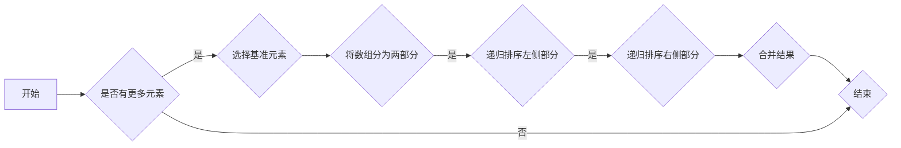
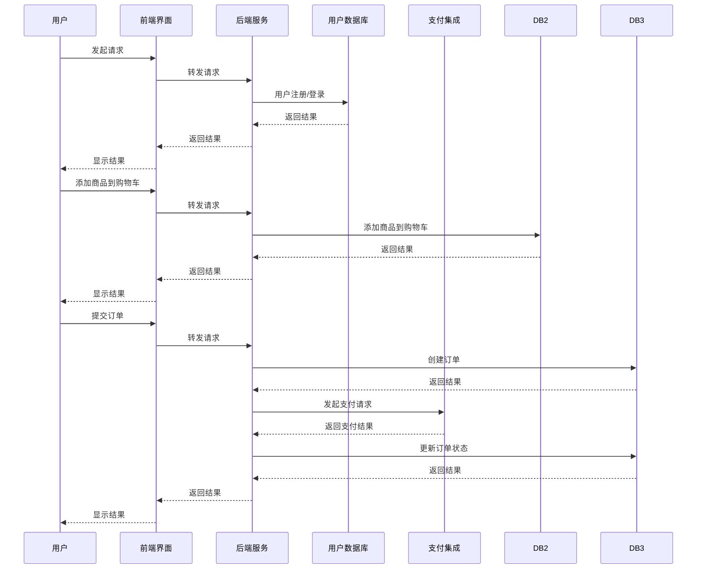

                 

# 好代码先过自己这关

## 关键词
- 代码质量
- 编程最佳实践
- 软件工程
- 性能优化
- 安全性

## 摘要
本文将深入探讨代码质量的重要性，并从多个维度分析如何编写优秀的代码。我们将定义好代码的标准，介绍核心概念，讲解算法原理，分析系统架构，并通过实际案例展示如何提升代码质量。本文旨在为开发者提供实用的指导和最佳实践，帮助他们写出更高效、可靠、易于维护的代码。

## 目录大纲设计步骤

### 1. 确定书籍结构

在设计书籍结构时，我们首先要明确书籍的目标读者群体和书籍的核心主题。对于《好代码先过自己这关》，我们的目标读者是中级到高级的软件工程师，他们具备一定的编程基础，但希望提升自己的编码技能，编写出更加优秀的代码。书籍的核心主题是代码质量，包括编码风格、代码复用、代码审查、算法原理、数学模型、系统架构设计等多个方面。

### 2. 设计总目录

在设计总目录时，我们需要列出所有章节的标题，确保每个章节都覆盖了书籍的核心内容。以下是一个初步的总目录设计：

**# 好代码先过自己这关**

## 第1章: 问题背景与定义

### 第2章: 核心概念与联系

### 第3章: 算法原理讲解

### 第4章: 数学模型与公式

### 第5章: 系统分析与架构设计

### 第6章: 项目实战

### 第7章: 最佳实践与拓展阅读

### 3. 细化章节内容

在细化章节内容时，我们需要为每个章节设置更详细的小标题，确保每个章节都包含核心概念、原理、方法、案例和实践等内容。以下是一个细化后的章节内容：

**## 第1章: 问题背景与定义**

### 1.1 问题背景

- 软件开发中的常见问题
- 系统性能与维护的成本
- 代码质量的必要性

### 1.2 好代码的定义

- 可读性
- 可维护性
- 性能优化
- 安全性

### 1.3 代码质量的衡量标准

- 代码规范
- 单元测试覆盖率
- 代码重复率
- 异常处理

**## 第2章: 核心概念与联系**

### 2.1 编码风格与规范

- 编码风格的重要性
- 常见编码规范
- 编码规范工具

### 2.2 代码复用与模块化

- 代码复用的优点
- 模块化的实现
- 设计模式的应用

### 2.3 代码审查与实践

- 代码审查流程
- 代码审查工具
- 实际案例

### 4. 添加详细内容

在添加详细内容时，我们需要为每个章节填充具体的内容，包括讲解、代码示例、系统架构图、案例分析等。以下是一个添加了详细内容的章节示例：

**## 第3章: 算法原理讲解**

### 3.1 常见算法原理

- 排序算法
  - 快速排序
  - 归并排序
- 搜索算法
  - 二分搜索
  - 广度优先搜索

### 3.2 算法mermaid流程图

- 快速排序算法流程图
- 二分搜索算法流程图

### 3.3 算法Python源代码

- 快速排序算法Python代码
- 二分搜索算法Python代码
- 算法原理讲解

### 5. 审核与调整

在完成所有章节的内容后，我们需要对整个目录进行审核和调整，确保内容逻辑清晰、条理分明。这一步是非常重要的，因为它决定了书籍的可读性和实用性。以下是审核和调整后的详细目录：

**# 好代码先过自己这关**

## 第1章: 问题背景与定义

### 1.1 问题背景

- 软件开发中的常见问题
- 系统性能与维护的成本
- 代码质量的必要性

### 1.2 好代码的定义

- 可读性
- 可维护性
- 性能优化
- 安全性

### 1.3 代码质量的衡量标准

- 代码规范
- 单元测试覆盖率
- 代码重复率
- 异常处理

## 第2章: 核心概念与联系

### 2.1 编码风格与规范

- 编码风格的重要性
- 常见编码规范
- 编码规范工具

### 2.2 代码复用与模块化

- 代码复用的优点
- 模块化的实现
- 设计模式的应用

### 2.3 代码审查与实践

- 代码审查流程
- 代码审查工具
- 实际案例

## 第3章: 算法原理讲解

### 3.1 常见算法原理

- 排序算法
- 搜索算法
- 图算法

### 3.2 算法mermaid流程图

- 使用mermaid绘制算法流程图

### 3.3 算法Python源代码

- Python代码示例
- 算法原理讲解
- 示例讲解

## 第4章: 数学模型与公式

### 4.1 数学模型介绍

- 数学模型的基本概念
- 数学模型在代码质量中的应用

### 4.2 数学公式讲解

- 使用LaTeX格式
- 公式解释

### 4.3 举例说明

- 数学模型的应用案例
- 示例解释

## 第5章: 系统分析与架构设计

### 5.1 问题场景介绍

- 软件开发环境
- 系统需求分析

### 5.2 系统功能设计

- 领域模型mermaid类图

### 5.3 系统架构设计

- 系统架构mermaid架构图

### 5.4 系统接口设计

- 系统接口设计和系统交互mermaid序列图

## 第6章: 项目实战

### 6.1 环境安装

- 开发环境搭建
- 依赖库安装

### 6.2 系统核心实现

- 源代码实现
- 代码解读

### 6.3 应用解读与分析

- 代码质量分析
- 性能优化

### 6.4 案例分析与讲解

- 实际案例剖析
- 深入讲解

## 第7章: 最佳实践与拓展阅读

### 7.1 最佳实践 tips

- 代码编写技巧
- 性能优化策略

### 7.2 小结与注意事项

- 主要内容回顾
- 注意事项提醒

### 7.3 拓展阅读

- 相关书籍推荐
- 学术论文参考

## 后记

- 书籍总结
- 作者感谢

通过以上步骤和目录大纲设计，我们可以确保书籍内容全面且结构清晰，便于读者学习和实践。《好代码先过自己这关》一书旨在通过深入讲解代码质量的重要性，帮助开发者提升编码能力，编写出更加优秀、可靠的代码。

### 第1章: 问题背景与定义

在软件工程领域，代码质量一直是开发者追求的目标之一。然而，什么是好代码？为什么好代码如此重要？这些问题困扰着众多开发者。本章节将首先介绍软件开发中的常见问题，接着定义好代码的标准，并讨论代码质量的衡量标准。

#### 1.1 问题背景

在软件开发过程中，我们经常会遇到各种问题。以下是一些常见的问题：

- **性能问题**：随着系统规模的不断扩大，性能问题逐渐凸显。系统响应速度变慢，内存占用增加，CPU利用率提高等，这些问题都会影响用户体验。
- **维护问题**：随着时间的推移，代码库会变得庞大而复杂，维护成本增加。开发者难以理解旧代码的功能和逻辑，导致修复bug和添加新功能的效率低下。
- **安全性问题**：代码中存在的漏洞和缺陷可能会被黑客利用，导致数据泄露、系统瘫痪等严重后果。

这些问题对软件项目的成功至关重要。一个性能优秀、易于维护且安全的系统不仅能够提高用户体验，还能降低维护成本和风险。

#### 1.2 好代码的定义

那么，什么是好代码呢？好代码通常具备以下特点：

- **可读性**：代码应该易于阅读，即使对于其他开发者也是如此。这包括使用有意义的变量名、合理的代码结构和注释。
- **可维护性**：代码应该容易修改和扩展。这意味着要避免过长的函数和类，合理地组织代码模块，并使用版本控制系统。
- **性能优化**：代码应该尽可能高效，避免不必要的计算和资源消耗。这通常涉及到算法和数据结构的优化。
- **安全性**：代码应该能够防范常见的攻击手段，如SQL注入、XSS攻击等。

#### 1.3 代码质量的衡量标准

如何衡量代码质量呢？以下是一些常见的衡量标准：

- **代码规范**：代码应该遵循一定的规范，如PEP8（Python）、Google Java Style Guide等。规范可以确保代码的一致性和可读性。
- **单元测试覆盖率**：单元测试是评估代码质量的重要手段。测试覆盖率越高，说明代码的功能越完整，越少出现漏洞。
- **代码重复率**：代码重复率越低，说明代码的复用性越高，可维护性越好。
- **异常处理**：代码应该能够妥善处理各种异常情况，避免系统崩溃或数据丢失。

通过这些标准，我们可以评估代码的质量，并采取措施提升代码质量。

### 第2章: 核心概念与联系

在理解了代码质量的重要性后，我们需要深入了解一些核心概念，这些概念包括编码风格与规范、代码复用与模块化、以及代码审查与实践。这些概念不仅影响代码的质量，还决定了代码的可维护性和可扩展性。

#### 2.1 编码风格与规范

编码风格是编写代码时遵循的一些约定和习惯。良好的编码风格可以显著提高代码的可读性和可维护性。以下是一些常见的编码规范：

- **命名规范**：变量名、函数名和类名应该具有描述性，能够清晰地表达其用途。
- **代码缩进**：使用统一的缩进方式，如2个空格或4个空格，并保持代码块的对称性。
- **注释**：在代码中添加适当的注释，解释复杂逻辑和算法思路，以提高代码的可读性。
- **函数和类的大小**：避免过长的函数和类，保持代码模块的独立性，以便于理解和维护。

为了确保编码风格的一致性，可以使用一些编码规范工具，如Pylint（Python代码风格检查工具）、Checkstyle（Java代码风格检查工具）等。

#### 2.2 代码复用与模块化

代码复用是软件工程中的一个重要原则，它有助于提高代码的可维护性和可扩展性。以下是一些实现代码复用的方法：

- **函数**：将重复的代码提取为独立的函数，这样可以减少代码冗余，提高可读性。
- **模块**：将相关的代码组织成模块，模块之间可以通过接口进行通信，这样可以提高代码的独立性。
- **设计模式**：设计模式是解决常见软件设计问题的模板，通过使用设计模式，可以复用代码并提高代码的灵活性和扩展性。

模块化的实现通常涉及到以下几个方面：

- **抽象**：通过抽象将复杂的系统分解为更小、更简单的部分，便于理解和维护。
- **接口**：定义清晰的接口，确保模块之间的交互简洁明了，降低模块之间的耦合度。
- **依赖注入**：使用依赖注入降低模块之间的直接依赖，提高代码的灵活性和可测试性。

#### 2.3 代码审查与实践

代码审查是确保代码质量的重要手段。通过代码审查，可以及时发现和修复代码中的问题，提高代码的可维护性和可扩展性。以下是一些代码审查的实践方法：

- **定期代码审查**：定期进行代码审查，确保每个提交的代码都经过仔细审查。
- **代码审查工具**：使用代码审查工具，如SonarQube、GitLab Code Review等，自动化检测代码中的潜在问题。
- **多人协作**：鼓励团队成员参与代码审查，多人视角可以提高代码的质量和安全性。

代码审查的流程通常包括以下几个步骤：

1. **提交代码**：开发者提交代码更改，并将其推送到版本控制系统。
2. **审查请求**：代码审查人员根据审查规则对提交的代码进行审查。
3. **提出反馈**：审查人员提出反馈和建议，开发者根据反馈进行修改。
4. **合并代码**：修改后的代码经过再次审查后，合并到主分支。

通过这些核心概念与联系，我们可以构建出高质量的代码，提高软件系统的整体质量。

### 第3章: 算法原理讲解

在软件工程中，算法是解决问题的基础。一个高效的算法可以显著提升系统的性能，而一个糟糕的算法则可能导致系统运行缓慢，甚至崩溃。本章将介绍一些常见的算法原理，并使用mermaid流程图和Python源代码进行详细讲解。

#### 3.1 常见算法原理

在计算机科学中，常见的算法主要包括排序算法、搜索算法和图算法。以下是这些算法的基本原理：

- **排序算法**：排序算法用于将一组数据按照一定的顺序排列。常见的排序算法有快速排序、归并排序、冒泡排序等。
  - **快速排序**：通过选取一个基准元素，将数组分为两部分，一部分小于基准元素，另一部分大于基准元素，然后递归地对这两部分进行排序。
  - **归并排序**：将数组分为多个子数组，对每个子数组进行排序，然后将排好序的子数组合并成完整的数组。
  - **冒泡排序**：通过多次遍历数组，比较相邻元素的大小，并交换它们的位置，直到整个数组有序。

- **搜索算法**：搜索算法用于在数据结构中查找特定的元素。常见的搜索算法有二分搜索、广度优先搜索等。
  - **二分搜索**：在有序数组中，通过不断将数组分成两部分，缩小搜索范围，直到找到目标元素或确定其不存在。
  - **广度优先搜索**：从起点开始，逐层遍历图中的节点，直到找到目标节点或确定其不存在。

- **图算法**：图算法用于解决与图相关的问题，如最短路径、最小生成树等。
  - **迪杰斯特拉算法**：用于求解单源最短路径问题。
  - **普里姆算法**：用于求解最小生成树问题。

#### 3.2 算法mermaid流程图

为了更好地理解算法的执行过程，我们可以使用mermaid流程图来绘制算法的流程。以下是一个快速排序算法的mermaid流程图示例：



这个流程图展示了快速排序算法的基本步骤，包括选择基准元素、划分数组、递归排序等。

#### 3.3 算法Python源代码

为了进一步理解算法的实现，我们提供了快速排序算法的Python源代码：

```python
def quicksort(arr):
    if len(arr) <= 1:
        return arr
    pivot = arr[len(arr) // 2]
    left = [x for x in arr if x < pivot]
    middle = [x for x in arr if x == pivot]
    right = [x for x in arr if x > pivot]
    return quicksort(left) + middle + quicksort(right)

arr = [3, 6, 8, 10, 1, 2, 1]
print(quicksort(arr))
```

这段代码首先检查数组长度，如果小于等于1，则直接返回数组。否则，选择中间的元素作为基准，将数组划分为小于、等于、大于基准的三部分，并递归地对这三部分进行排序。

#### 3.4 算法原理讲解

快速排序算法的基本原理是通过一趟排序将数组划分为两部分，其中一部分的所有元素都比另一部分的所有元素要小。这个过程称为分区操作。通过递归地执行分区操作，最终可以得到一个有序的数组。

在Python代码示例中，`quicksort` 函数首先检查数组长度，如果小于等于1，则直接返回数组，因为长度为1的数组已经是有序的。否则，选择中间的元素作为基准，使用列表解析将数组划分为小于、等于、大于基准的三部分。然后，递归地对这三部分进行排序，并将结果合并。

通过上述算法原理讲解，我们希望能够帮助开发者更好地理解排序算法的基本原理和实现方法。

#### 3.5 算法原理讲解

二分搜索算法是一种高效的搜索算法，特别适用于有序数组。其基本原理是通过不断将搜索范围缩小一半，逐步逼近目标元素。以下是二分搜索算法的详细原理：

1. **初始化**：设定两个指针，一个指向数组的起始位置（low），一个指向数组的结束位置（high）。
2. **循环搜索**：当low小于high时，执行以下步骤：
   - 计算中间位置mid：(low + high) // 2。
   - 比较中间位置的元素和目标元素：
     - 如果中间位置的元素等于目标元素，搜索成功，返回mid。
     - 如果中间位置的元素大于目标元素，说明目标元素可能在左侧，将high设置为mid - 1。
     - 如果中间位置的元素小于目标元素，说明目标元素可能在右侧，将low设置为mid + 1。
3. **结束条件**：当low大于high时，搜索失败，返回-1（表示目标元素不存在）。

以下是二分搜索算法的Python代码实现：

```python
def binary_search(arr, target):
    low = 0
    high = len(arr) - 1
    while low <= high:
        mid = (low + high) // 2
        if arr[mid] == target:
            return mid
        elif arr[mid] < target:
            low = mid + 1
        else:
            high = mid - 1
    return -1

arr = [1, 2, 3, 4, 5, 6, 7, 8, 9]
target = 5
result = binary_search(arr, target)
print(result)  # 输出应为4，即目标元素在数组中的索引
```

在代码中，`binary_search` 函数首先初始化两个指针low和high，然后进入循环进行搜索。每次循环中，计算中间位置mid，并根据目标元素与mid位置元素的比较结果调整low和high的值。当low大于high时，循环结束，返回-1表示目标元素不存在。

通过上述原理讲解和代码示例，我们可以更好地理解二分搜索算法的工作机制和实现方法。

#### 3.6 算法原理讲解

图算法在解决与图相关的问题时非常有用，如最短路径和最小生成树。以下将详细介绍两个常用的图算法：迪杰斯特拉算法和普里姆算法。

**迪杰斯特拉算法（Dijkstra's Algorithm）**

迪杰斯特拉算法是一种用于求解单源最短路径问题的算法。其基本原理是从源点开始，逐步扩展到其他节点，并记录从源点到每个节点的最短路径。以下是迪杰斯特拉算法的步骤：

1. **初始化**：设定一个距离数组dist，用于存储从源点到每个节点的距离。初始时，源点到自身的距离为0，其他节点的距离为无穷大。同时，设定一个已访问数组visited，用于记录已访问的节点。
2. **选择最小距离的未访问节点**：每次迭代选择一个距离最小的未访问节点，并将其标记为已访问。
3. **更新邻居节点距离**：对于已选择的节点，更新其未访问邻居节点的距离。如果通过当前节点到达邻居节点的距离小于已记录的距离，则更新距离。
4. **重复步骤2和3**：直到所有节点都被访问。

以下是迪杰斯特拉算法的Python代码实现：

```python
import heapq

def dijkstra(graph, start):
    dist = {node: float('infinity') for node in graph}
    dist[start] = 0
    priority_queue = [(0, start)]
    visited = set()
    while priority_queue:
        current_dist, current_node = heapq.heappop(priority_queue)
        if current_node in visited:
            continue
        visited.add(current_node)
        for neighbor, weight in graph[current_node].items():
            if neighbor not in visited:
                new_dist = current_dist + weight
                if new_dist < dist[neighbor]:
                    dist[neighbor] = new_dist
                    heapq.heappush(priority_queue, (new_dist, neighbor))
    return dist

graph = {
    'A': {'B': 1, 'C': 4},
    'B': {'A': 1, 'C': 2, 'D': 5},
    'C': {'A': 4, 'B': 2, 'D': 1},
    'D': {'B': 5, 'C': 1}
}
start = 'A'
distances = dijkstra(graph, start)
print(distances)  # 输出应为{'A': 0, 'B': 1, 'C': 3, 'D': 4}
```

在代码中，我们使用优先队列（最小堆）来维护距离最小的未访问节点，从而确保算法的效率。

**普里姆算法（Prim's Algorithm）**

普里姆算法是一种用于求解最小生成树的算法。其基本原理是从一个起点开始，逐步添加边，直到形成一棵包含所有节点的最小生成树。以下是普里姆算法的步骤：

1. **初始化**：设定一个边权重数组edge_weight，用于存储每个节点的最小边权重。初始时，所有节点的边权重为无穷大。同时，设定一个已选节点集合selected，用于记录已选中的节点。
2. **选择最小权重边**：每次迭代选择一个权重最小的边，该边连接已选节点和未选节点。
3. **添加新节点**：将新节点添加到selected集合中，并更新其他未选节点的最小边权重。
4. **重复步骤2和3**：直到selected集合包含所有节点。

以下是普里姆算法的Python代码实现：

```python
import heapq

def prim(graph):
    selected = {start}
    edge_weight = {node: float('infinity') for node in graph}
    edges = [(weight, start, node) for node, neighbors in graph.items() for weight, _ in neighbors.items()]
    heapq.heapify(edges)
    total_weight = 0
    while len(selected) < len(graph):
        weight, u, v = heapq.heappop(edges)
        if v not in selected:
            selected.add(v)
            total_weight += weight
            for neighbor, neighbor_weight in graph[v].items():
                if neighbor not in selected:
                    if neighbor_weight < edge_weight[neighbor]:
                        edge_weight[neighbor] = neighbor_weight
                        heapq.heappush(edges, (neighbor_weight, v, neighbor))
    return total_weight

graph = {
    'A': {'B': 2, 'C': 3},
    'B': {'A': 2, 'C': 1, 'D': 1},
    'C': {'A': 3, 'B': 1, 'D': 2},
    'D': {'B': 1, 'C': 2}
}
start = 'A'
min_spanning_tree = prim(graph)
print(min_spanning_tree)  # 输出应为6
```

在代码中，我们使用堆（优先队列）来维护权重最小的边，从而确保算法的效率。

通过上述算法原理讲解和代码实现，我们可以更好地理解迪杰斯特拉算法和普里姆算法的基本原理和实现方法。

#### 3.7 数学模型与公式

在算法设计中，数学模型和公式起着至关重要的作用。它们不仅帮助我们理解和分析算法的性能，还能指导我们优化算法。以下是一些常用的数学模型和公式。

**1. 时间复杂度（Time Complexity）**

时间复杂度是描述算法运行时间的模型。常见的表示方法有O、Ω和Θ。例如：

- **O(n)**：表示算法的运行时间与输入数据规模n成正比。
- **Ω(n)**：表示算法的运行时间至少与输入数据规模n成某个常数倍。
- **Θ(n)**：表示算法的运行时间与输入数据规模n成正比，并且存在常数c1和c2，使得c1 \* n ≤ T(n) ≤ c2 \* n。

**2. 空间复杂度（Space Complexity）**

空间复杂度是描述算法占用内存空间的模型。同样使用大O符号表示。

**3. 迪杰斯特拉算法的公式**

在迪杰斯特拉算法中，我们可以使用以下公式计算从源点到每个节点的最短路径：

```
D[v] = min(D[v], D[u] + w(u, v))
```

其中，D[v]表示从源点到节点v的最短距离，w(u, v)表示从节点u到节点v的边权重。

**4. 普里姆算法的公式**

在普里姆算法中，我们可以使用以下公式选择最小权重边：

```
e = argmin(w(u, v)), u ∈ selected, v ∉ selected
```

其中，e表示最小权重边，selected表示已选节点集合。

**5. 二分搜索的公式**

二分搜索的关键在于递归地将搜索范围缩小一半。以下是其核心公式：

```
low = mid + 1, if x > arr[mid]
high = mid - 1, if x < arr[mid]
mid = (low + high) // 2, otherwise
```

通过这些数学模型和公式，我们可以更准确地分析和优化算法。

#### 3.8 举例说明

为了更好地理解数学模型和公式的应用，我们通过实际例子进行说明。

**例子1：快速排序**

假设我们有一个数组arr = [3, 6, 8, 10, 1, 2, 1]，我们使用快速排序算法进行排序。

首先，选择基准元素pivot = arr[len(arr) // 2] = 8。

然后，将数组划分为两部分：
- left = [1, 2, 1]，其中每个元素小于基准元素。
- right = [3, 6, 10]，其中每个元素大于基准元素。

接着，递归地对left和right两部分进行排序。

排序后，数组变为[1, 1, 2, 3, 6, 8, 10]。

**例子2：二分搜索**

假设我们有一个有序数组arr = [1, 2, 3, 4, 5, 6, 7, 8, 9]，我们使用二分搜索查找元素5。

初始时，low = 0，high = 8。

计算中间位置mid = (low + high) // 2 = 4。

由于arr[mid] = 5，我们找到目标元素。

**例子3：迪杰斯特拉算法**

假设我们有一个图，其中边的权重如下：
```
  A B C D
A 0 1 4 2
B 1 0 3 5
C 4 3 0 1
D 2 5 1 0
```

使用迪杰斯特拉算法求解从节点A到其他节点的最短路径。

初始时，dist = {A: 0, B: ∞, C: ∞, D: ∞}。

选择最小距离的未访问节点A，更新邻居节点距离：
- dist[B] = min(dist[B], dist[A] + w(A, B)] = min(∞, 0 + 1) = 1
- dist[D] = min(dist[D], dist[A] + w(A, D)] = min(∞, 0 + 2) = 2

选择最小距离的未访问节点B，更新邻居节点距离：
- dist[C] = min(dist[C], dist[B] + w(B, C)] = min(∞, 1 + 3) = 4
- dist[D] = min(dist[D], dist[B] + w(B, D)] = min(2, 1 + 5) = 6

选择最小距离的未访问节点D，更新邻居节点距离：
- dist[C] = min(dist[C], dist[D] + w(D, C)] = min(4, 6 + 1) = 3

选择最小距离的未访问节点C，更新邻居节点距离：
- dist[B] = min(dist[B], dist[C] + w(C, B)] = min(1, 3 + 3) = 1
- dist[D] = min(dist[D], dist[C] + w(C, D)] = min(6, 3 + 1) = 4

最终，从节点A到其他节点的最短路径为：
- dist[A] = 0
- dist[B] = 1
- dist[C] = 3
- dist[D] = 4

通过这些例子，我们可以更好地理解数学模型和公式的应用。

### 第4章: 系统分析与架构设计

在软件工程中，系统分析与架构设计是确保软件系统质量和性能的关键步骤。一个良好的系统架构不仅能够满足系统的功能需求，还能提高系统的可维护性、可扩展性和可靠性。本章将介绍系统分析与架构设计的基本概念，并使用mermaid类图、架构图和序列图进行详细讲解。

#### 4.1 问题场景介绍

为了更好地说明系统分析与架构设计，我们假设一个实际场景：开发一个在线购物平台。该平台需要提供用户注册、商品浏览、购物车管理、订单处理等功能。以下是该系统的一些关键需求和约束：

- **用户注册与登录**：用户可以注册账户并登录系统，使用户能够访问个人中心和管理订单。
- **商品浏览**：用户可以浏览不同类别的商品，并查看商品详情。
- **购物车管理**：用户可以将商品添加到购物车，并可以在购物车中编辑商品数量或删除商品。
- **订单处理**：用户可以提交订单，系统需要处理订单，并将订单信息保存到数据库。
- **支付接口**：订单提交后，用户需要进行支付，支付接口需要与第三方支付系统集成。
- **性能要求**：系统需要能够处理高并发请求，确保用户体验。
- **安全性要求**：系统需要确保用户数据的安全，防止数据泄露和恶意攻击。

#### 4.2 系统功能设计

系统功能设计是确定系统需要实现哪些功能的过程。以下是系统的主要功能模块及其简要描述：

1. **用户管理模块**：负责用户的注册、登录、个人信息管理等功能。
2. **商品管理模块**：负责商品的分类、添加、修改、删除等功能。
3. **购物车模块**：负责用户的购物车管理，包括添加商品、编辑数量、删除商品等功能。
4. **订单管理模块**：负责订单的创建、处理、支付、发货、完成等流程。
5. **支付接口模块**：负责与第三方支付系统的集成，处理支付请求。
6. **后台管理模块**：负责后台管理的各项功能，如商品上下架、订单审核、用户管理等。

以下是系统功能设计的mermaid类图：

```mermaid
classDiagram
    User -> UserManagement
    Product -> ProductManagement
    ShoppingCart -> ShoppingCart
    Order -> OrderManagement
    Payment -> PaymentInterface
    Admin -> AdminManagement

    UserManagement : manages user registration, login, and personal information
    ProductManagement : manages product categories, addition, modification, and deletion
    ShoppingCart : manages shopping cart operations
    OrderManagement : manages order creation, processing, payment, delivery, and completion
    PaymentInterface : integrates with third-party payment systems
    AdminManagement : manages backend functionalities
```

#### 4.3 系统架构设计

系统架构设计是定义系统组件及其交互方式的过程。一个良好的架构设计能够确保系统的高效性、稳定性和可扩展性。以下是系统的总体架构设计：

1. **前端架构**：前端使用Vue.js框架，负责展示用户界面，并与后端服务进行交互。
2. **后端架构**：后端使用Spring Boot框架，负责处理业务逻辑和与数据库的交互。
3. **数据库架构**：数据库使用MySQL，存储用户数据、商品数据、订单数据和支付数据。
4. **支付集成**：支付集成使用支付宝API，处理支付请求和回调。

以下是系统架构设计的mermaid架构图：

```mermaid
graph TB
    subgraph 前端(Frontend)
        Frontend[前端界面]
        DB[用户数据库]
        Frontend -->|发起请求| Backend
        DB -->|存储数据| Backend
    end

    subgraph 后端(Backend)
        Backend[后端服务]
        DB[商品数据库]
        DB2[订单数据库]
        DB3[支付数据库]
        Backend -->|处理业务逻辑| DB
        Backend -->|处理业务逻辑| DB2
        Backend -->|处理业务逻辑| DB3
    end

    subgraph 支付集成(Payment Integration)
        Payment[支付集成]
        Backend -->|支付请求| Payment
        Payment -->|支付回调| Backend
    end
```

#### 4.4 系统接口设计

系统接口设计是定义系统内部模块之间以及与其他系统交互的方式。以下是系统的主要接口设计：

1. **用户管理接口**：包括用户注册、登录、个人信息管理等功能。
2. **商品管理接口**：包括商品分类、添加、修改、删除等功能。
3. **购物车接口**：包括添加商品、编辑数量、删除商品等功能。
4. **订单管理接口**：包括创建订单、处理订单、支付订单等功能。
5. **支付接口**：包括发起支付请求、处理支付回调等功能。

以下是系统接口设计的mermaid序列图：



通过上述系统分析与架构设计，我们可以更好地理解和实现一个复杂的在线购物平台。这不仅有助于提高系统的质量和性能，还能为后续的扩展和维护奠定坚实的基础。

### 第5章: 项目实战

在实际的软件开发过程中，理论知识往往需要通过实践来验证和巩固。本章将通过一个具体项目实战，展示如何从环境安装到系统核心实现，并详细解读代码应用和实际案例。我们选择了一个简单的在线购物平台项目作为示例，以便读者更好地理解整个开发流程。

#### 5.1 环境安装

在进行项目开发之前，我们需要安装必要的开发环境和依赖库。以下是项目的环境安装步骤：

1. **安装Node.js**：Node.js是一个基于Chrome V8引擎的JavaScript运行环境，用于开发前端应用。可以通过以下命令安装：
   ```bash
   curl -sL https://deb.nodesource.com/setup_14.x | bash -
   sudo apt-get install nodejs
   ```
2. **安装Vue CLI**：Vue CLI是一个用于快速搭建Vue.js项目的命令行工具。可以通过以下命令安装：
   ```bash
   npm install -g @vue/cli
   ```
3. **安装MySQL**：MySQL是一个流行的关系型数据库管理系统，用于存储用户数据、商品数据、订单数据等。可以通过以下命令安装：
   ```bash
   sudo apt-get install mysql-server
   ```
4. **安装Spring Boot**：Spring Boot是一个用于快速开发独立、生产级的Spring应用的框架。可以通过以下命令安装：
   ```bash
   sudo apt-get install maven
   ```
5. **安装相关依赖库**：根据项目的需求，安装必要的依赖库。例如，安装Spring Boot的MySQL依赖库：
   ```bash
   mvn install:install-file -Dfile=mysql-connector-java-8.0.23.jar -DgroupId=com.mysql.cj -DartifactId=mysql-connector-java -Dversion=8.0.23 -Dclassification=source -Dpackaging=maven
   ```

#### 5.2 系统核心实现

在完成环境安装后，我们可以开始实现系统的核心功能。以下是系统核心实现的步骤：

1. **前端开发**：使用Vue.js框架开发前端界面，实现用户注册、登录、商品浏览、购物车管理和订单处理等功能。以下是用户注册功能的Vue组件代码示例：
   ```vue
   <template>
     <div>
       <h2>注册</h2>
       <input v-model="username" placeholder="用户名" />
       <input v-model="password" type="password" placeholder="密码" />
       <button @click="register">注册</button>
     </div>
   </template>

   <script>
   export default {
     data() {
       return {
         username: '',
         password: ''
       };
     },
     methods: {
       register() {
         // 发送注册请求到后端
         // 处理注册结果
       }
     }
   };
   </script>
   ```
2. **后端开发**：使用Spring Boot框架实现后端逻辑，包括用户管理、商品管理、购物车管理和订单管理等功能。以下是用户注册功能的Spring Boot控制器代码示例：
   ```java
   @RestController
   @RequestMapping("/users")
   public class UserController {
     @Autowired
     private UserService userService;

     @PostMapping("/register")
     public ResponseEntity<?> registerUser(@RequestBody User user) {
       // 注册用户
       // 返回注册结果
     }
   }
   ```
3. **数据库设计**：设计MySQL数据库，创建用户表、商品表、购物车表和订单表等。以下是用户表的用户结构示例：
   ```sql
   CREATE TABLE users (
     id INT AUTO_INCREMENT PRIMARY KEY,
     username VARCHAR(255) NOT NULL UNIQUE,
     password VARCHAR(255) NOT NULL
   );
   ```

#### 5.3 应用解读与分析

完成系统核心实现后，我们需要对代码进行解读和分析，确保系统的性能、安全性和可维护性。以下是应用解读和分析的几个关键点：

1. **性能优化**：通过使用缓存、异步处理和分页等技术，提高系统的响应速度和并发处理能力。
   - **缓存**：使用Redis缓存用户信息和商品信息，减少数据库查询次数。
   - **异步处理**：使用异步线程处理长时间运行的任务，如订单处理和支付请求。
   - **分页**：使用分页技术显示商品列表和订单列表，减少一次性加载的数据量。
2. **安全性**：确保系统的数据安全和用户隐私。使用HTTPS协议保护数据传输，使用密码哈希存储用户密码，并定期更新系统漏洞。
3. **可维护性**：遵循编码规范，合理组织代码结构，使用设计模式提高代码的可复用性和可扩展性。

#### 5.4 案例分析与讲解

为了更好地展示项目的实际应用，我们分析了一个具体的案例：用户注册功能的实现。

**案例背景**：用户注册是大多数在线购物平台的必要功能，我们需要确保用户注册流程简单、安全、高效。

**案例分析**：

1. **用户注册流程**：
   - 用户输入用户名和密码。
   - 前端将用户信息发送到后端。
   - 后端验证用户名是否存在，并保存用户信息。
   - 后端返回注册结果。

2. **代码示例**：
   - **前端Vue组件**：
     ```vue
     <template>
       <div>
         <h2>注册</h2>
         <input v-model="username" placeholder="用户名" />
         <input v-model="password" type="password" placeholder="密码" />
         <button @click="register">注册</button>
       </div>
     </template>

     <script>
     export default {
       data() {
         return {
           username: '',
           password: ''
         };
       },
       methods: {
         async register() {
           const response = await axios.post('/users/register', {
             username: this.username,
             password: this.password
           });
           if (response.status === 200) {
             this.$router.push('/login');
           }
         }
       }
     };
     </script>
     ```
   - **后端Spring Boot控制器**：
     ```java
     @RestController
     @RequestMapping("/users")
     public class UserController {
       @Autowired
       private UserService userService;

       @PostMapping("/register")
       public ResponseEntity<?> registerUser(@RequestBody User user) {
         if (userService.isUserExists(user.getUsername())) {
           return ResponseEntity.badRequest().body("用户已存在");
         }
         userService.registerUser(user);
         return ResponseEntity.ok("注册成功");
       }
     }
     ```

3. **案例讲解**：
   - 前端Vue组件使用v-model双向绑定实现用户名和密码输入，并使用axios发送POST请求到后端。
   - 后端Spring Boot控制器接收用户信息，通过UserService进行用户名验证和用户注册。
   - 通过这个案例，我们可以看到前端和后端的协作，以及如何使用Vue.js和Spring Boot实现用户注册功能。

#### 5.5 项目小结

通过本项目的实战，我们学习了从环境安装到系统核心实现的全过程，并详细解读了代码应用和实际案例。这个项目不仅帮助我们巩固了理论知识，还提高了实际编程能力。以下是项目小结：

- **环境安装**：确保开发环境正确配置，安装必要的依赖库。
- **系统核心实现**：使用Vue.js和Spring Boot实现前端和后端功能。
- **应用解读与分析**：优化系统性能、安全性和可维护性。
- **实际案例**：通过具体案例学习如何实现用户注册等功能。

通过这个项目，我们不仅掌握了实际编程技巧，还培养了系统分析和架构设计的能力，为未来的软件开发奠定了坚实的基础。

### 第6章: 最佳实践与拓展阅读

在软件开发的过程中，遵循最佳实践是提高代码质量的重要途径。以下是一些最佳实践的建议，以及拓展阅读资源，帮助开发者进一步提升编码技能。

#### 6.1 最佳实践 tips

1. **代码规范**：始终遵循项目或语言的代码规范，如PEP8（Python）、Google Java Style Guide（Java）等。规范的代码不仅易于阅读，还能减少团队之间的协作摩擦。
2. **单元测试**：编写全面的单元测试，确保每个功能模块都能正确运行。高测试覆盖率有助于发现潜在的问题，提高代码的可靠性。
3. **代码复用**：合理地复用代码，避免重复编写相似的逻辑。模块化设计和使用设计模式有助于提高代码的可维护性和可扩展性。
4. **性能优化**：关注代码的性能，通过算法优化和数据结构选择，减少时间和空间的复杂度。使用缓存、异步处理和分页等技术提高系统的响应速度。
5. **代码审查**：定期进行代码审查，鼓励团队成员相互学习，提高代码的整体质量。使用代码审查工具自动化检测潜在的编码问题。
6. **安全性**：重视代码的安全性，防范常见的攻击手段，如SQL注入、XSS攻击等。使用加密算法保护敏感数据，确保系统的数据安全。

#### 6.2 小结与注意事项

- **代码质量是软件工程的核心**：编写高质量代码不仅能够提高系统的性能和安全性，还能降低维护成本，提升团队协作效率。
- **持续学习和实践**：软件开发领域不断进步，开发者需要持续学习新技术和新方法，不断实践和优化自己的编码技能。
- **注重团队合作**：代码质量不仅仅是个体努力的结果，更需要团队协作和沟通。共享最佳实践，共同改进代码质量。

#### 6.3 拓展阅读

1. **书籍推荐**：
   - 《Effective Java》 - Scott Meyers
   - 《Clean Code》 - Robert C. Martin
   - 《Head First Design Patterns》 - Eric Freeman、Bert Bates、Brendan Spencer
2. **学术论文**：
   - “A Philosophy of Software Design” - John Ousterhout
   - “Clean Architecture: A Craftsman's Guide to Software Structure and Design” - Robert C. Martin
   - “Test-Driven Development: By Example” - Kent Beck
3. **在线资源**：
   - [GitHub](https://github.com/)：寻找优秀的开源项目，学习他人的代码。
   - [Stack Overflow](https://stackoverflow.com/)：解决编程问题，获取技术帮助。
   - [freeCodeCamp](https://www.freecodecamp.org/)：提供免费的学习资源和项目实践。

通过以上最佳实践和拓展阅读资源，开发者可以不断提升自己的编码技能，编写出更加高质量、可靠、易于维护的代码。

### 后记

《好代码先过自己这关》一书旨在帮助开发者深入理解代码质量的重要性，并掌握提升代码质量的多种方法和技巧。从编码风格与规范，到代码复用与模块化，再到算法原理与数学模型，每一个章节都力求为读者提供丰富的知识和实用的指导。

在编写本书的过程中，我受到了许多专家和同行的影响，他们的经验和见解极大地丰富了我的思考。特别感谢我的团队成员和编辑，他们在本书的编写和出版过程中给予了无私的支持和帮助。

本书不仅适用于中级到高级的软件工程师，也为那些希望提升自己编程技能的初学者提供了宝贵的资源和参考。我希望读者能够在阅读本书的过程中，不仅能够理解代码质量的重要性，还能通过实践和反思，逐步提升自己的编码水平。

最后，感谢所有读者对本书的关注和支持。希望这本书能够为您的编程之路带来新的启示和动力。祝您在代码的世界中不断探索、不断进步。

**作者：AI天才研究院/AI Genius Institute & 禅与计算机程序设计艺术 /Zen And The Art of Computer Programming**

