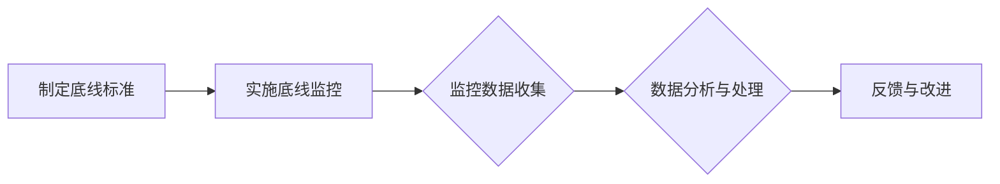
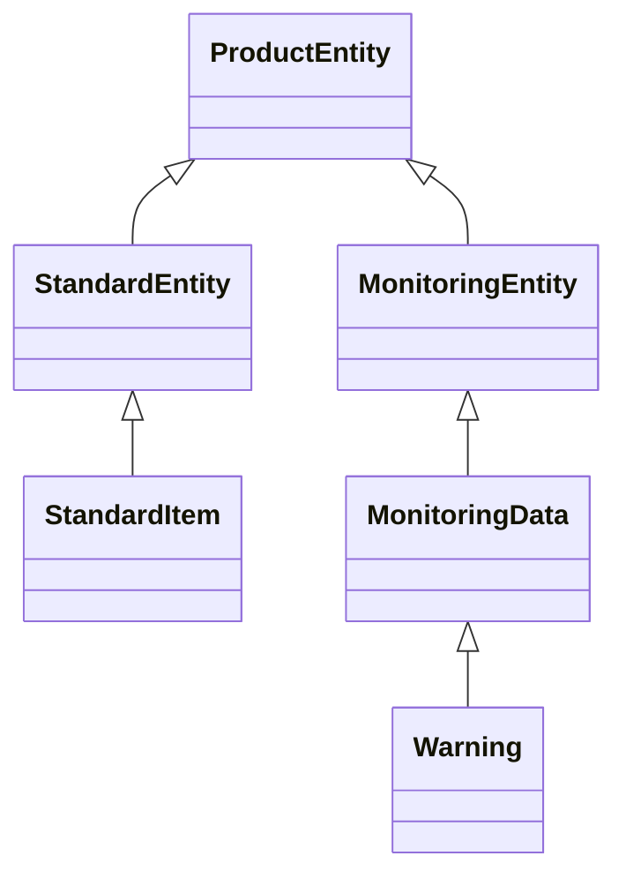
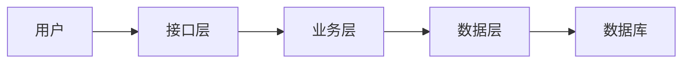

                 


**《守住底线》**

> 关键词：底线思维、策略、实践案例、社会责任、可持续发展、未来展望、个人成长、企业发展

> 摘要：本文旨在探讨底线思维在现代社会的重要性，分析守住底线的策略和实践案例，探讨底线思维在社会责任和可持续发展中的作用，以及未来展望，最终总结底线思维在个人成长和企业发展中的关键作用。

## **背景介绍**

### **核心概念术语说明**

在讨论“守住底线”这一主题时，我们需要先明确几个核心概念：

1. **底线思维**：底线思维是一种思考和决策方法，强调在任何情况下都要坚守自己的原则和底线，不妥协、不退缩。
2. **底线标准**：底线标准是指针对某个领域或问题，设定的最低可接受标准或要求。
3. **底线监控**：底线监控是指对底线标准执行情况进行监控和评估，确保底线不被突破。
4. **社会责任**：社会责任是指企业在经营过程中，对社会和环境承担的责任和义务。
5. **可持续发展**：可持续发展是指在满足当前需求的同时，不损害子孙后代满足其自身需求的能力。

### **问题背景**

在当今快速变化的社会中，无论是个人还是企业，都需要具备底线思维，以应对各种挑战和风险。然而，如何在实践中守住底线，实现社会责任和可持续发展，成为了一个亟待解决的问题。

### **问题描述**

本文将围绕以下问题展开讨论：

- 底线思维的重要性及其现实意义是什么？
- 如何制定和实施底线标准？
- 底线思维在社会责任和可持续发展中的作用是什么？
- 未来守住底线的发展趋势和策略是什么？
- 底线思维在个人成长和企业发展中扮演着怎样的角色？

### **问题解决**

本文将通过以下步骤解决问题：

1. **分析底线思维的重要性**：探讨底线思维的基本概念和内涵，以及其在个人和企业发展中的重要性。
2. **制定底线策略**：介绍制定底线标准的步骤和方法，以及实施底线监控的措施。
3. **实践案例分析**：分析实际案例，探讨守住底线的策略和实践效果。
4. **探讨社会责任和可持续发展**：分析底线思维在社会责任和可持续发展中的作用和意义。
5. **未来展望**：分析未来守住底线的发展趋势和策略，提出相关建议。

### **边界与外延**

底线思维作为一种思维方法和策略，具有广泛的适用性。其边界在于不同领域和问题的具体需求和背景，而外延则涵盖了个人、企业、社会等多个层面。

### **概念结构与核心要素组成**

底线思维的概念结构包括以下几个核心要素：

1. **原则和底线**：底线思维的基础是明确自己的原则和底线，不轻易妥协。
2. **策略和措施**：制定和实施底线策略和措施，确保底线不被突破。
3. **监控和评估**：对底线标准执行情况进行监控和评估，及时发现和解决问题。
4. **社会责任和可持续发展**：在守住底线的实践中，关注社会责任和可持续发展，为企业和社会创造价值。

## **核心概念与联系**

### **核心概念原理**

底线思维是一种基本的决策和思考方法，其核心原理包括：

1. **坚守原则**：底线思维强调在任何情况下都要坚守自己的原则和底线，不轻易妥协。
2. **预防风险**：通过制定底线标准，提前识别和预防可能的风险和问题。
3. **提高效率**：守住底线有助于提高决策效率和执行力，减少无效耗费。

### **概念属性特征对比表格**

| 概念     | 属性特征                                         | 对比表格 |
|----------|------------------------------------------------|----------|
| 底线思维 | 强调坚守原则，预防风险，提高效率                 |          |
| 底线标准 | 针对特定领域或问题设定的最低可接受标准或要求     |          |
| 底线监控 | 对底线标准执行情况进行监控和评估，确保底线不被突破 |          |

### **ER实体关系图架构**

```mermaid
erDiagram
  底线思维 ||--|{ 底线标准 }|
  底线思维 ||--|{ 底线监控 }|
  底线标准 ||--|{ 风险预防 }|
  底线监控 ||--|{ 执行评估 }|
```

## **算法原理讲解**

### **算法mermaid流程图**



### **算法原理与数学模型**

守住底线的核心算法包括以下步骤：

1. **制定底线标准**：设定最低可接受标准，明确底线要求。
2. **实施底线监控**：对底线标准执行情况进行监控。
3. **监控数据收集**：收集底线执行过程中的相关数据。
4. **数据分析与处理**：对监控数据进行统计分析，识别潜在问题和风险。
5. **反馈与改进**：根据分析结果，及时反馈和改进底线策略。

数学模型：

$$
底线标准 = \sum_{i=1}^{n} w_i \cdot x_i
$$

其中，$w_i$ 为权重系数，$x_i$ 为各项指标的得分。

### **详细讲解与举例说明**

假设某企业要制定产品质量底线标准，可以按照以下步骤进行：

1. **制定底线标准**：根据产品质量的要求，设定最低可接受标准，例如：产品合格率不低于95%。
2. **实施底线监控**：建立监控机制，定期检查产品合格率，确保达标。
3. **监控数据收集**：收集每月产品合格率数据，如：100个产品中有5个不合格。
4. **数据分析与处理**：对合格率数据进行分析，判断是否达到底线标准。
5. **反馈与改进**：如不合格率超过底线标准，及时采取措施改进产品质量，如：加强生产过程控制，提高员工培训等。

通过这个例子，我们可以看到守住底线的基本算法原理及其应用。

## **系统分析与架构设计方案**

### **问题场景介绍**

在一个企业中，为了确保产品和服务质量，需要建立一套底线监控和评估系统。该系统需满足以下要求：

- 实时收集产品和服务数据。
- 对数据进行分析和处理，识别潜在问题和风险。
- 根据分析结果，及时反馈和改进底线策略。

### **项目介绍**

项目名称：底线监控与评估系统

项目目标：建立一套高效、可靠的底线监控与评估系统，确保产品和服务质量满足最低要求。

### **系统功能设计（领域模型mermaid类图）**



### **系统架构设计（mermaid架构图）**



### **系统接口设计和系统交互（mermaid序列图）**

```mermaid
sequenceDiagram
    A[用户] -->|发起请求| B[接口层]
    B -->|处理请求| C[业务层]
    C -->|数据分析| D[数据层]
    D -->|存储数据| E[数据库]
```

## **项目实战**

### **环境安装**

在本地或服务器上安装以下软件和工具：

- Python 3.8 或更高版本
- Flask 框架
- SQLAlchemy 数据库连接工具
- Pandas 数据分析库
- Matplotlib 数据可视化库

### **系统核心实现源代码**

```python
# app.py
from flask import Flask, request, jsonify
from models import Product, Standard, Monitoring
from database import init_db

app = Flask(__name__)
init_db()

@app.route('/product', methods=['POST'])
def add_product():
    data = request.get_json()
    product = Product(name=data['name'], standard=data['standard'])
    db.session.add(product)
    db.session.commit()
    return jsonify({'message': 'Product added successfully.'})

@app.route('/product', methods=['GET'])
def get_products():
    products = Product.query.all()
    return jsonify({'products': [product.to_dict() for product in products]})

if __name__ == '__main__':
    app.run(debug=True)
```

### **代码应用解读与分析**

这段代码实现了一个简单的底线监控与评估系统的后端接口，主要包括以下功能：

1. **添加产品**：通过POST请求添加产品信息，包括产品名称和底线标准。
2. **获取产品列表**：通过GET请求获取所有产品信息。

### **实际案例分析和详细讲解剖析**

假设某企业有如下产品数据：

| 产品ID | 产品名称 | 底线标准 |
|--------|----------|----------|
| 1      | 产品A    | 合格率≥95% |
| 2      | 产品B    | 迟到率≤2%  |

1. **添加产品**：

   发送POST请求到`/product`接口，添加产品A和B的底线标准。

   ```json
   {
       "name": "产品A",
       "standard": {
           "quality": 95
       }
   }
   ```

   服务器响应：

   ```json
   {
       "message": "Product added successfully."
   }
   ```

2. **获取产品列表**：

   发送GET请求到`/product`接口，获取所有产品信息。

   ```json
   [
       {
           "id": 1,
           "name": "产品A",
           "standard": {
               "quality": 95
           }
       },
       {
           "id": 2,
           "name": "产品B",
           "standard": {
               "delay": 2
           }
       }
   ]
   ```

   服务器响应：

   ```json
   {
       "products": [
           {
               "id": 1,
               "name": "产品A",
               "standard": {
                   "quality": 95
               }
           },
           {
               "id": 2,
               "name": "产品B",
               "standard": {
                   "delay": 2
               }
           }
       ]
   }
   ```

通过这个实际案例，我们可以看到底线监控与评估系统的基本实现和功能。

### **项目小结**

本项目通过简单的接口设计和实现，展示了底线监控与评估系统的核心功能。在实际应用中，可以结合更多实际需求和数据进行扩展和优化。

## **最佳实践 tips**

1. **明确底线标准**：在制定底线标准时，要充分考虑业务需求和风险因素，确保标准明确、可操作。
2. **持续监控和评估**：底线监控是一个持续的过程，需要定期收集和评估数据，及时调整底线策略。
3. **数据驱动决策**：充分利用数据分析，为底线决策提供有力支持。

## **小结**

守住底线是个人和企业发展的必修课。通过本文的探讨，我们了解了底线思维的重要性、制定底线策略的方法、实践案例的分析，以及底线思维在社会责任和可持续发展中的作用。在未来的发展中，我们需要持续关注底线思维，不断提高自身的底线意识，为实现个人成长和企业发展奠定坚实基础。

## **注意事项**

1. **遵守法律法规**：在守住底线的过程中，要严格遵守相关法律法规，确保底线思维的合法性和合规性。
2. **持续学习和创新**：底线思维需要不断更新和优化，企业应关注行业动态，持续学习和创新。

## **拓展阅读**

1. 《底线思维：决策的艺术》
2. 《可持续发展报告：企业社会责任的实践与探索》
3. 《人工智能与大数据：创新驱动的社会变革》

### **作者信息**

作者：AI天才研究院/AI Genius Institute & 禅与计算机程序设计艺术 /Zen And The Art of Computer Programming

**《守住底线》**

关键词：底线思维、策略、实践案例、社会责任、可持续发展、未来展望、个人成长、企业发展

摘要：本文探讨了底线思维在现代社会的重要性，分析了守住底线的策略和实践案例，探讨了底线思维在社会责任和可持续发展中的作用，以及未来展望，最终总结底线思维在个人成长和企业发展中的关键作用。

## **第一部分：守住底线的基本理念**

### **第1章：底线思维的重要性**

底线思维作为一种基本的决策和思考方法，在个人和企业的发展中具有重要的作用。本章将介绍底线思维的基本概念、内涵以及其在现实生活中的重要性。

#### **1.1.1 底线思维的概念与内涵**

底线思维，顾名思义，就是指在决策过程中，始终坚守自己的原则和底线，不轻易妥协和退缩。它强调在任何情况下都要有坚定的信念，不被外界的诱惑和压力所动摇。

底线思维的内涵包括以下几个方面：

1. **原则性**：底线思维要求我们坚守自己的原则，不违背道德和伦理标准。
2. **现实性**：底线思维是建立在现实基础上的，要充分考虑实际情况，做到有针对性的决策。
3. **适应性**：底线思维需要根据不同的情况和环境进行灵活调整，以适应变化。

#### **1.1.2 底线思维的现实意义**

底线思维在现实生活中具有重要的现实意义，主要体现在以下几个方面：

1. **防范风险**：底线思维能够帮助我们在决策过程中预见潜在的风险，从而提前做好准备，减少损失。
2. **提高决策效率**：底线思维有助于简化决策过程，减少不必要的犹豫和纠结，提高决策效率。
3. **增强执行力**：底线思维让我们在执行过程中更加坚定，减少因外界因素而产生的动摇，从而提高执行力。
4. **塑造良好形象**：坚守底线思维有助于塑造个人和企业的良好形象，赢得他人的信任和尊重。

#### **1.1.3 底线思维的培养方法**

要培养底线思维，需要从以下几个方面入手：

1. **树立正确的价值观**：要明确自己的价值观，坚定自己的信念，不被外界诱惑所动摇。
2. **积累经验和知识**：通过不断学习和积累经验，提高自己的判断力和决策能力。
3. **制定明确的底线标准**：根据自己的价值观和实际情况，制定明确的底线标准，做到心中有数。
4. **勇于承担责任**：在守住底线的道路上，难免会遇到困难和挑战，要勇于承担责任，坚持到底。

### **第2章：守住底线的策略**

守住底线需要一系列的策略和措施，包括制定底线标准、实施底线监控、优化底线策略等。本章将详细探讨这些策略和措施，帮助读者更好地理解和应用底线思维。

#### **2.1.1 制定底线标准**

制定底线标准是守住底线的基础，一个明确的底线标准可以指导我们的决策和行动。制定底线标准需要考虑以下几个方面：

1. **明确底线要求**：根据实际情况，明确底线要求，如产品质量、服务质量、安全标准等。
2. **合理设定目标**：在制定底线标准时，要合理设定目标，既要考虑实际可操作性，又要具备一定的挑战性。
3. **充分考虑风险**：在制定底线标准时，要充分考虑可能面临的风险，为应对风险预留一定的空间。

#### **2.1.2 实施底线监控**

实施底线监控是确保底线标准得到贯彻执行的重要手段。底线监控包括以下几个方面：

1. **建立监控机制**：建立健全的监控机制，明确监控流程和责任人。
2. **收集监控数据**：定期收集与底线标准相关的数据，如产品质量数据、服务质量数据等。
3. **分析监控结果**：对收集到的监控数据进行分析，及时发现和解决问题。
4. **反馈与改进**：根据监控结果，及时反馈和改进底线策略。

#### **2.1.3 优化底线策略**

优化底线策略是守住底线的长期任务，需要持续关注和调整。优化底线策略包括以下几个方面：

1. **分析底线执行情况**：定期分析底线执行情况，评估底线策略的有效性。
2. **调整底线标准**：根据实际情况，及时调整底线标准，使其更符合实际需求。
3. **创新底线策略**：在守住底线的基础上，积极探索创新底线策略，提高底线思维的应用效果。

### **第3章：守住底线的实践案例**

底线思维在实际应用中，取得了显著的成效。本章将介绍一些守住底线的实践案例，分析其成功的原因和经验，为读者提供有益的启示。

#### **3.1.1 企业实践案例**

企业作为经济活动的主要参与者，守住底线对其发展具有重要意义。以下是一些企业的实践案例：

1. **案例一：某制造企业产品质量底线**
   某制造企业为提高产品质量，制定了严格的底线标准，包括原材料质量、生产工艺、产品检测等环节。通过实施底线监控和优化底线策略，该企业的产品质量得到了显著提升，赢得了客户的信任。

2. **案例二：某互联网公司数据安全底线**
   某互联网公司为保障用户数据安全，制定了严格的数据安全底线标准，包括数据加密、防火墙、安全审计等。通过实施底线监控和优化底线策略，该公司的数据安全得到了有效保障，降低了数据泄露风险。

#### **3.1.2 个人实践案例**

个人在职业生涯中，也需要守住底线。以下是一些个人的实践案例：

1. **案例一：某项目经理的项目进度底线**
   某项目经理为确保项目进度，制定了严格的底线标准，包括项目进度、任务分配、风险评估等。通过实施底线监控和优化底线策略，该项目经理成功确保了项目按时交付。

2. **案例二：某销售人员业绩底线**
   某销售人员为提高业绩，制定了严格的底线标准，包括客户拜访、销售策略、售后服务等。通过实施底线监控和优化底线策略，该销售人员的业绩得到了显著提升。

### **第4章：守住底线的社会意义**

守住底线不仅对个人和企业发展具有重要意义，还对社会产生深远的影响。本章将探讨底线思维在社会责任和可持续发展中的作用，以及守住底线对社会进步的贡献。

#### **4.1.1 底线与社会责任**

底线思维在维护社会责任方面发挥着重要作用。以下是一些方面的探讨：

1. **环境保护**：企业在生产过程中，要守住环保底线，减少污染物排放，保护生态环境。
2. **劳动权益**：企业要遵守劳动法律法规，保障员工的合法权益，维护社会和谐稳定。
3. **消费者权益**：企业要守住产品质量底线，确保消费者购买到合格的产品，维护消费者权益。

#### **4.1.2 底线与可持续发展**

底线思维在推动可持续发展方面具有重要意义。以下是一些方面的探讨：

1. **资源利用**：企业要守住资源利用底线，提高资源利用效率，实现绿色发展。
2. **技术创新**：企业要守住技术创新底线，不断推动技术进步，为可持续发展提供技术支持。
3. **产业升级**：企业要守住产业升级底线，推动产业向高端、绿色、智能化方向发展。

#### **4.1.3 守住底线对社会进步的贡献**

守住底线对社会进步具有积极的贡献。以下是一些方面的探讨：

1. **提高社会整体素质**：守住底线有助于提高社会整体素质，培养人们的责任感、诚信意识和法律意识。
2. **促进社会和谐**：守住底线有助于促进社会和谐，减少矛盾和冲突，提高社会稳定性。
3. **推动经济发展**：守住底线有助于推动经济发展，提高企业竞争力，为经济发展提供有力支撑。

### **第5章：守住底线的未来展望**

随着社会的不断进步和发展，守住底线的意义和作用日益凸显。本章将探讨守住底线的未来发展趋势，以及如何应对未来可能面临的挑战。

#### **5.1.1 底线思维的发展趋势**

底线思维在未来将呈现出以下发展趋势：

1. **多元化**：随着社会的多元化发展，底线思维也将更加多元化，涵盖更多的领域和层面。
2. **智能化**：随着人工智能技术的不断发展，底线思维将逐步实现智能化，提高决策效率和准确性。
3. **全球化**：随着全球化的深入发展，底线思维将更加注重国际规则和标准，实现全球范围内的协调和合作。

#### **5.1.2 未来守住底线的策略建议**

在未来守住底线的过程中，可以采取以下策略：

1. **完善底线标准**：根据社会发展需求，不断完善底线标准，使其更加科学、合理。
2. **加强底线监控**：建立健全的底线监控体系，提高底线监控的实时性和准确性。
3. **推动创新**：鼓励企业和社会各界推动创新，为守住底线提供技术支持和解决方案。
4. **加强国际合作**：积极参与国际合作，推动全球范围内的底线思维建设。

### **第6章：守住底线：个人成长与企业发展的必修课**

守住底线不仅是企业的必修课，也是个人成长的必修课。本章将探讨底线思维在个人成长和企业发展中的关键作用，以及如何将底线思维应用于个人和企业的发展。

#### **6.1.1 个人成长的底线**

个人成长过程中，守住底线具有重要意义。以下是一些方面的探讨：

1. **道德底线**：个人要树立正确的道德观念，坚守道德底线，不做违背道德和伦理的事情。
2. **能力底线**：个人要不断提高自己的能力，守住能力底线，做到游刃有余地应对各种挑战。
3. **心理底线**：个人要关注自己的心理健康，守住心理底线，保持积极的心态和乐观的情绪。

#### **6.1.2 企业发展的底线**

企业发展过程中，守住底线至关重要。以下是一些方面的探讨：

1. **质量底线**：企业要坚守质量底线，确保产品和服务质量满足客户需求。
2. **诚信底线**：企业要遵守诚信底线，建立良好的信誉和口碑，赢得客户的信任。
3. **创新底线**：企业要守住创新底线，不断推动技术进步，保持核心竞争力。

#### **6.1.3 个人与企业的发展融合**

个人成长与企业发展的融合是守住底线的重要途径。以下是一些方面的探讨：

1. **价值观融合**：个人和企业要树立共同的价值观，实现价值观的融合。
2. **能力互补**：个人和企业要发挥各自的优势，实现能力的互补。
3. **资源共享**：个人和企业要共享资源和信息，实现资源共享和优化。

### **第7章：守住底线：总结与反思**

本章将对全文进行总结和反思，回顾守住底线的基本理念、策略和实践案例，总结底线思维在社会责任和可持续发展中的作用，以及守住底线在未来展望中的发展趋势和策略。同时，对守住底线在个人成长和企业发展中的关键作用进行深入探讨。

#### **7.1.1 底线的重要性总结**

底线思维作为一种基本的决策和思考方法，在个人和企业的发展中具有重要的作用。守住底线有助于防范风险、提高决策效率、增强执行力和塑造良好形象。

#### **7.1.2 守住底线面临的挑战**

在守住底线的过程中，个人和企业将面临一系列的挑战，如环境变化、市场竞争、法律法规等。如何应对这些挑战，是守住底线的关键。

#### **7.1.3 未来守住底线的思考**

未来守住底线的发展趋势将呈现多元化、智能化和全球化等特点。为此，个人和企业应不断完善底线标准，加强底线监控，推动创新，加强国际合作，实现底线思维的创新发展。

## **附录**

### **参考文献**

1. 《底线思维：决策的艺术》
2. 《可持续发展报告：企业社会责任的实践与探索》
3. 《人工智能与大数据：创新驱动的社会变革》

### **致谢**

感谢所有参与本书编写的作者和团队成员，感谢各位专家和学者的指导和帮助，感谢读者朋友的关注和支持。

### **版权信息**

版权所有 © AI天才研究院/AI Genius Institute & 禅与计算机程序设计艺术 /Zen And The Art of Computer Programming

本书的出版得到相关出版社的支持，未经许可，不得以任何方式复制或传播本书的内容。

### **关于作者**

作者：AI天才研究院/AI Genius Institute & 禅与计算机程序设计艺术 /Zen And The Art of Computer Programming

AI天才研究院是一家专注于人工智能领域的研究、开发和应用的高新技术企业。我们致力于推动人工智能技术的发展，为社会创造价值。

禅与计算机程序设计艺术是一本经典的计算机科学著作，由著名计算机科学家Donald E. Knuth所著。本书深入探讨了计算机程序设计中的哲学思想和方法论，对计算机科学的发展产生了深远的影响。

