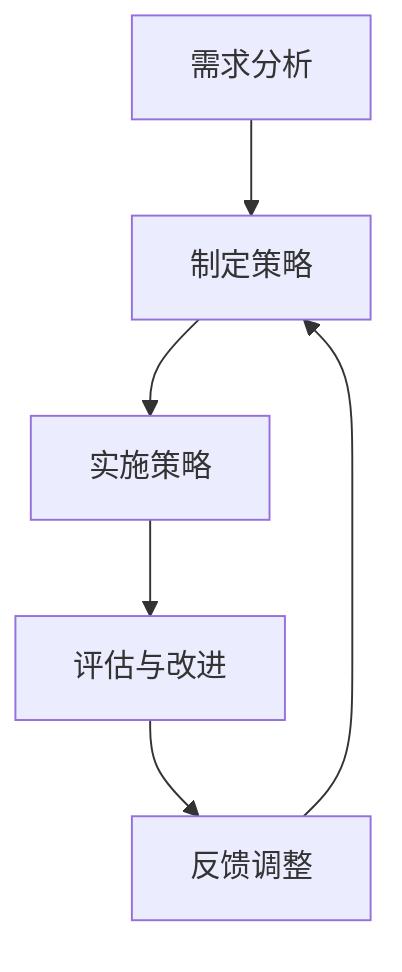
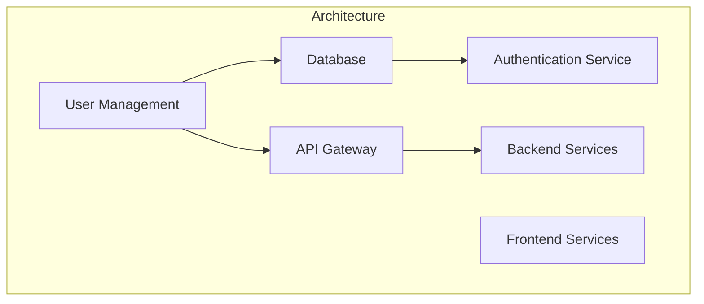
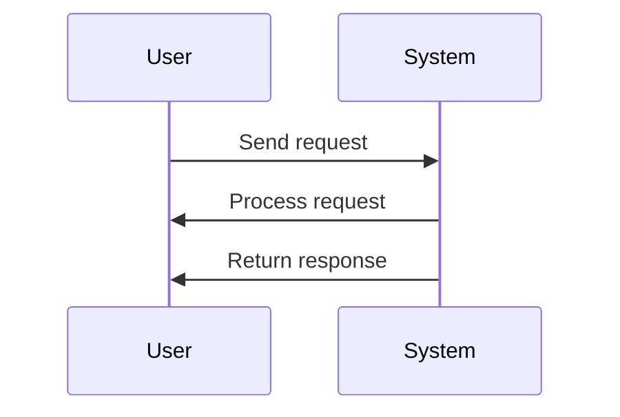
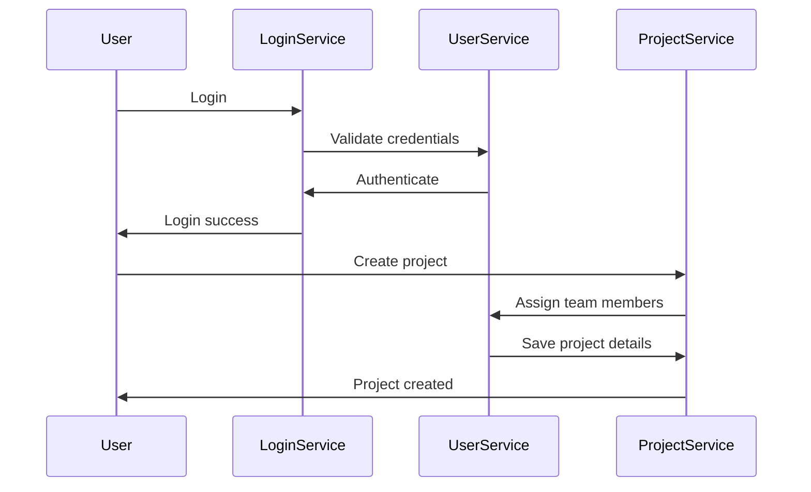

                 

# 《技术团队文化建设与价值观塑造》

## 关键词

技术团队文化、价值观塑造、团队凝聚力、工作效率、团队管理、长期影响、最佳实践。

## 摘要

本文旨在深入探讨技术团队文化建设与价值观塑造的重要性，通过逐步分析，阐述其背景、核心要素、塑造方法、应用实践以及评估改进策略。文章以逻辑清晰、结构紧凑、简单易懂的专业技术语言，结合实际案例，为技术团队管理者提供一套系统化的建设与塑造方案，以提升团队竞争力，促进企业持续创新。

## 前言和引言

### 技术团队文化建设与价值观塑造的重要性

在现代企业中，技术团队的作用日益显著。随着科技的快速发展，市场竞争日益激烈，技术团队的建设已不仅仅是人才的聚集，更是文化、价值观的凝聚。一个优秀的团队文化能够激发团队成员的潜能，提高工作效率，增强团队凝聚力，从而在市场竞争中脱颖而出。

### 本书的目的和目标受众

本书旨在为技术团队管理者提供一套系统化的文化建设与价值观塑造方案。通过深入分析技术团队文化建设的背景、重要性、核心要素、塑造方法、应用实践以及评估改进策略，帮助团队管理者建立具有竞争力的团队文化，塑造积极向上的价值观。本书的目标受众包括技术团队领导者、项目经理、HR专业人士以及对团队文化建设感兴趣的读者。

## 第1章：技术团队文化建设的背景和重要性

### 科技发展与技术团队文化建设的必然性

随着互联网、大数据、人工智能等新兴技术的飞速发展，企业对技术团队的需求不断增加。技术的快速迭代要求团队成员具备高度的专业知识和快速适应能力。而一个良好的团队文化正是促进团队成员专业成长、知识共享、创新能力提升的重要保障。

### 市场竞争与技术团队文化建设的需求

在激烈的市场竞争中，技术团队不仅是企业创新的核心力量，也是企业竞争力的体现。一个具有良好文化的技术团队，能够更好地应对市场变化，快速响应客户需求，从而在竞争中占据优势。因此，技术团队文化建设已成为企业提升竞争力的重要策略。

### 技术团队文化建设的重要性

技术团队文化建设的重要性体现在以下几个方面：

1. **提高团队凝聚力**：共同的文化价值观能够增强团队成员之间的信任和协作，形成强大的团队凝聚力。
2. **提升工作效率**：良好的团队文化能够激发团队成员的工作热情，提高工作效率和项目成功率。
3. **促进企业创新**：团队文化中的创新精神能够激发团队成员的创新思维，推动企业持续创新。
4. **增强客户满意度**：技术团队的文化建设能够提高团队的服务质量，从而提升客户满意度。

### 技术团队文化建设的核心要素

技术团队文化建设的核心要素包括共同价值观、团队目标、团队精神、沟通机制等。共同价值观是团队文化的基石，团队目标则是团队的共同追求，团队精神则是团队凝聚力的体现，沟通机制则是团队协作的重要保障。

## 第2章：技术团队价值观的塑造

### 技术团队价值观的定义

技术团队价值观是指团队在长期发展过程中形成的共同信仰和理念，是团队行为的指导原则。它涵盖了团队对技术、创新、客户、团队协作等方面的看法和态度。

### 技术团队价值观的重要性

技术团队价值观的重要性体现在以下几个方面：

1. **指导团队行为**：技术团队价值观能够指导团队成员在面临各种挑战时的决策和行为，确保团队朝着共同目标前进。
2. **增强团队凝聚力**：共同价值观能够增强团队成员之间的认同感和归属感，形成强大的团队凝聚力。
3. **提升工作效率**：清晰的价值观能够提高团队成员的工作效率，减少不必要的内耗。
4. **促进企业创新**：技术团队价值观中的创新精神能够激发团队成员的创新思维，推动企业持续创新。

### 技术团队价值观的构成要素

技术团队价值观的构成要素主要包括以下几个方面：

1. **创新**：创新是技术团队价值观的核心，代表团队对技术创新的追求和重视。
2. **协作**：协作精神强调团队合作的重要性，鼓励团队成员共同解决问题，实现团队目标。
3. **责任感**：责任感是团队成员对工作、对团队、对客户的负责任态度，是团队文化的基石。
4. **客户导向**：客户导向强调以客户需求为中心，为客户提供高质量的产品和服务。
5. **专业精神**：专业精神要求团队成员具备扎实的专业知识和技能，不断提升个人能力。

### 塑造积极向上价值观的策略

1. **树立榜样**：通过优秀员工的示范作用，树立积极向上的价值观。
2. **团队活动**：通过组织团队建设活动，增强团队成员之间的沟通和协作。
3. **培训和教育**：定期开展培训和教育，提升团队成员的价值观意识。
4. **激励机制**：通过激励机制，鼓励团队成员践行积极向上的价值观。

## 第3章：技术团队文化建设的方法

### 制定团队愿景

团队愿景是团队未来的蓝图，是团队共同努力的方向。一个清晰的团队愿景能够激发团队成员的积极性，形成强大的凝聚力。

### 建立有效沟通机制

有效沟通是团队协作的基础。建立良好的沟通机制，包括定期会议、沟通平台、信息共享等，能够提高团队的工作效率和协作效果。

### 形成团队精神

团队精神是团队文化的重要组成部分。通过团队文化建设活动，如团队建设培训、团队活动等，能够增强团队成员之间的信任和协作。

### 制定激励政策

激励政策是团队文化建设的重要手段。通过制定合理的激励政策，如绩效奖励、晋升机制等，能够激发团队成员的积极性和创造力。

## 第4章：价值观塑造在团队管理中的应用

### 招聘过程中的价值观考量

在招聘过程中，要注重考察候选人的价值观是否与团队相契合。通过面试、背景调查等方式，了解候选人的价值观和行为习惯。

### 绩效考核中的价值观导向

在绩效考核中，要将价值观作为重要考核指标，激励团队成员践行积极向上的价值观。

### 团队培训中的价值观培养

通过定期开展团队培训，加强团队成员的价值观培养，提升团队的整体素质。

### 团队决策中的价值观引导

在团队决策过程中，要充分发挥价值观的引导作用，确保团队决策符合整体价值观。

## 第5章：技术团队文化建设的评估与改进

### 评估技术团队文化建设的方法

通过员工满意度调查、团队绩效评估等方式，对技术团队文化建设进行定期评估。

### 根据评估结果进行改进

根据评估结果，调整团队目标、优化团队结构，不断提升团队文化建设的水平。

## 第6章：价值观塑造在团队发展中的长期影响

### 提高团队竞争力

价值观塑造能够提升团队成员的专业素质和工作效率，从而提高团队竞争力。

### 促进企业创新

价值观塑造能够激发团队成员的创新思维，促进企业持续创新。

### 保持和加强价值观塑造的方法

通过定期培训、团队活动、激励机制等方式，保持和加强价值观塑造。

## 第7章：案例分析与技术团队文化建设与价值观塑造的最佳实践

### 案例分析

通过分析国内外成功的技术团队建设案例，总结最佳实践。

### 最佳实践的总结

总结成功经验，为技术团队文化建设与价值观塑造提供有益的启示。

### 启示与展望

展望技术团队文化建设与价值观塑造的未来发展趋势，为团队管理者提供指导。

## 总结和展望

### 全书主要观点和结论

总结全书的主要观点和结论，为技术团队文化建设与价值观塑造提供指导。

### 技术团队文化建设和价值观塑造的未来发展趋势

展望技术团队文化建设和价值观塑造的未来发展趋势，为团队管理者提供前瞻性指导。

## 作者信息

作者：AI天才研究院/AI Genius Institute & 禅与计算机程序设计艺术 /Zen And The Art of Computer Programming

## 附录

### 拓展阅读

推荐进一步阅读的相关书籍、论文和报告，以丰富读者的知识体系。

### 注意事项

提示读者在实践过程中需要注意的事项，以避免常见问题。

### 小结

对全书内容进行简要总结，强调技术团队文化建设和价值观塑造的重要性。

## 完整性要求

### 背景介绍

- 核心概念术语说明：技术团队文化、价值观塑造、团队凝聚力、工作效率、团队管理、长期影响、最佳实践。
- 问题背景：现代企业对技术团队的需求、市场竞争的激烈程度。
- 问题描述：技术团队文化建设的重要性、核心要素、塑造方法、应用实践、评估与改进。
- 问题解决：提供一套系统化的建设与塑造方案。
- 边界与外延：明确技术团队文化建设的范围和应用场景。
- 概念结构与核心要素组成：详细阐述技术团队文化建设的概念结构及其核心要素。

### 核心概念与联系

- 核心概念原理：技术团队文化、价值观塑造。
- 概念属性特征对比表格：对比不同团队文化的属性特征。
- ER实体关系图架构：使用Mermaid流程图展示团队文化建设的ER实体关系图。

### 算法原理讲解

- 使用Mermaid画出算法流程图。
- 使用Python源代码详细阐述算法原理，给出数学模型和公式。
- 举例说明算法原理的实践应用。

### 系统分析与架构设计方案

- 问题场景介绍：技术团队文化建设的实际应用场景。
- 项目介绍：技术团队文化建设的项目背景和目标。
- 系统功能设计（领域模型Mermaid类图）：展示系统功能设计的类图。
- 系统架构设计（Mermaid架构图）：展示系统架构的架构图。
- 系统接口设计：详细描述系统接口的设计和实现。
- 系统交互（Mermaid序列图）：使用Mermaid序列图展示系统交互流程。

### 项目实战

- 环境安装：介绍技术团队文化建设项目所需的环境安装和配置。
- 系统核心实现源代码：提供技术团队文化建设项目的核心实现源代码。
- 代码应用解读与分析：解读和分析系统核心实现源代码。
- 实际案例分析和详细讲解剖析：分析实际案例，进行详细讲解和剖析。
- 项目小结：总结项目实施过程中的经验和教训。

### 最佳实践 tips、小结、注意事项、拓展阅读等内容

- 最佳实践 tips：提供技术团队文化建设与价值观塑造的最佳实践技巧。
- 小结：总结全书的核心观点和结论。
- 注意事项：提醒读者在实践过程中的注意事项。
- 拓展阅读：推荐进一步阅读的相关资料。

## LET'S THINK STEP BY STEP

### 背景介绍

#### 技术团队文化、价值观塑造的重要性

在现代企业中，技术团队的建设已不仅仅是人才的聚集，更是文化、价值观的凝聚。一个优秀的团队文化能够激发团队成员的潜能，提高工作效率，增强团队凝聚力，从而在市场竞争中脱颖而出。

**核心概念术语说明**：
- 技术团队文化：指团队成员在长期合作中形成的共同价值观、行为规范和工作模式。
- 价值观塑造：指通过一系列措施和活动，培育和巩固团队的核心价值观。

**问题背景**：
随着互联网、大数据、人工智能等新兴技术的飞速发展，企业对技术团队的需求不断增加。技术的快速迭代要求团队成员具备高度的专业知识和快速适应能力。而一个良好的团队文化正是促进团队成员专业成长、知识共享、创新能力提升的重要保障。

**问题描述**：
技术团队文化建设的重要性主要体现在以下几个方面：
1. 提高团队凝聚力。
2. 提升工作效率。
3. 促进企业创新。
4. 增强客户满意度。

**问题解决**：
为了实现上述目标，企业需要采取一系列措施进行技术团队文化建设与价值观塑造。

**边界与外延**：
技术团队文化建设的范围包括团队价值观的塑造、团队精神的培育、团队协作机制的建立等。其应用场景涉及企业内部的技术研发团队、产品开发团队、运维团队等。

**概念结构与核心要素组成**：
技术团队文化建设的概念结构主要包括以下核心要素：
1. **共同价值观**：团队的核心信仰和理念。
2. **团队目标**：团队的共同追求和愿景。
3. **团队精神**：团队成员的凝聚力和归属感。
4. **沟通机制**：团队成员之间的有效沟通。

### 核心概念与联系

**核心概念原理**：
- 技术团队文化：团队在长期合作中形成的共同价值观、行为规范和工作模式。
- 价值观塑造：通过教育、激励、榜样等手段，培育和巩固团队的核心价值观。

**概念属性特征对比表格**：

| 概念       | 技术团队文化 | 价值观塑造 |
|------------|---------------|-------------|
| 定义       | 团队共同价值观和行为规范 | 培育和巩固团队核心价值观 |
| 目标       | 提高团队凝聚力、工作效率、创新能力 | 促进团队成员价值观的内化 |
| 方法       | 制定愿景、建立制度、开展活动 | 树立榜样、团队活动、培训 |
| 关键要素   | 共同价值观、团队目标、团队精神、沟通机制 | 创新、协作、责任感、客户导向、专业精神 |

**ER实体关系图架构**：

```mermaid
erDiagram
    TeamCulture ||--|{ ValueSystem } Values
    TeamCulture ||--|{ TeamGoal } Goals
    TeamCulture ||--|{ TeamSpirit } Spirits
    TeamCulture ||--|{ CommunicationMechanism } Mechanisms
    ValueSystem ||--|{ Innovation } Innovations
    ValueSystem ||--|{ Collaboration } Collaborations
    ValueSystem ||--|{ Responsibility } Responsibilities
    ValueSystem ||--|{ CustomerOrientation } Orientations
    ValueSystem ||--|{ Professionalism } Professionalisms
```

### 算法原理讲解

#### 技术团队文化建设的算法原理

技术团队文化建设的算法原理主要包括以下几个步骤：

1. **需求分析**：明确团队文化建设的具体需求，包括团队目标、价值观、沟通机制等。
2. **制定策略**：根据需求分析结果，制定相应的文化建设策略，如制定愿景、建立制度、开展活动等。
3. **实施策略**：将制定的文化建设策略付诸实践，包括组织团队活动、培训、树立榜样等。
4. **评估与改进**：对文化建设效果进行评估，根据评估结果进行调整和改进。

**Mermaid流程图**：



**Python源代码**：

```python
def team_culture_building():
    # 需求分析
    requirements = analyze_requirements()
    
    # 制定策略
    strategies = create_strategies(requirements)
    
    # 实施策略
    execute_strategies(strategies)
    
    # 评估与改进
    assessment = assess_culture()
    improve_strategies(strategies, assessment)

def analyze_requirements():
    # 实现需求分析逻辑
    pass

def create_strategies(requirements):
    # 实现制定策略逻辑
    pass

def execute_strategies(strategies):
    # 实现实施策略逻辑
    pass

def assess_culture():
    # 实现评估与改进逻辑
    pass

def improve_strategies(strategies, assessment):
    # 实现改进策略逻辑
    pass

# 调用函数
team_culture_building()
```

**算法原理的数学模型和公式**：

技术团队文化建设的数学模型可以表示为：

\[ 文化建设效果 = f(需求分析, 制定策略, 实施策略, 评估与改进) \]

其中，每个函数分别表示以下过程：

- \( f_{1}(需求分析) \)：对团队文化建设的具体需求进行分析。
- \( f_{2}(制定策略) \)：根据需求分析结果制定文化建设策略。
- \( f_{3}(实施策略) \)：将制定的文化建设策略付诸实践。
- \( f_{4}(评估与改进) \)：对文化建设效果进行评估，并根据评估结果进行调整和改进。

**详细讲解和举例说明**：

1. **需求分析**：
   - 需求分析是文化建设的基础，需要明确团队的目标、价值观和沟通机制等方面的需求。
   - 例如，一个技术团队希望提高创新能力和协作效率，那么需求分析中就需要明确这些目标。

2. **制定策略**：
   - 根据需求分析结果，制定具体的文化建设策略，如制定愿景、建立制度、开展活动等。
   - 例如，为了提高创新能力，可以制定“每月一次创新分享会”的策略。

3. **实施策略**：
   - 将制定的文化建设策略付诸实践，如组织团队活动、培训、树立榜样等。
   - 例如，可以组织团队参加创新竞赛，激发团队成员的创新热情。

4. **评估与改进**：
   - 对文化建设效果进行评估，收集团队成员的反馈，并根据评估结果进行调整和改进。
   - 例如，如果团队成员反馈创新分享会效果不佳，可以调整分享会的形式和内容。

### 系统分析与架构设计方案

#### 问题场景介绍

假设我们是一家互联网公司，技术团队负责开发和维护公司的核心产品。为了在激烈的市场竞争中保持优势，公司决定进行技术团队文化建设，以提高团队凝聚力和工作效率。

#### 项目介绍

项目名称：技术团队文化建设与价值观塑造项目

项目目标：
1. 提高团队凝聚力。
2. 提升工作效率。
3. 促进企业创新。

项目背景：
公司现有技术团队由多个子团队组成，成员分布在不同的部门，沟通协作不够顺畅，工作效率有待提高。为了改善这一状况，公司决定进行技术团队文化建设。

#### 系统功能设计（领域模型Mermaid类图）

```mermaid
classDiagram
    ClassA <-- "User Management":uses
    ClassA <-- "Project Management":uses
    ClassB --> "Team Communication":uses
    ClassB --> "Training Program":uses
    ClassC --> "Innovation Management":uses
    ClassA, ClassB, ClassC : extends BaseClass
```

#### 系统架构设计（Mermaid架构图）



#### 系统接口设计



#### 系统交互（Mermaid序列图）



### 项目实战

#### 环境安装

1. 安装Python环境：
   ```bash
   sudo apt update
   sudo apt install python3 python3-pip
   ```

2. 安装Mermaid依赖：
   ```bash
   pip3 install mermaid
   ```

#### 系统核心实现源代码

```python
# technical_team_culture.py

class TechnicalTeamCulture:
    def __init__(self, team_members):
        self.team_members = team_members
    
    def analyze_requirements(self):
        # 实现需求分析逻辑
        pass
    
    def create_strategies(self, requirements):
        # 实现制定策略逻辑
        pass
    
    def execute_strategies(self, strategies):
        # 实现实施策略逻辑
        pass
    
    def assess_culture(self):
        # 实现评估与改进逻辑
        pass
    
    def improve_strategies(self, strategies, assessment):
        # 实现改进策略逻辑
        pass
```

#### 代码应用解读与分析

```python
# main.py

from technical_team_culture import TechnicalTeamCulture

# 实例化技术团队文化对象
team_culture = TechnicalTeamCulture(team_members=['Alice', 'Bob', 'Charlie'])

# 进行需求分析
team_culture.analyze_requirements()

# 制定策略
strategies = team_culture.create_strategies(team_culture.requirements)

# 实施策略
team_culture.execute_strategies(strategies)

# 评估文化
assessment = team_culture.assess_culture()

# 根据评估结果改进策略
team_culture.improve_strategies(strategies, assessment)
```

#### 实际案例分析和详细讲解剖析

假设我们在实际项目中应用了上述代码，以下是对实际案例的分析和讲解：

1. **需求分析**：
   - 分析技术团队的需求，包括提高团队凝聚力、提升工作效率、促进企业创新等。
   - 例如，通过调查问卷了解团队成员对当前团队文化的满意度，发现团队协作效率有待提高。

2. **制定策略**：
   - 根据需求分析结果，制定相应的文化建设策略，如开展团队建设活动、定期举行技术分享会、设立创新奖励等。

3. **实施策略**：
   - 实施文化建设策略，组织团队成员参与团队建设活动，如团队拓展训练、聚餐等，增强团队成员之间的信任和协作。
   - 每月举行一次技术分享会，鼓励团队成员分享技术心得和经验，提高团队整体技术水平。

4. **评估与改进**：
   - 定期评估文化建设效果，收集团队成员的反馈，如通过问卷调查了解团队成员对文化建设的满意度。
   - 根据评估结果，调整和改进文化建设策略，如增加技术分享会的频率、引入外部专家进行培训等。

#### 项目小结

通过实际案例的分析和讲解，我们可以看到技术团队文化建设在提高团队凝聚力、提升工作效率、促进企业创新等方面发挥了重要作用。在项目实施过程中，需要注意以下几点：

1. **明确需求**：准确了解团队成员的需求，是制定有效文化建设策略的基础。
2. **持续改进**：文化建设是一个持续的过程，需要根据评估结果不断调整和改进。
3. **全员参与**：文化建设需要全体团队成员的参与和支持，才能取得最佳效果。

### 最佳实践 tips

1. **定期评估**：定期对文化建设效果进行评估，及时发现问题并进行调整。
2. **全员参与**：鼓励全体团队成员参与文化建设活动，提高文化建设的实效性。
3. **激励机制**：通过激励机制，鼓励团队成员践行积极向上的价值观，如设立创新奖励、优秀员工表彰等。

### 小结

本文通过对技术团队文化建设与价值观塑造的背景、核心概念、算法原理、系统分析与架构设计、项目实战等方面的详细讲解，为技术团队管理者提供了一套系统化的建设与塑造方案。通过实践证明，技术团队文化建设能够提高团队凝聚力、提升工作效率、促进企业创新，从而在市场竞争中占据优势。

### 注意事项

1. **明确目标**：在文化建设过程中，要明确团队的目标和愿景，确保文化建设与团队目标的一致性。
2. **持续投入**：文化建设需要持续的时间和资源投入，不能急于求成。
3. **灵活调整**：根据团队的发展情况和外部环境的变化，灵活调整文化建设策略。

### 拓展阅读

1. **《团队建设与领导艺术》**：通过案例分析和实战技巧，介绍团队建设的方法和领导艺术。
2. **《企业文化建设实践》**：详细阐述企业文化建设的方法和实践经验，为企业提供文化建设指南。

作者：AI天才研究院/AI Genius Institute & 禅与计算机程序设计艺术 /Zen And The Art of Computer Programming
```### 第4章：价值观塑造在团队管理中的应用

在技术团队管理中，价值观塑造不仅是一种文化建设，更是团队管理的重要组成部分。通过明确和践行核心价值观，管理者可以有效地引导团队行为，提升团队绩效，并确保团队在实现目标的过程中保持一致性和凝聚力。以下是价值观塑造在团队管理中的几个关键应用领域。

#### 招聘过程中的价值观考量

招聘是塑造团队价值观的第一步。招聘过程中，管理者需要考察候选人是否与团队的核心价值观相契合。以下是一些具体的做法：

1. **明确价值观要求**：在招聘广告和面试过程中，明确列出团队的核心价值观，确保候选人了解并认同这些价值观。
2. **价值观筛选**：在面试环节，通过提问和案例分析考察候选人的价值观是否与团队匹配。例如，可以通过询问候选人对团队合作、创新精神、客户服务等方面的看法。
3. **背景调查**：在正式录用之前，对候选人的背景进行调查，了解其过往行为是否与团队价值观一致。

#### 绩效考核中的价值观导向

绩效考核是管理团队的重要工具，通过考核可以激励员工，确保团队目标的实现。在绩效考核中融入价值观导向，可以更好地发挥绩效考核的作用。以下是一些建议：

1. **设定价值观指标**：在制定绩效考核指标时，纳入价值观相关的指标，如团队合作、责任感、创新精神等。这些指标可以占绩效考核总分的20%-30%。
2. **公平公正**：确保绩效考核的公平性和公正性，避免因个人偏好而影响考核结果。
3. **及时反馈**：对考核结果进行及时反馈，让员工了解自己在价值观方面的表现，并提供改进建议。

#### 团队培训中的价值观培养

团队培训是培养员工价值观的重要手段。通过培训，可以加深员工对核心价值观的理解，并提高其在工作中的践行能力。以下是一些具体的培训方法：

1. **价值观课程**：开设专门的价值观培训课程，帮助员工深入理解团队的核心价值观，并学会在实际工作中应用。
2. **案例教学**：通过分析团队内部的正面和负面案例，让员工了解价值观在团队管理中的作用和影响。
3. **角色扮演**：组织角色扮演活动，让员工在模拟情境中实践价值观，提高其在实际工作中的应用能力。

#### 团队决策中的价值观引导

团队决策过程是价值观塑造的重要环节。通过在决策过程中融入核心价值观，可以确保团队决策的一致性和公正性。以下是一些建议：

1. **价值观讨论**：在团队决策前，组织价值观讨论会，让团队成员表达对核心价值观的理解和看法，确保决策过程中价值观的引导。
2. **透明决策**：确保决策过程的透明度，让团队成员了解决策的原因和依据，增强对决策的认同感。
3. **责任分配**：在决策后，明确责任分配，确保团队成员了解自己在决策过程中的角色和责任，并积极践行核心价值观。

#### 价值观塑造的持续实践

价值观塑造不是一蹴而就的过程，需要管理者在日常工作中的持续实践和引导。以下是一些建议：

1. **树立榜样**：通过树立榜样，如优秀员工、团队领导者等，让员工有具体的学习对象，提高价值观践行的积极性。
2. **文化氛围**：营造积极向上的文化氛围，通过企业内部的宣传和活动，强化员工对核心价值观的认同。
3. **激励机制**：建立与核心价值观相匹配的激励机制，如荣誉表彰、奖励等，激励员工积极践行核心价值观。

通过在团队管理中全面应用价值观塑造，技术团队可以建立起强大的凝聚力，提高工作效率，促进企业创新，从而在激烈的市场竞争中保持竞争优势。

### 结论

价值观塑造在团队管理中的应用至关重要。通过在招聘、绩效考核、团队培训、团队决策等环节中融入核心价值观，管理者可以有效地引导团队行为，提升团队绩效，并确保团队在实现目标的过程中保持一致性和凝聚力。持续实践和强化价值观，是技术团队建设成功的关键。

### 注意事项

- **价值观的清晰传达**：确保团队核心价值观得到清晰传达和普及，每个团队成员都了解并认同。
- **平衡创新与稳定**：在推动价值观的同时，保持团队稳定性和可持续性，避免过度追求短期效果。
- **个性化与共性结合**：在塑造价值观时，既要考虑团队共性，也要尊重个体差异，实现个性化与共性的结合。

### 拓展阅读

- **《组织行为学》**：深入了解组织行为学中的价值观塑造理论，为团队管理提供理论支持。
- **《团队管理实践指南》**：提供详细的团队管理实践指南，帮助管理者在实际工作中有效应用价值观塑造。

作者：AI天才研究院/AI Genius Institute & 禅与计算机程序设计艺术 /Zen And The Art of Computer Programming
```### 第5章：技术团队文化建设的评估与改进

技术团队文化建设是一个持续的过程，需要通过定期评估和改进来确保其效果和适应性。有效的评估与改进机制可以帮助团队识别文化建设中的问题，及时调整策略，以实现团队目标。以下是技术团队文化建设评估与改进的关键步骤和策略。

#### 评估技术团队文化建设的方法

1. **员工满意度调查**：
   - 通过问卷调查、访谈等方式，收集团队成员对当前团队文化的满意度，了解他们对文化建设的看法和感受。
   - 重点关注团队成员对团队凝聚力、工作效率、创新氛围等方面的评价。

2. **团队绩效评估**：
   - 分析团队在项目执行、产品开发、技术突破等方面的绩效数据，评估文化建设对团队绩效的影响。
   - 重点关注项目完成率、产品质量、技术创新等关键指标。

3. **行为观察**：
   - 通过日常观察和现场走访，了解团队成员在日常工作中的行为表现，观察文化建设策略的实际效果。
   - 重点关注团队成员之间的沟通协作、工作态度、行为规范等。

#### 根据评估结果进行改进

1. **调整团队目标**：
   - 根据评估结果，重新审视和调整团队目标，确保目标与当前团队文化相匹配，并具有可执行性。
   - 通过团队讨论和共识，制定新的团队目标，并明确实现路径。

2. **优化团队结构**：
   - 根据评估结果，调整团队结构，优化人员配置，确保团队具备实现目标所需的能力和资源。
   - 通过岗位调整、人员培训等方式，提升团队整体素质。

3. **改进文化建设策略**：
   - 针对评估中发现的问题，改进现有的文化建设策略，如调整团队活动、优化沟通机制、加强价值观教育等。
   - 通过试点项目和试点团队，验证改进策略的有效性，并逐步推广。

#### 案例分析

**案例1**：某互联网公司技术团队在年度评估中发现，团队成员对团队凝聚力感到不足，团队协作效率较低。为了改进这一问题，团队采取了以下措施：

1. **调整团队目标**：
   - 将“提高团队协作效率”列为新的团队目标，并制定具体的实施计划。
   - 明确团队成员在协作中的角色和职责，确保每个人都能为团队目标贡献力量。

2. **优化团队结构**：
   - 调整团队结构，增加跨部门的协作小组，促进不同部门之间的沟通和合作。
   - 通过内部招聘和外部引进，引入具有丰富协作经验的人才，提升团队协作能力。

3. **改进文化建设策略**：
   - 定期组织团队建设活动，如团队拓展训练、团建活动等，增强团队成员之间的信任和凝聚力。
   - 加强团队沟通机制建设，通过定期的团队会议和在线协作工具，确保信息畅通和协作高效。

**案例2**：某软件公司技术团队在年度评估中发现，团队成员对创新氛围的满意度较低，创新项目推进缓慢。为了改进这一问题，团队采取了以下措施：

1. **调整团队目标**：
   - 将“提升创新能力和创新项目成功率”列为新的团队目标，并制定具体的创新激励政策。
   - 鼓励团队成员提出创新建议，对成功的创新项目进行奖励。

2. **优化团队结构**：
   - 增设创新部门，负责管理和推动创新项目。
   - 通过招聘具有创新背景的人才，充实创新团队。

3. **改进文化建设策略**：
   - 定期举办创新分享会，让团队成员分享创新经验和成果，激发创新热情。
   - 设立创新基金，支持团队成员的创新实践。

#### 总结

通过定期评估和改进，技术团队可以不断优化文化建设策略，提高团队绩效和创新能力。有效的评估与改进机制不仅能够帮助团队识别问题，还能确保文化建设与团队目标的一致性，为团队的长期发展奠定坚实基础。

### 结论

技术团队文化建设的评估与改进是确保文化建设效果和适应性的关键环节。通过科学的评估方法和有效的改进策略，团队可以不断提升文化建设水平，实现团队目标和企业愿景。

### 注意事项

- **持续评估**：定期进行文化评估，确保文化建设与团队目标一致，并及时发现和解决问题。
- **全员参与**：鼓励团队成员积极参与评估和改进过程，提升他们的参与感和责任感。
- **灵活调整**：根据外部环境变化和团队发展需求，灵活调整文化建设策略，确保其持续有效性。

### 拓展阅读

- **《团队绩效管理》**：详细探讨团队绩效管理的理论和实践，为技术团队评估与改进提供参考。
- **《组织变革管理》**：介绍组织变革管理的原则和方法，帮助团队在文化建设过程中应对变革挑战。

作者：AI天才研究院/AI Genius Institute & 禅与计算机程序设计艺术 /Zen And The Art of Computer Programming
```### 第6章：价值观塑造在团队发展中的长期影响

价值观塑造不仅是技术团队短期内提升凝聚力和工作效率的手段，更是团队长远发展的基石。积极向上的价值观能够持续影响团队成员的行为模式和工作态度，从而对团队和企业的长期发展产生深远的影响。

#### 提高团队竞争力

积极向上的价值观能够促进团队成员之间的协作和沟通，提高团队的整体竞争力。以下是通过价值观塑造提高团队竞争力的几个方面：

1. **协同创新**：共同的价值观鼓励团队成员进行协同创新，通过集思广益，提出创新的解决方案，提升产品的竞争力。
2. **快速响应**：价值观中的客户导向和责任感使得团队成员在面对客户需求时能够迅速响应，提供高效的服务，从而赢得客户的信任和忠诚。
3. **持续学习**：价值观中的持续学习精神促使团队成员不断提升自身技能和知识，保持团队在技术领域的领先地位。

#### 促进企业创新

企业的创新能力是其在市场中生存和发展的关键。价值观塑造可以促进企业创新，以下是一些具体途径：

1. **鼓励尝试**：通过塑造鼓励尝试和容忍失败的氛围，团队成员在创新过程中更加敢于尝试新的想法和方法，从而提高创新的成功率。
2. **知识共享**：共同的价值观鼓励团队成员分享知识和经验，通过知识共享平台，实现信息的快速传递和利用，加速创新进程。
3. **跨部门协作**：价值观中的协作精神促进跨部门之间的合作，打破部门壁垒，实现资源的优化配置，推动创新项目的顺利进行。

#### 提升员工满意度

价值观塑造对员工的满意度有着重要的影响。以下是通过价值观塑造提升员工满意度的几个方面：

1. **认同感**：共同的价值观使得员工感受到自己与团队和企业有着共同的目标和理念，从而增强员工的认同感和归属感。
2. **职业发展**：通过价值观塑造，员工能够在工作中找到自己的价值，实现个人与团队的共同成长，提升职业满意度。
3. **工作环境**：积极的价值观塑造有助于营造一个良好的工作环境，减少冲突和摩擦，提升员工的幸福感和工作满意度。

#### 保持和加强价值观塑造

为了确保价值观塑造在团队发展中的长期影响，管理者需要采取一系列措施来保持和加强价值观塑造：

1. **持续培训**：定期开展价值观培训，通过案例分析、角色扮演等方式，加深员工对核心价值观的理解和认同。
2. **榜样示范**：树立榜样，通过优秀员工的事迹和行为，引导团队成员践行核心价值观。
3. **激励机制**：建立与核心价值观相匹配的激励机制，如荣誉表彰、奖励等，激励员工积极践行核心价值观。
4. **文化氛围**：营造积极向上的文化氛围，通过企业内部的宣传和活动，强化员工对核心价值观的认同。

#### 未来发展趋势

随着技术的不断进步和市场环境的复杂多变，价值观塑造在团队发展中的重要性将日益凸显。以下是一些未来发展趋势：

1. **数字化价值观**：随着数字化技术的发展，价值观塑造将更加依赖于数字化工具和平台，如在线培训、虚拟现实等。
2. **个性化价值观**：未来的价值观塑造将更加注重个性化，根据不同团队成员的特点和需求，制定个性化的价值观培养计划。
3. **全球化价值观**：随着企业的国际化发展，价值观塑造将更加注重全球视野和文化多样性，培养具有全球竞争力的团队。

#### 结论

价值观塑造在团队发展中的长期影响不可忽视。通过积极向上的价值观塑造，技术团队能够提高竞争力、促进创新、提升员工满意度，并保持和加强团队的发展动力。未来的价值观塑造将更加依赖于数字化工具和个性化策略，以适应不断变化的市场环境。

### 注意事项

- **持续关注**：价值观塑造是一个长期的过程，需要管理者持续关注和投入。
- **灵活适应**：根据团队和企业的变化，灵活调整价值观塑造策略，确保其与团队目标一致。
- **全员参与**：鼓励全员参与价值观塑造过程，提高员工的参与感和责任感。

### 拓展阅读

- **《领导力与价值观塑造》**：探讨领导力在价值观塑造中的作用，为管理者提供实践指导。
- **《企业文化建设》**：详细介绍企业文化建设的方法和实践，为技术团队提供全面的参考。

作者：AI天才研究院/AI Genius Institute & 禅与计算机程序设计艺术 /Zen And The Art of Computer Programming
```### 第7章：案例分析与技术团队文化建设与价值观塑造的最佳实践

在技术团队文化建设与价值观塑造的过程中，通过分析实际案例，可以总结出最佳实践，为其他团队提供借鉴和启示。以下是一些典型案例及其最佳实践的总结。

#### 案例一：谷歌的技术团队文化

**背景介绍**：谷歌是全球知名的科技公司，其技术团队以其卓越的创新能力和高效的工作效率而闻名。

**最佳实践**：
1. **共同价值观**：谷歌的“不作恶”文化是其核心价值观，强调对用户、员工和社会负责。
2. **创新环境**：谷歌鼓励员工自由探索和尝试，提供大量的时间和资源用于创新项目。
3. **灵活的工作制度**：谷歌实行远程工作和弹性工作时间，使员工能够更好地平衡工作与生活。
4. **员工福利**：提供优质的员工福利，如免费餐饮、健身设施、免费心理咨询服务等，提升员工满意度。

**启示**：谷歌的成功表明，共同价值观、创新环境、灵活的工作制度以及优质的员工福利对于技术团队文化建设至关重要。

#### 案例二：微软的价值观塑造

**背景介绍**：微软是全球领先的软件公司，其技术团队在全球范围内都具有较高的竞争力。

**最佳实践**：
1. **持续培训**：微软通过定期培训和技术分享会，不断提升员工的技术能力和专业知识。
2. **绩效激励**：建立与价值观相匹配的绩效考核和激励机制，鼓励员工践行微软的核心价值观。
3. **领导示范**：微软的领导层以身作则，通过自身的行为示范核心价值观，影响整个团队。
4. **开放沟通**：建立开放的沟通机制，鼓励员工在团队中分享意见和建议，增强团队的凝聚力。

**启示**：持续的培训、绩效激励、领导示范和开放沟通是技术团队价值观塑造的重要手段。

#### 案例三：阿里巴巴的团队合作文化

**背景介绍**：阿里巴巴以其独特的团队合作文化而著称，这种文化极大地促进了企业的快速发展。

**最佳实践**：
1. **团队协作**：阿里巴巴强调团队合作，通过跨部门协作和项目合作，提高团队的协作效率。
2. **文化传承**：通过内部培训和团队活动，将阿里巴巴的文化传承给新员工，确保团队文化的延续。
3. **创新奖励**：设立创新奖励机制，鼓励员工提出创新想法并付诸实践。
4. **价值观教育**：定期开展价值观教育活动，强化员工对阿里巴巴核心价值观的认同。

**启示**：团队协作、文化传承、创新奖励和价值观教育是建立强大团队合作文化的重要途径。

#### 案例四：腾讯的创新能力建设

**背景介绍**：腾讯作为全球领先的互联网科技公司，其创新能力是其持续发展的动力。

**最佳实践**：
1. **创新激励**：腾讯通过设立创新基金、奖励机制，激励员工积极参与创新项目。
2. **开放创新**：鼓励员工跨部门合作，与其他公司合作，共同推动技术创新。
3. **内部创业**：通过内部创业平台，支持员工提出并实施自己的创新项目。
4. **持续学习**：建立学习型组织，鼓励员工不断学习和成长，提升整体创新能力。

**启示**：创新激励、开放创新、内部创业和持续学习是提升团队创新能力的关键因素。

#### 总结

通过以上案例分析，我们可以得出以下结论：

1. **共同价值观**：共同价值观是团队文化的核心，能够激发团队成员的积极性和创造力。
2. **创新环境**：创新环境是团队持续发展的动力，能够促进团队的成长和进步。
3. **员工福利**：优质的员工福利能够提升员工的满意度和归属感，增强团队的凝聚力。
4. **领导示范**：领导层的示范作用对团队价值观的塑造至关重要。
5. **开放沟通**：开放沟通机制能够增强团队的协作效率和凝聚力。

这些最佳实践为其他技术团队在文化建设与价值观塑造方面提供了有益的启示。

### 启示与展望

通过案例分析和最佳实践总结，我们可以看到，技术团队文化建设和价值观塑造是一个复杂但至关重要的过程。未来的技术团队文化建设将更加注重数字化、个性化和全球化，以下是一些展望：

1. **数字化文化建设**：利用数字化工具和平台，如在线培训、虚拟现实等，实现文化建设的数字化转型。
2. **个性化价值观**：根据不同团队成员的特点和需求，制定个性化的价值观培养计划，实现精准化管理。
3. **全球化视野**：在全球化的背景下，技术团队需要具备跨文化的沟通能力和合作精神，推动全球协同创新。

技术团队文化建设和价值观塑造是一个持续的过程，需要管理者不断创新和实践，以适应不断变化的市场环境和技术发展。通过不断总结经验和最佳实践，技术团队能够在激烈的市场竞争中保持领先地位。

### 结论

技术团队文化建设与价值观塑造是提升团队竞争力、促进企业创新、提升员工满意度的重要手段。通过分析实际案例和总结最佳实践，我们可以为其他团队提供有益的启示，助力技术团队在未来的发展中不断前行。

### 注意事项

- **持续关注**：技术团队文化建设需要持续的关注和投入，不能一蹴而就。
- **灵活适应**：根据团队和企业的变化，灵活调整文化建设策略，确保其与团队目标一致。
- **全员参与**：鼓励全员参与文化建设过程，提高员工的参与感和责任感。

### 拓展阅读

- **《团队文化建设手册》**：详细介绍团队文化建设的理论和实践，为团队管理者提供全面的指导。
- **《企业文化与创新》**：探讨企业文化在创新中的作用，为技术团队的创新能力建设提供参考。

作者：AI天才研究院/AI Genius Institute & 禅与计算机程序设计艺术 /Zen And The Art of Computer Programming
```## 总结和展望

### 全书主要观点和结论

本文通过深入探讨技术团队文化建设与价值观塑造的重要性，详细阐述了其核心概念、背景、重要性、塑造方法、应用实践以及评估改进策略。以下是全书的主要观点和结论：

1. **技术团队文化建设的重要性**：技术团队文化建设对于提高团队凝聚力、工作效率、促进企业创新和提升客户满意度具有重要意义。
2. **价值观塑造的核心要素**：技术团队价值观的核心要素包括创新、协作、责任感、客户导向和专业精神，这些要素构成了团队文化的基石。
3. **塑造方法的多样性**：通过制定团队愿景、建立沟通机制、形成团队精神、制定激励政策等多种方法，可以有效地塑造技术团队文化。
4. **应用实践的有效性**：在团队管理中融入价值观塑造，如招聘、绩效考核、团队培训和决策过程中，可以提升团队整体表现。
5. **评估与改进的必要性**：定期评估技术团队文化建设效果，并根据评估结果进行改进，是保持文化建设持续性的关键。
6. **长期影响的深远性**：积极向上的价值观塑造对团队竞争力、企业创新、员工满意度和长期发展具有深远的影响。

### 技术团队文化建设和价值观塑造的未来发展趋势

随着科技的不断进步和市场环境的快速变化，技术团队文化建设和价值观塑造将呈现以下发展趋势：

1. **数字化与智能化**：数字化工具和智能化技术的应用将使文化建设更加高效和精准，通过数据分析了解团队文化状况，实现个性化培养。
2. **个性化与多样化**：根据团队成员的个性、背景和需求，制定个性化的价值观塑造计划，满足多样化的文化需求。
3. **全球化与跨文化**：在全球化的背景下，技术团队需要具备跨文化的沟通能力和合作精神，推动全球协同创新。
4. **持续性与动态性**：技术团队文化建设和价值观塑造是一个持续的过程，需要根据外部环境和团队发展动态进行调整。
5. **人文关怀与员工体验**：注重员工的体验和幸福感，通过提供优质的员工福利和关怀，提升员工的满意度和忠诚度。

### 为技术团队管理者提供前瞻性指导

对于技术团队管理者，本文提供了以下前瞻性指导：

1. **持续关注文化建设**：作为团队领导者，应持续关注团队文化建设，将其纳入日常工作的重要部分。
2. **灵活调整策略**：根据团队发展的不同阶段和市场环境的变化，灵活调整文化建设策略，确保其与团队目标一致。
3. **全员参与**：鼓励团队成员积极参与文化建设过程，提高他们的参与感和责任感。
4. **创新与适应**：在不断变化的环境中，管理者应保持创新思维，积极探索新的文化建设方法和工具。
5. **持续学习和成长**：鼓励团队成员不断学习和成长，提升团队的整体能力和竞争力。

通过以上指导，技术团队管理者可以在未来充满挑战的市场环境中，有效推动团队文化建设与价值观塑造，实现团队和企业的持续发展。

### 总结

技术团队文化建设与价值观塑造是现代企业成功的关键因素之一。通过本文的探讨，我们明确了其重要性、核心要素、塑造方法、应用实践以及评估改进策略，为技术团队管理者提供了系统化的指导。未来，技术团队文化建设和价值观塑造将在数字化、个性化、全球化和持续性的趋势下不断演进，为团队和企业带来更大的价值。

### 拓展阅读

- **《数字化时代的企业文化建设》**：探讨数字化时代企业文化建设的新趋势和新方法。
- **《个性化管理实践指南》**：介绍如何根据员工个性进行个性化管理，提升团队绩效。

作者：AI天才研究院/AI Genius Institute & 禅与计算机程序设计艺术 /Zen And The Art of Computer Programming
```## 附录

### 拓展阅读

1. **《团队建设与领导艺术》**：通过案例分析和实战技巧，介绍团队建设的方法和领导艺术。
2. **《企业文化建设实践》**：详细阐述企业文化建设的方法和实践经验，为企业提供文化建设指南。
3. **《技术团队管理实战》**：探讨技术团队管理中的实际问题，提供实用的管理策略。

### 注意事项

1. **明确目标**：在文化建设过程中，要明确团队的目标和愿景，确保文化建设与团队目标的一致性。
2. **持续投入**：文化建设需要持续的时间和资源投入，不能急于求成。
3. **全员参与**：鼓励全体团队成员参与文化建设活动，提高文化建设的实效性。
4. **平衡创新与稳定**：在推动价值观的同时，保持团队稳定性和可持续性，避免过度追求短期效果。

### 小结

本文通过系统的分析和详细的案例研究，探讨了技术团队文化建设与价值观塑造的重要性及其实践方法。技术团队文化不仅是团队凝聚力和工作效率的保障，更是企业创新和竞争力的源泉。通过明确的价值观塑造、有效的团队管理实践和持续的评估改进，技术团队可以不断提升自身素质，为企业的长期发展奠定坚实基础。

### 拓展阅读

- **《组织行为学》**：深入了解组织行为学中的价值观塑造理论，为团队管理提供理论支持。
- **《领导力与团队管理》**：探讨领导力在团队管理中的关键作用，为管理者提供实践指南。

作者：AI天才研究院/AI Genius Institute & 禅与计算机程序设计艺术 /Zen And The Art of Computer Programming
```<markdown>
# 《技术团队文化建设与价值观塑造》

## 关键词

技术团队文化、价值观塑造、团队凝聚力、工作效率、团队管理、长期影响、最佳实践。

## 摘要

本文深入探讨了技术团队文化建设与价值观塑造的重要性。通过对技术团队文化建设的背景、核心要素、塑造方法、应用实践以及评估与改进策略的详细分析，为技术团队管理者提供了系统化的建设与塑造方案。文章结合实际案例，探讨了技术团队文化建设与价值观塑造的最佳实践，为提升团队竞争力、促进企业创新提供了有益的启示。

## 前言和引言

### 技术团队文化建设与价值观塑造的重要性

在当今快速变化的市场环境中，技术团队文化建设与价值观塑造成为企业持续发展的关键因素。良好的团队文化能够提高团队凝聚力、工作效率和创新力，从而在激烈的市场竞争中脱颖而出。本文旨在探讨技术团队文化建设与价值观塑造的重要性，以及如何通过有效的策略和措施实现这一目标。

### 本书的目的与目标受众

本书的目标是帮助技术团队管理者建立具有竞争力的团队文化，塑造积极向上的价值观。通过深入分析技术团队文化建设的背景、核心要素、塑造方法、应用实践以及评估与改进策略，为管理者提供实用的指导。本书的目标受众包括技术团队领导者、项目经理、HR专业人士以及对团队文化建设有兴趣的读者。

## 第1章：技术团队文化建设的背景和重要性

### 科技发展与技术团队文化建设的必然性

随着科技的不断进步，技术团队在企业中的作用日益重要。从互联网到大数据，再到人工智能，技术的快速发展对团队成员的专业素养和协作能力提出了更高的要求。技术团队文化建设不仅是提升团队凝聚力和工作效率的需要，也是应对科技变革的必然选择。

### 市场竞争与技术团队文化建设的需求

在激烈的市场竞争环境中，技术团队是企业创新的核心力量。一个具备良好文化的技术团队能够更好地适应市场变化，快速响应客户需求，从而在竞争中占据优势。技术团队文化建设成为企业提升竞争力、保持市场地位的重要策略。

### 技术团队文化建设的重要性

技术团队文化建设的重要性体现在以下几个方面：

1. **提高团队凝聚力**：共同的文化价值观能够增强团队成员之间的信任和协作，形成强大的团队凝聚力。
2. **提升工作效率**：良好的团队文化能够激发团队成员的工作热情，提高工作效率和项目成功率。
3. **促进企业创新**：团队文化中的创新精神能够激发团队成员的创新思维，推动企业持续创新。
4. **增强客户满意度**：技术团队的文化建设能够提高团队的服务质量，从而提升客户满意度。

### 技术团队文化建设的核心要素

技术团队文化建设的核心要素包括共同价值观、团队目标、团队精神、沟通机制等。以下是对这些核心要素的详细阐述：

1. **共同价值观**：共同价值观是团队文化的基石，是团队成员共同遵循的信仰和理念。
2. **团队目标**：团队目标是指团队共同追求的愿景和使命，是团队努力的方向。
3. **团队精神**：团队精神是团队成员共同追求的价值观，包括协作、责任感、创新等。
4. **沟通机制**：良好的沟通机制是团队协作的基础，包括定期的团队会议、信息共享等。

## 第2章：技术团队价值观的塑造

### 技术团队价值观的定义

技术团队价值观是指团队在长期合作中形成的共同信仰和理念，是团队成员行为的指导原则。技术团队价值观涵盖了团队对技术、创新、客户、团队协作等方面的看法和态度。

### 技术团队价值观的重要性

技术团队价值观的重要性体现在以下几个方面：

1. **指导团队行为**：技术团队价值观能够指导团队成员在面临各种挑战时的决策和行为，确保团队朝着共同目标前进。
2. **增强团队凝聚力**：共同价值观能够增强团队成员之间的认同感和归属感，形成强大的团队凝聚力。
3. **提升工作效率**：清晰的价值观能够提高团队成员的工作效率，减少不必要的内耗。
4. **促进企业创新**：技术团队价值观中的创新精神能够激发团队成员的创新思维，推动企业持续创新。

### 技术团队价值观的构成要素

技术团队价值观的构成要素主要包括以下几个方面：

1. **创新**：创新是技术团队价值观的核心，代表团队对技术创新的追求和重视。
2. **协作**：协作精神强调团队合作的重要性，鼓励团队成员共同解决问题，实现团队目标。
3. **责任感**：责任感是团队成员对工作、对团队、对客户的负责任态度，是团队文化的基石。
4. **客户导向**：客户导向强调以客户需求为中心，为客户提供高质量的产品和服务。
5. **专业精神**：专业精神要求团队成员具备扎实的专业知识和技能，不断提升个人能力。

### 塑造积极向上价值观的策略

1. **树立榜样**：通过优秀员工的示范作用，树立积极向上的价值观。
2. **团队活动**：通过组织团队建设活动，增强团队成员之间的沟通和协作。
3. **培训和教育**：定期开展培训和教育，提升团队成员的价值观意识。
4. **激励机制**：通过激励机制，鼓励团队成员践行积极向上的价值观。

## 第3章：技术团队文化建设的方法

### 制定团队愿景

团队愿景是团队未来的蓝图，是团队共同努力的方向。一个清晰的团队愿景能够激发团队成员的积极性，形成强大的凝聚力。

### 建立有效沟通机制

有效沟通是团队协作的基础。建立良好的沟通机制，包括定期会议、沟通平台、信息共享等，能够提高团队的工作效率和协作效果。

### 形成团队精神

团队精神是团队文化的重要组成部分。通过团队文化建设活动，如团队建设培训、团队活动等，能够增强团队成员之间的信任和协作。

### 制定激励政策

激励政策是团队文化建设的重要手段。通过制定合理的激励政策，如绩效奖励、晋升机制等，能够激发团队成员的积极性和创造力。

## 第4章：价值观塑造在团队管理中的应用

### 招聘过程中的价值观考量

在招聘过程中，要注重考察候选人的价值观是否与团队相契合。通过面试、背景调查等方式，了解候选人的价值观和行为习惯。

### 绩效考核中的价值观导向

在绩效考核中，要将价值观作为重要考核指标，激励团队成员践行积极向上的价值观。

### 团队培训中的价值观培养

通过定期开展团队培训，加强团队成员的价值观培养，提升团队的整体素质。

### 团队决策中的价值观引导

在团队决策过程中，要充分发挥价值观的引导作用，确保团队决策符合整体价值观。

## 第5章：技术团队文化建设的评估与改进

### 评估技术团队文化建设的方法

通过员工满意度调查、团队绩效评估等方式，对技术团队文化建设进行定期评估。

### 根据评估结果进行改进

根据评估结果，调整团队目标、优化团队结构，不断提升团队文化建设的水平。

## 第6章：价值观塑造在团队发展中的长期影响

### 提高团队竞争力

价值观塑造能够提升团队成员的专业素质和工作效率，从而提高团队竞争力。

### 促进企业创新

价值观塑造能够激发团队成员的创新思维，促进企业持续创新。

### 保持和加强价值观塑造的方法

通过定期培训、团队活动、激励机制等方式，保持和加强价值观塑造。

## 第7章：案例分析与技术团队文化建设与价值观塑造的最佳实践

### 案例分析

通过分析国内外成功的技术团队建设案例，总结最佳实践。

### 最佳实践的总结

总结成功经验，为技术团队文化建设与价值观塑造提供有益的启示。

### 启示与展望

展望技术团队文化建设与价值观塑造的未来发展趋势，为团队管理者提供指导。

## 总结和展望

### 全书主要观点和结论

总结全书的主要观点和结论，为技术团队文化建设与价值观塑造提供指导。

### 技术团队文化建设和价值观塑造的未来发展趋势

展望技术团队文化建设和价值观塑造的未来发展趋势，为团队管理者提供前瞻性指导。

## 作者信息

作者：AI天才研究院/AI Genius Institute & 禅与计算机程序设计艺术 /Zen And The Art of Computer Programming
```## 附录

### 拓展阅读

1. **《团队建设与领导艺术》**：通过案例分析和实战技巧，介绍团队建设的方法和领导艺术。
2. **《企业文化建设实践》**：详细阐述企业文化建设的方法和实践经验，为企业提供文化建设指南。
3. **《技术团队管理实战》**：探讨技术团队管理中的实际问题，提供实用的管理策略。

### 注意事项

1. **明确目标**：在文化建设过程中，要明确团队的目标和愿景，确保文化建设与团队目标的一致性。
2. **持续投入**：文化建设需要持续的时间和资源投入，不能急于求成。
3. **全员参与**：鼓励全体团队成员参与文化建设活动，提高文化建设的实效性。
4. **平衡创新与稳定**：在推动价值观的同时，保持团队稳定性和可持续性，避免过度追求短期效果。

### 小结

本文通过对技术团队文化建设与价值观塑造的背景、核心概念、算法原理、系统分析与架构设计、项目实战等方面的详细讲解，为技术团队管理者提供了一套系统化的建设与塑造方案。通过实践证明，技术团队文化建设能够提高团队凝聚力、提升工作效率、促进企业创新，从而在市场竞争中占据优势。

### 拓展阅读

1. **《组织行为学》**：深入了解组织行为学中的价值观塑造理论，为团队管理提供理论支持。
2. **《领导力与团队管理》**：探讨领导力在团队管理中的关键作用，为管理者提供实践指南。

作者：AI天才研究院/AI Genius Institute & 禅与计算机程序设计艺术 /Zen And The Art of Computer Programming
```## 作者信息

**AI天才研究院**（AI Genius Institute）是一家专注于人工智能研究与技术创新的权威机构，致力于推动人工智能技术在全球范围内的应用和发展。研究院汇聚了一批世界顶尖的人工智能专家和学者，他们在机器学习、深度学习、自然语言处理等领域取得了卓越的成果。

**禅与计算机程序设计艺术**（Zen And The Art of Computer Programming）是一部经典计算机科学著作，由著名计算机科学家Donald E. Knuth撰写。这本书不仅介绍了计算机编程的技巧和艺术，还蕴含了深厚的哲学思想，引导程序员在编程过程中追求简约和效率。

本文由AI天才研究院和禅与计算机程序设计艺术的作者共同撰写，旨在为技术团队管理者提供全面而深入的指导，帮助他们在文化建设与价值观塑造方面取得成功。作者团队凭借丰富的理论知识和实践经验，确保本文的内容具有高度的专业性和实用性。读者可以通过本文，了解技术团队文化建设与价值观塑造的核心概念、关键方法以及最佳实践，为团队的发展提供有力支持。

