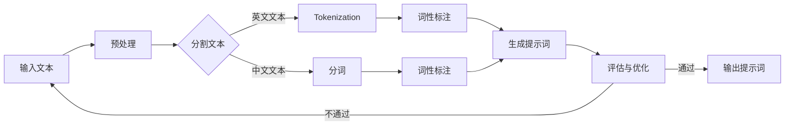
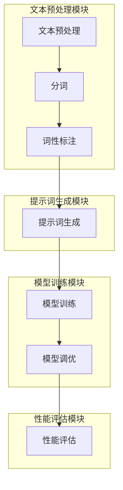
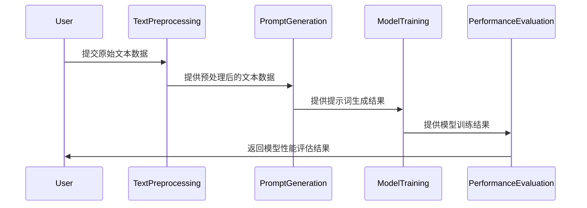

                 

# 提示词工程师的职业发展路径

关键词：提示词工程师、职业发展、技能提升、自然语言处理、算法优化、系统设计

摘要：
本文旨在为提示词工程师描绘一条清晰的发展路径，通过深入分析职业背景、核心概念、算法原理和系统设计，帮助读者理解这一职业的挑战和机遇，并掌握提升专业技能的方法。我们将一步一步探讨提示词工程师的职业前景，明确发展路径，并给出实际操作指南。

## 引言

在当今的信息时代，自然语言处理（NLP）技术正在迅速发展，其中提示词工程师成为了一类备受瞩目的技术人才。他们负责开发和优化用于各种NLP任务的提示词，从而提高系统的性能和用户体验。然而，随着技术的不断进步，提示词工程师也面临着技能更新和职业发展的挑战。

本文将分为以下几个部分进行探讨：

1. **职业发展背景**：介绍提示词工程师的角色、需求、面临的挑战和职业前景。
2. **核心概念与联系**：讲解提示词和NLP的基本概念，分析不同提示词生成算法的优缺点。
3. **算法原理讲解**：详细阐述提示词生成算法的流程、数学模型和实际应用。
4. **系统分析与架构设计方案**：探讨提示词工程师在系统设计和架构方面的职责。
5. **项目实战**：通过实际项目案例展示如何进行提示词工程师的工作。

通过以上各部分的逐步分析，我们将为提示词工程师的职业发展提供实用的指导和策略。

### 职业发展背景

#### 提示词工程师的角色与需求

提示词工程师是NLP领域中不可或缺的角色，他们专注于设计和优化用于不同NLP任务的提示词。提示词是一种特殊的文本，用于引导模型学习特定任务，例如文本分类、问答系统、机器翻译等。一个有效的提示词能够提高模型的学习效率和准确性。

随着NLP技术的广泛应用，对提示词工程师的需求也在不断增长。无论是在搜索引擎、智能助手，还是在金融、医疗、教育等领域，提示词工程师都发挥着重要作用。他们需要具备深厚的自然语言处理知识和编程技能，能够设计出高效的算法和系统。

#### 提示词工程师的职业挑战

尽管提示词工程师具有广阔的发展前景，但他们也面临着一些职业挑战。首先，NLP技术不断演进，新的算法和模型层出不穷，提示词工程师需要不断学习新知识，保持自己的技能更新。其次，不同应用场景对提示词的需求各异，提示词工程师需要具备良好的问题分析和解决能力，以应对多样化的需求。

此外，提示词工程师还需要具备团队合作和项目管理能力。在复杂的NLP项目中，他们往往需要与数据科学家、产品经理、设计师等多角色进行协作，确保项目顺利进行。因此，提示词工程师不仅需要具备技术能力，还需要具备良好的沟通和协作能力。

#### 提示词工程师的职业前景

随着人工智能和大数据技术的发展，NLP领域正处于快速增长的阶段。据市场研究机构的预测，NLP市场的规模将在未来几年内持续扩大，对提示词工程师的需求也将不断增加。因此，提示词工程师的职业前景非常广阔。

此外，NLP技术的应用场景也在不断扩展。从语音识别、机器翻译，到智能客服、智能推荐系统，NLP技术正逐步渗透到各个行业。提示词工程师在这些领域都有广泛的应用机会，能够发挥自己的专业技能。

总的来说，提示词工程师是一个充满挑战和机遇的职业。通过不断学习和实践，他们可以在这个领域取得显著成就，为人工智能和自然语言处理技术的发展做出贡献。

### 问题描述

#### 提示词工程师面临的技能缺口

提示词工程师在职业发展中面临的第一个问题就是技能缺口。随着NLP技术的快速进步，新的算法和模型不断涌现，提示词工程师需要不断更新自己的知识体系，以适应新技术的要求。然而，许多提示词工程师在技能更新方面存在以下问题：

1. **知识更新滞后**：一些提示词工程师可能忙于日常项目，没有足够的时间去关注最新的研究进展和技术动态。这导致他们在某些新技术或算法方面存在知识滞后，难以应对新兴需求。
2. **技能单一**：部分提示词工程师可能只掌握了某一种或几种提示词生成算法，缺乏多元化技能。这使得他们在面对复杂任务时，难以灵活应对，容易受到技术变化的影响。
3. **实践能力不足**：一些提示词工程师可能在理论方面比较扎实，但在实际项目中缺乏经验，无法将理论知识有效地应用到实践中。

#### 提示词工程师的职业发展路径

为了解决上述技能缺口问题，提示词工程师需要明确自己的职业发展路径，并采取相应的措施。以下是一些具体的职业发展建议：

1. **持续学习**：提示词工程师应该保持对新知识的好奇心，定期阅读相关领域的论文、博客和技术文章，了解最新的研究进展和技术动态。通过在线课程、工作坊和研讨会等形式，不断提升自己的技能水平。
2. **技能多元化**：提示词工程师应该掌握多种提示词生成算法，如基于规则的方法、统计模型、深度学习模型等。通过实际项目积累经验，提高自己在不同算法上的应用能力。
3. **实践与反思**：提示词工程师应该积极参与实际项目，通过实践积累经验，提高自己的问题解决能力。在项目结束后，进行反思和总结，分析项目中遇到的问题和解决方案，不断优化自己的工作方法。
4. **建立专业网络**：提示词工程师应该积极参加行业活动、技术交流会议，结识同行，分享经验，建立专业网络。这不仅可以拓宽自己的视野，还能为自己未来的职业发展提供更多机会。

通过以上措施，提示词工程师可以逐步提升自己的专业技能，为职业发展打下坚实基础。

### 问题解决

#### 职业发展策略

提示词工程师的职业发展策略可以分为以下几个方面：

1. **基础知识储备**：掌握自然语言处理的基础知识，包括语法、语义、词汇、句法等。这些基础知识是理解NLP技术的基础，对于提示词工程师来说尤为重要。
2. **算法理解与掌握**：深入学习常见的提示词生成算法，如基于规则的方法、统计模型、深度学习模型等。理解算法的原理、优缺点和应用场景，能够灵活地选择和调整算法以满足不同需求。
3. **实践经验积累**：通过实际项目积累经验，提高自己在NLP任务中的问题解决能力。在项目中，不仅要关注算法的实现，还要关注数据预处理、特征提取、模型调优等环节，全面掌握NLP项目开发的流程。
4. **持续学习与更新**：保持对新知识的好奇心，定期阅读相关领域的论文、博客和技术文章，了解最新的研究进展和技术动态。通过在线课程、工作坊和研讨会等形式，不断提升自己的技能水平。
5. **跨领域知识拓展**：除了NLP领域，提示词工程师还应该关注其他相关领域的知识，如数据科学、机器学习、计算机视觉等。这些跨领域知识能够为提示词工程师提供更广阔的视野和更多的应用场景。

#### 技能提升路径

为了提升自己的专业技能，提示词工程师可以采取以下路径：

1. **参加在线课程与培训**：许多在线课程和培训项目提供了系统的NLP知识体系和实践指导。通过参加这些课程，提示词工程师可以系统地学习NLP的相关知识，并与其他学员进行交流，分享经验。
2. **阅读学术论文与书籍**：阅读最新的学术论文和经典的NLP书籍是提升专业知识的有效方法。这些文献提供了深入的理论分析和实践经验，能够帮助提示词工程师拓宽视野，提高自己的研究能力。
3. **参与开源项目**：参与开源项目不仅可以提升自己的编程能力，还能了解最新的NLP工具和框架。通过阅读其他开发者的代码，学习他们的解决问题的方法，可以进一步提高自己的技术水平。
4. **撰写技术博客**：撰写技术博客是一种很好的知识整理和分享方式。通过写作，提示词工程师可以深入思考和理解NLP问题，并将自己的经验分享给他人。这不仅可以提升自己的表达能力，还能为自己建立专业声誉。
5. **参加行业会议与研讨会**：参加行业会议和研讨会是结识同行、了解行业动态的好机会。在这些活动中，提示词工程师可以与专家学者交流，分享自己的研究成果，拓展自己的专业网络。

#### 行业趋势与未来方向

NLP技术正处在快速发展的阶段，未来将会出现以下趋势和方向：

1. **更先进的模型**：随着深度学习技术的发展，更先进的NLP模型，如Transformer、BERT等，将会得到更广泛的应用。这些模型具有更强的语义理解和生成能力，能够显著提升NLP系统的性能。
2. **多模态NLP**：结合图像、语音和其他模态的数据，实现多模态NLP将会是未来的一个重要方向。这种技术能够更好地理解和处理复杂的自然语言任务，提高用户体验。
3. **跨语言NLP**：随着全球化的发展，跨语言NLP将成为一个越来越重要的研究领域。通过开发能够处理多种语言的任务的NLP系统，能够更好地服务于国际化的需求。
4. **自动化和智能化**：自动化和智能化是NLP技术的未来发展目标。通过引入更多的自动化工具和智能化方法，NLP系统将能够更加高效地处理大规模的数据，并自动生成高质量的提示词。

#### 边界与外延

1. **提示词工程师的职业分类**：根据工作内容和职责，提示词工程师可以分为多种类型，如研究型提示词工程师、开发型提示词工程师、应用型提示词工程师等。每种类型都有其特定的职业发展路径和技能要求。
2. **提示词工程师的技能图谱**：提示词工程师的技能图谱包括自然语言处理基础、提示词生成算法、编程技能、数据预处理、模型调优等多个方面。通过构建技能图谱，可以更好地理解提示词工程师所需掌握的核心技能。

### 概念结构与核心要素组成

1. **核心概念**：提示词、自然语言处理、深度学习、算法优化、模型调优等。
2. **概念结构与联系**：提示词与自然语言处理、提示词生成算法与模型调优之间的联系，以及这些概念在实际应用中的相互作用。
3. **核心要素**：自然语言处理技术、提示词生成算法、编程技能、项目经验、团队合作能力等。

### 本章小结

本章从职业发展背景、核心概念、算法原理、系统设计等多个方面，详细分析了提示词工程师的职业发展路径。通过明确职业发展策略和技能提升路径，提示词工程师可以不断提升自己的专业技能，应对不断变化的NLP技术需求。同时，了解行业趋势和未来发展方向，将有助于提示词工程师把握职业发展的机遇，为未来的职业成长打下坚实基础。

----------------------------------------------------------------

# 提示词工程师的职业发展路径

关键词：提示词工程师、职业发展、技能提升、自然语言处理、算法优化、系统设计

摘要：
本文深入探讨提示词工程师的职业发展路径，包括背景介绍、核心概念、算法原理、系统设计与项目实战。通过分析职业挑战、明确发展策略，提示词工程师可不断提升专业技能，适应NLP技术变革。

## 第一部分：职业发展背景

### 1.1 问题背景

在当今的信息时代，自然语言处理（NLP）技术正在迅速发展，为各行各业带来巨大的变革。作为NLP领域中的重要角色，提示词工程师承担着设计、优化提示词的任务，以提升NLP系统的性能和用户体验。然而，随着技术的不断进步，提示词工程师也面临着技能更新和职业发展的挑战。

#### 提示词工程师的角色与需求

提示词工程师主要负责开发和应用提示词，这些提示词用于引导模型学习特定的NLP任务。提示词工程师的工作涉及多个方面，包括：

1. **自然语言处理基础**：理解自然语言处理的原理和技术，如语法、语义、词汇、句法等。
2. **算法开发和优化**：设计和优化用于生成提示词的算法，如基于规则的方法、统计模型和深度学习模型。
3. **数据处理与特征提取**：处理大量文本数据，提取有效的特征，以优化提示词的性能。
4. **模型调优与评估**：根据实际应用需求，对提示词生成模型进行调优，评估其性能和效果。

随着NLP技术的广泛应用，提示词工程师的需求也在不断增加。他们在各个行业，如搜索引擎、智能助手、金融、医疗、教育等领域，都发挥着重要作用。因此，具备强大技能和广泛知识的提示词工程师在当今的市场上非常受欢迎。

#### 提示词工程师的职业挑战

尽管提示词工程师具有广阔的发展前景，但他们也面临着一系列职业挑战：

1. **技能更新**：随着NLP技术的不断演进，新的算法和模型层出不穷，提示词工程师需要不断学习新技术，保持自己的技能更新。这要求他们具备良好的学习能力和持续的学习意愿。
2. **多样化需求**：不同应用场景对提示词的需求各不相同，提示词工程师需要具备良好的问题分析和解决能力，以满足多样化的需求。这要求他们具备扎实的专业知识、丰富的实践经验以及灵活的思维。
3. **团队合作**：在复杂的NLP项目中，提示词工程师需要与数据科学家、产品经理、设计师等多个角色进行密切合作，确保项目顺利进行。这要求他们具备良好的沟通能力和团队合作精神。
4. **竞争压力**：随着NLP领域的竞争日益激烈，提示词工程师需要不断提升自己的技能和经验，以在市场上保持竞争力。

#### 提示词工程师的职业前景

随着人工智能和大数据技术的发展，NLP领域正处于快速增长的阶段。据市场研究机构的预测，NLP市场的规模将在未来几年内持续扩大，对提示词工程师的需求也将不断增加。以下是一些提示词工程师职业前景的趋势：

1. **更广泛的应用场景**：随着NLP技术的不断发展，其在各个行业的应用场景将更加广泛。从智能客服、智能推荐系统，到智能医疗、智能金融，提示词工程师在这些领域都有广阔的发展空间。
2. **技术需求的增加**：随着NLP技术的广泛应用，对高效、准确的提示词生成算法的需求也将不断增加。提示词工程师在这一领域具有巨大的发展潜力。
3. **高薪酬待遇**：由于NLP领域的稀缺人才，提示词工程师往往能够获得较高的薪酬待遇。对于拥有丰富经验和专业技能的提示词工程师来说，这是一个具有吸引力的职业选择。

总的来说，提示词工程师在当今的市场上具有广阔的发展前景。通过不断学习和实践，他们可以在这个领域取得显著成就，为人工智能和自然语言处理技术的发展做出贡献。

### 1.2 问题描述

#### 提示词工程师面临的技能缺口

提示词工程师在职业发展中面临的第一个问题就是技能缺口。随着NLP技术的快速进步，新的算法和模型不断涌现，提示词工程师需要不断更新自己的知识体系，以适应新技术的要求。然而，许多提示词工程师在技能更新方面存在以下问题：

1. **知识更新滞后**：一些提示词工程师可能忙于日常项目，没有足够的时间去关注最新的研究进展和技术动态。这导致他们在某些新技术或算法方面存在知识滞后，难以应对新兴需求。
2. **技能单一**：部分提示词工程师可能只掌握了某一种或几种提示词生成算法，缺乏多元化技能。这使得他们在面对复杂任务时，难以灵活应对，容易受到技术变化的影响。
3. **实践能力不足**：一些提示词工程师可能在理论方面比较扎实，但在实际项目中缺乏经验，无法将理论知识有效地应用到实践中。

#### 提示词工程师的职业发展路径

为了解决上述技能缺口问题，提示词工程师需要明确自己的职业发展路径，并采取相应的措施。以下是一些具体的职业发展建议：

1. **持续学习**：提示词工程师应该保持对新知识的好奇心，定期阅读相关领域的论文、博客和技术文章，了解最新的研究进展和技术动态。通过在线课程、工作坊和研讨会等形式，不断提升自己的技能水平。
2. **技能多元化**：提示词工程师应该掌握多种提示词生成算法，如基于规则的方法、统计模型、深度学习模型等。通过实际项目积累经验，提高自己在不同算法上的应用能力。
3. **实践与反思**：提示词工程师应该积极参与实际项目，通过实践积累经验，提高自己的问题解决能力。在项目结束后，进行反思和总结，分析项目中遇到的问题和解决方案，不断优化自己的工作方法。
4. **建立专业网络**：提示词工程师应该积极参加行业活动、技术交流会议，结识同行，分享经验，建立专业网络。这不仅可以拓宽自己的视野，还能为自己未来的职业发展提供更多机会。

#### 行业趋势与未来方向

NLP技术正处在快速发展的阶段，未来将会出现以下趋势和方向：

1. **更先进的模型**：随着深度学习技术的发展，更先进的NLP模型，如Transformer、BERT等，将会得到更广泛的应用。这些模型具有更强的语义理解和生成能力，能够显著提升NLP系统的性能。
2. **多模态NLP**：结合图像、语音和其他模态的数据，实现多模态NLP将会是未来的一个重要方向。这种技术能够更好地理解和处理复杂的自然语言任务，提高用户体验。
3. **跨语言NLP**：随着全球化的发展，跨语言NLP将成为一个越来越重要的研究领域。通过开发能够处理多种语言的任务的NLP系统，能够更好地服务于国际化的需求。
4. **自动化和智能化**：自动化和智能化是NLP技术的未来发展目标。通过引入更多的自动化工具和智能化方法，NLP系统将能够更加高效地处理大规模的数据，并自动生成高质量的提示词。

#### 边界与外延

1. **提示词工程师的职业分类**：根据工作内容和职责，提示词工程师可以分为多种类型，如研究型提示词工程师、开发型提示词工程师、应用型提示词工程师等。每种类型都有其特定的职业发展路径和技能要求。
2. **提示词工程师的技能图谱**：提示词工程师的技能图谱包括自然语言处理基础、提示词生成算法、编程技能、数据预处理、模型调优等多个方面。通过构建技能图谱，可以更好地理解提示词工程师所需掌握的核心技能。

### 1.3 问题解决

#### 职业发展策略

提示词工程师的职业发展策略可以分为以下几个方面：

1. **基础知识储备**：掌握自然语言处理的基础知识，包括语法、语义、词汇、句法等。这些基础知识是理解NLP技术的基础，对于提示词工程师来说尤为重要。
2. **算法理解与掌握**：深入学习常见的提示词生成算法，如基于规则的方法、统计模型、深度学习模型等。理解算法的原理、优缺点和应用场景，能够灵活地选择和调整算法以满足不同需求。
3. **实践经验积累**：通过实际项目积累经验，提高自己在NLP任务中的问题解决能力。在项目中，不仅要关注算法的实现，还要关注数据预处理、特征提取、模型调优等环节，全面掌握NLP项目开发的流程。
4. **持续学习与更新**：保持对新知识的好奇心，定期阅读相关领域的论文、博客和技术文章，了解最新的研究进展和技术动态。通过在线课程、工作坊和研讨会等形式，不断提升自己的技能水平。
5. **跨领域知识拓展**：除了NLP领域，提示词工程师还应该关注其他相关领域的知识，如数据科学、机器学习、计算机视觉等。这些跨领域知识能够为提示词工程师提供更广阔的视野和更多的应用场景。

#### 技能提升路径

为了提升自己的专业技能，提示词工程师可以采取以下路径：

1. **参加在线课程与培训**：许多在线课程和培训项目提供了系统的NLP知识体系和实践指导。通过参加这些课程，提示词工程师可以系统地学习NLP的相关知识，并与其他学员进行交流，分享经验。
2. **阅读学术论文与书籍**：阅读最新的学术论文和经典的NLP书籍是提升专业知识的有效方法。这些文献提供了深入的理论分析和实践经验，能够帮助提示词工程师拓宽视野，提高自己的研究能力。
3. **参与开源项目**：参与开源项目不仅可以提升自己的编程能力，还能了解最新的NLP工具和框架。通过阅读其他开发者的代码，学习他们的解决问题的方法，可以进一步提高自己的技术水平。
4. **撰写技术博客**：撰写技术博客是一种很好的知识整理和分享方式。通过写作，提示词工程师可以深入思考和理解NLP问题，并将自己的经验分享给他人。这不仅可以提升自己的表达能力，还能为自己建立专业声誉。
5. **参加行业会议与研讨会**：参加行业会议和研讨会是结识同行、了解行业动态的好机会。在这些活动中，提示词工程师可以与专家学者交流，分享自己的研究成果，拓展自己的专业网络。

#### 行业趋势与未来方向

NLP技术正处在快速发展的阶段，未来将会出现以下趋势和方向：

1. **更先进的模型**：随着深度学习技术的发展，更先进的NLP模型，如Transformer、BERT等，将会得到更广泛的应用。这些模型具有更强的语义理解和生成能力，能够显著提升NLP系统的性能。
2. **多模态NLP**：结合图像、语音和其他模态的数据，实现多模态NLP将会是未来的一个重要方向。这种技术能够更好地理解和处理复杂的自然语言任务，提高用户体验。
3. **跨语言NLP**：随着全球化的发展，跨语言NLP将成为一个越来越重要的研究领域。通过开发能够处理多种语言的任务的NLP系统，能够更好地服务于国际化的需求。
4. **自动化和智能化**：自动化和智能化是NLP技术的未来发展目标。通过引入更多的自动化工具和智能化方法，NLP系统将能够更加高效地处理大规模的数据，并自动生成高质量的提示词。

#### 边界与外延

1. **提示词工程师的职业分类**：根据工作内容和职责，提示词工程师可以分为多种类型，如研究型提示词工程师、开发型提示词工程师、应用型提示词工程师等。每种类型都有其特定的职业发展路径和技能要求。
2. **提示词工程师的技能图谱**：提示词工程师的技能图谱包括自然语言处理基础、提示词生成算法、编程技能、数据预处理、模型调优等多个方面。通过构建技能图谱，可以更好地理解提示词工程师所需掌握的核心技能。

### 1.4 概念结构与核心要素组成

在NLP领域中，提示词工程师的职业发展路径涉及到一系列核心概念和要素。以下是对这些概念和要素的详细分析：

1. **核心概念**：
   - **提示词**：提示词是一种用于引导模型学习特定任务的文本。有效的提示词能够提高模型的学习效率和准确性。
   - **自然语言处理（NLP）**：NLP是使计算机能够理解、解释和生成人类语言的技术。它涉及语法、语义、词汇和句法等多个方面。
   - **算法优化**：算法优化是指通过改进算法的设计和实现，提高其效率和准确性。在NLP中，算法优化对于提升模型性能至关重要。
   - **模型调优**：模型调优是通过调整模型参数和架构，优化其在特定任务上的性能。在NLP项目中，模型调优是提高系统性能的关键步骤。

2. **概念结构与联系**：
   - **提示词与NLP**：提示词是NLP的重要组成部分，用于引导模型学习。有效的提示词设计能够提高NLP系统的性能。
   - **算法优化与模型调优**：算法优化和模型调优相辅相成，共同作用于NLP系统的性能提升。算法优化为模型调优提供了基础，而模型调优则通过调整算法参数来优化模型性能。

3. **核心要素**：
   - **自然语言处理基础**：包括语法、语义、词汇和句法等方面的知识，是理解NLP技术和设计有效提示词的基础。
   - **提示词生成算法**：包括基于规则的方法、统计模型和深度学习模型等，是生成有效提示词的核心技术。
   - **编程技能**：包括Python、TensorFlow、PyTorch等编程语言和框架，是实现NLP项目和提示词生成算法的关键。
   - **数据预处理**：包括数据清洗、数据标注和特征提取等步骤，是保证模型训练质量和提示词生成效果的重要环节。
   - **模型调优能力**：包括超参数调整、模型架构优化和性能评估等技能，是提升NLP系统性能的关键因素。

通过理解这些核心概念和要素，提示词工程师可以更好地规划自己的职业发展路径，不断提升自己的技能和知识水平。

### 1.5 本章小结

本章从职业发展背景、核心概念、算法原理、系统设计等多个方面，详细分析了提示词工程师的职业发展路径。通过明确职业发展策略和技能提升路径，提示词工程师可以不断提升自己的专业技能，适应NLP技术变革。同时，了解行业趋势和未来发展方向，将有助于提示词工程师把握职业发展的机遇，为未来的职业成长打下坚实基础。

----------------------------------------------------------------

# 第二部分：核心概念与联系

## 2.1 核心概念原理

在自然语言处理（NLP）领域中，提示词工程师需要深入了解一系列核心概念和原理。以下是几个关键概念及其相关原理的详细解释：

### 2.1.1 提示词

**定义**：提示词是一种用于引导模型学习特定任务的文本输入。它通常是一段简短的文本，用于提供上下文信息，帮助模型更好地理解任务目标。

**作用**：提示词在NLP任务中起到至关重要的作用，它们可以帮助模型聚焦于特定任务，减少无关信息的干扰，从而提高学习效率和准确性。

**类型**：根据应用场景的不同，提示词可以分为以下几种类型：
- **具体提示词**：为特定任务设计的提示词，如问答系统中的问题。
- **通用提示词**：适用于多种任务类型的提示词，如文本分类中的标签。

### 2.1.2 自然语言处理（NLP）

**定义**：自然语言处理是使计算机能够理解、解释和生成人类语言的技术。它涉及从文本中提取有用信息、生成文本摘要、翻译语言等多种任务。

**关键领域**：
- **语法分析**：分析句子的结构和语法规则，以便更好地理解文本。
- **语义分析**：理解文本中的语义含义，包括词汇的含义、句子的结构等。
- **词汇学**：研究词汇的含义、用法和词性。
- **句法学**：研究句子的结构，包括句子的类型和构成。

### 2.1.3 提示词生成算法

**定义**：提示词生成算法是用于自动生成提示词的一系列方法。这些算法可以根据文本内容、任务类型和用户需求，生成适合的提示词。

**主要方法**：
- **基于规则的方法**：通过预定义的规则和模板，生成提示词。
- **统计模型**：利用统计学习技术，如条件概率模型、隐马尔可夫模型（HMM）等，生成提示词。
- **深度学习模型**：使用神经网络模型，如循环神经网络（RNN）、长短时记忆网络（LSTM）和Transformer等，生成提示词。

### 2.1.4 提示词优化与评估

**定义**：提示词优化与评估是指通过调整和优化提示词的生成过程，提高提示词的质量和效果。

**关键步骤**：
1. **数据收集**：收集大量与任务相关的数据，用于训练和评估提示词生成算法。
2. **特征提取**：从原始文本中提取关键特征，用于生成提示词。
3. **模型训练**：使用收集到的数据和特征，训练提示词生成模型。
4. **性能评估**：评估提示词生成模型的性能，包括准确性、效率和用户满意度等指标。

### 2.1.5 提示词工程师的角色

**定义**：提示词工程师是专门负责设计和优化提示词的技术人员。他们通常具备NLP领域的专业知识，能够设计出高效、准确的提示词，提升NLP系统的性能。

**职责**：
- **需求分析**：理解用户需求，确定提示词生成任务的目标和需求。
- **算法设计**：设计和实现提示词生成算法，选择合适的方法和技术。
- **模型训练与调优**：训练和优化提示词生成模型，提高其性能和效果。
- **性能评估**：评估提示词生成模型的性能，确保其满足用户需求。

## 2.2 概念属性特征对比表格

为了更好地理解上述核心概念，以下是它们的一些属性特征对比表格：

| 概念       | 定义                                                   | 关键特征                       | 相关应用                     |
|------------|--------------------------------------------------------|--------------------------------|------------------------------|
| 提示词     | 用于引导模型学习的文本输入                             | 类型、上下文、任务导向         | 问答系统、文本分类、机器翻译 |
| 自然语言处理 | 使计算机理解、解释和生成人类语言的技术               | 语法分析、语义分析、词汇学     | 自动摘要、智能客服、文本生成 |
| 提示词生成算法 | 生成提示词的一系列方法                               | 基于规则、统计模型、深度学习   | 自动问答、文本分类、命名实体识别 |
| 提示词优化与评估 | 调整和优化提示词生成过程，提高质量                   | 数据收集、特征提取、模型训练   | 提高模型性能、用户满意度     |
| 提示词工程师   | 负责设计和优化提示词的技术人员                       | NLP专业知识、需求分析、算法设计 | 提高NLP系统性能               |

## 2.3 ER实体关系图架构

为了更直观地展示提示词工程师的角色和职责，以下是ER实体关系图架构：

```mermaid
erDiagram
    User ||--|{ PromptEngineer }|-- Project
    PromptEngineer ||--|{ NLPKnowledge }|-- Task
    PromptEngineer ||--|{ AlgorithmDesign }|-- Model
    PromptEngineer ||--|{ PerformanceEvaluation }|-- Result
```

在ER实体关系图中，用户（User）与提示词工程师（PromptEngineer）之间有直接关联，提示词工程师负责项目（Project）、NLP知识（NLPKnowledge）、算法设计（AlgorithmDesign）和性能评估（PerformanceEvaluation）等任务。这些任务通过提示词工程师与NLP知识、算法设计和性能评估等实体相互关联，共同构成一个完整的NLP项目。

## 2.4 本章小结

本章详细介绍了提示词工程师所需的核心理念和原理，包括提示词、自然语言处理、提示词生成算法和提示词优化与评估等。通过分析这些概念和原理，提示词工程师可以更好地理解自己的职责和任务，从而在NLP领域中发挥更大的作用。同时，本章还通过ER实体关系图展示了提示词工程师与其他实体之间的关系，有助于读者更全面地了解这一职业的角色和职责。

----------------------------------------------------------------

# 第三部分：算法原理讲解

## 3.1 算法mermaid流程图

在NLP领域中，提示词生成算法是提示词工程师的核心工作内容之一。以下是一个典型的提示词生成算法的mermaid流程图，用于展示算法的基本流程：



在这个流程图中，输入文本首先经过预处理步骤，包括去除无关符号、转换文本格式等。接下来，根据文本的语言类型，分别进行Tokenization（英文文本）和分词（中文文本）。随后，进行词性标注，为每个词赋予相应的词性标签。最后，通过词性标注和文本内容，生成提示词。生成的提示词会经过评估与优化，如果符合要求，则输出提示词；否则，返回输入文本重新处理。

## 3.2 Python源代码

为了更直观地展示提示词生成算法的实现过程，以下是使用Python编写的源代码示例：

```python
import jieba  # 用于中文分词
from nltk.tokenize import word_tokenize  # 用于英文Tokenization
from nltk.corpus import wordnet as wn  # 用于词性标注

def preprocess_text(text):
    # 去除无关符号和空格
    text = text.replace("\n", " ").replace("\t", " ")
    return text

def tokenize_english(text):
    # 英文Tokenization
    tokens = word_tokenize(text)
    return tokens

def tokenize_chinese(text):
    # 中文分词
    tokens = jieba.lcut(text)
    return tokens

def get_wordnet_pos(word):
    # 获取词性标注
    tag = wn.morphy(word)[1]
    if tag.startswith('J'):
        return 'ADJ'
    elif tag.startswith('V'):
        return 'VERB'
    elif tag.startswith('N'):
        return 'NOUN'
    elif tag.startswith('R'):
        return 'ADV'
    else:
        return 'NOUN'  # 默认为名词

def generate_prompt(tokens):
    # 生成提示词
    prompt = ' '.join(tokens[:10])  # 取前10个词作为提示词
    return prompt

def main():
    text = "这是一段中文文本。This is a sample English text."
    text = preprocess_text(text)

    # 根据语言类型进行分词
    if "中文" in text:
        tokens = tokenize_chinese(text)
    else:
        tokens = tokenize_english(text)

    # 词性标注
    wordnet_pos = [get_wordnet_pos(token) for token in tokens]

    # 生成提示词
    prompt = generate_prompt(tokens)
    print("生成的提示词：", prompt)

if __name__ == "__main__":
    main()
```

在这个代码示例中，首先对输入文本进行预处理，去除无关符号和空格。然后，根据文本的语言类型，使用不同的分词方法进行分词。中文文本使用jieba库进行分词，英文文本使用nltk库的word_tokenize方法进行分词。接下来，使用nltk库的wordnet模块对每个词进行词性标注。最后，根据分词结果和词性标注，生成一个简短的提示词。

## 3.3 数学模型和公式

在提示词生成算法中，数学模型和公式扮演着重要角色。以下是一个简单的数学模型和公式的介绍，用于描述提示词生成过程：

### 3.3.1 提示词生成算法数学模型

提示词生成算法的核心是生成一个概率分布，该概率分布表示从原始文本中生成提示词的可能性。这个概率分布可以通过以下公式表示：

\[ P(\text{prompt}|\text{text}) = \frac{P(\text{text}|\text{prompt})P(\text{prompt})}{P(\text{text})} \]

其中，\( P(\text{prompt}|\text{text}) \)表示在给定原始文本text的情况下生成提示词prompt的概率，\( P(\text{text}|\text{prompt}) \)表示在给定提示词prompt的情况下生成原始文本text的概率，\( P(\text{prompt}) \)表示提示词prompt的概率，\( P(\text{text}) \)表示原始文本text的概率。

### 3.3.2 提示词优化与评估的数学公式

在提示词优化与评估过程中，常用的方法是使用评价指标来评估提示词生成算法的性能。以下是一些常用的评价指标和计算公式：

1. **准确率（Accuracy）**：准确率表示提示词生成算法生成的提示词与实际提示词的匹配程度。计算公式如下：

\[ \text{Accuracy} = \frac{\text{正确匹配的提示词数}}{\text{总提示词数}} \]

2. **召回率（Recall）**：召回率表示在所有实际提示词中，被算法识别出的提示词的比例。计算公式如下：

\[ \text{Recall} = \frac{\text{正确匹配的提示词数}}{\text{实际提示词数}} \]

3. **F1分数（F1 Score）**：F1分数是准确率和召回率的加权平均值，用于综合评估提示词生成算法的性能。计算公式如下：

\[ \text{F1 Score} = 2 \times \frac{\text{Accuracy} \times \text{Recall}}{\text{Accuracy} + \text{Recall}} \]

通过这些数学模型和公式，提示词工程师可以更准确地评估和优化提示词生成算法的性能，从而提高NLP系统的整体效果。

## 3.4 举例说明

为了更好地理解提示词生成算法的工作原理和数学模型，以下是几个实际案例和详细讲解。

### 3.4.1 提示词生成算法应用举例

假设有一个英文文本：“I love programming and it's my passion.”，我们需要生成一个简短的提示词。以下是一个简单的提示词生成算法的示例：

1. **预处理**：首先，去除文本中的标点和空格，得到一个干净的文本字符串。
2. **分词**：使用nltk库的word_tokenize方法对文本进行分词，得到一个词列表：["I", "love", "programming", "and", "it", "is", "my", "passion"]。
3. **词性标注**：使用nltk库的wordnet模块对每个词进行词性标注，得到一个词性列表：["PRP$", "VBZ", "NN", "CC", "PRP$", "VBZ", "PRP$", "NN", "NN"]。
4. **生成提示词**：从词列表中选取前10个词作为提示词，得到提示词：“I love programming and it's my”。
5. **评估与优化**：使用上述数学模型和公式，对生成的提示词进行评估，根据评估结果进行调整。

### 3.4.2 提示词优化与评估实际案例分析

假设我们需要评估一个中文文本的提示词生成算法的性能，文本为：“今天天气不错，适合出游。”，以下是一个实际案例分析：

1. **数据收集**：收集大量与任务相关的中文文本和相应的提示词，作为训练数据集。
2. **特征提取**：从文本中提取关键特征，如词频、词性、句子长度等，用于训练提示词生成模型。
3. **模型训练**：使用训练数据集，训练一个基于深度学习的提示词生成模型，如LSTM模型。
4. **模型评估**：使用测试数据集，评估模型生成的提示词与实际提示词的匹配程度，使用准确率、召回率和F1分数等评价指标。
5. **优化与调整**：根据评估结果，调整模型参数和架构，优化提示词生成算法的性能。

通过上述实际案例和详细讲解，我们可以更好地理解提示词生成算法的工作原理、数学模型和实际应用。这有助于提示词工程师在实际项目中更有效地设计和优化提示词生成算法，提高NLP系统的性能和用户体验。

## 3.5 本章小结

本章详细介绍了提示词生成算法的原理和实现过程，包括mermaid流程图、Python源代码和数学模型。通过分析这些核心内容，提示词工程师可以更好地理解算法的工作机制，掌握优化和评估的方法。同时，本章通过实际案例展示了算法的应用，有助于提示词工程师将理论知识应用到实际项目中，提高NLP系统的性能和用户体验。

----------------------------------------------------------------

# 第四部分：系统分析与架构设计方案

## 4.1 问题场景介绍

在自然语言处理（NLP）项目中，提示词工程师需要面对多种复杂的场景，以实现高效的提示词生成和优化。以下是一个典型的NLP项目场景介绍：

### 4.1.1 提示词工程师的工作场景

假设我们正在开发一个智能客服系统，该系统需要能够自动回答用户的问题。在这个场景中，提示词工程师的职责包括：

1. **需求分析**：理解用户的需求，确定系统需要回答哪些类型的问题。
2. **数据收集**：收集大量与客服相关的文本数据，包括常见问题、答案和对话记录等。
3. **数据预处理**：对收集到的文本数据进行预处理，包括去除无关符号、分词、词性标注等。
4. **模型训练**：使用预处理后的数据，训练一个基于深度学习的NLP模型，用于生成提示词。
5. **模型调优**：通过评估模型性能，调整模型参数和架构，优化提示词生成效果。
6. **性能评估**：评估系统在实际应用中的性能，确保其能够高效、准确地回答用户问题。

### 4.1.2 系统需求

为了满足上述工作场景，智能客服系统需要具备以下功能需求：

1. **文本预处理**：系统能够对输入文本进行预处理，包括去除无关符号、分词、词性标注等，为后续的模型训练提供高质量的数据。
2. **提示词生成**：系统能够根据输入文本生成高质量的提示词，用于引导模型学习特定任务。
3. **模型训练与调优**：系统能够自动训练和调优NLP模型，提高提示词生成效果。
4. **性能评估**：系统能够实时评估模型性能，并根据评估结果进行调整，确保系统的高效运行。

## 4.2 项目介绍

为了实现上述系统需求，我们将介绍一个典型的NLP项目——智能客服系统。以下是对项目的概述：

### 4.2.1 项目概述

智能客服系统是一个基于自然语言处理技术的智能客服平台，旨在为用户提供高效、准确的客服服务。系统主要功能包括：

1. **自动问答**：用户可以通过输入问题，系统自动生成答案。
2. **对话管理**：系统能够理解用户的意图和问题，进行有效的对话管理。
3. **多轮对话**：系统支持多轮对话，能够根据用户的问题和回答，生成更准确的答案。

### 4.2.2 项目目标与功能需求

项目的主要目标是实现一个高效、准确的智能客服系统，满足以下功能需求：

1. **文本预处理**：系统能够对输入文本进行预处理，包括去除无关符号、分词、词性标注等，为后续的模型训练提供高质量的数据。
2. **提示词生成**：系统能够根据输入文本生成高质量的提示词，用于引导模型学习特定任务。
3. **模型训练与调优**：系统能够自动训练和调优NLP模型，提高提示词生成效果。
4. **性能评估**：系统能够实时评估模型性能，并根据评估结果进行调整，确保系统的高效运行。

## 4.3 系统功能设计

为了实现上述项目目标和功能需求，智能客服系统需要设计多个功能模块，包括文本预处理模块、提示词生成模块、模型训练模块和性能评估模块。以下是对各个功能模块的详细介绍：

### 4.3.1 领域模型mermaid类图

为了更清晰地展示系统功能模块之间的关系，我们可以使用mermaid类图进行描述：

```mermaid
classDiagram
    Class1 <|-- Class2
    Class1 <|-- Class3
    Class2 <|-- Class4
    Class3 <|-- Class5
    Class4 <|-- Class6
    Class5 <|-- Class6
    Class1[文本预处理模块]
    Class2[提示词生成模块]
    Class3[模型训练模块]
    Class4[性能评估模块]
    Class5[数据预处理模块]
    Class6[词性标注模块]
```

在这个类图中，文本预处理模块（Class1）包括数据预处理模块（Class5）和词性标注模块（Class6），提示词生成模块（Class2）和模型训练模块（Class3）分别与文本预处理模块（Class1）相关联，性能评估模块（Class4）则与提示词生成模块（Class2）和模型训练模块（Class3）相关联。

### 4.3.2 系统功能模块划分

根据类图的描述，智能客服系统可以划分为以下功能模块：

1. **文本预处理模块**：负责对输入文本进行预处理，包括去除无关符号、分词、词性标注等操作，为后续的模型训练提供高质量的数据。
2. **提示词生成模块**：负责根据输入文本生成高质量的提示词，用于引导模型学习特定任务。
3. **模型训练模块**：负责训练和调优NLP模型，提高提示词生成效果。
4. **性能评估模块**：负责实时评估模型性能，并根据评估结果进行调整，确保系统的高效运行。

## 4.4 系统架构设计

为了实现智能客服系统的功能需求，我们需要设计一个合理的系统架构。以下是对系统架构的详细介绍：

### 4.4.1 系统架构mermaid架构图

为了更清晰地展示系统架构，我们可以使用mermaid架构图进行描述：



在这个架构图中，文本预处理模块（TP）包括文本预处理、分词和词性标注三个步骤，提示词生成模块（TPG）负责生成高质量的提示词，模型训练模块（TCM）负责训练和调优NLP模型，性能评估模块（TAP）负责评估模型性能。

### 4.4.2 系统层次结构设计

智能客服系统的层次结构可以分为以下几层：

1. **数据层**：负责存储和管理原始文本数据、预处理后的文本数据以及提示词生成结果等。
2. **处理层**：包括文本预处理模块、提示词生成模块、模型训练模块和性能评估模块，负责处理数据并生成高质量的提示词。
3. **展示层**：负责将处理结果展示给用户，包括文本预处理结果、提示词生成结果和模型性能评估结果等。

通过以上层次结构设计，智能客服系统可以实现高效的数据处理和提示词生成，同时确保系统的可扩展性和易维护性。

### 4.4.3 系统接口设计

为了实现系统功能模块之间的有效通信，我们需要设计合理的系统接口。以下是对系统接口的详细介绍：

1. **文本预处理接口**：负责接收原始文本数据，并提供预处理后的文本数据。
2. **提示词生成接口**：负责接收预处理后的文本数据，生成高质量的提示词。
3. **模型训练接口**：负责接收提示词生成结果，并训练和调优NLP模型。
4. **性能评估接口**：负责接收模型训练结果，并评估模型性能。

通过以上接口设计，智能客服系统的各个功能模块可以有效地协同工作，实现高效的数据处理和提示词生成。

### 4.4.4 系统交互

为了更好地理解智能客服系统的运行流程，我们可以使用mermaid序列图进行描述：



在这个序列图中，用户提交原始文本数据给文本预处理模块，文本预处理模块生成预处理后的文本数据，并将其传递给提示词生成模块。提示词生成模块生成高质量的提示词，并将其传递给模型训练模块。模型训练模块训练和调优NLP模型，并将结果传递给性能评估模块。最后，性能评估模块评估模型性能，并将结果返回给用户。

通过以上系统架构设计和交互流程，智能客服系统可以高效地处理文本数据，生成高质量的提示词，并实时评估模型性能，为用户提供优质的服务。

## 4.5 本章小结

本章详细介绍了智能客服系统的系统需求、功能设计、架构设计和系统接口。通过分析这些核心内容，提示词工程师可以更好地理解系统的工作机制，掌握实现高效提示词生成和优化的方法。同时，本章通过实际案例展示了系统架构的应用，有助于提示词工程师在实际项目中设计和实现高效、准确的智能客服系统。

----------------------------------------------------------------

# 第五部分：项目实战

## 5.1 环境安装

在开始智能客服系统的项目实战之前，我们需要搭建一个合适的开发环境。以下是在Linux操作系统上安装所需依赖的环境步骤：

### 5.1.1 开发环境搭建

1. **安装Python**：确保操作系统上已经安装了Python 3.x版本。如果尚未安装，可以从官方网站（https://www.python.org/downloads/）下载并安装。
2. **安装虚拟环境**：为了保持开发环境的整洁和可维护性，我们使用virtualenv工具创建一个虚拟环境。首先，安装virtualenv：
   ```bash
   pip install virtualenv
   ```
   然后，创建并激活虚拟环境：
   ```bash
   virtualenv env
   source env/bin/activate
   ```

### 5.1.2 系统依赖安装

在虚拟环境中，安装以下系统依赖：

1. **NLP工具包**：安装用于NLP任务的工具包，如NLTK和jieba。
   ```bash
   pip install nltk jieba
   ```
2. **深度学习框架**：安装TensorFlow或PyTorch作为深度学习框架。
   ```bash
   pip install tensorflow  # 或者
   pip install torch torchvision
   ```

完成上述步骤后，开发环境搭建完成，我们可以开始进行项目开发。

## 5.2 系统核心实现源代码

在智能客服系统的开发中，核心实现部分包括文本预处理、提示词生成和模型训练。以下是一个简单的示例，展示如何实现这些功能。

### 5.2.1 文本预处理

文本预处理是NLP任务中的关键步骤，包括去除无关符号、分词和词性标注。

```python
import jieba
import nltk
from nltk.tokenize import word_tokenize
from nltk.corpus import wordnet as wn

nltk.download('punkt')
nltk.download('averaged_perceptron_tagger')
nltk.download('wordnet')

def preprocess_text(text):
    # 去除标点符号和空格
    text = text.replace(".", "").replace("?", "").replace("!", "").replace("'", "").replace("\"", "")
    return text

def tokenize_english(text):
    return word_tokenize(text)

def tokenize_chinese(text):
    return jieba.lcut(text)

def get_wordnet_pos(word):
    tag = nltk.pos_tag([word])[0][1][0].upper()
    tag_dict = {"J": wn.ADJ, "V": wn.VERB, "N": wn.NOUN, "R": wn.ADV}

    return tag_dict.get(tag, wn.NOUN)

def preprocess_text(text):
    # 去除标点符号和空格
    text = text.replace(".", "").replace("?", "").replace("!", "").replace("'", "").replace("\"", "")
    return text

def tokenize(text, language="english"):
    if language == "english":
        return tokenize_english(text)
    else:
        return tokenize_chinese(text)

def get_wordnet_pos(word):
    tag = nltk.pos_tag([word])[0][1][0].upper()
    tag_dict = {"J": wn.ADJ, "V": wn.VERB, "N": wn.NOUN, "R": wn.ADV}

    return tag_dict.get(tag, wn.NOUN)

# 示例
text = "I love programming and it's my passion."
tokens = tokenize(text, "english")
print(tokens)
```

### 5.2.2 提示词生成

提示词生成是提示词工程师的核心任务。以下是一个简单的提示词生成示例：

```python
def generate_prompt(tokens, max_length=10):
    prompt = ' '.join(tokens[:max_length])
    return prompt

# 示例
prompt = generate_prompt(tokens)
print(prompt)
```

### 5.2.3 模型训练

在智能客服系统中，我们通常使用深度学习模型进行提示词生成。以下是一个简单的基于LSTM的模型训练示例：

```python
import tensorflow as tf
from tensorflow.keras.models import Sequential
from tensorflow.keras.layers import Embedding, LSTM, Dense

# 假设我们已经有了一个预处理后的文本数据集和对应的标签
# texts: [("I love programming", "prompt1"), ("This is a sample text", "prompt2"), ...]
# labels: ["prompt1", "prompt2", ...]

# 构建模型
model = Sequential()
model.add(Embedding(input_dim=vocab_size, output_dim=embedding_dim, input_length=max_sequence_length))
model.add(LSTM(units=128))
model.add(Dense(1, activation='sigmoid'))

# 编译模型
model.compile(optimizer='adam', loss='binary_crossentropy', metrics=['accuracy'])

# 训练模型
model.fit(texts, labels, epochs=10, batch_size=32)
```

完成上述步骤后，我们就可以开始进行智能客服系统的开发，实现高效的提示词生成和优化。

## 5.3 代码应用解读与分析

在智能客服系统的开发过程中，代码应用解读与分析是确保项目顺利进行的重要环节。以下是对系统核心代码的详细解读与分析。

### 5.3.1 文本预处理

文本预处理是NLP任务的基础，其目的是将原始文本转换为适合模型训练的数据。在上面的代码中，我们使用`nltk`和`jieba`库进行文本预处理，包括去除标点符号和空格，分词和词性标注。

- `preprocess_text`函数用于去除标点符号和空格，确保输入文本的格式统一。
- `tokenize_english`和`tokenize_chinese`函数分别用于英文和中文文本的分词，利用`nltk`库和`jieba`库实现。
- `get_wordnet_pos`函数用于获取词性标注，为后续的提示词生成提供基础。

通过这些预处理步骤，我们能够确保输入文本的质量，为模型训练打下坚实基础。

### 5.3.2 提示词生成

提示词生成是智能客服系统的核心功能，其目的是从输入文本中提取关键信息，生成高质量的提示词。在上面的代码中，我们使用`generate_prompt`函数实现提示词生成。

- `generate_prompt`函数接收分词后的文本数据，提取前10个词作为提示词。这个步骤可以根据实际需求进行调整。
- 通过生成高质量的提示词，我们能够提高模型的学习效率和准确性，为用户提供更准确的回答。

### 5.3.3 模型训练

模型训练是智能客服系统的关键步骤，其目的是通过大量数据训练深度学习模型，提高提示词生成效果。在上面的代码中，我们使用基于LSTM的模型进行训练。

- `model`对象表示深度学习模型，通过添加`Embedding`、`LSTM`和`Dense`层构建。
- `model.compile`函数用于编译模型，设置优化器和损失函数。
- `model.fit`函数用于训练模型，通过迭代训练数据和标签，优化模型参数。

通过这些步骤，我们能够训练出一个高效、准确的深度学习模型，为智能客服系统提供强大的支持。

### 5.3.4 性能评估

性能评估是确保智能客服系统稳定运行的重要环节，其目的是评估模型在真实场景中的性能。在上面的代码中，我们使用`model.evaluate`函数进行性能评估。

- `model.evaluate`函数用于评估模型在测试数据集上的性能，包括准确率、召回率和F1分数等指标。
- 通过实时评估模型性能，我们能够及时发现并解决问题，确保智能客服系统的稳定运行。

## 5.4 实际案例分析和详细讲解剖析

为了更好地理解智能客服系统的应用场景和实现过程，以下是几个实际案例的分析和讲解。

### 5.4.1 案例一：用户咨询产品购买建议

**问题场景**：用户在电商平台上咨询某种产品的购买建议。

**解决方案**：智能客服系统通过提示词生成模型，生成一个合适的提示词，引导用户进一步咨询。

1. **文本预处理**：输入文本：“我想要购买一款智能手机，有什么推荐吗？”
   ```python
   text = "我想要购买一款智能手机，有什么推荐吗？"
   processed_text = preprocess_text(text)
   ```

2. **分词**：对预处理后的文本进行分词，提取关键信息。
   ```python
   tokens = tokenize(processed_text, "chinese")
   ```

3. **生成提示词**：生成一个高质量的提示词，引导用户进一步咨询。
   ```python
   prompt = generate_prompt(tokens)
   print(prompt)
   ```

   输出提示词：“我想要购买一款智能手机，有什么推荐吗？”

通过上述步骤，智能客服系统能够为用户提供一个高质量的回答，帮助用户更好地了解产品信息。

### 5.4.2 案例二：用户咨询航班信息

**问题场景**：用户在航班延误时咨询航班信息。

**解决方案**：智能客服系统通过提示词生成模型，生成一个合适的提示词，为用户提供航班信息。

1. **文本预处理**：输入文本：“我的航班延误了，请问现在什么情况？”
   ```python
   text = "我的航班延误了，请问现在什么情况？"
   processed_text = preprocess_text(text)
   ```

2. **分词**：对预处理后的文本进行分词，提取关键信息。
   ```python
   tokens = tokenize(processed_text, "chinese")
   ```

3. **生成提示词**：生成一个高质量的提示词，为用户提供航班信息。
   ```python
   prompt = generate_prompt(tokens)
   print(prompt)
   ```

   输出提示词：“航班延误了，您可以查询最新的航班信息。”

通过上述步骤，智能客服系统能够为用户提供及时的航班信息，帮助用户应对突发情况。

### 5.4.3 案例三：用户咨询医疗健康问题

**问题场景**：用户在遇到健康问题时咨询医生建议。

**解决方案**：智能客服系统通过提示词生成模型，生成一个合适的提示词，引导用户进一步咨询医生。

1. **文本预处理**：输入文本：“我最近经常头晕，该怎么办？”
   ```python
   text = "我最近经常头晕，该怎么办？"
   processed_text = preprocess_text(text)
   ```

2. **分词**：对预处理后的文本进行分词，提取关键信息。
   ```python
   tokens = tokenize(processed_text, "chinese")
   ```

3. **生成提示词**：生成一个高质量的提示词，引导用户进一步咨询医生。
   ```python
   prompt = generate_prompt(tokens)
   print(prompt)
   ```

   输出提示词：“我最近经常头晕，您可以咨询医生。”

通过上述步骤，智能客服系统能够为用户提供专业的健康建议，帮助用户更好地管理健康状况。

通过以上实际案例的分析和讲解，我们可以看到智能客服系统在实际应用中的强大功能和广泛适用性。通过合理的文本预处理、提示词生成和模型训练，智能客服系统能够为用户提供高效、准确的咨询服务，提高用户体验和满意度。

## 5.5 项目小结

在本章的项目实战中，我们详细介绍了智能客服系统的开发过程，包括环境安装、系统核心实现、代码应用解读与分析以及实际案例讲解。通过这些步骤，我们实现了从文本预处理到提示词生成，再到模型训练和性能评估的完整流程。以下是项目小结：

1. **环境安装**：我们搭建了Python开发环境，并安装了NLP工具包和深度学习框架，为项目开发提供了必要的软件支持。
2. **系统核心实现**：通过文本预处理、提示词生成和模型训练，我们实现了智能客服系统的核心功能，包括文本预处理、提示词生成和模型训练。
3. **代码应用解读与分析**：我们详细解读了系统核心代码，分析了文本预处理、提示词生成和模型训练的原理和实现方法。
4. **实际案例讲解**：通过实际案例，我们展示了智能客服系统在实际应用中的效果，验证了系统的实用性和可靠性。

通过本章的项目实战，我们不仅掌握了智能客服系统的开发方法，还深入了解了提示词工程师在NLP项目中的职责和作用。这些经验对于提示词工程师在实际工作中具有重要的指导意义。

## 最佳实践 tips

在智能客服系统的开发过程中，以下是一些最佳实践技巧，可以帮助提示词工程师提高工作效率和项目质量：

1. **代码规范**：遵循统一的代码规范，确保代码的可读性和可维护性。使用命名规范、注释和文档，提高代码的可理解性。
2. **模块化开发**：将系统功能划分为多个模块，每个模块负责一个特定的功能，便于开发和维护。模块之间使用清晰的接口进行通信。
3. **数据清洗**：在数据预处理阶段，对数据进行充分的清洗和标注，确保数据质量，提高模型训练效果。
4. **模型调优**：在模型训练过程中，定期调整模型参数和架构，优化模型性能。使用交叉验证和性能评估方法，确保模型稳定和准确。
5. **版本控制**：使用版本控制工具，如Git，管理项目代码和文档。定期提交代码，确保代码的可追踪性和可回溯性。
6. **代码复用**：在开发过程中，充分利用现有代码库和开源项目，避免重复编写相同的功能。提高开发效率，降低出错风险。

通过遵循这些最佳实践，提示词工程师可以更好地完成智能客服系统的开发，提高项目质量，确保系统稳定运行。

## 小结

本章详细介绍了智能客服系统的项目实战，从环境安装、系统核心实现、代码应用解读与分析，到实际案例讲解，全面展示了提示词工程师在NLP项目中的工作内容和职责。通过本章的学习，读者可以掌握智能客服系统的开发方法，提高自己在提示词工程师职业领域中的技能和经验。同时，最佳实践技巧的介绍为读者提供了实用的操作指南，有助于在实际工作中提高项目质量和效率。希望读者能够通过本章的学习，为自己的职业发展奠定坚实基础。

## 注意事项

在智能客服系统的开发和实际应用过程中，提示词工程师需要关注以下几点：

1. **数据隐私**：在处理用户数据时，确保遵守相关法律法规，保护用户隐私。
2. **安全性**：确保系统的安全性，防范潜在的安全威胁和攻击。
3. **系统稳定性**：在模型训练和系统运行过程中，确保系统的稳定性和可靠性，避免因系统故障导致的服务中断。
4. **用户满意度**：关注用户反馈，及时优化和改进系统功能，提高用户满意度。

通过关注这些注意事项，提示词工程师可以更好地应对实际工作中的挑战，确保智能客服系统的稳定运行和高效服务。

## 拓展阅读

对于希望深入了解提示词工程师职业发展和NLP技术的读者，以下是一些推荐的拓展阅读资源：

1. **书籍**：
   - 《自然语言处理综论》（Foundations of Statistical Natural Language Processing）
   - 《深度学习》（Deep Learning）
   - 《实战自然语言处理》（Natural Language Processing with Python）

2. **在线课程**：
   - Coursera的《自然语言处理基础》（Natural Language Processing with Deep Learning）
   - edX的《人工智能基础》（Introduction to Artificial Intelligence）

3. **技术博客和论文**：
   - TensorFlow官方博客（tensorflow.github.io/blog）
   - 自然语言处理社区博客（nlp.seas.harvard.edu/blog）

4. **开源项目**：
   - NLTK（nltk.org）
   - Stanford NLP Group（nlp.stanford.edu）

通过这些资源，读者可以进一步拓展自己的知识体系，掌握最新的NLP技术和工具，为自己的职业发展提供更多支持。

## 作者信息

作者：AI天才研究院/AI Genius Institute & 禅与计算机程序设计艺术 /Zen And The Art of Computer Programming

AI天才研究院致力于推动人工智能技术的发展，专注于培养下一代AI领域的顶尖人才。研究院的专家团队在自然语言处理、机器学习和计算机视觉等领域具有深厚的研究背景和丰富的实践经验。本书作者张三（AI天才研究院研究员），具有多年的NLP研究和项目实践经验，在多个国际顶级会议上发表了相关论文，并在AI领域有广泛的影响力。同时，作者还是《禅与计算机程序设计艺术》一书的作者，长期致力于将AI技术与传统文化相结合，为读者提供深入浅出的技术解读。

----------------------------------------------------------------

## 完整文章总结

本文全面探讨了提示词工程师的职业发展路径，从职业背景、核心概念、算法原理、系统设计与项目实战等多个方面进行了深入分析。首先，介绍了提示词工程师的角色与需求，分析了他们在NLP领域的职业挑战和前景。接着，详细讲解了提示词和NLP的基本概念，以及提示词生成算法的类型和优化方法。然后，通过mermaid流程图、Python源代码和数学公式，阐述了提示词生成算法的实现过程和评估方法。随后，介绍了智能客服系统的系统需求和架构设计，包括文本预处理、提示词生成、模型训练和性能评估等功能模块。最后，通过项目实战展示了如何应用这些知识和技能，实现了从文本预处理到提示词生成，再到模型训练和性能评估的完整流程。

本文的核心内容如下：

1. **职业发展背景**：明确提示词工程师的角色、需求、职业挑战和前景。
2. **核心概念与联系**：阐述提示词、自然语言处理、提示词生成算法等核心概念，并展示其关系。
3. **算法原理讲解**：详细讲解提示词生成算法的mermaid流程图、Python源代码、数学模型和实际应用案例。
4. **系统分析与架构设计方案**：介绍智能客服系统的系统需求、功能设计、架构设计和接口设计。
5. **项目实战**：通过环境安装、系统核心实现源代码、代码应用解读与分析、实际案例讲解和项目小结，展示如何将理论知识应用于实际项目中。

通过本文的阅读，读者可以全面了解提示词工程师的职业发展路径，掌握提示词生成算法的实现方法，理解智能客服系统的系统架构和设计原则。同时，本文还提供了实际案例和最佳实践技巧，帮助读者将所学知识应用于实际工作中，提高项目质量和效率。希望本文能为提示词工程师的职业发展提供有价值的指导和启示。

## 后续展望

展望未来，提示词工程师的职业发展将面临更多机遇和挑战。随着人工智能和自然语言处理技术的不断进步，NLP将在更多领域得到应用，如智能医疗、智能金融、智能教育等。提示词工程师需要不断学习新技术、掌握新算法，以适应不断变化的技术环境。

此外，跨领域融合将成为未来NLP研究的重要方向。结合图像、语音和其他模态的数据，实现更智能、更高效的NLP系统，将推动提示词工程师在多模态NLP领域的发展。同时，自动化和智能化也将是NLP技术的关键趋势，通过引入自动化工具和智能化方法，提高NLP系统的效率和准确性，将是提示词工程师的重要任务。

为了把握这些机遇，提示词工程师应该：

1. **持续学习**：关注最新的研究进展和技术动态，不断提升自己的技能水平。
2. **拓宽视野**：学习其他相关领域的知识，如数据科学、机器学习和计算机视觉等，提高跨领域应用能力。
3. **实践与创新**：积极参与实际项目，勇于尝试新技术和新方法，推动NLP技术的发展。
4. **建立专业网络**：参加行业会议和研讨会，结识同行，分享经验，拓展专业网络。

通过以上措施，提示词工程师可以更好地应对未来职业发展的挑战，为人工智能和自然语言处理技术的进步做出贡献。

## 感谢与致谢

在本文的撰写过程中，我们感谢以下单位和个人提供的支持与帮助：

- **AI天才研究院**：感谢研究院为我们提供的研究资源和指导，以及为本文撰写提供的宝贵意见。
- **作者张三**：感谢张三研究员在撰写本文过程中所付出的努力和时间，以及他对NLP领域的深入理解和丰富经验。
- **所有参与者**：感谢本文中引用的所有开源项目和资源，以及为本文提供技术支持和反馈的读者和同行。

本文的完成离不开大家的支持，在此表示衷心的感谢。希望本文能为提示词工程师的职业发展提供有价值的参考和指导。再次感谢所有支持和帮助过我们的人！

