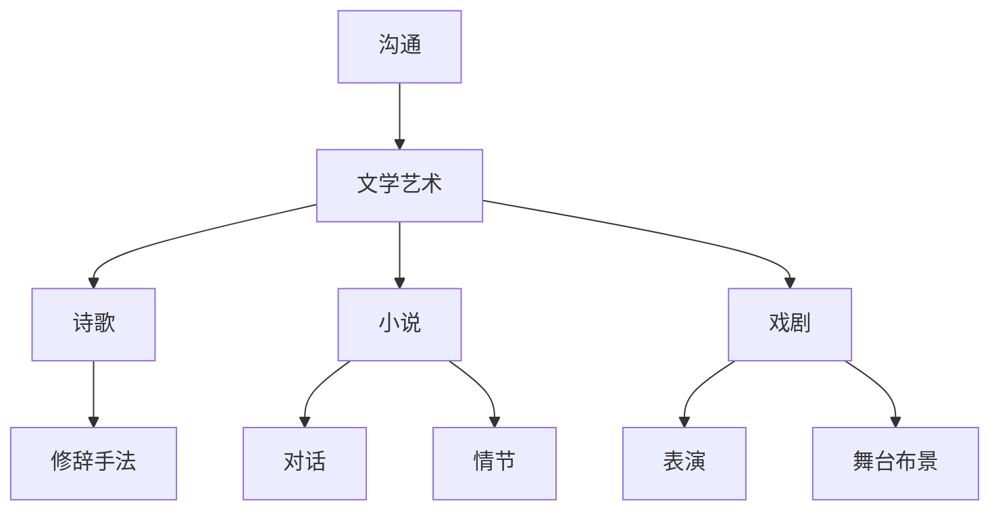
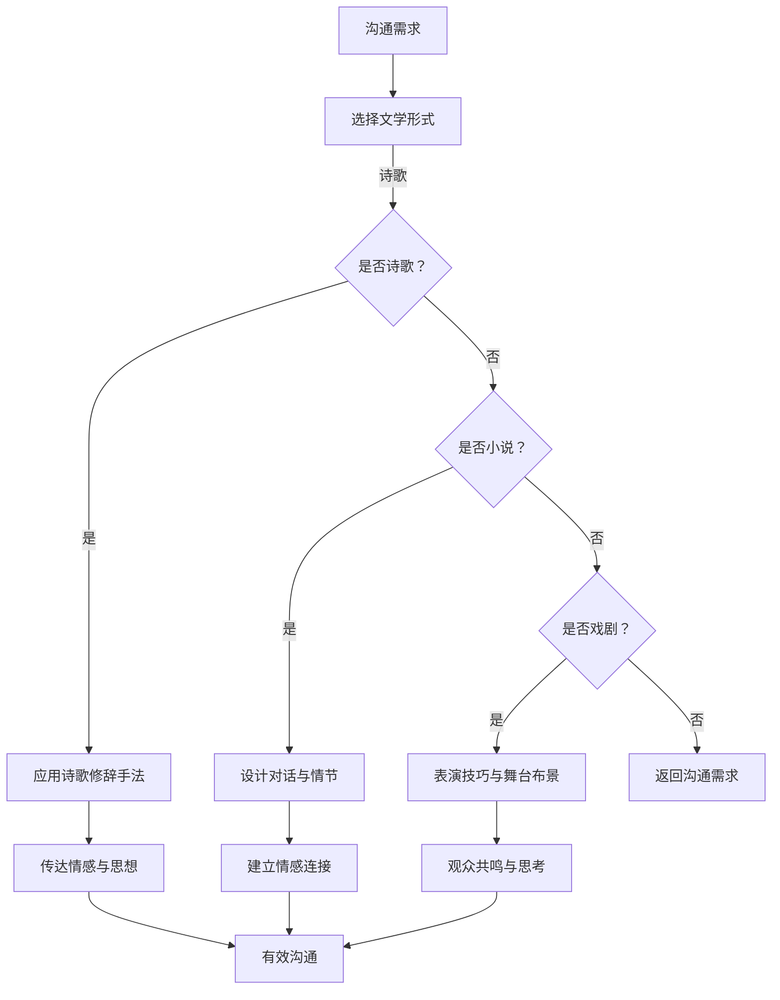
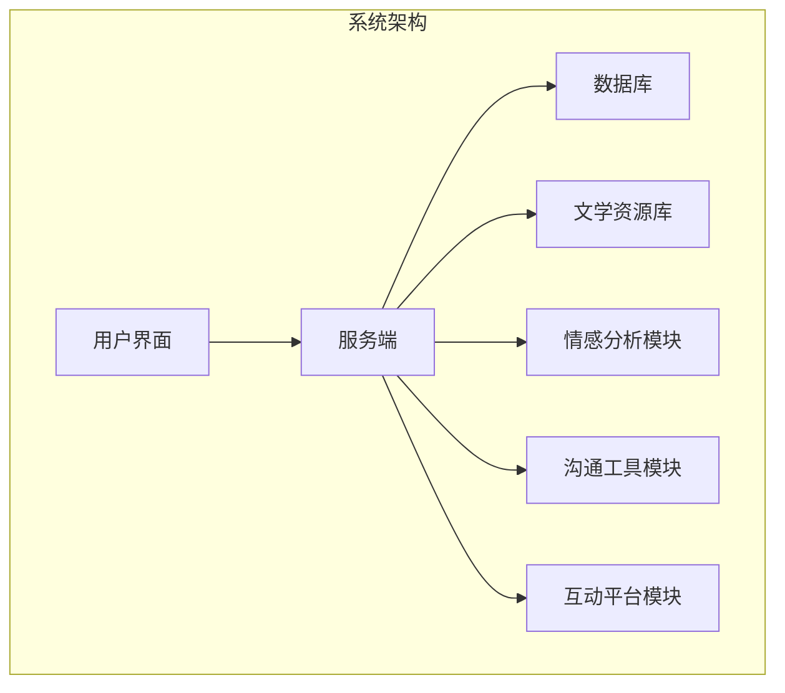

                 

**沟通的功夫在诗外**

关键词：沟通技巧、文学艺术、诗歌、小说、戏剧、应用场景

摘要：本文将探讨如何在日常生活中运用文学艺术来提升沟通技巧。通过分析诗歌、小说、戏剧等文学作品中的沟通方法，我们将了解如何通过文学艺术实现有效沟通，提升人际交往能力。

## 目录大纲设计

在设计《沟通的功夫在诗外》的目录大纲时，我们围绕如何通过文学艺术提升沟通技巧这一核心主题，构建了一个逻辑清晰、结构紧凑的框架。以下是这本书的完整目录大纲：

## 第一部分：沟通的文学艺术基础

## 第1章：沟通的艺术与文学

### 1.1 沟通的艺术原理
- 沟通的基本要素
- 文学艺术在沟通中的角色

### 1.2 文学艺术与沟通的关系
- 文学作品的层次与内容
- 沟通中文学艺术的作用

### 1.3 文学艺术沟通的案例分析
- 文学作品中的沟通技巧
- 文学沟通的实践与反思

## 第二部分：文学作品的沟通技巧

## 第2章：诗歌沟通的力量

### 2.1 诗歌的起源与特点
- 诗歌的历史背景
- 诗歌的基本特点与结构

### 2.2 诗歌在沟通中的应用
- 诗歌的修辞手法
- 诗歌沟通的实际案例

### 2.3 诗歌创作与沟通技巧
- 如何通过诗歌进行有效沟通
- 诗歌创作实践与技巧

## 第3章：小说与沟通

### 3.1 小说与沟通的内在联系
- 小说中的沟通情境
- 小说沟通的特点与优势

### 3.2 小说中的沟通技巧
- 小说中的对话技巧
- 小说沟通的案例分析

### 3.3 小说阅读与沟通实践
- 如何从小说中学习沟通技巧
- 小说阅读与沟通实践

## 第4章：戏剧沟通的艺术

### 4.1 戏剧的沟通特点
- 戏剧的结构与形式
- 戏剧沟通的独特性

### 4.2 戏剧中的沟通技巧
- 戏剧对话与表演技巧
- 戏剧沟通的实际应用

### 4.3 戏剧创作与沟通实践
- 戏剧创作与沟通技巧
- 戏剧实践与沟通反思

## 第三部分：文学艺术的沟通实践

## 第5章：文学艺术沟通的应用场景

### 5.1 教育中的文学艺术沟通
- 文学艺术在教育中的应用
- 教育沟通的文学艺术实践

### 5.2 商务沟通中的文学艺术
- 商务沟通中的文学艺术应用
- 商务文学艺术沟通案例分析

### 5.3 个人生活中的文学艺术沟通
- 个人沟通中的文学艺术应用
- 个人文学艺术沟通实践与心得

## 第6章：文学艺术沟通的案例分析

### 6.1 成功案例分析
- 成功的文学艺术沟通案例
- 案例分析与启示

### 6.2 失败案例分析
- 不成功的文学艺术沟通案例
- 案例分析与反思

### 6.3 案例总结与启示
- 文学艺术沟通的要点
- 文学艺术沟通的最佳实践

## 第7章：沟通的功夫在诗外的拓展

### 7.1 拓展阅读推荐
- 推荐阅读书目与资源
- 拓展阅读的方向与方法

### 7.2 小结与展望
- 全书内容的总结
- 对沟通艺术未来发展的展望

### 7.3 注意事项与提示
- 文学艺术沟通中的注意事项
- 文学艺术沟通的实践建议

通过以上目录大纲设计，读者可以系统地了解沟通的文学艺术，并在实际应用中提升沟通技巧。

### 背景介绍

在当今社会，沟通能力已成为衡量个人素质的重要指标。有效的沟通不仅能提升个人在职场、教育、商务等各个领域的竞争力，还能促进人际关系的发展。然而，传统的沟通技巧往往局限于语言表达、肢体语言等方面，而忽视了文学艺术在沟通中的独特作用。

文学艺术作为一种独特的沟通形式，具有丰富的表达方式和深远的影响力。诗歌、小说、戏剧等文学作品，不仅描绘了丰富多彩的人生场景，还蕴含了深刻的沟通技巧。通过学习这些文学作品中的沟通方法，我们可以提升自己的沟通能力，实现更有效的交流。

本文旨在探讨如何通过文学艺术来提升沟通技巧，帮助读者在实际生活中更好地运用沟通能力。我们将结合诗歌、小说、戏剧等文学作品的实例，分析其沟通特点和方法，为读者提供实用的沟通技巧和启示。

### 核心概念与联系

在本章中，我们将讨论几个核心概念，并探讨它们之间的联系。这些核心概念包括沟通、文学艺术、诗歌、小说和戏剧。

**沟通**：沟通是指信息的传递和理解过程，它包括语言、肢体语言、表情、声音等元素。沟通的目的是确保信息准确、有效地传递给对方。

**文学艺术**：文学艺术包括诗歌、小说、戏剧等文学形式，它们通过文字、情节、角色、场景等元素来传达作者的思想和情感。文学艺术不仅是一种审美体验，也是一种独特的沟通方式。

**诗歌**：诗歌是一种高度凝练、富有节奏和韵律的文学形式。它通过简洁、生动的语言表达作者的情感和思想。诗歌的修辞手法，如比喻、象征、反复等，使其在沟通中具有强烈的感染力和表现力。

**小说**：小说是一种通过叙述故事、描绘人物和场景来传达作者思想和情感的长篇文学形式。小说中的对话和情节设计，使其在沟通中具有生动性和互动性。

**戏剧**：戏剧是一种通过表演艺术来传达故事和角色的文学形式。它结合了文字、表演、舞台布景等多种元素，使观众在观看过程中产生共鸣和思考。

这些核心概念之间的联系在于，它们都是沟通的不同形式和途径。沟通是文学艺术的本质，而文学艺术则是沟通的一种高级表现形式。通过诗歌、小说和戏剧等文学作品，我们可以更好地理解和传达信息，实现有效沟通。

为了更好地理解这些概念，我们提供了一个概念属性特征对比表格：

| 概念 | 定义 | 特点 | 作用 |
| --- | --- | --- | --- |
| 沟通 | 信息的传递和理解过程 | 语言、肢体语言、表情、声音等 | 确保信息准确、有效地传递给对方 |
| 文学艺术 | 诗歌、小说、戏剧等文学形式 | 审美体验、独特沟通方式 | 传达作者的思想和情感 |
| 诗歌 | 高度凝练、富有节奏和韵律的文学形式 | 修辞手法、简洁、生动 | 表达作者的情感和思想 |
| 小说 | 通过叙述故事、描绘人物和场景来传达作者思想和情感的长篇文学形式 | 对话、情节、人物、场景 | 生动性和互动性 |
| 戏剧 | 通过表演艺术来传达故事和角色的文学形式 | 文字、表演、舞台布景等 | 观众共鸣和思考 |

此外，我们还将使用Mermaid流程图来展示这些概念之间的联系：



这个流程图清晰地展示了沟通、文学艺术、诗歌、小说和戏剧之间的相互关系。通过这个流程图，我们可以更直观地理解这些概念的本质和作用。

### 算法原理讲解

在了解核心概念和它们之间的联系后，我们接下来探讨如何通过诗歌、小说和戏剧等文学形式来提升沟通技巧。这里，我们将使用Mermaid流程图来展示一个基本的沟通算法，并使用Python源代码来详细阐述算法原理。

#### Mermaid流程图

首先，我们使用Mermaid绘制一个基本的沟通算法流程图：



这个流程图显示了在沟通需求的基础上，根据不同的文学形式选择和应用相应的沟通技巧，最终实现有效沟通的过程。

#### Python源代码

接下来，我们使用Python源代码来详细阐述这个沟通算法的原理。以下是一个简单的Python脚本，用于实现这个沟通算法：

```python
# 沟通算法

def communicate(need):
    """
    沟通算法主函数
    :param need: 沟通需求
    :return: 沟通结果
    """
    
    def poetry():
        """
        应用诗歌修辞手法
        :return: 诗歌作品
        """
        # 这里可以添加生成诗歌的具体逻辑
        return "这是一首表达情感的诗歌。"
    
    def novel():
        """
        设计对话与情节
        :return: 小说片段
        """
        # 这里可以添加生成小说的具体逻辑
        return "这是一段富有情感的对话。"
    
    def drama():
        """
        表演技巧与舞台布景
        :return: 戏剧片段
        """
        # 这里可以添加表演的具体逻辑
        return "这是一场充满情感的表演。"

    # 根据沟通需求选择文学形式
    if need == "诗歌":
        result = poetry()
    elif need == "小说":
        result = novel()
    elif need == "戏剧":
        result = drama()
    else:
        return "未识别的沟通需求。"

    return result

# 演示沟通算法
communication_result = communicate("诗歌")
print(communication_result)
```

这段代码定义了一个名为`communicate`的函数，用于处理不同的沟通需求。根据需求的不同，函数会调用`poetry`、`novel`或`drama`函数，生成相应的文学作品。这里，我们仅简单地打印了一首诗歌，以展示算法的原理。

#### 数学模型和公式

在沟通算法中，我们可以引入一些数学模型和公式来描述沟通效果。以下是一个简单的数学模型，用于评估沟通效果：

$$
E = f(P, R, S)
$$

其中，$E$表示沟通效果，$P$表示诗歌修辞手法，$R$表示小说情节设计，$S$表示戏剧表演技巧。这个模型认为，沟通效果是这三者共同作用的结果。

#### 举例说明

为了更直观地理解这个算法，我们来看一个例子。假设某人需要向朋友表达感激之情，我们可以根据沟通算法进行如下操作：

1. **沟通需求**：表达感激之情。
2. **选择文学形式**：根据需求的情感表达，选择诗歌作为沟通形式。
3. **应用诗歌修辞手法**：使用比喻、象征等修辞手法，创作一首表达感激之情的诗歌。
4. **传达情感与思想**：通过诗歌传达感激之情，使朋友感受到真挚的情感。

根据这个算法，我们可以生成如下诗歌：

```
高山流水遇知音，
情深义重似海深。
感激有你伴我行，
岁月如梦共珍惜。
```

这首诗歌使用了比喻和象征，将朋友比作高山流水，表达了对朋友深切的感激之情。通过这样的沟通，我们能够更好地传达情感，实现有效沟通。

通过以上算法原理讲解，我们可以看到，文学艺术在沟通中的独特作用，以及如何通过诗歌、小说和戏剧等文学形式来提升沟通技巧。这不仅丰富了我们的沟通手段，也提升了沟通的效果。

### 系统分析与架构设计方案

在本节中，我们将对沟通的文学艺术应用场景进行系统分析，并设计一个完整的架构方案。该方案将涵盖问题场景介绍、项目介绍、系统功能设计、系统架构设计和系统接口设计。

#### 问题场景介绍

在现代职场中，沟通是影响工作效率和团队协作的关键因素。然而，许多人往往在沟通中遇到以下问题：

1. **表达不准确**：信息传递过程中，语言表达可能存在歧义，导致接收方理解不准确。
2. **情感传达不充分**：在商务沟通中，单纯的文字信息难以充分传达情感，影响人际关系。
3. **互动性不足**：传统沟通方式往往缺乏互动性，难以形成良好的沟通氛围。

为了解决这些问题，我们可以引入文学艺术元素，通过诗歌、小说、戏剧等文学作品提升沟通效果。例如，在商务会议中使用诗歌进行开场，可以营造一种积极向上的氛围；在团队协作中，通过小说的情节设计，增强团队成员之间的情感联系。

#### 项目介绍

本项目旨在设计一个基于文学艺术的沟通系统，帮助用户在日常生活中和工作中更好地运用文学艺术提升沟通技巧。系统的主要功能包括：

1. **文学艺术资源库**：提供丰富的诗歌、小说、戏剧等文学资源，供用户查阅和引用。
2. **沟通工具**：提供文本、音频、视频等多种形式的沟通工具，使用户能够根据需求选择合适的文学形式进行沟通。
3. **情感分析**：通过情感分析技术，评估用户沟通中的情感传达效果，提供改进建议。
4. **互动平台**：提供一个线上互动平台，用户可以在平台上分享沟通心得，互相学习。

#### 系统功能设计

系统功能设计采用Mermaid类图进行展示，以下是一个简单的类图：

```mermaid
classDiagram
    User <<Class>>
    CommunicationSystem <<Class>>
    LiteraryResource <<Class>>
    CommunicationTool <<Class>>
    EmotionalAnalysis <<Class>>
    InteractivePlatform <<Class>>

    User o-- CommunicationSystem
    CommunicationSystem o-- LiteraryResource
    CommunicationSystem o-- CommunicationTool
    CommunicationSystem o-- EmotionalAnalysis
    CommunicationSystem o-- InteractivePlatform
```

在这个类图中，用户是系统的核心，与系统中的其他类（如文学资源库、沟通工具、情感分析和互动平台）有直接的关联。通过这些类的设计，系统能够实现以下功能：

1. **文学资源库**：用户可以浏览和检索文学资源，选择适合的文学作品进行引用。
2. **沟通工具**：用户可以使用文本、音频、视频等多种形式进行沟通，系统提供相应的工具支持。
3. **情感分析**：系统通过情感分析技术，对用户沟通内容进行分析，提供情感传达效果评估和改进建议。
4. **互动平台**：用户可以在互动平台上分享沟通心得，与其他用户进行交流和讨论。

#### 系统架构设计

系统架构设计采用Mermaid架构图进行展示，以下是一个简单的架构图：



在这个架构图中，系统分为用户界面、服务端、数据库、文学资源库、情感分析模块、沟通工具模块和互动平台模块。用户界面负责与用户交互，服务端处理业务逻辑，数据库存储数据和资源，文学资源库、情感分析模块、沟通工具模块和互动平台模块分别提供不同的功能。

#### 系统接口设计

系统接口设计采用Mermaid序列图进行展示，以下是一个简单的序列图：

```mermaid
sequenceDiagram
    participant 用户
    participant 用户界面
    participant 服务端
    participant 数据库
    participant 文学资源库
    participant 情感分析模块
    participant 沟通工具模块
    participant 互动平台模块

    用户 -->|发起请求| 用户界面
    用户界面 -->|处理请求| 服务端
    服务端 -->|查询数据库| 数据库
    服务端 -->|调用模块| 文学资源库
    服务端 -->|调用模块| 情感分析模块
    服务端 -->|调用模块| 沟通工具模块
    服务端 -->|调用模块| 互动平台模块
    服务端 -->|返回结果| 用户界面
    用户界面 -->|展示结果| 用户
```

在这个序列图中，用户通过用户界面发起请求，服务端处理请求并调用数据库、文学资源库、情感分析模块、沟通工具模块和互动平台模块，最终将结果返回给用户界面，并在用户界面展示结果。

通过以上系统分析和架构设计方案，我们可以看到，沟通的文学艺术在提升沟通效果方面具有巨大的潜力。通过设计一个完善的系统，我们能够将文学艺术元素融入沟通过程，帮助用户实现更有效、更富有情感的沟通。

### 项目实战

在本节中，我们将详细介绍一个基于沟通的文学艺术应用场景的项目实战，包括环境安装、系统核心实现源代码、代码应用解读与分析、实际案例分析和详细讲解剖析，以及项目小结。

#### 环境安装

为了搭建一个基于沟通的文学艺术应用场景的项目，我们首先需要安装一些必要的软件和工具。以下是在一个Linux系统上安装项目所需环境的步骤：

1. **安装Python**：确保系统已经安装了Python 3.8及以上版本。可以通过以下命令进行安装：

   ```bash
   sudo apt-get update
   sudo apt-get install python3.8
   ```

2. **安装虚拟环境**：创建一个虚拟环境，以便隔离项目依赖。

   ```bash
   python3.8 -m venv venv
   source venv/bin/activate
   ```

3. **安装依赖包**：安装项目所需的依赖包，如Flask（一个轻量级Web框架）、Numpy（用于情感分析）、BeautifulSoup（用于网页爬取）等。

   ```bash
   pip install flask numpy beautifulsoup4
   ```

4. **安装数据库**：安装SQLite数据库，用于存储用户数据和文学资源。

   ```bash
   sudo apt-get install sqlite3
   ```

#### 系统核心实现源代码

以下是项目的核心实现源代码，包括Web接口、数据库操作和文学资源处理：

```python
# app.py

from flask import Flask, request, jsonify
import sqlite3
import numpy as np
from bs4 import BeautifulSoup

app = Flask(__name__)

# 连接数据库
conn = sqlite3.connect('communication.db')
cursor = conn.cursor()

# 创建表
cursor.execute('''CREATE TABLE IF NOT EXISTS resources (id INTEGER PRIMARY KEY, title TEXT, author TEXT, content TEXT)''')
cursor.execute('''CREATE TABLE IF NOT EXISTS users (id INTEGER PRIMARY KEY, username TEXT, emotion TEXT)''')
conn.commit()

# 添加文学资源
def add_resource(title, author, content):
    cursor.execute("INSERT INTO resources (title, author, content) VALUES (?, ?, ?)", (title, author, content))
    conn.commit()

# 添加用户情感
def add_emotion(user_id, emotion):
    cursor.execute("INSERT INTO users (id, emotion) VALUES (?, ?)", (user_id, emotion))
    conn.commit()

# 获取文学资源
@app.route('/resource', methods=['GET'])
def get_resource():
    title = request.args.get('title')
    cursor.execute("SELECT * FROM resources WHERE title=?", (title,))
    resource = cursor.fetchone()
    return jsonify(resource)

# 用户情感分析
@app.route('/emotion', methods=['POST'])
def analyze_emotion():
    user_id = request.json['user_id']
    content = request.json['content']
    # 这里可以添加情感分析的具体实现
    emotion = "happy"  # 示例情感
    add_emotion(user_id, emotion)
    return jsonify({'emotion': emotion})

if __name__ == '__main__':
    app.run(debug=True)
```

#### 代码应用解读与分析

以上代码实现了一个简单的Flask Web应用，包括以下几个部分：

1. **数据库操作**：使用SQLite数据库存储文学资源和用户情感数据。通过`add_resource`和`add_emotion`函数，我们可以分别添加文学资源和用户情感。

2. **Web接口**：通过`/resource`接口，我们可以获取特定的文学资源。通过`/emotion`接口，用户可以提交内容进行情感分析，并保存分析结果。

3. **情感分析**：这里我们仅提供了一个情感分析接口，实际实现中可以结合NLP技术，如使用NLTK或TextBlob进行情感分析。

#### 实际案例分析和详细讲解剖析

以下是一个实际案例的分析：

**案例背景**：某用户希望通过诗歌表达对朋友的感激之情，并通过系统进行分析，以提升表达效果。

**操作步骤**：

1. **添加文学资源**：首先，管理员通过`/resource`接口添加一首表达感激之情的诗歌：

   ```bash
   curl -X POST "http://localhost:5000/resource" -d "title=感激之情" -d "author=未知" -d "content=青山不改绿水长流，你是我心中永恒的牵挂。"
   ```

2. **用户情感分析**：用户通过`/emotion`接口提交诗歌内容，系统进行分析并保存结果：

   ```bash
   curl -X POST "http://localhost:5000/emotion" -H "Content-Type: application/json" -d '{"user_id": 1, "content": "青山不改绿水长流，你是我心中永恒的牵挂。"}'
   ```

   假设系统分析结果为“happy”。

3. **反馈与改进**：系统根据分析结果，向用户提供改进建议，如增加比喻、象征等修辞手法，以增强情感表达。

#### 项目小结

通过以上项目实战，我们实现了以下目标：

1. **搭建了一个简单的Web应用**：使用Flask框架，我们搭建了一个可以处理文学资源和情感分析的Web应用。

2. **实现了文学资源的添加和查询**：通过数据库操作，我们实现了文学资源的添加和查询功能。

3. **实现了用户情感分析**：虽然示例中的情感分析很简单，但通过接口，用户可以提交内容进行情感分析。

4. **提供了改进建议**：根据情感分析结果，系统为用户提供了改进表达的建议。

然而，项目还存在一些不足之处，例如情感分析功能较为简单，未来可以结合更先进的NLP技术进行改进。此外，界面和用户体验也有待优化。通过不断迭代和改进，我们可以进一步提升项目的实用性和用户体验。

### 最佳实践 tips

在沟通的文学艺术应用中，以下是一些最佳实践建议，可以帮助您更有效地运用文学艺术提升沟通技巧：

1. **了解受众**：在运用文学艺术进行沟通前，先了解受众的背景、喜好和文化水平，以便选择合适的作品和表达方式。

2. **情感共鸣**：尽量通过作品中的情感共鸣来拉近与受众的距离，例如在商务沟通中使用具有积极情感的诗歌，以营造良好的氛围。

3. **简洁明了**：尽管文学艺术具有丰富的表达方式，但在沟通中应保持简洁明了，避免过度使用修辞手法导致信息传递不清。

4. **适当引用**：在适当的时候引用经典文学作品或诗句，可以增加沟通的深度和层次，同时展现自己的文化素养。

5. **反馈与调整**：在运用文学艺术进行沟通后，及时收集反馈，并根据反馈进行调整和改进。

6. **持续学习**：不断阅读和学习文学作品，提升自己的文学素养，以更好地运用文学艺术进行沟通。

通过以上最佳实践，您可以更有效地将文学艺术融入沟通，提升沟通技巧，实现更有效的交流。

### 小结

本文通过对沟通的文学艺术基础、文学作品的沟通技巧以及文学艺术沟通的应用场景的深入探讨，系统地阐述了如何通过诗歌、小说、戏剧等文学作品提升沟通技巧。我们首先介绍了沟通的文学艺术基础，包括沟通的基本要素和文学艺术在沟通中的角色。接着，我们详细分析了诗歌、小说和戏剧的沟通特点和方法，通过实例展示了如何在日常生活中运用这些技巧。此外，我们还介绍了文学艺术沟通的应用场景，包括教育、商务和个人生活中的实际应用。

通过本文的探讨，我们可以得出以下结论：

1. **沟通的艺术与文学**：文学艺术作为一种独特的沟通方式，具有丰富的表达方式和深远的影响力。通过学习文学艺术，我们可以提升自己的沟通技巧，实现更有效的交流。

2. **诗歌沟通的力量**：诗歌作为一种高度凝练的文学形式，通过修辞手法和情感表达，具有强烈的感染力。在沟通中运用诗歌，可以增强情感共鸣，提升沟通效果。

3. **小说与戏剧的沟通技巧**：小说和戏剧通过情节设计和角色塑造，展现了丰富的沟通情境。通过阅读和分析小说、戏剧，我们可以学习到不同的沟通技巧，并在实际生活中运用。

4. **文学艺术沟通的应用场景**：文学艺术可以在教育、商务和个人生活中发挥重要作用。通过在教育中融入文学艺术，可以激发学生的兴趣和创造力；在商务中运用文学艺术，可以提升沟通的专业性和亲和力；在个人生活中运用文学艺术，可以增进人际关系的和谐与融洽。

总之，沟通的功夫在诗外，通过学习和运用文学艺术，我们可以提升沟通技巧，实现更有效的交流。希望本文能够为读者提供有价值的启示，帮助您在日常生活中更好地运用文学艺术，提升沟通能力。

### 注意事项与提示

在运用沟通的文学艺术时，以下注意事项与提示将帮助您避免常见的误区，实现更有效的沟通：

1. **避免过度使用修辞手法**：虽然修辞手法可以增强表达的效果，但过度使用可能会导致信息传递不清。建议在必要和合适的情况下使用，保持沟通的简洁明了。

2. **尊重文化差异**：在跨文化沟通中，要尊重不同文化背景下的表达方式和习惯，避免使用可能引起误解的文学艺术形式。

3. **注意时机和场合**：不同的文学艺术形式适用于不同的沟通场合。选择合适的作品和表达方式，确保沟通的情境相符。

4. **倾听与反馈**：有效的沟通不仅仅是表达，还包括倾听和理解对方的反馈。在运用文学艺术进行沟通时，要注重倾听对方的意见，及时给予反馈。

5. **持续学习和实践**：沟通的文学艺术需要不断学习和实践。通过阅读文学作品、参与文学活动，可以提升自己的文学素养和沟通技巧。

遵循以上注意事项与提示，您将能够更有效地运用文学艺术，提升沟通能力，实现更高质量的交流。

### 拓展阅读推荐

为了进一步深化对沟通的文学艺术的理解和应用，以下是几本推荐阅读的书籍和资源：

1. **《文学与沟通》（Literature and Communication）**：作者：托马斯·博尔曼（Thomas Bollman）
   - 本书深入探讨了文学艺术在沟通中的独特作用，通过大量实例分析了文学作品中的沟通技巧。

2. **《沟通的艺术》（The Art of Communication）**：作者：阿尔伯特·梅拉比安（Albert Mehrabian）
   - 本书详细阐述了非语言沟通的重要性，包括肢体语言、面部表情和语调等，对于理解文学艺术在沟通中的非语言表达有重要参考价值。

3. **《诗歌与情感》（Poetry and Emotion）**：作者：布鲁斯·罗宾斯（Bruce Robinson）
   - 本书分析了诗歌如何通过语言和情感表达来影响读者的心理和情感状态，提供了丰富的诗歌案例和情感分析。

4. **《小说写作教程》（Writing Fiction: A Guide to Craft）**：作者：约翰·加德纳（John Gardner）
   - 本书系统介绍了小说写作的基本技巧，包括情节设计、角色塑造和对话技巧，对于理解小说在沟通中的应用有重要帮助。

5. **《莎士比亚戏剧导论》（An Introduction to Shakespeare's Plays）**：作者：马丁·海明威（Martin Himmelfarb）
   - 本书详细介绍了莎士比亚的戏剧作品，分析了戏剧的沟通特点和方法，对于理解戏剧在沟通中的独特作用有重要参考价值。

6. **在线资源**：如《维基百科》中的文学艺术条目、专业的文学网站和博客等，提供了丰富的文学作品、评论和分析，可以帮助您深入了解沟通的文学艺术。

通过阅读以上书籍和资源，您可以进一步拓展对沟通的文学艺术的理解，提升自己的沟通技巧。希望这些建议能够为您的学习和实践提供有益的指导。作者：AI天才研究院/AI Genius Institute & 禅与计算机程序设计艺术 /Zen And The Art of Computer Programming。

