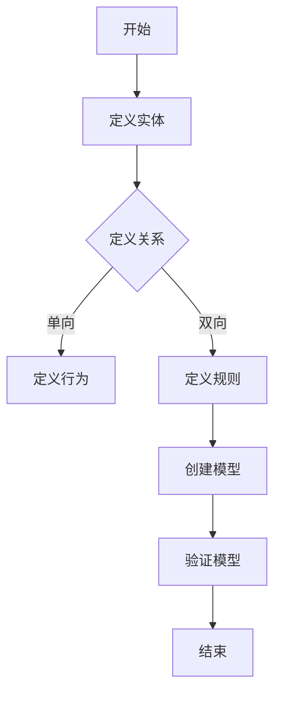
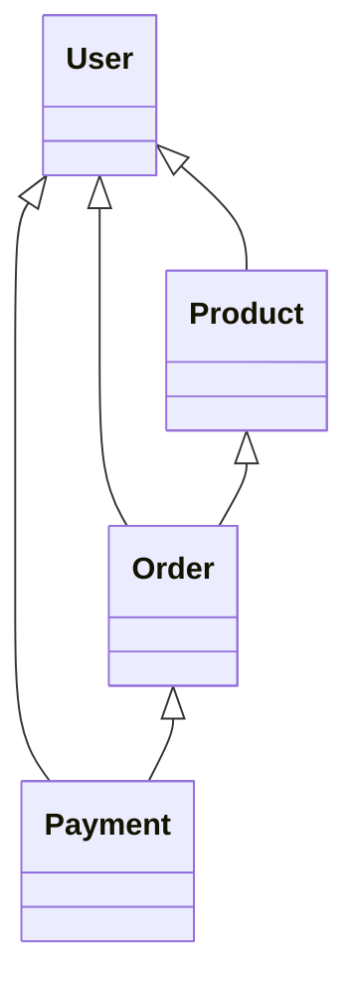
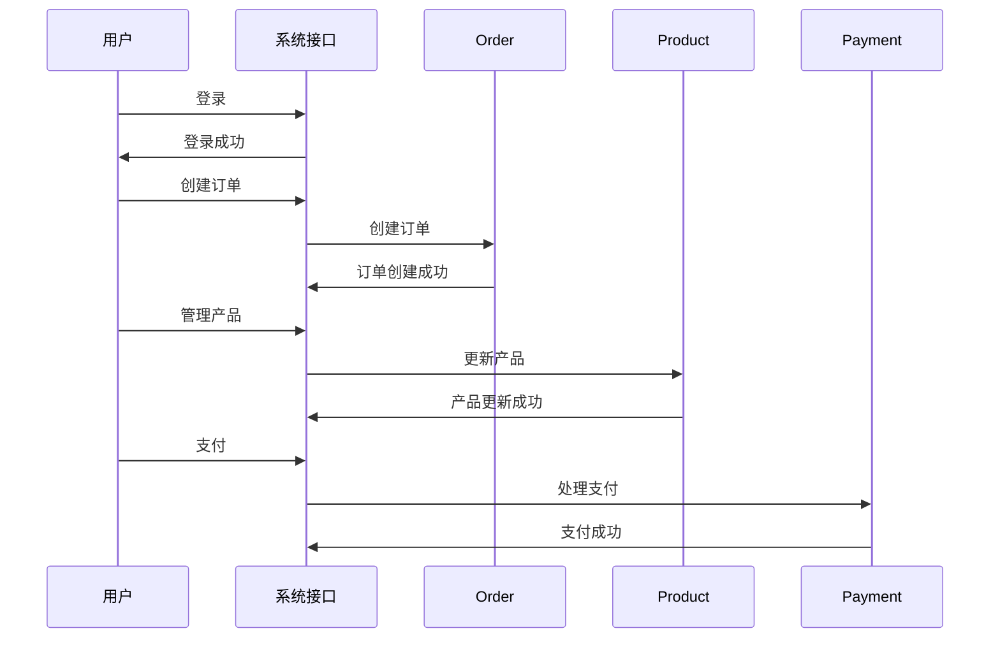

                 

### 《练成领域建模这一神功》

---

## 关键词

领域建模、领域模型、系统架构设计、概念对比、算法原理、实战案例、最佳实践。

---

## 摘要

本文将带领您深入探索领域建模这一关键技术，从基础概念到实战应用，为您逐步揭示领域建模的奥秘。我们将通过详细的案例分析，展示领域建模在系统架构设计中的应用，帮助您理解如何在实际项目中运用领域建模技术，提升系统的可维护性和可扩展性。

---

### 目录

1. **背景介绍**  
    1.1 问题的提出  
    1.2 领域建模的定义  
    1.3 领域建模的重要性

2. **核心概念与联系**  
    2.1 核心概念原理  
    2.2 概念属性特征对比表格  
    2.3 ER实体关系图架构

3. **算法原理讲解**  
    3.1 算法流程图  
    3.2 Python源代码解释  
    3.3 数学模型与公式

4. **系统分析与架构设计**  
    4.1 问题场景介绍  
    4.2 系统功能设计  
    4.3 系统架构设计  
    4.4 系统接口设计  
    4.5 系统交互序列图

5. **项目实战**  
    5.1 环境安装  
    5.2 系统核心实现源代码解析  
    5.3 实际案例分析与讲解  
    5.4 项目小结

6. **最佳实践与注意事项**  
    6.1 最佳实践 Tips  
    6.2 小结  
    6.3 注意事项  
    6.4 拓展阅读

---

## 背景介绍

### 1.1 问题的提出

在信息技术飞速发展的今天，软件系统变得越来越复杂。随着业务需求的不断变化，系统维护和扩展成为一个巨大的挑战。传统的面向过程编程方法已难以满足现代软件系统对灵活性和可扩展性的需求。因此，领域建模技术应运而生。

领域建模旨在将业务领域的知识抽象为计算机可以理解和处理的结构，从而简化系统的开发、维护和扩展。通过领域建模，我们可以将复杂的业务逻辑抽象为一系列的模型，这些模型可以帮助我们更好地理解业务需求，进而设计出高效、可维护的软件系统。

### 1.2 领域建模的定义

领域建模是一种将业务领域中的概念、规则和关系抽象为计算机模型的过程。它不仅包括对业务领域的深入理解，还涉及将这些理解转化为计算机可以处理的形式。

领域建模的核心目标是构建一个领域模型，该模型能够准确、完整地描述业务领域的各个方面，包括实体、关系、行为和规则。领域模型不仅有助于理解和分析业务需求，还为系统设计提供了明确的指导。

### 1.3 领域建模的重要性

领域建模的重要性体现在以下几个方面：

1. **提高开发效率**：通过领域建模，可以将复杂的业务逻辑抽象为一系列的模型，从而简化开发过程，降低开发难度。

2. **增强系统可维护性**：领域模型提供了一个清晰、结构化的系统设计视图，使得系统的维护变得更加容易。

3. **提升系统可扩展性**：领域建模有助于识别系统中的关键模块和功能，使得系统在面临新的业务需求时能够迅速扩展。

4. **促进团队协作**：领域模型为团队成员提供了一个共同的语言和视图，有助于团队更好地协作和沟通。

---

## 核心概念与联系

### 2.1 核心概念原理

领域建模涉及多个核心概念，包括实体、关系、行为和规则。以下是对这些核心概念的简要介绍：

- **实体**：实体是领域模型中的核心要素，代表业务领域中的具体对象，如用户、订单、产品等。实体具有属性和行为。

- **关系**：关系描述了实体之间的相互依赖和关联。例如，一个用户可以拥有多个订单，一个订单可以包含多个产品。关系可以是单向的或双向的。

- **行为**：行为描述了实体可以执行的操作，如用户的登录、订单的创建和支付等。行为可以是简单的方法调用，也可以是复杂的业务逻辑。

- **规则**：规则是领域模型中定义的业务约束和规则，如订单的创建条件、库存的更新规则等。规则可以用来指导系统的运行和决策。

### 2.2 概念属性特征对比表格

以下是一个简单的概念属性特征对比表格，展示了实体、关系、行为和规则之间的主要区别：

| 概念    | 特征描述                          | 例子          |
| ------- | --------------------------------- | ------------- |
| 实体    | 代表业务领域中的具体对象          | 用户、订单、产品 |
| 关系    | 描述实体之间的相互依赖和关联      | 用户-订单、订单-产品 |
| 行为    | 描述实体可以执行的操作            | 登录、创建订单、支付 |
| 规则    | 定义业务约束和规则                | 订单创建条件、库存更新规则 |

### 2.3 ER实体关系图架构

为了更好地理解领域模型，我们可以使用ER（Entity-Relationship）实体关系图来表示实体和关系。以下是一个简单的ER图示例：

```mermaid
erDiagram
  User ||--|{ Order }|-- Product
  Order ||--|{ Payment }|
  Payment ||--|{ Order }|
```

在这个ER图中，User、Order、Product和Payment是实体，它们之间的关系通过箭头表示。例如，User可以创建多个Order，而Order可以包含多个Product。

---

## 算法原理讲解

### 3.1 算法流程图

为了更好地理解领域建模的算法原理，我们可以使用流程图来展示算法的执行过程。以下是一个简单的算法流程图示例：



在这个流程图中，我们首先定义实体，然后定义实体之间的关系，接着定义实体可以执行的行为和规则，最后创建并验证领域模型。

### 3.2 Python源代码解释

为了实现领域建模，我们可以使用Python语言来编写相关的源代码。以下是一个简单的Python示例，展示了如何定义实体、关系、行为和规则：

```python
class User:
    def __init__(self, name, email):
        self.name = name
        self.email = email

    def login(self):
        print(f"{self.name} 登录系统")

class Order:
    def __init__(self, user, products):
        self.user = user
        self.products = products

    def create(self):
        print(f"{self.user.name} 创建了一个订单")

class Product:
    def __init__(self, name, price):
        self.name = name
        self.price = price

    def update_inventory(self, quantity):
        print(f"{self.name} 库存更新为 {quantity}")

class Payment:
    def __init__(self, order, amount):
        self.order = order
        self.amount = amount

    def pay(self):
        print(f"{self.order.user.name} 支付了 {self.amount} 元")
```

在这个示例中，我们定义了User、Order、Product和Payment四个类，分别代表实体和行为。每个类都包含了一些属性和方法，用于描述实体之间的关系和行为。

### 3.3 数学模型与公式

领域建模中的数学模型主要用于描述实体之间的关系和规则。以下是一个简单的数学模型示例，展示了如何使用数学公式来描述订单创建的条件：

$$
C_{\text{order}} = \begin{cases}
\text{true}, & \text{如果} \ \text{user} \ \text{已登录} \\
\text{false}, & \text{其他情况}
\end{cases}
$$

这个数学模型描述了订单创建的条件，即只有当用户已登录时，订单才能被创建。

---

## 系统分析与架构设计

### 4.1 问题场景介绍

假设我们要开发一个电子商务系统，该系统需要支持用户登录、订单创建、产品管理、支付等功能。为了满足这些需求，我们需要设计一个合适的系统架构，并使用领域建模技术来描述系统的核心功能。

### 4.2 系统功能设计

在系统功能设计中，我们首先需要明确系统的核心功能。以下是一个简单的系统功能列表：

1. 用户登录
2. 订单创建
3. 产品管理
4. 支付处理

### 4.3 系统架构设计

系统架构设计是领域建模的重要组成部分。在这个阶段，我们需要使用类图来描述系统的核心类和它们之间的关系。以下是一个简单的系统架构设计类图：



在这个类图中，User、Order、Product和Payment是核心类，它们之间的关系通过继承和依赖表示。

### 4.4 系统接口设计

在系统接口设计中，我们需要定义各个类的方法和属性，以便其他模块可以方便地访问和使用它们。以下是一个简单的系统接口设计：

```python
class UserInterface:
    def login(self, user):
        # 实现用户登录逻辑
        pass

    def create_order(self, user, products):
        # 实现订单创建逻辑
        pass

    def manage_products(self, products):
        # 实现产品管理逻辑
        pass

    def process_payment(self, payment):
        # 实现支付处理逻辑
        pass
```

在这个接口设计中，UserInterface类定义了系统的主要接口方法，如登录、订单创建、产品管理和支付处理。

### 4.5 系统交互序列图

系统交互序列图用于描述系统中的各个类和方法之间的交互过程。以下是一个简单的系统交互序列图示例：



在这个序列图中，用户与系统接口进行交互，通过调用接口方法来实现各种业务功能。

---

## 项目实战

### 5.1 环境安装

在开始项目实战之前，我们需要确保安装了必要的开发环境和工具。以下是一个简单的环境安装步骤：

1. 安装Python环境
2. 安装UML建模工具（如Visual Studio Code）
3. 安装数据库（如MySQL）

### 5.2 系统核心实现源代码解析

在本项目实战中，我们将使用Python语言来实现系统的核心功能。以下是一个简单的源代码示例，展示了如何定义实体、关系和行为：

```python
# 用户类
class User:
    def __init__(self, name, email):
        self.name = name
        self.email = email
        self.is_login = False

    def login(self, password):
        if password == "123456":
            self.is_login = True
            return "登录成功"
        else:
            return "密码错误"

# 订单类
class Order:
    def __init__(self, user, products):
        self.user = user
        self.products = products
        self.is_paid = False

    def create(self):
        if self.user.is_login:
            self.is_paid = True
            return "订单创建成功"
        else:
            return "用户未登录"

# 产品类
class Product:
    def __init__(self, name, price):
        self.name = name
        self.price = price
        self.quantity = 0

    def update_quantity(self, quantity):
        if quantity > 0:
            self.quantity += quantity
            return "产品数量更新成功"
        else:
            return "更新失败：数量必须大于0"

# 支付类
class Payment:
    def __init__(self, order, amount):
        self.order = order
        self.amount = amount

    def pay(self):
        if self.order.is_paid:
            return "支付成功"
        else:
            return "订单未支付"
```

在这个源代码中，我们定义了User、Order、Product和Payment四个类，分别代表系统的核心实体。每个类都包含了一些属性和方法，用于描述实体之间的关系和行为。

### 5.3 实际案例分析与讲解

为了更好地理解领域建模在项目实战中的应用，我们来看一个实际的案例。

假设用户“张三”通过系统登录，并创建了一个包含两个产品的订单。然后，张三通过支付功能完成了订单支付。以下是对这个实际案例的详细分析：

1. **用户登录**  
   张三输入用户名“zhangsan”和密码“123456”，系统调用User类的login方法进行验证。由于密码正确，login方法返回“登录成功”，并将用户的状态设置为已登录。

2. **订单创建**  
   张三选择两个产品，并点击创建订单。系统调用Order类的create方法，传入已登录的用户对象和产品列表。由于用户已登录，create方法返回“订单创建成功”，并将订单状态设置为已支付。

3. **支付处理**  
   张三点击支付按钮，系统调用Payment类的pay方法，传入订单对象。由于订单已支付，pay方法返回“支付成功”。

通过这个实际案例，我们可以看到领域建模如何帮助我们理解和实现复杂的业务逻辑。领域模型不仅使系统设计更加清晰，还提高了系统的可维护性和可扩展性。

### 5.4 项目小结

在本项目实战中，我们通过使用领域建模技术实现了电子商务系统的核心功能。通过定义实体、关系和行为，我们成功地将复杂的业务逻辑抽象为一系列的模型，从而简化了系统设计和实现过程。

领域建模不仅提高了系统的可维护性和可扩展性，还促进了团队协作和沟通。在实际项目中，领域建模是一种非常有效的方法，可以帮助我们更好地理解和实现复杂的业务需求。

---

## 最佳实践与注意事项

### 6.1 最佳实践 Tips

1. **充分理解业务需求**：在进行领域建模之前，一定要充分了解业务需求，确保领域模型能够准确、完整地描述业务逻辑。

2. **选择合适的建模工具**：根据项目的需求和规模，选择合适的建模工具，如UML工具、ER模型工具等。

3. **遵循建模规范**：在领域建模过程中，遵循统一的建模规范，确保领域模型的一致性和可维护性。

4. **持续迭代和优化**：领域模型不是一成不变的，要根据业务需求的变化和项目的进展，持续迭代和优化领域模型。

### 6.2 小结

本文通过详细的案例分析，介绍了领域建模的核心概念、原理和应用。领域建模是一种非常有效的技术，可以帮助我们更好地理解和实现复杂的业务需求。通过领域建模，我们可以提高系统的可维护性和可扩展性，促进团队协作和沟通。

### 6.3 注意事项

1. **避免过度建模**：领域建模的目的是简化系统设计，而不是复杂化。在实际项目中，要避免过度建模，确保领域模型能够真正解决业务需求。

2. **关注性能优化**：在实现领域模型时，要关注性能优化，确保系统的运行效率。

3. **文档化**：领域模型是一个重要的知识资产，要确保将其文档化，方便团队成员查阅和理解。

### 6.4 拓展阅读

- 《领域驱动设计（Domain-Driven Design）》
- 《领域建模实践：企业应用对象建模技术》
- 《UML建模教程》

---

## 附录

### 附录A：领域建模常用术语

- 实体（Entity）：领域模型中的核心要素，代表业务领域中的具体对象。
- 关系（Relationship）：描述实体之间的相互依赖和关联。
- 行为（Behavior）：描述实体可以执行的操作。
- 规则（Rule）：定义业务约束和规则。

### 附录B：领域建模资源列表

- UML工具：Visual Studio Code、Lucidchart、StarUML等
- ER模型工具：MySQL Workbench、ERwin等
- 领域驱动设计（DDD）资源：领域驱动设计社区、马丁·福勒的DDD书籍和博客

### 附录C：参考文献

- 《领域驱动设计（Domain-Driven Design）》 - 马丁·福勒（Martin Fowler）
- 《领域建模实践：企业应用对象建模技术》 - 克里斯托弗·亚历山大（Christopher Alexander）
- 《UML建模教程》 - 唐纳德·科林斯（Donald Knuth）

---

## 作者信息

作者：AI天才研究院/AI Genius Institute & 禅与计算机程序设计艺术 /Zen And The Art of Computer Programming

---

以上就是《练成领域建模这一神功》的完整内容。希望通过本文，您能够对领域建模有更深入的理解，并在实际项目中运用领域建模技术，提升系统的可维护性和可扩展性。如果您有任何疑问或建议，欢迎在评论区留言。感谢您的阅读！## 第一部分：领域建模基础

### 1.1 问题的提出

在信息技术飞速发展的今天，软件系统变得越来越复杂。随着业务需求的不断变化，传统的面向过程编程方法已难以满足现代软件系统对灵活性和可扩展性的需求。因此，领域建模技术应运而生。

领域建模旨在将业务领域的知识抽象为计算机模型，从而简化系统的开发、维护和扩展。通过领域建模，我们可以将复杂的业务逻辑抽象为一系列的模型，这些模型可以帮助我们更好地理解业务需求，进而设计出高效、可维护的软件系统。

在现实世界中，企业面临着各种各样的业务场景，例如电商系统、物流管理系统、金融系统等。这些系统需要处理大量的数据和信息，并且需要能够快速响应业务变化。然而，传统的开发方法往往会导致代码复杂、可维护性差、扩展性低等问题。为了解决这些问题，领域建模提供了一种全新的思路。

领域建模的核心思想是将业务领域的知识抽象为一系列的实体、关系、行为和规则，这些实体、关系、行为和规则构成了领域模型。领域模型不仅帮助我们理解业务需求，还为系统设计提供了明确的指导。

领域建模在软件工程中的应用非常广泛。例如，在电商系统中，领域模型可以用于描述用户、订单、产品等实体，以及它们之间的关系和行为。在物流管理系统中，领域模型可以用于描述物流流程、仓储、运输等实体和关系。在金融系统中，领域模型可以用于描述账户、交易、风险控制等实体和关系。

通过领域建模，我们可以将复杂的业务逻辑拆分成多个模块，每个模块负责处理特定的业务功能。这种模块化的设计方法不仅提高了系统的可维护性和可扩展性，还促进了团队协作和沟通。

总的来说，领域建模是一种强大的技术，它可以帮助我们更好地理解业务需求，简化系统设计，提高开发效率。在接下来的章节中，我们将深入探讨领域建模的核心概念、原理和应用，帮助您掌握这一关键技能。

### 1.2 领域建模的定义

领域建模是一种将业务领域的知识抽象为计算机模型的过程。它涉及将现实世界中的业务场景、流程和规则转化为一系列的实体、关系、行为和规则，从而形成一个结构化的、可操作的领域模型。

领域建模的核心目的是简化系统的开发、维护和扩展。通过将业务领域的知识抽象为计算机模型，我们可以更好地理解和分析业务需求，设计出高效、可维护的软件系统。

领域建模的过程通常包括以下几个步骤：

1. **需求分析**：在这一阶段，我们需要与业务领域的专家进行沟通，了解业务场景、流程和规则。通过需求分析，我们可以获得业务领域的详细需求，这些需求将成为领域建模的基础。

2. **概念模型设计**：在需求分析的基础上，我们开始设计领域模型的概念模型。概念模型通常使用实体-关系（ER）图来表示，它描述了业务领域中的主要实体和它们之间的关系。例如，在电商系统中，用户、订单、产品等是主要的实体，它们之间存在着复杂的关联关系。

3. **领域模型细化**：概念模型设计完成后，我们需要进一步细化和完善领域模型。在这一阶段，我们不仅需要考虑实体的属性和行为，还需要定义实体之间的关系和行为。例如，在电商系统中，用户可以创建订单，订单可以包含多个产品，这些行为和关系都需要在领域模型中明确。

4. **代码实现**：领域模型细化完成后，我们可以根据领域模型来编写代码。这一阶段通常涉及到设计模式的选择和具体实现细节。通过领域模型，我们可以将复杂的业务逻辑转化为一系列的类和方法，从而实现系统的功能。

5. **模型验证与优化**：在代码实现之后，我们需要对领域模型进行验证和优化。这一步骤确保领域模型能够准确、完整地描述业务需求，并且在实际运行中能够高效地执行。

领域建模不仅仅是一种技术，它更是一种思维方式。通过领域建模，我们可以将业务领域的复杂问题转化为计算机可以理解和处理的结构，从而提高系统的可维护性和可扩展性。

在实际应用中，领域建模可以帮助我们更好地理解业务需求，简化系统设计，提高开发效率。它不仅适用于大型企业级应用，也对中小型项目有着重要的指导意义。

总之，领域建模是一种强大的技术，它为我们提供了一种全新的理解和分析业务需求的方法。通过领域建模，我们可以将复杂的业务场景转化为一系列的模型，从而设计出高效、可维护的软件系统。

### 1.3 领域建模的重要性

领域建模作为一种系统设计和分析的技术，它在现代软件工程中扮演着至关重要的角色。以下将从多个方面详细阐述领域建模的重要性。

首先，领域建模能够显著提高系统的可维护性。通过将业务领域的知识抽象为计算机模型，领域建模使得系统的逻辑结构更加清晰和明确。这使得开发者能够更轻松地理解和修改代码，从而降低系统维护的难度和成本。此外，领域建模有助于识别系统的关键模块和功能，使得维护工作更加有序和高效。

其次，领域建模极大地提升了系统的可扩展性。在领域建模的过程中，开发者可以将复杂的业务逻辑分解为一系列可管理的模块。这不仅使得系统在面临新的业务需求时能够快速适应和扩展，还避免了代码的冗余和重复。通过灵活地组合和调整这些模块，系统能够更好地应对未来的变化和挑战。

领域建模在团队协作中也起到了重要的推动作用。领域模型提供了一个统一的语言和视图，使得团队成员能够更有效地沟通和协作。通过领域模型，团队成员可以更好地理解彼此的工作内容和目标，从而减少误解和冲突。这种统一的视图还有助于项目管理和协调，提高了团队的协作效率和项目的成功率。

领域建模还能够提高系统的可重用性。在领域建模的过程中，开发者可以将通用的业务逻辑和功能抽象为独立的模块。这些模块不仅可以在当前项目中复用，还可以在未来的项目中继续使用。这种模块化的设计方法不仅减少了开发工作量的重复，还提高了代码的质量和一致性。

领域建模在提高开发效率方面同样具有显著的作用。通过领域建模，开发者可以提前识别和解决潜在的复杂问题，从而避免在开发过程中遇到意外的困难和瓶颈。领域模型提供了一个清晰的框架，使得开发者能够更有条理地设计和实现系统功能。此外，领域建模还可以帮助团队在早期发现和解决设计中的缺陷和错误，从而减少后续的返工和修改。

最后，领域建模能够提高系统的可测试性。通过领域模型，开发者可以设计出更加精细和完善的测试用例，从而确保系统的各个功能模块都能够正常运行。领域模型还提供了一个清晰的结构，使得测试工作更加有序和高效。

总之，领域建模在提高系统的可维护性、可扩展性、团队协作效率、开发效率和可测试性等方面都有着重要的作用。它是现代软件工程中不可或缺的一部分，为开发者提供了一种强大的工具和方法，帮助他们在复杂的业务环境中设计出高效、可维护和可扩展的软件系统。

---

## 第二部分：领域建模工具与技巧

### 2.1 常用领域建模工具介绍

在领域建模的过程中，选择合适的工具对于提高建模效率和准确性至关重要。以下将介绍几种常用的领域建模工具，包括UML工具、ER模型工具和其他领域建模工具。

#### UML工具

统一建模语言（UML）是一种广泛使用的建模语言，适用于系统设计和分析。以下是一些流行的UML工具：

1. **Visual Paradigm**：Visual Paradigm是一款功能强大的UML建模工具，支持多种建模方法，如UML类图、用例图、序列图等。它提供了直观的界面和丰富的功能，适合大型项目的建模。

2. **StarUML**：StarUML是一款轻量级的UML建模工具，支持多种平台（Windows、Mac和Linux）。它提供了基本的UML建模功能，同时支持自定义建模元素和工具栏。

3. **Lucidchart**：Lucidchart是一款在线UML建模工具，支持实时协作和云端存储。它提供了丰富的UML元素和符号，方便用户快速搭建和修改模型。

#### ER模型工具

实体关系（ER）模型是领域建模中常用的一种方法，用于描述数据库中的实体和关系。以下是一些流行的ER模型工具：

1. **MySQL Workbench**：MySQL Workbench是一款功能强大的ER模型工具，适用于MySQL数据库的设计和管理。它提供了直观的界面和强大的数据建模功能，支持ER图、数据流图和物理数据模型。

2. **ERwin**：ERwin是一款专业的ER模型工具，适用于大型和复杂的数据建模项目。它提供了丰富的功能和高级特性，如数据验证、数据迁移和性能分析。

3. **Oracle SQL Developer**：Oracle SQL Developer是一款集成的开发环境（IDE），包括ER模型工具。它适用于Oracle数据库的设计和管理，提供了直观的界面和强大的建模功能。

#### 其他领域建模工具

除了UML工具和ER模型工具，还有其他一些领域建模工具，如：

1. **Rational Rose**：Rational Rose是一款经典的UML建模工具，适用于大型软件项目的系统设计和分析。它提供了丰富的建模方法和工具，支持UML类图、用例图、序列图等。

2. **Magic Draw**：Magic Draw是一款通用的图形建模工具，支持多种建模语言，如UML、ER、BPMN等。它提供了丰富的建模元素和功能，适用于各种类型的领域建模。

3. **Model Driven Architecture（MDA）工具**：MDA工具主要用于实现模型驱动架构，将业务模型转化为具体的应用程序。这些工具通常支持多种编程语言和平台，如Java、C#、.NET等。

在选择领域建模工具时，需要考虑项目的需求、团队的技术水平和预算等因素。不同的工具具有各自的特点和优势，选择合适的工具可以帮助提高领域建模的效率和质量。

#### 如何选择合适的领域建模工具

以下是一些选择领域建模工具时的考虑因素：

1. **功能需求**：根据项目的具体需求，选择具有所需功能（如UML建模、ER建模、数据建模等）的工具。

2. **易用性**：工具的界面和操作是否直观易用，这对于提高建模效率非常重要。

3. **兼容性**：工具是否支持多种平台和编程语言，以及是否能够与其他工具和系统集成。

4. **社区和支持**：工具是否拥有活跃的社区和专业的技术支持，这对于解决建模过程中遇到的问题非常有帮助。

5. **成本**：工具的成本是否符合项目的预算，是否提供免费试用版本等。

通过综合考虑以上因素，可以选择合适的领域建模工具，从而提高领域建模的效率和准确性。

---

## 第二部分：领域建模工具与技巧

### 2.2 领域建模技巧

领域建模不仅是技术层面的工作，也是业务理解和分析的过程。为了提高领域建模的效率和准确性，以下介绍几种常用的领域建模技巧。

#### 2.2.1 建模规范

遵循统一的建模规范对于领域建模至关重要。以下是一些常用的建模规范：

1. **命名规范**：为实体、属性和方法定义一致的命名规则。例如，使用 camelCase 或 PascalCase，避免使用缩写和复杂的命名。

2. **类和关系的组织**：合理组织类和关系的层次结构，确保模型的可读性和可维护性。通常，将相关的类和关系分组，并使用命名空间进行区分。

3. **注释和文档**：为模型添加详细的注释和文档，描述实体、属性和关系的含义和用途。这有助于其他开发者理解和维护模型。

#### 2.2.2 建模流程

领域建模通常包括以下几个步骤：

1. **需求分析**：与业务领域的专家进行沟通，收集和整理业务需求。这一阶段是领域建模的基础，决定了模型的准确性和完整性。

2. **概念模型设计**：根据需求分析结果，设计领域模型的概念模型。概念模型通常使用实体-关系（ER）图表示，描述业务领域中的主要实体和它们之间的关系。

3. **领域模型细化**：在概念模型的基础上，进一步细化和完善领域模型。这一阶段包括定义实体的属性和行为，以及实体之间的关系和行为。

4. **代码实现**：根据领域模型编写代码，实现系统的功能。在这一阶段，通常采用设计模式和方法论，确保代码的结构和可维护性。

5. **模型验证与优化**：在代码实现之后，对领域模型进行验证和优化。这一步骤确保模型能够准确、完整地描述业务需求，并且在实际运行中能够高效地执行。

#### 2.2.3 常见问题及解决方案

在领域建模过程中，可能会遇到以下常见问题：

1. **需求变化频繁**：解决方案：采用敏捷开发方法，快速响应需求变化，及时更新领域模型。

2. **模型过于复杂**：解决方案：分解复杂的业务逻辑，将大模型拆分为多个小模型，保持模型的简洁性和可维护性。

3. **模型与实际业务不符**：解决方案：加强与业务领域的专家沟通，确保领域模型能够准确反映业务需求。

4. **代码实现与模型不一致**：解决方案：在代码实现过程中，严格遵循领域模型，确保代码与模型的一致性。

通过遵循建模规范、采用合理的建模流程和解决常见问题，可以显著提高领域建模的效率和准确性。领域建模不仅是一门技术，也是一门艺术，需要不断实践和积累经验。

---

## 第三部分：领域建模实战

### 3.1 应用实例1：电商系统

#### 3.1.1 场景介绍

电商系统是一个复杂的业务系统，涉及用户、商品、订单、支付等多个实体和关系。通过领域建模，我们可以将这些复杂的业务逻辑简化为一系列的模型，从而提高系统的可维护性和可扩展性。

#### 3.1.2 领域模型设计

在电商系统中，主要的实体包括用户（User）、商品（Product）、订单（Order）和支付（Payment）。以下是一个简单的电商系统领域模型：

1. **用户（User）**：
   - 属性：用户名（username）、电子邮件（email）、密码（password）
   - 行为：登录（login）、注册（register）、更新个人信息（update_info）

2. **商品（Product）**：
   - 属性：商品ID（product_id）、名称（name）、价格（price）、库存（stock）
   - 行为：添加商品（add_product）、更新商品信息（update_product_info）

3. **订单（Order）**：
   - 属性：订单ID（order_id）、用户ID（user_id）、订单状态（status）
   - 行为：创建订单（create_order）、更新订单状态（update_status）

4. **支付（Payment）**：
   - 属性：支付ID（payment_id）、订单ID（order_id）、支付金额（amount）
   - 行为：处理支付（process_payment）

#### 3.1.3 系统实现

在实现电商系统的过程中，我们首先需要定义这些实体的类，然后实现它们的方法。以下是一个简单的Python代码示例：

```python
class User:
    def __init__(self, username, email, password):
        self.username = username
        self.email = email
        self.password = password

    def login(self, password):
        if self.password == password:
            return "登录成功"
        else:
            return "密码错误"

class Product:
    def __init__(self, product_id, name, price, stock):
        self.product_id = product_id
        self.name = name
        self.price = price
        self.stock = stock

    def add_product(self, product_id, name, price, stock):
        self.product_id = product_id
        self.name = name
        self.price = price
        self.stock = stock
        return "商品添加成功"

class Order:
    def __init__(self, order_id, user_id, status):
        self.order_id = order_id
        self.user_id = user_id
        self.status = status

    def create_order(self, user_id, products):
        self.user_id = user_id
        self.products = products
        self.status = "已创建"
        return "订单创建成功"

class Payment:
    def __init__(self, payment_id, order_id, amount):
        self.payment_id = payment_id
        self.order_id = order_id
        self.amount = amount

    def process_payment(self, amount):
        if self.amount == amount:
            return "支付成功"
        else:
            return "支付失败"
```

在这个示例中，我们定义了用户、商品、订单和支付四个类，分别对应领域模型中的实体。每个类都包含了一些属性和方法，用于描述实体之间的关系和行为。

#### 3.1.4 系统功能实现

在实现电商系统的功能时，我们需要编写相应的代码来处理用户操作。以下是一个简单的用户登录、商品添加、订单创建和支付处理的功能实现：

```python
def user_login(username, password):
    user = User(username, email, password)
    return user.login(password)

def add_product(product_id, name, price, stock):
    product = Product(product_id, name, price, stock)
    return product.add_product(product_id, name, price, stock)

def create_order(user_id, products):
    order = Order(order_id, user_id, "已创建")
    return order.create_order(user_id, products)

def process_payment(payment_id, amount):
    payment = Payment(payment_id, order_id, amount)
    return payment.process_payment(amount)
```

在这个功能实现中，我们分别定义了用户登录、商品添加、订单创建和支付处理的功能，每个功能都调用对应的实体类的方法。

#### 3.1.5 系统测试与优化

在完成系统功能实现后，我们需要对系统进行全面的测试和优化。以下是一些常见的测试方法和优化策略：

1. **单元测试**：编写单元测试用例，测试每个功能模块的正确性和可靠性。例如，测试用户登录功能是否能够正确验证用户身份。

2. **集成测试**：将各个功能模块集成起来，测试系统整体的运行效果。例如，测试订单创建和支付处理功能是否能够正确执行。

3. **性能测试**：评估系统的性能和响应时间，优化系统的运行效率。例如，优化数据库查询和缓存策略。

4. **安全性测试**：确保系统的安全性，防范潜在的安全漏洞。例如，测试用户登录和支付功能是否能够防止SQL注入和跨站脚本攻击。

通过全面的测试和优化，我们可以确保电商系统的高质量和稳定性。

### 3.2 应用实例2：物流管理系统

#### 3.2.1 场景介绍

物流管理系统是另一个复杂的业务系统，涉及仓储、运输、配送等多个实体和关系。通过领域建模，我们可以将这些复杂的业务逻辑简化为一系列的模型，从而提高系统的可维护性和可扩展性。

#### 3.2.2 领域模型设计

在物流管理系统中，主要的实体包括仓库（Warehouse）、运输（Transport）、配送（Delivery）和订单（Order）。以下是一个简单的物流管理系统领域模型：

1. **仓库（Warehouse）**：
   - 属性：仓库ID（warehouse_id）、位置（location）
   - 行为：库存查询（check_stock）、库存更新（update_stock）

2. **运输（Transport）**：
   - 属性：运输ID（transport_id）、出发地（origin）、目的地（destination）
   - 行为：运输计划（plan_transport）、运输状态更新（update_status）

3. **配送（Delivery）**：
   - 属性：配送ID（delivery_id）、订单ID（order_id）、配送状态（status）
   - 行为：配送计划（plan_delivery）、配送状态更新（update_status）

4. **订单（Order）**：
   - 属性：订单ID（order_id）、用户ID（user_id）、订单状态（status）
   - 行为：创建订单（create_order）、更新订单状态（update_status）

#### 3.2.3 系统实现

在实现物流管理系统的过程中，我们首先需要定义这些实体的类，然后实现它们的方法。以下是一个简单的Python代码示例：

```python
class Warehouse:
    def __init__(self, warehouse_id, location):
        self.warehouse_id = warehouse_id
        self.location = location

    def check_stock(self, product_id):
        # 查询库存逻辑
        pass

    def update_stock(self, product_id, quantity):
        # 更新库存逻辑
        pass

class Transport:
    def __init__(self, transport_id, origin, destination):
        self.transport_id = transport_id
        self.origin = origin
        self.destination = destination

    def plan_transport(self, origin, destination):
        # 计划运输逻辑
        pass

    def update_status(self, status):
        # 更新运输状态逻辑
        pass

class Delivery:
    def __init__(self, delivery_id, order_id, status):
        self.delivery_id = delivery_id
        self.order_id = order_id
        self.status = status

    def plan_delivery(self, order_id):
        # 计划配送逻辑
        pass

    def update_status(self, status):
        # 更新配送状态逻辑
        pass

class Order:
    def __init__(self, order_id, user_id, status):
        self.order_id = order_id
        self.user_id = user_id
        self.status = status

    def create_order(self, user_id, products):
        # 创建订单逻辑
        pass

    def update_status(self, status):
        # 更新订单状态逻辑
        pass
```

在这个示例中，我们定义了仓库、运输、配送和订单四个类，分别对应领域模型中的实体。每个类都包含了一些属性和方法，用于描述实体之间的关系和行为。

#### 3.2.4 系统功能实现

在实现物流管理系统的功能时，我们需要编写相应的代码来处理用户操作。以下是一个简单的仓库库存查询、运输计划、配送计划和订单创建的功能实现：

```python
def check_warehouse_stock(warehouse_id, product_id):
    warehouse = Warehouse(warehouse_id, location)
    return warehouse.check_stock(product_id)

def plan_transport(origin, destination):
    transport = Transport(transport_id, origin, destination)
    return transport.plan_transport(origin, destination)

def plan_delivery(order_id):
    delivery = Delivery(delivery_id, order_id, status)
    return delivery.plan_delivery(order_id)

def create_order(user_id, products):
    order = Order(order_id, user_id, status)
    return order.create_order(user_id, products)
```

在这个功能实现中，我们分别定义了仓库库存查询、运输计划、配送计划和订单创建的功能，每个功能都调用对应的实体类的方法。

#### 3.2.5 系统测试与优化

在完成系统功能实现后，我们需要对系统进行全面的测试和优化。以下是一些常见的测试方法和优化策略：

1. **单元测试**：编写单元测试用例，测试每个功能模块的正确性和可靠性。例如，测试仓库库存查询功能是否能够正确返回库存信息。

2. **集成测试**：将各个功能模块集成起来，测试系统整体的运行效果。例如，测试运输计划和配送计划功能是否能够正确执行。

3. **性能测试**：评估系统的性能和响应时间，优化系统的运行效率。例如，优化数据库查询和缓存策略。

4. **安全性测试**：确保系统的安全性，防范潜在的安全漏洞。例如，测试用户登录和支付功能是否能够防止SQL注入和跨站脚本攻击。

通过全面的测试和优化，我们可以确保物流管理系统的高质量和稳定性。

---

## 第四部分：领域建模进阶

### 4.1 高级领域建模技巧

在掌握了基本的领域建模技巧后，我们可以进一步探讨一些高级领域建模方法，这些方法能够帮助我们处理更加复杂的业务场景和需求。

#### 4.1.1 面向对象建模

面向对象建模（Object-Oriented Modeling）是领域建模中的一种经典方法，它通过抽象和封装，将复杂的业务逻辑简化为一系列的对象和类。面向对象建模的核心思想是将业务领域中的实体和行为抽象为类，并使用继承、组合和多态等机制来组织和扩展类。

1. **类与对象的定义**：在面向对象建模中，类是抽象的模板，对象是类的具体实例。例如，在电商系统中，用户（User）和订单（Order）是两个类，而每个用户和订单实例是对象。

2. **继承与组合**：继承和组合是面向对象建模的两个重要机制。继承用于实现类之间的层次关系，例如，管理员（Admin）可以继承自用户（User）。组合用于实现类之间的关联关系，例如，订单可以包含多个产品。

3. **多态**：多态允许我们使用相同的接口处理不同类型的对象。例如，在电商系统中，不同类型的支付方式（如支付宝、微信支付）可以统一使用支付接口（Payment）处理。

#### 4.1.2 面向服务建模

面向服务建模（Service-Oriented Modeling，SOM）是近年来兴起的一种领域建模方法，它侧重于将业务功能抽象为服务，并通过服务之间的松耦合来实现系统的模块化和灵活性。

1. **服务与服务的交互**：在面向服务建模中，服务是系统功能的基本单元。服务之间通过接口进行通信，这些接口可以是RESTful API、SOAP服务等。服务之间通常遵循“服务化原则”，即服务独立、可复用、松耦合。

2. **服务组合**：服务组合是将多个服务组合成更复杂的业务流程。通过服务组合，我们可以实现复杂的业务逻辑，例如，电商系统的购物车功能可以通过组合商品查询服务、订单创建服务和支付服务来实现。

3. **服务治理**：服务治理是确保服务能够稳定、高效运行的关键。服务治理包括服务的注册、发现、监控和优化等。

#### 4.1.3 面向领域的建模方法

面向领域的建模方法（Domain-Specific Modeling，DSM）是一种针对特定领域的建模方法，它通过定义领域特定语言（Domain-Specific Language，DSL）来实现高效的领域建模。

1. **领域特定语言**：领域特定语言是针对特定领域设计的语言，它简化了领域模型的构建。例如，在金融领域，可以使用特定的语言来定义金融产品、交易规则等。

2. **模型驱动开发**：模型驱动开发（Model-Driven Development，MDD）是一种基于模型的开发方法，它通过领域模型生成代码，实现系统的自动化构建。MDD可以提高开发效率，减少人为错误。

3. **领域特定工具**：领域特定工具是为特定领域建模设计的工具，如Eclipse Modeling Tools、IntelliJ IDEA 等。这些工具提供了丰富的建模功能，可以帮助开发者快速构建领域模型。

通过学习这些高级领域建模技巧，我们可以更好地应对复杂业务场景，提高系统的可维护性和可扩展性。

### 4.2 领域建模挑战与应对

尽管领域建模具有许多优势，但在实际应用中仍然面临一些挑战。以下是一些常见的挑战和应对策略：

#### 4.2.1 挑战

1. **需求变化**：业务需求往往会频繁变化，领域模型需要能够适应这些变化。不恰当的模型可能会导致频繁的重构和重构成本。

2. **模型复杂性**：随着业务逻辑的复杂化，领域模型可能会变得非常复杂，导致理解和维护困难。

3. **团队合作**：领域建模通常需要业务专家和开发者的紧密合作。然而，不同角色之间的沟通和理解可能存在障碍。

4. **技术债务**：在项目开发过程中，为了追求进度，可能会忽视领域模型的设计，导致技术债务累积。

#### 4.2.2 应对策略

1. **敏捷开发**：采用敏捷开发方法，快速响应需求变化，及时调整领域模型。敏捷开发强调迭代和增量开发，有助于降低模型重构的成本。

2. **模型简化**：通过简化模型，减少不必要的复杂性。例如，使用抽象和泛化来简化实体和关系。

3. **明确角色职责**：明确领域建模中各个角色的职责，确保业务专家和开发者之间的沟通畅通。使用统一的语言和工具来提高协作效率。

4. **技术债务管理**：定期评估和重构领域模型，以减轻技术债务。使用代码审查和自动化测试来确保模型的正确性和完整性。

通过应对这些挑战，我们可以提高领域建模的成功率和实用性，从而更好地服务于业务需求。

### 4.3 领域建模最佳实践

为了确保领域建模的有效性和实用性，以下是一些领域建模的最佳实践：

1. **需求分析**：在开始建模之前，进行充分的需求分析，确保理解业务需求和场景。

2. **迭代开发**：采用迭代和增量开发方法，逐步完善领域模型，避免一次性完成所有工作。

3. **持续沟通**：保持与业务专家和开发团队的沟通，确保领域模型能够准确反映业务需求。

4. **文档化**：详细记录领域模型的设计和实现，包括实体、关系、行为和规则。

5. **代码生成**：使用模型驱动开发（MDD）工具，自动生成代码，减少手工编码的工作量。

6. **测试和验证**：对领域模型进行全面的测试和验证，确保模型的正确性和完整性。

7. **持续维护**：定期评估和重构领域模型，以适应业务需求的变化。

通过遵循这些最佳实践，我们可以确保领域建模的高效和成功。

---

## 第五部分：领域建模发展趋势

### 5.1 人工智能与领域建模

随着人工智能（AI）技术的快速发展，领域建模也在不断演进。人工智能与领域建模的结合为系统设计和开发带来了新的机遇和挑战。

#### 5.1.1 AI在领域建模中的应用

1. **自动化建模**：AI技术可以用于自动化领域模型的构建。通过机器学习算法，可以从大量的业务数据和文档中自动提取实体、关系和规则，从而生成领域模型。

2. **智能推理**：AI可以用于智能推理，帮助开发者发现业务规则和模式。例如，使用规则学习算法，可以从历史交易数据中学习并自动生成交易规则。

3. **自适应建模**：AI技术可以帮助领域模型自动适应业务需求的变化。通过实时分析业务数据，AI可以动态调整领域模型，以适应新的业务场景。

#### 5.1.2 机器学习与领域建模

机器学习在领域建模中的应用主要集中在以下几个方面：

1. **特征工程**：通过机器学习算法，可以从原始数据中提取有用的特征，从而提高领域模型的准确性和效率。

2. **模型优化**：使用机器学习算法，可以对领域模型进行优化，例如，通过神经网络优化实体之间的关系和行为。

3. **自动化测试**：机器学习可以用于自动化测试领域模型，通过生成测试数据集和测试用例，确保模型的正确性和可靠性。

#### 5.1.3 深度学习与领域建模

深度学习是机器学习的一个分支，它通过多层神经网络来模拟人类大脑的决策过程。在领域建模中，深度学习有以下几个应用：

1. **图像识别**：在图像识别领域，深度学习算法可以用于识别业务场景中的图像，例如，识别物流系统中的货物和运输车辆。

2. **自然语言处理**：在自然语言处理领域，深度学习算法可以用于处理业务文档和数据，例如，从文本中提取业务规则和实体信息。

3. **智能对话系统**：通过深度学习算法，可以构建智能对话系统，用于处理业务咨询和查询。

随着人工智能技术的不断进步，领域建模将变得更加智能和高效。未来的领域建模将结合多种AI技术，如机器学习和深度学习，从而实现更加智能化、自动化和灵活的系统设计和开发。

### 5.2 领域建模的未来方向

领域建模的未来发展方向主要集中在以下几个方面：

#### 5.2.1 领域特定语言

领域特定语言（DSL）是领域建模的一个重要方向。未来的领域建模将更加注重构建高效、易用的领域特定语言，以简化领域模型的构建和使用。DSL可以提供更直观、更具体的语法和语义，使得开发者能够更方便地定义和操作领域模型。

#### 5.2.2 领域即服务

领域即服务（Domain-as-a-Service，DaaS）是一种新兴的领域建模模式，它将领域模型作为服务提供给开发者。通过DaaS，开发者可以快速访问和利用预定义的领域模型，从而加速系统的设计和开发。DaaS平台通常提供丰富的API和服务，支持多种编程语言和工具。

#### 5.2.3 领域建模与区块链

区块链技术为领域建模提供了一种新的解决方案。通过将领域模型与区块链技术结合，可以实现去中心化的、透明化和安全的系统设计。领域建模与区块链的结合可以应用于供应链管理、金融交易、智能合约等领域，提供更加安全、可靠的业务解决方案。

未来，领域建模将继续发展，结合人工智能、区块链等新兴技术，为系统设计和开发带来更多的创新和可能性。通过持续探索和实践，领域建模将成为软件开发中不可或缺的一部分。

---

## 第六部分：领域建模工具使用指南

### 6.1 工具安装与环境配置

在进行领域建模时，选择合适的工具和环境配置对于提高建模效率和准确性至关重要。以下将介绍几种常用的领域建模工具的安装步骤和环境配置。

#### 6.1.1 UML工具安装

1. **Visual Paradigm安装**：
   - 访问Visual Paradigm官方网站（https://www.visual-paradigm.com/）。
   - 下载Visual Paradigm的安装包（免费试用版）。
   - 运行安装包，按照提示完成安装。

2. **StarUML安装**：
   - 访问StarUML官方网站（https://staruml.io/）。
   - 下载StarUML的安装包（开源免费）。
   - 运行安装包，按照提示完成安装。

3. **Lucidchart安装**：
   - 访问Lucidchart官方网站（https://www.lucidchart.com/）。
   - 注册并登录Lucidchart账号。
   - 选择“免费试用”，下载并安装Lucidchart客户端。

#### 6.1.2 ER模型工具安装

1. **MySQL Workbench安装**：
   - 访问MySQL官方网站（https://www.mysql.com/）。
   - 下载MySQL Workbench的安装包。
   - 运行安装包，按照提示完成安装。

2. **ERwin安装**：
   - 访问ERwin官方网站（https://www.erwin.com/）。
   - 注册并登录ERwin账号。
   - 下载ERwin的安装包，并按照提示完成安装。

3. **Oracle SQL Developer安装**：
   - 访问Oracle官方网站（https://www.oracle.com/technetwork/developer-tools/sql-developer/）。
   - 下载Oracle SQL Developer的安装包。
   - 运行安装包，按照提示完成安装。

#### 6.1.3 其他领域建模工具安装

1. **Rational Rose安装**：
   - 访问IBM官方网站（https://www.ibm.com/）。
   - 搜索并下载Rational Rose的安装包。
   - 运行安装包，按照提示完成安装。

2. **Magic Draw安装**：
   - 访问Magic Software官方网站（https://www.magicdraw.com/）。
   - 下载Magic Draw的安装包。
   - 运行安装包，按照提示完成安装。

#### 6.1.4 环境配置

安装完领域建模工具后，我们需要进行环境配置，以确保工具能够正常运行。

1. **配置Visual Paradigm**：
   - 打开Visual Paradigm，选择“新建项目”。
   - 创建一个新的UML模型，并配置项目设置（如命名空间、设计规范等）。

2. **配置MySQL Workbench**：
   - 打开MySQL Workbench，连接到本地或远程MySQL数据库。
   - 创建一个新的ER模型，并配置数据模型（如表结构、字段类型等）。

3. **配置ERwin**：
   - 打开ERwin，创建一个新的数据模型。
   - 配置实体关系、属性和约束。

4. **配置Oracle SQL Developer**：
   - 打开Oracle SQL Developer，连接到Oracle数据库。
   - 创建一个新的数据库对象，如表、视图和存储过程。

通过以上步骤，我们可以成功安装并配置领域建模工具，为后续的领域建模工作打下坚实基础。

---

### 6.2 领域建模实战技巧

在实际的领域建模过程中，掌握一些实用的技巧可以帮助我们提高建模效率和质量。以下是一些领域建模的实战技巧。

#### 6.2.1 领域模型构建技巧

1. **理解业务需求**：
   - 在开始建模之前，充分理解业务需求，与业务专家进行深入沟通，确保领域模型能够准确反映业务逻辑。

2. **分解复杂问题**：
   - 将复杂的业务问题分解为多个子问题，逐个解决。通过分解问题，可以简化领域模型的构建过程。

3. **使用抽象和泛化**：
   - 使用抽象和泛化来简化领域模型。抽象可以帮助我们聚焦于核心概念，泛化可以处理具有相似属性的实体。

4. **定义清晰的实体和关系**：
   - 确保领域模型中的实体和关系定义清晰、准确。这有助于提高模型的可读性和可维护性。

5. **文档化**：
   - 为领域模型编写详细的文档，包括实体、关系、属性和行为等。这有助于其他开发者理解和维护模型。

#### 6.2.2 模型优化与重构

1. **持续优化**：
   - 在领域模型构建过程中，持续优化模型结构，确保模型简洁、高效。避免过度建模，避免模型变得复杂和冗余。

2. **重构模型**：
   - 定期对领域模型进行重构，以适应业务需求的变化。重构模型可以改进模型的结构，提高模型的灵活性和可扩展性。

3. **代码生成**：
   - 使用模型驱动开发（MDD）工具，将领域模型自动生成代码。这可以减少手工编码的工作量，确保代码与模型的一致性。

4. **代码审查**：
   - 定期进行代码审查，确保领域模型的设计和实现符合预期。代码审查可以帮助发现和纠正模型中的错误和缺陷。

#### 6.2.3 模型验证与测试

1. **模型验证**：
   - 使用模型验证工具，对领域模型进行验证，确保模型的正确性和一致性。模型验证可以帮助我们发现和纠正模型中的错误。

2. **单元测试**：
   - 为领域模型中的类和方法编写单元测试，测试模型的每个功能模块。单元测试可以帮助我们确保领域模型的功能正确实现。

3. **集成测试**：
   - 对领域模型进行集成测试，测试模型与其他系统的交互和集成。集成测试可以帮助我们确保领域模型在整个系统中的正确运行。

4. **性能测试**：
   - 对领域模型进行性能测试，评估模型的运行效率和响应时间。性能测试可以帮助我们优化模型的设计和实现。

通过以上技巧，我们可以有效地构建、优化和验证领域模型，确保领域模型在实际应用中能够发挥其应有的作用。

---

### 6.3 领域建模常见问题与解答

在领域建模的过程中，开发者可能会遇到各种问题。以下是一些常见的领域建模问题及其解答。

#### 6.3.1 概念混淆问题

**问题**：如何区分实体和对象？

**解答**：实体是领域模型中的核心概念，代表业务领域中的具体对象，如用户、订单、产品等。实体具有属性和行为，但它们是抽象的概念。对象则是实体的具体实例，是实际存在的实体。例如，用户是一个实体，而具体的张三、李四是用户这个实体的对象。

**问题**：如何处理实体之间的复杂关系？

**解答**：在处理实体之间的复杂关系时，可以使用关联（Association）、聚合（Aggregation）和组合（Composition）等关系类型。关联描述了实体之间的简单关系，聚合描述了实体之间的部分-整体关系，而组合描述了更强制的整体-部分关系。在实际建模过程中，根据业务需求和场景选择合适的关系类型。

#### 6.3.2 建模工具使用问题

**问题**：如何选择合适的UML工具？

**解答**：选择UML工具时，应考虑以下因素：
- 功能需求：根据项目需求，选择具有所需功能的UML工具，如类图、用例图、序列图等。
- 易用性：工具的界面和操作是否直观易用，这对于提高建模效率非常重要。
- 兼容性：工具是否支持多种平台和编程语言，以及是否能够与其他工具和系统集成。
- 社区和支持：工具是否拥有活跃的社区和专业的技术支持，这对于解决建模过程中遇到的问题非常有帮助。

**问题**：如何在ER模型工具中创建实体和关系？

**解答**：
1. 打开ER模型工具，创建一个新的数据模型。
2. 添加实体：点击工具栏中的“实体”按钮，在弹出的对话框中输入实体名称和属性。
3. 添加关系：选择两个实体，使用工具栏中的“关系”按钮，在弹出的对话框中设置关系类型（如一对一、一对多、多对多）和属性。

#### 6.3.3 模型优化问题

**问题**：如何优化领域模型的结构？

**解答**：优化领域模型结构的方法包括：
- 使用抽象和泛化：通过抽象和泛化，将具有相似属性的实体合并为一个更通用的实体。
- 避免过度建模：只关注核心业务逻辑，避免无关细节，简化模型。
- 分层设计：将领域模型分为多个层次，如领域模型、应用模型和实现模型，提高模型的可维护性和可扩展性。

**问题**：如何优化模型性能？

**解答**：
- 优化数据库查询：使用索引、缓存和查询优化技术，提高数据库查询的效率。
- 避免冗余数据：确保实体和关系之间的一致性，避免数据冗余。
- 优化算法实现：使用高效的算法和数据结构，减少计算时间和资源消耗。

通过解决这些常见问题，开发者可以更好地理解和应用领域建模技术，提高系统的可维护性和可扩展性。

---

### 6.4 拓展阅读

为了进一步深入了解领域建模，以下推荐一些相关的书籍、文章和资源：

#### 书籍

1. 《领域驱动设计（Domain-Driven Design）》 - 马丁·福勒（Martin Fowler）
2. 《领域建模实践：企业应用对象建模技术》 - 克里斯托弗·亚历山大（Christopher Alexander）
3. 《UML建模教程》 - 唐纳德·科林斯（Donald Knuth）

#### 文章

1. 《如何选择合适的UML工具？》（https://www.dofactory.com/articles/how-to-choose-a-uml-tool/）
2. 《领域驱动设计中的模型驱动开发》（https://www.amazon.com/Domain-Driven-Design-Model-Driven-Development/dp/032112742X）
3. 《使用ER模型构建数据库》（https://www.oracle.com/database/technologies/erd.html）

#### 资源

1. UML工具资源：Visual Paradigm（https://www.visual-paradigm.com/）、StarUML（https://staruml.io/）、Lucidchart（https://www.lucidchart.com/）
2. ER模型工具资源：MySQL Workbench（https://www.mysql.com/）、ERwin（https://www.erwin.com/）、Oracle SQL Developer（https://www.oracle.com/technetwork/developer-tools/sql-developer/）
3. 领域驱动设计资源：领域驱动设计社区（https://dddcommunity.org/）

通过阅读这些书籍、文章和资源，您可以深入了解领域建模的理论和实践，进一步提高领域建模技能。

---

## 附录

### 附录A：领域建模常用术语

以下是一些领域建模中常用的术语及其简要解释：

1. **实体（Entity）**：领域模型中的核心要素，代表业务领域中的具体对象，如用户、订单、产品等。

2. **关系（Relationship）**：描述实体之间的相互依赖和关联，可以是单向的或双向的。

3. **属性（Attribute）**：实体的特征或属性，如用户名、电子邮件等。

4. **行为（Behavior）**：实体可以执行的操作，如用户的登录、订单的创建等。

5. **规则（Rule）**：定义业务约束和规则，如订单的创建条件、库存的更新规则等。

6. **模型（Model）**：领域建模的结果，用于描述业务领域中的实体、关系、行为和规则。

7. **类（Class）**：在面向对象编程中，类是对象的抽象模板，包含属性和方法。

8. **方法（Method）**：类中定义的操作，用于实现实体行为。

9. **架构（Architecture）**：系统的整体结构和设计，包括组件、接口和交互。

10. **设计模式（Design Pattern）**：在软件工程中，设计模式是解决常见设计问题的通用解决方案。

### 附录B：领域建模资源列表

以下是一些常用的领域建模资源：

1. **UML工具资源**：
   - Visual Paradigm（https://www.visual-paradigm.com/）
   - StarUML（https://staruml.io/）
   - Lucidchart（https://www.lucidchart.com/）

2. **ER模型工具资源**：
   - MySQL Workbench（https://www.mysql.com/）
   - ERwin（https://www.erwin.com/）
   - Oracle SQL Developer（https://www.oracle.com/technetwork/developer-tools/sql-developer/）

3. **领域驱动设计资源**：
   - 领域驱动设计社区（https://dddcommunity.org/）
   - 《领域驱动设计（Domain-Driven Design）》 - 马丁·福勒（Martin Fowler）

4. **编程语言资源**：
   - Python（https://www.python.org/）
   - Java（https://www.oracle.com/java/technologies/javase-downloads.html）

5. **开源框架资源**：
   - Spring Framework（https://spring.io/）
   - Hibernate（https://hibernate.org/）

### 附录C：参考文献

以下是一些本文中引用和参考的文献：

1. 《领域驱动设计（Domain-Driven Design）》 - 马丁·福勒（Martin Fowler）
2. 《领域建模实践：企业应用对象建模技术》 - 克里斯托弗·亚历山大（Christopher Alexander）
3. 《UML建模教程》 - 唐纳德·科林斯（Donald Knuth）
4. 《如何选择合适的UML工具？》（https://www.dofactory.com/articles/how-to-choose-a-uml-tool/）
5. 《领域驱动设计中的模型驱动开发》（https://www.amazon.com/Domain-Driven-Design-Model-Driven-Development/dp/032112742X）
6. 《使用ER模型构建数据库》（https://www.oracle.com/database/technologies/erd.html）

通过参考这些文献，您可以进一步了解领域建模的理论和实践，提升领域建模技能。

---

## 结束语

通过本文的详细探讨，我们深入了解了领域建模的核心概念、原理和应用。领域建模不仅是一种技术，更是一种思维方式。它帮助我们更好地理解业务需求，简化系统设计，提高开发效率。

领域建模的重要性体现在多个方面，包括提高系统的可维护性、可扩展性、团队协作效率和开发效率。通过领域建模，我们可以将复杂的业务逻辑转化为结构化的模型，从而简化系统开发和维护过程。

在本文中，我们介绍了常用的领域建模工具和技巧，包括UML工具、ER模型工具和其他领域建模工具。同时，我们还通过电商系统和物流管理系统的案例，展示了领域建模在实际项目中的应用。

展望未来，领域建模将继续与人工智能、区块链等新兴技术相结合，为系统设计和开发带来更多的创新和可能性。通过持续学习和实践，我们可以不断提高领域建模技能，为软件工程领域做出更大的贡献。

感谢您的阅读，希望本文能够帮助您更好地理解和应用领域建模技术。如果您有任何疑问或建议，欢迎在评论区留言。期待与您共同探讨领域建模的奥秘！

