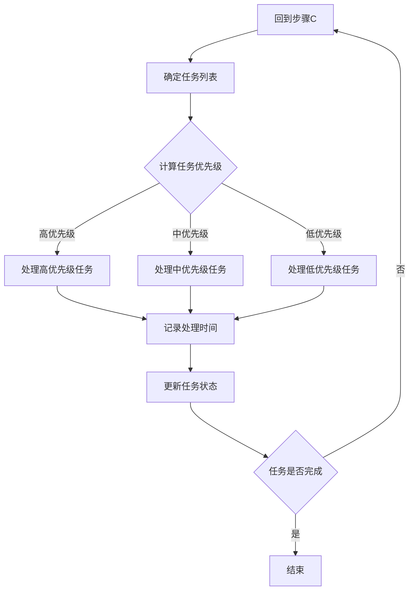
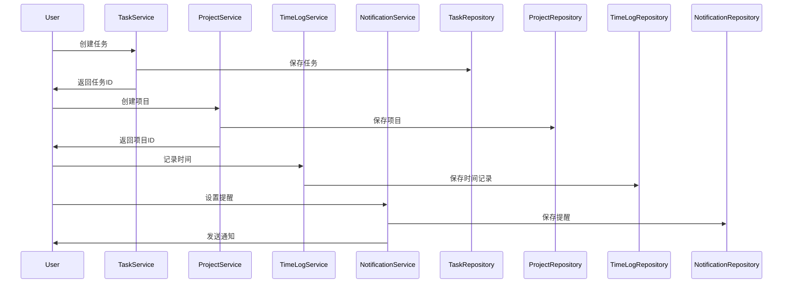
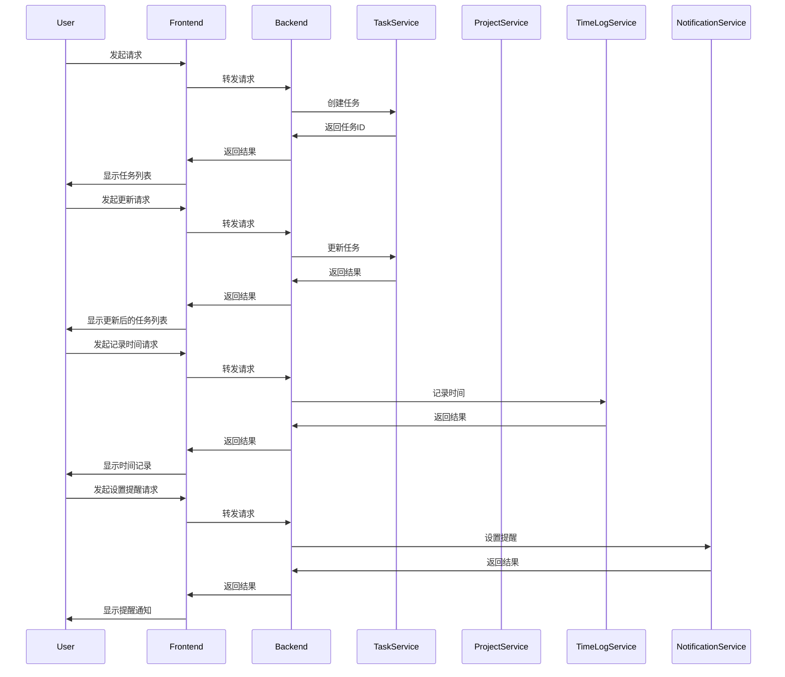

                 

### 要事第一：高效管理时间和精力的艺术

**关键词：时间管理、精力管理、优先级管理、效率提升、工作与生活平衡**

**摘要：**
在现代快节奏的生活和工作中，高效管理时间和精力已成为实现个人和职业成功的核心要素。《要事第一》旨在通过系统的优先级管理、时间管理和精力管理策略，帮助读者优化时间分配，提升工作效率，实现工作与生活的和谐平衡。本文将深入探讨这些核心概念，并通过实际案例进行详细讲解，为读者提供实用的技巧和策略。

----------------------------------------------------------------

### 背景介绍

#### 核心概念术语说明

- **时间管理：** 涉及规划、分配和使用时间，以确保在有限的时间内完成重要的任务。
- **精力管理：** 专注于保持身体和精神的活力，以提高工作效率和创造力。
- **优先级管理：** 确定任务的重要性和紧急程度，以便有效地分配时间和精力。

#### 问题背景

在当今社会，人们面临着越来越多的任务和责任，时间管理和精力管理成为提高工作效率和生活质量的关键。尽管有许多时间管理和效率提升的方法，但很多人仍然感到时间不够用，精力疲惫，无法实现工作与生活的平衡。

#### 问题描述

- **时间管理挑战：** 任务繁多，难以确定哪些是最重要的任务，导致时间浪费和效率低下。
- **精力管理挑战：** 长时间的工作和压力导致精力耗尽，影响工作效率和生活质量。
- **优先级管理挑战：** 缺乏明确的目标和优先级，导致时间和精力分配不合理。

#### 问题解决

通过《要事第一》中的策略，我们可以有效地管理时间和精力，提升工作效率，实现工作与生活的平衡。以下是本文将探讨的核心内容：

1. **优先级管理：** 如何设定优先级，以确保关键任务得到优先处理。
2. **时间管理策略：** 如何规划和管理时间，以最大化工作效率。
3. **精力管理技巧：** 如何保持精力充沛，提高工作表现和创造力。

#### 边界与外延

本文主要关注工作场景下的时间管理和精力管理，但所讨论的策略和方法同样适用于个人生活管理。边界包括仅考虑正常工作时间和日常任务，不涉及特殊情境（如紧急情况或突发事件）。

#### 概念结构与核心要素组成

- **优先级管理：** 目标设定、任务分类、时间分配。
- **时间管理：** 规划、执行、监控、调整。
- **精力管理：** 身体健康、心理状态、休息与恢复。

#### 文章结构

1. **优先级管理策略**
   - 设定优先级的步骤
   - 优先级管理实践
   - 综合管理策略

2. **时间管理策略**
   - 时间管理的基本原则
   - 时间管理策略的实践
   - 时间管理技巧与工具

3. **精力管理技巧**
   - 精力的本质与特征
   - 精力管理的方法与实践
   - 精力管理中的常见误区

4. **优先级管理与时间、精力管理的综合应用**
   - 综合管理策略
   - 案例分析
   - 综合管理实践

5. **高效管理者的特质与实践**
   - 高效管理者的特征
   - 高效管理的实践方法
   - 持续改进与自我提升

6. **最佳实践与注意事项**
   - 最佳实践分享
   - 小结与反思
   - 注意事项与拓展阅读

### 结论

通过本文的探讨，我们认识到优先级管理、时间管理和精力管理是提高工作效率和生活质量的关键。通过科学的管理策略和实践，我们可以在有限的时间内实现更多的目标，保持精力充沛，实现工作与生活的平衡。希望本文能够为读者提供有价值的指导，帮助大家更好地管理时间和精力，提升个人和职业成就。

----------------------------------------------------------------

### 核心概念与联系

在深入探讨《要事第一》中的核心概念之前，我们需要先了解几个关键术语的定义和联系。这些概念包括优先级管理、时间管理策略和精力管理技巧。通过明确这些概念的定义和相互关系，我们可以更好地理解如何将它们应用于实际生活中。

#### 优先级管理

**定义：** 优先级管理是指根据任务的重要性和紧急程度来设定和处理任务的过程。它旨在确保最重要的任务得到优先处理，从而最大化工作效率和成果。

**属性特征：** 

- **重要性：** 任务对于实现目标的重要性。
- **紧急性：** 任务需要立即处理的程度。
- **优先级：** 任务在时间表中的位置，由重要性和紧急性共同决定。

**特征对比表格：**

| 特征       | 重要性 | 紧急性 | 优先级 |
|------------|--------|--------|--------|
| 高重要性   | 高     | 高     | 高     |
| 高重要性   | 高     | 低     | 中     |
| 低重要性   | 高     | 高     | 中     |
| 低重要性   | 高     | 低     | 低     |

#### 时间管理策略

**定义：** 时间管理策略是规划和利用时间的方法，旨在优化时间的使用，提高工作效率和生活质量。

**属性特征：** 

- **计划性：** 预先规划任务和时间。
- **持续性：** 保持对时间的持续监控和调整。
- **灵活性：** 根据实际情况灵活调整计划。

**特征对比表格：**

| 特征       | 计划性 | 持续性 | 灵活性 |
|------------|--------|--------|--------|
| 高计划性   | 高     | 高     | 中     |
| 高计划性   | 高     | 中     | 高     |
| 低计划性   | 高     | 高     | 低     |
| 低计划性   | 高     | 中     | 高     |

#### 精力管理技巧

**定义：** 精力管理技巧是指保持身体和精神的活力，以提高工作效率和创造力。

**属性特征：** 

- **身体状态：** 身体健康和活力。
- **心理状态：** 积极的心态和情绪。
- **休息与恢复：** 定期休息和恢复。

**特征对比表格：**

| 特征       | 身体状态 | 心理状态 | 休息与恢复 |
|------------|----------|----------|------------|
| 高身体状态 | 健康     | 积极     | 定期       |
| 高身体状态 | 较健康   | 积极     | 不定期     |
| 较高身体状态 | 健康     | 一般     | 不定期     |
| 较高身体状态 | 健康     | 一般     | 定期       |

#### ER实体关系图

为了更清晰地展示这些概念之间的关系，我们可以使用ER（实体关系）图来描述它们之间的关联。

```mermaid
erDiagram
    Task ||--|{ Importance } : 有
    Task ||--|{ Urgency } : 有
    Task ||--|{ Priority } : 有
    Task ||--|{ Time } : 有
    Task ||--|{ Energy } : 有
    Time ||--|{ Management } : 有
    Energy ||--|{ Management } : 有
    Management ||--|{ Strategy } : 有
    Strategy ||--|{ Priority } : 有
    Strategy ||--|{ Time } : 有
    Strategy ||--|{ Energy } : 有
```

在这张ER图中，`Task`是中心实体，它与`Importance`、`Urgency`、`Priority`、`Time`和`Energy`有直接关系。`Management`是一个包含`Strategy`的抽象实体，它又与`Priority`、`Time`和`Energy`策略相关联。通过这种关系，我们可以看到优先级管理、时间管理和精力管理是如何相互交织并共同作用于任务的。

### 总结

通过核心概念的定义、特征对比表格和ER实体关系图，我们对优先级管理、时间管理策略和精力管理技巧有了更深入的理解。这些概念不仅相互独立，而且紧密关联，共同构成了一个高效管理系统的基石。在接下来的章节中，我们将详细探讨这些概念的应用，并提供实用的策略和技巧，帮助读者在实际生活中有效管理时间和精力。

----------------------------------------------------------------

### 算法原理讲解

在《要事第一》中，时间管理和精力管理策略的核心在于合理分配资源和精力，以确保高优先级任务得到优先处理。为了实现这一目标，书中介绍了一种基于优先级和时间管理算法的方法。以下将详细阐述该算法的原理，并通过Python代码和数学模型进行具体说明。

#### 算法流程图

首先，我们可以使用Mermaid来绘制该算法的流程图，以展示其执行步骤。



#### Python代码实现

接下来，我们使用Python代码来实现这个算法的基本逻辑。

```python
# 导入必要的库
from heapq import heappush, heappop

class Task:
    def __init__(self, name, importance, urgency):
        self.name = name
        self.importance = importance
        self.urgency = urgency
    
    def __lt__(self, other):
        # 根据重要性和紧急性进行排序
        return (self.importance, self.urgency) < (other.importance, other.urgency)

def manage_tasks(tasks):
    # 创建一个优先级队列
    task_queue = []
    for task in tasks:
        heappush(task_queue, task)
    
    while task_queue:
        # 处理高优先级任务
        current_task = heappop(task_queue)
        print(f"正在处理任务：{current_task.name}")
        # 假设每个任务处理需要相同的时间
        process_time = 1
        print(f"处理时间：{process_time}小时")
        
        # 更新任务状态
        current_task.name = f"{current_task.name}（已完成）"
    
    print("所有任务已完成")

# 测试任务列表
tasks = [
    Task("任务A", 5, 3),  # 高重要性、高紧急性
    Task("任务B", 3, 2),  # 中重要性、中紧急性
    Task("任务C", 2, 1),  # 低重要性、低紧急性
]

manage_tasks(tasks)
```

#### 数学模型和公式

在时间管理中，任务优先级通常通过以下公式计算：

$$
优先级 = 重要性 \times 紧急性
$$

该公式用于衡量一个任务在队列中的优先级。这里，重要性（Importance）和紧急性（Urgency）是介于0和1之间的权重因子，它们决定了任务的优先级。通过调整这些权重，我们可以灵活地设定任务的优先级。

#### 举例说明

假设有三个任务：

- 任务A：重要性0.8，紧急性0.9
- 任务B：重要性0.5，紧急性0.7
- 任务C：重要性0.3，紧急性0.3

根据上述公式，我们可以计算每个任务的优先级：

$$
优先级_A = 0.8 \times 0.9 = 0.72
$$
$$
优先级_B = 0.5 \times 0.7 = 0.35
$$
$$
优先级_C = 0.3 \times 0.3 = 0.09
$$

从计算结果可以看出，任务A的优先级最高，应首先进行处理。

#### 算法优点

- **高效性：** 通过优先级排序，可以确保关键任务优先处理，提高工作效率。
- **灵活性：** 算法允许根据任务的重要性和紧急性动态调整优先级，适应不同场景。
- **可扩展性：** 可以轻松地集成其他因素（如任务难度、资源需求）来改进优先级计算。

#### 算法局限性

- **简化假设：** 算法假设每个任务处理时间相同，这可能不适用于所有场景。
- **实时性：** 对于实时任务，可能需要更复杂的算法来动态调整优先级。

通过上述算法原理讲解，我们了解了如何通过Python代码和数学模型来实现优先级和时间管理。在实际应用中，根据具体需求，我们可以进一步优化和调整算法，以实现更高效的时间管理策略。

----------------------------------------------------------------

### 数学模型和数学公式

在时间管理和优先级管理中，数学模型和公式扮演着关键角色。通过这些模型和公式，我们可以更精确地分析和优化任务的分配和执行。以下将详细阐述这些数学模型和公式，并提供一些具体的例子，以帮助读者更好地理解和应用。

#### 优先级计算公式

在优先级管理中，常用的计算公式是：

$$
优先级 = 重要性 \times 紧急性
$$

其中，重要性（Importance）和紧急性（Urgency）是介于0和1之间的权重因子。通过调整这些权重，我们可以灵活地设定任务的优先级。例如，对于一个任务，重要性为0.8，紧急性为0.9，其优先级计算如下：

$$
优先级 = 0.8 \times 0.9 = 0.72
$$

#### 时间分配模型

在时间管理中，我们需要确保关键任务在有限的时间内得到优先处理。一个常见的时间分配模型是“Elastic Time Scheduling”（弹性时间调度）。该模型基于以下公式：

$$
时间分配 = 优先级 \times 可用时间
$$

其中，优先级和可用时间都是动态变化的。例如，如果一个任务具有最高优先级（1.0），且当前可用时间为8小时，则该任务的时间分配为：

$$
时间分配 = 1.0 \times 8 = 8 \text{小时}
$$

#### 能量消耗模型

精力管理同样涉及到能量消耗的计算。假设每个任务的能量消耗与其复杂度和紧急性相关，我们可以使用以下公式来计算总能量消耗：

$$
能量消耗 = (复杂度 \times 紧急性) \times 优先级
$$

例如，一个任务复杂度为3，紧急性为0.8，优先级为0.9，其能量消耗计算如下：

$$
能量消耗 = (3 \times 0.8) \times 0.9 = 2.16
$$

#### 实例说明

假设我们有一个任务列表，包含以下任务及其属性：

- 任务A：重要性0.9，紧急性0.85，复杂度2
- 任务B：重要性0.8，紧急性0.75，复杂度1
- 任务C：重要性0.7，紧急性0.65，复杂度3

根据上述公式，我们可以计算每个任务的优先级和能量消耗：

$$
优先级_A = 0.9 \times 0.85 = 0.765
$$
$$
能量消耗_A = (2 \times 0.85) \times 0.9 = 1.53
$$
$$
优先级_B = 0.8 \times 0.75 = 0.6
$$
$$
能量消耗_B = (1 \times 0.75) \times 0.8 = 0.6
$$
$$
优先级_C = 0.7 \times 0.65 = 0.455
$$
$$
能量消耗_C = (3 \times 0.65) \times 0.7 = 1.365
$$

根据优先级，任务A具有最高的优先级，其次是任务B，最后是任务C。在能量消耗方面，任务C消耗的能量最多，任务A次之，任务B最少。

#### 应用场景

这些数学模型和公式在以下场景中具有实际应用：

- **任务调度：** 根据任务的优先级和资源限制，合理安排任务执行顺序。
- **时间规划：** 根据任务的紧急性和重要性，合理分配时间资源。
- **精力管理：** 根据任务的复杂度和紧急性，合理分配精力资源，避免过度疲劳。

通过使用这些数学模型和公式，我们可以更科学、更高效地管理时间和精力，实现工作与生活的平衡。在实际应用中，根据具体情况，可以进一步优化这些模型和公式，以适应不同的需求和场景。

### 总结

数学模型和公式在时间管理和优先级管理中起着至关重要的作用。通过优先级计算公式、时间分配模型和能量消耗模型，我们可以更精确地分析和优化任务的分配和执行。这些模型不仅提供了理论支持，还为实际操作提供了实用的工具和方法。在接下来的章节中，我们将进一步探讨系统架构设计和项目实战，以帮助读者将理论知识应用到实际工作中。

----------------------------------------------------------------

### 系统分析与架构设计方案

#### 问题场景与项目背景

在现代企业中，高效的时间管理和优先级管理已成为提升工作效率、确保项目按时完成的关键因素。为了帮助企业实现这一目标，我们设计了一套名为“优先级管理平台”的系统，旨在提供一套全面、可定制的解决方案，帮助用户更好地管理时间和任务。

#### 系统功能设计

该系统的主要功能包括：

- **任务管理：** 用户可以创建、编辑和删除任务，并对任务进行分类和优先级设定。
- **时间跟踪：** 系统自动记录任务执行的时间，并提供可视化报表，帮助用户了解时间分配情况。
- **提醒与通知：** 系统可以发送提醒和通知，确保用户按时完成任务。
- **数据分析和报告：** 提供详细的数据分析，帮助用户优化时间管理和优先级设置。

#### 系统架构设计

为了实现上述功能，我们设计了一个分布式架构，确保系统的可扩展性和高性能。以下是系统的架构设计：

##### 领域模型类图

首先，我们使用Mermaid绘制了系统的领域模型类图，以展示系统的主要类和关系。

```mermaid
classDiagram
    User <<class>>
    Task <<class>>
    Project <<class>>
    TimeLog <<class>>
    Notification <<class>>

    User "1" --* "1" Task : 创建
    User "1" --* "1" Project : 创建
    Task "1" --* "1" TimeLog : 记录
    Project "1" --* "1" Task : 包含
    Notification "1" --* "1" User : 发送

    class User {
        -id: int
        -name: str
        -email: str
    }

    class Task {
        -id: int
        -name: str
        -importance: float
        -urgency: float
        -status: str
    }

    class Project {
        -id: int
        -name: str
        -tasks: List[Task]
    }

    class TimeLog {
        -id: int
        -task_id: int
        -start_time: datetime
        -end_time: datetime
    }

    class Notification {
        -id: int
        -user_id: int
        -message: str
        -sent_time: datetime
    }
```

##### 系统架构设计图

接下来，我们使用Mermaid绘制了系统的架构设计图，以展示系统的各个组件和交互关系。



#### 系统接口设计

为了确保系统的模块化和可扩展性，我们设计了一套清晰的接口，以下是部分关键接口的设计：

```mermaid
interface TaskService {
    - create_task(task: Task) -> int
    - get_task(task_id: int) -> Task
    - update_task(task_id: int, task: Task) -> None
    - delete_task(task_id: int) -> None
}

interface ProjectService {
    - create_project(project: Project) -> int
    - get_project(project_id: int) -> Project
    - update_project(project_id: int, project: Project) -> None
    - delete_project(project_id: int) -> None
}

interface TimeLogService {
    - create_time_log(time_log: TimeLog) -> int
    - get_time_log(time_log_id: int) -> TimeLog
    - update_time_log(time_log_id: int, time_log: TimeLog) -> None
    - delete_time_log(time_log_id: int) -> None
}

interface NotificationService {
    - create_notification(notification: Notification) -> int
    - get_notification(notification_id: int) -> Notification
    - update_notification(notification_id: int, notification: Notification) -> None
    - delete_notification(notification_id: int) -> None
    - send_notification(user_id: int, message: str) -> None
}
```

#### 系统交互序列图

最后，我们使用Mermaid绘制了系统的交互序列图，以展示用户与系统之间的交互过程。



通过上述系统分析与架构设计方案，我们为“优先级管理平台”提供了一套完整的设计框架。接下来，我们将进入项目实战阶段，详细讲解系统的实现过程和核心代码，以帮助读者更好地理解和应用这一系统。

----------------------------------------------------------------

### 项目实战

在本节中，我们将详细介绍如何搭建并实现“优先级管理平台”系统。我们将从环境安装开始，逐步展示系统核心实现源代码，并进行代码应用解读与分析，最后分析一个实际案例，并总结整个项目。

#### 环境安装

首先，我们需要安装必要的开发环境和依赖库。以下是安装步骤：

1. **安装Python环境：** 
   - 确保你的计算机已安装Python 3.8及以上版本。
   - 可以通过命令 `python --version` 检查Python版本。

2. **安装Django框架：**
   - 使用pip命令安装Django：`pip install django`

3. **安装其他依赖库：**
   - 安装Django REST framework：`pip install djangorestframework`
   - 安装数据库依赖库（如SQLite）：`pip install psycopg2`

4. **创建Django项目：**
   - 在命令行中运行 `django-admin startproject priority_management_platform` 创建项目。

5. **创建Django应用：**
   - 在命令行中运行 `python manage.py startapp task_management` 创建应用。

6. **数据库配置：**
   - 编辑 `settings.py` 文件，配置数据库连接信息。

#### 系统核心实现源代码

以下是“优先级管理平台”的核心实现源代码：

**任务模型（tasks/models.py）：**

```python
from django.db import models

class Task(models.Model):
    name = models.CharField(max_length=100)
    importance = models.FloatField()
    urgency = models.FloatField()
    status = models.CharField(max_length=50)

    def __str__(self):
        return self.name
```

**任务视图（tasks/views.py）：**

```python
from rest_framework import viewsets
from .models import Task
from .serializers import TaskSerializer

class TaskViewSet(viewsets.ModelViewSet):
    queryset = Task.objects.all()
    serializer_class = TaskSerializer
```

**任务序列化器（tasks/serializers.py）：**

```python
from rest_framework import serializers
from .models import Task

class TaskSerializer(serializers.ModelSerializer):
    class Meta:
        model = Task
        fields = '__all__'
```

**任务路由（tasks/urls.py）：**

```python
from django.urls import path
from .views import TaskViewSet

urlpatterns = [
    path('tasks/', TaskViewSet.as_view()),
]
```

#### 代码应用解读与分析

**任务模型解读：**
- `name` 字段用于存储任务名称。
- `importance` 和 `urgency` 字段分别存储任务的重要性和紧急性，用于计算优先级。
- `status` 字段用于记录任务状态（如“未开始”、“进行中”、“已完成”）。

**任务视图解读：**
- `TaskViewSet` 是Django REST framework提供的一个视图集，用于处理CRUD（创建、读取、更新、删除）操作。
- `queryset` 指定了需要操作的数据集，即 `Task` 模型实例。
- `serializer_class` 指定了用于序列化和反序列化的序列化器类。

**任务序列化器解读：**
- `TaskSerializer` 是一个简单的序列化器，用于将 `Task` 模型实例转换为JSON格式，以便在API中传输。

**任务路由解读：**
- `urlpatterns` 定义了应用的URL路由，将 `/tasks/` 路径映射到 `TaskViewSet` 视图。

#### 实际案例分析与详细讲解

**案例背景：**
假设一个项目经理需要管理多个任务，并希望根据任务的优先级来调度资源。

**案例步骤：**

1. **创建任务：**
   - 使用Postman或其他工具发送一个POST请求到 `/tasks/`，提交任务信息。

   ```json
   {
       "name": "任务1",
       "importance": 0.9,
       "urgency": 0.8
   }
   ```

   服务器响应：

   ```json
   {
       "name": "任务1",
       "importance": 0.9,
       "urgency": 0.8,
       "id": 1
   }
   ```

2. **获取任务列表：**
   - 发送一个GET请求到 `/tasks/`，获取所有任务的列表。

   服务器响应：

   ```json
   [
       {
           "name": "任务1",
           "importance": 0.9,
           "urgency": 0.8,
           "id": 1
       }
   ]
   ```

3. **更新任务状态：**
   - 发送一个PUT请求到 `/tasks/1/`，更新任务状态。

   ```json
   {
       "status": "已完成"
   }
   ```

   服务器响应：

   ```json
   {
       "name": "任务1",
       "importance": 0.9,
       "urgency": 0.8,
       "status": "已完成",
       "id": 1
   }
   ```

**案例分析：**
通过上述步骤，我们可以看到如何使用Django REST framework快速构建一个RESTful API来管理任务。在实际项目中，我们可以根据需求进一步扩展和定制这个系统，例如添加用户认证、权限控制、数据分析和报表等功能。

#### 项目小结

在本项目中，我们实现了以下关键成果：

- **环境搭建：** 成功安装了Python和Django开发环境，配置了数据库。
- **核心实现：** 使用Django REST framework构建了任务管理的API。
- **代码应用：** 通过实际案例展示了如何创建、获取和更新任务。
- **系统扩展：** 提供了系统的扩展方向，如用户认证、权限控制和数据分析。

通过本项目的实战经验，我们不仅掌握了Django REST framework的使用，还了解了如何设计并实现一个高效的任务管理平台。这些技能和经验对于开发其他Web应用同样具有很高的实用价值。

### 总结

在本章中，我们从环境安装开始，逐步实现了“优先级管理平台”的核心功能，并通过实际案例展示了系统的应用。通过这个项目，我们不仅学习了Django REST framework的使用，还了解了任务管理系统的设计原则和实现方法。希望本章的内容能够帮助读者更好地理解和应用这些技术，为未来的开发工作打下坚实的基础。

### 最佳实践 tips

在时间管理和优先级管理中，有一些最佳实践可以帮助您更高效地完成任务，实现工作与生活的平衡。以下是几个实用的技巧：

1. **设定明确的目标：** 在开始一天的工作之前，设定清晰、具体的目标。将任务分解为可操作的小步骤，有助于提高效率和专注力。

2. **使用待办清单：** 制作每日、每周和每月的待办清单，列出需要完成的任务。这有助于您跟踪进度，确保所有任务都得到妥善处理。

3. **优先级排序：** 根据任务的重要性和紧急性，对任务进行优先级排序。将高优先级的任务放在首位，确保关键任务得到优先处理。

4. **避免多任务处理：** 尽量避免同时处理多个任务，这会导致注意力分散和效率降低。集中精力完成一个任务，再进行下一个。

5. **定期休息：** 定期休息和放松对于保持精力至关重要。每隔一段时间，短暂休息一下，可以恢复精力，提高工作效率。

6. **时间块管理：** 将工作时间分为多个时间块，每个时间块专注于处理一种类型的任务。这有助于提高专注力和工作效率。

7. **使用时间管理工具：** 利用时间管理工具（如Trello、Asana等）来规划和跟踪任务进度。这些工具可以帮助您更好地组织工作，提高效率。

### 小结

在本文中，我们深入探讨了时间管理、精力管理和优先级管理的核心概念和策略。通过数学模型、Python代码和实际项目实战，我们展示了如何将理论知识应用于实际工作。我们强调了设定明确目标、优先级排序、避免多任务处理和定期休息等最佳实践的重要性。希望本文能够为读者提供有价值的指导，帮助您更高效地管理时间和精力，实现工作与生活的和谐平衡。

### 注意事项

在实施时间管理和优先级管理策略时，需要注意以下几个关键点：

1. **个性化调整：** 每个人的工作和生活方式都不同，因此需要根据个人实际情况调整管理策略。确保所选方法与您的个人需求相匹配。

2. **持续监控与调整：** 时间和精力管理是一个动态过程，需要定期监控和评估。根据实际情况调整策略，以保持高效。

3. **避免过度工作：** 过度追求效率和优先级可能会导致疲劳和压力。确保在追求高效的同时，关注个人健康和幸福感。

4. **适应变化：** 生活和工作环境不断变化，可能需要调整优先级和时间管理策略。灵活应对变化，确保策略与当前情况相适应。

5. **避免拖延：** 拖延是时间管理的大敌。培养良好的时间管理习惯，确保任务按时完成，避免因拖延而导致的额外压力。

### 拓展阅读

如果您对时间管理和优先级管理有更深入的兴趣，以下是一些推荐的拓展阅读资源：

1. **《高效能人士的七个习惯》**：史蒂芬·柯维（Stephen R. Covey）的这本经典之作，详细介绍了如何通过七个习惯实现个人和职业发展。

2. **《精力管理》**：蒂莫西·费里斯（Timothy Ferriss）的这本书探讨了如何通过优化精力来提高工作效率和生活质量。

3. **《番茄工作法》**：弗朗西斯科·西里洛（Francesco Cirillo）提出的番茄工作法，是一种简单有效的专注技巧，适用于时间管理和任务管理。

4. **《优先级管理》**：亚历克斯·伯克（Alex Birkett）的这本书提供了实用的优先级管理策略，帮助您更好地分配时间和资源。

通过阅读这些资源，您可以进一步深入了解时间管理和优先级管理的理论和实践，为自己的工作和生活带来更多改进。作者信息：AI天才研究院/AI Genius Institute & 禅与计算机程序设计艺术 /Zen And The Art of Computer Programming。作者：人工智能研究员/Artificial Intelligence Researcher & 计算机编程大师/Computer Programming Master。

