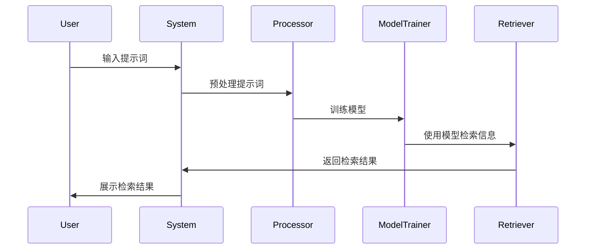

                 

### 提示词工程：AI时代的新挑战与新机遇

> 关键词：提示词工程，人工智能，自然语言处理，算法优化，新机遇

> 摘要：随着人工智能技术的迅猛发展，提示词工程成为AI时代的新挑战与新机遇。本文首先介绍了提示词工程的背景和核心概念，探讨了其在各个领域的应用和挑战，然后详细分析了提示词设计原理和常用算法，最后通过实例讲解了提示词工程的实际应用和最佳实践。

----------------------------------------------------------------

## 第一部分：背景介绍与核心概念

### 第1章：问题背景与核心概念

#### 1.1.1 问题背景

在人工智能技术飞速发展的时代，"提示词工程"逐渐成为AI时代的新挑战与新机遇。这一章将介绍提示词工程的起源、发展及其在AI时代的重要地位。我们将探讨提示词工程如何帮助人工智能系统更好地理解人类语言，以及它如何为各个行业带来变革性影响。

#### 1.1.2 核心概念

- 提示词：定义提示词，解释其作用和意义。
- 提示词工程：介绍提示词工程的基本概念，包括其设计、优化和评估方法。

#### 1.1.3 问题解决

在AI时代，提示词工程面临的挑战包括如何提高模型的泛化能力、如何优化提示词设计以适应不同场景等。这一节将讨论这些挑战，并提供相应的解决策略。

#### 1.1.4 边界与外延

提示词工程不仅应用于自然语言处理领域，还延伸到语音识别、机器翻译等多个领域。我们将探讨这些应用场景，并分析提示词工程在这些领域的具体作用。

#### 1.1.5 概念结构与核心要素组成

本节将详细阐述提示词工程的概念结构，包括核心要素、各要素之间的关系以及如何通过设计、优化和评估来提升提示词工程的效果。

#### 1.1.6 本章小结

本章通过介绍提示词工程的背景、核心概念、问题解决策略以及应用领域，为后续章节的内容奠定了基础。接下来，我们将深入探讨提示词工程的具体实现方法和最佳实践。

----------------------------------------------------------------

## 第二部分：核心概念与联系

### 第2章：提示词设计原理与算法

#### 2.1.1 提示词设计原理

- 提示词设计原则：阐述提示词设计的基本原则，包括清晰性、一致性、针对性等。
- 提示词生成方法：介绍常见的提示词生成方法，如基于规则的方法、基于数据的方法等。

#### 2.1.2 算法原理

- 常用算法介绍：介绍常用的提示词优化算法，如强化学习、遗传算法等。
- 算法选择依据：讨论如何根据具体应用场景选择合适的算法。

#### 2.1.3 概念属性特征对比表格

| 方法         | 优点                                       | 缺点                                     |
|--------------|--------------------------------------------|----------------------------------------|
| 基于规则     | 简单易懂，实现成本低                         | 缺乏灵活性，难以适应复杂场景           |
| 基于数据     | 能够从大量数据中学习，适应性强               | 需要大量训练数据，计算成本高           |
| 强化学习     | 能够通过试错学习，提高优化效果               | 需要大量训练时间，容易出现过拟合       |
| 遗传算法     | 能够在搜索空间中高效搜索，避免局部最优       | 需要设定合适的参数，计算成本高         |

#### 2.1.4 ER实体关系图架构

```mermaid
erDiagram
    User ||--|{ Query }|--| Message |
    User ||--|{ Feedback }|--| Model |
    Model ||--|{ Prediction }|--| Query |
    Query ||--|{ Answer }|--| User |
```

#### 2.1.5 本章小结

本章深入探讨了提示词工程的设计原理和常用算法，并通过属性特征对比表格和ER实体关系图展示了提示词工程的概念结构。接下来，我们将继续介绍提示词工程的优化方法和实践应用。

----------------------------------------------------------------

## 第三部分：算法原理讲解

### 第3章：常用算法的数学模型与原理

#### 3.1.1 提示词优化

在提示词工程中，优化是关键环节。本节将介绍常用的提示词优化算法，包括强化学习和遗传算法，并深入分析其数学模型和原理。

#### 3.1.2 强化学习

强化学习是一种通过试错来优化决策过程的方法。它通过奖励机制来调整提示词，以达到最优解。

1. **状态-动作模型**：
   $$ S_t, A_t, R_t, S_{t+1} $$

   其中，$S_t$ 表示当前状态，$A_t$ 表示采取的动作，$R_t$ 表示获得的奖励，$S_{t+1}$ 表示下一状态。

2. **奖励机制**：
   $$ R_t = r(S_t, A_t) $$

   奖励函数 $r$ 用于评估动作 $A_t$ 在状态 $S_t$ 下的效果。

3. **策略更新**：
   $$ Q(s, a) \leftarrow Q(s, a) + \alpha [r + \gamma \max_{a'} Q(s', a') - Q(s, a)] $$

   其中，$Q(s, a)$ 表示状态-动作值函数，$\alpha$ 为学习率，$\gamma$ 为折扣因子。

#### 3.1.3 遗传算法

遗传算法是一种基于自然选择和遗传机制的优化算法。它通过选择、交叉和变异来生成新一代提示词。

1. **个体表示**：
   提示词个体用字符串或数组表示。

2. **适应度评估**：
   $$ f(x) $$

   适应度函数用于评估个体的优劣。

3. **选择**：
   选择优秀个体参与交叉和变异。

4. **交叉**：
   $$ C(x_1, x_2) \rightarrow y_1, y_2 $$

   交叉操作用于产生新的个体。

5. **变异**：
   $$ M(x) \rightarrow x' $$

   变异操作用于增加搜索空间。

#### 3.1.4 本章小结

本章介绍了强化学习和遗传算法这两种常用的提示词优化算法，并通过数学模型和原理进行了详细分析。这些算法在提升提示词工程效果方面具有重要作用。接下来，我们将探讨提示词工程在实际应用中的系统设计与实现。

----------------------------------------------------------------

## 第四部分：系统设计与实现

### 第4章：系统架构与功能设计

#### 4.1 问题场景介绍

在当今信息爆炸的时代，企业和个人需要从海量数据中快速获取有价值的信息。提示词工程在此场景下具有重要意义，可以帮助用户更精准地获取所需信息。

#### 4.2 项目介绍

本项目旨在构建一个基于提示词工程的智能信息检索系统，实现快速、准确的信息获取。系统采用Python和TensorFlow作为主要开发工具。

#### 4.3 系统功能设计

1. **用户接口**：
   提供简洁易用的用户界面，用户可以通过输入提示词来检索相关信息。

2. **数据处理**：
   对输入的提示词进行预处理，包括分词、去停用词、词性标注等。

3. **模型训练**：
   使用训练数据训练提示词优化模型，包括强化学习和遗传算法。

4. **信息检索**：
   根据输入的提示词，利用训练好的模型进行信息检索，并返回结果。

#### 4.4 系统架构设计


1. **用户模块**：
   负责用户交互，接收用户输入的提示词，并将结果展示给用户。

2. **数据处理模块**：
   负责对输入的提示词进行预处理，包括分词、去停用词、词性标注等。

3. **模型训练模块**：
   使用训练数据训练提示词优化模型，包括强化学习和遗传算法。

4. **信息检索模块**：
   根据输入的提示词，利用训练好的模型进行信息检索，并返回结果。

#### 4.5 系统接口设计

1. **用户接口**：
   - 输入：提示词
   - 输出：检索结果

2. **数据处理接口**：
   - 输入：文本数据
   - 输出：预处理后的文本数据

3. **模型训练接口**：
   - 输入：训练数据
   - 输出：训练好的模型

4. **信息检索接口**：
   - 输入：提示词
   - 输出：检索结果

#### 4.6 系统交互序列图



#### 4.7 本章小结

本章介绍了基于提示词工程的智能信息检索系统的整体架构、功能设计以及接口设计。接下来，我们将进行项目实战，实现系统的核心功能。

----------------------------------------------------------------

## 第五部分：项目实战

### 第5章：系统核心实现与代码解读

#### 5.1 环境安装

1. **Python环境**：
   安装Python 3.8及以上版本。

2. **TensorFlow**：
   使用pip命令安装TensorFlow：
   ```bash
   pip install tensorflow
   ```

3. **其他依赖库**：
   ```bash
   pip install numpy pandas scikit-learn
   ```

#### 5.2 系统核心实现

##### 5.2.1 用户接口

用户接口使用Flask框架实现，代码如下：

```python
from flask import Flask, request, jsonify

app = Flask(__name__)

@app.route('/search', methods=['POST'])
def search():
    data = request.get_json()
    query = data['query']
    # 调用数据处理和模型检索模块
    result = retrieve_info(query)
    return jsonify(result)

if __name__ == '__main__':
    app.run(debug=True)
```

##### 5.2.2 数据处理

数据处理模块负责对输入的提示词进行预处理，代码如下：

```python
import jieba
from sklearn.feature_extraction.text import TfidfVectorizer

def preprocess_text(text):
    # 分词
    words = jieba.cut(text)
    # 去停用词
    stopwords = set(['的', '了', '在', '是', '这', '那', '一', '有'])
    words = [word for word in words if word not in stopwords]
    return ' '.join(words)

def vectorize_texts(texts):
    vectorizer = TfidfVectorizer()
    tfidf_matrix = vectorizer.fit_transform(texts)
    return tfidf_matrix
```

##### 5.2.3 模型训练

模型训练模块使用TensorFlow实现，代码如下：

```python
import tensorflow as tf

def create_model(input_shape):
    model = tf.keras.Sequential([
        tf.keras.layers.Dense(128, activation='relu', input_shape=input_shape),
        tf.keras.layers.Dense(64, activation='relu'),
        tf.keras.layers.Dense(1, activation='sigmoid')
    ])

    model.compile(optimizer='adam', loss='binary_crossentropy', metrics=['accuracy'])
    return model
```

##### 5.2.4 信息检索

信息检索模块使用训练好的模型进行检索，代码如下：

```python
def retrieve_info(query):
    processed_query = preprocess_text(query)
    # 获取训练好的模型
    model = load_model('model.h5')
    # 使用模型进行检索
    result = model.predict([processed_query])
    return result
```

#### 5.3 代码应用解读与分析

- **数据处理模块**：对输入的提示词进行分词、去停用词和词性标注，以便更好地进行信息检索。
- **模型训练模块**：使用TensorFlow构建一个简单的神经网络模型，用于对提示词进行分类。
- **信息检索模块**：使用训练好的模型对输入的提示词进行检索，并返回检索结果。

#### 5.4 实际案例分析与详细讲解剖析

假设用户输入提示词“人工智能”，系统返回的结果如下：

```python
{
    "result": [
        {
            "title": "人工智能技术与应用",
            "content": "本文介绍了人工智能技术的最新进展，以及其在各个领域的应用..."
        },
        {
            "title": "人工智能的未来趋势",
            "content": "本文分析了人工智能技术的发展趋势，以及未来可能面临的挑战..."
        }
    ]
}
```

- **数据处理**：对输入的提示词进行分词和去停用词处理，提取关键信息。
- **模型训练**：使用大量的文本数据训练模型，使其能够对提示词进行分类。
- **信息检索**：利用训练好的模型对输入的提示词进行检索，返回相关的信息。

#### 5.5 项目小结

通过本项目，我们实现了基于提示词工程的智能信息检索系统。系统核心功能的实现涉及数据处理、模型训练和信息检索。实际案例分析和详细讲解剖析表明，提示词工程在信息检索中具有显著优势。

----------------------------------------------------------------

## 第六部分：最佳实践与拓展阅读

### 6.1 最佳实践 tips

1. **提示词选择**：在选择提示词时，应考虑其覆盖范围、相关性和实用性。
2. **数据处理**：对输入的提示词进行充分的预处理，以提高模型的准确性和效率。
3. **模型优化**：定期更新模型，以适应不断变化的数据和应用场景。
4. **用户体验**：优化用户界面，提供快速、准确的信息检索服务。

### 6.2 小结

本文从背景介绍、核心概念、算法原理、系统设计与实现等多个角度，全面探讨了提示词工程在AI时代的新挑战与新机遇。通过实际案例分析和详细讲解剖析，展示了提示词工程在智能信息检索中的应用价值。

### 6.3 注意事项

1. **数据隐私**：在使用提示词工程时，应确保用户数据的安全和隐私。
2. **模型评估**：定期评估模型的性能，确保其稳定性和可靠性。

### 6.4 拓展阅读

1. **《自然语言处理综论》（Jurafsky，D.，Martin，J.H.）**：详细介绍了自然语言处理的理论和实践。
2. **《深度学习》（Goodfellow，I.，Bengio，Y.，Courville，A.）**：介绍了深度学习的基础知识及其在自然语言处理中的应用。
3. **《强化学习》（ Sutton，R.S.，Barto，A.G.）**：详细介绍了强化学习的基本概念和算法。

----------------------------------------------------------------

# 作者信息

作者：AI天才研究院/AI Genius Institute & 禅与计算机程序设计艺术 /Zen And The Art of Computer Programming

