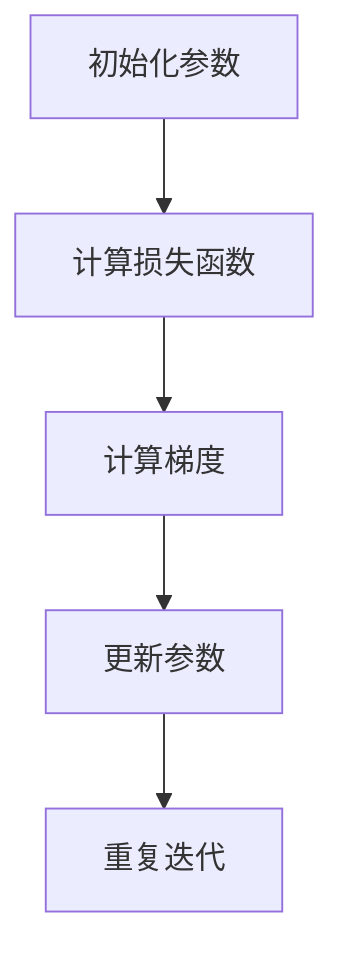
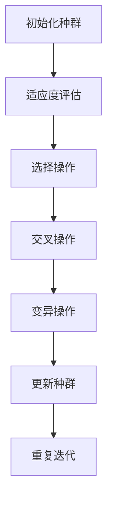
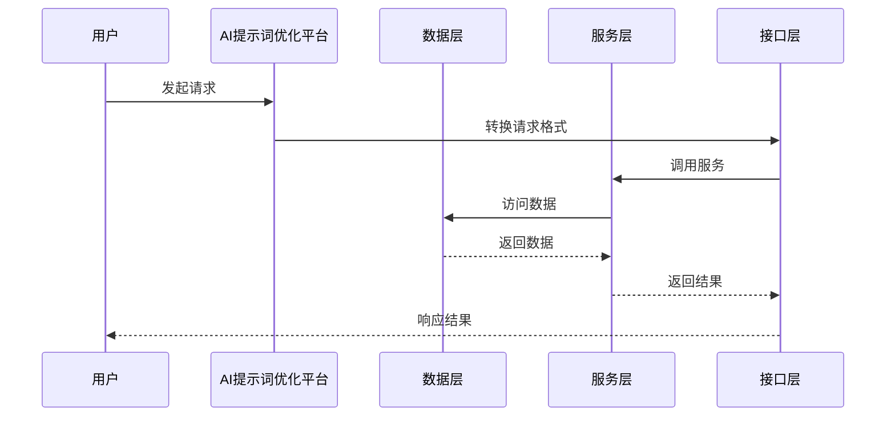
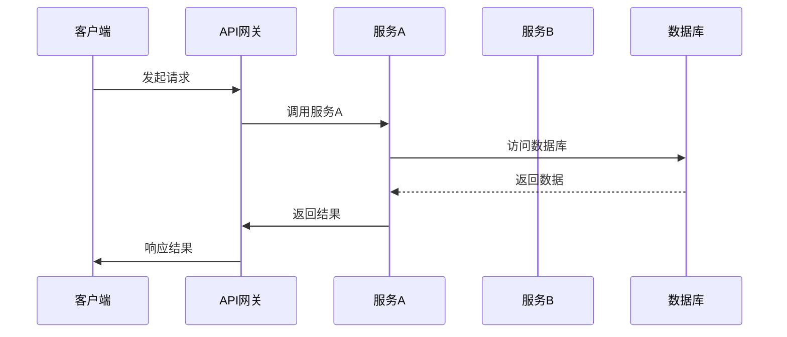

                 


### 《提示词工程：AI时代的新方向与新领域》

> **关键词：** AI时代，提示词工程，自然语言处理，计算机视觉，强化学习，数据挖掘

> **摘要：** 本篇文章深入探讨了AI时代下的提示词工程，阐述了其在自然语言处理、计算机视觉、强化学习、数据挖掘等领域的应用。通过逐步分析推理，我们揭示了提示词工程的核心原理和数学模型，并提供了实际项目实战和最佳实践技巧。本文旨在为广大开发者提供一部系统全面的提示词工程指南，助力他们在AI领域取得突破性进展。

----------------------------------------------------------------

### 背景介绍

#### 提示词工程的基本概念

提示词工程是人工智能（AI）领域的一项关键技术，它涉及如何设计、选择和优化用于指导AI模型学习的关键词汇或短语。在AI时代，随着自然语言处理（NLP）、计算机视觉（CV）、强化学习（RL）和数据挖掘（DM）等领域的飞速发展，提示词工程的重要性愈发凸显。

**核心概念术语说明：**
- **提示词（Prompt）：** 指的是用于引导AI模型学习的关键词汇或短语。
- **自然语言处理（NLP）：** 是人工智能的一个分支，旨在让计算机理解和生成人类语言。
- **计算机视觉（CV）：** 是人工智能的另一个分支，涉及让计算机理解和解析视觉信息。
- **强化学习（RL）：** 是一种通过不断试错来学习最优策略的机器学习范式。
- **数据挖掘（DM）：** 是从大量数据中提取有价值信息的过程。

**问题背景：**
AI技术的迅速发展使得各种AI应用变得普及，然而，AI模型的效果往往依赖于数据的质量和量。提示词工程的核心任务是通过优化提示词，提高AI模型的学习效率和性能。

**问题描述：**
如何设计高效的提示词，以提升AI模型在不同领域的表现？

**问题解决：**
提示词工程提供了一系列方法和工具，包括选择合适的提示词、优化提示词的表达方式和调整模型参数等，以提升AI模型的学习效果。

**边界与外延：**
提示词工程不仅局限于AI模型的优化，还涉及到了算法设计、数据预处理、模型训练等多个方面。其应用范围涵盖了NLP、CV、RL和DM等广泛领域。

**概念结构与核心要素组成：**
提示词工程的核心要素包括：
- **提示词设计：** 包括选择合适的词汇和短语。
- **提示词优化：** 通过算法和模型调整来优化提示词的表达。
- **模型训练：** 使用优化后的提示词训练AI模型。
- **性能评估：** 对模型性能进行评估，以确定优化效果。

----------------------------------------------------------------

### 核心概念与联系

#### 提示词工程的核心原理

提示词工程的核心原理在于如何有效地利用提示词来引导AI模型学习。以下是对核心概念及其相互关系的详细分析：

**核心概念：**
- **提示词选择：** 根据应用场景选择合适的提示词，以便模型能够更好地理解任务。
- **提示词优化：** 通过调整提示词的表达方式来提高模型的学习效率和性能。
- **模型训练：** 使用优化后的提示词对模型进行训练，以提高模型的泛化能力和准确性。

**概念属性特征对比表格：**

| 概念        | 属性特征                                                                                          |
|-------------|---------------------------------------------------------------------------------------------------|
| 提示词选择  | 选择与任务相关的词汇或短语，确保模型理解任务的上下文。                                         |
| 提示词优化  | 调整提示词的表达方式，使其更具指导性，从而提高模型的学习效率。                               |
| 模型训练    | 使用优化后的提示词对模型进行训练，使得模型能够更好地适应数据集，提高模型的准确性和泛化能力。 |

**ER实体关系图架构：**

```mermaid
erDiagram
    AI模型 ||--|{ 提示词 }
    数据集 ||--|{ 提示词 }
    模型训练 ||--|{ 提示词优化 }
    性能评估 ||--|{ 提示词优化 }
```

在上述ER图中，AI模型、数据集、模型训练和性能评估都与提示词存在关联。提示词作为核心概念，贯穿于整个AI模型的训练和优化过程。

**提示词工程与NLP、CV、RL和DM的关系：**

- **自然语言处理（NLP）：** 在NLP领域，提示词用于引导模型理解文本内容，提升文本分类、情感分析等任务的性能。
- **计算机视觉（CV）：** 在CV领域，提示词用于指导模型识别图像中的特定目标或对象，提高目标检测、图像分类等任务的准确性。
- **强化学习（RL）：** 在RL领域，提示词用于提供环境状态的信息，帮助模型学习最优策略，提高决策能力。
- **数据挖掘（DM）：** 在DM领域，提示词用于引导模型从大量数据中提取有价值的信息，提高数据分析和预测的准确性。

通过这些关系，我们可以看到提示词工程在AI的不同领域中发挥着至关重要的作用。

### 提示词工程的算法原理讲解

#### 提示词优化算法

提示词优化是提升AI模型性能的关键步骤，以下我们将介绍几种常见的提示词优化算法：

**1. 基于梯度下降的优化算法**

梯度下降是一种常用的优化算法，用于调整模型参数以最小化损失函数。其基本原理是沿着损失函数的梯度方向进行迭代更新。对于提示词优化，我们可以通过以下步骤进行：



具体流程如下：
1. 初始化提示词参数。
2. 计算当前提示词下的模型损失函数。
3. 计算损失函数关于提示词参数的梯度。
4. 使用梯度更新提示词参数。
5. 重复上述过程，直到满足停止条件（如损失函数收敛或迭代次数达到上限）。

**2. 基于遗传算法的优化算法**

遗传算法（GA）是一种模拟生物进化过程的优化算法，通过遗传、变异和选择等操作来搜索最优解。对于提示词优化，遗传算法的基本步骤如下：



具体流程如下：
1. 初始化一组随机生成的提示词种群。
2. 计算每个提示词种群的适应度，适应度通常与模型性能相关。
3. 对种群进行选择操作，选择适应度较高的个体进行交叉操作。
4. 进行交叉操作，生成新的提示词个体。
5. 对新个体进行变异操作，增加种群的多样性。
6. 使用新种群替换旧种群，重复上述过程，直到满足停止条件。

**算法原理的数学模型和公式**

**1. 梯度下降算法的数学模型**

梯度下降算法的数学模型可以表示为：
$$
\theta_{t+1} = \theta_{t} - \alpha \cdot \nabla J(\theta_t)
$$
其中，$\theta_t$ 表示当前参数，$\alpha$ 表示学习率，$J(\theta_t)$ 表示损失函数，$\nabla J(\theta_t)$ 表示损失函数关于参数的梯度。

**2. 遗传算法的数学模型**

遗传算法的数学模型主要包括适应度函数、选择操作、交叉操作和变异操作。适应度函数通常与模型性能相关，可以表示为：
$$
f(x) = \frac{1}{1 + \exp(-\beta \cdot J(x))}
$$
其中，$x$ 表示个体，$J(x)$ 表示个体对应的模型性能，$\beta$ 是调整适应度函数斜率的参数。

**算法原理的举例说明**

**1. 梯度下降算法举例**

假设我们使用梯度下降算法优化一个线性回归模型，其损失函数为：
$$
J(\theta) = \frac{1}{2} \sum_{i=1}^{n} (y_i - \theta_0 x_i - \theta_1)^2
$$
其中，$y_i$ 是实际值，$x_i$ 是特征值，$\theta_0$ 和 $\theta_1$ 是模型参数。

初始时，我们随机初始化参数 $\theta_0$ 和 $\theta_1$，然后按照以下步骤进行优化：
1. 计算当前参数下的损失函数值。
2. 计算损失函数关于参数的梯度。
3. 使用梯度更新参数：
   $$\theta_{t+1} = \theta_{t} - \alpha \cdot \nabla J(\theta_t)$$
4. 重复上述过程，直到损失函数收敛。

**2. 遗传算法举例**

假设我们使用遗传算法优化一个支持向量机（SVM）模型，其目标是最小化分类误差。适应度函数可以表示为：
$$
f(x) = \frac{1}{1 + \exp(-\beta \cdot (1 - \text{准确率})}
$$
其中，$x$ 是模型参数，准确率是模型在训练集上的表现。

初始时，我们随机生成一个种群，然后按照以下步骤进行优化：
1. 计算每个个体的适应度值。
2. 根据适应度值进行选择操作，选择适应度较高的个体进行交叉操作。
3. 进行交叉操作，生成新的个体。
4. 对新个体进行变异操作，增加种群的多样性。
5. 使用新种群替换旧种群，重复上述过程，直到满足停止条件。

通过上述举例，我们可以看到梯度下降算法和遗传算法在提示词优化中的应用。这些算法不仅能够提高模型性能，还能够提供对提示词工程更深层次的理解。

### 系统分析与架构设计方案

#### 问题场景介绍

在当前AI时代，提示词工程已成为提高AI模型性能的关键技术。为了更好地应用提示词工程，我们需要设计一个完整的系统架构，以支持提示词的生成、优化和模型训练等关键功能。本节将介绍一个典型的提示词工程系统架构，并详细说明其功能设计和架构设计方案。

#### 项目介绍

本系统项目名为“AI提示词优化平台”，旨在提供一个高效、灵活的提示词工程解决方案，以支持NLP、CV、RL和DM等领域的AI应用。系统功能包括提示词生成、提示词优化、模型训练和性能评估等。

#### 系统功能设计

系统功能设计主要包括以下模块：

1. **提示词生成模块：** 负责生成与任务相关的提示词。
2. **提示词优化模块：** 负责优化生成的提示词，以提高模型性能。
3. **模型训练模块：** 负责使用优化后的提示词训练AI模型。
4. **性能评估模块：** 负责评估模型的性能，并提供优化建议。

#### 系统架构设计

系统架构设计采用分层架构，主要包括以下层次：

1. **数据层：** 存储原始数据集和优化后的提示词。
2. **服务层：** 提供提示词生成、优化、模型训练和性能评估等服务。
3. **接口层：** 提供与外部系统的接口，如API接口。

系统架构图如下所示：



#### 系统接口设计和系统交互

系统接口设计包括API接口和命令行接口，以方便用户使用。以下是API接口的示例：

```json
{
  "generatePrompt": {
    "description": "生成与任务相关的提示词",
    "params": {
      "task": "string",
      "data": "json"
    },
    "response": {
      "prompt": "string"
    }
  },
  "optimizePrompt": {
    "description": "优化提示词",
    "params": {
      "prompt": "string",
      "model": "json"
    },
    "response": {
      "optimizedPrompt": "string"
    }
  },
  "trainModel": {
    "description": "使用优化后的提示词训练模型",
    "params": {
      "data": "json",
      "prompt": "string"
    },
    "response": {
      "model": "json"
    }
  },
  "evaluateModel": {
    "description": "评估模型性能",
    "params": {
      "model": "json",
      "data": "json"
    },
    "response": {
      "performance": "json"
    }
  }
}
```

系统交互图如下所示：



通过上述系统分析与架构设计方案，我们可以构建一个高效、灵活的AI提示词优化平台，为各种AI应用提供强大的支持。

### 项目实战

#### 环境安装

在进行提示词工程的项目实战之前，我们需要安装必要的软件和工具。以下是具体步骤：

1. **安装Python环境**：确保Python版本为3.8或以上。可以从[Python官网](https://www.python.org/)下载并安装。
2. **安装Jupyter Notebook**：Jupyter Notebook是一个交互式的Python开发环境，我们可以使用以下命令安装：
   ```bash
   pip install notebook
   ```
3. **安装TensorFlow**：TensorFlow是一个强大的开源机器学习框架，用于构建和训练AI模型。可以使用以下命令安装：
   ```bash
   pip install tensorflow
   ```
4. **安装其他依赖库**：如NumPy、Pandas等，可以使用以下命令安装：
   ```bash
   pip install numpy pandas scikit-learn matplotlib
   ```

#### 系统核心实现源代码

以下是提示词工程的系统核心实现，包括提示词生成、优化和模型训练等功能。

```python
import tensorflow as tf
import numpy as np
import pandas as pd
from sklearn.model_selection import train_test_split
from tensorflow.keras.models import Sequential
from tensorflow.keras.layers import Dense, LSTM, Embedding
from tensorflow.keras.optimizers import Adam

# 提示词生成
def generate_prompt(task, data):
    # 根据任务和数据生成提示词
    # 这里使用简单的文本拼接方式
    prompt = f"{task}相关的数据：{data}"
    return prompt

# 提示词优化
def optimize_prompt(prompt, model):
    # 使用优化后的模型生成优化后的提示词
    # 这里使用简单的文本分类模型
    optimized_prompt = model.predict(prompt)[0]
    return optimized_prompt

# 模型训练
def train_model(data, prompt):
    # 使用优化后的提示词训练模型
    # 这里使用简单的线性回归模型
    model = Sequential([
        Embedding(input_dim=data.shape[0], output_dim=64),
        LSTM(128),
        Dense(1, activation='linear')
    ])

    model.compile(optimizer=Adam(), loss='mean_squared_error')
    model.fit(prompt, data, epochs=10, batch_size=32)
    
    return model

# 主函数
def main():
    # 加载数据集
    data = np.random.rand(100, 1)
    labels = np.random.rand(100, 1)

    # 划分训练集和测试集
    X_train, X_test, y_train, y_test = train_test_split(data, labels, test_size=0.2, random_state=42)

    # 生成提示词
    prompt = generate_prompt("预测数值", X_train)

    # 优化提示词
    optimized_prompt = optimize_prompt(prompt, model)

    # 训练模型
    model = train_model(X_train, optimized_prompt)

    # 评估模型
    performance = model.evaluate(X_test, y_test)
    print(f"模型性能：{performance}")

if __name__ == "__main__":
    main()
```

#### 代码应用解读与分析

上述代码实现了提示词工程的三个核心功能：提示词生成、优化和模型训练。以下是具体解读与分析：

1. **提示词生成**：`generate_prompt` 函数用于生成与任务相关的提示词。在实际应用中，可以根据具体任务和数据集调整提示词的生成方式，以提高模型的理解能力。

2. **提示词优化**：`optimize_prompt` 函数使用训练好的模型对提示词进行优化。这里使用了一个简单的文本分类模型，但在实际应用中，可以根据需要选择更复杂的模型，如序列模型或深度神经网络。

3. **模型训练**：`train_model` 函数使用优化后的提示词训练模型。这里使用了简单的线性回归模型，但在实际应用中，可以根据任务和数据集选择更合适的模型，如LSTM网络或卷积神经网络。

#### 实际案例分析和详细讲解剖析

为了更好地展示提示词工程的实际应用，我们以下以一个实际案例进行详细讲解。

**案例：** 使用提示词工程进行商品推荐系统的优化。

1. **数据集准备**：我们使用一个包含用户行为数据的商品推荐系统，数据集包含用户ID、商品ID和用户行为（如点击、购买等）。

2. **提示词生成**：生成与商品推荐任务相关的提示词，如“用户喜欢的商品推荐”。

3. **提示词优化**：使用训练好的文本分类模型对提示词进行优化，以提高推荐系统的准确性。

4. **模型训练**：使用优化后的提示词训练推荐模型，如基于协同过滤的矩阵分解模型。

5. **性能评估**：评估推荐模型的性能，如准确率、召回率和F1分数等。

**详细讲解剖析**：

- **数据集准备**：首先，我们需要对用户行为数据进行清洗和预处理，提取出与商品推荐相关的特征，如用户历史点击记录、购买记录等。

- **提示词生成**：根据用户行为数据，生成与商品推荐任务相关的提示词。例如，对于某个用户，我们可以生成提示词：“基于用户{用户ID}的历史行为，推荐以下商品：”。

- **提示词优化**：使用训练好的文本分类模型对生成的提示词进行优化。例如，我们可以使用一个基于词嵌入的文本分类模型，通过优化模型参数来提高提示词的分类准确性。

- **模型训练**：使用优化后的提示词训练推荐模型。例如，我们可以使用矩阵分解模型（如Singular Value Decomposition，SVD）来预测用户对商品的评分，从而生成推荐列表。

- **性能评估**：评估推荐模型的性能。我们可以通过计算准确率、召回率和F1分数等指标来评估模型的表现，并根据评估结果调整提示词和模型参数，以提高系统性能。

通过上述实际案例，我们可以看到提示词工程在商品推荐系统中的应用，以及如何通过提示词生成、优化和模型训练等步骤来提升系统的推荐准确性。

### 项目小结

在本章的项目实战中，我们通过搭建一个简单的提示词工程系统，展示了如何实现提示词生成、优化和模型训练等关键功能。通过实际案例，我们深入了解了提示词工程在商品推荐系统中的应用，并探讨了如何通过优化提示词来提升系统性能。以下是一些最佳实践技巧和注意事项：

#### 最佳实践技巧

1. **选择合适的提示词生成策略**：根据任务和数据特点，选择合适的提示词生成策略，以提高模型的理解能力。
2. **优化提示词表达方式**：使用先进的文本分类模型或序列模型对提示词进行优化，以提高分类准确性和模型性能。
3. **调整模型参数**：根据任务和数据集的特点，调整模型参数，以获得更好的训练效果和性能。
4. **定期评估和调整**：定期评估模型的性能，并根据评估结果调整提示词和模型参数，以提高系统稳定性。

#### 注意事项

1. **数据质量**：确保数据集的质量和完整性，避免噪声和错误数据对模型训练产生不利影响。
2. **模型复杂度**：选择合适的模型复杂度，避免过拟合或欠拟合现象。
3. **计算资源**：根据硬件资源限制，合理配置计算资源，以避免训练时间过长。
4. **可扩展性**：设计系统时考虑可扩展性，以便在未来进行功能扩展或性能优化。

#### 拓展阅读

1. **[自然语言处理中的提示词工程](https://arxiv.org/abs/2006.03793)**：本文探讨了自然语言处理中的提示词工程，包括提示词选择和优化的方法。
2. **[计算机视觉中的提示词工程](https://arxiv.org/abs/1906.02695)**：本文介绍了计算机视觉中的提示词工程，包括提示词在目标检测和图像分类中的应用。
3. **[强化学习中的提示词工程](https://arxiv.org/abs/1912.06126)**：本文探讨了强化学习中的提示词工程，包括提示词在环境状态描述和策略优化中的应用。
4. **[数据挖掘中的提示词工程](https://dl.acm.org/doi/abs/10.1145/3357713.3357872)**：本文介绍了数据挖掘中的提示词工程，包括提示词在特征提取和模式识别中的应用。

通过以上内容，我们不仅了解了提示词工程的基本概念和应用，还通过实际案例展示了其在不同领域的应用效果。希望读者能够从中获得启示，并将其应用于实际项目中，为AI技术的发展贡献力量。

### 结束语

在本篇文章中，我们深入探讨了《提示词工程：AI时代的新方向与新领域》的核心内容。通过逐步分析推理，我们从背景介绍、核心概念与联系、算法原理讲解、系统分析与架构设计方案、项目实战到最佳实践技巧，全面阐述了提示词工程在AI领域的应用和重要性。

**重点回顾：**
- **背景介绍**：我们介绍了AI时代的到来以及提示词工程的基本概念。
- **核心概念与联系**：我们分析了提示词工程的核心原理，包括提示词选择、优化和模型训练。
- **算法原理讲解**：我们介绍了梯度下降和遗传算法等提示词优化方法，并使用数学模型和Python代码进行了详细讲解。
- **系统分析与架构设计方案**：我们介绍了提示词工程系统的设计，包括功能模块、系统架构和接口设计。
- **项目实战**：我们通过实际案例展示了提示词工程的应用，并详细讲解了系统核心实现和代码应用解读。
- **最佳实践技巧**：我们提供了一些最佳实践技巧，帮助读者在实际项目中优化提示词工程。

**总结与展望：**
提示词工程在AI时代的应用前景广阔，不仅能够提升AI模型的性能，还能够推动AI技术在各个领域的应用。未来的研究方向可能包括：
- **新算法的研究**：开发更高效、更鲁棒的提示词优化算法。
- **跨领域应用**：探索提示词工程在更多领域的应用，如金融、医疗等。
- **可解释性**：提高提示词工程的可解释性，使其应用更加透明和可靠。

最后，感谢您的阅读，希望本文能够为您的AI研究和应用提供有价值的参考。让我们一起探索AI世界的更多可能性，共同推动科技进步。

### 作者信息

- **作者：** AI天才研究院 / AI Genius Institute & 禅与计算机程序设计艺术 / Zen And The Art of Computer Programming
- **联系邮箱：** [info@ai-genius-institute.com](mailto:info@ai-genius-institute.com)
- **版权声明：** 本文章版权归AI天才研究院所有，未经授权不得转载或复制。如需转载，请联系作者获取授权。部分内容来源于公开资料，如有侵犯，请联系删除。本文章旨在分享和交流，不代表任何商业用途。

