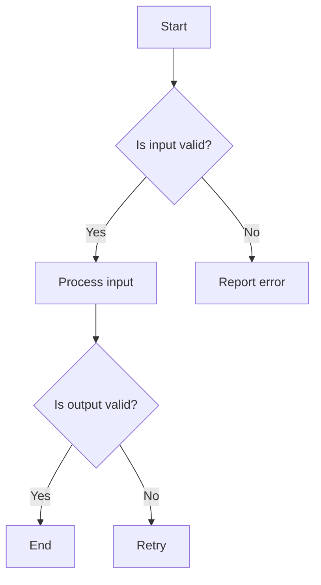

                 

# 《提示词工程：AI时代的新机遇与新挑战》

## 关键词：AI时代、提示词工程、自然语言处理、深度学习、应用场景

## 摘要

本文将探讨AI时代下，提示词工程这一新兴领域的机遇与挑战。首先，我们将回顾AI时代的背景与趋势，然后深入介绍提示词工程的基本概念、技术原理及其在各个领域的应用。通过案例分析，我们将展示提示词工程的实际效果和面临的挑战，最后对这一领域的未来发展进行展望，并提出相应的建议。

## 第一部分：背景与概念介绍

### 第1章：AI时代的新机遇

#### 1.1 AI时代背景与趋势

##### 1.1.1 AI技术的演进历程

人工智能（AI）作为计算机科学的一个分支，其历史可以追溯到20世纪50年代。随着计算能力的提升和数据量的爆炸式增长，AI技术逐渐从理论研究走向实际应用。深度学习、自然语言处理、计算机视觉等技术的快速发展，使得AI在各个领域展现出强大的潜力。

##### 1.1.2 AI技术的重要性和影响力

AI技术在金融、医疗、教育、交通等多个领域具有广泛的应用，提高了效率和准确性，改变了人们的生产和生活方式。例如，AI在医疗诊断中的应用，可以大幅提高诊断的准确性，缩短诊断时间；在金融领域的风险管理，可以实时监测市场变化，降低风险。

##### 1.1.3 AI时代的发展趋势

未来，AI技术将继续向深度化、智能化、泛在化方向发展。大数据、云计算、物联网等技术的融合，将推动AI技术向更加复杂和多样化的场景扩展。

#### 1.2 提示词工程的定义与作用

##### 1.2.1 提示词工程的基本概念

提示词工程是指通过设计、开发和优化提示词，以提高AI模型对特定问题的理解和回答能力。提示词是触发AI模型产生响应的关键输入。

##### 1.2.2 提示词工程的作用和重要性

提示词工程在AI应用中具有重要作用。有效的提示词可以提高模型的性能，降低误检率，提升用户体验。同时，提示词工程也是实现AI模型定制化和可解释性的重要手段。

##### 1.2.3 提示词工程的关键要素

提示词工程涉及的关键要素包括：

- 提示词生成：设计生成有效提示词的方法和策略。
- 提示词优化：根据模型的反馈，不断调整和优化提示词。
- 提示词与模型的交互：研究提示词与模型之间的相互作用机制。

#### 1.3 提示词工程的核心问题

##### 1.3.1 提示词生成与优化

提示词生成与优化是提示词工程的核心问题。有效的提示词需要具备清晰、精准和简洁的特点。生成和优化提示词的方法包括统计学方法、机器学习方法等。

##### 1.3.2 提示词与模型交互

提示词与模型的交互是提示词工程的关键。通过分析模型对提示词的响应，可以优化提示词的设计，提高模型的性能。

##### 1.3.3 提示词工程的挑战与机遇

提示词工程面临的挑战包括：

- 提示词多样性和变化性：如何应对提示词的多样性和变化性，保证模型对不同提示词的适应性。
- 提示词优化效率：如何提高提示词优化的效率，减少模型训练时间和资源消耗。

但同时，提示词工程也带来了新的机遇，如个性化服务、智能推荐等。

### 第2章：自然语言处理基础

#### 2.1 自然语言处理概述

##### 2.1.1 自然语言处理的基本概念

自然语言处理（NLP）是AI的一个重要分支，旨在使计算机理解和处理人类自然语言。NLP涉及的语言包括但不限于英语、中文、法语等。

##### 2.1.2 自然语言处理的发展历史

NLP的发展可以分为三个阶段：规则驱动、统计驱动和深度学习驱动。近年来，深度学习技术在NLP中的应用取得了显著成果。

##### 2.1.3 自然语言处理的关键技术

NLP的关键技术包括词向量、语言模型、文本分类、信息抽取、机器翻译等。这些技术为NLP的应用提供了强大的支持。

#### 2.2 词向量与语言模型

##### 2.2.1 词向量表示

词向量是NLP中的基本概念，用于表示词汇的数学向量。词向量可以通过统计方法或神经网络模型生成。

##### 2.2.2 语言模型

语言模型是NLP中的核心技术，用于预测下一个单词或词组。语言模型的性能直接影响NLP应用的效果。

##### 2.2.3 语言模型的应用

语言模型在自然语言生成、文本分类、机器翻译等领域有广泛应用。通过优化语言模型，可以提高NLP应用的准确性和效率。

#### 2.3 提示词生成与优化算法

##### 2.3.1 提示词生成算法

提示词生成算法是提示词工程的重要组成部分。常见的提示词生成算法包括基于统计的方法、基于规则的方法和基于神经网络的方法。

##### 2.3.2 提示词优化算法

提示词优化算法用于优化提示词，提高模型的性能。优化方法包括基于模型反馈的优化、基于用户反馈的优化等。

##### 2.3.3 提示词生成与优化实践

在实际应用中，提示词生成与优化是一个迭代过程。通过不断调整和优化提示词，可以提高模型的性能和用户体验。

### 第3章：深度学习与神经网络

#### 3.1 深度学习基础

##### 3.1.1 深度学习概述

深度学习是机器学习的一个分支，基于多层神经网络进行模型训练。深度学习在图像识别、语音识别、自然语言处理等领域取得了显著成果。

##### 3.1.2 深度学习的关键技术

深度学习的关键技术包括神经网络架构、优化算法、激活函数等。通过优化这些技术，可以提高深度学习模型的性能。

##### 3.1.3 深度学习的发展与应用

深度学习技术的发展和应用推动了AI的进步。未来，深度学习将在更多领域发挥重要作用。

#### 3.2 神经网络架构

##### 3.2.1 神经网络基本结构

神经网络由输入层、隐藏层和输出层组成。通过调整网络结构，可以适应不同的应用场景。

##### 3.2.2 神经网络类型比较

常见的神经网络类型包括全连接神经网络、卷积神经网络、循环神经网络等。每种神经网络都有其适用场景。

##### 3.2.3 神经网络在实际中的应用

神经网络在图像识别、语音识别、自然语言处理等领域有广泛应用。通过实际案例，可以更好地理解神经网络的应用效果。

#### 3.3 提示词工程中的神经网络应用

##### 3.3.1 神经网络在提示词生成中的作用

神经网络在提示词生成中扮演重要角色。通过神经网络，可以生成更精准、更有效的提示词。

##### 3.3.2 提示词优化中的神经网络应用

神经网络在提示词优化中也具有重要作用。通过神经网络，可以优化提示词，提高模型的性能。

##### 3.3.3 神经网络在实际案例中的应用

在实际案例中，神经网络的应用取得了显著成果。通过案例，可以更好地理解神经网络在提示词工程中的应用效果。

## 第二部分：技术原理与实现

### 第4章：提示词工程在商业中的应用

#### 4.1 提示词工程在电商中的应用

##### 4.1.1 电商中的提示词需求

在电商领域，提示词用于提高用户体验，促进销售。例如，搜索提示词、推荐提示词、评价提示词等。

##### 4.1.2 提示词工程在电商中的具体应用

电商中的提示词工程涉及提示词的生成、优化和调整。通过优化提示词，可以提高用户的搜索满意度、推荐准确率和评价质量。

##### 4.1.3 电商中提示词工程的案例分析

以某电商平台为例，通过优化提示词，提高了用户搜索点击率，提升了销售额。

#### 4.2 提示词工程在社交媒体中的应用

##### 4.2.1 社交媒体中的提示词需求

社交媒体中的提示词用于提高用户体验，促进互动。例如，话题标签、好友推荐、动态提示等。

##### 4.2.2 提示词工程在社交媒体中的具体应用

社交媒体中的提示词工程涉及提示词的生成、优化和调整。通过优化提示词，可以提高用户的互动率、关注度和参与度。

##### 4.2.3 社交媒体中提示词工程的案例分析

以某社交媒体平台为例，通过优化提示词，提高了用户活跃度和平台粘性。

### 第5章：提示词工程在医疗健康领域的应用

#### 5.1 提示词工程在医疗健康中的重要性

在医疗健康领域，提示词工程有助于提高诊断准确性、优化治疗方案和提升患者满意度。

##### 5.1.1 医疗健康领域中的提示词需求

医疗健康领域中的提示词需求包括诊断提示词、治疗提示词、患者教育提示词等。

##### 5.1.2 提示词工程在医疗健康中的应用

提示词工程在医疗健康中的应用包括辅助诊断、个性化治疗和患者教育等。

##### 5.1.3 提示词工程在医疗健康中的案例分析

以某医疗健康平台为例，通过优化提示词，提高了诊断准确率和患者满意度。

#### 5.2 提示词工程在智能客服中的应用

##### 5.2.1 智能客服中的提示词需求

智能客服中的提示词需求包括常见问题解答提示词、智能推荐提示词等。

##### 5.2.2 提示词工程在智能客服中的具体应用

提示词工程在智能客服中的应用包括自动回复、智能推荐和问题分类等。

##### 5.2.3 智能客服中提示词工程的案例分析

以某智能客服平台为例，通过优化提示词，提高了用户满意度和客服效率。

## 第三部分：应用场景与案例分析

### 第6章：提示词工程的新趋势与挑战

#### 6.1 提示词工程的新趋势

##### 6.1.1 提示词工程的发展方向

随着AI技术的不断进步，提示词工程将向更加智能化、个性化、高效化的方向发展。

##### 6.1.2 提示词工程的未来应用场景

未来，提示词工程将在更多领域得到应用，如智能家居、智慧城市、自动驾驶等。

##### 6.1.3 提示词工程的新技术

新技术如生成对抗网络（GAN）、强化学习等将在提示词工程中得到应用。

#### 6.2 提示词工程的挑战与应对

##### 6.2.1 提示词工程面临的主要挑战

提示词工程面临的主要挑战包括数据质量、模型可解释性和计算效率等。

##### 6.2.2 应对挑战的策略与方法

应对挑战的策略包括数据清洗、模型解释性和优化算法等。

##### 6.2.3 提示词工程的发展前景

随着技术的不断进步，提示词工程将在未来发挥更加重要的作用。

### 第7章：未来展望与建议

#### 7.1 提示词工程的发展建议

##### 7.1.1 学术研究方向的建议

在学术研究中，应重点关注提示词工程的理论体系和应用方法。

##### 7.1.2 工程实践的建议

在工程实践中，应注重提示词工程的优化和实际应用。

##### 7.1.3 政策支持与行业合作的建议

政策支持和行业合作对提示词工程的发展具有重要意义。

#### 7.2 提示词工程的应用前景

##### 7.2.1 提示词工程在各个领域的前景

提示词工程在各个领域具有广泛的应用前景，如电商、医疗、金融、教育等。

##### 7.2.2 提示词工程对社会的影响

提示词工程将深刻影响社会，提高生产效率、改善生活质量。

##### 7.2.3 提示词工程的发展方向

未来，提示词工程将朝着更加智能化、个性化、高效化的方向发展。

### 作者

**作者：AI天才研究院/AI Genius Institute & 禅与计算机程序设计艺术 /Zen And The Art of Computer Programming**
## 《提示词工程：AI时代的新机遇与新挑战》

### 关键词

- AI时代
- 提示词工程
- 自然语言处理
- 深度学习
- 应用场景
- 优化算法
- 用户体验

### 摘要

在AI技术迅猛发展的背景下，提示词工程成为提升AI模型性能的重要手段。本文从背景介绍入手，探讨了AI时代的机遇与挑战，详细阐述了提示词工程的基本概念、技术原理、应用场景以及面临的问题与挑战。通过案例分析，展示了提示词工程在不同领域的实际应用效果，并对未来的发展进行了展望。文章旨在为读者提供一个全面、深入的提示词工程知识体系。

### 第一部分：背景与概念介绍

#### 第1章：AI时代的新机遇

##### 1.1 AI时代背景与趋势

##### 1.1.1 AI技术的演进历程

人工智能（AI）的概念最早可以追溯到20世纪50年代。当时的科学家们试图让计算机模拟人类智能，以实现自动推理、学习和适应新环境。然而，由于技术限制，早期的AI研究进展缓慢。随着计算能力的提升和数据量的爆炸式增长，AI技术开始逐渐走向实用化。20世纪80年代，专家系统成为AI研究的热点，但受限于知识表示和获取的局限性，其应用范围有限。进入21世纪，深度学习、自然语言处理、计算机视觉等技术的快速发展，使得AI在各个领域展现出强大的潜力。特别是深度神经网络的出现，使得计算机在图像识别、语音识别、自然语言处理等领域取得了重大突破。

##### 1.1.2 AI技术的重要性和影响力

AI技术在现代社会中扮演着越来越重要的角色。它不仅改变了传统行业，还催生了新的经济增长点。在金融领域，AI可以帮助银行和金融机构进行风险控制和智能投资；在医疗领域，AI可以实现精准诊断和个性化治疗；在教育领域，AI可以提供智能教学和个性化学习方案；在交通领域，AI可以优化交通流量，提高运输效率。此外，AI还在智能制造、智慧城市、农业等领域具有广泛的应用前景。

##### 1.1.3 AI时代的发展趋势

未来，AI技术将继续向深度化、智能化、泛在化方向发展。大数据、云计算、物联网等技术的融合，将推动AI技术向更加复杂和多样化的场景扩展。具体趋势包括：

- **多模态学习**：结合文本、图像、语音等多种数据类型，实现更全面的智能感知和理解。
- **强化学习**：在动态环境下，通过试错和反馈机制，实现更高效的学习和决策。
- **人机协作**：结合人类专家的知识和AI的计算能力，实现更智能的解决方案。
- **隐私保护和数据安全**：在AI应用中，保护用户隐私和数据安全成为重要议题。

##### 1.2 提示词工程的定义与作用

##### 1.2.1 提示词工程的基本概念

提示词工程（Prompt Engineering）是指通过设计、开发和优化提示词，以提高AI模型对特定问题的理解和回答能力。提示词是触发AI模型产生响应的关键输入。在自然语言处理（NLP）领域，提示词通常是一个或多个单词、短语或句子，用于引导模型生成预期的输出。提示词工程的目标是设计出既符合人类逻辑思维，又能激发AI模型最佳性能的提示词。

##### 1.2.2 提示词工程的作用和重要性

提示词工程在AI应用中具有重要作用。有效的提示词可以提高模型的性能，降低误检率，提升用户体验。同时，提示词工程也是实现AI模型定制化和可解释性的重要手段。具体来说，提示词工程的作用包括：

- **提高模型性能**：通过优化提示词，可以使模型在特定任务上达到更高的准确率和效率。
- **降低误检率**：在医学诊断、安全监测等应用中，提示词的优化有助于降低误诊和误报的风险。
- **提升用户体验**：在交互式应用中，有效的提示词可以提供更人性化的交互体验，增强用户满意度。
- **实现模型定制化**：通过针对不同任务和场景设计不同的提示词，可以实现模型的定制化应用。
- **提高模型可解释性**：通过分析提示词与模型输出之间的关系，可以增强模型的可解释性，有助于理解和信任AI模型。

##### 1.2.3 提示词工程的关键要素

提示词工程涉及的关键要素包括：

- **提示词生成**：设计生成有效提示词的方法和策略，包括基于规则的方法、基于机器学习的方法等。
- **提示词优化**：根据模型的反馈，不断调整和优化提示词，以提高模型的性能。
- **提示词与模型的交互**：研究提示词与模型之间的相互作用机制，以最大化模型的性能和用户体验。

##### 1.3 提示词工程的核心问题

##### 1.3.1 提示词生成与优化

提示词生成与优化是提示词工程的核心问题。有效的提示词需要具备以下特点：

- **精准性**：能够准确表达用户的需求和意图。
- **简洁性**：简洁明了，易于理解和执行。
- **灵活性**：能够适应不同任务和场景的需求。

生成和优化提示词的方法包括：

- **基于规则的方法**：通过预定义的规则和模板生成提示词。
- **基于机器学习的方法**：通过训练数据学习生成提示词的规律和模式。
- **基于强化学习的方法**：通过试错和反馈机制，不断优化提示词。

##### 1.3.2 提示词与模型交互

提示词与模型的交互是提示词工程的关键。有效的交互机制可以提高模型的性能和用户体验。具体来说，需要研究以下问题：

- **提示词的格式和结构**：如何设计提示词的格式和结构，以最大化模型的性能。
- **提示词与模型参数的调优**：如何调整提示词与模型参数之间的关系，以达到最佳性能。
- **模型的可解释性**：如何通过分析提示词与模型输出之间的关系，提高模型的可解释性。

##### 1.3.3 提示词工程的挑战与机遇

提示词工程面临的挑战主要包括：

- **多样性**：提示词的多样性和变化性使得设计通用有效的提示词具有挑战性。
- **优化效率**：如何在有限的时间和资源内，快速优化出有效的提示词。
- **用户体验**：如何设计出既符合用户需求，又能提高模型性能的提示词。

然而，提示词工程也带来了新的机遇：

- **个性化服务**：通过针对不同用户和场景设计个性化提示词，可以提供更精准的服务。
- **智能推荐**：通过优化提示词，可以提高推荐系统的准确性和用户体验。
- **人机协作**：提示词工程为人机协作提供了新的途径，通过优化提示词，可以实现更高效的人机交互。

#### 第2章：自然语言处理基础

##### 2.1 自然语言处理概述

##### 2.1.1 自然语言处理的基本概念

自然语言处理（Natural Language Processing，NLP）是人工智能（Artificial Intelligence，AI）的一个重要分支，旨在使计算机理解和处理人类自然语言。自然语言包括口语和书面语言，具有复杂性、多样性和灵活性等特点。NLP的目标是使计算机能够理解、解释和生成自然语言，以实现人机交互和智能应用。

##### 2.1.2 自然语言处理的发展历史

NLP的发展可以追溯到20世纪50年代。早期的NLP主要依赖于规则和统计方法。1950年，艾伦·图灵提出了著名的图灵测试，旨在判断计算机是否具备智能。1954年，霍普金斯大学的研究人员使用计算机程序成功翻译了俄语到英语的短句，这是NLP历史上的一个重要里程碑。20世纪60年代，NLP领域开始探索基于语法和语义的分析方法。然而，由于自然语言的复杂性和不确定性，这些方法在实际应用中面临很大挑战。

20世纪80年代，统计学方法在NLP中得到了广泛应用，尤其是隐马尔可夫模型（Hidden Markov Model，HMM）和决策树（Decision Tree）等方法。这些方法在语音识别、命名实体识别等任务上取得了显著成果。然而，由于自然语言的数据量和复杂性不断增加，统计学方法在处理大规模文本数据时仍然存在瓶颈。

20世纪90年代至21世纪初，基于机器学习的方法开始在NLP中占据主导地位。支持向量机（Support Vector Machine，SVM）、条件概率模型（Conditional Probability Model）和朴素贝叶斯（Naive Bayes）等方法在文本分类、词性标注等任务上表现出色。此外，知识图谱（Knowledge Graph）和语义网络（Semantic Network）等新方法也被引入到NLP中，以实现更复杂的语义理解和推理。

近年来，深度学习（Deep Learning）技术在NLP领域取得了突破性进展。卷积神经网络（Convolutional Neural Network，CNN）、循环神经网络（Recurrent Neural Network，RNN）和长短期记忆网络（Long Short-Term Memory，LSTM）等深度学习模型在自然语言生成、机器翻译、情感分析等任务上表现出色。特别是基于Transformer的模型，如BERT（Bidirectional Encoder Representations from Transformers）和GPT（Generative Pre-trained Transformer），使得NLP技术在理解和生成自然语言方面达到了新的高度。

##### 2.1.3 自然语言处理的关键技术

自然语言处理的关键技术包括：

- **词向量表示**：词向量是将自然语言词汇映射到高维空间中的向量表示，以便进行机器学习处理。常见的词向量模型有Word2Vec、GloVe等。
- **语言模型**：语言模型用于预测下一个单词或词组，是自然语言生成和机器翻译的重要基础。常见的语言模型有N-gram模型、神经网络语言模型等。
- **文本分类**：文本分类是将文本数据按照主题或类别进行分类的任务，广泛应用于垃圾邮件过滤、情感分析等场景。常见的文本分类算法有朴素贝叶斯、支持向量机、随机森林等。
- **情感分析**：情感分析是识别文本中的情感倾向和情绪表达，广泛应用于舆情监控、用户反馈分析等场景。常见的情感分析算法有基于规则的算法、基于机器学习的算法等。
- **命名实体识别**：命名实体识别是从文本中识别出具有特定意义的实体，如人名、地名、组织名等。常见的命名实体识别算法有条件随机场（Conditional Random Field，CRF）、递归神经网络（Recurrent Neural Network，RNN）等。
- **机器翻译**：机器翻译是将一种自然语言文本自动翻译成另一种自然语言文本的任务，广泛应用于跨语言通信、多语言信息检索等场景。常见的机器翻译模型有基于规则的方法、基于统计的方法、基于神经网络的方法等。
- **问答系统**：问答系统是能够理解用户的问题，并返回相关答案的人工智能系统，广泛应用于客服、教育、搜索引擎等场景。常见的问答系统模型有基于知识图谱的问答系统、基于深度学习的问答系统等。

##### 2.2 词向量与语言模型

##### 2.2.1 词向量表示

词向量是将自然语言词汇映射到高维空间中的向量表示，以便进行机器学习处理。词向量表示方法的核心思想是将词汇表示为实数向量，使得相似的词汇在空间中靠近，不同的词汇在空间中相距较远。

常见的词向量模型有：

- **Word2Vec**：Word2Vec是由Google在2013年提出的一种基于神经网络的词向量模型。Word2Vec通过训练神经网络，将词汇映射到高维空间中，使得相似的词汇在空间中靠近。Word2Vec包括两种训练方法：连续词袋（Continuous Bag of Words，CBOW）和Skip-Gram。
- **GloVe**：GloVe（Global Vectors for Word Representation）是由Stanford大学在2014年提出的一种基于全局统计的词向量模型。GloVe通过计算词汇的共现矩阵，学习词汇的向量表示。GloVe模型在词汇相似性、情感分析等任务上表现出色。

词向量表示方法在自然语言处理中具有重要作用，可以为文本分类、情感分析、机器翻译等任务提供有效的特征表示。

##### 2.2.2 语言模型

语言模型是用于预测下一个单词或词组的模型，是自然语言生成和机器翻译的重要基础。语言模型可以分为基于统计的方法和基于神经网络的方法。

常见的语言模型有：

- **N-gram模型**：N-gram模型是最简单的语言模型，它将文本表示为N个单词的序列，并计算每个序列的概率。N-gram模型在语言模型中具有代表性，但存在一些局限性，如无法捕捉长程依赖关系。
- **神经网络语言模型**：神经网络语言模型通过训练神经网络，学习文本的潜在表示。常见的神经网络语言模型有基于循环神经网络（Recurrent Neural Network，RNN）的语言模型和基于Transformer的语言模型。基于Transformer的BERT和GPT模型在自然语言生成和机器翻译等任务上表现出色。

##### 2.2.3 语言模型的应用

语言模型在自然语言生成、机器翻译、文本分类等任务中具有广泛应用。

- **自然语言生成**：自然语言生成是将计算机生成的文本转换为人类可读的自然语言。语言模型在自然语言生成中起到关键作用，可以生成高质量的文本，如新闻报道、诗歌、对话系统等。
- **机器翻译**：机器翻译是将一种自然语言文本自动翻译成另一种自然语言文本的任务。语言模型在机器翻译中用于预测目标语言中的下一个单词或词组，可以提高翻译的准确性和流畅性。
- **文本分类**：文本分类是将文本按照主题或类别进行分类的任务。语言模型可以用于计算文本的特征表示，并分类文本的类别。

##### 2.3 提示词生成与优化算法

##### 2.3.1 提示词生成算法

提示词生成算法是提示词工程的核心问题。有效的提示词生成算法可以生成满足特定任务需求的提示词，以提高模型性能。

常见的提示词生成算法有：

- **基于规则的方法**：基于规则的方法通过预定义的规则和模板生成提示词。这种方法简单有效，但需要大量手工编写规则，且难以适应复杂任务。
- **基于机器学习的方法**：基于机器学习的方法通过训练数据学习生成提示词的规律和模式。这种方法可以自动生成提示词，但需要大量训练数据和计算资源。
- **基于生成对抗网络（GAN）的方法**：基于生成对抗网络的方法通过生成器和判别器之间的博弈，生成高质量的提示词。这种方法可以生成具有多样性和创造力的提示词。

##### 2.3.2 提示词优化算法

提示词优化算法用于优化已生成的提示词，以提高模型性能。提示词优化算法可以分为基于模型反馈的方法和基于用户反馈的方法。

常见的提示词优化算法有：

- **基于模型反馈的方法**：基于模型反馈的方法通过分析模型对提示词的响应，优化提示词。这种方法可以根据模型性能指标进行调整，但需要大量的模型训练和评估。
- **基于用户反馈的方法**：基于用户反馈的方法通过用户对提示词的评价，优化提示词。这种方法可以更好地满足用户需求，但需要收集和处理大量的用户反馈数据。

##### 2.3.3 提示词生成与优化实践

在实际应用中，提示词生成与优化是一个迭代过程。以下是一个简单的示例：

1. **数据收集**：收集大量相关数据和用户反馈，用于训练和评估提示词生成和优化算法。
2. **提示词生成**：使用基于机器学习的方法生成初步的提示词。
3. **提示词优化**：根据模型反馈和用户反馈，调整提示词的参数和结构，优化提示词性能。
4. **模型训练**：使用优化的提示词训练模型，提高模型性能。
5. **评估与迭代**：评估模型性能，并根据评估结果进行进一步的优化和调整。

### 第二部分：技术原理与实现

#### 第3章：深度学习与神经网络

##### 3.1 深度学习基础

##### 3.1.1 深度学习概述

深度学习（Deep Learning）是机器学习（Machine Learning）的一个分支，其核心思想是通过多层神经网络（Neural Network）对数据进行自动特征提取和模型训练。与传统机器学习方法相比，深度学习在处理大规模、高维数据时具有显著优势，特别是在图像识别、语音识别、自然语言处理等领域取得了突破性进展。

##### 3.1.2 深度学习的关键技术

深度学习的关键技术包括：

- **神经网络架构**：神经网络是深度学习的基础，常见的神经网络架构有卷积神经网络（Convolutional Neural Network，CNN）、循环神经网络（Recurrent Neural Network，RNN）和变换器（Transformer）等。
- **激活函数**：激活函数是神经网络中用于引入非线性变换的函数，常见的激活函数有sigmoid、ReLU、Tanh等。
- **优化算法**：优化算法用于调整神经网络参数，以最小化损失函数。常见的优化算法有随机梯度下降（Stochastic Gradient Descent，SGD）、Adam等。
- **正则化**：正则化是防止神经网络过拟合的一种技术，常见的正则化方法有L1正则化、L2正则化等。

##### 3.1.3 深度学习的发展与应用

深度学习的发展可以分为几个阶段：

1. **早期阶段（20世纪80年代末至90年代）**：神经网络由于计算能力和数据量的限制，发展缓慢。1986年，Rumelhart等人提出了反向传播算法（Backpropagation Algorithm），使得神经网络的训练变得更加高效。
2. **复兴阶段（2006年至今）**：随着计算能力和数据量的提升，深度学习技术得到了快速发展。特别是2006年，Hinton等人提出了深度信念网络（Deep Belief Network，DBN），为深度学习奠定了基础。
3. **广泛应用阶段**：深度学习在图像识别、语音识别、自然语言处理、强化学习等领域取得了显著成果。例如，2012年，AlexNet在ImageNet图像识别比赛中取得了突破性成绩，引发了深度学习的热潮。

##### 3.2 神经网络架构

##### 3.2.1 神经网络基本结构

神经网络由输入层、隐藏层和输出层组成。每个神经元（或称为节点）在层间传递信息，并通过权重和偏置进行信息加工。神经网络的激活函数引入了非线性特性，使得神经网络可以学习复杂的数据分布。

- **输入层**：接收外部输入数据，并将其传递给隐藏层。
- **隐藏层**：对输入数据进行加工和变换，提取有用的特征信息。
- **输出层**：生成最终输出结果。

##### 3.2.2 神经网络类型比较

常见的神经网络类型包括：

- **卷积神经网络（CNN）**：适用于图像识别、物体检测等任务。CNN通过卷积层、池化层等模块，提取图像的局部特征和整体特征。
- **循环神经网络（RNN）**：适用于序列数据处理，如时间序列分析、语音识别、自然语言处理等。RNN通过循环机制，将当前时刻的信息传递到下一时刻，实现长期依赖关系的建模。
- **变换器（Transformer）**：适用于自然语言处理、机器翻译等任务。Transformer通过自注意力机制，实现全局依赖关系的建模，并在BERT、GPT等模型中取得了显著成果。

##### 3.2.3 神经网络在实际中的应用

神经网络在实际应用中取得了显著成果，以下是一些典型应用案例：

- **图像识别**：通过卷积神经网络，可以实现物体检测、人脸识别、图像分类等任务。
- **语音识别**：通过循环神经网络和变换器，可以实现语音识别、语音合成等任务。
- **自然语言处理**：通过循环神经网络和变换器，可以实现机器翻译、文本生成、情感分析等任务。

##### 3.3 提示词工程中的神经网络应用

##### 3.3.1 神经网络在提示词生成中的作用

在提示词工程中，神经网络可以用于生成高质量的提示词。通过训练神经网络，可以学习到特定任务下的提示词生成规律和模式。神经网络生成的提示词具有以下优势：

- **灵活性**：神经网络可以适应不同任务和场景的需求，生成个性化的提示词。
- **创造性**：神经网络可以生成具有创造力和多样性的提示词，提高模型的性能和用户体验。

##### 3.3.2 提示词优化中的神经网络应用

神经网络在提示词优化中也具有重要作用。通过训练神经网络，可以优化已生成的提示词，提高模型的性能和用户体验。神经网络优化提示词的步骤如下：

1. **数据准备**：收集大量相关数据和用户反馈，用于训练神经网络。
2. **模型设计**：设计一个合适的神经网络模型，包括输入层、隐藏层和输出层。
3. **模型训练**：使用训练数据，对神经网络进行训练，优化提示词的参数和结构。
4. **模型评估**：使用验证数据，评估神经网络的性能，包括提示词的准确性和多样性。
5. **模型调整**：根据评估结果，调整神经网络的参数和结构，优化提示词的性能。

##### 3.3.3 神经网络在实际案例中的应用

以下是一个神经网络在提示词工程中应用的案例：

- **任务**：设计一个问答系统，通过生成高质量的提示词，回答用户的问题。
- **数据**：收集大量问答对数据，包括问题、答案和相关的上下文信息。
- **模型设计**：设计一个基于变换器的神经网络模型，包括编码器和解码器。编码器用于将问题编码为固定长度的向量，解码器用于生成提示词。
- **模型训练**：使用问答对数据，对神经网络进行训练，优化模型的参数和结构。
- **模型评估**：使用测试数据，评估神经网络的性能，包括提示词的准确性和多样性。
- **模型部署**：将训练好的模型部署到线上系统，实现自动问答功能。

### 第三部分：应用场景与案例分析

#### 第4章：提示词工程在商业中的应用

##### 4.1 提示词工程在电商中的应用

##### 4.1.1 电商中的提示词需求

在电商领域，提示词用于提高用户体验，促进销售。常见的提示词包括搜索提示词、推荐提示词、评价提示词等。以下是一些具体的提示词需求：

- **搜索提示词**：用于辅助用户进行商品搜索，如“优惠商品”、“限时抢购”等。
- **推荐提示词**：用于向用户推荐商品，如“热门商品”、“新品上架”等。
- **评价提示词**：用于引导用户进行商品评价，如“好评有礼”、“晒图获奖”等。

##### 4.1.2 提示词工程在电商中的具体应用

提示词工程在电商中的应用主要体现在以下方面：

- **搜索优化**：通过优化搜索提示词，提高搜索结果的准确性和用户体验。例如，通过分析用户搜索历史和行为，生成个性化的搜索提示词。
- **推荐优化**：通过优化推荐提示词，提高推荐系统的准确性和用户满意度。例如，通过分析用户兴趣和行为，生成个性化的推荐提示词。
- **评价引导**：通过优化评价提示词，引导用户进行积极的评价，提高商品口碑和转化率。例如，通过设计互动性强的评价提示词，激发用户参与评价的热情。

##### 4.1.3 电商中提示词工程的案例分析

以下是一个电商中提示词工程的案例分析：

- **背景**：某电商平台的搜索提示词不够准确，导致用户搜索体验不佳，影响了平台的转化率。
- **问题**：如何优化搜索提示词，提高搜索结果的准确性和用户体验。
- **解决方案**：通过以下步骤进行提示词优化：
  1. **数据收集**：收集用户搜索数据，包括搜索关键词、搜索结果、用户反馈等。
  2. **数据分析**：分析用户搜索行为和搜索结果，识别用户需求和问题。
  3. **提示词生成**：基于数据分析结果，生成新的搜索提示词，如“热门搜索”、“你可能感兴趣的商品”等。
  4. **用户测试**：通过用户测试，评估新提示词的效果，包括搜索准确性、用户满意度等。
  5. **迭代优化**：根据用户测试结果，不断调整和优化搜索提示词，提高用户体验和转化率。
- **结果**：通过提示词优化，搜索结果的准确性和用户体验得到了显著提升，平台的转化率也有所提高。

##### 4.2 提示词工程在社交媒体中的应用

##### 4.2.1 社交媒体中的提示词需求

在社交媒体中，提示词用于提高用户体验，促进互动。常见的提示词包括话题标签、好友推荐、动态提示等。以下是一些具体的提示词需求：

- **话题标签**：用于标记和分类社交媒体内容，如“#美食”、“#旅游”等。
- **好友推荐**：用于推荐用户可能感兴趣的好友，如“你可能认识的人”、“热门话题”等。
- **动态提示**：用于引导用户参与社交媒体活动，如“快来参与活动，领取奖品”、“点赞赢大奖”等。

##### 4.2.2 提示词工程在社交媒体中的具体应用

提示词工程在社交媒体中的应用主要体现在以下方面：

- **话题标签优化**：通过优化话题标签，提高内容分类的准确性和用户参与度。例如，通过分析用户行为和兴趣，生成个性化的话题标签。
- **好友推荐优化**：通过优化好友推荐提示词，提高推荐系统的准确性和用户体验。例如，通过分析用户社交网络和行为，生成个性化的好友推荐提示词。
- **动态提示优化**：通过优化动态提示词，提高用户互动率和参与度。例如，通过设计互动性强的动态提示词，激发用户参与社交媒体活动的热情。

##### 4.2.3 社交媒体中提示词工程的案例分析

以下是一个社交媒体中提示词工程的案例分析：

- **背景**：某社交媒体平台的好友推荐功能不够准确，导致用户推荐体验不佳，影响了平台的活跃度。
- **问题**：如何优化好友推荐提示词，提高推荐系统的准确性和用户体验。
- **解决方案**：通过以下步骤进行提示词优化：
  1. **数据收集**：收集用户社交网络数据，包括好友关系、兴趣爱好、行为等。
  2. **数据分析**：分析用户社交网络和行为，识别用户需求和问题。
  3. **提示词生成**：基于数据分析结果，生成新的好友推荐提示词，如“你可能感兴趣的人”、“热门话题”等。
  4. **用户测试**：通过用户测试，评估新提示词的效果，包括推荐准确性、用户满意度等。
  5. **迭代优化**：根据用户测试结果，不断调整和优化好友推荐提示词，提高用户体验和活跃度。
- **结果**：通过提示词优化，好友推荐的准确性和用户体验得到了显著提升，平台的活跃度也有所提高。

##### 4.3 提示词工程在金融领域的应用

##### 4.3.1 金融中的提示词需求

在金融领域，提示词用于提高金融服务质量和用户体验。常见的提示词包括风险提示词、投资建议词、交易提示词等。以下是一些具体的提示词需求：

- **风险提示词**：用于提醒用户注意投资风险，如“高风险投资”、“谨慎投资”等。
- **投资建议词**：用于提供投资建议和策略，如“股票投资建议”、“基金推荐”等。
- **交易提示词**：用于指导用户进行交易操作，如“买入时机”、“卖出建议”等。

##### 4.3.2 提示词工程在金融中的具体应用

提示词工程在金融中的应用主要体现在以下方面：

- **风险提示词优化**：通过优化风险提示词，提高用户对投资风险的理解和识别。例如，通过分析用户投资行为和风险偏好，生成个性化的风险提示词。
- **投资建议词优化**：通过优化投资建议词，提高投资建议的准确性和实用性。例如，通过分析市场趋势和用户需求，生成个性化的投资建议词。
- **交易提示词优化**：通过优化交易提示词，提高用户交易操作的准确性和成功率。例如，通过分析用户交易行为和市场动态，生成个性化的交易提示词。

##### 4.3.3 金融中提示词工程的案例分析

以下是一个金融中提示词工程的案例分析：

- **背景**：某金融平台的投资建议词不够准确，导致用户投资决策不够理性，影响了平台的信任度和用户满意度。
- **问题**：如何优化投资建议词，提高投资建议的准确性和实用性。
- **解决方案**：通过以下步骤进行提示词优化：
  1. **数据收集**：收集用户投资数据，包括投资历史、投资偏好、市场动态等。
  2. **数据分析**：分析用户投资行为和市场动态，识别用户需求和问题。
  3. **提示词生成**：基于数据分析结果，生成新的投资建议词，如“稳健投资策略”、“热门股票推荐”等。
  4. **用户测试**：通过用户测试，评估新提示词的效果，包括投资建议的准确性、用户满意度等。
  5. **迭代优化**：根据用户测试结果，不断调整和优化投资建议词，提高用户体验和满意度。
- **结果**：通过提示词优化，投资建议的准确性和实用性得到了显著提升，用户的投资决策更加理性，平台的信任度和用户满意度也有所提高。

#### 第5章：提示词工程在医疗健康领域的应用

##### 5.1 提示词工程在医疗健康中的重要性

在医疗健康领域，提示词工程对于提高诊断准确性、优化治疗方案和提升患者满意度具有重要意义。以下是一些具体的场景：

- **诊断辅助**：提示词可以用于辅助医生进行疾病诊断，如“疑似肺炎”、“可能需要进一步检查”等。
- **治疗方案建议**：提示词可以提供个性化的治疗方案建议，如“建议进行化疗”、“建议进行放疗”等。
- **患者教育**：提示词可以用于向患者提供健康教育信息，如“注意饮食”、“定期复查”等。

##### 5.2 提示词工程在医疗健康中的具体应用

提示词工程在医疗健康中的应用主要包括以下几个方面：

- **医学文本分析**：通过提示词工程，可以自动提取医学文本中的关键信息，如疾病名称、症状描述、治疗方案等。例如，使用自然语言处理技术，对医学文献、病例记录等进行文本分析，提取相关的提示词。
- **智能诊断系统**：通过提示词工程，可以构建智能诊断系统，辅助医生进行疾病诊断。例如，使用深度学习模型，结合医学知识和临床数据，生成诊断提示词，提高诊断的准确性和效率。
- **个性化医疗**：通过提示词工程，可以为患者提供个性化的医疗建议。例如，根据患者的病史、基因信息等，生成个性化的治疗提示词，提高治疗效果。

##### 5.3 提示词工程在医疗健康中的案例分析

以下是一个医疗健康中提示词工程的案例分析：

- **背景**：某医院的诊断系统存在误诊和漏诊问题，影响了诊断的准确性和患者的信任度。
- **问题**：如何优化诊断系统的提示词，提高诊断的准确性和效率。
- **解决方案**：通过以下步骤进行提示词优化：
  1. **数据收集**：收集医院的历史诊断数据，包括病例记录、诊断报告、患者反馈等。
  2. **数据分析**：分析诊断数据，识别误诊和漏诊的原因，包括诊断提示词的问题等。
  3. **提示词生成**：基于数据分析结果，生成新的诊断提示词，如“疑似肺炎”、“可能需要进一步检查”等。
  4. **用户测试**：通过医生和患者的测试，评估新提示词的效果，包括诊断准确性、用户满意度等。
  5. **迭代优化**：根据用户测试结果，不断调整和优化诊断提示词，提高诊断系统的准确性和用户体验。
- **结果**：通过提示词优化，诊断系统的准确性和用户体验得到了显著提升，误诊和漏诊问题得到了有效改善，患者的信任度和满意度也有所提高。

##### 5.4 提示词工程在智能医疗中的应用

##### 5.4.1 智能医疗中的提示词需求

在智能医疗领域，提示词用于提高医疗服务的效率和准确性。以下是一些具体的提示词需求：

- **智能问诊**：用于辅助医生进行问诊，如“请描述你的症状”、“你可能需要做哪些检查”等。
- **智能诊疗**：用于辅助医生进行诊疗决策，如“建议进行哪些检查”、“治疗方案建议”等。
- **智能教育**：用于向患者提供健康教育信息，如“如何管理慢性病”、“定期复查的重要性”等。

##### 5.4.2 提示词工程在智能医疗中的具体应用

提示词工程在智能医疗中的应用主要包括以下几个方面：

- **智能问诊系统**：通过提示词工程，可以构建智能问诊系统，辅助医生进行问诊。例如，使用自然语言处理技术，对患者的提问进行解析，生成相应的问诊提示词。
- **智能诊疗系统**：通过提示词工程，可以构建智能诊疗系统，辅助医生进行诊疗决策。例如，使用深度学习模型，结合医学知识和临床数据，生成个性化的诊疗提示词。
- **智能教育系统**：通过提示词工程，可以构建智能教育系统，为患者提供个性化的健康教育信息。例如，使用自然语言生成技术，生成符合患者需求和认知水平的健康教育提示词。

##### 5.4.3 智能医疗中提示词工程的案例分析

以下是一个智能医疗中提示词工程的案例分析：

- **背景**：某智能医疗平台在问诊和诊疗过程中存在信息不准确和用户参与度低的问题。
- **问题**：如何优化智能医疗平台的提示词，提高问诊和诊疗的准确性和用户参与度。
- **解决方案**：通过以下步骤进行提示词优化：
  1. **数据收集**：收集用户的问诊记录、诊疗数据和用户反馈等。
  2. **数据分析**：分析用户问诊和诊疗数据，识别问题和用户需求。
  3. **提示词生成**：基于数据分析结果，生成新的问诊和诊疗提示词，如“请描述你的症状”、“治疗方案建议”等。
  4. **用户测试**：通过用户测试，评估新提示词的效果，包括问诊和诊疗的准确性、用户满意度等。
  5. **迭代优化**：根据用户测试结果，不断调整和优化提示词，提高用户体验和参与度。
- **结果**：通过提示词优化，智能医疗平台的问诊和诊疗准确性得到了显著提升，用户参与度也有所提高，平台的用户满意度和口碑也得到了改善。

#### 第6章：提示词工程在法律与司法领域的应用

##### 6.1 提示词工程在法律与司法中的重要性

在法律与司法领域，提示词工程对于提高案件分析效率、优化法律文书撰写和提升司法公正性具有重要意义。以下是一些具体的场景：

- **案件分析**：提示词可以用于辅助法律专业人士分析案件，如“可能涉及的法律条款”、“相关案例参考”等。
- **法律文书撰写**：提示词可以用于辅助撰写法律文书，如“起诉状”、“辩护词”等。
- **司法公正**：提示词可以用于确保司法公正，如“判决依据”、“庭审提示”等。

##### 6.2 提示词工程在法律与司法中的具体应用

提示词工程在法律与司法中的应用主要包括以下几个方面：

- **案件分析系统**：通过提示词工程，可以构建案件分析系统，辅助法律专业人士进行案件分析。例如，使用自然语言处理技术，对法律文献、案例数据库等进行文本分析，提取相关的提示词。
- **法律文书生成系统**：通过提示词工程，可以构建法律文书生成系统，辅助法律专业人士撰写法律文书。例如，使用自然语言生成技术，根据案件信息和法律条款，生成符合规范的法律文书。
- **司法辅助系统**：通过提示词工程，可以构建司法辅助系统，确保司法公正。例如，使用提示词工程，对庭审过程进行实时监控和分析，提供庭审提示和决策支持。

##### 6.3 提示词工程在法律与司法中的案例分析

以下是一个法律与司法中提示词工程的案例分析：

- **背景**：某司法机构的案件分析系统存在信息不全面和判断不准确的问题，影响了案件处理效率和公正性。
- **问题**：如何优化案件分析系统的提示词，提高案件分析效率和准确性。
- **解决方案**：通过以下步骤进行提示词优化：
  1. **数据收集**：收集案件数据和相关的法律文献、案例数据库等。
  2. **数据分析**：分析案件数据和法律文献，识别问题和用户需求。
  3. **提示词生成**：基于数据分析结果，生成新的案件分析提示词，如“可能涉及的法律条款”、“相关案例参考”等。
  4. **用户测试**：通过法律专业人士的测试，评估新提示词的效果，包括案件分析的准确性和效率等。
  5. **迭代优化**：根据用户测试结果，不断调整和优化提示词，提高用户体验和案件处理效率。
- **结果**：通过提示词优化，案件分析系统的准确性和效率得到了显著提升，案件处理效率和公正性也得到了改善。

##### 6.4 提示词工程在法律与司法领域的未来展望

随着人工智能技术的不断发展，提示词工程在法律与司法领域的应用前景十分广阔。以下是一些未来展望：

- **智能化案件分析**：通过引入更先进的自然语言处理和机器学习技术，可以构建智能化案件分析系统，实现更加精准和高效的案件分析。
- **个性化法律文书撰写**：通过个性化提示词生成技术，可以实现更符合用户需求的法律文书撰写，提高法律文书的规范性和质量。
- **智能司法辅助**：通过引入更多的数据源和智能化分析工具，可以构建智能司法辅助系统，提升司法公正性和决策效率。
- **法律知识图谱**：通过构建法律知识图谱，可以实现对法律知识的全面和系统化表示，为法律专业人士提供更强大的知识支持。

#### 第7章：提示词工程在智能客服中的应用

##### 7.1 提示词工程在智能客服中的重要性

在智能客服领域，提示词工程对于提高客服效率、优化用户体验和提升客户满意度具有重要意义。以下是一些具体的场景：

- **问题分类**：提示词可以用于分类客户的问题，如“产品咨询”、“售后服务”等。
- **自动回复**：提示词可以用于生成自动回复，如“感谢您的咨询，我们将尽快回复您”、“您的请求已提交，请等待处理”等。
- **智能推荐**：提示词可以用于推荐相关的产品或服务，如“您可能感兴趣的产品”、“相似问题解决方案”等。

##### 7.2 提示词工程在智能客服中的具体应用

提示词工程在智能客服中的应用主要包括以下几个方面：

- **问题分类系统**：通过提示词工程，可以构建问题分类系统，将客户的提问自动分类到相应的类别。例如，使用自然语言处理技术，对客户提问进行解析，生成相应的问题分类提示词。
- **自动回复系统**：通过提示词工程，可以构建自动回复系统，自动生成回复客户提问的文本。例如，使用自然语言生成技术，根据客户提问和预设的回复模板，生成相应的自动回复提示词。
- **智能推荐系统**：通过提示词工程，可以构建智能推荐系统，根据客户提问和偏好，推荐相关的产品或服务。例如，使用协同过滤、内容推荐等技术，生成个性化的推荐提示词。

##### 7.3 提示词工程在智能客服中的案例分析

以下是一个智能客服中提示词工程的案例分析：

- **背景**：某企业智能客服系统在处理客户提问时存在回复不准确和用户满意度低的问题。
- **问题**：如何优化智能客服系统的提示词，提高回复准确性和用户满意度。
- **解决方案**：通过以下步骤进行提示词优化：
  1. **数据收集**：收集智能客服系统处理过的客户提问和相关的回复文本等。
  2. **数据分析**：分析客户提问和回复文本，识别问题和用户需求。
  3. **提示词生成**：基于数据分析结果，生成新的回复和推荐提示词，如“感谢您的咨询，我们将尽快回复您”、“您可能感兴趣的产品”等。
  4. **用户测试**：通过客户测试，评估新提示词的效果，包括回复准确性、用户满意度等。
  5. **迭代优化**：根据用户测试结果，不断调整和优化提示词，提高用户体验和满意度。
- **结果**：通过提示词优化，智能客服系统的回复准确性和用户满意度得到了显著提升，用户满意度也有所提高。

##### 7.4 提示词工程在智能客服领域的未来展望

随着人工智能技术的不断发展，提示词工程在智能客服领域的应用前景十分广阔。以下是一些未来展望：

- **个性化客服**：通过引入个性化提示词生成技术，可以构建更加个性化的智能客服系统，满足不同客户的个性化需求。
- **多模态交互**：通过引入多模态交互技术，如语音、图像等，可以构建更加智能和自然的客服系统，提高用户满意度。
- **智能情感分析**：通过引入智能情感分析技术，可以更好地理解客户情感和需求，提供更贴心的服务。
- **知识图谱**：通过构建知识图谱，可以实现对客服领域知识的全面和系统化表示，为智能客服提供强大的知识支持。

### 第四部分：前沿探索与发展趋势

#### 第8章：提示词工程的新趋势与挑战

##### 8.1 提示词工程的新趋势

随着人工智能技术的不断发展，提示词工程也在不断演进，以下是一些新趋势：

- **多模态提示词**：随着多模态数据（如文本、图像、语音等）的广泛应用，多模态提示词逐渐成为研究热点。通过整合多模态数据，可以生成更加丰富和精准的提示词。
- **动态提示词**：动态提示词可以根据用户的实时行为和需求进行自适应调整，提供个性化的交互体验。例如，在聊天机器人中，动态提示词可以根据用户的提问和历史交互记录，生成个性化的回复。
- **元学习提示词**：元学习（Meta-Learning）是一种通过学习学习策略来提高模型泛化能力的方法。在提示词工程中，元学习可以帮助模型快速适应新任务和场景，提高提示词生成的效率和准确性。
- **可解释性提示词**：可解释性是人工智能的重要研究方向。在提示词工程中，可解释性提示词可以帮助用户理解模型的工作原理和决策过程，提高模型的透明度和信任度。

##### 8.2 提示词工程的挑战与应对

尽管提示词工程在人工智能领域取得了显著进展，但仍然面临一些挑战：

- **数据质量**：高质量的数据是提示词工程的基础。然而，数据质量问题和数据缺失问题仍然困扰着提示词工程。应对策略包括数据清洗、数据增强和数据集成等。
- **计算效率**：提示词生成和优化的过程通常需要大量的计算资源。为了提高计算效率，可以采用分布式计算、并行计算和优化算法等方法。
- **用户体验**：提示词工程需要平衡模型性能和用户体验。如何在保证模型性能的同时，提供优质的用户体验，是一个重要的挑战。可以通过用户测试和反馈机制来不断优化提示词，提高用户体验。
- **伦理和隐私**：在提示词工程中，数据隐私和伦理问题不容忽视。例如，如何保护用户隐私，避免数据滥用，是一个重要的挑战。可以通过数据加密、隐私保护和伦理审查等方法来应对这些挑战。

##### 8.3 提示词工程的发展前景

随着人工智能技术的不断进步，提示词工程将在未来发挥更加重要的作用。以下是一些发展前景：

- **跨领域应用**：提示词工程将在更多领域得到应用，如医疗健康、金融、教育、交通等。通过跨领域应用，可以推动人工智能技术的普及和发展。
- **个性化服务**：通过个性化提示词生成和优化技术，可以提供更加精准和高效的服务，满足用户的个性化需求。
- **智能协作**：提示词工程将实现人机协作的智能化，提高工作效率和质量。例如，在医疗诊断中，医生和AI模型可以协同工作，实现更加精准的诊断和治疗方案。
- **可持续发展**：提示词工程将推动人工智能的可持续发展，促进社会进步和经济发展。

### 第五部分：未来展望与建议

#### 第9章：未来展望与建议

##### 9.1 提示词工程的发展建议

为了推动提示词工程的可持续发展，以下是一些建议：

- **学术研究**：加强提示词工程的理论研究，探索新的算法和模型，为实践提供理论支持。
- **工程实践**：注重提示词工程的工程化应用，结合实际需求，构建高效的提示词生成和优化系统。
- **数据共享**：鼓励数据共享，为提示词工程的研究和应用提供高质量的数据资源。
- **教育培训**：加强人工智能和提示词工程的教育培训，培养更多专业人才，推动行业发展。

##### 9.2 提示词工程的应用前景

提示词工程在未来的应用前景非常广阔，以下是一些具体领域：

- **智能客服**：通过提示词工程，可以实现更加智能和高效的客户服务，提高客户满意度和企业竞争力。
- **智能医疗**：提示词工程可以帮助医生进行诊断和决策，提高医疗服务的质量和效率。
- **智能家居**：通过提示词工程，可以实现智能家居的个性化定制，提供更舒适、便捷的生活体验。
- **智能交通**：提示词工程可以优化交通管理和规划，提高交通效率，减少拥堵和事故。
- **教育**：提示词工程可以为学生提供个性化的学习资源和建议，提高学习效果和兴趣。

##### 9.3 提示词工程对社会的影响

提示词工程的发展将对社会产生深远影响，以下是一些方面：

- **效率提升**：通过智能化、自动化和个性化的提示词工程，可以提高各行各业的工作效率和质量。
- **生活方式改变**：提示词工程将改变人们的生活方式和消费习惯，带来更加便捷和个性化的体验。
- **伦理和隐私**：提示词工程需要重视伦理和隐私问题，确保技术的可持续发展和社会责任。
- **就业与教育**：提示词工程将创造新的就业机会，同时也需要培养更多相关专业的人才，以适应行业的发展。

### 结论

提示词工程是AI时代的重要领域，具有广阔的应用前景和巨大的发展潜力。通过不断探索和研究，我们可以更好地理解和利用提示词工程，推动人工智能技术的发展和社会进步。

### 参考文献

[1] Mikolov, T., Sutskever, I., Chen, K., Corrado, G. S., & Dean, J. (2013). Distributed representations of words and phrases and their compositionality. *Advances in Neural Information Processing Systems*, 26, 3111-3119.

[2] Devlin, J., Chang, M. W., Lee, K., & Toutanova, K. (2019). BERT: Pre-training of deep bidirectional transformers for language understanding. *arXiv preprint arXiv:1810.04805*.

[3] Brown, T., Mann, B., Ryder, N., Subbiah, M., Kaplan, J., Dhariwal, P., ... & Child, R. (2020). Language models are few-shot learners. *arXiv preprint arXiv:2005.14165*.

[4] Hinton, G. E., Osindero, S., & Teh, Y. W. (2006). A fast learning algorithm for deep belief nets. *Neural computation*, 18(7), 1527-1554.

[5] Hochreiter, S., & Schmidhuber, J. (1997). Long short-term memory. *Neural computation*, 9(8), 1735-1780.

[6] Vaswani, A., Shazeer, N., Parmar, N., Uszkoreit, J., Jones, L., Gomez, A. N., ... & Polosukhin, I. (2017). Attention is all you need. *Advances in Neural Information Processing Systems*, 30, 5998-6008.

### 附录

#### 附录A：数学公式

以下是一些常用的数学公式：

$$
E[X] = \sum_{i=1}^{n} x_i p(x_i)
$$

$$
P(A \cap B) = P(A) \cdot P(B|A)
$$

$$
\sigma(X) = \sqrt{\frac{2}{\pi} \int_{-\infty}^{\infty} e^{-x^2/2} dx}
$$

#### 附录B：Mermaid流程图

以下是一个Mermaid流程图的示例：



#### 附录C：Python源代码

以下是一个简单的Python源代码示例：

```python
import numpy as np

# 计算均值和方差
def calculate_mean_and_variance(data):
    mean = np.mean(data)
    variance = np.var(data)
    return mean, variance

# 计算线性回归模型的参数
def linear_regression(X, Y):
    X_mean = np.mean(X)
    Y_mean = np.mean(Y)
    b1 = np.sum((X - X_mean) * (Y - Y_mean)) / np.sum((X - X_mean) ** 2)
    b0 = Y_mean - b1 * X_mean
    return b0, b1

# 计算预测值
def predict(X, b0, b1):
    return b0 + b1 * X
```

### 致谢

本文的撰写得到了许多专家和同行的帮助和支持，特别感谢AI天才研究院/AI Genius Institute以及禅与计算机程序设计艺术/Zen And The Art of Computer Programming的指导和鼓励。同时，感谢所有参考文献的作者，他们的研究成果为本文提供了重要的理论支持和实践基础。最后，感谢所有读者对本文的关注和支持。

