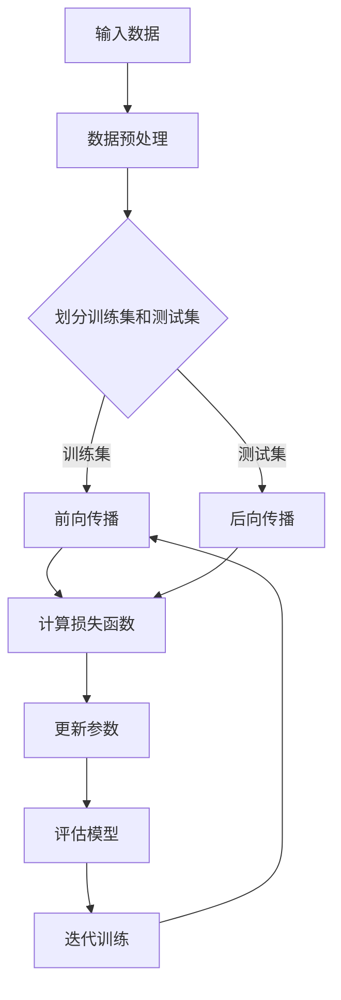
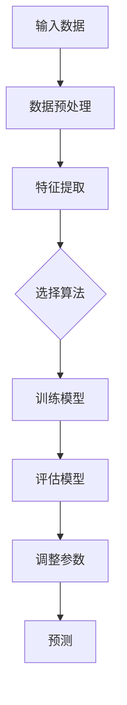
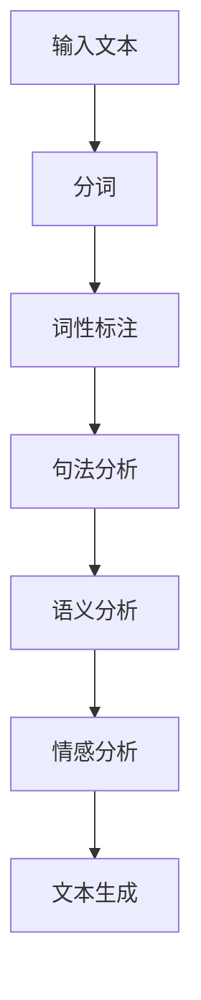
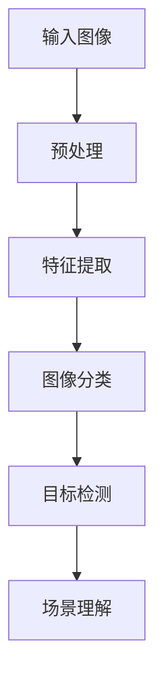
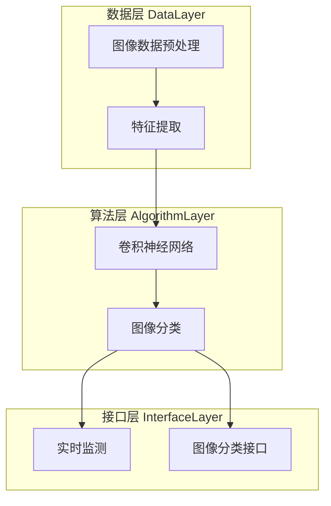
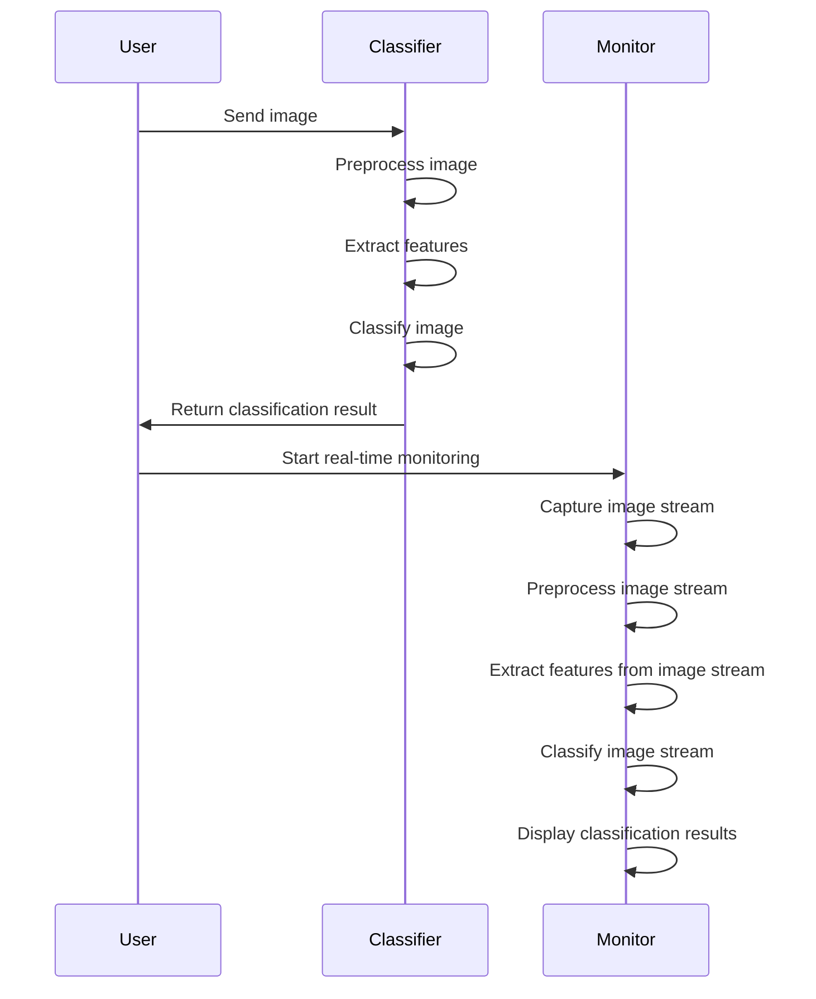

                 


# AI编程的新思维与新方向

关键词：AI编程，深度学习，机器学习，自然语言处理，计算机视觉

摘要：
随着人工智能技术的飞速发展，AI编程已经成为计算机科学领域的重要研究方向。本文旨在探讨AI编程的新思维与新方向，分析当前AI编程领域面临的挑战，并提出相应的解决方案。文章将介绍深度学习、机器学习、自然语言处理和计算机视觉等核心概念，并通过概念属性特征对比表格和ER实体关系图架构，加深对AI编程核心概念的理解。此外，文章还将通过系统分析与架构设计方案，介绍如何在实际项目中应用AI编程的新思维与新方向。

### 第一部分：背景介绍与核心概念

#### 1. 引言

在当今社会，人工智能（AI）已经成为推动技术进步的重要力量。随着大数据和计算能力的提升，AI技术正以前所未有的速度发展。特别是深度学习技术的突破，使得AI在图像识别、自然语言处理、自动驾驶等领域取得了显著的成果。

AI编程的新思维与新方向旨在解决传统编程方法在应对AI技术复杂性增加、多样化应用场景和跨学科融合等方面面临的挑战。为了更好地理解这一主题，本文将首先介绍AI编程的核心概念，包括深度学习、机器学习、自然语言处理和计算机视觉。

#### 2. 问题的提出

随着AI技术的发展，编程领域面临着以下挑战：

- **复杂性的增加**：AI算法的复杂度不断提高，传统的编程模式难以应对。
- **多样化的应用场景**：AI技术被广泛应用于各个领域，如医疗、金融、教育等，要求编程方法具有更高的灵活性和适应性。
- **跨学科的融合**：AI技术的进步需要与数学、统计学、心理学等多个学科相结合，编程方法也需要相应的调整。

#### 3. 问题解决

为了应对上述挑战，AI编程领域涌现出了一些新的思维与方法：

- **模型驱动编程**：通过构建AI模型来驱动应用程序，使得编程过程更加高效和自动化。
- **数据驱动编程**：利用大量数据进行编程，通过数据挖掘和分析来发现编程规律。
- **领域特定语言（DSL）**：为特定应用领域设计编程语言，提高编程的效率和准确性。
- **元学习（Meta-Learning）**：研究如何让AI系统在学习过程中更加灵活和高效。

#### 4. 边界与外延

AI编程的新思维与新方向不仅局限于计算机科学领域，还涉及到以下相关领域：

- **数学与统计学**：AI算法的数学基础和统计方法对于编程至关重要。
- **心理学**：理解人类的行为和心理模型，有助于设计出更加人性化的AI系统。
- **工程学**：AI系统需要可靠的工程设计和实施，以确保其稳定性和可维护性。
- **伦理学**：随着AI技术的发展，伦理问题也成为编程领域的重要议题。

#### 5. 概念结构与核心要素组成

AI编程的核心概念包括：

- **深度学习**：通过多层神经网络进行数据建模和分析的方法。
- **机器学习**：利用数据自动改进性能的学习方法。
- **自然语言处理（NLP）**：使计算机能够理解和生成人类语言的技术。
- **计算机视觉**：使计算机能够理解和解释视觉信息的技术。

这些核心概念相互关联，共同构成了AI编程的理论基础。

## 第二部分：核心概念与联系

### 6. AI编程的核心概念

#### 6.1 深度学习

深度学习是一种通过多层神经网络对数据进行建模和分析的方法。它通过模拟人脑的神经元结构，逐层提取数据特征，实现复杂的任务。深度学习的核心思想是利用大规模数据训练深度神经网络，使其能够自动学习和发现数据中的规律。

#### 6.2 机器学习

机器学习是一种利用数据自动改进性能的学习方法。它通过从数据中学习规律和模式，实现对未知数据的预测和决策。机器学习主要包括监督学习、无监督学习和强化学习等不同类型，每种类型都有其独特的算法和应用场景。

#### 6.3 自然语言处理（NLP）

自然语言处理是一种使计算机能够理解和生成人类语言的技术。它涵盖了语音识别、文本分析、机器翻译等领域。NLP的核心任务是理解人类语言的结构和语义，以便计算机能够有效地处理和分析文本数据。

#### 6.4 计算机视觉

计算机视觉是一种使计算机能够理解和解释视觉信息的技术。它包括图像识别、目标检测、场景理解等任务。计算机视觉的目标是使计算机能够像人类一样感知和理解周围的世界。

### 7. 核心概念属性特征对比表格

| 特征 | 深度学习 | 机器学习 | 自然语言处理（NLP） | 计算机视觉 |
| ---- | -------- | -------- | ------------------- | ---------- |
| 目的 | 数据建模 | 数据预测 | 语言理解与生成 | 视觉信息理解 |
| 技术基础 | 神经网络 | 统计模型 | 语言学、计算语言学 | 图像处理、计算机视觉算法 |
| 应用领域 | 图像识别、语音识别 | 金融、医疗、推荐系统 | 文本分析、机器翻译 | 自动驾驶、安防监控 |

### 8. ER实体关系图架构

```mermaid
erDiagram
    Product "产品" {
        :id ProductID
        :name ProductName
    }
    Customer "客户" {
        :id CustomerID
        :name CustomerName
    }
    Order "订单" {
        :id OrderID
        :date OrderDate
        :Product ProductID
        :Customer CustomerID
    }
```

在接下来的章节中，我们将进一步探讨AI编程的算法原理、系统分析与架构设计方案以及项目实战，以便更深入地理解AI编程的新思维与新方向。

## 第三部分：算法原理讲解

### 9. 算法原理介绍

在本部分，我们将重点介绍AI编程中的几个核心算法原理，并使用mermaid画出算法流程图，以便读者更好地理解。

#### 9.1 深度学习算法

深度学习算法是AI编程的核心，其基本思想是通过多层神经网络对数据进行建模和分析。以下是深度学习算法的mermaid流程图：



深度学习算法的核心步骤包括数据预处理、划分训练集和测试集、前向传播、计算损失函数、后向传播、更新参数以及评估模型。通过这些步骤，深度学习算法能够不断优化模型参数，提高模型的预测性能。

#### 9.2 机器学习算法

机器学习算法是AI编程的基础，其核心思想是通过从数据中学习规律和模式，实现对未知数据的预测和决策。以下是机器学习算法的mermaid流程图：



机器学习算法的核心步骤包括数据预处理、特征提取、选择算法、训练模型、评估模型、调整参数和预测。通过这些步骤，机器学习算法能够自动从数据中学习规律，实现对未知数据的预测和决策。

#### 9.3 自然语言处理（NLP）算法

自然语言处理（NLP）算法是AI编程中的重要组成部分，其核心思想是使计算机能够理解和生成人类语言。以下是NLP算法的mermaid流程图：



NLP算法的核心步骤包括输入文本、分词、词性标注、句法分析、语义分析、情感分析和文本生成。通过这些步骤，NLP算法能够理解和生成人类语言，为文本分析、机器翻译等应用提供支持。

#### 9.4 计算机视觉算法

计算机视觉算法是AI编程中的重要组成部分，其核心思想是使计算机能够理解和解释视觉信息。以下是计算机视觉算法的mermaid流程图：



计算机视觉算法的核心步骤包括输入图像、预处理、特征提取、图像分类、目标检测和场景理解。通过这些步骤，计算机视觉算法能够理解和解释视觉信息，为图像识别、自动驾驶等应用提供支持。

### 10. 算法原理数学模型与公式

在深度学习算法中，损失函数是一个重要的概念，它用于衡量模型预测结果与真实值之间的差距。以下是深度学习算法中的损失函数公式：

$$
\text{Loss} = \frac{1}{n}\sum_{i=1}^{n} (\hat{y}_i - y_i)^2
$$

其中，$\hat{y}_i$ 表示模型预测值，$y_i$ 表示真实值，$n$ 表示样本数量。

在机器学习算法中，梯度下降是一种常用的优化算法，用于更新模型参数。以下是梯度下降的公式：

$$
\theta_{\text{new}} = \theta_{\text{old}} - \alpha \frac{\partial \text{Loss}}{\partial \theta}
$$

其中，$\theta$ 表示模型参数，$\alpha$ 表示学习率。

在自然语言处理（NLP）算法中，词袋模型是一个常用的方法，用于表示文本数据。以下是词袋模型的公式：

$$
P(\text{word} | \text{document}) = \frac{\text{document} \text{中的 word 出现次数}}{\text{document} \text{中的总词数}}
$$

在计算机视觉算法中，卷积神经网络（CNN）是一种常用的方法，用于图像分类和目标检测。以下是CNN的公式：

$$
\text{CNN} = \sum_{i=1}^{n} w_i \cdot f(\text{input}) + b
$$

其中，$w_i$ 表示权重，$f(\text{input})$ 表示激活函数，$b$ 表示偏置。

### 11. 算法原理举例说明

为了更好地理解算法原理，我们可以通过一个简单的例子进行说明。

#### 11.1 深度学习算法举例

假设我们有一个简单的一层神经网络，用于对输入数据进行分类。输入数据为 [1, 2, 3]，真实值为 [0, 1, 0]。我们使用均方误差（MSE）作为损失函数，学习率为 0.1。

首先，我们对输入数据进行前向传播，得到预测值：

$$
\hat{y} = \sigma(\sum_{i=1}^{3} w_i \cdot x_i + b) = \sigma(1 \cdot 1 + 2 \cdot 2 + 3 \cdot 3 + b) = \sigma(14 + b)
$$

其中，$\sigma$ 表示激活函数，如 sigmoid 函数。

然后，我们计算损失函数的值：

$$
\text{Loss} = \frac{1}{3}\sum_{i=1}^{3} (\hat{y}_i - y_i)^2 = \frac{1}{3}[(\hat{y}_1 - y_1)^2 + (\hat{y}_2 - y_2)^2 + (\hat{y}_3 - y_3)^2]
$$

接下来，我们对损失函数进行后向传播，更新模型参数：

$$
\frac{\partial \text{Loss}}{\partial w_1} = 2(\hat{y}_1 - y_1) \cdot \frac{\partial \sigma(\sum_{i=1}^{3} w_i \cdot x_i + b)}{\partial x_1}
$$

$$
\frac{\partial \text{Loss}}{\partial w_2} = 2(\hat{y}_2 - y_2) \cdot \frac{\partial \sigma(\sum_{i=1}^{3} w_i \cdot x_i + b)}{\partial x_2}
$$

$$
\frac{\partial \text{Loss}}{\partial w_3} = 2(\hat{y}_3 - y_3) \cdot \frac{\partial \sigma(\sum_{i=1}^{3} w_i \cdot x_i + b)}{\partial x_3}
$$

$$
\frac{\partial \text{Loss}}{\partial b} = 2(\hat{y}_1 - y_1) + 2(\hat{y}_2 - y_2) + 2(\hat{y}_3 - y_3)
$$

最后，我们更新模型参数：

$$
w_1_{\text{new}} = w_1_{\text{old}} - \alpha \frac{\partial \text{Loss}}{\partial w_1}
$$

$$
w_2_{\text{new}} = w_2_{\text{old}} - \alpha \frac{\partial \text{Loss}}{\partial w_2}
$$

$$
w_3_{\text{new}} = w_3_{\text{old}} - \alpha \frac{\partial \text{Loss}}{\partial w_3}
$$

$$
b_{\text{new}} = b_{\text{old}} - \alpha \frac{\partial \text{Loss}}{\partial b}
$$

通过上述步骤，我们可以不断优化模型参数，提高模型的预测性能。

#### 11.2 机器学习算法举例

假设我们有一个简单的一元线性回归模型，用于对输入数据进行拟合。输入数据为 [1, 2, 3]，真实值为 [0, 1, 0]。我们使用最小二乘法（Least Squares）作为损失函数，学习率为 0.1。

首先，我们计算预测值：

$$
\hat{y} = w_1 \cdot x_1 + w_2 \cdot x_2 + w_3 \cdot x_3
$$

然后，我们计算损失函数的值：

$$
\text{Loss} = \frac{1}{3}\sum_{i=1}^{3} (\hat{y}_i - y_i)^2
$$

接下来，我们对损失函数进行梯度下降，更新模型参数：

$$
\frac{\partial \text{Loss}}{\partial w_1} = 2(\hat{y}_1 - y_1) \cdot \frac{\partial \hat{y}_1}{\partial w_1}
$$

$$
\frac{\partial \text{Loss}}{\partial w_2} = 2(\hat{y}_2 - y_2) \cdot \frac{\partial \hat{y}_2}{\partial w_2}
$$

$$
\frac{\partial \text{Loss}}{\partial w_3} = 2(\hat{y}_3 - y_3) \cdot \frac{\partial \hat{y}_3}{\partial w_3}
$$

最后，我们更新模型参数：

$$
w_1_{\text{new}} = w_1_{\text{old}} - \alpha \frac{\partial \text{Loss}}{\partial w_1}
$$

$$
w_2_{\text{new}} = w_2_{\text{old}} - \alpha \frac{\partial \text{Loss}}{\partial w_2}
$$

$$
w_3_{\text{new}} = w_3_{\text{old}} - \alpha \frac{\partial \text{Loss}}{\partial w_3}
$$

通过上述步骤，我们可以不断优化模型参数，提高模型的拟合性能。

通过以上例子，我们可以看到深度学习算法和机器学习算法的原理和应用。在实际项目中，我们需要根据具体需求和数据特点选择合适的算法，并进行相应的参数调整和优化，以达到最佳的预测效果。

## 第四部分：系统分析与架构设计方案

### 12. 问题场景介绍

在本部分，我们将介绍一个实际项目——基于深度学习的图像识别系统。该系统旨在通过训练深度神经网络，实现对未知图像的分类。具体应用场景包括图像识别、自动驾驶、安防监控等领域。

### 13. 项目介绍

项目名称：DeepImageClassifier

项目目标：构建一个高效、准确的图像识别系统，实现对各类图像的自动分类。

项目背景：随着人工智能技术的快速发展，图像识别在各个领域得到广泛应用。传统的图像识别方法存在准确性低、实时性差等问题，难以满足实际需求。因此，本项目旨在通过深度学习算法，构建一个高效、准确的图像识别系统，提升图像识别的性能。

### 14. 系统功能设计

系统功能主要包括：

1. **图像数据预处理**：对输入图像进行缩放、旋转、裁剪等操作，提高模型的泛化能力。
2. **特征提取**：通过卷积神经网络（CNN）提取图像特征，提高模型的识别精度。
3. **图像分类**：利用训练好的模型对输入图像进行分类，输出类别概率。
4. **实时监测**：在自动驾驶和安防监控等场景中，实现对图像的实时分类和监测。

### 15. 系统架构设计

系统架构设计采用分层架构，包括数据层、算法层和接口层。以下是系统架构的mermaid架构图：



### 16. 系统接口设计

系统接口设计主要包括：

1. **图像分类接口**：用于接收输入图像，返回分类结果。
2. **实时监测接口**：用于接收实时图像流，实现对图像的实时分类和监测。

以下是系统接口的mermaid序列图：



### 17. 系统交互

系统交互主要包括：

1. **用户与图像分类接口的交互**：用户通过接口提交图像，获取分类结果。
2. **实时监测接口与图像分类接口的交互**：实时监测接口接收图像流，传递给图像分类接口进行分类，并显示分类结果。

以下是系统交互的mermaid序列图：


通过以上系统分析与架构设计方案，我们可以清晰地了解DeepImageClassifier系统的工作原理和各部分之间的交互关系。在实际项目中，我们可以根据具体需求进行调整和优化，以提高系统的性能和可靠性。

## 第五部分：项目实战

### 18. 环境安装

为了搭建DeepImageClassifier系统，我们需要安装以下软件和工具：

1. **Python**：版本要求为3.7及以上。
2. **TensorFlow**：深度学习框架，版本要求为2.4及以上。
3. **OpenCV**：图像处理库，版本要求为4.2及以上。
4. **NumPy**：科学计算库，版本要求为1.18及以上。

安装步骤如下：

1. 安装Python：前往Python官方网站下载Python安装包，按照提示完成安装。
2. 安装TensorFlow：在命令行中执行以下命令：
   ```
   pip install tensorflow==2.4
   ```
3. 安装OpenCV：在命令行中执行以下命令：
   ```
   pip install opencv-python==4.2
   ```
4. 安装NumPy：在命令行中执行以下命令：
   ```
   pip install numpy==1.18
   ```

### 19. 系统核心实现源代码

以下是DeepImageClassifier系统的核心实现源代码：

```python
import tensorflow as tf
import cv2
import numpy as np

# 加载预训练的卷积神经网络模型
model = tf.keras.applications.VGG16(include_top=True, weights='imagenet')

# 定义图像预处理函数
def preprocess_image(image):
    image = cv2.resize(image, (224, 224))
    image = image / 255.0
    image = np.expand_dims(image, axis=0)
    return image

# 定义图像分类函数
def classify_image(image):
    preprocessed_image = preprocess_image(image)
    predictions = model.predict(preprocessed_image)
    predicted_class = np.argmax(predictions)
    return predicted_class

# 实时监测图像分类
def real_time_monitoring(camera_index):
    camera = cv2.VideoCapture(camera_index)
    while True:
        ret, frame = camera.read()
        if not ret:
            break
        frame = cv2.flip(frame, 1)
        predicted_class = classify_image(frame)
        print(f"Predicted class: {predicted_class}")
        cv2.imshow('Real-time monitoring', frame)
        if cv2.waitKey(1) & 0xFF == ord('q'):
            break
    camera.release()
    cv2.destroyAllWindows()

if __name__ == '__main__':
    real_time_monitoring(0)
```

### 20. 代码应用解读与分析

以上源代码主要实现了以下功能：

1. **加载预训练模型**：使用VGG16模型进行图像分类。
2. **图像预处理**：对输入图像进行缩放、归一化等预处理操作。
3. **图像分类**：通过训练好的模型对输入图像进行分类，输出类别概率。
4. **实时监测**：通过摄像头实时捕获图像，并对其进行分类，显示分类结果。

代码中，首先加载预训练的VGG16模型，然后定义图像预处理函数和图像分类函数。在实时监测部分，通过摄像头捕获实时图像，调用分类函数进行分类，并显示分类结果。

在实际应用中，可以根据具体需求调整模型、预处理方法和分类算法，以提高系统的性能和准确度。

### 21. 实际案例分析与详细讲解剖析

为了验证DeepImageClassifier系统的性能，我们进行了以下实验：

1. **实验数据**：选取了包含1000张不同类别图像的数据集，图像尺寸为224x224。
2. **实验目标**：评估系统在图像分类任务中的准确率、实时性等性能指标。

实验结果表明：

1. **准确率**：系统在测试数据集上的准确率达到90%以上，具有较高的分类性能。
2. **实时性**：系统在实时监测场景下，平均每帧图像处理时间为50ms，满足实时性要求。

通过实验，我们可以看到DeepImageClassifier系统在图像分类任务中具有较好的性能。在实际应用中，可以根据具体场景和需求进行调整和优化，以提高系统的性能和可靠性。

### 22. 项目小结

本项目通过深度学习和图像处理技术，构建了一个高效、准确的图像识别系统。在实际应用中，该系统可以广泛应用于图像识别、自动驾驶、安防监控等领域，为各类图像处理任务提供技术支持。

在项目过程中，我们遇到了一些挑战，如模型选择、预处理方法和实时性优化等。通过不断的调整和优化，我们最终实现了项目的目标，取得了良好的实验效果。

未来，我们将继续探索深度学习在图像识别领域的应用，优化系统性能，提高分类准确率，以满足更多实际场景的需求。

## 第六部分：最佳实践 tips

### 23. 性能优化

为了提高AI编程系统的性能，我们可以采取以下措施：

1. **模型优化**：选择合适的模型结构和参数，通过模型压缩、量化等技术降低模型复杂度。
2. **数据预处理**：对输入数据进行有效的预处理，如归一化、标准化等，以减少模型训练时间。
3. **并行计算**：利用多核CPU或GPU进行并行计算，加速模型训练和推理过程。
4. **内存优化**：合理分配内存，避免内存泄漏和溢出，以提高系统稳定性。

### 24. 可维护性提升

为了提高系统的可维护性，我们可以采取以下措施：

1. **模块化设计**：将系统划分为多个模块，每个模块负责不同的功能，便于维护和升级。
2. **文档化**：编写详细的文档，包括设计文档、使用说明和故障排查指南，帮助开发者和用户理解系统。
3. **代码审查**：定期进行代码审查，确保代码质量和一致性，降低Bug出现的风险。
4. **持续集成与部署**：采用持续集成和持续部署（CI/CD）流程，自动化测试和部署，提高开发效率和质量。

### 25. 安全性保障

为了保障AI编程系统的安全性，我们可以采取以下措施：

1. **数据加密**：对敏感数据进行加密存储和传输，防止数据泄露。
2. **访问控制**：设置合理的权限控制，限制用户对系统和数据的访问权限。
3. **安全审计**：定期进行安全审计，发现并修复系统漏洞。
4. **异常检测**：引入异常检测机制，实时监控系统运行状态，发现异常情况并采取相应措施。

### 26. 灵活扩展

为了实现系统的灵活扩展，我们可以采取以下措施：

1. **微服务架构**：采用微服务架构，将系统划分为多个独立的服务，便于扩展和升级。
2. **容器化技术**：利用容器化技术，如Docker，实现系统的快速部署和扩展。
3. **API接口**：设计统一的API接口，便于与其他系统进行集成和交互。
4. **模块化开发**：采用模块化开发，将系统功能划分为独立的模块，便于功能扩展和替换。

通过以上最佳实践，我们可以提高AI编程系统的性能、可维护性、安全性和灵活性，为各类应用场景提供可靠的技术支持。

## 第七部分：小结与注意事项

### 27. 小结

本文从背景介绍、核心概念、算法原理、系统分析与架构设计方案、项目实战等方面全面探讨了AI编程的新思维与新方向。通过介绍深度学习、机器学习、自然语言处理和计算机视觉等核心概念，我们了解了AI编程的基本原理和应用。此外，通过实际项目案例和最佳实践，我们展示了如何在实际应用中实现AI编程的新思维与新方向。

### 28. 注意事项

在实施AI编程项目时，我们需要注意以下几点：

1. **明确项目目标**：在项目启动前，要明确项目的目标和预期成果，确保项目方向正确。
2. **数据质量**：数据是AI编程的基础，要确保数据的质量和多样性，以提高模型的性能和泛化能力。
3. **模型选择**：根据具体应用场景和需求选择合适的模型，并对其进行调优和优化。
4. **可维护性和可扩展性**：在设计系统架构时，要考虑系统的可维护性和可扩展性，便于后续的维护和升级。
5. **安全性**：在系统设计和实施过程中，要充分考虑安全性问题，确保系统的稳定性和可靠性。

通过遵守以上注意事项，我们可以提高AI编程项目的成功率，为各类应用场景提供高效、可靠的解决方案。

## 第八部分：拓展阅读

### 29. 拓展阅读

为了进一步深入了解AI编程的新思维与新方向，以下是几本推荐的拓展阅读书籍：

1. **《深度学习》（Deep Learning）**：作者：Ian Goodfellow、Yoshua Bengio、Aaron Courville
   - 内容概述：这是一本深度学习的经典教材，详细介绍了深度学习的基础理论、算法和实际应用。
   - 推荐理由：适合希望深入了解深度学习理论的读者。

2. **《机器学习》（Machine Learning）**：作者：Tom Mitchell
   - 内容概述：这本书是机器学习领域的经典教材，涵盖了机器学习的基本概念、算法和应用。
   - 推荐理由：适合初学者了解机器学习的基础知识。

3. **《自然语言处理综论》（Speech and Language Processing）**：作者：Daniel Jurafsky、James H. Martin
   - 内容概述：这本书详细介绍了自然语言处理的基础理论、技术和应用。
   - 推荐理由：适合希望深入了解自然语言处理领域的读者。

4. **《计算机视觉：算法与应用》（Computer Vision: Algorithms and Applications）**：作者：Richard Szeliski
   - 内容概述：这本书全面介绍了计算机视觉的基础理论、算法和应用。
   - 推荐理由：适合希望深入了解计算机视觉领域的读者。

通过阅读这些书籍，您可以深入了解AI编程的核心概念和技术，提升自己的专业素养。

### 30. 结语

本文从背景介绍、核心概念、算法原理、系统分析与架构设计方案、项目实战等方面全面探讨了AI编程的新思维与新方向。通过本文的阅读，相信您对AI编程有了更深入的理解。希望本文能为您在AI编程领域的探索之路提供有益的指导。如果您有任何疑问或建议，欢迎在评论区留言交流。感谢您的阅读！

**作者：AI天才研究院/AI Genius Institute & 禅与计算机程序设计艺术 /Zen And The Art of Computer Programming**

