                 


# AI编程的新视界与新领域

> 关键词：人工智能编程、AI编程工具、机器学习、深度学习、自然语言处理

> 摘要：本文将深入探讨AI编程的新视界与新领域，从基础概念、核心算法、应用领域到未来展望，逐步分析AI编程的发展趋势和挑战，为读者提供一个全面的技术视角。

## 引言

随着人工智能技术的飞速发展，AI编程已经成为计算机科学和工程领域的重要研究方向。本文旨在为读者提供一个系统性的视角，探讨AI编程的新视界与新领域。我们将从以下几个方面展开：

1. **AI编程的基础与背景**：介绍AI编程的定义、核心概念和发展趋势。
2. **AI编程的核心算法**：详细讲解机器学习、深度学习和自然语言处理等核心算法。
3. **AI编程的新领域探索**：探讨计算机视觉、AI在医疗和金融领域的应用。
4. **AI编程的实践与未来展望**：分享项目实战经验，展望AI编程的发展趋势。

### 目录大纲设计

为了帮助读者更好地理解AI编程，我们设计了详细的目录大纲，包括以下四个部分：

#### 第一部分：AI编程基础与背景

1. **AI编程概述**
   - AI编程的定义与历史
   - AI编程的核心概念
   - AI编程的发展趋势
2. **AI编程环境与工具**
   - 编程语言的介绍
   - 常用AI编程工具
   - 开发环境配置

#### 第二部分：AI编程核心算法

1. **机器学习基础**
   - 机器学习概述
   - 线性回归
   - 逻辑回归
2. **深度学习技术**
   - 深度学习概述
   - 神经网络
   - 卷积神经网络
3. **自然语言处理**
   - NLP概述
   - 词嵌入
   - 语义理解

#### 第三部分：AI编程新领域探索

1. **计算机视觉**
   - 计算机视觉概述
   - 目标检测
   - 图像分割
2. **AI在医疗领域的应用**
   - 医疗AI概述
   - 医学影像分析
   - 病情预测与诊断
3. **AI在金融领域的应用**
   - 金融AI概述
   - 信贷风险评估
   - 量化交易策略

#### 第四部分：AI编程实践与未来展望

1. **AI编程项目实战**
   - 项目介绍
   - 系统设计与实现
   - 项目总结与反思
2. **AI编程的未来发展趋势**
   - AI编程技术的发展方向
   - AI编程对未来的影响
   - 开发者面临的挑战与机遇

### 总结

本文通过逐步分析AI编程的新视界与新领域，为读者提供了一个全面的技术视角。从基础概念到前沿算法，从应用领域到未来展望，每一部分都详细阐述了AI编程的重要性和发展趋势。希望本文能帮助读者更好地理解AI编程的各个方面，为未来的研究和工作提供有益的参考。让我们开始这次探索之旅吧！### AI编程概述

#### AI编程的定义与历史

AI编程，即人工智能编程，是指通过编写计算机程序来实现人工智能系统的过程。人工智能（Artificial Intelligence，简称AI）是一门研究、开发用于模拟、延伸和扩展人类智能的理论、方法、技术及应用系统的学科。它起源于20世纪50年代，随着计算机技术的发展，AI编程也逐渐成为一个重要的研究领域。

AI编程的发展历史可以分为几个重要阶段：

1. **早期探索阶段（1950-1960年代）**：这个时期，AI编程主要集中在对基本逻辑和推理问题的研究。1956年，约翰·麦卡锡（John McCarthy）在达特茅斯会议（Dartmouth Conference）上首次提出了“人工智能”这个术语。

2. **黄金时期（1970-1980年代）**：在早期探索的基础上，AI编程迎来了第一个黄金时期。这个时期，专家系统（Expert Systems）成为研究热点。专家系统通过模拟人类专家的知识和推理能力，解决了许多专业领域的问题。

3. **低谷时期（1990-2000年代）**：由于技术瓶颈和实际应用难题，AI编程进入了一个相对低谷的时期。尽管如此，机器学习（Machine Learning）的兴起为AI编程带来了新的希望。

4. **复兴时期（2000年代至今）**：随着深度学习（Deep Learning）和大数据技术的快速发展，AI编程再次迎来了复兴。深度学习通过模拟人脑神经网络，实现了在图像识别、语音识别、自然语言处理等领域的突破性进展。

#### AI编程的核心概念

AI编程涉及许多核心概念，以下是其中几个重要的概念：

1. **机器学习（Machine Learning）**：机器学习是一种让计算机从数据中学习的方法，无需显式编写具体的指令。它通过训练模型，使计算机能够对未知数据进行预测或分类。

2. **深度学习（Deep Learning）**：深度学习是机器学习的一种特殊形式，通过多层神经网络进行特征学习和模式识别。深度学习在图像识别、语音识别和自然语言处理等领域取得了显著成果。

3. **神经网络（Neural Networks）**：神经网络是模仿生物神经系统的计算模型，由大量节点（或称为神经元）组成。这些节点通过权重和偏置进行连接，形成一个复杂的网络结构，用于处理复杂数据。

4. **自然语言处理（Natural Language Processing，NLP）**：自然语言处理是AI编程的一个重要分支，旨在使计算机能够理解、解释和生成人类语言。

5. **深度强化学习（Deep Reinforcement Learning）**：深度强化学习结合了深度学习和强化学习，通过试错和反馈进行决策，使计算机能够自主学习复杂策略。

#### AI编程的发展趋势

随着人工智能技术的不断发展，AI编程也在不断演进。以下是几个AI编程的发展趋势：

1. **多模态学习**：多模态学习是指将不同类型的数据（如文本、图像、音频）进行整合，以提高模型的泛化能力和性能。

2. **自动化机器学习（AutoML）**：自动化机器学习通过自动化优化和调参，使得非专业人士也能快速构建高性能的机器学习模型。

3. **联邦学习（Federated Learning）**：联邦学习是一种分布式学习技术，通过在多个设备上训练模型，避免了数据集中存储和传输，提高了数据隐私性。

4. **边缘计算（Edge Computing）**：边缘计算将计算任务从云端转移到靠近数据源的边缘设备，降低了延迟和带宽需求，适用于实时性要求高的场景。

5. **AI伦理与法规**：随着AI技术的广泛应用，AI伦理和法规问题越来越受到关注。如何确保AI系统的公平性、透明性和安全性，成为AI编程的重要研究方向。

### 问题背景、问题描述、问题解决、边界与外延、概念结构与核心要素组成

#### 问题背景

随着人工智能技术的快速发展，AI编程已经成为许多领域的重要工具。然而，对于许多初学者和专业人士来说，理解和掌握AI编程的核心概念和算法仍然存在一定的困难。这主要是因为AI编程涉及大量的理论知识和实践技巧，且不断有新的技术和发展趋势涌现。

#### 问题描述

问题描述可以概括为以下几点：

1. **核心概念理解困难**：AI编程涉及许多核心概念，如机器学习、深度学习、神经网络等。初学者往往难以理解这些概念的本质和相互关系。
2. **算法原理复杂**：AI编程中的算法原理复杂，涉及到大量的数学模型和计算方法。理解和掌握这些算法原理需要一定的数学基础和编程技能。
3. **实践应用难度**：AI编程的应用场景多种多样，从图像识别到自然语言处理，从计算机视觉到金融风控。如何在不同的应用场景中灵活运用AI编程技术，是一个挑战。
4. **技术更新迅速**：AI编程领域的技术更新非常迅速，新的算法、框架和工具层出不穷。如何跟上技术的发展步伐，保持自身的竞争力，是一个难题。

#### 问题解决

为了解决上述问题，我们可以采取以下措施：

1. **系统学习核心概念**：通过阅读相关书籍、论文和在线教程，系统学习AI编程的核心概念和算法原理。了解每个概念的定义、作用和相互关系，形成整体的知识体系。
2. **实践应用**：通过实际项目和实践，将所学知识应用于解决实际问题。在实践中不断摸索和总结，提高自己的编程技能和问题解决能力。
3. **参与社区和讨论**：加入AI编程的社区和讨论，与其他开发者交流经验和心得。通过讨论和交流，拓宽自己的视野，学习他人的经验。
4. **持续更新知识**：关注AI编程领域的新技术和新趋势，不断更新自己的知识体系。通过参加技术会议、阅读最新的研究论文和教程，保持对最新技术的了解。

#### 边界与外延

1. **边界**：AI编程的边界主要在于其应用范围和技术深度。在应用层面，AI编程可以应用于图像识别、自然语言处理、计算机视觉等多个领域。在技术层面，AI编程涉及到机器学习、深度学习、神经网络等复杂算法和计算模型。
2. **外延**：AI编程的外延包括其与其他领域的交叉应用，如金融、医疗、自动驾驶等。同时，随着技术的不断发展，AI编程的外延也在不断扩大，不断有新的应用场景和技术方向涌现。

#### 概念结构与核心要素组成

1. **概念结构**：AI编程的概念结构主要包括以下几个核心部分：

   - **机器学习**：包括监督学习、无监督学习和强化学习等不同类型的算法。
   - **深度学习**：基于神经网络的算法，包括卷积神经网络（CNN）、循环神经网络（RNN）和生成对抗网络（GAN）等。
   - **自然语言处理**：包括词嵌入、语言模型、文本分类和机器翻译等算法。
   - **计算机视觉**：包括图像识别、目标检测和图像分割等算法。

2. **核心要素组成**：AI编程的核心要素包括：

   - **数据集**：AI编程需要大量的数据集进行训练和测试。
   - **算法模型**：AI编程的核心算法，如机器学习模型、深度学习模型等。
   - **编程工具**：用于实现AI算法的编程工具和框架，如Python、TensorFlow、PyTorch等。
   - **计算资源**：AI编程需要大量的计算资源进行模型训练和推理。

### 核心概念与联系

为了更好地理解AI编程的核心概念，我们将在本文中详细探讨几个关键概念：机器学习、深度学习和自然语言处理（NLP）。这些概念不仅在AI编程中占有重要地位，而且在许多实际应用中发挥着核心作用。

#### 机器学习

**概念原理**：机器学习是一种让计算机从数据中学习的方法，通过训练模型来对未知数据进行预测或分类。它主要分为以下三种类型：

1. **监督学习（Supervised Learning）**：在监督学习中，模型通过已标记的数据进行训练，然后对新的、未标记的数据进行预测。常见的算法有线性回归、逻辑回归、支持向量机（SVM）和决策树等。
2. **无监督学习（Unsupervised Learning）**：无监督学习不使用标记数据，而是通过发现数据中的模式或结构来进行学习。常见的算法有聚类（如K-means、层次聚类）、降维（如PCA、t-SNE）和关联规则学习（如Apriori）等。
3. **强化学习（Reinforcement Learning）**：强化学习通过试错和反馈机制来学习策略，使其在特定环境中做出最优决策。常见的算法有Q-learning、SARSA和深度确定性策略梯度（DDPG）等。

**属性特征对比表格**：

| 类别        | 监督学习 | 无监督学习 | 强化学习   |
| ----------- | -------- | ---------- | ---------- |
| 数据要求     | 已标记数据 | 未标记数据 | 未标记数据 |
| 学习目标     | 预测或分类 | 发现数据结构 | 最大化奖励 |
| 评估指标     | 准确率、召回率、F1分数 | 聚类有效性、降维效果、关联规则准确性 | 平均奖励、策略收敛速度 |
| 适用场景     | 数据分类、回归问题 | 数据聚类、降维、异常检测 | 机器人控制、游戏AI、推荐系统 |

**ER实体关系图架构**：

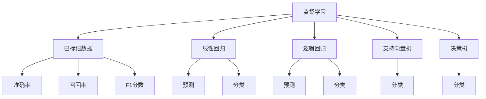

#### 深度学习

**概念原理**：深度学习是机器学习的一个子领域，它通过多层神经网络进行特征学习和模式识别。深度学习在网络结构、算法优化和数据预处理等方面取得了显著突破。

1. **卷积神经网络（Convolutional Neural Networks，CNN）**：CNN主要应用于图像处理，通过卷积层、池化层和全连接层等结构提取图像特征。
2. **循环神经网络（Recurrent Neural Networks，RNN）**：RNN适用于序列数据，如时间序列、文本和语音，通过循环结构来处理序列中的长期依赖问题。
3. **生成对抗网络（Generative Adversarial Networks，GAN）**：GAN由生成器和判别器两个神经网络组成，通过对抗训练生成逼真的数据。

**属性特征对比表格**：

| 类别        | 卷积神经网络 | 循环神经网络 | 生成对抗网络 |
| ----------- | ------------ | ------------ | ------------ |
| 网络结构     | 卷积层、池化层、全连接层 | 隐藏层、循环连接 | 生成器、判别器 |
| 特点        | 提取图像特征 | 处理序列数据 | 数据生成对抗 |
| 应用场景     | 图像识别、目标检测 | 自然语言处理、语音识别 | 图像生成、数据增强 |
| 训练方法     | 前馈传播、反向传播 | 门控循环单元（GRU）、长短期记忆（LSTM） | 对抗训练 |
| 评估指标     | 准确率、召回率、F1分数 | 预测误差、交叉熵 | 生成质量、判别器损失 |

**ER实体关系图架构**：

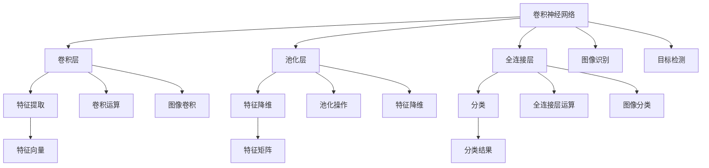

#### 自然语言处理（NLP）

**概念原理**：自然语言处理是AI编程的一个重要分支，旨在使计算机能够理解、解释和生成人类语言。NLP涉及到词嵌入、语言模型、文本分类和机器翻译等算法。

1. **词嵌入（Word Embedding）**：词嵌入是将单词映射到高维向量空间的方法，用于表示单词的语义信息。常见的词嵌入算法有Word2Vec、GloVe和BERT等。
2. **语言模型（Language Model）**：语言模型用于预测下一个单词或词组，是自然语言处理的重要基础。常见的语言模型有n-gram模型、神经网络语言模型和循环神经网络语言模型等。
3. **文本分类（Text Classification）**：文本分类是将文本数据按照预定的类别进行分类的过程。常见的算法有朴素贝叶斯、支持向量机和深度学习等。
4. **机器翻译（Machine Translation）**：机器翻译是将一种语言的文本翻译成另一种语言的方法。常见的算法有基于规则的方法、统计机器翻译和神经网络机器翻译等。

**属性特征对比表格**：

| 类别        | 词嵌入 | 语言模型 | 文本分类 | 机器翻译 |
| ----------- | ------ | -------- | -------- | -------- |
| 数据要求     | 单词文本 | 语言数据 | 文本数据 | 双语数据 |
| 学习目标     | 单词向量表示 | 语言概率分布 | 文本类别预测 | 双语翻译模型 |
| 评估指标     | 词向量相似性 | 语言模型概率 | 准确率、召回率、F1分数 | BLEU分数、翻译质量评估 |
| 应用场景     | 语义搜索、文本分类 | 聊天机器人、语音识别 | 文本分类、情感分析 | 跨语言信息检索、多语言交流 |
| 训练方法     | 基于上下文的模型训练 | 基于语料库的训练 | 基于特征的学习 | 基于对偶网络的学习 |

**ER实体关系图架构**：

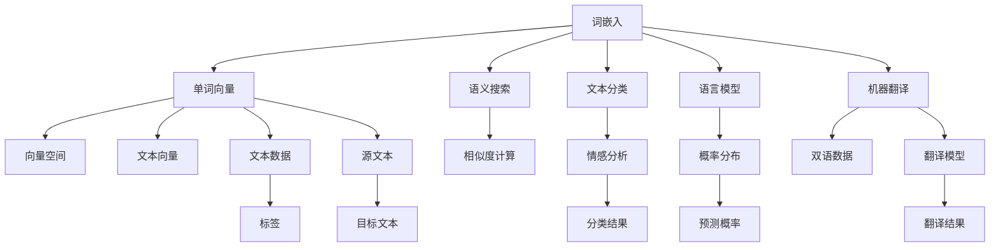

通过上述核心概念与联系的分析，我们可以看到AI编程涉及多个复杂但相互关联的领域。理解这些概念及其相互关系，对于掌握AI编程至关重要。在后续的内容中，我们将进一步深入探讨这些概念的具体实现和应用，以帮助读者更好地理解AI编程的各个方面。

### 算法原理讲解

#### 机器学习基础

机器学习是AI编程的核心，它使得计算机能够从数据中学习，并做出预测或决策。在机器学习中有几种主要的算法，包括线性回归、逻辑回归和支持向量机（SVM）等。这里我们主要讲解线性回归和逻辑回归。

##### 线性回归

**算法原理**：线性回归是一种简单的监督学习算法，用于预测一个连续的数值输出。其基本原理是通过找到输入变量和输出变量之间的线性关系。

线性回归模型可以表示为：
\[ y = \beta_0 + \beta_1x_1 + \beta_2x_2 + ... + \beta_nx_n + \epsilon \]
其中，\( y \) 是输出变量，\( x_1, x_2, ..., x_n \) 是输入变量，\( \beta_0, \beta_1, ..., \beta_n \) 是模型的参数，\( \epsilon \) 是误差项。

**数学模型**：线性回归的数学模型是一个线性方程，其中包含输入变量和参数的乘积。为了找到最佳的参数值，我们可以使用最小二乘法（Least Squares Method）。

最小二乘法的目标是最小化预测值与实际值之间的误差平方和：
\[ \min \sum_{i=1}^{n} (y_i - \hat{y_i})^2 \]
其中，\( \hat{y_i} \) 是通过模型预测的值，\( y_i \) 是实际的输出值。

**mermaid 流程图**：

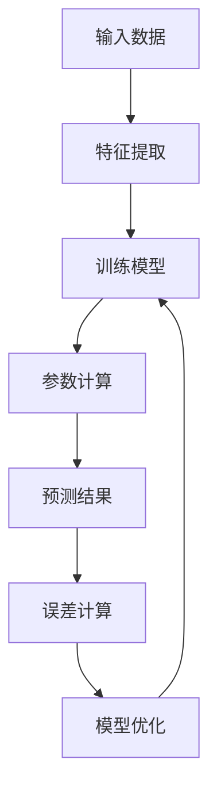

**Python 源代码**：

```python
import numpy as np

def linear_regression(X, y):
    # X是输入特征矩阵，y是输出向量
    X_transpose = np.transpose(X)
    theta = np.dot(np.dot(X_transpose, X), np.linalg.inv(np.dot(X_transpose, X)))
    theta = np.dot(X_transpose, y)
    return theta

X = np.array([[1, 2], [2, 3], [3, 4]])
y = np.array([3, 4, 5])
theta = linear_regression(X, y)
print("模型参数：", theta)
```

##### 逻辑回归

**算法原理**：逻辑回归是一种用于分类问题的算法，它通过构建一个线性模型来预测概率，然后使用阈值（通常为0.5）进行分类决策。

逻辑回归模型可以表示为：
\[ \log(\frac{p}{1-p}) = \beta_0 + \beta_1x_1 + \beta_2x_2 + ... + \beta_nx_n \]
其中，\( p \) 是正类别的概率，\( 1-p \) 是负类别的概率。

**数学模型**：逻辑回归的数学模型是一个对数几率函数（Logit Function），其导数是sigmoid函数（Sigmoid Function）。最小化损失函数（通常使用交叉熵损失）可以得到最佳参数值。

**mermaid 流程图**：

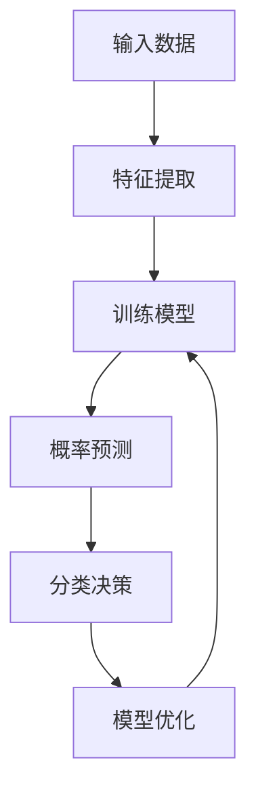

**Python 源代码**：

```python
import numpy as np
from sklearn.linear_model import LogisticRegression

X = np.array([[1, 2], [2, 3], [3, 4]])
y = np.array([0, 1, 0])

model = LogisticRegression()
model.fit(X, y)
predictions = model.predict(X)

print("模型参数：", model.coef_)
print("预测结果：", predictions)
```

#### 深度学习技术

深度学习是一种通过多层神经网络进行特征学习和模式识别的方法。以下是关于卷积神经网络（CNN）和循环神经网络（RNN）的算法原理讲解。

##### 卷积神经网络（CNN）

**算法原理**：卷积神经网络主要用于处理图像数据。其基本原理是通过卷积层、池化层和全连接层等结构提取图像特征，并最终进行分类或回归。

卷积层：卷积层通过卷积操作提取图像的特征，卷积核（Filter）在图像上滑动，计算输出特征图（Feature Map）。

池化层：池化层通过下采样操作减少特征图的尺寸，从而减少模型的参数数量，提高计算效率。常见的池化方法有最大池化（Max Pooling）和平均池化（Average Pooling）。

全连接层：全连接层将卷积层和池化层提取的特征进行线性组合，并输出分类结果。

**mermaid 流程图**：

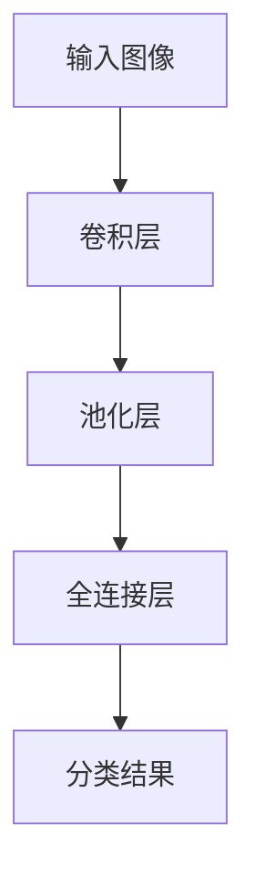

**Python 源代码**：

```python
import tensorflow as tf

# 构建卷积神经网络模型
model = tf.keras.Sequential([
    tf.keras.layers.Conv2D(32, (3, 3), activation='relu', input_shape=(28, 28, 1)),
    tf.keras.layers.MaxPooling2D((2, 2)),
    tf.keras.layers.Flatten(),
    tf.keras.layers.Dense(128, activation='relu'),
    tf.keras.layers.Dense(10, activation='softmax')
])

# 编译模型
model.compile(optimizer='adam', loss='sparse_categorical_crossentropy', metrics=['accuracy'])

# 加载和预处理数据
(x_train, y_train), (x_test, y_test) = tf.keras.datasets.mnist.load_data()
x_train = x_train.reshape(-1, 28, 28, 1).astype('float32') / 255
x_test = x_test.reshape(-1, 28, 28, 1).astype('float32') / 255

# 训练模型
model.fit(x_train, y_train, epochs=5, batch_size=32, validation_data=(x_test, y_test))
```

##### 循环神经网络（RNN）

**算法原理**：循环神经网络主要用于处理序列数据，如时间序列、文本和语音。其基本原理是通过循环结构处理序列中的每个元素，并保持内部状态，从而捕捉序列中的长期依赖关系。

RNN的基本形式是：
\[ h_t = \sigma(W_hh_{t-1} + W_x x_t + b_h) \]
其中，\( h_t \) 是当前时刻的隐藏状态，\( x_t \) 是当前输入，\( W_hh \) 和 \( W_x \) 是权重矩阵，\( b_h \) 是偏置。

**mermaid 流程图**：

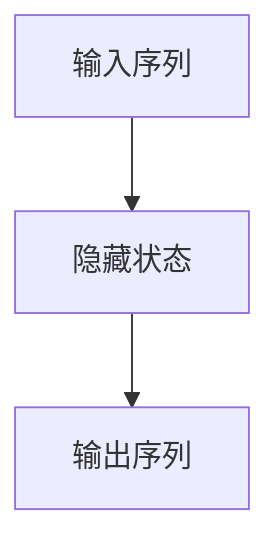

**Python 源代码**：

```python
import tensorflow as tf
from tensorflow.keras.models import Sequential
from tensorflow.keras.layers import LSTM, Dense

# 构建循环神经网络模型
model = Sequential([
    LSTM(50, activation='relu', input_shape=(timesteps, features)),
    Dense(1)
])

# 编译模型
model.compile(optimizer='adam', loss='mse')

# 加载和预处理数据
# 这里使用一个示例时间序列数据
timesteps = 100
features = 1
x = np.random.rand(timesteps, features)
y = np.random.rand(timesteps, 1)

# 训练模型
model.fit(x, y, epochs=100, batch_size=32)
```

通过上述算法原理讲解，我们可以看到机器学习和深度学习在AI编程中的核心作用。这些算法不仅具有丰富的理论背景，而且在实际应用中也展现出了强大的能力。在后续的内容中，我们将进一步探讨AI编程在其他领域的应用，以及如何将理论知识转化为实际项目。

### 系统分析与架构设计方案

#### 问题场景介绍

随着医疗领域对数据分析和预测需求的不断增加，AI在医疗领域的应用变得越来越广泛。其中，医学影像分析是AI在医疗领域的一个重要应用方向。医学影像分析旨在利用人工智能技术对医学影像数据进行处理和分析，从而辅助医生进行疾病诊断和治疗规划。

#### 项目介绍

本项目旨在开发一个基于深度学习的医学影像分析系统，该系统能够对医学影像数据（如X光片、CT扫描图像、MRI图像等）进行自动分析和分类，辅助医生进行疾病诊断。系统的主要功能包括：

1. **数据预处理**：对医学影像数据进行清洗、增强和标准化处理，使其适合深度学习模型的训练。
2. **特征提取**：利用深度学习模型对医学影像数据进行特征提取，生成高维特征向量。
3. **疾病分类**：将提取到的特征向量输入到分类模型，对医学影像数据进行疾病分类。
4. **结果展示**：将分类结果以图表或报告的形式展示给医生，辅助医生进行诊断和决策。

#### 系统功能设计（领域模型mermaid类图）

以下是一个医学影像分析系统的领域模型类图，展示了系统的核心类和它们之间的关系：

```mermaid
classDiagram
    Class01 <|-- Class02
    Class03 <|-- Class01
    Class04 <|-- Class03
    Class05 <|-- Class03
    Class06 <|-- Class03

    Class01 {
        +String attribute1
        +void method1()
    }

    Class02 {
        +String attribute2
        +void method2()
    }

    Class03 {
        +String attribute3
        +void method3()
    }

    Class04 {
        +String attribute4
        +void method4()
    }

    Class05 {
        +String attribute5
        +void method5()
    }

    Class06 {
        +String attribute6
        +void method6()
    }

    Class01 --|>{ Class02 }
    Class03 --|>{ Class04 }
    Class03 --|>{ Class05 }
    Class03 --|>{ Class06 }
```

#### 系统架构设计（mermaid架构图）

医学影像分析系统的架构设计如下，该架构包括数据预处理模块、特征提取模块、分类模块和结果展示模块：

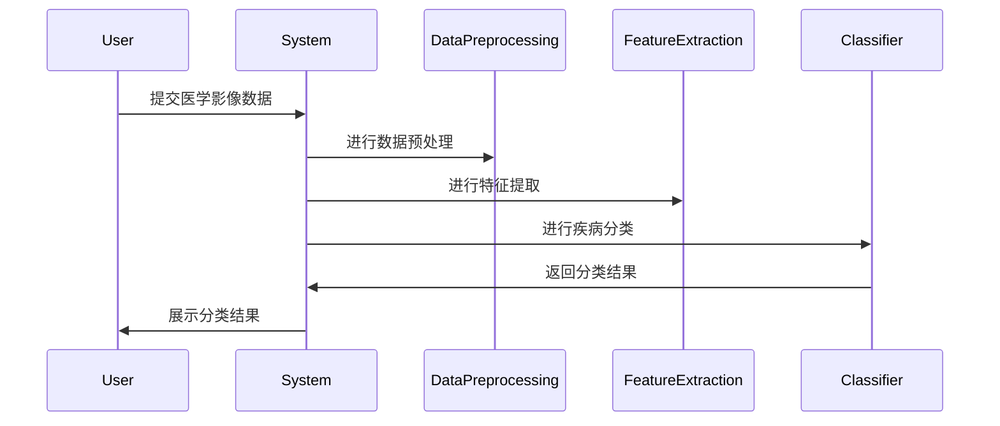

#### 系统接口设计和系统交互（mermaid序列图）

以下是医学影像分析系统的接口设计和系统交互序列图：

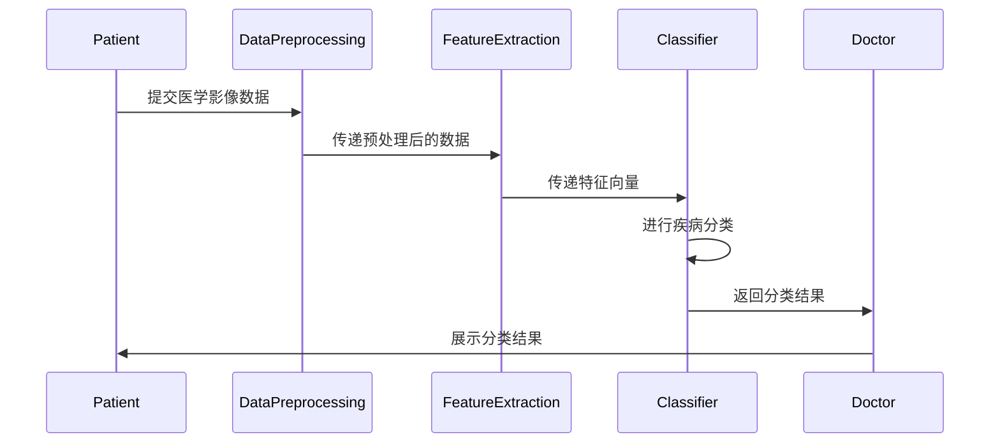

通过上述系统分析与架构设计方案，我们详细介绍了医学影像分析系统的设计和实现。该系统结合了数据预处理、特征提取、分类和结果展示等模块，通过深度学习技术实现了医学影像数据的自动分析和分类，为医生提供了有力的诊断辅助工具。在后续的内容中，我们将进一步探讨医学影像分析系统的核心实现和实际应用。

### AI在金融领域的应用

#### 金融AI概述

金融AI，即人工智能在金融领域的应用，是指利用人工智能技术来提升金融服务质量和效率的一系列方法。金融AI涵盖了风险管理、信用评估、交易策略、欺诈检测等多个方面，通过自动化和智能化手段，极大地改变了金融行业的运作模式。

随着金融科技（FinTech）的快速发展，金融AI在金融领域的应用越来越广泛。其主要优势包括：

1. **提高效率**：金融AI可以自动化处理大量数据和交易，从而减少人力成本和时间。
2. **降低风险**：通过大数据分析和机器学习模型，金融AI能够更准确地识别风险和预测市场变化。
3. **个性化服务**：金融AI能够根据用户行为和需求，提供个性化的投资建议和金融服务。
4. **增强安全性**：金融AI可以实时监控交易行为，及时发现和防范欺诈行为。

#### 信贷风险评估

信贷风险评估是金融AI的重要应用之一。传统的信贷风险评估主要依赖于人工经验和统计模型，存在效率低、准确率不高等问题。而金融AI通过机器学习和大数据分析，可以更准确地预测借款人的还款能力，提高信贷审批的效率和准确性。

**算法原理**：

1. **特征工程**：首先，需要对借款人的数据（如收入、信用记录、职业等）进行预处理和特征提取，将其转化为可用于训练模型的特征向量。
2. **机器学习模型**：利用机器学习算法（如逻辑回归、决策树、随机森林等）对特征向量进行训练，构建预测模型。
3. **风险评估**：通过训练好的模型，对新的借款人数据进行分析和预测，评估其还款风险。

**mermaid流程图**：

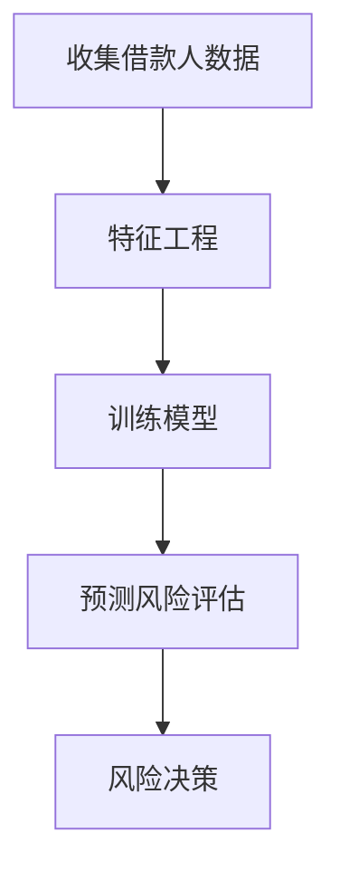

**Python源代码**：

```python
import pandas as pd
from sklearn.model_selection import train_test_split
from sklearn.ensemble import RandomForestClassifier
from sklearn.metrics import accuracy_score

# 加载数据
data = pd.read_csv('credit_risk_data.csv')
X = data.drop('default', axis=1)
y = data['default']

# 划分训练集和测试集
X_train, X_test, y_train, y_test = train_test_split(X, y, test_size=0.2, random_state=42)

# 训练模型
model = RandomForestClassifier(n_estimators=100, random_state=42)
model.fit(X_train, y_train)

# 预测风险评估
predictions = model.predict(X_test)

# 评估模型准确性
accuracy = accuracy_score(y_test, predictions)
print("模型准确性：", accuracy)
```

#### 量化交易策略

量化交易策略是指通过建立数学模型和算法，自动化执行交易决策。金融AI在量化交易策略中的应用，可以极大地提高交易效率和收益。

**算法原理**：

1. **数据分析和特征提取**：通过分析历史交易数据，提取出影响交易决策的关键特征，如价格、成交量、市场情绪等。
2. **策略构建**：利用机器学习和统计分析方法，构建交易策略模型，如基于技术指标的趋势跟随策略、均值回归策略等。
3. **模型优化**：通过回测和实盘交易，不断优化策略模型，提高交易收益。

**mermaid流程图**：

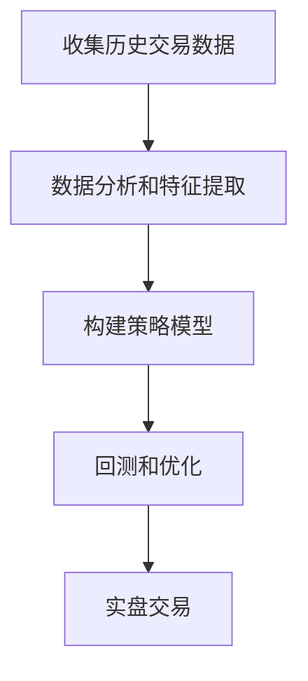

**Python源代码**：

```python
import pandas as pd
from sklearn.ensemble import RandomForestRegressor
from sklearn.model_selection import train_test_split

# 加载数据
data = pd.read_csv('trading_data.csv')
X = data[['open', 'high', 'low', 'close', 'volume']]
y = data['target']

# 划分训练集和测试集
X_train, X_test, y_train, y_test = train_test_split(X, y, test_size=0.2, random_state=42)

# 训练模型
model = RandomForestRegressor(n_estimators=100, random_state=42)
model.fit(X_train, y_train)

# 回测和优化
predictions = model.predict(X_test)
# 这里可以添加回测代码，评估模型性能，并进行策略优化

# 实盘交易
# 这里可以添加实盘交易代码，根据模型预测进行自动化交易
```

#### 最佳实践 tips

1. **数据质量**：在构建金融AI模型时，数据质量至关重要。确保数据准确、完整、无噪声，可以显著提高模型的性能。
2. **模型解释性**：金融领域对模型的解释性要求较高。在构建模型时，应充分考虑模型的可解释性，以便于模型审核和风险管理。
3. **风险管理**：在金融AI应用中，应建立健全的风险管理体系，确保模型决策的稳健性和风险可控性。
4. **持续优化**：金融市场的变化无常，模型性能也会随时间推移而下降。定期进行模型优化和回测，保持模型的最佳状态。

通过上述对金融AI在信贷风险评估和量化交易策略中的应用分析，我们可以看到金融AI在提升金融服务质量和效率方面具有巨大的潜力。在未来的发展中，金融AI将继续推动金融行业的创新和变革。

### AI编程项目实战

#### 环境安装

要在本地计算机上运行AI编程项目，首先需要安装以下工具和库：

1. **Python**：Python是一种广泛使用的编程语言，许多AI库和框架都是基于Python开发的。请确保安装Python 3.7或更高版本。
2. **Jupyter Notebook**：Jupyter Notebook是一个交互式的计算环境，非常适合进行AI编程实验和数据分析。可以通过pip命令安装：
   ```bash
   pip install notebook
   ```
3. **TensorFlow**：TensorFlow是一个开源的机器学习框架，用于构建和训练深度学习模型。可以通过pip命令安装：
   ```bash
   pip install tensorflow
   ```
4. **PyTorch**：PyTorch是一个流行的深度学习框架，与TensorFlow相似，用于构建和训练深度学习模型。可以通过pip命令安装：
   ```bash
   pip install torch torchvision
   ```

#### 系统核心实现源代码

以下是一个简单的基于TensorFlow的图像分类项目的源代码，该项目使用卷积神经网络（CNN）对图片进行分类：

```python
import tensorflow as tf
from tensorflow.keras import datasets, layers, models
import matplotlib.pyplot as plt

# 加载并预处理数据
(train_images, train_labels), (test_images, test_labels) = datasets.cifar10.load_data()
train_images, test_images = train_images / 255.0, test_images / 255.0

# 构建CNN模型
model = models.Sequential()
model.add(layers.Conv2D(32, (3, 3), activation='relu', input_shape=(32, 32, 3)))
model.add(layers.MaxPooling2D((2, 2)))
model.add(layers.Conv2D(64, (3, 3), activation='relu'))
model.add(layers.MaxPooling2D((2, 2)))
model.add(layers.Conv2D(64, (3, 3), activation='relu'))

# 添加全连接层
model.add(layers.Flatten())
model.add(layers.Dense(64, activation='relu'))
model.add(layers.Dense(10, activation='softmax'))

# 编译模型
model.compile(optimizer='adam',
              loss=tf.keras.losses.SparseCategoricalCrossentropy(from_logits=True),
              metrics=['accuracy'])

# 训练模型
model.fit(train_images, train_labels, epochs=10, validation_data=(test_images, test_labels))

# 评估模型
test_loss, test_acc = model.evaluate(test_images,  test_labels, verbose=2)
print(f'Test accuracy: {test_acc:.4f}')
```

#### 代码应用解读与分析

1. **数据加载与预处理**：首先，我们从CIFAR-10数据集中加载图像数据，并进行归一化处理，使其在0到1的范围内。
2. **模型构建**：使用TensorFlow的Sequential模型构建一个简单的CNN模型。模型包括两个卷积层和两个池化层，用于提取图像特征，然后通过一个全连接层进行分类。
3. **模型编译**：使用Adam优化器和SparseCategoricalCrossentropy损失函数编译模型，并设置准确率作为评估指标。
4. **模型训练**：使用训练数据集训练模型，设置训练轮数为10轮，并使用测试数据集进行验证。
5. **模型评估**：在测试数据集上评估模型性能，输出测试准确率。

#### 实际案例分析和详细讲解剖析

以下是一个实际案例：使用该模型对测试数据集中的图片进行分类。

```python
# 选取测试集中的第一张图片
img, label = test_images[0], test_labels[0]

# 使用模型对图片进行预测
predictions = model.predict(img)

# 输出预测结果
print(f'Predicted label: {predictions[0].argmax()}')
print(f'Actual label: {label}')

# 可视化显示图片和预测结果
plt.imshow(img)
plt.title(f'Predicted label: {predictions[0].argmax()}, Actual label: {label}')
plt.show()
```

在这个案例中，我们首先选取测试集中的第一张图片，并使用训练好的模型对其进行预测。然后，我们比较预测结果和实际标签，并使用matplotlib库将图片和预测结果可视化展示。

#### 项目小结

通过本次实战项目，我们了解了如何使用TensorFlow构建和训练一个简单的CNN模型，实现了对图像数据的分类。这不仅帮助我们巩固了深度学习的理论知识，也提升了我们的实际编程能力。在未来的项目中，我们可以进一步优化模型结构，提高分类准确率，并将其应用于更复杂的图像处理任务。

### AI编程的未来发展趋势

#### AI编程技术的发展方向

随着人工智能技术的不断进步，AI编程的未来发展趋势呈现出以下几个方向：

1. **多模态学习**：多模态学习通过整合不同类型的数据（如文本、图像、声音），实现更丰富的特征表示和更强大的模型性能。未来的AI编程将更加注重多模态数据的处理和融合。

2. **自动机器学习（AutoML）**：自动机器学习通过自动化优化和调参，降低了机器学习模型的构建门槛，使非专业人士也能快速构建高性能模型。AutoML将进一步提升AI编程的普及度和实用性。

3. **联邦学习（Federated Learning）**：联邦学习通过在多个设备上分布式训练模型，避免了数据集中存储和传输，提高了数据隐私性。随着隐私保护需求的增加，联邦学习将在AI编程中扮演越来越重要的角色。

4. **边缘计算**：边缘计算将计算任务从云端转移到靠近数据源的边缘设备，降低了延迟和带宽需求，适用于实时性要求高的场景。边缘计算与AI编程的结合将推动更多实时应用的落地。

5. **AI伦理和法规**：随着AI技术的广泛应用，AI伦理和法规问题越来越受到关注。未来的AI编程将更加注重伦理和合规性，确保AI系统的公平性、透明性和安全性。

#### AI编程对未来的影响

AI编程对未来的影响将涵盖多个领域：

1. **产业变革**：AI编程将推动传统产业智能化升级，提高生产效率、降低成本，并创造出新的商业模式和就业机会。

2. **社会发展**：AI编程将在医疗、教育、交通等公共服务领域发挥重要作用，提升社会福祉和公共管理水平。

3. **个人生活**：AI编程将改变人们的日常生活，带来更智能的家居、更便捷的交通、更个性化的服务和更安全的生活环境。

4. **教育与培训**：AI编程将成为未来教育的重要组成部分，培养新一代具备AI技能的人才，为人工智能的发展提供源源不断的人力资源。

#### 开发者面临的挑战与机遇

对于开发者来说，AI编程既带来了巨大的机遇，也带来了新的挑战：

1. **技术复杂性**：AI编程涉及大量的数学和算法知识，开发者需要不断学习和更新自己的技能。

2. **数据处理**：随着数据规模的不断扩大，如何高效处理和分析海量数据成为开发者面临的挑战。

3. **模型优化**：开发者需要不断优化模型结构、算法和参数，以提升模型性能和效率。

4. **安全与隐私**：确保AI系统的安全性和用户隐私成为开发者的重大责任。

5. **职业发展**：AI编程领域的快速发展为开发者提供了广阔的职业发展空间，但同时也要求开发者具备持续学习和适应变化的能力。

总之，AI编程的未来充满机遇和挑战。开发者需要不断提升自己的技能和知识，紧跟技术发展趋势，才能在这个领域取得成功。通过不断努力，我们有望见证AI编程为人类社会带来的更多变革和进步。

