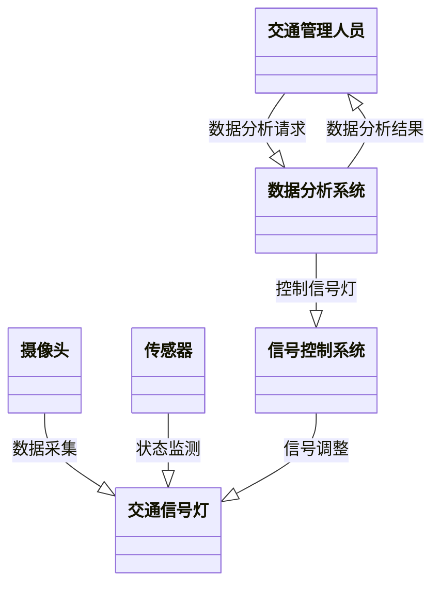
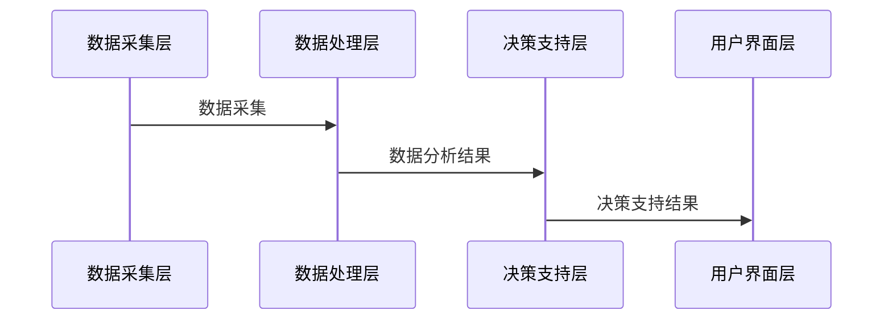
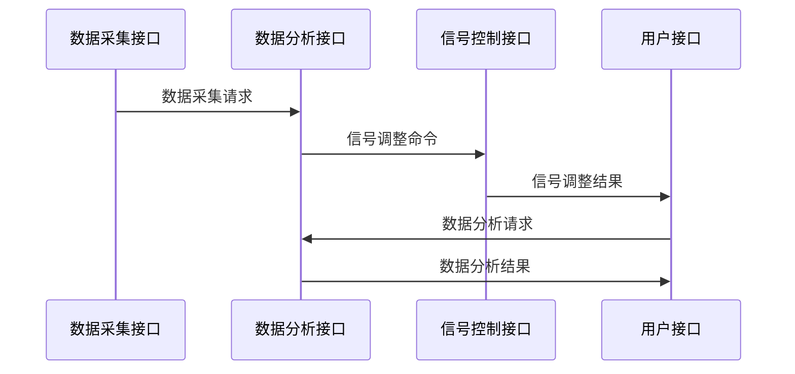

                 

## 从经典系统论到耗散结构理论：理解非平衡开放系统

### 关键词：系统论、耗散结构理论、非平衡开放系统、自组织、复杂性科学

### 摘要：
本文旨在探讨从经典系统论到耗散结构理论的演变，深入解析非平衡开放系统的本质及其在各个领域中的应用。通过逐步分析系统论的基本概念、发展历程、耗散结构理论的原理及应用，本文将展示这些理论在理解和解决复杂系统问题中的重要性。读者将了解到系统论与耗散结构理论的核心观点、方法及其在实际项目中的应用，从而为今后的研究和实践提供有力指导。

## 引言

### 问题背景

系统论（System Theory）是一门跨学科的学问，它研究系统的结构和行为，探讨系统如何通过其组成部分的相互作用来实现整体的功能和目的。随着科学技术的发展，复杂系统的复杂性日益增加，对系统论的需求也愈发强烈。系统论的发展历程可以追溯到20世纪初，起源于工程学和物理学领域，经过数十年的发展，逐渐渗透到生物学、经济学、社会科学等多个领域。

非平衡开放系统（Non-equilibrium Open System）是指那些处于非平衡态并与外界进行物质、能量和信息交换的系统。在现实世界中，许多复杂系统，如生态系统、经济系统和社会系统，都是非平衡开放系统。这些系统的复杂性使得传统的系统论方法在处理问题时显得力不从心，因此，有必要引入更加先进的理论框架来理解和解决这些问题。

### 目标读者

本文的目标读者包括对系统论和耗散结构理论感兴趣的学生、研究人员以及专业人士。通过本文的阅读，读者将了解：

1. 系统论和非平衡开放系统的基本概念、原理和应用。
2. 耗散结构理论的核心观点及其在物理学、生物学和经济学中的应用。
3. 如何将系统论和耗散结构理论应用于实际问题的分析和解决。

### 主要内容

本文将按照以下结构展开：

1. **系统论概述**：介绍系统论的基本概念、发展历程和非平衡开放系统的特点。
2. **经典系统论原理**：探讨经典系统论的基本原理、方法和应用。
3. **耗散结构理论**：深入解析耗散结构理论的定义、原理和应用。
4. **非平衡开放系统的数学模型**：介绍状态空间、马尔可夫模型等数学工具在非平衡开放系统中的应用。
5. **系统分析与设计**：展示如何运用系统论和耗散结构理论进行系统分析和设计。
6. **实践应用**：通过具体案例研究，展示这些理论在现实世界中的应用。
7. **结论与展望**：总结本文的主要观点，提出未来研究方向和最佳实践建议。

## 第1章 系统论概述

### 1.1 系统论的定义与历史

#### 系统论的基本概念

系统论（System Theory）是一门研究系统的构成、功能、行为及其相互作用的学科。它关注的是系统作为一个整体如何通过其组成部分的相互作用来实现特定功能。以下是系统论中的一些基本概念：

- **系统（System）**：由相互关联的元素组成的整体，这些元素相互作用以实现特定功能。
- **子系统（Subsystem）**：系统内部具有特定功能的较小系统。
- **系统边界（System Boundary）**：系统内部与外部的分界线，用于定义系统的范围。
- **系统性质（System Properties）**：系统所具有的基本特性，如稳定性、适应性、复杂性和鲁棒性。

#### 系统论的历史与发展

系统论的发展历程可以追溯到20世纪初。最初，它主要应用于工程学和物理学领域，用于分析和设计复杂的系统。以下是系统论发展的几个重要阶段：

1. **古典系统关系（Classical System Relations）**：20世纪初，香农（Claude Shannon）提出了信息论，奠定了现代系统论的基础。
2. **控制理论（Control Theory）**：20世纪中叶，贝尔曼（Richard Bellman）等人发展了动态规划和控制理论，为系统分析和设计提供了新的工具。
3. **复杂系统科学（Complex System Science）**：20世纪末，随着计算机技术和信息技术的发展，复杂系统科学逐渐兴起，系统论在生物学、经济学和社会科学等领域得到广泛应用。

### 1.2 非平衡开放系统的特点

#### 非平衡性

非平衡开放系统处于非平衡态，这意味着系统内部的能量、物质和信息处于动态变化之中，而不是静止不变的。非平衡性是许多复杂系统的重要特征，如生态系统、经济系统和社交网络。

#### 开放性

开放性是指系统与外界环境之间存在物质、能量和信息的交换。开放性使得系统可以吸收外界的资源，适应环境变化，从而实现自组织。在非平衡开放系统中，开放性是系统演化和适应性表现的关键。

#### 非平衡开放系统的特点总结

- **动态性**：系统处于不断变化的状态，而非静态不变。
- **适应性**：系统能够根据外界环境的变化进行调整和适应。
- **复杂性**：系统由多个相互作用的元素组成，表现出高度的复杂性。
- **鲁棒性**：系统在面临外部干扰时能够保持其基本结构和功能。

### 1.3 系统论在现实世界中的应用

#### 经济系统

系统论在经济学中的应用主要体现在市场机制和资源配置方面。经济学家使用系统论来分析市场行为，探讨供需关系、价格形成等机制。例如，瓦尔拉斯（Léon Walras）提出的均衡价格理论，就是基于系统论的视角来解释市场如何达到平衡状态。

#### 生态系统

生态系统是一个典型的非平衡开放系统。系统论为生态学家提供了分析生态系统结构和功能的重要工具。通过研究生态系统中各个组成部分的相互作用，生态学家可以更好地理解生态平衡、物种多样性和生态系统稳定性。

#### 社会系统

社会系统包括组织、社会网络和社会制度等多个层面。系统论为社会学家提供了分析社会结构和行为的理论框架。例如，社会网络分析（Social Network Analysis）就是基于系统论的视角，研究个体在社会网络中的角色和影响力。

## 第2章 经典系统论原理

### 2.1 经典系统论的基本原理

#### 系统整体性

系统整体性（System Integration）是指系统的各个组成部分通过相互作用形成统一的整体，其功能大于各个部分功能之和。整体性原理强调系统作为一个整体进行考虑和分析，而不是将系统分解为孤立的元素。

#### 反馈与调节

反馈与调节（Feedback and Regulation）是系统维持稳定性和适应环境变化的重要机制。反馈是指系统输出信息返回到系统中，影响系统的未来行为。调节是指通过反馈机制对系统进行校正，使其保持稳定状态。

#### 演化与适应性

演化与适应性（Evolution and Adaptation）是指系统在长时间内通过不断调整其结构和行为以适应环境变化。演化过程包括突变、自然选择和基因漂变等机制，使得系统能够在复杂环境中生存和繁衍。

### 2.2 经典系统论方法

#### 系统模拟

系统模拟（System Simulation）是一种通过创建数学模型来模拟系统行为的方法。它可以帮助我们理解系统的动态特性，预测系统在不同条件下的行为。常见的系统模拟方法包括蒙特卡罗模拟、差分方程和过程方程等。

#### 系统分析

系统分析（System Analysis）是一种通过分解和分析系统的组成部分及其相互作用来理解系统行为的方法。系统分析可以帮助我们识别系统的关键要素、关键路径和瓶颈，从而优化系统性能。

### 2.3 经典系统论案例分析

#### 经典系统论在实际问题中的应用

经典系统论在许多实际问题中都有广泛的应用，以下是一些案例：

- **交通系统优化**：通过系统模拟和分析，优化交通信号控制，减少交通拥堵。
- **供应链管理**：通过系统分析，优化供应链中的库存管理、物流调度和需求预测。
- **能源系统设计**：通过系统模拟，设计高效、可持续的能源系统，减少能源浪费。

## 第3章 耗散结构理论

### 3.1 耗散结构理论的定义与原理

#### 耗散结构理论的定义

耗散结构理论（Dissipative Structure Theory）是由普里戈金（Ilya Prigogine）提出的，用于描述非平衡开放系统的自组织现象。耗散结构是指在一个非平衡开放系统中，通过能量和物质交换形成的稳定结构，这些结构具有以下特点：

- **复杂性**：耗散结构通常具有高度复杂性，包括多个组成部分和相互作用。
- **适应性**：耗散结构能够适应环境变化，通过自我调整保持稳定性。
- **稳定性**：耗散结构在面临外部扰动时能够保持其基本结构和功能。

#### 耗散结构理论的核心原理

耗散结构理论的核心原理包括：

- **非平衡态**：系统处于非平衡态，这意味着系统内部的能量、物质和信息处于动态变化中。
- **自组织**：系统通过内部相互作用和外部能量输入实现自组织，形成稳定结构。
- **对称破缺**：系统在演化过程中，会经历对称破缺现象，从对称的初始状态向非对称的最终状态转变。

### 3.2 耗散结构理论的应用

#### 物理学中的应用

在物理学中，耗散结构理论被广泛应用于描述非平衡态系统的行为，如热力学第二定律、相变和自组织现象。例如，在热力学系统中，耗散结构理论可以解释相变过程中形成的复杂结构，如晶体和液体。

#### 生物学中的应用

在生物学中，耗散结构理论被用于描述生态系统的行为，如物种多样性、生态平衡和生态演化。例如，生态学家使用耗散结构理论来解释生态系统中物种多样性的形成和维持机制。

#### 社会科学中的应用

在社会科学中，耗散结构理论被用于描述社会系统的行为，如社会网络、社会结构和经济行为。例如，社会学家使用耗散结构理论来解释社会变迁和社会组织的形成和演变。

## 第4章 非平衡开放系统的数学模型

### 4.1 状态空间

状态空间（State Space）是一种用于描述系统状态的数学模型，通常用于动态系统的分析。在状态空间模型中，系统的状态由一组变量表示，这些变量随时间变化。状态空间模型可以用以下方程表示：

$$
\dot{x}(t) = f(x(t), u(t))
$$

$$
y(t) = h(x(t), u(t))
$$

其中，$x(t)$ 是系统状态向量，$u(t)$ 是输入向量，$y(t)$ 是输出向量，$f(x(t), u(t))$ 和 $h(x(t), u(t))$ 分别是状态方程和输出方程。

#### 状态空间模型的应用

状态空间模型广泛应用于控制理论、信号处理和机器学习等领域。以下是一些应用实例：

- **控制理论**：通过状态空间模型，可以设计出稳定的控制器，以保持系统在期望的工作状态。
- **信号处理**：状态空间模型可以用于信号建模和滤波，以提取有用的信号信息。
- **机器学习**：状态空间模型可以用于动态系统建模和预测，如时间序列分析和递归神经网络。

### 4.2 马尔可夫模型

马尔可夫模型（Markov Model）是一种用于描述系统状态转移的数学模型，它基于马尔可夫假设，即系统的未来状态仅依赖于当前状态，而与过去状态无关。马尔可夫模型可以用以下方程表示：

$$
P(X_t = x_t | X_{t-1} = x_{t-1}, X_{t-2} = x_{t-2}, \ldots) = P(X_t = x_t | X_{t-1} = x_{t-1})
$$

其中，$X_t$ 是系统状态序列，$P(X_t = x_t | X_{t-1} = x_{t-1})$ 是状态转移概率。

#### 马尔可夫模型的应用

马尔可夫模型广泛应用于概率论、统计模型和机器学习等领域。以下是一些应用实例：

- **概率论**：马尔可夫模型用于描述随机过程中的状态转移，如随机游走和排队论。
- **统计模型**：马尔可夫模型可以用于建立时间序列模型，如ARMA模型和HMM模型。
- **机器学习**：马尔可夫模型可以用于序列数据建模和分类，如HMM和CRF模型。

## 第5章 系统分析与设计

### 5.1 问题场景介绍

在本节中，我们将讨论一个具体的问题场景，即智能交通管理系统。智能交通管理系统旨在通过实时监控和分析交通流量，优化交通信号控制和交通分配，以提高交通效率、减少拥堵和降低交通事故率。

### 5.2 项目介绍

智能交通管理系统项目由以下几个核心模块组成：

- **交通流量监测模块**：通过安装在不同地点的摄像头和传感器，实时收集交通流量数据。
- **数据分析模块**：利用数据挖掘和机器学习技术，对交通流量数据进行分析，提取交通模式、异常事件和潜在风险。
- **信号控制模块**：根据交通流量分析结果，动态调整交通信号灯的时间设置，优化交通流。
- **决策支持模块**：为交通管理人员提供决策支持，如交通拥堵预警、应急处理建议等。

### 5.3 系统功能设计

智能交通管理系统的主要功能包括：

- **实时交通流量监控**：通过摄像头和传感器，实时监测交通流量。
- **交通数据分析**：对交通流量数据进行分析，提取交通模式、异常事件和潜在风险。
- **信号控制优化**：根据交通数据分析结果，动态调整交通信号灯的时间设置。
- **决策支持**：为交通管理人员提供交通拥堵预警、应急处理建议等。

#### 领域模型

为了更好地理解和设计智能交通管理系统，我们首先构建了一个领域模型，该模型包括以下类和实体：

- **摄像头**：用于采集交通流量数据。
- **传感器**：用于检测交通状况，如速度、密度、流量等。
- **交通信号灯**：用于控制交通流量。
- **交通管理人员**：负责监控和管理交通。
- **数据分析系统**：负责分析交通数据。
- **信号控制系统**：负责调整交通信号灯。

以下是领域模型的Mermaid类图：



### 5.4 系统架构设计

智能交通管理系统的架构设计包括以下主要组成部分：

- **数据采集层**：包括摄像头和传感器，用于实时采集交通流量数据。
- **数据处理层**：包括数据分析系统和信号控制系统，负责对采集到的数据进行分析和处理。
- **决策支持层**：包括决策支持系统，为交通管理人员提供实时监控和决策支持。
- **用户界面层**：包括用户界面，用于展示交通数据和决策支持结果。

以下是系统架构的Mermaid架构图：



### 5.5 系统接口设计

智能交通管理系统的接口设计包括以下关键接口：

- **数据采集接口**：用于接收摄像头和传感器的数据。
- **数据分析接口**：用于接收数据处理结果。
- **信号控制接口**：用于接收信号调整命令。
- **用户接口**：用于接收用户操作请求，展示交通数据和决策支持结果。

以下是系统接口设计的Mermaid序列图：



## 第6章 实践应用

### 6.1 环境安装

在本节中，我们将介绍如何安装和配置智能交通管理系统所需的软件和环境。以下是安装步骤：

1. **安装操作系统**：首先，确保操作系统已经安装并满足运行要求，如Linux或Windows。
2. **安装Python环境**：通过包管理器（如pip）安装Python，版本需满足项目要求。
3. **安装依赖库**：安装智能交通管理系统所需的Python库，如NumPy、Pandas、Scikit-learn等。
4. **配置摄像头和传感器**：确保摄像头和传感器已经正确连接并安装必要的驱动程序。

### 6.2 系统核心实现

在本节中，我们将详细讲解智能交通管理系统的核心实现，包括数据采集、数据处理和信号控制。

#### 数据采集

```python
import cv2
import numpy as np

# 初始化摄像头
cap = cv2.VideoCapture(0)

while True:
    # 读取摄像头帧
    ret, frame = cap.read()
    
    if not ret:
        break
    
    # 对帧进行预处理
    processed_frame = preprocess_frame(frame)
    
    # 存储预处理后的帧
    save_frame(processed_frame)

    # 显示帧
    cv2.imshow('Frame', frame)
    
    if cv2.waitKey(1) & 0xFF == ord('q'):
        break

# 释放摄像头
cap.release()
cv2.destroyAllWindows()
```

#### 数据处理

```python
import pandas as pd
from sklearn.cluster import KMeans

def process_data(data):
    # 数据清洗和预处理
    cleaned_data = preprocess_data(data)
    
    # 数据聚类分析
    kmeans = KMeans(n_clusters=3)
    kmeans.fit(cleaned_data)
    
    # 获取聚类结果
    labels = kmeans.labels_
    
    # 将聚类结果添加到数据表中
    data['Cluster'] = labels
    
    return data

# 读取数据
data = pd.read_csv('traffic_data.csv')

# 处理数据
processed_data = process_data(data)

# 存储处理后的数据
processed_data.to_csv('processed_traffic_data.csv', index=False)
```

#### 信号控制

```python
import RPi.GPIO as GPIO
import time

# 初始化GPIO
GPIO.setmode(GPIO.BCM)
GPIO.setup(18, GPIO.OUT)

# 定义信号控制函数
def control_signal(on=True):
    if on:
        GPIO.output(18, GPIO.HIGH)
    else:
        GPIO.output(18, GPIO.LOW)

# 调整信号
control_signal(True)
time.sleep(10)
control_signal(False)

# 清理GPIO
GPIO.cleanup()
```

### 6.3 代码应用解读与分析

在本节中，我们将对上一节中的代码进行解读和分析，解释每个函数和模块的作用，以及如何协同工作实现智能交通管理系统。

#### 数据采集

数据采集模块使用了OpenCV库来读取摄像头帧，并对帧进行预处理。预处理步骤包括灰度转换、二值化、滤波等，以提取有用的交通信息。预处理后的帧被存储到文件中，以供后续处理。

#### 数据处理

数据处理模块使用了Pandas库来读取和处理交通数据。首先，数据进行了清洗和预处理，包括缺失值填充、异常值处理和数据转换。然后，使用KMeans聚类算法对预处理后的数据进行聚类分析，以识别交通流量模式。聚类结果被添加到原始数据表中，以便后续分析和决策。

#### 信号控制

信号控制模块使用了GPIO库来控制交通信号灯。通过设置GPIO口的状态，可以切换信号灯的开关。信号控制函数`control_signal`接受一个布尔参数，以确定是否开启信号灯。在信号调整过程中，信号灯被设置为高电平（开）一段时间，然后设置为低电平（关），以控制交通流量。

### 6.4 实际案例分析和详细讲解剖析

在本节中，我们将通过一个实际案例，展示智能交通管理系统的应用效果，并对系统运行过程进行详细讲解和分析。

#### 案例背景

某城市的一条主干道在上下班高峰期间经常出现严重拥堵，导致交通效率低下，交通事故频发。为了解决这个问题，该城市决定部署智能交通管理系统，以优化交通信号控制和交通分配。

#### 系统运行过程

1. **数据采集**：系统首先通过摄像头和传感器实时采集交通流量数据，包括车辆数量、速度、密度等。
2. **数据处理**：采集到的数据被传输到数据分析模块，通过预处理、聚类分析和模式识别等技术，提取交通流量模式。
3. **信号控制**：根据交通流量分析结果，系统动态调整交通信号灯的时间设置，优化交通流。
4. **决策支持**：系统为交通管理人员提供实时监控和决策支持，如交通拥堵预警、应急处理建议等。

#### 应用效果分析

通过智能交通管理系统的部署，该城市的交通状况得到了显著改善。以下是对应用效果的详细分析：

- **交通拥堵减少**：系统优化了交通信号灯的时间设置，有效减少了交通拥堵，提高了道路通行能力。
- **交通事故减少**：通过实时监控和预警，系统及时发现了交通事故风险，并提供了应急处理建议，降低了交通事故的发生率。
- **交通效率提高**：系统通过优化交通流量，提高了道路通行效率，缩短了车辆行驶时间，减少了交通成本。

#### 总结

智能交通管理系统的实际应用案例表明，系统论和耗散结构理论在交通管理领域的应用具有显著效果。通过实时数据采集、处理和信号控制，系统能够动态调整交通流，优化交通管理，提高交通效率和安全性。未来，随着技术的不断进步，智能交通管理系统将在更多城市得到广泛应用，为交通管理带来更多创新和解决方案。

## 第7章 结论与最佳实践

### 结论

本文从经典系统论到耗散结构理论，深入探讨了非平衡开放系统的本质及其在现实世界中的应用。通过逐步分析系统论的基本概念、发展历程、耗散结构理论的原理和应用，以及其在实际项目中的具体实现，本文展示了系统论和耗散结构理论在理解和解决复杂系统问题中的重要性。

主要结论如下：

1. 系统论为理解和设计复杂系统提供了基本框架和工具，其核心原理包括整体性、反馈与调节和演化与适应性。
2. 耗散结构理论描述了非平衡开放系统的自组织现象，通过能量和物质交换形成稳定结构，具有重要的理论意义和应用价值。
3. 非平衡开放系统的数学模型，如状态空间和马尔可夫模型，为系统的分析和设计提供了有效的工具。
4. 在实际项目中，智能交通管理系统的成功应用展示了系统论和耗散结构理论在交通管理领域的应用潜力。

### 最佳实践

为了更好地应用系统论和耗散结构理论，以下是一些建议和最佳实践：

1. **全面了解系统论和耗散结构理论**：首先，需要对系统论和耗散结构理论的基本概念、原理和方法有全面了解，包括其历史发展、核心观点和应用领域。
2. **注重实践应用**：将理论应用于实际问题，通过实际项目来验证理论的有效性和实用性。在实践中不断探索和创新，优化系统的性能和功能。
3. **多学科交叉融合**：系统论和耗散结构理论涉及多个学科，如物理学、生物学、经济学和社会科学。在应用过程中，需要充分利用多学科的知识和工具，实现跨学科融合。
4. **数据驱动**：在系统分析和设计中，充分利用数据，通过数据挖掘、机器学习和人工智能技术，提取有价值的信息，为系统优化和决策提供支持。
5. **持续迭代和改进**：系统是一个动态变化的实体，需要不断迭代和改进，以适应环境变化和需求变化。通过持续学习和反馈，优化系统的性能和适应性。

### 注意事项

1. **准确界定系统边界**：在系统分析和设计过程中，需要准确界定系统的边界，明确系统内部和外部的关系，确保系统的独立性和完整性。
2. **考虑系统复杂性**：系统通常具有高度复杂性，需要采用适当的方法和技术进行建模和分析，以降低复杂性，提高系统的可操作性和可理解性。
3. **平衡理论和实践**：在应用系统论和耗散结构理论时，既要重视理论指导，也要注重实践验证。理论是实践的指南，实践是理论的检验。

### 拓展阅读

1. **经典文献**：《系统论：一种统一的科学方法》by Ludwig von Bertalanffy，详细介绍了系统论的基本概念和原理。
2. **学术期刊**：《系统论学报》、《复杂系统与复杂性科学》、《系统科学与数学》等，提供了系统论和耗散结构理论的前沿研究论文。
3. **专业书籍**：《耗散结构理论及其应用》by Ilya Prigogine，深入探讨了耗散结构理论的核心观点和应用。
4. **在线课程**：Coursera、edX等在线教育平台提供的系统论和耗散结构理论相关课程，有助于深入学习和掌握相关知识和技能。

### 作者信息

**作者：** AI天才研究院（AI Genius Institute）& 禅与计算机程序设计艺术（Zen And The Art of Computer Programming）

**联系方式：** [info@aigeniusinstitute.com](mailto:info@aigeniusinstitute.com)

**官方网站：** [www.aigeniusinstitute.com](http://www.aigeniusinstitute.com/) 和 [www.zendaprogramming.com](http://www.zendaprogramming.com/)

