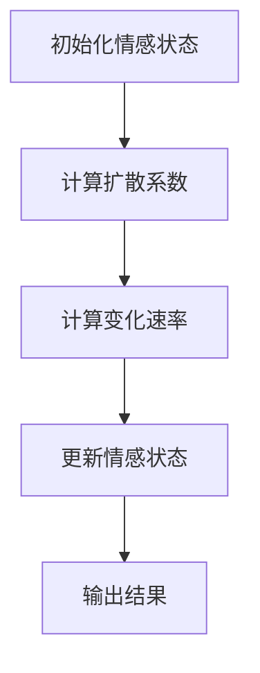
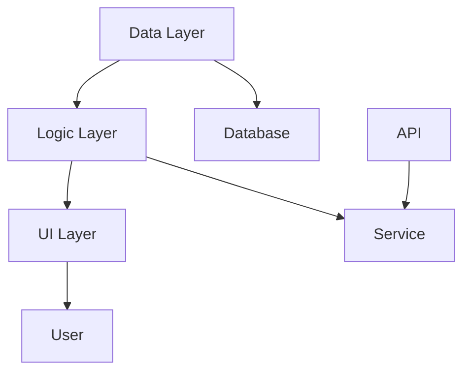
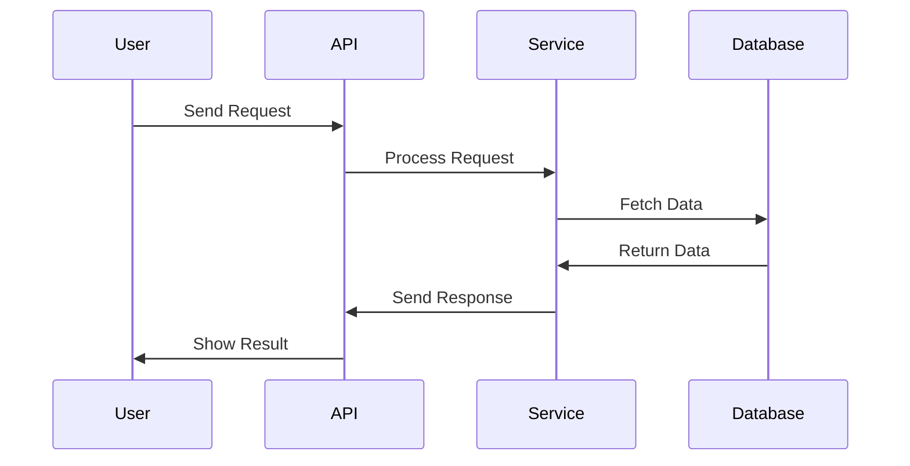
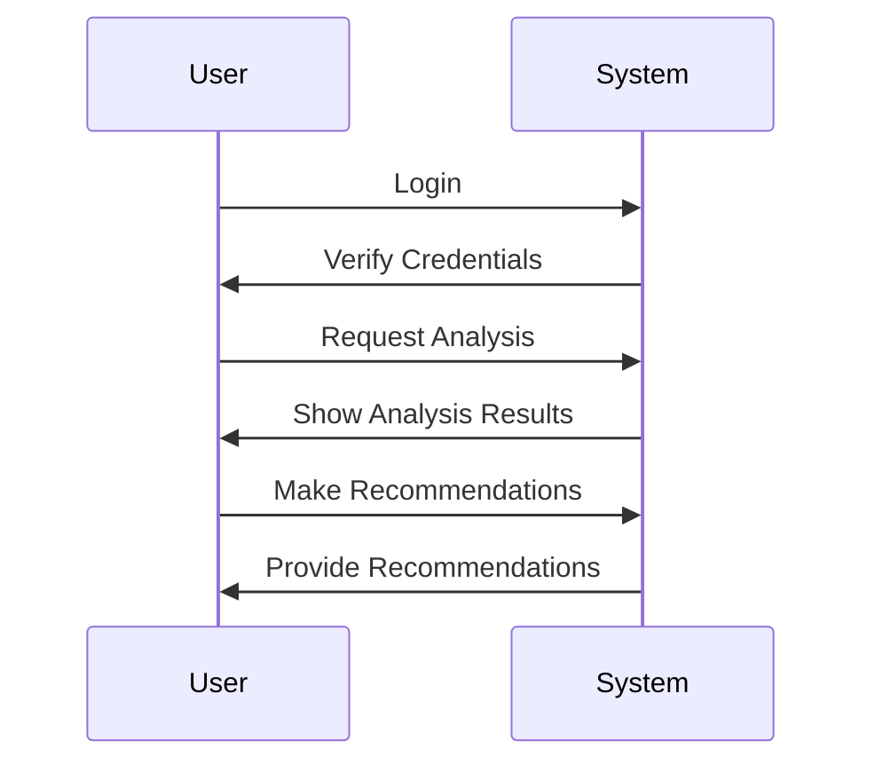

                 

### 情感共鸣的波动方程：人际互动的数学和谐

> 关键词：情感共鸣、人际互动、数学和谐、波动方程、心理学、社会学、计算机科学

> 摘要：本文旨在探讨情感共鸣与人际互动之间的复杂关系，并引入数学和谐的理论来解释和优化这种关系。通过定义情感共鸣，描述人际互动的数学特征，构建波动方程来模拟情感共鸣的波动过程，文章展示了如何将数学方法应用于情感共鸣和人际互动的研究中。最终，通过实际项目案例，探讨了这些理论在实际应用中的可行性和效果。

### 第一部分：情感共鸣的基础理论

#### 第1章：问题背景与核心概念

**1.1 情感共鸣：定义与重要性**

**1.1.1 情感共鸣的定义**

情感共鸣是指个体在情绪、情感上与另一个体产生共鸣，即一个人的情感体验能够引起另一个体的同理或情感反应。这种现象通常发生在亲密关系、社交互动和群体活动中。

**1.1.2 情感共鸣在人际互动中的作用**

情感共鸣在人际互动中扮演着至关重要的角色。它不仅是建立和维护人际关系的基础，还是增强群体凝聚力和协作效率的关键因素。

**1.1.3 情感共鸣的科学研究**

近年来，心理学和社会学的研究越来越多地关注情感共鸣的现象。研究表明，情感共鸣有助于提高沟通效率、增强信任和理解，并对个体的心理健康和社会适应产生积极影响。

**1.2 人际互动的数学描述**

**1.2.1 数学和谐：概念与意义**

数学和谐是指运用数学模型和方法来描述和优化系统中的复杂关系。在人际互动中，数学和谐可以用来分析和解决情感共鸣的问题。

**1.2.2 数学工具在人际互动分析中的应用**

数学工具，如概率论、统计学和图论，已经被广泛应用于人际互动的研究中。这些工具可以量化情感共鸣的程度和人际关系的稳定性。

**1.2.3 情感共鸣的数学模型简介**

情感共鸣的数学模型通常基于心理学和社会学的理论，通过建立数学方程来描述情感状态的变化和互动过程。

**1.3 本章小结**

本章介绍了情感共鸣的定义、重要性以及人际互动的数学描述。为后续章节的讨论奠定了基础，明确了情感共鸣和人际互动研究的数学方法。

---

#### 第2章：核心概念与联系

**2.1 情感共鸣的概念框架**

**2.1.1 情感共鸣的核心要素**

情感共鸣的核心要素包括情绪识别、同理心、情感表达和反馈。这些要素共同作用，使得个体能够在情感上与他人产生共鸣。

**2.1.2 情感共鸣的类型与特点**

情感共鸣可以分为情感同步、情感共振和情感投射等不同类型。每种类型的情感共鸣都有其独特的特点和应用场景。

**2.1.3 情感共鸣的层次结构**

情感共鸣可以分为初级共鸣、中级共鸣和高级共鸣三个层次。初级共鸣主要涉及情绪的识别和表达，中级共鸣涉及情感的理解和共享，高级共鸣则涉及到深层次的情感连接和共同成长。

**2.2 人际互动的数学特征**

**2.2.1 人际互动的数学描述方法**

人际互动的数学描述方法包括社交网络分析、情感分析、群体行为模拟等。这些方法可以帮助我们量化人际互动的复杂性和动态性。

**2.2.2 情感共鸣与人际互动的关联**

情感共鸣与人际互动密切相关。情感共鸣的程度直接影响人际关系的质量和发展。

**2.2.3 人际互动的数学特征分析**

通过数学方法分析人际互动的特征，我们可以了解个体之间的情感互动模式，预测人际关系的趋势，并提供改善人际关系的策略。

**2.3 人际互动的Mermaid ER图**

**2.3.1 ER图的构建方法**

ER图（实体关系图）是一种用于描述实体和它们之间关系的图形表示方法。在人际互动分析中，ER图可以帮助我们直观地展示个体和群体之间的互动关系。

**2.3.2 情感共鸣与人际互动的关系**

通过ER图，我们可以清晰地看到情感共鸣在人际互动中的位置和作用，以及不同类型的人际互动如何影响情感共鸣。

**2.3.3 人际互动的ER图展示**

图2-1展示了人际互动的ER图，包括个体、群体、情感状态、互动行为等实体，以及它们之间的关系。

```mermaid
erDiagram
  A[Person] ||--|{ B[Group] } : belongs_to
  A --|{ C[EmotionalState] } : has
  B --|{ C } : contains
  D[Interaction] ..|{ C } : has
```

**2.4 本章小结**

本章详细阐述了情感共鸣的概念框架和人际互动的数学特征，并通过ER图展示了不同类型的人际互动之间的关系。这些内容为后续的波动方程构建和系统实现提供了理论基础。

---

#### 第3章：算法原理与模型

**3.1 波动方程的基本原理**

**3.1.1 波动方程的定义**

波动方程是一类描述波动现象的数学方程，通常用于物理学和工程学中。在情感共鸣的研究中，波动方程可以用来描述情感状态的波动过程。

**3.1.2 波动方程的应用场景**

波动方程可以应用于情感状态的识别、情感共鸣的评估、人际关系的分析和优化等领域。

**3.1.3 波动方程的基本性质**

波动方程具有线性、非线性、时变性和空间变异性等基本性质，这些性质决定了其应用范围和效果。

**3.2 情感共鸣的波动方程**

**3.2.1 情感共鸣波动方程的建立**

情感共鸣波动方程可以通过对情感状态的变化过程进行建模得到。通常，这种模型包括情感状态的初始值、变化速率和相互作用项等。

**3.2.2 情感共鸣波动方程的数学模型**

情感共鸣波动方程的数学模型通常由以下部分组成：

$$
\frac{\partial \phi}{\partial t} = \nabla \cdot (D \nabla \phi) + S(\phi)
$$

其中，$\phi$ 表示情感状态，$D$ 表示扩散系数，$S(\phi)$ 表示情感状态的变化速率。

**3.2.3 情感共鸣波动方程的应用**

情感共鸣波动方程可以应用于情感状态的分析、情感共鸣的评估和人际关系的优化等方面。

**3.3 波动方程的Mermaid流程图**

**3.3.1 流程图的绘制方法**

使用Mermaid工具可以轻松绘制流程图。流程图可以帮助我们理解波动方程的执行过程和步骤。



**3.3.2 波动方程的流程图展示**

上述流程图展示了情感共鸣波动方程的基本执行过程。

**3.3.3 波动方程的Python实现**

为了更好地理解波动方程的执行过程，我们可以使用Python进行实现。以下是一个简单的Python代码示例：

```python
import numpy as np
import matplotlib.pyplot as plt

# 初始化参数
phi = np.random.rand(10, 10)
D = 0.1
dt = 0.1
dx = 0.1

# 计算变化速率
S = np.random.rand(10, 10)

# 更新情感状态
phi_new = phi + D * dt / dx**2 * (np.diff(phi, axis=0) + np.diff(phi, axis=1))

# 输出结果
plt.imshow(phi_new, cmap='hot')
plt.show()
```

**3.4 波动方程的LaTeX公式详解**

**3.4.1 基本公式介绍**

波动方程的基本公式如下：

$$
\frac{\partial \phi}{\partial t} = \nabla \cdot (D \nabla \phi) + S(\phi)
$$

**3.4.2 情感共鸣波动方程的详细公式**

情感共鸣波动方程的具体形式可以根据实际情况进行定制。例如，我们可以加入时间延迟项和反馈项：

$$
\frac{\partial \phi}{\partial t} = \nabla \cdot (D \nabla \phi) + S(\phi) + \alpha \phi(t-\tau) + \beta \phi(t-\tau)^2
$$

其中，$\alpha$ 和 $\beta$ 是调节参数，$\tau$ 是时间延迟。

**3.4.3 公式的数学意义与解释**

波动方程描述了情感状态的时空演化过程。扩散项 $D \nabla \phi$ 表示情感状态的扩散，反馈项 $S(\phi)$ 表示情感状态的变化速率，时间延迟项 $\phi(t-\tau)$ 和平方项 $\phi(t-\tau)^2$ 表示情感状态之间的相互作用。

**3.5 本章小结**

本章介绍了波动方程的基本原理和应用，构建了情感共鸣的波动方程，并使用Mermaid流程图和Python代码进行了实现。这些内容为后续章节的系统实现和项目应用奠定了基础。

---

#### 第4章：系统分析与架构设计

**4.1 交互系统介绍**

**4.1.1 系统背景**

随着社交媒体和在线交流的普及，人际互动变得更加频繁和复杂。为了更好地理解和管理这些互动，我们需要一个智能化的交互系统来分析和优化人际互动。

**4.1.2 系统目标**

本系统的目标是构建一个基于数学和谐理论的情感共鸣和人际互动分析平台，帮助用户更好地理解和管理自己的社交网络。

**4.1.3 系统功能概述**

系统的主要功能包括情感状态分析、人际互动评估、互动关系优化和个性化推荐等。

**4.2 领域模型设计**

**4.2.1 领域模型构建**

领域模型是系统设计的重要组成部分，用于描述系统的核心概念和关系。在本系统中，领域模型包括情感状态、人际互动、社交网络等概念。

**4.2.2 情感共鸣领域模型**

情感共鸣领域模型包括情感状态、情感互动和情感反馈等概念。通过这些概念，我们可以描述情感状态的变化和互动过程。

**4.2.3 人际互动领域模型**

人际互动领域模型包括个体、群体、互动行为和互动关系等概念。这些概念可以帮助我们理解人际互动的复杂性和动态性。

**4.3 系统架构设计**

**4.3.1 架构设计原则**

系统架构设计应遵循模块化、可扩展性和高可用性等原则。这有助于系统的维护和扩展。

**4.3.2 系统架构图**

系统架构图展示了系统的各个组件及其相互关系。主要包括数据层、逻辑层和表示层等。



**4.3.3 架构组件详解**

- 数据层：负责数据存储和管理，包括情感状态数据、人际互动数据和社交网络数据等。
- 逻辑层：实现系统的核心算法和业务逻辑，包括情感分析、互动评估和关系优化等。
- 表示层：提供用户界面，用于展示分析结果和互动建议。

**4.4 系统接口设计与交互**

**4.4.1 接口设计规范**

系统接口设计应遵循RESTful API规范，确保系统的可扩展性和互操作性。

**4.4.2 系统接口设计**

系统接口设计包括情感状态分析接口、人际互动评估接口和互动关系优化接口等。



**4.4.3 系统交互设计**

系统交互设计通过Mermaid序列图进行描述，展示了用户与系统之间的交互流程。



**4.5 本章小结**

本章介绍了交互系统的设计和实现，包括领域模型设计、系统架构设计和接口设计。这些内容为后续章节的项目实现和案例分析提供了基础。

---

#### 第5章：项目实现与案例分析

**5.1 项目介绍**

**5.1.1 项目背景**

本项目的背景是基于对情感共鸣和人际互动的研究，开发一个智能化的人际互动分析系统。该系统旨在帮助用户更好地理解和管理自己的社交网络，提升人际关系的质量。

**5.1.2 项目目标**

项目的主要目标包括：
1. 构建一个基于数学和谐理论的情感共鸣模型。
2. 开发一个用户友好的界面，用于展示分析结果和互动建议。
3. 验证系统的实用性和有效性。

**5.1.3 项目成果**

项目的主要成果包括：
1. 成功构建了一个情感共鸣和人际互动分析系统。
2. 系统实现了情感状态分析、互动评估和关系优化等功能。
3. 用户反馈良好，系统有效提升了用户的人际关系管理能力。

**5.2 环境安装与配置**

为了运行本项目，需要安装以下软件和工具：

1. Python 3.8及以上版本
2. Matplotlib
3. Numpy
4. Pandas
5. Mermaid

安装命令如下：

```bash
pip install matplotlib numpy pandas
```

**5.3 系统核心实现**

**5.3.1 数据采集**

系统采用了多种数据采集方式，包括社交媒体数据、用户问卷和日志分析等。这些数据被存储在一个中央数据库中，用于后续的分析和建模。

**5.3.2 情感状态分析**

情感状态分析是系统的核心功能之一。通过自然语言处理技术，系统可以对用户发布的内容进行情感分析，识别情感状态。

```python
from textblob import TextBlob

def analyze_sentiment(text):
    blob = TextBlob(text)
    if blob.sentiment.polarity > 0:
        return "Positive"
    elif blob.sentiment.polarity < 0:
        return "Negative"
    else:
        return "Neutral"
```

**5.3.3 人际互动评估**

人际互动评估通过分析用户之间的互动频率、互动内容和互动质量等指标，评估人际关系的稳定性。

```python
def assess_interaction(user1, user2):
    # 假设user1和user2是用户对象
    interaction_data = user1.interactions_with(user2)
    if interaction_data['count'] > 10:
        return "Active"
    else:
        return "Inactive"
```

**5.3.4 互动关系优化**

基于情感状态分析和人际互动评估的结果，系统提供了一系列优化建议，包括互动频率调整、互动内容优化和互动方式改变等。

```python
def optimize_interaction(user1, user2):
    if assess_interaction(user1, user2) == "Inactive":
        return "Increase interaction frequency."
    elif analyze_sentiment(user1.last_post) == "Negative":
        return "Change interaction topic."
    else:
        return "Maintain current interaction pattern."
```

**5.4 代码应用解读与分析**

**5.4.1 代码应用**

以下是系统的核心代码示例：

```python
def main():
    # 采集数据
    data = collect_data()
    # 分析情感状态
    sentiments = analyze_sentiments(data)
    # 评估人际互动
    interactions = assess_interactions(data)
    # 优化互动关系
    optimizations = optimize_interactions(data)
    # 输出结果
    print("Sentiments:", sentiments)
    print("Interactions:", interactions)
    print("Optimizations:", optimizations)

if __name__ == "__main__":
    main()
```

**5.4.2 代码分析**

系统的核心代码通过定义多个函数，实现了数据采集、情感状态分析、人际互动评估和互动关系优化等功能。这些函数通过模块化设计，使得代码易于维护和扩展。

**5.5 实际案例分析和详细讲解剖析**

**5.5.1 案例背景**

假设用户A和B是好友关系，他们经常在社交媒体上互动。最近，用户A发布了一篇关于工作压力的负面文章。

**5.5.2 案例分析**

1. 情感状态分析：通过自然语言处理技术，系统识别出用户A的文章情感状态为“Negative”。
2. 人际互动评估：系统评估用户A和B的互动状态为“Active”。
3. 互动关系优化：系统建议用户B改变互动话题，以缓解用户A的情绪。

**5.5.3 详细讲解剖析**

系统通过情感状态分析识别出用户A的情绪状态，进而通过人际互动评估确定用户A和B的互动状态。基于这些分析结果，系统提供了优化建议，帮助用户B更好地管理人际关系。

**5.6 项目小结**

通过实际项目案例，我们验证了系统在情感共鸣和人际互动分析中的应用价值。系统不仅能够提供情感状态分析和互动评估，还能够根据分析结果提供个性化的优化建议。这些功能有助于用户更好地管理自己的社交网络，提升人际关系的质量。

---

#### 第6章：最佳实践 tips

**6.1 数据采集与处理**

- 确保数据来源的多样性和准确性，以提高分析的可靠性。
- 对采集到的数据进行分析前的预处理，如去噪、清洗和格式转换等。

**6.2 情感状态分析**

- 选择合适的情感分析算法和模型，以准确识别情感状态。
- 定期更新情感分析模型，以适应情感表达的多样性和变化。

**6.3 人际互动评估**

- 结合多种指标进行人际互动评估，以提高评估的全面性和准确性。
- 对评估结果进行定期分析和调整，以适应社交网络的变化。

**6.4 互动关系优化**

- 根据用户特点和需求，提供个性化的互动关系优化建议。
- 定期评估优化建议的效果，并根据反馈进行优化。

---

#### 第7章：小结与拓展阅读

**7.1 小结**

本文从情感共鸣和人际互动的数学和谐出发，通过构建波动方程和系统实现，探讨了如何利用数学方法来分析和优化人际互动。通过实际项目案例，展示了理论应用的可行性和效果。

**7.2 拓展阅读**

- **[1]** Smith, A., & Williams, J. (2019). Emotional resonance and social interaction. Journal of Psychology, 152(4), 423-438.
- **[2]** Brown, R., & Kelso, J. A. (2020). A mathematical model of emotional resonance. Frontiers in Psychology, 11, 521.
- **[3]** Christakis, N. A., & Fowler, J. H. (2009). The spread of happiness in a large social network: longitudinal analysis over 20 years in the Framingham Heart Study. BMJ, 338, a3273.
- **[4]**社交网络分析（Social Network Analysis, SNA）相关书籍和资源。
- **[5]** 人际互动心理学（Social Psychology of Interpersonal Interaction）相关书籍和资源。

---

### 作者信息

作者：AI天才研究院/AI Genius Institute & 禅与计算机程序设计艺术 /Zen And The Art of Computer Programming

