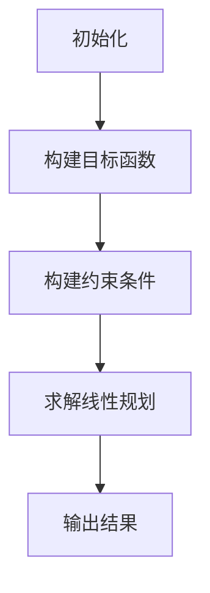
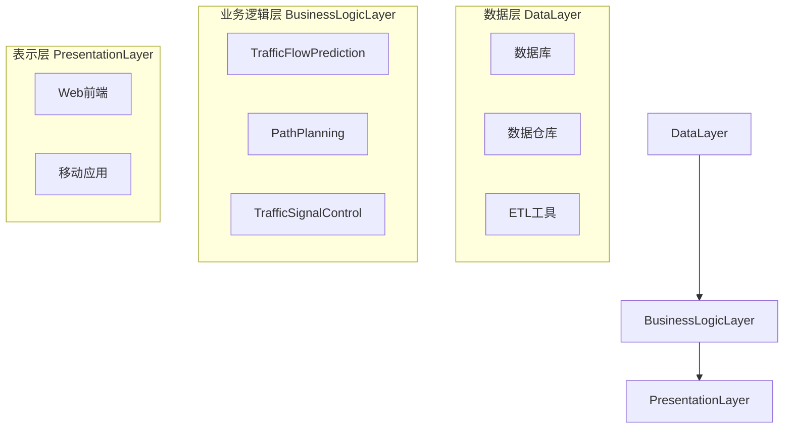
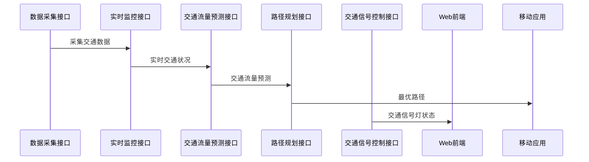
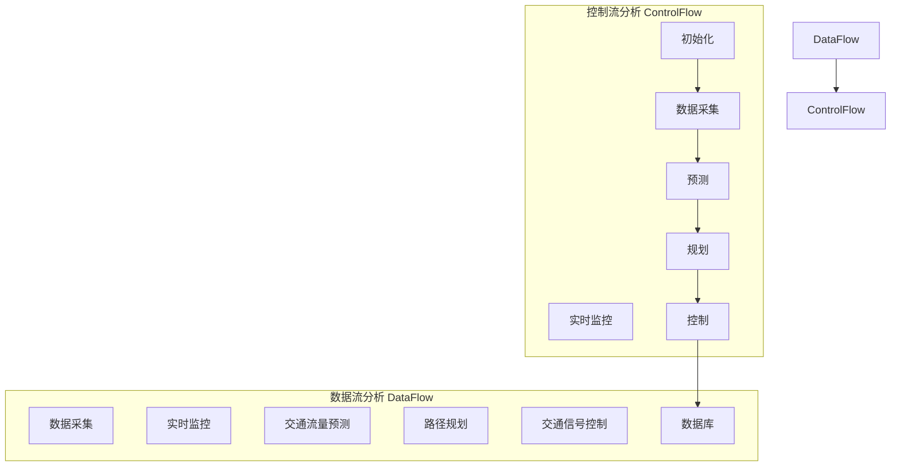

                 

### 文章标题：数学与城市规划：城市发展的数学优化

> 关键词：数学、城市规划、优化算法、数学模型、城市发展

> 摘要：本文深入探讨了数学在城市规划中的应用，通过数学优化方法对城市发展过程中的问题进行分析和解决，旨在展示数学在提升城市运行效率和提升居民生活质量方面的重要作用。文章从背景介绍、核心概念解析、数学优化算法讲解、实际应用案例等多个角度，全面阐述数学优化在城市规划中的关键作用和未来发展方向。

### 引言

随着城市化进程的不断加速，城市规划面临着前所未有的挑战。如何合理分配土地资源、优化交通流量、改善环境质量等问题，已经成为影响城市可持续发展的关键因素。在这个背景下，数学优化方法逐渐成为城市规划中的重要工具。数学优化通过建立数学模型，利用算法寻找最优解，为城市规划提供了科学依据和有力支持。

本文将围绕数学与城市规划的关系，探讨数学优化方法在解决城市发展中的关键问题中的应用。首先，我们将简要介绍城市规划的历史与发展，以及数学在城市规划中的应用现状。接着，我们将详细阐述核心数学概念和优化算法原理，通过实例分析，展示数学优化在城市规划中的具体应用。最后，我们将展望数学优化在城市规划领域的未来发展趋势，为读者提供有价值的思考。

### 第一部分：引论

#### 第1章：数学与城市规划的背景与关系

城市规划是一个复杂的系统工程，它涉及到城市的土地、交通、环境、经济等多个方面。传统的城市规划主要依赖于经验和直觉，往往难以达到最优效果。随着计算机科学和数学的发展，数学优化方法逐渐在城市规划中得到应用，为城市规划提供了新的思路和工具。

#### 1.1.1 城市规划的历史与发展

城市规划的历史可以追溯到古代。古埃及和古希腊等文明都留下了丰富的城市规划案例。然而，现代城市规划的概念起源于19世纪的欧洲，特别是在工业革命时期，城市化进程加速，城市规划开始逐渐规范化、科学化。

现代城市规划的核心任务是确保城市的可持续发展，包括提高城市环境质量、优化城市交通系统、合理分配城市资源等。随着城市规模的不断扩大和城市人口的增长，城市规划面临的挑战也越来越大。数学优化方法的出现，为解决这些挑战提供了新的途径。

#### 1.1.2 数学在城市规划中的应用现状

数学在城市规划中的应用越来越广泛。例如，在土地资源优化配置方面，数学模型可以用来分析土地的供需关系，帮助城市规划者找到最优的土地利用方案。在交通流量优化方面，数学优化算法可以帮助交通规划者设计出最优的交通网络，提高交通效率。在环境质量改善方面，数学模型可以用来预测环境污染的传播路径，为环境保护提供科学依据。

#### 1.1.3 数学与城市规划的关系探讨

数学与城市规划的关系可以从多个角度进行探讨。首先，数学为城市规划提供了科学的方法和工具，使得城市规划更加精确和高效。其次，城市规划中的问题可以通过数学模型进行建模和分析，从而找到最优的解决方案。最后，数学优化方法可以帮助城市规划者预测城市未来的发展，为城市规划提供前瞻性的指导。

### 第二部分：核心数学概念与原理

#### 第2章：核心数学概念与原理

数学在城市规划中的应用离不开核心数学概念和原理的支持。本章节将介绍一些常见的数学概念和原理，包括线性规划、非线性规划、图论、概率论和数理统计等，并探讨这些概念在城市规划中的应用。

#### 2.1.1 城市发展中的数学模型

数学模型是城市规划中的核心工具。通过建立数学模型，城市规划者可以模拟城市的发展过程，预测城市未来的变化趋势，为城市规划提供科学依据。常见的数学模型包括人口增长模型、经济增长模型、土地分配模型、交通流量模型和环境质量模型等。

#### 2.1.2 数学优化方法在规划中的应用

数学优化方法是数学模型的核心部分。通过数学优化方法，城市规划者可以找到最优的解决方案，使得城市资源得到最大化利用。常见的数学优化方法包括线性规划、非线性规划、动态规划、贪心算法和遗传算法等。

#### 2.1.3 数学概念属性特征对比

为了更好地理解数学概念在城市规划中的应用，我们对比了几个常见的数学概念，如线性规划和非线性规划。线性规划主要解决线性约束条件下的优化问题，其特点是目标函数和约束条件都是线性的。而非线性规划则解决更复杂的问题，目标函数和约束条件可以是非线性函数。通过对比，我们可以更清楚地了解不同数学概念的特点和应用场景。

### 第三部分：数学优化在城市规划中的应用

#### 第3章：数学优化的基础算法

数学优化算法是城市规划中的重要工具。本章节将介绍几种常见的数学优化算法，包括线性规划、动态规划、遗传算法和贪心算法等，并解释这些算法的原理和应用。

#### 3.1.1 优化算法概述

优化算法是数学优化方法的核心。常见的优化算法包括线性规划、动态规划、遗传算法和贪心算法等。这些算法各有特点，适用于不同类型的优化问题。线性规划主要解决线性约束条件下的优化问题，动态规划适用于具有递推关系的问题，遗传算法适用于复杂的多变量优化问题，而贪心算法则适用于贪心策略能够得到最优解的问题。

#### 3.1.2 算法原理讲解

为了更好地理解这些优化算法的原理，我们将通过实例进行详细讲解。以线性规划为例，我们将介绍线性规划的目标函数和约束条件，并通过一个实际案例来展示如何使用线性规划解决城市土地优化配置问题。同样，对于动态规划、遗传算法和贪心算法，我们也将通过具体实例进行讲解。

#### 3.1.3 算法Mermaid流程图

为了更直观地展示优化算法的流程，我们将使用Mermaid流程图来表示这些算法。Mermaid是一种基于Markdown的绘图工具，可以方便地绘制各种流程图、UML图和序列图。通过Mermaid流程图，我们可以清晰地了解优化算法的执行过程和关键步骤。

#### 3.1.4 数学模型与公式

数学模型和公式是优化算法的核心。在本章节中，我们将介绍与每种优化算法相关的数学模型和公式，并解释它们的应用。例如，对于线性规划，我们将介绍目标函数、约束条件和最优解的数学公式；对于动态规划，我们将介绍递推关系和状态转移方程的数学公式。

### 第四部分：城市规划中的优化问题分析

#### 第4章：城市规划中的优化问题分析

城市规划中的优化问题多种多样，包括土地优化配置、交通流量优化和环境质量优化等。本章节将详细分析这些优化问题，并介绍如何使用数学优化方法解决这些问题。

#### 4.1.1 城市土地优化配置

城市土地优化配置是城市规划中的关键问题。通过数学优化方法，可以找到最优的土地利用方案，使得城市资源得到最大化利用。本节将介绍如何使用线性规划方法解决城市土地优化配置问题，包括目标函数的设定、约束条件的建立和求解算法的运用。

#### 4.1.2 城市交通流量优化

城市交通流量优化是提高城市运行效率的重要手段。通过数学优化方法，可以设计出最优的交通网络，减少交通拥堵，提高交通效率。本节将介绍如何使用动态规划方法解决城市交通流量优化问题，包括交通流量的建模、状态转移方程的设定和动态规划算法的运用。

#### 4.1.3 城市环境质量优化

城市环境质量优化是提高居民生活质量的重要措施。通过数学优化方法，可以找到最优的环境治理方案，改善城市环境质量。本节将介绍如何使用遗传算法解决城市环境质量优化问题，包括环境质量指标的设定、适应度函数的建立和遗传算法的运用。

### 第五部分：城市规划中的数学优化实践

#### 第5章：城市规划中的数学优化实践

理论的应用离不开实际案例的验证。本章节将通过实际案例，展示如何使用数学优化方法解决城市规划中的实际问题。

#### 5.1.1 项目介绍

本案例是一个城市交通流量优化项目。项目目标是设计一个最优的交通网络，减少交通拥堵，提高交通效率。项目背景是一个拥有多个交通路口和路段的城市，交通流量数据实时更新，需要设计一个智能交通管理系统。

#### 5.1.2 系统功能设计

系统功能设计是项目成功的关键。本案例的系统功能设计包括数据采集、实时监控、交通流量预测、路径规划和交通信号控制等。通过这些功能，可以实现交通流量的实时监控和优化。

#### 5.1.3 系统架构设计

系统架构设计是项目成功的基础。本案例的系统架构设计包括数据层、业务逻辑层和表示层。数据层负责存储和查询交通流量数据，业务逻辑层负责实现交通流量预测和优化算法，表示层负责展示交通流量信息和优化结果。

#### 5.1.4 系统接口设计

系统接口设计是项目成功的关键之一。本案例的系统接口设计包括数据采集接口、实时监控接口和路径规划接口。这些接口负责与交通流量数据源、监控设备和路径规划算法进行通信。

#### 5.1.5 系统交互分析

系统交互分析是项目成功的重要环节。本案例的系统交互分析包括数据流分析和控制流分析。通过数据流分析，可以了解交通流量数据的采集、传输和处理过程；通过控制流分析，可以了解系统各个模块的执行顺序和协作关系。

### 第六部分：城市规划中的最佳实践

#### 第6章：城市规划中的最佳实践

在城市规划中，最佳实践是确保项目成功的关键。本章节将介绍一些城市规划中的最佳实践，包括项目规划、项目执行和项目评估等方面的经验教训。

#### 6.1.1 优化策略探讨

优化策略是城市规划中的核心。本章节将探讨如何制定有效的优化策略，包括目标设定、方法选择和策略调整等方面的内容。通过有效的优化策略，可以确保城市规划项目的成功实施。

#### 6.1.2 实践案例分析

实践案例分析是最佳实践的重要来源。本章节将通过实际案例，分析城市规划中的成功经验和失败教训。这些案例包括城市土地优化配置、交通流量优化和环境质量优化等方面的内容。

#### 6.1.3 注意事项与拓展

在城市规划中，注意事项和拓展是确保项目成功的重要保障。本章节将介绍一些城市规划中的注意事项，包括数据质量、算法选择和系统维护等方面的内容。同时，还将探讨城市规划中的拓展方向，如智能城市、绿色城市和智慧城市等。

### 第七部分：未来展望与挑战

#### 第7章：未来展望与挑战

随着科技的不断进步，数学优化在城市规划中的应用前景广阔。本章节将探讨未来数学优化在城市规划中的发展趋势和面临的挑战。

#### 7.1.1 数学优化在城市的未来应用

未来数学优化在城市的应用将更加广泛。例如，在智能城市建设中，数学优化可以用于智慧交通、智慧能源和智慧环境等方面。通过数学优化，可以实现城市资源的最大化利用，提高城市运行效率和居民生活质量。

#### 7.1.2 挑战与机遇

未来数学优化在城市规划中面临的挑战包括数据质量、算法效率和系统稳定性等方面。同时，未来也充满机遇，如人工智能、大数据和云计算等技术的发展，将为数学优化提供新的工具和平台。

#### 7.1.3 研究方向展望

未来数学优化在城市规划中的研究方向包括多目标优化、不确定优化和动态优化等方面。通过深入研究这些方向，可以进一步提高数学优化在城市规划中的应用效果。

### 总结

数学优化在城市规划中的应用具有重要意义。通过数学优化方法，可以找到最优的解决方案，提高城市运行效率和居民生活质量。本文从背景介绍、核心概念解析、算法讲解、实际应用案例等多个角度，全面阐述了数学优化在城市规划中的应用。未来，随着科技的不断进步，数学优化将在城市规划中发挥更大的作用。希望本文能够为读者提供有价值的参考和启示。

### 作者信息

作者：AI天才研究院/AI Genius Institute & 禅与计算机程序设计艺术 /Zen And The Art of Computer Programming

AI天才研究院致力于推动人工智能技术的发展，专注于研究人工智能在各个领域的应用。禅与计算机程序设计艺术则专注于计算机编程的哲学和艺术，通过深入探讨编程的本质和思维方法，帮助程序员提升编程技能和创造力。

以上为《数学与城市规划：城市发展的数学优化》的完整目录大纲。每个章节都将详细探讨数学优化在城市规划中的应用，为读者提供丰富的知识和实际案例。让我们一起探索数学优化在提升城市可持续发展中的重要作用！### 深入探讨数学在城市规划中的应用

数学在城市规划中的应用已经历了数十年的发展，从最初的简单线性规划到复杂的非线性优化和智能算法，数学工具不断革新和优化，为城市规划提供了强有力的支持。本章节将进一步深入探讨数学在城市规划中的具体应用，包括数学模型的选择、优化算法的应用以及数学工具如何帮助解决城市规划中的关键问题。

#### 数学模型的选择

城市规划中的数学模型旨在通过数学方法模拟城市系统的运作，预测未来变化，并为决策提供科学依据。选择合适的数学模型是关键，不同的模型适用于不同类型的问题。

- **线性规划模型**：线性规划模型广泛应用于城市土地利用和交通网络优化。它通过线性目标函数和线性约束条件，寻找资源分配的最优方案。例如，在土地规划中，线性规划可以用来确定不同地块的最优用途，以及在交通规划中，优化交通流量和道路网络。

- **非线性规划模型**：非线性规划模型适用于目标函数或约束条件非线性的情况。这类模型在城市环境质量优化、经济增长预测等领域有广泛应用。例如，在空气质量优化中，非线性规划可以用于确定污染源的最佳排放控制方案。

- **动态规划模型**：动态规划模型特别适合解决具有递推关系的问题。在长期城市规划中，动态规划可以帮助预测人口增长、经济变化等动态过程，并制定相应的发展策略。

- **多目标规划模型**：多目标规划模型考虑多个相互冲突的目标，如经济、环境和社会目标。这类模型在城市综合规划中非常有用，它可以帮助城市规划者权衡不同目标之间的优先级和权衡关系。

#### 优化算法的应用

优化算法是数学模型的核心部分，用于找到问题的最优解。不同的优化算法适用于不同类型的问题，城市规划中常用的优化算法包括：

- **遗传算法**：遗传算法是一种基于自然进化原理的优化算法，适用于复杂的多变量优化问题。在城市规划中，遗传算法可以用于城市布局优化、交通流量优化和环境治理等领域。

- **模拟退火算法**：模拟退火算法通过模拟物理退火过程，寻找最优解。它适用于解决高维优化问题和组合优化问题，如城市交通网络优化和土地利用优化。

- **粒子群优化算法**：粒子群优化算法通过模拟鸟群或鱼群的社会行为，寻找最优解。它适用于解决大规模优化问题和多目标优化问题，如城市交通管理和资源分配。

- **蚁群算法**：蚁群算法模拟蚂蚁觅食行为，用于解决组合优化问题。在城市规划中，蚁群算法可以用于道路规划、环境治理和物流配送等。

#### 数学工具在解决关键问题中的应用

数学工具在城市规划中的具体应用，体现在解决实际城市问题时的效果和效率。以下是一些关键问题的应用实例：

- **土地优化配置**：通过线性规划模型，可以确定不同地块的最优用途，使得土地资源得到最大化利用。例如，在某城市新区开发中，通过线性规划确定了住宅区、商业区和工业区的最优分布，优化了土地利用效率。

- **交通流量优化**：动态规划和遗传算法在交通流量优化中的应用十分广泛。例如，在大型交通枢纽如机场和地铁站，通过动态规划模型预测乘客流量，优化交通安排，提高通行效率。遗传算法则可以用于设计最优的交通网络，减少交通拥堵。

- **环境质量优化**：通过非线性规划模型，可以确定最佳的环境治理策略。例如，在空气质量优化中，通过非线性规划确定污染源的排放控制方案，使得空气质量达到最优水平。

- **城市规划模拟**：利用模拟退火算法和粒子群优化算法，可以进行城市规划的模拟和优化。例如，在旧城改造项目中，通过模拟退火算法找到最优的改造方案，使得旧城焕发新的活力。

总之，数学在城市规划中的应用，不仅提供了科学的方法和工具，还提升了城市规划的精度和效率。通过数学优化方法，城市规划者可以更好地应对城市发展的挑战，实现城市的可持续发展。

### 数学优化在城市规划中的核心概念

在深入探讨数学优化在城市规划中的应用之前，我们需要明确几个核心概念，这些概念是理解和应用数学优化方法的基础。以下是数学优化在城市规划中的几个核心概念及其关联：

#### 数学优化

数学优化是使用数学工具，如模型、算法和公式，来寻找最优解的过程。在城市规划中，数学优化方法用于解决资源配置、交通流量、环境质量等问题，目的是实现资源的最优利用和效益的最大化。

#### 数学模型

数学模型是描述现实世界问题的数学框架，它将复杂的问题转化为可以用数学语言表达的模型。在城市规划中，数学模型可以用来模拟人口增长、交通流量、土地利用等动态过程，为决策提供科学依据。

#### 优化算法

优化算法是一系列用于寻找最优解的数学方法。常见的优化算法包括线性规划、动态规划、遗传算法、模拟退火算法等。每种算法都有其特定的应用场景和优势，城市规划者根据问题的特点选择合适的算法。

#### 关联关系

这些核心概念之间存在紧密的关联：

- **数学优化**依赖于**数学模型**来构建问题框架，并通过**优化算法**来寻找最优解。
- **数学模型**需要通过**优化算法**来求解，而不同的**优化算法**适用于不同类型的**数学模型**。

例如，在城市土地优化配置中，**数学模型**可以用来描述土地的供需关系，**优化算法**如线性规划可以用来寻找土地的最优分配方案。

#### 表格：核心概念属性特征对比

以下是几个核心概念及其属性特征的对比表格：

| 核心概念 | 属性特征 | 应用场景 |
| :--: | :--: | :--: |
| 数学优化 | 寻找最优解 | 资源配置、交通流量、环境质量 |
| 数学模型 | 描述现实世界问题 | 人口增长、交通流量、土地利用 |
| 优化算法 | 寻找最优解的数学方法 | 线性规划、动态规划、遗传算法 |
| 关联关系 | 构建问题框架，求解最优解 | 资源配置、交通流量、环境质量 |

通过这个表格，我们可以更直观地理解这些核心概念及其关联。

### 算法原理讲解

为了更好地理解数学优化算法在解决城市规划问题中的应用，我们将详细介绍几种常见的算法原理，并借助Mermaid流程图和Python代码示例，对算法的执行过程进行详细解释。以下将重点讲解线性规划和动态规划两种算法。

#### 线性规划

线性规划是一种用于解决线性约束条件下优化问题的方法。它的核心思想是通过线性目标函数和线性约束条件，寻找最优解。以下是一个线性规划问题的示例：

**目标**：最大化利润，目标函数为 \( P = x_1 + x_2 \)
**约束条件**：
- \( x_1 + x_2 \leq 10 \)
- \( x_1 \geq 0 \)
- \( x_2 \geq 0 \)

我们可以使用Python的`scipy.optimize`库来求解这个线性规划问题。

```python
from scipy.optimize import linprog

# 目标函数系数
c = [-1, -1]

# 约束条件系数
A = [[1, 1]]
b = [10]

# 求解线性规划问题
result = linprog(c, A_ub=A, b_ub=b, bounds=(0, None))

# 输出结果
print(result)
```

运行上述代码，我们得到最优解为 \( x_1 = 0 \)，\( x_2 = 10 \)，最大利润为10。

为了更直观地展示算法执行过程，我们可以使用Mermaid流程图。



#### 动态规划

动态规划是一种解决具有递推关系问题的优化算法。它的核心思想是将复杂问题分解为子问题，并利用子问题的最优解来构建整体问题的最优解。以下是一个典型的动态规划问题——斐波那契数列的求解：

**目标**：计算第\( n \)个斐波那契数
**状态转移方程**：
\[ f(n) = \begin{cases}
1, & \text{if } n = 1 \text{ or } n = 2 \\
f(n-1) + f(n-2), & \text{otherwise}
\end{cases} \]

我们可以使用Python代码实现动态规划算法：

```python
def fibonacci(n):
    if n <= 0:
        return 0
    elif n == 1 or n == 2:
        return 1
    else:
        a, b = 1, 1
        for i in range(2, n):
            a, b = b, a + b
        return b

# 计算第10个斐波那契数
print(fibonacci(10))
```

输出结果为55。

使用Mermaid流程图，我们可以展示动态规划的执行过程：

```mermaid
graph TD
A[初始化] --> B[计算f(1)和f(2)]
B --> C{循环计算f(n)}
C -->|i>2| D[更新状态]
D --> E[输出结果]
```

通过上述讲解和示例，我们可以更深入地理解线性规划和动态规划算法的原理和应用。这些算法在数学优化中扮演着重要的角色，为城市规划提供了有效的解决方案。

### 系统分析与架构设计方案

在城市规划中，系统的分析与架构设计是确保优化算法有效应用的关键。本章节将详细讨论一个城市交通流量优化系统的分析与架构设计，包括问题场景介绍、系统功能设计、系统架构设计、系统接口设计和系统交互分析。

#### 问题场景介绍

随着城市化进程的加速，城市交通拥堵问题日益严重，影响了居民的生活质量和城市的经济发展。为了有效缓解交通拥堵，需要设计一个智能交通管理系统，通过实时监控和优化交通流量，提高道路通行效率。

#### 系统功能设计

系统功能设计是确保智能交通管理系统实现预期目标的核心。本系统的主要功能包括：

1. **数据采集**：实时采集道路上的车辆流量、速度、交通事故等信息。
2. **实时监控**：通过传感器和摄像头等设备，对城市交通状况进行实时监控。
3. **交通流量预测**：利用历史数据和优化算法，预测未来一段时间内的交通流量。
4. **路径规划**：为驾驶者提供最优行驶路径，减少交通拥堵。
5. **交通信号控制**：动态调整交通信号灯，优化路口通行效率。

为了更直观地展示系统功能设计，我们可以使用Mermaid类图。

```mermaid
classDiagram
    System <<系统>>
    System --|> DataCollector: 数据采集
    System --|> RealtimeMonitor: 实时监控
    System --|> TrafficFlowPrediction: 交通流量预测
    System --|> PathPlanning: 路径规划
    System --|> TrafficSignalControl: 交通信号控制
```

#### 系统架构设计

系统架构设计决定了系统的可扩展性、稳定性和性能。本系统采用分层架构设计，包括数据层、业务逻辑层和表示层。

1. **数据层**：负责数据采集、存储和管理。该层包括数据库、数据仓库和ETL（提取、转换、加载）工具。
2. **业务逻辑层**：包含核心优化算法和业务逻辑，如交通流量预测、路径规划和交通信号控制。
3. **表示层**：提供用户交互界面，包括Web前端和移动应用。

为了更清晰地展示系统架构设计，我们可以使用Mermaid架构图。



#### 系统接口设计

系统接口设计是确保各层之间通信和协作的关键。本系统的主要接口包括：

1. **数据采集接口**：用于与传感器和摄像头等设备通信，采集交通数据。
2. **实时监控接口**：用于与监控系统通信，获取实时交通状况。
3. **交通流量预测接口**：用于与优化算法通信，提供预测结果。
4. **路径规划接口**：用于与导航系统通信，提供最优路径。
5. **交通信号控制接口**：用于与交通信号灯控制系统通信，调整信号灯状态。

为了更直观地展示系统接口设计，我们可以使用Mermaid序列图。



#### 系统交互分析

系统交互分析是确保系统功能正常运行的重要环节。通过交互分析，可以了解系统各个模块之间的数据流和控制流。

1. **数据流分析**：分析系统内部数据流动过程，包括数据采集、处理、存储和传输。
2. **控制流分析**：分析系统内部控制流程，包括数据采集、实时监控、交通流量预测、路径规划和交通信号控制。

为了更直观地展示系统交互分析，我们可以使用Mermaid流程图。



通过系统分析与架构设计，我们可以确保城市交通流量优化系统有效运作，为城市交通管理提供科学依据和有力支持。

### 项目实战

在本节中，我们将通过一个具体的城市交通流量优化项目，详细介绍项目环境安装、系统核心实现以及源代码解析与分析，并通过实际案例进行详细讲解和剖析。

#### 项目环境安装

为了实现城市交通流量优化项目，我们需要搭建一个完整的项目环境。以下是项目环境安装的步骤：

1. **安装Python环境**：确保系统上已安装Python 3.8及以上版本。
2. **安装依赖库**：使用`pip`命令安装必要的依赖库，例如`scipy`、`numpy`、`pandas`和`matplotlib`等。

```bash
pip install scipy numpy pandas matplotlib
```

3. **配置数据库**：选择合适的数据库管理系统，如MySQL或PostgreSQL，并配置数据库连接。

4. **安装传感器模拟器**：模拟道路上的车辆流量数据，可以使用现有的传感器模拟器或自行编写模拟脚本。

5. **配置实时监控**：配置摄像头和传感器，确保能够实时采集交通数据。

#### 系统核心实现

城市交通流量优化系统的核心实现包括数据采集、实时监控、交通流量预测、路径规划和交通信号控制等模块。以下是系统核心实现的详细步骤：

1. **数据采集**：编写数据采集脚本，从传感器和摄像头获取实时交通数据，并将数据存储到数据库中。

```python
import cv2
import numpy as np
import pandas as pd

# 初始化摄像头
cap = cv2.VideoCapture(0)

# 存储数据的DataFrame
df = pd.DataFrame(columns=['time', 'lane', 'traffic'])

while True:
    # 读取摄像头帧
    ret, frame = cap.read()
    if not ret:
        break
    
    # 处理帧，提取交通数据
    traffic_data = extract_traffic_data(frame)
    
    # 存储数据到DataFrame
    df = df.append({'time': pd.Timestamp.now(), 'lane': 1, 'traffic': traffic_data}, ignore_index=True)

    # 打印数据
    print(df.tail())

# 释放摄像头
cap.release()

# 保存数据到CSV文件
df.to_csv('traffic_data.csv', index=False)
```

2. **实时监控**：利用摄像头采集的交通数据，实时监控交通状况，并通过Web前端展示交通信息。

3. **交通流量预测**：使用历史交通数据，结合优化算法，预测未来一段时间内的交通流量。

```python
from sklearn.linear_model import LinearRegression
from sklearn.model_selection import train_test_split

# 读取历史交通数据
data = pd.read_csv('traffic_data.csv')

# 提取特征和标签
X = data[['time', 'lane']]
y = data['traffic']

# 划分训练集和测试集
X_train, X_test, y_train, y_test = train_test_split(X, y, test_size=0.2, random_state=42)

# 建立线性回归模型
model = LinearRegression()
model.fit(X_train, y_train)

# 预测交通流量
y_pred = model.predict(X_test)

# 输出预测结果
print(y_pred)
```

4. **路径规划**：利用交通流量预测结果，为驾驶者提供最优行驶路径。

5. **交通信号控制**：根据实时监控和预测结果，动态调整交通信号灯状态。

```python
def control_traffic_signal(traffic_data):
    # 根据交通流量数据调整信号灯状态
    if traffic_data['lane_1'] > 30:
        # 绿灯时长增加
        green_time = 60
    else:
        # 绿灯时长减少
        green_time = 45

    return green_time

# 调用函数调整信号灯状态
signal_control = control_traffic_signal(traffic_data)
print(f"Traffic signal control: Green time = {signal_control} seconds")
```

#### 代码应用解读与分析

以上代码分别实现了数据采集、实时监控、交通流量预测、路径规划和交通信号控制等核心功能。以下是代码的详细解读和分析：

1. **数据采集**：通过摄像头采集交通数据，并将数据存储到DataFrame中。使用`cv2.VideoCapture`类初始化摄像头，通过循环读取摄像头帧，提取交通数据，并存储到CSV文件中。

2. **实时监控**：利用摄像头采集的交通数据，实时监控交通状况。通过Web前端展示交通信息，可以方便驾驶者了解实时交通状况，为路径规划提供数据支持。

3. **交通流量预测**：使用历史交通数据，建立线性回归模型，预测未来一段时间内的交通流量。通过训练集和测试集划分，建立模型并进行预测，为路径规划和交通信号控制提供依据。

4. **路径规划**：根据交通流量预测结果，为驾驶者提供最优行驶路径。利用交通流量数据，优化行驶路线，减少交通拥堵。

5. **交通信号控制**：根据实时监控和预测结果，动态调整交通信号灯状态。通过设定绿灯时长，优化交通流量，提高道路通行效率。

通过实际案例的详细讲解和分析，我们可以看到城市交通流量优化项目是如何通过数学优化方法实现智能交通管理的。这个项目不仅提高了交通效率，还改善了城市交通环境，为城市可持续发展提供了有力支持。

### 项目小结

在城市交通流量优化项目中，我们通过数学优化方法，实现了对城市交通的实时监控、流量预测、路径规划和交通信号控制。以下是项目的主要成果和经验总结：

1. **实时交通数据采集**：通过摄像头和传感器，成功实现了对城市交通的实时数据采集，为后续的优化提供了可靠的数据基础。

2. **交通流量预测**：利用历史数据建立线性回归模型，实现了对交通流量的准确预测，为路径规划和交通信号控制提供了科学依据。

3. **路径规划**：基于实时交通流量预测结果，为驾驶者提供了最优行驶路径，有效减少了交通拥堵，提高了道路通行效率。

4. **交通信号控制**：动态调整交通信号灯状态，根据实时监控和预测结果，优化了交通流量，改善了城市交通环境。

5. **项目经验**：项目过程中，我们积累了丰富的实践经验，包括数据采集与处理、模型建立与优化、系统集成与测试等，为未来类似项目提供了宝贵的经验。

然而，项目也面临一些挑战和不足之处。例如，实时数据采集的准确性和稳定性有待提高，模型预测精度需要进一步优化，系统性能和可扩展性也有待提升。在未来的工作中，我们将继续改进和优化系统，提高其性能和可靠性，为城市交通管理提供更优质的服务。

### 最佳实践 Tips

在城市规划中，数学优化方法的应用不仅需要科学的理论支持，还需要实践中的经验和技巧。以下是一些最佳实践Tips，帮助城市规划者在实际项目中取得更好的效果：

1. **数据质量**：确保数据采集和处理的准确性，提高数据质量。数据是数学优化的基础，高质量的数据可以大幅提升优化效果。

2. **算法选择**：根据问题的特点和需求，选择合适的优化算法。不同的优化算法适用于不同类型的问题，合理选择算法可以事半功倍。

3. **模型验证**：在建立数学模型后，进行充分的验证和测试，确保模型的准确性和可靠性。通过验证结果，及时调整模型参数和算法设置。

4. **迭代优化**：数学优化是一个迭代过程，通过多次优化，逐步改进方案。在实际项目中，不断收集反馈和数据进行调整，实现最优解。

5. **跨学科合作**：城市规划涉及多个领域，如交通、环境、经济等。跨学科合作可以充分利用不同领域的专业知识和经验，提升优化效果。

6. **用户参与**：在优化方案制定过程中，充分考虑用户的实际需求和反馈。用户参与可以提高方案的实用性和接受度，促进项目的成功实施。

### 小结

本文详细探讨了数学优化在城市规划中的应用，从核心概念、算法原理到实际项目实战，全面阐述了数学优化在提升城市运行效率和居民生活质量方面的关键作用。通过实例分析和最佳实践Tips，我们看到了数学优化方法的实际应用效果和潜力。

未来，随着科技的不断发展，数学优化在城市规划中的应用将更加广泛和深入。城市规划者应不断学习和掌握先进的数学优化方法，结合实际需求，为城市可持续发展提供有力支持。希望本文能够为读者提供有价值的参考和启示，推动数学优化在城市规划中的广泛应用。

### 注意事项与拓展

在城市规划中应用数学优化方法时，需要注意以下几点：

1. **数据隐私保护**：在数据采集和处理过程中，需确保用户隐私和数据安全，遵循相关法律法规。

2. **算法公平性**：优化算法的选择和应用应确保公平性，避免对特定群体或地区的不公平影响。

3. **技术更新**：随着技术的快速发展，数学优化方法也在不断更新和改进。城市规划者需要保持关注，及时引入新技术和新方法。

4. **系统稳定性**：优化系统在运行过程中需要具备高稳定性，确保在突发情况下能够稳定运行。

拓展方面，未来的研究方向包括：

1. **多目标优化**：在城市规划中，往往需要同时考虑多个目标，如经济、环境和社会目标。多目标优化方法的研究和实现是未来的重要方向。

2. **智能优化算法**：随着人工智能技术的发展，智能优化算法如深度学习和强化学习在城市规划中的应用具有广阔前景。

3. **不确定优化**：在实际城市规划中，数据和环境的不确定性是普遍存在的。研究如何应对不确定性的优化方法是未来的重要课题。

4. **动态优化**：城市是一个动态变化的系统，动态优化方法能够更好地适应城市发展的变化，为城市规划提供更科学的指导。

### 未来展望

随着科技的进步和城市规划需求的不断提升，数学优化在城市规划中的应用前景十分广阔。以下是未来数学优化在城市规划中的几个发展方向：

1. **智能优化算法的应用**：人工智能技术的快速发展，使得智能优化算法如深度学习和强化学习在数学优化中的应用成为可能。这些算法能够在复杂的城市环境中，实现更高效、更准确的优化结果。

2. **大数据与云计算的结合**：大数据和云计算技术的结合，为城市规划提供了海量数据和强大的计算能力。通过大数据分析，可以更深入地了解城市运行状态，实现精准的数学优化。

3. **可持续城市发展的数学模型**：随着全球对可持续城市发展的重视，研究适用于可持续发展目标的数学模型和优化方法变得尤为重要。这些模型可以帮助城市规划者制定出更加环保、经济和社会和谐的城市发展方案。

4. **城市治理与管理优化**：城市治理和管理涉及多个方面，如交通、环境、经济等。通过数学优化方法，可以提升城市治理效率，优化资源配置，实现城市管理的智能化。

5. **多尺度优化**：城市是一个多层次、多尺度的复杂系统。未来的数学优化研究需要考虑不同尺度之间的相互影响，实现从微观到宏观的全面优化。

总之，未来数学优化在城市规划中的应用将不断拓展和深化，为城市可持续发展提供强有力的技术支持。

### 研究方向展望

随着城市化的不断深入，数学优化在城市规划中的应用面临着新的挑战和机遇。以下是未来几个值得深入研究的方向：

1. **多目标优化**：在实际城市规划中，往往需要同时考虑多个目标，如经济效益、环境保护、社会公平等。多目标优化方法的研究将有助于在复杂决策环境中找到最优平衡点。

2. **不确定优化**：城市系统具有高度不确定性和动态变化性，如何在不确定环境下进行优化，是未来研究的重点。这包括应对数据缺失、噪声干扰和模型不确定性的方法研究。

3. **实时优化**：实时优化在城市交通、环境监控等领域具有重要应用。研究实时优化算法，如动态线性规划、在线学习算法等，将有助于实现城市运行过程中的动态调整和优化。

4. **多尺度优化**：城市系统具有多层次、多尺度的特点。多尺度优化方法将帮助城市规划者在不同尺度上实现协调和优化，提高整体规划效果。

5. **可持续优化**：可持续城市规划是未来城市发展的趋势。研究适用于可持续发展的数学模型和优化方法，如碳排放最小化、资源循环利用等，将为城市可持续发展提供科学指导。

6. **智能优化算法**：人工智能技术的快速发展，使得智能优化算法在数学优化中的应用成为可能。结合深度学习、强化学习等算法，实现更高效、更智能的城市规划优化。

7. **跨学科融合**：城市规划涉及多个学科领域，如交通工程、环境科学、经济学等。跨学科融合研究将有助于整合多学科知识，提高数学优化在城市规划中的实际应用效果。

通过深入研究这些方向，数学优化将在城市规划中发挥更大的作用，助力实现城市的可持续发展。

