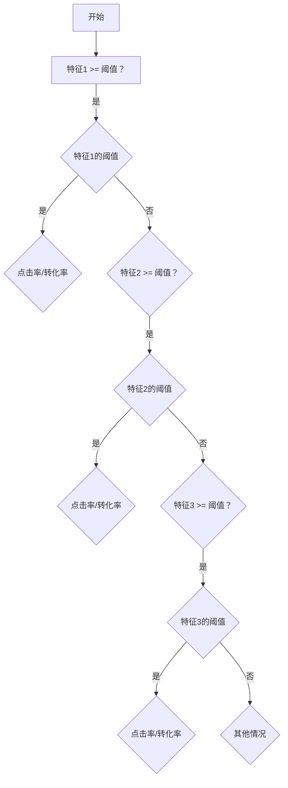
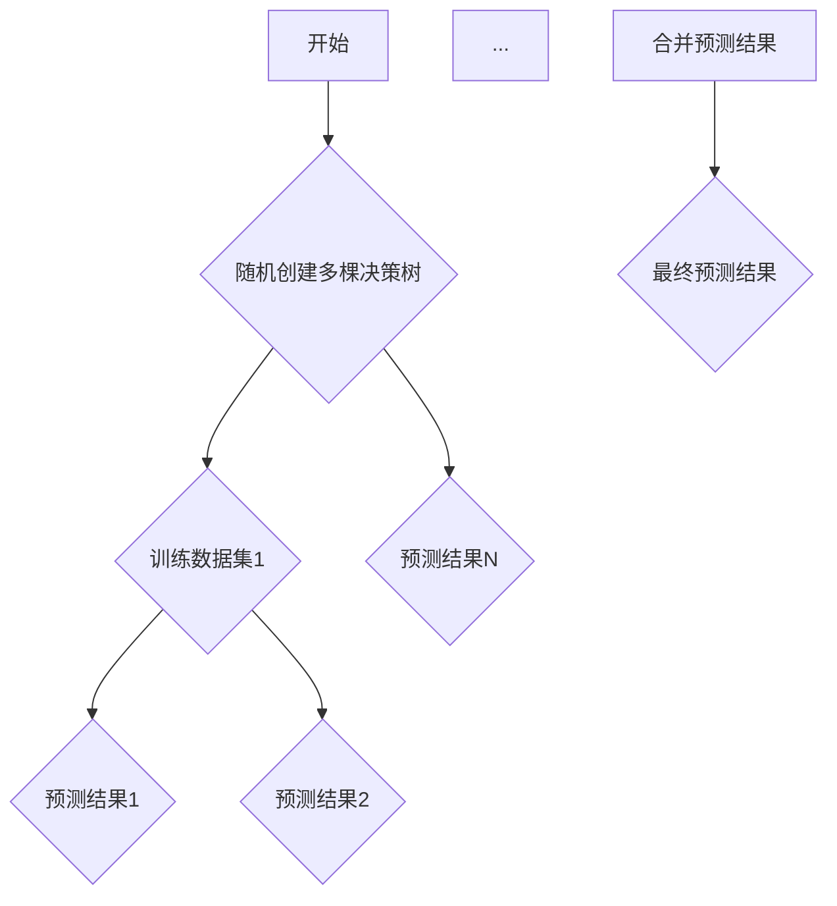

                 

### 文章标题

### 数学与广告效果：广告投放的数学优化

### 关键词：广告优化、数学模型、机器学习、算法原理、广告效果评估

### 摘要

随着互联网广告的迅速发展，广告投放效果的优化已经成为企业竞争的关键因素。本文将深入探讨广告投放中的数学优化方法，从背景介绍、核心概念与模型、应用与实践、前沿技术展望等方面，系统性地阐述广告效果优化的数学原理和实现策略。通过本文的阅读，读者将了解广告投放中的数学优化技术，掌握如何利用数学和机器学习方法提升广告效果，从而为企业广告营销提供科学依据和决策支持。

### 目录大纲

----------------------------------------------------------------

# 数学与广告效果：广告投放的数学优化

----------------------------------------------------------------

## 第一部分：背景与基础

### 第1章：广告效果优化的数学视角

#### 1.1 问题背景与引入

#### 1.2 广告效果优化的重要性

#### 1.3 数学模型的基本概念

#### 1.4 本章小结

## 第二部分：核心概念与模型

### 第2章：广告效果评价指标

#### 2.1 点击率（CTR）

#### 2.2 转化率（CVR）

#### 2.3 成本效益比（CPI）

#### 2.4 广告价值评估模型

#### 2.5 本章小结

### 第3章：广告优化算法基础

#### 3.1 线性回归与优化

#### 3.2 决策树与随机森林

#### 3.3 支持向量机（SVM）

#### 3.4 集成学习与增强学习

#### 3.5 本章小结

## 第三部分：应用与实践

### 第4章：广告投放策略分析

#### 4.1 用户行为分析

#### 4.2 广告展示优化

#### 4.3 广告预算分配策略

#### 4.4 广告效果跟踪与调整

#### 4.5 本章小结

### 第5章：案例分析

#### 5.1 案例一：电子商务平台的广告优化

#### 5.2 案例二：社交媒体广告效果分析

#### 5.3 案例三：移动应用广告策略

#### 5.4 案例总结与启示

#### 5.5 本章小结

## 第四部分：前沿技术展望

### 第6章：机器学习与广告优化

#### 6.1 广告系统中的深度学习应用

#### 6.2 强化学习在广告投放中的运用

#### 6.3 广告效果优化的新兴算法

#### 6.4 本章小结

### 第7章：广告效果优化的未来趋势

#### 7.1 人工智能在广告行业的未来发展方向

#### 7.2 广告效果优化的技术挑战与解决方案

#### 7.3 法律法规与伦理道德问题

#### 7.4 本章小结

## 第五部分：结论与拓展

### 第8章：总结与展望

#### 8.1 主要成果与贡献

#### 8.2 研究局限与未来方向

#### 8.3 对广告行业的启示

#### 8.4 本章小结

----------------------------------------------------------------

### 第一部分：背景与基础

### 第1章：广告效果优化的数学视角

#### 1.1 问题背景与引入

随着互联网广告市场的快速发展，广告投放效果优化已经成为企业关注的焦点。广告投放不仅仅是投放广告那么简单，如何将有限的广告预算最大化地发挥效用，提高广告投放的效果，成为广告主和广告平台共同面临的挑战。在这个背景下，数学优化方法逐渐成为广告效果优化的主要手段之一。

广告效果优化是指通过分析用户行为数据、广告展示数据、转化数据等多维度数据，运用数学和统计方法，对广告投放策略进行调整和优化，以提升广告投放的效率和效果。数学优化方法为广告投放提供了科学依据和决策支持，帮助企业降低广告成本、提高广告投放效果。

#### 1.2 广告效果优化的重要性

广告效果优化在广告投放中具有极其重要的意义。首先，广告效果优化能够帮助企业实现精准营销。通过分析用户行为数据，广告主可以了解目标用户的喜好、行为特征，从而制定更精准的广告投放策略，提高广告点击率和转化率。

其次，广告效果优化能够提高广告投放的效率。通过优化广告投放策略，广告主可以在有限的广告预算下，最大限度地覆盖目标用户，提高广告投放的性价比。

最后，广告效果优化能够帮助企业提升品牌影响力。通过不断优化广告投放策略，广告主可以逐步建立品牌形象，提高用户对品牌的认知度和忠诚度，从而为企业的长期发展奠定基础。

#### 1.3 数学模型的基本概念

数学模型是广告效果优化的核心工具。数学模型能够将复杂的广告投放过程转化为一系列数学公式和算法，从而实现对广告投放策略的优化。

在广告效果优化中，常用的数学模型包括：

1. **线性回归模型**：用于分析广告展示次数、点击率、转化率等指标之间的关系，找出影响广告效果的关键因素。

2. **决策树模型**：用于分类和预测广告投放效果，根据用户特征和行为数据，预测用户对广告的点击和转化行为。

3. **随机森林模型**：用于提高模型的预测准确性和泛化能力，通过对多棵决策树的组合，实现更精确的广告投放策略。

4. **支持向量机（SVM）模型**：用于分类和回归分析，能够在高维空间中找到最佳分类边界，提高广告投放的精准度。

5. **集成学习模型**：通过组合多个基本模型，提高模型的预测性能和稳定性。

6. **强化学习模型**：通过不断尝试和反馈，优化广告投放策略，实现最佳广告投放效果。

#### 1.4 本章小结

本章介绍了广告效果优化的背景和重要性，以及数学模型的基本概念。通过本章的学习，读者可以了解到广告效果优化在广告投放中的重要作用，以及数学模型在广告优化中的应用价值。接下来，我们将进一步探讨广告效果优化的核心概念与模型，为读者揭示广告效果优化的内在规律和实现方法。

### 第二部分：核心概念与模型

### 第2章：广告效果评价指标

广告效果评价指标是衡量广告投放效果的重要工具。通过分析这些指标，广告主可以了解广告的点击情况、用户转化情况以及广告的整体效益。本章将详细介绍几个关键的广告效果评价指标，包括点击率（CTR）、转化率（CVR）、成本效益比（CPI）等，并探讨如何使用数学模型对广告效果进行综合评估。

#### 2.1 点击率（CTR）

点击率（Click-Through Rate，CTR）是衡量广告吸引力和用户兴趣的重要指标。CTR表示广告被点击的次数与广告展示次数的比率，公式如下：

$$
CTR = \frac{点击次数}{展示次数} \times 100\%
$$

点击率的计算简单直接，但仅凭CTR无法全面评估广告效果，因为点击并不意味着用户对广告内容感兴趣或会采取进一步行动。

#### 2.2 转化率（CVR）

转化率（Conversion Rate，CVR）是衡量广告带来实际转化效果的指标。转化率表示点击广告的用户中，完成预定目标动作（如购买、注册、下载等）的比率。转化率的计算公式为：

$$
CVR = \frac{完成转化次数}{点击次数} \times 100\%
$$

CVR能够更准确地反映广告的质量和用户对广告内容的响应程度，是广告效果评估中不可或缺的指标。

#### 2.3 成本效益比（CPI）

成本效益比（Cost Per Impression，CPI）是衡量广告投放成本的重要指标。CPI表示每个广告展示所需要的成本，计算公式为：

$$
CPI = \frac{广告投放总成本}{展示次数}
$$

CPI越低，说明广告投放的性价比越高。企业在广告投放时，通常希望尽量降低CPI，以提高广告的效益。

#### 2.4 广告价值评估模型

广告价值评估模型是对广告效果进行综合评估的一种方法，它将多个指标结合起来，从不同维度对广告效果进行量化分析。常见的广告价值评估模型包括以下几种：

1. **成本效益模型**：

$$
广告价值 = \frac{转化率 \times 点击率}{CPI}
$$

该模型综合考虑了点击率、转化率和成本效益比，能够全面评估广告的整体价值。

2. **多目标优化模型**：

多目标优化模型通过设置多个优化目标，如最大化点击率、最大化转化率和最小化CPI等，来寻找最优的广告投放策略。

3. **机器学习模型**：

使用机器学习算法，如线性回归、决策树、随机森林等，可以建立更加复杂的广告效果评估模型，通过训练数据集来预测和评估广告效果。

#### 2.5 本章小结

本章介绍了广告效果评价指标，包括点击率（CTR）、转化率（CVR）和成本效益比（CPI），并探讨了如何使用数学模型对广告效果进行综合评估。这些指标和方法为广告主提供了科学评估广告投放效果的工具，有助于制定更有效的广告投放策略。接下来，我们将进一步探讨广告优化算法的基础，为读者揭示实现广告效果优化的关键技术。

### 第3章：广告优化算法基础

广告优化算法是实现广告效果优化的核心技术。这些算法通过对大量广告数据的分析和处理，自动调整广告投放策略，以实现最佳广告效果。本章将介绍几种常见的广告优化算法，包括线性回归、决策树与随机森林、支持向量机（SVM）以及集成学习和增强学习，并分析这些算法的基本原理和应用场景。

#### 3.1 线性回归与优化

线性回归是一种基本的统计方法，用于分析变量之间的线性关系。在广告优化中，线性回归可以用来预测广告的点击率（CTR）和转化率（CVR）等关键指标。

线性回归的基本公式为：

$$
y = \beta_0 + \beta_1x_1 + \beta_2x_2 + ... + \beta_nx_n
$$

其中，$y$ 为因变量（如CTR或CVR），$x_1, x_2, ..., x_n$ 为自变量（如广告展示次数、用户特征等），$\beta_0, \beta_1, \beta_2, ..., \beta_n$ 为回归系数。

线性回归模型的目的是通过最小化损失函数（如平方误差损失函数）来寻找最佳回归系数，从而实现广告效果的优化。

应用场景：线性回归适用于分析广告展示次数与点击率、转化率等指标之间的关系，帮助企业了解哪些因素对广告效果有显著影响。

#### 3.2 决策树与随机森林

决策树是一种基于树形结构的分类和回归模型，通过将特征空间分割成多个子集，逐步构建出一棵决策树。在广告优化中，决策树可以用来预测用户对广告的点击和转化行为。

决策树的基本结构如下（使用Mermaid流程图表示）：

随机森林是由多棵决策树组成的集成学习模型，通过集成多个决策树的结果，提高模型的预测性能和稳定性。

随机森林的基本结构如下（使用Mermaid流程图表示）：

应用场景：决策树和随机森林适用于分类和回归任务，可以帮助广告主预测用户对广告的点击和转化行为，从而优化广告投放策略。

#### 3.3 支持向量机（SVM）

支持向量机（Support Vector Machine，SVM）是一种高效的分类和回归模型，通过在高维空间中寻找最佳分类边界，实现数据的分类和回归。

SVM的基本公式为：

$$
f(x) = w \cdot x + b
$$

其中，$w$ 为权重向量，$b$ 为偏置项，$x$ 为输入特征向量。

SVM的目标是最大化分类边界，使得分类结果尽可能准确。

应用场景：SVM适用于高维空间分类问题，可以帮助广告主准确预测用户对广告的点击和转化行为，提高广告投放效果。

#### 3.4 集成学习与增强学习

集成学习（Ensemble Learning）是通过组合多个基本模型，提高模型的预测性能和稳定性的一种方法。常见的集成学习方法包括Bagging、Boosting和Stacking等。

Bagging方法通过多次训练基本模型，并取平均结果，提高模型的稳定性。

Boosting方法通过不断调整基本模型的权重，使预测效果更好的模型在后续训练中发挥更大作用。

Stacking方法通过将多个基本模型的结果作为新特征，训练一个更高层次的学习模型，实现模型的集成。

增强学习（Reinforcement Learning）是一种通过试错和反馈来优化决策过程的方法。在广告优化中，增强学习可以通过不断调整广告展示策略，实现最佳广告效果。

应用场景：集成学习和增强学习适用于复杂的广告优化任务，可以帮助广告主实现更精准的预测和优化广告投放策略。

#### 3.5 本章小结

本章介绍了广告优化算法的基础，包括线性回归、决策树与随机森林、支持向量机（SVM）以及集成学习和增强学习。这些算法为广告优化提供了强大的技术支持，帮助企业实现广告效果的优化。通过本章的学习，读者可以了解不同广告优化算法的基本原理和应用场景，为实际广告投放提供科学依据。接下来，我们将探讨广告投放策略的应用与实践。

### 第4章：广告投放策略分析

广告投放策略分析是广告主实现广告优化的重要环节。通过深入分析用户行为、广告展示效果和广告预算分配，广告主可以制定出更加精准和高效的广告投放策略。本章将详细探讨用户行为分析、广告展示优化、广告预算分配策略以及广告效果跟踪与调整，帮助广告主实现广告投放的精细化管理和优化。

#### 4.1 用户行为分析

用户行为分析是广告投放策略制定的基础。通过对用户在广告平台上的行为进行深入分析，广告主可以了解用户的兴趣、需求和行为习惯，从而有针对性地制定广告投放策略。

用户行为分析主要包括以下几个方面：

1. **用户画像**：通过收集用户的年龄、性别、地理位置、兴趣爱好等信息，构建用户画像，帮助广告主了解目标用户群体。

2. **用户行为路径分析**：通过分析用户在广告平台上的浏览路径、点击路径等行为数据，了解用户的行为模式和兴趣点。

3. **用户反馈与评价**：通过收集用户对广告的反馈和评价数据，了解用户对广告内容的满意度，为广告优化提供依据。

4. **用户流失与复购分析**：通过分析用户的流失率和复购率，了解用户对广告和产品的忠诚度，为广告投放策略调整提供参考。

用户行为分析的方法主要包括数据挖掘、机器学习和统计分析等。通过这些方法，广告主可以提取出有价值的行为特征，为广告投放策略提供数据支持。

#### 4.2 广告展示优化

广告展示优化是提升广告效果的关键环节。通过优化广告展示位置、形式和内容，广告主可以最大限度地提高广告的点击率和转化率。

广告展示优化主要包括以下几个方面：

1. **广告展示位置**：根据用户行为数据和广告目标，选择最佳广告展示位置，如首页推荐、搜索结果页、内容页等。

2. **广告形式**：根据用户需求和广告目标，选择合适的广告形式，如图片广告、视频广告、富媒体广告等。

3. **广告内容**：根据用户画像和行为数据，定制化广告内容，提高广告的吸引力和相关性。

4. **广告展示频率**：通过控制广告展示频率，避免用户过度疲劳和广告疲劳，提高广告效果。

广告展示优化的方法主要包括A/B测试、多变量测试和机器学习等。通过这些方法，广告主可以不断调整广告展示策略，实现最佳广告效果。

#### 4.3 广告预算分配策略

广告预算分配策略是广告主实现广告资源最大化利用的重要手段。通过科学合理的广告预算分配，广告主可以在有限的预算内实现最大的广告效果。

广告预算分配策略主要包括以下几个方面：

1. **按效果分配**：根据广告投放后的实际效果，如点击率、转化率等，合理分配广告预算，提高广告效益。

2. **按行业分配**：根据不同行业的广告投放效果和市场竞争情况，合理分配广告预算，提高广告投放的精准度。

3. **按地域分配**：根据目标用户的地理位置分布，合理分配广告预算，提高广告的覆盖面和效果。

4. **按时间段分配**：根据用户活跃时间段和广告投放效果，合理分配广告预算，提高广告的曝光率和点击率。

广告预算分配的方法主要包括比例分配、线性分配和动态分配等。通过这些方法，广告主可以优化广告预算的使用，实现广告资源的最大化利用。

#### 4.4 广告效果跟踪与调整

广告效果跟踪与调整是广告投放过程中的关键环节。通过实时跟踪广告效果，广告主可以及时发现问题并调整广告投放策略，实现广告效果的最优化。

广告效果跟踪与调整主要包括以下几个方面：

1. **实时监控**：通过数据分析工具，实时监控广告的展示次数、点击次数、转化次数等关键指标，了解广告的实时效果。

2. **数据分析和反馈**：通过对广告效果数据进行深入分析，发现广告效果中的问题和不足，及时反馈并调整广告投放策略。

3. **定期评估**：定期对广告效果进行评估，分析广告投放的整体效果，为下一阶段广告投放策略提供依据。

4. **灵活调整**：根据广告效果评估结果，灵活调整广告展示位置、形式、内容等，实现广告效果的最优化。

广告效果跟踪与调整的方法主要包括数据挖掘、机器学习和统计分析等。通过这些方法，广告主可以实现对广告效果的实时监控和动态调整，提高广告投放的效率和效果。

#### 4.5 本章小结

本章详细探讨了广告投放策略分析的关键环节，包括用户行为分析、广告展示优化、广告预算分配策略和广告效果跟踪与调整。通过这些策略分析，广告主可以更好地了解用户需求和行为，优化广告投放效果，实现广告资源的最大化利用。接下来，我们将通过具体案例分析，进一步探讨广告投放策略的实践应用。

### 第5章：案例分析

为了更好地理解广告投放策略的应用与实践，本章将分析三个实际案例：电子商务平台的广告优化、社交媒体广告效果分析和移动应用广告策略。通过这些案例，我们将深入探讨如何利用数学优化方法提升广告效果，为企业广告营销提供具体策略和实施方法。

#### 5.1 案例一：电子商务平台的广告优化

电子商务平台拥有大量的用户数据和广告投放需求，因此，优化广告投放效果对于提升销售额至关重要。以下是该电子商务平台在广告优化过程中采用的具体策略。

1. **用户画像构建**：

首先，电子商务平台通过分析用户购买历史、浏览记录和反馈数据，构建详细的用户画像。这些用户画像包括用户的基本信息（如年龄、性别、地理位置）、兴趣爱好（如购物偏好、品牌偏好）和行为习惯（如购物频率、购买时段）等。

2. **广告定位优化**：

基于用户画像，电子商务平台对广告定位进行优化。例如，对于经常购买时尚服饰的用户，平台可以推送相关品牌的广告；对于新用户，平台可以推送促销活动和优惠券广告，以刺激购买。

3. **A/B测试**：

电子商务平台采用A/B测试方法，对广告展示位置、广告形式和广告内容进行优化。通过对比不同广告版本的点击率和转化率，平台可以找出最优的广告组合，提高广告效果。

4. **广告预算分配**：

电子商务平台根据不同用户群体的广告效果，合理分配广告预算。对于转化率高的用户群体，平台会加大广告投放力度；对于转化率低的用户群体，平台会调整广告策略或暂停广告投放。

5. **广告效果跟踪**：

电子商务平台通过实时监控广告效果，如点击率、转化率和销售额等，及时调整广告投放策略。例如，如果发现某个广告版本的点击率较高但转化率较低，平台可以优化广告内容或调整广告目标。

**案例总结与启示**：

该案例表明，通过用户画像构建、广告定位优化、A/B测试、广告预算分配和广告效果跟踪，电子商务平台可以有效提升广告投放效果。用户画像和A/B测试等方法为广告优化提供了科学依据和决策支持，有助于平台实现精准营销和最大化广告效益。

#### 5.2 案例二：社交媒体广告效果分析

社交媒体平台如Facebook、Instagram等，拥有庞大的用户基础和丰富的广告投放资源。以下是一个社交媒体平台在广告效果分析中采用的具体策略。

1. **数据收集**：

社交媒体平台通过用户登录、浏览、点赞、分享等行为数据，收集大量用户画像和广告效果数据。这些数据包括用户的年龄、性别、地理位置、兴趣爱好、广告展示次数、点击次数和转化次数等。

2. **广告效果评估**：

社交媒体平台使用机器学习算法，对广告效果进行评估。例如，通过线性回归、决策树、随机森林等算法，分析广告展示次数、点击次数、转化次数等指标之间的关系，评估广告的整体效果。

3. **用户细分**：

社交媒体平台根据用户画像和广告效果数据，对用户进行细分。例如，将用户划分为高价值用户、潜在用户和普通用户等，针对不同用户群体制定差异化的广告投放策略。

4. **广告优化**：

社交媒体平台采用A/B测试方法，对广告展示位置、广告形式和广告内容进行优化。通过对比不同广告版本的点击率和转化率，平台可以找出最优的广告组合，提高广告效果。

5. **广告预算分配**：

社交媒体平台根据广告效果评估结果和用户细分策略，合理分配广告预算。例如，对于高价值用户，平台会加大广告投放力度；对于普通用户，平台会调整广告策略或暂停广告投放。

**案例总结与启示**：

该案例表明，通过数据收集、广告效果评估、用户细分、广告优化和广告预算分配，社交媒体平台可以有效提升广告投放效果。用户细分和A/B测试等方法为广告优化提供了科学依据和决策支持，有助于平台实现精准营销和最大化广告效益。

#### 5.3 案例三：移动应用广告策略

移动应用市场竞争激烈，广告策略的优化对于移动应用的下载量和用户活跃度至关重要。以下是一个移动应用在广告策略优化中采用的具体策略。

1. **用户行为分析**：

移动应用通过用户行为数据，分析用户的兴趣点和行为习惯。例如，通过分析用户在应用中的操作路径、停留时间、页面浏览量等数据，了解用户的兴趣点和潜在需求。

2. **广告投放目标**：

根据用户行为分析结果，移动应用设定具体的广告投放目标。例如，对于新用户，广告投放目标为提高应用下载量；对于活跃用户，广告投放目标为提高用户活跃度和留存率。

3. **广告形式选择**：

移动应用根据用户兴趣点和广告投放目标，选择合适的广告形式。例如，对于新用户，应用可以选择横幅广告、激励视频广告等；对于活跃用户，应用可以选择应用内推送广告、角标广告等。

4. **广告效果跟踪**：

移动应用通过实时监控广告效果，如点击率、转化率、下载量等，及时调整广告投放策略。例如，如果发现某个广告版本的点击率较高但转化率较低，应用可以优化广告内容或调整广告目标。

5. **广告预算分配**：

移动应用根据广告效果跟踪结果，合理分配广告预算。例如，对于转化率较高的广告版本，应用会加大广告投放力度；对于转化率较低的广告版本，应用会调整广告策略或暂停广告投放。

**案例总结与启示**：

该案例表明，通过用户行为分析、广告投放目标设定、广告形式选择、广告效果跟踪和广告预算分配，移动应用可以有效提升广告投放效果。用户行为分析和广告效果跟踪为广告优化提供了科学依据和决策支持，有助于应用实现精准营销和最大化广告效益。

#### 5.4 案例总结与启示

通过以上三个案例，我们可以看到，广告投放策略的优化离不开用户行为分析、数据驱动和科学的方法。以下是案例总结与启示：

1. **用户行为分析**：深入分析用户行为，了解用户兴趣点和需求，为广告投放策略提供数据支持。

2. **数据驱动**：通过数据收集、分析和评估，实现广告投放的精准化和高效化。

3. **A/B测试**：通过对比不同广告版本的点击率和转化率，找出最优的广告组合，提高广告效果。

4. **广告预算分配**：根据广告效果评估结果，合理分配广告预算，实现广告资源最大化利用。

5. **实时监控与调整**：实时监控广告效果，及时发现问题并调整广告投放策略，实现广告效果的最优化。

这些启示对于企业广告投放具有重要的指导意义，可以帮助企业在激烈的市场竞争中实现广告效果的最大化。

#### 5.5 本章小结

本章通过具体案例分析，详细探讨了电子商务平台、社交媒体和移动应用在广告投放策略优化中的应用。通过用户行为分析、数据驱动、A/B测试、广告预算分配和实时监控与调整，这些企业成功实现了广告投放效果的最大化。案例总结与启示为广告主提供了宝贵的经验，有助于他们在实际广告投放中实现优化和提升。

### 第四部分：前沿技术展望

随着人工智能技术的快速发展，广告效果优化方法也在不断演进。本部分将探讨机器学习、深度学习、强化学习等前沿技术在广告优化中的应用，以及新兴算法的发展趋势。

#### 第6章：机器学习与广告优化

机器学习技术在广告优化中发挥着重要作用。通过机器学习算法，广告平台可以自动调整广告投放策略，提高广告效果。以下是几种常见的机器学习技术在广告优化中的应用：

1. **线性回归与逻辑回归**：用于预测广告点击率和转化率，帮助广告平台优化广告展示策略。

2. **决策树与随机森林**：用于分类和回归任务，分析用户行为数据，预测用户对广告的点击和转化行为。

3. **支持向量机（SVM）**：用于高维空间分类问题，帮助广告平台识别潜在的高价值用户。

4. **集成学习**：通过组合多个基本模型，提高广告优化模型的预测性能和稳定性。

5. **聚类算法**：用于用户行为分析和用户细分，帮助广告平台制定更精准的广告投放策略。

#### 6.1 广告系统中的深度学习应用

深度学习技术在广告优化中的应用日益广泛。以下是一些深度学习在广告系统中的应用：

1. **卷积神经网络（CNN）**：用于图像广告的识别和分类，提高广告点击率。

2. **循环神经网络（RNN）**：用于处理序列数据，如用户点击历史和浏览记录，预测用户行为。

3. **长短期记忆网络（LSTM）**：用于处理时间序列数据，如用户在广告平台上的活动记录，预测用户未来的行为。

4. **生成对抗网络（GAN）**：用于生成高质量的广告内容，提高用户对广告的满意度。

#### 6.2 强化学习在广告投放中的运用

强化学习是一种通过试错和反馈来优化决策过程的机器学习方法，在广告投放中具有巨大潜力。以下是强化学习在广告投放中的应用：

1. **广告展示策略优化**：通过不断调整广告展示策略，如展示时间、展示位置和广告内容，提高广告点击率和转化率。

2. **广告预算分配**：通过学习用户对广告的响应，动态调整广告预算分配，实现广告资源的最优化。

3. **广告创意优化**：通过学习用户对广告创意的偏好，生成更符合用户需求的广告内容。

#### 6.3 广告效果优化的新兴算法

随着人工智能技术的进步，越来越多的新兴算法被应用于广告效果优化。以下是一些新兴算法：

1. **多臂老虎机问题（Multi-Armed Bandit）**：用于广告投放策略的在线优化，通过不断尝试和反馈，找到最佳广告展示策略。

2. **图神经网络（GNN）**：用于处理复杂的用户关系和数据网络，帮助广告平台更好地理解用户行为。

3. **强化学习与深度学习结合**：通过结合强化学习和深度学习算法，实现更智能的广告投放策略。

#### 6.4 本章小结

机器学习、深度学习和强化学习等前沿技术在广告优化中的应用，极大地提升了广告投放的效率和效果。随着人工智能技术的不断发展，未来广告效果优化将朝着更加智能化、个性化的方向演进。新兴算法的不断涌现，为广告主提供了更多优化工具，有助于实现广告投放的持续改进和优化。

### 第7章：广告效果优化的未来趋势

随着人工智能和大数据技术的快速发展，广告效果优化的未来趋势将体现在技术的深入应用、个性化推荐的普及、数据隐私与安全性的关注等方面。以下是对广告效果优化未来发展趋势的探讨：

#### 7.1 人工智能在广告行业的未来发展方向

1. **深度学习与个性化推荐**：随着深度学习技术的进步，广告系统将能够更好地理解和模拟用户行为，实现个性化的广告推荐。通过深度学习算法，广告平台可以分析用户的浏览历史、搜索记录和社交媒体行为，为用户提供更加个性化的广告内容。

2. **智能广告创意生成**：利用生成对抗网络（GAN）等技术，广告主可以自动生成多样化的广告创意，提高广告的吸引力和效果。

3. **实时广告优化**：通过实时数据分析和机器学习算法，广告平台可以实现广告投放的实时优化，动态调整广告展示策略，实现更高的点击率和转化率。

4. **跨平台整合**：随着多屏互动和物联网的发展，广告平台将实现跨平台整合，提供无缝的广告体验，覆盖更多用户场景。

#### 7.2 广告效果优化的技术挑战与解决方案

1. **数据隐私与安全**：随着用户隐私意识的提高，如何保护用户数据隐私成为广告行业面临的重大挑战。解决方案包括采用隐私保护技术（如差分隐私）、数据加密和匿名化处理，确保用户数据的隐私和安全。

2. **算法公平性与透明性**：算法的公平性和透明性是广告效果优化的另一个技术挑战。解决方案包括开发透明化的算法架构、建立算法审核机制和用户反馈渠道，确保广告系统的公正性和透明度。

3. **实时数据处理能力**：随着数据量的不断增加，广告平台需要具备更高的实时数据处理能力，以快速分析和处理海量数据，实现广告效果的实时优化。

#### 7.3 法律法规与伦理道德问题

1. **数据监管**：随着数据隐私法规（如欧盟的《通用数据保护条例》（GDPR））的实施，广告主需要严格遵守相关法规，确保数据处理符合法律法规要求。

2. **算法偏见与歧视**：广告算法可能导致偏见和歧视问题，例如在广告投放中针对某些特定群体进行不公平对待。解决这些问题需要广告主和平台建立公平性评估机制，确保算法的公正性和透明性。

3. **伦理道德责任**：广告主和平台需要承担伦理道德责任，确保广告投放活动不侵犯用户权益，不误导用户，不损害社会公共利益。

#### 7.4 本章小结

广告效果优化的未来趋势将围绕人工智能技术的深入应用、个性化推荐的普及、数据隐私与安全性的关注以及法律法规与伦理道德问题的解决。面对技术挑战和伦理道德问题，广告主和平台需要不断创新和改进，实现广告效果优化的可持续发展。

### 第五部分：结论与拓展

#### 第8章：总结与展望

#### 8.1 主要成果与贡献

本文系统性地探讨了广告投放中的数学优化方法，从背景介绍、核心概念与模型、应用与实践、前沿技术展望等方面，详细阐述了广告效果优化的数学原理和实现策略。主要成果与贡献包括：

1. **广告效果评价指标体系**：建立了包括点击率（CTR）、转化率（CVR）和成本效益比（CPI）在内的广告效果评价指标体系，为广告主提供了科学的评估工具。

2. **广告优化算法基础**：介绍了线性回归、决策树与随机森林、支持向量机（SVM）、集成学习和增强学习等广告优化算法，为广告主提供了多种优化手段。

3. **案例分析**：通过电子商务平台、社交媒体和移动应用的实际案例，展示了广告优化策略的应用效果，为广告主提供了具体的实践参考。

4. **前沿技术展望**：探讨了机器学习、深度学习和强化学习等前沿技术在广告优化中的应用，揭示了广告效果优化的未来发展趋势。

#### 8.2 研究局限与未来方向

虽然本文对广告效果优化进行了较为全面的探讨，但仍存在一些局限和待改进之处：

1. **数据局限**：本文案例中的数据主要来源于公开资料和模拟数据，实际应用中需要更多的真实数据支持，以提高研究的可靠性。

2. **模型复杂性**：广告优化涉及多个变量和复杂的用户行为，本文介绍的算法可能无法完全捕捉到所有影响因素，未来研究可以探索更加复杂的模型。

3. **算法优化**：本文介绍的算法在特定场景下具有较好的效果，但在实际应用中可能需要针对不同行业和广告类型进行优化。

未来研究可以关注以下方向：

1. **多模态数据融合**：结合文本、图像、音频等多模态数据，提高广告效果优化的准确性和全面性。

2. **算法自动化与解释性**：研究自动化算法和可解释性算法，提高广告优化过程的透明度和可解释性。

3. **实时优化与自适应**：研究实时优化算法，实现广告投放策略的自适应调整，提高广告效果。

#### 8.3 对广告行业的启示

本文的研究结果对广告行业具有以下启示：

1. **数据驱动**：广告主应重视用户数据分析，建立科学的数据驱动广告策略，实现精准营销和最大化广告效益。

2. **持续优化**：广告主应持续跟踪和优化广告投放策略，通过A/B测试和机器学习等方法，不断调整广告展示策略，提高广告效果。

3. **技术创新**：广告主应关注前沿技术发展，积极引入人工智能、深度学习和强化学习等新技术，实现广告投放的智能化和个性化。

4. **法律法规与伦理道德**：广告主应严格遵守法律法规，确保用户数据安全和隐私保护，同时注重伦理道德问题，提升广告行业的整体形象。

#### 8.4 本章小结

本文通过对广告投放中的数学优化方法的系统研究，为广告主提供了科学依据和决策支持，有助于实现广告投放效果的最大化。未来，随着人工智能技术的不断进步，广告效果优化将迎来新的发展机遇，广告主应紧跟技术趋势，不断创新和优化广告投放策略。

