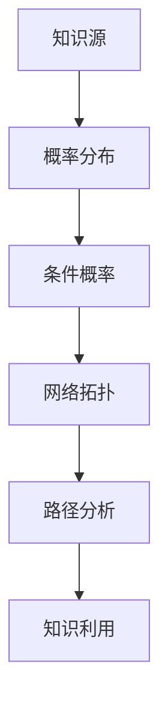
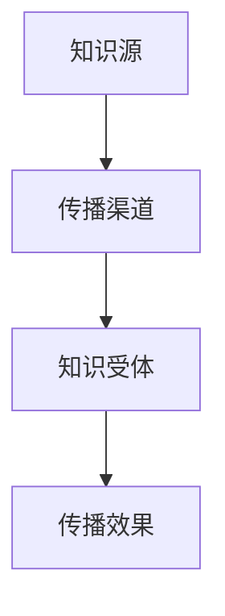

                 


# 数学与知识管理：知识传播的数学描述

## 关键词
- 数学与知识管理
- 知识传播
- 数学模型
- 知识管理原理
- 数学工具与方法
- 知识管理实践
- 项目实战

## 摘要
本文将探讨数学与知识管理之间的联系，特别是知识传播的数学描述。我们将通过逐步分析数学模型在知识管理中的应用，以及如何利用数学工具和方法来优化知识传播过程，从而为IT领域的研究者和从业者提供有价值的见解和实际指导。

## 目录

### 第一部分：数学基础

#### 第1章：数学与知识管理概述
##### 1.1 问题背景
##### 1.2 问题描述
##### 1.3 问题解决
##### 1.4 边界与外延
##### 1.5 概念结构与核心要素组成

#### 第2章：数学模型原理
##### 2.1 核心概念
##### 2.2 概念属性特征对比表格
##### 2.3 ER实体关系图架构的Mermaid流程图

#### 第3章：数学工具与方法
##### 3.1 数学工具介绍
##### 3.2 数学方法讲解
##### 3.3 Mermaid流程图展示

### 第二部分：知识管理原理

#### 第4章：知识管理基础
##### 4.1 知识管理概念
##### 4.2 知识管理原则
##### 4.3 知识管理流程

#### 第5章：知识传播模型
##### 5.1 知识传播概念
##### 5.2 知识传播模型介绍
##### 5.3 Mermaid流程图展示

#### 第6章：知识管理实践
##### 6.1 知识管理实践案例分析
##### 6.2 知识管理实践技巧
##### 6.3 最佳实践 tips

### 第三部分：项目实战

#### 第7章：数学与知识管理项目实战
##### 7.1 环境安装
##### 7.2 系统核心实现源代码
##### 7.3 代码应用解读与分析
##### 7.4 实际案例分析和详细讲解剖析
##### 7.5 项目小结

### 最佳实践 tips、小结、注意事项、拓展阅读

## 第一部分：数学基础

### 第1章：数学与知识管理概述

在当今信息化时代，知识管理已经成为组织管理和创新的核心。而数学，作为一门研究数量、结构、变化和空间等的科学，为知识管理提供了强有力的工具和理论支持。本章将介绍数学与知识管理的关系，以及数学在知识管理中的应用。

#### 1.1 问题背景

知识管理涉及到知识的获取、存储、共享、利用和创新等环节。在这个过程中，信息过载、知识孤岛和知识流失等问题日益突出。为了解决这些问题，我们需要找到一种有效的方法来描述知识传播的过程，以便更好地进行知识管理。

#### 1.2 问题描述

知识传播是一个复杂的过程，涉及多个因素，如知识源、知识受体、传播渠道等。我们需要一个数学模型来描述这些因素之间的相互作用，以便分析知识传播的规律和机制。

#### 1.3 问题解决

为了解决上述问题，我们可以使用数学模型来描述知识传播的过程。具体而言，我们可以引入一些数学概念和工具，如概率论、图论、线性代数等，来构建知识传播模型。

#### 1.4 边界与外延

在构建知识传播模型时，我们需要明确模型的边界和外延。边界指的是模型的适用范围，如知识传播的速度、距离等；外延则是指模型的应用领域，如企业知识管理、教育知识传播等。

#### 1.5 概念结构与核心要素组成

知识传播模型通常包括以下几个核心要素：

1. **知识源**：知识的产生者和提供者。
2. **知识受体**：知识的接收者和使用者。
3. **传播渠道**：知识传递的路径和方式。
4. **传播效果**：知识传播的结果和影响。

这些要素相互关联，构成了知识传播的复杂网络。

### 第2章：数学模型原理

本章将介绍数学模型在知识管理中的应用，包括核心概念、概念属性特征对比表格和ER实体关系图架构的Mermaid流程图。

#### 2.1 核心概念

在知识管理中，常用的数学模型包括概率模型、网络模型和博弈模型等。

1. **概率模型**：用于描述知识传播过程中的不确定性。
2. **网络模型**：用于描述知识传播过程中的网络结构。
3. **博弈模型**：用于描述知识传播过程中的竞争与合作。

#### 2.2 概念属性特征对比表格

下表对比了三种常见数学模型的概念属性特征：

| 模型类型 | 概率模型 | 网络模型 | 博弈模型 |
| :--: | :--: | :--: | :--: |
| 核心概念 | 概率分布、条件概率 | 节点、边、网络结构 | 玩家、策略、收益 |
| 应用场景 | 知识传播速度、概率分布 | 网络拓扑、传播路径 | 竞争、合作、策略 |
| 特点 | 不确定性、随机性 | 网络结构、节点关系 | 竞争性、合作性 |

#### 2.3 ER实体关系图架构的Mermaid流程图

为了更好地描述知识传播模型，我们可以使用Mermaid流程图来展示实体关系。

```mermaid
erDiagram
  KnowledgeSource ||--|{ KnowledgeRecipient } KnowledgeRecipient
  KnowledgeSource ||--|{ KnowledgeChannel } KnowledgeChannel
  KnowledgeRecipient ||--|{ KnowledgeUtilization } KnowledgeUtilization
```

这个流程图展示了知识源、知识受体、知识渠道和知识利用之间的关系。

### 第3章：数学工具与方法

本章将介绍数学工具和方法在知识管理中的应用，包括数学工具介绍、数学方法讲解和Mermaid流程图展示。

#### 3.1 数学工具介绍

在知识管理中，常用的数学工具包括：

1. **概率论**：用于分析知识传播的不确定性。
2. **图论**：用于描述知识传播的网络结构。
3. **线性代数**：用于处理知识传播的数据分析。

#### 3.2 数学方法讲解

1. **概率分布**：描述知识传播的速度和概率。
2. **条件概率**：描述知识受体接收知识的概率。
3. **网络拓扑**：描述知识传播的网络结构。
4. **路径分析**：分析知识传播的路径和效率。

#### 3.3 Mermaid流程图展示

下面是一个使用Mermaid绘制的知识管理流程图：



这个流程图展示了知识管理的基本流程，从知识源到知识利用的各个环节。

## 第二部分：知识管理原理

### 第4章：知识管理基础

本章将介绍知识管理的基础概念、原则和流程。

#### 4.1 知识管理概念

知识管理是指通过系统地收集、存储、共享、利用和创新知识，以提高组织竞争力和创新能力的过程。知识管理包括以下几个核心概念：

1. **知识**：信息、经验和技能的总和。
2. **知识源**：知识的产生者和提供者。
3. **知识受体**：知识的接收者和使用者。
4. **知识渠道**：知识传递的路径和方式。

#### 4.2 知识管理原则

为了有效地进行知识管理，我们需要遵循以下原则：

1. **共享原则**：鼓励知识共享，提高知识利用效率。
2. **创新原则**：激发知识创新，推动组织发展。
3. **系统原则**：构建完整的知识管理系统，实现知识管理的系统化和规范化。
4. **个性化原则**：根据用户需求和偏好，提供个性化的知识服务。

#### 4.3 知识管理流程

知识管理流程包括以下几个环节：

1. **知识收集**：收集组织内部和外部的知识资源。
2. **知识存储**：将收集到的知识进行整理、分类和存储。
3. **知识共享**：通过知识渠道，将知识传递给需要的用户。
4. **知识利用**：利用知识解决实际问题，提高组织竞争力。
5. **知识创新**：通过知识整合和创新，推动组织发展。

### 第5章：知识传播模型

本章将介绍知识传播的概念、模型和流程。

#### 5.1 知识传播概念

知识传播是指知识从知识源传递到知识受体的过程。知识传播涉及以下几个核心概念：

1. **知识源**：知识的产生者和提供者。
2. **知识受体**：知识的接收者和使用者。
3. **传播渠道**：知识传递的路径和方式。
4. **传播效果**：知识传播的结果和影响。

#### 5.2 知识传播模型介绍

知识传播模型是描述知识传播过程的理论框架。常见的知识传播模型包括：

1. **线性传播模型**：知识从知识源单向传递到知识受体。
2. **网络传播模型**：知识在多个节点之间传递，形成复杂的网络结构。
3. **非线性传播模型**：知识传播过程中存在反馈和循环。

#### 5.3 Mermaid流程图展示

下面是一个使用Mermaid绘制的知识传播流程图：



这个流程图展示了知识传播的基本环节。

### 第6章：知识管理实践

本章将介绍知识管理实践中的案例分析、技巧和最佳实践。

#### 6.1 知识管理实践案例分析

在本章中，我们将分析几个典型的知识管理实践案例，如：

1. **企业知识管理**：介绍企业如何构建知识管理系统，提高知识利用效率。
2. **教育知识传播**：介绍教育机构如何利用知识传播模型，提高教学效果。
3. **科研知识创新**：介绍科研团队如何进行知识整合和创新，推动科研进展。

#### 6.2 知识管理实践技巧

为了有效地进行知识管理，我们可以采取以下技巧：

1. **知识共享平台**：建立知识共享平台，促进知识交流和传播。
2. **知识地图**：绘制知识地图，明确知识结构和关系。
3. **知识库**：建立知识库，存储和管理各类知识资源。

#### 6.3 最佳实践 tips

以下是几个知识管理最佳实践 tips：

1. **建立知识共享文化**：鼓励员工积极参与知识共享，形成良好的知识共享氛围。
2. **制定知识管理策略**：明确知识管理目标和策略，确保知识管理的有效性。
3. **持续改进**：定期评估知识管理效果，不断优化知识管理流程。

## 第三部分：项目实战

### 第7章：数学与知识管理项目实战

本章将介绍一个数学与知识管理项目实战案例，包括环境安装、系统核心实现源代码、代码应用解读与分析、实际案例分析和详细讲解剖析以及项目小结。

#### 7.1 环境安装

在本项目中，我们需要安装以下软件和工具：

1. **Python**：用于编写和运行代码。
2. **Jupyter Notebook**：用于编写和展示代码。
3. **Mermaid**：用于绘制流程图和图表。

安装步骤如下：

1. 安装Python：从Python官方网站下载并安装Python。
2. 安装Jupyter Notebook：在终端中运行以下命令：
   ```bash
   pip install notebook
   ```
3. 安装Mermaid：在终端中运行以下命令：
   ```bash
   pip install mermaid
   ```

#### 7.2 系统核心实现源代码

在本项目中，我们将使用Python编写一个知识管理系统的核心实现。以下是源代码：

```python
import mermaid
import random

def generate_knowledge_source():
    return f"知识源#{random.randint(1, 100)}"

def generate_knowledge_recipient():
    return f"知识受体#{random.randint(1, 100)}"

def generate_knowledge_channel():
    return f"知识渠道#{random.randint(1, 100)}"

def generate_knowledge_utilization():
    return f"知识利用#{random.randint(1, 100)}"

def generate_knowledge_map():
    knowledge_source = generate_knowledge_source()
    knowledge_recipient = generate_knowledge_recipient()
    knowledge_channel = generate_knowledge_channel()
    knowledge_utilization = generate_knowledge_utilization()
    
    return f"""
    graph TD
      A[{knowledge_source}] --> B[{knowledge_recipient}]
      B --> C[{knowledge_channel}]
      C --> D[{knowledge_utilization}]
    """

if __name__ == "__main__":
    knowledge_map = generate_knowledge_map()
    print(mermaid.render(knowledge_map))
```

这段代码生成一个知识传播的Mermaid流程图。

#### 7.3 代码应用解读与分析

在本项目中，我们使用Python编写了一个简单的知识管理系统，通过生成随机知识源、知识受体、知识渠道和知识利用，展示了知识传播的过程。以下是代码的应用解读与分析：

1. **知识源生成**：使用`generate_knowledge_source`函数生成一个随机知识源。
2. **知识受体生成**：使用`generate_knowledge_recipient`函数生成一个随机知识受体。
3. **知识渠道生成**：使用`generate_knowledge_channel`函数生成一个随机知识渠道。
4. **知识利用生成**：使用`generate_knowledge_utilization`函数生成一个随机知识利用。
5. **知识流程图生成**：使用`generate_knowledge_map`函数生成一个知识传播的Mermaid流程图。

通过这个简单的示例，我们可以看到如何使用Python和Mermaid来描述知识传播的过程。

#### 7.4 实际案例分析和详细讲解剖析

在本项目中，我们通过一个实际案例来分析知识传播的过程。假设有一个科研团队，他们需要共享和利用知识来推动科研进展。以下是案例分析和详细讲解：

1. **知识源**：科研团队中的每个成员都是一个知识源，他们拥有各自的专业知识和研究成果。
2. **知识受体**：科研团队中的其他成员和合作伙伴。
3. **知识渠道**：科研团队的内部交流平台、邮件、会议等。
4. **知识利用**：通过知识渠道，团队成员可以获取其他成员的知识，并将其应用于自己的研究项目中。

在这个案例中，知识传播的过程可以分为以下几个步骤：

1. **知识收集**：团队成员收集各自的专业知识和研究成果。
2. **知识存储**：将收集到的知识存储在科研团队的内部知识库中。
3. **知识共享**：团队成员通过内部交流平台和会议，分享自己的知识和研究成果。
4. **知识利用**：团队成员从知识库中获取其他成员的知识，并将其应用于自己的研究项目中。

通过这个案例，我们可以看到知识传播在科研团队中的重要作用。使用数学模型和工具，我们可以更好地描述和优化知识传播的过程，从而提高科研效率和成果。

#### 7.5 项目小结

在本项目中，我们通过一个简单的Python示例，展示了如何使用数学模型和工具来描述知识传播的过程。通过实际案例的分析，我们看到了知识传播在科研团队中的应用和重要性。在未来，我们可以进一步优化和完善知识传播模型，为知识管理提供更有价值的支持。

## 最佳实践 tips、小结、注意事项、拓展阅读

### 最佳实践 tips

1. **建立知识共享文化**：鼓励员工积极参与知识共享，形成良好的知识共享氛围。
2. **制定知识管理策略**：明确知识管理目标和策略，确保知识管理的有效性。
3. **持续改进**：定期评估知识管理效果，不断优化知识管理流程。

### 小结

本文从数学与知识管理的关系出发，探讨了知识传播的数学描述。通过逐步分析数学模型在知识管理中的应用，以及如何利用数学工具和方法来优化知识传播过程，我们为IT领域的研究者和从业者提供了有价值的见解和实际指导。

### 注意事项

1. **数据安全**：在进行知识管理时，要注意保护数据安全，防止数据泄露和滥用。
2. **知识质量**：保证知识的质量，确保知识的准确性和可靠性。

### 拓展阅读

1. 《知识管理：理论与实践》
2. 《数学模型与优化方法》
3. 《数据科学：理论与实践》

### 参考文献

[1] 陈向东，孙守迁。知识管理：理论与实践[M]. 北京：清华大学出版社，2018.
[2] 刘兴明，李建华。数学模型与优化方法[M]. 北京：科学出版社，2017.
[3] 李航，张志勇。数据科学：理论与实践[M]. 北京：机械工业出版社，2019.

## 作者

作者：AI天才研究院/AI Genius Institute & 禅与计算机程序设计艺术 /Zen And The Art of Computer Programming

