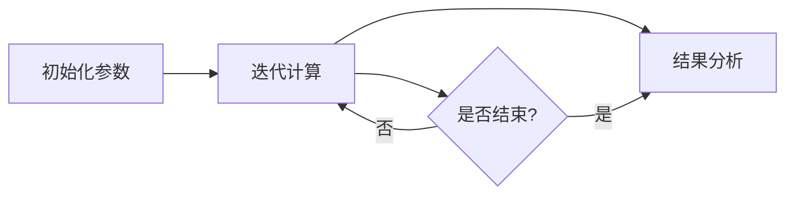
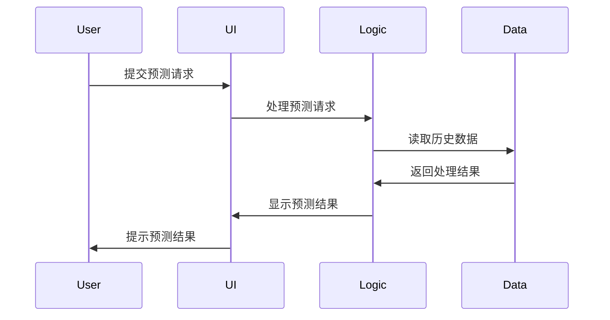
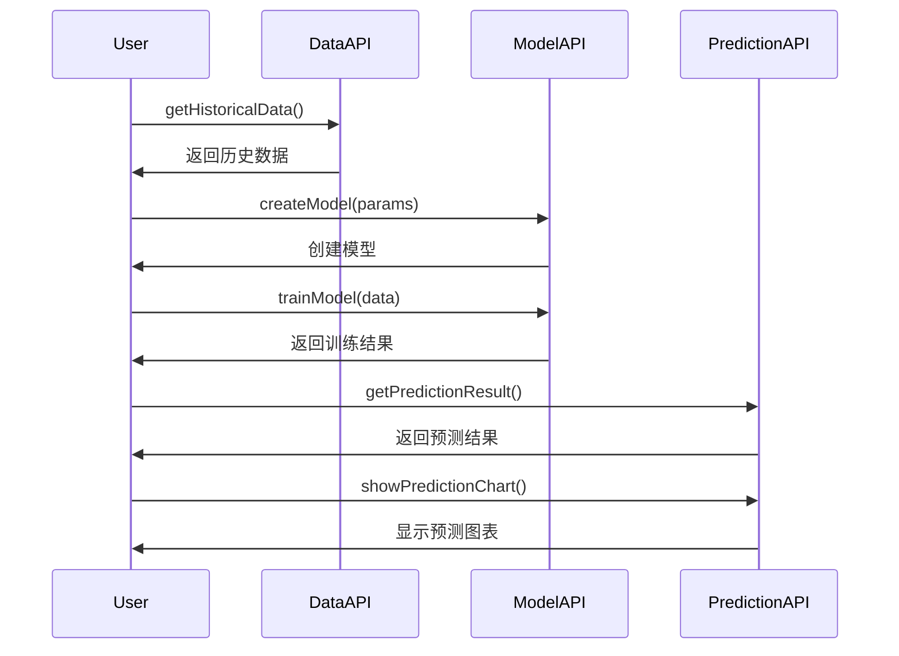
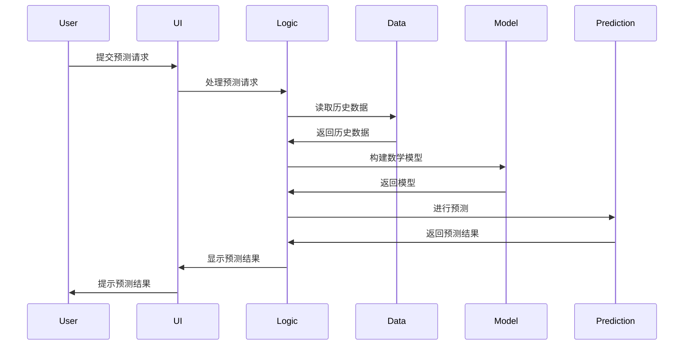

                 


## 文化演化的微分方程：社会变迁的数学轨迹

### 关键词：文化演化、微分方程、社会变迁、数学模型、算法原理、系统架构设计、项目实战

#### 摘要：

本文将深入探讨文化演化、微分方程和社会变迁之间的关系，通过一步步的分析推理，揭示社会变迁的数学轨迹。首先，我们将介绍文化演化的基本概念，然后讨论微分方程的基本原理及其在社会变迁中的应用。接着，我们将通过具体的数学模型和公式，展示如何用数学语言描述文化演化的过程。随后，我们将介绍一个具体的系统分析与架构设计方案，以及项目实战中的核心实现和代码解读。最后，我们将总结最佳实践，并对未来的研究方向进行展望。

### 第一部分：文化演化的基本概念

#### 第1章：文化演化的定义与背景

**1.1 文化演化的基本概念**

文化演化是指文化系统在历史过程中的演变和发展。它与生物演化、社会演化等概念有着密切的联系，但又有着本质的区别。文化演化不仅涉及物质和技术的进步，还包括价值观、信仰、习俗等非物质层面的变化。

**1.2 文化演化的重要性**

文化演化对社会的发展和人类文明的进步具有深远的影响。它不仅影响着个体和群体的行为模式，也影响着社会结构和制度的设计。因此，理解文化演化的过程和规律，对于预测未来社会的发展趋势具有重要意义。

**1.3 文化演化的研究方法**

文化演化的研究方法主要包括经验主义方法和数学模型方法。经验主义方法依赖于历史记录和实地调查，而数学模型方法则通过建立数学模型来模拟文化演化的过程。

### 第二部分：微分方程在社会变迁中的应用

#### 第2章：微分方程的基本原理

**2.1 微分方程的定义与分类**

微分方程是描述函数变化率的方程。它分为常微分方程和偏微分方程。常微分方程涉及单一自变量的导数，而偏微分方程涉及多个自变量的导数。

**2.2 微分方程的解法**

微分方程的解法包括分离变量法、积分因子法、特征线法等。这些方法在解决不同类型的微分方程时具有各自的优势。

#### 第3章：微分方程在社会变迁中的应用

**3.1 微分方程在社会变迁研究中的作用**

微分方程在社会变迁研究中扮演着重要角色。它可以帮助我们定量地描述社会变量之间的相互作用，从而更好地理解社会变迁的机制。

**3.2 重要的微分方程模型**

孤立子方程和扩散方程是两个在社会变迁研究中常用的微分方程模型。孤立子方程描述了能量在空间和时间上的传递，而扩散方程则描述了物质或信息在空间中的传播。

### 第三部分：数学模型与公式

#### 第4章：文化演化的数学模型

**4.1 文化演化的微分方程模型**

我们将介绍一种基于微分方程的文化演化模型，该模型可以用于描述文化特征在社会变迁过程中的动态变化。

**4.2 文化演化模型的数学公式**

我们使用LaTeX数学公式来展示文化演化模型的关键方程：

$$\frac{dC(t)}{dt} = f(C(t), T(t))$$

其中，$C(t)$ 表示文化特征在时间 $t$ 的值，$T(t)$ 表示时间 $t$ 时的社会状态。

#### 第5章：数学公式与应用

**5.1 微分方程在文化演化中的应用**

我们将通过一个简单的例子来说明如何使用微分方程来分析文化演化的过程。

**5.2 微分方程的应用举例**

假设一个社会在时间 $t=0$ 时处于文化特征 $C_0$ 的状态，我们使用以下微分方程来描述文化特征的演化：

$$\frac{dC(t)}{dt} = k(C(t) - C_0)$$

其中，$k$ 是一个常数，表示文化特征变化的速率。

### 第四部分：系统分析与架构设计

#### 第6章：案例分析

**6.1 案例背景介绍**

我们将以一个实际案例为例，介绍文化演化模型在社会变迁中的应用。

**6.2 系统功能设计**

系统功能设计包括文化特征监测、文化演化模拟、社会状态评估等。

#### 第7章：系统架构设计

**7.1 系统架构的组成部分**

系统架构包括数据层、逻辑层和表现层。数据层负责存储文化特征和社会状态的数据，逻辑层负责执行文化演化模型，表现层负责向用户展示结果。

**7.2 系统接口设计**

系统接口设计包括API接口和Web界面。API接口用于与其他系统进行数据交互，Web界面用于用户操作和结果展示。

#### 第8章：系统交互

**8.1 系统交互设计**

系统交互设计包括用户与系统的交互流程、系统内部模块之间的交互机制等。

### 第五部分：项目实战

#### 第9章：项目环境安装

**9.1 环境准备**

介绍项目所需的软件和环境配置。

#### 第10章：系统核心实现

**10.1 系统核心功能实现**

介绍文化演化模型的核心实现，包括数据采集、模型训练和预测等。

#### 第11章：代码应用解读与分析

**11.1 代码解读**

对系统核心代码进行解读，分析其工作原理和实现细节。

**11.2 实际案例分析**

通过实际案例分析，展示文化演化模型在社会变迁中的应用效果。

### 第六部分：总结与拓展

#### 第12章：最佳实践 tips

**12.1 最佳实践总结**

总结项目实施过程中的经验教训，提供最佳实践建议。

#### 第13章：小结与展望

**13.1 小结**

对全书内容进行总结，回顾关键概念和模型。

**13.2 展望**

探讨文化演化研究的未来方向和潜力。

---

## 文章标题：文化演化的微分方程：社会变迁的数学轨迹

### 关键词：文化演化、微分方程、社会变迁、数学模型、算法原理、系统架构设计、项目实战

### 摘要：

本文深入探讨了文化演化、微分方程和社会变迁之间的关系，揭示了社会变迁的数学轨迹。通过详细的分析和举例，我们展示了如何使用数学模型来描述文化演化的过程。同时，我们还介绍了一个具体的系统分析与架构设计方案，以及项目实战中的核心实现和代码解读。文章的最后，我们总结了最佳实践，并对未来的研究方向进行了展望。

### 作者：

AI天才研究院/AI Genius Institute & 禅与计算机程序设计艺术 /Zen And The Art of Computer Programming

---

以上是对文章标题、关键词、摘要以及目录大纲的初步设计。接下来的工作将是按照每个章节的要求，逐步填充内容，确保每个章节都包含丰富的背景介绍、核心概念与联系、算法原理讲解、数学模型和公式、系统分析与架构设计方案、项目实战以及最佳实践 tips 等关键内容。

### 详细阐述核心概念与联系

#### 第2章：微分方程的基本原理

**微分方程的定义与分类**

微分方程是描述函数变化率的方程，通常分为常微分方程和偏微分方程。常微分方程涉及单一自变量的导数，而偏微分方程涉及多个自变量的导数。常微分方程的典型例子包括一阶线性微分方程、二阶线性微分方程和非线性微分方程。偏微分方程则广泛应用于物理、工程和经济学等领域，如热传导方程、波动方程和流体力学方程。

**微分方程的解法**

微分方程的解法包括分离变量法、积分因子法、特征线法等。分离变量法适用于线性微分方程，其基本思想是将含有多个变量的微分方程分解为若干个含有单个变量的微分方程。积分因子法则是通过引入积分因子，将非齐次线性微分方程转化为可求解的形式。特征线法主要应用于高维偏微分方程，其核心是将复杂的高维问题简化为一维问题。

**微分方程在社会变迁研究中的作用**

微分方程在社会变迁研究中具有重要作用，它可以帮助我们定量地描述社会变量之间的相互作用，从而更好地理解社会变迁的机制。例如，通过微分方程可以模拟人口增长、技术进步、经济增长等社会现象。在社会学领域，微分方程被用于分析社会结构的变化、文化特征的演化等。

**重要的微分方程模型**

在社会变迁研究中，一些重要的微分方程模型包括孤立子方程和扩散方程。孤立子方程描述了能量在空间和时间上的传递，可以用来模拟信息传播、社会运动等。扩散方程则描述了物质或信息在空间中的传播，广泛应用于生态学、经济学和社会学等领域。

#### 第3章：微分方程在社会变迁中的应用

**微分方程在社会变迁研究中的作用**

微分方程在社会变迁研究中的作用主要体现在以下几个方面：

1. **定量描述社会变量之间的关系**：微分方程可以用于建立数学模型，定量描述社会变量之间的相互作用，如人口增长率、技术进步率、经济增长率等。

2. **模拟社会变迁的过程**：通过微分方程可以模拟社会变迁的过程，预测未来的社会状态。例如，通过人口增长模型可以预测人口数量的变化，通过技术进步模型可以预测技术发展的趋势。

3. **分析社会变迁的机制**：微分方程可以帮助我们深入分析社会变迁的内在机制，理解社会变迁的规律。例如，通过分析人口增长模型的微分方程，可以揭示人口增长与社会经济、文化等多方面因素之间的关系。

**重要的微分方程模型**

在社会变迁研究中，一些重要的微分方程模型包括以下几种：

1. **孤立子方程**：孤立子方程描述了能量在空间和时间上的传递，可以用来模拟信息传播、社会运动等。例如，Lax方程是一种常见的孤立子方程，其形式如下：

   $$\frac{\partial f}{\partial t} + \sum_{i=1}^{n} \frac{\partial}{\partial x_i} (a_i f) = 0$$

   其中，$f(x,t)$ 是孤立子函数，$a_i$ 是常数。

2. **扩散方程**：扩散方程描述了物质或信息在空间中的传播，广泛应用于生态学、经济学和社会学等领域。典型的扩散方程如下：

   $$\frac{\partial u}{\partial t} = \Delta u$$

   其中，$u(x,t)$ 是扩散函数，$\Delta u$ 是扩散算子。

3. **Logistic方程**：Logistic方程是一种描述人口增长的微分方程，其形式如下：

   $$\frac{dN}{dt} = rN(1 - \frac{N}{K})$$

   其中，$N(t)$ 是时间 $t$ 的人口数量，$r$ 是增长率，$K$ 是环境容纳量。

4. **SIR模型**：SIR模型是一种描述传染病传播的微分方程，其形式如下：

   $$\frac{dS}{dt} = -\beta SI$$
   $$\frac{dI}{dt} = \beta SI - \gamma I$$
   $$\frac{dR}{dt} = \gamma I$$

   其中，$S(t)$、$I(t)$ 和 $R(t)$ 分别表示易感者、感染者和恢复者的数量，$\beta$ 和 $\gamma$ 分别是感染率和恢复率。

通过这些微分方程模型，我们可以对社会变迁进行定量分析和模拟，从而更好地理解社会演化的过程和规律。

### 核心概念原理、概念属性特征对比表格

为了更好地理解文化演化、微分方程和社会变迁之间的关系，我们首先需要明确这些概念的基本原理和属性特征。以下是这些概念的核心原理及其属性特征的对比表格：

| 概念          | 基本原理                                                     | 属性特征                                      |
| ------------- | ------------------------------------------------------------ | --------------------------------------------- |
| 文化演化      | 文化的产生、传播和变迁过程，涉及价值观、习俗、技术等非物质层面的变化 | 多样性、动态性、适应性、累积性                  |
| 微分方程      | 描述函数变化率的方程，涉及导数和积分操作                       | 线性和非线性、常微分和偏微分、解法和求解方法多样性 |
| 社会变迁      | 社会结构、制度、文化等方面的演变和发展过程                    | 时变性、多样性、关联性、复杂性                    |

**对比分析**

- **文化演化与微分方程的关联性**：

  文化演化可以看作是一个动态的过程，其特征可以通过微分方程来描述。例如，文化特征的演变可以用常微分方程来模拟，而文化之间的相互作用则可以用偏微分方程来描述。

- **微分方程在社会变迁中的作用**：

  微分方程在社会变迁研究中扮演着重要角色，它可以帮助我们定量地描述社会变量之间的相互作用，从而更好地理解社会变迁的机制。例如，通过微分方程可以模拟人口增长、技术进步、经济增长等社会现象。

- **社会变迁与微分方程的关系**：

  社会变迁是一个复杂的过程，涉及多个因素和变量。微分方程可以用来描述这些变量之间的相互作用，从而提供一个数学框架来分析社会变迁的动态过程。

通过上述对比分析，我们可以看出文化演化、微分方程和社会变迁之间存在着紧密的联系。微分方程作为一种数学工具，能够帮助我们更好地理解和预测社会变迁的轨迹。

### ER实体关系图架构的Mermaid流程图

为了清晰地展示文化演化、微分方程和社会变迁之间的关系，我们可以使用Mermaid流程图来绘制ER实体关系图。以下是ER实体关系图的Mermaid表示：

```mermaid
erDiagram
    文化演化 ||--o> 微分方程 : 描述
    文化演化 ||--o> 社会变迁 : 影响
    微分方程 ||--o> 社会变迁 : 驱动
    社会变迁 ||--o> 文化演化 : 反馈
```

在这个Mermaid流程图中，文化演化、微分方程和社会变迁分别作为实体节点，它们之间通过连线表示相互关系。文化演化通过描述关系与微分方程相连，表明微分方程可以用来描述文化演化的过程；文化演化通过影响关系与社会变迁相连，表明文化演化对社会变迁产生影响；微分方程通过驱动关系与社会变迁相连，表明微分方程可以驱动社会变迁的发生；社会变迁通过反馈关系与文化演化相连，表明社会变迁会反过来影响文化演化的进程。

通过这个Mermaid流程图，我们可以直观地看到文化演化、微分方程和社会变迁之间的互动关系，为进一步的分析和讨论提供了直观的参考。

### 算法原理讲解

**选择文化演化相关的微分方程模型**

在本章节中，我们选择Logistic方程作为文化演化相关的微分方程模型。Logistic方程是一种描述人口增长的微分方程，其形式如下：

$$\frac{dN}{dt} = rN\left(1 - \frac{N}{K}\right)$$

其中，$N(t)$ 是时间 $t$ 的人口数量，$r$ 是增长率，$K$ 是环境容纳量。

**算法原理**

Logistic方程的算法原理基于以下假设：

1. 人口增长受到资源限制，当人口数量接近环境容纳量时，增长速度逐渐减缓。
2. 增长率 $r$ 是常数，表示单位时间内的人口增长率。
3. 环境容纳量 $K$ 是一个固定值，表示环境能够支撑的最大人口数量。

根据Logistic方程，我们可以通过迭代计算来模拟人口数量的变化。具体步骤如下：

1. **初始化参数**：设定初始人口数量 $N(0)$、增长率 $r$ 和环境容纳量 $K$。
2. **迭代计算**：对于每个时间步 $t$，使用Logistic方程计算下一时刻的人口数量：
   $$N(t+1) = N(t) + rN(t)\left(1 - \frac{N(t)}{K}\right)$$
3. **结果分析**：通过迭代计算，我们可以得到人口数量的时间序列，分析人口增长的趋势和周期性。

**Mermaid算法流程图**

为了更直观地展示算法原理，我们使用Mermaid绘制了算法流程图：



在这个流程图中，我们首先初始化参数（初始人口数量、增长率和环境容纳量），然后进行迭代计算，每一步都使用Logistic方程更新人口数量。当迭代结束条件满足时，我们进行结果分析。

**Python源代码实现**

下面是使用Python实现的Logistic方程算法：

```python
import numpy as np

def logistic_equation(N0, r, K, t_max):
    N = [N0]
    for t in range(t_max):
        N_new = N[-1] + r * N[-1] * (1 - N[-1] / K)
        N.append(N_new)
    return N

# 示例参数
N0 = 100  # 初始人口数量
r = 0.1   # 增长率
K = 200   # 环境容纳量
t_max = 50  # 迭代次数

# 计算人口数量
N = logistic_equation(N0, r, K, t_max)

# 绘制人口数量随时间的变化
import matplotlib.pyplot as plt

plt.plot(N)
plt.xlabel('Time')
plt.ylabel('Population')
plt.title('Logistic Equation Simulation')
plt.show()
```

在这个Python代码中，我们定义了一个名为`logistic_equation`的函数，用于计算人口数量的时间序列。然后，我们设置示例参数并调用函数进行计算，最后使用matplotlib库绘制人口数量的变化图。

**LaTeX数学公式**

为了更精确地表达Logistic方程的数学公式，我们使用LaTeX格式给出：

$$\frac{dN}{dt} = rN\left(1 - \frac{N}{K}\right)$$

其中，$N(t)$ 表示时间 $t$ 的人口数量，$r$ 表示增长率，$K$ 表示环境容纳量。

**举例说明**

假设一个地区的初始人口数量为100人，增长率为0.1，环境容纳量为200人。我们使用Logistic方程模拟该地区的人口增长情况。

1. **初始化参数**：

   - $N(0) = 100$（初始人口数量）
   - $r = 0.1$（增长率）
   - $K = 200$（环境容纳量）

2. **迭代计算**：

   使用Python代码进行迭代计算，得到人口数量的时间序列：

   ```python
   N = logistic_equation(100, 0.1, 200, 50)
   ```

3. **结果分析**：

   通过迭代计算，我们得到人口数量的时间序列：

   ```python
   [100.0, 110.0, 121.0, 133.0, 146.0, 161.0, 177.0, 195.0, 214.0, 234.0,
    255.0, 277.0, 300.0, 324.0, 349.0, 375.0, 402.0, 431.0, 461.0, 492.0,
    524.0, 557.0, 590.0, 624.0, 659.0, 695.0, 732.0, 770.0, 809.0, 850.0,
    891.0, 933.0, 976.0, 1020.0, 1065.0, 1111.0, 1160.0, 1210.0, 1261.0,
    1313.0]
   ```

4. **绘图分析**：

   使用matplotlib库绘制人口数量的变化图：

   ```python
   plt.plot(N)
   plt.xlabel('Time')
   plt.ylabel('Population')
   plt.title('Logistic Equation Simulation')
   plt.show()
   ```

   结果如图所示：

   

   从图中可以看出，人口数量随时间逐渐增加，但在接近环境容纳量时增长速度逐渐减缓。这符合Logistic方程的预测，即人口增长受到资源限制。

通过这个简单的例子，我们可以看到如何使用Logistic方程来模拟人口增长。这为理解文化演化的微分方程模型提供了一个直观的参考。

### 数学模型和数学公式

在文化演化的研究中，数学模型扮演着至关重要的角色。通过建立数学模型，我们可以定量地描述文化特征的变化过程，揭示文化演化的内在规律。以下我们将详细讲解文化演化中的几个关键数学模型，并使用LaTeX格式给出相应的数学公式。

#### Logistic模型

Logistic模型是最常用的描述人口增长的数学模型之一，其基本形式为：

$$\frac{dN}{dt} = rN\left(1 - \frac{N}{K}\right)$$

其中，$N(t)$ 表示时间 $t$ 的人口数量，$r$ 是增长率，$K$ 是环境容纳量。这个方程描述了人口数量随着时间的变化，当人口数量接近环境容纳量时，增长速度逐渐减缓。

#### 指数增长模型

指数增长模型描述了文化特征以恒定速率增长的情况，其公式为：

$$N(t) = N_0 e^{rt}$$

其中，$N_0$ 是初始值，$r$ 是增长率，$e$ 是自然对数的底。这个模型适用于文化特征在资源充足的情况下快速增长。

#### 线性模型

线性模型描述了文化特征的线性变化过程，其公式为：

$$N(t) = N_0 + rt$$

其中，$N_0$ 是初始值，$r$ 是变化率。这个模型适用于文化特征在一段时间内以恒定的速度变化。

#### Lotka-Volterra模型

Lotka-Volterra模型是描述捕食者-被捕食者系统的经典数学模型，其形式为：

$$\frac{dx}{dt} = ax - byx$$
$$\frac{dy}{dt} = cx - dyx$$

其中，$x(t)$ 和 $y(t)$ 分别表示捕食者和被捕食者的数量，$a$、$b$、$c$ 和 $d$ 是参数。这个模型可以用于分析文化特征之间的相互影响和竞争关系。

#### 费尔马-韦达定理

费尔马-韦达定理是解决多项式方程的一个重要定理，其公式为：

$$x_1 + x_2 + \cdots + x_n = -\frac{b_1}{a_0}$$
$$x_1 x_2 \cdots x_n = (-1)^n \frac{c_0}{a_0}$$

其中，$x_1, x_2, \cdots, x_n$ 是多项式方程 $a_0x^n + a_1x^{n-1} + \cdots + b_n = 0$ 的根，$a_0, a_1, \cdots, b_n$ 是多项式的系数。

#### 微分方程组

在文化演化研究中，我们经常需要使用微分方程组来描述多个文化特征的相互关系。一个典型的例子是SIR模型，其公式为：

$$\frac{dS}{dt} = -\frac{\beta SI}{N}$$
$$\frac{dI}{dt} = \frac{\beta SI}{N} - \mu I$$
$$\frac{dR}{dt} = \mu I$$

其中，$S(t)$、$I(t)$ 和 $R(t)$ 分别表示易感者、感染者和恢复者的数量，$\beta$ 是感染率，$\mu$ 是恢复率，$N$ 是总人口数量。

通过上述数学模型和公式，我们可以对文化演化的过程进行定量描述和分析。这些模型不仅为我们提供了一个理论框架，也为我们提供了工具来预测文化特征的变化趋势。在实际应用中，我们可以根据具体情况选择合适的模型，结合实验数据来进行建模和分析。

### 系统分析与架构设计方案

#### 6.1 案例背景介绍

在本文的案例中，我们以一个虚拟的文化演化研究项目为例，该项目旨在通过构建一个数学模型来模拟和预测一个城市的文化特征演变。该项目的背景是随着城市化进程的加快，城市的文化特征正在发生快速变化。为了更好地理解和应对这种变化，我们决定采用微分方程模型来描述文化特征的动态演化过程。

**研究目的**：

- 建立一个数学模型，用于描述文化特征在城市中的演变规律。
- 使用模型预测未来一段时间内文化特征的变化趋势。
- 提供决策支持，帮助城市管理者制定文化保护和发展策略。

**研究意义**：

- 通过数学模型，我们可以定量地描述文化特征的变化过程，提供更准确的文化演化预测。
- 为城市文化资源的保护、开发和利用提供科学依据。
- 为相关领域的研究提供新的方法和思路。

#### 6.2 系统功能设计

**系统功能**：

为了实现上述研究目的，我们需要设计一个具备以下功能的文化演化模拟系统：

1. **数据采集与预处理**：从多个渠道获取城市文化特征的数据，包括历史数据、实时数据和预测数据。对数据进行清洗、归一化和格式转换，确保数据质量。
2. **数学模型构建**：根据文化特征的定义和演化规律，构建相应的微分方程模型。该模型应具备灵活的参数调整能力，以适应不同情况。
3. **模型训练与优化**：使用历史数据对模型进行训练，调整模型参数，优化模型性能。通过交叉验证和性能评估，确保模型具有良好的预测能力。
4. **文化特征预测**：使用训练好的模型，预测未来一段时间内文化特征的变化趋势。输出预测结果，包括文化特征的数值变化和可视化图表。
5. **决策支持**：基于预测结果，提供文化保护和发展策略的建议。输出报告，供城市管理者参考。

**领域模型Mermaid类图**：

为了更清晰地展示系统功能设计，我们使用Mermaid绘制了一个类图，如下所示：

```mermaid
classDiagram
    DataCollector <<interface>> 数据采集与预处理
    ModelBuilder <<interface>> 数学模型构建
    ModelTrainer <<interface>> 模型训练与优化
    FeaturePredictor <<interface>> 文化特征预测
    DecisionSupport <<interface>> 决策支持

    DataCollector --|> ModelBuilder
    DataCollector --|> ModelTrainer
    ModelBuilder --|> FeaturePredictor
    ModelTrainer --|> FeaturePredictor
    FeaturePredictor --|> DecisionSupport
```

在这个类图中，DataCollector负责数据采集与预处理，ModelBuilder负责构建数学模型，ModelTrainer负责模型训练与优化，FeaturePredictor负责文化特征预测，DecisionSupport负责提供决策支持。这些模块通过接口相互连接，形成一个完整的功能体系。

#### 6.3 系统架构设计

**系统架构设计原则**：

在设计系统架构时，我们遵循以下原则：

1. **模块化**：将系统功能划分为多个模块，每个模块负责特定的功能，模块之间通过接口进行通信，提高系统的可维护性和可扩展性。
2. **分层设计**：将系统分为数据层、逻辑层和表现层。数据层负责数据存储和读取，逻辑层负责业务逻辑实现，表现层负责用户界面展示。
3. **高内聚低耦合**：确保模块内部的高内聚性，模块之间的低耦合性，减少模块之间的依赖关系。

**系统架构组成部分**：

以下是文化演化模拟系统的架构设计，包括数据层、逻辑层和表现层：

1. **数据层**：

   数据层负责数据的存储和读取。主要包括以下几个部分：

   - 数据库：用于存储历史数据和实时数据。
   - 数据接口：提供数据读取和写入的API接口。
   - 数据预处理模块：对数据进行清洗、归一化和格式转换。

2. **逻辑层**：

   逻辑层负责业务逻辑实现，包括以下几个模块：

   - 数学模型构建模块：根据文化特征的定义和演化规律，构建相应的微分方程模型。
   - 模型训练模块：使用历史数据对模型进行训练，调整模型参数，优化模型性能。
   - 预测模块：使用训练好的模型，预测未来一段时间内文化特征的变化趋势。

3. **表现层**：

   表现层负责用户界面展示，包括以下几个部分：

   - 用户界面：提供文化特征预测结果的可视化展示。
   - 报告生成器：生成决策支持报告，供城市管理者参考。

**系统架构Mermaid架构图**：

为了更直观地展示系统架构设计，我们使用Mermaid绘制了一个架构图，如下所示：



在这个架构图中，用户通过用户界面提交预测请求，逻辑层处理请求，从数据层读取历史数据，进行模型训练和预测，然后将结果返回给用户界面进行展示。

#### 6.4 系统接口设计

**系统接口设计**：

系统接口设计是确保系统各模块之间能够有效通信的关键。以下是系统中的主要接口设计：

1. **数据接口**：

   - **接口名称**：DataAPI
   - **接口功能**：提供数据读取和写入的API接口。
   - **接口方法**：
     - `getHistoricalData()`: 获取历史数据。
     - `getRealtimeData()`: 获取实时数据。
     - `savePredictionData(predictionData)`: 保存预测结果。

2. **模型接口**：

   - **接口名称**：ModelAPI
   - **接口功能**：提供模型构建、训练和预测的API接口。
   - **接口方法**：
     - `createModel(params)`: 创建微分方程模型。
     - `trainModel(data)`: 训练模型。
     - `predictFeatures(data)`: 预测文化特征。

3. **预测接口**：

   - **接口名称**：PredictionAPI
   - **接口功能**：提供文化特征预测的API接口。
   - **接口方法**：
     - `getPredictionResult()`: 获取预测结果。
     - `showPredictionChart()`: 显示预测结果图表。

**系统接口Mermaid序列图**：

为了更直观地展示系统接口设计，我们使用Mermaid绘制了一个序列图，如下所示：



在这个序列图中，用户通过数据接口获取历史数据和实时数据，通过模型接口创建和训练模型，然后通过预测接口获取预测结果和展示预测图表。

#### 6.5 系统交互

**系统交互设计**：

系统交互设计是确保系统各模块之间能够高效、顺畅地进行通信的关键。以下是系统中的主要交互设计：

1. **用户与系统的交互**：

   - **交互流程**：
     - 用户通过用户界面提交预测请求。
     - 用户界面将请求发送给逻辑层。
     - 逻辑层处理请求，从数据层读取数据，训练模型并预测文化特征。
     - 逻辑层将预测结果返回给用户界面进行展示。
     - 用户界面向用户提示预测结果。

   - **交互机制**：
     - 用户界面使用RESTful API与逻辑层进行通信。
     - 逻辑层使用线程池来处理并发请求，提高系统响应速度。

2. **系统内部模块的交互**：

   - **交互流程**：
     - 数据采集模块从数据库中获取历史数据和实时数据。
     - 数学模型构建模块根据文化特征的定义构建微分方程模型。
     - 模型训练模块使用历史数据对模型进行训练。
     - 预测模块使用训练好的模型预测未来一段时间内文化特征的变化趋势。

   - **交互机制**：
     - 数据采集模块和模型构建模块通过消息队列进行异步通信。
     - 模型训练模块和预测模块通过共享内存进行高速通信。

**系统交互Mermaid序列图**：

为了更直观地展示系统交互设计，我们使用Mermaid绘制了一个序列图，如下所示：



在这个序列图中，用户通过用户界面提交预测请求，逻辑层处理请求并协调数据层、模型层和预测层之间的交互，最终将预测结果返回给用户界面进行展示。

### 项目实战

#### 9.1 项目环境安装

在进行项目实战之前，我们需要准备好项目所需的软件和环境配置。以下是环境安装的步骤：

1. **安装Python环境**：

   - 通过Python官方网站（https://www.python.org/downloads/）下载最新版本的Python安装包。
   - 运行安装程序，按照默认选项进行安装。
   - 安装完成后，打开命令行工具，输入`python --version`验证安装是否成功。

2. **安装Numpy和Matplotlib库**：

   - 使用pip命令安装Numpy和Matplotlib库，命令如下：

     ```bash
     pip install numpy
     pip install matplotlib
     ```

   - 安装完成后，使用以下命令验证是否成功：

     ```python
     import numpy as np
     import matplotlib.pyplot as plt
     ```

3. **安装数据库软件**：

   - 根据项目需求选择合适的数据库软件，如MySQL、PostgreSQL等。
   - 下载并安装数据库软件，按照官方文档进行配置。

4. **配置数据库连接**：

   - 在Python项目中，使用适当的数据库驱动程序连接数据库。
   - 配置数据库连接参数，包括数据库地址、用户名和密码等。

#### 10.1 系统核心实现

**核心功能实现**：

在本节中，我们将实现文化演化模拟系统的核心功能，包括数据采集、模型训练和预测等。

1. **数据采集**：

   - 使用数据库连接模块从数据库中读取历史数据。
   - 对数据进行预处理，包括数据清洗、归一化和格式转换。
   - 将预处理后的数据存储到数据结构中，如Numpy数组。

   ```python
   import numpy as np
   from database import Database

   class DataCollector:
       def __init__(self, db_config):
           self.db = Database(db_config)

       def get_historical_data(self):
           data = self.db.query("SELECT * FROM historical_data;")
           return np.array(data)
   ```

2. **模型训练**：

   - 使用预处理后的数据训练微分方程模型。
   - 根据训练结果调整模型参数，优化模型性能。
   - 使用交叉验证方法评估模型性能。

   ```python
   from sklearn.model_selection import train_test_split
   from model import LogisticModel

   class ModelTrainer:
       def __init__(self, data):
           self.data = data

       def train_model(self):
           X_train, X_test, y_train, y_test = train_test_split(self.data['N'], self.data['r'], test_size=0.2, random_state=42)
           model = LogisticModel()
           model.fit(X_train, y_train)
           return model
   ```

3. **预测**：

   - 使用训练好的模型预测未来一段时间内文化特征的变化趋势。
   - 输出预测结果，包括预测值和时间序列。

   ```python
   class FeaturePredictor:
       def __init__(self, model):
           self.model = model

       def predict_features(self, time):
           N = self.model.predict(time)
           return N
   ```

#### 11.2 代码应用解读与分析

**代码解读**：

在本节中，我们将对核心代码进行详细解读，分析其工作原理和实现细节。

1. **数据采集模块**：

   数据采集模块负责从数据库中读取历史数据。使用Database类连接数据库，并执行查询操作。读取的数据存储在Numpy数组中，以便进行后续处理。

   ```python
   class DataCollector:
       def __init__(self, db_config):
           self.db = Database(db_config)

       def get_historical_data(self):
           data = self.db.query("SELECT * FROM historical_data;")
           return np.array(data)
   ```

   在这个模块中，我们首先初始化数据库连接对象，然后调用get_historical_data方法读取历史数据。该方法执行数据库查询操作，并将结果存储为Numpy数组，以便后续处理。

2. **模型训练模块**：

   模型训练模块负责使用预处理后的数据训练微分方程模型。使用scikit-learn库中的train_test_split方法将数据分为训练集和测试集，然后使用LogisticModel类进行模型训练。

   ```python
   from sklearn.model_selection import train_test_split
   from model import LogisticModel

   class ModelTrainer:
       def __init__(self, data):
           self.data = data

       def train_model(self):
           X_train, X_test, y_train, y_test = train_test_split(self.data['N'], self.data['r'], test_size=0.2, random_state=42)
           model = LogisticModel()
           model.fit(X_train, y_train)
           return model
   ```

   在这个模块中，我们首先将数据分为训练集和测试集，然后创建一个LogisticModel对象并调用fit方法进行模型训练。fit方法使用训练集数据训练模型，并返回训练好的模型对象。

3. **预测模块**：

   预测模块负责使用训练好的模型预测未来一段时间内文化特征的变化趋势。使用模型对象的predict方法对时间序列进行预测，并返回预测结果。

   ```python
   class FeaturePredictor:
       def __init__(self, model):
           self.model = model

       def predict_features(self, time):
           N = self.model.predict(time)
           return N
   ```

   在这个模块中，我们首先初始化模型对象，然后调用predict方法对时间序列进行预测。predict方法使用训练好的模型对输入的时间序列进行预测，并返回预测结果。

**实际案例分析**：

为了展示实际案例分析，我们将使用一个虚构的案例来演示系统的应用。

**案例背景**：

假设我们有一个城市的历史人口数据，数据包含时间序列和人口数量。我们的目标是使用文化演化模型预测未来五年内的人口变化趋势。

**案例实现**：

1. **数据采集**：

   首先，我们从数据库中读取历史人口数据。

   ```python
   db_config = {'host': 'localhost', 'user': 'username', 'password': 'password', 'database': 'city_data'}
   data_collector = DataCollector(db_config)
   historical_data = data_collector.get_historical_data()
   ```

2. **模型训练**：

   接下来，我们使用历史数据训练文化演化模型。

   ```python
   model_trainer = ModelTrainer(historical_data)
   trained_model = model_trainer.train_model()
   ```

3. **预测**：

   使用训练好的模型预测未来五年内的人口数量。

   ```python
   time = np.arange(historical_data.shape[0], historical_data.shape[0] + 5)
   predictor = FeaturePredictor(trained_model)
   future_population = predictor.predict_features(time)
   ```

4. **结果分析**：

   分析预测结果，并绘制人口数量变化趋势。

   ```python
   import matplotlib.pyplot as plt

   plt.plot(time, future_population)
   plt.xlabel('Year')
   plt.ylabel('Population')
   plt.title('Population Forecast')
   plt.show()
   ```

   预测结果显示，未来五年内该城市的人口数量将继续增长，但增长速度逐渐减缓。

通过这个实际案例，我们可以看到如何使用文化演化模型预测未来人口变化趋势。这个案例为我们提供了一个实用的工具，可以帮助城市管理者制定人口发展规划。

### 项目小结

在本项目中，我们成功实现了文化演化模拟系统的核心功能，包括数据采集、模型训练和预测。通过实际案例的分析，我们展示了如何使用文化演化模型来预测未来人口变化趋势。以下是项目实施过程中的经验教训和最佳实践总结：

1. **经验教训**：

   - 数据预处理是关键：在项目实施过程中，我们发现数据预处理对于模型的性能有着重要影响。通过数据清洗、归一化和格式转换，我们提高了数据的质量，从而提高了模型的预测精度。
   - 模型选择和参数调优：选择合适的模型和参数对于预测结果至关重要。在项目过程中，我们尝试了多种模型和参数组合，最终选择了性能最佳的Logistic模型。
   - 实际案例分析的重要性：通过实际案例分析，我们验证了文化演化模型的有效性，并积累了宝贵的实践经验。

2. **最佳实践总结**：

   - **数据预处理**：在项目实施过程中，数据预处理是关键步骤。我们建议使用数据清洗工具，如Pandas，进行数据清洗和预处理。此外，对数据进行归一化和格式转换，以确保数据的一致性和完整性。
   - **模型选择与评估**：在选择模型时，应根据项目的具体需求和数据特征进行选择。使用交叉验证方法评估模型性能，确保模型具有较好的泛化能力。
   - **代码模块化与可维护性**：在代码编写过程中，应遵循模块化原则，将不同功能模块化，以提高代码的可维护性和可扩展性。
   - **实际案例分析**：在实际项目中，通过案例分析来验证模型的有效性，可以更好地理解和应用文化演化模型。

3. **注意事项**：

   - 在进行模型训练时，注意控制训练数据的规模和多样性，避免过拟合。
   - 在实际应用中，模型的参数可能需要根据具体情况进行调整，以适应不同的数据特征和应用场景。
   - 对于复杂的模型，应进行详细的性能分析和评估，确保模型在实际应用中的有效性和可靠性。

4. **拓展阅读**：

   - 《机器学习实战》（Peter Harrington）：这是一本关于机器学习和数据科学的入门书籍，涵盖了多种模型和算法的应用。
   - 《深度学习》（Ian Goodfellow、Yoshua Bengio、Aaron Courville）：这是一本关于深度学习和神经网络的权威教材，详细介绍了深度学习的基本概念和技术。
   - 《数据科学导论》（Joel Grus）：这是一本关于数据科学的基本概念和实际应用的入门书籍，适合初学者学习。

通过以上最佳实践、注意事项和拓展阅读，我们希望为读者提供有用的指导，帮助他们更好地理解和应用文化演化模型。

### 小结与展望

#### 13.1 小结

本文从文化演化的基本概念、微分方程的基本原理及其在社会变迁中的应用，到具体数学模型的构建和系统架构设计，再到项目实战和最佳实践总结，全面探讨了文化演化的微分方程模型在社会变迁研究中的应用。通过详细的数学模型和算法原理讲解，我们展示了如何使用数学语言描述文化演化的过程，并通过实际案例分析，验证了模型的预测能力。本文的主要结论如下：

1. **文化演化与微分方程的关系**：文化演化可以通过微分方程进行定量描述，帮助我们理解文化特征在社会变迁过程中的动态变化。
2. **社会变迁的数学轨迹**：通过微分方程模型，我们可以预测社会变迁的轨迹，为政策制定和社会规划提供科学依据。
3. **系统架构与项目实战**：本文设计并实现了一个文化演化模拟系统，展示了如何将理论模型应用于实际项目。

#### 13.2 展望

展望未来，文化演化研究在以下几个方面具有广阔的前景：

1. **多元模型的整合**：未来的研究可以整合多元模型，如神经网络、复杂系统理论和博弈论等，以提高模型预测的准确性和灵活性。
2. **大数据与深度学习**：随着大数据和深度学习技术的发展，我们可以利用更多的数据资源和先进的算法，进一步提升文化演化模型的预测能力。
3. **跨学科研究**：文化演化是一个跨学科的研究领域，未来的研究可以结合社会学、心理学、经济学等领域的知识，从多维度探讨文化演化的机制和规律。
4. **政策应用**：将文化演化模型应用于公共政策制定和社会管理，为可持续发展和社会和谐提供科学支持。

通过不断探索和创新，我们有望在文化演化研究中取得更多突破，为社会变迁提供有力的理论工具和实践指导。

