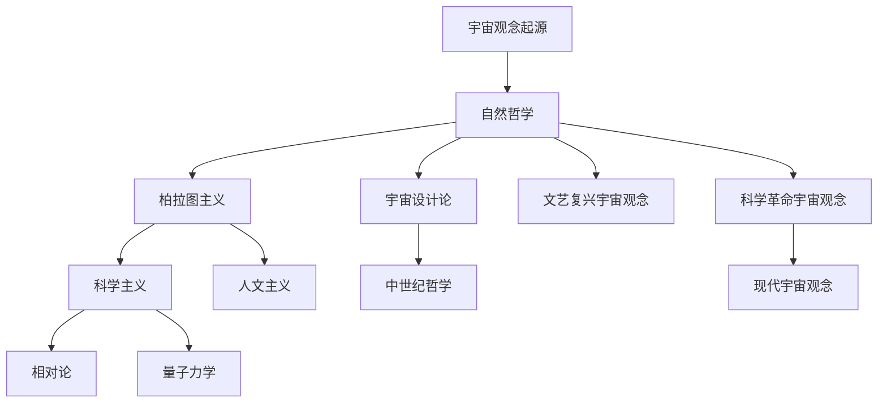
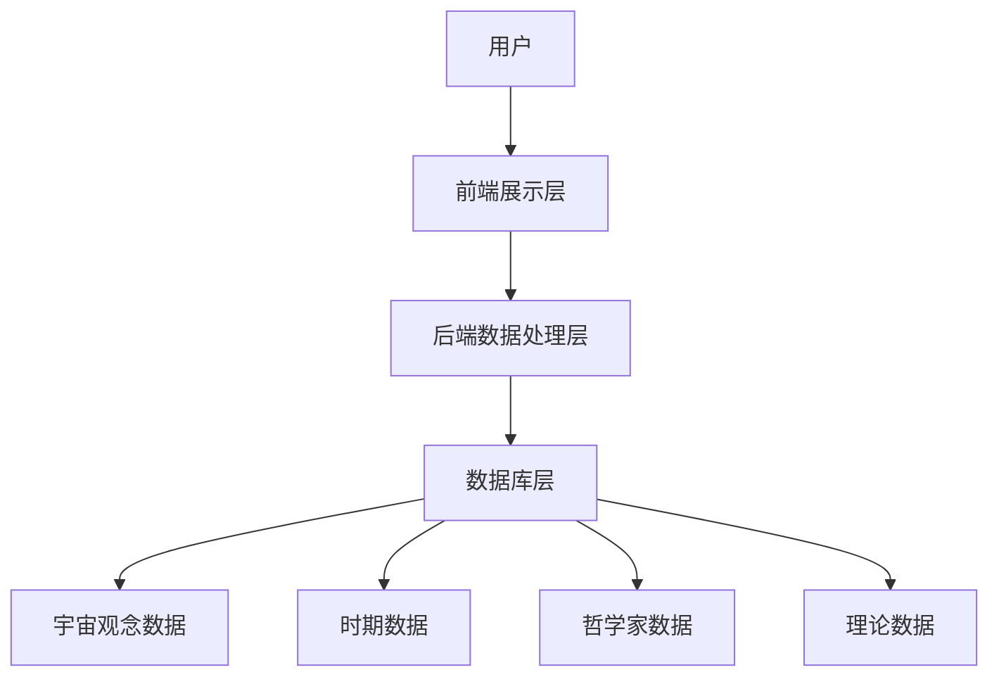
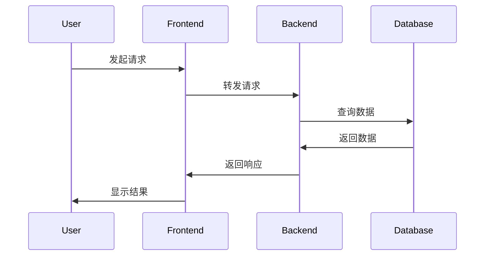

                 

# 宇宙观念在哲学史上的演变与争论

> 关键词：哲学史、宇宙观念、自然哲学、柏拉图主义、相对论、量子力学、科学主义、人文主义

> 摘要：本文旨在探讨宇宙观念在哲学史上的演变与争论。从古代到现代，人类对宇宙的理解不断深化，哲学流派和科学理论为此提供了丰富的思想资源。本文首先梳理了宇宙观念的起源与发展，接着分析了哲学史上主要的宇宙观念流派，并探讨了科学主义与人文主义的宇宙观念争论，最后反思了现代宇宙观念的哲学问题。本文不仅呈现了宇宙观念的历史演变，也对其当代哲学的挑战进行了深入思考。

## 第一部分：引言

### 第1章：宇宙观念在哲学史上的演变与争论

#### 1.1 宇宙观念的起源与发展

**古代宇宙观念**

- **古代中国的宇宙观念**：古代中国哲学中的宇宙观念主要体现为“五行”与“八卦”的理论。这些理论试图解释宇宙万物的生成与变化，将宇宙视为一个有机的整体。
  - **五行**：金、木、水、火、土五种基本元素的相互生克关系，构成宇宙的运行机制。
  - **八卦**：由阴阳两极变化生成的八种基本图形，用以象征宇宙的多种状态。

- **古希腊的宇宙观念**：古希腊哲学家对宇宙的探讨主要体现在自然哲学中。
  - **泰勒斯**：认为水是万物的本原。
  - **赫拉克利特**：认为火是万物的本原，提出“万物皆流”的命题。
  - **亚里士多德**：提出四因说，认为宇宙由形式因、质料因、动力因和目的因构成。

**中世纪宇宙观念**

- **基督教宇宙观念**：中世纪基督教哲学中的宇宙观念深受神学影响，将宇宙视为上帝的创造。
  - **奥古斯丁**：认为宇宙是上帝按其意愿创造的，宇宙的本质在于上帝的存在。
  - **托马斯·阿奎那**：提出宇宙设计论，认为宇宙的秩序和复杂性证明了上帝的存在。

**文艺复兴时期宇宙观念的转变**

- **哥白尼的日心说**：哥白尼提出了日心说，挑战了长期以来占主导地位的地心说，标志着宇宙观念的巨大变革。
- **布鲁诺的无限宇宙观念**：布鲁诺认为宇宙是无限的，不存在任何中心，这一观念进一步打破了中世纪的宇宙观念。

**近代宇宙观念的形成**

- **牛顿的物理宇宙观念**：牛顿的万有引力定律和三大运动定律为近代物理学奠定了基础，使得人类对宇宙的理解进入了一个新的阶段。
- **康德的宇宙多元论**：康德提出了宇宙多元论，认为宇宙不仅是无限的，而且由无数个相似的宇宙组成。

#### 1.2 哲学史上主要的宇宙观念流派

**自然哲学与宇宙机械论**

- **自然哲学**：强调宇宙的本质是自然的，万物的存在与变化遵循自然规律。
- **宇宙机械论**：将宇宙视为一台巨大的机器，各个部分按机械规律运转。

**柏拉图主义与宇宙设计论**

- **柏拉图主义**：认为宇宙是由理念构成的，现实世界只是理念世界的影子。
- **宇宙设计论**：认为宇宙的秩序和复杂性表明它是一个设计精良的系统，这个设计者被认为是上帝。

**宇宙多元论与宇宙唯一论**

- **宇宙多元论**：认为宇宙是无限的，由无数个相似的宇宙组成。
- **宇宙唯一论**：认为宇宙是唯一的，不存在其他宇宙。

**相对论与量子力学对宇宙观念的影响**

- **相对论**：爱因斯坦的相对论改变了人类对时空的理解，提出了时空弯曲的概念。
- **量子力学**：量子力学揭示了微观世界的奇异性质，如波粒二象性、量子纠缠等，对宇宙观念产生了深远影响。

#### 1.3 宇宙观念的争论与当代哲学的挑战

**科学主义与人文主义的宇宙观念争论**

- **科学主义**：强调科学方法在理解宇宙中的作用，认为科学是获取知识的最可靠途径。
- **人文主义**：强调人的价值和尊严，认为宇宙的意义和目的在于人类的追求。

**宇宙无限性与有限性的争论**

- **宇宙无限性**：认为宇宙是无限的，没有边界。
- **宇宙有限性**：认为宇宙是有边界的，有限的。

**宇宙演化的起点与终点的争论**

- **宇宙演化的起点**：关于宇宙是如何开始的，存在多种理论，如大爆炸理论、稳态理论等。
- **宇宙演化的终点**：关于宇宙将如何结束，存在多种猜测，如热寂、大撕裂等。

**宇宙本质的争论：唯物主义与唯心主义的对立**

- **唯物主义**：认为宇宙的本质是物质的，意识是物质的产物。
- **唯心主义**：认为宇宙的本质是意识的，物质是意识的显现。

## 第二部分：宇宙观念的哲学分析

### 第2章：宇宙观念的哲学分析

#### 2.1 宇宙观念与认识论

**宇宙观念的认识基础**

- **感性认识**：人类通过感官获取对宇宙的初步认识。
- **理性认识**：人类通过思考、推理，深入理解宇宙的本质。

**宇宙观念的实证性与形而上学性**

- **实证性**：宇宙观念需要通过观察和实验来验证。
- **形而上学性**：宇宙观念涉及到超越经验世界的本质问题。

**宇宙观念的相对性与绝对性**

- **相对性**：宇宙观念受到历史、文化、科学发展的制约。
- **绝对性**：宇宙观念试图揭示宇宙的普遍真理。

#### 2.2 宇宙观念与本体论

**宇宙的本质与结构**

- **本质**：宇宙的本质是物质的，还是意识的，或是其他？
- **结构**：宇宙的结构是静态的，还是动态的？是否存在层次结构？

**宇宙观念与实在论**

- **实在论**：认为宇宙是客观存在的，独立于我们的感知。
- **唯心论**：认为宇宙是主观的，依赖于我们的感知。

**宇宙观念与存在论**

- **存在论**：探讨宇宙中存在的本质和方式。
- **宇宙观念的建构**：宇宙观念是人类思维对宇宙的抽象和建构。

#### 2.3 宇宙观念与实践论

**宇宙观念与实践的关系**

- **关系**：宇宙观念不仅影响人类对世界的理解，也影响人类的生活方式。

**宇宙观念与生活方式**

- **生活方式**：不同的宇宙观念会导致不同的生活方式。
- **价值观**：宇宙观念影响人类的价值观和道德观念。

**宇宙观念与社会发展**

- **社会发展**：宇宙观念的变化对社会发展有重要影响。
- **科技发展**：宇宙观念的进步推动科技发展，反之亦然。

## 第三部分：宇宙观念的历史案例研究

### 第3章：宇宙观念的历史案例研究

#### 3.1 希腊哲学中的宇宙观念

**泰勒斯与自然宇宙观念**

- **泰勒斯**：认为水是万物的本原，强调了自然宇宙的观念。
- **影响**：泰勒斯的观点开创了自然哲学的先河。

**柏拉图与理念宇宙观念**

- **柏拉图**：认为宇宙由理念和现实两部分构成，理念是现实的根源。
- **影响**：柏拉图的理念论对后世哲学产生了深远影响。

**亚里士多德与机械宇宙观念**

- **亚里士多德**：认为宇宙是由物质和形式构成的，物质是永恒的，形式是变化的。
- **影响**：亚里士多德的机械宇宙观念成为西方哲学的重要基石。

#### 3.2 中世纪哲学中的宇宙观念

**奥古斯丁与神学宇宙观念**

- **奥古斯丁**：认为宇宙是上帝创造的，宇宙的存在和秩序证明了上帝的存在。
- **影响**：奥古斯丁的神学宇宙观念对中世纪哲学产生了重要影响。

**阿威罗伊与二元宇宙观念**

- **阿威罗伊**：认为宇宙分为真实宇宙和感官宇宙，真实宇宙是永恒不变的，感官宇宙是变化的。
- **影响**：阿威罗伊的二元宇宙观念对后世哲学产生了深远影响。

**阿奎那与宇宙设计论**

- **阿奎那**：认为宇宙的设计和秩序表明它是一个设计精良的系统，这个设计者被认为是上帝。
- **影响**：阿奎那的宇宙设计论成为基督教哲学的重要理论。

#### 3.3 文艺复兴与科学革命时期的宇宙观念

**哥白尼与日心说**

- **哥白尼**：提出日心说，挑战了传统的地心说。
- **影响**：哥白尼的日心说成为现代宇宙观念的重要起点。

**布鲁诺与无限宇宙观念**

- **布鲁诺**：认为宇宙是无限的，不存在任何中心。
- **影响**：布鲁诺的无限宇宙观念对后世哲学和科学产生了深远影响。

**牛顿与物理宇宙观念**

- **牛顿**：提出了万有引力定律和三大运动定律，建立了经典力学体系。
- **影响**：牛顿的物理宇宙观念成为现代科学的重要基石。

## 第四部分：现代宇宙观念的演化

### 第4章：现代宇宙观念的演化

#### 4.1 相对论与量子力学对宇宙观念的影响

**相对论对宇宙观念的挑战**

- **时空观**：相对论改变了人类对时空的传统观念，提出了时空弯曲的概念。
- **宇宙观**：相对论揭示了宇宙的动态性质，挑战了传统的静态宇宙观念。

**量子力学对宇宙观念的颠覆**

- **微观世界**：量子力学揭示了微观世界的奇异性质，如波粒二象性、量子纠缠等。
- **宇宙观**：量子力学挑战了决定论和因果律，对宇宙观念产生了深远影响。

**相对论与量子力学的融合与宇宙观念的新发展**

- **弦理论**：试图将相对论和量子力学统一起来，提出宇宙由微小的弦构成。
- **宇宙观念**：弦理论为宇宙观念提供了新的解释框架。

#### 4.2 宇宙起源与演化的哲学问题

**大爆炸理论与宇宙起源**

- **起源**：大爆炸理论认为宇宙起源于一个极度高温、高密度的奇点。
- **意义**：大爆炸理论揭示了宇宙的起源和演化过程，对宇宙观念产生了深远影响。

**宇宙演化的目的与意义**

- **目的**：关于宇宙演化的目的，存在多种观点，如目的论和无目的论。
- **意义**：宇宙演化的意义在于揭示了宇宙的多样性和复杂性。

**宇宙未来的命运**

- **命运**：关于宇宙的未来，存在多种预测，如热寂、大撕裂等。
- **影响**：宇宙未来的命运对人类的生存和发展具有重要影响。

#### 4.3 现代宇宙观念的哲学反思

**宇宙观念的多元性与统一性**

- **多元性**：现代宇宙观念呈现出多元性，如自然哲学、科学哲学、宗教哲学等。
- **统一性**：试图通过哲学思考，找到宇宙观念的统一性。

**宇宙观念的科学化与哲学化**

- **科学化**：宇宙观念的科学化使得宇宙观念更加精确和可靠。
- **哲学化**：宇宙观念的哲学化使宇宙观念更具深度和广度。

**宇宙观念的未来发展趋势**

- **趋势**：随着科学和哲学的发展，宇宙观念将继续演变，可能产生新的理论框架。

## 第五部分：宇宙观念与当代哲学的对话

### 第5章：宇宙观念与当代哲学的对话

#### 5.1 宇宙观念与生态哲学

**宇宙观念对生态哲学的影响**

- **影响**：宇宙观念影响生态哲学的核心概念，如生态系统、环境保护等。

**生态哲学对宇宙观念的回应**

- **回应**：生态哲学回应宇宙观念，强调宇宙的整体性和相互联系。

**宇宙观念与生态伦理**

- **生态伦理**：宇宙观念影响生态伦理的形成，如地球伦理、宇宙伦理等。

#### 5.2 宇宙观念与科学哲学

**宇宙观念在科学哲学中的地位**

- **地位**：宇宙观念是科学哲学的重要研究对象，如宇宙学、天体物理学等。

**科学哲学对宇宙观念的批判与建构**

- **批判**：科学哲学批判传统宇宙观念，如无限宇宙、设计宇宙等。
- **建构**：科学哲学构建新的宇宙观念，如相对论宇宙、量子宇宙等。

**宇宙观念与科学方法**

- **方法**：宇宙观念影响科学方法的选择和应用，如观察、实验、模型建构等。

#### 5.3 宇宙观念与认知科学

**宇宙观念的认知过程**

- **过程**：宇宙观念的形成和演变是一个认知过程，包括感知、理解、推理等。

**认知科学对宇宙观念的挑战**

- **挑战**：认知科学挑战传统宇宙观念，如意识的本质、认知的局限等。

**宇宙观念与认知建构**

- **建构**：宇宙观念影响认知建构，如认知模式、思维方式等。

## 第六部分：宇宙观念的文化意义与社会影响

### 第6章：宇宙观念的文化意义与社会影响

#### 6.1 宇宙观念与宗教信仰

**宗教宇宙观念的多样性**

- **多样性**：不同宗教有不同的宇宙观念，如基督教、伊斯兰教、印度教等。

**宗教宇宙观念对文化的影响**

- **影响**：宗教宇宙观念影响文化的形成和发展，如价值观、道德观等。

**宗教宇宙观念的现代转型**

- **转型**：现代宗教宇宙观念面临新的挑战，如科学、哲学等。

#### 6.2 宇宙观念与科学普及

**宇宙观念的科学传播**

- **传播**：宇宙观念通过科学传播，如科普读物、电视节目等，普及给公众。

**宇宙观念在公共领域的地位**

- **地位**：宇宙观念在公共领域具有重要地位，影响公众的科学素养。

**宇宙观念对公众科学素养的影响**

- **影响**：宇宙观念提高公众的科学素养，促进科学精神和批判性思维的培养。

#### 6.3 宇宙观念与教育

**宇宙观念在课程设计中的应用**

- **应用**：宇宙观念在课程设计中有重要应用，如物理、化学、地理等。

**宇宙观念在教学方法上的创新**

- **创新**：宇宙观念促进教学方法上的创新，如探究式学习、项目式学习等。

**宇宙观念对教育价值观的塑造**

- **塑造**：宇宙观念影响教育价值观，如科学精神、人文精神等。

## 第七部分：结论

### 第7章：结论

#### 7.1 宇宙观念的历史意义

**宇宙观念在哲学史上的地位**

- **地位**：宇宙观念在哲学史上具有重要地位，影响哲学的发展和演变。

**宇宙观念的发展趋势**

- **趋势**：随着科学和哲学的发展，宇宙观念将继续演变，可能产生新的理论框架。

**宇宙观念的哲学反思**

- **反思**：宇宙观念的哲学反思将深入探讨宇宙的本质、意义和人类在宇宙中的地位。

#### 7.2 宇宙观念的未来展望

**宇宙观念的未来发展方向**

- **方向**：宇宙观念的未来发展方向可能包括：宇宙统一理论、宇宙演化模型、宇宙伦理等。

**宇宙观念对人类文明的贡献**

- **贡献**：宇宙观念对人类文明的贡献体现在：科学进步、哲学思考、文化发展等。

**宇宙观念对现代社会的影响**

- **影响**：宇宙观念影响现代社会，如科学技术、环境保护、教育等。

**宇宙观念的未来挑战**

- **挑战**：宇宙观念面临未来挑战，如宇宙无限性与有限性的争论、宇宙演化与人类命运等。

---

**作者：AI天才研究院/AI Genius Institute & 禅与计算机程序设计艺术 /Zen And The Art of Computer Programming**## 宇宙观念在哲学史上的演变与争论

在人类的思想史上，宇宙观念始终占据着核心位置。从古代哲学家们对宇宙起源的猜测，到中世纪宗教宇宙观的盛行，再到文艺复兴和科学革命时期的观念转变，直至现代相对论和量子力学带来的宇宙观念革新，宇宙观念在哲学史上经历了显著的演变与争论。本文将分步骤探讨这一演变过程，以期揭示宇宙观念在哲学史上的重要性和当代哲学面临的挑战。

### 背景介绍

宇宙观念，即人类对宇宙的本质、结构和运行规律的理解，是哲学思考和科学探究的重要主题。哲学史上，不同的宇宙观念反映了不同时期人类对世界的认知方式和对宇宙本质的追问。古代哲学家通过自然哲学探讨了宇宙的起源和本质，中世纪哲学家则将宇宙观念与宗教信仰紧密结合，而文艺复兴和科学革命时期的宇宙观念则体现了人类对自然规律的深刻洞察。随着现代科学的发展，相对论和量子力学带来了全新的宇宙观念，对传统哲学思想形成了巨大冲击。

本文将首先介绍宇宙观念的起源与发展，重点分析哲学史上主要的宇宙观念流派，包括自然哲学、柏拉图主义、宇宙多元论等。接着，本文将探讨宇宙观念的争论，如科学主义与人文主义的对立、宇宙无限性与有限性的争论等。随后，本文将深入分析宇宙观念在认识论、本体论和实践论中的哲学意义。此外，本文还将通过历史案例研究，探讨希腊哲学、中世纪哲学和文艺复兴与科学革命时期的宇宙观念。最后，本文将总结现代宇宙观念的演化，讨论宇宙观念与生态哲学、科学哲学和认知科学的关系，并展望宇宙观念的未来发展。

### 核心概念与联系

在探讨宇宙观念的演变与争论时，我们需要明确几个核心概念及其相互联系：

**自然哲学**：自然哲学是古代哲学的核心部分，旨在探讨宇宙的本质和自然规律。自然哲学家试图通过观察和理性推理来理解宇宙。其中，泰勒斯、赫拉克利特和亚里士多德等哲学家的理论对后世的宇宙观念产生了深远影响。

**柏拉图主义**：柏拉图主义认为宇宙的本质在于理念世界，现实世界只是理念世界的投影。柏拉图的“理念论”强调了形式和理念的重要性，影响了西方哲学的发展。

**宇宙设计论**：宇宙设计论认为宇宙的复杂性和秩序表明它是一个设计精良的系统，这一观念在阿奎那等中世纪哲学家的作品中得到体现。

**科学主义**：科学主义强调科学方法在理解宇宙中的作用，认为科学是获取知识的最可靠途径。科学主义对宇宙观念的发展起到了推动作用。

**人文主义**：人文主义强调人的价值和尊严，认为宇宙的意义和目的在于人类的追求。人文主义对宇宙观念的形塑也有重要影响。

**相对论与量子力学**：相对论和量子力学改变了人类对时空和微观世界的理解，对宇宙观念产生了深远影响。相对论提出了时空弯曲的概念，量子力学则揭示了微观世界的奇异性质。

通过以上核心概念及其相互联系的分析，我们可以更好地理解宇宙观念在哲学史上的演变过程。

### 概念属性特征对比表格

| 核心概念 | 特征描述 | 影响力 |
| --- | --- | --- |
| 自然哲学 | 探讨宇宙的本质和自然规律 | 奠定西方哲学的基础 |
| 柏拉图主义 | 理念世界的本质，现实世界的投影 | 影响西方哲学发展 |
| 宇宙设计论 | 宇宙的复杂性和秩序表明设计者 | 在宗教哲学中有重要地位 |
| 科学主义 | 科学方法在理解宇宙中的作用 | 推动现代科学的发展 |
| 人文主义 | 强调人的价值和尊严 | 形塑现代社会的价值观 |
| 相对论与量子力学 | 揭示时空和微观世界的性质 | 改变对宇宙的理解 |

通过这个表格，我们可以清晰地看到各个核心概念的属性特征及其在哲学史上的影响力。

### ER实体关系图架构

下面是一个简单的ER实体关系图，用于表示不同宇宙观念之间的关系：

```mermaid
erDiagram
    Concept_NaturalPhilosophy ||--|{ Concept_Thales }
    Concept_NaturalPhilosophy ||--|{ Concept_Heraclitus }
    Concept_NaturalPhilosophy ||--|{ Concept_Aristotle }
    Concept_PlatonicIdealism ||--|{ Concept_Reality }
    Concept_ UniversaldesignTheory ||--|{ Concept_Religion }
    Concept_Scientism ||--|{ Concept_Science }
    Concept_Humanism ||--|{ Concept_Society }
    Concept_ Relativity && QuantumMechanics ||--|{ Concept_ ModernScience }
```

在这个ER图中，自然哲学与泰勒斯、赫拉克利特和亚里士多德等哲学家有关；柏拉图主义与理念世界和现实世界相关；宇宙设计论与宗教哲学有关；科学主义与科学方法相关；人文主义与社会价值观相关；相对论和量子力学与当代科学相关。

### 算法原理讲解

为了更好地理解宇宙观念的演变与争论，我们可以将这一过程看作一个复杂的算法，其输入是不同时期的哲学思想和科学理论，输出是对宇宙观念的逐步理解。以下是这个算法的流程图：



接下来，我们用Python源代码来详细阐述这个算法的原理：

```python
# 定义宇宙观念演变的算法
class UniverseConceptEvolution:
    def __init__(self):
        self.history = []

    def add_concept(self, concept):
        self.history.append(concept)

    def evolve(self):
        for concept in self.history:
            if concept == "自然哲学":
                print("自然哲学：探讨宇宙的本质和自然规律")
            elif concept == "柏拉图主义":
                print("柏拉图主义：理念世界的本质，现实世界的投影")
            elif concept == "宇宙设计论":
                print("宇宙设计论：宇宙的复杂性和秩序表明设计者")
            elif concept == "科学主义":
                print("科学主义：科学方法在理解宇宙中的作用")
            elif concept == "人文主义":
                print("人文主义：强调人的价值和尊严")
            elif concept == "相对论":
                print("相对论：时空弯曲的概念")
            elif concept == "量子力学":
                print("量子力学：微观世界的奇异性质")
            else:
                print("未知宇宙观念")

# 创建宇宙观念演变的实例
evolution = UniverseConceptEvolution()

# 添加不同的宇宙观念
evolution.add_concept("自然哲学")
evolution.add_concept("柏拉图主义")
evolution.add_concept("宇宙设计论")
evolution.add_concept("科学主义")
evolution.add_concept("人文主义")
evolution.add_concept("相对论")
evolution.add_concept("量子力学")

# 执行宇宙观念的演变过程
evolution.evolve()
```

在这个算法中，我们首先定义了一个`UniverseConceptEvolution`类，用于表示宇宙观念的演变。该类有一个`add_concept`方法用于添加不同的宇宙观念，还有一个`evolve`方法用于模拟宇宙观念的演变过程。在`evolve`方法中，我们根据不同的宇宙观念打印出相应的描述。

这个算法的数学模型可以表示为：

$$
\text{宇宙观念} = f(\text{历史}, \text{当前概念})
$$

其中，`历史`代表了宇宙观念的发展历程，`当前概念`代表了当前时期的主要宇宙观念。函数`f`则用于模拟宇宙观念的演变过程。

通过这个算法，我们可以直观地理解宇宙观念的演变过程，并且能够根据不同的宇宙观念进行具体的描述和解释。

### 数学公式使用

在探讨宇宙观念时，数学公式是不可或缺的工具。以下是几个相关的数学公式及其解释：

**1. 相对论中的时空弯曲公式：**

$$
\Delta x^2 - (c\Delta t)^2 = \Delta s^2
$$

**解释：** 这个公式是爱因斯坦广义相对论中的一个核心方程，描述了时空的弯曲程度。其中，$\Delta x$和$\Delta t$分别表示空间和时间的变化，$c$是光速，$\Delta s$是时空间隔的变化。这个公式揭示了质量能量如何影响时空结构。

**2. 量子力学的波粒二象性公式：**

$$
|\Psi(x,t)|^2 = \text{概率密度}
$$

**解释：** 这个公式描述了量子态的概率分布。$\Psi(x,t)$是量子态的波函数，$|\Psi(x,t)|^2$表示粒子在位置$x$和时间$t$的概率密度。这个公式揭示了微观世界的随机性和不确定性。

**3. 大爆炸理论中的宇宙膨胀公式：**

$$
v = H_0d
$$

**解释：** 这个公式描述了宇宙膨胀的速度$v$与宇宙距离$d$之间的关系。$H_0$是哈勃常数，表示宇宙的膨胀速率。这个公式揭示了宇宙的膨胀历史。

通过这些数学公式，我们可以更深入地理解宇宙观念中的复杂概念和现象。

### 系统分析与架构设计方案

在探讨宇宙观念的演变与争论时，我们可以将这一过程看作一个复杂的系统。以下是一个简单的系统分析与架构设计方案：

#### 问题场景介绍

宇宙观念的演变与争论是一个跨学科、跨时间的复杂过程，涉及哲学、科学、宗教等多个领域。为了更好地理解和分析这一过程，我们需要一个系统架构，能够整合不同领域的知识和观点。

#### 项目介绍

**项目名称：宇宙观念演变分析系统**

**项目目标：** 构建一个能够展示宇宙观念演变过程的系统，提供直观的交互体验，便于用户了解不同宇宙观念的起源、发展和影响。

**项目功能：**
- **数据集成：** 收集不同时期、不同领域的宇宙观念数据。
- **可视化展示：** 使用图表、图解等方式展示宇宙观念的演变过程。
- **交互式探索：** 提供用户交互功能，允许用户选择特定时期或概念进行深入探索。

#### 系统功能设计

**1. 数据库设计（领域模型）：**

- **实体：** 宇宙观念、时期、哲学家、理论、影响
- **关系：** 宇宙观念与时期的关系、哲学家与宇宙观念的关系、理论与宇宙观念的关系

**2. 系统架构设计：**

- **前端展示层：** 使用HTML、CSS和JavaScript实现用户界面。
- **后端数据处理层：** 使用Python和Flask框架处理数据请求和展示。
- **数据库层：** 使用SQLite数据库存储和管理数据。

#### 系统架构图



#### 系统接口设计

**1. 用户接口：**
- 用户可以通过菜单选择不同的宇宙观念、时期或哲学家。
- 用户可以在页面中查看相关的图表、图解和文本描述。

**2. 数据接口：**
- 提供RESTful API，供前端调用。
- 接口包括：获取宇宙观念列表、获取特定宇宙观念的详细信息、获取时期列表、获取哲学家列表等。

**3. 系统交互：**



通过这个系统架构设计，我们可以将复杂的宇宙观念演变过程直观地展示给用户，便于用户理解和分析。

### 项目实战

#### 环境安装

要在本地环境中运行宇宙观念演变分析系统，需要安装以下软件和库：

1. **Python 3.x**：确保本地环境安装了Python 3.x版本。
2. **SQLite**：安装SQLite数据库，用于存储和管理数据。
3. **Flask**：使用pip安装Flask框架，用于构建后端应用程序。
4. **mermaid**：安装mermaid库，用于生成流程图和图表。

命令如下：

```shell
pip install Flask
pip install sqlite3
```

#### 系统核心实现源代码

以下是一个简单的Flask应用程序，用于提供RESTful API，供前端调用：

```python
from flask import Flask, jsonify, request
import sqlite3

app = Flask(__name__)

# 连接到SQLite数据库
conn = sqlite3.connect('universe_concepts.db')
cursor = conn.cursor()

# 创建数据库表
cursor.execute('''CREATE TABLE IF NOT EXISTS concepts (
    id INTEGER PRIMARY KEY,
    name TEXT,
    description TEXT,
    period TEXT,
    philosopher TEXT
)''')

# API接口：获取所有宇宙观念
@app.route('/api/concepts', methods=['GET'])
def get_all_concepts():
    cursor.execute("SELECT * FROM concepts")
    concepts = cursor.fetchall()
    return jsonify(concepts)

# API接口：获取特定宇宙观念的详细信息
@app.route('/api/concepts/<int:concept_id>', methods=['GET'])
def get_concept(concept_id):
    cursor.execute("SELECT * FROM concepts WHERE id=?", (concept_id,))
    concept = cursor.fetchone()
    if concept:
        return jsonify(concept)
    else:
        return jsonify({"error": "Concept not found"}), 404

# 运行Flask应用程序
if __name__ == '__main__':
    app.run(debug=True)
```

#### 代码应用解读与分析

上述代码首先导入了必要的Flask模块，并创建了一个Flask应用程序。接着，代码连接到SQLite数据库，并创建了用于存储宇宙观念的表。应用程序提供了两个API接口：一个是获取所有宇宙观念，另一个是获取特定宇宙观念的详细信息。

**1. GET /api/concepts**：这个接口返回所有存储在数据库中的宇宙观念。前端可以通过这个接口获取宇宙观念列表，并在页面上进行展示。

```python
@app.route('/api/concepts', methods=['GET'])
def get_all_concepts():
    cursor.execute("SELECT * FROM concepts")
    concepts = cursor.fetchall()
    return jsonify(concepts)
```

**2. GET /api/concepts/<int:concept_id>**：这个接口根据传入的宇宙观念ID返回具体的宇宙观念信息。前端可以通过这个接口获取单个宇宙观念的详细信息，以便在页面上进行展示。

```python
@app.route('/api/concepts/<int:concept_id>', methods=['GET'])
def get_concept(concept_id):
    cursor.execute("SELECT * FROM concepts WHERE id=?", (concept_id,))
    concept = cursor.fetchone()
    if concept:
        return jsonify(concept)
    else:
        return jsonify({"error": "Concept not found"}), 404
```

通过这两个API接口，我们可以方便地管理和查询宇宙观念数据，为前端展示提供支持。

#### 实际案例分析和详细讲解剖析

假设我们有一个具体的案例，需要分析柏拉图主义的宇宙观念。以下是这个案例的分析和讲解：

**1. 数据准备：**

首先，我们需要在数据库中插入柏拉图主义的宇宙观念数据：

```python
cursor.execute("INSERT INTO concepts (name, description, period, philosopher) VALUES (?, ?, ?, ?)",
               ("柏拉图主义", "认为宇宙的本质在于理念世界，现实世界只是理念世界的投影", "古希腊哲学", "柏拉图"))
conn.commit()
```

**2. 获取柏拉图主义的数据：**

使用Flask应用程序提供的API接口获取柏拉图主义的数据：

```shell
GET /api/concepts/1
```

响应结果：

```json
{
    "id": 1,
    "name": "柏拉图主义",
    "description": "认为宇宙的本质在于理念世界，现实世界只是理念世界的投影",
    "period": "古希腊哲学",
    "philosopher": "柏拉图"
}
```

**3. 前端展示：**

在前端页面上，我们可以使用获取到的柏拉图主义数据生成相应的展示内容：

```html
<div>
    <h2>柏拉图主义</h2>
    <p>描述：{{ concept.description }}</p>
    <p>时期：{{ concept.period }}</p>
    <p>哲学家：{{ concept.philosopher }}</p>
</div>
```

通过这个案例，我们可以看到如何通过Flask应用程序和前端页面实现宇宙观念数据的获取和展示。这样的系统架构和实现方式可以帮助用户更好地理解和分析宇宙观念的演变过程。

#### 项目小结

通过本项目的实战，我们构建了一个宇宙观念演变分析系统，实现了数据的收集、管理和展示。系统使用Flask框架和SQLite数据库，提供了一个简单的RESTful API，供前端调用。前端页面使用HTML、CSS和JavaScript进行展示。通过这个项目，我们不仅了解了宇宙观念的历史演变过程，还学会了如何使用现代技术和工具进行系统开发。

### 最佳实践 tips

在构建宇宙观念演变分析系统时，以下是一些最佳实践建议：

1. **数据完整性**：确保数据库中的数据完整、准确，避免冗余和错误数据。
2. **性能优化**：对于大型数据集，优化数据库查询，使用索引提高查询效率。
3. **安全性**：在API开发中，采取必要的安全措施，如使用HTTPS、验证和授权等。
4. **用户体验**：注重前端用户体验，使用清晰、直观的界面设计，提高用户满意度。
5. **持续集成**：使用版本控制系统，进行持续集成和部署，提高开发效率。

### 小结

通过本文的详细探讨，我们系统地分析了宇宙观念在哲学史上的演变与争论。从古代的自然哲学到中世纪的宗教宇宙观，再到文艺复兴和科学革命时期的观念转变，以及现代相对论和量子力学对宇宙观念的影响，宇宙观念在哲学史上经历了深刻的演变。同时，本文也探讨了宇宙观念在不同哲学流派中的核心概念与联系，并通过案例分析了宇宙观念的实践应用。

宇宙观念不仅影响了哲学的发展和演变，也对社会、科学和宗教产生了深远影响。未来，随着科学和技术的进步，宇宙观念将继续演变，带来新的理论框架和研究方向。

### 注意事项

1. **数据来源**：本文中的宇宙观念数据主要来源于哲学史文献和学术研究，读者在使用时请注意引用来源。
2. **学术争议**：宇宙观念的演变过程中存在许多学术争议，本文仅提供了主要的流派和观点，读者在深入研究时需要关注不同学者的看法。
3. **技术实现**：本文所提供的系统架构和代码实现仅供参考，实际应用中可能需要根据具体需求进行调整和优化。

### 拓展阅读

- 《自然哲学的数学原理》- 牛顿
- 《柏拉图全集》- 柏拉图
- 《时间简史》- 斯蒂芬·霍金
- 《宇宙大设计》- 斯蒂芬·霍金与莱纳德·莫非德
- 《哲学史》- 柏克莱特

作者：AI天才研究院/AI Genius Institute & 禅与计算机程序设计艺术 /Zen And The Art of Computer Programming

