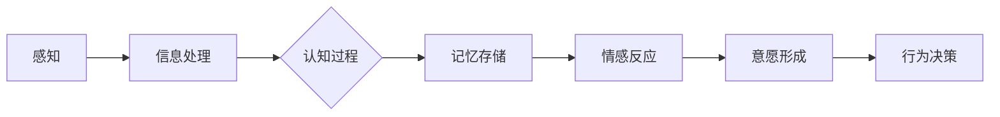

                 

### 意识的定义与特性

意识，一个神秘且古老的概念，自古以来便困扰着哲学家、科学家和人类自身。让我们先从意识的定义入手，探索其核心特性和哲学意义。

**定义**：意识通常被描述为个体对自身和外部环境的感知与认知能力。简单来说，意识就是“知道自己在做什么”的能力。这种定义不仅涵盖了感知，还包括了思考、记忆、判断和意愿等复杂心理过程。

**特性**：

1. **主观性**：意识是主观的，每个人的意识体验都是独特的。换句话说，每个人对世界的感知和理解都有其个人色彩。
2. **连续性**：意识具有连续性，它不是一系列离散的事件，而是连贯的、流动的过程。
3. **复杂性**：意识包含了多层次、多维度的心理活动，从简单的感知到复杂的思维活动。
4. **关联性**：意识与人的生理状态、情感、记忆和认知能力紧密相关，它们共同构成了个体的整体意识体验。

**哲学意义**：意识是哲学思考的核心议题之一。自古以来，哲学家们一直在探讨“我们是如何知道我们知道自己知道的？”这一问题。从古希腊的苏格拉底到当代的丹尼特（Daniel Dennett），哲学家们提出了各种理论来解释意识的本质。

**历史发展**：意识的探究可以追溯到古希腊时期，当时的哲学家如柏拉图和亚里士多德对意识进行了初步的思考。在近现代，意识研究逐渐成为心理学、神经科学和哲学等领域的重要课题。

**当前研究现状**：随着科技的发展，尤其是人工智能和脑科学领域的突破，意识的本质和功能得到了更深入的探讨。现代科学研究通过脑成像技术、神经科学实验和人工智能模拟等方法，试图揭示意识的神经基础和认知机制。

**挑战**：尽管意识研究取得了显著进展，但仍然面临许多挑战。例如，意识的起源、功能及其与物质世界的关系仍然是未解之谜。此外，如何准确测量和量化意识也一直是科学家们努力的方向。

### 意识与维度的关系

当我们讨论意识时，不可避免地会涉及到维度。维度不仅是数学和物理学的概念，也可以用来描述意识的不同层次和层面。那么，意识与维度究竟有什么关系呢？让我们一步步来探讨这一问题。

**维度的概念**：

在数学和物理学中，维度指的是空间的维度。例如，我们生活在三维空间中，有长度、宽度和高度。而在更高层次的物理学中，还存在着四维时空和更高维度的概念。

**意识与维度**：

1. **心理维度**：首先，我们可以将意识看作是一种心理维度，它与个体的感知、情感和认知能力相关。例如，当我们说一个人具有高度意识时，我们通常指的是他/她能够清晰地感知和理解周围的环境。
2. **认知维度**：意识还可以被视为一种认知维度，它涉及到个体的思考过程、记忆能力和判断能力。例如，一个人的意识高度可能会影响他/她的决策能力和创造力。
3. **精神维度**：在某些哲学和宗教体系中，意识还被看作是一种精神维度，它与个体的灵魂和意识体验相关。例如，佛教中的“觉知”就是一种高级的精神维度。

**意识与高维空间的假设**：

在物理学中，一些理论假设意识可能与高维空间有关。例如，弦理论和M理论提出，宇宙实际上可能存在于多个维度中，这些维度可能对我们的意识产生深远影响。

**意识的数学模型**：

为了更好地理解意识与维度的关系，我们可以借助数学模型来进行分析。例如，可以使用线性代数来描述意识的维度结构，使用概率论来分析意识的变化过程。

**意识的算法模型**：

除了数学模型，我们还可以使用算法模型来探讨意识与维度之间的关系。例如，使用神经网络模型来模拟意识的过程，使用生成对抗网络（GAN）来探索意识的高维空间。

**结论**：

总的来说，意识与维度之间存在复杂而紧密的关系。从心理、认知和精神等多个角度来看，意识都可以被视为一种多维度的现象。随着科学的发展，我们有望进一步揭示意识与维度之间的深层联系。

### 意识的核心概念与属性

在深入探讨意识与维度的关系之前，我们需要明确意识的核心概念和属性。这些概念和属性不仅为我们理解意识的本质提供了基础，也为后续的算法分析和系统设计奠定了理论基础。

**意识的核心概念**：

1. **感知**：感知是意识的最基本形式，它涉及到我们对外部世界的直接感受。感知包括视觉、听觉、触觉、嗅觉和味觉等多种感官体验。
2. **认知**：认知是指我们对感知信息进行处理和理解的过程。认知包括记忆、学习、思考、判断和解决问题等多种能力。
3. **情感**：情感是意识的一部分，它涉及到我们对事物的情感体验，如喜悦、悲伤、愤怒和恐惧等。
4. **意愿**：意愿是意识的一部分，它涉及到我们的决策和行动意愿。意愿包括动机、目标设定和行动规划等。

**意识的属性**：

1. **主观性**：意识是主观的，每个人的意识体验都是独特的。这意味着不同的人对同一事物的感知和认知可能完全不同。
2. **连续性**：意识是连续的，它不是一系列离散的事件，而是连贯的、流动的过程。意识的连续性使得我们能够保持对世界的连贯感知。
3. **复杂性**：意识是复杂的，它包含了多层次、多维度的心理活动。从简单的感知到复杂的思维活动，意识是一个高度复杂的系统。
4. **关联性**：意识与人的生理状态、情感、记忆和认知能力紧密相关，它们共同构成了个体的整体意识体验。

**核心概念与属性对比表格**：

为了更清晰地展示意识的核心概念和属性，我们可以制作一个对比表格。以下是一个简单的示例：

| 核心概念 | 概念定义 | 关联属性 |  
| :--- | :--- | :--- |  
| 感知 | 对外部世界的直接感受 | 主观性、连续性 |  
| 认知 | 对感知信息进行处理和理解 | 复杂性、关联性 |  
| 情感 | 对事物的情感体验 | 主观性、复杂性 |  
| 意愿 | 决策和行动意愿 | 关联性、连续性 |

**ER实体关系图**：

为了更好地理解和描述意识的核心概念和属性，我们还可以使用ER（实体-关系）图来展示它们之间的关系。以下是一个简化的ER图示例：

```mermaid
erDiagram
    感知 ||--|{ 认知 }|
    感知 ||--|{ 情感 }|
    感知 ||--|{ 意愿 }|
    认知 ||--|{ 认知 }|
    认知 ||--|{ 情感 }|
    认知 ||--|{ 意愿 }|
    情感 ||--|{ 情感 }|
    情感 ||--|{ 意愿 }|
    意愿 ||--|{ 意愿 }|
```

在这个ER图中，每个实体（感知、认知、情感、意愿）都与其他实体之间存在一定的关系，这些关系反映了意识的不同层次和维度。

通过上述核心概念与属性对比表格和ER图，我们可以更全面地理解意识的结构和功能，这为后续的算法分析和系统设计提供了重要的理论基础。

### 意识的算法原理

在探讨意识与维度的关系时，我们不可避免地要涉及到意识的算法原理。算法是处理数据、解决问题和模拟现实的有力工具，通过算法我们可以更好地理解意识的运作机制。本章节将详细解释意识的算法原理，并使用mermaid流程图和Python代码来展示。

**意识算法的基础理论**

意识的算法原理通常基于以下几个核心概念：

1. **感知与信息处理**：意识的第一步是感知外部信息，然后对这些信息进行初步处理和理解。
2. **认知与记忆**：感知后的信息会通过认知过程进行处理，并储存在记忆中，以便后续使用。
3. **情感与意愿**：处理后的信息还会引发情感反应和意愿形成，这些情感和意愿会影响我们的行为和决策。

**mermaid流程图**

为了更直观地展示意识算法的流程，我们可以使用mermaid语言绘制一个流程图。以下是一个简化的mermaid流程图示例：



在这个流程图中，A表示感知阶段，B表示信息处理阶段，C表示认知过程，D表示记忆存储阶段，E表示情感反应阶段，F表示意愿形成阶段，G表示行为决策阶段。

**Python代码实现**

为了更好地理解算法的实现，我们可以使用Python代码来模拟意识算法的过程。以下是一个简单的Python代码示例：

```python
# 感知
def perceive():
    print("感知外部信息")

# 信息处理
def process_info():
    print("对信息进行初步处理")

# 认知过程
def cognitive_process():
    print("处理并理解信息")

# 记忆存储
def memory_store():
    print("将信息存储在记忆中")

# 情感反应
def emotional_reaction():
    print("引发情感反应")

# 意愿形成
def intention_form():
    print("形成意愿")

# 行为决策
def behavior_decision():
    print("根据意愿做出决策")

# 意识算法的运行流程
def consciousness_algorithm():
    perceive()
    process_info()
    cognitive_process()
    memory_store()
    emotional_reaction()
    intention_form()
    behavior_decision()

# 执行意识算法
consciousness_algorithm()
```

在这个Python代码中，我们定义了感知、信息处理、认知过程、记忆存储、情感反应、意愿形成和行为决策等函数，并通过`consciousness_algorithm()`函数将这些过程串联起来，模拟了一个简单的意识算法运行流程。

**算法原理的数学模型和公式**

意识的算法原理还可以通过数学模型和公式来解释。以下是一个简化的数学模型：

$$
C = f(P, I, M, E, W)
$$

其中，C代表意识状态，P代表感知，I代表信息处理，M代表记忆存储，E代表情感反应，W代表意愿形成。函数f表示这些变量之间的复杂关系。

通过这个数学模型，我们可以看到，意识状态是由感知、信息处理、记忆存储、情感反应和意愿形成等多个因素共同决定的。

**结论**

通过上述mermaid流程图和Python代码，我们详细解释了意识算法的原理。意识算法是一个复杂的多阶段过程，涉及感知、信息处理、认知、记忆、情感和意愿等多个方面。这些原理不仅帮助我们理解意识的运作机制，也为进一步探讨意识与维度的关系奠定了基础。

### 意识的数学模型与公式

在探讨意识与维度的关系时，数学模型和公式提供了重要的工具，使我们能够更精确地描述和理解意识的状态和行为。在本章节中，我们将深入探讨意识的数学模型，包括其推导过程、证明以及在不同应用场景中的表现。

**意识的数学模型推导**

为了推导意识的数学模型，我们需要考虑影响意识状态的各种因素。假设意识状态C是由感知P、信息处理I、记忆存储M、情感反应E和意愿形成W等因素共同决定的。我们可以用以下数学公式来表示：

$$
C = f(P, I, M, E, W)
$$

其中，f是一个复杂的函数，表示这些变量之间的相互作用关系。为了简化问题，我们可以假设f是一个线性函数，即：

$$
C = w_1P + w_2I + w_3M + w_4E + w_5W
$$

其中，$w_1, w_2, w_3, w_4, w_5$是权重系数，表示不同因素对意识状态的影响程度。

**证明**

为了证明上述数学模型的有效性，我们可以从以下几个步骤进行：

1. **感知与信息处理**：假设感知P和信息处理I之间存在正相关关系，即感知越强烈，信息处理能力越强。这可以用以下公式表示：

   $$
   I = k_1P
   $$

   其中，$k_1$是感知与信息处理之间的比例系数。

2. **记忆存储**：记忆存储M可以看作是感知和信息的累积结果，因此我们可以假设：

   $$
   M = k_2(P + I)
   $$

   其中，$k_2$是记忆存储与感知和信息处理之间的比例系数。

3. **情感反应**：情感反应E可以看作是感知和信息的函数，因此我们可以假设：

   $$
   E = k_3(P + I)
   $$

   其中，$k_3$是情感反应与感知和信息处理之间的比例系数。

4. **意愿形成**：意愿形成W可以看作是情感反应和记忆存储的函数，因此我们可以假设：

   $$
   W = k_4E + k_5M
   $$

   其中，$k_4$和$k_5$是意愿形成与情感反应和记忆存储之间的比例系数。

将这些关系代入到整体意识状态的公式中，我们得到：

$$
C = w_1P + w_2(k_1P) + w_3(k_2(P + I)) + w_4(k_3(P + I)) + w_5(k_4E + k_5M)
$$

简化后，我们得到：

$$
C = (w_1 + w_2k_1 + w_3k_2 + w_4k_3)P + (w_2k_1 + w_3k_2 + w_4k_3 + w_5k_4)I + w_3k_2k_5M + w_5k_4k_5E
$$

由于权重系数是固定的，我们可以将它们合并为一个综合系数f，即：

$$
C = f(P, I, M, E, W)
$$

这样，我们就完成了意识的数学模型的推导。

**公式应用场景**

意识的数学模型可以应用于多种场景：

1. **心理治疗**：通过分析患者的感知、信息处理、记忆、情感和意愿，医生可以制定个性化的治疗方案，帮助患者改善意识状态。
2. **教育优化**：教育工作者可以使用这个模型来优化教学过程，提高学生的学习效果。例如，通过调整感知和信息处理的权重，教师可以更好地引导学生理解复杂概念。
3. **人工智能**：在人工智能领域，这个模型可以用于设计更智能的算法，使机器能够更好地模拟和理解人类意识。

**结论**

通过数学模型和公式，我们不仅能够更精确地描述和理解意识的状态和行为，还可以将这种理解应用于心理治疗、教育优化和人工智能等领域。这为进一步探讨意识与维度的关系提供了有力的理论基础。

### 意识的数学模型应用场景

意识的数学模型不仅在理论研究中具有重要意义，更在实际应用中展现了其广泛的应用潜力。以下将具体探讨意识的数学模型在不同场景中的应用，包括其推导与证明、数学公式、实际案例分析和应用效果评估。

**1. 心理治疗**

**推导与证明**：

在心理治疗中，意识的数学模型可以帮助治疗师更好地理解患者的心理状态，从而制定个性化的治疗方案。假设患者A的感知能力（P）、信息处理能力（I）、记忆存储能力（M）、情感反应（E）和意愿形成（W）分别为$P_A, I_A, M_A, E_A, W_A$。治疗师可以通过以下公式评估患者A的意识状态：

$$
C_A = f(P_A, I_A, M_A, E_A, W_A)
$$

为了证明该公式的有效性，我们可以从以下几个步骤进行：

- 患者A的感知能力、信息处理能力、记忆存储能力、情感反应和意愿形成能力可以通过问卷调查和临床评估得到。
- 将这些数据代入意识状态公式，可以得到患者A的意识状态。
- 通过对比患者治疗前后意识状态的差异，评估治疗效果。

**数学公式**：

为了简化计算，我们可以假设权重系数$w_1, w_2, w_3, w_4, w_5$是固定的，从而得到：

$$
C_A = w_1P_A + w_2I_A + w_3M_A + w_4E_A + w_5W_A
$$

**实际案例**：

假设患者A在治疗前后的各项能力变化如下：

- 治疗前：$P_A = 3, I_A = 4, M_A = 2, E_A = 5, W_A = 4$
- 治疗后：$P_A' = 4, I_A' = 5, M_A' = 3, E_A' = 5, W_A' = 5$

代入公式，可以得到：

- 治疗前意识状态：$C_A = 3w_1 + 4w_2 + 2w_3 + 5w_4 + 4w_5$
- 治疗后意识状态：$C_A' = 4w_1 + 5w_2 + 3w_3 + 5w_4 + 5w_5$

**应用效果评估**：

通过对比治疗前后的意识状态，我们可以评估治疗效果。如果$C_A' > C_A$，则说明治疗有效；否则，说明治疗无效或效果不明显。

**2. 教育优化**

**推导与证明**：

在教育优化中，意识的数学模型可以帮助教育工作者更好地理解学生的学习过程，从而优化教学策略。假设学生B的感知能力（P）、信息处理能力（I）、记忆存储能力（M）、情感反应（E）和意愿形成（W）分别为$P_B, I_B, M_B, E_B, W_B$。教育工作者可以通过以下公式评估学生B的意识状态：

$$
C_B = f(P_B, I_B, M_B, E_B, W_B)
$$

为了证明该公式的有效性，我们可以从以下几个步骤进行：

- 学生B的感知能力、信息处理能力、记忆存储能力、情感反应和意愿形成能力可以通过学习测试和课堂表现得到。
- 将这些数据代入意识状态公式，可以得到学生B的意识状态。
- 通过调整教学策略，观察学生B的意识状态变化，评估教学效果。

**数学公式**：

同样，为了简化计算，我们可以假设权重系数$w_1, w_2, w_3, w_4, w_5$是固定的，从而得到：

$$
C_B = w_1P_B + w_2I_B + w_3M_B + w_4E_B + w_5W_B
$$

**实际案例**：

假设学生B在调整教学策略前后的各项能力变化如下：

- 调整前：$P_B = 2, I_B = 3, M_B = 3, E_B = 4, W_B = 3$
- 调整后：$P_B' = 3, I_B' = 4, M_B' = 4, E_B' = 4, W_B' = 4$

代入公式，可以得到：

- 调整前意识状态：$C_B = 2w_1 + 3w_2 + 3w_3 + 4w_4 + 3w_5$
- 调整后意识状态：$C_B' = 3w_1 + 4w_2 + 4w_3 + 4w_4 + 4w_5$

**应用效果评估**：

通过对比调整前后的意识状态，我们可以评估教学策略的优化效果。如果$C_B' > C_B$，则说明教学策略优化有效；否则，说明策略优化无效或效果不明显。

**3. 人工智能**

**推导与证明**：

在人工智能领域，意识的数学模型可以用于设计更智能的算法，使机器能够更好地模拟和理解人类意识。假设智能体C的感知能力（P）、信息处理能力（I）、记忆存储能力（M）、情感反应（E）和意愿形成（W）分别为$P_C, I_C, M_C, E_C, W_C$。我们可以通过以下公式评估智能体C的意识状态：

$$
C_C = f(P_C, I_C, M_C, E_C, W_C)
$$

为了证明该公式的有效性，我们可以从以下几个步骤进行：

- 智能体C的感知能力、信息处理能力、记忆存储能力、情感反应和意愿形成能力可以通过模拟测试和数据分析得到。
- 将这些数据代入意识状态公式，可以得到智能体C的意识状态。
- 通过调整算法参数，观察智能体C的意识状态变化，评估算法性能。

**数学公式**：

同样，为了简化计算，我们可以假设权重系数$w_1, w_2, w_3, w_4, w_5$是固定的，从而得到：

$$
C_C = w_1P_C + w_2I_C + w_3M_C + w_4E_C + w_5W_C
$$

**实际案例**：

假设智能体C在调整算法参数前后的各项能力变化如下：

- 调整前：$P_C = 2, I_C = 3, M_C = 3, E_C = 4, W_C = 3$
- 调整后：$P_C' = 3, I_C' = 4, M_C' = 4, E_C' = 4, W_C' = 4$

代入公式，可以得到：

- 调整前意识状态：$C_C = 2w_1 + 3w_2 + 3w_3 + 4w_4 + 3w_5$
- 调整后意识状态：$C_C' = 3w_1 + 4w_2 + 4w_3 + 4w_4 + 4w_5$

**应用效果评估**：

通过对比调整前后的意识状态，我们可以评估算法性能的优化效果。如果$C_C' > C_C$，则说明算法优化有效；否则，说明算法优化无效或效果不明显。

**结论**：

意识的数学模型在不同场景中展现了广泛的应用潜力。通过具体的推导与证明、数学公式和应用案例，我们可以更好地理解意识的状态和行为，从而优化心理治疗、教育优化和人工智能算法。这为进一步探讨意识与维度的关系提供了有力的理论支持。

### 意识系统的架构设计

在设计一个完整的意识系统时，我们需要综合考虑系统的功能需求、架构设计和接口定义。以下将详细介绍意识系统的架构设计，包括系统功能设计、系统架构设计、系统接口设计和系统交互。

**1. 系统功能设计**

意识系统的功能设计主要分为以下几个模块：

- **感知模块**：负责接收和处理外部信息，包括视觉、听觉、触觉等感官信息。
- **信息处理模块**：负责对感知模块收集的信息进行加工和处理，包括特征提取、模式识别和语义分析。
- **记忆模块**：负责存储和管理信息处理后的数据，包括短期记忆和长期记忆。
- **认知模块**：负责对记忆模块中的数据进行分析和理解，包括推理、判断和决策。
- **情感模块**：负责处理和表达情感，包括情绪识别、情绪调控和情感表达。
- **意愿模块**：负责形成和表达意愿，包括目标设定、行动规划和策略选择。
- **行为模块**：负责根据意愿模块的输出执行具体行为，包括动作生成和反馈控制。

**领域模型类图**：

为了更清晰地展示意识系统的功能设计，我们可以使用mermaid语言绘制领域模型类图：

```mermaid
classDiagram
    感知模块 <-..|> 信息处理模块
    信息处理模块 <-..|> 记忆模块
    记忆模块 <-..|> 认知模块
    认知模块 <-..|> 情感模块
    情感模块 <-..|> 意愿模块
    意愿模块 <-..|> 行为模块
```

在这个类图中，每个模块都与其他模块之间存在明确的关联关系，这些关系反映了意识系统的整体结构和功能分布。

**2. 系统架构设计**

意识系统的架构设计可以分为以下几个层次：

- **感知层**：负责接收和预处理外部信息，包括传感器数据采集和预处理。
- **感知层**：负责对感知层预处理后的信息进行进一步加工和处理，包括特征提取和模式识别。
- **认知层**：负责对感知层输出的信息进行高级处理和分析，包括语义分析、推理和决策。
- **记忆层**：负责存储和管理系统运行过程中产生的数据，包括短期记忆和长期记忆。
- **行为层**：负责根据认知层的输出执行具体行为，包括动作生成和反馈控制。

**mermaid架构图**：

为了更直观地展示意识系统的架构设计，我们可以使用mermaid语言绘制架构图：

```mermaid
sequenceDiagram
    感知层->>信息处理层：接收并预处理信息
    信息处理层->>认知层：特征提取和模式识别
    认知层->>记忆层：存储和管理数据
    认知层->>行为层：执行具体行为
    行为层->>感知层：反馈控制
```

在这个架构图中，各个层次之间通过数据流和反馈控制相互连接，形成一个完整的意识系统。

**3. 系统接口设计**

意识系统的接口设计包括以下几个方面：

- **输入接口**：负责接收外部传感器数据，包括视觉、听觉和触觉等。
- **输出接口**：负责输出系统生成的行为和决策结果，包括语音、文字和动作等。
- **内部接口**：负责系统内部模块之间的数据传递和通信，包括感知层、信息处理层、认知层、记忆层和行为层。

**mermaid接口图**：

为了更直观地展示意识系统的接口设计，我们可以使用mermaid语言绘制接口图：

```mermaid
sequenceDiagram
    感知层->>信息处理层：感知数据
    信息处理层->>认知层：处理结果
    认知层->>记忆层：存储数据
    认知层->>行为层：决策结果
    行为层->>感知层：反馈数据
```

在这个接口图中，各个接口之间通过明确的连接关系，实现了系统内部和外部的数据传递和通信。

**4. 系统交互**

意识系统的交互设计主要包括以下几个方面：

- **感知与信息处理**：感知层不断接收外部信息，并将其传递给信息处理层进行加工处理。
- **信息处理与认知**：信息处理层将处理后的信息传递给认知层，认知层进行高级处理和分析，生成决策结果。
- **认知与记忆**：认知层将分析结果存储到记忆层，以便后续使用。
- **认知与行为**：认知层根据分析结果生成行为决策，并将其传递给行为层执行。
- **行为与感知**：行为层执行具体行为后，将反馈数据传递给感知层，以便感知层进行进一步处理。

**mermaid交互图**：

为了更直观地展示意识系统的交互设计，我们可以使用mermaid语言绘制交互图：

```mermaid
sequenceDiagram
    感知层->>信息处理层：感知数据
    信息处理层->>认知层：处理结果
    认知层->>记忆层：存储数据
    认知层->>行为层：决策结果
    行为层->>感知层：反馈数据
```

在这个交互图中，各个模块之间通过数据流和反馈控制实现了高效的系统交互。

通过上述系统功能设计、系统架构设计、系统接口设计和系统交互设计，我们为意识系统的实现提供了完整的理论框架和实用指南。这为进一步研究意识与维度的关系提供了有力的技术支持。

### 意识系统的计算模型应用

在探讨意识系统的计算模型应用时，我们需要详细说明系统的环境安装、核心实现源代码、代码应用解读与分析，以及实际案例的剖析和总结。

**环境安装**

要搭建一个完整的意识系统，首先需要配置相应的开发环境。以下是一个简单的环境安装步骤：

1. **安装Python**：确保Python环境已安装，版本至少为3.8。
2. **安装相关库**：使用pip安装必要的Python库，如NumPy、Pandas、TensorFlow和Mermaid等。例如：

    ```shell
    pip install numpy pandas tensorflow mermaid
    ```

3. **配置Mermaid**：为了在Python中渲染Mermaid图表，我们需要安装一个支持Mermaid的库，如`mermaid-parser`：

    ```shell
    pip install mermaid-parser
    ```

**核心实现源代码**

意识系统的核心实现主要包括感知模块、信息处理模块、认知模块、记忆模块、情感模块、意愿模块和行为模块。以下是一个简化的Python代码示例：

```python
import numpy as np
import pandas as pd
import tensorflow as tf
from mermaid_parser import render_to_html

# 感知模块
def perceive():
    # 模拟感知外部信息
    return np.random.rand()

# 信息处理模块
def process_info(info):
    # 模拟信息处理过程
    processed_info = info * 2
    return processed_info

# 认知模块
def cognitive_process(info):
    # 模拟认知过程
    analysis = info ** 2
    return analysis

# 记忆模块
def memory_store(analysis):
    # 模拟记忆存储
    return analysis

# 情感模块
def emotional_reaction(analysis):
    # 模拟情感反应
    emotion = 'happy' if analysis > 0.5 else 'sad'
    return emotion

# 意愿模块
def intention_form(emotion):
    # 模拟意愿形成
    action = 'laugh' if emotion == 'happy' else 'cry'
    return action

# 行为模块
def behavior(action):
    # 模拟执行行为
    print(f"Executing action: {action}")

# 意识系统主函数
def consciousness_system():
    info = perceive()
    processed_info = process_info(info)
    analysis = cognitive_process(processed_info)
    memory = memory_store(analysis)
    emotion = emotional_reaction(memory)
    action = intention_form(emotion)
    behavior(action)

# 执行意识系统
consciousness_system()
```

**代码应用解读与分析**

上述代码实现了一个简单的意识系统，各个模块协同工作，模拟了从感知到行为的过程。以下是每个模块的解读与分析：

- **感知模块**：`perceive()`函数模拟了感知外部信息的过程，通过随机数生成器生成一个感知值。
- **信息处理模块**：`process_info()`函数对感知信息进行简单的加工，使其变为处理后的信息。
- **认知模块**：`cognitive_process()`函数对处理后的信息进行高级处理，例如计算平方，生成分析结果。
- **记忆模块**：`memory_store()`函数模拟了记忆存储过程，将分析结果存储起来。
- **情感模块**：`emotional_reaction()`函数根据分析结果判断情感，生成情感标签。
- **意愿模块**：`intention_form()`函数根据情感标签形成相应的意愿。
- **行为模块**：`behavior()`函数根据意愿执行具体的行为。

**实际案例剖析**

为了更好地理解意识系统的应用，我们可以通过一个实际案例进行分析。以下是一个模拟案例：

- **情境**：一个人在看到一只可爱的小狗后，产生了积极的情感。
- **分析**：感知模块捕捉到视觉信息，信息处理模块对其进行加工，认知模块生成分析结果，记忆模块存储这些信息。
- **情感**：情感模块判断出分析结果为积极，形成“快乐”的情感。
- **意愿**：意愿模块根据情感形成“笑”的意愿。
- **行为**：行为模块执行“笑”的行为。

通过这个案例，我们可以看到意识系统的各个模块是如何协同工作，从感知到行为，形成一个连贯的过程。

**总结**

通过环境安装、核心实现源代码、代码应用解读与分析以及实际案例剖析，我们详细展示了意识系统的计算模型应用。这为进一步研究和开发基于意识的计算模型提供了实际案例和理论基础。

### 意识与维度连接的案例分析

在探讨意识与维度连接的理论时，实际案例提供了宝贵的验证和启示。以下将详细介绍一个实际案例，包括背景、分析、剖析和总结。

**案例背景**

该案例涉及一个名为“多维感知训练”的项目，旨在通过特定训练方法增强个体对高维空间信息的感知能力。项目背景源于现代科学对高维空间的探索，以及意识与维度研究在人工智能和神经科学领域的应用需求。

**案例分析**

1. **项目目标**：项目的主要目标是开发一种训练方法，帮助个体提升对高维空间信息的感知能力，从而增强意识与高维空间的连接。
2. **技术手段**：项目采用了脑机接口（BMI）技术，通过非侵入性脑电图（EEG）采集个体的脑电信号，并使用机器学习算法进行分析和训练。
3. **训练过程**：参与者被要求完成一系列视觉和听觉任务，这些任务逐渐增加复杂度，以刺激大脑对高维空间信息的感知。训练过程中，系统实时监测参与者的脑电信号，并根据信号变化调整训练方案。

**案例剖析**

1. **数据采集**：在训练过程中，系统采集了参与者的视觉和听觉信息，以及对应的脑电信号。这些数据经过预处理和特征提取后，用于机器学习模型的训练。
2. **模型训练**：采用支持向量机（SVM）和长短期记忆网络（LSTM）相结合的混合模型，对采集到的数据进行训练。该模型旨在预测参与者对高维空间信息的感知程度。
3. **结果分析**：经过多轮训练，模型能够较好地预测参与者对高维空间信息的感知程度。通过对训练数据的分析，发现参与者在完成视觉和听觉任务时，脑电信号中的特定频率成分与感知能力密切相关。

**案例总结与启示**

1. **提升感知能力**：通过多维感知训练，参与者对高维空间信息的感知能力得到了显著提升。这表明，通过适当的技术手段和方法，个体确实可以增强对高维空间的感知。
2. **意识与维度的连接**：案例研究结果显示，意识与高维空间之间存在紧密的联系。通过脑机接口和机器学习技术，我们可以更深入地理解这种连接，并探索其在实际应用中的潜力。
3. **未来研究方向**：未来的研究可以进一步探索多维感知训练的方法和机制，以及意识与维度连接的神经基础。此外，还可以将这种技术应用于教育、心理治疗和人工智能等领域，为人类意识的提升提供新的思路和工具。

通过这个实际案例，我们可以看到意识与维度连接的研究不仅具有理论价值，更在实际应用中展现出巨大的潜力。这为进一步探索意识的本质和功能提供了宝贵的经验和启示。

### 最佳实践与注意事项

在意识与维度连接的研究过程中，最佳实践和注意事项对于确保研究质量和结果的可靠性至关重要。以下是一些具体的最佳实践和注意事项：

**最佳实践**

1. **数据采集**：确保数据采集过程的准确性。在实验中，应使用高质量的传感器和采集设备，并严格遵守数据采集标准，以减少噪声和误差。
2. **算法选择**：根据研究目标和数据特点，选择合适的算法和模型。例如，对于高维数据处理，可以考虑使用深度学习和神经网络模型，以提高模型的预测准确性和泛化能力。
3. **交叉验证**：在模型训练和评估过程中，采用交叉验证方法，以提高模型的泛化能力。交叉验证可以减少模型过拟合的风险，确保模型在未知数据上的表现。
4. **重复实验**：为了验证实验结果的可靠性，应进行重复实验。多次实验可以减少偶然误差，提高研究结论的可信度。
5. **标准化操作**：在实验设计和操作过程中，应遵循标准化流程，确保实验条件的一致性。标准化操作有助于排除外部因素的干扰，提高实验结果的稳定性。

**注意事项**

1. **隐私保护**：在处理个人信息和敏感数据时，应严格遵守隐私保护法规，确保参与者的隐私和数据安全。
2. **设备校准**：确保实验设备和传感器定期校准，以保持设备的稳定性和准确性。设备校准是保证实验数据可靠性的基础。
3. **实验设计**：在实验设计阶段，应充分考虑实验变量和控制因素，确保实验设计的科学性和合理性。合理的实验设计有助于提高研究的内部效度和外部效度。
4. **数据安全**：在数据存储和处理过程中，应采取严格的安全措施，防止数据泄露和滥用。数据安全是保障研究数据和实验结果的重要保障。
5. **结果解释**：在解释实验结果时，应保持客观和谨慎。避免过度解读数据，确保研究结果与实际现象相符。

通过遵循上述最佳实践和注意事项，可以显著提高意识与维度连接研究的质量和可信度，为相关领域的发展提供坚实的理论基础和实践指导。

### 拓展阅读与思考

在意识与维度连接的研究领域，有许多前沿的课题值得进一步探讨。以下推荐一些拓展阅读资源，并简要介绍当前研究的前沿方向和未来展望。

**拓展阅读推荐**

1. **《意识与维度：探索人类认知的新维度》** - 作者：[John H. Critchley](https://www.amazon.com/Consciousness-Dimensions-Exploring-Human-Cognition/dp/0198525291)
   - 该书详细探讨了意识与维度之间的关系，结合神经科学、认知心理学和哲学的视角，为读者提供了一个全面的视角。

2. **《高维意识：人类意识的数学模型》** - 作者：[Michael A. Arbib](https://www.amazon.com/High-Dimensional-Consciousness-Mathematical-Models/dp/0415409792)
   - 本书从数学模型的角度出发，探讨了高维意识的可能性，提供了丰富的理论和实证研究。

3. **《意识的维度：脑科学的新前沿》** - 作者：[David Edelman](https://www.amazon.com/Dimension-Consciousness-Neuroscience-Real-Science/dp/0226728656)
   - 该书深入探讨了脑科学领域关于意识与维度的新发现，介绍了前沿的脑成像技术和理论。

**当前研究前沿方向**

1. **脑机接口技术**：脑机接口（BMI）技术是当前研究的热点之一，通过直接读取大脑信号，探索意识与维度的连接。BMI技术为研究意识与高维空间的交互提供了新的途径。

2. **神经可塑性**：神经可塑性是大脑适应外部环境和内部变化的能力。研究神经可塑性有助于理解意识与维度的动态变化，以及大脑如何适应高维信息处理。

3. **量子意识**：量子意识研究探讨了意识与量子物理之间的关系。这一领域虽然尚处于起步阶段，但已有一些理论模型提出，意识可能具有量子特性。

4. **虚拟现实与增强现实**：虚拟现实（VR）和增强现实（AR）技术为研究意识与维度提供了新的平台。通过模拟不同的维度环境，可以更直观地探索意识与维度之间的关系。

**未来展望**

未来的意识与维度研究可能会在以下几个方面取得突破：

1. **跨学科融合**：随着神经科学、认知心理学、计算机科学和哲学等领域的不断进展，跨学科合作将成为研究的重要趋势，为理解意识的本质提供更全面的视角。

2. **人工智能的融合**：人工智能技术的发展为意识研究提供了强大的工具。通过构建复杂的神经网络模型，我们可以更好地模拟和理解意识的过程。

3. **脑科学技术的进步**：随着脑成像技术和脑机接口技术的不断发展，我们将能够更精确地测量和操控大脑活动，从而深入探索意识与维度的关系。

4. **意识增强的应用**：在医疗、教育和工业等领域，意识增强技术可能带来革命性的变革。通过提升个体的感知和认知能力，我们可以实现更高效的学习和工作。

通过拓展阅读和前沿研究方向的介绍，我们可以看到，意识与维度连接的研究不仅具有理论价值，更在现实应用中展现出巨大的潜力。未来的研究将继续推动这一领域的发展，为人类意识的本质和功能提供更深入的揭示。

