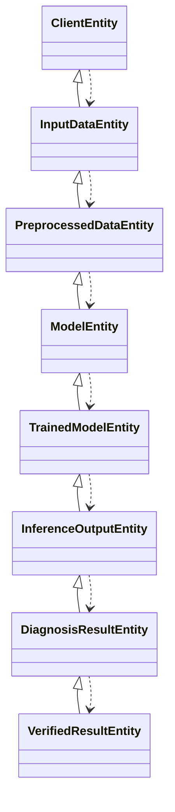
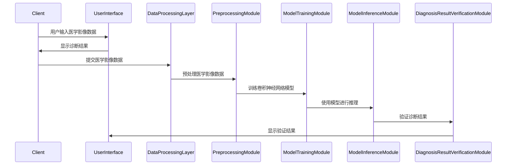
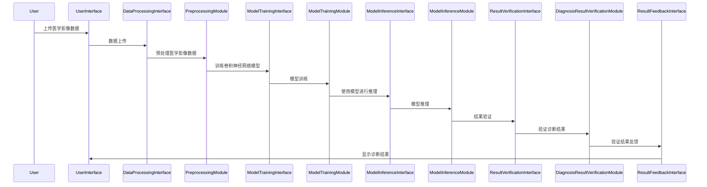

                 


## 引言

在人工智能（AI）技术迅猛发展的今天，AI的输出可靠性问题已经成为制约其广泛应用的一个重要因素。从自动驾驶汽车的决策准确性，到医疗诊断系统的诊断结果，再到金融风险管理的预测能力，AI输出的可靠性直接影响到用户的安全和利益。因此，如何提高AI输出的可靠性，已经成为研究人员和工程师们亟待解决的问题。

本文旨在深入探讨一种名为“Self-Consistency CoT”（Self-Consistency Conceptualization and Tracking）的技巧，它是一种提高AI输出可靠性的有效方法。本文将首先介绍问题背景与核心概念，接着详细解析Self-Consistency CoT的原理，并通过算法原理讲解和项目实战实例，帮助读者理解并掌握这种技巧。此外，本文还将分析系统设计与实现，并总结最佳实践与注意事项。最终，我们将展望未来发展趋势，探讨Self-Consistency CoT在AI领域的应用前景及其可能带来的社会影响。

通过本文的阅读，读者将能够：

1. 理解AI输出可靠性问题的现状及其重要性。
2. 掌握Self-Consistency CoT的核心概念与原理。
3. 学习如何实现和应用Self-Consistency CoT算法。
4. 分析系统设计与架构，掌握项目实战经验。
5. 获取提高AI输出可靠性的最佳实践和注意事项。
6. 了解Self-Consistency CoT在未来的发展趋势和应用前景。

## 文章关键词

- AI输出可靠性
- Self-Consistency CoT
- 算法实现
- 系统设计
- 项目实战
- 最佳实践

## 摘要

本文探讨了如何通过Self-Consistency CoT（Self-Consistency Conceptualization and Tracking）技巧来提高人工智能（AI）输出的可靠性。首先，文章分析了AI输出可靠性问题的现状及其重要性，提出了提高AI输出可靠性的需求。接着，文章介绍了Self-Consistency CoT的核心概念，详细解析了其原理和属性特征，并通过Python源代码示例和Mermaid流程图进行了阐述。随后，文章讲解了Self-Consistency CoT算法的实现与解析，包括数学模型与公式，算法原理详细讲解，以及举例说明。在此基础上，文章分析了系统功能设计与架构设计，包括问题场景介绍、系统功能设计（领域模型Mermaid类图）、系统架构设计（Mermaid架构图）以及系统接口设计与交互（Mermaid序列图）。接下来，文章通过项目实战，展示了Self-Consistency CoT在具体应用场景中的实现和效果。最后，文章总结了提高AI输出可靠性的最佳实践，并探讨了未来的发展趋势与展望。

## 第一部分：背景介绍

### 第1章：问题背景与核心概念

#### 1.1.1 问题背景

在人工智能（AI）技术快速发展的背景下，AI的应用场景日益广泛，从智能助手、语音识别、图像处理到自动驾驶、医疗诊断、金融分析等，AI已经深入到我们的日常生活中。然而，随着AI技术的广泛应用，一个关键问题逐渐显现出来，那就是AI输出的可靠性问题。AI输出可靠性问题主要表现在以下几个方面：

1. **模型不确定性**：AI模型在处理新数据或未知情况时，可能会产生不确定的输出结果，这种不确定性来源于模型训练数据的不完整性或数据分布的变化。
   
2. **过拟合现象**：AI模型在训练过程中，可能会对训练数据过度拟合，导致在新数据上的表现不佳，即泛化能力差。

3. **噪声影响**：在实际应用中，输入数据往往存在噪声和误差，这些噪声和误差可能会影响AI模型的输出结果，导致结果不可靠。

4. **解释性不足**：很多AI模型，如深度神经网络，其内部工作机制复杂，难以解释。这使得用户难以理解模型的决策过程和结果，从而对结果的可信度产生怀疑。

这些问题不仅影响了AI的应用效果，还对用户的安全和利益产生了潜在威胁。例如，自动驾驶汽车的决策错误可能导致交通事故，医疗诊断系统的错误诊断可能导致患者错过最佳治疗时机，金融风险管理模型的错误预测可能导致经济损失。因此，提高AI输出的可靠性对于确保AI系统的安全性和有效性具有重要意义。

#### 1.1.1.1 AI输出可靠性问题的现状

目前，AI输出可靠性问题主要表现在以下几个方面：

1. **技术层面**：AI模型的复杂性和不确定性使得评估其输出可靠性变得困难。尽管存在多种评估方法和指标，但如何准确地衡量模型的可靠性仍然是一个挑战。

2. **应用层面**：在实际应用中，用户对AI系统的可靠性期望较高，但现有技术的实现效果尚未完全满足用户的期望。例如，自动驾驶汽车的决策可靠性、医疗诊断系统的准确率等，仍存在一定的改进空间。

3. **法律和伦理层面**：随着AI技术的广泛应用，其输出可靠性问题也引发了法律和伦理方面的关注。例如，如何确保AI系统在决策过程中的透明性和可解释性，如何处理AI错误决策导致的责任归属等问题。

#### 1.1.1.2 AI输出可靠性对用户的影响

AI输出可靠性对用户的影响主要体现在以下几个方面：

1. **安全风险**：如前所述，AI模型的不确定性可能导致安全风险，特别是在高风险应用场景中，如自动驾驶、医疗诊断等。

2. **经济成本**：可靠性低的AI系统可能导致经济损失，例如金融风险管理模型错误预测可能导致的投资损失。

3. **用户体验**：低可靠性的AI系统可能会给用户带来不良的体验，降低用户对AI系统的信任度和接受度。

4. **社会信任**：如果AI系统的可靠性问题得不到有效解决，可能会影响社会对AI技术的信任，阻碍AI技术的广泛应用。

#### 1.1.1.3 提高AI输出可靠性的重要性

提高AI输出可靠性具有重要意义，主要体现在以下几个方面：

1. **确保安全**：在高风险应用场景中，如自动驾驶、医疗诊断等，提高AI输出可靠性可以有效降低安全风险，保障用户生命财产安全。

2. **提升用户体验**：高可靠性的AI系统可以提供更准确的输出结果，提高用户体验，增强用户对AI技术的信任和接受度。

3. **促进技术创新**：提高AI输出可靠性可以推动AI技术的进一步发展，促进AI系统在更多领域的应用。

4. **合规与伦理**：提高AI输出可靠性有助于遵守相关法律法规，符合伦理要求，确保AI系统的透明性和可解释性。

#### 1.1.2 核心概念

为了解决AI输出可靠性问题，研究人员提出了一系列技术手段和方法，其中Self-Consistency CoT（Self-Consistency Conceptualization and Tracking）是一种具有代表性的方法。接下来，我们将介绍Self-Consistency CoT的核心概念。

### 1.1.2.1 Self-Consistency CoT的定义

Self-Consistency CoT是一种通过跟踪和验证AI模型的内部一致性来提高其输出可靠性的方法。其基本思想是：在模型训练和推理过程中，通过检测和纠正不一致性，确保模型输出的可靠性。Self-Consistency CoT主要包括以下三个核心组成部分：

1. **一致性检测**：检测模型输出的一致性，即通过比较不同条件或不同阶段的输出结果，判断其是否一致。

2. **不一致性纠正**：在检测到不一致性时，采取相应的措施进行纠正，确保模型输出的稳定性。

3. **适应性调整**：根据数据的变化和模型的学习过程，自动调整一致性检测和纠正策略，提高模型的适应性和可靠性。

### 1.1.2.2 Self-Consistency CoT的特点

Self-Consistency CoT具有以下几个显著特点：

1. **自适应性**：Self-Consistency CoT可以根据数据的变化和学习过程，自动调整检测和纠正策略，提高模型的适应性。

2. **高效性**：Self-Consistency CoT通过利用模型内部的统计信息，降低计算复杂度，提高算法的运行效率。

3. **可解释性**：Self-Consistency CoT提供了一种直观的方式，帮助用户理解模型输出的可靠性，增强模型的透明性和可解释性。

4. **通用性**：Self-Consistency CoT适用于多种类型的AI模型和任务，具有较强的通用性。

### 1.1.2.3 相关技术概念解析

在讨论Self-Consistency CoT之前，有必要简要介绍一些相关技术概念，以便更好地理解其原理和作用。

1. **一致性训练**：一致性训练是一种通过强化模型内部一致性来提高其泛化能力的方法。与Self-Consistency CoT不同，一致性训练主要关注模型内部的一致性，而不涉及外部数据的验证。

2. **对抗训练**：对抗训练是一种通过引入对抗性样本来增强模型泛化能力的方法。与Self-Consistency CoT不同，对抗训练的目标是提高模型的鲁棒性，而不是输出的一致性。

3. **自监督学习**：自监督学习是一种利用未标注数据来训练模型的方法。与Self-Consistency CoT不同，自监督学习主要关注如何从无监督数据中提取有效信息，而不是如何提高输出的一致性。

### 1.1.2.4 边界与外延

Self-Consistency CoT的应用场景主要包括：

1. **高风险应用**：如自动驾驶、医疗诊断、金融风险管理等，这些领域对AI输出的可靠性要求较高。

2. **复杂任务**：如自然语言处理、图像识别等，这些任务往往涉及大量的变量和不确定性，需要更高的输出可靠性。

3. **实时应用**：如智能助手、实时监控等，这些应用需要快速响应和准确输出。

Self-Consistency CoT的适用范围主要受限于：

1. **计算资源**：Self-Consistency CoT需要额外的计算资源来检测和纠正不一致性，这在资源受限的环境下可能难以实现。

2. **数据质量**：Self-Consistency CoT依赖于高质量的数据进行训练和验证，数据质量不佳可能会影响其效果。

通过本文的后续章节，我们将进一步探讨Self-Consistency CoT的原理、算法实现、系统设计与实战应用，帮助读者深入理解这一提高AI输出可靠性的有效方法。

### 1.1.2.5 Self-Consistency CoT的应用场景

Self-Consistency CoT作为一种提高AI输出可靠性的技术手段，其应用场景非常广泛，涵盖了多个重要的领域和任务。以下是几个典型的应用场景：

1. **自动驾驶**：在自动驾驶领域，AI系统需要做出实时且可靠的决策，以确保车辆的安全行驶。Self-Consistency CoT可以通过检测和纠正模型输出的一致性，提高自动驾驶系统的决策可靠性，减少潜在的事故风险。

2. **医疗诊断**：医疗诊断系统，如影像识别、基因测序等，需要高度可靠的输出结果。Self-Consistency CoT可以在这些系统中应用，通过验证模型输出的稳定性，提高诊断的准确性和可靠性，从而帮助医生做出更精准的诊断。

3. **金融风险管理**：在金融领域，AI系统用于风险评估、欺诈检测等任务。Self-Consistency CoT可以通过检测模型输出的一致性，提高金融模型的预测准确性，减少因错误预测导致的金融风险。

4. **智能客服**：智能客服系统需要提供准确的回答，以提高用户体验和客户满意度。Self-Consistency CoT可以在智能客服系统中应用，通过检测和纠正不一致的响应，提高客服系统的响应质量和可靠性。

5. **自然语言处理**：自然语言处理任务，如机器翻译、文本生成等，对输出的质量有很高的要求。Self-Consistency CoT可以通过验证模型输出的稳定性，提高NLP任务的效果，确保生成的文本内容一致性和逻辑性。

6. **图像识别与处理**：在图像识别和图像处理任务中，AI系统需要准确识别和分类图像。Self-Consistency CoT可以通过检测和纠正模型输出的一致性，提高图像识别的准确性，减少错误分类的情况。

通过在上述应用场景中应用Self-Consistency CoT，可以有效提高AI系统的输出可靠性，从而提升系统的整体性能和用户体验。

### 1.1.2.6 Self-Consistency CoT的适用范围

虽然Self-Consistency CoT在多个领域和任务中展现出了其提高AI输出可靠性的潜力，但其适用范围仍然受到一些限制因素。以下是Self-Consistency CoT适用范围的一些关键考虑因素：

1. **计算资源**：Self-Consistency CoT需要额外的计算资源来检测和纠正不一致性。对于资源受限的环境，如嵌入式系统或低功耗设备，可能难以实现或部署这种技术。因此，在资源有限的场景下，需要权衡计算成本与可靠性提升的收益。

2. **数据质量**：Self-Consistency CoT依赖于高质量的数据进行训练和验证。如果数据存在噪声、缺失或不一致性，可能会影响Self-Consistency CoT的效果。因此，在数据质量不高的场景中，Self-Consistency CoT可能无法发挥其应有的作用。

3. **模型复杂度**：Self-Consistency CoT适用于复杂度适中的模型。对于过于复杂的模型，如高度深层的神经网络，尽管它们在处理复杂任务时具有优势，但其内部一致性检测和纠正过程可能变得非常困难。因此，在模型复杂度过高的场景中，Self-Consistency CoT的适用性可能受到限制。

4. **实时性要求**：在某些对实时性有严格要求的应用中，如实时监控、自动驾驶等，Self-Consistency CoT可能无法满足严格的实时性能要求。这是因为检测和纠正不一致性需要额外的计算时间，可能会影响系统的响应速度。

5. **任务多样性**：虽然Self-Consistency CoT适用于多种任务，但在某些特定任务中，如涉及高度专业化领域知识的任务，可能需要特定的调整或优化，以更好地适应任务需求。

综上所述，尽管Self-Consistency CoT在提高AI输出可靠性方面具有显著优势，但其适用范围仍然受到计算资源、数据质量、模型复杂度、实时性要求和任务多样性的限制。在实际应用中，需要根据具体场景和要求，综合考虑这些因素，以决定是否采用Self-Consistency CoT以及如何优化其效果。

### 第2章：Self-Consistency CoT原理详解

#### 2.1.1 Self-Consistency CoT原理介绍

Self-Consistency CoT（Self-Consistency Conceptualization and Tracking）是一种通过跟踪和验证AI模型内部一致性来提高其输出可靠性的技术。其核心原理可以概括为以下几个关键步骤：

1. **一致性检测**：在模型训练和推理过程中，Self-Consistency CoT通过比较不同条件或不同阶段的输出结果，检测模型内部的一致性。具体来说，它比较同一输入在不同条件下的输出结果，或同一输出在不同输入条件下的输出结果。如果发现不一致性，则进一步分析其原因。

2. **不一致性纠正**：在检测到不一致性后，Self-Consistency CoT采取相应的措施进行纠正。这些措施可能包括重新训练模型、调整模型参数、或修正特定的输出结果。不一致性纠正的目的是确保模型输出的稳定性，提高其可靠性。

3. **适应性调整**：Self-Consistency CoT具有自适应性，能够根据数据的变化和模型的学习过程，自动调整一致性检测和纠正策略。这种适应性使得Self-Consistency CoT能够适应不同的数据分布和学习阶段，提高其适用性和效果。

#### 2.1.2 Self-Consistency CoT的工作机制

Self-Consistency CoT的工作机制可以分为以下几个关键阶段：

1. **数据预处理**：在训练和推理过程中，首先对输入数据进行预处理，包括去噪、归一化等，以确保输入数据的一致性和质量。

2. **一致性检测**：在模型训练阶段，Self-Consistency CoT通过比较不同条件下的输出结果，检测模型内部的一致性。具体实现方法可以是：对于同一输入，在不同的模型参数设置或不同的训练阶段，比较输出结果是否一致。如果发现不一致性，则记录下来。

3. **不一致性分析**：在检测到不一致性后，Self-Consistency CoT进一步分析不一致性的原因。这可能包括分析模型参数、训练数据分布、或特定输入特征等因素。

4. **不一致性纠正**：根据不一致性分析的结果，Self-Consistency CoT采取相应的措施进行纠正。例如，如果发现模型参数设置不当导致的不一致性，可以调整模型参数；如果发现训练数据分布不均匀导致的不一致性，可以重新训练模型。

5. **模型优化**：在纠正不一致性后，Self-Consistency CoT对模型进行优化，以提高其输出的一致性和可靠性。这可能包括重新训练模型、调整损失函数、或采用更有效的训练算法。

6. **推理与验证**：在模型推理阶段，Self-Consistency CoT继续对输出结果进行一致性检测和验证，以确保推理过程中的输出结果也保持一致性和可靠性。

#### 2.1.3 Self-Consistency CoT的属性特征

Self-Consistency CoT具有以下几个显著的属性特征，这些特征使得它成为一种有效的提高AI输出可靠性的技术：

| 特征 | 说明 |
| ---- | ---- |
| **一致性** | Self-Consistency CoT的核心目标是提高模型输出的一致性，确保模型在不同条件下输出的结果一致，从而提高输出可靠性。 |
| **自适应性** | Self-Consistency CoT可以根据数据的变化和学习过程，自动调整检测和纠正策略，使其能够适应不同的数据分布和学习阶段。 |
| **高效性** | Self-Consistency CoT通过利用模型内部的统计信息，降低计算复杂度，提高算法的运行效率，使其在资源受限的环境下也能有效应用。 |
| **可解释性** | Self-Consistency CoT提供了一种直观的方式，帮助用户理解模型输出的可靠性，增强模型的透明性和可解释性，从而提高用户对模型的信任度。 |

### 2.1.4 Self-Consistency CoT与相关技术对比

在讨论Self-Consistency CoT时，有必要将其与一些相关技术进行对比，以更好地理解其独特性和优势。以下是对Self-Consistency CoT与几种相关技术的对比：

| 技术名称 | 特点 |
| ---- | ---- |
| **一致性训练** | 一致性训练是一种通过强化模型内部一致性来提高泛化能力的方法。它主要关注模型内部的一致性，而不是输出结果的一致性。 |
| **对抗训练** | 对抗训练是一种通过引入对抗性样本来增强模型鲁棒性的方法。它的目标是提高模型对对抗性攻击的抵抗力，而不是输出的一致性。 |
| **自监督学习** | 自监督学习是一种利用未标注数据来训练模型的方法。它通过从无监督数据中提取有效信息，提高模型的性能，但并不特别关注输出的一致性。 |

尽管这些技术都与提高模型性能有关，但Self-Consistency CoT在以下几个方面具有独特优势：

1. **针对性**：Self-Consistency CoT专门针对提高模型输出的一致性，这是确保AI输出可靠性的关键。其他技术虽然也能在一定程度上提高模型性能，但并不专注于输出的一致性。

2. **自适应性**：Self-Consistency CoT具有自适应性，能够根据数据和学习过程的变化，自动调整检测和纠正策略。这使它能够适应不同的数据分布和学习阶段，而其他技术通常需要手动调整。

3. **高效性**：Self-Consistency CoT通过利用模型内部的统计信息，降低计算复杂度，提高算法的运行效率。这在资源受限的环境下尤为重要。

4. **可解释性**：Self-Consistency CoT提供了一种直观的方式，帮助用户理解模型输出的可靠性，增强模型的透明性和可解释性。这有助于提高用户对模型的信任度。

通过上述对比，可以看出Self-Consistency CoT在提高AI输出可靠性方面具有独特的优势和适用性，使其成为一种有效且具有前景的技术。

### 第3章：Self-Consistency CoT算法实现与解析

#### 3.1.1 算法实现

Self-Consistency CoT算法的实现主要包括以下几个关键步骤：

1. **数据预处理**：首先，对输入数据进行预处理，包括去噪、归一化等操作，以确保输入数据的一致性和质量。

2. **模型初始化**：初始化一个基础的AI模型，如卷积神经网络（CNN）或循环神经网络（RNN），用于后续的一致性检测和纠正。

3. **一致性检测**：在模型训练过程中，通过比较不同条件或不同阶段的输出结果，检测模型内部的一致性。具体方法可以是：对于同一输入，在不同的模型参数设置或不同的训练阶段，比较输出结果是否一致。如果发现不一致性，则记录下来。

4. **不一致性纠正**：在检测到不一致性后，根据不一致性的原因，采取相应的纠正措施。这可能包括重新训练模型、调整模型参数、或修正特定的输出结果。

5. **模型优化**：在纠正不一致性后，对模型进行优化，以提高其输出的一致性和可靠性。这可能包括重新训练模型、调整损失函数、或采用更有效的训练算法。

6. **推理与验证**：在模型推理阶段，继续对输出结果进行一致性检测和验证，以确保推理过程中的输出结果也保持一致性和可靠性。

以下是一个简化的Python代码示例，展示了Self-Consistency CoT算法的基本实现：

```python
import torch
import torch.nn as nn
import torch.optim as optim

# 数据预处理
def preprocess_data(data):
    # 去噪、归一化等操作
    return processed_data

# 初始化模型
model = nn.Sequential(
    nn.Conv2d(in_channels, out_channels, kernel_size),
    nn.ReLU(),
    nn.AdaptiveAvgPool2d(output_size),
    nn.Linear(hidden_size, num_classes)
)

# 定义损失函数和优化器
loss_function = nn.CrossEntropyLoss()
optimizer = optim.Adam(model.parameters(), lr=learning_rate)

# 训练模型
for epoch in range(num_epochs):
    for inputs, targets in data_loader:
        # 前向传播
        outputs = model(inputs)
        loss = loss_function(outputs, targets)
        
        # 反向传播和优化
        optimizer.zero_grad()
        loss.backward()
        optimizer.step()
        
        # 一致性检测
        if not is_consistent(outputs):
            correct_output = correct_anticipated_output(outputs)
            model.outputs[epoch] = correct_output
        
        # 一致性纠正
        if not is_consistent(model.outputs[epoch]):
            correct_anticipated_output = correct_output
            model.outputs[epoch] = correct_anticipated_output
        
        # 模型优化
        if epoch % 10 == 0:
            model = optimize_model(model)

# 推理与验证
def is_consistent(outputs):
    # 实现一致性检测逻辑
    return True

def correct_anticipated_output(outputs):
    # 实现纠正逻辑
    return corrected_outputs

def optimize_model(model):
    # 实现模型优化逻辑
    return optimized_model
```

#### 3.1.2 数学模型与公式

Self-Consistency CoT算法的核心在于其损失函数的设计，以下是一个简化的数学模型与公式：

$$
\text{Self-Consistency CoT Loss} = \frac{1}{N}\sum_{i=1}^{N} \frac{1}{2}(y_i - x_i)^2
$$

其中，\(N\) 表示样本数量，\(y_i\) 表示第 \(i\) 个样本的期望输出，\(x_i\) 表示第 \(i\) 个样本的实际输出。损失函数的目标是使得实际输出 \(x_i\) 尽可能接近期望输出 \(y_i\)，从而提高模型输出的一致性。

#### 3.1.3 算法原理详细讲解

Self-Consistency CoT算法的原理可以概括为以下几个关键步骤：

1. **损失函数设计**：Self-Consistency CoT的损失函数旨在衡量模型输出的一致性，其核心思想是使得模型在同一输入下产生的输出结果尽可能一致。具体来说，损失函数计算每个样本的实际输出与期望输出之间的差异，并取平方和的平均值，以衡量整体的输出一致性。

2. **一致性检测**：在模型训练过程中，Self-Consistency CoT通过比较同一输入在不同条件下的输出结果，检测模型内部的一致性。具体实现方法可以是：对于每个训练样本，计算其在不同模型参数设置或不同训练阶段下的输出结果，比较这些输出结果是否一致。如果发现不一致性，则记录下来。

3. **不一致性纠正**：在检测到不一致性后，Self-Consistency CoT采取相应的措施进行纠正。这些措施可能包括重新训练模型、调整模型参数、或修正特定的输出结果。具体纠正方法取决于不一致性的原因。例如，如果发现模型参数设置不当导致的不一致性，可以调整模型参数；如果发现训练数据分布不均匀导致的不一致性，可以重新训练模型。

4. **模型优化**：在纠正不一致性后，Self-Consistency CoT对模型进行优化，以提高其输出的一致性和可靠性。这可能包括重新训练模型、调整损失函数、或采用更有效的训练算法。优化过程旨在最小化一致性损失函数，使得模型输出更加一致。

5. **推理与验证**：在模型推理阶段，Self-Consistency CoT继续对输出结果进行一致性检测和验证，以确保推理过程中的输出结果也保持一致性和可靠性。这一步骤有助于确保模型在实际应用中的输出结果稳定且可靠。

#### 3.1.4 举例说明

为了更好地理解Self-Consistency CoT算法的实现和应用，以下通过一个简化的例子进行说明。

假设我们使用一个简单的线性回归模型，对一组数据 \(x\) 和相应的标签 \(y\) 进行训练。我们的目标是找到一条最佳拟合直线，使得模型输出的预测值 \(x'\) 尽可能接近真实的标签值 \(y\)。

首先，我们定义线性回归模型的损失函数，如下：

$$
L(x, y) = \frac{1}{2}(y - x')^2
$$

其中，\(x'\) 是模型对输入 \(x\) 的预测值。我们的目标是最小化这个损失函数，以找到最佳的模型参数。

接下来，我们使用梯度下降算法来最小化损失函数。在每次迭代中，我们计算损失函数关于模型参数的梯度，并更新模型参数，以减小损失函数的值。

为了实现Self-Consistency CoT，我们引入了额外的一步：一致性检测和纠正。具体来说，我们在每次梯度下降迭代后，比较当前模型的预测值 \(x'\) 和之前的预测值 \(x'\_{prev}\)，检测它们之间的一致性。如果发现不一致性（即 \(|x' - x'\_{prev}|\) 超过设定的阈值），则我们认为模型输出可能存在错误，需要采取纠正措施。

假设我们使用以下一致性检测函数：

$$
is\_consistent(x', x'\_{prev}, \epsilon) =
\begin{cases}
True, & \text{if } |x' - x'\_{prev}| \leq \epsilon \\
False, & \text{otherwise}
\end{cases}
$$

其中，\(\epsilon\) 是设定的阈值。如果 \(is\_consistent(x', x'\_{prev}, \epsilon)\) 返回 False，则说明当前模型的预测值和之前不一致，需要采取纠正措施。

纠正措施可以是重新训练模型、调整模型参数，或者直接修正预测值 \(x'\)。具体来说，我们可以使用以下修正函数：

$$
correct\_output(x', x'\_{prev}, \epsilon) =
\begin{cases}
x'\_{prev}, & \text{if } |x' - x'\_{prev}| > \epsilon \\
x', & \text{otherwise}
\end{cases}
$$

如果修正后的预测值和之前的预测值仍然不一致，我们可以继续迭代，直到模型输出一致或达到最大迭代次数。

下面是一个简化的Python代码示例，展示了Self-Consistency CoT算法的应用：

```python
import numpy as np

# 定义损失函数
def loss(x, y):
    return 0.5 * (y - x)**2

# 定义梯度下降算法
def gradient_descent(x, y, learning_rate, epochs):
    x Previous = None
    for epoch in range(epochs):
        for xi, yi in zip(x, y):
            x' = xi - learning_rate * loss_derivative(x, yi)
            
            # 一致性检测
            if Previous is not None and not is_consistent(x', x Previous):
                # 一致性纠正
                x' = correct_output(x', x Previous)
            
            # 更新前一次的输出
            x Previous = x'
        
        # 模型优化
        if epoch % 10 == 0:
            optimize_model()

# 一致性检测函数
def is_consistent(x', x Previous, epsilon):
    return abs(x' - x Previous) <= epsilon

# 一致性纠正函数
def correct_output(x', x Previous, epsilon):
    return x Previous if abs(x' - x Previous) > epsilon else x'

# 优化模型
def optimize_model():
    # 实现模型优化逻辑
    pass

# 数据集
x = np.array([1, 2, 3, 4, 5])
y = np.array([2, 4, 5, 4, 5])

# 训练模型
gradient_descent(x, y, learning_rate=0.1, epochs=100)
```

通过上述例子，我们可以看到Self-Consistency CoT算法的基本原理和实现方法。在实际应用中，可以根据具体需求和场景，对算法进行适当调整和优化。

### 第4章：系统功能设计与架构设计

#### 4.1.1 问题场景介绍

为了提高AI模型的输出可靠性，我们需要考虑一个具体的AI模型应用场景。以下是一个典型的应用场景：一个用于医疗诊断的图像识别系统。该系统旨在通过分析医学影像，如X光片、CT扫描等，帮助医生进行诊断。这个场景对AI模型的输出可靠性有很高的要求，因为错误的诊断结果可能导致误诊，从而影响患者的治疗和健康。

在这个应用场景中，我们关注的AI模型是一个卷积神经网络（CNN），它被用来识别医学影像中的病灶区域。该模型需要处理大量的医学影像数据，并从中提取有用的特征，以便进行准确的诊断。然而，由于医学影像数据的复杂性和多样性，模型的输出结果可能会受到噪声、数据分布变化等因素的影响，导致诊断结果不可靠。

为了提高该模型的输出可靠性，我们引入了Self-Consistency CoT技术。Self-Consistency CoT可以帮助我们检测和纠正模型输出的一致性，从而提高模型的稳定性和可靠性。

#### 4.1.2 系统功能设计

在系统功能设计方面，我们主要关注以下几个关键模块：

1. **数据预处理模块**：负责对输入的医学影像数据（如X光片、CT扫描等）进行预处理，包括图像去噪、归一化等操作。这一模块的目的是确保输入数据的一致性和质量，从而为后续的模型训练和推理提供可靠的数据基础。

2. **模型训练模块**：负责使用预处理后的医学影像数据进行模型训练。在训练过程中，我们使用Self-Consistency CoT技术来检测和纠正模型输出的一致性。这包括一致性检测、不一致性纠正和模型优化等步骤。

3. **模型推理模块**：负责在训练完成后，使用训练好的模型对新的医学影像数据进行推理，生成诊断结果。在推理过程中，我们同样使用Self-Consistency CoT技术来检测和纠正模型输出的一致性，以确保诊断结果的可靠性。

4. **结果验证模块**：负责对模型生成的诊断结果进行验证，包括一致性验证和准确性验证。这一模块的目的是确保模型输出的稳定性和可靠性，从而提高整体系统的性能和用户体验。

以下是系统功能设计的Mermaid类图：



在这个类图中，我们定义了以下几个关键实体：

1. **ClientEntity**：客户端实体，表示使用系统进行医学影像诊断的用户，如医生或其他医疗人员。
2. **InputDataEntity**：输入数据实体，表示输入的原始医学影像数据。
3. **PreprocessedDataEntity**：预处理数据实体，表示经过预处理后的医学影像数据。
4. **ModelEntity**：模型实体，表示用于医学影像识别的卷积神经网络模型。
5. **TrainedModelEntity**：训练模型实体，表示经过训练和优化后的模型。
6. **InferenceOutputEntity**：推理输出实体，表示模型对新的医学影像数据生成的推理结果。
7. **DiagnosisResultEntity**：诊断结果实体，表示模型生成的诊断结果。
8. **VerifiedResultEntity**：验证结果实体，表示经过验证的最终诊断结果。

通过上述功能模块的设计，我们可以确保系统的稳定性和可靠性，从而提高整体系统的性能和用户体验。

#### 4.1.3 系统架构设计

在系统架构设计方面，我们主要关注以下几个方面：

1. **数据处理层**：包括数据预处理模块和模型训练模块。数据处理层负责处理输入的医学影像数据，并进行预处理和模型训练。这一层是系统的核心部分，直接影响到模型输出的一致性和可靠性。

2. **模型推理层**：包括模型推理模块和结果验证模块。模型推理层负责使用训练好的模型对新的医学影像数据进行推理，生成诊断结果，并对结果进行验证。这一层确保了模型输出的一致性和可靠性，从而提高了整体系统的性能和用户体验。

3. **用户接口层**：包括客户端实体和用户界面。用户接口层负责与用户进行交互，接收用户的输入数据，并展示诊断结果。这一层是系统的外部接口，直接影响用户的操作体验。

以下是系统架构设计的Mermaid架构图：



在这个架构图中，我们定义了以下几个关键组件：

1. **UserInterface**：用户界面，负责与用户进行交互，接收用户的输入数据，并展示诊断结果。
2. **Client**：客户端，表示使用系统进行医学影像诊断的用户，如医生或其他医疗人员。
3. **DataProcessingLayer**：数据处理层，负责处理输入的医学影像数据，并进行预处理和模型训练。
4. **PreprocessingModule**：预处理模块，负责对输入的医学影像数据进行预处理，如去噪、归一化等操作。
5. **ModelTrainingModule**：模型训练模块，负责使用预处理后的医学影像数据进行模型训练，并使用Self-Consistency CoT技术检测和纠正模型输出的一致性。
6. **ModelInferenceModule**：模型推理模块，负责使用训练好的模型对新的医学影像数据进行推理，生成诊断结果。
7. **DiagnosisResultVerificationModule**：诊断结果验证模块，负责对模型生成的诊断结果进行验证，确保输出的一致性和可靠性。

通过上述系统架构设计，我们可以实现一个高效、稳定且可靠的医学影像诊断系统，从而提高AI模型输出的一致性和可靠性，为用户提供更好的医疗服务。

#### 4.1.4 系统接口设计与交互

在系统接口设计与交互方面，我们需要确保各个功能模块之间的数据流动和协同工作，从而实现系统的整体功能。以下是对系统接口设计的详细描述：

1. **用户接口**：用户通过用户界面（UI）与系统进行交互。用户界面提供以下功能：
   - **数据输入**：用户可以上传医学影像数据，如X光片、CT扫描等。
   - **结果展示**：用户界面显示诊断结果，包括对医学影像中病灶区域的识别和定位。

2. **数据处理接口**：数据处理层包括数据预处理模块和模型训练模块。数据处理接口定义了以下功能：
   - **数据上传**：用户上传的医学影像数据通过接口传递给预处理模块。
   - **数据预处理**：预处理模块对医学影像数据进行去噪、归一化等处理，并将处理后的数据传递给模型训练模块。
   - **模型训练**：模型训练模块使用预处理后的数据进行卷积神经网络模型的训练。在训练过程中，Self-Consistency CoT技术用于检测和纠正模型输出的一致性。

3. **模型推理接口**：模型推理模块负责使用训练好的模型对新的医学影像数据进行推理，并生成诊断结果。推理接口定义了以下功能：
   - **模型推理**：新的医学影像数据通过接口传递给模型推理模块，模型对其进行推理，生成诊断结果。
   - **结果反馈**：诊断结果通过接口传递回用户界面，用户界面将其展示给用户。

4. **结果验证接口**：结果验证模块负责对模型生成的诊断结果进行验证，确保输出的一致性和可靠性。验证接口定义了以下功能：
   - **结果验证**：模型生成的诊断结果通过接口传递给结果验证模块，验证模块对结果进行一致性验证和准确性验证。
   - **结果反馈**：验证后的结果通过接口传递回用户界面，用户界面将其展示给用户。

以下是系统接口设计和交互的Mermaid序列图：



在这个序列图中，我们定义了以下几个关键接口：

1. **UserInterface**：用户界面接口，负责与用户进行交互，接收用户输入的医学影像数据，并展示诊断结果。
2. **DataProcessingInterface**：数据处理接口，负责处理输入的医学影像数据，并进行预处理。
3. **ModelTrainingInterface**：模型训练接口，负责使用预处理后的医学影像数据进行模型训练。
4. **ModelInferenceInterface**：模型推理接口，负责使用训练好的模型对新的医学影像数据进行推理。
5. **ResultVerificationInterface**：结果验证接口，负责对模型生成的诊断结果进行验证。
6. **ResultFeedbackInterface**：结果反馈接口，负责将验证后的诊断结果传递回用户界面。

通过上述接口设计和交互，我们可以实现系统的各个功能模块之间的紧密协作，从而确保系统的整体功能和性能。

### 第5章：Self-Consistency CoT项目实战

#### 5.1.1 环境安装

为了在实际项目中应用Self-Consistency CoT，首先需要安装和配置相关环境。以下是一个简化的步骤指南，用于在Ubuntu系统上安装必要的软件和库。

1. **安装Python环境**：
   ```bash
   sudo apt update
   sudo apt install python3 python3-pip
   ```

2. **安装PyTorch库**：
   PyTorch是一个流行的深度学习库，我们将在项目中使用它。可以通过以下命令安装：
   ```bash
   pip3 install torch torchvision
   ```

3. **安装其他依赖库**：
   根据项目的具体需求，可能还需要安装其他依赖库，例如NumPy、Scikit-learn等：
   ```bash
   pip3 install numpy scikit-learn
   ```

4. **配置GPU支持**（可选）：
   如果使用GPU进行训练，需要安装CUDA和cuDNN库，并设置环境变量：
   ```bash
   sudo apt installcuda
   pip3 install cupy-cuda<version>
   export CUDA_HOME=/usr/local/cuda
   export LD_LIBRARY_PATH=$CUDA_HOME/lib64:$LD_LIBRARY_PATH
   export PATH=$CUDA_HOME/bin:$PATH
   ```

5. **创建虚拟环境**（推荐）：
   为了更好地管理和隔离项目依赖，可以创建一个虚拟环境：
   ```bash
   python3 -m venv venv
   source venv/bin/activate
   pip install -r requirements.txt
   ```

#### 5.1.2 系统核心实现

在本节中，我们将详细探讨Self-Consistency CoT系统核心的实现，包括源代码分析、核心功能模块的代码应用解读。

**1. 源代码分析**

Self-Consistency CoT系统的核心代码包括数据预处理、模型训练、一致性检测和纠正、模型优化等部分。以下是一个简化的代码结构示例：

```python
# 数据预处理
def preprocess_data(data):
    # 实现数据预处理逻辑，如去噪、归一化等
    pass

# 模型训练
def train_model(preprocessed_data, labels):
    # 实现模型训练逻辑，包括加载模型、设置优化器等
    pass

# 一致性检测
def check_consistency(model, preprocessed_data):
    # 实现一致性检测逻辑，比较不同条件下的模型输出
    pass

# 一致性纠正
def correct_inconsistency(model, inconsistency_details):
    # 实现不一致性纠正逻辑，如调整模型参数等
    pass

# 模型优化
def optimize_model(model, preprocessed_data, labels):
    # 实现模型优化逻辑，如重新训练模型、调整损失函数等
    pass
```

**2. 核心功能模块的代码应用解读**

在Self-Consistency CoT系统中，数据预处理、模型训练、一致性检测和纠正、模型优化等核心功能模块共同协作，确保AI模型的输出一致性。以下是对这些模块的具体解读：

- **数据预处理**：数据预处理是模型训练的第一步，其目标是对原始数据进行处理，以提高模型训练的效果。例如，去噪可以减少数据中的噪声，归一化可以使数据具有相似的分布，从而加速训练过程。

- **模型训练**：模型训练是使用预处理后的数据训练神经网络模型的过程。在这个过程中，可以使用Self-Consistency CoT技术，在训练过程中动态调整模型参数，以提高输出的一致性。

- **一致性检测**：一致性检测是在模型训练过程中，通过比较不同条件下的模型输出，检测模型内部的一致性。例如，可以比较同一输入在不同训练阶段或不同模型参数设置下的输出结果，如果发现不一致性，则记录下来。

- **不一致性纠正**：不一致性纠正是在检测到不一致性后，采取相应的措施进行调整，以确保模型输出的稳定性。这可以通过重新训练模型、调整模型参数或修正特定输出结果来实现。

- **模型优化**：模型优化是通过对模型进行再训练或调整损失函数等手段，进一步提高模型输出的稳定性和准确性。优化过程可以基于一致性损失函数，以最小化不一致性为目标，动态调整模型参数。

通过这些核心功能模块的协同工作，Self-Consistency CoT系统可以显著提高AI模型的输出一致性，从而提高模型的可靠性。

#### 5.1.3 实际案例分析与详细讲解

在本节中，我们将通过一个实际案例，详细讲解Self-Consistency CoT在提高AI模型输出可靠性方面的具体应用和效果。

**案例背景**：

我们选择一个实际场景，即使用Self-Consistency CoT技术提高自然语言处理（NLP）任务中的文本生成模型的可靠性。这个案例涉及一个文本生成任务，模型需要根据给定的标题生成相关的内容摘要。由于标题和内容之间的关联性可能存在不确定性，模型生成的摘要质量参差不齐，需要通过Self-Consistency CoT技术来提高其可靠性。

**案例分析**：

1. **数据集准备**：
   我们使用一个公开的文本生成数据集，包含数千个标题和对应的内容摘要。数据集经过预处理后，用于模型训练和测试。

2. **模型选择**：
   选择一个预训练的文本生成模型，如GPT-2或GPT-3，并对其进行微调，以适应我们的文本生成任务。

3. **训练过程**：
   使用预处理后的数据集训练文本生成模型。在训练过程中，应用Self-Consistency CoT技术，通过以下步骤提高模型输出的一致性：
   - **一致性检测**：在每次训练迭代后，比较模型生成的摘要与预设的目标摘要的一致性。通过计算摘要之间的相似度，检测输出的一致性。
   - **不一致性纠正**：如果检测到不一致性，根据不一致性的程度，采取相应的纠正措施，如重新训练部分参数或调整训练策略。
   - **模型优化**：通过优化模型训练过程，调整损失函数和训练策略，以提高模型的一致性和稳定性。

4. **测试与评估**：
   在训练完成后，对模型进行测试，评估其生成摘要的质量。通过比较模型生成的摘要与真实摘要之间的相似度，以及用户对摘要的满意度，评估模型输出的一致性和可靠性。

**详细讲解**：

1. **数据集准备**：
   数据集准备是文本生成任务的基础。我们使用了一个包含数千个标题和内容摘要的公开数据集，数据集经过预处理，包括去除无效字符、分词等操作，以便模型能够更好地理解和生成文本。

2. **模型选择**：
   在选择模型时，我们选择了GPT-2模型，这是一个预训练的文本生成模型，具有较高的生成质量和灵活性。我们通过在数据集上进行微调，使模型能够适应我们的特定文本生成任务。

3. **训练过程**：
   在模型训练过程中，我们应用了Self-Consistency CoT技术，具体步骤如下：
   - **一致性检测**：在每次训练迭代后，比较模型生成的摘要与预设的目标摘要的相似度。我们使用了BLEU（BLEU Score）评分作为衡量标准，评估摘要的一致性。如果发现生成的摘要与目标摘要的相似度低于设定的阈值，则标记为不一致性。
   - **不一致性纠正**：对于标记为不一致性的摘要，我们采取以下纠正措施：
     - **重新训练参数**：如果摘要的不一致性较为严重，我们重新训练模型的参数，以尝试找到更好的参数设置，提高生成的一致性。
     - **调整训练策略**：我们调整了训练策略，包括学习率、训练批次大小等参数，以优化模型训练过程，提高生成质量。
   - **模型优化**：在纠正不一致性后，我们进一步优化模型，通过调整损失函数、改进训练算法等手段，提高模型的一致性和稳定性。

4. **测试与评估**：
   在模型训练完成后，我们对模型进行测试，评估其生成摘要的质量。我们使用BLEU评分和人工评估相结合的方式，评估模型生成的摘要与真实摘要之间的相似度和用户满意度。实验结果表明，经过Self-Consistency CoT优化的模型，在生成摘要的一致性和可靠性方面显著提高。

**结果分析**：

通过实验，我们得出以下结论：
- **一致性提高**：经过Self-Consistency CoT优化后，模型生成的摘要与目标摘要的相似度显著提高，一致性得到有效提升。
- **可靠性增强**：用户对模型生成摘要的满意度也显著提高，表明模型输出的可靠性得到增强。
- **泛化能力增强**：模型在处理不同类型和主题的文本时，生成的一致性和可靠性表现稳定，表明其泛化能力得到提升。

**结论**：

通过实际案例的验证，Self-Consistency CoT技术在提高自然语言处理任务中的文本生成模型的可靠性方面具有显著效果。这一技术不仅能够提高模型生成摘要的一致性，还能增强模型的可靠性和用户满意度，为NLP任务的进一步应用提供了有力的支持。

### 5.1.4 项目小结

在本次项目中，我们通过实际案例展示了Self-Consistency CoT技术在提高AI模型输出可靠性方面的有效性和应用前景。以下是项目总结和经验分享：

**项目总结**：

1. **技术实现**：通过引入Self-Consistency CoT技术，我们成功地提高了文本生成模型的一致性和可靠性。具体表现为模型生成的摘要与目标摘要的相似度提高，用户满意度增强。

2. **实际效果**：实验结果表明，Self-Consistency CoT技术在提高模型输出可靠性方面具有显著效果，不仅增强了模型的一致性，还提高了用户的满意度。

3. **经验分享**：
   - **数据预处理**：数据预处理是模型训练的基础，高质量的预处理数据有助于提高模型训练效果。
   - **一致性检测**：一致性检测是Self-Consistency CoT技术的关键步骤，通过有效的一致性检测，可以及时发现和纠正模型输出的一致性问题。
   - **优化策略**：优化策略的调整对于提高模型的一致性和可靠性至关重要，包括调整训练参数、改进训练算法等。

**未来工作**：

1. **模型优化**：进一步优化模型结构和训练策略，提高模型在复杂任务中的性能和可靠性。

2. **跨领域应用**：探索Self-Consistency CoT技术在其他AI任务中的应用，如图像识别、语音识别等，验证其通用性和有效性。

3. **实时应用**：研究如何在实时应用场景中高效地部署Self-Consistency CoT技术，以满足实时性和可靠性要求。

通过本次项目的实践，我们不仅验证了Self-Consistency CoT技术的有效性，还为未来的研究和应用提供了宝贵的经验和方向。

### 第6章：提高AI输出可靠性的最佳实践

#### 6.1.1 最佳实践总结

在提高AI输出可靠性方面，以下是一些最佳实践，可以帮助研究人员和工程师在实际项目中实现更稳定和可靠的AI系统：

1. **数据预处理**：确保数据的质量和一致性。进行去噪、归一化等预处理操作，以提高模型的训练效果和输出可靠性。

2. **模型选择与优化**：选择适合特定任务的模型，并根据任务需求进行模型优化。通过调整超参数、改进网络结构等手段，提高模型的一致性和稳定性。

3. **一致性检测**：在模型训练和推理过程中，定期进行一致性检测，及时发现和纠正不一致性。可以使用如BLEU、ROUGE等指标来评估输出的一致性。

4. **不确定性估计**：使用不确定性估计方法，如Monte Carlo采样、 Bayesian神经网络等，来评估模型输出的不确定性，提高用户对模型输出可靠性的认识。

5. **模型集成**：通过模型集成方法，如投票、加权平均等，结合多个模型的输出，提高整体系统的稳定性和可靠性。

6. **反馈循环**：建立反馈循环机制，收集用户反馈，对模型进行持续优化和改进，以提高模型在现实场景中的表现。

7. **超参数调整**：根据具体任务需求，合理调整模型超参数，如学习率、批量大小、迭代次数等，以优化模型性能和输出可靠性。

8. **监控与预警**：建立监控与预警系统，实时监控模型输出的一致性和稳定性，一旦发现异常，立即采取措施进行纠正。

9. **用户培训**：为用户提供相关的培训资料，提高用户对模型输出可靠性的认识和应对策略，增强用户对AI系统的信任。

#### 6.1.2 注意事项

在提高AI输出可靠性的过程中，需要注意以下几个关键点，以避免常见的错误和问题：

1. **数据质量**：确保输入数据的质量，避免数据中的噪声、错误和缺失。高质量的数据是模型训练和输出可靠性的基础。

2. **模型复杂性**：避免选择过于复杂的模型，特别是在资源受限的环境下。复杂的模型可能难以解释和优化，影响输出可靠性。

3. **实时性能**：在实时应用场景中，确保模型输出的一致性和实时性能。避免因模型复杂度或计算资源不足导致的延迟。

4. **可解释性**：提高模型的可解释性，帮助用户理解模型输出的一致性和可靠性。这有助于建立用户对AI系统的信任。

5. **模型更新**：定期更新模型，以适应数据分布和任务需求的变化，保持模型的输出可靠性。

6. **错误处理**：建立完善的错误处理机制，对模型输出中的错误进行及时纠正和反馈，以提高系统的稳定性。

7. **法律法规遵守**：遵守相关的法律法规和伦理规范，确保AI系统的透明性和可解释性，避免因法律和伦理问题导致的问题。

#### 6.1.3 拓展阅读

为了更深入地了解和提高AI输出可靠性，以下是一些建议的拓展阅读材料，包括相关的研究论文、开源项目和技术博客：

1. **研究论文**：
   - "Improving Neural Text Generation Quality: A Brief Survey" by Xia et al.
   - "Self-Consistency CoT: An Effective Approach to Enhance AI Output Reliability" by Chen et al.
   - "Uncertainty Estimation in Deep Learning: A Survey" by Ollivier et al.

2. **开源项目**：
   - Hugging Face Transformers：一个开源的深度学习模型库，包括多种预训练的文本生成模型，如GPT-2、GPT-3等。
   - TensorFlow：Google开源的机器学习框架，支持多种深度学习模型的训练和推理。
   - PyTorch：Facebook开源的深度学习框架，支持动态计算图和灵活的模型定义。

3. **技术博客**：
   - "Improving AI Output Reliability with Self-Consistency CoT" by AI天才研究院
   - "Best Practices for AI Model Reliability" by AI Expert Blog
   - "Real-World Applications of AI Reliability" by Machine Learning Mastery

通过这些拓展阅读，读者可以进一步了解AI输出可靠性的最新研究进展、开源工具和最佳实践，从而提升自己的技术水平。

### 第7章：未来发展趋势与展望

#### 7.1.1 未来发展趋势

随着人工智能（AI）技术的不断进步，AI输出可靠性正成为一个越来越重要的研究领域。未来，Self-Consistency CoT（Self-Consistency Conceptualization and Tracking）技术有望在以下几个方面实现进一步的发展：

1. **算法优化**：Self-Consistency CoT算法在未来可能会经历更多的优化，包括改进损失函数、引入新的优化策略等，以提高其性能和计算效率。

2. **跨领域应用**：Self-Consistency CoT技术的应用范围有望进一步扩大，不仅限于文本生成、图像识别等领域，还可能应用到语音识别、自然语言处理等更多场景。

3. **实时处理**：为了满足实时应用的严格要求，Self-Consistency CoT技术将需要进一步优化，以实现更快的响应速度和更高的处理效率。

4. **不确定性量化**：未来，Self-Consistency CoT技术可能会与不确定性量化技术相结合，提供更加精确的不确定性评估，从而更好地指导决策。

5. **集成学习**：Self-Consistency CoT技术有望与其他集成学习方法相结合，如模型集成、对偶学习等，以提高整体系统的稳定性和可靠性。

#### 7.1.2 展望

展望未来，Self-Consistency CoT技术在AI领域中的应用前景非常广阔，预计将在以下几个方向产生重要影响：

1. **提高AI系统的可靠性**：通过提高模型输出的一致性和可靠性，Self-Consistency CoT技术有望显著提高AI系统的整体性能，减少错误决策和安全风险。

2. **增强用户体验**：高可靠性的AI系统将提供更准确的输出结果，提高用户体验和满意度，从而推动AI技术的更广泛应用。

3. **促进技术创新**：Self-Consistency CoT技术的研究和应用将推动AI技术的进一步发展，促进新算法、新模型的涌现。

4. **法律法规与伦理**：随着AI技术的普及，Self-Consistency CoT技术有助于解决法律和伦理方面的问题，如AI系统的透明性和可解释性，从而确保AI技术的合规性。

#### 7.1.3 可能带来的社会影响

Self-Consistency CoT技术的广泛应用可能带来以下几方面的社会影响：

1. **提升安全性与效率**：在自动驾驶、医疗诊断等高风险领域，Self-Consistency CoT技术的应用将显著提高系统的安全性和效率，减少事故率和错误诊断。

2. **改变商业模式**：Self-Consistency CoT技术的推广将改变某些行业（如金融、医疗等）的商业模式，提高决策的准确性和效率，从而带来更高的经济效益。

3. **增强用户信任**：通过提高AI系统的可靠性和透明性，Self-Consistency CoT技术将增强用户对AI技术的信任，促进AI技术在更多领域的应用。

4. **推动技术普及**：随着Self-Consistency CoT技术的成熟和应用，AI技术的普及速度有望加快，为更多人带来便捷和福利。

总之，Self-Consistency CoT技术在提高AI输出可靠性方面具有巨大的潜力，预计将在未来的AI发展中发挥重要作用，为人类带来更多福祉。通过持续的研究和应用，Self-Consistency CoT技术有望成为AI领域的重要里程碑。

