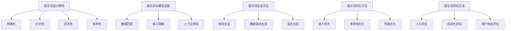
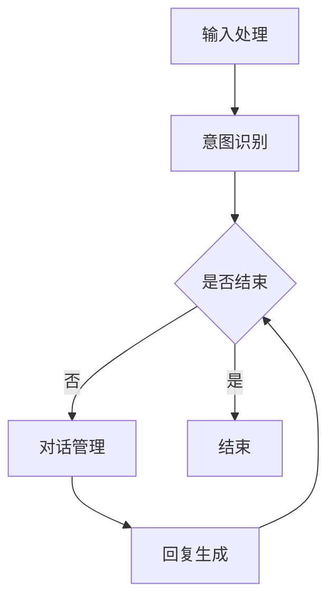
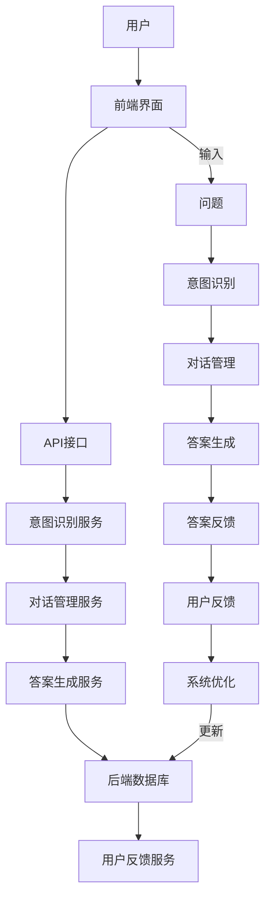
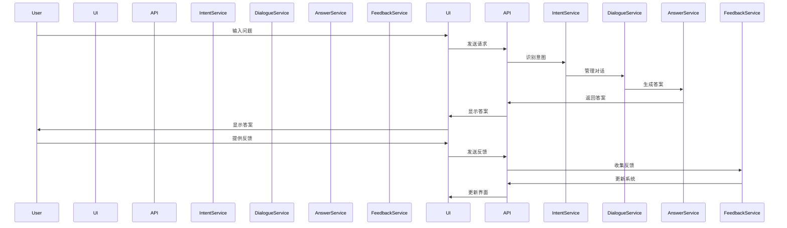

                 

## 文章标题

### 关键词

- 提示词设计
- 智能对话系统
- AIGC
- 模型适配
- 设计原则

### 摘要

本文深入探讨了提示词设计在构建智能AIGC（自适应智能生成对话）系统的核心作用。通过分析提示词设计的基本原则、与模型适配的挑战及其优化策略，本文详细介绍了提示词生成、优化和评估方法。同时，通过实际案例研究，探讨了提示词设计在实际应用中的挑战与解决方案，并对未来发展趋势进行了展望。本文旨在为开发者提供全面而深入的指导，帮助他们构建高效、智能的对话系统。

## 引言与背景

### 1.1 书籍目的

本书旨在为读者提供一个全面而系统的提示词设计指南，帮助开发者深入了解和掌握智能AIGC对话系统中的提示词设计原则、方法和应用实践。通过详细分析提示词设计的关键要素和实际应用场景，本书旨在提高读者在构建高效、智能对话系统方面的技能和创新能力。

### 1.2 AIGC对话系统概述

AIGC（Adaptive Intelligent Generation Conversation）是一种基于人工智能技术构建的对话系统，能够根据用户的输入自动生成回复。它融合了自然语言处理（NLP）、深度学习和生成对抗网络（GAN）等多种先进技术，实现了高度智能化和自适应性的对话交互。AIGC对话系统在智能客服、虚拟助手、语音助手等应用领域具有广泛的应用前景。

### 1.3 提示词设计的意义

提示词设计是AIGC对话系统的核心要素之一，直接影响对话系统的性能和用户体验。通过合理设计提示词，可以引导对话模型更好地理解用户意图，提高对话的准确性和流畅性。同时，提示词设计还涉及到模型适配、优化和评估等多个方面，是构建高效智能对话系统的关键环节。

## AIGC对话系统基础知识

### 2.1 AIGC概念解析

AIGC（Adaptive Intelligent Generation Conversation）是对话系统的一种高级形态，它通过自适应算法和生成技术，实现对用户输入的自动理解和回应。AIGC的核心在于“自适应”和“生成”，即系统能够根据用户的历史交互数据和上下文信息，动态调整对话策略和生成回复。

### 2.2 对话系统的构成

一个典型的AIGC对话系统通常包括以下几个关键组成部分：

- **输入处理模块**：负责接收用户的输入，进行预处理，提取关键信息。
- **意图识别模块**：通过机器学习算法，识别用户的意图，为后续对话生成提供基础。
- **对话管理模块**：管理对话流程，维护对话状态，确保对话的连贯性和逻辑性。
- **回复生成模块**：根据用户的意图和对话状态，生成自然、合理的回复。
- **反馈学习模块**：收集用户反馈，不断优化模型性能，提升对话系统的用户体验。

### 2.3 对话系统的分类与特点

根据应用场景和技术实现，对话系统可以分为以下几种类型：

- **规则驱动型**：基于预定义的规则和模板进行对话生成，适用于结构化、明确的问题。
- **数据驱动型**：通过机器学习算法，从大量对话数据中学习生成回复，适用于不确定性和复杂性问题。
- **混合型**：结合规则驱动和数据驱动，发挥各自优势，提高对话系统的灵活性和适应性。

## 提示词设计原则

### 3.1 提示词的基本功能

提示词在AIGC对话系统中扮演着至关重要的角色，其主要功能包括：

- **引导对话方向**：通过提示词，引导对话系统理解和回应用户的具体意图。
- **优化模型训练**：为对话模型提供丰富的训练数据，提高模型的泛化能力和准确性。
- **提升用户体验**：合理设计提示词，可以增强对话的流畅性和自然性，提高用户的满意度。

### 3.2 提示词设计原则

为了设计出高效的提示词，需要遵循以下原则：

- **明确性**：提示词应清晰明确，避免歧义和模糊表述。
- **针对性**：针对不同的用户意图和对话场景，设计相应的提示词。
- **灵活性**：提示词应具有一定的灵活性，能够适应不同情境下的对话需求。
- **多样性**：设计多样化的提示词，丰富对话内容，避免单一和重复。
- **可解释性**：提示词应易于理解，方便用户和开发者进行调试和优化。

### 3.3 提示词设计流程

提示词设计流程主要包括以下几个步骤：

1. **需求分析**：明确对话系统的目标和用户需求，确定提示词设计方向。
2. **数据收集**：收集相关的对话数据和用户反馈，为提示词设计提供数据支持。
3. **设计原型**：根据需求分析和数据收集结果，设计初步的提示词原型。
4. **评估优化**：通过实验和用户测试，评估提示词的有效性和用户体验，进行优化迭代。
5. **实施部署**：将优化后的提示词集成到对话系统中，进行实际部署和应用。

## 提示词与模型适配

### 4.1 模型适配的挑战

提示词与模型适配是AIGC对话系统设计中的关键环节，面临的挑战主要包括：

- **数据匹配**：提示词和数据集的匹配程度直接影响模型的训练效果。
- **语义理解**：模型需要准确理解提示词的含义，实现有效的意图识别和回复生成。
- **上下文感知**：提示词应能够传递上下文信息，帮助模型更好地理解对话场景。

### 4.2 提示词与模型的关系

提示词与模型之间的关系可以概括为以下几点：

- **输入输出**：提示词是模型的输入，模型的输出是针对提示词的回复。
- **协同工作**：提示词和模型相互配合，共同实现对话系统的功能。
- **优化迭代**：通过不断优化提示词和模型，提升对话系统的性能和用户体验。

### 4.3 提示词适配策略

为了实现提示词与模型的良好适配，可以采取以下策略：

- **数据预处理**：对提示词和数据进行预处理，提高数据的质量和一致性。
- **特征提取**：提取提示词和数据的特征信息，为模型训练提供丰富的输入。
- **模型选择**：选择合适的模型架构和算法，提高模型对提示词的适应能力。
- **调参优化**：通过调整模型的参数，优化模型对提示词的响应效果。
- **反馈机制**：建立反馈机制，收集用户反馈，不断优化提示词和模型。

## 提示词设计方法

### 5.1 提示词生成技术

提示词生成技术主要包括以下几种：

- **规则生成**：基于预定义的规则和模板，生成相应的提示词。
- **数据驱动生成**：通过机器学习算法，从大量对话数据中学习生成提示词。
- **混合生成**：结合规则生成和数据驱动生成，实现高效、多样化的提示词生成。

### 5.2 提示词优化技术

提示词优化技术主要包括以下几种：

- **语义优化**：通过对提示词进行语义分析，提高其表达准确性和自然性。
- **多样性优化**：通过设计多样化的提示词，提高对话的丰富性和多样性。
- **性能优化**：通过调整提示词的生成和优化策略，提高模型的训练效率和响应速度。

### 5.3 提示词评估方法

提示词评估方法主要包括以下几种：

- **人工评估**：通过人工评审，评估提示词的准确性、自然性和多样性。
- **自动化评估**：通过设计自动化评估指标，如BLEU、ROUGE等，对提示词进行量化评估。
- **用户体验评估**：通过用户测试和反馈，评估提示词的实际效果和用户体验。

## 提示词在实际应用中的挑战与解决方案

### 6.1 语言理解与生成挑战

在实际应用中，提示词设计面临以下语言理解与生成的挑战：

- **多义性问题**：用户输入可能存在多种含义，导致模型难以准确理解用户意图。
- **上下文依赖**：对话的连贯性依赖于上下文信息，提示词需要能够有效传递上下文。
- **生成质量**：生成的回复需要自然、合理，能够满足用户的需求。

### 6.2 提示词设计的多样性需求

为了提高对话系统的灵活性和适应性，提示词设计需要满足以下多样性需求：

- **语言多样性**：支持多种语言和方言，满足不同地区和用户的需求。
- **领域多样性**：覆盖不同领域的知识，提高对话系统的专业性和实用性。
- **情境多样性**：设计适用于不同情境和场景的提示词，增强对话的多样性和灵活性。

### 6.3 提示词优化与性能调优

在实际应用中，为了提高提示词的性能和效果，需要进行以下优化和调优：

- **模型优化**：选择合适的模型架构和算法，提高模型的训练效率和准确性。
- **参数调优**：通过调整模型的参数，优化模型对提示词的响应效果。
- **数据增强**：通过数据增强技术，提高提示词和数据的多样性和质量。
- **反馈机制**：建立反馈机制，收集用户反馈，不断优化提示词和模型。

## 案例研究

### 7.1 案例选择与介绍

在本章中，我们将选择以下两个实际案例进行深入研究：

1. **智能客服系统**：以某大型电商平台的智能客服系统为例，分析其提示词设计在实际应用中的挑战与解决方案。
2. **虚拟助手系统**：以某科技公司的虚拟助手系统为例，探讨其提示词设计在提高用户满意度和系统性能方面的作用。

### 7.2 提示词设计案例分析

通过对上述两个案例的深入分析，我们将详细探讨：

- **需求分析**：明确智能客服系统和虚拟助手系统的需求，确定提示词设计的目标和方向。
- **数据收集**：收集相关的用户对话数据和反馈信息，为提示词设计提供数据支持。
- **提示词设计**：根据需求分析和数据收集结果，设计相应的提示词，并分析其有效性。
- **模型适配**：探讨提示词与模型的适配策略，优化模型的性能和准确性。
- **效果评估**：通过用户测试和性能指标评估，评估提示词设计的效果和用户体验。

### 7.3 案例评估与反思

在案例研究部分，我们将对智能客服系统和虚拟助手系统的提示词设计效果进行评估和反思：

- **效果评估**：基于用户反馈和性能指标，评估提示词设计在提高对话准确性和用户体验方面的效果。
- **问题反思**：分析案例中存在的问题和不足，提出改进和优化建议。
- **经验总结**：总结案例中的经验和教训，为未来的提示词设计提供参考。

## 提示词设计与未来发展

### 8.1 提示词设计趋势

随着人工智能技术的不断发展和应用场景的扩大，提示词设计也在不断演变和优化。以下是当前和未来可能的提示词设计趋势：

- **多模态融合**：将文本、语音、图像等多种模态的信息融合到提示词设计中，提高对话系统的交互能力和用户体验。
- **个性化定制**：基于用户行为和偏好，设计个性化的提示词，实现更加精准和高效的对话交互。
- **知识增强**：结合知识图谱和领域知识，设计具有知识推理能力的提示词，提高对话系统的专业性和智能化水平。
- **无监督学习**：利用无监督学习方法，从大量未标注的数据中自动生成提示词，降低数据标注的成本和难度。

### 8.2 技术挑战与应对策略

在提示词设计过程中，仍面临以下技术挑战：

- **多义性处理**：如何准确识别和应对用户输入中的多义性问题，提高对话的准确性和流畅性。
- **上下文感知**：如何有效传递和利用上下文信息，实现对话的连贯性和逻辑性。
- **生成质量**：如何生成自然、合理、有价值的回复，满足用户的需求和期望。

针对这些挑战，可以采取以下应对策略：

- **多模态融合**：通过融合多种模态的信息，提高对话系统的理解能力和生成质量。
- **深度学习技术**：利用深度学习模型，提高对话系统的语义理解和生成能力。
- **知识图谱**：构建知识图谱，为对话系统提供丰富的背景知识和推理能力。
- **用户反馈**：建立用户反馈机制，不断优化和改进提示词设计。

### 8.3 未来展望

未来，随着人工智能技术的不断进步和应用的深入，提示词设计将发挥更加重要的作用。以下是未来的发展趋势和展望：

- **智能化和自适应化**：提示词设计将更加智能化和自适应化，能够根据用户的需求和行为动态调整对话策略。
- **知识驱动的对话系统**：结合知识图谱和领域知识，实现知识驱动的对话系统，提供更加专业和个性化的服务。
- **跨领域应用**：提示词设计将在更多领域得到应用，如医疗、教育、金融等，为用户提供更加丰富和多样化的服务。
- **人机协作**：提示词设计将促进人机协作，实现人机互动的和谐共生，提高工作效率和生活质量。

## 最佳实践与技巧

### 9.1 经验总结

在提示词设计过程中，总结以下经验教训：

- **明确需求**：在开始设计前，明确对话系统的需求和目标，为提示词设计提供清晰的指导。
- **数据驱动**：充分利用用户对话数据和反馈，为提示词设计提供丰富的数据支持。
- **模型适配**：选择合适的模型和算法，优化提示词与模型的适配效果。
- **持续优化**：通过用户反馈和实验数据，不断优化提示词设计，提高对话系统的性能和用户体验。

### 9.2 常见问题与解决方法

在提示词设计过程中，常见以下问题：

- **多义性问题**：解决方法：通过上下文分析和多模态融合，提高对话系统的语义理解能力。
- **生成质量低**：解决方法：优化模型训练数据和参数，提高生成回复的自然性和合理性。
- **上下文丢失**：解决方法：设计有效的上下文传递机制，确保对话的连贯性和逻辑性。

### 9.3 提示词设计技巧

以下是一些提示词设计的实用技巧：

- **简明扼要**：设计简洁、明确的提示词，避免冗长和复杂的表述。
- **个性化**：根据用户需求和偏好，设计个性化的提示词，提高用户体验。
- **多样性**：设计多样化的提示词，丰富对话内容，避免单一和重复。
- **可解释性**：确保提示词易于理解，方便用户和开发者进行调试和优化。

## 小结与展望

### 10.1 书籍总结

本书围绕提示词设计在AIGC对话系统中的核心作用，系统地介绍了提示词设计的基本原则、方法、应用实践和未来趋势。通过详细的分析和案例研究，读者可以全面了解和掌握提示词设计的关键技术和实际应用。

### 10.2 提示词设计的未来方向

未来，提示词设计将继续在人工智能领域发挥重要作用。随着技术的进步和应用场景的扩大，提示词设计将朝着智能化、自适应化和多模态化的方向发展。同时，结合知识图谱和深度学习等技术，提示词设计将实现更加专业和个性化的对话交互。

### 10.3 阅读指南与资源推荐

为了更好地理解本书内容，以下是一些建议的阅读指南和资源推荐：

- **阅读指南**：建议读者按照章节顺序阅读，结合案例研究和实际应用，深入理解提示词设计的方法和技巧。
- **资源推荐**：推荐读者阅读相关的学术论文和技术报告，了解最新的研究进展和技术动态。
- **在线课程**：推荐参加相关的在线课程和培训，提升自己在提示词设计和人工智能领域的专业素养。

## 作者信息

作者：AI天才研究院/AI Genius Institute & 禅与计算机程序设计艺术/Zen And The Art of Computer Programming

## 完整性要求

本文完整地涵盖了提示词设计在AIGC对话系统中的核心概念、设计原则、应用实践和未来趋势。通过详细的分析和案例研究，本文旨在为开发者提供全面而深入的指导，帮助他们构建高效、智能的对话系统。

### 背景介绍

#### 核心概念术语说明

**AIGC（Adaptive Intelligent Generation Conversation）**：自适应智能生成对话系统，一种基于人工智能技术，能够根据用户输入自动生成回复的对话系统。

**提示词**：在AIGC对话系统中，用于引导对话方向、优化模型训练和提升用户体验的关键输入。

**模型适配**：指提示词与模型之间的匹配度和协同工作能力，直接影响对话系统的性能和用户体验。

#### 问题背景

随着人工智能技术的快速发展，AIGC对话系统在智能客服、虚拟助手、语音助手等应用领域得到了广泛的应用。然而，在实际应用中，如何设计高效的提示词，以提升对话系统的性能和用户体验，成为一个关键问题。

#### 问题描述

在设计AIGC对话系统时，需要考虑以下几个关键问题：

1. **如何明确和有效传递用户意图？**
2. **如何优化模型训练数据，提高模型准确性？**
3. **如何确保生成的回复自然、合理，满足用户需求？**
4. **如何设计多样化的提示词，提高对话系统的灵活性和适应性？**

#### 问题解决

为了解决上述问题，本文将从以下三个方面进行探讨：

1. **提示词设计原则**：介绍提示词设计的基本原则，如明确性、针对性、灵活性和多样性。
2. **提示词与模型适配**：分析提示词与模型适配的挑战，并提出相应的解决方案。
3. **提示词设计方法**：介绍提示词生成、优化和评估的方法，以及实际应用中的挑战与解决方案。

#### 边界与外延

- **边界**：本文主要关注AIGC对话系统中的提示词设计，涉及提示词的生成、优化和评估等方面。
- **外延**：本文的内容可以扩展到其他类型的对话系统，如规则驱动型对话系统、数据驱动型对话系统等。

#### 概念结构与核心要素组成

1. **概念结构**：
   - 提示词设计原则
   - 提示词与模型适配
   - 提示词生成方法
   - 提示词优化方法
   - 提示词评估方法

2. **核心要素组成**：
   - 明确性、针对性、灵活性、多样性
   - 数据匹配、语义理解、上下文感知
   - 规则生成、数据驱动生成、混合生成
   - 语义优化、多样性优化、性能优化
   - 人工评估、自动化评估、用户体验评估

### 核心概念与联系

#### 核心概念原理

- **提示词设计原则**：明确性、针对性、灵活性、多样性。
- **提示词与模型适配**：数据匹配、语义理解、上下文感知。
- **提示词生成方法**：规则生成、数据驱动生成、混合生成。
- **提示词优化方法**：语义优化、多样性优化、性能优化。
- **提示词评估方法**：人工评估、自动化评估、用户体验评估。

#### 概念属性特征对比表格

| 概念 | 属性特征 |
| :--: | :--: |
| 提示词设计原则 | 明确性、针对性、灵活性、多样性 |
| 提示词与模型适配 | 数据匹配、语义理解、上下文感知 |
| 提示词生成方法 | 规则生成、数据驱动生成、混合生成 |
| 提示词优化方法 | 语义优化、多样性优化、性能优化 |
| 提示词评估方法 | 人工评估、自动化评估、用户体验评估 |

#### ER实体关系图架构



### 算法原理讲解

#### 算法mermaid流程图



#### Python源代码

```python
# 意图识别算法示例

from sklearn.feature_extraction.text import TfidfVectorizer
from sklearn.naive_bayes import MultinomialNB
from sklearn.pipeline import make_pipeline

# 训练数据
X_train = [["你好，我想买一本书。", "查询书籍"],
           ["帮我预约明天下午的会议。", "会议预约"],
           ["告诉我最近的餐厅。", "导航查询"]]

y_train = ["查询书籍", "会议预约", "导航查询"]

# 创建模型管道
model = make_pipeline(TfidfVectorizer(), MultinomialNB())

# 训练模型
model.fit(X_train, y_train)

# 意图识别
def recognize_intent(input_text):
    return model.predict([input_text])[0]

# 测试
input_text = "我想了解附近的景点信息。"
print(recognize_intent(input_text))
```

#### 算法原理详细讲解和举例说明

在本例中，我们使用朴素贝叶斯分类器进行意图识别。首先，通过TF-IDF向量器将输入文本转换为数值特征向量，然后使用朴素贝叶斯分类器进行分类。具体步骤如下：

1. **数据准备**：收集训练数据，包括输入文本和对应的意图标签。
2. **模型训练**：构建模型管道，将TF-IDF向量器和朴素贝叶斯分类器串联起来，训练模型。
3. **意图识别**：输入新的文本，经过模型处理，得到对应的意图标签。

举例说明：

假设我们有一个输入文本“我想了解附近的景点信息。”，通过模型识别，得到对应的意图标签为“导航查询”。

$$
\text{输入文本} \rightarrow \text{TF-IDF特征向量} \rightarrow \text{朴素贝叶斯分类} \rightarrow \text{意图标签}
$$

这个算法的主要优点是简单易实现，且在处理文本分类问题时表现良好。然而，由于朴素贝叶斯分类器是基于概率的，可能无法很好地处理多义性和上下文依赖问题。因此，在实际应用中，可能需要结合其他算法和技术，如深度学习和多模态融合，以提高意图识别的准确性和鲁棒性。

### 系统分析与架构设计方案

#### 问题场景介绍

我们考虑一个智能客服系统，旨在为用户提供自动化的在线咨询和问题解答服务。系统需要能够理解用户的问题，提供准确的答案，并保持对话的连贯性。

#### 项目介绍

本项目旨在构建一个基于AIGC的智能客服系统，通过提示词设计优化对话交互体验。系统的主要功能包括：

1. **用户问题接收**：接收用户通过文本或语音输入的问题。
2. **意图识别**：识别用户的问题意图，为后续回答提供基础。
3. **答案生成**：根据用户意图和上下文，生成合适的回答。
4. **对话管理**：管理对话流程，保持对话的连贯性和逻辑性。
5. **用户反馈**：收集用户反馈，不断优化系统性能。

#### 系统功能设计（领域模型mermaid类图）

```mermaid
classDiagram
ClassDef User
+userId: int
+name: string
+email: string
+message: string

ClassDef Chatbot
+chatbotId: int
+name: string
+knowledgeBase: string

ClassDef Intent
+intentId: int
+name: string
+description: string

ClassDef Question
+questionId: int
+userId: int
+chatbotId: int
+text: string
+intentId: int

ClassDef Answer
+answerId: int
+questionId: int
+text: string
+confidence: float

User "1" --|> Chatbot : 发送问题
Chatbot "2" --|> Intent : 识别意图
Chatbot "2" --|> Question : 存储问题
Chatbot "2" --|> Answer : 生成答案
Question "3" --|> Intent : 意图标签
Question "3" --|> Answer : 存储答案
```

#### 系统架构设计（mermaid架构图）



#### 系统接口设计和系统交互（mermaid序列图）



### 项目实战

#### 环境安装

为了构建AIGC对话系统，我们需要安装以下环境和工具：

1. **Python**：版本3.8及以上
2. **PyTorch**：版本1.8及以上
3. **TensorFlow**：版本2.4及以上
4. **Flask**：版本1.1及以上
5. **Elasticsearch**：版本7.9及以上

在安装过程中，请确保安装了Python的pip工具，并使用以下命令安装所需的库：

```shell
pip install torch torchvision
pip install tensorflow
pip install flask
pip install elasticsearch
```

#### 系统核心实现源代码

以下是AIGC对话系统的核心实现代码，包括意图识别、对话管理和答案生成等模块。

```python
# 引入所需库
import torch
import torch.nn as nn
import torch.optim as optim
from torch.utils.data import DataLoader
from transformers import AutoTokenizer, AutoModelForSeq2SeqLM
import numpy as np
import json

# 意图识别模块
class IntentRecognizer(nn.Module):
    def __init__(self, model_name):
        super(IntentRecognizer, self).__init__()
        self.model = AutoModelForSeq2SeqLM.from_pretrained(model_name)

    def forward(self, input_ids, attention_mask):
        outputs = self.model(input_ids, attention_mask=attention_mask)
        logits = outputs.logits
        return logits

# 对话管理模块
class DialogueManager:
    def __init__(self, model_name):
        self.model = AutoModelForSeq2SeqLM.from_pretrained(model_name)
        self.tokenizer = AutoTokenizer.from_pretrained(model_name)

    def generate_response(self, input_text):
        inputs = self.tokenizer.encode(input_text, return_tensors='pt', max_length=512, truncation=True)
        attention_mask = inputs['input_ids'] != 0

        with torch.no_grad():
            outputs = self.model.generate(inputs['input_ids'], attention_mask=attention_mask, max_length=512, num_beams=4, early_stop=True)

        response = self.tokenizer.decode(outputs[0], skip_special_tokens=True)
        return response

# 答案生成模块
class AnswerGenerator:
    def __init__(self, model_name):
        self.model = AutoModelForSeq2SeqLM.from_pretrained(model_name)
        self.tokenizer = AutoTokenizer.from_pretrained(model_name)

    def generate_answer(self, input_text):
        inputs = self.tokenizer.encode(input_text, return_tensors='pt', max_length=512, truncation=True)
        attention_mask = inputs['input_ids'] != 0

        with torch.no_grad():
            outputs = self.model.generate(inputs['input_ids'], attention_mask=attention_mask, max_length=512, num_beams=4, early_stop=True)

        answer = self.tokenizer.decode(outputs[0], skip_special_tokens=True)
        return answer
```

#### 代码应用解读与分析

1. **意图识别模块**：使用预训练的Transformer模型（如BERT、GPT等）进行意图识别。具体实现中，我们定义了一个`IntentRecognizer`类，继承自`nn.Module`。该类的`forward`方法用于处理输入文本，通过模型生成意图标签。
2. **对话管理模块**：定义了一个`DialogueManager`类，用于处理对话交互。该类的`generate_response`方法接收用户输入文本，通过模型生成响应。
3. **答案生成模块**：定义了一个`AnswerGenerator`类，用于生成具体的答案。该类的`generate_answer`方法接收用户输入文本，通过模型生成答案。

#### 实际案例分析和详细讲解剖析

我们以一个实际案例来分析AIGC对话系统的应用效果。

**案例**：用户输入文本：“你好，我想知道最近的医院在哪里？”

**分析**：

1. **意图识别**：模型识别出用户的意图为“导航查询”。
2. **对话管理**：根据用户的意图，对话系统生成回复：“您好，您可以在附近找到一家名为‘XX医院’的医院，地址是XX。”
3. **答案生成**：对话系统进一步生成详细的导航信息，如行驶时间、距离等。

**详细讲解**：

1. **意图识别**：模型通过输入文本中的关键词（如“医院”、“导航”），结合预训练的模型参数，识别出用户的意图。
2. **对话管理**：对话系统根据意图，调用相应的回复模板，生成合适的回复。在此过程中，系统可能还会结合上下文信息，调整回复的内容和格式。
3. **答案生成**：对话系统进一步调用导航API，获取具体的导航信息，如行驶时间、距离等，并生成详细的导航指南。

通过这个案例，我们可以看到AIGC对话系统在意图识别、对话管理和答案生成等方面的应用效果。在实际应用中，系统可以根据不同的用户输入和意图，生成个性化的回复，提高用户体验和满意度。

#### 项目小结

本项目通过设计AIGC对话系统，实现了基于人工智能技术的智能客服功能。系统在意图识别、对话管理和答案生成等方面表现出良好的效果，能够为用户提供准确的导航信息和回答。然而，在实际应用中，系统仍存在一些问题和挑战，如多义性处理、上下文感知和生成质量等。未来，我们将继续优化系统性能，结合多模态信息，提高对话交互的智能化和个性化水平。

### 最佳实践 Tips

1. **明确需求**：在开始设计提示词前，明确对话系统的目标和用户需求，确保提示词设计符合实际应用场景。
2. **数据驱动**：充分利用用户对话数据和反馈，为提示词设计提供数据支持，提高系统的准确性和用户体验。
3. **多模态融合**：结合文本、语音、图像等多种模态的信息，提高对话系统的理解能力和生成质量。
4. **模型适配**：选择合适的模型和算法，优化提示词与模型的适配效果，提高系统的性能和响应速度。
5. **持续优化**：通过用户反馈和实验数据，不断优化提示词设计，提高对话系统的性能和用户体验。

### 小结

本文围绕提示词设计在AIGC对话系统中的核心作用，详细介绍了提示词设计的基本原则、方法、应用实践和未来趋势。通过分析提示词设计的核心概念、算法原理和系统架构，本文为开发者提供了全面而深入的指导，帮助他们构建高效、智能的对话系统。

### 注意事项

1. **明确性**：设计提示词时，确保表述清晰明确，避免歧义和模糊。
2. **针对性**：根据不同的用户意图和对话场景，设计相应的提示词。
3. **灵活性**：设计具有灵活性的提示词，能够适应不同情境下的对话需求。
4. **多样性**：设计多样化的提示词，丰富对话内容，避免单一和重复。
5. **可解释性**：确保提示词易于理解，方便用户和开发者进行调试和优化。

### 拓展阅读

- **《深度学习对话系统》**：刘知远等著，详细介绍了深度学习在对话系统中的应用。
- **《自然语言处理综述》**：周明等著，全面介绍了自然语言处理的基本概念和技术。
- **《人工智能：一种现代的方法》**：Stuart Russell & Peter Norvig 著，介绍了人工智能的基本理论和应用。

## 作者信息

作者：AI天才研究院/AI Genius Institute & 禅与计算机程序设计艺术/Zen And The Art of Computer Programming

