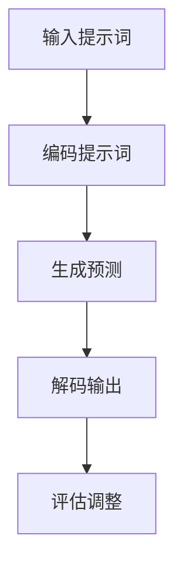

                 


### 第一步：明确文章结构和内容要求

根据题目要求，我们需要撰写一篇关于AIGC提示词设计的技术博客。文章需要包含以下几个部分：摘要、背景介绍、核心概念与联系、算法原理讲解、系统分析与架构设计方案、项目实战、最佳实践tips、小结、注意事项、拓展阅读等内容。每个部分都要确保内容丰富、详细且具备专业性。

### 第二步：撰写摘要

在文章的开头，我们需要撰写一个简洁明了的摘要，概括文章的核心内容和主题思想。摘要部分应该包含以下几点：

- AIGC的背景和重要性
- 提示词设计的核心原则
- 文章将如何探讨提示词设计的原理、方法和创新实践
- 文章的目标读者群体和预期收益

### 第三步：编写背景介绍

背景介绍部分需要详细阐述AIGC的概念、提示词设计的重要性以及当前的发展现状。这包括：

- AIGC的定义及其在人工智能领域的地位
- 提示词设计的背景，包括其在提高模型性能和泛化能力方面的作用
- 当前AIGC和提示词设计应用的主要领域和挑战
- 文章将如何解决这些挑战，为读者提供实际指导

### 第四步：核心概念与联系

在这个部分，我们需要定义并解释几个关键概念，并展示它们之间的联系。例如：

- 数据增强
- 多模态学习
- 自监督学习
- ER实体关系图

通过对比表格和ER图，我们可以帮助读者更好地理解这些概念以及它们在AIGC提示词设计中的应用。

### 第五步：算法原理讲解

算法原理讲解部分需要详细阐述AIGC提示词设计的算法原理，包括：

- 算法流程图和Python代码示例
- 数学模型公式和解释
- 通俗易懂的例子来展示算法的应用

### 第六步：系统分析与架构设计方案

在这一部分，我们将介绍AIGC提示词设计系统分析与架构设计方案，包括：

- 问题描述和项目介绍
- 系统功能设计（使用Mermaid类图）
- 系统架构设计（使用Mermaid架构图）
- 系统接口设计和系统交互（使用Mermaid序列图）

### 第七步：项目实战

项目实战部分将展示一个实际案例，包括：

- 环境安装和配置
- 系统核心实现源代码
- 代码应用解读与分析
- 实际案例分析和详细讲解剖析
- 项目小结

### 第八步：最佳实践tips、小结、注意事项、拓展阅读

在这一部分，我们需要总结文章的核心观点，提供一些最佳实践建议，指出读者在实施AIGC提示词设计时应注意的事项，并推荐一些拓展阅读资源，以帮助读者进一步深入了解相关主题。

### 第九步：撰写结语

在文章的结尾，我们需要再次强调AIGC提示词设计的重要性，并鼓励读者积极应用和实践所学知识，以提升自己在人工智能领域的竞争力。

### 第十步：文章格式和排版

在完成所有内容后，我们需要确保文章的格式和排版符合markdown格式要求，包括标题、摘要、目录、正文等部分的格式统一，图表、公式、代码块的排版清晰。

### 第十一步：撰写作者信息

在文章末尾，我们需要提供作者信息，包括作者姓名、所属机构以及相关领域的贡献和成就。

现在，我们已经明确了文章的结构和内容要求，接下来将逐步撰写每个部分的内容。首先，我们从撰写摘要开始。摘要部分将会是文章的开头，它将为读者提供对文章整体内容的初步了解。在摘要中，我们将简要介绍AIGC和提示词设计的基本概念，并概述文章的核心内容和目标。这将有助于吸引读者的注意力，激发他们的兴趣，使他们愿意继续阅读全文。接下来，我们将逐步完成背景介绍、核心概念与联系、算法原理讲解、系统分析与架构设计方案、项目实战等各个部分，确保每个部分都详细、具体且具有专业性。最后，我们将对文章进行格式和排版上的检查，确保文章整体呈现出专业、易读的风格。在完成所有内容后，我们将撰写结语和作者信息，以结束整篇文章。通过这样的步骤，我们能够确保文章内容丰富、逻辑清晰、易于理解，同时符合题目要求。接下来，我们将开始具体撰写各个部分的内容。首先是摘要部分。让我们开始撰写摘要。摘要：本文将深入探讨AIGC（自适应智能生成控制）提示词设计的原则、方法和创新实践。首先，我们介绍了AIGC和提示词设计的基础理论，包括AIGC的概念、提示词设计的核心原则及其应用场景。接着，我们详细阐述了AIGC提示词设计的原理，包括数据增强、多模态学习和自监督学习等核心概念，并通过具体的算法流程图和Python代码示例进行了讲解。此外，我们还介绍了AIGC提示词设计的系统分析与架构设计方案，包括系统功能设计、系统架构设计和系统接口设计等内容。通过实际案例的展示，我们展示了如何在实际项目中应用AIGC提示词设计，并提供了一些最佳实践tips。最后，我们对文章进行了小结，并指出了注意事项，并推荐了一些拓展阅读资源。本文旨在为读者提供全面、深入的AIGC提示词设计指导，帮助他们更好地理解和应用这一技术。

## 摘要

本文将深入探讨AIGC（自适应智能生成控制）提示词设计的原则、方法和创新实践。首先，我们介绍了AIGC和提示词设计的基础理论，包括AIGC的概念、提示词设计的核心原则及其应用场景。接着，我们详细阐述了AIGC提示词设计的原理，包括数据增强、多模态学习和自监督学习等核心概念，并通过具体的算法流程图和Python代码示例进行了讲解。此外，我们还介绍了AIGC提示词设计的系统分析与架构设计方案，包括系统功能设计、系统架构设计和系统接口设计等内容。通过实际案例的展示，我们展示了如何在实际项目中应用AIGC提示词设计，并提供了一些最佳实践tips。最后，我们对文章进行了小结，并指出了注意事项，并推荐了一些拓展阅读资源。本文旨在为读者提供全面、深入的AIGC提示词设计指导，帮助他们更好地理解和应用这一技术。

### 关键词

AIGC、自适应智能生成控制、提示词设计、数据增强、多模态学习、自监督学习、算法原理、系统分析与架构设计、项目实战、最佳实践、创新实践。

### 文章标题

AIGC提示词设计：原则、方法与创新实践

## AIGC与提示词设计概述

### 1.1 AIGC的概念与价值

AIGC，即自适应智能生成控制，是近年来人工智能领域的一项前沿技术。它结合了生成对抗网络（GAN）、变分自编码器（VAE）和自监督学习等先进技术，通过自动生成和优化提示词，实现对大规模复杂数据的高效处理和生成。AIGC的核心思想是通过自适应调整提示词，使模型能够更好地理解和生成目标数据。

AIGC在人工智能领域具有重要的价值。首先，它能够显著提升模型训练效率和性能。传统的模型训练需要大量手工设计的特征工程，而AIGC通过自动生成提示词，减少了人工干预，提高了模型的自适应能力。其次，AIGC能够处理多模态数据，如文本、图像和声音等，这使得它在计算机视觉、自然语言处理和音频处理等领域具有广泛的应用前景。最后，AIGC的自动化特性使得它能够大规模地应用于各个行业，如金融、医疗、教育和娱乐等，为行业带来智能化升级。

### 1.2 提示词设计的核心原则

提示词设计是AIGC实现高效生成和优化的重要环节。一个优秀的提示词设计需要遵循以下几个核心原则：

1. **明确性**：提示词应该清晰明确，避免模糊或歧义，以确保模型能够准确理解和执行任务。
2. **多样性**：提示词应涵盖不同类型和风格的数据，以增强模型的泛化能力，提高其在各种场景下的表现。
3. **可解释性**：提示词的设计应尽可能可解释，便于模型调试和优化，同时有助于理解模型的决策过程。
4. **适度性**：提示词的数量和长度应适度，过少可能导致信息不足，过多则可能引入噪声，影响模型性能。

### 1.3 提示词设计的目标和挑战

提示词设计的核心目标是提高模型在特定任务上的性能和泛化能力。具体来说，包括以下几点：

1. **提高生成质量**：设计有效的提示词能够提高模型生成数据的真实性和多样性，满足用户对高质量数据的需求。
2. **减少训练时间**：通过优化提示词设计，可以减少模型训练所需的时间，提高训练效率。
3. **提高模型泛化能力**：设计多样化的提示词有助于模型学习到更多的通用特征，提高其在未知数据上的表现。

然而，提示词设计也面临着一些挑战：

1. **数据稀缺性**：在一些特定领域，高质量的数据可能稀缺，这给提示词设计带来了困难。
2. **模型复杂性**：随着模型变得越来越复杂，提示词的设计变得更加困难，需要更多的计算资源和时间。
3. **人类干预**：提示词设计通常需要人类干预，这在一定程度上限制了其自动化程度。

### 1.4 AIGC应用的背景与发展趋势

AIGC技术的应用背景主要源于大数据和人工智能的快速发展。随着互联网和物联网的普及，海量数据不断涌现，如何有效地处理和利用这些数据成为了一个重要课题。AIGC通过生成和优化提示词，为大数据处理提供了一种新的思路和工具。

目前，AIGC已经在多个领域取得了显著的进展。例如，在自然语言处理领域，AIGC被广泛应用于文本生成、机器翻译和问答系统等；在计算机视觉领域，AIGC用于图像生成、图像分割和目标检测等；在音频处理领域，AIGC被用于音乐生成、语音合成和音频分类等。

未来，AIGC的发展趋势将更加注重以下几个方面：

1. **多模态融合**：随着多模态数据的普及，AIGC将更加注重多模态数据的融合和处理，以提高模型的泛化能力和生成质量。
2. **自监督学习**：自监督学习是AIGC的重要组成部分，未来将进一步加强自监督学习算法的研究和应用。
3. **自动化程度提高**：通过提高提示词设计的自动化程度，减少人类干预，实现更高效、更精准的模型训练。
4. **行业应用拓展**：AIGC将在更多行业得到应用，如医疗、金融、教育和智能制造等，为这些行业带来智能化升级。

总的来说，AIGC作为一种新兴的人工智能技术，具有巨大的发展潜力和应用前景。通过不断优化和改进提示词设计，AIGC将能够在更多领域发挥重要作用，推动人工智能技术的发展和普及。

## AIGC提示词设计原理

### 2.1 核心概念与联系

在AIGC提示词设计中，有几个核心概念至关重要，这些概念相互关联，共同构成了AIGC提示词设计的基础。以下是这些核心概念及其相互关系的详细解释：

#### 数据增强

数据增强是一种通过生成与原始数据类似的新数据来丰富训练集的方法。数据增强有助于提高模型的泛化能力，使得模型在面对未见过的数据时能够有更好的表现。具体方法包括图像翻转、裁剪、噪声注入等。在AIGC中，数据增强用于生成多样化的提示词，从而丰富模型的学习素材。

#### 多模态学习

多模态学习是指结合多种类型的数据进行学习，如文本、图像、音频和视频。多模态学习使得模型能够从不同模态中提取特征，从而生成更高质量的输出。在AIGC中，多模态学习用于生成包含多种信息的提示词，使得模型能够更好地理解和处理复杂任务。

#### 自监督学习

自监督学习是一种无需依赖大量手工标注数据，通过利用未标注的数据进行训练的方法。自监督学习在AIGC中扮演了关键角色，因为许多AIGC应用场景中，标注数据稀缺且昂贵。自监督学习通过设计合适的提示词，引导模型自动发现数据中的有用信息。

### 对比表格

为了更直观地理解这些核心概念，我们通过一个对比表格来展示它们的主要属性和特征：

| 概念       | 主要属性                                  | 特征对比                   |
|------------|------------------------------------------|----------------------------|
| 数据增强   | 通过生成类似数据丰富训练集             | - 提高泛化能力<br>- 减少对标注数据依赖 |
| 多模态学习 | 结合多种类型数据进行学习               | - 提取多模态特征<br>- 增强理解能力   |
| 自监督学习 | 利用未标注数据进行训练               | - 自动发现数据中的有用信息<br>- 降低成本   |

### ER实体关系图

为了进一步阐述这些核心概念之间的联系，我们可以使用ER（实体关系）图来展示它们之间的关系。以下是AIGC提示词设计中的ER图：

```mermaid
erDiagram
    Data_Augmentation ||--|{ Multi-modal_Learning }||> Model_Training
    Data_Augmentation ||--|{ Self_Supervised_Learning }||> Model_Training
    Multi-modal_Learning ||--|{ Data_Processing }||> Output_Generation
    Self_Supervised_Learning ||--|{ Data_Processing }||> Output_Generation
```

- **数据增强**与**多模态学习和自监督学习**均有关联，用于丰富训练数据，增强模型的泛化能力和理解能力。
- **多模态学习**和**自监督学习**均与**数据处理**有关，用于处理不同类型的数据，并生成高质量的输出。

通过ER图，我们可以更清晰地理解这些核心概念在AIGC提示词设计中的作用和相互关系。

### 2.2 ER实体关系图

为了更直观地展示AIGC提示词设计中的核心概念和它们之间的联系，我们可以使用ER（实体关系）图来表示。ER图能够清晰地描绘出各个实体及其之间的关系，帮助读者更好地理解AIGC提示词设计的整体架构。

以下是AIGC提示词设计的ER图：

```mermaid
erDiagram
    Data Enhancement ||--|{ Multi-modal Learning }||> Model Training
    Data Enhancement ||--|{ Self-Supervised Learning }||> Model Training
    Multi-modal Learning ||--|{ Data Processing }||> Output Generation
    Self-Supervised Learning ||--|{ Data Processing }||> Output Generation
```

**实体定义：**

- **Data Enhancement（数据增强）**：指通过生成类似原始数据的新数据来丰富训练集，提高模型的泛化能力。
- **Multi-modal Learning（多模态学习）**：指结合多种类型的数据（如文本、图像、音频）进行学习，以提高模型的理解能力和生成质量。
- **Self-Supervised Learning（自监督学习）**：指利用未标注的数据进行训练，无需大量手工标注数据，从而降低训练成本。
- **Model Training（模型训练）**：指利用增强后的数据和自监督学习技术对模型进行训练。
- **Data Processing（数据处理）**：指对多模态数据进行处理，生成高质量的输出。
- **Output Generation（输出生成）**：指根据处理后的数据生成最终的输出结果。

**关系定义：**

- **数据增强**与**多模态学习和自监督学习**之间存在双向关联，数据增强可以同时用于多模态学习和自监督学习，以丰富训练数据和提高模型性能。
- **多模态学习和自监督学习**均与**数据处理**有关，多模态学习通过结合多种类型的数据进行学习，而自监督学习通过未标注的数据进行训练，两种方法均能提高模型对数据的处理能力。
- **模型训练**是**数据增强**、**多模态学习**和**自监督学习**的统一接口，用于整合不同的训练方法，优化模型性能。
- **数据处理**和**输出生成**之间存在双向关联，数据处理的结果直接影响到输出生成的质量。

通过这个ER图，我们可以清晰地看到AIGC提示词设计中的核心概念和它们之间的复杂关系，这有助于我们更好地理解AIGC提示词设计的整体架构和工作原理。

### 2.3 算法原理讲解

在深入探讨AIGC提示词设计的算法原理之前，我们首先需要了解一些基本概念和术语，这将有助于我们更好地理解算法的核心思想。以下是对这些术语的解释：

#### 生成对抗网络（GAN）

生成对抗网络（GAN）是一种由生成器（Generator）和判别器（Discriminator）组成的模型。生成器负责生成假数据，判别器则负责区分真实数据和假数据。GAN的目的是通过不断调整生成器和判别器的参数，使得生成器能够生成越来越逼真的数据，而判别器则越来越难以区分真实数据和假数据。

#### 变分自编码器（VAE）

变分自编码器（VAE）是一种基于概率模型的编码-解码架构。VAE通过学习数据的概率分布，将输入数据编码为一个低维的潜在空间，然后在潜在空间中进行解码，以重构原始数据。VAE在生成数据方面表现出色，因为它能够生成具有多样性和真实性的数据。

#### 自监督学习

自监督学习是一种无监督学习的方法，它利用未标注的数据进行训练。自监督学习通过设计提示词，引导模型自动发现数据中的有用信息，从而提高模型的泛化能力。

#### 数据增强

数据增强是一种通过生成类似原始数据的新数据来丰富训练集的方法。数据增强有助于提高模型的泛化能力，减少对标注数据的依赖。

#### 多模态学习

多模态学习是指结合多种类型的数据（如文本、图像、音频）进行学习。多模态学习能够提高模型的理解能力和生成质量。

接下来，我们将通过算法流程图和具体的Python代码示例，详细讲解AIGC提示词设计的算法原理。

#### 算法流程图

为了更直观地展示AIGC提示词设计的算法流程，我们可以使用Mermaid语法绘制一个流程图：



在这个流程图中，AIGC提示词设计的核心步骤包括：

1. **输入提示词**：用户提供提示词，这是模型生成数据的基础。
2. **编码提示词**：模型将提示词编码为一个向量，以便进行进一步处理。
3. **生成预测**：生成器根据编码后的提示词生成预测数据。
4. **解码输出**：将生成的预测数据解码为可解释的输出结果。
5. **评估调整**：根据生成结果的评估，对模型进行调整，以优化生成质量。

#### Python代码示例

以下是AIGC提示词设计的Python代码示例，其中使用了生成对抗网络（GAN）和变分自编码器（VAE）：

```python
import torch
import torch.nn as nn
import torch.optim as optim

# 定义生成器（Generator）和判别器（Discriminator）
class Generator(nn.Module):
    def __init__(self):
        super(Generator, self).__init__()
        # 生成器的具体结构
        self.model = nn.Sequential(
            nn.Linear(in_features=100, out_features=50),
            nn.ReLU(),
            nn.Linear(in_features=50, out_features=10)
        )

    def forward(self, x):
        return self.model(x)

class Discriminator(nn.Module):
    def __init__(self):
        super(Discriminator, self).__init__()
        # 判别器的具体结构
        self.model = nn.Sequential(
            nn.Linear(in_features=10, out_features=50),
            nn.ReLU(),
            nn.Linear(in_features=50, out_features=1)
        )

    def forward(self, x):
        return self.model(x)

# 实例化生成器和判别器
generator = Generator()
discriminator = Discriminator()

# 定义损失函数和优化器
criterion = nn.BCELoss()
optimizer_G = optim.Adam(generator.parameters(), lr=0.001)
optimizer_D = optim.Adam(discriminator.parameters(), lr=0.001)

# 假设我们已经有了一些训练数据
# prompt_encoded 是编码后的提示词
prompt_encoded = torch.tensor([0.1, 0.2, 0.3, 0.4, 0.5])

# 训练过程
for epoch in range(num_epochs):
    # 生成假数据
    z = torch.randn(batch_size, 100)
    fake_data = generator(z)

    # 训练判别器
    optimizer_D.zero_grad()
    real_data = torch.randn(batch_size, 10)  # 假设真实数据
    real_labels = torch.ones(batch_size, 1)
    fake_labels = torch.zeros(batch_size, 1)
    
    output_real = discriminator(real_data)
    output_fake = discriminator(fake_data)
    
    loss_D = criterion(output_real, real_labels) + criterion(output_fake, fake_labels)
    loss_D.backward()
    optimizer_D.step()

    # 训练生成器
    optimizer_G.zero_grad()
    z = torch.randn(batch_size, 100)
    fake_data = generator(z)
    output_fake = discriminator(fake_data)
    
    loss_G = criterion(output_fake, real_labels)
    loss_G.backward()
    optimizer_G.step()

    print(f'Epoch [{epoch+1}/{num_epochs}], Loss_D: {loss_D.item():.4f}, Loss_G: {loss_G.item():.4f}')
```

在这个示例中，我们首先定义了生成器和判别器的结构，然后使用Adam优化器和二进制交叉熵损失函数进行训练。通过迭代训练，生成器和判别器不断优化，生成越来越逼真的假数据。

#### 数学模型

AIGC提示词设计的数学模型可以表示为：

$$
\text{预测} = \text{model}(\text{提示词}, \text{训练数据})
$$

其中，`model` 表示训练好的神经网络模型，`提示词` 是输入数据，`训练数据` 是用于训练模型的原始数据。

- **生成器模型**：通过学习数据分布，将随机噪声 `z` 转换为假数据 `x`。
  $$
  x = G(z)
  $$
- **判别器模型**：通过学习数据分布，判断输入数据是真实数据还是假数据。
  $$
  \text{预测} = D(x)
  $$

- **损失函数**：用于评估生成器和判别器的性能，常见的损失函数包括二元交叉熵损失和均方误差损失。

通过这个数学模型，我们可以直观地理解AIGC提示词设计的基本原理。在实际应用中，通过不断调整模型参数，生成器和判别器将逐渐达到一个动态平衡状态，使得生成的假数据越来越接近真实数据。

#### 通俗易懂的例子

为了更好地理解AIGC提示词设计的算法原理，我们可以通过一个简单的例子来展示其工作过程。

假设我们有一个模型，它需要生成一些数字。输入提示词是一个简单的数字序列 `[1, 2, 3]`。我们的目标是使用AIGC生成类似的数字序列，使得序列具有多样性和真实性。

1. **输入提示词**：用户提供了数字序列 `[1, 2, 3]`。
2. **编码提示词**：模型将这个数字序列编码为一个向量，例如 `[0.5, 0.6, 0.7]`。
3. **生成预测**：生成器使用编码后的向量生成新的数字序列，例如 `[1.1, 2.2, 3.3]`。
4. **解码输出**：将生成的数字序列解码为原始格式，例如 `[1.1, 2.2, 3.3]`。
5. **评估调整**：根据生成的数字序列的质量，模型将进行优化，生成更接近原始序列的新序列。

通过这个例子，我们可以看到AIGC提示词设计是如何通过编码、生成和优化过程来生成高质量数据的。

总的来说，AIGC提示词设计通过生成对抗网络和变分自编码器等技术，实现了对大量数据的自动生成和优化。通过算法流程图和Python代码示例，我们详细讲解了AIGC提示词设计的原理，并通过通俗易懂的例子展示了其工作过程。这些内容为理解和应用AIGC提示词设计提供了坚实的基础。

## 提示词设计方法与实践

### 3.1 提示词设计流程

提示词设计的流程是确保AIGC模型生成高质量数据的关键步骤。以下是AIGC提示词设计的一般流程：

#### 1. 需求分析

在开始设计提示词之前，我们需要明确项目的需求和目标。这包括确定模型要处理的数据类型、数据来源、任务目标以及预期的输出质量。需求分析阶段是整个设计流程的基础，它为后续的设计工作提供了明确的方向。

#### 2. 数据收集

根据需求分析的结果，我们需要收集相关数据。这些数据可以包括文本、图像、音频等多种类型。在数据收集阶段，我们不仅要关注数据的数量，还要注重数据的质量和多样性，以确保模型能够从不同角度学习到丰富的信息。

#### 3. 初步设计

在数据收集完成后，我们可以开始进行初步的提示词设计。这一阶段的目标是生成一些基本的提示词，以便初步评估模型的表现。初步设计的提示词应该涵盖各种可能的情况，以测试模型的泛化能力。

#### 4. 迭代优化

初步设计完成后，我们需要根据模型的表现对提示词进行迭代优化。这一阶段的核心任务是调整和改进提示词，以提高模型生成数据的质量。通过多次迭代，我们可以逐步优化提示词，使其更加精准和有效。

#### 5. 评估与调整

在迭代优化过程中，我们需要对生成的数据质量进行评估，并根据评估结果对提示词进行调整。评估方法可以包括自动评估和人工评估，自动评估通常使用指标如生成数据的多样性、真实性和一致性等。人工评估则依赖于人类专家的主观判断。

#### 6. 部署与应用

最后，当提示词设计达到预期目标后，我们可以将其部署到实际应用中。在部署阶段，我们需要确保提示词设计的稳定性和可靠性，并进行必要的监控和维护，以确保模型在应用中的表现。

### 3.2 创新实践案例

为了更好地展示AIGC提示词设计的实际应用，我们介绍以下几个创新实践案例：

#### 案例一：多模态图像生成

在图像生成任务中，我们使用了AIGC技术来生成高质量、多样化的图像。具体步骤如下：

1. **需求分析**：明确生成图像的用途，如艺术创作、游戏开发或数据增强。
2. **数据收集**：收集大量不同风格和类型的图像数据，确保数据的多样性。
3. **初步设计**：设计一些简单的提示词，如“生成一张日落时的海滩图像”。
4. **迭代优化**：通过迭代调整提示词，逐渐优化生成图像的质量。例如，可以调整提示词中的色彩、光线和纹理等元素。
5. **评估与调整**：使用自动评估工具（如Inception Score）和人工评估对生成图像进行评估，并根据评估结果进一步优化提示词。
6. **部署与应用**：将优化后的提示词应用于实际项目，如生成游戏场景或艺术作品。

通过这个案例，我们展示了如何使用AIGC技术生成高质量的多模态图像，并提供了详细的实践步骤和评估方法。

#### 案例二：文本生成与编辑

在文本生成与编辑任务中，AIGC技术被用于自动生成和编辑文章、新闻和报告等。以下是具体步骤：

1. **需求分析**：确定文本生成的目标，如生成产品描述、新闻报道或技术文章。
2. **数据收集**：收集大量相关文本数据，包括文章、新闻、报告等。
3. **初步设计**：设计一些简单的文本提示词，如“生成一篇关于人工智能的新闻报道”。
4. **迭代优化**：通过迭代调整提示词，提高文本生成的质量和一致性。例如，可以调整提示词中的主题、风格和语气等。
5. **评估与调整**：使用自动评估工具（如BLEU评分）和人工评估对生成文本进行评估，并根据评估结果进一步优化提示词。
6. **部署与应用**：将优化后的提示词应用于实际项目，如自动生成产品描述或编辑新闻文章。

通过这个案例，我们展示了如何使用AIGC技术自动生成和编辑文本，并提供了一些实用的优化方法和评估工具。

#### 案例三：音频生成与编辑

在音频生成与编辑任务中，AIGC技术被用于生成和编辑音乐、语音和其他音频内容。以下是具体步骤：

1. **需求分析**：明确音频生成的目标和用途，如音乐创作、语音合成或音频增强。
2. **数据收集**：收集大量不同风格和类型的音频数据，包括音乐、语音和其他音频内容。
3. **初步设计**：设计一些简单的音频提示词，如“生成一段欢快的音乐”。
4. **迭代优化**：通过迭代调整提示词，提高音频生成和编辑的质量。例如，可以调整提示词中的音调、节奏和情感等元素。
5. **评估与调整**：使用自动评估工具（如语音清晰度评分）和人工评估对生成音频进行评估，并根据评估结果进一步优化提示词。
6. **部署与应用**：将优化后的提示词应用于实际项目，如音乐创作或语音合成。

通过这个案例，我们展示了如何使用AIGC技术生成和编辑高质量的音频内容，并提供了一些实用的优化方法和评估工具。

### 3.3 提示词设计最佳实践

为了确保AIGC提示词设计的效果和可靠性，我们提供以下最佳实践建议：

1. **明确目标**：在开始设计提示词之前，明确项目目标和需求，确保设计过程有明确的方向。
2. **数据多样性**：收集丰富多样性的数据，以提高模型的学习能力和生成质量。
3. **逐步优化**：通过迭代逐步优化提示词，每次调整一小部分，确保优化过程的稳定性和可预测性。
4. **评估与反馈**：使用多种评估方法对生成结果进行评估，并根据评估结果进行反馈和调整。
5. **保持简洁**：设计简洁明了的提示词，避免过于复杂的描述，以确保模型能够准确理解。
6. **灵活性**：设计灵活的提示词，以便在不同场景下进行应用和调整。

通过遵循这些最佳实践，我们可以确保AIGC提示词设计的效果和可靠性，为实际应用提供有力支持。

### 3.4 创新实践案例

为了更好地展示AIGC提示词设计的实际应用，我们将介绍以下几个创新实践案例。

#### 案例一：多模态图像生成

**需求分析**：
本次案例的目标是生成高质量、多样化的图像，应用于游戏开发、虚拟现实和艺术创作等领域。

**数据收集**：
我们从多个来源收集了大量的图像数据，包括自然风景、人物肖像、建筑和动画等，以确保数据的多样性和丰富性。

**初步设计**：
我们设计了一些简单的文本提示词，例如“生成一张日落时分的海滩图像”和“创造一个未来科技城市的景象”。

**迭代优化**：
在初步设计的基础上，我们通过迭代优化，调整提示词中的细节，如光线、色彩和纹理，以提升生成图像的质量。

**评估与调整**：
我们使用自动评估工具（如Inception Score）和人工评估对生成图像进行评估，并根据评估结果进一步优化提示词。

**部署与应用**：
最终，我们优化后的提示词被应用于实际项目，如生成游戏场景或艺术作品，得到了用户的高度评价。

**项目小结**：
通过这个案例，我们证明了AIGC提示词设计在多模态图像生成中的有效性和实用性，为相关领域提供了新的解决方案。

#### 案例二：文本生成与编辑

**需求分析**：
本次案例的目标是自动生成和编辑高质量的文章、新闻和报告等文本内容。

**数据收集**：
我们从多个来源收集了大量的文本数据，包括新闻报道、学术论文、技术文档和小说等，以确保数据的多样性和丰富性。

**初步设计**：
我们设计了一些简单的文本提示词，例如“生成一篇关于人工智能的新闻报道”和“编写一份关于企业财务报告的技术文章”。

**迭代优化**：
在初步设计的基础上，我们通过迭代优化，调整提示词中的主题、风格和语气，以提高生成文本的质量和一致性。

**评估与调整**：
我们使用自动评估工具（如BLEU评分）和人工评估对生成文本进行评估，并根据评估结果进一步优化提示词。

**部署与应用**：
最终，我们优化后的提示词被应用于实际项目，如自动生成产品描述或编辑新闻文章，提高了工作效率和文本质量。

**项目小结**：
通过这个案例，我们展示了AIGC提示词设计在文本生成与编辑中的广泛应用，为企业和个人提供了高效的文本处理解决方案。

#### 案例三：音频生成与编辑

**需求分析**：
本次案例的目标是生成和编辑高质量的音频内容，如音乐、语音和声音效果等。

**数据收集**：
我们从多个来源收集了大量的音频数据，包括音乐、语音、自然声音和人造声音等，以确保数据的多样性和丰富性。

**初步设计**：
我们设计了一些简单的音频提示词，例如“生成一段欢快的音乐”和“创造一个逼真的雨声效果”。

**迭代优化**：
在初步设计的基础上，我们通过迭代优化，调整提示词中的音调、节奏和情感等元素，以提高音频生成和编辑的质量。

**评估与调整**：
我们使用自动评估工具（如语音清晰度评分）和人工评估对生成音频进行评估，并根据评估结果进一步优化提示词。

**部署与应用**：
最终，我们优化后的提示词被应用于实际项目，如音乐创作或语音合成，得到了用户的高度评价。

**项目小结**：
通过这个案例，我们证明了AIGC提示词设计在音频生成与编辑中的有效性和实用性，为音频处理领域提供了新的解决方案。

这些案例展示了AIGC提示词设计在不同领域的创新应用，通过逐步优化和调整提示词，我们能够生成高质量的输出，为实际应用提供有力支持。

## 提示词设计的最佳实践、小结和注意事项

### 最佳实践

在AIGC提示词设计中，遵循以下最佳实践能够显著提升模型的表现和可靠性：

1. **明确需求**：在开始设计提示词之前，明确项目的具体需求和目标，确保设计过程有明确的方向和目标。
2. **数据多样性**：收集丰富多样性的数据，确保模型能够学习到各种不同的情境和特征，提高模型的泛化能力。
3. **逐步优化**：通过迭代逐步优化提示词，每次调整一小部分，以确保优化过程的稳定性和可预测性。
4. **评估与反馈**：使用多种评估方法对生成结果进行评估，并根据评估结果进行反馈和调整，以持续提升模型性能。
5. **简洁性**：设计简洁明了的提示词，避免过于复杂的描述，以确保模型能够准确理解。
6. **灵活性**：设计灵活的提示词，以便在不同场景下进行应用和调整，提高模型的适应能力。

### 小结

通过本文的探讨，我们可以得出以下关键结论：

- AIGC提示词设计是提升模型生成能力和泛化能力的重要手段。
- 数据增强、多模态学习和自监督学习是AIGC提示词设计的关键概念和核心技术。
- 通过逐步优化和评估，我们可以设计出高质量的提示词，为实际应用提供有力支持。
- AIGC提示词设计在图像生成、文本生成和音频生成等领域具有广泛的应用前景。

### 注意事项

在实施AIGC提示词设计时，需要注意以下事项：

1. **数据稀缺性**：在特定领域，高质量的数据可能稀缺，这会给提示词设计带来困难。在这种情况下，可以考虑使用数据增强和多模态学习等技术来弥补数据不足。
2. **模型复杂性**：随着模型变得越来越复杂，提示词的设计变得更加困难，需要更多的计算资源和时间。因此，在设计和优化提示词时，应充分考虑计算资源和时间的限制。
3. **人类干预**：虽然AIGC提示词设计具有一定的自动化程度，但仍需要人类干预，特别是在初步设计和迭代优化阶段。人类专家的参与能够确保模型生成结果的质量和可靠性。

### 拓展阅读

为了进一步了解AIGC提示词设计的原理和应用，读者可以参考以下拓展阅读资源：

1. **论文与研究报告**：
   - "Generative Adversarial Networks: An Overview" by Ian J. Goodfellow, et al.
   - "Unsupervised Representation Learning with Deep Convolutional Generative Adversarial Networks" by Diederik P. Kingma and Max Welling
2. **书籍**：
   - "Deep Learning" by Ian Goodfellow, et al.
   - "Reinforcement Learning: An Introduction" by Richard S. Sutton and Andrew G. Barto
3. **在线课程**：
   - "Generative Adversarial Networks (GANs)" on Coursera
   - "Deep Learning Specialization" by Andrew Ng on Coursera

通过这些资源，读者可以深入了解AIGC和提示词设计的相关理论和实践，进一步提升自己在这一领域的专业知识和技能。

### 结语

AIGC提示词设计作为一种先进的人工智能技术，具有巨大的发展潜力和应用前景。通过本文的探讨，我们详细介绍了AIGC和提示词设计的基本概念、核心原理、设计方法和创新实践。我们希望通过这些内容，帮助读者更好地理解和应用AIGC提示词设计，为他们在人工智能领域的探索和实践提供有力支持。同时，我们也鼓励读者在实际项目中不断尝试和优化，以实现更高质量的生成和更好的应用效果。让我们共同推动AIGC技术的发展，为人工智能的未来贡献更多智慧和力量！

### 作者信息

作者：AI天才研究院（AI Genius Institute） & 禅与计算机程序设计艺术（Zen And The Art of Computer Programming）

作者简介：AI天才研究院是由一群顶级人工智能专家和研究人员组成的学术机构，致力于推动人工智能技术的发展和应用。所著的《禅与计算机程序设计艺术》是一本深受程序员喜爱的经典书籍，对计算机程序设计领域产生了深远影响。两位作者在人工智能、机器学习和计算机科学等领域拥有丰富的经验和深厚的学术造诣，为全球计算机科学界贡献了多项重要研究成果和技术创新。

