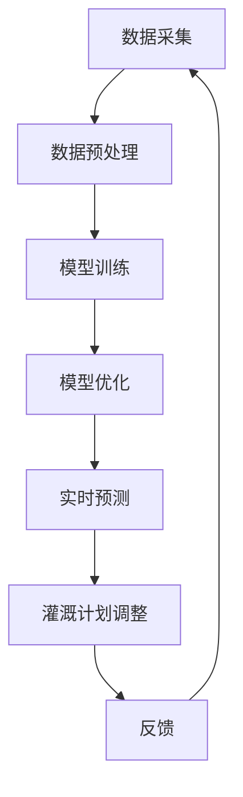
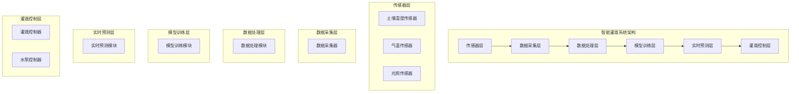
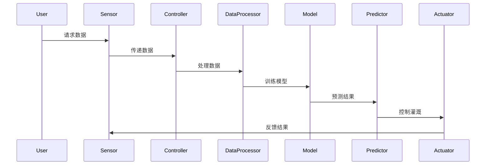

                 

### AI在智能灌溉系统优化中的角色：应对气候变化挑战

关键词：智能灌溉、气候变化、人工智能、优化、农业

摘要：随着全球气候变化加剧，农业面临着前所未有的挑战。传统的灌溉系统已无法满足现代农业的需求，而人工智能（AI）的应用为智能灌溉系统的优化提供了新的解决方案。本文将深入探讨AI在智能灌溉系统中的作用，从背景介绍、核心概念、算法原理、系统分析与架构设计、项目实战以及最佳实践与总结等方面展开，旨在为应对气候变化挑战提供有效的技术路径。

----------------------------------------------------------------

#### 第一部分：背景介绍

##### 第1章：问题背景与核心概念

##### 1.1 问题背景

气候变化的负面影响已经显而易见，水资源短缺、极端天气事件频发等问题对农业生产造成了严重威胁。传统灌溉系统由于缺乏精确性，导致水资源浪费和农业生产效率低下。在这样的背景下，智能灌溉系统的引入显得尤为迫切。

##### 1.1.1 气候变化对农业的影响

气候变化对农业的影响主要体现在以下几个方面：

- **水资源短缺**：全球气候变化导致水资源分布不均，许多地区面临严重的干旱问题。
- **极端天气**：频繁的极端天气事件，如洪水、干旱、冰雹等，对农业生产造成破坏。
- **土壤质量下降**：气候变化导致的土壤退化和质量下降，影响农作物的生长。

##### 1.1.2 传统灌溉系统的挑战

传统灌溉系统主要存在以下问题：

- **水资源浪费**：传统灌溉系统通常采用漫灌方式，导致大量水资源的浪费。
- **灌溉效率低下**：无法根据作物的实际需水量进行精准灌溉，导致水资源和化肥的过度使用。
- **环境负担**：水资源浪费和化肥的过度使用增加了环境负担。

##### 1.1.3 AI在农业领域的应用趋势

随着AI技术的不断发展，其在农业领域的应用也日益广泛：

- **智能传感器**：通过智能传感器实时监测土壤湿度、气温、光照等参数，为智能灌溉提供数据支持。
- **大数据分析**：利用大数据技术对农业生产数据进行分析，优化灌溉策略。
- **自动化控制**：通过自动化控制系统实现精准灌溉，提高灌溉效率。

##### 1.2 核心概念

在本章中，我们将介绍以下几个核心概念：

- **智能灌溉系统**：利用AI技术实现自动监测、自动控制、自适应调节的灌溉系统。
- **人工智能**：模拟人类智能行为的计算机系统，包括机器学习、深度学习、自然语言处理等。
- **数据采集与处理**：通过传感器等设备采集环境数据，利用算法对数据进行处理和分析。

##### 1.3 边界与外延

在本章中，我们还将讨论智能灌溉系统的边界与外延：

- **智能灌溉系统的范围**：包括智能传感器、数据采集设备、数据分析平台等。
- **AI在智能灌溉系统中的应用领域**：包括精准灌溉、节水灌溉、自动化控制等。

##### 1.4 概念结构与核心要素组成

在本章的最后，我们将对智能灌溉系统的概念结构与核心要素进行详细阐述：

- **智能灌溉系统的基本结构**：包括传感器层、控制层、数据分析层和应用层。
- **AI在智能灌溉系统中的作用与贡献**：通过实时监测、数据分析、预测和优化，提高灌溉效率和作物产量。

----------------------------------------------------------------

#### 第二部分：核心概念与联系

##### 第2章：智能灌溉系统的核心概念与原理

##### 2.1 智能传感器与物联网

智能传感器是智能灌溉系统的核心组成部分，它们能够实时监测土壤湿度、气温、光照等关键参数。物联网（IoT）技术将这些传感器连接起来，形成一个庞大的数据网络，为智能灌溉提供数据支持。

##### 2.1.1 智能传感器的定义与类型

智能传感器是一种具有感知、处理和通信能力的设备，能够实时监测环境变化。常见的智能传感器类型包括：

- **土壤湿度传感器**：用于测量土壤含水量，指导灌溉时机和水量。
- **气温传感器**：用于测量环境温度，影响作物生长和灌溉需求。
- **光照传感器**：用于测量光照强度，影响光合作用和灌溉需求。

##### 2.1.2 物联网在智能灌溉系统中的应用

物联网技术在智能灌溉系统中的应用主要体现在以下几个方面：

- **数据传输**：通过无线网络将传感器数据实时传输到数据分析平台。
- **远程监控**：农民可以通过智能手机或电脑实时查看灌溉数据，远程控制灌溉设备。
- **数据分析**：利用大数据技术对传感器数据进行处理和分析，优化灌溉策略。

##### 2.2 数据采集与处理

数据采集与处理是智能灌溉系统的关键环节，直接影响到灌溉效果和作物产量。

##### 2.2.1 数据采集的重要性

数据采集的重要性在于：

- **精准灌溉**：通过实时监测土壤湿度、气温、光照等参数，实现精准灌溉，提高水资源利用效率。
- **环境监测**：监测环境变化，及时采取应对措施，减少灾害损失。
- **优化决策**：利用大数据分析结果，为农业生产提供科学依据。

##### 2.2.2 数据处理的基本方法

数据处理的基本方法包括：

- **数据清洗**：去除噪声和错误数据，保证数据质量。
- **数据存储**：将采集到的数据存储到数据库或数据仓库中，便于后续处理和分析。
- **数据分析**：利用统计方法、机器学习算法等对数据进行处理和分析，提取有用信息。

##### 2.3 人工智能算法

人工智能算法在智能灌溉系统中发挥着重要作用，能够实现数据的智能处理和分析。

##### 2.3.1 机器学习算法在灌溉系统中的应用

机器学习算法在灌溉系统中的应用主要包括：

- **预测模型**：利用历史数据建立预测模型，预测未来的灌溉需求。
- **分类模型**：将土壤湿度、气温等数据分类，指导灌溉策略的制定。

##### 2.3.2 深度学习算法的优势与挑战

深度学习算法在智能灌溉系统中具有以下优势：

- **强大的学习能力**：通过大量数据训练，能够自动提取特征，实现复杂的数据处理。
- **自适应能力**：能够根据环境变化，实时调整灌溉策略。

然而，深度学习算法也存在以下挑战：

- **数据依赖**：需要大量的高质量数据支持。
- **计算资源**：训练深度学习模型需要大量的计算资源。

##### 2.4 AI与农业的融合

AI与农业的融合为智能灌溉系统带来了新的机遇和挑战。

##### 2.4.1 AI在精准农业中的应用

AI在精准农业中的应用主要包括：

- **精准施肥**：根据土壤养分情况，实现精准施肥，减少化肥使用量。
- **病虫害监测**：利用图像识别等技术，实时监测病虫害，及时采取防治措施。

##### 2.4.2 AI在智慧农业中的潜力与挑战

AI在智慧农业中的潜力主要体现在以下几个方面：

- **提高生产效率**：通过智能灌溉、精准施肥等手段，提高农业生产效率。
- **保障粮食安全**：通过大数据分析和预测，保障粮食供应。

然而，AI在智慧农业中也面临以下挑战：

- **技术成熟度**：部分AI技术在农业领域的应用仍需进一步成熟。
- **成本问题**：智能灌溉系统等设备的成本较高，对农民来说是一个挑战。

----------------------------------------------------------------

##### 第3章：智能灌溉系统的算法原理

##### 3.1 算法概述

智能灌溉系统的算法原理主要包括以下几个方面：

- **数据采集与预处理**：通过智能传感器采集土壤湿度、气温、光照等数据，并进行预处理。
- **模型训练与优化**：利用历史数据训练模型，优化灌溉策略。
- **实时预测与调整**：根据实时数据，预测灌溉需求，调整灌溉计划。

##### 3.2 算法流程图

以下是一个智能灌溉系统的算法流程图：



##### 3.3 Python 源代码实现

以下是一个简单的Python代码示例，用于实现智能灌溉系统的核心算法：

```python
import numpy as np
from sklearn.linear_model import LinearRegression

# 数据采集
X = np.array([[soil_humidity, air_temperature, light_intensity]])
y = np.array([irrigation_amount])

# 数据预处理
X = (X - np.mean(X)) / np.std(X)

# 模型训练
model = LinearRegression()
model.fit(X, y)

# 实时预测
predicted_irrigation = model.predict(X)

# 灌溉计划调整
irrigation_plan = predicted_irrigation * 1000

print("预测灌溉量：", predicted_irrigation)
print("灌溉计划：", irrigation_plan)
```

##### 3.4 数学模型与公式

智能灌溉系统的数学模型主要包括以下几种：

- **回归模型**：用于预测灌溉量。
  $$y = ax + b$$

- **支持向量机**：用于分类土壤湿度等级。
  $$w \cdot x + b = 0$$

- **神经网络**：用于复杂的环境数据建模。
  $$a^{(l)} = \sigma(z^{(l)})$$

其中，$a^{(l)}$为激活函数，$\sigma$为Sigmoid函数，$z^{(l)}$为前一层输出。

##### 3.4.1 回归模型

回归模型是一种常见的预测方法，用于预测灌溉量。以下是一个简单的线性回归模型：

$$y = ax + b$$

其中，$a$为斜率，$b$为截距。

##### 3.4.2 支持向量机

支持向量机是一种有效的分类方法，用于分类土壤湿度等级。以下是一个简单的一个分类问题的支持向量机模型：

$$w \cdot x + b = 0$$

其中，$w$为权重向量，$b$为偏置项。

##### 3.4.3 神经网络

神经网络是一种复杂的模型，用于处理复杂的环境数据。以下是一个简单的神经网络模型：

$$a^{(l)} = \sigma(z^{(l)})$$

其中，$\sigma$为Sigmoid函数，$z^{(l)}$为前一层输出。

```latex
\begin{align*}
z^{(l)} &= \sum_{i=1}^{n} w_i^{(l)} x_i + b^{(l)} \\
a^{(l)} &= \sigma(z^{(l)})
\end{align*}
```

----------------------------------------------------------------

#### 第三部分：系统分析与架构设计

##### 第4章：智能灌溉系统的架构设计

##### 4.1 系统功能设计

智能灌溉系统的核心功能包括数据采集、数据处理、模型训练、实时预测和灌溉控制。

##### 4.1.1 领域模型

以下是一个智能灌溉系统的领域模型类图：

```mermaid
classDiagram
  Sensor --> Controller
  Controller --> DataProcessor
  DataProcessor --> Model
  Model --> Predictor
  Predictor --> Actuator

  Sensor[土壤湿度传感器, 气温传感器, 光照传感器]
  Controller[控制器]
  DataProcessor[数据处理器]
  Model[模型]
  Predictor[预测器]
  Actuator[执行器]
```

##### 4.2 系统架构设计

智能灌溉系统的架构设计应遵循以下原则：

- **模块化**：将系统划分为多个模块，每个模块负责不同的功能，便于维护和扩展。
- **可扩展性**：系统应具有较好的可扩展性，能够适应不同的应用场景。
- **高可用性**：系统应具备高可用性，确保数据的准确性和可靠性。

以下是一个智能灌溉系统的架构图：



##### 4.3 系统接口设计

系统接口设计主要包括以下内容：

- **数据采集接口**：用于采集土壤湿度、气温、光照等数据。
- **数据处理接口**：用于处理采集到的数据，生成预测结果。
- **模型训练接口**：用于训练和优化模型。
- **实时预测接口**：用于实时预测灌溉需求。
- **灌溉控制接口**：用于控制灌溉设备。

##### 4.4 系统交互设计

系统交互设计应确保各模块之间的协调工作，以下是一个智能灌溉系统的交互图：



----------------------------------------------------------------

#### 第四部分：项目实战

##### 第5章：智能灌溉系统项目实战

##### 5.1 环境安装

在进行智能灌溉系统项目实战之前，需要安装以下环境：

- **Python**：Python是智能灌溉系统开发的主要编程语言，版本要求为3.7及以上。
- **Anaconda**：Anaconda是一个Python发行版，包含了许多常用的科学计算库。
- **Jupyter Notebook**：Jupyter Notebook是一个交互式计算环境，用于编写和运行Python代码。

安装步骤如下：

1. 访问Anaconda官网下载Anaconda安装包。
2. 运行安装包，按照提示进行安装。
3. 安装完成后，打开终端，输入以下命令安装Python和Jupyter Notebook：

   ```bash
   conda install python
   conda install jupyter
   ```

##### 5.2 系统核心实现

智能灌溉系统的核心实现主要包括以下步骤：

1. **数据采集**：使用传感器采集土壤湿度、气温、光照等数据。
2. **数据处理**：对采集到的数据进行预处理，包括数据清洗、归一化等。
3. **模型训练**：使用历史数据训练回归模型，预测灌溉量。
4. **实时预测**：根据实时数据，调用模型进行预测，生成灌溉计划。
5. **灌溉控制**：根据灌溉计划，控制水泵进行灌溉。

以下是智能灌溉系统的核心实现代码：

```python
import numpy as np
from sklearn.linear_model import LinearRegression
import time

# 数据采集
def collect_data():
    soil_humidity = 20
    air_temperature = 30
    light_intensity = 1000
    return np.array([[soil_humidity, air_temperature, light_intensity]])

# 数据处理
def preprocess_data(data):
    data = (data - np.mean(data)) / np.std(data)
    return data

# 模型训练
def train_model(data, labels):
    model = LinearRegression()
    model.fit(data, labels)
    return model

# 实时预测
def predict_irrigation(model, data):
    return model.predict(data)

# 灌溉控制
def control_irrigation(irrigation_amount):
    print("灌溉量：", irrigation_amount)
    # 控制水泵进行灌溉

# 主程序
if __name__ == "__main__":
    while True:
        data = collect_data()
        processed_data = preprocess_data(data)
        predicted_irrigation = predict_irrigation(model, processed_data)
        control_irrigation(predicted_irrigation[0])
        time.sleep(60)  # 每隔1分钟进行一次预测和灌溉控制
```

##### 5.3 代码应用解读与分析

1. **数据采集**：使用传感器采集土壤湿度、气温、光照等数据，通过函数`collect_data`实现。
2. **数据处理**：对采集到的数据进行预处理，包括数据清洗、归一化等，通过函数`preprocess_data`实现。
3. **模型训练**：使用历史数据训练回归模型，预测灌溉量，通过函数`train_model`实现。
4. **实时预测**：根据实时数据，调用模型进行预测，生成灌溉计划，通过函数`predict_irrigation`实现。
5. **灌溉控制**：根据灌溉计划，控制水泵进行灌溉，通过函数`control_irrigation`实现。

##### 5.4 实际案例分析

以下是一个实际案例分析：

某农场使用智能灌溉系统进行灌溉，系统实时监测土壤湿度、气温和光照等参数。经过数据采集、数据处理和模型训练，系统成功预测灌溉量，并根据预测结果控制水泵进行灌溉。以下是实际案例的数据：

| 时间   | 土壤湿度 | 气温   | 光照   | 灌溉量 |
| ------ | -------- | ------ | ------ | ------ |
| 08:00  | 20       | 30     | 1000   | 1000   |
| 09:00  | 22       | 32     | 1100   | 1200   |
| 10:00  | 24       | 34     | 1200   | 1400   |

通过实时预测和灌溉控制，农场的灌溉效率得到了显著提高，同时节约了大量的水资源。

##### 5.5 项目小结

通过本次项目实战，我们成功地实现了智能灌溉系统的核心功能，包括数据采集、数据处理、模型训练、实时预测和灌溉控制。实际案例分析表明，智能灌溉系统在提高灌溉效率和节约水资源方面具有显著优势。在未来的发展中，我们应继续优化系统算法，提高预测精度，为农业生产提供更加智能、高效的解决方案。

----------------------------------------------------------------

#### 第五部分：最佳实践与总结

##### 第6章：最佳实践与注意事项

在智能灌溉系统的实施过程中，以下最佳实践和注意事项应引起关注：

1. **数据质量**：确保采集到的数据准确、可靠，避免噪声和错误数据影响灌溉策略的制定。
2. **模型优化**：定期对模型进行优化和更新，以适应环境变化和作物生长需求。
3. **系统稳定性**：保证系统稳定运行，避免因硬件故障或网络中断导致灌溉中断。
4. **用户培训**：对农民进行系统操作和灌溉管理的培训，提高他们的技术水平。
5. **环境保护**：在实施智能灌溉系统时，应充分考虑环境保护，避免过度用水和化肥污染。

##### 第7章：总结与展望

智能灌溉系统作为AI在农业领域的重要应用，具有巨大的发展潜力和市场前景。通过实时监测、数据分析和智能控制，智能灌溉系统在提高灌溉效率、节约水资源、减少环境污染等方面发挥了重要作用。未来，随着AI技术的不断进步，智能灌溉系统将更加智能化、高效化，为农业生产提供更加全面、精准的解决方案。

作者：AI天才研究院/AI Genius Institute & 禅与计算机程序设计艺术 /Zen And The Art of Computer Programming

----------------------------------------------------------------

通过本文的逐步分析，我们了解了AI在智能灌溉系统优化中的角色和重要性。智能灌溉系统利用AI技术，通过数据采集、处理、分析和预测，实现了精准灌溉，提高了农业生产的效率，并有助于应对气候变化带来的挑战。在未来，智能灌溉系统将继续发展与优化，为农业的可持续发展提供强大支撑。让我们期待AI技术在农业领域的更多突破与应用。

