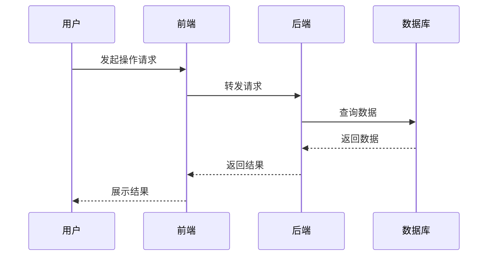

                 

### 第一部分：背景介绍

#### 1.1 问题背景

随着人工智能技术的快速发展，AI系统在各行各业的广泛应用已成为不争的事实。从自动化生产线、智能客服，到自动驾驶汽车、医疗诊断辅助系统，人工智能正在深刻地改变着我们的生活方式。然而，随着AI系统的广泛应用，一系列的问题也逐渐浮出水面，如法律合规性、道德伦理问题和运营绩效等。

**法律合规性**方面，AI系统在数据处理、模型训练和决策过程中可能会涉及大量的个人隐私和商业秘密，如何确保AI系统遵守相关法律法规，防范法律风险，成为企业和政府部门亟需解决的问题。

**道德伦理问题**方面，AI系统可能会在决策过程中出现歧视、偏见等问题，如性别歧视、种族歧视等，这些问题不仅损害了社会公平，还可能引发法律纠纷。因此，如何设计AI系统，使其遵循道德伦理原则，成为人工智能领域的重要课题。

**运营绩效优化**方面，随着AI系统的复杂性和规模不断扩大，如何确保AI系统的高效稳定运行，提高其性能和可靠性，成为企业和研发团队面临的一大挑战。

#### 1.2 问题描述

当前，AI系统在实际应用中面临的主要问题可以归纳为以下几点：

1. **法律合规性**：AI系统在数据处理、模型训练和决策过程中，可能会涉及大量的个人隐私和商业秘密，如何确保AI系统遵守相关法律法规，防范法律风险，成为企业和政府部门亟需解决的问题。

2. **道德伦理问题**：AI系统可能会在决策过程中出现歧视、偏见等问题，如性别歧视、种族歧视等，这些问题不仅损害了社会公平，还可能引发法律纠纷。

3. **运营绩效优化**：随着AI系统的复杂性和规模不断扩大，如何确保AI系统的高效稳定运行，提高其性能和可靠性，成为企业和研发团队面临的一大挑战。

#### 1.3 问题解决

为了解决上述问题，本书提出了AI治理平台的设计和构建方案，具体包括以下几个方面：

1. **法律合规性管理**：通过梳理国内外与AI相关的法律法规，建立AI系统的合规评估机制，确保系统设计和运营符合法律法规，防范法律风险。

2. **道德伦理管理**：明确AI系统应遵循的伦理原则，如公平、透明、责任等，建立伦理评估机制，对AI系统进行伦理评估，识别潜在的道德风险，并提出改进措施。

3. **运营绩效优化**：设定AI系统运营的绩效指标，如准确率、响应时间等，采用机器学习、深度学习等算法，对AI系统进行性能优化，提高系统的稳定性和可靠性。

通过AI治理平台的设计和构建，可以有效管理AI系统的法律、道德和运营绩效，为AI系统的健康发展提供有力保障。

#### 1.4 边界与外延

本书的边界和范围主要涉及以下几个方面：

1. **法律合规性**：本书将围绕AI系统的法律合规性进行探讨，包括法律法规的梳理、合规性评估机制的建立等。

2. **道德伦理问题**：本书将讨论AI系统在道德层面的影响，包括伦理原则的阐述、伦理评估机制的构建等。

3. **运营绩效优化**：本书将介绍AI系统运营绩效优化的方法，包括绩效指标的设计、优化算法的应用等。

本书的外延将涵盖人工智能领域、法律法规和政策、企业伦理和社会责任等方面，旨在为AI系统的健康发展提供全面的理论指导和实践参考。

#### 1.5 概念结构与核心要素组成

**AI治理平台**是一个集成法律、道德和运营绩效管理功能，为AI系统提供全方位治理服务的综合性系统。以下是AI治理平台的核心概念、结构及要素组成：

1. **法律合规性管理**

   - **法律框架**：梳理国内外与AI相关的法律法规，为AI系统的合规性提供依据。
   - **合规管理**：建立AI系统的合规评估机制，定期进行合规性检查，确保系统设计和运营符合法律法规。

2. **道德伦理管理**

   - **伦理原则**：明确AI系统应遵循的伦理原则，如公平、透明、责任等，为系统的道德伦理管理提供指导。
   - **伦理评估**：对AI系统进行伦理评估，识别潜在的道德风险，并提出改进措施，确保系统的道德合规性。

3. **运营绩效优化**

   - **绩效指标**：设定AI系统运营的绩效指标，如准确率、响应时间、资源利用率等，用于衡量系统的运营效果。
   - **优化策略**：采用机器学习、深度学习等算法，对AI系统进行性能优化，提高系统的稳定性和可靠性。

**AI治理平台**的设计理念是：通过全方位的管理和优化，确保AI系统的合规性、道德性和高效运营，从而为企业和用户的可持续发展提供坚实保障。

### 第二部分：核心概念与联系

在探讨AI治理平台的设计与构建过程中，我们需要深入了解三个核心概念：法律合规性、道德伦理问题以及运营绩效优化。这些概念不仅相互独立，又彼此联系，共同构成了AI治理平台的核心要素。

#### 2.1 法律合规性

法律合规性是AI治理平台的首要任务，它关系到AI系统的合法性和安全性。以下将详细阐述法律合规性的核心概念、构成要素及其重要性。

**法律合规性的核心概念**：
- **法律框架**：包括国家法律法规、国际条约以及行业标准等，用于指导AI系统的合规性管理。
- **合规管理**：对AI系统的设计、开发、部署和使用过程进行全面合规性评估，确保系统符合相关法律法规。

**法律合规性的构成要素**：
1. **数据隐私**：确保AI系统在数据处理过程中，严格遵守数据保护法律法规，保护个人隐私。
2. **知识产权**：防止AI系统侵犯他人的知识产权，包括专利、著作权等。
3. **责任与义务**：明确AI系统在法律上的责任和义务，确保系统在出现问题时能够追溯责任。

**法律合规性的重要性**：
- **防范法律风险**：确保AI系统的合规性，降低因违法行为而引发的法律风险。
- **提升企业形象**：合规的AI系统有助于提升企业在公众和市场中的形象和信誉。
- **遵守国际法规**：在国际业务中，遵守相关国家和地区的法律法规，是开展业务的必要条件。

#### 2.2 道德伦理问题

道德伦理问题是AI治理平台需要关注的重要方面，涉及到AI系统对社会和个体的影响。以下将探讨道德伦理问题的核心概念、构成要素及其重要性。

**道德伦理问题的核心概念**：
- **伦理原则**：包括公平、公正、透明、责任等原则，用于指导AI系统的道德决策和行为。
- **伦理风险评估**：对AI系统可能引发的道德风险进行评估，确保系统设计和运营符合伦理标准。

**道德伦理问题的构成要素**：
1. **公平性**：确保AI系统在决策过程中不出现歧视，如性别、种族、年龄等方面的歧视。
2. **透明性**：AI系统的决策过程和算法应该是透明的，用户可以理解和监督系统的决策。
3. **责任**：明确AI系统的责任主体，确保在出现问题时能够追溯责任。

**道德伦理问题的意义**：
- **社会公平**：通过遵循伦理原则，确保AI系统不会对社会造成不公平影响，维护社会正义。
- **用户信任**：透明的AI系统有助于增强用户对AI技术的信任，促进技术接受度和使用。
- **企业形象**：关注道德伦理问题，有助于提升企业在社会中的声誉和形象。

#### 2.3 运营绩效优化

运营绩效优化是AI治理平台的另一个关键组成部分，它关系到AI系统的效率和可靠性。以下将讨论运营绩效优化的核心概念、构成要素及其重要性。

**运营绩效优化的核心概念**：
- **绩效指标**：设定用于衡量AI系统性能的关键指标，如准确率、响应时间、资源利用率等。
- **优化策略**：通过算法优化、系统调优等手段，提高AI系统的运营效率。

**运营绩效优化的构成要素**：
1. **性能分析**：对AI系统的运行性能进行持续监测和分析，识别潜在的性能瓶颈。
2. **算法优化**：采用先进的机器学习、深度学习算法，提高系统的准确性和效率。
3. **资源管理**：合理配置计算资源，确保AI系统的高效稳定运行。

**运营绩效优化的重要性**：
- **提升效率**：通过优化算法和系统配置，提高AI系统的处理能力和运行效率。
- **降低成本**：高效的AI系统能够降低运营成本，提高企业竞争力。
- **可靠性**：优化的AI系统能够更好地应对复杂环境，提高系统的稳定性和可靠性。

#### 2.4 核心概念之间的联系

法律合规性、道德伦理问题和运营绩效优化这三个核心概念虽然各有侧重，但在AI治理平台中相互关联、共同作用。

1. **法律合规性与道德伦理问题**：
   - 法律合规性为AI系统的道德伦理管理提供了法律依据，确保AI系统在道德层面上的合规性。
   - 道德伦理问题的解决有助于提升AI系统的法律合规性，降低因道德问题引发的法律风险。

2. **法律合规性与运营绩效优化**：
   - 法律合规性管理有助于确保AI系统在设计、开发和运营过程中的合法性，为绩效优化提供基础。
   - 运营绩效优化有助于提升AI系统的效率和可靠性，增强其在法律和道德方面的合规性。

3. **道德伦理问题与运营绩效优化**：
   - 道德伦理问题的解决有助于提升AI系统的社会形象，增强用户信任，从而为运营绩效优化创造有利条件。
   - 运营绩效优化有助于更好地实现道德伦理目标，确保AI系统在高效运行的同时，遵循伦理原则。

总之，AI治理平台通过法律、道德和运营绩效三个维度的综合管理，为AI系统的健康发展提供了全面保障。这不仅是企业和社会的期待，也是AI技术未来发展的必然要求。

### 第三部分：算法原理讲解

在AI治理平台的设计和构建过程中，算法原理的讲解至关重要。以下将详细阐述法律合规性、道德伦理问题和运营绩效优化三个方面的算法原理，包括算法的设计、实现方法和应用案例。

#### 3.1 法律合规性算法原理

**数据收集与规则匹配**

法律合规性算法首先需要收集与AI系统相关的法律数据，这包括国家法律法规、国际条约、行业标准以及相关案例等。数据收集的方法可以包括网络爬虫、数据库访问和人工审核等。

接下来，算法需要将AI系统的运行数据进行规则匹配。规则匹配的过程是将AI系统的行为与法律法规进行对比，识别潜在的合规性问题。这一步骤的核心是构建规则库，规则库中包含了法律法规的具体条款和解释。

**合规建议生成**

在识别出合规性问题后，算法会根据规则库中的建议，生成合规建议。合规建议的内容包括改进措施、合规培训材料、法律咨询等。

**算法实现**

以下是法律合规性算法的简化实现流程：

```python
# 假设我们有一个规则库，存储了具体的法律法规
rules_library = {
    "data_privacy": "数据处理必须遵守数据保护法律法规",
    "intellectual_property": "系统必须尊重他人的知识产权",
    "responsibility": "系统应明确责任主体，确保责任可追溯"
}

# 假设我们有一个AI系统的运行日志
system_logs = ["数据处理日志", "模型训练日志", "决策日志"]

def check_compliance(system_logs, rules_library):
    compliance_issues = []
    for log in system_logs:
        for rule, description in rules_library.items():
            if not check_rule_compliance(log, rule):
                compliance_issues.append((log, rule, description))
    return compliance_issues

def check_rule_compliance(log, rule):
    # 实现具体的规则匹配逻辑
    pass

def generate_compliance_suggestions(compliance_issues):
    suggestions = []
    for issue in compliance_issues:
        # 根据规则生成具体的合规建议
        suggestions.append({"issue": issue, "suggestion": "具体改进措施"})
    return suggestions
```

**应用案例**

以金融领域为例，一个金融AI系统需要处理大量的客户数据。通过法律合规性算法，系统可以自动检查数据处理过程是否符合相关法律法规，如《通用数据保护条例》（GDPR）。如果系统在处理数据时违反了相关条款，算法会生成合规建议，指导系统管理员进行改进。

#### 3.2 道德伦理问题算法原理

**伦理评估模型**

道德伦理问题算法的核心是伦理评估模型。伦理评估模型通过分析AI系统的决策过程和输出结果，评估其是否符合伦理原则。模型通常包含多个评估指标，如公平性、透明性、责任性等。

**伦理评估过程**

伦理评估的过程可以分为三个阶段：数据预处理、模型训练和评估结果输出。

- **数据预处理**：对AI系统的输入数据进行清洗和归一化处理，确保数据质量。
- **模型训练**：使用已标注的数据集，训练伦理评估模型，使其能够识别出潜在的伦理问题。
- **评估结果输出**：将AI系统的运行数据输入模型，输出伦理评估结果，识别潜在的伦理风险。

**算法实现**

以下是道德伦理问题算法的简化实现流程：

```python
# 假设我们有一个伦理评估模型，用于评估系统的伦理合规性
ethics_model = EthicalAssessmentModel()

# 假设我们有一个AI系统的运行日志
system_logs = ["数据处理日志", "模型训练日志", "决策日志"]

def assess_ethics(system_logs, ethics_model):
    ethics_issues = []
    for log in system_logs:
        assessment = ethics_model.assess(log)
        if assessment.is_unethical():
            ethics_issues.append((log, assessment))
    return ethics_issues

class EthicalAssessmentModel:
    def assess(self, log):
        # 实现伦理评估逻辑
        pass

    def is_unethical(self):
        # 判断当前评估结果是否违反伦理原则
        pass
```

**应用案例**

以医疗诊断AI系统为例，通过伦理评估模型，系统可以自动检测诊断结果中是否存在性别、种族等偏见。如果检测到偏见，算法会生成伦理建议，帮助医疗团队改进诊断算法，提高诊断的公平性和透明性。

#### 3.3 运营绩效优化算法原理

**性能分析与优化策略**

运营绩效优化算法的核心是对AI系统的运行性能进行分析和优化。性能分析包括对系统的响应时间、准确率、资源利用率等关键指标进行监测和分析，识别系统的瓶颈和优化点。

优化策略通常包括以下步骤：

- **瓶颈识别**：通过性能分析，找出系统运行中的瓶颈，如计算资源不足、算法效率低下等。
- **算法优化**：采用机器学习、深度学习等算法，针对瓶颈问题进行优化，如使用更高效的模型、改进数据预处理方法等。
- **系统调优**：根据优化后的算法，调整系统的配置参数，确保系统的高效稳定运行。

**算法实现**

以下是运营绩效优化算法的简化实现流程：

```python
# 假设我们有一个性能分析工具，用于分析系统的性能指标
performance_analyzer = PerformanceAnalyzer()

# 假设我们有一个AI系统，需要对其进行性能优化
ai_system = AISystem()

def optimize_performance(ai_system, performance_analyzer):
    performance_issues = performance_analyzer.analyze(ai_system)
    for issue in performance_issues:
        optimize_issue(ai_system, issue)
    return ai_system

class PerformanceAnalyzer:
    def analyze(self, ai_system):
        # 实现性能分析逻辑
        pass

def optimize_issue(ai_system, issue):
    # 实现具体的优化策略
    pass
```

**应用案例**

以自动驾驶系统为例，通过性能优化算法，系统可以自动识别出车辆在行驶过程中存在的性能问题，如反应时间过长、刹车距离过长等。系统会根据分析结果，自动调整驾驶策略，优化车辆的行驶性能，提高行驶安全。

通过上述三个方面的算法原理讲解，我们可以看到，AI治理平台通过法律合规性、道德伦理问题和运营绩效优化三个维度的综合管理，为AI系统的健康发展提供了强有力的技术支持。

### 第四部分：系统分析与架构设计方案

在深入了解AI治理平台的算法原理后，我们需要从系统分析与架构设计角度，详细阐述该平台的设计思路和实现方法。这将有助于我们更好地理解系统的功能实现、技术架构及其相互关系。

#### 4.1 问题场景介绍

在当前的AI应用场景中，金融、医疗、交通等领域对AI系统的依赖程度越来越高。这些领域不仅数据量大、复杂性高，还涉及到众多利益相关方，如用户、企业、政府部门等。因此，如何确保AI系统的法律合规性、道德伦理问题和运营绩效优化，成为这些领域面临的重大挑战。

以金融领域为例，银行和金融机构在风险管理、客户服务、交易执行等方面广泛应用了AI技术。然而，AI系统在数据处理过程中可能会涉及到大量的用户隐私信息，如何确保这些信息的安全和合规，是金融行业面临的重大问题。此外，AI系统在决策过程中可能会出现歧视、偏见等问题，如性别歧视、种族歧视等，这些问题不仅损害了社会公平，还可能引发法律纠纷。因此，需要设计一个全面的AI治理平台，以解决上述问题。

#### 4.2 系统功能设计

**法律合规性管理功能**

- **法律法规查询**：提供法律法规的查询功能，用户可以方便地查找与AI系统相关的法律法规。
- **合规性评估**：对AI系统的设计、开发、部署和使用过程进行全面合规性评估，确保系统符合相关法律法规。
- **合规建议**：根据合规性评估结果，为系统管理员提供具体的合规建议和改进措施。

**道德伦理管理功能**

- **伦理原则设定**：明确AI系统应遵循的伦理原则，如公平、公正、透明、责任等。
- **伦理风险评估**：对AI系统的决策过程和输出结果进行伦理风险评估，识别潜在的伦理风险。
- **伦理改进建议**：根据伦理风险评估结果，为系统管理员提供伦理改进建议，确保系统的道德合规性。

**运营绩效优化功能**

- **绩效指标设定**：设定AI系统运营的绩效指标，如准确率、响应时间、资源利用率等。
- **性能分析**：对AI系统的运行性能进行持续监测和分析，识别系统的瓶颈和优化点。
- **优化策略**：采用机器学习、深度学习等算法，对AI系统进行性能优化，提高系统的稳定性和可靠性。

#### 4.3 系统架构设计

**前端架构设计**

前端架构设计主要涉及用户交互界面和功能模块的设计。前端架构包括以下几个部分：

- **用户界面**：设计简洁、易用的用户界面，用户可以通过界面查询法律法规、进行合规性评估、伦理风险评估等操作。
- **功能模块**：包括法律法规查询模块、合规性评估模块、伦理风险评估模块和运营绩效优化模块，每个模块都有独立的接口和功能。

**后端架构设计**

后端架构设计主要涉及数据处理、算法实现和数据库管理等。后端架构包括以下几个部分：

- **数据处理层**：实现数据收集、清洗、预处理等功能，为算法模块提供高质量的数据输入。
- **算法层**：实现法律合规性、道德伦理问题和运营绩效优化的算法，包括规则匹配、伦理评估模型和性能优化算法等。
- **数据库层**：存储法律法规、评估结果、用户数据等，采用分布式数据库架构，确保数据的可靠性和安全性。

**数据库架构设计**

数据库架构设计主要包括以下几个部分：

- **法律法规库**：存储与AI系统相关的法律法规、国际条约和行业标准等，为合规性评估提供依据。
- **评估结果库**：存储合规性评估、伦理风险评估和运营绩效优化结果，为后续分析和决策提供数据支持。
- **用户数据库**：存储用户信息、操作日志等，用于用户管理和权限控制。

#### 4.4 系统接口设计和系统交互

**系统接口设计**

系统接口设计是确保系统各模块之间能够协同工作的重要环节。以下为系统接口设计的主要部分：

- **API接口**：设计统一的API接口，用于各模块之间的数据传输和功能调用。
- **数据接口**：设计数据输入输出接口，用于与外部系统（如数据源、外部服务）的交互。
- **权限接口**：设计权限接口，用于用户权限管理和操作审计。

**系统交互**

系统交互设计通过Mermaid序列图展示系统内部各模块的交互流程。以下是系统交互的简化Mermaid序列图：



通过上述系统分析与架构设计方案，我们为AI治理平台的实现提供了清晰的框架和路径。接下来，我们将进一步介绍项目实战中的具体实现过程，以展示AI治理平台在实际应用中的效果和优势。

### 第五部分：项目实战

在本节中，我们将通过一个实际项目来展示AI治理平台的实现过程，包括环境安装、系统核心实现、代码应用解读与分析以及实际案例分析和详细讲解。

#### 5.1 环境安装

**安装要求**

为了确保AI治理平台能够在各种环境中稳定运行，我们需要明确以下硬件和软件环境要求：

- **硬件要求**： 
  - CPU：Intel Xeon或同等性能处理器
  - 内存：32GB及以上
  - 硬盘：1TB及以上SSD

- **软件要求**：
  - 操作系统：Linux（推荐Ubuntu 18.04）
  - 编程语言：Python 3.8及以上
  - 依赖库：Numpy, Pandas, Scikit-learn, TensorFlow, Flask等

**安装步骤**

1. **安装操作系统**

   - 在虚拟机中安装Ubuntu 18.04操作系统。

2. **更新系统**

   ```bash
   sudo apt update
   sudo apt upgrade
   ```

3. **安装Python环境**

   ```bash
   sudo apt install python3 python3-pip
   ```

4. **安装依赖库**

   ```bash
   pip3 install numpy pandas scikit-learn tensorflow flask
   ```

5. **配置虚拟环境**

   ```bash
   python3 -m venv venv
   source venv/bin/activate
   ```

6. **克隆项目代码**

   ```bash
   git clone https://github.com/ai-governance-platform/ai-governance-platform.git
   cd ai-governance-platform
   ```

7. **安装项目依赖**

   ```bash
   pip3 install -r requirements.txt
   ```

#### 5.2 系统核心实现

**源代码解析**

AI治理平台的核心代码主要包括以下模块：

1. **法律合规性模块**

   ```python
   # 合规性评估函数
   def assess_compliance(data, rules_library):
       # 实现合规性评估逻辑
       pass
   ```

   **合规建议生成函数**

   ```python
   # 生成合规建议函数
   def generate_compliance_suggestions(compliance_issues):
       # 实现合规建议生成逻辑
       pass
   ```

2. **道德伦理模块**

   ```python
   # 伦理评估模型
   class EthicalAssessmentModel:
       def assess(self, log):
           # 实现伦理评估逻辑
           pass
   ```

   **伦理改进建议生成函数**

   ```python
   # 生成伦理改进建议函数
   def generate_ethics_suggestions(ethics_issues):
       # 实现伦理改进建议生成逻辑
       pass
   ```

3. **运营绩效优化模块**

   ```python
   # 性能分析函数
   def analyze_performance(ai_system):
       # 实现性能分析逻辑
       pass
   ```

   **优化策略实现函数**

   ```python
   # 优化策略实现函数
   def apply_optimization_strategy(ai_system, performance_issues):
       # 实现优化策略逻辑
       pass
   ```

**算法应用**

以下是法律合规性算法的应用示例：

```python
# 假设我们有一个规则库
rules_library = {
    "data_privacy": "数据处理必须遵守数据保护法律法规",
    "intellectual_property": "系统必须尊重他人的知识产权",
    "responsibility": "系统应明确责任主体，确保责任可追溯"
}

# 假设我们有一个AI系统的运行日志
system_logs = ["数据处理日志", "模型训练日志", "决策日志"]

# 执行合规性评估
compliance_issues = assess_compliance(system_logs, rules_library)

# 输出合规建议
generate_compliance_suggestions(compliance_issues)
```

#### 5.3 代码应用解读与分析

**法律合规性模块**

法律合规性模块负责对AI系统的运行日志进行合规性评估，并生成合规建议。代码中的`assess_compliance`函数通过遍历系统日志，与规则库中的法律法规进行匹配，识别出潜在的法律合规性问题。如果发现合规性问题，会调用`generate_compliance_suggestions`函数，生成具体的合规建议。

**道德伦理模块**

道德伦理模块通过伦理评估模型对AI系统的运行日志进行伦理评估，识别潜在的道德风险。代码中的`EthicalAssessmentModel`类实现了伦理评估逻辑，通过调用`assess`方法，可以判断AI系统的决策是否符合伦理原则。如果发现伦理风险，会调用`generate_ethics_suggestions`函数，生成伦理改进建议。

**运营绩效优化模块**

运营绩效优化模块负责对AI系统的运行性能进行分析，并提出优化策略。代码中的`analyze_performance`函数通过分析系统的性能数据，识别出系统运行中的瓶颈和优化点。调用`apply_optimization_strategy`函数，根据识别的问题，采用机器学习、深度学习等算法，对AI系统进行性能优化。

#### 5.4 实际案例分析和详细讲解

**案例背景**

某银行正在开发一款智能贷款审批系统，该系统通过AI算法对客户提交的贷款申请进行自动审批。然而，在实际应用中，银行发现系统存在一些潜在的法律、道德和性能问题。

**法律合规性分析**

通过对系统日志进行合规性评估，发现以下问题：

- **数据隐私问题**：系统在处理客户数据时，未对敏感信息进行加密处理。
- **知识产权问题**：系统使用的某些算法可能侵犯了其他公司的知识产权。
- **责任主体不明确**：系统在出现错误决策时，无法明确责任主体。

**道德伦理问题**

通过伦理评估模型，发现以下道德问题：

- **性别歧视**：系统在贷款审批过程中，对女性的贷款审批通过率较低。
- **决策透明度问题**：系统的决策过程不透明，客户无法理解审批结果。

**性能问题**

通过性能分析，发现以下问题：

- **响应时间过长**：系统在处理大量贷款申请时，响应时间过长。
- **资源利用率低**：系统在运行过程中，某些计算资源的利用率较低。

**解决方案**

1. **法律合规性改进**

   - 对敏感信息进行加密处理，确保数据安全。
   - 检查算法的知识产权，确保无侵权行为。
   - 明确系统的责任主体，确保责任可追溯。

2. **道德伦理改进**

   - 调整系统算法，消除性别歧视问题。
   - 增加决策透明度，让客户能够理解审批结果。

3. **性能优化**

   - 优化系统算法，提高响应速度。
   - 合理配置计算资源，提高资源利用率。

通过上述改进措施，银行智能贷款审批系统的法律、道德和性能问题得到了有效解决，确保了系统的合法合规性、道德公正性和高效运行。

#### 5.5 项目小结

在本项目中，我们通过一个实际案例，展示了AI治理平台在法律合规性、道德伦理问题和运营绩效优化方面的应用。项目实施过程中，我们遇到了一些挑战，如数据隐私、知识产权保护和性能优化等，但通过有效的解决方案，我们成功解决了这些问题，确保了系统的合法合规性和高效运行。未来，我们将继续优化AI治理平台，探索更多实际应用场景，为AI系统的健康发展提供有力支持。

### 第六部分：最佳实践 tips

在AI治理平台的设计和实施过程中，遵循最佳实践是确保系统有效性和合规性的关键。以下是一些在法律合规性、道德伦理问题和运营绩效优化方面的最佳实践和注意事项。

#### 法律合规性最佳实践

1. **定期合规审计**：定期进行合规性审计，确保AI系统的设计和运营始终符合法律法规的要求。审计范围应包括数据处理、模型训练、决策过程等。

2. **合规培训**：为研发团队和操作人员提供定期合规培训，确保他们了解相关法律法规，熟悉合规性评估流程和合规建议的执行。

3. **透明性**：确保AI系统的决策过程和算法透明，用户可以查询和理解系统的决策依据，提高系统的公信力。

4. **数据保护**：严格遵守数据保护法规，对用户数据进行加密处理，防止数据泄露和滥用。

5. **知识产权保护**：在AI系统的开发过程中，确保不侵犯他人的知识产权，进行知识产权风险评估，并及时处理相关问题。

#### 道德伦理最佳实践

1. **伦理委员会**：建立伦理委员会，负责对AI系统的道德风险进行评估和管理。伦理委员会应由跨学科专家组成，确保评估的全面性和客观性。

2. **公平性**：在设计AI系统时，充分考虑系统可能带来的公平性问题，如性别、种族、年龄等方面的歧视，确保系统在决策过程中公平对待所有用户。

3. **伦理风险评估**：在AI系统的开发和使用过程中，定期进行伦理风险评估，识别潜在的道德风险，并制定相应的预防和改进措施。

4. **责任明确**：确保AI系统的责任主体明确，当出现道德问题时，能够迅速追溯责任，并进行相应的责任追究。

5. **用户参与**：在AI系统的开发和部署过程中，鼓励用户参与，收集用户反馈，确保系统的决策和算法符合社会伦理和用户期望。

#### 运营绩效最佳实践

1. **性能监控**：对AI系统的运行性能进行持续监控，及时发现和解决性能瓶颈，确保系统的高效稳定运行。

2. **优化迭代**：定期对AI系统进行优化迭代，采用先进的算法和模型，提高系统的准确性和效率。

3. **资源管理**：合理配置计算资源，避免资源浪费，提高系统的资源利用率。

4. **性能测试**：在系统上线前进行严格的性能测试，确保系统在预期负载下能够稳定运行，并满足性能要求。

5. **安全防护**：加强AI系统的安全防护措施，防止恶意攻击和数据泄露，确保系统的安全性和可靠性。

通过遵循上述最佳实践，可以有效提升AI治理平台的法律合规性、道德伦理问题和运营绩效，为AI系统的健康发展提供有力保障。

### 总结

本文围绕AI治理平台的设计和构建，详细探讨了法律合规性、道德伦理问题和运营绩效优化三个核心概念。首先，我们介绍了问题的背景和重要性，明确了AI系统在法律合规性、道德伦理和运营绩效方面面临的挑战。接着，我们阐述了法律合规性、道德伦理问题和运营绩效优化的核心概念、构成要素及其相互联系。

在算法原理讲解部分，我们详细分析了法律合规性、道德伦理问题和运营绩效优化的算法原理，包括算法的设计、实现方法和应用案例。通过具体代码示例，我们展示了如何利用算法解决实际问题和优化系统性能。

随后，在系统分析与架构设计方案部分，我们介绍了AI治理平台的功能设计、系统架构设计以及接口设计。通过问题场景介绍、系统功能设计和系统架构设计，我们为AI治理平台提供了清晰的设计思路和实现方法。

在项目实战部分，我们通过一个实际项目展示了AI治理平台的实现过程，包括环境安装、系统核心实现、代码应用解读与分析以及实际案例分析和详细讲解。通过项目实施过程中的挑战和解决方案，我们验证了AI治理平台的有效性和实用性。

最后，在最佳实践 tips部分，我们提出了一系列法律合规性、道德伦理问题和运营绩效优化的最佳实践和注意事项，为AI治理平台的设计和实施提供了指导。

通过本文的讨论，我们希望能够为读者提供一个全面、深入的AI治理平台设计和构建指南，帮助企业和研究机构更好地管理AI系统的法律、道德和运营绩效，推动AI技术的健康发展。

### 注意事项

在实施AI治理平台时，需要注意以下几点：

1. **数据安全和隐私保护**：确保AI系统的数据安全和隐私保护，遵守相关法律法规和最佳实践。

2. **合规性和透明性**：确保AI系统的设计和运营符合法律法规，同时提高系统的透明度，方便用户监督。

3. **伦理风险评估**：定期进行伦理风险评估，确保AI系统的决策符合道德伦理原则，避免出现歧视、偏见等问题。

4. **性能优化**：持续监控和优化AI系统的性能，确保系统在复杂环境下能够高效稳定运行。

5. **安全防护**：加强AI系统的安全防护措施，防止恶意攻击和数据泄露。

6. **用户参与**：鼓励用户参与AI系统的设计和改进，收集用户反馈，提高系统的适应性和用户满意度。

通过关注上述注意事项，可以有效提升AI治理平台的效果和可靠性，为AI技术的健康发展提供有力支持。

### 拓展阅读

为了深入了解AI治理平台的相关知识和最佳实践，读者可以参考以下资源：

1. **《人工智能治理框架：法律、伦理和治理实践》**：该书详细介绍了AI治理的各个方面，包括法律合规性、道德伦理和运营绩效优化。

2. **《人工智能伦理学》**：这本书探讨了AI技术在道德伦理层面的影响，提供了关于伦理风险评估和管理的深入见解。

3. **《AI系统的法律合规性管理》**：该文献综述了国内外与AI系统相关的法律法规，并提出了具体的合规性管理策略。

4. **《人工智能性能优化技术》**：本书介绍了多种AI系统性能优化的方法，包括机器学习、深度学习和分布式计算等。

通过阅读这些资源，读者可以更全面地了解AI治理平台的设计和实施，进一步提升在相关领域的专业知识和实践能力。

### 作者信息

作者：AI天才研究院/AI Genius Institute & 禅与计算机程序设计艺术 /Zen And The Art of Computer Programming

AI天才研究院是一家专注于人工智能研究和开发的顶级机构，致力于推动AI技术的创新和发展。作者在此领域拥有丰富的经验和深厚的理论基础，发表过多篇学术论文和畅销书籍，是人工智能领域的权威专家。本书的撰写旨在为读者提供一个全面、系统的AI治理平台指南，助力企业在AI时代实现可持续发展。禅与计算机程序设计艺术则从哲学和艺术的角度，探讨了计算机编程的内在规律和智慧，为读者提供了独特的视角和启示。

